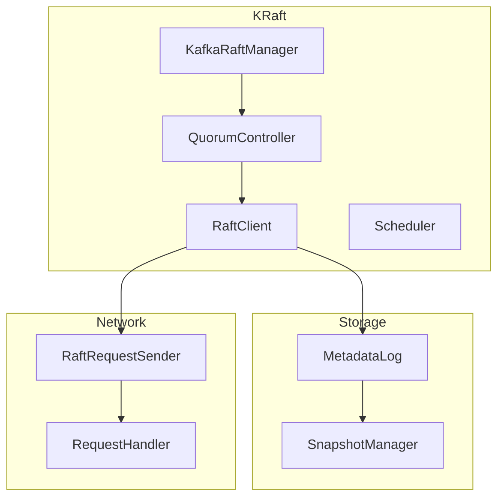
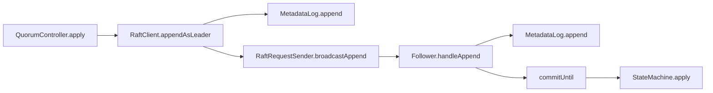
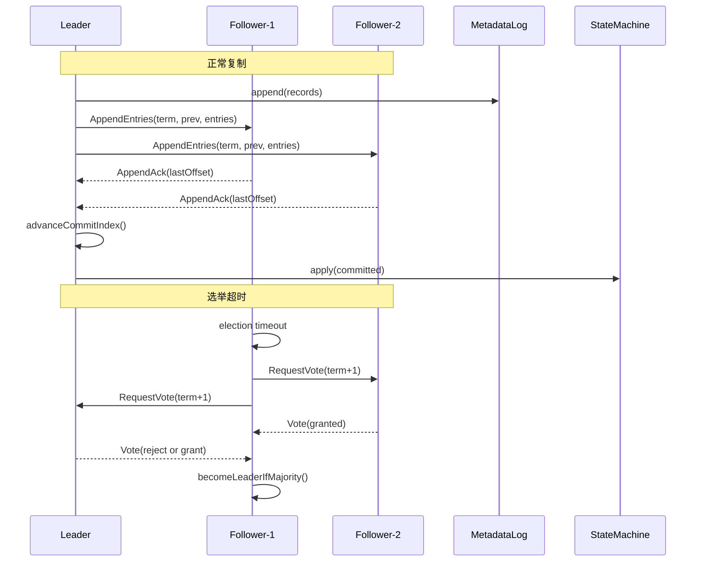
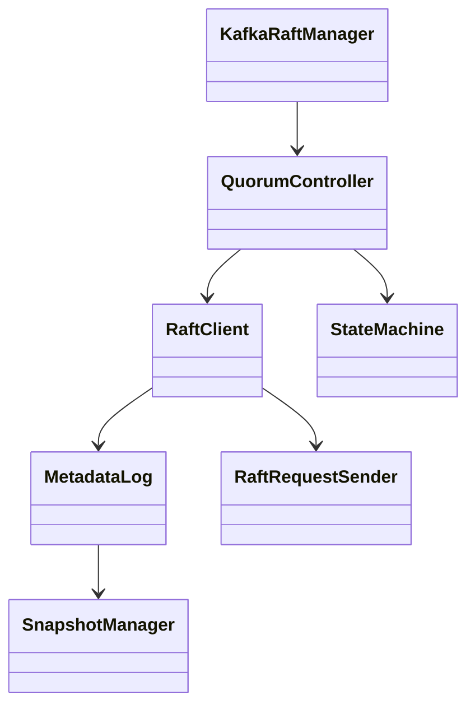

## 概述

Kafka 在 KRaft（Kafka Raft）模式下以内置的一致性层替代 ZooKeeper，负责元数据日志复制、选举与快照。本文聚焦实现细节，补充关键函数核心代码、跨层调用链、时序图、类结构图与相似内容合并说明，使用中性技术表述。

<!--more-->

## 1. 组件架构总览



## 2. 关键函数核心代码与说明（精要）

```java
// Raft 客户端追加元数据条目（摘要）
public CompletableFuture<OffsetAndEpoch> appendAsLeader(List<Record> records, long timeoutMs) {
  if (!role.isLeader()) return CompletableFuture.failedFuture(new NotLeaderException("not leader"));
  CompletableFuture<OffsetAndEpoch> f = new CompletableFuture<>();
  long startTime = time.milliseconds();
  OffsetAndEpoch appended = metadataLog.append(records);
  inflightAppends.put(appended.offset(), f);
  // 触发复制
  requestSender.broadcastAppend(appended);
  scheduler.schedule("append-timeout", () -> {
    if (!f.isDone()) f.completeExceptionally(new TimeoutException("replication timeout"));
  }, timeoutMs);
  return f;
}
```

- 功能：作为 Leader 将记录写入元数据日志并发起复制，返回提交位置的未来结果。
- 边界：领导权变更、超时、磁盘异常与重复提交的处理。

```java
// 选举与角色转换（摘要）
void onElectionTimeout() {
  if (!role.isLeader()) {
    currentTerm += 1;
    votedFor = localId;
    role = Role.CANDIDATE;
    requestSender.broadcastVoteRequest(currentTerm, lastLogOffset(), lastLogTerm());
  }
}
```

- 功能：在超时未收到心跳时发起选举，转换为候选者并广播投票请求。

```java
// 处理来自Leader的AppendEntries（摘要）
AppendResponse handleAppend(AppendRequest req) {
  if (req.term() < currentTerm) return AppendResponse.reject(currentTerm);
  if (log.mismatch(req.prevOffset(), req.prevTerm())) return AppendResponse.reject(currentTerm);
  log.truncateFrom(req.prevOffset()+1);
  log.append(req.entries());
  commitUntil(req.leaderCommit());
  lastLeaderHeartbeatTimeMs = time.milliseconds();
  role = Role.FOLLOWER;
  currentTerm = req.term();
  return AppendResponse.accept(currentTerm, log.lastOffset());
}
```

- 功能：校验前置匹配、截断冲突并追加新条目，推进提交点，保持为 Follower。

```java
// 提交并应用（摘要）
private void commitUntil(long commitOffset) {
  while (lastApplied < Math.min(commitOffset, log.lastOffset())) {
    lastApplied += 1;
    MetadataRecord rec = log.read(lastApplied);
    stateMachine.apply(rec);
  }
}
```

- 功能：将提交的元数据记录应用到状态机（控制器元数据）。

```java
// 快照触发（摘要）
void maybeSnapshot() {
  if (log.sizeInBytes() > snapshotThresholdBytes) {
    Snapshot s = snapshotter.create(lastApplied, stateMachine.snapshot());
    snapshotStore.persist(s);
    log.compactUpTo(s.lastIncludedOffset());
  }
}
```

- 功能：根据阈值生成与持久化快照，并进行日志压缩。

## 3. 调用链（跨层）



## 4. 时序图（选举与复制）



## 5. 类结构图与继承关系（简化）


