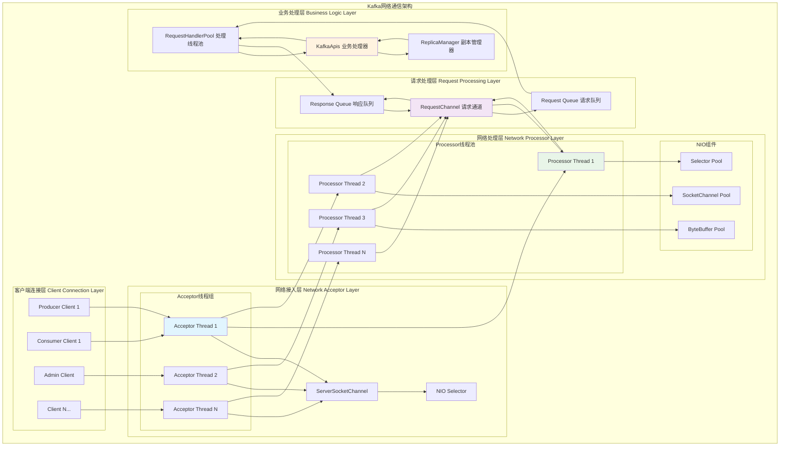
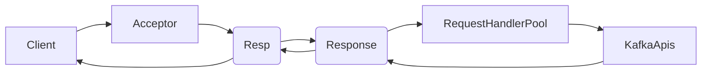
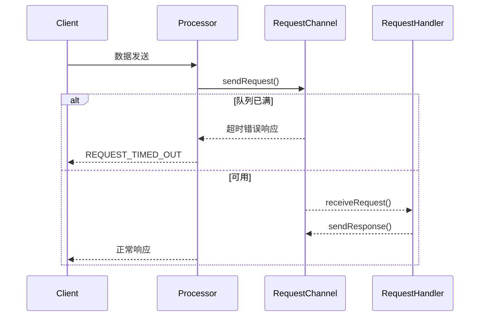
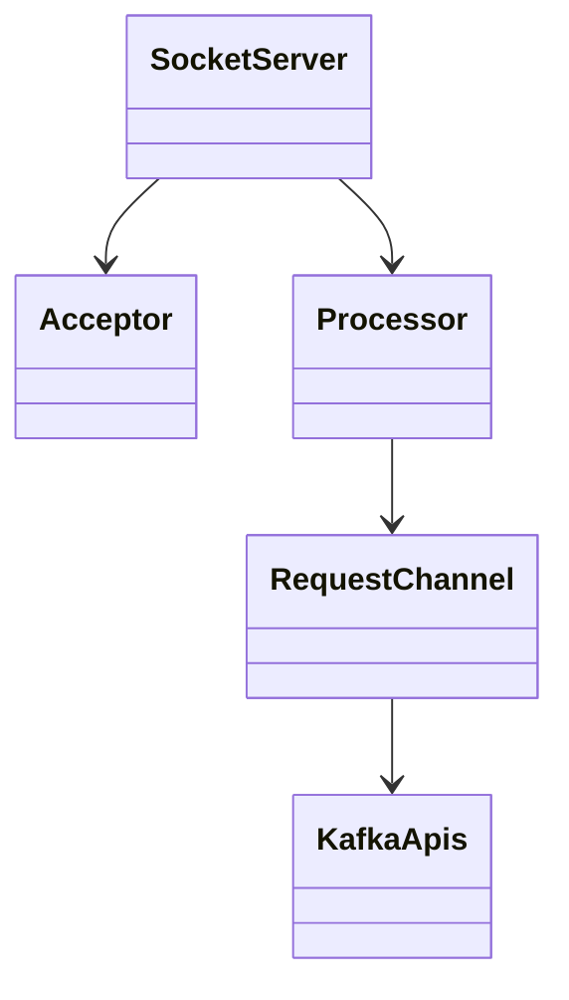

## 概述

Kafka的高性能网络架构是其处理大规模并发连接的关键所在。通过采用NIO（Non-blocking I/O）模型和Reactor设计模式，Kafka实现了高效的网络通信机制。本文网络层的实现原理，揭示其在高并发场景下的技术优势。

<!--more-->

## 1. 网络架构总览

### 1.1 Kafka网络层架构图



### 1.2 Reactor模式在Kafka中的实现

```java
/**
 * Kafka网络层采用Reactor模式的核心设计思想：
 * 
 * 1. Reactor（反应器）：SocketServer作为主反应器
 * 2. Acceptor：专门负责接受新连接的线程
 * 3. Processor：处理I/O事件的工作线程
 * 4. Handler：业务逻辑处理器（KafkaApis）
 * 
 * 优势：
 * - 单线程处理多个连接，避免线程切换开销
 * - 事件驱动模型，高效处理I/O密集型操作
 * - 线程数量可控，不随连接数线性增长
 */
```

## 2. SocketServer网络服务器详解

### 2.1 SocketServer启动流程

```scala
/**
 * SocketServer - Kafka的网络服务器核心实现
 * 通过...实现高性能的多连接处理
 */
class SocketServer(val config: KafkaConfig,
                  val metrics: Metrics,
                  val time: Time,
                  val credentialProvider: CredentialProvider,
                  val apiVersionManager: ApiVersionManager) extends Closeable with Logging {

  // 网络组件映射
  private val acceptors = mutable.Map[EndPoint, Acceptor]()
  private val processors = mutable.Map[Int, Processor]()
  private val dataPlaneRequestChannel: RequestChannel = _
  private val controlPlaneRequestChannel: RequestChannel = _
  
  // 连接管理
  private var connectionQuotas: ConnectionQuotas = _
  private var memoryPool: MemoryPool = _

  /**
   * 启动网络服务器
   * 按照特定顺序初始化各个网络组件
   */
  def startup(startProcessingRequests: Boolean = true,
             controlPlaneListener: Option[EndPoint] = None,
             config: KafkaConfig = this.config): Unit = {
    this.synchronized {
      info("启动SocketServer")
      
      // 1. 初始化连接配额管理器
      connectionQuotas = new ConnectionQuotas(config, time, metrics)
      
      // 2. 初始化内存池
      memoryPool = if (config.queuedMaxBytes > 0) {
        new SimpleMemoryPool(config.queuedMaxBytes, config.socketRequestMaxBytes, false, metrics)
      } else {
        MemoryPool.NONE
      }
      
      // 3. 创建请求通道
      createDataPlaneRequestChannel()
      createControlPlaneRequestChannel(controlPlaneListener)
      
      // 4. 为每个监听器创建网络处理组件
      val dataPlaneListeners = config.dataPlaneListeners
      val controlPlaneListenerOpt = config.controlPlaneListener
      
      dataPlaneListeners.foreach(createNetworkThreads)
      controlPlaneListenerOpt.foreach(createNetworkThreads)
      
      info(s"启动了 ${dataPlaneListeners.size} 个数据平面监听器")
      
      // 5. 启动请求处理（如果需要）
      if (startProcessingRequests) {
        enableRequestProcessing(Map.empty[ListenerName, CompletableFuture[Void]])
      }
    }
  }

  /**
   * 为指定监听器创建网络处理线程
   * 包括一个Acceptor线程和多个Processor线程
   */
  private def createNetworkThreads(endPoint: EndPoint): Unit = {
    val listenerName = endPoint.listenerName
    val securityProtocol = endPoint.securityProtocol
    
    info(s"为监听器 $listenerName 创建网络线程，地址: ${endPoint.host}:${endPoint.port}")
    
    // 创建Processor线程池
    val processors = new ArrayBuffer[Processor]()
    for (i <- 0 until config.numNetworkThreads) {
      val processor = new Processor(
        id = nextProcessorId(),
        requestChannel = if (endPoint == config.controlPlaneListener.get) 
                          controlPlaneRequestChannel else dataPlaneRequestChannel,
        maxRequestSize = config.socketRequestMaxBytes,
        listenerName = listenerName,
        securityProtocol = securityProtocol,
        config = config,
        metrics = metrics,
        time = time,
        credentialProvider = credentialProvider,
        memoryPool = memoryPool,
        logContext = logContext,
        connectionQuotas = connectionQuotas,
        apiVersionManager = apiVersionManager
      )
      
      processors += processor
      this.processors.put(processor.id, processor)
    }
    
    // 创建Acceptor线程
    val acceptor = new Acceptor(
      endPoint = endPoint,
      requestChannel = if (endPoint == config.controlPlaneListener.get) 
                        controlPlaneRequestChannel else dataPlaneRequestChannel,
      sendBufferSize = config.socketSendBufferBytes,
      recvBufferSize = config.socketReceiveBufferBytes,
      maxRequestSize = config.socketRequestMaxBytes,
      processors = processors.toBuffer,
      connectionQuotas = connectionQuotas,
      time = time,
      logContext = logContext
    )
    
    acceptors.put(endPoint, acceptor)
    
    // 启动线程
    Utils.newThread(s"kafka-socket-acceptor-${listenerName.value}-${endPoint.port}", 
                   acceptor, false).start()
    acceptor.awaitStartup()
    
    processors.foreach { processor =>
      Utils.newThread(s"kafka-network-thread-${config.brokerId}-${listenerName.value}-${processor.id}", 
                     processor, false).start()
      processor.awaitStartup()
    }
    
    info(s"为监听器 $listenerName 创建了 1 个Acceptor和 ${processors.size} 个Processor线程")
  }
}
```

## 3. Acceptor连接接受器

### 3.1 Acceptor线程实现

```scala
/**
 * Acceptor - 连接接受器
 * 专门负责接受新的客户端连接并分发给Processor
 */
private[network] class Acceptor(val endPoint: EndPoint,
                               val requestChannel: RequestChannel,
                               val sendBufferSize: Int,
                               val recvBufferSize: Int,
                               val maxRequestSize: Int,
                               processors: Buffer[Processor],
                               connectionQuotas: ConnectionQuotas,
                               time: Time,
                               logContext: LogContext) 
  extends AbstractServerThread(connectionQuotas) with KafkaMetricsGroup {

  // NIO组件
  private val nioSelector = NSelector.open()
  private val serverChannel = openServerSocket(endPoint.host, endPoint.port)
  
  // Processor分发策略
  private val processors = mutable.Set[Processor]() ++= processors
  private var currentProcessorIndex = 0

  /**
   * Acceptor主循环
   * 持续监听新连接并分发给Processor处理
   */
  def run(): Unit = {
    // 注册ServerSocketChannel到Selector，监听ACCEPT事件
    serverChannel.register(nioSelector, SelectionKey.OP_ACCEPT)
    startupComplete()
    
    try {
      while (isRunning) {
        try {
          // 等待连接事件，500ms超时
          val ready = nioSelector.select(500)
          
          if (ready > 0) {
            val keys = nioSelector.selectedKeys()
            val iter = keys.iterator()
            
            while (iter.hasNext && isRunning) {
              try {
                val key = iter.next()
                iter.remove()

                if (key.isAcceptable) {
                  // 处理新连接
                  accept(key).foreach { socketChannel =>
                    debug(s"接受新连接：${socketChannel.socket().getRemoteSocketAddress}")
                    
                    // 轮询分配给Processor
                    val processor = synchronized {
                      currentProcessorIndex = (currentProcessorIndex + 1) % processors.size
                      processors.toSeq(currentProcessorIndex)
                    }
                    
                    // 将连接移交给Processor处理
                    processor.accept(socketChannel, connectionQuotas, 
                                   maybeBlockingMode = true, maybeBlocked = false)
                  }
                } else {
                  throw new IllegalStateException("未识别的SelectionKey状态")
                }
              } catch {
                case e: Throwable => 
                  error("处理连接事件时发生错误", e)
              }
            }
          }
          
        } catch {
          case e: ControlThrowable => throw e
          case e: Throwable => 
            error("Acceptor线程中发生未预期的错误", e)
        }
      }
    } finally {
      debug("关闭Acceptor，清理资源")
      CoreUtils.swallow(serverChannel.close(), this, Level.ERROR)
      CoreUtils.swallow(nioSelector.close(), this, Level.ERROR)
      shutdownComplete()
    }
  }

  /**
   * 接受新的客户端连接
   * 配置Socket参数并进行连接配额检查
   */
  private def accept(key: SelectionKey): Option[SocketChannel] = {
    val serverSocketChannel = key.channel().asInstanceOf[ServerSocketChannel]
    val socketChannel = serverSocketChannel.accept()
    
    try {
      // 连接配额检查
      connectionQuotas.inc(socketChannel.socket().getInetAddress)
      
      // 配置Socket参数
      socketChannel.configureBlocking(false)
      socketChannel.socket().setTcpNoDelay(true)    // 禁用Nagle算法，降低延迟
      socketChannel.socket().setKeepAlive(true)     // 启用TCP keepalive
      
      // 配置发送缓冲区大小
      if (sendBufferSize != Selectable.USE_DEFAULT_BUFFER_SIZE) {
        socketChannel.socket().setSendBufferSize(sendBufferSize)
      }
      
      // 配置接收缓冲区大小
      if (recvBufferSize != Selectable.USE_DEFAULT_BUFFER_SIZE) {
        socketChannel.socket().setReceiveBufferSize(recvBufferSize)
      }
      
      debug(s"成功配置新连接：${socketChannel.socket().getRemoteSocketAddress}")
      Some(socketChannel)
      
    } catch {
      case e: TooManyConnectionsException =>
        info(s"拒绝连接来自 ${socketChannel.socket.getRemoteSocketAddress}：${e.getMessage}")
        close(socketChannel)
        None
        
      case e: Throwable =>
        error(s"配置新连接失败，来自 ${socketChannel.socket.getRemoteSocketAddress}", e)
        close(socketChannel)
        None
    }
  }

  /**
   * 打开服务器Socket
   * 配置服务器监听Socket的参数
   */
  private def openServerSocket(host: String, port: Int): ServerSocketChannel = {
    val socketAddress = if (host == null || host.trim.isEmpty) {
      new InetSocketAddress(port)
    } else {
      new InetSocketAddress(host, port)
    }
    
    val serverChannel = ServerSocketChannel.open()
    serverChannel.configureBlocking(false)
    
    // 配置Socket选项
    if (config.socketReceiveBufferBytes != Selectable.USE_DEFAULT_BUFFER_SIZE) {
      serverChannel.socket().setReceiveBufferSize(config.socketReceiveBufferBytes)
    }
    
    // 启用地址重用
    serverChannel.socket().setReuseAddress(true)
    
    try {
      serverChannel.socket().bind(socketAddress)
      info(s"成功绑定到地址 $socketAddress")
    } catch {
      case e: SocketException =>
        throw new KafkaException(s"Socket服务器无法绑定到 $socketAddress：${e.getMessage}", e)
    }
    
    serverChannel
  }
}
```

## 4. Processor网络处理器

### 4.1 Processor I/O处理循环

```scala
/**
 * Processor - 网络I/O处理器
 * 使用单线程NIO模型处理多个连接的I/O操作
 */
private[network] class Processor(val id: Int,
                                val requestChannel: RequestChannel,
                                val maxRequestSize: Int,
                                val listenerName: ListenerName,
                                val securityProtocol: SecurityProtocol,
                                val config: KafkaConfig,
                                val metrics: Metrics,
                                val time: Time,
                                val credentialProvider: CredentialProvider,
                                val memoryPool: MemoryPool,
                                val logContext: LogContext,
                                val connectionQuotas: ConnectionQuotas,
                                val apiVersionManager: ApiVersionManager)
  extends AbstractServerThread(connectionQuotas) with KafkaMetricsGroup {

  // NIO选择器和连接管理
  private val selector = createSelector()
  private val newConnections = new ConcurrentLinkedQueue[SocketChannel]()
  private val inflightResponses = mutable.Map[String, RequestChannel.Response]()
  
  // 性能指标
  private val avgIdleMeter = newMeter("NetworkProcessorAvgIdlePercent", "percent", TimeUnit.NANOSECONDS)

  /**
   * Processor主循环
   * 处理网络I/O事件的核心逻辑
   */
  override def run(): Unit = {
    startupComplete()
    
    try {
      while (isRunning) {
        try {
          // 记录空闲时间开始
          val startSelectTime = time.nanoseconds()
          
          // 1. 配置新连接
          configureNewConnections()
          
          // 2. 处理响应
          processNewResponses()
          
          // 3. NIO事件轮询
          poll()
          
          // 4. 处理已完成的接收
          processCompletedReceives()
          
          // 5. 处理已完成的发送
          processCompletedSends()
          
          // 6. 处理断开的连接
          processDisconnected()
          
          // 记录空闲时间
          val endSelectTime = time.nanoseconds()
          avgIdleMeter.mark(endSelectTime - startSelectTime)
          
        } catch {
          case e: ControlThrowable => throw e
          case e: Throwable => 
            error("Processor循环中发生未预期的错误", e)
        }
      }
    } finally {
      debug("关闭Processor {}，清理资源", id)
      closeAll()
      shutdownComplete()
    }
  }

  /**
   * 配置新接受的连接
   * 将新连接注册到Selector并设置认证
   */
  private def configureNewConnections(): Unit = {
    var connectionsProcessed = 0
    
    while (connectionsProcessed < 20 && !newConnections.isEmpty) {
      val socketChannel = newConnections.poll()
      if (socketChannel != null) {
        try {
          debug(s"配置新连接：${socketChannel.socket().getRemoteSocketAddress}")
          
          // 生成连接ID
          val connectionId = generateConnectionId(socketChannel)
          
          // 创建KafkaChannel包装SocketChannel
          val kafkaChannel = buildKafkaChannel(connectionId, socketChannel)
          
          // 注册到Selector
          selector.register(connectionId, kafkaChannel)
          
          connectionsProcessed += 1
          
        } catch {
          case e: Throwable =>
            error("配置新连接时发生错误", e)
            close(socketChannel)
        }
      }
    }
  }

  /**
   * 构建KafkaChannel
   * 根据安全协议配置不同类型的通道
   */
  private def buildKafkaChannel(connectionId: String, 
                               socketChannel: SocketChannel): KafkaChannel = {
    
    try {
      val transportLayer = buildTransportLayer(connectionId, socketChannel)
      val authenticator = buildAuthenticator(connectionId, transportLayer)
      
      new KafkaChannel(
        id = connectionId,
        transportLayer = transportLayer,
        authenticator = authenticator,
        maxReceiveSize = maxRequestSize,
        memoryPool = memoryPool,
        metricGrpPrefix = listenerName.value
      )
      
    } catch {
      case e: Exception =>
        error(s"构建KafkaChannel失败，连接: $connectionId", e)
        throw e
    }
  }

  /**
   * 构建传输层
   * 根据安全协议选择不同的传输层实现
   */
  private def buildTransportLayer(connectionId: String, 
                                 socketChannel: SocketChannel): TransportLayer = {
    securityProtocol match {
      case SecurityProtocol.PLAINTEXT =>
        // 明文传输
        new PlaintextTransportLayer(connectionId, socketChannel)
        
      case SecurityProtocol.SSL =>
        // SSL/TLS加密传输
        buildSslTransportLayer(connectionId, socketChannel)
        
      case SecurityProtocol.SASL_PLAINTEXT =>
        // SASL认证 + 明文传输
        buildSaslTransportLayer(connectionId, socketChannel, false)
        
      case SecurityProtocol.SASL_SSL =>
        // SASL认证 + SSL加密传输
        buildSaslTransportLayer(connectionId, socketChannel, true)
        
      case _ =>
        throw new IllegalArgumentException(s"不支持的安全协议: $securityProtocol")
    }
  }

  /**
   * NIO事件轮询
   * 处理就绪的I/O事件
   */
  private def poll(): Unit = {
    try {
      // 轮询I/O事件，1000ms超时
      selector.poll(1000)
      
    } catch {
      case e: IOException =>
        error("NIO轮询发生I/O异常", e)
    }
  }

  /**
   * 处理已完成的数据接收
   * 将完整的请求提交到RequestChannel
   */
  private def processCompletedReceives(): Unit = {
    selector.completedReceives().asScala.foreach { receive =>
      try {
        val connectionId = receive.source()
        val channel = selector.channel(connectionId)
        
        // 解析请求头
        val requestHeader = RequestHeader.parse(receive.payload())
        val apiKey = requestHeader.apiKey()
        val apiVersion = requestHeader.apiVersion()
        
        debug(s"接收到完整请求：连接={}, API={}, 版本={}, 大小={}字节", 
             connectionId, apiKey, apiVersion, receive.payload().limit())
        
        // 验证API版本
        if (!apiVersionManager.isApiEnabled(apiKey, apiVersion)) {
          // 不支持的API版本，发送错误响应
          val errorResponse = new ApiVersionsResponse(
            new ApiVersionsResponseData()
              .setErrorCode(Errors.UNSUPPORTED_VERSION.code())
          )
          
          sendResponse(RequestChannel.Response.fromRequest(receive, errorResponse))
        } else {
          // 创建请求对象
          val request = new RequestChannel.Request(
            processor = id,
            context = new RequestContext(requestHeader, connectionId, channel.socketAddress,
                                       channel.principal(), listenerName, securityProtocol),
            startTimeNanos = time.nanoseconds(),
            memoryPool = memoryPool,
            buffer = receive.payload(),
            metrics = metrics,
            envelope = None
          )
          
          // 提交到请求通道
          requestChannel.sendRequest(request)
        }
        
      } catch {
        case e: InvalidRequestException =>
          warn(s"接收到无效请求，连接: ${receive.source()}", e)
          closeConnection(receive.source())
          
        case e: Throwable =>
          error(s"处理接收数据时发生异常，连接: ${receive.source()}", e)
          closeConnection(receive.source())
      }
    }
  }

  /**
   * 处理已完成的数据发送
   * 清理已发送完成的响应
   */
  private def processCompletedSends(): Unit = {
    selector.completedSends().asScala.foreach { send =>
      val connectionId = send.destination()
      
      // 从in-flight响应中移除
      inflightResponses.remove(connectionId) match {
        case Some(response) =>
          debug(s"响应发送完成：连接={}, 大小={}字节", 
               connectionId, response.responseSize())
          
          // 更新发送指标
          updateSendMetrics(response)
          
        case None =>
          warn(s"完成发送但未找到对应的响应：连接={}", connectionId)
      }
    }
  }

  /**
   * 处理断开的连接
   * 清理连接相关的资源和状态
   */
  private def processDisconnected(): Unit = {
    selector.disconnected().asScala.foreach { connectionId =>
      info(s"连接断开：{}", connectionId)
      
      // 清理in-flight响应
      inflightResponses.remove(connectionId)
      
      // 更新连接指标
      connectionQuotas.dec(getConnectionAddress(connectionId))
      
      // 清理认证状态
      clearAuthenticationState(connectionId)
    }
  }

  /**
   * 处理新的响应
   * 从RequestChannel获取响应并发送给客户端
   */
  private def processNewResponses(): Unit = {
    var currentResponse: RequestChannel.Response = null
    
    while ({currentResponse = requestChannel.receiveResponse(id); currentResponse != null}) {
      val connectionId = currentResponse.request.context.connectionId
      
      try {
        debug(s"处理新响应：连接={}, API={}", 
             connectionId, currentResponse.request.header.apiKey())
        
        // 检查连接是否仍然有效
        if (selector.channel(connectionId) != null) {
          // 序列化响应
          val responseBuffer = serializeResponse(currentResponse)
          
          // 创建NetworkSend
          val responseSend = new NetworkSend(connectionId, responseBuffer)
          
          // 发送响应
          selector.send(responseSend)
          
          // 添加到in-flight响应跟踪
          inflightResponses.put(connectionId, currentResponse)
          
        } else {
          warn(s"尝试向已断开的连接发送响应：{}", connectionId)
        }
        
      } catch {
        case e: Throwable =>
          error(s"处理响应时发生异常，连接: $connectionId", e)
          closeConnection(connectionId)
      }
    }
  }

  /**
   * 序列化响应
   * 将响应对象转换为ByteBuffer
   */
  private def serializeResponse(response: RequestChannel.Response): ByteBuffer = {
    val responseHeader = response.responseHeader()
    val responseBody = response.responseBody()
    
    // 计算响应大小
    val headerSize = responseHeader.sizeOf()
    val bodySize = responseBody.sizeOf(response.request.header.apiVersion())
    val totalSize = headerSize + bodySize
    
    // 分配缓冲区
    val buffer = ByteBuffer.allocate(4 + totalSize) // 4字节长度前缀
    
    // 写入长度前缀
    buffer.putInt(totalSize)
    
    // 序列化响应头
    responseHeader.writeTo(buffer)
    
    // 序列化响应体
    responseBody.writeTo(buffer, response.request.header.apiVersion())
    
    buffer.flip()
    
    trace(s"序列化响应完成：总大小={}字节", buffer.remaining())
    return buffer
  }
}
```

## 5. RequestChannel请求通道

### 5.1 请求通道架构设计

```scala
/**
 * RequestChannel - 网络层和应用层之间的通信桥梁
 * 实现请求和响应的异步传递
 */
class RequestChannel(val queueSize: Int,
                    val numNetworkThreads: Int,
                    val metricNamePrefix: String,
                    val time: Time,
                    val apiVersionManager: ApiVersionManager) extends KafkaMetricsGroup with Closeable {

  import RequestChannel._
  
  // 请求队列 - 网络线程向应用线程传递请求
  private val requestQueue = new ArrayBlockingQueue[Request](queueSize)
  
  // 响应队列 - 每个Processor对应一个响应队列
  private val responseQueues = (0 until numNetworkThreads).map { i =>
    i -> new ArrayBlockingQueue[Response](queueSize)
  }.toMap
  
  // 监控指标
  private val requestQueueSizeHist = newHistogram(metricNamePrefix + "RequestQueueSize")
  private val responseQueueSizeHist = newHistogram(metricNamePrefix + "ResponseQueueSize")
  private val requestQueueTimeHist = newHistogram(metricNamePrefix + "RequestQueueTimeMs")

  /**
   * 发送请求到处理队列
   * 由Processor线程调用，将请求提交给应用线程处理
   */
  def sendRequest(request: Request): Unit = {
    requestQueueSizeHist.update(requestQueue.size())
    
    val requestEnqueueTimeMs = time.milliseconds()
    request.requestEnqueueTimeMs = requestEnqueueTimeMs
    
    try {
      // 尝试将请求加入队列，最多等待300ms
      val success = requestQueue.offer(request, 300, TimeUnit.MILLISECONDS)
      
      if (!success) {
        // 队列已满，发送服务器繁忙响应
        warn("请求队列已满，拒绝新请求：{}", request.header.apiKey())
        
        val throttledResponse = request.buildErrorResponse(Errors.REQUEST_TIMED_OUT)
        sendResponse(throttledResponse)
      }
      
    } catch {
      case e: InterruptedException =>
        warn("发送请求被中断")
        Thread.currentThread().interrupt()
        
      case e: Throwable =>
        error("发送请求时发生异常", e)
        val errorResponse = request.buildErrorResponse(Errors.UNKNOWN_SERVER_ERROR)
        sendResponse(errorResponse)
    }
  }

  /**
   * 接收请求进行处理
   * 由RequestHandler线程调用，从队列获取待处理请求
   */
  def receiveRequest(timeoutMs: Long): Request = {
    try {
      val request = requestQueue.poll(timeoutMs, TimeUnit.MILLISECONDS)
      
      if (request != null) {
        val queueTime = time.milliseconds() - request.requestEnqueueTimeMs
        requestQueueTimeHist.update(queueTime)
        
        debug(s"接收到请求：API={}, 队列时间={}ms", request.header.apiKey(), queueTime)
      }
      
      request
    } catch {
      case e: InterruptedException =>
        debug("接收请求被中断")
        null
    }
  }

  /**
   * 发送响应到网络线程
   * 由RequestHandler线程调用，将响应发送给指定的Processor
   */
  def sendResponse(response: Response): Unit = {
    val processorId = response.processorId()
    val responseQueue = responseQueues(processorId)
    
    responseQueueSizeHist.update(responseQueue.size())
    
    try {
      // 尝试将响应加入对应Processor的响应队列
      val success = responseQueue.offer(response, 300, TimeUnit.MILLISECONDS)
      
      if (!success) {
        warn("Processor {} 的响应队列已满，丢弃响应", processorId)
        // 关闭对应的连接，避免客户端无限等待
        closeConnection(response.request.context.connectionId)
      } else {
        debug(s"发送响应到Processor {}: API={}", processorId, response.request.header.apiKey())
      }
      
    } catch {
      case e: InterruptedException =>
        warn("发送响应被中断")
        Thread.currentThread().interrupt()
        
      case e: Throwable =>
        error("发送响应时发生异常", e)
        closeConnection(response.request.context.connectionId)
    }
  }

  /**
   * 接收响应进行发送
   * 由Processor线程调用，获取需要发送给客户端的响应
   */
  def receiveResponse(processorId: Int): Response = {
    val responseQueue = responseQueues(processorId)
    responseQueue.poll()
  }
}

/**
 * Request - 请求封装类
 * 包含请求的完整信息和上下文
 */
case class Request(processor: Int,
                  context: RequestContext,
                  startTimeNanos: Long,
                  memoryPool: MemoryPool,
                  buffer: ByteBuffer,
                  metrics: RequestChannel.Metrics,
                  envelope: Option[RequestChannel.Request] = None) extends BaseRequest {

  // 请求生命周期时间戳
  @volatile var requestDequeueTimeNanos: Long = -1L
  @volatile var apiLocalCompleteTimeNanos: Long = -1L
  @volatile var responseCompleteTimeNanos: Long = -1L
  @volatile var responseDequeueTimeNanos: Long = -1L
  @volatile var requestEnqueueTimeMs: Long = -1L

  /**
   * 构建成功响应
   */
  def buildResponse(responseBody: AbstractResponse): Response = {
    Response(
      processor = processor,
      request = this,
      responseBody = responseBody,
      onComplete = None
    )
  }

  /**
   * 构建错误响应
   */
  def buildErrorResponse(error: Errors): Response = {
    val errorResponse = body.getErrorResponse(error)
    buildResponse(errorResponse)
  }

  /**
   * 计算请求处理各阶段的延迟
   */
  def requestLatencyMs(): Double = {
    (responseCompleteTimeNanos - startTimeNanos) / 1000000.0
  }

  def requestQueueTimeMs(): Double = {
    (requestDequeueTimeNanos - startTimeNanos) / 1000000.0
  }

  def apiLocalCompleteTimeMs(): Double = {
    (apiLocalCompleteTimeNanos - requestDequeueTimeNanos) / 1000000.0
  }

  def responseQueueTimeMs(): Double = {
    (responseDequeueTimeNanos - responseCompleteTimeNanos) / 1000000.0
  }

  def responseSendTimeMs(): Double = {
    val endTimeNanos = if (responseDequeueTimeNanos == -1L) time.nanoseconds() else responseDequeueTimeNanos
    (endTimeNanos - responseCompleteTimeNanos) / 1000000.0
  }
}
```

## 6. 协议处理与序列化

### 6.1 Kafka协议栈实现

```java
/**
 * Kafka协议处理器
 * 实现Kafka二进制协议的解析和生成
 */
public class KafkaProtocolHandler {
    
    /**
     * 协议消息格式
     * Kafka使用自定义的二进制协议格式
     * 
     * 消息结构：
     * [length:4][request_header][request_body]
     * 
     * 请求头结构：
     * [api_key:2][api_version:2][correlation_id:4][client_id:string]
     * 
     * 响应头结构：
     * [length:4][correlation_id:4][response_body]
     */
    
    /**
     * 解析请求消息
     * 从ByteBuffer中解析出完整的请求对象
     */
    public static RequestChannel.Request parseRequest(ByteBuffer buffer, 
                                                     String connectionId,
                                                     SecurityProtocol securityProtocol) {
        try {
            // 读取消息长度（已经被NetworkClient读取并验证）
            buffer.rewind();
            
            // 解析请求头
            RequestHeader header = RequestHeader.parse(buffer);
            ApiKeys apiKey = header.apiKey();
            short apiVersion = header.apiVersion();
            
            debug("解析请求：API={}, 版本={}, 关联ID={}", 
                 apiKey, apiVersion, header.correlationId());
            
            // 根据API类型解析请求体
            AbstractRequest requestBody;
            switch (apiKey) {
                case PRODUCE:
                    requestBody = ProduceRequest.parse(buffer, apiVersion);
                    break;
                case FETCH:
                    requestBody = FetchRequest.parse(buffer, apiVersion);
                    break;
                case METADATA:
                    requestBody = MetadataRequest.parse(buffer, apiVersion);
                    break;
                case OFFSET_COMMIT:
                    requestBody = OffsetCommitRequest.parse(buffer, apiVersion);
                    break;
                case OFFSET_FETCH:
                    requestBody = OffsetFetchRequest.parse(buffer, apiVersion);
                    break;
                case JOIN_GROUP:
                    requestBody = JoinGroupRequest.parse(buffer, apiVersion);
                    break;
                case HEARTBEAT:
                    requestBody = HeartbeatRequest.parse(buffer, apiVersion);
                    break;
                default:
                    // 使用反射机制解析未明确处理的API
                    requestBody = parseUsingReflection(apiKey, buffer, apiVersion);
            }
            
            // 创建请求上下文
            RequestContext context = new RequestContext(
                header,
                connectionId,
                InetAddress.getByName("unknown"), // 实际实现中会获取真实地址
                KafkaPrincipal.ANONYMOUS,         // 实际实现中会获取认证主体
                ListenerName.forSecurityProtocol(securityProtocol),
                securityProtocol
            );
            
            return new RequestChannel.Request(
                processor = 0, // 实际值由调用者设置
                context = context,
                startTimeNanos = System.nanoTime(),
                memoryPool = MemoryPool.NONE,
                buffer = buffer,
                metrics = null
            );
            
        } catch (Exception e) {
            error("解析请求时发生异常", e);
            throw new InvalidRequestException("无法解析请求", e);
        }
    }
    
    /**
     * 序列化响应消息
     * 将响应对象序列化为ByteBuffer
     */
    public static ByteBuffer serializeResponse(RequestChannel.Response response) {
        try {
            RequestHeader requestHeader = response.request.header;
            AbstractResponse responseBody = response.responseBody();
            
            // 创建响应头
            ResponseHeader responseHeader = new ResponseHeader(
                requestHeader.correlationId()
            );
            
            // 计算响应大小
            int headerSize = responseHeader.sizeOf();
            int bodySize = responseBody.sizeOf(requestHeader.apiVersion());
            int totalSize = headerSize + bodySize;
            
            // 分配缓冲区（包含4字节长度前缀）
            ByteBuffer buffer = ByteBuffer.allocate(4 + totalSize);
            
            // 写入消息长度
            buffer.putInt(totalSize);
            
            // 序列化响应头
            responseHeader.writeTo(buffer);
            
            // 序列化响应体
            responseBody.writeTo(buffer, requestHeader.apiVersion());
            
            buffer.flip();
            
            debug("序列化响应完成：API={}, 大小={}字节", 
                 requestHeader.apiKey(), buffer.remaining());
            
            return buffer;
            
        } catch (Exception e) {
            error("序列化响应时发生异常", e);
            throw new RuntimeException("响应序列化失败", e);
        }
    }
    
    /**
     * 协议版本协商
     * 处理客户端和服务端的API版本协商
     */
    public static class ProtocolVersionNegotiation {
        
        /**
         * 处理ApiVersions请求
         * 返回服务端支持的所有API版本信息
         */
        public static ApiVersionsResponse handleApiVersionsRequest(ApiVersionsRequest request) {
            ApiVersionsResponseData responseData = new ApiVersionsResponseData();
            
            // 添加所有支持的API版本信息
            for (ApiKeys apiKey : ApiKeys.values()) {
                if (apiKey.isVersionSupported()) {
                    ApiVersionsResponseData.ApiVersion apiVersion = 
                        new ApiVersionsResponseData.ApiVersion()
                            .setApiKey(apiKey.id)
                            .setMinVersion(apiKey.oldestVersion())
                            .setMaxVersion(apiKey.latestVersion());
                    
                    responseData.apiKeys().add(apiVersion);
                }
            }
            
            // 设置服务端信息
            responseData.setThrottleTimeMs(0);
            responseData.setErrorCode(Errors.NONE.code());
            
            debug("返回API版本信息，支持 {} 个API", responseData.apiKeys().size());
            
            return new ApiVersionsResponse(responseData);
        }
        
        /**
         * 验证API版本兼容性
         * 检查客户端请求的API版本是否被服务端支持
         */
        public static boolean isVersionSupported(ApiKeys apiKey, short version) {
            if (!apiKey.isVersionSupported()) {
                return false;
            }
            
            return version >= apiKey.oldestVersion() && version <= apiKey.latestVersion();
        }
        
        /**
         * 获取兼容的API版本
         * 在客户端和服务端版本不匹配时，选择兼容的版本
         */
        public static short getCompatibleVersion(ApiKeys apiKey, 
                                               short requestedVersion, 
                                               short serverMinVersion,
                                               short serverMaxVersion) {
            
            if (requestedVersion >= serverMinVersion && requestedVersion <= serverMaxVersion) {
                // 请求版本在支持范围内
                return requestedVersion;
            } else if (requestedVersion < serverMinVersion) {
                // 请求版本过低，使用服务端最小版本
                warn("API {} 请求版本 {} 低于服务端最小版本 {}，使用最小版本", 
                    apiKey, requestedVersion, serverMinVersion);
                return serverMinVersion;
            } else {
                // 请求版本过高，使用服务端最大版本
                warn("API {} 请求版本 {} 高于服务端最大版本 {}，使用最大版本", 
                    apiKey, requestedVersion, serverMaxVersion);
                return serverMaxVersion;
            }
        }
    }
}
```

## 7. 网络安全与认证

### 7.1 SSL/TLS实现

```scala
/**
 * SSL传输层实现
 * 提供加密的网络通信能力
 */
class SslTransportLayer(val connectionId: String,
                       val key: SelectionKey,
                       val sslEngine: SSLEngine,
                       val metricGrpPrefix: String) extends TransportLayer with Logging {

  // SSL缓冲区
  private var netReadBuffer: ByteBuffer = _
  private var netWriteBuffer: ByteBuffer = _
  private var appReadBuffer: ByteBuffer = _
  
  // SSL握手状态
  private var handshakeComplete = false
  private var closing = false

  /**
   * SSL握手处理
   * 实现SSL/TLS握手的完整流程
   */
  def doHandshake(): Unit = {
    if (handshakeComplete) {
      return
    }
    
    debug(s"开始SSL握手：{}", connectionId)
    
    try {
      val handshakeStatus = sslEngine.getHandshakeStatus
      
      handshakeStatus match {
        case HandshakeStatus.NEED_TASK =>
          // 执行SSL引擎任务
          runDelegatedTasks()
          
        case HandshakeStatus.NEED_WRAP =>
          // 需要发送握手数据
          if (netWriteBuffer.hasRemaining) {
            flushNetWriteBuffer()
          }
          wrap()
          
        case HandshakeStatus.NEED_UNWRAP =>
          // 需要接收握手数据
          if (netReadBuffer.position() == 0) {
            readFromSocketChannel()
          }
          unwrap()
          
        case HandshakeStatus.FINISHED =>
          // 握手完成
          handshakeComplete = true
          info(s"SSL握手完成：{}, 协议={}, 密码套件={}", 
              connectionId, 
              sslEngine.getSession.getProtocol,
              sslEngine.getSession.getCipherSuite)
          
        case HandshakeStatus.NOT_HANDSHAKING =>
          // 握手未开始或已完成
          handshakeComplete = true
      }
      
    } catch {
      case e: SSLException =>
        error(s"SSL握手失败：{}", connectionId, e)
        throw e
    }
  }

  /**
   * SSL数据加密写入
   * 将应用数据加密后写入网络
   */
  override def write(buffer: ByteBuffer): Long = {
    if (!handshakeComplete) {
      doHandshake()
      return 0
    }
    
    var bytesWritten = 0L
    
    try {
      // 确保有足够的网络写缓冲区空间
      if (netWriteBuffer.hasRemaining) {
        bytesWritten += flushNetWriteBuffer()
      }
      
      // 加密应用数据
      while (buffer.hasRemaining && !netWriteBuffer.hasRemaining) {
        netWriteBuffer.clear()
        
        val result = sslEngine.wrap(buffer, netWriteBuffer)
        netWriteBuffer.flip()
        
        result.getStatus match {
          case Status.OK =>
            // 加密成功，写入网络
            bytesWritten += flushNetWriteBuffer()
            
          case Status.BUFFER_OVERFLOW =>
            // 网络缓冲区不足，扩展缓冲区
            expandNetWriteBuffer()
            
          case Status.BUFFER_UNDERFLOW =>
            // 应用缓冲区数据不足（不应该发生在写入时）
            throw new SSLException("写入时遇到BUFFER_UNDERFLOW")
            
          case Status.CLOSED =>
            throw new SSLException("SSL连接已关闭")
        }
      }
      
      trace(s"SSL写入 {} 字节到连接 {}", bytesWritten, connectionId)
      bytesWritten
      
    } catch {
      case e: IOException =>
        error(s"SSL写入失败：{}", connectionId, e)
        throw e
    }
  }

  /**
   * SSL数据解密读取
   * 从网络读取加密数据并解密
   */
  override def read(buffer: ByteBuffer): Long = {
    if (!handshakeComplete) {
      doHandshake()
      return 0
    }
    
    var bytesRead = 0L
    
    try {
      // 确保有网络数据可解密
      if (netReadBuffer.position() == 0) {
        readFromSocketChannel()
      }
      
      // 解密数据到应用缓冲区
      while (netReadBuffer.hasRemaining && buffer.hasRemaining) {
        appReadBuffer.clear()
        
        val result = sslEngine.unwrap(netReadBuffer, appReadBuffer)
        appReadBuffer.flip()
        
        result.getStatus match {
          case Status.OK =>
            // 解密成功，复制到目标缓冲区
            val decryptedBytes = Math.min(appReadBuffer.remaining(), buffer.remaining())
            val originalLimit = appReadBuffer.limit()
            
            if (decryptedBytes < appReadBuffer.remaining()) {
              appReadBuffer.limit(appReadBuffer.position() + decryptedBytes)
            }
            
            buffer.put(appReadBuffer)
            appReadBuffer.limit(originalLimit)
            bytesRead += decryptedBytes
            
          case Status.BUFFER_OVERFLOW =>
            // 应用缓冲区不足，扩展缓冲区
            expandAppReadBuffer()
            
          case Status.BUFFER_UNDERFLOW =>
            // 网络数据不足，需要读取更多数据
            compactNetReadBuffer()
            readFromSocketChannel()
            
          case Status.CLOSED =>
            throw new SSLException("SSL连接已关闭")
        }
      }
      
      trace(s"SSL读取 {} 字节从连接 {}", bytesRead, connectionId)
      bytesRead
      
    } catch {
      case e: IOException =>
        error(s"SSL读取失败：{}", connectionId, e)
        throw e
    }
  }

  /**
   * 从Socket通道读取数据
   */
  private def readFromSocketChannel(): Long = {
    val socketChannel = key.channel().asInstanceOf[SocketChannel]
    
    try {
      val bytesRead = socketChannel.read(netReadBuffer)
      
      if (bytesRead < 0) {
        // 连接已关闭
        throw new EOFException("连接已被对端关闭")
      }
      
      trace(s"从Socket读取 {} 字节", bytesRead)
      bytesRead
      
    } catch {
      case e: IOException =>
        debug(s"从Socket读取数据失败：{}", connectionId, e)
        throw e
    }
  }

  /**
   * 将数据刷新到Socket通道
   */
  private def flushNetWriteBuffer(): Long = {
    val socketChannel = key.channel().asInstanceOf[SocketChannel]
    
    try {
      val bytesWritten = socketChannel.write(netWriteBuffer)
      
      trace(s"向Socket写入 {} 字节", bytesWritten)
      bytesWritten
      
    } catch {
      case e: IOException =>
        debug(s"向Socket写入数据失败：{}", connectionId, e)
        throw e
    }
  }
}

/**
 * SASL认证实现
 * 支持多种SASL机制的身份认证
 */
class SaslAuthenticator(val connectionId: String,
                       val jaasContext: JaasContext,
                       val saslMechanism: String,
                       val handshakeRequestEnable: Boolean,
                       val credentialProvider: CredentialProvider) extends Authenticator with Logging {

  // SASL状态
  private var saslServer: SaslServer = _
  private var authenticationComplete = false
  private var principal: KafkaPrincipal = KafkaPrincipal.ANONYMOUS

  /**
   * SASL认证处理
   * 实现SASL认证的完整流程
   */
  override def authenticate(): Unit = {
    if (authenticationComplete) {
      return
    }
    
    try {
      saslMechanism match {
        case "PLAIN" =>
          authenticatePlain()
        case "SCRAM-SHA-256" =>
          authenticateScram()
        case "GSSAPI" =>
          authenticateGssapi()
        case "OAUTHBEARER" =>
          authenticateOAuthBearer()
        case _ =>
          throw new IllegalArgumentException(s"不支持的SASL机制: $saslMechanism")
      }
      
    } catch {
      case e: SaslAuthenticationException =>
        error(s"SASL认证失败：连接={}, 机制={}", connectionId, saslMechanism, e)
        throw e
    }
  }

  /**
   * PLAIN机制认证
   * 用户名密码认证的简单实现
   */
  private def authenticatePlain(): Unit = {
    if (saslServer == null) {
      // 创建SASL服务器
      saslServer = Sasl.createSaslServer(
        saslMechanism,
        "kafka",
        config.saslKerberosServiceName,
        props,
        new PlainServerCallbackHandler()
      )
    }
    
    // 处理SASL挑战-响应
    handleSaslToken()
    
    if (saslServer.isComplete) {
      // 认证完成，获取认证主体
      val authorizationId = saslServer.getAuthorizationID
      principal = new KafkaPrincipal(KafkaPrincipal.USER_TYPE, authorizationId)
      authenticationComplete = true
      
      info(s"PLAIN认证成功：连接={}, 用户={}", connectionId, authorizationId)
    }
  }

  /**
   * SCRAM认证实现
   * 支持SCRAM-SHA-256机制的挑战-响应认证
   */
  private def authenticateScram(): Unit = {
    if (saslServer == null) {
      // 创建SCRAM SASL服务器
      val scramMechanisms = ScramMechanism.mechanismNames()
      if (!scramMechanisms.contains(saslMechanism)) {
        throw new UnsupportedSaslMechanismException(s"不支持的SCRAM机制: $saslMechanism")
      }
      
      saslServer = Sasl.createSaslServer(
        saslMechanism,
        "kafka", 
        config.saslKerberosServiceName,
        getScramServerProperties(),
        new ScramServerCallbackHandler(credentialProvider)
      )
    }
    
    // 处理SCRAM挑战-响应流程
    handleSaslToken()
    
    if (saslServer.isComplete) {
      val authorizationId = saslServer.getAuthorizationID
      principal = new KafkaPrincipal(KafkaPrincipal.USER_TYPE, authorizationId)
      authenticationComplete = true
      
      info(s"SCRAM认证成功：连接={}, 用户={}", connectionId, authorizationId)
    }
  }

  /**
   * 处理SASL令牌交换
   * 实现SASL机制的挑战-响应协议
   */
  private def handleSaslToken(): Unit = {
    // 读取客户端发送的SASL令牌
    val clientTokenBytes = readSaslToken()
    
    if (clientTokenBytes != null) {
      try {
        // 处理客户端令牌并生成服务端响应
        val serverTokenBytes = saslServer.evaluateResponse(clientTokenBytes)
        
        // 发送服务端响应令牌（如果有）
        if (serverTokenBytes != null) {
          sendSaslToken(serverTokenBytes)
        }
        
        debug(s"处理SASL令牌：连接={}, 客户端令牌大小={}, 服务端令牌大小={}", 
             connectionId, 
             clientTokenBytes.length, 
             if (serverTokenBytes != null) serverTokenBytes.length else 0)
        
      } catch {
        case e: SaslException =>
          error(s"处理SASL令牌失败：连接={}", connectionId, e)
          throw new SaslAuthenticationException("SASL令牌处理失败", e)
      }
    }
  }
}
```

## 8. 连接管理与配额控制

### 8.1 连接配额管理

```scala
/**
 * ConnectionQuotas - 连接配额管理器
 * 防止单个IP地址创建过多连接，保护服务器资源
 */
class ConnectionQuotas(val config: KafkaConfig, 
                      val time: Time, 
                      val metrics: Metrics) extends Logging {

  // 连接计数映射：IP地址 -> 连接数
  private val connectionsPerIp = new mutable.HashMap[InetAddress, Int]()
  private val lock = new Object()
  
  // 配置参数
  private val maxConnectionsPerIp = config.maxConnectionsPerIp
  private val maxConnectionsPerIpOverrides = config.maxConnectionsPerIpOverrides
  private val maxConnections = config.maxConnections
  private val totalConnections = new AtomicInteger(0)

  /**
   * 增加连接计数
   * 在接受新连接时检查配额限制
   */
  def inc(address: InetAddress): Unit = {
    lock.synchronized {
      // 检查总连接数限制
      val current = totalConnections.get()
      if (current >= maxConnections) {
        throw new TooManyConnectionsException(
          s"达到最大连接数限制: $current >= $maxConnections")
      }
      
      // 检查单IP连接数限制
      val currentIpConnections = connectionsPerIp.getOrElse(address, 0)
      val maxForIp = maxConnectionsPerIpOverrides.getOrElse(address.getHostAddress, maxConnectionsPerIp)
      
      if (currentIpConnections >= maxForIp) {
        throw new TooManyConnectionsException(
          s"IP地址 ${address.getHostAddress} 达到最大连接数限制: $currentIpConnections >= $maxForIp")
      }
      
      // 更新连接计数
      connectionsPerIp.put(address, currentIpConnections + 1)
      totalConnections.incrementAndGet()
      
      debug(s"接受新连接：IP={}, 当前IP连接数={}, 总连接数={}", 
           address.getHostAddress, currentIpConnections + 1, totalConnections.get())
    }
  }

  /**
   * 减少连接计数
   * 在连接关闭时释放配额
   */
  def dec(address: InetAddress): Unit = {
    lock.synchronized {
      connectionsPerIp.get(address) match {
        case Some(count) =>
          if (count == 1) {
            connectionsPerIp.remove(address)
          } else {
            connectionsPerIp.put(address, count - 1)
          }
          
          totalConnections.decrementAndGet()
          
          debug(s"关闭连接：IP={}, 剩余IP连接数={}, 总连接数={}", 
               address.getHostAddress, count - 1, totalConnections.get())
          
        case None =>
          warn(s"尝试减少不存在的IP连接计数: {}", address.getHostAddress)
      }
    }
  }

  /**
   * 获取连接统计信息
   */
  def getConnectionStats(): ConnectionStats = {
    lock.synchronized {
      val ipConnectionCounts = connectionsPerIp.toMap
      val totalCount = totalConnections.get()
      
      // 计算统计信息
      val maxIpConnections = if (ipConnectionCounts.nonEmpty) {
        ipConnectionCounts.values.max
      } else {
        0
      }
      
      val avgConnectionsPerIp = if (ipConnectionCounts.nonEmpty) {
        totalCount.toDouble / ipConnectionCounts.size
      } else {
        0.0
      }
      
      ConnectionStats(
        totalConnections = totalCount,
        connectionsPerIp = ipConnectionCounts,
        maxConnectionsPerIp = maxIpConnections,
        avgConnectionsPerIp = avgConnectionsPerIp
      )
    }
  }
}

/**
 * 连接健康监控
 * 监控连接质量和网络状况
 */
class ConnectionHealthMonitor(val metrics: Metrics) extends KafkaMetricsGroup {
  
  // 连接指标
  private val connectionCreateRate = newMeter("ConnectionCreatedPerSec", "connections", TimeUnit.SECONDS)
  private val connectionCloseRate = newMeter("ConnectionClosedPerSec", "connections", TimeUnit.SECONDS)
  private val networkExceptionRate = newMeter("NetworkExceptionPerSec", "exceptions", TimeUnit.SECONDS)
  
  // 延迟指标
  private val connectionSetupTimeHist = newHistogram("ConnectionSetupTimeMs")
  private val requestLatencyHist = newHistogram("RequestNetworkLatencyMs")
  
  /**
   * 记录连接创建
   */
  def recordConnectionCreated(setupTimeMs: Long): Unit = {
    connectionCreateRate.record()
    connectionSetupTimeHist.update(setupTimeMs)
  }
  
  /**
   * 记录连接关闭
   */
  def recordConnectionClosed(reason: String): Unit = {
    connectionCloseRate.record()
    debug("连接关闭：原因={}", reason)
  }
  
  /**
   * 记录网络异常
   */
  def recordNetworkException(exception: Exception): Unit = {
    networkExceptionRate.record()
    debug("网络异常：{}", exception.getMessage)
  }
  
  /**
   * 记录请求网络延迟
   */
  def recordRequestLatency(latencyMs: Long): Unit = {
    requestLatencyHist.update(latencyMs)
  }
  
  /**
   * 获取网络健康报告
   */
  def getHealthReport(): NetworkHealthReport = {
    val connectionCreateRateValue = connectionCreateRate.metricValue()
    val connectionCloseRateValue = connectionCloseRate.metricValue()
    val exceptionRateValue = networkExceptionRate.metricValue()
    val avgLatency = requestLatencyHist.metricValue()
    
    // 评估网络健康状况
    val healthStatus = if (exceptionRateValue > 10) {
      NetworkHealthStatus.CRITICAL
    } else if (avgLatency > 100) {
      NetworkHealthStatus.WARNING  
    } else {
      NetworkHealthStatus.HEALTHY
    }
    
    NetworkHealthReport(
      status = healthStatus,
      connectionCreateRate = connectionCreateRateValue,
      connectionCloseRate = connectionCloseRateValue,
      networkExceptionRate = exceptionRateValue,
      avgRequestLatency = avgLatency
    )
  }
}
```

## 9. 网络性能优化技术

### 9.1 NIO优化策略

```java
/**
 * NIO性能优化策略
 * 针对高并发场景的网络优化技术
 */
public class NIOOptimizationStrategies {
    
    /**
     * Selector优化
     * 减少Selector操作的开销，提高轮询效率
     */
    public static class SelectorOptimization {
        
        private static final int SELECTOR_RECREATION_THRESHOLD = 512; // Selector重建阈值
        private int selectLoopCount = 0;
        
        /**
         * 优化的Selector轮询
         * 避免空轮询bug，定期重建Selector
         */
        public int optimizedSelect(Selector selector, long timeoutMs) throws IOException {
            long startTime = System.currentTimeMillis();
            
            int readyChannels = selector.select(timeoutMs);
            
            long elapsedTime = System.currentTimeMillis() - startTime;
            
            if (readyChannels == 0 && elapsedTime < timeoutMs / 2) {
                // 可能遇到空轮询bug
                selectLoopCount++;
                
                if (selectLoopCount >= SELECTOR_RECREATION_THRESHOLD) {
                    info("检测到可能的Selector空轮询，重建Selector");
                    rebuildSelector(selector);
                    selectLoopCount = 0;
                }
            } else {
                selectLoopCount = 0;
            }
            
            return readyChannels;
        }
        
        /**
         * 重建Selector
         * 解决某些JVM版本的Selector空轮询bug
         */
        private Selector rebuildSelector(Selector oldSelector) throws IOException {
            Selector newSelector = Selector.open();
            
            // 将所有通道重新注册到新Selector
            for (SelectionKey key : oldSelector.keys()) {
                if (key.isValid()) {
                    SelectableChannel channel = key.channel();
                    Object attachment = key.attachment();
                    
                    // 取消旧注册
                    key.cancel();
                    
                    // 重新注册到新Selector
                    channel.register(newSelector, key.interestOps(), attachment);
                }
            }
            
            // 关闭旧Selector
            oldSelector.close();
            
            info("Selector重建完成，迁移了 {} 个通道", newSelector.keys().size());
            return newSelector;
        }
    }
    
    /**
     * ByteBuffer优化
     * 高效的缓冲区管理和重用机制
     */
    public static class ByteBufferOptimization {
        
        // 缓冲区池，按大小分级
        private final Map<Integer, Queue<ByteBuffer>> bufferPools = new ConcurrentHashMap<>();
        private final int[] poolSizes = {1024, 4096, 16384, 65536, 262144}; // 1KB到256KB
        
        /**
         * 获取优化的缓冲区
         * 从池中获取或创建新的缓冲区
         */
        public ByteBuffer getOptimizedBuffer(int size) {
            // 找到最接近的池大小
            int poolSize = findBestPoolSize(size);
            
            Queue<ByteBuffer> pool = bufferPools.computeIfAbsent(poolSize, 
                k -> new ConcurrentLinkedQueue<>());
            
            ByteBuffer buffer = pool.poll();
            if (buffer == null) {
                // 池中无可用缓冲区，创建新的
                buffer = ByteBuffer.allocateDirect(poolSize);
                debug("创建新的直接缓冲区，大小: {} 字节", poolSize);
            } else {
                // 重用池中的缓冲区
                buffer.clear();
                debug("重用池中的缓冲区，大小: {} 字节", poolSize);
            }
            
            // 限制缓冲区大小为实际需要的大小
            if (buffer.capacity() > size) {
                buffer.limit(size);
            }
            
            return buffer;
        }
        
        /**
         * 归还缓冲区到池中
         */
        public void returnBuffer(ByteBuffer buffer) {
            if (buffer.isDirect()) {
                int capacity = buffer.capacity();
                
                // 只归还标准大小的缓冲区
                if (isStandardPoolSize(capacity)) {
                    Queue<ByteBuffer> pool = bufferPools.get(capacity);
                    if (pool != null && pool.size() < 64) { // 限制池大小
                        buffer.clear();
                        pool.offer(buffer);
                        debug("归还缓冲区到池中，大小: {} 字节", capacity);
                    }
                }
            }
        }
        
        /**
         * 找到最适合的池大小
         */
        private int findBestPoolSize(int size) {
            for (int poolSize : poolSizes) {
                if (size <= poolSize) {
                    return poolSize;
                }
            }
            // 超过最大池大小，返回实际大小
            return size;
        }
        
        /**
         * 检查是否为标准池大小
         */
        private boolean isStandardPoolSize(int size) {
            for (int poolSize : poolSizes) {
                if (size == poolSize) {
                    return true;
                }
            }
            return false;
        }
    }
    
    /**
     * 网络调优参数
     * 系统级别的网络性能优化配置
     */
    public static class NetworkTuningParameters {
        
        /**
         * 获取推荐的Socket配置
         */
        public static SocketConfig getRecommendedSocketConfig(WorkloadType workloadType) {
            SocketConfig.Builder configBuilder = new SocketConfig.Builder();
            
            switch (workloadType) {
                case HIGH_THROUGHPUT:
                    // 高吞吐量优化
                    configBuilder
                        .socketSendBufferSize(128 * 1024)      // 128KB发送缓冲区
                        .socketReceiveBufferSize(128 * 1024)   // 128KB接收缓冲区
                        .tcpNoDelay(false)                     // 启用Nagle算法，提高网络效率
                        .socketKeepAlive(true)                 // 启用keepalive
                        .socketLingerSeconds(0);               // 立即关闭连接
                    break;
                    
                case LOW_LATENCY:
                    // 低延迟优化
                    configBuilder
                        .socketSendBufferSize(32 * 1024)       // 32KB发送缓冲区
                        .socketReceiveBufferSize(32 * 1024)    // 32KB接收缓冲区
                        .tcpNoDelay(true)                      // 禁用Nagle算法
                        .socketKeepAlive(true)
                        .socketLingerSeconds(-1);              // 默认关闭行为
                    break;
                    
                case BALANCED:
                default:
                    // 平衡配置
                    configBuilder
                        .socketSendBufferSize(64 * 1024)       // 64KB发送缓冲区
                        .socketReceiveBufferSize(64 * 1024)    // 64KB接收缓冲区
                        .tcpNoDelay(true)                      // 禁用Nagle算法
                        .socketKeepAlive(true)
                        .socketLingerSeconds(0);
                    break;
            }
            
            return configBuilder.build();
        }
        
        /**
         * 系统级别的网络调优建议
         */
        public static List<String> getSystemTuningRecommendations() {
            List<String> recommendations = new ArrayList<>();
            
            // TCP参数调优
            recommendations.add("echo 'net.core.rmem_max = 16777216' >> /etc/sysctl.conf");
            recommendations.add("echo 'net.core.wmem_max = 16777216' >> /etc/sysctl.conf");
            recommendations.add("echo 'net.ipv4.tcp_rmem = 4096 65536 16777216' >> /etc/sysctl.conf");
            recommendations.add("echo 'net.ipv4.tcp_wmem = 4096 65536 16777216' >> /etc/sysctl.conf");
            
            // 连接数相关参数
            recommendations.add("echo 'net.core.netdev_max_backlog = 5000' >> /etc/sysctl.conf");
            recommendations.add("echo 'net.core.somaxconn = 1024' >> /etc/sysctl.conf");
            recommendations.add("echo 'net.ipv4.tcp_max_syn_backlog = 8192' >> /etc/sysctl.conf");
            
            // TCP拥塞控制
            recommendations.add("echo 'net.ipv4.tcp_congestion_control = bbr' >> /etc/sysctl.conf");
            
            // 文件描述符限制
            recommendations.add("echo '* soft nofile 65536' >> /etc/security/limits.conf");
            recommendations.add("echo '* hard nofile 65536' >> /etc/security/limits.conf");
            
            return recommendations;
        }
    }
}
```

## 10. 网络故障处理与监控

### 10.1 网络故障检测与恢复

```scala
/**
 * NetworkFailureDetector - 网络故障检测器
 * 主动检测网络连接问题并采取恢复措施
 */
class NetworkFailureDetector(val config: KafkaConfig,
                           val time: Time,
                           val metrics: Metrics) extends Logging {

  // 故障检测配置
  private val heartbeatIntervalMs = config.connectionsMaxIdleMs / 4
  private val connectionMaxIdleMs = config.connectionsMaxIdleMs
  private val retryBackoffMs = config.retryBackoffMs
  
  // 连接状态跟踪
  private val connectionStates = new ConcurrentHashMap[String, ConnectionState]()

  /**
   * 检测连接健康状况
   * 定期检查连接的活跃度和响应性
   */
  def detectConnectionHealth(): Unit = {
    val currentTimeMs = time.milliseconds()
    val unhealthyConnections = new ArrayList[String]()
    
    connectionStates.forEach { (connectionId, state) =>
      val idleTime = currentTimeMs - state.lastActivityTime
      
      // 检查连接是否空闲过久
      if (idleTime > connectionMaxIdleMs) {
        warn(s"连接 {} 空闲时间过长：{}ms > {}ms", connectionId, idleTime, connectionMaxIdleMs)
        unhealthyConnections.add(connectionId)
        
      } else if (idleTime > heartbeatIntervalMs && !state.heartbeatSent) {
        // 发送心跳检测连接活跃度
        sendConnectionHeartbeat(connectionId, state)
      }
    }
    
    // 关闭不健康的连接
    unhealthyConnections.forEach(this::closeUnhealthyConnection)
  }

  /**
   * 发送连接心跳
   * 通过发送小的探测消息检测连接状态
   */
  private def sendConnectionHeartbeat(connectionId: String, state: ConnectionState): Unit = {
    try {
      // 构建简单的心跳消息
      val heartbeatRequest = new ApiVersionsRequest.Builder().build()
      val heartbeatBytes = serializeRequest(heartbeatRequest)
      
      // 发送心跳
      selector.send(new NetworkSend(connectionId, heartbeatBytes))
      
      state.heartbeatSent = true
      state.heartbeatSentTime = time.milliseconds()
      
      debug(s"发送心跳到连接：{}", connectionId)
      
    } catch {
      case e: Exception =>
        error(s"发送心跳失败：连接={}", connectionId, e)
        closeUnhealthyConnection(connectionId)
    }
  }

  /**
   * 关闭不健康的连接
   */
  private def closeUnhealthyConnection(connectionId: String): Unit = {
    try {
      selector.close(connectionId)
      connectionStates.remove(connectionId)
      
      info(s"关闭不健康连接：{}", connectionId)
      
      // 更新监控指标
      metrics.recordConnectionClosed("health_check_failed")
      
    } catch {
      case e: Exception =>
        error(s"关闭连接失败：{}", connectionId, e)
    }
  }

  /**
   * 连接状态类
   */
  private case class ConnectionState(
    var lastActivityTime: Long,      // 最后活动时间
    var heartbeatSent: Boolean,      // 是否已发送心跳
    var heartbeatSentTime: Long,     // 心跳发送时间
    var failureCount: Int           // 失败计数
  )
}

/**
 * 网络拥塞控制
 * 实现应用层的流量控制机制
 */
class NetworkCongestionControl(val config: KafkaConfig) extends Logging {
  
  // 拥塞控制参数
  private val maxInflightRequests = config.maxInflightRequestsPerConnection
  private val requestTimeoutMs = config.requestTimeoutMs
  
  // 连接级别的拥塞状态
  private val connectionCongestionStates = new ConcurrentHashMap[String, CongestionState]()

  /**
   * 检查是否应该限制发送
   * 基于连接状态决定是否暂停发送新请求
   */
  def shouldThrottleSend(connectionId: String): Boolean = {
    val congestionState = connectionCongestionStates.computeIfAbsent(
      connectionId, k => new CongestionState())
    
    val inflightCount = congestionState.inflightRequests.get()
    val avgLatency = congestionState.getAverageLatency()
    
    // 检查各种限制条件
    if (inflightCount >= maxInflightRequests) {
      debug(s"连接 {} 达到最大in-flight请求数限制: {}", connectionId, inflightCount)
      return true
    }
    
    if (avgLatency > requestTimeoutMs * 0.8) {
      debug(s"连接 {} 平均延迟过高: {} ms", connectionId, avgLatency)
      return true
    }
    
    return false
  }

  /**
   * 记录请求发送
   */
  def recordRequestSent(connectionId: String, requestId: Int): Unit = {
    val congestionState = connectionCongestionStates.computeIfAbsent(
      connectionId, k => new CongestionState())
    
    congestionState.inflightRequests.incrementAndGet()
    congestionState.recordRequestSent(requestId, time.milliseconds())
  }

  /**
   * 记录响应接收
   */
  def recordResponseReceived(connectionId: String, requestId: Int): Unit = {
    val congestionState = connectionCongestionStates.get(connectionId)
    if (congestionState != null) {
      congestionState.inflightRequests.decrementAndGet()
      congestionState.recordResponseReceived(requestId, time.milliseconds())
    }
  }

  /**
   * 拥塞状态类
   */
  private class CongestionState {
    val inflightRequests = new AtomicInteger(0)
    private val requestTimes = new ConcurrentHashMap[Integer, Long]()
    private val latencyHistory = new CircularBuffer[Long](100) // 保留最近100个延迟样本
    
    def recordRequestSent(requestId: Int, timestamp: Long): Unit = {
      requestTimes.put(requestId, timestamp)
    }
    
    def recordResponseReceived(requestId: Int, timestamp: Long): Unit = {
      val sentTime = requestTimes.remove(requestId)
      if (sentTime != null) {
        val latency = timestamp - sentTime
        latencyHistory.add(latency)
      }
    }
    
    def getAverageLatency(): Double = {
      if (latencyHistory.isEmpty()) {
        return 0.0
      }
      
      return latencyHistory.toArray().stream()
        .mapToLong(_.asInstanceOf[Long])
        .average()
        .orElse(0.0)
    }
  }
}
```

## 11. 总结

Kafka网络通信架构通过精心设计的NIO模型和Reactor模式，实现了高效的网络处理能力：

### 11.1 核心设计优势

- **Reactor模式**：单线程处理多连接，避免线程切换开销
- **事件驱动**：基于NIO的非阻塞I/O模型，高效处理大量并发连接
- **分层设计**：Acceptor、Processor、RequestChannel清晰分离职责
- **异步处理**：请求和响应的异步传递，提供优异的吞吐量

### 11.2 性能优化亮点

- **连接复用**：长连接减少建立连接的开销
- **批量处理**：请求和响应的批量传输
- **内存池化**：ByteBuffer重用减少GC压力
- **零拷贝优化**：DirectByteBuffer和FileChannel.transferTo()

### 11.3 安全与可靠性

- **多协议支持**：PLAINTEXT、SSL、SASL_PLAINTEXT、SASL_SSL
- **认证机制**：支持PLAIN、SCRAM、GSSAPI、OAUTHBEARER等认证方式
- **连接配额**：防止连接洪水攻击
- **故障检测**：主动检测和恢复网络故障

通过深入理解Kafka网络架构的实现原理，我们能够更好地配置和优化网络参数，充分发挥Kafka在高并发网络通信方面的优势。

## 12. 关键函数与调用链（补充）

- 说明：网络侧聚焦 Acceptor/Processor/RequestChannel 关键路径的函数级代码、调用链与时序补充。

### 12.1 关键函数核心代码与说明（精要）

```scala
// Acceptor 接受新连接（摘要）
def run(): Unit = {
  serverChannel.register(nioSelector, SelectionKey.OP_ACCEPT)
  while (isRunning) {
    if (nioSelector.select(500) > 0) selectedKeys.foreach(handleAccept)
  }
}
```

- 功能：监听 ACCEPT 事件，将新连接分配到 Processor。

```scala
// Processor 主循环（摘要）
override def run(): Unit = {
  while (isRunning) {
    configureNewConnections()
    processNewResponses()
    poll()
    processCompletedReceives()
    processCompletedSends()
    processDisconnected()
  }
}
```

- 功能：NIO 事件循环，串联接收/发送与连接管理。

```scala
// RequestChannel 请求入队/出队（摘要）
def sendRequest(request: Request): Unit = {
  if (!requestQueue.offer(request, 300, TimeUnit.MILLISECONDS))
    sendResponse(request.buildErrorResponse(Errors.REQUEST_TIMED_OUT))
}

def receiveRequest(timeoutMs: Long): Request = requestQueue.poll(timeoutMs, TimeUnit.MILLISECONDS)
```

- 功能：网络与应用层解耦的异步桥接，带超时保护。

### 12.2 网络调用链



### 12.3 补充时序图（反压与限流）



### 12.4 类结构图（简化）


