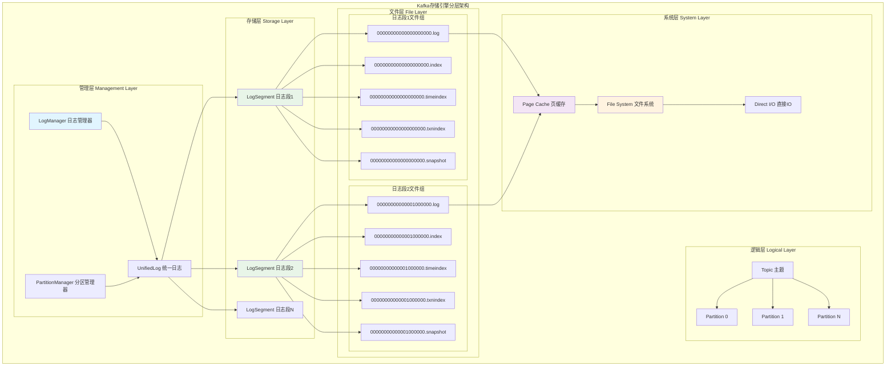
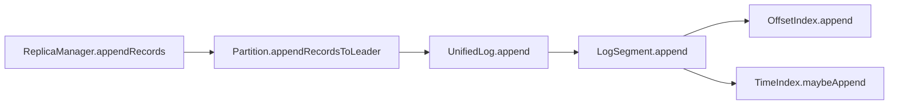
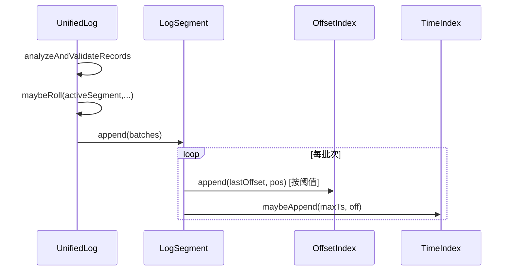
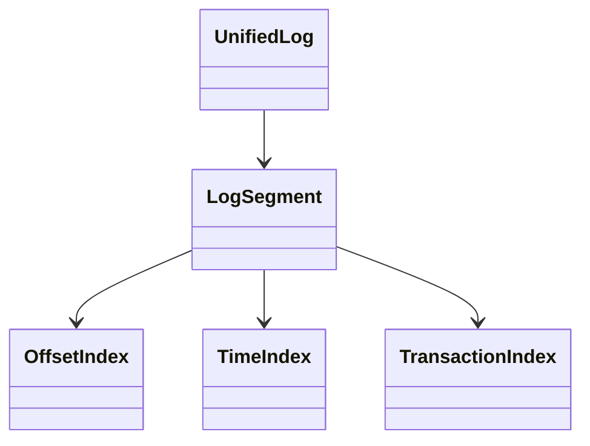

## 概述

Kafka的存储引擎是其高性能的关键所在。通过精心设计的分段日志、稀疏索引、零拷贝技术和页缓存优化，Kafka实现了百万级QPS的消息处理能力。本文存储引擎的核心实现，揭示其高效存储和检索的技术秘密。

<!--more-->

## 1. 存储引擎架构总览

### 1.1 Kafka存储层次架构图



### 1.2 日志段文件组织结构

每个LogSegment由多个文件组成，形成完整的存储单元：

```bash
# 日志段文件组织示例（基础偏移量为0）
00000000000000000000.log        # 消息数据文件（主文件）
00000000000000000000.index      # 偏移量索引文件
00000000000000000000.timeindex  # 时间戳索引文件
00000000000000000000.txnindex   # 事务索引文件
00000000000000000000.snapshot   # Producer状态快照文件

# 下一个日志段（基础偏移量为1000000）
00000000000001000000.log        # 新的消息数据文件
00000000000001000000.index      # 对应的偏移量索引
00000000000001000000.timeindex  # 对应的时间戳索引
# ... 其他相关文件
```

## 2. UnifiedLog统一日志实现

### 2.1 UnifiedLog架构设计

```java
/**
 * UnifiedLog - Kafka的统一日志实现
 * 管理单个分区的完整日志，包括活跃段和历史段
 */
public class UnifiedLog implements Closeable {
    
    // 核心组件
    private final File dir;                        // 日志目录
    private final LogConfig config;                // 日志配置
    private final Scheduler scheduler;             // 调度器
    private final Time time;                       // 时间提供器
    private final TopicPartition topicPartition;   // 主题分区
    
    // 日志段管理
    private final LogSegments segments;            // 日志段集合
    private volatile LogSegment activeSegment;     // 当前活跃段
    
    // 关键位移管理
    private volatile Long logStartOffset;          // 日志起始偏移量（LSO）
    private volatile Long logEndOffset;            // 日志结束偏移量（LEO）
    private volatile Long highWatermark;           // 高水位（HW）
    private volatile Long lastStableOffset;        // 最后稳定偏移量（LSO）
    
    // 生产者状态管理
    private final ProducerStateManager producerStateManager;  // 生产者状态管理器
    private final LeaderEpochFileCache leaderEpochCache;      // Leader纪元缓存

    /**
     * 向日志追加记录批次
     * 这是Kafka写入性能的核心实现
     * 
     * @param records 要追加的记录批次
     * @param origin 写入来源（客户端、副本同步等）
     * @param interBrokerProtocolVersion 代理间协议版本
     * @param assignOffsets 是否分配偏移量
     * @param requestLocal 请求本地缓存
     * @return 追加结果信息
     */
    public LogAppendInfo append(MemoryRecords records,
                               AppendOrigin origin,
                               Integer interBrokerProtocolVersion,
                               boolean assignOffsets,
                               int leaderEpoch,
                               Optional<BufferSupplier> bufferSupplier,
                               RequestLocal requestLocal,
                               boolean ignoreRecordSize) throws IOException {
        
        long startTimeMs = time.milliseconds();
        
        // 1. 验证记录批次的有效性
        analyzeAndValidateRecords(records, origin);
        
        // 2. 检查日志段是否需要滚动
        maybeRoll(activeSegment, records, config.segmentMs - (time.milliseconds() - activeSegment.created),
                 config.segmentBytes - activeSegment.size(), leaderEpoch);
        
        // 3. 为记录分配偏移量（如果需要）
        long offset = nextOffsetMetadata().messageOffset;
        if (assignOffsets) {
            validateMessages(records, origin, offset, leaderEpoch);
            offset = assignOffsetsToRecords(records, offset);
        }
        
        // 4. 更新生产者状态（用于幂等性和事务）
        for (RecordBatch batch : records.batches()) {
            if (batch.hasProducerId()) {
                producerStateManager.update(batch);
            }
        }
        
        // 5. 实际写入文件
        activeSegment.append(offset, records);
        
        // 6. 更新日志结束偏移量（LEO）
        updateLogEndOffset(offset + 1);
        
        // 7. 更新高水位（如果是Leader）
        if (origin != AppendOrigin.Replication) {
            maybeIncrementHighWatermark(activeSegment.readNextOffset());
        }
        
        // 8. 构建追加信息
        LogAppendInfo appendInfo = new LogAppendInfo(
            firstOffset,           // 第一条消息偏移量
            offset,               // 最后一条消息偏移量
            time.milliseconds(),  // 追加时间
            logStartOffset,       // 日志起始偏移量
            records.validBytes(), // 有效字节数
            records.records().size(), // 记录数量
            MonotonicClock.INSTANCE.hiResClockMs() - startTimeMs, // 追加耗时
            RecordBatch.NO_TIMESTAMP, // 分片时间戳
            Collections.emptyList()   // 压缩记录
        );
        
        trace("追加了 {} 字节到日志 {}，新的LEO: {}", records.sizeInBytes(), topicPartition, offset + 1);
        
        return appendInfo;
    }

    /**
     * 从日志读取消息
     * 实现高效的消息检索，支持零拷贝优化
     * 
     * @param startOffset 起始偏移量
     * @param maxLength 最大读取长度
     * @param isolation 隔离级别
     * @param minOneMessage 是否至少返回一条消息
     * @return 读取到的数据信息
     */
    public FetchDataInfo read(long startOffset,
                             int maxLength,
                             FetchIsolation isolation,
                             boolean minOneMessage) throws IOException {
        
        trace("从偏移量 {} 读取最多 {} 字节数据", startOffset, maxLength);
        
        // 1. 检查偏移量有效性
        if (startOffset > logEndOffset) {
            return FetchDataInfo.EMPTY;
        }
        
        // 2. 查找包含起始偏移量的日志段
        LogSegment segment = segments.floorSegment(startOffset);
        if (segment == null) {
            // 偏移量在日志起始偏移量之前
            throw new OffsetOutOfRangeException("请求的偏移量 " + startOffset + 
                " 小于日志起始偏移量 " + logStartOffset);
        }
        
        // 3. 计算最大可读偏移量（根据隔离级别）
        long maxOffsetMetadata = isolation == FetchIsolation.TXN_COMMITTED 
            ? lastStableOffset 
            : logEndOffset;
        
        // 4. 从段中读取数据
        FetchDataInfo fetchDataInfo = segment.read(startOffset, maxLength, 
            maxOffsetMetadata, minOneMessage);
        
        // 5. 如果当前段读取的数据不足且不是最后一个段，尝试从下一个段继续读取
        if (fetchDataInfo.records.sizeInBytes() < maxLength && segment != activeSegment) {
            LogSegment nextSegment = segments.higherSegment(segment.baseOffset());
            if (nextSegment != null) {
                int remainingLength = maxLength - fetchDataInfo.records.sizeInBytes();
                FetchDataInfo nextFetchInfo = nextSegment.read(nextSegment.baseOffset(), 
                    remainingLength, maxOffsetMetadata, false);
                
                // 合并两个段的数据
                if (nextFetchInfo.records.sizeInBytes() > 0) {
                    List<FileRecords> combinedRecords = Arrays.asList(
                        fetchDataInfo.records, nextFetchInfo.records);
                    fetchDataInfo = new FetchDataInfo(
                        fetchDataInfo.fetchOffsetMetadata,
                        new MultiRecords(combinedRecords)
                    );
                }
            }
        }
        
        trace("读取完成：起始偏移量={}, 数据大小={}", startOffset, fetchDataInfo.records.sizeInBytes());
        return fetchDataInfo;
    }

    /**
     * 检查是否需要滚动到新的日志段
     * 基于时间、大小、偏移量等多种条件判断
     */
    private boolean maybeRoll(LogSegment segment, MemoryRecords records, 
                             long timeUntilRoll, long sizeUntilRoll, int leaderEpoch) {
        
        int recordSize = records.sizeInBytes();
        
        // 检查各种滚动条件
        boolean shouldRoll = segment.shouldRoll(new RollParams(
            config.segmentMs,                    // 最大段时间
            config.segmentBytes,                 // 最大段大小
            timeUntilRoll,                      // 距离时间滚动的剩余时间
            sizeUntilRoll,                      // 距离大小滚动的剩余空间
            recordSize,                         // 当前记录大小
            time.milliseconds(),                // 当前时间
            records.batches().iterator().next().maxTimestamp() // 最大时间戳
        ));
        
        if (shouldRoll) {
            debug("基于滚动条件创建新的日志段，当前段: {}, 记录大小: {}", 
                 segment.baseOffset(), recordSize);
            
            // 创建新的活跃段
            LogSegment newSegment = roll(Some(leaderEpoch));
            
            // 异步刷新旧段到磁盘
            scheduler.schedule("flush-log-segment", () -> {
                segment.flush();
            }, 0);
            
            return true;
        }
        
        return false;
    }
    
    /**
     * 创建新的日志段
     * 实现日志的滚动机制
     */
    private LogSegment roll(Optional<Integer> expectedNextOffset) throws IOException {
        long startMs = time.milliseconds();
        
        // 1. 计算新段的基础偏移量
        long newSegmentBaseOffset = expectedNextOffset.orElse(logEndOffset);
        
        // 2. 关闭当前活跃段的写入
        activeSegment.closeForRecordAppends();
        
        // 3. 创建新的日志段文件
        LogSegment newSegment = LogSegment.open(
            dir,                                 // 日志目录
            newSegmentBaseOffset,               // 基础偏移量
            config,                             // 日志配置
            time,                               // 时间提供器
            config.initFileSize(),              // 初始文件大小
            config.preallocate()                // 是否预分配
        );
        
        // 4. 将新段添加到段集合中
        segments.add(newSegment);
        
        // 5. 更新活跃段引用
        activeSegment = newSegment;
        
        // 6. 更新监控指标
        info("创建新的日志段 {} 于目录 {}，耗时 {} ms", 
             newSegmentBaseOffset, dir.getAbsolutePath(), time.milliseconds() - startMs);
        
        return newSegment;
    }
}
```

## 2. 零拷贝技术深度实现

### 2.1 零拷贝原理与实现

```java
/**
 * FileRecords - 通过...实现
 * 利用零拷贝技术实现高效的数据传输
 */
public class FileRecords implements Records {
    
    private final File file;                       // 底层文件
    private final FileChannel channel;             // 文件通道
    private final int start;                       // 起始位置
    private final int end;                         // 结束位置
    private final boolean isSlice;                 // 是否为切片
    
    /**
     * 使用零拷贝技术传输数据到GatheringByteChannel
     * 这是Kafka高性能网络传输的核心实现
     * 
     * @param destChannel 目标通道（通常是SocketChannel）
     * @param position 起始位置
     * @param count 传输字节数
     * @return 实际传输的字节数
     */
    @Override
    public long transferTo(GatheringByteChannel destChannel, long position, long count) throws IOException {
        if (position < 0 || count < 0) {
            throw new IllegalArgumentException("位置和计数必须非负");
        }
        
        if (position > sizeInBytes()) {
            return 0;
        }
        
        // 计算实际传输大小
        long actualCount = Math.min(count, sizeInBytes() - position);
        long startPosition = start + position;
        
        try {
            // 使用FileChannel.transferTo实现零拷贝传输
            // 数据直接从文件的内核缓冲区传输到网络Socket的内核缓冲区
            // 避免了用户空间的内存拷贝，显著提升性能
            return channel.transferTo(startPosition, actualCount, destChannel);
        } catch (IOException e) {
            // 在某些操作系统上，transferTo可能有bug或限制
            // 降级到传统的读写方式
            warn("零拷贝传输失败，降级到传统传输方式: {}", e.getMessage());
            return transferToFallback(destChannel, startPosition, actualCount);
        }
    }
    
    /**
     * 传统方式的数据传输（当零拷贝失败时的降级方案）
     */
    private long transferToFallback(GatheringByteChannel destChannel, 
                                   long position, long count) throws IOException {
        ByteBuffer buffer = ByteBuffer.allocate(Math.min(8192, (int) count)); // 8KB缓冲区
        long transferred = 0;
        
        while (transferred < count) {
            buffer.clear();
            long toRead = Math.min(buffer.remaining(), count - transferred);
            
            // 从文件读取数据到缓冲区
            int bytesRead = channel.read(buffer, position + transferred);
            if (bytesRead <= 0) {
                break;
            }
            
            buffer.flip();
            
            // 将缓冲区数据写入目标通道
            while (buffer.hasRemaining()) {
                int bytesWritten = destChannel.write(buffer);
                if (bytesWritten <= 0) {
                    throw new IOException("无法写入数据到目标通道");
                }
                transferred += bytesWritten;
            }
        }
        
        return transferred;
    }
    
    /**
     * 使用内存映射读取文件数据
     * 利用操作系统的页缓存机制提高读取性能
     */
    public ByteBuffer readInto(ByteBuffer buffer, int position) throws IOException {
        if (position < 0 || position >= sizeInBytes()) {
            throw new IllegalArgumentException("读取位置超出范围");
        }
        
        // 使用内存映射读取文件内容
        MappedByteBuffer mappedBuffer = channel.map(
            FileChannel.MapMode.READ_ONLY,      // 只读映射
            start + position,                   // 映射起始位置
            Math.min(buffer.remaining(), sizeInBytes() - position) // 映射大小
        );
        
        // 将映射的数据复制到目标缓冲区
        int originalLimit = mappedBuffer.limit();
        try {
            if (buffer.remaining() < mappedBuffer.remaining()) {
                mappedBuffer.limit(mappedBuffer.position() + buffer.remaining());
            }
            buffer.put(mappedBuffer);
        } finally {
            mappedBuffer.limit(originalLimit);
        }
        
        return buffer;
    }
}

/**
 * 零拷贝技术的底层实现原理
 * 
 * 传统数据传输路径：
 * 磁盘 -> 内核缓冲区 -> 用户空间缓冲区 -> Socket内核缓冲区 -> 网卡
 * (涉及4次拷贝：2次DMA拷贝 + 2次CPU拷贝)
 * 
 * 零拷贝优化路径：
 * 磁盘 -> 内核缓冲区 -> Socket内核缓冲区 -> 网卡
 * (仅涉及2次DMA拷贝，消除了CPU拷贝)
 * 
 * 关键系统调用：
 * - sendfile()：Linux系统的零拷贝实现
 * - transferTo()：Java NIO的零拷贝API封装
 */
```

### 2.2 页缓存优化策略

```java
/**
 * PageCache优化策略实现
 * 充分利用操作系统的页缓存机制提升I/O性能
 */
public class PageCacheOptimization {
    
    /**
     * 页缓存友好的读取策略
     * 通过顺序访问模式最大化页缓存命中率
     */
    public static class SequentialReadOptimizer {
        
        private static final int READ_AHEAD_SIZE = 65536; // 64KB预读大小
        
        /**
         * 实现页缓存友好的顺序读取
         * 利用操作系统的预读机制提高性能
         */
        public ByteBuffer readWithPageCacheOptimization(FileChannel channel, 
                                                        long position, 
                                                        int size) throws IOException {
            // 1. 对齐到页缓存边界（通常为4KB）
            long alignedPosition = (position / 4096) * 4096;
            int alignedSize = (int) Math.min(
                ((size + 4095) / 4096) * 4096,  // 向上对齐到4KB边界
                channel.size() - alignedPosition
            );
            
            // 2. 使用内存映射进行读取
            MappedByteBuffer mappedBuffer = channel.map(
                FileChannel.MapMode.READ_ONLY,
                alignedPosition,
                alignedSize
            );
            
            // 3. 触发预读（建议操作系统预加载后续页）
            mappedBuffer.load(); // 将映射的页加载到内存
            
            // 4. 定位到实际需要的数据
            int offset = (int) (position - alignedPosition);
            mappedBuffer.position(offset);
            mappedBuffer.limit(offset + size);
            
            return mappedBuffer.slice();
        }
        
        /**
         * 批量预读策略
         * 一次性读取多个消息批次，减少系统调用开销
         */
        public List<ByteBuffer> batchRead(FileChannel channel, 
                                         List<Long> positions, 
                                         List<Integer> sizes) throws IOException {
            List<ByteBuffer> results = new ArrayList<>();
            
            // 合并连续的读取请求
            List<ReadRequest> mergedRequests = mergeContiguousReads(positions, sizes);
            
            for (ReadRequest request : mergedRequests) {
                ByteBuffer buffer = readWithPageCacheOptimization(
                    channel, request.position, request.size);
                
                // 根据原始请求拆分数据
                List<ByteBuffer> splitBuffers = splitBuffer(buffer, request.originalSizes);
                results.addAll(splitBuffers);
            }
            
            return results;
        }
    }
    
    /**
     * 页缓存监控和调优
     */
    public static class PageCacheMonitor {
        
        /**
         * 监控页缓存命中率
         * 通过/proc/vmstat等系统接口获取页缓存统计信息
         */
        public PageCacheStats getPageCacheStats() {
            try {
                // 读取系统页缓存统计信息
                List<String> vmstatLines = Files.readAllLines(Paths.get("/proc/vmstat"));
                
                long cacheHits = 0;
                long cacheMisses = 0;
                
                for (String line : vmstatLines) {
                    if (line.startsWith("pgmajfault")) {
                        // 主页错误（从磁盘读取）
                        cacheMisses = Long.parseLong(line.split("\\s+")[1]);
                    } else if (line.startsWith("pgpgin")) {
                        // 页面换入
                        cacheHits = Long.parseLong(line.split("\\s+")[1]);
                    }
                }
                
                double hitRate = (double) cacheHits / (cacheHits + cacheMisses);
                
                return new PageCacheStats(cacheHits, cacheMisses, hitRate);
                
            } catch (IOException e) {
                warn("无法读取页缓存统计信息", e);
                return PageCacheStats.UNKNOWN;
            }
        }
        
        /**
         * 页缓存预热策略
         * 在服务启动时预先加载热点数据到页缓存
         */
        public void warmupPageCache(List<File> logFiles) {
            info("开始页缓存预热，文件数量: {}", logFiles.size());
            
            ExecutorService executor = Executors.newFixedThreadPool(
                Runtime.getRuntime().availableProcessors());
            
            try {
                List<CompletableFuture<Void>> futures = logFiles.stream()
                    .map(file -> CompletableFuture.runAsync(() -> {
                        try (FileChannel channel = FileChannel.open(file.toPath(), StandardOpenOption.READ)) {
                            // 逐页读取文件内容，触发页缓存加载
                            long fileSize = channel.size();
                            int pageSize = 4096;
                            
                            for (long pos = 0; pos < fileSize; pos += pageSize) {
                                ByteBuffer buffer = ByteBuffer.allocate(pageSize);
                                channel.read(buffer, pos);
                            }
                            
                            debug("完成文件 {} 的页缓存预热", file.getName());
                        } catch (IOException e) {
                            error("预热文件 {} 失败", file.getName(), e);
                        }
                    }, executor))
                    .collect(Collectors.toList());
                
                // 等待所有预热任务完成
                CompletableFuture.allOf(futures.toArray(new CompletableFuture[0]))
                    .get(30, TimeUnit.SECONDS);
                
                info("页缓存预热完成");
                
            } catch (Exception e) {
                error("页缓存预热过程中发生异常", e);
            } finally {
                executor.shutdown();
            }
        }
    }
}
```

## 3. LEO与HW机制深度解析

### 3.1 LEO/HW概念与更新机制

```java
/**
 * Kafka中的关键偏移量概念解析
 * 
 * LEO (Log End Offset): 日志结束偏移量
 * - 表示日志中下一条消息将被分配的偏移量
 * - 每当有新消息写入时LEO会递增
 * - 每个副本都有自己的LEO
 * 
 * HW (High Watermark): 高水位偏移量  
 * - 表示消费者可以看到的消息的最大偏移量
 * - 只有当消息被ISR中的所有副本确认后，HW才会前移
 * - 保证了数据的一致性和可见性
 * 
 * LSO (Log Start Offset): 日志起始偏移量
 * - 表示日志中最早消息的偏移量
 * - 随着日志清理和压缩会发生变化
 * 
 * Last Stable Offset: 最后稳定偏移量
 * - 用于事务隔离，表示最后一个已提交事务的偏移量
 */

/**
 * PartitionMetadata - 分区元数据管理
 * 维护分区的LEO、HW等关键偏移量信息
 */
public class Partition {
    
    // 关键偏移量
    private volatile LogOffsetMetadata localLogStartOffset;    // 本地日志起始偏移量
    private volatile LogOffsetMetadata logEndOffset;          // 日志结束偏移量（LEO）
    private volatile LogOffsetMetadata highWatermark;         // 高水位偏移量（HW）
    private volatile LogOffsetMetadata lastStableOffset;      // 最后稳定偏移量
    
    // 副本管理
    private final Map<Integer, Replica> assignedReplicas;     // 分配的副本映射
    private final Set<Integer> inSyncReplicaIds;              // ISR副本ID集合
    private final ReentrantReadWriteLock leaderIsrUpdateLock; // ISR更新锁
    
    /**
     * 更新Follower副本的LEO
     * 由ReplicaFetcherThread调用，用于同步副本状态
     * 
     * @param replicaId 副本ID
     * @param newLogEndOffset 新的日志结束偏移量
     * @param currentTimeMs 当前时间戳
     * @return 是否成功更新
     */
    public boolean updateReplicaLogReadResult(int replicaId, 
                                            LogReadResult readResult,
                                            long currentTimeMs) {
        leaderIsrUpdateLock.readLock().lock();
        try {
            Replica replica = assignedReplicas.get(replicaId);
            if (replica == null) {
                warn("尝试更新不存在的副本 {} 的LEO", replicaId);
                return false;
            }
            
            // 更新副本的LEO
            LogOffsetMetadata newEndOffset = readResult.info.fetchOffsetMetadata;
            replica.updateLogReadResult(readResult, currentTimeMs);
            
            debug("更新副本 {} 的LEO为 {}", replicaId, newEndOffset.messageOffset);
            
            // 检查是否需要更新高水位
            boolean hwUpdated = maybeIncrementHighWatermark(replica, currentTimeMs);
            
            return hwUpdated;
        } finally {
            leaderIsrUpdateLock.readLock().unlock();
        }
    }
    
    /**
     * 尝试增加高水位
     * 当ISR中所有副本的LEO都达到新的水位时，推进HW
     */
    private boolean maybeIncrementHighWatermark(Replica replica, long currentTimeMs) {
        // 计算ISR中所有副本的最小LEO
        long newHighWatermark = inSyncReplicaIds.stream()
            .mapToLong(replicaId -> {
                Replica r = assignedReplicas.get(replicaId);
                return r != null ? r.logEndOffset().messageOffset : Long.MAX_VALUE;
            })
            .min()
            .orElse(highWatermark.messageOffset);
        
        // 高水位只能前移，不能后退
        if (newHighWatermark > highWatermark.messageOffset) {
            LogOffsetMetadata oldHW = highWatermark;
            
            // 从日志中获取精确的偏移量元数据
            LogOffsetMetadata newHWMetadata = log.convertToOffsetMetadataOrThrow(newHighWatermark);
            highWatermark = newHWMetadata;
            
            debug("分区 {} 的高水位从 {} 更新到 {}", 
                 topicPartition, oldHW.messageOffset, newHighWatermark);
            
            // 通知延迟操作（如DelayedFetch）检查完成条件
            tryCompleteDelayedRequests();
            
            return true;
        }
        
        return false;
    }
    
    /**
     * 检查副本是否同步
     * 基于LEO差距和时间间隔判断副本是否在ISR中
     */
    public boolean isReplicaInSync(int replicaId, 
                                  long leaderLogEndOffset,
                                  long currentTimeMs,
                                  long maxLagMs) {
        Replica replica = assignedReplicas.get(replicaId);
        if (replica == null) {
            return false;
        }
        
        // 检查偏移量同步状态
        long replicaLEO = replica.logEndOffset().messageOffset;
        long lagMessages = leaderLogEndOffset - replicaLEO;
        
        // 检查时间同步状态
        long lagTimeMs = currentTimeMs - replica.lastCaughtUpTimeMs;
        
        // 副本被认为同步，如果：
        // 1. LEO与Leader LEO的差距在允许范围内（通常为0）
        // 2. 最后同步时间在允许的时间窗口内
        boolean isInSync = lagMessages <= config.replicaLagTimeMaxMs && 
                          lagTimeMs <= maxLagMs;
        
        if (!isInSync) {
            debug("副本 {} 不同步：消息滞后={}, 时间滞后={}ms", 
                 replicaId, lagMessages, lagTimeMs);
        }
        
        return isInSync;
    }
    
    /**
     * 从ISR中移除不同步的副本
     * 当副本长时间未能跟上Leader时，将其从ISR中移除
     */
    private void shrinkIsr(Set<Integer> outOfSyncReplicas, long currentTimeMs) {
        leaderIsrUpdateLock.writeLock().lock();
        try {
            if (outOfSyncReplicas.isEmpty()) {
                return;
            }
            
            Set<Integer> newInSyncReplicaIds = new HashSet<>(inSyncReplicaIds);
            newInSyncReplicaIds.removeAll(outOfSyncReplicas);
            
            // 确保Leader始终在ISR中
            newInSyncReplicaIds.add(localBrokerId);
            
            // 更新ISR
            updateIsr(newInSyncReplicaIds, currentTimeMs, "收缩ISR");
            
            info("从分区 {} 的ISR中移除副本 {}，新的ISR: {}", 
                 topicPartition, outOfSyncReplicas, newInSyncReplicaIds);
                 
        } finally {
            leaderIsrUpdateLock.writeLock().unlock();
        }
    }
    
    /**
     * 向ISR中添加重新同步的副本
     * 当副本重新跟上Leader时，将其添加回ISR
     */
    private void expandIsr(Set<Integer> newInSyncReplicas, long currentTimeMs) {
        leaderIsrUpdateLock.writeLock().lock();
        try {
            Set<Integer> newInSyncReplicaIds = new HashSet<>(inSyncReplicaIds);
            newInSyncReplicaIds.addAll(newInSyncReplicas);
            
            // 更新ISR
            updateIsr(newInSyncReplicaIds, currentTimeMs, "扩展ISR");
            
            info("向分区 {} 的ISR中添加副本 {}，新的ISR: {}", 
                 topicPartition, newInSyncReplicas, newInSyncReplicaIds);
                 
        } finally {
            leaderIsrUpdateLock.writeLock().unlock();
        }
    }
}
```

## 4. 日志压缩与清理机制

### 4.1 日志清理策略

```java
/**
 * LogCleaner - 日志清理器
 * 实现基于时间和大小的日志清理策略，以及基于key的日志压缩
 */
public class LogCleaner {
    
    private final CleanerConfig config;            // 清理器配置
    private final LogDirFailureChannel logDirFailureChannel; // 日志目录失败通道
    private final Map<TopicPartition, LogToClean> logsToClean; // 待清理日志映射
    
    // 清理线程池
    private final List<CleanerThread> cleaners;    // 清理线程列表
    private final Scheduler scheduler;             // 调度器
    
    /**
     * 启动日志清理器
     * 初始化清理线程池并开始清理任务
     */
    public void startup() {
        info("启动日志清理器，清理线程数: {}", config.numThreads);
        
        // 启动清理线程
        for (int i = 0; i < config.numThreads; i++) {
            CleanerThread cleaner = new CleanerThread(i);
            cleaners.add(cleaner);
            cleaner.start();
        }
        
        // 定期检查需要清理的日志
        scheduler.schedule("log-cleanup-scheduler", () -> {
            checkAndScheduleCleanup();
        }, config.backoffMs, config.backoffMs);
        
        info("日志清理器启动完成");
    }
    
    /**
     * 检查并调度清理任务
     * 识别需要清理的日志并分配给清理线程
     */
    private void checkAndScheduleCleanup() {
        try {
            // 获取所有需要清理的日志
            Map<TopicPartition, UnifiedLog> logsToCheck = logManager.allLogs();
            
            for (Map.Entry<TopicPartition, UnifiedLog> entry : logsToCheck.entrySet()) {
                TopicPartition tp = entry.getKey();
                UnifiedLog log = entry.getValue();
                
                // 检查清理策略
                String cleanupPolicy = log.config().cleanupPolicy();
                
                if ("delete".equals(cleanupPolicy)) {
                    // 基于时间和大小的删除策略
                    scheduleDeleteCleanup(tp, log);
                } else if ("compact".equals(cleanupPolicy)) {
                    // 基于key的压缩策略
                    scheduleCompactCleanup(tp, log);
                } else if ("compact,delete".equals(cleanupPolicy)) {
                    // 先压缩再删除
                    scheduleCompactAndDeleteCleanup(tp, log);
                }
            }
        } catch (Exception e) {
            error("检查清理任务时发生异常", e);
        }
    }
    
    /**
     * 执行日志段删除清理
     * 基于retention.ms和retention.bytes配置删除过期日志段
     */
    private void scheduleDeleteCleanup(TopicPartition tp, UnifiedLog log) {
        long currentTimeMs = time.milliseconds();
        
        // 基于时间的清理
        long retentionMs = log.config().retentionMs();
        if (retentionMs > 0) {
            List<LogSegment> deletableSegments = log.deletableSegments(
                () -> currentTimeMs - retentionMs);
                
            for (LogSegment segment : deletableSegments) {
                if (segment != log.activeSegment()) {
                    info("标记删除过期日志段: {} (最后修改时间: {})", 
                        segment.baseOffset(), 
                        new Date(segment.lastModified()));
                    log.deleteSegment(segment);
                }
            }
        }
        
        // 基于大小的清理
        long retentionBytes = log.config().retentionBytes();
        if (retentionBytes > 0) {
            long currentLogSize = log.size();
            if (currentLogSize > retentionBytes) {
                long bytesToDelete = currentLogSize - retentionBytes;
                List<LogSegment> segmentsToDelete = log.candidateSegmentsForDeletion(bytesToDelete);
                
                for (LogSegment segment : segmentsToDelete) {
                    info("基于大小限制删除日志段: {} (大小: {} 字节)", 
                        segment.baseOffset(), segment.size());
                    log.deleteSegment(segment);
                }
            }
        }
    }
    
    /**
     * 执行日志压缩清理
     * 基于消息key保留每个key的最新值
     */
    private void scheduleCompactCleanup(TopicPartition tp, UnifiedLog log) {
        try {
            // 检查是否需要压缩
            double dirtyRatio = log.dirtyRatio();
            if (dirtyRatio < config.minCleanableRatio) {
                debug("分区 {} 的脏数据比例 {} 低于阈值 {}，跳过压缩", 
                     tp, dirtyRatio, config.minCleanableRatio);
                return;
            }
            
            info("开始压缩分区 {} 的日志，脏数据比例: {}", tp, dirtyRatio);
            
            // 添加到清理队列
            logsToClean.put(tp, new LogToClean(log, LogCleaningState.COMPACTION));
            
        } catch (Exception e) {
            error("调度分区 {} 压缩清理时发生异常", tp, e);
        }
    }
}

/**
 * CleanerThread - 日志清理线程
 * 执行具体的日志清理和压缩操作
 */
private class CleanerThread extends Thread {
    
    private final int threadId;
    private volatile boolean shouldStop = false;
    
    public CleanerThread(int threadId) {
        super("kafka-log-cleaner-thread-" + threadId);
        this.threadId = threadId;
    }
    
    @Override
    public void run() {
        info("日志清理线程 {} 启动", threadId);
        
        try {
            while (!shouldStop) {
                try {
                    // 获取下一个需要清理的日志
                    LogToClean logToClean = grabNextLogToClean();
                    
                    if (logToClean != null) {
                        // 执行清理操作
                        cleanLog(logToClean);
                    } else {
                        // 没有待清理的日志，短暂休眠
                        Thread.sleep(config.backoffMs);
                    }
                } catch (InterruptedException e) {
                    info("清理线程 {} 被中断", threadId);
                    break;
                } catch (Exception e) {
                    error("清理线程 {} 发生异常", threadId, e);
                }
            }
        } finally {
            info("日志清理线程 {} 停止", threadId);
        }
    }
    
    /**
     * 执行具体的日志清理操作
     */
    private void cleanLog(LogToClean logToClean) {
        UnifiedLog log = logToClean.log;
        TopicPartition tp = log.topicPartition();
        
        long startTimeMs = time.milliseconds();
        
        try {
            if (logToClean.cleaningState == LogCleaningState.COMPACTION) {
                // 执行日志压缩
                doCompactLog(log);
            } else {
                // 执行日志删除
                doDeleteLog(log);
            }
            
            long elapsedMs = time.milliseconds() - startTimeMs;
            info("完成分区 {} 的日志清理，耗时 {} ms", tp, elapsedMs);
            
        } catch (Exception e) {
            error("清理分区 {} 的日志时发生异常", tp, e);
            
            // 将日志标记为清理失败
            markLogAsCleaningAborted(tp);
        }
    }
    
    /**
     * 执行日志压缩
     * 保留每个key的最新值，删除旧版本
     */
    private void doCompactLog(UnifiedLog log) throws IOException {
        info("开始压缩日志分区: {}", log.topicPartition());
        
        // 1. 构建key -> 偏移量的映射（保留最新值）
        Map<ByteBuffer, Long> offsetMap = buildOffsetMap(log);
        
        // 2. 创建压缩后的新日志段
        List<LogSegment> segmentsToCompact = log.logSegments().stream()
            .filter(segment -> segment != log.activeSegment())
            .collect(Collectors.toList());
        
        for (LogSegment sourceSegment : segmentsToCompact) {
            LogSegment cleanedSegment = compactSegment(sourceSegment, offsetMap);
            
            // 3. 替换原始段
            log.replaceSegments(
                Collections.singletonList(cleanedSegment),
                Collections.singletonList(sourceSegment)
            );
        }
        
        info("完成日志压缩，分区: {}", log.topicPartition());
    }
    
    /**
     * 构建偏移量映射
     * 扫描日志找出每个key的最新偏移量
     */
    private Map<ByteBuffer, Long> buildOffsetMap(UnifiedLog log) throws IOException {
        Map<ByteBuffer, Long> offsetMap = new HashMap<>();
        
        // 从最新的段开始向前扫描
        List<LogSegment> segments = new ArrayList<>(log.logSegments());
        Collections.reverse(segments);
        
        for (LogSegment segment : segments) {
            // 读取段中的所有记录
            FetchDataInfo fetchInfo = segment.read(segment.baseOffset(), 
                Integer.MAX_VALUE, Optional.empty(), false);
            
            for (RecordBatch batch : fetchInfo.records.batches()) {
                for (Record record : batch) {
                    ByteBuffer key = record.key();
                    if (key != null) {
                        // 由于是从新到旧扫描，只保留第一次遇到的（最新的）偏移量
                        offsetMap.putIfAbsent(key.duplicate(), record.offset());
                    }
                }
            }
        }
        
        info("构建偏移量映射完成，总key数: {}", offsetMap.size());
        return offsetMap;
    }
    
    /**
     * 压缩单个日志段
     * 只保留在偏移量映射中标记为最新的记录
     */
    private LogSegment compactSegment(LogSegment sourceSegment, 
                                     Map<ByteBuffer, Long> offsetMap) throws IOException {
        
        // 创建临时的压缩段
        File tempFile = File.createTempFile("kafka-compacted-", ".log", sourceSegment.log().file().getParentFile());
        LogSegment compactedSegment = LogSegment.open(
            tempFile.getParentFile(),
            sourceSegment.baseOffset(),
            sourceSegment.config(),
            time,
            false  // 不预分配
        );
        
        try {
            // 读取源段的所有数据
            FetchDataInfo fetchInfo = sourceSegment.read(sourceSegment.baseOffset(), 
                Integer.MAX_VALUE, Optional.empty(), false);
            
            MemoryRecordsBuilder cleanedRecordsBuilder = MemoryRecords.builder(
                ByteBuffer.allocate(Math.min(1024 * 1024, fetchInfo.records.sizeInBytes())), // 1MB缓冲区
                RecordBatch.CURRENT_MAGIC_VALUE,
                config.compression(),
                TimestampType.CREATE_TIME,
                sourceSegment.baseOffset()
            );
            
            // 过滤并重新构建记录
            for (RecordBatch batch : fetchInfo.records.batches()) {
                for (Record record : batch) {
                    ByteBuffer key = record.key();
                    
                    // 检查这条记录是否应该保留
                    if (key == null || offsetMap.get(key) == record.offset()) {
                        // 保留这条记录（无key或者是最新版本）
                        cleanedRecordsBuilder.append(
                            record.timestamp(),
                            record.key(),
                            record.value(),
                            record.headers()
                        );
                    }
                }
            }
            
            // 将压缩后的记录写入新段
            MemoryRecords cleanedRecords = cleanedRecordsBuilder.build();
            compactedSegment.append(sourceSegment.baseOffset() + cleanedRecords.records().size() - 1, 
                                   cleanedRecords);
            
            return compactedSegment;
            
        } catch (Exception e) {
            // 清理失败时删除临时文件
            compactedSegment.close();
            tempFile.delete();
            throw e;
        }
    }
}
```

## 5. 远程存储集成

### 5.1 远程存储管理器

```java
/**
 * RemoteLogManager - 远程存储管理器
 * 支持将历史日志段卸载到对象存储，实现存储层的分离
 */
public class RemoteLogManager implements Closeable {
    
    private final RemoteStorageManager remoteStorageManager;     // 远程存储管理器
    private final RemoteLogMetadataManager remoteLogMetadataManager; // 远程日志元数据管理器
    private final RemoteLogManagerConfig config;                // 配置
    
    // 任务调度
    private final Scheduler scheduler;                          // 调度器
    private final Map<TopicPartition, RemoteLogLeaderEpochState> leaderEpochStates; // Leader纪元状态
    
    /**
     * 将本地日志段复制到远程存储
     * 当日志段满足条件时，异步上传到远程存储
     */
    public void copyLogSegmentToRemote(TopicPartition tp, LogSegment segment) {
        if (!config.remoteLogStorageSystemEnable()) {
            return;
        }
        
        try {
            info("开始将分区 {} 的日志段 {} 复制到远程存储", tp, segment.baseOffset());
            
            // 1. 创建远程日志段元数据
            RemoteLogSegmentMetadata metadata = new RemoteLogSegmentMetadata(
                generateRemoteLogSegmentId(),    // 生成唯一ID
                tp,                             // 主题分区
                segment.baseOffset(),           // 基础偏移量
                segment.readNextOffset() - 1,   // 结束偏移量
                time.milliseconds(),            // 创建时间
                config.brokerId(),              // Broker ID
                segment.largestTimestamp()      // 最大时间戳
            );
            
            // 2. 准备日志段数据
            LogSegmentData segmentData = new LogSegmentData(
                segment.log().file().toPath(),           // 日志文件
                segment.offsetIndex().file().toPath(),   // 偏移量索引文件
                segment.timeIndex().file().toPath(),     // 时间索引文件
                Optional.of(segment.txnIndex().file().toPath()), // 事务索引文件
                segment.producerSnapshotFile().toPath(), // 生产者快照文件
                segment.leaderEpochIndex()               // Leader纪元索引
            );
            
            // 3. 异步上传到远程存储
            CompletableFuture<Void> uploadFuture = CompletableFuture.runAsync(() -> {
                try {
                    remoteStorageManager.copyLogSegmentData(metadata, segmentData);
                    
                    // 4. 更新远程日志元数据
                    remoteLogMetadataManager.addRemoteLogSegmentMetadata(metadata);
                    
                    info("成功将日志段 {} 复制到远程存储", segment.baseOffset());
                    
                } catch (Exception e) {
                    error("复制日志段到远程存储失败: {}", segment.baseOffset(), e);
                    throw new RuntimeException(e);
                }
            }, remoteLogCopyExecutor);
            
            // 5. 处理上传完成后的清理
            uploadFuture.whenComplete((result, exception) -> {
                if (exception == null) {
                    // 上传成功，可以删除本地段（如果配置允许）
                    if (config.localRetentionMs() > 0) {
                        scheduleLocalSegmentDeletion(tp, segment, config.localRetentionMs());
                    }
                } else {
                    error("远程复制失败，保留本地日志段: {}", segment.baseOffset(), exception);
                }
            });
            
        } catch (Exception e) {
            error("准备远程复制时发生异常: {}", segment.baseOffset(), e);
        }
    }
    
    /**
     * 从远程存储读取日志段
     * 当本地不存在所需的历史数据时，从远程存储获取
     */
    public CompletableFuture<FetchDataInfo> fetchFromRemote(TopicPartition tp, 
                                                           long startOffset, 
                                                           int maxBytes) {
        return CompletableFuture.supplyAsync(() -> {
            try {
                // 1. 查找包含起始偏移量的远程日志段
                Optional<RemoteLogSegmentMetadata> segmentMetadata = 
                    remoteLogMetadataManager.remoteLogSegmentMetadata(tp, startOffset);
                
                if (!segmentMetadata.isPresent()) {
                    return FetchDataInfo.EMPTY;
                }
                
                RemoteLogSegmentMetadata metadata = segmentMetadata.get();
                
                // 2. 从远程存储获取日志段数据
                InputStream logStream = remoteStorageManager.fetchLogSegment(metadata, 0);
                
                // 3. 构建MemoryRecords
                ByteBuffer buffer = ByteBuffer.allocate(maxBytes);
                
                try (InputStream stream = logStream) {
                    ReadableByteChannel channel = Channels.newChannel(stream);
                    channel.read(buffer);
                }
                
                buffer.flip();
                MemoryRecords records = MemoryRecords.readableRecords(buffer);
                
                // 4. 过滤到指定偏移量范围的记录
                MemoryRecords filteredRecords = filterRecordsByOffset(records, startOffset, maxBytes);
                
                info("从远程存储读取了 {} 字节数据，起始偏移量: {}", 
                    filteredRecords.sizeInBytes(), startOffset);
                
                return new FetchDataInfo(
                    new LogOffsetMetadata(startOffset),
                    filteredRecords
                );
                
            } catch (Exception e) {
                error("从远程存储读取数据失败，分区: {}, 偏移量: {}", tp, startOffset, e);
                throw new RuntimeException(e);
            }
        }, remoteLogReadExecutor);
    }
    
    /**
     * 清理远程存储中的过期日志段
     */
    public void cleanupRemoteLogSegments(TopicPartition tp) {
        try {
            long currentTimeMs = time.milliseconds();
            long retentionMs = getTopicConfig(tp).remoteLogRetentionMs();
            
            if (retentionMs <= 0) {
                return; // 远程保留期为无限制
            }
            
            // 获取所有远程日志段元数据
            Iterator<RemoteLogSegmentMetadata> segmentIterator = 
                remoteLogMetadataManager.listRemoteLogSegments(tp);
            
            List<RemoteLogSegmentMetadata> expiredSegments = new ArrayList<>();
            
            while (segmentIterator.hasNext()) {
                RemoteLogSegmentMetadata metadata = segmentIterator.next();
                
                // 检查是否过期
                if (currentTimeMs - metadata.createTimeMs() > retentionMs) {
                    expiredSegments.add(metadata);
                }
            }
            
            // 批量删除过期段
            for (RemoteLogSegmentMetadata metadata : expiredSegments) {
                try {
                    remoteStorageManager.deleteLogSegmentData(metadata);
                    remoteLogMetadataManager.updateRemoteLogSegmentMetadata(
                        metadata.withState(RemoteLogSegmentState.DELETE_SEGMENT_FINISHED));
                    
                    info("删除远程日志段: {} (创建时间: {})", 
                        metadata.remoteLogSegmentId(), new Date(metadata.createTimeMs()));
                        
                } catch (Exception e) {
                    error("删除远程日志段失败: {}", metadata.remoteLogSegmentId(), e);
                }
            }
            
        } catch (Exception e) {
            error("清理远程日志段时发生异常，分区: {}", tp, e);
        }
    }
}
```

## 6. 性能优化深度技术

### 6.1 I/O调度优化

```java
/**
 * I/O性能优化策略
 * 通过批量操作、预分配和缓存策略提升存储性能
 */
public class IOOptimizationStrategies {
    
    /**
     * 批量刷盘策略
     * 将多个日志段的数据批量刷新到磁盘，减少系统调用开销
     */
    public static class BatchFlushStrategy {
        
        private final Queue<LogSegment> pendingFlushSegments = new ConcurrentLinkedQueue<>();
        private final AtomicInteger pendingFlushBytes = new AtomicInteger(0);
        private final ScheduledExecutorService flushExecutor;
        
        // 配置参数
        private final int flushIntervalMs;         // 刷盘间隔
        private final int flushBatchSizeBytes;     // 批量刷盘大小阈值
        
        public BatchFlushStrategy(int flushIntervalMs, int flushBatchSizeBytes) {
            this.flushIntervalMs = flushIntervalMs;
            this.flushBatchSizeBytes = flushBatchSizeBytes;
            this.flushExecutor = Executors.newSingleThreadScheduledExecutor(r -> 
                new Thread(r, "kafka-log-flush-scheduler"));
            
            // 定期刷盘任务
            flushExecutor.scheduleAtFixedRate(this::performBatchFlush, 
                flushIntervalMs, flushIntervalMs, TimeUnit.MILLISECONDS);
        }
        
        /**
         * 添加段到待刷盘队列
         */
        public void addSegmentToFlush(LogSegment segment) {
            pendingFlushSegments.offer(segment);
            pendingFlushBytes.addAndGet(segment.size());
            
            // 如果累积大小超过阈值，立即触发刷盘
            if (pendingFlushBytes.get() >= flushBatchSizeBytes) {
                flushExecutor.execute(this::performBatchFlush);
            }
        }
        
        /**
         * 执行批量刷盘操作
         */
        private void performBatchFlush() {
            if (pendingFlushSegments.isEmpty()) {
                return;
            }
            
            long startTimeMs = System.currentTimeMillis();
            List<LogSegment> segmentsToFlush = new ArrayList<>();
            int totalBytes = 0;
            
            // 收集待刷盘的段
            LogSegment segment;
            while ((segment = pendingFlushSegments.poll()) != null) {
                segmentsToFlush.add(segment);
                totalBytes += segment.size();
            }
            
            if (segmentsToFlush.isEmpty()) {
                return;
            }
            
            // 执行批量刷盘
            try {
                for (LogSegment segmentToFlush : segmentsToFlush) {
                    segmentToFlush.flush();
                }
                
                pendingFlushBytes.addAndGet(-totalBytes);
                
                long elapsedMs = System.currentTimeMillis() - startTimeMs;
                info("批量刷盘完成：{} 个段，{} 字节，耗时 {} ms", 
                    segmentsToFlush.size(), totalBytes, elapsedMs);
                    
            } catch (IOException e) {
                error("批量刷盘失败", e);
                
                // 刷盘失败时重新加入队列
                for (LogSegment failedSegment : segmentsToFlush) {
                    pendingFlushSegments.offer(failedSegment);
                }
            }
        }
    }
    
    /**
     * 文件预分配策略
     * 预先分配文件空间，减少文件系统碎片和分配延迟
     */
    public static class FilePreallocationStrategy {
        
        /**
         * 预分配日志文件空间
         * 在创建新日志段时预先分配指定大小的文件空间
         */
        public static void preallocateLogFile(File file, long size) throws IOException {
            try (RandomAccessFile raf = new RandomAccessFile(file, "rw");
                 FileChannel channel = raf.getChannel()) {
                
                // 设置文件长度（在支持sparse file的文件系统上这是高效的）
                raf.setLength(size);
                
                // 在某些文件系统上，需要实际写入数据来分配磁盘空间
                if (shouldWriteZeros()) {
                    ByteBuffer zeros = ByteBuffer.allocate(64 * 1024); // 64KB零缓冲区
                    
                    for (long pos = 0; pos < size; pos += zeros.capacity()) {
                        zeros.clear();
                        long remaining = Math.min(zeros.capacity(), size - pos);
                        zeros.limit((int) remaining);
                        
                        while (zeros.hasRemaining()) {
                            channel.write(zeros, pos + zeros.position());
                        }
                    }
                }
                
                // 强制刷新到磁盘
                channel.force(true);
                
                debug("预分配文件 {} 完成，大小: {} 字节", file.getName(), size);
            }
        }
        
        /**
         * 检查是否需要写入零值
         * 某些文件系统需要实际写入数据才能分配磁盘空间
         */
        private static boolean shouldWriteZeros() {
            String osName = System.getProperty("os.name").toLowerCase();
            String fsType = System.getProperty("kafka.log.preallocate.force.write", "auto");
            
            if ("true".equals(fsType)) {
                return true;
            } else if ("false".equals(fsType)) {
                return false;
            } else {
                // 自动检测：在某些文件系统上需要实际写入
                return osName.contains("windows") || 
                       osName.contains("mac") ||
                       System.getProperty("kafka.log.flush.force.write", "false").equals("true");
            }
        }
    }
    
    /**
     * 读写缓存优化策略
     */
    public static class CacheOptimizationStrategy {
        
        // 读取缓存 - 缓存热点数据
        private final LoadingCache<OffsetPosition, ByteBuffer> readCache;
        
        // 写入缓存 - 批量累积写入数据
        private final Map<Long, ByteBuffer> writeCache;
        private final AtomicInteger writeCacheSize = new AtomicInteger(0);
        
        public CacheOptimizationStrategy(int maxCacheSize, int maxWriteCacheSize) {
            // 初始化读取缓存
            this.readCache = Caffeine.newBuilder()
                .maximumSize(maxCacheSize)
                .expireAfterAccess(5, TimeUnit.MINUTES)
                .recordStats()
                .build(key -> loadFromDisk(key));
            
            this.writeCache = new ConcurrentHashMap<>();
        }
        
        /**
         * 缓存友好的数据读取
         */
        public ByteBuffer cachedRead(FileChannel channel, long offset, int size) {
            OffsetPosition key = new OffsetPosition(offset, size);
            
            try {
                ByteBuffer cached = readCache.get(key);
                return cached.duplicate(); // 返回副本避免并发修改
            } catch (Exception e) {
                // 缓存失败，直接从磁盘读取
                warn("读取缓存失败，直接从磁盘读取: offset={}, size={}", offset, size);
                return loadFromDisk(key);
            }
        }
        
        /**
         * 从磁盘加载数据
         */
        private ByteBuffer loadFromDisk(OffsetPosition key) {
            try (FileChannel channel = FileChannel.open(
                Paths.get(getLogFileName(key.offset)), StandardOpenOption.READ)) {
                
                ByteBuffer buffer = ByteBuffer.allocate(key.size);
                channel.read(buffer, key.offset);
                buffer.flip();
                
                return buffer;
            } catch (IOException e) {
                throw new RuntimeException("从磁盘读取数据失败", e);
            }
        }
        
        /**
         * 缓存写入数据
         * 批量累积写入，减少磁盘I/O次数
         */
        public void cachedWrite(long offset, ByteBuffer data) {
            writeCache.put(offset, data.duplicate());
            int newSize = writeCacheSize.addAndGet(data.remaining());
            
            // 如果缓存大小超过阈值，触发批量写入
            if (newSize >= maxWriteCacheSize) {
                flushWriteCache();
            }
        }
        
        /**
         * 刷新写入缓存到磁盘
         */
        public void flushWriteCache() {
            if (writeCache.isEmpty()) {
                return;
            }
            
            Map<Long, ByteBuffer> dataToFlush = new HashMap<>(writeCache);
            writeCache.clear();
            writeCacheSize.set(0);
            
            // 按偏移量排序，实现顺序写入
            List<Map.Entry<Long, ByteBuffer>> sortedEntries = dataToFlush.entrySet()
                .stream()
                .sorted(Map.Entry.comparingByKey())
                .collect(Collectors.toList());
            
            try {
                // 批量写入磁盘
                for (Map.Entry<Long, ByteBuffer> entry : sortedEntries) {
                    writeToFile(entry.getKey(), entry.getValue());
                }
                
                debug("刷新写入缓存完成，写入 {} 个条目", sortedEntries.size());
                
            } catch (IOException e) {
                error("刷新写入缓存失败", e);
                
                // 写入失败时恢复数据到缓存
                for (Map.Entry<Long, ByteBuffer> entry : sortedEntries) {
                    writeCache.put(entry.getKey(), entry.getValue());
                    writeCacheSize.addAndGet(entry.getValue().remaining());
                }
            }
        }
    }
}
```

## 7. 索引文件深度优化

### 7.1 时间索引优化实现

```java
/**
 * TimeIndex - 时间索引的优化实现
 * 支持基于时间戳的快速消息查找和清理
 */
public final class TimeIndex extends AbstractIndex {
    
    // 索引条目结构：8字节时间戳 + 4字节相对偏移量
    public static final int TIME_INDEX_ENTRY_SIZE = 12;
    
    // 时间索引优化参数
    private static final int BINARY_SEARCH_THRESHOLD = 32;     // 二分查找阈值
    private static final long TIME_INDEX_MERGE_INTERVAL = 300_000; // 5分钟合并间隔
    
    /**
     * 优化的时间戳查找算法
     * 结合二分查找和线性扫描，提供最佳查找性能
     */
    public TimestampOffset lookup(long targetTimestamp) {
        lock();
        try {
            if (entries() == 0) {
                return new TimestampOffset(RecordBatch.NO_TIMESTAMP, baseOffset());
            }
            
            MappedByteBuffer idx = mmap().duplicate();
            
            // 对于小索引使用线性查找，大索引使用二分查找
            if (entries() <= BINARY_SEARCH_THRESHOLD) {
                return linearSearch(idx, targetTimestamp);
            } else {
                return binarySearch(idx, targetTimestamp);
            }
            
        } finally {
            unlock();
        }
    }
    
    /**
     * 线性搜索 - 适用于小索引
     */
    private TimestampOffset linearSearch(MappedByteBuffer idx, long targetTimestamp) {
        TimestampOffset result = new TimestampOffset(RecordBatch.NO_TIMESTAMP, baseOffset());
        
        for (int i = 0; i < entries(); i++) {
            int position = i * TIME_INDEX_ENTRY_SIZE;
            long timestamp = idx.getLong(position);
            int relativeOffset = idx.getInt(position + 8);
            
            if (timestamp <= targetTimestamp) {
                result = new TimestampOffset(timestamp, baseOffset() + relativeOffset);
            } else {
                break; // 时间戳已超过目标，停止搜索
            }
        }
        
        return result;
    }
    
    /**
     * 二分搜索 - 适用于大索引
     * 优化的二分查找实现，减少内存访问次数
     */
    private TimestampOffset binarySearch(MappedByteBuffer idx, long targetTimestamp) {
        int low = 0;
        int high = entries() - 1;
        int bestMatch = -1;
        
        while (low <= high) {
            int mid = (low + high) >>> 1; // 无符号右移避免整数溢出
            int position = mid * TIME_INDEX_ENTRY_SIZE;
            
            long midTimestamp = idx.getLong(position);
            
            if (midTimestamp <= targetTimestamp) {
                bestMatch = mid;
                low = mid + 1;
            } else {
                high = mid - 1;
            }
        }
        
        if (bestMatch == -1) {
            return new TimestampOffset(RecordBatch.NO_TIMESTAMP, baseOffset());
        } else {
            int position = bestMatch * TIME_INDEX_ENTRY_SIZE;
            long timestamp = idx.getLong(position);
            int relativeOffset = idx.getInt(position + 8);
            
            return new TimestampOffset(timestamp, baseOffset() + relativeOffset);
        }
    }
    
    /**
     * 索引压缩优化
     * 定期合并和压缩稀疏的时间索引，提高查找效率
     */
    public void compactIndex() {
        lock();
        try {
            if (entries() < 100) {
                return; // 小索引无需压缩
            }
            
            info("开始压缩时间索引，当前条目数: {}", entries());
            
            MappedByteBuffer currentIdx = mmap().duplicate();
            List<TimestampOffset> compactedEntries = new ArrayList<>();
            
            // 遍历现有条目，移除冗余的中间条目
            TimestampOffset lastEntry = null;
            long lastTimestamp = Long.MIN_VALUE;
            
            for (int i = 0; i < entries(); i++) {
                int position = i * TIME_INDEX_ENTRY_SIZE;
                long timestamp = currentIdx.getLong(position);
                int relativeOffset = currentIdx.getInt(position + 8);
                
                // 只保留时间戳显著变化的条目
                if (lastTimestamp == Long.MIN_VALUE || 
                    timestamp - lastTimestamp >= TIME_INDEX_MERGE_INTERVAL) {
                    
                    TimestampOffset entry = new TimestampOffset(timestamp, baseOffset() + relativeOffset);
                    compactedEntries.add(entry);
                    lastTimestamp = timestamp;
                    lastEntry = entry;
                }
            }
            
            // 重建索引文件
            if (compactedEntries.size() < entries()) {
                rebuildIndex(compactedEntries);
                info("时间索引压缩完成，条目数从 {} 减少到 {}", entries(), compactedEntries.size());
            }
            
        } catch (Exception e) {
            error("压缩时间索引失败", e);
        } finally {
            unlock();
        }
    }
    
    /**
     * 重建索引文件
     */
    private void rebuildIndex(List<TimestampOffset> entries) throws IOException {
        // 创建临时索引文件
        File tempIndexFile = new File(file.getAbsolutePath() + ".tmp");
        
        try (RandomAccessFile tempRaf = new RandomAccessFile(tempIndexFile, "rw");
             FileChannel tempChannel = tempRaf.getChannel()) {
            
            // 预分配文件空间
            long newFileSize = entries.size() * TIME_INDEX_ENTRY_SIZE;
            tempRaf.setLength(newFileSize);
            
            // 创建新的内存映射
            MappedByteBuffer tempBuffer = tempChannel.map(
                FileChannel.MapMode.READ_WRITE, 0, newFileSize);
            
            // 写入压缩后的条目
            for (TimestampOffset entry : entries) {
                tempBuffer.putLong(entry.timestamp);
                tempBuffer.putInt(relativeOffset(entry.offset));
            }
            
            // 强制刷新到磁盘
            tempBuffer.force();
        }
        
        // 原子性替换原文件
        if (!tempIndexFile.renameTo(file)) {
            tempIndexFile.delete();
            throw new IOException("无法替换索引文件");
        }
        
        // 重新映射内存
        reloadIndex();
    }
}
```

## 8. 存储性能监控与调优

### 8.1 存储性能指标

```java
/**
 * StorageMetrics - 存储层性能监控
 * 提供详细的I/O性能和存储使用情况指标
 */
public class StorageMetrics extends KafkaMetricsGroup {
    
    // I/O性能指标
    private final Sensor logFlushRate;             // 日志刷盘速率
    private final Sensor logFlushTime;             // 日志刷盘时间
    private final Sensor logAppendRate;            // 日志追加速率
    private final Sensor logAppendTime;            // 日志追加时间
    
    // 存储空间指标
    private final Gauge<Long> logDirectorySize;    // 日志目录大小
    private final Gauge<Long> logSegmentCount;     // 日志段数量
    private final Gauge<Double> logRetentionRatio; // 日志保留比例
    
    // 清理和压缩指标
    private final Sensor logCleanupRate;           // 日志清理速率
    private final Sensor logCompactionRate;        // 日志压缩速率
    private final Histogram logCompactionTime;     // 日志压缩时间分布
    
    // 远程存储指标
    private final Sensor remoteLogCopyRate;        // 远程日志复制速率
    private final Sensor remoteLogReadRate;        // 远程日志读取速率
    private final Gauge<Long> remoteLogSize;       // 远程日志大小

    public StorageMetrics(Metrics metrics, LogManager logManager) {
        super();
        
        String groupName = "kafka.log";
        
        // 初始化I/O性能指标
        MetricName flushRateMetricName = metrics.metricName("log-flush-rate", groupName, 
            "每秒日志刷盘次数");
        logFlushRate = metrics.sensor("log-flush-rate");
        logFlushRate.add(flushRateMetricName, new Rate());
        
        MetricName flushTimeMetricName = metrics.metricName("log-flush-time-ms", groupName, 
            "日志刷盘平均时间（毫秒）");
        logFlushTime = metrics.sensor("log-flush-time");
        logFlushTime.add(flushTimeMetricName, new Avg());
        
        // 初始化存储空间指标
        MetricName directorySizeMetricName = metrics.metricName("log-directory-size", groupName, 
            "日志目录总大小（字节）");
        logDirectorySize = metrics.addMetric(directorySizeMetricName, 
            (Gauge<Long>) (config, now) -> logManager.getTotalLogDirectorySize());
        
        MetricName segmentCountMetricName = metrics.metricName("log-segment-count", groupName, 
            "日志段总数量");
        logSegmentCount = metrics.addMetric(segmentCountMetricName,
            (Gauge<Long>) (config, now) -> logManager.getTotalSegmentCount());
    }
    
    /**
     * 记录日志刷盘操作
     */
    public void recordLogFlush(long flushTimeMs) {
        logFlushRate.record();
        logFlushTime.record(flushTimeMs);
    }
    
    /**
     * 记录日志追加操作
     */
    public void recordLogAppend(int recordCount, long appendTimeMs) {
        logAppendRate.record(recordCount);
        logAppendTime.record(appendTimeMs);
    }
    
    /**
     * 记录日志压缩操作
     */
    public void recordLogCompaction(long compactionTimeMs, long compactedBytes) {
        logCompactionRate.record();
        logCompactionTime.record(compactionTimeMs);
    }
    
    /**
     * 获取存储健康状况报告
     */
    public StorageHealthReport getHealthReport() {
        double avgFlushTime = logFlushTime.metricValue();
        double flushRate = logFlushRate.metricValue();
        long totalSize = logDirectorySize.metricValue();
        long segmentCount = logSegmentCount.metricValue();
        
        // 评估存储健康状况
        StorageHealthStatus status = StorageHealthStatus.HEALTHY;
        List<String> issues = new ArrayList<>();
        
        if (avgFlushTime > 100) { // 刷盘时间超过100ms
            status = StorageHealthStatus.WARNING;
            issues.add("平均刷盘时间过高: " + avgFlushTime + "ms");
        }
        
        if (flushRate > 1000) { // 刷盘频率过高
            status = StorageHealthStatus.WARNING;
            issues.add("刷盘频率过高: " + flushRate + "/s");
        }
        
        return new StorageHealthReport(status, issues, totalSize, segmentCount);
    }
}

/**
 * 存储性能调优建议
 */
public class StoragePerformanceTuning {
    
    /**
     * 基于工作负载的存储配置优化
     */
    public static LogConfig optimizeForWorkload(WorkloadProfile profile) {
        LogConfig.Builder configBuilder = LogConfig.builder();
        
        switch (profile.type) {
            case HIGH_THROUGHPUT_WRITES:
                // 高吞吐写入优化
                configBuilder
                    .segmentBytes(1024 * 1024 * 1024)      // 1GB段大小，减少段切换
                    .segmentMs(TimeUnit.HOURS.toMillis(1)) // 1小时段时间
                    .flushMessages(50000)                  // 50K消息后刷盘
                    .flushMs(30000)                        // 30秒强制刷盘
                    .indexIntervalBytes(8192)              // 8KB索引间隔
                    .preallocate(true);                    // 启用文件预分配
                break;
                
            case HIGH_THROUGHPUT_READS:
                // 高吞吐读取优化
                configBuilder
                    .segmentBytes(512 * 1024 * 1024)       // 512MB段大小，平衡查找和传输
                    .indexIntervalBytes(4096)              // 4KB索引间隔，更密集的索引
                    .segmentIndexBytes(20 * 1024 * 1024)   // 20MB索引大小
                    .preallocate(true);
                break;
                
            case LOW_LATENCY:
                // 低延迟优化
                configBuilder
                    .segmentBytes(256 * 1024 * 1024)       // 256MB段大小
                    .flushMessages(1000)                   // 1K消息后立即刷盘
                    .flushMs(1000)                         // 1秒强制刷盘
                    .indexIntervalBytes(1024)              // 1KB索引间隔，密集索引
                    .preallocate(true);
                break;
                
            case BALANCED:
            default:
                // 平衡配置
                configBuilder
                    .segmentBytes(1024 * 1024 * 1024)      // 1GB段大小
                    .segmentMs(TimeUnit.DAYS.toMillis(7))  // 7天段时间
                    .flushMessages(10000)                  // 10K消息后刷盘
                    .flushMs(10000)                        // 10秒强制刷盘
                    .indexIntervalBytes(4096);             // 4KB索引间隔
                break;
        }
        
        return configBuilder.build();
    }
    
    /**
     * 存储层性能调优检查清单
     */
    public static class PerformanceTuningChecklist {
        
        /**
         * 检查文件系统配置
         */
        public static List<String> checkFileSystemConfig() {
            List<String> recommendations = new ArrayList<>();
            
            // 检查文件系统类型
            String fsType = detectFileSystemType();
            if (!"ext4".equals(fsType) && !"xfs".equals(fsType)) {
                recommendations.add("建议使用ext4或xfs文件系统以获得更好的性能");
            }
            
            // 检查挂载选项
            if (!hasOptimalMountOptions()) {
                recommendations.add("建议使用noatime,nodiratime挂载选项减少磁盘I/O");
            }
            
            // 检查I/O调度器
            String ioScheduler = getCurrentIOScheduler();
            if (!"deadline".equals(ioScheduler) && !"noop".equals(ioScheduler)) {
                recommendations.add("建议使用deadline或noop I/O调度器");
            }
            
            return recommendations;
        }
        
        /**
         * 检查JVM配置
         */
        public static List<String> checkJVMConfig() {
            List<String> recommendations = new ArrayList<>();
            
            // 检查堆内存配置
            long maxHeap = Runtime.getRuntime().maxMemory();
            long totalMemory = getTotalSystemMemory();
            
            if (maxHeap > totalMemory * 0.75) {
                recommendations.add("JVM堆内存配置过大，建议设置为系统内存的25-50%，留出空间给页缓存");
            }
            
            // 检查GC配置
            String gcType = System.getProperty("java.vm.name");
            if (!gcType.contains("G1") && !gcType.contains("ZGC")) {
                recommendations.add("建议使用G1GC或ZGC以减少GC停顿时间");
            }
            
            return recommendations;
        }
    }
}
```

## 9. 总结与最佳实践

Kafka存储引擎通过多层次的优化技术实现了卓越的性能表现：

### 9.1 核心技术优势

- **零拷贝传输**：通过FileChannel.transferTo()避免用户空间拷贝，显著提升网络传输效率
- **页缓存利用**：充分利用操作系统页缓存，减少磁盘I/O，提高读取性能
- **顺序I/O优化**：append-only写入模式，最大化磁盘顺序I/O性能
- **稀疏索引设计**：平衡索引大小和查找效率，支持快速定位

### 9.2 性能调优要点

- **合理配置段大小**：平衡段切换开销和查找效率
- **优化刷盘策略**：根据可靠性要求配置合适的刷盘间隔
- **启用文件预分配**：减少文件系统碎片，提高写入性能
- **监控存储指标**：持续监控I/O性能和存储使用情况

通过深入理解Kafka存储引擎的设计原理和优化技术，我们能够更好地配置和调优Kafka集群的存储性能，充分发挥其在大规模数据存储方面的优势。

本文档了Kafka存储引擎的核心技术和优化策略，为存储层面的性能调优提供了详实的技术指导。

## 10. 关键函数与调用链（补充）

- 说明：围绕 `UnifiedLog.append/read` 与 `LogSegment.append/read` 关键路径，补充函数级代码、调用链与时序补充。

### 10.1 关键函数核心代码与说明（精要）

```java
// UnifiedLog 追加（摘要）
public LogAppendInfo append(MemoryRecords records,
                            AppendOrigin origin,
                            Integer ibpv,
                            boolean assignOffsets,
                            int leaderEpoch,
                            Optional<BufferSupplier> bs,
                            RequestLocal rl,
                            boolean ignoreSize) throws IOException {
    analyzeAndValidateRecords(records, origin);
    maybeRoll(activeSegment, records, remainMs, remainBytes, leaderEpoch);
    long base = nextOffsetMetadata().messageOffset;
    if (assignOffsets) base = assignOffsetsToRecords(records, base);
    for (RecordBatch b: records.batches()) if (b.hasProducerId()) producerStateManager.update(b);
    activeSegment.append(base, records);
    updateLogEndOffset(base + 1);
    if (origin != AppendOrigin.Replication) maybeIncrementHighWatermark(activeSegment.readNextOffset());
    return buildAppendInfo(base, records);
}
```

- 功能：统一写入入口，涵盖验证、滚动、分配偏移量与状态更新。

```java
// LogSegment 追加（摘要）
public void append(long largestOffset, MemoryRecords records) throws IOException {
    int pos = log.sizeInBytes();
    ensureOffsetInRange(largestOffset);
    log.append(records);
    for (RecordBatch batch : records.batches()) {
        if (batch.maxTimestamp() > maxTimestampSoFar())
            maxTimestampAndOffsetSoFar = new TimestampOffset(batch.maxTimestamp(), batch.lastOffset());
        if (bytesSinceLastIndexEntry > indexIntervalBytes) {
            offsetIndex().append(batch.lastOffset(), pos);
            timeIndex().maybeAppend(maxTimestampSoFar(), shallowOffsetOfMaxTimestampSoFar());
            bytesSinceLastIndexEntry = 0;
        }
        int sz = batch.sizeInBytes(); pos += sz; bytesSinceLastIndexEntry += sz;
    }
}
```

- 功能：顺序写入段文件并按阈值维护稀疏索引。

### 10.2 存储调用链




### 10.3 补充时序图（滚动与索引）



### 10.4 类结构图（简化）


