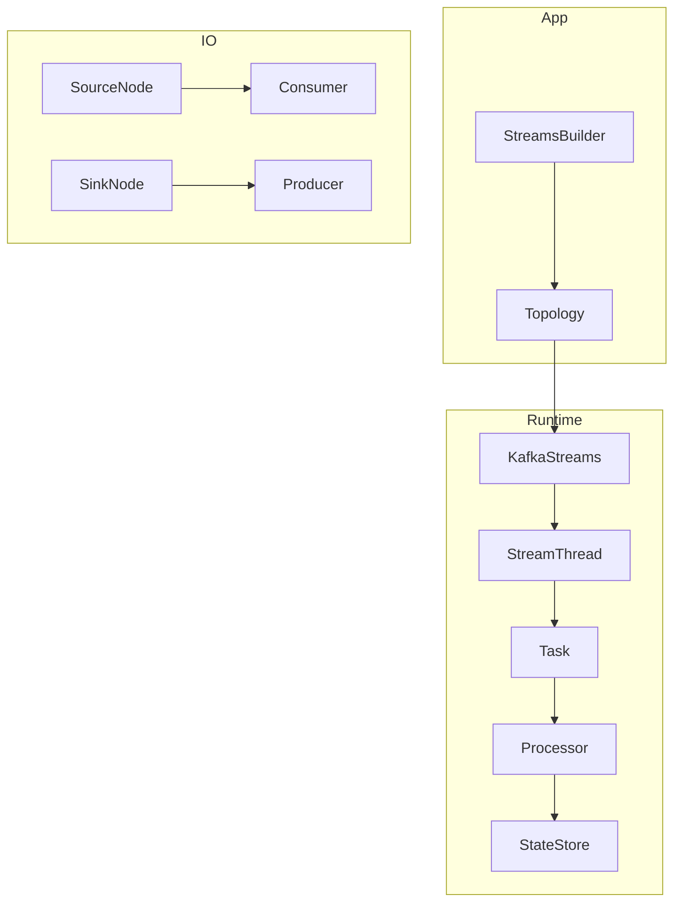
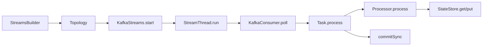
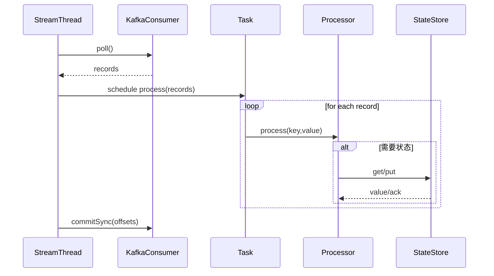
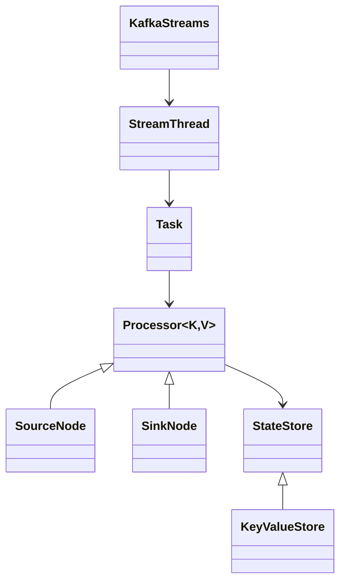

## 概述

Kafka Streams 提供内嵌式分布式流处理引擎。本文补充关键函数核心代码、处理链调用关系、时序与类结构，强调实现边界与中性描述。

<!--more-->

## 1. 引擎组件架构



## 2. 关键函数核心代码与说明（精要）

```java
// 拓扑构建与物化状态存储（摘要）
public <K, V> KTable<K, V> table(String topic, Materialized<K, V, KeyValueStore<Bytes, byte[]>> materialized) {
  String storeName = materialized.storeName();
  StoreBuilder<KeyValueStore<K, V>> builder = Stores.keyValueStoreBuilder(
      Stores.persistentKeyValueStore(storeName), materialized.keySerde(), materialized.valueSerde());
  addStateStore(builder, sourceNameFor(topic));
  return new KTableImpl<>(builder, topic, storeName);
}
```

- 功能：为表源配置持久化 `KeyValueStore` 并注册到拓扑中。

```java
// 线程主循环（摘要）
public void run() {
  while (isRunning()) {
    int processed = runOnce(); // 拉取→反序列化→分发到任务→处理器执行
    maybeCommit(processed);
    maybePunctuate();
  }
}
```

- 功能：每轮完成拉取、处理、提交与定时回调的调度循环。

```java
// 任务处理单步（摘要）
int process() {
  int num = 0;
  while (recordQueue.hasNext() && num < maxProcess) {
    StampedRecord rec = recordQueue.next();
    processorContext.setRecordMetadata(rec.topic(), rec.partition(), rec.offset(), rec.timestamp());
    rootProcessor.process(rec.key(), rec.value());
    num++;
  }
  return num;
}
```

- 功能：以背压上限批量出队，设置上下文并驱动处理器链。

```java
// 状态存储读写（摘要）
public V put(K key, V value) {
  rocksDB.put(serialize(key), serialize(value));
  if (enableCaching) { cache.put(key, value); }
  return value;
}

public V get(K key) {
  V cached = enableCaching ? cache.getIfPresent(key) : null;
  if (cached != null) return cached;
  byte[] bytes = rocksDB.get(serialize(key));
  return deserialize(bytes);
}
```

- 功能：写路径同步写入底层存储并可选写缓存；读路径命中缓存或回源 RocksDB。

```java
// 提交与位移前推（摘要）
void maybeCommit(int processed) {
  if (processed == 0) return;
  Map<TopicPartition, OffsetAndMetadata> offsets = taskCollector.collectedOffsets();
  consumer.commitSync(offsets);
}
```

- 功能：在处理推进后同步提交任务位移，保障至少一次处理语义。

## 3. 调用链（处理路径）



## 4. 时序图（单条记录处理）



## 5. 类结构图与继承关系（简化）



