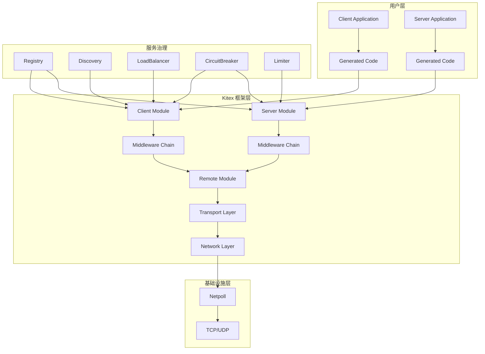

# Kitex 框架源码深度剖析文档

本文档集合提供了 CloudWeGo Kitex 框架的全面源码分析，旨在帮助开发者深入理解框架的设计理念、架构原理和实现细节。

## 文档结构

### 📚 核心文档

1. **[框架整体分析](kitex-framework-analysis.md)**
   - 框架概述与核心特性
   - 整体架构设计
   - 核心模块关系
   - API 接口详解
   - 关键调用链路分析

2. **[使用手册](kitex-user-manual.md)**
   - 快速开始指南
   - 基础概念说明
   - 客户端/服务端使用
   - 高级特性介绍
   - 配置参考大全
   - 故障排查指南

3. **[最佳实践](kitex-best-practices.md)**
   - 性能优化实践
   - 可靠性保障策略
   - 监控与诊断方案
   - 部署与运维经验
   - 开发规范建议
   - 生产环境经验总结

### 🔍 模块深度分析

4. **[Client 模块分析](modules/client-module-analysis.md)**
   - 客户端架构设计
   - 核心接口与实现
   - 调用流程详解
   - 中间件机制
   - 配置体系
   - 扩展机制

5. **[Server 模块分析](modules/server-module-analysis.md)**
   - 服务端架构设计
   - 请求处理流程
   - 服务管理机制
   - 中间件执行
   - 生命周期管理
   - 扩展能力

6. **[Remote 模块分析](modules/remote-module-analysis.md)**
   - 传输层抽象
   - 消息系统设计
   - 编解码器机制
   - 传输处理器
   - 管道模式
   - 协议适配

7. **[Generic 模块分析](modules/generic-module-analysis.md)**
   - 泛化调用原理
   - 多格式支持
   - IDL 解析机制
   - 类型转换
   - 使用场景
   - 扩展开发

## 架构概览

### 整体架构图

### 核心特性

- **🚀 高性能**: 集成 Netpoll 高性能网络库，支持连接池和对象池优化
- **🔧 强扩展**: 丰富的中间件机制和插件体系，支持自定义扩展
- **🌐 多协议**: 支持 Thrift、Protobuf、gRPC 等多种协议
- **📡 多传输**: 支持 TTHeader、HTTP2 等多种传输协议
- **🔄 多模式**: 支持 PingPong、One-way、双向流等调用模式
- **🛡️ 服务治理**: 完整的服务注册发现、负载均衡、熔断限流等能力
- **🔍 可观测**: 内置监控、链路追踪、日志等可观测性支持

## 快速导航

### 🎯 按角色导航

**框架使用者**
- 从 [使用手册](kitex-user-manual.md) 开始
- 参考 [最佳实践](kitex-best-practices.md) 进行优化
- 查看 [故障排查](kitex-user-manual.md#故障排查) 解决问题

**框架开发者**
- 阅读 [框架整体分析](kitex-framework-analysis.md) 了解架构
- 深入 [模块分析](modules/) 理解实现细节
- 参考扩展机制进行二次开发

**运维工程师**
- 重点关注 [部署与运维](kitex-best-practices.md#部署与运维)
- 学习 [监控与诊断](kitex-best-practices.md#监控与诊断)
- 掌握 [故障处理](kitex-best-practices.md#故障处理) 技能

### 🔍 按主题导航

**性能优化**
- [连接池优化](kitex-best-practices.md#连接池优化)
- [序列化优化](kitex-best-practices.md#序列化优化)
- [网络优化](kitex-best-practices.md#网络优化)

**可靠性**
- [超时配置](kitex-best-practices.md#超时配置策略)
- [重试策略](kitex-best-practices.md#重试策略)
- [熔断配置](kitex-best-practices.md#熔断配置)

**扩展开发**
- [中间件扩展](modules/client-module-analysis.md#中间件扩展)
- [负载均衡扩展](modules/client-module-analysis.md#负载均衡扩展)
- [传输层扩展](modules/remote-module-analysis.md#扩展机制)

## 版本信息

- **Kitex 版本**: v0.15.0
- **Go 版本要求**: 1.20+
- **文档更新时间**: 2025年9月

## 贡献指南

本文档基于 Kitex 源码深度分析编写，如发现问题或需要补充内容，欢迎提出建议。

### 文档维护

- 定期更新以跟进 Kitex 版本演进
- 补充实际生产环境的使用经验
- 完善示例代码和最佳实践

### 反馈渠道

- 通过 GitHub Issues 反馈问题
- 分享生产环境使用经验
- 贡献新的最佳实践案例

---

**注意**: 本文档集合内容较为详细，建议根据实际需求选择性阅读。初学者建议从使用手册开始，有经验的开发者可直接查看相关模块的深度分析。
