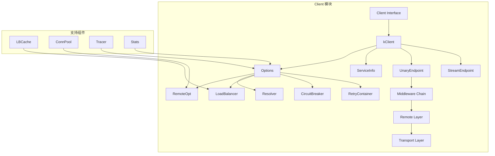

# Client 模块深度分析

## 目录
1. [模块概述](#模块概述)
2. [架构设计](#架构设计)
3. [核心接口](#核心接口)
4. [关键实现](#关键实现)
5. [调用流程](#调用流程)
6. [配置体系](#配置体系)
7. [扩展机制](#扩展机制)

---

## 模块概述

Client 模块是 Kitex 框架的客户端核心，负责发起 RPC 调用、管理连接、处理负载均衡、重试、熔断等功能。

### 核心职责
- RPC 调用管理
- 连接池管理
- 服务发现与负载均衡
- 超时控制
- 重试机制
- 熔断保护
- 中间件执行

### 模块架构图



---

## 架构设计

### 核心类图

```mermaid
classDiagram
    class Client {
        <<interface>>
        +Call(ctx, method, req, resp) error
    }
    
    class kClient {
        -svcInfo ServiceInfo
        -eps UnaryEndpoint
        -sEps StreamEndpoint
        -opt Options
        -lbf BalancerFactory
        -inited bool
        -closed bool
        +Call(ctx, method, req, resp) error
        +Close() error
        -init() error
        -buildInvokeChain() error
    }
    
    class kcFinalizerClient {
        -kClient
        +Call(ctx, method, req, resp) error
    }
    
    class Options {
        +Svr EndpointBasicInfo
        +Resolver Resolver
        +Balancer LoadBalancer
        +RemoteOpt ClientOption
        +CBSuite CBSuite
        +RetryContainer RetryContainer
        +MWBs []MiddlewareBuilder
    }
    
    class ServiceInfo {
        +ServiceName string
        +Methods map[string]MethodInfo
        +PayloadCodec PayloadCodec
        +HandlerType interface{}
    }
    
    Client <|-- kcFinalizerClient
    kcFinalizerClient *-- kClient
    kClient *-- Options
    kClient *-- ServiceInfo
```

---

## 核心接口

### 1. Client 接口

```go
// Client 是 Kitex 客户端的核心接口抽象
// 设计用于生成代码，不应直接使用
type Client interface {
    Call(ctx context.Context, method string, request, response interface{}) error
}
```

**设计理念**:
- 简洁的接口设计，只暴露必要的调用方法
- 通过生成代码提供类型安全的调用方式
- 支持上下文传递和取消

### 2. Streaming 接口

```go
// Streaming 客户端接口，支持流式调用
type Streaming interface {
    Stream(ctx context.Context, method string, request interface{}) (ClientStream, error)
}
```

### 3. 泛化调用接口

```go
// GenericClient 泛化客户端接口
type GenericClient interface {
    GenericCall(ctx context.Context, method string, request interface{}, callOptions ...callopt.Option) (response interface{}, err error)
}
```

---

## 关键实现

### 1. 客户端创建

```go
// NewClient 创建 Kitex 客户端
func NewClient(svcInfo *serviceinfo.ServiceInfo, opts ...Option) (Client, error) {
    if svcInfo == nil {
        return nil, errors.New("NewClient: no service info")
    }
    
    // 创建客户端实例，使用 Finalizer 模式解决循环引用问题
    kc := &kcFinalizerClient{kClient: &kClient{}}
    kc.svcInfo = svcInfo
    kc.opt = client.NewOptions(opts)
    
    // 初始化客户端
    if err := kc.init(); err != nil {
        _ = kc.Close()
        return nil, err
    }
    
    // 设置终结器确保资源释放
    runtime.SetFinalizer(kc, func(c *kcFinalizerClient) {
        _ = c.Close()
    })
    
    return kc, nil
}
```

**关键设计点**:
- **Finalizer 模式**: 解决循环引用导致的内存泄漏问题
- **延迟初始化**: 在 init() 方法中完成复杂的初始化逻辑
- **资源管理**: 通过 runtime.SetFinalizer 确保资源正确释放

### 2. 客户端初始化流程

```go
func (kc *kClient) init() (err error) {
    // 1. 初始化传输协议
    initTransportProtocol(kc.svcInfo, kc.opt.Configs)
    
    // 2. 检查配置选项
    if err = kc.checkOptions(); err != nil {
        return err
    }
    
    // 3. 初始化熔断器
    if err = kc.initCircuitBreaker(); err != nil {
        return err
    }
    
    // 4. 初始化重试器
    if err = kc.initRetryer(); err != nil {
        return err
    }
    
    // 5. 初始化代理
    if err = kc.initProxy(); err != nil {
        return err
    }
    
    // 6. 初始化连接池
    if err = kc.initConnPool(); err != nil {
        return err
    }
    
    // 7. 初始化负载均衡缓存
    if err = kc.initLBCache(); err != nil {
        return err
    }
    
    // 8. 初始化上下文和中间件
    ctx := kc.initContext()
    mw := kc.initMiddlewares(ctx)
    
    // 9. 初始化调试服务
    kc.initDebugService()
    
    // 10. 丰富远程选项
    kc.richRemoteOption()
    
    // 11. 构建调用链
    if err = kc.buildInvokeChain(mw); err != nil {
        return err
    }
    
    // 12. 预热
    if err = kc.warmingUp(); err != nil {
        return err
    }
    
    kc.inited = true
    return nil
}
```

### 3. 负载均衡缓存初始化

```go
func (kc *kClient) initLBCache() error {
    if kc.opt.Proxy != nil && kc.opt.Resolver == nil {
        return nil
    }
    
    // 创建服务发现事件处理器
    onChange := discoveryEventHandler(discovery.ChangeEventName, kc.opt.Bus, kc.opt.Events)
    onDelete := discoveryEventHandler(discovery.DeleteEventName, kc.opt.Bus, kc.opt.Events)
    
    resolver := kc.opt.Resolver
    if resolver == nil {
        // 创建合成解析器，支持 callopt.WithHostPort 指定地址
        resolver = &discovery.SynthesizedResolver{
            ResolveFunc: func(ctx context.Context, target string) (discovery.Result, error) {
                return discovery.Result{}, kerrors.ErrNoResolver
            },
            NameFunc: func() string { return "no_resolver" },
        }
    }
    
    // 配置负载均衡缓存选项
    cacheOpts := lbcache.Options{
        DiagnosisService: kc.opt.DebugService, 
        Cacheable: false, // 用户自定义负载均衡器不可缓存
    }
    
    balancer := kc.opt.Balancer
    if balancer == nil {
        // 默认使用加权轮询负载均衡器
        cacheOpts.Cacheable = true
        balancer = loadbalance.NewWeightedBalancer()
    }
    
    if kc.opt.BalancerCacheOpt != nil {
        cacheOpts = *kc.opt.BalancerCacheOpt
    }
    
    // 创建负载均衡器工厂
    kc.lbf = lbcache.NewBalancerFactory(resolver, balancer, cacheOpts)
    
    // 注册重平衡钩子
    rbIdx := kc.lbf.RegisterRebalanceHook(onChange)
    kc.opt.CloseCallbacks = append(kc.opt.CloseCallbacks, func() error {
        kc.lbf.DeregisterRebalanceHook(rbIdx)
        return nil
    })
    
    // 注册删除钩子
    dIdx := kc.lbf.RegisterDeleteHook(onDelete)
    kc.opt.CloseCallbacks = append(kc.opt.CloseCallbacks, func() error {
        kc.lbf.DeregisterDeleteHook(dIdx)
        return nil
    })
    
    return nil
}
```

### 4. 中间件初始化

```go
type middleware struct {
    // 一元中间件
    mws  []endpoint.Middleware      // 通用中间件链
    uMws []endpoint.UnaryMiddleware // 一元专用中间件链

    // 流式中间件
    smws []endpoint.Middleware  // 流式通用中间件链
    sMws []cep.StreamMiddleware // 流式专用中间件链
}

func (kc *kClient) initMiddlewares(ctx context.Context) (mw middleware) {
    // 1. 通用中间件
    builderMWs := richMWsWithBuilder(ctx, kc.opt.MWBs)
    mw.mws = append(mw.mws, contextMW)                           // 上下文中间件
    mw.mws = append(mw.mws, builderMWs...)                       // 用户自定义中间件
    mw.mws = append(mw.mws, acl.NewACLMiddleware(kc.opt.ACLRules)) // ACL 中间件
    
    if kc.opt.Proxy == nil {
        mw.mws = append(mw.mws, newResolveMWBuilder(kc.lbf)(ctx))    // 服务发现中间件
        mw.mws = append(mw.mws, kc.opt.CBSuite.InstanceCBMW())      // 实例熔断中间件
        mw.mws = append(mw.mws, richMWsWithBuilder(ctx, kc.opt.IMWBs)...) // 实例中间件
    } else {
        if kc.opt.Resolver != nil {
            mw.mws = append(mw.mws, newResolveMWBuilder(kc.lbf)(ctx)) // 自定义服务发现
        }
        mw.mws = append(mw.mws, newProxyMW(kc.opt.Proxy))           // 代理中间件
    }
    mw.mws = append(mw.mws, newIOErrorHandleMW(kc.opt.ErrHandle))   // IO 错误处理中间件

    // 2. 一元中间件
    mw.uMws = append(mw.uMws, kc.opt.CBSuite.ServiceCBMW().ToUnaryMiddleware()) // 服务熔断中间件
    
    if kc.opt.XDSEnabled && kc.opt.XDSRouterMiddleware != nil && kc.opt.Proxy == nil {
        // XDS 路由中间件
        mw.uMws = append(mw.uMws, kc.opt.XDSRouterMiddleware.ToUnaryMiddleware())
    }
    
    mw.uMws = append(mw.uMws, rpcTimeoutMW(ctx))                    // RPC 超时中间件
    kc.opt.UnaryOptions.InitMiddlewares(ctx)
    mw.uMws = append(mw.uMws, kc.opt.UnaryOptions.UnaryMiddlewares...) // 用户一元中间件

    // 3. 流式中间件
    kc.opt.Streaming.InitMiddlewares(ctx)
    kc.opt.StreamOptions.EventHandler = kc.opt.TracerCtl.GetStreamEventHandler()
    
    mw.smws = mw.mws
    if kc.opt.XDSEnabled && kc.opt.XDSRouterMiddleware != nil && kc.opt.Proxy == nil {
        // XDS 路由中间件（流式）
        mw.smws = append([]endpoint.Middleware{kc.opt.XDSRouterMiddleware}, mw.smws...)
    }
    
    kc.opt.StreamOptions.InitMiddlewares(ctx)
    mw.sMws = append([]cep.StreamMiddleware{kc.opt.CBSuite.StreamingServiceCBMW()}, 
        kc.opt.StreamOptions.StreamMiddlewares...)
    
    return
}
```

**中间件执行顺序**:

一元调用中间件链：
```
服务熔断 → XDS路由 → RPC超时 → 用户一元中间件 → 上下文 → 用户通用中间件 → ACL → 服务发现 → 实例熔断 → IO错误处理
```

流式调用中间件链：
```
服务熔断 → 用户流式中间件 → XDS路由 → 上下文 → 用户通用中间件 → ACL → 服务发现 → 实例熔断 → IO错误处理
```

---

## 调用流程

### 1. 调用时序图

```mermaid
sequenceDiagram
    participant App as 应用程序
    participant Client as kClient
    participant MW as 中间件链
    participant Retry as 重试容器
    participant Remote as Remote层
    participant Net as 网络层
    participant Server as 远程服务

    App->>Client: Call(ctx, method, req, resp)
    
    Note over Client: 1. 验证和准备
    Client->>Client: validateForCall()
    Client->>Client: initRPCInfo()
    Client->>Client: DoStart() 追踪
    
    Note over Client: 2. 重试逻辑判断
    alt 无重试策略
        Client->>MW: eps(ctx, req, resp)
        MW->>Remote: 执行中间件链
        Remote->>Net: 网络调用
        Net->>Server: TCP/HTTP2
        Server-->>Net: 响应
        Net-->>Remote: 接收响应
        Remote-->>MW: 返回结果
        MW-->>Client: 返回结果
    else 有重试策略
        Client->>Retry: WithRetryIfNeeded()
        loop 重试循环
            Retry->>Client: rpcCallWithRetry()
            Client->>MW: eps(ctx, req, resp)
            MW->>Remote: 执行中间件链
            Remote->>Net: 网络调用
            Net->>Server: TCP/HTTP2
            Server-->>Net: 响应
            Net-->>Remote: 接收响应
            Remote-->>MW: 返回结果
            MW-->>Client: 返回结果
            Client-->>Retry: 返回结果
            alt 成功或不可重试
                break 退出重试
            else 可重试错误
                Note over Retry: 等待重试间隔
            end
        end
        Retry-->>Client: 最终结果
    end
    
    Note over Client: 3. 降级处理
    Client->>Client: doFallbackIfNeeded()
    
    Note over Client: 4. 清理工作
    Client->>Client: DoFinish() 追踪
    Client->>Client: 资源回收
    
    Client-->>App: 返回结果/错误
```

### 2. Call 方法详细实现

```go
func (kc *kClient) Call(ctx context.Context, method string, request, response interface{}) (err error) {
    // 1. 恢复备份上下文（用于跨 goroutine 传递元信息）
    ctx = backup.RecoverCtxOnDemands(ctx, kc.opt.CtxBackupHandler)

    // 2. 验证调用条件
    validateForCall(ctx, kc.inited, kc.closed)
    
    // 3. 初始化 RPC 信息
    var ri rpcinfo.RPCInfo
    var callOpts *callopt.CallOptions
    ctx, ri, callOpts = kc.initRPCInfo(ctx, method, 0, nil, false)

    // 4. 开始链路追踪
    ctx = kc.opt.TracerCtl.DoStart(ctx, ri)
    
    var reportErr error
    var recycleRI bool
    
    // 5. 延迟处理：追踪结束、异常恢复、资源回收
    defer func() {
        if panicInfo := recover(); panicInfo != nil {
            err = rpcinfo.ClientPanicToErr(ctx, panicInfo, ri, false)
            reportErr = err
        }
        kc.opt.TracerCtl.DoFinish(ctx, ri, reportErr)
        if recycleRI {
            // 回收 RPCInfo 到对象池
            rpcinfo.PutRPCInfo(ri)
        }
        callOpts.Recycle()
    }()

    // 6. 处理调用选项中的重试策略
    callOptRetry := getCalloptRetryPolicy(callOpts)
    if kc.opt.UnaryOptions.RetryContainer == nil && callOptRetry != nil && callOptRetry.Enable {
        kc.opt.InitRetryContainer()
    }

    // 7. 准备重试上下文
    ctx = retry.PrepareRetryContext(ctx)

    // 8. 执行 RPC 调用
    if mi := ri.Invocation().MethodInfo(); mi == nil {
        err = kerrors.ErrNonExistentMethod(kc.svcInfo.ServiceName, method)
    } else if mi.StreamingMode() != serviceinfo.StreamingNone && mi.StreamingMode() != serviceinfo.StreamingUnary {
        err = kerrors.ErrNotUnaryMethod(kc.svcInfo.ServiceName, method)
    } else if kc.opt.UnaryOptions.RetryContainer == nil {
        // 无重试策略的直接调用
        err = kc.eps(ctx, request, response)
        if err == nil {
            recycleRI = true
        }
    } else {
        // 带重试策略的调用
        var lastRI rpcinfo.RPCInfo
        lastRI, recycleRI, err = kc.opt.UnaryOptions.RetryContainer.WithRetryIfNeeded(
            ctx, callOptRetry, kc.rpcCallWithRetry(ri, method), ri, request, response)
        if ri != lastRI {
            // 重置上下文中的 RPCInfo
            ctx = rpcinfo.NewCtxWithRPCInfo(ctx, lastRI)
        }
        ri = lastRI
    }

    // 9. 执行降级逻辑
    err, reportErr = doFallbackIfNeeded(ctx, ri, request, response, err, 
        kc.opt.UnaryOptions.Fallback, callOpts)
    
    return err
}
```

### 3. 重试调用实现

```go
func (kc *kClient) rpcCallWithRetry(ri rpcinfo.RPCInfo, method string) retry.RPCCallFunc {
    var callTimes int32
    var prevRI atomic.Value
    
    return func(ctx context.Context, r retry.Retryer, request, response interface{}) (rpcinfo.RPCInfo, error) {
        currCallTimes := int(atomic.AddInt32(&callTimes, 1))
        cRI := ri
        
        if currCallTimes > 1 {
            // 重试调用：创建新的 RPCInfo
            ctx, cRI, _ = kc.initRPCInfo(ctx, method, currCallTimes-1, ri, false)
            
            // 设置重试标识
            ctx = metainfo.WithPersistentValue(ctx, retry.TransitKey, strconv.Itoa(currCallTimes-1))
            
            if prevRI.Load() == nil {
                prevRI.Store(ri)
            }
            
            // 准备重试
            r.Prepare(ctx, prevRI.Load().(rpcinfo.RPCInfo), cRI)
            prevRI.Store(cRI)
        }
        
        // 执行实际调用
        callErr := kc.eps(ctx, request, response)
        return cRI, callErr
    }
}
```

### 4. 调用链构建

```go
func (kc *kClient) buildInvokeChain(mw middleware) error {
    // 1. 构建一元调用端点
    innerHandlerEp, err := kc.invokeHandleEndpoint()
    if err != nil {
        return err
    }
    
    // 应用通用中间件
    eps := endpoint.Chain(mw.mws...)(innerHandlerEp)
    
    // 应用一元专用中间件
    kc.eps = endpoint.UnaryChain(mw.uMws...)(func(ctx context.Context, req, resp interface{}) (err error) {
        return eps(ctx, req, resp)
    })

    // 2. 构建流式调用端点
    innerStreamingEp, err := kc.invokeStreamingEndpoint()
    if err != nil {
        return err
    }
    
    // 应用流式中间件
    sEps := endpoint.Chain(mw.smws...)(innerStreamingEp)
    kc.sEps = cep.StreamChain(mw.sMws...)(func(ctx context.Context) (st streaming.ClientStream, err error) {
        resp := &streaming.Result{}
        err = sEps(ctx, nil, resp)
        if err != nil {
            return nil, err
        }
        return resp.ClientStream, nil
    })
    
    return nil
}
```

### 5. 底层调用端点

```go
func (kc *kClient) invokeHandleEndpoint() (endpoint.Endpoint, error) {
    transPipl, err := newCliTransHandler(kc.opt.RemoteOpt)
    if err != nil {
        return nil, err
    }
    
    return func(ctx context.Context, req, resp interface{}) (err error) {
        var sendMsg remote.Message
        var recvMsg remote.Message
        
        // 延迟回收消息对象
        defer func() {
            remote.RecycleMessage(sendMsg)
            remote.RecycleMessage(recvMsg)
        }()
        
        ri := rpcinfo.GetRPCInfo(ctx)

        // 创建远程客户端
        cli, err := remotecli.NewClient(ctx, ri, transPipl, kc.opt.RemoteOpt)
        if err != nil {
            return
        }
        defer cli.Recycle()

        // 创建发送消息
        m := ri.Invocation().MethodInfo()
        if m.OneWay() {
            sendMsg = remote.NewMessage(req, ri, remote.Oneway, remote.Client)
        } else {
            sendMsg = remote.NewMessage(req, ri, remote.Call, remote.Client)
        }

        // 发送请求
        if err = cli.Send(ctx, ri, sendMsg); err != nil {
            return
        }
        
        // 处理单向调用
        if m.OneWay() {
            cli.Recv(ctx, ri, nil)
            return nil
        }

        // 接收响应
        recvMsg = remote.NewMessage(resp, ri, remote.Reply, remote.Client)
        err = cli.Recv(ctx, ri, recvMsg)
        return err
    }, nil
}
```

---

## 配置体系

### 1. Options 结构

```go
type Options struct {
    // 基础配置
    Svr      rpcinfo.EndpointBasicInfo  // 服务端信息
    Cli      rpcinfo.EndpointBasicInfo  // 客户端信息
    Configs  rpcinfo.RPCConfig          // RPC 配置
    
    // 服务发现和负载均衡
    Resolver         discovery.Resolver      // 服务发现解析器
    Balancer         loadbalance.Loadbalancer // 负载均衡器
    BalancerCacheOpt *lbcache.Options       // 负载均衡缓存选项
    
    // 连接和传输
    RemoteOpt *remote.ClientOption // 远程选项
    Proxy     proxy.ForwardProxy   // 代理
    
    // 可靠性保障
    CBSuite       circuitbreak.CBSuite    // 熔断器套件
    RetryContainer *retry.Container       // 重试容器
    Fallback      *fallback.Policy       // 降级策略
    
    // 中间件
    MWBs  []endpoint.MiddlewareBuilder // 中间件构建器
    IMWBs []endpoint.MiddlewareBuilder // 实例中间件构建器
    
    // 监控和诊断
    TracerCtl    *stats.Controller    // 追踪控制器
    StatsLevel   *stats.Level         // 统计级别
    DebugService diagnosis.Service    // 调试服务
    
    // 其他选项
    ACLRules        []acl.RejectFunc     // ACL 规则
    WarmUpOption    *warmup.ClientOption // 预热选项
    CloseCallbacks  []func() error       // 关闭回调
    MetaHandlers    []remote.MetaHandler // 元数据处理器
}
```

### 2. 配置选项模式

```go
// Option 配置选项函数类型
type Option func(o *Options)

// WithHostPorts 设置目标服务地址
func WithHostPorts(hostports ...string) Option {
    return func(o *Options) {
        o.Targets = make([]rpcinfo.EndpointInfo, 0, len(hostports))
        for _, hp := range hostports {
            o.Targets = append(o.Targets, utils.NewNetAddr("tcp", hp))
        }
    }
}

// WithRPCTimeout 设置 RPC 超时时间
func WithRPCTimeout(d time.Duration) Option {
    return func(o *Options) {
        rpcinfo.AsMutableRPCConfig(o.Configs).SetRPCTimeout(d)
    }
}

// WithConnectTimeout 设置连接超时时间
func WithConnectTimeout(d time.Duration) Option {
    return func(o *Options) {
        rpcinfo.AsMutableRPCConfig(o.Configs).SetConnectTimeout(d)
    }
}
```

### 3. 配置验证

```go
func (kc *kClient) checkOptions() (err error) {
    if kc.opt.Svr.ServiceName == "" {
        return errors.New("service name is required")
    }
    
    // 验证传输协议
    if tp := kc.opt.Configs.TransportProtocol(); tp == transport.PurePayload {
        return errors.New("transport protocol cannot be PurePayload for client")
    }
    
    // 验证超时配置
    if timeout := kc.opt.Configs.RPCTimeout(); timeout < 0 {
        return errors.New("rpc timeout cannot be negative")
    }
    
    return nil
}
```

---

## 扩展机制

### 1. 中间件扩展

```go
// MiddlewareBuilder 中间件构建器
type MiddlewareBuilder func(ctx context.Context) endpoint.Middleware

// 注册中间件
func WithMiddleware(mw endpoint.Middleware) Option {
    return func(o *Options) {
        o.MWBs = append(o.MWBs, func(ctx context.Context) endpoint.Middleware {
            return mw
        })
    }
}

// 条件中间件
func WithConditionalMiddleware(condition func(ctx context.Context) bool, mw endpoint.Middleware) Option {
    return func(o *Options) {
        o.MWBs = append(o.MWBs, func(ctx context.Context) endpoint.Middleware {
            if condition(ctx) {
                return mw
            }
            return nil
        })
    }
}
```

### 2. 负载均衡扩展

```go
// 自定义负载均衡器
type CustomLoadBalancer struct {
    // 自定义字段
}

func (lb *CustomLoadBalancer) GetPicker(e discovery.Result) loadbalance.Picker {
    return &CustomPicker{instances: e.Instances}
}

type CustomPicker struct {
    instances []discovery.Instance
}

func (p *CustomPicker) Next(ctx context.Context, request interface{}) discovery.Instance {
    // 自定义负载均衡逻辑
    return p.instances[0]
}

// 使用自定义负载均衡器
client.WithLoadBalancer(&CustomLoadBalancer{})
```

### 3. 服务发现扩展

```go
// 自定义服务发现
type CustomResolver struct {
    // 自定义字段
}

func (r *CustomResolver) Target(ctx context.Context, target rpcinfo.EndpointInfo) string {
    return target.ServiceName()
}

func (r *CustomResolver) Resolve(ctx context.Context, desc string) (discovery.Result, error) {
    // 自定义服务发现逻辑
    return discovery.Result{
        Cacheable: true,
        CacheKey:  desc,
        Instances: []discovery.Instance{
            discovery.NewInstance("tcp", "127.0.0.1:8888", 10, nil),
        },
    }, nil
}

func (r *CustomResolver) Name() string {
    return "custom"
}

// 使用自定义服务发现
client.WithResolver(&CustomResolver{})
```

### 4. 传输层扩展

```go
// 自定义传输处理器工厂
type CustomTransHandlerFactory struct{}

func (f *CustomTransHandlerFactory) NewTransHandler(opt *remote.ClientOption) (remote.ClientTransHandler, error) {
    // 创建自定义传输处理器
    return &CustomTransHandler{}, nil
}

type CustomTransHandler struct {
    // 自定义字段
}

func (h *CustomTransHandler) Write(ctx context.Context, conn net.Conn, send remote.Message) (context.Context, error) {
    // 自定义写入逻辑
    return ctx, nil
}

func (h *CustomTransHandler) Read(ctx context.Context, conn net.Conn, msg remote.Message) (context.Context, error) {
    // 自定义读取逻辑
    return ctx, nil
}

// 使用自定义传输处理器
client.WithTransHandlerFactory(&CustomTransHandlerFactory{})
```

---

## 总结

Client 模块是 Kitex 框架的核心组件，具有以下特点：

### 设计优势
1. **清晰的分层架构**: 接口层、逻辑层、传输层职责明确
2. **丰富的扩展机制**: 支持中间件、负载均衡、服务发现等扩展
3. **完善的可靠性保障**: 超时、重试、熔断、降级等机制
4. **高性能设计**: 对象池、连接池、缓存等优化手段
5. **易用的配置体系**: 选项模式提供灵活的配置方式

### 关键技术点
1. **Finalizer 模式**: 解决循环引用问题
2. **中间件链**: 提供强大的扩展能力
3. **重试机制**: 支持多种重试策略
4. **负载均衡缓存**: 提高服务发现性能
5. **资源管理**: 完善的资源回收机制

### 最佳实践
1. **合理配置超时**: 避免级联故障
2. **正确使用重试**: 防止重试风暴
3. **监控关键指标**: 及时发现问题
4. **资源正确释放**: 避免内存泄漏
5. **中间件顺序**: 理解中间件执行顺序的重要性

Client 模块的设计充分体现了 Kitex 框架的高性能和强扩展性特点，为构建可靠的微服务系统提供了坚实的基础。
