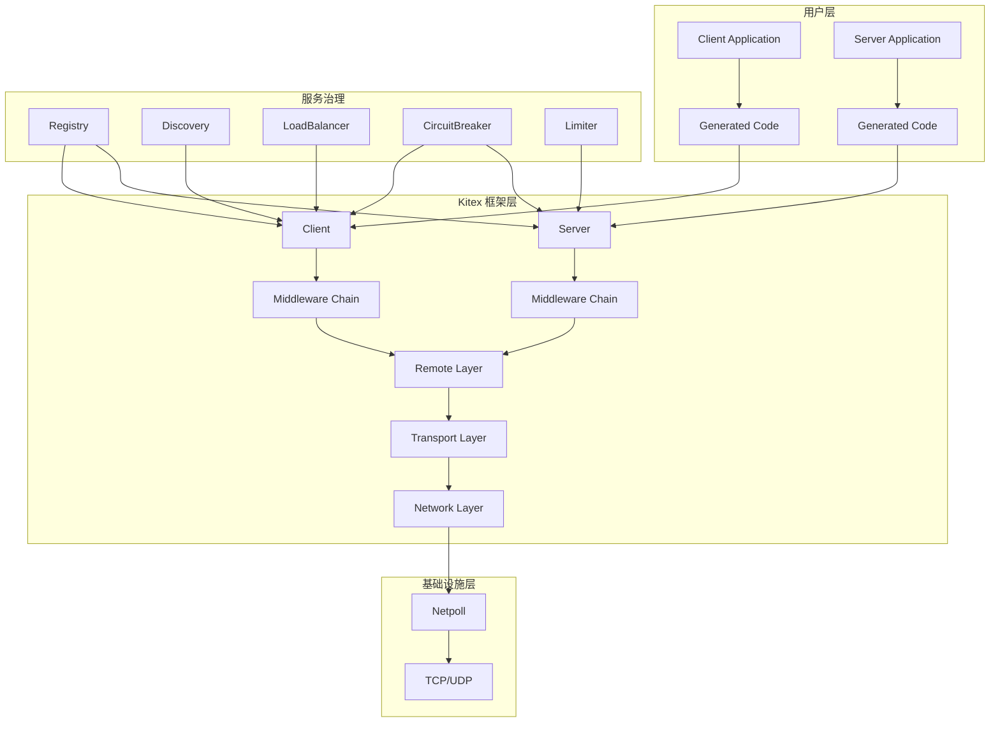
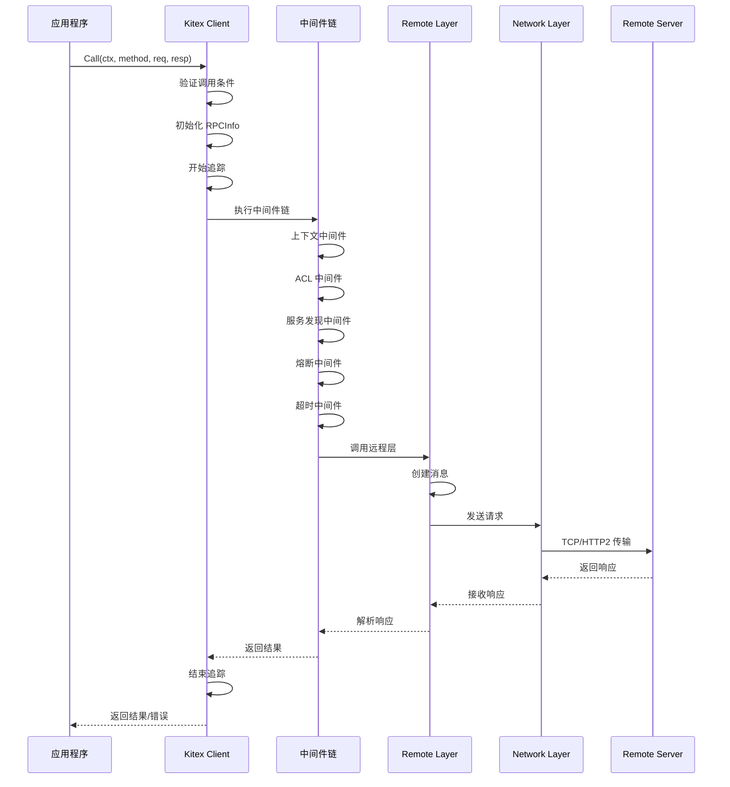
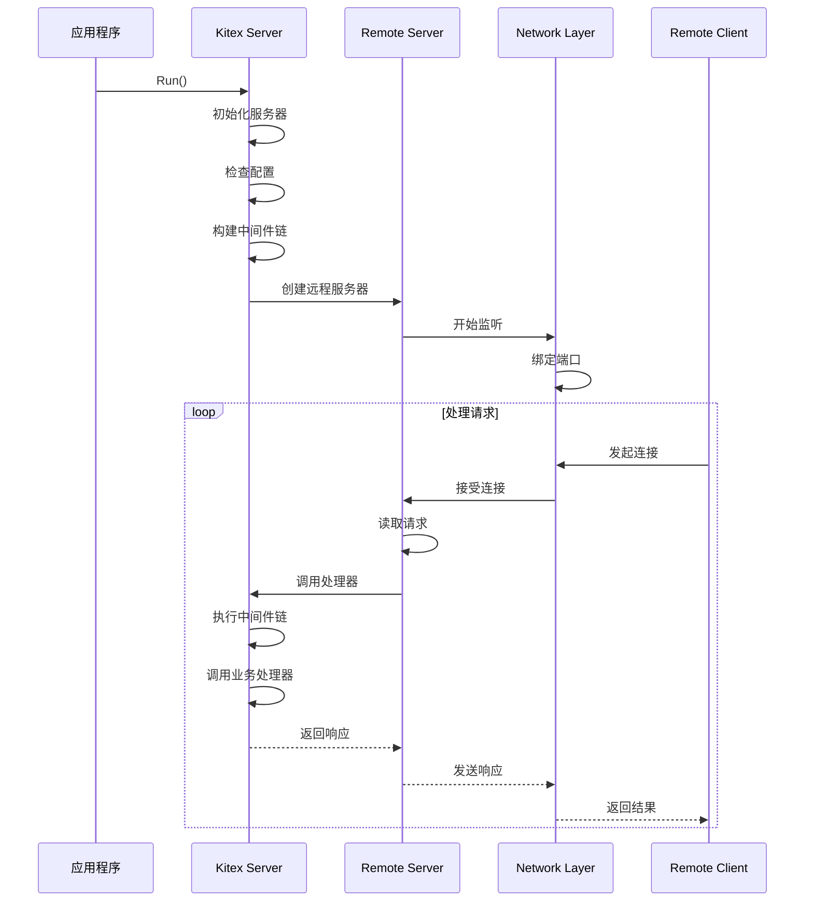
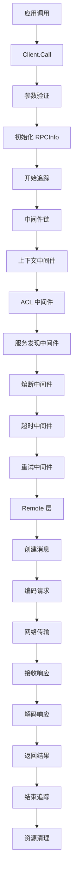
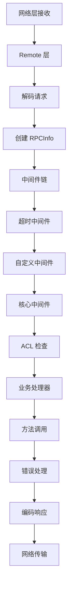

# Kitex 框架源码深度剖析

---

## 框架概述

### 基本信息
- **项目名称**: CloudWeGo Kitex
- **版本**: v0.15.0
- **语言**: Go 1.20+
- **定位**: 高性能、强扩展性的 Go RPC 框架

### 核心特性
1. **高性能**: 集成 Netpoll 高性能网络库
2. **多协议支持**: Thrift、Kitex Protobuf、gRPC
3. **多传输协议**: TTHeader、HTTP2
4. **多消息类型**: PingPong、One-way、双向流
5. **服务治理**: 服务注册发现、负载均衡、熔断、限流、重试等
6. **代码生成**: 内置代码生成工具

---

## 整体架构

### 架构图



### 核心组件关系图

```mermaid
classDiagram
    class Client {
        +Call(ctx, method, req, resp) error
        -svcInfo ServiceInfo
        -eps UnaryEndpoint
        -opt Options
    }
    
    class Server {
        +RegisterService(svcInfo, handler) error
        +Run() error
        +Stop() error
        -eps Endpoint
        -svr RemoteServer
    }
    
    class ServiceInfo {
        +ServiceName string
        +Methods map[string]MethodInfo
        +PayloadCodec PayloadCodec
        +HandlerType interface{}
    }
    
    class Message {
        +RPCInfo() RPCInfo
        +Data() interface{}
        +MessageType() MessageType
        +PayloadCodec() PayloadCodec
    }
    
    class TransHandler {
        +Write(ctx, conn, msg) error
        +Read(ctx, conn, msg) error
        +OnMessage(ctx, args, result) error
    }
    
    Client --> ServiceInfo
    Server --> ServiceInfo
    Client --> Message
    Server --> Message
    Client --> TransHandler
    Server --> TransHandler
```

---

## 核心模块分析

### 1. Client 模块

#### 核心接口定义

```go
// Client 是 Kitex 客户端的核心接口抽象
type Client interface {
    Call(ctx context.Context, method string, request, response interface{}) error
}
```

#### 关键结构体

```go
type kClient struct {
    svcInfo *serviceinfo.ServiceInfo  // 服务信息
    eps     endpoint.UnaryEndpoint    // 一元调用端点
    sEps    cep.StreamEndpoint       // 流式调用端点
    opt     *client.Options          // 客户端配置选项
    lbf     *lbcache.BalancerFactory // 负载均衡器工厂
    inited  bool                     // 初始化标志
    closed  bool                     // 关闭标志
}
```

#### 创建流程

```go
// NewClient 创建 Kitex 客户端
func NewClient(svcInfo *serviceinfo.ServiceInfo, opts ...Option) (Client, error) {
    if svcInfo == nil {
        return nil, errors.New("NewClient: no service info")
    }
    kc := &kcFinalizerClient{kClient: &kClient{}}
    kc.svcInfo = svcInfo
    kc.opt = client.NewOptions(opts)
    if err := kc.init(); err != nil {
        _ = kc.Close()
        return nil, err
    }
    // 设置终结器，确保资源释放
    runtime.SetFinalizer(kc, func(c *kcFinalizerClient) {
        _ = c.Close()
    })
    return kc, nil
}
```

#### 初始化过程

```go
func (kc *kClient) init() (err error) {
    // 1. 初始化传输协议
    initTransportProtocol(kc.svcInfo, kc.opt.Configs)
    
    // 2. 检查配置选项
    if err = kc.checkOptions(); err != nil {
        return err
    }
    
    // 3. 初始化熔断器
    if err = kc.initCircuitBreaker(); err != nil {
        return err
    }
    
    // 4. 初始化重试器
    if err = kc.initRetryer(); err != nil {
        return err
    }
    
    // 5. 初始化代理
    if err = kc.initProxy(); err != nil {
        return err
    }
    
    // 6. 初始化连接池
    if err = kc.initConnPool(); err != nil {
        return err
    }
    
    // 7. 初始化负载均衡缓存
    if err = kc.initLBCache(); err != nil {
        return err
    }
    
    // 8. 初始化上下文和中间件
    ctx := kc.initContext()
    mw := kc.initMiddlewares(ctx)
    
    // 9. 初始化调试服务
    kc.initDebugService()
    
    // 10. 丰富远程选项
    kc.richRemoteOption()
    
    // 11. 构建调用链
    if err = kc.buildInvokeChain(mw); err != nil {
        return err
    }
    
    // 12. 预热
    if err = kc.warmingUp(); err != nil {
        return err
    }
    
    kc.inited = true
    return nil
}
```

#### 调用流程

```go
func (kc *kClient) Call(ctx context.Context, method string, request, response interface{}) (err error) {
    // 1. 恢复备份上下文
    ctx = backup.RecoverCtxOnDemands(ctx, kc.opt.CtxBackupHandler)
    
    // 2. 验证调用条件
    validateForCall(ctx, kc.inited, kc.closed)
    
    // 3. 初始化 RPC 信息
    var ri rpcinfo.RPCInfo
    var callOpts *callopt.CallOptions
    ctx, ri, callOpts = kc.initRPCInfo(ctx, method, 0, nil, false)
    
    // 4. 开始追踪
    ctx = kc.opt.TracerCtl.DoStart(ctx, ri)
    
    // 5. 延迟处理（追踪结束、资源回收等）
    defer func() {
        if panicInfo := recover(); panicInfo != nil {
            err = rpcinfo.ClientPanicToErr(ctx, panicInfo, ri, false)
        }
        kc.opt.TracerCtl.DoFinish(ctx, ri, err)
        if recycleRI {
            rpcinfo.PutRPCInfo(ri)
        }
        callOpts.Recycle()
    }()
    
    // 6. 准备重试上下文
    ctx = retry.PrepareRetryContext(ctx)
    
    // 7. 执行调用（带重试逻辑）
    if kc.opt.UnaryOptions.RetryContainer == nil {
        // 无重试策略的调用
        err = kc.eps(ctx, request, response)
    } else {
        // 带重试策略的调用
        var lastRI rpcinfo.RPCInfo
        lastRI, recycleRI, err = kc.opt.UnaryOptions.RetryContainer.WithRetryIfNeeded(
            ctx, callOptRetry, kc.rpcCallWithRetry(ri, method), ri, request, response)
        ri = lastRI
    }
    
    // 8. 执行降级逻辑
    err, _ = doFallbackIfNeeded(ctx, ri, request, response, err, 
        kc.opt.UnaryOptions.Fallback, callOpts)
    
    return err
}
```

### 2. Server 模块

#### 核心接口定义

```go
// Server 是 RPC 服务器的抽象接口
type Server interface {
    RegisterService(svcInfo *serviceinfo.ServiceInfo, handler interface{}, opts ...RegisterOption) error
    GetServiceInfos() map[string]*serviceinfo.ServiceInfo
    Run() error
    Stop() error
}
```

#### 关键结构体

```go
type server struct {
    opt  *internal_server.Options  // 服务器配置选项
    svcs *services                 // 服务集合
    eps  endpoint.Endpoint         // 业务处理端点
    svr  remotesvr.Server         // 远程服务器
    stopped sync.Once             // 停止标志
    isInit  bool                  // 初始化标志
    isRun   bool                  // 运行标志
    sync.Mutex                    // 互斥锁
}
```

#### 创建流程

```go
// NewServer 创建服务器实例
func NewServer(ops ...Option) Server {
    s := &server{
        opt:  internal_server.NewOptions(ops),
        svcs: newServices(),
    }
    return s
}
```

#### 服务注册

```go
func (s *server) RegisterService(svcInfo *serviceinfo.ServiceInfo, handler interface{}, opts ...RegisterOption) error {
    s.Lock()
    defer s.Unlock()
    
    if s.isRun {
        panic("service cannot be registered while server is running")
    }
    if svcInfo == nil {
        panic("svcInfo is nil. please specify non-nil svcInfo")
    }
    if handler == nil || reflect.ValueOf(handler).IsNil() {
        panic("handler is nil. please specify non-nil handler")
    }
    
    registerOpts := internal_server.NewRegisterOptions(opts)
    // 注册服务
    if err := s.svcs.addService(svcInfo, handler, registerOpts); err != nil {
        panic(err.Error())
    }
    return nil
}
```

#### 运行流程

```go
func (s *server) Run() (err error) {
    s.Lock()
    s.isRun = true
    s.Unlock()
    
    // 1. 初始化服务器
    s.init()
    
    // 2. 检查配置
    if err = s.check(); err != nil {
        return err
    }
    
    // 3. 处理代理配置
    svrCfg := s.opt.RemoteOpt
    addr := svrCfg.Address
    if s.opt.Proxy != nil {
        svrCfg.Address, err = s.opt.Proxy.Replace(addr)
        if err != nil {
            return
        }
    }
    
    // 4. 注册调试信息
    s.registerDebugInfo()
    
    // 5. 丰富远程选项
    s.richRemoteOption()
    
    // 6. 创建传输处理器
    transHdlr, err := s.newSvrTransHandler()
    if err != nil {
        return err
    }
    
    // 7. 创建远程服务器
    svr, err := remotesvr.NewServer(s.opt.RemoteOpt, transHdlr)
    if err != nil {
        return err
    }
    s.svr = svr
    
    // 8. 启动性能分析器
    if s.opt.RemoteOpt.Profiler != nil {
        gofunc.GoFunc(context.Background(), func() {
            klog.Info("KITEX: server starting profiler")
            err := s.opt.RemoteOpt.Profiler.Run(context.Background())
            if err != nil {
                klog.Errorf("KITEX: server started profiler error: error=%s", err.Error())
            }
        })
    }
    
    // 9. 启动服务器
    errCh := svr.Start()
    select {
    case err = <-errCh:
        klog.Errorf("KITEX: server start error: error=%s", err.Error())
        return err
    default:
    }
    
    // 10. 执行启动钩子
    muStartHooks.Lock()
    for i := range onServerStart {
        go onServerStart[i]()
    }
    muStartHooks.Unlock()
    
    // 11. 构建注册信息
    s.buildRegistryInfo(svr.Address())
    
    // 12. 等待退出信号
    if err = s.waitExit(errCh); err != nil {
        klog.Errorf("KITEX: received error and exit: error=%s", err.Error())
    }
    
    // 13. 停止服务器
    if e := s.Stop(); e != nil && err == nil {
        err = e
        klog.Errorf("KITEX: stop server error: error=%s", e.Error())
    }
    
    return
}
```

#### 请求处理端点

```go
func (s *server) invokeHandleEndpoint() endpoint.UnaryEndpoint {
    return func(ctx context.Context, args, resp interface{}) (err error) {
        ri := rpcinfo.GetRPCInfo(ctx)
        ink := ri.Invocation()
        methodName := ink.MethodName()
        serviceName := ink.ServiceName()
        
        // 获取服务和服务信息
        svc := s.svcs.getService(serviceName)
        svcInfo := svc.svcInfo
        
        if methodName == "" && svcInfo.ServiceName != serviceinfo.GenericService {
            return errors.New("method name is empty in rpcinfo, should not happen")
        }
        
        // 异常处理和统计记录
        defer func() {
            if handlerErr := recover(); handlerErr != nil {
                err = kerrors.ErrPanic.WithCauseAndStack(
                    fmt.Errorf("[happened in biz handler, method=%s.%s] %s",
                        svcInfo.ServiceName, methodName, handlerErr),
                    string(debug.Stack()))
                rpcStats := rpcinfo.AsMutableRPCStats(ri.Stats())
                rpcStats.SetPanicked(err)
            }
            rpcinfo.Record(ctx, ri, stats.ServerHandleFinish, err)
            backup.ClearCtx()
        }()
        
        // 获取实现处理函数
        implHandlerFunc := ink.MethodInfo().Handler()
        
        // 记录开始处理
        rpcinfo.Record(ctx, ri, stats.ServerHandleStart, nil)
        
        // 设置会话
        backup.BackupCtx(ctx)
        
        // 执行业务处理函数
        err = implHandlerFunc(ctx, svc.getHandler(methodName), args, resp)
        
        if err != nil {
            if bizErr, ok := kerrors.FromBizStatusError(err); ok {
                if setter, ok := ri.Invocation().(rpcinfo.InvocationSetter); ok {
                    setter.SetBizStatusErr(bizErr)
                    return nil
                }
            }
            err = kerrors.ErrBiz.WithCause(err)
        }
        
        return err
    }
}
```

### 3. Remote 模块

#### 消息抽象

```go
// Message 是 Kitex 消息的核心抽象
type Message interface {
    RPCInfo() rpcinfo.RPCInfo
    Data() interface{}
    NewData(method string) (ok bool)
    MessageType() MessageType
    SetMessageType(MessageType)
    RPCRole() RPCRole
    PayloadLen() int
    SetPayloadLen(size int)
    TransInfo() TransInfo
    Tags() map[string]interface{}
    PayloadCodec() PayloadCodec
    SetPayloadCodec(pc PayloadCodec)
    Recycle()
}
```

#### 传输处理器接口

```go
// TransHandler 类似于 Netty 中的处理器角色
type TransHandler interface {
    TransReadWriter
    OnInactive(ctx context.Context, conn net.Conn)
    OnError(ctx context.Context, err error, conn net.Conn)
    OnMessage(ctx context.Context, args, result Message) (context.Context, error)
    SetPipeline(pipeline *TransPipeline)
}

// TransReadWriter 定义读写接口
type TransReadWriter interface {
    Write(ctx context.Context, conn net.Conn, send Message) (nctx context.Context, err error)
    Read(ctx context.Context, conn net.Conn, msg Message) (nctx context.Context, err error)
}
```

### 4. ServiceInfo 模块

#### 服务信息结构

```go
// ServiceInfo 记录服务的元信息
type ServiceInfo struct {
    PackageName     string                    // 包名（已废弃，为兼容性保留）
    ServiceName     string                    // 服务名称
    HandlerType     interface{}               // 请求处理器类型
    Methods         map[string]MethodInfo     // 方法信息映射
    PayloadCodec    PayloadCodec             // 负载编解码器
    KiteXGenVersion string                   // Kitex 生成工具版本
    Extra           map[string]interface{}   // 扩展信息
    GenericMethod   GenericMethodFunc        // 泛化方法函数
}
```

#### 方法信息接口

```go
// MethodInfo 记录一元方法的元信息
type MethodInfo interface {
    Handler() MethodHandler           // 获取方法处理器
    NewArgs() interface{}            // 创建新的参数实例
    NewResult() interface{}          // 创建新的结果实例
    OneWay() bool                    // 是否为单向调用
    IsStreaming() bool               // 是否为流式调用（已废弃）
    StreamingMode() StreamingMode    // 流式模式
}

// MethodHandler 对应生成代码中的处理器包装函数
type MethodHandler func(ctx context.Context, handler, args, result interface{}) error
```

---

## API 接口详解

### 1. 客户端 API

#### NewClient - 创建客户端

```go
func NewClient(svcInfo *serviceinfo.ServiceInfo, opts ...Option) (Client, error)
```

**功能说明**: 创建 Kitex 客户端实例

**参数**:
- `svcInfo`: 服务信息，包含服务名、方法信息、编解码器等
- `opts`: 客户端配置选项，如超时、重试、负载均衡等

**调用链路**:
1. 参数验证 → 2. 创建客户端实例 → 3. 设置配置选项 → 4. 初始化客户端 → 5. 设置终结器

#### Client.Call - 执行 RPC 调用

```go
func (kc *kClient) Call(ctx context.Context, method string, request, response interface{}) error
```

**功能说明**: 执行 RPC 方法调用

**调用链路时序图**:



### 2. 服务端 API

#### NewServer - 创建服务器

```go
func NewServer(ops ...Option) Server
```

**功能说明**: 创建 Kitex 服务器实例

**参数**:
- `ops`: 服务器配置选项，如地址、中间件、限流器等

#### RegisterService - 注册服务

```go
func (s *server) RegisterService(svcInfo *serviceinfo.ServiceInfo, handler interface{}, opts ...RegisterOption) error
```

**功能说明**: 向服务器注册业务服务

**参数**:
- `svcInfo`: 服务信息
- `handler`: 业务处理器实现
- `opts`: 注册选项

#### Server.Run - 启动服务器

```go
func (s *server) Run() error
```

**功能说明**: 启动服务器并开始监听请求

**调用链路时序图**:



### 3. 泛化调用 API

#### NewClient (Generic)

```go
func NewClient(destService string, g generic.Generic, opts ...client.Option) (Client, error)
```

**功能说明**: 创建泛化客户端，支持动态调用

#### GenericCall

```go
func (c *genericServiceClient) GenericCall(ctx context.Context, method string, request interface{}, callOptions ...callopt.Option) (response interface{}, err error)
```

**功能说明**: 执行泛化调用，无需生成代码

---

## 关键调用链路

### 1. 客户端调用链路



### 2. 服务端处理链路



### 3. 中间件执行顺序

#### 客户端中间件顺序
1. **服务熔断中间件** - 服务级别熔断
2. **XDS 路由中间件** - 服务网格路由（如果启用）
3. **RPC 超时中间件** - 请求超时控制
4. **自定义一元中间件** - 用户自定义逻辑
5. **上下文中间件** - 上下文处理
6. **自定义通用中间件** - 用户自定义通用逻辑
7. **ACL 中间件** - 访问控制
8. **服务发现中间件** - 服务发现和负载均衡
9. **实例熔断中间件** - 实例级别熔断
10. **IO 错误处理中间件** - 网络错误处理

#### 服务端中间件顺序
1. **流式中间件包装器** - 流式调用支持
2. **服务器超时中间件** - 服务器端超时
3. **自定义中间件** - 用户自定义逻辑
4. **核心中间件** - ACL 和错误处理

---

## 实战经验

### 1. 性能优化

#### 连接池配置
```go
// 推荐的连接池配置
client.WithLongConnection(
    connpool.IdleConfig{
        MaxIdlePerAddress: 10,    // 每个地址最大空闲连接数
        MaxIdleGlobal:     100,   // 全局最大空闲连接数
        MaxIdleTimeout:    time.Minute * 3, // 空闲超时时间
    },
)
```

#### 预热配置
```go
// 客户端预热，减少首次调用延迟
client.WithWarmingUp(&warmup.ClientOption{
    ResolverOption: &warmup.ResolverOption{
        Dests: []*rpcinfo.EndpointBasicInfo{
            &rpcinfo.EndpointBasicInfo{
                ServiceName: "target-service",
                Method:      "*",
            },
        },
    },
    PoolOption: &warmup.PoolOption{
        ConnNum: 5, // 预热连接数
    },
})
```

### 2. 可靠性保障

#### 超时配置
```go
// 多层超时配置
client.WithRPCTimeout(time.Second * 3)        // RPC 总超时
client.WithConnectTimeout(time.Millisecond * 500) // 连接超时
client.WithReadWriteTimeout(time.Second * 2)      // 读写超时
```

#### 重试策略
```go
// 智能重试配置
client.WithFailureRetry(retry.NewFailurePolicy(
    retry.WithMaxRetryTimes(2),                    // 最大重试次数
    retry.WithMaxDurationMS(5000),                 // 最大重试时长
    retry.WithDisableChainRetryStop(),             // 禁用链式重试停止
    retry.WithDDLStop(),                           // 启用截止时间停止
    retry.WithBizErrorRetry(func(err error) bool { // 业务错误重试判断
        // 自定义业务错误重试逻辑
        return false
    }),
))
```

#### 熔断配置
```go
// 熔断器配置
client.WithCircuitBreaker(circuitbreak.NewCBSuite(
    circuitbreak.WithServiceCBConfig(
        circuitbreak.CBConfig{
            Enable:    true,
            ErrRate:   0.5,   // 错误率阈值
            MinSample: 200,   // 最小采样数
        },
    ),
))
```

### 3. 监控和诊断

#### 链路追踪
```go
// 集成 OpenTracing
import "github.com/kitex-contrib/tracer-opentracing"

client.WithTracer(opentracing.NewDefaultClientSuite())
server.WithTracer(opentracing.NewDefaultServerSuite())
```

#### 指标监控
```go
// 集成 Prometheus
import "github.com/kitex-contrib/monitor-prometheus"

client.WithTracer(prometheus.NewClientTracer(":9091", "/kitexclient"))
server.WithTracer(prometheus.NewServerTracer(":9092", "/kitexserver"))
```

### 4. 服务治理

#### 服务注册发现
```go
// 使用 Consul 作为注册中心
import "github.com/kitex-contrib/registry-consul"

r, _ := consul.NewConsulRegistry("127.0.0.1:8500")
server.WithRegistry(r)

resolver, _ := consul.NewConsulResolver("127.0.0.1:8500")
client.WithResolver(resolver)
```

#### 负载均衡
```go
// 一致性哈希负载均衡
client.WithLoadBalancer(loadbalance.NewConsistentHashBalancer(
    loadbalance.NewConsistentHashOption(func(ctx context.Context, request interface{}) string {
        // 自定义哈希键提取逻辑
        return "user_id_123"
    }),
))
```

### 5. 安全配置

#### TLS 配置
```go
// 客户端 TLS
client.WithTransportProtocol(transport.GRPC)
client.WithGRPCTLSConfig(&tls.Config{
    ServerName: "your-server-name",
})

// 服务端 TLS
server.WithServiceAddr(&net.TCPAddr{Port: 8888})
server.WithGRPCTLSConfig(certFile, keyFile)
```

#### 访问控制
```go
// ACL 规则配置
server.WithACLRules(acl.NewACLRule(
    acl.WithACLFunc(func(ctx context.Context, req interface{}) error {
        // 自定义访问控制逻辑
        return nil
    }),
))
```

### 6. 常见问题和解决方案

#### 问题1: 连接泄漏
**现象**: 连接数持续增长，最终耗尽系统资源
**解决方案**:
```go
// 确保正确关闭客户端
defer client.Close()

// 配置连接池参数
client.WithLongConnection(connpool.IdleConfig{
    MaxIdleTimeout: time.Minute * 3,
})
```

#### 问题2: 请求超时
**现象**: 大量请求超时，服务不可用
**解决方案**:
```go
// 分层超时配置
client.WithRPCTimeout(time.Second * 5)
client.WithConnectTimeout(time.Millisecond * 500)

// 启用重试
client.WithFailureRetry(retry.NewFailurePolicy())
```

#### 问题3: 内存泄漏
**现象**: 内存使用量持续增长
**解决方案**:
```go
// 启用对象池
rpcinfo.EnablePool()

// 正确回收资源
defer func() {
    if ri != nil {
        rpcinfo.PutRPCInfo(ri)
    }
}()
```

### 7. 最佳实践总结

1. **资源管理**: 始终正确关闭客户端和服务器
2. **超时配置**: 设置合理的多层超时时间
3. **连接复用**: 使用长连接池减少连接开销
4. **监控告警**: 集成完整的监控和告警系统
5. **优雅关闭**: 实现优雅的服务关闭流程
6. **错误处理**: 完善的错误处理和重试机制
7. **性能调优**: 根据业务场景调整各项性能参数

---

## 总结

Kitex 是一个设计精良的高性能 RPC 框架，具有以下特点：

1. **模块化设计**: 清晰的分层架构，各模块职责明确
2. **高度可扩展**: 丰富的中间件和插件机制
3. **性能优化**: 集成高性能网络库，支持连接池和对象池
4. **服务治理**: 完整的服务治理能力，包括注册发现、负载均衡、熔断限流等
5. **易于使用**: 代码生成工具简化开发流程
6. **生产就绪**: 经过字节跳动大规模生产环境验证

通过深入理解 Kitex 的架构设计和实现原理，开发者可以更好地使用这个框架构建高性能、高可靠的微服务系统。
