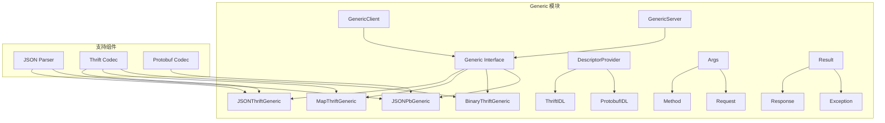

# Generic 模块深度分析

## 目录
1. [模块概述](#模块概述)
2. [架构设计](#架构设计)
3. [核心接口](#核心接口)
4. [泛化类型](#泛化类型)
5. [实现机制](#实现机制)
6. [使用场景](#使用场景)
7. [扩展机制](#扩展机制)

---

## 模块概述

Generic 模块是 Kitex 框架的泛化调用核心，支持在不生成代码的情况下进行 RPC 调用。它提供了多种泛化方式，包括 JSON、Map、Binary 等，极大地提高了框架的灵活性和易用性。

### 核心职责
- 泛化调用抽象
- 多种数据格式支持
- 动态方法调用
- IDL 解析和处理
- 类型转换和适配

### 模块架构图



---

## 架构设计

### 核心类图

```mermaid
classDiagram
    class Generic {
        <<interface>>
        +PayloadCodec() PayloadCodec
        +PayloadCodecType() serviceinfo.PayloadCodec
        +RawThriftBinaryGeneric() bool
        +GetMethod(req, method) (*Method, error)
        +GetExtra(key) interface{}
    }
    
    class JSONThriftGeneric {
        -p DescriptorProvider
        -codec PayloadCodec
        +PayloadCodec() PayloadCodec
        +GetMethod(req, method) (*Method, error)
    }
    
    class MapThriftGeneric {
        -p DescriptorProvider
        -codec PayloadCodec
        +PayloadCodec() PayloadCodec
        +GetMethod(req, method) (*Method, error)
    }
    
    class BinaryThriftGeneric {
        -p DescriptorProvider
        -codec PayloadCodec
        +PayloadCodec() PayloadCodec
        +GetMethod(req, method) (*Method, error)
    }
    
    class DescriptorProvider {
        <<interface>>
        +Provide() <-chan *descriptor.ServiceDescriptor
        +Name() string
    }
    
    class Method {
        +Name string
        +Oneway bool
        +StreamingMode serviceinfo.StreamingMode
    }
    
    class Args {
        +Method string
        +Request interface{}
    }
    
    class Result {
        +Success interface{}
        +Exception interface{}
    }
    
    Generic <|-- JSONThriftGeneric
    Generic <|-- MapThriftGeneric
    Generic <|-- BinaryThriftGeneric
    JSONThriftGeneric *-- DescriptorProvider
    MapThriftGeneric *-- DescriptorProvider
    BinaryThriftGeneric *-- DescriptorProvider
```

---

## 核心接口

### 1. Generic 接口

```go
// Generic 泛化调用接口
type Generic interface {
    // PayloadCodec 返回负载编解码器
    PayloadCodec() remote.PayloadCodec
    
    // PayloadCodecType 返回负载编解码器类型
    PayloadCodecType() serviceinfo.PayloadCodec
    
    // RawThriftBinaryGeneric 是否为原始 Thrift 二进制泛化
    RawThriftBinaryGeneric() bool
    
    // GetMethod 根据请求和方法名获取方法信息
    GetMethod(req interface{}, method string) (*Method, error)
    
    // GetExtra 获取额外信息
    GetExtra(key interface{}) interface{}
}
```

**设计理念**:
- **统一抽象**: 为不同泛化类型提供统一接口
- **灵活扩展**: 通过 GetExtra 支持扩展信息
- **类型安全**: 通过 GetMethod 确保方法调用的正确性

### 2. Method 结构

```go
// Method 方法信息
type Method struct {
    Name          string                      // 方法名
    Oneway        bool                       // 是否为单向调用
    StreamingMode serviceinfo.StreamingMode  // 流式模式
}
```

### 3. 泛化参数和结果

```go
// Args 泛化调用参数
type Args struct {
    Method  string      // 方法名
    Request interface{} // 请求数据
}

// Result 泛化调用结果
type Result struct {
    Success   interface{} // 成功响应
    Exception interface{} // 异常信息
}
```

---

## 泛化类型

### 1. JSON Thrift 泛化

```go
// JSONThriftGeneric JSON 格式的 Thrift 泛化调用
type JSONThriftGeneric struct {
    provider DescriptorProvider
    codec    remote.PayloadCodec
    
    // 缓存相关
    svcDsc   *descriptor.ServiceDescriptor
    funcMap  map[string]*descriptor.FunctionDescriptor
    
    // 选项
    opts *Options
}

// NewJSONThriftGeneric 创建 JSON Thrift 泛化实例
func NewJSONThriftGeneric(dOpts dproto.Options) (Generic, error) {
    provider, err := dproto.NewDescritorFromPath(context.Background(), dOpts.IDLPath, dOpts)
    if err != nil {
        return nil, err
    }
    
    return &JSONThriftGeneric{
        provider: provider,
        codec:    &jsonThriftCodec{},
        funcMap:  make(map[string]*descriptor.FunctionDescriptor),
    }, nil
}
```

#### JSON 编解码实现

```go
type jsonThriftCodec struct{}

func (c *jsonThriftCodec) Marshal(ctx context.Context, message remote.Message, out remote.ByteBuffer) error {
    data := message.Data()
    
    switch v := data.(type) {
    case *Args:
        // 编码请求参数
        return c.marshalArgs(ctx, v, message, out)
    case *Result:
        // 编码响应结果
        return c.marshalResult(ctx, v, message, out)
    default:
        return fmt.Errorf("unsupported data type: %T", data)
    }
}

func (c *jsonThriftCodec) Unmarshal(ctx context.Context, message remote.Message, in remote.ByteBuffer) error {
    data := message.Data()
    
    switch v := data.(type) {
    case *Args:
        // 解码请求参数
        return c.unmarshalArgs(ctx, v, message, in)
    case *Result:
        // 解码响应结果
        return c.unmarshalResult(ctx, v, message, in)
    default:
        return fmt.Errorf("unsupported data type: %T", data)
    }
}

func (c *jsonThriftCodec) marshalArgs(ctx context.Context, args *Args, message remote.Message, out remote.ByteBuffer) error {
    // 获取方法描述符
    method, err := c.getMethodDescriptor(args.Method, message)
    if err != nil {
        return err
    }
    
    // JSON 字符串转换为 Thrift 结构
    jsonStr, ok := args.Request.(string)
    if !ok {
        return fmt.Errorf("request must be JSON string")
    }
    
    // 使用 dynamicgo 进行 JSON 到 Thrift 的转换
    thriftData, err := conv.JSON2Thrift(jsonStr, method.Request)
    if err != nil {
        return err
    }
    
    // 写入 Thrift 二进制数据
    return thrift.Binary.WriteMessageBegin(out, args.Method, thrift.CALL, 0)
    // ... 写入参数数据
}
```

### 2. Map Thrift 泛化

```go
// MapThriftGeneric Map 格式的 Thrift 泛化调用
type MapThriftGeneric struct {
    provider DescriptorProvider
    codec    remote.PayloadCodec
    svcDsc   *descriptor.ServiceDescriptor
    funcMap  map[string]*descriptor.FunctionDescriptor
}

// NewMapThriftGeneric 创建 Map Thrift 泛化实例
func NewMapThriftGeneric(dOpts dproto.Options) (Generic, error) {
    provider, err := dproto.NewDescritorFromPath(context.Background(), dOpts.IDLPath, dOpts)
    if err != nil {
        return nil, err
    }
    
    return &MapThriftGeneric{
        provider: provider,
        codec:    &mapThriftCodec{},
        funcMap:  make(map[string]*descriptor.FunctionDescriptor),
    }, nil
}
```

#### Map 编解码实现

```go
type mapThriftCodec struct{}

func (c *mapThriftCodec) Marshal(ctx context.Context, message remote.Message, out remote.ByteBuffer) error {
    data := message.Data()
    
    switch v := data.(type) {
    case *Args:
        return c.marshalMapArgs(ctx, v, message, out)
    case *Result:
        return c.marshalMapResult(ctx, v, message, out)
    default:
        return fmt.Errorf("unsupported data type: %T", data)
    }
}

func (c *mapThriftCodec) marshalMapArgs(ctx context.Context, args *Args, message remote.Message, out remote.ByteBuffer) error {
    // 获取方法描述符
    method, err := c.getMethodDescriptor(args.Method, message)
    if err != nil {
        return err
    }
    
    // Map 转换为 Thrift 结构
    reqMap, ok := args.Request.(map[string]interface{})
    if !ok {
        return fmt.Errorf("request must be map[string]interface{}")
    }
    
    // 使用 dynamicgo 进行 Map 到 Thrift 的转换
    thriftData, err := conv.Map2Thrift(reqMap, method.Request)
    if err != nil {
        return err
    }
    
    // 写入 Thrift 二进制数据
    return c.writeThriftData(out, args.Method, thriftData)
}
```

### 3. Binary Thrift 泛化

```go
// BinaryThriftGeneric 二进制格式的 Thrift 泛化调用
type BinaryThriftGeneric struct {
    provider DescriptorProvider
    codec    remote.PayloadCodec
}

// NewBinaryThriftGeneric 创建二进制 Thrift 泛化实例
func NewBinaryThriftGeneric() Generic {
    return &BinaryThriftGeneric{
        codec: &binaryThriftCodec{},
    }
}
```

#### Binary 编解码实现

```go
type binaryThriftCodec struct{}

func (c *binaryThriftCodec) Marshal(ctx context.Context, message remote.Message, out remote.ByteBuffer) error {
    data := message.Data()
    
    switch v := data.(type) {
    case *Args:
        // 直接写入二进制数据
        if binaryData, ok := v.Request.([]byte); ok {
            _, err := out.Write(binaryData)
            return err
        }
        return fmt.Errorf("request must be []byte for binary generic")
    case *Result:
        // 直接写入二进制响应
        if binaryData, ok := v.Success.([]byte); ok {
            _, err := out.Write(binaryData)
            return err
        }
        return fmt.Errorf("response must be []byte for binary generic")
    default:
        return fmt.Errorf("unsupported data type: %T", data)
    }
}

func (c *binaryThriftCodec) Unmarshal(ctx context.Context, message remote.Message, in remote.ByteBuffer) error {
    data := message.Data()
    
    // 读取所有二进制数据
    binaryData, err := in.ReadBinary(in.ReadableLen())
    if err != nil {
        return err
    }
    
    switch v := data.(type) {
    case *Args:
        v.Request = binaryData
    case *Result:
        v.Success = binaryData
    default:
        return fmt.Errorf("unsupported data type: %T", data)
    }
    
    return nil
}
```

### 4. JSON Protobuf 泛化

```go
// JSONPbGeneric JSON 格式的 Protobuf 泛化调用
type JSONPbGeneric struct {
    provider DescriptorProvider
    codec    remote.PayloadCodec
    resolver protoreflect.MessageResolver
}

// NewJSONPbGeneric 创建 JSON Protobuf 泛化实例
func NewJSONPbGeneric(dOpts dproto.Options) (Generic, error) {
    provider, err := dproto.NewPbDescritorFromPath(dOpts.IDLPath, dOpts)
    if err != nil {
        return nil, err
    }
    
    return &JSONPbGeneric{
        provider: provider,
        codec:    &jsonPbCodec{},
        resolver: provider.GetResolver(),
    }, nil
}
```

---

## 实现机制

### 1. 描述符提供者

```go
// DescriptorProvider 描述符提供者接口
type DescriptorProvider interface {
    // Provide 提供服务描述符
    Provide() <-chan *descriptor.ServiceDescriptor
    
    // Name 返回提供者名称
    Name() string
}

// ThriftDescriptorProvider Thrift 描述符提供者
type ThriftDescriptorProvider struct {
    idlPath string
    opts    dproto.Options
    svcDsc  *descriptor.ServiceDescriptor
}

func (p *ThriftDescriptorProvider) Provide() <-chan *descriptor.ServiceDescriptor {
    ch := make(chan *descriptor.ServiceDescriptor, 1)
    
    go func() {
        defer close(ch)
        
        if p.svcDsc == nil {
            // 解析 IDL 文件
            tree, err := parser.ParseFile(p.idlPath, p.opts.Includes, true)
            if err != nil {
                return
            }
            
            // 构建服务描述符
            p.svcDsc, err = dproto.BuildServiceDescriptor(tree, p.opts)
            if err != nil {
                return
            }
        }
        
        ch <- p.svcDsc
    }()
    
    return ch
}
```

### 2. 方法解析

```go
func (g *JSONThriftGeneric) GetMethod(req interface{}, method string) (*Method, error) {
    // 获取服务描述符
    if g.svcDsc == nil {
        select {
        case svcDsc := <-g.provider.Provide():
            g.svcDsc = svcDsc
        default:
            return nil, errors.New("service descriptor not available")
        }
    }
    
    // 查找方法描述符
    funcDsc, exists := g.funcMap[method]
    if !exists {
        for _, function := range g.svcDsc.Functions {
            if function.Name == method {
                funcDsc = function
                g.funcMap[method] = funcDsc
                break
            }
        }
    }
    
    if funcDsc == nil {
        return nil, fmt.Errorf("method %s not found", method)
    }
    
    return &Method{
        Name:          funcDsc.Name,
        Oneway:        funcDsc.Oneway,
        StreamingMode: getStreamingMode(funcDsc),
    }, nil
}
```

### 3. 类型转换

```go
// JSON 到 Thrift 类型转换
func JSON2Thrift(jsonStr string, desc *descriptor.TypeDescriptor) (interface{}, error) {
    var jsonData interface{}
    if err := json.Unmarshal([]byte(jsonStr), &jsonData); err != nil {
        return nil, err
    }
    
    return convertJSONToThrift(jsonData, desc)
}

func convertJSONToThrift(data interface{}, desc *descriptor.TypeDescriptor) (interface{}, error) {
    switch desc.Type {
    case descriptor.BOOL:
        if v, ok := data.(bool); ok {
            return v, nil
        }
        return false, fmt.Errorf("expected bool, got %T", data)
        
    case descriptor.I8, descriptor.I16, descriptor.I32:
        if v, ok := data.(float64); ok {
            return int32(v), nil
        }
        return int32(0), fmt.Errorf("expected number, got %T", data)
        
    case descriptor.I64:
        if v, ok := data.(float64); ok {
            return int64(v), nil
        }
        return int64(0), fmt.Errorf("expected number, got %T", data)
        
    case descriptor.DOUBLE:
        if v, ok := data.(float64); ok {
            return v, nil
        }
        return float64(0), fmt.Errorf("expected number, got %T", data)
        
    case descriptor.STRING:
        if v, ok := data.(string); ok {
            return v, nil
        }
        return "", fmt.Errorf("expected string, got %T", data)
        
    case descriptor.LIST:
        return convertJSONToThriftList(data, desc.Elem)
        
    case descriptor.SET:
        return convertJSONToThriftSet(data, desc.Elem)
        
    case descriptor.MAP:
        return convertJSONToThriftMap(data, desc.Key, desc.Elem)
        
    case descriptor.STRUCT:
        return convertJSONToThriftStruct(data, desc.Struct)
        
    default:
        return nil, fmt.Errorf("unsupported type: %v", desc.Type)
    }
}
```

### 4. 泛化客户端实现

```go
// GenericClient 泛化客户端
type GenericClient struct {
    kClient  client.Client
    g        Generic
    svcInfo  *serviceinfo.ServiceInfo
}

// NewGenericClient 创建泛化客户端
func NewGenericClient(destService string, g Generic, opts ...client.Option) (Client, error) {
    // 构建泛化服务信息
    svcInfo := &serviceinfo.ServiceInfo{
        ServiceName:  destService,
        HandlerType:  (*GenericService)(nil),
        Methods:      make(map[string]serviceinfo.MethodInfo),
        PayloadCodec: g.PayloadCodecType(),
        GenericMethod: func(ctx context.Context, methodName string) serviceinfo.MethodInfo {
            return &genericMethodInfo{
                methodName: methodName,
                generic:    g,
            }
        },
    }
    
    // 添加泛化方法
    svcInfo.Methods[GenericMethod] = &genericMethodInfo{
        methodName: GenericMethod,
        generic:    g,
    }
    
    // 创建底层客户端
    kc, err := client.NewClient(svcInfo, append(opts, client.WithGeneric(g))...)
    if err != nil {
        return nil, err
    }
    
    return &GenericClient{
        kClient: kc,
        g:       g,
        svcInfo: svcInfo,
    }, nil
}

// GenericCall 泛化调用
func (gc *GenericClient) GenericCall(ctx context.Context, method string, request interface{}, callOptions ...callopt.Option) (response interface{}, err error) {
    // 构建泛化参数
    args := &Args{
        Method:  method,
        Request: request,
    }
    
    // 构建泛化结果
    result := &Result{}
    
    // 执行调用
    err = gc.kClient.Call(ctx, GenericMethod, args, result, callOptions...)
    if err != nil {
        return nil, err
    }
    
    // 检查异常
    if result.Exception != nil {
        return nil, fmt.Errorf("remote exception: %v", result.Exception)
    }
    
    return result.Success, nil
}
```

---

## 使用场景

### 1. API 网关场景

```go
// API 网关中的泛化调用
func handleAPIRequest(w http.ResponseWriter, r *http.Request) {
    // 解析请求
    serviceName := r.Header.Get("Service-Name")
    methodName := r.Header.Get("Method-Name")
    
    // 读取请求体
    body, err := ioutil.ReadAll(r.Body)
    if err != nil {
        http.Error(w, err.Error(), http.StatusBadRequest)
        return
    }
    
    // 创建泛化客户端
    g, err := generic.JSONThriftGeneric("path/to/idl/" + serviceName + ".thrift")
    if err != nil {
        http.Error(w, err.Error(), http.StatusInternalServerError)
        return
    }
    
    client, err := genericclient.NewClient(serviceName, g)
    if err != nil {
        http.Error(w, err.Error(), http.StatusInternalServerError)
        return
    }
    
    // 执行泛化调用
    resp, err := client.GenericCall(r.Context(), methodName, string(body))
    if err != nil {
        http.Error(w, err.Error(), http.StatusInternalServerError)
        return
    }
    
    // 返回响应
    w.Header().Set("Content-Type", "application/json")
    w.Write([]byte(resp.(string)))
}
```

### 2. 测试工具场景

```go
// RPC 测试工具
type RPCTester struct {
    clients map[string]genericclient.Client
}

func (t *RPCTester) TestMethod(serviceName, methodName string, testCases []TestCase) []TestResult {
    var results []TestResult
    
    // 获取或创建泛化客户端
    client, exists := t.clients[serviceName]
    if !exists {
        g, err := generic.JSONThriftGeneric("idl/" + serviceName + ".thrift")
        if err != nil {
            return []TestResult{{Error: err}}
        }
        
        client, err = genericclient.NewClient(serviceName, g)
        if err != nil {
            return []TestResult{{Error: err}}
        }
        
        t.clients[serviceName] = client
    }
    
    // 执行测试用例
    for _, testCase := range testCases {
        start := time.Now()
        
        resp, err := client.GenericCall(context.Background(), methodName, testCase.Input)
        
        duration := time.Since(start)
        
        result := TestResult{
            Input:    testCase.Input,
            Output:   resp,
            Error:    err,
            Duration: duration,
            Expected: testCase.Expected,
        }
        
        // 验证结果
        if err == nil && testCase.Expected != nil {
            result.Passed = compareResults(resp, testCase.Expected)
        }
        
        results = append(results, result)
    }
    
    return results
}
```

### 3. 动态代理场景

```go
// 动态代理服务
type DynamicProxy struct {
    upstreams map[string]genericclient.Client
    router    *Router
}

func (p *DynamicProxy) HandleRequest(ctx context.Context, req *ProxyRequest) (*ProxyResponse, error) {
    // 路由到上游服务
    upstream := p.router.Route(req.ServiceName, req.Method)
    
    // 获取泛化客户端
    client, exists := p.upstreams[upstream]
    if !exists {
        return nil, fmt.Errorf("upstream %s not found", upstream)
    }
    
    // 执行泛化调用
    resp, err := client.GenericCall(ctx, req.Method, req.Data)
    if err != nil {
        return nil, err
    }
    
    return &ProxyResponse{
        Data: resp,
    }, nil
}
```

---

## 扩展机制

### 1. 自定义泛化类型

```go
// CustomGeneric 自定义泛化类型
type CustomGeneric struct {
    codec remote.PayloadCodec
}

func (g *CustomGeneric) PayloadCodec() remote.PayloadCodec {
    return g.codec
}

func (g *CustomGeneric) PayloadCodecType() serviceinfo.PayloadCodec {
    return serviceinfo.Thrift // 或其他类型
}

func (g *CustomGeneric) RawThriftBinaryGeneric() bool {
    return false
}

func (g *CustomGeneric) GetMethod(req interface{}, method string) (*generic.Method, error) {
    // 自定义方法解析逻辑
    return &generic.Method{
        Name:          method,
        Oneway:        false,
        StreamingMode: serviceinfo.StreamingNone,
    }, nil
}

func (g *CustomGeneric) GetExtra(key interface{}) interface{} {
    // 返回扩展信息
    return nil
}
```

### 2. 自定义编解码器

```go
// CustomGenericCodec 自定义泛化编解码器
type CustomGenericCodec struct{}

func (c *CustomGenericCodec) Marshal(ctx context.Context, message remote.Message, out remote.ByteBuffer) error {
    data := message.Data()
    
    switch v := data.(type) {
    case *generic.Args:
        // 自定义请求编码逻辑
        return c.marshalRequest(v, out)
    case *generic.Result:
        // 自定义响应编码逻辑
        return c.marshalResponse(v, out)
    default:
        return fmt.Errorf("unsupported data type: %T", data)
    }
}

func (c *CustomGenericCodec) Unmarshal(ctx context.Context, message remote.Message, in remote.ByteBuffer) error {
    data := message.Data()
    
    switch v := data.(type) {
    case *generic.Args:
        // 自定义请求解码逻辑
        return c.unmarshalRequest(v, in)
    case *generic.Result:
        // 自定义响应解码逻辑
        return c.unmarshalResponse(v, in)
    default:
        return fmt.Errorf("unsupported data type: %T", data)
    }
}

func (c *CustomGenericCodec) Name() string {
    return "custom-generic"
}
```

### 3. 泛化中间件

```go
// GenericMiddleware 泛化调用中间件
func GenericMiddleware(next endpoint.Endpoint) endpoint.Endpoint {
    return func(ctx context.Context, req, resp interface{}) (err error) {
        // 检查是否为泛化调用
        if args, ok := req.(*generic.Args); ok {
            // 泛化调用前置处理
            log.Printf("Generic call: method=%s", args.Method)
            
            // 记录开始时间
            start := time.Now()
            
            // 执行调用
            err = next(ctx, req, resp)
            
            // 泛化调用后置处理
            duration := time.Since(start)
            
            if result, ok := resp.(*generic.Result); ok {
                if err != nil {
                    log.Printf("Generic call failed: method=%s, duration=%v, error=%v", 
                        args.Method, duration, err)
                } else if result.Exception != nil {
                    log.Printf("Generic call exception: method=%s, duration=%v, exception=%v", 
                        args.Method, duration, result.Exception)
                } else {
                    log.Printf("Generic call success: method=%s, duration=%v", 
                        args.Method, duration)
                }
            }
            
            return err
        }
        
        // 非泛化调用，直接执行
        return next(ctx, req, resp)
    }
}
```

### 4. 动态 IDL 加载

```go
// DynamicIDLProvider 动态 IDL 提供者
type DynamicIDLProvider struct {
    idlCache map[string]*descriptor.ServiceDescriptor
    loader   IDLLoader
    mutex    sync.RWMutex
}

type IDLLoader interface {
    LoadIDL(serviceName string) (string, error)
}

func (p *DynamicIDLProvider) GetServiceDescriptor(serviceName string) (*descriptor.ServiceDescriptor, error) {
    p.mutex.RLock()
    if desc, exists := p.idlCache[serviceName]; exists {
        p.mutex.RUnlock()
        return desc, nil
    }
    p.mutex.RUnlock()
    
    // 动态加载 IDL
    idlContent, err := p.loader.LoadIDL(serviceName)
    if err != nil {
        return nil, err
    }
    
    // 解析 IDL
    desc, err := p.parseIDL(idlContent)
    if err != nil {
        return nil, err
    }
    
    // 缓存描述符
    p.mutex.Lock()
    p.idlCache[serviceName] = desc
    p.mutex.Unlock()
    
    return desc, nil
}

// HTTPIDLLoader 从 HTTP 加载 IDL
type HTTPIDLLoader struct {
    baseURL string
    client  *http.Client
}

func (l *HTTPIDLLoader) LoadIDL(serviceName string) (string, error) {
    url := fmt.Sprintf("%s/idl/%s.thrift", l.baseURL, serviceName)
    
    resp, err := l.client.Get(url)
    if err != nil {
        return "", err
    }
    defer resp.Body.Close()
    
    if resp.StatusCode != http.StatusOK {
        return "", fmt.Errorf("failed to load IDL: status=%d", resp.StatusCode)
    }
    
    content, err := ioutil.ReadAll(resp.Body)
    if err != nil {
        return "", err
    }
    
    return string(content), nil
}
```

---

## 总结

Generic 模块是 Kitex 框架的重要组成部分，具有以下特点：

### 设计优势
1. **多格式支持**: JSON、Map、Binary 等多种数据格式
2. **协议兼容**: 支持 Thrift 和 Protobuf 协议
3. **动态调用**: 无需生成代码即可进行 RPC 调用
4. **类型安全**: 通过 IDL 解析确保类型正确性
5. **高度扩展**: 支持自定义泛化类型和编解码器

### 关键技术点
1. **IDL 解析**: 动态解析 Thrift 和 Protobuf IDL
2. **类型转换**: JSON/Map 到 Thrift/Protobuf 的类型转换
3. **描述符缓存**: 提高重复调用的性能
4. **编解码抽象**: 统一的编解码器接口
5. **方法路由**: 动态方法解析和路由

### 应用场景
1. **API 网关**: 统一的服务调用入口
2. **测试工具**: RPC 接口测试和验证
3. **动态代理**: 服务间的动态路由和代理
4. **监控系统**: 服务调用的监控和统计
5. **开发调试**: 快速的接口调试和验证

### 最佳实践
1. **合理缓存**: 缓存 IDL 解析结果提高性能
2. **类型验证**: 确保请求数据类型的正确性
3. **错误处理**: 完善的异常处理和错误信息
4. **性能优化**: 避免重复的类型转换操作
5. **扩展设计**: 为特定场景设计专用的泛化类型

Generic 模块的设计体现了 Kitex 框架的灵活性和扩展性，为动态调用和跨语言互操作提供了强大的支持。通过合理使用泛化调用，可以大大简化系统集成和测试工作。
