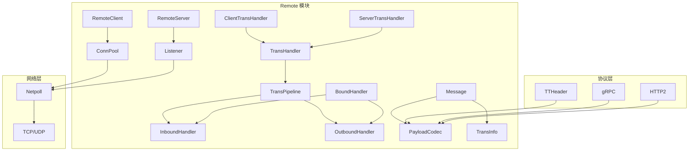
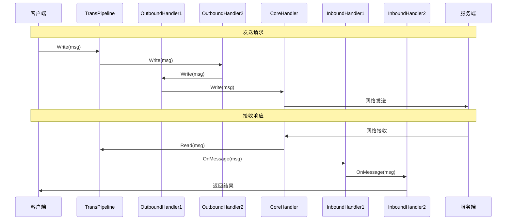

# Remote 模块深度分析

## 目录
1. [模块概述](#模块概述)
2. [架构设计](#架构设计)
3. [核心抽象](#核心抽象)
4. [传输处理器](#传输处理器)
5. [消息系统](#消息系统)
6. [编解码器](#编解码器)
7. [扩展机制](#扩展机制)

---

## 模块概述

Remote 模块是 Kitex 框架的传输层核心，负责网络通信、协议处理、消息编解码等底层功能。它抽象了不同传输协议的差异，为上层提供统一的接口。

### 核心职责
- 网络连接管理
- 协议编解码
- 消息传输
- 传输管道处理
- 连接池管理
- 流式传输支持

### 模块架构图



---

## 架构设计

### 核心类图

```mermaid
classDiagram
    class TransHandler {
        <<interface>>
        +Write(ctx, conn, msg) error
        +Read(ctx, conn, msg) error
        +OnInactive(ctx, conn)
        +OnError(ctx, err, conn)
        +OnMessage(ctx, args, result) error
        +SetPipeline(pipeline)
    }
    
    class ClientTransHandler {
        <<interface>>
    }
    
    class ServerTransHandler {
        <<interface>>
        +OnActive(ctx, conn) error
        +OnRead(ctx, conn) error
    }
    
    class Message {
        <<interface>>
        +RPCInfo() RPCInfo
        +Data() interface{}
        +MessageType() MessageType
        +PayloadCodec() PayloadCodec
        +TransInfo() TransInfo
        +Recycle()
    }
    
    class TransPipeline {
        -handler TransHandler
        -inbounds []InboundHandler
        -outbounds []OutboundHandler
        +AddInboundHandler(handler)
        +AddOutboundHandler(handler)
        +Write(ctx, conn, msg) error
        +Read(ctx, conn, msg) error
    }
    
    class PayloadCodec {
        <<interface>>
        +Marshal(ctx, msg, out) error
        +Unmarshal(ctx, msg, in) error
        +Name() string
    }
    
    TransHandler <|-- ClientTransHandler
    TransHandler <|-- ServerTransHandler
    TransHandler *-- TransPipeline
    Message *-- PayloadCodec
```

---

## 核心抽象

### 1. TransHandler 接口

```go
// TransHandler 类似于 Netty 中的处理器角色
// 传输层可以重构为支持管道，从而能够在连接级别支持其他扩展
type TransHandler interface {
    TransReadWriter
    OnInactive(ctx context.Context, conn net.Conn)
    OnError(ctx context.Context, err error, conn net.Conn)
    OnMessage(ctx context.Context, args, result Message) (context.Context, error)
    SetPipeline(pipeline *TransPipeline)
}

// TransReadWriter 定义读写接口
type TransReadWriter interface {
    Write(ctx context.Context, conn net.Conn, send Message) (nctx context.Context, err error)
    Read(ctx context.Context, conn net.Conn, msg Message) (nctx context.Context, err error)
}
```

**设计理念**:
- **统一抽象**: 为不同协议提供统一的处理接口
- **事件驱动**: 通过回调方法处理连接生命周期事件
- **管道支持**: 通过 SetPipeline 支持处理器链

### 2. 客户端和服务端特化

```go
// ClientTransHandler 客户端传输处理器
type ClientTransHandler interface {
    TransHandler
}

// ServerTransHandler 服务端传输处理器，具有额外功能
type ServerTransHandler interface {
    TransHandler
    OnActive(ctx context.Context, conn net.Conn) (context.Context, error)
    OnRead(ctx context.Context, conn net.Conn) error
}
```

**差异化设计**:
- **客户端**: 主要关注请求发送和响应接收
- **服务端**: 需要处理连接激活、数据读取等额外事件

### 3. 传输处理器工厂

```go
// ClientTransHandlerFactory 客户端传输处理器工厂
type ClientTransHandlerFactory interface {
    NewTransHandler(opt *ClientOption) (ClientTransHandler, error)
}

// ServerTransHandlerFactory 服务端传输处理器工厂
type ServerTransHandlerFactory interface {
    NewTransHandler(opt *ServerOption) (ServerTransHandler, error)
}
```

---

## 传输处理器

### 1. 传输管道设计

```go
// TransPipeline 传输管道，实现处理器链模式
type TransPipeline struct {
    handler   TransHandler
    inbounds  []InboundHandler
    outbounds []OutboundHandler
}

// NewTransPipeline 创建传输管道
func NewTransPipeline(handler TransHandler) *TransPipeline {
    return &TransPipeline{
        handler: handler,
    }
}

// AddInboundHandler 添加入站处理器
func (p *TransPipeline) AddInboundHandler(handler InboundHandler) {
    p.inbounds = append(p.inbounds, handler)
}

// AddOutboundHandler 添加出站处理器
func (p *TransPipeline) AddOutboundHandler(handler OutboundHandler) {
    p.outbounds = append(p.outbounds, handler)
}
```

### 2. 入站和出站处理器

```go
// InboundHandler 入站处理器（处理接收到的数据）
type InboundHandler interface {
    OnActive(ctx context.Context, conn net.Conn) (context.Context, error)
    OnInactive(ctx context.Context, conn net.Conn)
    OnRead(ctx context.Context, conn net.Conn) (context.Context, error)
    OnMessage(ctx context.Context, args, result Message) (context.Context, error)
}

// OutboundHandler 出站处理器（处理发送的数据）
type OutboundHandler interface {
    Write(ctx context.Context, conn net.Conn, send Message) (context.Context, error)
}

// BoundHandler 双向处理器
type BoundHandler interface {
    InboundHandler
    OutboundHandler
}
```

### 3. 管道执行流程

```go
// Write 写入数据，执行出站处理器链
func (p *TransPipeline) Write(ctx context.Context, conn net.Conn, send Message) (context.Context, error) {
    var err error
    
    // 执行出站处理器链
    for i := len(p.outbounds) - 1; i >= 0; i-- {
        ctx, err = p.outbounds[i].Write(ctx, conn, send)
        if err != nil {
            return ctx, err
        }
    }
    
    // 执行核心处理器
    return p.handler.Write(ctx, conn, send)
}

// Read 读取数据，执行入站处理器链
func (p *TransPipeline) Read(ctx context.Context, conn net.Conn, msg Message) (context.Context, error) {
    var err error
    
    // 执行核心处理器
    ctx, err = p.handler.Read(ctx, conn, msg)
    if err != nil {
        return ctx, err
    }
    
    // 执行入站处理器链
    for _, handler := range p.inbounds {
        if msgHandler, ok := handler.(interface {
            OnMessage(context.Context, Message, Message) (context.Context, error)
        }); ok {
            ctx, err = msgHandler.OnMessage(ctx, msg, nil)
            if err != nil {
                return ctx, err
            }
        }
    }
    
    return ctx, nil
}
```

### 4. 处理器链时序图



---

## 消息系统

### 1. Message 接口设计

```go
// Message 是 Kitex 消息的核心抽象
type Message interface {
    RPCInfo() rpcinfo.RPCInfo           // RPC 信息
    Data() interface{}                  // 消息数据
    NewData(method string) (ok bool)    // 创建新数据
    MessageType() MessageType           // 消息类型
    SetMessageType(MessageType)         // 设置消息类型
    RPCRole() RPCRole                   // RPC 角色
    PayloadLen() int                    // 负载长度
    SetPayloadLen(size int)             // 设置负载长度
    TransInfo() TransInfo               // 传输信息
    Tags() map[string]interface{}       // 标签信息
    PayloadCodec() PayloadCodec         // 负载编解码器
    SetPayloadCodec(pc PayloadCodec)    // 设置编解码器
    Recycle()                           // 回收消息
}
```

### 2. 消息类型定义

```go
// MessageType 消息类型
type MessageType int32

const (
    InvalidMessageType MessageType = 0
    Call              MessageType = 1  // 请求消息
    Reply             MessageType = 2  // 响应消息
    Oneway            MessageType = 3  // 单向消息
    Exception         MessageType = 4  // 异常消息
)

// RPCRole RPC 角色
type RPCRole int

const (
    Client RPCRole = 1  // 客户端
    Server RPCRole = 2  // 服务端
)
```

### 3. 消息实现

```go
type message struct {
    msgType      MessageType                // 消息类型
    data         interface{}                // 消息数据
    rpcInfo      rpcinfo.RPCInfo           // RPC 信息
    rpcRole      RPCRole                   // RPC 角色
    compressType CompressType              // 压缩类型
    payloadSize  int                       // 负载大小
    transInfo    TransInfo                 // 传输信息
    tags         map[string]interface{}    // 标签映射
    payloadCodec PayloadCodec              // 负载编解码器
}

// NewMessage 创建新消息
func NewMessage(data interface{}, ri rpcinfo.RPCInfo, msgType MessageType, rpcRole RPCRole) Message {
    msg := messagePool.Get().(*message)
    msg.data = data
    msg.rpcInfo = ri
    msg.msgType = msgType
    msg.rpcRole = rpcRole
    msg.transInfo = transInfoPool.Get().(*transInfo)
    return msg
}

// RecycleMessage 回收消息
func RecycleMessage(msg Message) {
    if msg != nil {
        msg.Recycle()
    }
}
```

### 4. 消息池化优化

```go
var (
    messagePool    = sync.Pool{New: newMessage}
    transInfoPool  = sync.Pool{New: newTransInfo}
)

func newMessage() interface{} {
    return &message{tags: make(map[string]interface{})}
}

func (m *message) Recycle() {
    m.zero()
    messagePool.Put(m)
}

func (m *message) zero() {
    m.msgType = InvalidMessageType
    m.data = nil
    m.rpcInfo = nil
    m.rpcRole = -1
    m.compressType = NoCompress
    m.payloadSize = 0
    if m.transInfo != nil {
        m.transInfo.Recycle()
        m.transInfo = nil
    }
    for k := range m.tags {
        delete(m.tags, k)
    }
}
```

### 5. 传输信息管理

```go
// TransInfo 传输信息接口
type TransInfo interface {
    PutTransIntInfo(key, val string)     // 设置传输信息
    GetTransIntInfo(key string) string   // 获取传输信息
    TransIntInfo() map[string]string     // 获取所有传输信息
    TransStrInfo() map[string]string     // 获取字符串信息
    Recycle()                            // 回收
}

type transInfo struct {
    transIntInfo map[string]string  // 整数信息
    transStrInfo map[string]string  // 字符串信息
}

func (t *transInfo) PutTransIntInfo(key, val string) {
    if t.transIntInfo == nil {
        t.transIntInfo = make(map[string]string)
    }
    t.transIntInfo[key] = val
}

func (t *transInfo) GetTransIntInfo(key string) string {
    if t.transIntInfo == nil {
        return ""
    }
    return t.transIntInfo[key]
}
```

---

## 编解码器

### 1. PayloadCodec 接口

```go
// PayloadCodec 负载编解码器接口
type PayloadCodec interface {
    Marshal(ctx context.Context, message Message, out ByteBuffer) error
    Unmarshal(ctx context.Context, message Message, in ByteBuffer) error
    Name() string
}
```

### 2. 编解码器注册

```go
var (
    payloadCodecMap = make(map[serviceinfo.PayloadCodec]PayloadCodec)
    codecMutex      sync.RWMutex
)

// RegisterPayloadCodec 注册负载编解码器
func RegisterPayloadCodec(pc PayloadCodec) {
    codecMutex.Lock()
    defer codecMutex.Unlock()
    
    // 根据名称映射到 PayloadCodec 类型
    var codecType serviceinfo.PayloadCodec
    switch pc.Name() {
    case "thrift":
        codecType = serviceinfo.Thrift
    case "protobuf":
        codecType = serviceinfo.Protobuf
    case "hessian2":
        codecType = serviceinfo.Hessian2
    default:
        panic(fmt.Sprintf("unknown payload codec: %s", pc.Name()))
    }
    
    payloadCodecMap[codecType] = pc
}

// GetPayloadCodec 获取负载编解码器
func GetPayloadCodec(codecType serviceinfo.PayloadCodec) PayloadCodec {
    codecMutex.RLock()
    defer codecMutex.RUnlock()
    
    return payloadCodecMap[codecType]
}
```

### 3. Thrift 编解码器实现

```go
// ThriftCodec Thrift 编解码器
type ThriftCodec struct{}

func (c *ThriftCodec) Marshal(ctx context.Context, message Message, out ByteBuffer) error {
    data := message.Data()
    
    // 使用 Thrift 协议编码
    if tWriter, ok := data.(thrift.TStruct); ok {
        protocol := thrift.NewTBinaryProtocolTransport(out)
        return tWriter.Write(protocol)
    }
    
    return fmt.Errorf("data is not thrift.TStruct: %T", data)
}

func (c *ThriftCodec) Unmarshal(ctx context.Context, message Message, in ByteBuffer) error {
    data := message.Data()
    
    // 使用 Thrift 协议解码
    if tReader, ok := data.(thrift.TStruct); ok {
        protocol := thrift.NewTBinaryProtocolTransport(in)
        return tReader.Read(protocol)
    }
    
    return fmt.Errorf("data is not thrift.TStruct: %T", data)
}

func (c *ThriftCodec) Name() string {
    return "thrift"
}
```

### 4. Protobuf 编解码器实现

```go
// ProtobufCodec Protobuf 编解码器
type ProtobufCodec struct{}

func (c *ProtobufCodec) Marshal(ctx context.Context, message Message, out ByteBuffer) error {
    data := message.Data()
    
    // 使用 Protobuf 编码
    if pbMsg, ok := data.(proto.Message); ok {
        bytes, err := proto.Marshal(pbMsg)
        if err != nil {
            return err
        }
        _, err = out.Write(bytes)
        return err
    }
    
    return fmt.Errorf("data is not proto.Message: %T", data)
}

func (c *ProtobufCodec) Unmarshal(ctx context.Context, message Message, in ByteBuffer) error {
    data := message.Data()
    
    // 使用 Protobuf 解码
    if pbMsg, ok := data.(proto.Message); ok {
        bytes, err := in.ReadBinary(in.ReadableLen())
        if err != nil {
            return err
        }
        return proto.Unmarshal(bytes, pbMsg)
    }
    
    return fmt.Errorf("data is not proto.Message: %T", data)
}

func (c *ProtobufCodec) Name() string {
    return "protobuf"
}
```

---

## 扩展机制

### 1. 自定义传输处理器

```go
// CustomTransHandler 自定义传输处理器
type CustomTransHandler struct {
    pipeline *TransPipeline
}

func (h *CustomTransHandler) Write(ctx context.Context, conn net.Conn, send Message) (context.Context, error) {
    // 自定义写入逻辑
    log.Printf("Writing message: type=%v, size=%d", send.MessageType(), send.PayloadLen())
    
    // 调用默认实现或自定义实现
    return h.defaultWrite(ctx, conn, send)
}

func (h *CustomTransHandler) Read(ctx context.Context, conn net.Conn, msg Message) (context.Context, error) {
    // 自定义读取逻辑
    log.Printf("Reading message: type=%v", msg.MessageType())
    
    // 调用默认实现或自定义实现
    return h.defaultRead(ctx, conn, msg)
}

func (h *CustomTransHandler) OnInactive(ctx context.Context, conn net.Conn) {
    log.Printf("Connection inactive: %s", conn.RemoteAddr())
}

func (h *CustomTransHandler) OnError(ctx context.Context, err error, conn net.Conn) {
    log.Printf("Connection error: %v from %s", err, conn.RemoteAddr())
}

func (h *CustomTransHandler) OnMessage(ctx context.Context, args, result Message) (context.Context, error) {
    // 自定义消息处理逻辑
    return ctx, nil
}

func (h *CustomTransHandler) SetPipeline(pipeline *TransPipeline) {
    h.pipeline = pipeline
}
```

### 2. 自定义边界处理器

```go
// CustomBoundHandler 自定义边界处理器
type CustomBoundHandler struct{}

func (h *CustomBoundHandler) OnActive(ctx context.Context, conn net.Conn) (context.Context, error) {
    // 连接激活时的自定义处理
    log.Printf("Connection activated: %s", conn.RemoteAddr())
    
    // 可以在上下文中添加自定义信息
    ctx = context.WithValue(ctx, "connection_time", time.Now())
    
    return ctx, nil
}

func (h *CustomBoundHandler) OnInactive(ctx context.Context, conn net.Conn) {
    // 连接断开时的自定义处理
    if startTime, ok := ctx.Value("connection_time").(time.Time); ok {
        duration := time.Since(startTime)
        log.Printf("Connection closed: %s, duration: %v", conn.RemoteAddr(), duration)
    }
}

func (h *CustomBoundHandler) OnRead(ctx context.Context, conn net.Conn) (context.Context, error) {
    // 读取数据时的自定义处理
    return ctx, nil
}

func (h *CustomBoundHandler) OnMessage(ctx context.Context, args, result Message) (context.Context, error) {
    // 消息处理时的自定义逻辑
    ri := args.RPCInfo()
    log.Printf("Processing message: service=%s, method=%s", 
        ri.To().ServiceName(), ri.Invocation().MethodName())
    
    return ctx, nil
}

func (h *CustomBoundHandler) Write(ctx context.Context, conn net.Conn, send Message) (context.Context, error) {
    // 写入数据时的自定义处理
    log.Printf("Sending message: type=%v, size=%d", send.MessageType(), send.PayloadLen())
    
    return ctx, nil
}
```

### 3. 自定义编解码器

```go
// CustomCodec 自定义编解码器
type CustomCodec struct{}

func (c *CustomCodec) Marshal(ctx context.Context, message Message, out ByteBuffer) error {
    data := message.Data()
    
    // 自定义编码逻辑
    switch v := data.(type) {
    case string:
        // 字符串类型的简单编码
        _, err := out.WriteString(v)
        return err
    case []byte:
        // 字节数组的直接写入
        _, err := out.Write(v)
        return err
    default:
        // 使用 JSON 作为默认编码
        jsonBytes, err := json.Marshal(v)
        if err != nil {
            return err
        }
        _, err = out.Write(jsonBytes)
        return err
    }
}

func (c *CustomCodec) Unmarshal(ctx context.Context, message Message, in ByteBuffer) error {
    data := message.Data()
    
    // 读取所有数据
    bytes, err := in.ReadBinary(in.ReadableLen())
    if err != nil {
        return err
    }
    
    // 自定义解码逻辑
    switch v := data.(type) {
    case *string:
        *v = string(bytes)
        return nil
    case *[]byte:
        *v = bytes
        return nil
    default:
        // 使用 JSON 作为默认解码
        return json.Unmarshal(bytes, v)
    }
}

func (c *CustomCodec) Name() string {
    return "custom"
}

// 注册自定义编解码器
func init() {
    RegisterPayloadCodec(&CustomCodec{})
}
```

### 4. 连接池扩展

```go
// CustomConnPool 自定义连接池
type CustomConnPool struct {
    pools map[string]*connPool
    mutex sync.RWMutex
}

type connPool struct {
    conns   chan net.Conn
    factory func() (net.Conn, error)
    maxSize int
}

func NewCustomConnPool(maxSize int) *CustomConnPool {
    return &CustomConnPool{
        pools: make(map[string]*connPool),
        maxSize: maxSize,
    }
}

func (p *CustomConnPool) Get(ctx context.Context, network, address string, opt ConnOption) (net.Conn, error) {
    key := network + "://" + address
    
    p.mutex.RLock()
    pool, exists := p.pools[key]
    p.mutex.RUnlock()
    
    if !exists {
        p.mutex.Lock()
        if pool, exists = p.pools[key]; !exists {
            pool = &connPool{
                conns: make(chan net.Conn, p.maxSize),
                factory: func() (net.Conn, error) {
                    return opt.Dialer.DialTimeout(network, address, opt.ConnectTimeout)
                },
                maxSize: p.maxSize,
            }
            p.pools[key] = pool
        }
        p.mutex.Unlock()
    }
    
    // 尝试从池中获取连接
    select {
    case conn := <-pool.conns:
        return conn, nil
    default:
        // 池中没有连接，创建新连接
        return pool.factory()
    }
}

func (p *CustomConnPool) Put(conn net.Conn) error {
    if conn == nil {
        return nil
    }
    
    key := conn.RemoteAddr().Network() + "://" + conn.RemoteAddr().String()
    
    p.mutex.RLock()
    pool, exists := p.pools[key]
    p.mutex.RUnlock()
    
    if exists {
        select {
        case pool.conns <- conn:
            return nil
        default:
            // 池已满，关闭连接
            return conn.Close()
        }
    }
    
    return conn.Close()
}

func (p *CustomConnPool) Close() error {
    p.mutex.Lock()
    defer p.mutex.Unlock()
    
    for _, pool := range p.pools {
        close(pool.conns)
        for conn := range pool.conns {
            conn.Close()
        }
    }
    
    p.pools = make(map[string]*connPool)
    return nil
}
```

---

## 总结

Remote 模块是 Kitex 框架的传输层核心，具有以下特点：

### 设计优势
1. **清晰的分层抽象**: 传输处理器、消息系统、编解码器职责明确
2. **灵活的管道机制**: 支持处理器链和扩展点
3. **统一的消息模型**: 抽象不同协议的差异
4. **高效的资源管理**: 对象池化和连接复用
5. **强大的扩展能力**: 支持自定义处理器和编解码器

### 关键技术点
1. **管道模式**: 实现灵活的处理器链
2. **消息抽象**: 统一不同协议的消息模型
3. **对象池化**: 减少内存分配和 GC 压力
4. **协议适配**: 支持多种传输协议
5. **连接管理**: 高效的连接池实现

### 最佳实践
1. **合理使用对象池**: 避免频繁的内存分配
2. **正确实现编解码器**: 确保协议兼容性
3. **优化传输处理器**: 减少不必要的数据拷贝
4. **监控连接状态**: 及时发现网络问题
5. **扩展处理器链**: 实现自定义的传输逻辑

Remote 模块的设计体现了 Kitex 框架在传输层的抽象能力和扩展性，为支持多种协议和自定义扩展提供了坚实的基础。通过合理的抽象和优化，实现了高性能的网络通信能力。
