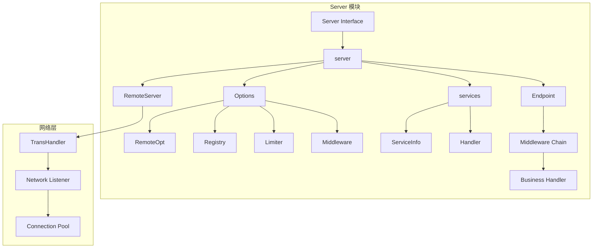
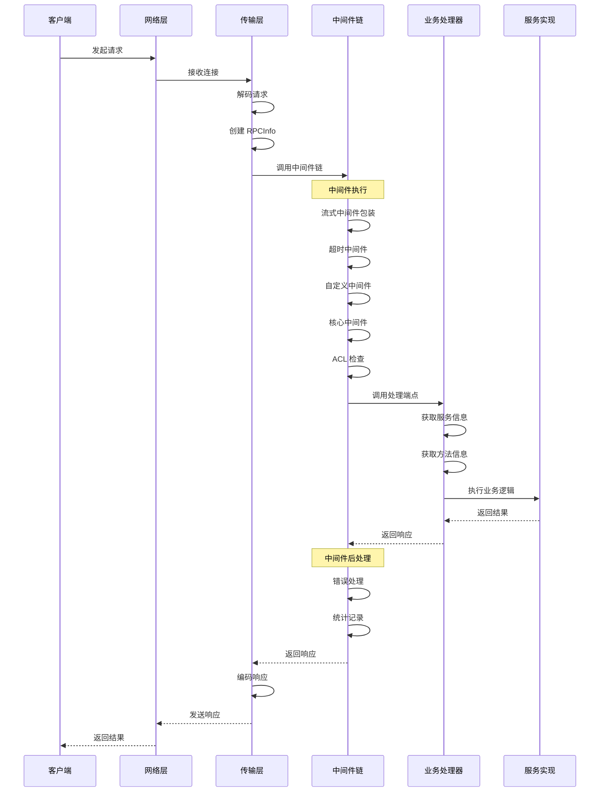

# Server 模块深度分析

## 目录
1. [模块概述](#模块概述)
2. [架构设计](#架构设计)
3. [核心接口](#核心接口)
4. [关键实现](#关键实现)
5. [请求处理流程](#请求处理流程)
6. [服务管理](#服务管理)
7. [扩展机制](#扩展机制)

---

## 模块概述

Server 模块是 Kitex 框架的服务端核心，负责接收和处理 RPC 请求、管理服务生命周期、提供服务治理能力。

### 核心职责
- 服务注册和管理
- 请求接收和分发
- 中间件执行
- 限流和熔断
- 服务注册与发现
- 优雅启动和关闭

### 模块架构图



---

## 架构设计

### 核心类图

```mermaid
classDiagram
    class Server {
        <<interface>>
        +RegisterService(svcInfo, handler, opts) error
        +GetServiceInfos() map[string]*ServiceInfo
        +Run() error
        +Stop() error
    }
    
    class server {
        -opt Options
        -svcs services
        -eps Endpoint
        -svr RemoteServer
        -stopped sync.Once
        -isInit bool
        -isRun bool
        +RegisterService(svcInfo, handler, opts) error
        +Run() error
        +Stop() error
        -init()
        -buildInvokeChain()
        -buildMiddlewares() []Middleware
    }
    
    class services {
        -svcMap map[string]*service
        -fallbackSvc *service
        -unknownSvc *service
        +addService(svcInfo, handler, opts) error
        +getService(serviceName) *service
        +check(refuseTrafficWithoutServiceName) error
    }
    
    class service {
        -svcInfo ServiceInfo
        -handler interface{}
        -handlerMap map[string]interface{}
        +getHandler(method) interface{}
    }
    
    class Options {
        +Svr EndpointBasicInfo
        +RemoteOpt ServerOption
        +Registry Registry
        +Limit LimitOption
        +MWBs []MiddlewareBuilder
        +ACLRules []RejectFunc
        +TracerCtl Controller
    }
    
    Server <|-- server
    server *-- Options
    server *-- services
    services *-- service
    service *-- ServiceInfo
```

---

## 核心接口

### 1. Server 接口

```go
// Server 是 RPC 服务器的抽象接口
// 接受连接并将其分发到注册的服务
type Server interface {
    // RegisterService 注册服务实现
    RegisterService(svcInfo *serviceinfo.ServiceInfo, handler interface{}, opts ...RegisterOption) error
    
    // GetServiceInfos 获取已注册的服务信息
    GetServiceInfos() map[string]*serviceinfo.ServiceInfo
    
    // Run 启动服务器
    Run() error
    
    // Stop 停止服务器
    Stop() error
}
```

**设计理念**:
- 简洁的接口设计，职责单一
- 支持多服务注册
- 提供完整的生命周期管理

### 2. 服务注册选项

```go
// RegisterOption 服务注册选项
type RegisterOption interface {
    F(o *internal_server.RegisterOptions, di *utils.Slice)
}

// RegisterOptions 注册配置
type RegisterOptions struct {
    FallbackService bool  // 是否为降级服务
    UnknownService  bool  // 是否为未知服务处理器
}
```

---

## 关键实现

### 1. 服务器创建

```go
// NewServer 创建服务器实例
func NewServer(ops ...Option) Server {
    s := &server{
        opt:  internal_server.NewOptions(ops),
        svcs: newServices(),
    }
    return s
}
```

### 2. 服务器初始化

```go
func (s *server) init() {
    if s.isInit {
        return
    }
    s.isInit = true
    
    // 1. 填充上下文
    ctx := fillContext(s.opt)
    
    // 2. 注册调试信息
    if ds := s.opt.DebugService; ds != nil {
        ds.RegisterProbeFunc(diagnosis.OptionsKey, diagnosis.WrapAsProbeFunc(s.opt.DebugInfo))
        ds.RegisterProbeFunc(diagnosis.ChangeEventsKey, s.opt.Events.Dump)
    }
    
    // 3. 初始化备份选项
    backup.Init(s.opt.BackupOpt)

    // 4. 构建调用链
    s.buildInvokeChain(ctx)
}

func fillContext(opt *internal_server.Options) context.Context {
    ctx := context.Background()
    ctx = context.WithValue(ctx, endpoint.CtxEventBusKey, opt.Bus)
    ctx = context.WithValue(ctx, endpoint.CtxEventQueueKey, opt.Events)
    return ctx
}
```

### 3. 服务注册实现

```go
func (s *server) RegisterService(svcInfo *serviceinfo.ServiceInfo, handler interface{}, opts ...RegisterOption) error {
    s.Lock()
    defer s.Unlock()
    
    // 1. 运行时检查
    if s.isRun {
        panic("service cannot be registered while server is running")
    }
    if svcInfo == nil {
        panic("svcInfo is nil. please specify non-nil svcInfo")
    }
    if handler == nil || reflect.ValueOf(handler).IsNil() {
        panic("handler is nil. please specify non-nil handler")
    }

    // 2. 处理注册选项
    registerOpts := internal_server.NewRegisterOptions(opts)
    
    // 3. 添加服务到服务集合
    if err := s.svcs.addService(svcInfo, handler, registerOpts); err != nil {
        panic(err.Error())
    }
    
    return nil
}
```

### 4. 服务集合管理

```go
type services struct {
    svcMap      map[string]*service  // 服务映射
    fallbackSvc *service            // 降级服务
    unknownSvc  *service            // 未知服务处理器
    
    sync.RWMutex
}

func (svcs *services) addService(svcInfo *serviceinfo.ServiceInfo, handler interface{}, opts *internal_server.RegisterOptions) error {
    svcs.Lock()
    defer svcs.Unlock()
    
    svc := &service{
        svcInfo:    svcInfo,
        handler:    handler,
        handlerMap: make(map[string]interface{}),
    }
    
    // 构建方法处理器映射
    svc.buildHandlerMap()
    
    // 根据注册选项决定服务类型
    if opts.FallbackService {
        if svcs.fallbackSvc != nil {
            return errors.New("fallback service has been registered")
        }
        svcs.fallbackSvc = svc
    } else if opts.UnknownService {
        if svcs.unknownSvc != nil {
            return errors.New("unknown service has been registered")
        }
        svcs.unknownSvc = svc
    } else {
        // 普通服务注册
        serviceName := svcInfo.ServiceName
        if _, exists := svcs.svcMap[serviceName]; exists {
            return fmt.Errorf("service %s has been registered", serviceName)
        }
        svcs.svcMap[serviceName] = svc
    }
    
    return nil
}

func (svcs *services) getService(serviceName string) *service {
    svcs.RLock()
    defer svcs.RUnlock()
    
    // 1. 查找具体服务
    if svc, exists := svcs.svcMap[serviceName]; exists {
        return svc
    }
    
    // 2. 查找降级服务
    if svcs.fallbackSvc != nil {
        return svcs.fallbackSvc
    }
    
    // 3. 查找未知服务处理器
    if svcs.unknownSvc != nil {
        return svcs.unknownSvc
    }
    
    return nil
}
```

### 5. 服务运行流程

```go
func (s *server) Run() (err error) {
    s.Lock()
    s.isRun = true
    s.Unlock()
    
    // 1. 初始化服务器
    s.init()
    
    // 2. 检查配置
    if err = s.check(); err != nil {
        return err
    }
    
    // 3. 处理代理配置
    svrCfg := s.opt.RemoteOpt
    addr := svrCfg.Address
    if s.opt.Proxy != nil {
        svrCfg.Address, err = s.opt.Proxy.Replace(addr)
        if err != nil {
            return
        }
    }

    // 4. 注册调试信息
    s.registerDebugInfo()
    
    // 5. 丰富远程选项
    s.richRemoteOption()
    
    // 6. 创建传输处理器
    transHdlr, err := s.newSvrTransHandler()
    if err != nil {
        return err
    }
    
    // 7. 创建远程服务器
    svr, err := remotesvr.NewServer(s.opt.RemoteOpt, transHdlr)
    if err != nil {
        return err
    }
    s.Lock()
    s.svr = svr
    s.Unlock()

    // 8. 启动性能分析器
    if s.opt.RemoteOpt.Profiler != nil {
        gofunc.GoFunc(context.Background(), func() {
            klog.Info("KITEX: server starting profiler")
            err := s.opt.RemoteOpt.Profiler.Run(context.Background())
            if err != nil {
                klog.Errorf("KITEX: server started profiler error: error=%s", err.Error())
            }
        })
    }

    // 9. 启动服务器
    errCh := svr.Start()
    select {
    case err = <-errCh:
        klog.Errorf("KITEX: server start error: error=%s", err.Error())
        return err
    default:
    }
    
    // 10. 执行启动钩子
    muStartHooks.Lock()
    for i := range onServerStart {
        go onServerStart[i]()
    }
    muStartHooks.Unlock()
    
    // 11. 构建注册信息
    s.Lock()
    s.buildRegistryInfo(svr.Address())
    s.Unlock()

    // 12. 等待退出信号
    if err = s.waitExit(errCh); err != nil {
        klog.Errorf("KITEX: received error and exit: error=%s", err.Error())
    }
    
    // 13. 停止服务器
    if e := s.Stop(); e != nil && err == nil {
        err = e
        klog.Errorf("KITEX: stop server error: error=%s", e.Error())
    }
    
    return
}
```

---

## 请求处理流程

### 1. 请求处理时序图



### 2. 中间件构建

```go
func (s *server) buildMiddlewares(ctx context.Context) []endpoint.Middleware {
    // 1. 初始化一元中间件
    s.opt.UnaryOptions.InitMiddlewares(ctx)

    // 2. 初始化流式中间件
    s.opt.Streaming.InitMiddlewares(ctx)
    s.opt.StreamOptions.EventHandler = s.opt.TracerCtl.GetStreamEventHandler()
    s.opt.StreamOptions.InitMiddlewares(ctx)

    // 3. 构建通用中间件链
    var mws []endpoint.Middleware
    
    // 流式中间件包装器（必须在最前面）
    mws = append(mws, s.wrapStreamMiddleware())
    
    // 服务器超时中间件
    if s.opt.EnableContextTimeout {
        mws = append(mws, serverTimeoutMW)
    }
    
    // 用户自定义中间件
    for i := range s.opt.MWBs {
        if mw := s.opt.MWBs[i](ctx); mw != nil {
            mws = append(mws, mw)
        }
    }
    
    // 核心中间件（必须在最后）
    mws = append(mws, s.buildCoreMiddleware())
    
    return mws
}
```

### 3. 核心中间件实现

```go
func (s *server) buildCoreMiddleware() endpoint.Middleware {
    return func(next endpoint.Endpoint) endpoint.Endpoint {
        serviceHandler := next
        return func(ctx context.Context, req, resp interface{}) (err error) {
            // --- 前置处理 ---
            // ACL 访问控制检查
            if len(s.opt.ACLRules) > 0 {
                if err = acl.ApplyRules(ctx, req, s.opt.ACLRules); err != nil {
                    return err
                }
            }

            // --- 执行业务处理 ---
            err = serviceHandler(ctx, req, resp)

            // --- 后置处理 ---
            // 错误处理（只处理服务处理器的错误）
            if s.opt.ErrHandle != nil && err != nil {
                err = s.opt.ErrHandle(ctx, err)
            }

            return err
        }
    }
}
```

### 4. 流式中间件包装

```go
func (s *server) wrapStreamMiddleware() endpoint.Middleware {
    return func(next endpoint.Endpoint) endpoint.Endpoint {
        return func(ctx context.Context, req, resp interface{}) (err error) {
            // 检查是否为流式请求
            if st, ok := req.(*streaming.Args); ok {
                // 执行流式处理端点
                return s.streamHandleEndpoint()(ctx, st.ServerStream)
            } else {
                // 执行一元处理端点
                return s.unaryHandleEndpoint()(ctx, req, resp)
            }
        }
    }
}
```

### 5. 一元请求处理端点

```go
func (s *server) invokeHandleEndpoint() endpoint.UnaryEndpoint {
    return func(ctx context.Context, args, resp interface{}) (err error) {
        ri := rpcinfo.GetRPCInfo(ctx)
        ink := ri.Invocation()
        methodName := ink.MethodName()
        serviceName := ink.ServiceName()
        
        // 获取服务和服务信息
        svc := s.svcs.getService(serviceName)
        svcInfo := svc.svcInfo
        
        if methodName == "" && svcInfo.ServiceName != serviceinfo.GenericService {
            return errors.New("method name is empty in rpcinfo, should not happen")
        }
        
        // 异常处理和统计记录
        defer func() {
            if handlerErr := recover(); handlerErr != nil {
                err = kerrors.ErrPanic.WithCauseAndStack(
                    fmt.Errorf("[happened in biz handler, method=%s.%s, please check the panic at the server side] %s",
                        svcInfo.ServiceName, methodName, handlerErr),
                    string(debug.Stack()))
                rpcStats := rpcinfo.AsMutableRPCStats(ri.Stats())
                rpcStats.SetPanicked(err)
            }
            rpcinfo.Record(ctx, ri, stats.ServerHandleFinish, err)
            // 清理会话
            backup.ClearCtx()
        }()
        
        // 获取实现处理函数
        implHandlerFunc := ink.MethodInfo().Handler()
        rpcinfo.Record(ctx, ri, stats.ServerHandleStart, nil)
        
        // 设置会话
        backup.BackupCtx(ctx)
        
        // 执行业务处理函数
        err = implHandlerFunc(ctx, svc.getHandler(methodName), args, resp)
        
        if err != nil {
            if bizErr, ok := kerrors.FromBizStatusError(err); ok {
                if setter, ok := ri.Invocation().(rpcinfo.InvocationSetter); ok {
                    setter.SetBizStatusErr(bizErr)
                    return nil
                }
            }
            err = kerrors.ErrBiz.WithCause(err)
        }
        
        return err
    }
}
```

### 6. 流式请求处理端点

```go
func (s *server) streamHandleEndpoint() sep.StreamEndpoint {
    return func(ctx context.Context, st streaming.ServerStream) (err error) {
        ri := rpcinfo.GetRPCInfo(ctx)
        ink := ri.Invocation()
        methodName := ink.MethodName()
        serviceName := ink.ServiceName()
        
        // 获取服务和服务信息
        svc := s.svcs.getService(serviceName)
        svcInfo := svc.svcInfo
        
        if methodName == "" && svcInfo.ServiceName != serviceinfo.GenericService {
            return errors.New("method name is empty in rpcinfo, should not happen")
        }
        
        // 异常处理和统计记录
        defer func() {
            if handlerErr := recover(); handlerErr != nil {
                err = kerrors.ErrPanic.WithCauseAndStack(
                    fmt.Errorf("[happened in biz handler, method=%s.%s, please check the panic at the server side] %s",
                        svcInfo.ServiceName, methodName, handlerErr),
                    string(debug.Stack()))
                rpcStats := rpcinfo.AsMutableRPCStats(ri.Stats())
                rpcStats.SetPanicked(err)
            }
            rpcinfo.Record(ctx, ri, stats.ServerHandleFinish, err)
            // 清理会话
            backup.ClearCtx()
        }()
        
        // 获取实现处理函数
        implHandlerFunc := ink.MethodInfo().Handler()
        rpcinfo.Record(ctx, ri, stats.ServerHandleStart, nil)
        
        // 设置会话
        backup.BackupCtx(ctx)
        
        // 构建流式参数
        args := &streaming.Args{ServerStream: st}
        if grpcStreamGetter, ok := st.(streaming.GRPCStreamGetter); ok {
            // gRPC 兼容性处理
            if grpcStream := grpcStreamGetter.GetGRPCStream(); grpcStream != nil {
                args.Stream = contextStream{
                    Stream: grpcStream,
                    ctx:    ctx,
                }
            }
        }
        
        // 执行业务处理函数
        err = implHandlerFunc(ctx, svc.getHandler(methodName), args, nil)
        
        if err != nil {
            if bizErr, ok := kerrors.FromBizStatusError(err); ok {
                if setter, ok := ri.Invocation().(rpcinfo.InvocationSetter); ok {
                    setter.SetBizStatusErr(bizErr)
                    return nil
                }
            }
            err = kerrors.ErrBiz.WithCause(err)
        }
        
        return err
    }
}
```

---

## 服务管理

### 1. RPCInfo 初始化

```go
func (s *server) initOrResetRPCInfoFunc() func(rpcinfo.RPCInfo, net.Addr) rpcinfo.RPCInfo {
    return func(ri rpcinfo.RPCInfo, rAddr net.Addr) rpcinfo.RPCInfo {
        // 重置现有 RPCInfo 以提高长连接性能
        if ri != nil && rpcinfo.PoolEnabled() {
            fi := rpcinfo.AsMutableEndpointInfo(ri.From())
            fi.Reset()
            fi.SetAddress(rAddr)
            rpcinfo.AsMutableEndpointInfo(ri.To()).ResetFromBasicInfo(s.opt.Svr)
            if setter, ok := ri.Invocation().(rpcinfo.InvocationSetter); ok {
                setter.Reset()
            }
            rpcinfo.AsMutableRPCConfig(ri.Config()).CopyFrom(s.opt.Configs)
            rpcStats := rpcinfo.AsMutableRPCStats(ri.Stats())
            rpcStats.Reset()
            if s.opt.StatsLevel != nil {
                rpcStats.SetLevel(*s.opt.StatsLevel)
            }
            return ri
        }

        // 分配新的 RPCInfo（首次请求或禁用对象池时）
        rpcStats := rpcinfo.AsMutableRPCStats(rpcinfo.NewRPCStats())
        if s.opt.StatsLevel != nil {
            rpcStats.SetLevel(*s.opt.StatsLevel)
        }

        // 导出只读视图给外部用户
        ri = rpcinfo.NewRPCInfo(
            rpcinfo.EmptyEndpointInfo(),
            rpcinfo.FromBasicInfo(s.opt.Svr),
            rpcinfo.NewServerInvocation(),
            rpcinfo.AsMutableRPCConfig(s.opt.Configs).Clone().ImmutableView(),
            rpcStats.ImmutableView(),
        )
        rpcinfo.AsMutableEndpointInfo(ri.From()).SetAddress(rAddr)
        return ri
    }
}
```

### 2. 限流器构建

```go
func (s *server) buildLimiterWithOpt() (handler remote.InboundHandler) {
    limits := s.opt.Limit.Limits
    connLimit := s.opt.Limit.ConLimit
    qpsLimit := s.opt.Limit.QPSLimit
    
    if limits == nil && connLimit == nil && qpsLimit == nil {
        return
    }

    // 连接限流器
    if connLimit == nil {
        if limits != nil {
            connLimit = limiter.NewConnectionLimiter(limits.MaxConnections)
        } else {
            connLimit = &limiter.DummyConcurrencyLimiter{}
        }
    }

    // QPS 限流器
    if qpsLimit == nil {
        if limits != nil {
            interval := time.Millisecond * 100
            qpsLimit = limiter.NewQPSLimiter(interval, limits.MaxQPS)
        } else {
            qpsLimit = &limiter.DummyRateLimiter{}
        }
    } else {
        s.opt.Limit.QPSLimitPostDecode = true
    }

    // 动态更新控制
    if limits != nil && limits.UpdateControl != nil {
        updater := limiter.NewLimiterWrapper(connLimit, qpsLimit)
        limits.UpdateControl(updater)
    }

    handler = bound.NewServerLimiterHandler(connLimit, qpsLimit, 
        s.opt.Limit.LimitReporter, s.opt.Limit.QPSLimitPostDecode)
    
    return
}
```

### 3. 服务注册信息构建

```go
func (s *server) buildRegistryInfo(lAddr net.Addr) {
    if s.opt.RegistryInfo == nil {
        s.opt.RegistryInfo = &registry.Info{}
    }
    
    info := s.opt.RegistryInfo
    
    // 设置监听地址
    if !info.SkipListenAddr {
        info.Addr = lAddr
    }
    
    // 设置服务名称
    if info.ServiceName == "" {
        info.ServiceName = s.opt.Svr.ServiceName
    }
    
    // 设置编解码器
    if info.PayloadCodec == "" {
        if svc := s.svcs.getTargetSvcInfo(); svc != nil {
            info.PayloadCodec = svc.PayloadCodec.String()
        }
    }
    
    // 设置权重
    if info.Weight == 0 {
        info.Weight = discovery.DefaultWeight
    }
    
    // 设置标签
    if info.Tags == nil {
        info.Tags = s.opt.Svr.Tags
    }
}
```

### 4. 优雅关闭

```go
func (s *server) Stop() (err error) {
    s.stopped.Do(func() {
        s.Lock()
        defer s.Unlock()

        // 执行关闭钩子
        muShutdownHooks.Lock()
        for i := range onShutdown {
            onShutdown[i]()
        }
        muShutdownHooks.Unlock()

        // 注销服务
        if s.opt.RegistryInfo != nil {
            err = s.opt.Registry.Deregister(s.opt.RegistryInfo)
            s.opt.RegistryInfo = nil
        }
        
        // 停止远程服务器
        if s.svr != nil {
            if e := s.svr.Stop(); e != nil {
                err = e
            }
            s.svr = nil
        }
    })
    return
}

func (s *server) waitExit(errCh chan error) error {
    exitSignal := s.opt.ExitSignal()

    // 延迟注册服务（服务启动后可能需要时间才能提供服务）
    delayRegister := time.After(1 * time.Second)
    
    for {
        select {
        case err := <-exitSignal:
            return err
        case err := <-errCh:
            return err
        case <-delayRegister:
            s.Lock()
            if err := s.opt.Registry.Register(s.opt.RegistryInfo); err != nil {
                s.Unlock()
                return err
            }
            s.Unlock()
        }
    }
}
```

---

## 扩展机制

### 1. 中间件扩展

```go
// 自定义服务器中间件
func CustomServerMiddleware(next endpoint.Endpoint) endpoint.Endpoint {
    return func(ctx context.Context, req, resp interface{}) (err error) {
        // 前置处理
        start := time.Now()
        ri := rpcinfo.GetRPCInfo(ctx)
        
        log.Printf("Request start: service=%s, method=%s", 
            ri.To().ServiceName(), ri.Invocation().MethodName())
        
        // 执行下一个中间件
        err = next(ctx, req, resp)
        
        // 后置处理
        duration := time.Since(start)
        log.Printf("Request end: duration=%v, error=%v", duration, err)
        
        return err
    }
}

// 使用中间件
server.WithMiddleware(CustomServerMiddleware)
```

### 2. 限流器扩展

```go
// 自定义限流器
type CustomLimiter struct {
    maxQPS int64
    window time.Duration
    counter int64
    lastReset time.Time
    mutex sync.Mutex
}

func (l *CustomLimiter) Acquire(ctx context.Context) error {
    l.mutex.Lock()
    defer l.mutex.Unlock()
    
    now := time.Now()
    if now.Sub(l.lastReset) > l.window {
        l.counter = 0
        l.lastReset = now
    }
    
    if l.counter >= l.maxQPS {
        return errors.New("rate limit exceeded")
    }
    
    l.counter++
    return nil
}

func (l *CustomLimiter) Status() (max, current int, windows float64) {
    l.mutex.Lock()
    defer l.mutex.Unlock()
    return int(l.maxQPS), int(l.counter), l.window.Seconds()
}

// 使用自定义限流器
server.WithQPSLimiter(&CustomLimiter{
    maxQPS: 1000,
    window: time.Second,
})
```

### 3. 服务注册扩展

```go
// 自定义服务注册器
type CustomRegistry struct {
    services map[string]*registry.Info
    mutex    sync.RWMutex
}

func (r *CustomRegistry) Register(info *registry.Info) error {
    r.mutex.Lock()
    defer r.mutex.Unlock()
    
    key := fmt.Sprintf("%s:%s", info.ServiceName, info.Addr.String())
    r.services[key] = info
    
    log.Printf("Service registered: %s at %s", info.ServiceName, info.Addr)
    return nil
}

func (r *CustomRegistry) Deregister(info *registry.Info) error {
    r.mutex.Lock()
    defer r.mutex.Unlock()
    
    key := fmt.Sprintf("%s:%s", info.ServiceName, info.Addr.String())
    delete(r.services, key)
    
    log.Printf("Service deregistered: %s at %s", info.ServiceName, info.Addr)
    return nil
}

// 使用自定义注册器
server.WithRegistry(&CustomRegistry{
    services: make(map[string]*registry.Info),
})
```

### 4. 错误处理扩展

```go
// 自定义错误处理器
func CustomErrorHandler(ctx context.Context, err error) error {
    ri := rpcinfo.GetRPCInfo(ctx)
    
    // 记录错误日志
    log.Printf("Error in service %s.%s: %v", 
        ri.To().ServiceName(), ri.Invocation().MethodName(), err)
    
    // 根据错误类型进行不同处理
    switch e := err.(type) {
    case *kerrors.DetailedError:
        // 业务错误，返回给客户端
        return e
    default:
        // 系统错误，返回通用错误信息
        return kerrors.NewDetailedError(kerrors.ErrInternalException, "internal server error")
    }
}

// 使用自定义错误处理器
server.WithErrorHandler(CustomErrorHandler)
```

### 5. 传输层扩展

```go
// 自定义传输处理器工厂
type CustomServerTransHandlerFactory struct{}

func (f *CustomServerTransHandlerFactory) NewTransHandler(opt *remote.ServerOption) (remote.ServerTransHandler, error) {
    return &CustomServerTransHandler{}, nil
}

type CustomServerTransHandler struct {
    // 自定义字段
}

func (h *CustomServerTransHandler) OnActive(ctx context.Context, conn net.Conn) (context.Context, error) {
    // 连接激活时的处理
    log.Printf("Connection active: %s", conn.RemoteAddr())
    return ctx, nil
}

func (h *CustomServerTransHandler) OnRead(ctx context.Context, conn net.Conn) error {
    // 读取数据时的处理
    return nil
}

func (h *CustomServerTransHandler) Write(ctx context.Context, conn net.Conn, send remote.Message) (context.Context, error) {
    // 自定义写入逻辑
    return ctx, nil
}

func (h *CustomServerTransHandler) Read(ctx context.Context, conn net.Conn, msg remote.Message) (context.Context, error) {
    // 自定义读取逻辑
    return ctx, nil
}

func (h *CustomServerTransHandler) OnInactive(ctx context.Context, conn net.Conn) {
    // 连接断开时的处理
    log.Printf("Connection inactive: %s", conn.RemoteAddr())
}

func (h *CustomServerTransHandler) OnError(ctx context.Context, err error, conn net.Conn) {
    // 错误处理
    log.Printf("Connection error: %v", err)
}

func (h *CustomServerTransHandler) OnMessage(ctx context.Context, args, result remote.Message) (context.Context, error) {
    // 消息处理
    return ctx, nil
}

func (h *CustomServerTransHandler) SetPipeline(pipeline *remote.TransPipeline) {
    // 设置传输管道
}

// 使用自定义传输处理器
server.WithTransHandlerFactory(&CustomServerTransHandlerFactory{})
```

---

## 总结

Server 模块是 Kitex 框架的服务端核心，具有以下特点：

### 设计优势
1. **清晰的分层架构**: 网络层、传输层、业务层职责明确
2. **完善的生命周期管理**: 从启动到关闭的完整流程控制
3. **丰富的扩展机制**: 支持中间件、限流器、注册器等扩展
4. **强大的服务治理能力**: 限流、熔断、监控、注册发现等
5. **优雅的错误处理**: 完善的异常捕获和处理机制

### 关键技术点
1. **中间件链设计**: 灵活的中间件执行顺序和扩展机制
2. **服务多路复用**: 支持多服务注册和路由
3. **流式处理支持**: 统一的一元和流式调用处理
4. **资源管理优化**: RPCInfo 对象池和连接复用
5. **优雅关闭机制**: 确保服务平滑停止

### 最佳实践
1. **合理配置限流**: 防止服务过载
2. **实现优雅关闭**: 确保请求完整处理
3. **监控关键指标**: 及时发现性能问题
4. **正确处理异常**: 避免服务崩溃
5. **使用中间件扩展**: 实现横切关注点

Server 模块的设计体现了 Kitex 框架在服务端处理方面的成熟度和扩展性，为构建高性能、高可靠的 RPC 服务提供了坚实的基础。
