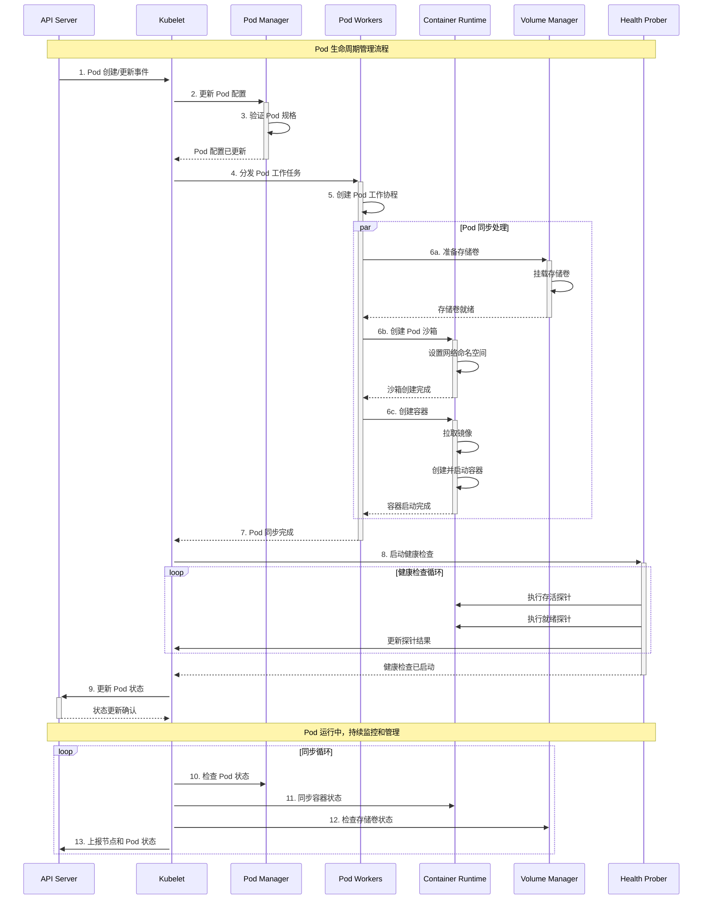
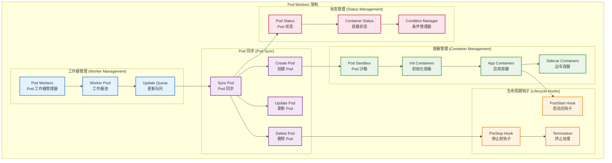

# Kubernetes Kubelet 详细源码剖析

## 📚 文档概述

本文档深入分析 Kubernetes Kubelet 的架构设计、源码实现和核心机制。Kubelet 是 Kubernetes 集群中每个节点上的主要代理，负责管理 Pod 和容器的生命周期，是连接 Kubernetes 控制平面和容器运行时的关键桥梁。

## 🏗️ Kubelet 整体架构

### 1.1 Kubelet 架构设计

```mermaid
graph TB
    subgraph "kubelet 架构"
        subgraph "核心组件 (Core Components)"
            KUBELET[Kubelet<br/>核心控制器]
            POD_MANAGER[Pod Manager<br/>Pod 管理器]
            POD_WORKERS[Pod Workers<br/>Pod 工作器]
            SYNC_LOOP[Sync Loop<br/>同步循环]
        end
        
        subgraph "容器管理 (Container Management)"
            RUNTIME[Container Runtime<br/>容器运行时]
            CRI[CRI Interface<br/>CRI 接口]
            IMAGE_MANAGER[Image Manager<br/>镜像管理器]
            CONTAINER_GC[Container GC<br/>容器垃圾收集]
        end
        
        subgraph "存储管理 (Volume Management)"
            VOLUME_MANAGER[Volume Manager<br/>存储卷管理器]
            CSI_DRIVER[CSI Driver<br/>CSI 驱动]
            MOUNT_MANAGER[Mount Manager<br/>挂载管理器]
            DEVICE_MANAGER[Device Manager<br/>设备管理器]
        end
        
        subgraph "网络管理 (Network Management)"
            CNI_MANAGER[CNI Manager<br/>CNI 管理器]
            DNS_CONFIG[DNS Config<br/>DNS 配置]
            PORT_MANAGER[Port Manager<br/>端口管理器]
        end
        
        subgraph "资源管理 (Resource Management)"
            CGROUP_MANAGER[CGroup Manager<br/>CGroup 管理器]
            CPU_MANAGER[CPU Manager<br/>CPU 管理器]
            MEMORY_MANAGER[Memory Manager<br/>内存管理器]
            TOPOLOGY_MANAGER[Topology Manager<br/>拓扑管理器]
        end
        
        subgraph "健康检查 (Health Checks)"
            LIVENESS_PROBER[Liveness Prober<br/>存活探针]
            READINESS_PROBER[Readiness Prober<br/>就绪探针]
            STARTUP_PROBER[Startup Prober<br/>启动探针]
        end
        
        subgraph "监控观测 (Observability)"
            CADVISOR[cAdvisor<br/>容器监控]
            METRICS_SERVER[Metrics Server<br/>指标服务器]
            EVENT_RECORDER[Event Recorder<br/>事件记录器]
            LOG_MANAGER[Log Manager<br/>日志管理器]
        end
        
        subgraph "外部接口 (External Interfaces)"
            API_CLIENT[API Client<br/>API 客户端]
            KUBELET_API[Kubelet API<br/>Kubelet API 服务器]
            PLUGIN_MANAGER[Plugin Manager<br/>插件管理器]
        end
    end
    
    %% 核心流程
    KUBELET --> POD_MANAGER
    POD_MANAGER --> POD_WORKERS
    POD_WORKERS --> SYNC_LOOP
    
    %% 容器管理
    KUBELET --> RUNTIME
    RUNTIME --> CRI
    KUBELET --> IMAGE_MANAGER
    KUBELET --> CONTAINER_GC
    
    %% 存储管理
    KUBELET --> VOLUME_MANAGER
    VOLUME_MANAGER --> CSI_DRIVER
    VOLUME_MANAGER --> MOUNT_MANAGER
    KUBELET --> DEVICE_MANAGER
    
    %% 网络管理
    KUBELET --> CNI_MANAGER
    KUBELET --> DNS_CONFIG
    KUBELET --> PORT_MANAGER
    
    %% 资源管理
    KUBELET --> CGROUP_MANAGER
    CGROUP_MANAGER --> CPU_MANAGER
    CGROUP_MANAGER --> MEMORY_MANAGER
    CGROUP_MANAGER --> TOPOLOGY_MANAGER
    
    %% 健康检查
    KUBELET --> LIVENESS_PROBER
    KUBELET --> READINESS_PROBER
    KUBELET --> STARTUP_PROBER
    
    %% 监控观测
    KUBELET --> CADVISOR
    KUBELET --> METRICS_SERVER
    KUBELET --> EVENT_RECORDER
    KUBELET --> LOG_MANAGER
    
    %% 外部接口
    KUBELET --> API_CLIENT
    KUBELET --> KUBELET_API
    KUBELET --> PLUGIN_MANAGER
    
    %% 样式定义
    classDef core fill:#e3f2fd,stroke:#1976d2,stroke-width:2px
    classDef container fill:#f3e5f5,stroke:#7b1fa2,stroke-width:2px
    classDef storage fill:#e8f5e8,stroke:#388e3c,stroke-width:2px
    classDef network fill:#fff3e0,stroke:#f57c00,stroke-width:2px
    classDef resource fill:#fce4ec,stroke:#c2185b,stroke-width:2px
    classDef health fill:#f1f8e9,stroke:#689f38,stroke-width:2px
    classDef observability fill:#fafafa,stroke:#616161,stroke-width:2px
    classDef external fill:#e0f2f1,stroke:#00695c,stroke-width:2px
    
    class KUBELET,POD_MANAGER,POD_WORKERS,SYNC_LOOP core
    class RUNTIME,CRI,IMAGE_MANAGER,CONTAINER_GC container
    class VOLUME_MANAGER,CSI_DRIVER,MOUNT_MANAGER,DEVICE_MANAGER storage
    class CNI_MANAGER,DNS_CONFIG,PORT_MANAGER network
    class CGROUP_MANAGER,CPU_MANAGER,MEMORY_MANAGER,TOPOLOGY_MANAGER resource
    class LIVENESS_PROBER,READINESS_PROBER,STARTUP_PROBER health
    class CADVISOR,METRICS_SERVER,EVENT_RECORDER,LOG_MANAGER observability
    class API_CLIENT,KUBELET_API,PLUGIN_MANAGER external
```



### 1.2 Kubelet 工作流程



## 🚀 启动流程详细分析

### 2.1 Kubelet 启动入口

```go
// cmd/kubelet/kubelet.go
/*
Kubelet 主入口文件
负责初始化和启动 Kubelet 服务

主要职责：
1. 创建 Cobra 命令对象
2. 解析命令行参数和配置
3. 启动 Kubelet 主循环
*/
package main

import (
    "context"
    "os"

    "k8s.io/component-base/cli"
    _ "k8s.io/component-base/logs/json/register"          // JSON 日志格式注册
    _ "k8s.io/component-base/metrics/prometheus/clientgo" // 客户端指标注册
    _ "k8s.io/component-base/metrics/prometheus/version"  // 版本指标注册
    "k8s.io/kubernetes/cmd/kubelet/app"
)

/*
main 函数是 Kubelet 的程序入口点

执行流程：
1. 创建 Kubelet 命令对象
2. 通过 CLI 框架执行命令
3. 根据执行结果退出程序

返回值：
- 程序退出码（0 表示成功，非 0 表示失败）
*/
func main() {
    // 创建 Kubelet 命令对象，传入上下文
    command := app.NewKubeletCommand(context.Background())
    
    // 执行命令，启动 Kubelet
    code := cli.Run(command)
    
    // 根据执行结果退出程序
    os.Exit(code)
}
```

### 2.2 Kubelet 核心结构

```go
// pkg/kubelet/kubelet.go
/*
Kubelet 结构体定义了 Kubelet 的核心组件和功能

主要功能：
1. 管理 Pod 和容器的生命周期
2. 与容器运行时交互
3. 监控节点和容器状态
4. 处理存储卷和网络配置
5. 执行健康检查和资源管理
*/

/*
Kubelet 核心结构体

字段说明：
- hostname: 节点主机名
- nodeName: 节点名称
- runtimeService: 容器运行时服务接口
- imageService: 镜像服务接口
- kubeClient: Kubernetes API 客户端
- heartbeatClient: 心跳客户端
- podManager: Pod 管理器
- podWorkers: Pod 工作器
- containerRuntime: 容器运行时
- volumeManager: 存储卷管理器
- probeManager: 探针管理器
- pleg: Pod 生命周期事件生成器
- statusManager: 状态管理器
- resourceAnalyzer: 资源分析器
*/
type Kubelet struct {
    // 节点信息
    hostname                       string
    nodeName                       types.NodeName
    runtimeState                   *runtimeState
    
    // 容器运行时接口
    runtimeService                 internalapi.RuntimeService
    imageService                   internalapi.ImageManagerService
    
    // Kubernetes API 客户端
    kubeClient                     clientset.Interface
    heartbeatClient                clientset.Interface
    
    // 核心管理器
    podManager                     kubepod.Manager
    podWorkers                     PodWorkers
    containerRuntime               kubecontainer.Runtime
    
    // 存储和网络管理
    volumeManager                  volumemanager.VolumeManager
    volumePluginMgr                *volume.VolumePluginMgr
    
    // 健康检查和监控
    probeManager                   prober.Manager
    livenessManager                proberesults.Manager
    readinessManager               proberesults.Manager
    startupManager                 proberesults.Manager
    
    // 生命周期事件
    pleg                          pleg.PodLifecycleEventGenerator
    
    // 状态管理
    statusManager                  status.Manager
    nodeStatusUpdateFrequency      time.Duration
    
    // 资源管理
    resourceAnalyzer               stats.ResourceAnalyzer
    containerManager               cm.ContainerManager
    
    // 网络配置
    clusterDNS                     []net.IP
    clusterDomain                  string
    resolverConfig                 string
    
    // 配置和策略
    kubeletConfiguration           kubeletconfiginternal.KubeletConfiguration
    
    // 事件和日志
    recorder                       record.EventRecorder
    
    // 同步和控制
    syncLoopMonitor                atomic.Value
    daemonEndpoints                *v1.NodeDaemonEndpoints
    
    // 服务器和 API
    server                         *server.Server
    
    // 其他组件
    cadvisor                       cadvisor.Interface
    cloud                          cloudprovider.Interface
    
    // 同步控制
    mainLock                       sync.RWMutex
    updatePodCIDRMux               sync.Mutex
    
    // 停止信号
    stopCh                         <-chan struct{}
}
```

### 2.3 Kubelet 启动流程

```go
/*
Run 启动 Kubelet 的主运行循环

参数：
- ctx: 上下文对象，用于控制生命周期

工作流程：
1. 初始化各种管理器
2. 启动 HTTP 服务器
3. 启动同步循环
4. 等待停止信号
5. 清理资源
*/
func (kl *Kubelet) Run(ctx context.Context) {
    klog.InfoS("启动 kubelet")
    
    // 1. 初始化云提供商
    if kl.cloud != nil {
        kl.cloud.Initialize(kl.kubeClient, ctx.Done())
    }
    
    // 2. 初始化模块
    if err := kl.initializeModules(); err != nil {
        klog.ErrorS(err, "初始化模块失败")
        return
    }
    
    // 3. 启动存储卷管理器
    go kl.volumeManager.Run(kl.sourcesReady, ctx.Done())
    
    // 4. 启动 Pod 生命周期事件生成器
    kl.pleg.Start()
    
    // 5. 启动同步循环
    kl.syncLoop(ctx, kl.configCh, kl.handler)
}

/*
initializeModules 初始化 Kubelet 的各个模块

返回值：
- error: 初始化过程中的错误

初始化流程：
1. 设置 iptables 规则
2. 初始化容器管理器
3. 启动容器运行时
4. 初始化探针管理器
5. 启动状态管理器
6. 启动其他管理器
*/
func (kl *Kubelet) initializeModules() error {
    // 1. 初始化容器管理器
    if err := kl.containerManager.Start(kl.node, kl.GetActivePods, kl.sourcesReady, 
        kl.statusManager, kl.runtimeService, kl.supportLocalStorageCapacityIsolation()); err != nil {
        return fmt.Errorf("启动容器管理器失败: %w", err)
    }
    
    // 2. 启动镜像管理器
    kl.imageManager.Start()
    
    // 3. 启动证书管理器
    if kl.serverCertificateManager != nil {
        kl.serverCertificateManager.Start()
    }
    
    // 4. 启动探针管理器
    kl.probeManager.Start()
    
    // 5. 启动状态管理器
    kl.statusManager.Start()
    
    // 6. 启动 Pod 工作器
    kl.podWorkers.Start()
    
    // 7. 启动运行时类管理器
    if kl.runtimeClassManager != nil {
        kl.runtimeClassManager.Start(kl.stopCh)
    }
    
    return nil
}

/*
syncLoop 是 Kubelet 的主同步循环

参数：
- ctx: 上下文对象
- configCh: 配置变更通道
- handler: 同步处理器

工作流程：
1. 监听各种事件源
2. 处理 Pod 配置变更
3. 执行定期同步任务
4. 处理探针结果
5. 清理孤儿 Pod
*/
func (kl *Kubelet) syncLoop(ctx context.Context, configCh <-chan kubetypes.PodUpdate, handler SyncHandler) {
    klog.InfoS("启动 kubelet 同步循环")
    
    // 同步循环监控器
    syncTicker := time.NewTicker(time.Second)
    defer syncTicker.Stop()
    
    housekeepingTicker := time.NewTicker(housekeepingPeriod)
    defer housekeepingTicker.Stop()
    
    plegCh := kl.pleg.Watch()
    
    const (
        base   = 100 * time.Millisecond
        max    = 5 * time.Second
        factor = 2
    )
    duration := base
    
    // 记录同步循环开始时间
    kl.syncLoopMonitor.Store(kl.clock.Now())
    
    for {
        select {
        case <-ctx.Done():
            klog.InfoS("Kubelet 同步循环退出")
            return
            
        case u, open := <-configCh:
            // 处理配置更新
            if !open {
                klog.ErrorS(nil, "配置通道意外关闭")
                return
            }
            
            switch u.Op {
            case kubetypes.ADD:
                klog.V(2).InfoS("SyncLoop ADD", "source", u.Source, "pods", klog.KObjSlice(u.Pods))
            case kubetypes.UPDATE:
                klog.V(2).InfoS("SyncLoop UPDATE", "source", u.Source, "pods", klog.KObjSlice(u.Pods))
            case kubetypes.REMOVE:
                klog.V(2).InfoS("SyncLoop REMOVE", "source", u.Source, "pods", klog.KObjSlice(u.Pods))
            case kubetypes.RECONCILE:
                klog.V(4).InfoS("SyncLoop RECONCILE", "source", u.Source, "pods", klog.KObjSlice(u.Pods))
            case kubetypes.DELETE:
                klog.V(2).InfoS("SyncLoop DELETE", "source", u.Source, "pods", klog.KObjSlice(u.Pods))
            case kubetypes.SET:
                klog.V(2).InfoS("SyncLoop SET", "source", u.Source, "pods", klog.KObjSlice(u.Pods))
            default:
                klog.ErrorS(nil, "无效的操作类型", "operation", u.Op)
            }
            
            kl.podManager.UpdatePods(u)
            
        case e := <-plegCh:
            // 处理 Pod 生命周期事件
            if e.Type == pleg.ContainerStarted {
                // 记录容器启动时间
                kl.lastContainerStartedTime.Store(kl.clock.Now())
            }
            
            if isSyncPodWorthy(e) {
                // 如果事件值得同步，触发 Pod 同步
                if pod, ok := kl.podManager.GetPodByUID(e.ID); ok {
                    kl.podWorkers.UpdatePod(UpdatePodOptions{
                        Pod:        pod,
                        MirrorPod:  kl.podManager.GetMirrorPodByPod(pod),
                        UpdateType: kubetypes.SyncPodSync,
                        StartTime:  time.Now(),
                    })
                }
            }
            
            if e.Type == pleg.ContainerDied {
                if containerID, ok := e.Data.(string); ok {
                    kl.cleanUpContainersInPod(e.ID, containerID)
                }
            }
            
        case <-syncTicker.C:
            // 定期同步
            kl.syncLoopMonitor.Store(kl.clock.Now())
            if !kl.syncLoopIteration(ctx, handler, syncTicker.C, housekeepingTicker.C, plegCh) {
                break
            }
            duration = base
            
        case update := <-kl.livenessManager.Updates():
            // 处理存活探针结果
            if update.Result == proberesults.Failure {
                handleProbeSync(kl, update, handler, "liveness", "unhealthy")
            }
            
        case update := <-kl.readinessManager.Updates():
            // 处理就绪探针结果
            ready := update.Result == proberesults.Success
            kl.statusManager.SetContainerReadiness(update.PodUID, update.ContainerID, ready)
            
        case update := <-kl.startupManager.Updates():
            // 处理启动探针结果
            started := update.Result == proberesults.Success
            kl.statusManager.SetContainerStartup(update.PodUID, update.ContainerID, started)
            
        case <-housekeepingTicker.C:
            // 执行清理任务
            if !kl.sourcesReady.AllReady() {
                // 如果源未就绪，跳过清理
                klog.V(4).InfoS("SyncLoop (housekeeping, skipped): sources aren't ready yet.")
            } else {
                start := time.Now()
                klog.V(4).InfoS("SyncLoop (housekeeping)")
                if err := handler.HandlePodCleanups(ctx); err != nil {
                    klog.ErrorS(err, "清理 Pod 失败")
                }
                duration := time.Since(start)
                if duration > housekeepingWarningDuration {
                    klog.ErrorS(nil, "清理任务耗时过长", "duration", duration.String())
                }
            }
        }
    }
}
```

## 🎯 Pod 生命周期管理

### 3.1 Pod 工作器架构



### 3.2 Pod 工作器源码实现

```go
// pkg/kubelet/pod_workers.go
/*
PodWorkers 管理 Pod 的并发处理

主要功能：
1. 为每个 Pod 创建独立的工作协程
2. 管理 Pod 的更新队列
3. 协调 Pod 的生命周期操作
4. 处理 Pod 的终止和清理
*/

/*
PodWorkers 结构体定义

字段说明：
- podLock: Pod 锁映射，保护每个 Pod 的并发访问
- podsSynced: 已同步的 Pod 集合
- startedStaticPodsByFullname: 已启动的静态 Pod 映射
- waitingToStartStaticPodsByFullname: 等待启动的静态 Pod 映射
- workQueue: 工作队列，存储待处理的 Pod 更新
- podUpdates: Pod 更新通道映射
- isWorking: 工作状态映射
- lastUndeliveredWorkUpdate: 最后未交付的工作更新映射
- podSyncStatuses: Pod 同步状态映射
*/
type PodWorkers interface {
    // UpdatePod 通知 Pod 工作器有关 Pod 的更新
    UpdatePod(options UpdatePodOptions)
    
    // ForgetNonExistingPodWorkers 清理不存在的 Pod 工作器
    ForgetNonExistingPodWorkers(desiredPods map[types.UID]sets.Empty)
    
    // ForgetWorker 忘记特定的 Pod 工作器
    ForgetWorker(uid types.UID)
    
    // IsPodKnownTerminated 检查 Pod 是否已知已终止
    IsPodKnownTerminated(uid types.UID) bool
    
    // CouldHaveRunningContainers 检查 Pod 是否可能有运行中的容器
    CouldHaveRunningContainers(uid types.UID) bool
    
    // ShouldPodContentBeRemoved 检查是否应该移除 Pod 内容
    ShouldPodContentBeRemoved(uid types.UID) bool
    
    // IsPodTerminationRequested 检查是否请求了 Pod 终止
    IsPodTerminationRequested(uid types.UID) bool
    
    // Start 启动 Pod 工作器
    Start()
}

/*
podWorkers 实现 PodWorkers 接口

字段说明：
- podLock: 保护 Pod 工作器状态的读写锁
- podsSynced: 已同步 Pod 的集合
- startedStaticPodsByFullname: 已启动静态 Pod 的映射
- waitingToStartStaticPodsByFullname: 等待启动静态 Pod 的映射
- workQueue: Pod 工作队列
- podUpdates: Pod 更新通道映射
- isWorking: Pod 工作状态映射
- lastUndeliveredWorkUpdate: 最后未交付工作更新映射
- podSyncStatuses: Pod 同步状态映射
*/
type podWorkers struct {
    // 用于保护下面字段的锁
    podLock sync.RWMutex
    
    // 跟踪已同步的 Pod
    podsSynced map[types.UID]sets.Empty
    
    // 跟踪已启动的静态 Pod
    startedStaticPodsByFullname map[string]types.UID
    waitingToStartStaticPodsByFullname map[string][]types.UID
    
    // 工作队列和通道
    workQueue queue.WorkQueue
    
    // 每个 Pod 的更新通道
    podUpdates map[types.UID]chan UpdatePodOptions
    
    // 跟踪每个 Pod 是否正在工作
    isWorking map[types.UID]bool
    
    // 跟踪最后未交付的工作更新
    lastUndeliveredWorkUpdate map[types.UID]UpdatePodOptions
    
    // Pod 同步状态
    podSyncStatuses map[types.UID]*podSyncStatus
    
    // 依赖项
    syncPodFn            syncPodFnType
    recorder             record.EventRecorder
    workQueue            queue.WorkQueue
    resyncInterval       time.Duration
    backOffPeriod        time.Duration
    podCache             kubecontainer.Cache
    clock                clock.WithTicker
}

/*
UpdatePod 通知 Pod 工作器有关 Pod 的更新

参数：
- options: 更新选项，包含 Pod 信息和更新类型

工作流程：
1. 验证更新选项
2. 获取或创建 Pod 工作器
3. 将更新发送到 Pod 的更新通道
4. 如果需要，启动新的工作协程
*/
func (p *podWorkers) UpdatePod(options UpdatePodOptions) {
    // 1. 验证更新选项
    if options.Pod == nil && options.RunningPod == nil {
        klog.ErrorS(nil, "UpdatePod 调用时 Pod 和 RunningPod 都为 nil")
        return
    }
    
    var uid types.UID
    var name, namespace string
    if options.Pod != nil {
        uid = options.Pod.UID
        name = options.Pod.Name
        namespace = options.Pod.Namespace
    } else {
        uid = options.RunningPod.ID
        name = options.RunningPod.Name
        namespace = options.RunningPod.Namespace
    }
    
    // 2. 获取 Pod 工作器状态
    p.podLock.Lock()
    defer p.podLock.Unlock()
    
    // 检查是否需要创建新的工作器
    podUpdates, exists := p.podUpdates[uid]
    if !exists {
        // 创建新的更新通道
        podUpdates = make(chan UpdatePodOptions, 1)
        p.podUpdates[uid] = podUpdates
        
        // 初始化工作状态
        p.isWorking[uid] = true
        p.podSyncStatuses[uid] = &podSyncStatus{
            syncedAt: time.Time{},
            fullname: kubecontainer.GetPodFullName(options.Pod),
        }
        
        // 启动新的工作协程
        go func() {
            defer utilruntime.HandleCrash()
            p.managePodLoop(podUpdates)
        }()
    }
    
    // 3. 发送更新到 Pod 的更新通道
    if !p.isWorking[uid] {
        p.isWorking[uid] = true
        p.lastUndeliveredWorkUpdate[uid] = options
    }
    
    select {
    case podUpdates <- options:
        // 更新发送成功
    default:
        // 通道已满，替换最后一个更新
        select {
        case <-podUpdates:
        default:
        }
        podUpdates <- options
    }
}

/*
managePodLoop 管理单个 Pod 的处理循环

参数：
- podUpdates: Pod 更新通道

工作流程：
1. 监听 Pod 更新事件
2. 处理 Pod 同步
3. 管理 Pod 生命周期
4. 处理错误和重试
*/
func (p *podWorkers) managePodLoop(podUpdates <-chan UpdatePodOptions) {
    var lastSyncTime time.Time
    
    for update := range podUpdates {
        err := func() error {
            podUID := update.Pod.UID
            
            // 记录同步开始时间
            start := time.Now()
            
            // 执行 Pod 同步
            err := p.syncPodFn(context.TODO(), update.UpdateType, update.Pod, update.MirrorPod, update.RunningPod)
            
            // 记录同步完成时间
            syncDuration := time.Since(start)
            
            // 更新指标
            metrics.PodWorkerDuration.WithLabelValues(string(update.UpdateType)).Observe(syncDuration.Seconds())
            
            if update.StartTime != (time.Time{}) {
                metrics.PodStartupDuration.Observe(time.Since(update.StartTime).Seconds())
            }
            
            // 更新同步状态
            p.podLock.Lock()
            if status, ok := p.podSyncStatuses[podUID]; ok {
                status.syncedAt = time.Now()
                if err == nil {
                    status.fullname = kubecontainer.GetPodFullName(update.Pod)
                }
            }
            p.podLock.Unlock()
            
            lastSyncTime = time.Now()
            return err
        }()
        
        if err != nil {
            // 记录同步错误
            klog.ErrorS(err, "同步 Pod 时出错", "pod", klog.KObj(update.Pod), "podUID", update.Pod.UID)
            
            // 发送错误事件
            p.recorder.Eventf(update.Pod, v1.EventTypeWarning, events.FailedSync, "同步 Pod 时出错: %v", err)
        }
        
        // 标记工作完成
        p.podLock.Lock()
        p.isWorking[update.Pod.UID] = false
        p.podLock.Unlock()
    }
}

/*
syncPod 同步单个 Pod 的状态

参数：
- ctx: 上下文对象
- updateType: 更新类型
- pod: Pod 对象
- mirrorPod: 镜像 Pod（用于静态 Pod）
- runningPod: 运行中的 Pod

返回值：
- error: 同步过程中的错误

同步流程：
1. 验证 Pod 规格
2. 创建 Pod 沙箱
3. 启动初始化容器
4. 启动应用容器
5. 更新 Pod 状态
*/
func (kl *Kubelet) syncPod(ctx context.Context, updateType kubetypes.SyncPodType, pod, mirrorPod *v1.Pod, runningPod *kubecontainer.Pod) error {
    klog.V(4).InfoS("同步 Pod", "pod", klog.KObj(pod), "podUID", pod.UID, "updateType", updateType)
    
    // 1. 记录同步开始时间
    start := time.Now()
    defer func() {
        metrics.PodSyncDuration.Observe(metrics.SinceInSeconds(start))
    }()
    
    // 2. 生成 Pod 状态
    apiPodStatus := kl.generateAPIPodStatus(pod, runningPod, false)
    
    // 3. 检查 Pod 是否应该运行
    runnable := kl.canRunPod(pod)
    if !runnable.Admit {
        // Pod 不能运行，更新状态并返回
        kl.statusManager.SetPodStatus(pod, apiPodStatus)
        return fmt.Errorf("Pod 不能运行: %s", runnable.Message)
    }
    
    // 4. 检查网络插件是否就绪
    if err := kl.runtimeState.networkErrors(); err != nil && !kubecontainer.IsHostNetworkPod(pod) {
        kl.recorder.Eventf(pod, v1.EventTypeWarning, events.NetworkNotReady, "网络未就绪: %v", err)
        return fmt.Errorf("网络未就绪: %w", err)
    }
    
    // 5. 创建 Pod 目录
    if err := kl.makePodDataDirs(pod); err != nil {
        kl.recorder.Eventf(pod, v1.EventTypeWarning, events.FailedToMakeDataDir, "创建 Pod 数据目录失败: %v", err)
        return fmt.Errorf("创建 Pod 数据目录失败: %w", err)
    }
    
    // 6. 等待存储卷挂载
    if !kl.podIsTerminated(pod) {
        if err := kl.volumeManager.WaitForAttachAndMount(pod); err != nil {
            kl.recorder.Eventf(pod, v1.EventTypeWarning, events.FailedMountVolume, "等待存储卷挂载失败: %v", err)
            return fmt.Errorf("等待存储卷挂载失败: %w", err)
        }
    }
    
    // 7. 获取 Pod 的拉取密钥
    pullSecrets := kl.getPullSecretsForPod(pod)
    
    // 8. 调用容器运行时同步 Pod
    result := kl.containerRuntime.SyncPod(ctx, pod, runningPod, apiPodStatus, pullSecrets, kl.backOff)
    kl.reasonCache.Update(pod.UID, result)
    
    if err := result.Error(); err != nil {
        // 同步失败，记录错误
        for _, r := range result.SyncResults {
            if r.Error != kubecontainer.ErrCrashLoopBackOff && r.Error != images.ErrImagePullBackOff {
                kl.recorder.Eventf(pod, v1.EventTypeWarning, events.FailedSync, "同步容器失败: %v", r.Error)
            }
        }
        return err
    }
    
    return nil
}
```

## 🔌 容器运行时接口 (CRI)

### 4.1 CRI 架构设计

```mermaid
graph TB
    subgraph "CRI 架构"
        subgraph "Kubelet 层 (Kubelet Layer)"
            KUBELET[Kubelet]
            RUNTIME_SERVICE[Runtime Service<br/>运行时服务接口]
            IMAGE_SERVICE[Image Service<br/>镜像服务接口]
        end
        
        subgraph "CRI 接口层 (CRI Interface Layer)"
            CRI_API[CRI API<br/>CRI 接口定义]
            GRPC_CLIENT[gRPC Client<br/>gRPC 客户端]
            CRI_SHIM[CRI Shim<br/>CRI 适配器]
        end
        
        subgraph "容器运行时 (Container Runtime)"
            CONTAINERD[containerd]
            CRIO[CRI-O]
            DOCKER[Docker Engine<br/>(通过 dockershim)]
        end
        
        subgraph "底层组件 (Low-level Components)"
            RUNC[runc<br/>OCI 运行时]
            KATA[Kata Containers<br/>安全容器]
            GVISOR[gVisor<br/>沙箱运行时]
        end
        
        subgraph "系统接口 (System Interfaces)"
            KERNEL[Linux Kernel]
            CGROUPS[cgroups]
            NAMESPACES[namespaces]
            SECCOMP[seccomp]
        end
    end
    
    %% Kubelet 到 CRI
    KUBELET --> RUNTIME_SERVICE
    KUBELET --> IMAGE_SERVICE
    
    %% CRI 接口层
    RUNTIME_SERVICE --> CRI_API
    IMAGE_SERVICE --> CRI_API
    CRI_API --> GRPC_CLIENT
    GRPC_CLIENT --> CRI_SHIM
    
    %% 容器运行时
    CRI_SHIM --> CONTAINERD
    CRI_SHIM --> CRIO
    CRI_SHIM --> DOCKER
    
    %% 底层组件
    CONTAINERD --> RUNC
    CRIO --> RUNC
    CONTAINERD --> KATA
    CONTAINERD --> GVISOR
    
    %% 系统接口
    RUNC --> KERNEL
    KATA --> KERNEL
    GVISOR --> KERNEL
    KERNEL --> CGROUPS
    KERNEL --> NAMESPACES
    KERNEL --> SECCOMP
    
    %% 样式定义
    classDef kubelet fill:#e3f2fd,stroke:#1976d2,stroke-width:2px
    classDef cri fill:#f3e5f5,stroke:#7b1fa2,stroke-width:2px
    classDef runtime fill:#e8f5e8,stroke:#388e3c,stroke-width:2px
    classDef lowlevel fill:#fff3e0,stroke:#f57c00,stroke-width:2px
    classDef system fill:#fce4ec,stroke:#c2185b,stroke-width:2px
    
    class KUBELET,RUNTIME_SERVICE,IMAGE_SERVICE kubelet
    class CRI_API,GRPC_CLIENT,CRI_SHIM cri
    class CONTAINERD,CRIO,DOCKER runtime
    class RUNC,KATA,GVISOR lowlevel
    class KERNEL,CGROUPS,NAMESPACES,SECCOMP system
```

### 4.2 CRI 接口实现

```go
// pkg/kubelet/kuberuntime/kuberuntime_manager.go
/*
kubeGenericRuntimeManager 实现 CRI 接口的通用运行时管理器

主要功能：
1. 管理 Pod 沙箱的生命周期
2. 管理容器的生命周期
3. 处理镜像拉取和管理
4. 执行容器探针检查
5. 收集容器日志和指标
*/

/*
kubeGenericRuntimeManager 结构体定义

字段说明：
- runtimeName: 运行时名称
- runtimeService: CRI 运行时服务接口
- imageService: CRI 镜像服务接口
- osInterface: 操作系统接口
- containerRefManager: 容器引用管理器
- machineInfo: 机器信息
- podStateProvider: Pod 状态提供者
- runtimeHelper: 运行时助手
*/
type kubeGenericRuntimeManager struct {
    // 运行时信息
    runtimeName         string
    runtimeVersion      string
    apiVersion          string
    
    // CRI 服务接口
    runtimeService      internalapi.RuntimeService
    imageService        internalapi.ImageManagerService
    
    // 系统接口
    osInterface         kubecontainer.OSInterface
    
    // 管理器和助手
    containerRefManager *kubecontainer.RefManager
    machineInfo         *cadvisorapi.MachineInfo
    podStateProvider    podStateProvider
    runtimeHelper       kubecontainer.RuntimeHelper
    
    // 配置
    httpClient          types.HTTPGetter
    execProbe           execprobe.Prober
    
    // 记录器
    recorder            record.EventRecorder
    
    // 日志管理
    logManager          logs.ContainerLogManager
    
    // 生命周期管理
    internalLifecycle   cm.InternalContainerLifecycle
    
    // 安全上下文
    securityContextProvider securitycontext.SecurityContextProvider
    
    // 其他配置
    memorySwapBehavior          string
    getNodeAllocatableAbsolute  func() v1.ResourceList
    memoryThrottlingFactor      *float64
}

/*
SyncPod 同步 Pod 的状态，这是 CRI 的核心方法

参数：
- ctx: 上下文对象
- pod: 要同步的 Pod
- runningPod: 当前运行的 Pod 状态
- podStatus: Pod 状态
- pullSecrets: 拉取镜像的密钥
- backOff: 退避管理器

返回值：
- PodSyncResult: 同步结果

同步流程：
1. 计算沙箱和容器的变更
2. 如果需要，杀死 Pod 沙箱
3. 杀死不需要的容器
4. 创建新的沙箱（如果需要）
5. 创建临时容器
6. 创建初始化容器
7. 创建普通容器
*/
func (m *kubeGenericRuntimeManager) SyncPod(ctx context.Context, pod *v1.Pod, runningPod kubecontainer.Pod, podStatus *kubecontainer.PodStatus, pullSecrets []v1.Secret, backOff *flowcontrol.Backoff) (result kubecontainer.PodSyncResult) {
    // 1. 计算 Pod 的变更
    podContainerChanges := m.computePodActions(ctx, pod, runningPod)
    klog.V(3).InfoS("计算 Pod 操作", "pod", klog.KObj(pod), "podActions", podContainerChanges)
    
    // 2. 如果需要杀死沙箱，先杀死沙箱
    if podContainerChanges.KillPod {
        if podContainerChanges.CreateSandbox {
            klog.V(4).InfoS("停止 Pod 沙箱", "pod", klog.KObj(pod), "podUID", pod.UID)
            killResult := m.killPodWithSyncResult(ctx, pod, kubecontainer.ConvertPodStatusToRunningPod(m.runtimeName, podStatus), nil)
            result.AddPodSyncResult(killResult)
            if killResult.Error() != nil {
                klog.ErrorS(killResult.Error(), "杀死 Pod 失败", "pod", klog.KObj(pod), "podUID", pod.UID)
                return
            }
        } else {
            // 杀死不需要的容器
            for containerID, containerInfo := range podContainerChanges.ContainersToKill {
                klog.V(3).InfoS("杀死容器", "pod", klog.KObj(pod), "podUID", pod.UID, "containerName", containerInfo.name, "containerID", containerID)
                killContainerResult := m.killContainer(ctx, pod, containerID, containerInfo.name, containerInfo.message, containerInfo.reason, nil)
                result.AddSyncResult(killContainerResult)
                if killContainerResult.Error() != nil {
                    klog.ErrorS(killContainerResult.Error(), "杀死容器失败", "pod", klog.KObj(pod), "podUID", pod.UID, "containerName", containerInfo.name, "containerID", containerID)
                    return
                }
            }
        }
    }
    
    // 3. 如果需要创建沙箱，创建沙箱
    podSandboxID := podContainerChanges.SandboxID
    if podContainerChanges.CreateSandbox {
        var msg string
        var err error
        
        klog.V(4).InfoS("创建 Pod 沙箱", "pod", klog.KObj(pod), "podUID", pod.UID)
        createSandboxResult := kubecontainer.NewSyncResult(kubecontainer.CreatePodSandbox, pod.Name)
        result.AddSyncResult(createSandboxResult)
        
        // 创建沙箱配置
        podSandboxConfig, err := m.generatePodSandboxConfig(pod, podContainerChanges.Attempt)
        if err != nil {
            msg = fmt.Sprintf("生成沙箱配置失败: %v", err)
            createSandboxResult.Fail(kubecontainer.ErrConfigPodSandbox, msg)
            klog.ErrorS(err, "生成沙箱配置失败", "pod", klog.KObj(pod), "podUID", pod.UID)
            return
        }
        
        // 调用 CRI 创建沙箱
        podSandboxID, err = m.runtimeService.RunPodSandbox(ctx, podSandboxConfig, pod.Spec.RuntimeClassName)
        if err != nil {
            msg = fmt.Sprintf("创建沙箱失败: %v", err)
            createSandboxResult.Fail(kubecontainer.ErrCreatePodSandbox, msg)
            klog.ErrorS(err, "创建沙箱失败", "pod", klog.KObj(pod), "podUID", pod.UID)
            return
        }
        
        klog.V(4).InfoS("创建沙箱成功", "pod", klog.KObj(pod), "podUID", pod.UID, "podSandboxID", podSandboxID)
    }
    
    // 4. 获取沙箱状态
    podSandboxStatus, err := m.runtimeService.PodSandboxStatus(ctx, podSandboxID, false)
    if err != nil {
        msg := fmt.Sprintf("获取沙箱状态失败: %v", err)
        result.Fail(kubecontainer.ErrPodSandboxStatus, msg)
        klog.ErrorS(err, "获取沙箱状态失败", "pod", klog.KObj(pod), "podUID", pod.UID, "podSandboxID", podSandboxID)
        return
    }
    
    // 5. 创建临时容器
    for _, idx := range podContainerChanges.EphemeralContainersToStart {
        start := func() error {
            ephemeralContainer := &pod.Spec.EphemeralContainers[idx]
            return m.startEphemeralContainer(ctx, pod, ephemeralContainer, podSandboxID, podSandboxStatus, pullSecrets, podContainerChanges.Attempt)
        }
        
        ephemeralContainerStartResult := kubecontainer.NewSyncResult(kubecontainer.StartEphemeralContainer, ephemeralContainer.Name)
        result.AddSyncResult(ephemeralContainerStartResult)
        
        if err := start(); err != nil {
            ephemeralContainerStartResult.Fail(err)
            msg := fmt.Sprintf("启动临时容器 %q 失败: %v", ephemeralContainer.Name, err)
            klog.ErrorS(err, "启动临时容器失败", "pod", klog.KObj(pod), "podUID", pod.UID, "containerName", ephemeralContainer.Name)
            continue
        }
    }
    
    // 6. 启动初始化容器
    if container := podContainerChanges.NextInitContainerToStart; container != nil {
        if err := m.startContainer(ctx, podSandboxID, podSandboxStatus, container, pod, podStatus, pullSecrets, podContainerChanges.Attempt, kubecontainer.StartContainer); err != nil {
            msg := fmt.Sprintf("启动初始化容器 %q 失败: %v", container.Name, err)
            result.Fail(kubecontainer.ErrRunInitContainer, msg)
            klog.ErrorS(err, "启动初始化容器失败", "pod", klog.KObj(pod), "podUID", pod.UID, "containerName", container.Name)
            return
        }
        
        klog.V(4).InfoS("完成初始化容器", "pod", klog.KObj(pod), "podUID", pod.UID, "containerName", container.Name)
    }
    
    // 7. 启动普通容器
    for _, idx := range podContainerChanges.ContainersToStart {
        start := func() error {
            container := &pod.Spec.Containers[idx]
            return m.startContainer(ctx, podSandboxID, podSandboxStatus, container, pod, podStatus, pullSecrets, podContainerChanges.Attempt, kubecontainer.StartContainer)
        }
        
        containerStartResult := kubecontainer.NewSyncResult(kubecontainer.StartContainer, pod.Spec.Containers[idx].Name)
        result.AddSyncResult(containerStartResult)
        
        if err := start(); err != nil {
            containerStartResult.Fail(err)
            msg := fmt.Sprintf("启动容器 %q 失败: %v", pod.Spec.Containers[idx].Name, err)
            klog.ErrorS(err, "启动容器失败", "pod", klog.KObj(pod), "podUID", pod.UID, "containerName", pod.Spec.Containers[idx].Name)
            continue
        }
    }
    
    return
}

/*
startContainer 启动单个容器

参数：
- ctx: 上下文对象
- podSandboxID: Pod 沙箱 ID
- podSandboxStatus: Pod 沙箱状态
- container: 容器规格
- pod: Pod 对象
- podStatus: Pod 状态
- pullSecrets: 拉取密钥
- podSandboxAttempt: 沙箱尝试次数
- reason: 启动原因

返回值：
- error: 启动过程中的错误

启动流程：
1. 拉取容器镜像
2. 创建容器配置
3. 创建容器
4. 启动容器
5. 执行启动后钩子
*/
func (m *kubeGenericRuntimeManager) startContainer(ctx context.Context, podSandboxID string, podSandboxStatus *runtimeapi.PodSandboxStatus, container *v1.Container, pod *v1.Pod, podStatus *kubecontainer.PodStatus, pullSecrets []v1.Secret, podSandboxAttempt uint32, reason kubecontainer.SyncAction) error {
    // 1. 拉取容器镜像
    imageRef, msg, err := m.imagePuller.EnsureImageExists(ctx, pod, container, pullSecrets, podSandboxStatus.GetConfig())
    if err != nil {
        m.recorder.Eventf(pod, v1.EventTypeWarning, events.FailedToCreateContainer, "拉取镜像失败: %v", err)
        return msg.ToError()
    }
    
    // 2. 创建容器配置
    containerConfig, cleanupAction, err := m.generateContainerConfig(ctx, container, pod, podSandboxAttempt, podSandboxStatus.GetConfig(), imageRef, podStatus.IPs)
    if cleanupAction != nil {
        defer cleanupAction()
    }
    if err != nil {
        m.recorder.Eventf(pod, v1.EventTypeWarning, events.FailedToCreateContainer, "生成容器配置失败: %v", err)
        return fmt.Errorf("生成容器 %q 的配置失败: %w", container.Name, err)
    }
    
    // 3. 创建容器
    containerID, err := m.runtimeService.CreateContainer(ctx, podSandboxID, containerConfig, podSandboxStatus.GetConfig())
    if err != nil {
        m.recorder.Eventf(pod, v1.EventTypeWarning, events.FailedToCreateContainer, "创建容器失败: %v", err)
        return fmt.Errorf("创建容器失败: %w", err)
    }
    
    // 4. 启动容器
    err = m.runtimeService.StartContainer(ctx, containerID)
    if err != nil {
        m.recorder.Eventf(pod, v1.EventTypeWarning, events.FailedToStartContainer, "启动容器失败: %v", err)
        return fmt.Errorf("启动容器 %q 失败: %w", container.Name, err)
    }
    
    // 5. 执行启动后钩子
    if container.Lifecycle != nil && container.Lifecycle.PostStart != nil {
        kubeContainerID := kubecontainer.ContainerID{
            Type: m.runtimeName,
            ID:   containerID,
        }
        
        msg, handlerErr := m.runner.Run(ctx, kubeContainerID, pod, container, container.Lifecycle.PostStart)
        if handlerErr != nil {
            klog.ErrorS(handlerErr, "执行启动后钩子失败", "pod", klog.KObj(pod), "podUID", pod.UID, "containerName", container.Name, "containerID", containerID)
            m.recorder.Eventf(pod, v1.EventTypeWarning, events.FailedPostStartHook, "执行启动后钩子失败: %v", handlerErr)
            
            // 如果钩子失败，杀死容器
            if err := m.killContainer(ctx, pod, kubeContainerID, container.Name, "启动后钩子失败", reasonFailedPostStartHook, nil); err != nil {
                klog.ErrorS(err, "杀死容器失败", "pod", klog.KObj(pod), "podUID", pod.UID, "containerName", container.Name, "containerID", containerID)
            }
            
            return fmt.Errorf("启动后钩子失败: %w", handlerErr)
        }
        
        if msg != "" {
            klog.V(3).InfoS("启动后钩子执行完成", "pod", klog.KObj(pod), "podUID", pod.UID, "containerName", container.Name, "containerID", containerID, "message", msg)
        }
    }
    
    return nil
}
```

## 📊 监控和性能优化

### 5.1 Kubelet 指标监控

```yaml
# Kubelet 监控配置
apiVersion: v1
kind: ServiceMonitor
metadata:
  name: kubelet
  namespace: kube-system
spec:
  selector:
    matchLabels:
      app.kubernetes.io/name: kubelet
  endpoints:
  - port: https-metrics
    scheme: https
    path: /metrics
    tlsConfig:
      caFile: /var/run/secrets/kubernetes.io/serviceaccount/ca.crt
      serverName: kubelet
      insecureSkipVerify: false
    bearerTokenFile: /var/run/secrets/kubernetes.io/serviceaccount/token
    interval: 30s
  - port: https-metrics
    scheme: https
    path: /metrics/cadvisor
    tlsConfig:
      caFile: /var/run/secrets/kubernetes.io/serviceaccount/ca.crt
      serverName: kubelet
      insecureSkipVerify: false
    bearerTokenFile: /var/run/secrets/kubernetes.io/serviceaccount/token
    interval: 30s
    
---
# Kubelet 关键指标告警规则
apiVersion: monitoring.coreos.com/v1
kind: PrometheusRule
metadata:
  name: kubelet-alerts
  namespace: kube-system
spec:
  groups:
  - name: kubelet.rules
    rules:
    # Kubelet 可用性告警
    - alert: KubeletDown
      expr: up{job="kubelet"} == 0
      for: 5m
      labels:
        severity: critical
      annotations:
        summary: "Kubelet 不可用"
        description: "节点 {{ $labels.instance }} 上的 Kubelet 已经宕机超过 5 分钟"
    
    # Pod 启动延迟告警
    - alert: KubeletPodStartupLatencyHigh
      expr: |
        histogram_quantile(0.99, sum(rate(kubelet_pod_start_duration_seconds_bucket{job="kubelet"}[5m])) by (le, instance)) > 60
      for: 10m
      labels:
        severity: warning
      annotations:
        summary: "Kubelet Pod 启动延迟过高"
        description: "节点 {{ $labels.instance }} 上 Pod 启动 99% 分位延迟为 {{ $value }} 秒"
    
    # 容器运行时操作延迟告警
    - alert: KubeletRuntimeOperationsLatencyHigh
      expr: |
        histogram_quantile(0.99, sum(rate(kubelet_runtime_operations_duration_seconds_bucket{job="kubelet"}[5m])) by (le, instance, operation_type)) > 10
      for: 10m
      labels:
        severity: warning
      annotations:
        summary: "Kubelet 运行时操作延迟过高"
        description: "节点 {{ $labels.instance }} 上 {{ $labels.operation_type }} 操作 99% 分位延迟为 {{ $value }} 秒"
    
    # 容器运行时操作错误告警
    - alert: KubeletRuntimeOperationsErrors
      expr: |
        sum(rate(kubelet_runtime_operations_errors_total{job="kubelet"}[5m])) by (instance, operation_type) > 0.1
      for: 10m
      labels:
        severity: warning
      annotations:
        summary: "Kubelet 运行时操作错误率过高"
        description: "节点 {{ $labels.instance }} 上 {{ $labels.operation_type }} 操作错误率为 {{ $value }}/s"
    
    # PLEG 重新列举延迟告警
    - alert: KubeletPLEGDurationHigh
      expr: |
        histogram_quantile(0.99, sum(rate(kubelet_pleg_relist_duration_seconds_bucket{job="kubelet"}[5m])) by (le, instance)) > 10
      for: 10m
      labels:
        severity: warning
      annotations:
        summary: "Kubelet PLEG 重新列举延迟过高"
        description: "节点 {{ $labels.instance }} 上 PLEG 重新列举 99% 分位延迟为 {{ $value }} 秒"
    
    # 节点文件系统使用率告警
    - alert: NodeFilesystemSpaceFillingUp
      expr: |
        (
          node_filesystem_avail_bytes{job="node-exporter",fstype!="",mountpoint!=""} / node_filesystem_size_bytes{job="node-exporter",fstype!="",mountpoint!=""} * 100 < 15
        and
          predict_linear(node_filesystem_avail_bytes{job="node-exporter",fstype!="",mountpoint!=""}[6h], 24*60*60) < 0
        and
          node_filesystem_readonly{job="node-exporter",fstype!="",mountpoint!=""} == 0
        )
      for: 1h
      labels:
        severity: warning
      annotations:
        summary: "节点文件系统空间即将耗尽"
        description: "节点 {{ $labels.instance }} 上挂载点 {{ $labels.mountpoint }} 的文件系统预计在 24 小时内耗尽空间"
    
    # 节点内存使用率告警
    - alert: NodeMemoryHighUtilization
      expr: |
        (
          (
            node_memory_MemTotal_bytes{job="node-exporter"}
          -
            node_memory_MemAvailable_bytes{job="node-exporter"}
          )
        /
          node_memory_MemTotal_bytes{job="node-exporter"}
        ) > 0.9
      for: 15m
      labels:
        severity: warning
      annotations:
        summary: "节点内存使用率过高"
        description: "节点 {{ $labels.instance }} 内存使用率为 {{ $value | humanizePercentage }}"
```

### 5.2 Kubelet 性能优化配置

```yaml
# Kubelet 高性能配置
apiVersion: kubelet.config.k8s.io/v1beta1
kind: KubeletConfiguration

# 基础配置
clusterDomain: cluster.local
clusterDNS:
- 10.96.0.10

# API 配置
port: 10250
readOnlyPort: 0
healthzPort: 10248
healthzBindAddress: 127.0.0.1

# 认证和授权
authentication:
  anonymous:
    enabled: false
  webhook:
    enabled: true
    cacheTTL: 2m0s
  x509:
    clientCAFile: /etc/kubernetes/pki/ca.crt
authorization:
  mode: Webhook
  webhook:
    cacheAuthorizedTTL: 5m0s
    cacheUnauthorizedTTL: 30s

# TLS 配置
tlsCertFile: /var/lib/kubelet/pki/kubelet.crt
tlsPrivateKeyFile: /var/lib/kubelet/pki/kubelet.key
tlsCipherSuites:
- TLS_ECDHE_ECDSA_WITH_AES_128_GCM_SHA256
- TLS_ECDHE_RSA_WITH_AES_128_GCM_SHA256
- TLS_ECDHE_ECDSA_WITH_CHACHA20_POLY1305
- TLS_ECDHE_RSA_WITH_AES_256_GCM_SHA384
- TLS_ECDHE_RSA_WITH_CHACHA20_POLY1305
- TLS_ECDHE_ECDSA_WITH_AES_256_GCM_SHA384
tlsMinVersion: VersionTLS12

# 容器运行时配置
containerRuntimeEndpoint: unix:///var/run/containerd/containerd.sock
imageServiceEndpoint: unix:///var/run/containerd/containerd.sock

# 资源管理
systemReserved:
  cpu: 100m
  memory: 100Mi
  ephemeral-storage: 1Gi
kubeReserved:
  cpu: 100m
  memory: 100Mi
  ephemeral-storage: 1Gi
enforceNodeAllocatable:
- pods
- system-reserved
- kube-reserved

# cgroup 配置
cgroupDriver: systemd
cgroupsPerQOS: true
cgroupRoot: /
runtimeRequestTimeout: 15m0s

# 存储卷配置
volumeStatsAggPeriod: 1m0s
volumePluginDir: /usr/libexec/kubernetes/kubelet-plugins/volume/exec/

# 镜像管理
imageGCHighThresholdPercent: 85
imageGCLowThresholdPercent: 80
imageMinimumGCAge: 2m0s
imageMaximumGCAge: 0s

# 容器日志配置
containerLogMaxSize: 50Mi
containerLogMaxFiles: 5

# 驱逐配置
evictionHard:
  imagefs.available: 15%
  memory.available: 100Mi
  nodefs.available: 10%
  nodefs.inodesFree: 5%
evictionSoft:
  imagefs.available: 20%
  memory.available: 200Mi
  nodefs.available: 15%
  nodefs.inodesFree: 10%
evictionSoftGracePeriod:
  imagefs.available: 2m0s
  memory.available: 1m30s
  nodefs.available: 2m0s
  nodefs.inodesFree: 2m0s
evictionMaxPodGracePeriod: 60
evictionMinimumReclaim:
  imagefs.available: 5%
  memory.available: 0Mi
  nodefs.available: 5%
  nodefs.inodesFree: 5%

# 性能调优
maxPods: 110
podPidsLimit: 4096
registryPullQPS: 5
registryBurst: 10
eventRecordQPS: 50
eventBurst: 100
kubeAPIQPS: 50
kubeAPIBurst: 100
serializeImagePulls: false
maxParallelImagePulls: 5

# 同步频率
syncFrequency: 1m0s
fileCheckFrequency: 20s
httpCheckFrequency: 20s
nodeStatusUpdateFrequency: 10s
nodeStatusReportFrequency: 5m0s
nodeLeaseDurationSeconds: 40
nodeLeaseRenewIntervalFraction: 0.25

# 探针配置
streamingConnectionIdleTimeout: 4h0s
nodeStatusMaxImages: 50

# 特性门控
featureGates:
  RotateKubeletServerCertificate: true
  LocalStorageCapacityIsolation: true
  CSIMigration: true

# 日志配置
logging:
  format: text
  flushFrequency: 5s
  verbosity: 2
  options:
    text:
      splitStream: false

# 内存管理
memoryManagerPolicy: Static
reservedMemory:
- numaNode: 0
  limits:
    memory: 1Gi

# CPU 管理
cpuManagerPolicy: static
cpuManagerPolicyOptions:
  full-pcpus-only: "true"
cpuManagerReconcilePeriod: 10s

# 拓扑管理
topologyManagerPolicy: single-numa-node
topologyManagerScope: container

# 关闭交换
failSwapOn: false

# 其他配置
hairpinMode: promiscuous-bridge
babysitDaemons: false
maxOpenFiles: 1000000
contentType: application/vnd.kubernetes.protobuf
kubeReservedCgroup: /system.slice/kubelet.service
systemReservedCgroup: /system.slice
shutdownGracePeriod: 60s
shutdownGracePeriodCriticalPods: 20s
```

## 📚 总结

### 核心特性总结

1. **Pod 生命周期管理**：完整的 Pod 创建、更新、删除流程
2. **容器运行时集成**：通过 CRI 接口支持多种容器运行时
3. **资源管理**：CPU、内存、存储等资源的精细化管理
4. **健康检查**：存活、就绪、启动探针的完整实现
5. **存储卷管理**：支持多种存储类型和动态挂载

### 最佳实践建议

1. **资源配置**：合理设置系统预留和 Kube 预留资源
2. **性能调优**：优化同步频率和并发参数
3. **监控完善**：建立全面的 Kubelet 和节点监控
4. **安全加固**：启用认证授权和 TLS 加密
5. **故障处理**：配置合适的驱逐策略和优雅关闭

通过深入理解 Kubelet 的架构和实现，我们能够更好地管理和优化 Kubernetes 节点，确保 Pod 和容器的稳定运行。

---

**文档版本**: v1.0  
**最后更新**: 2025年09月27日  
**适用版本**: Kubernetes 1.29+
