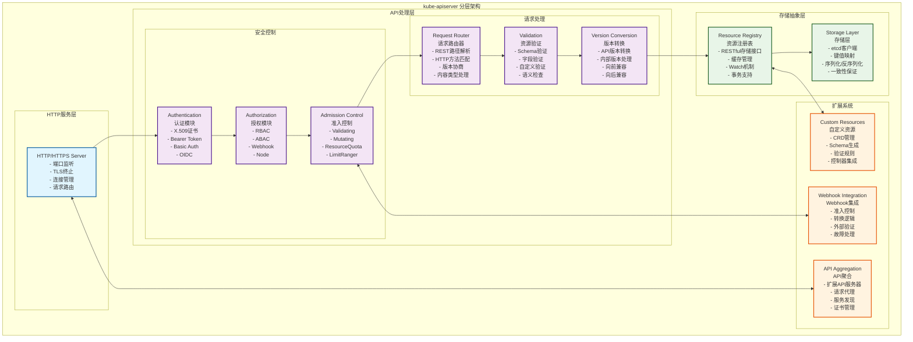
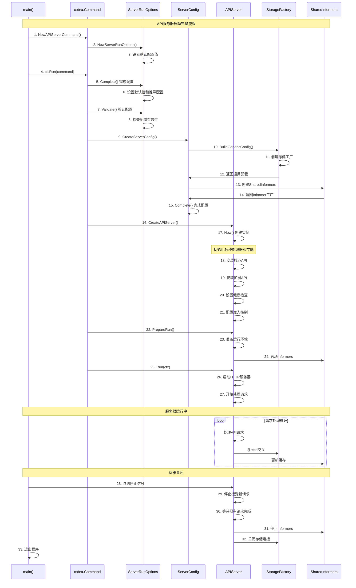
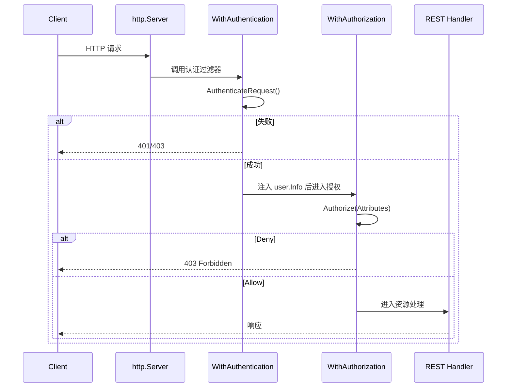
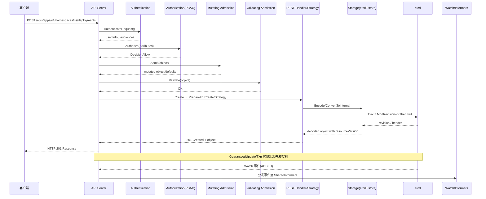
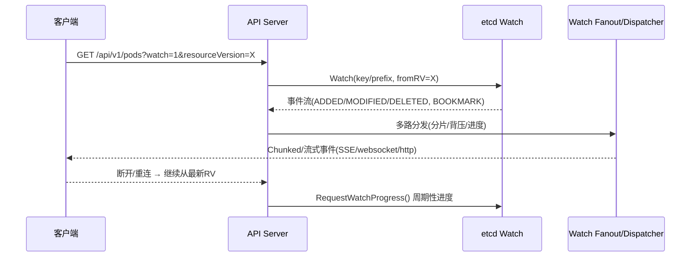
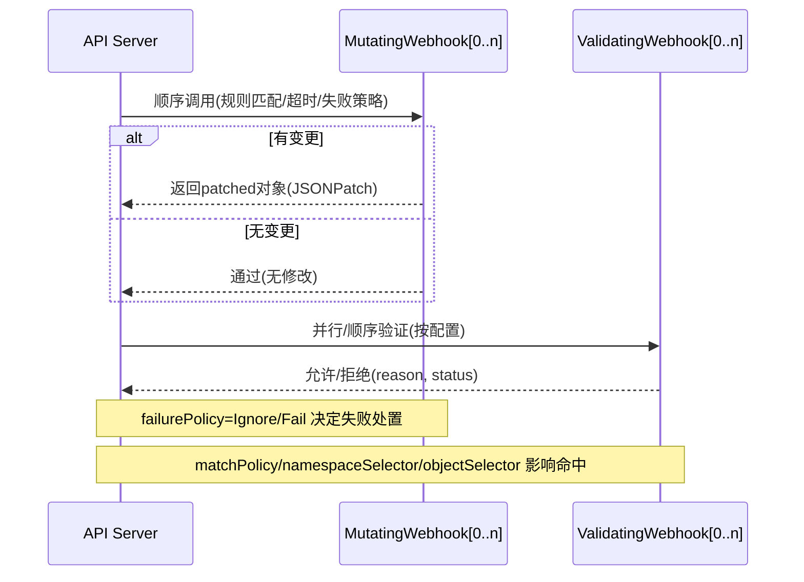

## 概述

kube-apiserver 是 Kubernetes 集群的核心组件，作为所有 REST 操作的统一入口，承担认证、授权、准入控制、资源验证、数据持久化等职责。源码实现包含分层结构与可扩展机制。

<!--more-->

## 1. kube-apiserver架构设计

### 1.1 整体架构概览

kube-apiserver采用分层架构设计，每一层都有明确的职责分工：



### 1.2 核心数据结构

#### 1.2.1 APIServer配置结构

```go
// APIServerConfig API服务器配置结构体
type APIServerConfig struct {
    // GenericConfig 通用服务器配置
    GenericConfig *genericapiserver.Config
    
    // ExtraConfig API服务器特定配置
    ExtraConfig ExtraConfig
}

// ExtraConfig API服务器扩展配置
type ExtraConfig struct {
    // APIResourceConfigSource API资源配置源
    // 定义哪些API组和版本被启用
    APIResourceConfigSource serverstorage.APIResourceConfigSource
    
    // StorageFactory 存储工厂
    // 负责创建各种资源的存储接口
    StorageFactory serverstorage.StorageFactory
    
    // EventTTL 事件生存时间
    // 控制Kubernetes事件在etcd中的保留时间
    EventTTL time.Duration
    
    // KubeletClientConfig kubelet客户端配置
    // API服务器与kubelet通信的配置
    KubeletClientConfig kubeletclient.KubeletClientConfig
    
    // EnableLogsSupport 是否启用日志支持
    // 控制是否支持通过API获取Pod日志
    EnableLogsSupport bool
    
    // ProxyTransport 代理传输配置
    // 用于代理请求到其他组件
    ProxyTransport http.RoundTripper
    
    // Tunneler SSH隧道管理器
    // 用于建立到节点的SSH隧道连接
    Tunneler tunneler.Tunneler
    
    // ServiceIPRange 服务IP范围
    // 定义Service ClusterIP的分配范围
    ServiceIPRange net.IPNet
    
    // SecondaryServiceIPRange 辅助服务IP范围
    // 用于双栈网络的IPv6服务IP分配
    SecondaryServiceIPRange net.IPNet
    
    // ServiceNodePortRange 服务NodePort范围
    // 定义NodePort类型服务的端口分配范围
    ServiceNodePortRange utilnet.PortRange
    
    // EndpointReconcilerType 端点协调器类型
    // 定义如何协调Service的Endpoints
    EndpointReconcilerType reconcilers.Type
    
    // MasterCount 主节点数量
    // 用于某些控制器的决策逻辑
    MasterCount int
    
    // ServiceAccountIssuer 服务账户令牌颁发者
    // JWT令牌的iss声明
    ServiceAccountIssuer serviceaccount.TokenGenerator
    
    // ServiceAccountMaxExpiration 服务账户令牌最大过期时间
    ServiceAccountMaxExpiration time.Duration
    
    // ExtendExpiration 是否自动延长令牌过期时间
    ExtendExpiration bool
    
    // ServiceAccountKeyFiles 服务账户密钥文件列表
    // 用于验证JWT令牌签名的公钥文件
    ServiceAccountKeyFiles []string
    
    // ServiceAccountLookup 是否启用服务账户查找
    // 控制是否验证令牌中的服务账户是否存在
    ServiceAccountLookup bool
    
    // ServiceAccountIssuerURL 服务账户颁发者URL
    // OIDC发现文档的URL
    ServiceAccountIssuerURL string
    
    // ServiceAccountJWKSURI JWKS端点URI
    // 用于获取令牌验证公钥的端点
    ServiceAccountJWKSURI string
    
    // ServiceAccountPublicKeys 服务账户公钥列表
    // 用于验证JWT令牌的公钥集合
    ServiceAccountPublicKeys []interface{}
    
    // VersionedInformers 版本化Informer工厂
    // 用于监听和缓存Kubernetes资源
    VersionedInformers clientgoinformers.SharedInformerFactory
}
```

#### 1.2.2 通用服务器配置结构

```go
// Config 通用API服务器配置
type Config struct {
    // SecureServing HTTPS服务配置
    SecureServing *SecureServingInfo
    
    // Authentication 认证配置
    Authentication AuthenticationInfo
    
    // Authorization 授权配置
    Authorization AuthorizationInfo
    
    // LoopbackClientConfig 回环客户端配置
    // API服务器访问自身的客户端配置
    LoopbackClientConfig *restclient.Config
    
    // EgressSelector 出站连接选择器
    // 控制API服务器的出站网络连接
    EgressSelector *egressselector.EgressSelector
    
    // RuleResolver 规则解析器
    // 用于解析授权规则
    RuleResolver authorizer.RuleResolver
    
    // AdmissionControl 准入控制器
    // 请求的变更和验证逻辑
    AdmissionControl admission.Interface
    
    // CorsAllowedOriginList CORS允许的源列表
    // 跨源资源共享配置
    CorsAllowedOriginList []string
    
    // HSTSDirectives HTTP严格传输安全指令
    // 安全HTTP头配置
    HSTSDirectives []string
    
    // FlowControl 流量控制配置
    // API请求的优先级和公平性控制
    FlowControl utilflowcontrol.Interface
    
    // MaxRequestsInFlight 最大并发请求数
    // 限制同时处理的请求数量
    MaxRequestsInFlight int
    
    // MaxMutatingRequestsInFlight 最大并发变更请求数
    // 限制同时处理的变更请求数量
    MaxMutatingRequestsInFlight int
    
    // RequestTimeout 请求超时时间
    // HTTP请求的默认超时时间
    RequestTimeout time.Duration
    
    // GoawayChance HTTP/2 GOAWAY帧发送概率
    // 用于连接管理和负载均衡
    GoawayChance float64
    
    // LivezGracePeriod 存活检查宽限期
    // 服务器关闭时存活检查的宽限时间
    LivezGracePeriod time.Duration
    
    // ShutdownDelayDuration 关闭延迟时间
    // 服务器开始关闭前的延迟时间
    ShutdownDelayDuration time.Duration
    
    // JSONPatchMaxCopyBytes JSON Patch最大复制字节数
    // 限制JSON Patch操作的内存使用
    JSONPatchMaxCopyBytes int64
    
    // MaxRequestBodyBytes 最大请求体字节数
    // 限制HTTP请求体的大小
    MaxRequestBodyBytes int64
    
    // PublicAddress 公共访问地址
    // 服务器的外部可访问地址
    PublicAddress net.IP
    
    // EquivalentResourceRegistry 等效资源注册表
    // 用于资源转换和兼容性处理
    EquivalentResourceRegistry runtime.EquivalentResourceRegistry
    
    // StorageObjectCountTracker 存储对象计数跟踪器
    // 跟踪存储中各种资源的数量
    StorageObjectCountTracker flowcontrolrequest.StorageObjectCountTracker
    
    // APIServerID API服务器标识
    // 用于分布式系统中的服务器识别
    APIServerID string
    
    // StorageVersionManager 存储版本管理器
    // 管理资源的存储版本信息
    StorageVersionManager storageversion.Manager
    
    // Version 版本信息
    // API服务器的版本信息
    Version *version.Info
}
```

## 2. 启动流程分析

### 2.1 main函数入口

```go
// main kube-apiserver主函数入口
// 文件路径: cmd/kube-apiserver/apiserver.go
func main() {
    // 创建API服务器命令对象
    // 这个命令对象包含了所有的启动参数和配置选项
    command := app.NewAPIServerCommand()
    
    // 使用component-base的CLI运行器执行命令
    // 这提供了统一的命令行处理、信号处理和优雅关闭机制
    code := cli.Run(command)
    
    // 以返回的退出码结束程序
    // 0表示成功，非0表示错误
    os.Exit(code)
}
```

### 2.2 命令创建和配置

```go
// NewAPIServerCommand 创建API服务器命令
// 文件路径: cmd/kube-apiserver/app/server.go
func NewAPIServerCommand() *cobra.Command {
    // 创建服务器运行选项
    // 包含所有命令行参数的默认值和验证规则
    s := options.NewServerRunOptions()
    
    // 设置信号上下文，用于优雅关闭
    ctx := genericapiserver.SetupSignalContext()
    
    // 获取特性门控组件注册表
    featureGate := s.GenericServerRunOptions.ComponentGlobalsRegistry.FeatureGateFor(basecompatibility.DefaultKubeComponent)

    cmd := &cobra.Command{
        Use: "kube-apiserver",
        Long: `The Kubernetes API server validates and configures data
for the api objects which include pods, services, replicationcontrollers, and
others. The API Server services REST operations and provides the frontend to the
cluster's shared state through which all other components interact.`,

        // 禁用在命令错误时打印使用说明
        SilenceUsage: true,
        
        // 预运行钩子：设置组件全局配置
        PersistentPreRunE: func(*cobra.Command, []string) error {
            // 设置组件全局注册表配置
            if err := s.GenericServerRunOptions.ComponentGlobalsRegistry.Set(); err != nil {
                return err
            }
            
            // 静默client-go警告
            // kube-apiserver的回环客户端不应记录自发出的警告
            rest.SetDefaultWarningHandler(rest.NoWarnings{})
            return nil
        },
        
        // 主运行函数
        RunE: func(cmd *cobra.Command, args []string) error {
            // 如果请求版本信息则打印并退出
            verflag.PrintAndExitIfRequested()
            
            // 获取命令行标志
            fs := cmd.Flags()
            
            // 尽早激活日志记录，然后显示最终日志配置的标志
            if err := logsapi.ValidateAndApply(s.Logs, featureGate); err != nil {
                return err
            }
            
            // 显示标志配置（用于调试）
            cliflag.PrintFlags(fs)

            // 设置默认选项值
            completedOptions, err := s.Complete()
            if err != nil {
                return err
            }

            // 验证配置选项
            if errs := completedOptions.Validate(); len(errs) != 0 {
                return utilerrors.NewAggregate(errs)
            }

            // 运行API服务器
            return Run(ctx, completedOptions)
        },
        
        // 参数验证函数
        Args: func(cmd *cobra.Command, args []string) error {
            for _, arg := range args {
                if len(arg) > 0 {
                    return fmt.Errorf("%q does not take any arguments, got %q", cmd.CommandPath(), args)
                }
            }
            return nil
        },
    }

    // 添加通用服务器标志
    fs := cmd.Flags()
    namedFlagSets := s.Flags()
    verflag.AddFlags(namedFlagSets.FlagSet("global"))
    globalflag.AddGlobalFlags(namedFlagSets.FlagSet("global"), cmd.Name(), logs.SkipLoggingConfigurationFlags())
    
    // 将命名标志集合添加到命令中
    for _, f := range namedFlagSets.FlagSets {
        fs.AddFlagSet(f)
    }

    // 添加使用帮助模板
    cols, _, _ := term.TerminalSize(cmd.OutOrStdout())
    cliflag.SetUsageAndHelpFunc(cmd, namedFlagSets, cols)

    return cmd
}
```

### 2.3 服务器运行主流程

```go
// Run 运行API服务器的主函数
// 文件路径: cmd/kube-apiserver/app/server.go
func Run(ctx context.Context, opts *options.CompletedOptions) error {
    // 创建API服务器配置
    config, err := CreateServerConfig(opts)
    if err != nil {
        return err
    }

    // 创建API服务器实例
    server, err := CreateAPIServer(config)
    if err != nil {
        return err
    }

    // 准备运行服务器
    prepared, err := server.PrepareRun()
    if err != nil {
        return err
    }

    // 运行服务器直到收到停止信号
    return prepared.Run(ctx)
}

// CreateServerConfig 创建服务器配置
func CreateServerConfig(opts *options.CompletedOptions) (*controlplane.CompletedConfig, error) {
    // 创建通用API服务器配置
    genericConfig, versionedInformers, storageFactory, err := controlplane.BuildGenericConfig(
        opts.CompletedOptions,
        []*runtime.Scheme{legacyscheme.Scheme, extensionsapiserver.Scheme, aggregatorscheme.Scheme},
        generatedopenapi.GetOpenAPIDefinitions,
    )
    if err != nil {
        return nil, err
    }

    // 设置OpenAPI配置
    if genericConfig.OpenAPIConfig != nil {
        genericConfig.OpenAPIConfig.Info.Title = "Kubernetes"
        genericConfig.OpenAPIConfig.DefaultResponse = &spec.Response{
            ResponseProps: spec.ResponseProps{
                Description: "Default Response.",
            },
        }
        genericConfig.OpenAPIConfig.Definitions = generatedopenapi.GetOpenAPIDefinitions(func(name string) spec.Ref {
            return spec.MustCreateRef("#/definitions/" + common.EscapeJsonPointer(name))
        })
    }

    // 创建控制平面配置
    config := &controlplane.Config{
        GenericConfig: genericConfig,
        ExtraConfig: controlplane.ExtraConfig{
            APIResourceConfigSource: storageFactory.APIResourceConfigSource,
            StorageFactory:         storageFactory,
            EventTTL:              opts.EventTTL,
            KubeletClientConfig:    opts.KubeletConfig,
            EnableLogsSupport:     opts.EnableLogsHandler,
            ProxyTransport:        opts.ProxyTransport,
        },
    }

    // 设置客户端CA配置
    if opts.ClientCAFile != "" {
        config.ExtraConfig.ClientCAProvider, err = dynamiccertificates.NewDynamicCAFromFile("client-ca-bundle", opts.ClientCAFile)
        if err != nil {
            return nil, err
        }
    }

    // 设置版本化Informers
    config.ExtraConfig.VersionedInformers = versionedInformers

    // 完成配置并返回
    return config.Complete(), nil
}

// CreateAPIServer 创建API服务器实例
func CreateAPIServer(config *controlplane.CompletedConfig) (*controlplane.Instance, error) {
    return config.New(controlplane.DefaultLegacyAPIPrefix)
}
```

### 2.4 启动时序图



## 3. 请求处理流程

### 3.1 HTTP请求处理架构

```mermaid
graph TB
    subgraph "HTTP请求处理流水线"
        subgraph "网络层"
            LISTENER[TCP Listener<br/>- 端口监听<br/>- 连接接受<br/>- TLS握手]
            HTTP_SERVER[HTTP Server<br/>- Go net/http<br/>- 多路复用<br/>- 连接管理]
        end
        
        subgraph "中间件链"
            PANIC_RECOVERY[Panic Recovery<br/>- 异常捕获<br/>- 错误恢复<br/>- 日志记录]
            TIMEOUT[Request Timeout<br/>- 请求超时控制<br/>- 上下文取消<br/>- 资源清理]
            CORS[CORS Handler<br/>- 跨域处理<br/>- 预检请求<br/>- 安全头设置]
            AUDIT[Audit Logging<br/>- 审计日志<br/>- 请求跟踪<br/>- 合规记录]
        end
        
        subgraph "认证授权"
            AUTHN[Authentication<br/>- 身份验证<br/>- 令牌解析<br/>- 用户信息提取]
            AUTHZ[Authorization<br/>- 权限检查<br/>- 策略评估<br/>- 访问控制]
        end
        
        subgraph "准入控制"
            MUTATING_ADMISSION[Mutating Admission<br/>- 资源变更<br/>- 默认值设置<br/>- 标签注入]
            VALIDATING_ADMISSION[Validating Admission<br/>- 资源验证<br/>- 策略检查<br/>- 约束验证]
        end
        
        subgraph "业务处理"
            RESOURCE_HANDLER[Resource Handler<br/>- REST操作<br/>- 资源路由<br/>- 版本转换]
            STORAGE_BACKEND[Storage Backend<br/>- etcd操作<br/>- 数据持久化<br/>- 一致性保证]
        end
    end
    
    %% 请求流向
    LISTENER --> HTTP_SERVER
    HTTP_SERVER --> PANIC_RECOVERY
    PANIC_RECOVERY --> TIMEOUT
    TIMEOUT --> CORS
    CORS --> AUDIT
    AUDIT --> AUTHN
    AUTHN --> AUTHZ
    AUTHZ --> MUTATING_ADMISSION
    MUTATING_ADMISSION --> VALIDATING_ADMISSION
    VALIDATING_ADMISSION --> RESOURCE_HANDLER
    RESOURCE_HANDLER --> STORAGE_BACKEND
```



#### 3.1.1 过滤链关键函数与说明（核心代码+调用链）

```go
// 文件：staging/src/k8s.io/apiserver/pkg/server/filters/authentication.go
// WithAuthentication 在 http.Handler 链上注入认证逻辑：提取来访凭证，
// 通过 authenticator.Request 组合器完成认证，认证失败时返回 401/403。
func WithAuthentication(handler http.Handler, auth authenticator.Request, failed http.Handler, apiAuds authenticator.Audiences) http.Handler {

    return http.HandlerFunc(func(w http.ResponseWriter, req *http.Request) {
        // 1) 认证：从 mTLS/client cert、Authorization(Bearer) 等来源解析身份
        resp, ok, err := auth.AuthenticateRequest(req)
        if err != nil || !ok {
            // 2) 失败短路：可返回 WWW-Authenticate 或审计标记
            failed.ServeHTTP(w, req)
            return
        }
        // 3) 将 user.Info/受众写入上下文，供后续授权/审计使用
        req = request.WithUser(req, resp.User)
        handler.ServeHTTP(w, req)
    })
}

// 文件：staging/src/k8s.io/apiserver/pkg/server/filters/authorization.go
// WithAuthorization 在 http.Handler 链上注入授权：把请求映射为 Attributes，
// 调用 authorizer.Authorizer 评估是否允许。
func WithAuthorization(handler http.Handler, authz authorizer.Authorizer, s runtime.RequestInfoResolver) http.Handler {

    return http.HandlerFunc(func(w http.ResponseWriter, req *http.Request) {
        // 1) 构造 Attributes：verb、group、version、resource、subresource、name、ns、path
        ri, _ := s.NewRequestInfo(req)
        attrs := authorizer.AttributesRecord{
            User:            request.UserFrom(req.Context()),
            Verb:            ri.Verb,
            APIGroup:        ri.APIGroup,
            APIVersion:      ri.APIVersion,
            Resource:        ri.Resource,
            Subresource:     ri.Subresource,
            Name:            ri.Name,
            Namespace:       ri.Namespace,
            ResourceRequest: ri.IsResourceRequest,
            Path:            req.URL.Path,
        }
        // 2) 授权评估
        decision, reason, err := authz.Authorize(req.Context(), attrs)
        if err != nil || decision != authorizer.DecisionAllow {
            http.Error(w, reason, http.StatusForbidden)
            return
        }
        handler.ServeHTTP(w, req)
    })
}
```

- 调用链（请求进入）
  - http.Server → WithPanicRecovery → WithTimeout → WithCORS → WithAudit → WithAuthentication → WithAuthorization → admission chain → REST handler
  - WithAuthentication → `authenticator.Request.AuthenticateRequest()` → `user.Info` 注入 ctx
  - WithAuthorization → 构造 `authorizer.AttributesRecord` → `authorizer.Authorize()`

##### 时序图：认证/授权过滤链



### 3.2 认证模块源码分析

#### 3.2.1 认证器接口定义

```go
// Request 认证请求结构体
// 文件路径: staging/src/k8s.io/apiserver/pkg/authentication/authenticator/interfaces.go
type Request interface {
    // AuthenticateRequest 认证HTTP请求
    // 参数:
    //   req - HTTP请求对象
    // 返回值:
    //   Response - 认证响应，包含用户信息
    //   bool - 认证是否成功
    //   error - 认证过程中的错误
    AuthenticateRequest(req *http.Request) (*Response, bool, error)
}

// Response 认证响应结构体
type Response struct {
    // User 认证成功的用户信息
    User user.Info
    
    // Audiences 令牌的受众列表
    // 用于验证JWT令牌的aud声明
    Audiences authenticator.Audiences
}

// Token 令牌认证器接口
type Token interface {
    // AuthenticateToken 认证令牌
    // 参数:
    //   ctx - 请求上下文
    //   token - 待认证的令牌字符串
    // 返回值:
    //   Response - 认证响应
    //   bool - 认证是否成功  
    //   error - 认证错误
    AuthenticateToken(ctx context.Context, token string) (*Response, bool, error)
}

// Password 密码认证器接口
type Password interface {
    // AuthenticatePassword 认证用户名密码
    // 参数:
    //   ctx - 请求上下文
    //   user - 用户名
    //   password - 密码
    // 返回值:
    //   Response - 认证响应
    //   bool - 认证是否成功
    //   error - 认证错误
    AuthenticatePassword(ctx context.Context, user, password string) (*Response, bool, error)
}
```

#### 3.2.2 X.509证书认证实现

```go
// CAContentProvider CA内容提供者接口
// 文件路径: staging/src/k8s.io/apiserver/pkg/authentication/request/x509/x509.go
type CAContentProvider interface {
    // CurrentCABundleContent 获取当前CA证书包内容
    // 返回当前有效的CA证书PEM数据
    CurrentCABundleContent() []byte
}

// Verifier X.509证书验证器结构体
type Verifier struct {
    // roots 根证书池
    // 包含所有受信任的CA证书
    roots *x509.CertPool
    
    // getRoot 获取根证书的函数
    // 支持动态更新CA证书
    getRoot func() *x509.CertPool
    
    // maxChainLen 证书链最大长度
    // 防止过长的证书链导致性能问题
    maxChainLen int
}

// NewVerifier 创建X.509证书验证器
func NewVerifier(roots *x509.CertPool, caContentProvider CAContentProvider, maxChainLen int) *Verifier {
    var getRootCerts func() *x509.CertPool
    
    if caContentProvider != nil {
        // 如果提供了CA内容提供者，则支持动态CA更新
        getRootCerts = func() *x509.CertPool {
            // 获取当前CA证书内容
            caBundle := caContentProvider.CurrentCABundleContent()
            if len(caBundle) == 0 {
                return roots
            }
            
            // 创建新的证书池
            rootPool := x509.NewCertPool()
            if !rootPool.AppendCertsFromPEM(caBundle) {
                klog.Warning("Failed to parse CA bundle, using static roots")
                return roots
            }
            return rootPool
        }
    } else {
        // 使用静态根证书
        getRootCerts = func() *x509.CertPool {
            return roots
        }
    }
    
    return &Verifier{
        roots:       roots,
        getRoot:     getRootCerts,
        maxChainLen: maxChainLen,
    }
}

// AuthenticateRequest 认证X.509证书请求
func (v *Verifier) AuthenticateRequest(req *http.Request) (*authenticator.Response, bool, error) {
    // 检查是否为TLS连接
    if req.TLS == nil || len(req.TLS.PeerCertificates) == 0 {
        return nil, false, nil
    }
    
    // 获取客户端证书链
    chains := req.TLS.PeerCertificates
    if len(chains) > v.maxChainLen {
        return nil, false, fmt.Errorf("client certificate chain is too long: %d", len(chains))
    }
    
    // 验证证书链
    clientCert := chains[0]
    intermediates := x509.NewCertPool()
    for i := 1; i < len(chains); i++ {
        intermediates.AddCert(chains[i])
    }
    
    // 执行证书验证
    opts := x509.VerifyOptions{
        Roots:         v.getRoot(),
        Intermediates: intermediates,
        KeyUsages:     []x509.ExtKeyUsage{x509.ExtKeyUsageClientAuth},
    }
    
    if _, err := clientCert.Verify(opts); err != nil {
        return nil, false, err
    }
    
    // 从证书中提取用户信息
    user := &user.DefaultInfo{
        Name:   clientCert.Subject.CommonName,
        Groups: clientCert.Subject.Organization,
    }
    
    return &authenticator.Response{User: user}, true, nil
}
```

#### 3.2.3 Bearer Token认证实现

```go
// TokenAuthenticator Bearer Token认证器
// 文件路径: staging/src/k8s.io/apiserver/pkg/authentication/request/bearertoken/bearertoken.go
type TokenAuthenticator struct {
    // auth 底层令牌认证器
    auth authenticator.Token
}

// New 创建Bearer Token认证器
func New(auth authenticator.Token) *TokenAuthenticator {
    return &TokenAuthenticator{auth}
}

// AuthenticateRequest 认证Bearer Token请求
func (a *TokenAuthenticator) AuthenticateRequest(req *http.Request) (*authenticator.Response, bool, error) {
    // 从Authorization头中提取Bearer Token
    auth := strings.TrimSpace(req.Header.Get("Authorization"))
    if auth == "" {
        return nil, false, nil
    }
    
    // 检查是否为Bearer Token格式
    parts := strings.SplitN(auth, " ", 3)
    if len(parts) < 2 || !strings.EqualFold(parts[0], "bearer") {
        return nil, false, nil
    }
    
    // 提取令牌字符串
    token := parts[1]
    if len(parts) == 3 {
        // 处理令牌中包含空格的情况
        token = fmt.Sprintf("%s %s", token, parts[2])
    }
    
    // 调用底层认证器进行令牌验证
    return a.auth.AuthenticateToken(req.Context(), token)
}

// ServiceAccountTokenAuthenticator ServiceAccount Token认证器
type ServiceAccountTokenAuthenticator struct {
    // keyResolver 密钥解析器
    // 用于获取验证JWT令牌的公钥
    keyResolver serviceaccount.TokenKeyResolver
    
    // validator 令牌验证器
    // 执行JWT令牌的签名验证和声明检查
    validator serviceaccount.TokenValidator
    
    // implicitAuds 隐式受众列表
    // 当令牌没有明确指定受众时使用的默认受众
    implicitAuds authenticator.Audiences
}

// NewServiceAccountTokenAuthenticator 创建ServiceAccount Token认证器
func NewServiceAccountTokenAuthenticator(
    keyResolver serviceaccount.TokenKeyResolver,
    validator serviceaccount.TokenValidator,
    implicitAuds authenticator.Audiences,
) *ServiceAccountTokenAuthenticator {
    return &ServiceAccountTokenAuthenticator{
        keyResolver:  keyResolver,
        validator:    validator,
        implicitAuds: implicitAuds,
    }
}

// AuthenticateToken 认证ServiceAccount Token
func (s *ServiceAccountTokenAuthenticator) AuthenticateToken(ctx context.Context, token string) (*authenticator.Response, bool, error) {
    // 解析JWT令牌
    claims, err := s.validator.Validate(ctx, token, s.keyResolver)
    if err != nil {
        return nil, false, err
    }
    
    // 验证令牌受众
    auds := s.implicitAuds
    if len(claims.Audience) > 0 {
        auds = authenticator.Audiences(claims.Audience)
    }
    
    // 构造用户信息
    // ServiceAccount的用户名格式: system:serviceaccount:{namespace}:{name}
    username := serviceaccount.MakeUsername(claims.Namespace, claims.ServiceAccountName)
    
    // ServiceAccount的用户组
    groups := serviceaccount.MakeGroupNames(claims.Namespace)
    
    user := &user.DefaultInfo{
        Name:   username,
        UID:    string(claims.ServiceAccountUID),
        Groups: groups,
        Extra:  make(map[string][]string),
    }
    
    // 添加额外的声明信息
    if claims.PodName != "" {
        user.Extra[serviceaccount.PodNameKey] = []string{claims.PodName}
    }
    if claims.PodUID != "" {
        user.Extra[serviceaccount.PodUIDKey] = []string{claims.PodUID}
    }
    
    return &authenticator.Response{
        User:      user,
        Audiences: auds,
    }, true, nil
}
```

### 3.3 授权模块源码分析

#### 3.3.1 授权器接口定义

```go
// Authorizer 授权器接口
// 文件路径: staging/src/k8s.io/apiserver/pkg/authorization/authorizer/interfaces.go
type Authorizer interface {
    // Authorize 执行授权检查
    // 参数:
    //   ctx - 请求上下文
    //   a - 授权属性，包含用户、资源、动作等信息
    // 返回值:
    //   Decision - 授权决策(Allow/Deny/NoOpinion)
    //   string - 决策原因
    //   error - 授权过程中的错误
    Authorize(ctx context.Context, a Attributes) (Decision, string, error)
}

// Attributes 授权属性接口
type Attributes interface {
    // GetUser 获取用户信息
    GetUser() user.Info
    
    // GetVerb 获取操作动词(get, list, create, update, delete等)
    GetVerb() string
    
    // GetNamespace 获取命名空间
    GetNamespace() string
    
    // GetResource 获取资源类型
    GetResource() string
    
    // GetSubresource 获取子资源
    GetSubresource() string
    
    // GetName 获取资源名称
    GetName() string
    
    // GetAPIGroup 获取API组
    GetAPIGroup() string
    
    // GetAPIVersion 获取API版本
    GetAPIVersion() string
    
    // IsResourceRequest 是否为资源请求
    IsResourceRequest() bool
    
    // GetPath 获取请求路径(用于非资源请求)
    GetPath() string
}

// Decision 授权决策类型
type Decision int

const (
    // DecisionDeny 拒绝访问
    DecisionDeny Decision = iota
    
    // DecisionAllow 允许访问
    DecisionAllow
    
    // DecisionNoOpinion 无明确意见，需要其他授权器决策
    DecisionNoOpinion
)
```

#### 3.3.2 RBAC授权器实现

```go
// RBACAuthorizer RBAC授权器结构体
// 文件路径: plugin/pkg/auth/authorizer/rbac/rbac.go
type RBACAuthorizer struct {
    // roleGetter 角色获取器
    // 用于获取Role和ClusterRole资源
    roleGetter RoleGetter
    
    // roleBindingLister 角色绑定列表器
    // 用于获取RoleBinding和ClusterRoleBinding资源
    roleBindingLister RoleBindingLister
    
    // clusterRoleGetter 集群角色获取器
    // 用于获取ClusterRole资源
    clusterRoleGetter ClusterRoleGetter
    
    // clusterRoleBindingLister 集群角色绑定列表器
    // 用于获取ClusterRoleBinding资源
    clusterRoleBindingLister ClusterRoleBindingLister
}

// NewRBACAuthorizer 创建RBAC授权器
func NewRBACAuthorizer(
    roleGetter RoleGetter,
    roleBindingLister RoleBindingLister, 
    clusterRoleGetter ClusterRoleGetter,
    clusterRoleBindingLister ClusterRoleBindingLister,
) *RBACAuthorizer {
    return &RBACAuthorizer{
        roleGetter:               roleGetter,
        roleBindingLister:        roleBindingLister,
        clusterRoleGetter:        clusterRoleGetter,
        clusterRoleBindingLister: clusterRoleBindingLister,
    }
}

// Authorize 执行RBAC授权检查
func (r *RBACAuthorizer) Authorize(ctx context.Context, requestAttributes authorizer.Attributes) (authorizer.Decision, string, error) {
    // 获取用户信息
    user := requestAttributes.GetUser()
    if user == nil {
        return authorizer.DecisionNoOpinion, "no user provided", nil
    }
    
    // 构建规则解析上下文
    ruleCheckingVisitor := &authorizingVisitor{
        requestAttributes: requestAttributes,
    }
    
    // 检查集群级别的角色绑定
    if err := r.visitRulesFor(ctx, user, "", ruleCheckingVisitor, ""); err != nil {
        return authorizer.DecisionNoOpinion, "", err
    }
    
    // 如果是资源请求，还需要检查命名空间级别的角色绑定
    if requestAttributes.IsResourceRequest() {
        namespace := requestAttributes.GetNamespace()
        if namespace != "" {
            if err := r.visitRulesFor(ctx, user, namespace, ruleCheckingVisitor, ""); err != nil {
                return authorizer.DecisionNoOpinion, "", err
            }
        }
    }
    
    // 根据访问结果返回决策
    if ruleCheckingVisitor.allowed {
        return authorizer.DecisionAllow, ruleCheckingVisitor.reason, nil
    }
    
    return authorizer.DecisionNoOpinion, "", nil
}

// visitRulesFor 访问用户在指定命名空间中的所有规则
func (r *RBACAuthorizer) visitRulesFor(ctx context.Context, user user.Info, namespace string, visitor RuleAccumulator, ownerChain string) error {
    // 检查用户是否匹配任何RoleBinding
    if len(namespace) > 0 {
        // 获取命名空间中的所有RoleBinding
        roleBindings, err := r.roleBindingLister.ListRoleBindings(namespace)
        if err != nil {
            return err
        }
        
        // 遍历RoleBinding，检查用户是否匹配
        for _, roleBinding := range roleBindings {
            subjectIndex, applies := appliesTo(user, roleBinding.Subjects, namespace)
            if !applies {
                continue
            }
            
            // 获取角色规则
            rules, err := r.GetRole(roleBinding, namespace)
            if err != nil {
                continue
            }
            
            // 访问规则
            if visitor.VisitRulesFor(user, namespace, roleBinding.Name, subjectIndex, rules) {
                return nil
            }
        }
    }
    
    // 检查用户是否匹配任何ClusterRoleBinding
    clusterRoleBindings, err := r.clusterRoleBindingLister.ListClusterRoleBindings()
    if err != nil {
        return err
    }
    
    // 遍历ClusterRoleBinding，检查用户是否匹配
    for _, clusterRoleBinding := range clusterRoleBindings {
        subjectIndex, applies := appliesTo(user, clusterRoleBinding.Subjects, namespace)
        if !applies {
            continue
        }
        
        // 获取集群角色规则
        rules, err := r.GetClusterRole(clusterRoleBinding)
        if err != nil {
            continue
        }
        
        // 访问规则
        if visitor.VisitRulesFor(user, namespace, clusterRoleBinding.Name, subjectIndex, rules) {
            return nil
        }
    }
    
    return nil
}

// authorizingVisitor 授权访问器，实现RuleAccumulator接口
type authorizingVisitor struct {
    // requestAttributes 请求属性
    requestAttributes authorizer.Attributes
    
    // allowed 是否被允许
    allowed bool
    
    // reason 允许的原因
    reason string
}

// VisitRulesFor 访问用户的规则
func (v *authorizingVisitor) VisitRulesFor(user user.Info, namespace, name string, subjectIndex int, rules []rbacv1.PolicyRule) bool {
    // 检查规则是否匹配当前请求
    for i := range rules {
        if RuleAllows(v.requestAttributes, &rules[i]) {
            v.allowed = true
            v.reason = fmt.Sprintf("RBAC: allowed by %s %q bound to %q", 
                getRoleBindingType(namespace), name, formatSubject(user, subjectIndex))
            return true
        }
    }
    return false
}

// RuleAllows 检查规则是否允许请求
func RuleAllows(requestAttributes authorizer.Attributes, rule *rbacv1.PolicyRule) bool {
    // 检查动词是否匹配
    if !VerbMatches(rule, requestAttributes.GetVerb()) {
        return false
    }
    
    if requestAttributes.IsResourceRequest() {
        // 资源请求：检查API组、资源、子资源、资源名称
        combinedResource := requestAttributes.GetResource()
        if len(requestAttributes.GetSubresource()) > 0 {
            combinedResource = requestAttributes.GetResource() + "/" + requestAttributes.GetSubresource()
        }
        
        if !APIGroupMatches(rule, requestAttributes.GetAPIGroup()) {
            return false
        }
        
        if !ResourceMatches(rule, combinedResource, requestAttributes.GetSubresource()) {
            return false
        }
        
        if !ResourceNameMatches(rule, requestAttributes.GetName()) {
            return false
        }
        
        return true
    }
    
    // 非资源请求：检查路径
    return NonResourceURLMatches(rule, requestAttributes.GetPath())
}
```

### 3.4 准入控制模块源码分析

#### 3.4.1 准入控制器接口定义

```go
// Interface 准入控制器接口
// 文件路径: staging/src/k8s.io/apiserver/pkg/admission/interfaces.go
type Interface interface {
    // Handles 检查是否处理指定的操作
    // 参数:
    //   operation - 操作类型(CREATE, UPDATE, DELETE等)
    // 返回值:
    //   bool - 是否处理该操作
    Handles(operation Operation) bool
}

// MutationInterface 变更准入控制器接口
type MutationInterface interface {
    Interface
    
    // Admit 执行准入控制逻辑
    // 可以修改传入的对象
    // 参数:
    //   ctx - 请求上下文
    //   a - 准入属性，包含对象、操作类型等信息
    //   o - 对象接口集合
    // 返回值:
    //   error - 准入控制错误，非nil表示拒绝请求
    Admit(ctx context.Context, a Attributes, o ObjectInterfaces) error
}

// ValidationInterface 验证准入控制器接口
type ValidationInterface interface {
    Interface
    
    // Validate 执行验证逻辑
    // 不能修改传入的对象，只能验证
    // 参数和返回值与Admit相同
    Validate(ctx context.Context, a Attributes, o ObjectInterfaces) error
}

// Attributes 准入属性接口
type Attributes interface {
    // GetName 获取资源名称
    GetName() string
    
    // GetNamespace 获取命名空间
    GetNamespace() string
    
    // GetResource 获取资源信息
    GetResource() schema.GroupVersionResource
    
    // GetSubresource 获取子资源
    GetSubresource() string
    
    // GetObject 获取新对象
    GetObject() runtime.Object
    
    // GetOldObject 获取旧对象(用于UPDATE操作)
    GetOldObject() runtime.Object
    
    // GetOperation 获取操作类型
    GetOperation() Operation
    
    // GetOperationOptions 获取操作选项
    GetOperationOptions() runtime.Object
    
    // IsDryRun 是否为干运行
    IsDryRun() bool
    
    // GetUserInfo 获取用户信息
    GetUserInfo() user.Info
}

// Operation 操作类型
type Operation string

const (
    Create  Operation = "CREATE"
    Update  Operation = "UPDATE" 
    Delete  Operation = "DELETE"
    Connect Operation = "CONNECT"
)
```

#### 3.4.2 ResourceQuota准入控制器实现

```go
// QuotaAdmission 资源配额准入控制器
// 文件路径: plugin/pkg/admission/resourcequota/admission.go
type QuotaAdmission struct {
    // Handler 处理器基类
    *admission.Handler
    
    // evaluator 配额评估器
    // 计算资源使用量和配额消耗
    evaluator quota.Evaluator
    
    // quotaAccessor 配额访问器
    // 用于获取和更新ResourceQuota对象
    quotaAccessor quotaAccessor
    
    // numEvaluatorThreads 评估器线程数
    numEvaluatorThreads int
    
    // quotaConfiguration 配额配置
    // 定义哪些资源需要进行配额检查
    quotaConfiguration quota.Configuration
    
    // registry 注册表
    // 包含所有已知的配额评估器
    registry quota.Registry
    
    // stopCh 停止信号通道
    stopCh <-chan struct{}
    
    // informerFactory Informer工厂
    // 用于监听Kubernetes资源变化
    informerFactory informers.SharedInformerFactory
    
    // kubeClient Kubernetes客户端
    kubeClient kubernetes.Interface
}

// NewResourceQuota 创建资源配额准入控制器
func NewResourceQuota(quotaConfiguration quota.Configuration, numEvaluatorThreads int, stopCh <-chan struct{}) (*QuotaAdmission, error) {
    return &QuotaAdmission{
        Handler:             admission.NewHandler(admission.Create, admission.Update),
        quotaConfiguration:  quotaConfiguration,
        numEvaluatorThreads: numEvaluatorThreads,
        stopCh:              stopCh,
    }, nil
}

// Admit 执行资源配额准入控制
func (q *QuotaAdmission) Admit(ctx context.Context, a admission.Attributes, o admission.ObjectInterfaces) error {
    // 只处理CREATE和UPDATE操作
    if !q.Handles(a.GetOperation()) {
        return nil
    }
    
    // 获取资源信息
    resource := a.GetResource()
    namespace := a.GetNamespace()
    
    // 跳过不需要配额检查的资源
    if !q.quotaConfiguration.IgnoredResources().Has(resource.GroupResource()) {
        return nil
    }
    
    // 获取命名空间中的所有ResourceQuota
    quotas, err := q.quotaAccessor.GetQuotas(namespace)
    if err != nil {
        return admission.NewForbidden(a, err)
    }
    
    // 如果没有配额限制，直接通过
    if len(quotas) == 0 {
        return nil
    }
    
    // 评估资源使用量
    evaluators := q.registry.List()
    
    // 并发评估所有配额
    evaluationResults := make([]quota.Result, len(quotas))
    var wg sync.WaitGroup
    var errs []error
    var errLock sync.Mutex
    
    for i, resourceQuota := range quotas {
        wg.Add(1)
        go func(index int, rq *v1.ResourceQuota) {
            defer wg.Done()
            
            // 计算当前请求的资源消耗
            usage, err := q.evaluator.Usage(a.GetObject())
            if err != nil {
                errLock.Lock()
                errs = append(errs, err)
                errLock.Unlock()
                return
            }
            
            // 检查是否超过配额限制
            result := quota.CheckRequest(rq, usage)
            evaluationResults[index] = result
            
        }(i, resourceQuota)
    }
    
    wg.Wait()
    
    // 检查是否有错误
    if len(errs) > 0 {
        return admission.NewForbidden(a, utilerrors.NewAggregate(errs))
    }
    
    // 检查配额限制
    for i, result := range evaluationResults {
        if !result.Allowed() {
            return admission.NewForbidden(a, fmt.Errorf(
                "exceeded quota: %s, requested: %s, used: %s, limited: %s",
                quotas[i].Name,
                result.Requested().String(),
                result.Used().String(),
                result.Limited().String(),
            ))
        }
    }
    
    // 更新配额使用量
    for i, resourceQuota := range quotas {
        if evaluationResults[i].Changed() {
            updatedQuota := evaluationResults[i].UpdatedQuota()
            if err := q.quotaAccessor.UpdateQuota(updatedQuota); err != nil {
                return admission.NewForbidden(a, err)
            }
        }
    }
    
    return nil
}

// Validate 验证资源配额
func (q *QuotaAdmission) Validate(ctx context.Context, a admission.Attributes, o admission.ObjectInterfaces) error {
    // ResourceQuota是变更准入控制器，不实现Validate方法
    return nil
}

// SetInformerFactory 设置Informer工厂
func (q *QuotaAdmission) SetInformerFactory(f informers.SharedInformerFactory) {
    q.informerFactory = f
}

// SetKubeClientset 设置Kubernetes客户端
func (q *QuotaAdmission) SetKubeClientset(client kubernetes.Interface) {
    q.kubeClient = client
}

// ValidateInitialization 验证初始化
func (q *QuotaAdmission) ValidateInitialization() error {
    if q.quotaConfiguration == nil {
        return fmt.Errorf("missing quotaConfiguration")
    }
    if q.informerFactory == nil {
        return fmt.Errorf("missing informerFactory")
    }
    if q.kubeClient == nil {
        return fmt.Errorf("missing kubeClient")
    }
    return nil
}
```

### 3.5 典型Create请求端到端时序图



### 3.6 Watch请求与事件分发时序图



### 3.7 准入Webhook链路时序图



## 4. 存储层实现

### 4.1 etcd存储接口

```go
// Interface 存储接口定义
// 文件路径: staging/src/k8s.io/apiserver/pkg/storage/interfaces.go
type Interface interface {
    // Versioner 版本管理器
    // 用于处理资源版本
    Versioner() Versioner
    
    // Create 创建对象
    // 参数:
    //   ctx - 上下文
    //   key - 存储键
    //   obj - 要存储的对象
    //   out - 输出对象
    //   ttl - 生存时间
    // 返回值:
    //   error - 创建错误
    Create(ctx context.Context, key string, obj, out runtime.Object, ttl uint64) error
    
    // Delete 删除对象
    Delete(ctx context.Context, key string, out runtime.Object, preconditions *Preconditions, 
        validateDeletion ValidateObjectFunc, cachedExistingObject runtime.Object) error
    
    // Watch 监听对象变化
    Watch(ctx context.Context, key string, opts ListOptions) (watch.Interface, error)
    
    // Get 获取对象
    Get(ctx context.Context, key string, opts GetOptions, objPtr runtime.Object) error
    
    // GetList 获取对象列表
    GetList(ctx context.Context, key string, opts ListOptions, listObj runtime.Object) error
    
    // GuaranteedUpdate 保证更新
    // 实现乐观并发控制
    GuaranteedUpdate(ctx context.Context, key string, destination runtime.Object, 
        ignoreNotFound bool, preconditions *Preconditions, 
        tryUpdate UpdateFunc, cachedExistingObject runtime.Object) error
    
    // Count 计数对象
    Count(key string) (int64, error)
    
    // RequestWatchProgress 请求监听进度
    RequestWatchProgress(ctx context.Context) error
}

// Versioner 版本管理器接口
type Versioner interface {
    // UpdateObject 更新对象版本
    UpdateObject(obj runtime.Object, resourceVersion uint64) error
    
    // UpdateList 更新列表版本
    UpdateList(obj runtime.Object, resourceVersion uint64, continueValue string, remainingItemCount *int64) error
    
    // PrepareObjectForStorage 为存储准备对象
    PrepareObjectForStorage(obj runtime.Object) error
    
    // ObjectResourceVersion 获取对象资源版本
    ObjectResourceVersion(obj runtime.Object) (uint64, error)
    
    // ParseResourceVersion 解析资源版本字符串
    ParseResourceVersion(resourceVersion string) (uint64, error)
}
```

### 4.2 etcd3存储实现

```go
// store etcd3存储实现
// 文件路径: staging/src/k8s.io/apiserver/pkg/storage/etcd3/store.go
type store struct {
    // client etcd客户端
    client *clientv3.Client
    
    // codec 编解码器
    // 用于序列化/反序列化Kubernetes对象
    codec runtime.Codec
    
    // versioner 版本管理器
    versioner storage.Versioner
    
    // transformer 数据转换器
    // 用于加密/解密存储数据
    transformer value.Transformer
    
    // pathPrefix 路径前缀
    // 所有键的公共前缀，通常为"/registry"
    pathPrefix string
    
    // groupResource 组资源信息
    groupResource schema.GroupResource
    
    // groupResourceString 组资源字符串
    groupResourceString string
    
    // watcher 监听器
    watcher *watcher
    
    // pagingEnabled 是否启用分页
    pagingEnabled bool
    
    // leaseManager 租约管理器
    // 用于管理etcd租约
    leaseManager *leaseManager
}

// New 创建etcd3存储
func New(c *clientv3.Client, codec runtime.Codec, newFunc func() runtime.Object, 
    prefix string, groupResource schema.GroupResource, transformer value.Transformer, 
    pagingEnabled bool, leaseManagerConfig LeaseManagerConfig) storage.Interface {
    
    return newStore(c, codec, newFunc, prefix, groupResource, transformer, pagingEnabled, leaseManagerConfig)
}

// newStore 创建存储实例
func newStore(c *clientv3.Client, codec runtime.Codec, newFunc func() runtime.Object,
    prefix string, groupResource schema.GroupResource, transformer value.Transformer,
    pagingEnabled bool, leaseManagerConfig LeaseManagerConfig) *store {
    
    versioner := APIObjectVersioner{}
    result := &store{
        client:              c,
        codec:               codec,
        versioner:           versioner,
        transformer:         transformer,
        pathPrefix:          path.Join("/", prefix),
        groupResource:       groupResource,
        groupResourceString: groupResource.String(),
        watcher:             newWatcher(c, codec, newFunc, versioner),
        pagingEnabled:       pagingEnabled,
        leaseManager:        newLeaseManager(c, leaseManagerConfig),
    }
    return result
}

// Create 创建对象到etcd
func (s *store) Create(ctx context.Context, key string, obj, out runtime.Object, ttl uint64) error {
    // 检查上下文是否已取消
    if ctx.Err() != nil {
        return ctx.Err()
    }
    
    // 准备对象以便存储
    if err := s.versioner.PrepareObjectForStorage(obj); err != nil {
        return fmt.Errorf("PrepareObjectForStorage failed: %v", err)
    }
    
    // 序列化对象
    data, err := runtime.Encode(s.codec, obj)
    if err != nil {
        return err
    }
    
    // 加密数据
    data, err = s.transformer.TransformToStorage(data, authenticatedDataString(key))
    if err != nil {
        return storage.NewInternalError(err.Error())
    }
    
    // 构建etcd键
    key = path.Join(s.pathPrefix, key)
    
    // 设置TTL
    var opts []clientv3.OpOption
    if ttl != 0 {
        id, err := s.leaseManager.GetLease(ctx, int64(ttl))
        if err != nil {
            return err
        }
        opts = append(opts, clientv3.WithLease(id))
    }
    
    // 执行etcd事务，确保键不存在时才创建
    txnResp, err := s.client.Txn(ctx).
        If(clientv3.Compare(clientv3.ModRevision(key), "=", 0)).
        Then(clientv3.OpPut(key, string(data), opts...)).
        Commit()
    
    if err != nil {
        return err
    }
    
    // 检查事务是否成功
    if !txnResp.Succeeded {
        return storage.NewKeyExistsError(key, 0)
    }
    
    // 更新输出对象
    if out != nil {
        putResp := txnResp.Responses[0].GetResponsePut()
        return decode(s.codec, s.versioner, data, out, putResp.Header.Revision)
    }
    
    return nil
}

// GuaranteedUpdate 保证更新，实现乐观并发控制
func (s *store) GuaranteedUpdate(ctx context.Context, key string, destination runtime.Object,
    ignoreNotFound bool, preconditions *storage.Preconditions,
    tryUpdate storage.UpdateFunc, cachedExistingObject runtime.Object) error {
    
    // 追踪指标
    trace := utiltrace.New("GuaranteedUpdate etcd3", utiltrace.Field{Key: "key", Value: key})
    defer trace.LogIfLong(500 * time.Millisecond)
    
    v, err := conversion.EnforcePtr(destination)
    if err != nil {
        return fmt.Errorf("destination not a pointer: %v", err)
    }
    
    key = path.Join(s.pathPrefix, key)
    
    // 重试循环，实现乐观并发控制
    for {
        // 获取当前对象
        origState, err := s.getState(ctx, key, destination, ignoreNotFound)
        if err != nil {
            return err
        }
        
        trace.Step("initial get done")
        
        // 检查前置条件
        if err := preconditions.Check(key, origState.obj); err != nil {
            if origState.rev == 0 {
                return storage.NewKeyNotFoundError(key, 0)
            }
            return err
        }
        
        // 执行更新函数
        ret, ttl, err := s.updateState(origState, tryUpdate)
        if err != nil {
            return err
        }
        
        trace.Step("update function done")
        
        // 序列化更新后的对象
        data, err := runtime.Encode(s.codec, ret)
        if err != nil {
            return err
        }
        
        // 加密数据
        data, err = s.transformer.TransformToStorage(data, authenticatedDataString(key))
        if err != nil {
            return storage.NewInternalError(err.Error())
        }
        
        // 设置etcd选项
        var opts []clientv3.OpOption
        if ttl != nil {
            if *ttl == 0 {
                // 删除对象
                txnResp, err := s.client.Txn(ctx).
                    If(clientv3.Compare(clientv3.ModRevision(key), "=", origState.rev)).
                    Then(clientv3.OpDelete(key)).
                    Commit()
                
                if err != nil {
                    return err
                }
                
                if !txnResp.Succeeded {
                    // 冲突，重试
                    continue
                }
                
                return decode(s.codec, s.versioner, origState.data, destination, txnResp.Header.Revision)
            } else {
                // 设置TTL
                leaseID, err := s.leaseManager.GetLease(ctx, int64(*ttl))
                if err != nil {
                    return err
                }
                opts = append(opts, clientv3.WithLease(leaseID))
            }
        }
        
        // 执行条件更新
        txnResp, err := s.client.Txn(ctx).
            If(clientv3.Compare(clientv3.ModRevision(key), "=", origState.rev)).
            Then(clientv3.OpPut(key, string(data), opts...)).
            Commit()
        
        if err != nil {
            return err
        }
        
        trace.Step("transaction done")
        
        if !txnResp.Succeeded {
            // 版本冲突，重试
            continue
        }
        
        // 更新成功，解码结果
        putResp := txnResp.Responses[0].GetResponsePut()
        return decode(s.codec, s.versioner, data, destination, putResp.Header.Revision)
    }
}

// Watch 监听对象变化
func (s *store) Watch(ctx context.Context, key string, opts storage.ListOptions) (watch.Interface, error) {
    return s.watcher.Watch(ctx, key, opts)
}

// getState 获取对象当前状态
func (s *store) getState(ctx context.Context, key string, out runtime.Object, ignoreNotFound bool) (*objState, error) {
    startTime := time.Now()
    getResp, err := s.client.Get(ctx, key)
    metrics.RecordEtcdRequestLatency("get", getTypeName(out), startTime)
    
    if err != nil {
        return nil, err
    }
    
    if len(getResp.Kvs) == 0 {
        if ignoreNotFound {
            return &objState{obj: out, rev: 0, data: nil}, nil
        }
        return nil, storage.NewKeyNotFoundError(key, 0)
    }
    
    kv := getResp.Kvs[0]
    
    // 解密数据
    data, err := s.transformer.TransformFromStorage(kv.Value, authenticatedDataString(key))
    if err != nil {
        return nil, storage.NewInternalError(err.Error())
    }
    
    // 解码对象
    err = decode(s.codec, s.versioner, data, out, kv.ModRevision)
    if err != nil {
        return nil, err
    }
    
    return &objState{obj: out, rev: kv.ModRevision, data: data}, nil
}

// objState 对象状态
type objState struct {
    obj  runtime.Object
    rev  int64
    data []byte
}

// updateState 更新对象状态
func (s *store) updateState(st *objState, tryUpdate storage.UpdateFunc) (runtime.Object, *uint64, error) {
    // 深拷贝对象，避免修改原始对象
    ret := st.obj.DeepCopyObject()
    
    // 执行更新函数
    ttl, err := tryUpdate(ret, storage.ResponseMeta{ResourceVersion: st.rev})
    if err != nil {
        return nil, nil, err
    }
    
    // 准备对象以便存储
    if err := s.versioner.PrepareObjectForStorage(ret); err != nil {
        return nil, nil, fmt.Errorf("PrepareObjectForStorage failed: %v", err)
    }
    
    return ret, ttl, nil
}
```

## 5. 性能优化和最佳实践

### 5.1 请求处理优化

#### 5.1.1 连接池管理

```go
// 优化HTTP客户端连接池配置
func optimizeHTTPTransport() *http.Transport {
    return &http.Transport{
        // 连接池配置
        MaxIdleConns:        100,              // 最大空闲连接数
        MaxIdleConnsPerHost: 10,               // 每个主机最大空闲连接数
        MaxConnsPerHost:     50,               // 每个主机最大连接数
        
        // 超时配置
        DialTimeout:         30 * time.Second, // 连接超时
        IdleConnTimeout:     90 * time.Second, // 空闲连接超时
        TLSHandshakeTimeout: 10 * time.Second, // TLS握手超时
        
        // 保持连接活跃
        DisableKeepAlives: false,
        
        // 压缩配置
        DisableCompression: false,
        
        // 响应头超时
        ResponseHeaderTimeout: 30 * time.Second,
        
        // 期望继续超时
        ExpectContinueTimeout: 1 * time.Second,
    }
}
```

#### 5.1.2 缓存策略

```go
// 实现智能缓存策略
type SmartCache struct {
    // 内存缓存
    memCache *cache.LRUExpireCache
    
    // 分布式缓存
    redisClient redis.Client
    
    // 缓存配置
    config CacheConfig
}

type CacheConfig struct {
    // 内存缓存大小
    MemoryCacheSize int
    
    // 缓存TTL
    DefaultTTL time.Duration
    
    // 不同资源的TTL
    ResourceTTL map[string]time.Duration
    
    // 是否启用分布式缓存
    EnableDistributedCache bool
}

// Get 智能获取缓存数据
func (c *SmartCache) Get(key string, resourceType string) (interface{}, bool) {
    // 1. 先查内存缓存
    if value, ok := c.memCache.Get(key); ok {
        return value, true
    }
    
    // 2. 查分布式缓存
    if c.config.EnableDistributedCache {
        if value, err := c.redisClient.Get(key).Result(); err == nil {
            // 回填内存缓存
            ttl := c.getTTL(resourceType)
            c.memCache.Add(key, value, ttl)
            return value, true
        }
    }
    
    return nil, false
}

// Set 设置缓存数据
func (c *SmartCache) Set(key string, value interface{}, resourceType string) {
    ttl := c.getTTL(resourceType)
    
    // 设置内存缓存
    c.memCache.Add(key, value, ttl)
    
    // 设置分布式缓存
    if c.config.EnableDistributedCache {
        c.redisClient.Set(key, value, ttl)
    }
}

// getTTL 获取资源类型对应的TTL
func (c *SmartCache) getTTL(resourceType string) time.Duration {
    if ttl, ok := c.config.ResourceTTL[resourceType]; ok {
        return ttl
    }
    return c.config.DefaultTTL
}
```

### 5.2 存储层优化

#### 5.2.1 etcd连接优化

```go
// 优化etcd客户端配置
func createOptimizedEtcdClient(endpoints []string) (*clientv3.Client, error) {
    return clientv3.New(clientv3.Config{
        Endpoints:   endpoints,
        
        // 连接超时
        DialTimeout: 5 * time.Second,
        
        // 自动同步端点
        AutoSyncInterval: 30 * time.Second,
        
        // 请求超时
        RequestTimeout: 10 * time.Second,
        
        // 保持连接活跃
        DialKeepAliveTime:    30 * time.Second,
        DialKeepAliveTimeout: 5 * time.Second,
        
        // 最大发送/接收消息大小
        MaxCallSendMsgSize: 2 * 1024 * 1024,  // 2MB
        MaxCallRecvMsgSize: 4 * 1024 * 1024,  // 4MB
        
        // 重试配置
        RejectOldCluster: true,
        
        // 压缩配置
        CompactorConfig: &clientv3.CompactorConfig{
            Mode:     clientv3.CompactorModePeriodic,
            Interval: 5 * time.Minute,
        },
        
        // 负载均衡
        BalancerName: roundrobin.Name,
    })
}
```

#### 5.2.2 批量操作优化

```go
// 批量操作优化器
type BatchOptimizer struct {
    // 批量大小
    batchSize int
    
    // 批量超时
    batchTimeout time.Duration
    
    // 待处理队列
    pendingOps chan *BatchOperation
    
    // etcd客户端
    client *clientv3.Client
}

type BatchOperation struct {
    Key       string
    Value     []byte
    Operation string  // "PUT", "DELETE"
    Response  chan error
}

// NewBatchOptimizer 创建批量优化器
func NewBatchOptimizer(client *clientv3.Client, batchSize int, batchTimeout time.Duration) *BatchOptimizer {
    optimizer := &BatchOptimizer{
        batchSize:    batchSize,
        batchTimeout: batchTimeout,
        pendingOps:   make(chan *BatchOperation, batchSize*2),
        client:       client,
    }
    
    go optimizer.processBatch()
    return optimizer
}

// processBatch 处理批量操作
func (b *BatchOptimizer) processBatch() {
    ticker := time.NewTicker(b.batchTimeout)
    defer ticker.Stop()
    
    var batch []*BatchOperation
    
    for {
        select {
        case op := <-b.pendingOps:
            batch = append(batch, op)
            
            // 达到批量大小，立即处理
            if len(batch) >= b.batchSize {
                b.executeBatch(batch)
                batch = nil
            }
            
        case <-ticker.C:
            // 超时，处理当前批量
            if len(batch) > 0 {
                b.executeBatch(batch)
                batch = nil
            }
        }
    }
}

// executeBatch 执行批量操作
func (b *BatchOptimizer) executeBatch(batch []*BatchOperation) {
    if len(batch) == 0 {
        return
    }
    
    // 构建etcd事务
    var ops []clientv3.Op
    for _, op := range batch {
        switch op.Operation {
        case "PUT":
            ops = append(ops, clientv3.OpPut(op.Key, string(op.Value)))
        case "DELETE":
            ops = append(ops, clientv3.OpDelete(op.Key))
        }
    }
    
    // 执行批量事务
    ctx, cancel := context.WithTimeout(context.Background(), 30*time.Second)
    defer cancel()
    
    _, err := b.client.Txn(ctx).Then(ops...).Commit()
    
    // 通知所有操作结果
    for _, op := range batch {
        select {
        case op.Response <- err:
        default:
            // 防止阻塞
        }
    }
}

// AddOperation 添加操作到批量队列
func (b *BatchOptimizer) AddOperation(key, value, operation string) error {
    op := &BatchOperation{
        Key:       key,
        Value:     []byte(value),
        Operation: operation,
        Response:  make(chan error, 1),
    }
    
    select {
    case b.pendingOps <- op:
        // 等待操作完成
        return <-op.Response
    default:
        return fmt.Errorf("batch queue full")
    }
}
```

## 6. 监控和故障排查

### 6.1 关键指标监控

```go
// APIServerMetrics API服务器关键指标
type APIServerMetrics struct {
    // 请求相关指标
    RequestDuration   *prometheus.HistogramVec  // 请求延迟
    RequestTotal      *prometheus.CounterVec    // 请求总数
    RequestInFlight   *prometheus.GaugeVec      // 正在处理的请求数
    
    // 认证授权指标
    AuthenticationDuration *prometheus.HistogramVec // 认证耗时
    AuthorizationDuration  *prometheus.HistogramVec // 授权耗时
    
    // etcd相关指标
    EtcdRequestDuration *prometheus.HistogramVec // etcd请求延迟
    EtcdRequestTotal    *prometheus.CounterVec   // etcd请求总数
    
    // 准入控制指标
    AdmissionDuration *prometheus.HistogramVec // 准入控制耗时
    AdmissionTotal    *prometheus.CounterVec   // 准入控制总数
    
    // 资源指标
    WatchersTotal     *prometheus.GaugeVec     // Watch连接数
    ObjectsTotal      *prometheus.GaugeVec     // 对象总数
}

// RegisterMetrics 注册指标
func (m *APIServerMetrics) RegisterMetrics() {
    prometheus.MustRegister(
        m.RequestDuration,
        m.RequestTotal,
        m.RequestInFlight,
        m.AuthenticationDuration,
        m.AuthorizationDuration,
        m.EtcdRequestDuration,
        m.EtcdRequestTotal,
        m.AdmissionDuration,
        m.AdmissionTotal,
        m.WatchersTotal,
        m.ObjectsTotal,
    )
}

// RecordRequest 记录请求指标
func (m *APIServerMetrics) RecordRequest(verb, resource, code string, duration time.Duration) {
    m.RequestDuration.WithLabelValues(verb, resource, code).Observe(duration.Seconds())
    m.RequestTotal.WithLabelValues(verb, resource, code).Inc()
}
```

### 6.2 健康检查实现

```go
// HealthChecker 健康检查器
type HealthChecker struct {
    // etcd客户端
    etcdClient *clientv3.Client
    
    // 检查间隔
    checkInterval time.Duration
    
    // 超时时间
    timeout time.Duration
    
    // 健康状态
    healthy atomic.Bool
    
    // 最后检查时间
    lastCheck atomic.Value
}

// NewHealthChecker 创建健康检查器
func NewHealthChecker(etcdClient *clientv3.Client) *HealthChecker {
    hc := &HealthChecker{
        etcdClient:    etcdClient,
        checkInterval: 10 * time.Second,
        timeout:       5 * time.Second,
    }
    
    hc.healthy.Store(true)
    hc.lastCheck.Store(time.Now())
    
    go hc.startHealthCheck()
    return hc
}

// startHealthCheck 启动健康检查
func (hc *HealthChecker) startHealthCheck() {
    ticker := time.NewTicker(hc.checkInterval)
    defer ticker.Stop()
    
    for range ticker.C {
        healthy := hc.checkHealth()
        hc.healthy.Store(healthy)
        hc.lastCheck.Store(time.Now())
        
        if !healthy {
            klog.Error("Health check failed")
        }
    }
}

// checkHealth 执行健康检查
func (hc *HealthChecker) checkHealth() bool {
    ctx, cancel := context.WithTimeout(context.Background(), hc.timeout)
    defer cancel()
    
    // 检查etcd连接
    if err := hc.checkEtcd(ctx); err != nil {
        klog.Errorf("etcd health check failed: %v", err)
        return false
    }
    
    return true
}

// checkEtcd 检查etcd健康状态
func (hc *HealthChecker) checkEtcd(ctx context.Context) error {
    // 执行简单的键值操作
    testKey := "/health/apiserver/" + uuid.New().String()
    testValue := "health-check"
    
    // 写入测试数据
    _, err := hc.etcdClient.Put(ctx, testKey, testValue)
    if err != nil {
        return fmt.Errorf("etcd put failed: %v", err)
    }
    
    // 读取测试数据
    resp, err := hc.etcdClient.Get(ctx, testKey)
    if err != nil {
        return fmt.Errorf("etcd get failed: %v", err)
    }
    
    if len(resp.Kvs) == 0 || string(resp.Kvs[0].Value) != testValue {
        return fmt.Errorf("etcd data inconsistent")
    }
    
    // 删除测试数据
    _, err = hc.etcdClient.Delete(ctx, testKey)
    if err != nil {
        klog.Warningf("Failed to cleanup health check key: %v", err)
    }
    
    return nil
}

// IsHealthy 检查是否健康
func (hc *HealthChecker) IsHealthy() bool {
    return hc.healthy.Load()
}

// LastCheckTime 获取最后检查时间
func (hc *HealthChecker) LastCheckTime() time.Time {
    return hc.lastCheck.Load().(time.Time)
}
```

## 7. kubectl客户端与API Server交互机制

### 7.1 kubectl命令处理流程

文章，kubectl与API Server的交互遵循以下模式：

```go
// kubectl命令创建和执行流程
// 文件路径: staging/src/k8s.io/kubectl/pkg/cmd/cmd.go
func NewDefaultKubectlCommand() *cobra.Command {
    return NewDefaultKubectlCommandWithArgs(NewDefaultPluginHandler(plugin.ValidPluginFilenamePrefixes), os.Args, os.Stdin, os.Stdout, os.Stderr)
}

// NewKubectlCommand 创建kubectl根命令
func NewKubectlCommand(in io.Reader, out, err io.Writer) *cobra.Command {
    // 创建命令组
    cmds := &cobra.Command{
        Use:   "kubectl",
        Short: i18n.T("kubectl controls the Kubernetes cluster manager"),
        Long: templates.LongDesc(`
      kubectl controls the Kubernetes cluster manager.

      Find more information at:
            https://kubernetes.io/docs/reference/kubectl/overview/`),
        Run: runHelp,
        // 禁用在命令错误时自动显示使用帮助
        SilenceUsage: true,
        // 禁用在命令错误时自动显示错误
        SilenceErrors: true,
        // 版本信息
        Version: fmt.Sprintf("%s+%s", version.Get().GitVersion, version.Get().GitCommit),
    }

    // 添加子命令
    groups := templates.CommandGroups{
        {
            Message: "基础命令 (Beginner):",
            Commands: []*cobra.Command{
                create.NewCmdCreate(f, ioStreams),
                expose.NewCmdExposeService(f, ioStreams),
                run.NewCmdRun(f, ioStreams),
                set.NewCmdSet(f, ioStreams),
            },
        },
        {
            Message: "基础命令 (Intermediate):",
            Commands: []*cobra.Command{
                explain.NewCmdExplain("kubectl", f, ioStreams),
                get.NewCmdGet("kubectl", f, ioStreams),
                edit.NewCmdEdit(f, ioStreams),
                delete.NewCmdDelete(f, ioStreams),
            },
        },
        {
            Message: "部署命令:",
            Commands: []*cobra.Command{
                rollout.NewCmdRollout(f, ioStreams),
                scale.NewCmdScale(f, ioStreams),
                autoscale.NewCmdAutoscale(f, ioStreams),
            },
        },
    }
    
    groups.Add(cmds)
    return cmds
}

// kubectl get命令的实现
func NewCmdGet(parent string, f cmdutil.Factory, ioStreams genericclioptions.IOStreams) *cobra.Command {
    o := NewGetOptions(parent, ioStreams)

    cmd := &cobra.Command{
        Use:                   "get [(-o|--output=)json|yaml|name|go-template|go-template-file|template|templatefile|jsonpath|jsonpath-as-json|jsonpath-file|custom-columns|custom-columns-file|wide] (TYPE[.VERSION][.GROUP] [NAME | -l label] | TYPE[.VERSION][.GROUP]/NAME ...) [flags]",
        DisableFlagsInUseLine: true,
        Short:                 i18n.T("Display one or many resources"),
        Long:                  getLong,
        Example:               getExample,
        ValidArgsFunction:     completion.SpecifiedResourceTypeAndNameCompletionFunc(f),
        Run: func(cmd *cobra.Command, args []string) {
            cmdutil.CheckErr(o.Complete(f, cmd, args))
            cmdutil.CheckErr(o.Validate())
            cmdutil.CheckErr(o.Run(f, cmd, args))
        },
    }

    o.PrintFlags.AddFlags(cmd)
    addServerPrintColumnFlags(cmd, o)
    cmdutil.AddFilenameOptionFlags(cmd, &o.FilenameOptions, "identifying the resource to get from a server.")
    return cmd
}

// kubectl get命令的执行流程
func (o *GetOptions) Run(f cmdutil.Factory, cmd *cobra.Command, args []string) error {
    // 1. 构建资源构建器
    r := f.NewBuilder().
        Unstructured().
        NamespaceParam(o.Namespace).DefaultNamespace().
        FilenameParam(o.ExplicitNamespace, &o.FilenameOptions).
        LabelSelectorParam(o.LabelSelector).
        FieldSelectorParam(o.FieldSelector).
        ExportParam(o.Export).
        RequestChunksOf(o.ChunkSize).
        ResourceTypeOrNameArgs(true, args...).
        ContinueOnError().
        Latest().
        Flatten().
        TransformRequests(o.transformRequests)

    // 2. 执行访问者模式
    err := r.Do().Visit(func(info *resource.Info, err error) error {
        if err != nil {
            return err
        }

        // 3. 获取资源对象
        obj := info.Object
        
        // 4. 应用输出格式化
        return o.printer.PrintObj(obj, o.Out)
    })

    return err
}
```

### 7.2 RESTful资源访问机制

```go
// 资源构建器模式实现
// 文件路径: staging/src/k8s.io/cli-runtime/pkg/resource/builder.go
type Builder struct {
    categoryExpander CategoryExpander
    
    // 客户端映射器
    mapper       meta.RESTMapper
    clientMapper ClientMapper
    
    // 资源选择
    resourceTypes []string
    names         []string
    
    // 命名空间配置
    namespace    string
    allNamespace bool
    
    // 选择器
    labelSelector *string
    fieldSelector *string
    
    // 请求配置
    requestTransforms []RequestTransform
    transformRequests RequestTransform
    
    // 输出配置
    flatten    bool
    latest     bool
    export     bool
    continueOnError bool
    
    // 分块配置
    chunkSize int64
}

// Do 执行资源构建
func (r *Builder) Do() *Result {
    // 1. 解析资源类型和名称
    visitors, err := r.visitorResult()
    if err != nil {
        return &Result{err: err}
    }

    // 2. 创建结果对象
    result := &Result{
        visitor:    visitors,
        sources:    r.sources,
        singleItemImplied: r.singleItemImplied,
        targetsSingleItems: len(r.names) == 1,
    }

    // 3. 如果需要，应用转换
    if r.flatten {
        result.visitor = NewFlattenListVisitor(result.visitor, r.objectTyper, r.mapper)
    }

    return result
}

// Visit 访问者模式执行
func (r *Result) Visit(fn VisitorFunc) error {
    if r.err != nil {
        return r.err
    }
    err := r.visitor.Visit(fn)
    return utilerrors.FilterOut(err, r.ignoreErrors...)
}

// RESTClient资源访问实现
func (r *RESTClient) Get() *Request {
    return r.Verb("GET")
}

func (r *RESTClient) Post() *Request {
    return r.Verb("POST")
}

func (r *RESTClient) Put() *Request {
    return r.Verb("PUT")
}

func (r *RESTClient) Patch(pt types.PatchType) *Request {
    return r.Verb("PATCH").SetHeader("Content-Type", string(pt))
}

func (r *RESTClient) Delete() *Request {
    return r.Verb("DELETE")
}

// Request 请求构建器
type Request struct {
    c *RESTClient

    // 请求配置
    verb       string
    pathPrefix string
    subpath    string
    params     url.Values
    headers    http.Header

    // 命名空间和资源
    namespace    string
    namespaceSet bool
    resource     string
    resourceName string
    subresource  string

    // 请求体
    body io.Reader
    
    // 错误处理
    err  error
    retry *retryConfig
}

// Do 执行HTTP请求
func (r *Request) Do(ctx context.Context) Result {
    // 1. 构建请求URL
    url := r.URL()
    
    // 2. 创建HTTP请求
    req, err := http.NewRequest(r.verb, url.String(), r.body)
    if err != nil {
        return Result{err: err}
    }
    
    // 3. 设置请求头
    req = req.WithContext(ctx)
    req.Header = r.headers
    
    // 4. 执行请求
    resp, err := r.c.Client.Do(req)
    if err != nil {
        return Result{err: err}
    }
    defer resp.Body.Close()
    
    // 5. 处理响应
    body, err := ioutil.ReadAll(resp.Body)
    if err != nil {
        return Result{err: err}
    }
    
    return Result{
        body:        body,
        statusCode:  resp.StatusCode,
        contentType: resp.Header.Get("Content-Type"),
    }
}
```

### 7.3 API版本协商和内容类型处理

```go
// API版本协商机制
// 文件路径: staging/src/k8s.io/apimachinery/pkg/runtime/negotiate.go
type NegotiateError struct {
    ContentType string
    Stream      bool
}

// NegotiateOutputMediaType 协商输出媒体类型
func NegotiateOutputMediaType(req *http.Request, serializers []runtime.SerializerInfo, restrictions EndpointRestrictions) (runtime.SerializerInfo, error) {
    // 1. 解析Accept头
    accepts := parseAccept(req.Header.Get("Accept"))
    
    // 2. 遍历客户端接受的媒体类型
    for _, accept := range accepts {
        for _, serializer := range serializers {
            // 3. 检查媒体类型匹配
            if accept.Type == serializer.MediaType || 
               accept.Type == serializer.MediaTypeType || 
               accept.Type == "*/*" {
                
                // 4. 检查是否满足限制条件
                if restrictions.AllowsMediaType(serializer.MediaType) {
                    return serializer, nil
                }
            }
        }
    }
    
    return runtime.SerializerInfo{}, NegotiateError{
        ContentType: req.Header.Get("Accept"),
    }
}

// parseAccept 解析Accept头
func parseAccept(accept string) []acceptHeader {
    if len(accept) == 0 {
        return nil
    }
    
    var headers []acceptHeader
    parts := strings.Split(accept, ",")
    
    for _, part := range parts {
        part = strings.TrimSpace(part)
        if len(part) == 0 {
            continue
        }
        
        // 解析媒体类型和质量因子
        segments := strings.Split(part, ";")
        mediaType := strings.TrimSpace(segments[0])
        
        quality := 1.0
        for i := 1; i < len(segments); i++ {
            segment := strings.TrimSpace(segments[i])
            if strings.HasPrefix(segment, "q=") {
                if q, err := strconv.ParseFloat(segment[2:], 64); err == nil {
                    quality = q
                }
            }
        }
        
        headers = append(headers, acceptHeader{
            Type:    mediaType,
            Quality: quality,
        })
    }
    
    // 按质量因子排序
    sort.Slice(headers, func(i, j int) bool {
        return headers[i].Quality > headers[j].Quality
    })
    
    return headers
}

type acceptHeader struct {
    Type    string
    Quality float64
}
```

## 8. 总结与最佳实践

## 9. etcd 存储层分析

### 9.1 etcd Raft共识算法实现

etcd作为Kubernetes的存储后端，其Raft共识算法实现是关键：

```go
// RaftNode Raft节点实现
// 文件路径: etcd/raft/node.go
type node struct {
    // propc 提案通道，用于接收客户端提案
    propc      chan msgWithResult
    
    // recvc 接收通道，用于接收其他节点的消息
    recvc      chan pb.Message
    
    // confc 配置变更通道
    confc      chan pb.ConfChange
    
    // confstatec 配置状态通道
    confstatec chan pb.ConfState
    
    // readyc 就绪通道，通知应用层可以处理请求
    readyc     chan Ready
    
    // advancec 推进通道，用于推进状态机
    advancec   chan struct{}
    
    // tickc 心跳通道
    tickc      chan struct{}
    
    // done 完成通道
    done       chan struct{}
    
    // stop 停止通道
    stop       chan struct{}
    
    // status 节点状态
    status     chan chan Status
    
    // rn Raft状态机
    rn         *RawNode
}

// run 运行Raft节点主循环
func (n *node) run() {
    var propc chan msgWithResult
    var readyc chan Ready
    var advancec chan struct{}
    var rd Ready
    
    r := n.rn.raft
    
    lead := None
    prevSoftSt := r.softState()
    prevHardSt := emptyState
    
    for {
        // 1. 检查是否有待处理的Ready状态
        if advancec != nil {
            readyc = nil
        } else if n.rn.HasReady() {
            // 有Ready状态需要处理
            rd = n.rn.readyWithoutAccept()
            readyc = n.readyc
        }
        
        // 2. 检查是否可以接收新提案
        if lead == r.lead {
            if r.lead == r.id {
                propc = n.propc
            } else {
                propc = nil
            }
        } else {
            // Leader发生变化
            if r.lead == r.id {
                // 成为Leader，可以接收提案
                propc = n.propc
            } else {
                // 不是Leader，不能接收提案
                propc = nil
            }
            lead = r.lead
        }
        
        select {
        case pm := <-propc:
            // 3. 处理客户端提案
            m := pm.m
            m.From = r.id
            err := r.Step(m)
            if pm.result != nil {
                pm.result <- err
                close(pm.result)
            }
            
        case m := <-n.recvc:
            // 4. 处理其他节点发来的消息
            if IsLocalMsg(m) {
                // 本地消息，直接处理
            } else {
                // 远程消息，通过Raft协议处理
                r.Step(m)
            }
            
        case cc := <-n.confc:
            // 5. 处理配置变更
            cs := r.applyConfChange(cc)
            select {
            case n.confstatec <- cs:
            case <-n.done:
            }
            
        case <-n.tickc:
            // 6. 处理心跳
            r.tick()
            
        case readyc <- rd:
            // 7. 发送Ready状态给应用层
            n.rn.acceptReady(rd)
            advancec = n.advancec
            
        case <-advancec:
            // 8. 推进状态机
            n.rn.Advance(rd)
            rd = Ready{}
            advancec = nil
            
        case c := <-n.status:
            // 9. 返回节点状态
            c <- getStatus(r)
            
        case <-n.stop:
            // 10. 停止节点
            close(n.done)
            return
        }
    }
}

// Step Raft状态机步进函数
func (r *raft) Step(m pb.Message) error {
    // 1. 检查消息任期
    if m.Term == 0 {
        // 本地消息
    } else if m.Term > r.Term {
        // 收到更高任期的消息，更新自己的任期
        if m.Type == pb.MsgVote || m.Type == pb.MsgPreVote {
            force := bytes.Equal(m.Context, []byte(campaignTransfer))
            inLease := r.checkQuorum && r.lead != None && r.electionElapsed < r.electionTimeout
            if !force && inLease {
                // 在租约期内，拒绝投票
                return nil
            }
        }
        
        switch {
        case m.Type == pb.MsgPreVote:
            // 预投票消息，不改变任期
        case m.Type == pb.MsgPreVoteResp && !m.Reject:
            // 预投票响应
        default:
            // 更新任期并转换为Follower
            r.logger.Infof("%x [term: %d] received a %s message with higher term from %x [term: %d]",
                r.id, r.Term, m.Type, m.From, m.Term)
            if m.Type == pb.MsgApp || m.Type == pb.MsgHeartbeat || m.Type == pb.MsgSnap {
                r.becomeFollower(m.Term, m.From)
            } else {
                r.becomeFollower(m.Term, None)
            }
        }
    } else if m.Term < r.Term {
        // 收到较低任期的消息，忽略
        if (r.checkQuorum || r.preVote) && (m.Type == pb.MsgHeartbeat || m.Type == pb.MsgApp) {
            // 发送拒绝消息
            r.send(pb.Message{To: m.From, Type: pb.MsgAppResp, Reject: true})
        } else if m.Type == pb.MsgPreVote {
            // 预投票消息，发送当前任期信息
            r.logger.Infof("%x [term: %d] ignored a %s message with lower term from %x [term: %d]",
                r.id, r.Term, m.Type, m.From, m.Term)
            r.send(pb.Message{To: m.From, Term: r.Term, Type: pb.MsgPreVoteResp, Reject: true})
        }
        return nil
    }
    
    // 2. 根据消息类型和当前状态处理消息
    switch m.Type {
    case pb.MsgHup:
        // 选举超时，发起选举
        if r.preVote {
            r.hup(campaignPreElection)
        } else {
            r.hup(campaignElection)
        }
        
    case pb.MsgVote, pb.MsgPreVote:
        // 投票消息
        canVote := r.Vote == m.From ||
            (r.Vote == None && r.lead == None) ||
            (m.Type == pb.MsgPreVote && m.Term > r.Term)
        
        if canVote && r.raftLog.isUpToDate(m.Index, m.LogTerm) {
            // 同意投票
            r.logger.Infof("%x [term: %d] cast %s for %x [index: %d, term: %d] at term %d",
                r.id, r.Term, m.Type, m.From, m.Index, m.LogTerm, r.Term)
            r.send(pb.Message{To: m.From, Term: m.Term, Type: voteRespMsgType(m.Type)})
            if m.Type == pb.MsgVote {
                r.electionElapsed = 0
                r.Vote = m.From
            }
        } else {
            // 拒绝投票
            r.logger.Infof("%x [term: %d] rejected %s from %x [index: %d, term: %d] at term %d",
                r.id, r.Term, m.Type, m.From, m.Index, m.LogTerm, r.Term)
            r.send(pb.Message{To: m.From, Term: r.Term, Type: voteRespMsgType(m.Type), Reject: true})
        }
        
    default:
        // 其他消息类型，根据当前状态处理
        err := r.step(r, m)
        if err != nil {
            return err
        }
    }
    
    return nil
}

// becomeLeader 成为Leader
func (r *raft) becomeLeader() {
    if r.state == StateFollower {
        panic("invalid transition [follower -> leader]")
    }
    
    r.step = stepLeader
    r.reset(r.Term)
    r.tick = r.tickHeartbeat
    r.lead = r.id
    r.state = StateLeader
    
    // 添加空日志条目以提交之前任期的日志
    ents := r.raftLog.unstableEntries()
    if len(ents) == 0 {
        r.appendEntry(pb.Entry{Data: nil})
    }
    
    r.logger.Infof("%x became leader at term %d", r.id, r.Term)
}

// becomeFollower 成为Follower
func (r *raft) becomeFollower(term uint64, lead uint64) {
    r.step = stepFollower
    r.reset(term)
    r.tick = r.tickElection
    r.lead = lead
    r.state = StateFollower
    r.logger.Infof("%x became follower at term %d", r.id, r.Term)
}
```

### 9.2 etcd Watch机制实现

```go
// watchServer Watch服务器实现
// 文件路径: etcd/etcdserver/api/v3rpc/watch.go
type watchServer struct {
    // lg 日志记录器
    lg *zap.Logger
    
    // clusterID 集群ID
    clusterID types.ID
    
    // memberID 成员ID
    memberID types.ID
    
    // maxRequestBytes 最大请求字节数
    maxRequestBytes int
    
    // sg 服务器组
    sg etcdserver.RaftStatusGetter
    
    // watchable 可监听接口
    watchable mvcc.WatchableKV
    
    // ag 告警生成器
    ag auth.AuthStore
}

// Watch 实现Watch gRPC服务
func (ws *watchServer) Watch(stream pb.Watch_WatchServer) (err error) {
    sws := serverWatchStream{
        lg: ws.lg,
        
        clusterID: ws.clusterID,
        memberID:  ws.memberID,
        
        maxRequestBytes: ws.maxRequestBytes,
        
        sg: ws.sg,
        
        watchable: ws.watchable,
        ag:        ws.ag,
        
        gRPCStream:  stream,
        watchStream: ws.watchable.NewWatchStream(),
        
        // 控制发送频率，避免过于频繁的网络传输
        ctrlStream: make(chan *pb.WatchResponse, ctrlStreamBufLen),
        
        // 进度通知
        progressc: make(chan bool, 1),
        
        // 片段化支持
        fragment: false,
    }
    
    sws.wg.Add(1)
    go func() {
        sws.sendLoop()
        sws.wg.Done()
    }()
    
    errc := make(chan error, 1)
    go func() {
        if rerr := sws.recvLoop(); rerr != nil {
            if isClientCtxErr(stream.Context().Err(), rerr) {
                sws.lg.Debug("failed to receive watch request from gRPC stream", zap.Error(rerr))
            } else {
                sws.lg.Warn("failed to receive watch request from gRPC stream", zap.Error(rerr))
            }
            errc <- rerr
        }
    }()
    
    select {
    case err = <-errc:
        close(sws.ctrlStream)
        
    case <-stream.Context().Done():
        err = stream.Context().Err()
        if err == context.Canceled {
            err = rpctypes.ErrGRPCNoLeader
        }
    }
    
    sws.close()
    return err
}

// sendLoop 发送循环，将Watch事件发送给客户端
func (sws *serverWatchStream) sendLoop() {
    // 用于批量发送的缓冲区
    events := make([]*mvccpb.Event, 0, 100)
    
    for {
        select {
        case wresp, ok := <-sws.watchStream.Chan():
            if !ok {
                return
            }
            
            // 1. 处理Watch响应
            if len(wresp.Events) > 0 {
                events = append(events, wresp.Events...)
            }
            
            // 2. 检查是否需要立即发送
            if len(events) >= 100 || wresp.CompactRevision != 0 {
                if err := sws.sendEvents(events); err != nil {
                    return
                }
                events = events[:0]
            }
            
        case c, ok := <-sws.ctrlStream:
            if !ok {
                return
            }
            
            // 3. 发送控制消息
            if err := sws.gRPCStream.Send(c); err != nil {
                return
            }
            
        case <-sws.progressc:
            // 4. 发送进度通知
            if err := sws.sendProgress(); err != nil {
                return
            }
            
        case <-sws.closec:
            // 5. 关闭发送循环
            return
        }
    }
}

// sendEvents 发送事件到客户端
func (sws *serverWatchStream) sendEvents(events []*mvccpb.Event) error {
    if len(events) == 0 {
        return nil
    }
    
    // 1. 构建Watch响应
    wr := &pb.WatchResponse{
        Header:   sws.newResponseHeader(sws.watchStream.Rev()),
        WatchId:  sws.watchID,
        Events:   events,
        Fragment: sws.fragment,
    }
    
    // 2. 检查响应大小
    size := wr.Size()
    if size > sws.maxRequestBytes {
        // 响应过大，需要分片
        return sws.sendFragmentedResponse(wr)
    }
    
    // 3. 发送响应
    return sws.gRPCStream.Send(wr)
}

// recvLoop 接收循环，处理客户端的Watch请求
func (sws *serverWatchStream) recvLoop() error {
    for {
        req, err := sws.gRPCStream.Recv()
        if err == io.EOF {
            return nil
        }
        if err != nil {
            return err
        }
        
        switch uv := req.RequestUnion.(type) {
        case *pb.WatchRequest_CreateRequest:
            // 创建Watch请求
            if err := sws.addWatcher(uv.CreateRequest); err != nil {
                return err
            }
            
        case *pb.WatchRequest_CancelRequest:
            // 取消Watch请求
            if err := sws.cancelWatcher(uv.CancelRequest.WatchId); err != nil {
                return err
            }
            
        case *pb.WatchRequest_ProgressRequest:
            // 进度请求
            sws.ctrlStream <- &pb.WatchResponse{
                Header:  sws.newResponseHeader(sws.watchStream.Rev()),
                WatchId: -1, // 进度响应使用-1作为WatchId
            }
            
        default:
            // 未知请求类型
            continue
        }
    }
}

// addWatcher 添加监听器
func (sws *serverWatchStream) addWatcher(creq *pb.WatchCreateRequest) error {
    // 1. 验证请求参数
    if creq.StartRevision < 0 {
        return rpctypes.ErrGRPCInvalidWatchID
    }
    
    // 2. 检查权限
    if sws.ag != nil {
        if err := sws.checkWatchPermission(creq); err != nil {
            return err
        }
    }
    
    // 3. 创建Watch
    filters := FiltersFromRequest(creq)
    
    wsrev := sws.watchStream.Rev()
    if creq.StartRevision > wsrev {
        return rpctypes.ErrGRPCFutureRev
    }
    
    id, err := sws.watchStream.Watch(mvcc.WatchID(creq.WatchId), creq.Key, creq.RangeEnd, creq.StartRevision, filters...)
    if err != nil {
        return err
    }
    
    // 4. 发送创建响应
    sws.ctrlStream <- &pb.WatchResponse{
        Header:  sws.newResponseHeader(wsrev),
        WatchId: int64(id),
        Created: true,
    }
    
    return nil
}
```

### 9.3 etcd MVCC存储引擎

```go
// mvccStore MVCC存储实现
// 文件路径: etcd/mvcc/kvstore.go
type store struct {
    // ReadView 读视图
    ReadView
    
    // WriteView 写视图
    WriteView
    
    // cfg 存储配置
    cfg StoreConfig
    
    // b 后端存储
    b backend.Backend
    
    // kvindex 键值索引
    kvindex index
    
    // le 租约过期器
    le lease.Lessor
    
    // revMu 版本互斥锁
    revMu sync.RWMutex
    
    // currentRev 当前版本
    currentRev int64
    
    // compactMainRev 压缩主版本
    compactMainRev int64
    
    // fifoSched 调度器
    fifoSched schedule.Scheduler
    
    // stopc 停止通道
    stopc chan struct{}
    
    // wg 等待组
    wg sync.WaitGroup
}

// Put 存储键值对
func (s *store) Put(key, value []byte, lease lease.LeaseID) int64 {
    // 1. 生成事务ID
    id := s.TxnBegin()
    defer s.TxnEnd(id)
    
    // 2. 执行Put操作
    rev := s.put(key, value, lease)
    
    // 3. 触发Watch事件
    s.notify(rev, []mvccpb.Event{{
        Type: mvccpb.PUT,
        Kv: &mvccpb.KeyValue{
            Key:            key,
            Value:          value,
            CreateRevision: rev,
            ModRevision:    rev,
            Version:        1,
            Lease:          int64(lease),
        },
    }})
    
    return rev
}

// put 内部Put实现
func (s *store) put(key, value []byte, leaseID lease.LeaseID) int64 {
    // 1. 检查键是否存在
    rev := s.currentRev + 1
    c := rev
    oldLease := lease.NoLease
    
    // 从索引中查找现有键
    _, created, ver, err := s.kvindex.Get(key, rev)
    if err == nil {
        c = created.main
        oldLease = lease.LeaseID(created.lease)
    }
    
    // 2. 更新索引
    s.kvindex.Put(key, rev)
    
    // 3. 写入后端存储
    ibytes := newRevBytes()
    revToBytes(revision{main: rev}, ibytes)
    
    ver = ver + 1
    kv := mvccpb.KeyValue{
        Key:            key,
        Value:          value,
        CreateRevision: c,
        ModRevision:    rev,
        Version:        ver,
        Lease:          int64(leaseID),
    }
    
    d, err := kv.Marshal()
    if err != nil {
        s.lg.Fatal("failed to marshal mvccpb.KeyValue", zap.Error(err))
    }
    
    s.b.BatchTx().UnsafePut(keyBucketName, ibytes, d)
    s.currentRev = rev
    
    // 4. 处理租约
    if oldLease != lease.NoLease {
        if s.le != nil {
            s.le.Detach(oldLease, []lease.LeaseItem{{Key: string(key)}})
        }
    }
    if leaseID != lease.NoLease {
        if s.le != nil {
            s.le.Attach(leaseID, []lease.LeaseItem{{Key: string(key)}})
        }
    }
    
    return rev
}

// Range 范围查询
func (s *store) Range(key, end []byte, ro RangeOptions) (r *RangeResult, err error) {
    // 1. 获取读事务
    id := s.TxnBegin()
    defer s.TxnEnd(id)
    
    // 2. 从索引中查找键
    keys, revs := s.kvindex.Range(key, end, int64(ro.Rev))
    if len(keys) == 0 {
        return &RangeResult{KVs: nil, Count: 0, Rev: s.currentRev}, nil
    }
    
    // 3. 从后端存储读取值
    limit := int(ro.Limit)
    if limit <= 0 || limit > len(keys) {
        limit = len(keys)
    }
    
    kvs := make([]mvccpb.KeyValue, limit)
    revBytes := newRevBytes()
    
    for i, key := range keys[:limit] {
        revToBytes(revision{main: revs[i]}, revBytes)
        _, vs := s.b.ReadTx().UnsafeRange(keyBucketName, revBytes, nil, 0)
        if len(vs) != 1 {
            s.lg.Fatal("range failed to find revision pair", zap.Int64("revision", revs[i]))
        }
        
        if err := kvs[i].Unmarshal(vs[0]); err != nil {
            s.lg.Fatal("failed to unmarshal mvccpb.KeyValue", zap.Error(err))
        }
    }
    
    return &RangeResult{
        KVs:   kvs,
        Count: len(keys),
        Rev:   s.currentRev,
    }, nil
}
```

### 8.1 架构设计原则

kube-apiserver的设计体现了以下核心原则：

1. **分层架构**：清晰的职责分离，便于维护和扩展
2. **插件化设计**：认证、授权、准入控制都支持插件扩展
3. **声明式API**：RESTful接口设计，状态驱动
4. **一致性保证**：通过etcd保证数据一致性
5. **高可用设计**：无状态设计，支持水平扩展
6. **内容协商**：支持多种序列化格式（JSON、YAML、Protobuf）
7. **版本兼容**：向前向后兼容的API版本管理
8. **强一致性存储**：基于etcd的Raft共识算法保证数据一致性
9. **Watch 机制**：支持实时的资源变更通知
  
更多性能与运维最佳实践请参考第5章"性能优化和最佳实践"。

## 10. 关键函数调用路径总览

以下汇总各关键模块的核心调用链（使用箭头表示调用顺序），便于快速定位与排错。

- 启动与运行
  - `main()` -> `app.NewAPIServerCommand()` -> `cli.Run()` -> `Run(ctx, opts)` -> `CreateServerConfig()` -> `controlplane.BuildGenericConfig()` -> `config.Complete().New()` -> `server.PrepareRun()` -> `prepared.Run(ctx)`

- HTTP 过滤链（请求进入）
  - `http.Server` -> `genericapifilters.WithPanicRecovery` -> `genericapifilters.WithTimeoutForNonLongRunningRequests` -> `genericapifilters.WithCORS` -> `genericapifilters.WithAudit` -> `genericapifilters.WithAuthentication` -> `genericapifilters.WithAuthorization` -> `admission chain` -> `REST handler`

- 认证（Authentication）
  - X.509 客户端证书：`x509.Verifier.AuthenticateRequest()` -> `clientCert.Verify()` -> `user.DefaultInfo`
  - Bearer/ServiceAccount：`bearertoken.TokenAuthenticator.AuthenticateRequest()` -> `Token.AuthenticateToken()` -> `ServiceAccountTokenAuthenticator.AuthenticateToken()` -> `validator.Validate()` -> `user.DefaultInfo`

- 授权（Authorization, RBAC）
  - `RBACAuthorizer.Authorize()` -> `visitRulesFor()`(cluster/ns) -> `authorizingVisitor.VisitRulesFor()` -> `RuleAllows()` -> `DecisionAllow/NoOpinion`

- 准入（Admission）
  - 变更链：`admission.Chain.Admit()` -> `MutatingAdmissionX.Admit()` -> 对象变更/默认化
  - 验证链：`admission.Chain.Validate()` -> `ValidatingAdmissionX.Validate()` -> 拒绝/通过
  - ResourceQuota：`QuotaAdmission.Admit()` -> `evaluator.Usage()` -> `quota.CheckRequest()` -> `quotaAccessor.UpdateQuota()`

- 对象创建（Create）
  - `REST.Create()` -> `store.Create()` -> `versioner.PrepareObjectForStorage()` -> `runtime.Encode()` -> `transformer.TransformToStorage()` -> `clientv3.Txn(If ModRevision=0 Then OpPut).Commit()` -> `decode()`

- 对象更新（Update/Patch，乐观并发）
  - `REST.Update/Patch()` -> `store.GuaranteedUpdate()` -> `getState()` -> `preconditions.Check()` -> `tryUpdate()` -> `runtime.Encode()` -> `transformer.TransformToStorage()` -> `clientv3.Txn(Compare ModRevision -> OpPut).Commit()` -> `decode()`

- 读取（Get/List）
  - Get：`REST.Get()` -> `store.getState()` -> `transformer.TransformFromStorage()` -> `decode()`
  - List：`REST.List()` -> `store.GetList()` -> `（内部遍历+decode）`

- 删除（Delete）
  - `REST.Delete()` -> `store.Delete()` 或 `store.GuaranteedUpdate(ttl=0)` -> `clientv3.Txn(OpDelete).Commit()`

- Watch（事件流）
  - `REST.Watch()` -> `store.Watch()` -> `watcher.Watch()` -> `etcd watchServer.Watch()` -> `serverWatchStream.sendLoop()/recvLoop()` -> 客户端事件流

- 版本协商与序列化
  - `runtime.NegotiateOutputMediaType()` -> `parseAccept()` -> 选择 `SerializerInfo` -> `serializer.Encode/Decode`

- OpenAPI 暴露
  - `CreateServerConfig()` -> `genericConfig.OpenAPIConfig.Info/Definitions` -> `generatedopenapi.GetOpenAPIDefinitions()`

- 健康检查（etcd 可用性）
  - `NewHealthChecker()` -> `startHealthCheck()` -> `checkHealth()` -> `checkEtcd()`（`Put` -> `Get` -> `Delete` 测试键）

对 kube-apiserver 源码实现进行系统性梳理，可用于运维与优化 Kubernetes 集群的参考。

