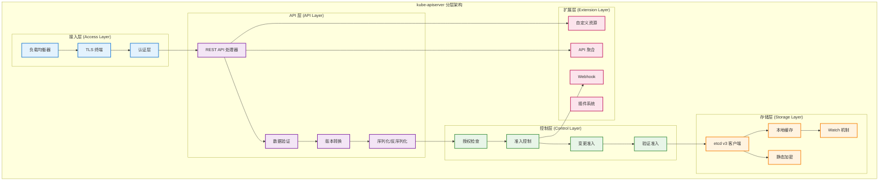
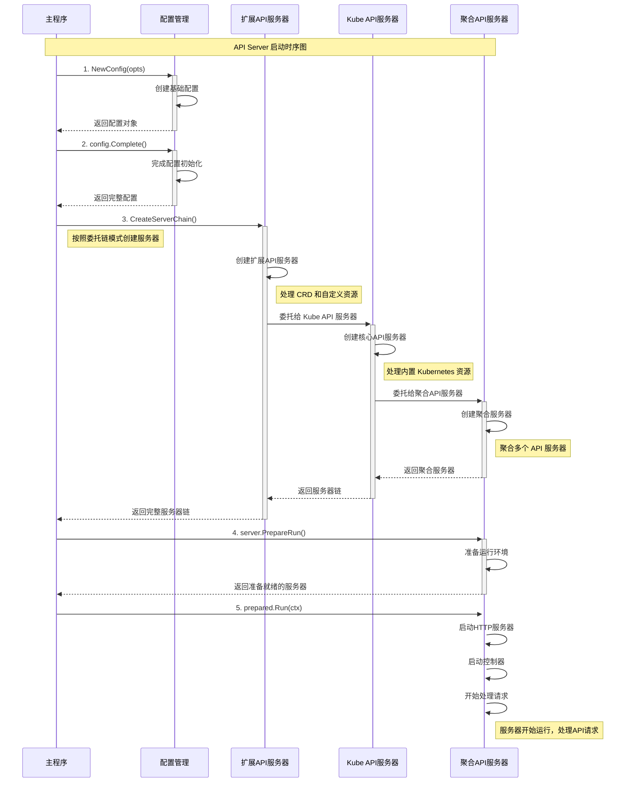
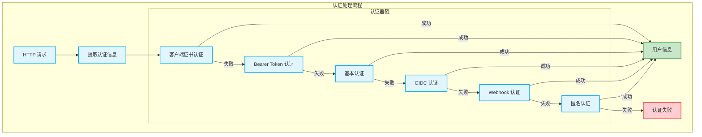
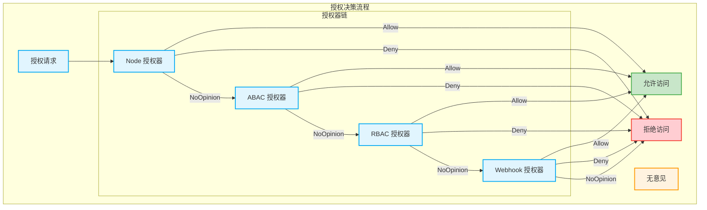
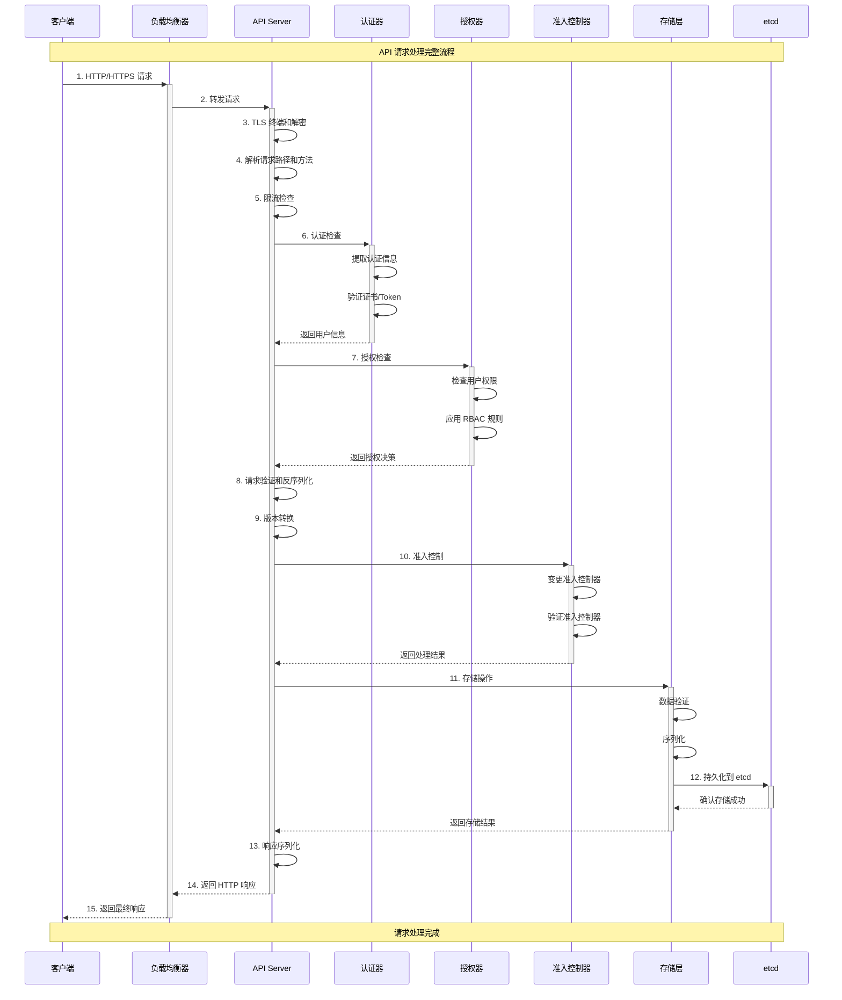
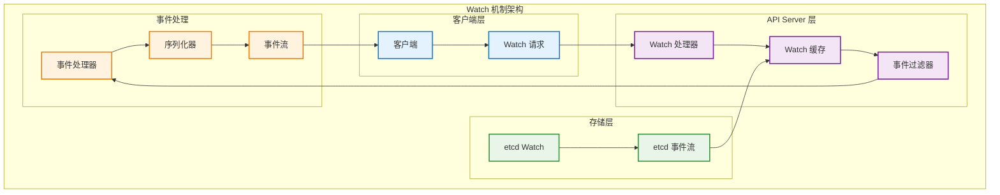

## 📚 文档概述

本文档深入分析 Kubernetes API Server 的架构设计、源码实现和核心机制。API Server 作为 Kubernetes 集群的核心组件，承担着集群管理的关键职责，包括 API 网关、认证授权、数据验证、状态存储等功能。

## 🏗️ API Server 整体架构

### 1.1 分层架构设计



### 1.2 核心组件关系图

```mermaid
graph LR
    subgraph "API Server 核心组件"
        subgraph "服务器链 (Server Chain)"
            AGG[Aggregator Server<br/>API 聚合服务器]
            KUBE[Kube API Server<br/>核心 API 服务器]
            EXT[Extension Server<br/>扩展 API 服务器]
        end
        
        subgraph "处理器链 (Handler Chain)"
            PANIC[Panic Recovery<br/>异常恢复]
            TIMEOUT[Timeout<br/>超时处理]
            MAXINFLIGHT[Max In Flight<br/>并发限制]
            AUTH_H[Authentication<br/>认证处理]
            AUTHZ_H[Authorization<br/>授权处理]
            AUDIT[Audit<br/>审计日志]
            IMPERSON[Impersonation<br/>身份模拟]
        end
        
        subgraph "存储后端 (Storage Backend)"
            ETCD_CLIENT[etcd Client<br/>etcd 客户端]
            STORAGE_FACTORY[Storage Factory<br/>存储工厂]
            CODEC[Codec<br/>编解码器]
        end
        
        subgraph "监控观测 (Observability)"
            METRICS[Metrics<br/>指标收集]
            TRACING[Tracing<br/>链路追踪]
            LOGGING[Logging<br/>日志记录]
            HEALTH[Health Check<br/>健康检查]
        end
    end
    
    %% 服务器链关系
    AGG --> KUBE
    KUBE --> EXT
    
    %% 处理器链关系
    PANIC --> TIMEOUT
    TIMEOUT --> MAXINFLIGHT
    MAXINFLIGHT --> AUTH_H
    AUTH_H --> AUTHZ_H
    AUTHZ_H --> AUDIT
    AUDIT --> IMPERSON
    
    %% 存储关系
    STORAGE_FACTORY --> ETCD_CLIENT
    STORAGE_FACTORY --> CODEC
    
    %% 监控关系
    METRICS --> LOGGING
    TRACING --> LOGGING
    HEALTH --> METRICS
```



## 🚀 启动流程详细分析

### 2.1 启动入口源码分析

```go
// cmd/kube-apiserver/apiserver.go
/*
API Server 主入口文件
负责初始化和启动整个 API Server 服务

主要职责：
1. 创建 Cobra 命令对象
2. 设置命令行参数和配置
3. 启动服务器主循环
*/
package main

import (
    "os"
    _ "time/tzdata" // 为 CronJob 提供时区支持

    "k8s.io/component-base/cli"
    _ "k8s.io/component-base/logs/json/register"          // JSON 日志格式注册
    _ "k8s.io/component-base/metrics/prometheus/clientgo" // Prometheus 客户端指标
    _ "k8s.io/component-base/metrics/prometheus/version"  // 版本指标注册
    "k8s.io/kubernetes/cmd/kube-apiserver/app"
)

/*
main 函数是 API Server 的程序入口点

执行流程：
1. 创建 API Server 命令对象
2. 通过 CLI 框架执行命令
3. 根据执行结果退出程序

返回值：
- 程序退出码（0 表示成功，非 0 表示失败）
*/
func main() {
    // 创建 API Server 命令对象，包含所有配置选项和启动逻辑
    command := app.NewAPIServerCommand()
    
    // 执行命令，启动 API Server 服务
    // cli.Run 会处理信号、日志、指标等通用功能
    code := cli.Run(command)
    
    // 根据执行结果退出程序
    os.Exit(code)
}
```

### 2.2 命令创建和配置

```go
// cmd/kube-apiserver/app/server.go
/*
NewAPIServerCommand 创建 kube-apiserver 的 Cobra 命令对象

功能说明：
1. 初始化服务器运行选项
2. 设置命令行参数和标志
3. 定义命令执行逻辑
4. 配置帮助信息和使用说明

返回值：
- *cobra.Command: 配置完整的命令对象
*/
func NewAPIServerCommand() *cobra.Command {
    // 创建服务器运行选项，包含所有配置参数
    s := options.NewServerRunOptions()
    
    // 设置信号处理上下文，用于优雅关闭
    ctx := genericapiserver.SetupSignalContext()
    
    // 获取特性门控，用于控制功能开关
    featureGate := s.GenericServerRunOptions.ComponentGlobalsRegistry.FeatureGateFor(basecompatibility.DefaultKubeComponent)

    // 创建 Cobra 命令对象
    cmd := &cobra.Command{
        Use: "kube-apiserver",
        Long: `Kubernetes API 服务器验证和配置 API 对象的数据，
这些对象包括 pods、services、replicationcontrollers 等。
API Server 提供 REST 操作服务，并为集群的共享状态提供前端，
所有其他组件都通过它进行交互。`,

        // 当命令出错时停止打印使用说明
        SilenceUsage: true,
        
        // 持久化预运行钩子，在主命令执行前运行
        PersistentPreRunE: func(*cobra.Command, []string) error {
            // 设置组件全局注册表
            if err := s.GenericServerRunOptions.ComponentGlobalsRegistry.Set(); err != nil {
                return err
            }
            // 静默 client-go 警告
            // kube-apiserver 回环客户端不应记录自发出的警告
            rest.SetDefaultWarningHandler(rest.NoWarnings{})
            return nil
        },
        
        // 主命令执行逻辑
        RunE: func(cmd *cobra.Command, args []string) error {
            // 检查并打印版本信息（如果请求）
            verflag.PrintAndExitIfRequested()
            
            // 获取命令标志
            fs := cmd.Flags()
            
            // 尽早激活日志记录，然后显示最终日志配置的标志
            if err := logsapi.ValidateAndApply(s.Logs, featureGate); err != nil {
                return err
            }
            cliflag.PrintFlags(fs)

            // 完成选项设置，填充默认值和派生值
            completedOptions, err := s.Complete(ctx)
            if err != nil {
                return err
            }

            // 验证选项的有效性
            if errs := completedOptions.Validate(); len(errs) != 0 {
                return utilerrors.NewAggregate(errs)
            }
            
            // 添加特性启用指标
            featureGate.(featuregate.MutableFeatureGate).AddMetrics()
            
            // 添加组件版本指标
            s.GenericServerRunOptions.ComponentGlobalsRegistry.AddMetrics()
            
            // 运行 API Server
            return Run(ctx, completedOptions)
        },
        
        // 参数验证函数
        Args: func(cmd *cobra.Command, args []string) error {
            for _, arg := range args {
                if len(arg) > 0 {
                    return fmt.Errorf("%q 不接受任何参数，得到 %q", cmd.CommandPath(), args)
                }
            }
            return nil
        },
    }
    
    // 设置命令上下文
    cmd.SetContext(ctx)

    // 获取命令标志集
    fs := cmd.Flags()
    namedFlagSets := s.Flags()
    s.Flagz = flagz.NamedFlagSetsReader{
        FlagSets: namedFlagSets,
    }
    
    // 添加版本标志
    verflag.AddFlags(namedFlagSets.FlagSet("global"))
    
    // 添加全局标志
    globalflag.AddGlobalFlags(namedFlagSets.FlagSet("global"), cmd.Name(), logs.SkipLoggingConfigurationFlags())
    
    // 将所有命名标志集添加到命令中
    for _, f := range namedFlagSets.FlagSets {
        fs.AddFlagSet(f)
    }

    // 设置使用说明和帮助函数
    cols, _, _ := term.TerminalSize(cmd.OutOrStdout())
    cliflag.SetUsageAndHelpFunc(cmd, namedFlagSets, cols)

    return cmd
}
```

### 2.3 服务器运行主流程

```go
/*
Run 运行指定的 API Server，此函数永远不应该退出

参数：
- ctx: 上下文对象，用于控制生命周期
- opts: 完成的配置选项

返回值：
- error: 运行过程中的错误

执行流程：
1. 创建服务器配置
2. 完成配置初始化
3. 创建服务器链
4. 准备运行环境
5. 启动服务器主循环
*/
func Run(ctx context.Context, opts options.CompletedOptions) error {
    // 记录版本信息，帮助调试
    klog.Infof("版本: %+v", utilversion.Get())

    // 记录 Go 运行时设置
    klog.InfoS("Golang 设置", "GOGC", os.Getenv("GOGC"), "GOMAXPROCS", os.Getenv("GOMAXPROCS"), "GOTRACEBACK", os.Getenv("GOTRACEBACK"))

    // 1. 创建服务器配置
    config, err := NewConfig(opts)
    if err != nil {
        return err
    }
    
    // 2. 完成配置初始化
    completed, err := config.Complete()
    if err != nil {
        return err
    }
    
    // 3. 创建服务器链（聚合器 -> Kube API -> 扩展 API）
    server, err := CreateServerChain(completed)
    if err != nil {
        return err
    }

    // 4. 准备运行环境
    prepared, err := server.PrepareRun()
    if err != nil {
        return err
    }

    // 5. 启动服务器主循环
    return prepared.Run(ctx)
}
```

### 2.4 服务器链创建详解



```go
/*
CreateServerChain 创建通过委托连接的 API 服务器链

服务器链结构：
聚合器服务器 -> Kube API 服务器 -> 扩展 API 服务器 -> 404 处理器

参数：
- config: 完整的服务器配置

返回值：
- *aggregatorapiserver.APIAggregator: 聚合器服务器（链的顶层）
- error: 创建过程中的错误

委托链工作原理：
1. 聚合器服务器首先处理请求
2. 如果无法处理，委托给 Kube API 服务器
3. 如果仍无法处理，委托给扩展 API 服务器
4. 最后由 404 处理器处理未知请求
*/
func CreateServerChain(config CompletedConfig) (*aggregatorapiserver.APIAggregator, error) {
    // 创建 404 处理器，处理未找到的资源
    notFoundHandler := notfoundhandler.New(
        config.KubeAPIs.ControlPlane.Generic.Serializer, 
        genericapifilters.NoMuxAndDiscoveryIncompleteKey,
    )
    
    // 1. 创建扩展 API 服务器（处理 CRD）
    apiExtensionsServer, err := config.ApiExtensions.New(
        genericapiserver.NewEmptyDelegateWithCustomHandler(notFoundHandler),
    )
    if err != nil {
        return nil, err
    }
    
    // 检查 CRD API 是否启用
    crdAPIEnabled := config.ApiExtensions.GenericConfig.MergedResourceConfig.ResourceEnabled(
        apiextensionsv1.SchemeGroupVersion.WithResource("customresourcedefinitions"),
    )

    // 2. 创建 Kube API 服务器（处理内置资源）
    kubeAPIServer, err := config.KubeAPIs.New(apiExtensionsServer.GenericAPIServer)
    if err != nil {
        return nil, err
    }

    // 3. 创建聚合器服务器（位于链的顶层）
    aggregatorServer, err := controlplaneapiserver.CreateAggregatorServer(
        config.Aggregator, 
        kubeAPIServer.ControlPlane.GenericAPIServer, 
        apiExtensionsServer.Informers.Apiextensions().V1().CustomResourceDefinitions(), 
        crdAPIEnabled, 
        apiVersionPriorities,
    )
    if err != nil {
        return nil, err
    }

    return aggregatorServer, nil
}
```

## 🔐 认证授权机制

### 3.1 认证流程架构



### 3.2 授权决策流程



### 3.3 认证器源码实现

```go
// pkg/kubeapiserver/authenticator/config.go
/*
认证器配置和创建

主要功能：
1. 配置各种认证方式
2. 创建认证器链
3. 处理认证请求
*/

/*
AuthenticatorConfig 认证器配置结构

字段说明：
- Anonymous: 是否允许匿名访问
- ClientCAContentProvider: 客户端 CA 证书提供者
- TokenAuthFile: Token 认证文件路径
- OIDCIssuerURL: OIDC 发行者 URL
- WebhookTokenAuthnConfigFile: Webhook 认证配置文件
*/
type AuthenticatorConfig struct {
    Anonymous                   bool
    ClientCAContentProvider     dynamiccertificates.CAContentProvider
    TokenAuthFile               string
    OIDCIssuerURL              string
    OIDCClientID               string
    OIDCCAFile                 string
    OIDCUsernameClaim          string
    OIDCGroupsClaim            string
    WebhookTokenAuthnConfigFile string
    WebhookTokenAuthnCacheTTL   time.Duration
    
    // 请求头认证配置
    RequestHeaderConfig *authenticatorfactory.RequestHeaderConfig
    
    // 服务账户配置
    ServiceAccountKeyFiles    []string
    ServiceAccountLookup      bool
    ServiceAccountIssuer      string
    ServiceAccountJWKSURI     string
    ServiceAccountMaxExpiration time.Duration
}

/*
New 创建认证器

返回值：
- authenticator.Request: 请求认证器
- *spec.SecurityDefinitions: 安全定义（用于 OpenAPI）
- error: 创建过程中的错误

工作流程：
1. 创建各种认证器实例
2. 将认证器组合成链
3. 返回组合后的认证器
*/
func (config AuthenticatorConfig) New() (authenticator.Request, *spec.SecurityDefinitions, error) {
    var authenticators []authenticator.Request
    var tokenAuthenticators []authenticator.Token
    securityDefinitions := &spec.SecurityDefinitions{}

    // 1. 客户端证书认证器
    if config.ClientCAContentProvider != nil {
        certAuth, err := newCertificateAuthenticator(config.ClientCAContentProvider)
        if err != nil {
            return nil, nil, err
        }
        authenticators = append(authenticators, certAuth)
        
        // 添加到 OpenAPI 安全定义
        securityDefinitions.SecuritySchemes = map[string]*spec.SecurityScheme{
            "HTTPSCertAuth": {
                SecuritySchemeProps: spec.SecuritySchemeProps{
                    Type:        "apiKey",
                    Name:        "authorization",
                    In:          "header",
                    Description: "客户端证书认证",
                },
            },
        }
    }

    // 2. Bearer Token 认证器
    if len(config.TokenAuthFile) > 0 {
        tokenAuth, err := newTokenFileAuthenticator(config.TokenAuthFile)
        if err != nil {
            return nil, nil, err
        }
        tokenAuthenticators = append(tokenAuthenticators, tokenAuth)
    }

    // 3. 服务账户 Token 认证器
    if len(config.ServiceAccountKeyFiles) > 0 {
        serviceAccountAuth, err := newServiceAccountAuthenticator(
            config.ServiceAccountKeyFiles,
            config.ServiceAccountLookup,
            config.ServiceAccountIssuer,
            config.ServiceAccountJWKSURI,
            config.ServiceAccountMaxExpiration,
        )
        if err != nil {
            return nil, nil, err
        }
        tokenAuthenticators = append(tokenAuthenticators, serviceAccountAuth)
    }

    // 4. OIDC 认证器
    if len(config.OIDCIssuerURL) > 0 {
        oidcAuth, err := newOIDCAuthenticator(
            config.OIDCIssuerURL,
            config.OIDCClientID,
            config.OIDCCAFile,
            config.OIDCUsernameClaim,
            config.OIDCGroupsClaim,
        )
        if err != nil {
            return nil, nil, err
        }
        tokenAuthenticators = append(tokenAuthenticators, oidcAuth)
    }

    // 5. Webhook Token 认证器
    if len(config.WebhookTokenAuthnConfigFile) > 0 {
        webhookAuth, err := newWebhookTokenAuthenticator(
            config.WebhookTokenAuthnConfigFile,
            config.WebhookTokenAuthnCacheTTL,
        )
        if err != nil {
            return nil, nil, err
        }
        tokenAuthenticators = append(tokenAuthenticators, webhookAuth)
    }

    // 组合 Token 认证器
    if len(tokenAuthenticators) > 0 {
        // 创建 Token 认证器联合体
        tokenAuth := tokenunion.New(tokenAuthenticators...)
        
        // 将 Token 认证器转换为请求认证器
        authenticators = append(authenticators, bearertoken.New(tokenAuth))
        
        // 添加到 OpenAPI 安全定义
        securityDefinitions.SecuritySchemes["BearerToken"] = &spec.SecurityScheme{
            SecuritySchemeProps: spec.SecuritySchemeProps{
                Type:        "apiKey",
                Name:        "authorization",
                In:          "header",
                Description: "Bearer Token 认证",
            },
        }
    }

    // 6. 请求头认证器
    if config.RequestHeaderConfig != nil {
        requestHeaderAuth, err := headerrequest.NewDynamicVerifyOptionsSecure(
            config.RequestHeaderConfig.CAContentProvider,
            config.RequestHeaderConfig.AllowedClientNames,
            config.RequestHeaderConfig.UsernameHeaders,
            config.RequestHeaderConfig.GroupHeaders,
            config.RequestHeaderConfig.ExtraHeaderPrefixes,
        )
        if err != nil {
            return nil, nil, err
        }
        authenticators = append(authenticators, requestHeaderAuth)
    }

    // 7. 匿名认证器（如果启用）
    if config.Anonymous {
        authenticators = append(authenticators, anonymous.NewAuthenticator())
    }

    // 创建认证器联合体
    switch len(authenticators) {
    case 0:
        return nil, nil, fmt.Errorf("没有配置认证器")
    case 1:
        return authenticators[0], securityDefinitions, nil
    default:
        return union.New(authenticators...), securityDefinitions, nil
    }
}
```

### 3.4 RBAC 授权器实现

```go
// pkg/kubeapiserver/authorizer/modes/modes.go
/*
RBAC 授权器实现

主要功能：
1. 基于角色的访问控制
2. 权限检查和决策
3. 角色绑定验证
*/

/*
RBACAuthorizer RBAC 授权器结构

字段说明：
- roleGetter: 角色获取器
- roleBindingGetter: 角色绑定获取器
- clusterRoleGetter: 集群角色获取器
- clusterRoleBindingGetter: 集群角色绑定获取器
*/
type RBACAuthorizer struct {
    roleGetter               rbaclisters.RoleLister
    roleBindingGetter        rbaclisters.RoleBindingLister
    clusterRoleGetter        rbaclisters.ClusterRoleLister
    clusterRoleBindingGetter rbaclisters.ClusterRoleBindingLister
}

/*
Authorize 执行授权检查

参数：
- ctx: 上下文对象
- a: 授权属性（包含用户、资源、动作等信息）

返回值：
- authorizer.Decision: 授权决策（Allow/Deny/NoOpinion）
- string: 决策原因
- error: 检查过程中的错误

授权流程：
1. 检查集群级别的权限
2. 检查命名空间级别的权限
3. 返回授权决策
*/
func (r *RBACAuthorizer) Authorize(ctx context.Context, requestAttributes authorizer.Attributes) (authorizer.Decision, string, error) {
    ruleCheckingVisitor := &authorizingVisitor{requestAttributes: requestAttributes}

    // 1. 检查集群角色绑定
    r.visitRulesFor(requestAttributes, "", ruleCheckingVisitor, "")
    if ruleCheckingVisitor.allowed {
        return authorizer.DecisionAllow, ruleCheckingVisitor.reason, nil
    }

    // 2. 检查命名空间角色绑定
    if len(requestAttributes.GetNamespace()) > 0 {
        r.visitRulesFor(requestAttributes, requestAttributes.GetNamespace(), ruleCheckingVisitor, "")
        if ruleCheckingVisitor.allowed {
            return authorizer.DecisionAllow, ruleCheckingVisitor.reason, nil
        }
    }

    // 3. 如果没有匹配的规则，返回无意见
    return authorizer.DecisionNoOpinion, ruleCheckingVisitor.reason, nil
}

/*
visitRulesFor 访问用户的所有规则

参数：
- requestAttributes: 请求属性
- namespace: 命名空间
- visitor: 规则访问器
- reason: 访问原因

工作流程：
1. 获取用户的所有角色绑定
2. 遍历每个角色绑定
3. 检查角色中的规则
4. 调用访问器处理规则
*/
func (r *RBACAuthorizer) visitRulesFor(requestAttributes authorizer.Attributes, namespace string, visitor ruleAccumulator, reason string) {
    if len(namespace) == 0 {
        // 集群级别的角色绑定
        clusterRoleBindings, err := r.clusterRoleBindingGetter.List(labels.Everything())
        if err != nil {
            return
        }

        for _, clusterRoleBinding := range clusterRoleBindings {
            // 检查用户是否在角色绑定的主体中
            if !appliesTo(requestAttributes.GetUser(), clusterRoleBinding.Subjects, "") {
                continue
            }

            // 获取集群角色
            clusterRole, err := r.clusterRoleGetter.Get(clusterRoleBinding.RoleRef.Name)
            if err != nil {
                continue
            }

            // 访问角色中的规则
            for _, rule := range clusterRole.Rules {
                if visitor.visit(rule, clusterRole, clusterRoleBinding, namespace) {
                    return
                }
            }
        }
    } else {
        // 命名空间级别的角色绑定
        roleBindings, err := r.roleBindingGetter.RoleBindings(namespace).List(labels.Everything())
        if err != nil {
            return
        }

        for _, roleBinding := range roleBindings {
            // 检查用户是否在角色绑定的主体中
            if !appliesTo(requestAttributes.GetUser(), roleBinding.Subjects, namespace) {
                continue
            }

            // 根据角色引用类型获取角色
            var rules []rbacv1.PolicyRule
            if roleBinding.RoleRef.Kind == "Role" {
                role, err := r.roleGetter.Roles(namespace).Get(roleBinding.RoleRef.Name)
                if err != nil {
                    continue
                }
                rules = role.Rules
            } else if roleBinding.RoleRef.Kind == "ClusterRole" {
                clusterRole, err := r.clusterRoleGetter.Get(roleBinding.RoleRef.Name)
                if err != nil {
                    continue
                }
                rules = clusterRole.Rules
            }

            // 访问角色中的规则
            for _, rule := range rules {
                if visitor.visit(rule, nil, roleBinding, namespace) {
                    return
                }
            }
        }
    }
}

/*
authorizingVisitor 授权访问器
实现规则检查逻辑
*/
type authorizingVisitor struct {
    requestAttributes authorizer.Attributes
    allowed          bool
    reason           string
}

/*
visit 访问单个规则并检查是否匹配

参数：
- rule: 策略规则
- role: 角色对象
- binding: 角色绑定对象
- namespace: 命名空间

返回值：
- bool: 是否应该停止访问（找到匹配规则）

检查逻辑：
1. 检查 API 组是否匹配
2. 检查资源是否匹配
3. 检查动词是否匹配
4. 检查资源名称是否匹配
*/
func (v *authorizingVisitor) visit(rule rbacv1.PolicyRule, role interface{}, binding interface{}, namespace string) bool {
    // 检查 API 组
    if !ruleMatchesAPIGroups(rule, v.requestAttributes.GetAPIGroup()) {
        return false
    }

    // 检查资源
    if !ruleMatchesResources(rule, v.requestAttributes.GetResource(), v.requestAttributes.GetSubresource()) {
        return false
    }

    // 检查动词
    if !ruleMatchesVerbs(rule, v.requestAttributes.GetVerb()) {
        return false
    }

    // 检查资源名称
    if !ruleMatchesResourceNames(rule, v.requestAttributes.GetName()) {
        return false
    }

    // 所有检查都通过，允许访问
    v.allowed = true
    v.reason = fmt.Sprintf("RBAC: 允许用户 %q 在命名空间 %q 中对资源 %q 执行 %q 操作", 
        v.requestAttributes.GetUser().GetName(),
        namespace,
        v.requestAttributes.GetResource(),
        v.requestAttributes.GetVerb())
    
    return true
}
```

## 📊 API 处理流程

### 4.1 请求处理管道



### 4.2 REST API 处理器实现

```go
// staging/src/k8s.io/apiserver/pkg/endpoints/handlers/rest.go
/*
REST API 处理器实现

主要功能：
1. 处理 RESTful API 请求
2. 实现 CRUD 操作
3. 版本转换和数据验证
*/

/*
restfulCreateResource 处理资源创建请求

参数：
- r: REST 存储接口
- scope: 请求范围信息
- admit: 准入控制接口

返回值：
- http.HandlerFunc: HTTP 处理函数

处理流程：
1. 解析请求体
2. 数据验证和转换
3. 准入控制
4. 存储到后端
5. 返回响应
*/
func restfulCreateResource(r rest.Creater, scope *RequestScope, admit admission.Interface) http.HandlerFunc {
    return func(w http.ResponseWriter, req *http.Request) {
        // 1. 获取请求上下文和超时设置
        ctx := req.Context()
        if scope.Serializer.EncodesAsText {
            if err := negotiation.NegotiateInputSerializer(req, false, scope.Serializer); err != nil {
                scope.err(err, w, req)
                return
            }
        }

        // 2. 解析请求体
        body, err := limitedReadBody(req, scope.MaxRequestBodyBytes)
        if err != nil {
            scope.err(err, w, req)
            return
        }

        // 3. 反序列化请求对象
        defaultGVK := scope.Kind
        original := r.New()
        
        decoder := scope.Serializer.DecoderToVersion(
            scope.Serializer.UniversalDeserializer(), 
            scope.HubGroupVersion,
        )
        
        obj, gvk, err := decoder.Decode(body, &defaultGVK, original)
        if err != nil {
            err = transformDecodeError(scope.Typer, err, original, gvk, body)
            scope.err(err, w, req)
            return
        }

        // 4. 审计日志记录
        audit.LogRequestObject(req.Context(), obj, scope.Resource, scope.Subresource, scope.Serializer)

        // 5. 数据验证
        if err := checkName(obj, scope.Name, scope.Namespace, scope.Namer); err != nil {
            scope.err(err, w, req)
            return
        }

        // 6. 准入控制
        if admit != nil {
            admissionAttributes := admission.NewAttributesRecord(
                obj,
                nil,
                scope.Kind,
                scope.Namespace,
                scope.Name,
                scope.Resource,
                scope.Subresource,
                admission.Create,
                &metav1.CreateOptions{},
                false,
                userInfo,
            )

            if err := admit.Admit(ctx, admissionAttributes, scope); err != nil {
                scope.err(err, w, req)
                return
            }
        }

        // 7. 创建资源
        result, err := finishRequest(ctx, func() (runtime.Object, error) {
            return r.Create(
                ctx,
                scope.Name,
                obj,
                rest.AdmissionToValidateObjectFunc(admit, admissionAttributes, scope),
                options,
            )
        })
        if err != nil {
            scope.err(err, w, req)
            return
        }

        // 8. 返回响应
        code := http.StatusCreated
        status, ok := result.(*metav1.Status)
        if ok && status.Code == 0 {
            status.Code = int32(code)
        }

        transformResponseObject(ctx, scope, req, w, code, outputMediaType, result)
    }
}

/*
restfulUpdateResource 处理资源更新请求

处理流程类似创建，但包含额外的版本检查和冲突处理
*/
func restfulUpdateResource(r rest.Updater, scope *RequestScope, admit admission.Interface) http.HandlerFunc {
    return func(w http.ResponseWriter, req *http.Request) {
        ctx := req.Context()
        
        // 1. 解析请求体（与创建类似）
        body, err := limitedReadBody(req, scope.MaxRequestBodyBytes)
        if err != nil {
            scope.err(err, w, req)
            return
        }

        // 2. 反序列化对象
        obj, gvk, err := decoder.Decode(body, &defaultGVK, original)
        if err != nil {
            scope.err(err, w, req)
            return
        }

        // 3. 获取现有对象进行比较
        oldObj, err := r.Get(ctx, scope.Name, &metav1.GetOptions{})
        if err != nil {
            scope.err(err, w, req)
            return
        }

        // 4. 版本检查（乐观锁）
        if err := checkResourceVersion(obj, oldObj); err != nil {
            scope.err(err, w, req)
            return
        }

        // 5. 准入控制（包含新旧对象比较）
        if admit != nil {
            admissionAttributes := admission.NewAttributesRecord(
                obj,
                oldObj,
                scope.Kind,
                scope.Namespace,
                scope.Name,
                scope.Resource,
                scope.Subresource,
                admission.Update,
                options,
                false,
                userInfo,
            )

            if err := admit.Admit(ctx, admissionAttributes, scope); err != nil {
                scope.err(err, w, req)
                return
            }
        }

        // 6. 执行更新
        result, err := finishRequest(ctx, func() (runtime.Object, error) {
            return r.Update(
                ctx,
                scope.Name,
                rest.DefaultUpdatedObjectInfo(obj),
                rest.AdmissionToValidateObjectFunc(admit, admissionAttributes, scope),
                rest.AdmissionToValidateObjectUpdateFunc(admit, admissionAttributes, scope),
                false,
                options,
            )
        })

        if err != nil {
            scope.err(err, w, req)
            return
        }

        // 7. 返回更新结果
        transformResponseObject(ctx, scope, req, w, http.StatusOK, outputMediaType, result)
    }
}

/*
restfulDeleteResource 处理资源删除请求
*/
func restfulDeleteResource(r rest.GracefulDeleter, allowsOptions bool, scope *RequestScope, admit admission.Interface) http.HandlerFunc {
    return func(w http.ResponseWriter, req *http.Request) {
        ctx := req.Context()

        // 1. 解析删除选项
        options := &metav1.DeleteOptions{}
        if allowsOptions {
            if err := metainternalversionscheme.ParameterCodec.DecodeParameters(req.URL.Query(), scope.MetaGroupVersion, options); err != nil {
                scope.err(err, w, req)
                return
            }
        }

        // 2. 获取要删除的对象
        obj, err := r.Get(ctx, scope.Name, &metav1.GetOptions{})
        if err != nil {
            scope.err(err, w, req)
            return
        }

        // 3. 准入控制
        if admit != nil {
            admissionAttributes := admission.NewAttributesRecord(
                nil,
                obj,
                scope.Kind,
                scope.Namespace,
                scope.Name,
                scope.Resource,
                scope.Subresource,
                admission.Delete,
                options,
                false,
                userInfo,
            )

            if err := admit.Admit(ctx, admissionAttributes, scope); err != nil {
                scope.err(err, w, req)
                return
            }
        }

        // 4. 执行删除
        result, err := finishRequest(ctx, func() (runtime.Object, error) {
            return r.Delete(
                ctx,
                scope.Name,
                rest.AdmissionToValidateObjectFunc(admit, admissionAttributes, scope),
                options,
            )
        })

        if err != nil {
            scope.err(err, w, req)
            return
        }

        // 5. 返回删除结果
        transformResponseObject(ctx, scope, req, w, http.StatusOK, outputMediaType, result)
    }
}
```

## 🔄 Watch 机制实现

### 4.3 Watch 机制架构



### 4.4 Watch 处理器源码

```go
// staging/src/k8s.io/apiserver/pkg/endpoints/handlers/watch.go
/*
Watch 处理器实现

主要功能：
1. 处理 Watch 请求
2. 管理事件流
3. 过滤和转换事件
*/

/*
ListAndWatch 处理 List 和 Watch 请求

参数：
- r: REST 存储接口
- scope: 请求范围
- serializer: 序列化器
- predicate: 过滤谓词

返回值：
- http.HandlerFunc: HTTP 处理函数

工作流程：
1. 解析请求参数
2. 执行 List 操作（如果需要）
3. 启动 Watch 流
4. 处理和转发事件
*/
func ListAndWatch(r rest.Lister, watcher rest.Watcher, scope *RequestScope, serializer runtime.NegotiatedSerializer, predicate storage.SelectionPredicate) http.HandlerFunc {
    return func(w http.ResponseWriter, req *http.Request) {
        ctx := req.Context()
        
        // 1. 解析查询参数
        opts := metainternalversion.ListOptions{}
        if err := metainternalversionscheme.ParameterCodec.DecodeParameters(req.URL.Query(), scope.MetaGroupVersion, &opts); err != nil {
            scope.err(err, w, req)
            return
        }

        // 2. 检查是否为 Watch 请求
        if opts.Watch {
            // 处理 Watch 请求
            handleWatch(ctx, w, req, watcher, scope, serializer, predicate, opts)
        } else {
            // 处理 List 请求
            handleList(ctx, w, req, r, scope, serializer, predicate, opts)
        }
    }
}

/*
handleWatch 处理 Watch 请求的核心逻辑

参数：
- ctx: 请求上下文
- w: HTTP 响应写入器
- req: HTTP 请求
- watcher: Watch 接口
- scope: 请求范围
- serializer: 序列化器
- predicate: 过滤谓词
- opts: 列表选项

工作流程：
1. 创建 Watch 流
2. 设置响应头
3. 启动事件处理循环
4. 处理客户端断开连接
*/
func handleWatch(ctx context.Context, w http.ResponseWriter, req *http.Request, watcher rest.Watcher, scope *RequestScope, serializer runtime.NegotiatedSerializer, predicate storage.SelectionPredicate, opts metainternalversion.ListOptions) {
    // 1. 创建 Watch 接口
    watcher, err := watcher.Watch(ctx, &opts)
    if err != nil {
        scope.err(err, w, req)
        return
    }
    defer watcher.Stop()

    // 2. 设置 HTTP 响应头
    w.Header().Set("Content-Type", "application/json")
    w.Header().Set("Cache-Control", "no-cache, private")
    w.Header().Set("Connection", "keep-alive")
    
    // 支持 Server-Sent Events
    if req.Header.Get("Accept") == "text/event-stream" {
        w.Header().Set("Content-Type", "text/event-stream")
    }

    // 3. 创建事件编码器
    encoder := streaming.NewEncoder(w, serializer.StreamingSerializer)

    // 4. 启动事件处理循环
    for {
        select {
        case event, ok := <-watcher.ResultChan():
            if !ok {
                // Watch 流已关闭
                return
            }

            // 5. 过滤事件
            if !predicate.Matches(event.Object) {
                continue
            }

            // 6. 转换事件对象
            converted, err := scope.Convertor.ConvertToVersion(event.Object, scope.HubGroupVersion)
            if err != nil {
                klog.Errorf("转换对象失败: %v", err)
                continue
            }

            // 7. 创建 Watch 事件
            watchEvent := &metav1.WatchEvent{
                Type:   string(event.Type),
                Object: runtime.RawExtension{Object: converted},
            }

            // 8. 序列化并发送事件
            if err := encoder.Encode(watchEvent); err != nil {
                klog.Errorf("编码事件失败: %v", err)
                return
            }

            // 9. 刷新响应缓冲区
            if flusher, ok := w.(http.Flusher); ok {
                flusher.Flush()
            }

        case <-ctx.Done():
            // 客户端断开连接或请求取消
            return
        }
    }
}

/*
WatchServer Watch 服务器实现
管理多个 Watch 连接和事件分发
*/
type WatchServer struct {
    // 事件通道
    eventChan chan watch.Event
    
    // 客户端连接管理
    clients map[string]*WatchClient
    clientsMux sync.RWMutex
    
    // 过滤器
    filters []WatchFilter
    
    // 停止信号
    stopCh chan struct{}
}

/*
WatchClient 表示单个 Watch 客户端连接
*/
type WatchClient struct {
    // 客户端 ID
    id string
    
    // 事件通道
    eventChan chan watch.Event
    
    // 过滤谓词
    predicate storage.SelectionPredicate
    
    // 资源版本
    resourceVersion string
    
    // 上下文
    ctx context.Context
    cancel context.CancelFunc
}

/*
AddClient 添加新的 Watch 客户端

参数：
- predicate: 过滤谓词
- resourceVersion: 起始资源版本

返回值：
- *WatchClient: 客户端对象
- error: 添加过程中的错误
*/
func (ws *WatchServer) AddClient(predicate storage.SelectionPredicate, resourceVersion string) (*WatchClient, error) {
    ws.clientsMux.Lock()
    defer ws.clientsMux.Unlock()

    // 生成客户端 ID
    clientID := generateClientID()
    
    // 创建客户端上下文
    ctx, cancel := context.WithCancel(context.Background())

    // 创建客户端对象
    client := &WatchClient{
        id:              clientID,
        eventChan:       make(chan watch.Event, 100), // 缓冲通道
        predicate:       predicate,
        resourceVersion: resourceVersion,
        ctx:             ctx,
        cancel:          cancel,
    }

    // 添加到客户端映射
    ws.clients[clientID] = client

    // 启动客户端处理协程
    go ws.handleClient(client)

    return client, nil
}

/*
handleClient 处理单个客户端的事件分发

参数：
- client: 客户端对象

工作流程：
1. 监听全局事件通道
2. 过滤适用于该客户端的事件
3. 发送事件到客户端通道
4. 处理客户端断开连接
*/
func (ws *WatchServer) handleClient(client *WatchClient) {
    defer func() {
        // 清理客户端
        ws.clientsMux.Lock()
        delete(ws.clients, client.id)
        ws.clientsMux.Unlock()
        
        close(client.eventChan)
        client.cancel()
    }()

    for {
        select {
        case event := <-ws.eventChan:
            // 检查事件是否适用于该客户端
            if !client.predicate.Matches(event.Object) {
                continue
            }

            // 检查资源版本
            if !isEventAfterResourceVersion(event, client.resourceVersion) {
                continue
            }

            // 尝试发送事件到客户端
            select {
            case client.eventChan <- event:
                // 事件发送成功
            case <-client.ctx.Done():
                // 客户端已断开连接
                return
            default:
                // 客户端通道已满，丢弃事件
                klog.Warningf("客户端 %s 事件通道已满，丢弃事件", client.id)
            }

        case <-client.ctx.Done():
            // 客户端断开连接
            return
            
        case <-ws.stopCh:
            // 服务器关闭
            return
        }
    }
}

/*
BroadcastEvent 广播事件到所有客户端

参数：
- event: 要广播的事件

工作流程：
1. 应用全局过滤器
2. 发送到事件通道
3. 由客户端处理器分发给各个客户端
*/
func (ws *WatchServer) BroadcastEvent(event watch.Event) {
    // 应用过滤器
    for _, filter := range ws.filters {
        if !filter.Filter(event) {
            return
        }
    }

    // 非阻塞发送事件
    select {
    case ws.eventChan <- event:
        // 事件发送成功
    default:
        // 事件通道已满，记录警告
        klog.Warning("Watch 服务器事件通道已满，丢弃事件")
    }
}
```

## 📈 性能优化和监控

### 5.1 性能优化配置

```yaml
# API Server 高性能配置示例
apiVersion: v1
kind: Pod
metadata:
  name: kube-apiserver
  namespace: kube-system
spec:
  containers:
  - name: kube-apiserver
    image: k8s.gcr.io/kube-apiserver:v1.29.0
    command:
    - kube-apiserver
    
    # 基础配置
    - --advertise-address=10.0.0.1
    - --bind-address=0.0.0.0
    - --secure-port=6443
    - --insecure-port=0
    
    # etcd 连接优化
    - --etcd-servers=https://etcd1:2379,https://etcd2:2379,https://etcd3:2379
    - --etcd-servers-overrides=/events#https://etcd-events:2379  # 事件存储分离
    - --etcd-compaction-interval=300s                           # 压缩间隔
    - --etcd-count-metric-poll-period=60s                       # 指标轮询间隔
    
    # 并发和限流配置
    - --max-requests-inflight=400                               # 最大并发请求数
    - --max-mutating-requests-inflight=200                      # 最大变更请求数
    - --min-request-timeout=1800                                # 最小请求超时
    - --request-timeout=60s                                     # 默认请求超时
    
    # 缓存优化
    - --default-watch-cache-size=100                            # 默认 Watch 缓存大小
    - --watch-cache-sizes=pods#1000,nodes#100,services#500     # 分类缓存大小
    - --default-not-ready-toleration-seconds=300               # 节点未就绪容忍时间
    - --default-unreachable-toleration-seconds=300             # 节点不可达容忍时间
    
    # 认证和授权优化
    - --enable-bootstrap-token-auth=true                        # 启用引导令牌
    - --authorization-mode=Node,RBAC                            # 授权模式
    - --enable-admission-plugins=NamespaceLifecycle,LimitRanger,ServiceAccount,DefaultStorageClass,DefaultTolerationSeconds,MutatingAdmissionWebhook,ValidatingAdmissionWebhook,ResourceQuota
    - --disable-admission-plugins=StorageObjectInUseProtection  # 禁用特定插件
    
    # 审计配置
    - --audit-log-maxage=30                                     # 审计日志保留天数
    - --audit-log-maxbackup=3                                   # 审计日志备份数量
    - --audit-log-maxsize=100                                   # 审计日志最大大小(MB)
    - --audit-log-path=/var/log/audit.log                       # 审计日志路径
    - --audit-policy-file=/etc/kubernetes/audit-policy.yaml    # 审计策略文件
    
    # 特性门控
    - --feature-gates=RemoveSelfLink=false                      # 保持向后兼容
    
    # 日志配置
    - --v=2                                                     # 日志级别
    - --logtostderr=true                                        # 输出到标准错误
    
    # 资源配置
    resources:
      requests:
        cpu: 250m
        memory: 512Mi
      limits:
        cpu: 2000m
        memory: 4Gi
    
    # 存储卷挂载
    volumeMounts:
    - name: ca-certs
      mountPath: /etc/ssl/certs
      readOnly: true
    - name: etc-ca-certificates
      mountPath: /etc/ca-certificates
      readOnly: true
    - name: k8s-certs
      mountPath: /etc/kubernetes/pki
      readOnly: true
    - name: usr-local-share-ca-certificates
      mountPath: /usr/local/share/ca-certificates
      readOnly: true
    - name: usr-share-ca-certificates
      mountPath: /usr/share/ca-certificates
      readOnly: true
    - name: audit-policy
      mountPath: /etc/kubernetes/audit-policy.yaml
      readOnly: true
    - name: audit-logs
      mountPath: /var/log
      
  # 主机网络模式
  hostNetwork: true
  
  # 优先级类
  priorityClassName: system-node-critical
  
  # 存储卷定义
  volumes:
  - name: ca-certs
    hostPath:
      path: /etc/ssl/certs
      type: DirectoryOrCreate
  - name: etc-ca-certificates
    hostPath:
      path: /etc/ca-certificates
      type: DirectoryOrCreate
  - name: k8s-certs
    hostPath:
      path: /etc/kubernetes/pki
      type: DirectoryOrCreate
  - name: usr-local-share-ca-certificates
    hostPath:
      path: /usr/local/share/ca-certificates
      type: DirectoryOrCreate
  - name: usr-share-ca-certificates
    hostPath:
      path: /usr/share/ca-certificates
      type: DirectoryOrCreate
  - name: audit-policy
    configMap:
      name: audit-policy
  - name: audit-logs
    hostPath:
      path: /var/log/kubernetes
      type: DirectoryOrCreate
```

### 5.2 监控指标配置

```yaml
# API Server 监控配置
apiVersion: v1
kind: ServiceMonitor
metadata:
  name: kube-apiserver
  namespace: kube-system
spec:
  selector:
    matchLabels:
      component: kube-apiserver
  endpoints:
  - port: https
    scheme: https
    tlsConfig:
      caFile: /var/run/secrets/kubernetes.io/serviceaccount/ca.crt
      serverName: kubernetes
      insecureSkipVerify: false
    bearerTokenFile: /var/run/secrets/kubernetes.io/serviceaccount/token
    interval: 30s
    path: /metrics
    
---
# 关键指标告警规则
apiVersion: monitoring.coreos.com/v1
kind: PrometheusRule
metadata:
  name: kube-apiserver-alerts
  namespace: kube-system
spec:
  groups:
  - name: kube-apiserver.rules
    rules:
    # API Server 可用性告警
    - alert: KubeAPIServerDown
      expr: up{job="kube-apiserver"} == 0
      for: 5m
      labels:
        severity: critical
      annotations:
        summary: "Kubernetes API Server 不可用"
        description: "API Server {{ $labels.instance }} 已经宕机超过 5 分钟"
    
    # 请求延迟告警
    - alert: KubeAPIServerHighLatency
      expr: |
        histogram_quantile(0.99, sum(rate(apiserver_request_duration_seconds_bucket{job="kube-apiserver",verb!="WATCH"}[5m])) by (le, verb)) > 1
      for: 10m
      labels:
        severity: warning
      annotations:
        summary: "API Server 请求延迟过高"
        description: "API Server {{ $labels.verb }} 请求的 99% 分位延迟为 {{ $value }} 秒"
    
    # 错误率告警
    - alert: KubeAPIServerErrorRate
      expr: |
        sum(rate(apiserver_request_total{job="kube-apiserver",code=~"5.."}[5m])) / sum(rate(apiserver_request_total{job="kube-apiserver"}[5m])) > 0.05
      for: 10m
      labels:
        severity: warning
      annotations:
        summary: "API Server 错误率过高"
        description: "API Server 5xx 错误率为 {{ $value | humanizePercentage }}"
    
    # etcd 延迟告警
    - alert: KubeAPIServerEtcdHighLatency
      expr: |
        histogram_quantile(0.99, sum(rate(etcd_request_duration_seconds_bucket{job="kube-apiserver"}[5m])) by (le, operation)) > 0.5
      for: 10m
      labels:
        severity: warning
      annotations:
        summary: "API Server 到 etcd 的延迟过高"
        description: "API Server 到 etcd 的 {{ $labels.operation }} 操作延迟为 {{ $value }} 秒"
    
    # 证书过期告警
    - alert: KubeAPIServerCertificateExpiration
      expr: |
        apiserver_client_certificate_expiration_seconds_count{job="kube-apiserver"} > 0 and on(job) histogram_quantile(0.01, sum by (job, le) (rate(apiserver_client_certificate_expiration_seconds_bucket{job="kube-apiserver"}[5m]))) < 7*24*60*60
      for: 0m
      labels:
        severity: warning
      annotations:
        summary: "API Server 客户端证书即将过期"
        description: "API Server 客户端证书将在 7 天内过期"
    
    # 内存使用告警
    - alert: KubeAPIServerHighMemoryUsage
      expr: |
        process_resident_memory_bytes{job="kube-apiserver"} / 1024 / 1024 / 1024 > 4
      for: 15m
      labels:
        severity: warning
      annotations:
        summary: "API Server 内存使用过高"
        description: "API Server {{ $labels.instance }} 内存使用量为 {{ $value }} GB"
    
    # 并发请求数告警
    - alert: KubeAPIServerHighInflightRequests
      expr: |
        apiserver_current_inflight_requests{job="kube-apiserver"} > 300
      for: 5m
      labels:
        severity: warning
      annotations:
        summary: "API Server 并发请求数过高"
        description: "API Server {{ $labels.instance }} 当前并发请求数为 {{ $value }}"
```

## 📚 总结

### 核心特性总结

1. **分层架构设计**：清晰的职责分离和模块化设计
2. **插件化扩展**：支持认证、授权、准入控制等插件
3. **高性能处理**：优化的请求处理管道和缓存机制
4. **安全保障**：多层次的安全控制和审计机制
5. **可观测性**：丰富的指标和日志记录

### 最佳实践建议

1. **性能优化**：合理配置并发限制和缓存大小
2. **安全加固**：启用所有必要的安全特性
3. **监控完善**：建立全面的监控和告警体系
4. **高可用部署**：多实例部署和负载均衡
5. **定期维护**：证书更新和配置优化

通过深入理解 API Server 的架构和实现，我们能够更好地运维和优化 Kubernetes 集群，确保其稳定、高效、安全地运行。

---

**文档版本**: v1.0  
**最后更新**: 2025年09月27日  
**适用版本**: Kubernetes 1.29+
