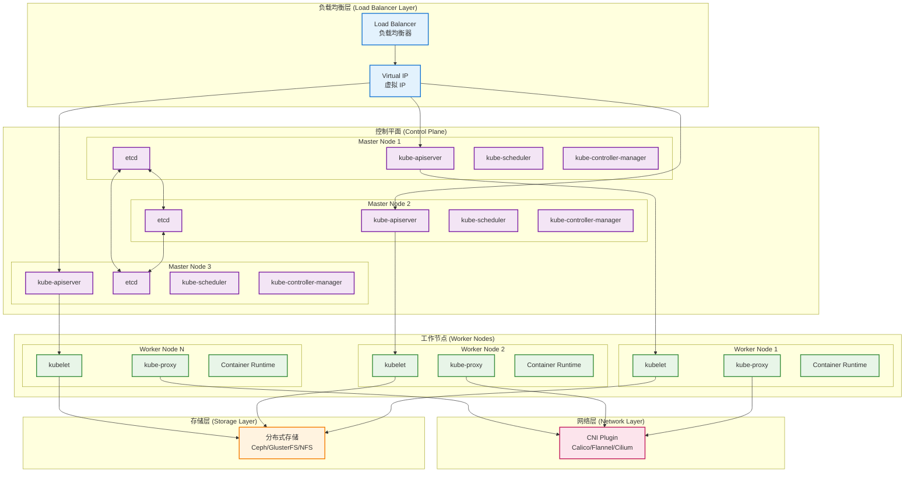

# Kubernetes 实战经验与最佳实践指南

## 📚 文档概述

本文档汇总了 Kubernetes 生产环境的实战经验和最佳实践，涵盖集群搭建、应用部署、运维监控、性能优化、安全加固等各个方面。通过具体的案例和配置示例，帮助用户在生产环境中高效、安全地使用 Kubernetes。

## 🏗️ 集群架构最佳实践

### 1.1 高可用集群架构



### 1.2 集群规划最佳实践

#### 1.2.1 节点规划

```yaml
# 生产环境节点规划建议
cluster_planning:
  # 控制平面节点
  master_nodes:
    count: 3  # 奇数个，推荐 3 或 5 个
    specs:
      cpu: "4 cores"
      memory: "8GB"
      disk: "100GB SSD"
    # 专用控制平面，不调度业务 Pod
    taints:
      - key: "node-role.kubernetes.io/control-plane"
        effect: "NoSchedule"
  
  # 工作节点
  worker_nodes:
    count: ">=3"  # 根据业务需求扩展
    specs:
      cpu: "8+ cores"
      memory: "16+ GB"
      disk: "200+ GB SSD"
    # 按业务类型分组
    node_groups:
      - name: "compute-intensive"
        labels:
          workload-type: "compute"
        specs:
          cpu: "16+ cores"
          memory: "32+ GB"
      - name: "memory-intensive"
        labels:
          workload-type: "memory"
        specs:
          cpu: "8+ cores"
          memory: "64+ GB"
      - name: "storage-intensive"
        labels:
          workload-type: "storage"
        specs:
          cpu: "8+ cores"
          memory: "16+ GB"
          disk: "1TB+ SSD"

# etcd 集群配置
etcd_cluster:
  # 专用 etcd 节点（大规模集群推荐）
  dedicated_nodes: true
  count: 3
  specs:
    cpu: "4 cores"
    memory: "8GB"
    disk: "100GB SSD (IOPS > 3000)"
  # 数据目录配置
  data_dir: "/var/lib/etcd"
  # 备份策略
  backup:
    enabled: true
    schedule: "0 2 * * *"  # 每天凌晨 2 点
    retention: "30d"
```

#### 1.2.2 网络规划

```yaml
# 网络 CIDR 规划
network_planning:
  # 集群 CIDR（Pod 网络）
  cluster_cidr: "10.244.0.0/16"  # 支持 65536 个 Pod
  
  # 服务 CIDR
  service_cidr: "10.96.0.0/12"   # 支持 4096 个服务
  
  # 节点网络
  node_cidr: "192.168.1.0/24"    # 物理节点网络
  
  # CNI 选择建议
  cni_recommendations:
    small_cluster: "Flannel"      # < 50 节点
    medium_cluster: "Calico"      # 50-200 节点
    large_cluster: "Cilium"       # > 200 节点
    
  # 网络策略
  network_policies:
    enabled: true
    default_deny: true  # 默认拒绝所有流量
    
# 存储规划
storage_planning:
  # 存储类配置
  storage_classes:
    - name: "fast-ssd"
      provisioner: "kubernetes.io/aws-ebs"
      parameters:
        type: "gp3"
        iops: "3000"
      reclaim_policy: "Retain"
      
    - name: "standard"
      provisioner: "kubernetes.io/aws-ebs"
      parameters:
        type: "gp2"
      reclaim_policy: "Delete"
      
    - name: "backup"
      provisioner: "kubernetes.io/aws-ebs"
      parameters:
        type: "sc1"
      reclaim_policy: "Retain"
```

## 🚀 应用部署最佳实践

### 2.1 Deployment 配置最佳实践

```yaml
# 生产级 Deployment 配置示例
apiVersion: apps/v1
kind: Deployment
metadata:
  name: web-app
  namespace: production
  labels:
    app: web-app
    version: v1.2.3
    environment: production
  annotations:
    deployment.kubernetes.io/revision: "1"
    kubernetes.io/change-cause: "Initial deployment v1.2.3"
spec:
  # 副本数配置
  replicas: 3
  
  # 选择器必须匹配模板标签
  selector:
    matchLabels:
      app: web-app
      version: v1.2.3
  
  # 部署策略
  strategy:
    type: RollingUpdate
    rollingUpdate:
      maxUnavailable: 25%  # 最多 25% 的 Pod 不可用
      maxSurge: 25%        # 最多超出期望副本数 25%
  
  # 最小就绪时间
  minReadySeconds: 30
  
  # 进度截止时间
  progressDeadlineSeconds: 600
  
  # 保留的历史版本数
  revisionHistoryLimit: 10
  
  template:
    metadata:
      labels:
        app: web-app
        version: v1.2.3
        environment: production
      annotations:
        prometheus.io/scrape: "true"
        prometheus.io/port: "8080"
        prometheus.io/path: "/metrics"
    spec:
      # 服务账户
      serviceAccountName: web-app-sa
      
      # 安全上下文
      securityContext:
        runAsNonRoot: true
        runAsUser: 1000
        runAsGroup: 1000
        fsGroup: 1000
        seccompProfile:
          type: RuntimeDefault
      
      # 容器配置
      containers:
      - name: web-app
        image: myregistry/web-app:v1.2.3
        
        # 镜像拉取策略
        imagePullPolicy: Always
        
        # 端口配置
        ports:
        - name: http
          containerPort: 8080
          protocol: TCP
        - name: metrics
          containerPort: 9090
          protocol: TCP
        
        # 环境变量
        env:
        - name: ENV
          value: "production"
        - name: LOG_LEVEL
          value: "info"
        - name: DB_PASSWORD
          valueFrom:
            secretKeyRef:
              name: db-secret
              key: password
        
        # 环境变量从 ConfigMap
        envFrom:
        - configMapRef:
            name: app-config
        
        # 资源限制和请求
        resources:
          requests:
            cpu: 100m
            memory: 128Mi
          limits:
            cpu: 500m
            memory: 512Mi
        
        # 存活探针
        livenessProbe:
          httpGet:
            path: /health
            port: http
            scheme: HTTP
          initialDelaySeconds: 30
          periodSeconds: 10
          timeoutSeconds: 5
          failureThreshold: 3
          successThreshold: 1
        
        # 就绪探针
        readinessProbe:
          httpGet:
            path: /ready
            port: http
            scheme: HTTP
          initialDelaySeconds: 5
          periodSeconds: 5
          timeoutSeconds: 3
          failureThreshold: 3
          successThreshold: 1
        
        # 启动探针
        startupProbe:
          httpGet:
            path: /health
            port: http
            scheme: HTTP
          initialDelaySeconds: 10
          periodSeconds: 10
          timeoutSeconds: 5
          failureThreshold: 30
          successThreshold: 1
        
        # 生命周期钩子
        lifecycle:
          preStop:
            exec:
              command:
              - /bin/sh
              - -c
              - "sleep 15"  # 优雅关闭
        
        # 安全上下文
        securityContext:
          allowPrivilegeEscalation: false
          readOnlyRootFilesystem: true
          capabilities:
            drop:
            - ALL
        
        # 存储卷挂载
        volumeMounts:
        - name: config-volume
          mountPath: /etc/config
          readOnly: true
        - name: secret-volume
          mountPath: /etc/secrets
          readOnly: true
        - name: tmp-volume
          mountPath: /tmp
        - name: cache-volume
          mountPath: /app/cache
      
      # 镜像拉取密钥
      imagePullSecrets:
      - name: registry-secret
      
      # 存储卷
      volumes:
      - name: config-volume
        configMap:
          name: app-config
      - name: secret-volume
        secret:
          secretName: app-secret
      - name: tmp-volume
        emptyDir: {}
      - name: cache-volume
        emptyDir:
          sizeLimit: 1Gi
      
      # 调度配置
      nodeSelector:
        workload-type: "web"
      
      # 亲和性配置
      affinity:
        # Pod 反亲和性（避免同一节点部署多个副本）
        podAntiAffinity:
          preferredDuringSchedulingIgnoredDuringExecution:
          - weight: 100
            podAffinityTerm:
              labelSelector:
                matchExpressions:
                - key: app
                  operator: In
                  values:
                  - web-app
              topologyKey: kubernetes.io/hostname
        
        # 节点亲和性
        nodeAffinity:
          requiredDuringSchedulingIgnoredDuringExecution:
            nodeSelectorTerms:
            - matchExpressions:
              - key: kubernetes.io/arch
                operator: In
                values:
                - amd64
          preferredDuringSchedulingIgnoredDuringExecution:
          - weight: 1
            preference:
              matchExpressions:
              - key: node-type
                operator: In
                values:
                - compute-optimized
      
      # 容忍度
      tolerations:
      - key: "workload-type"
        operator: "Equal"
        value: "web"
        effect: "NoSchedule"
      
      # 拓扑分布约束
      topologySpreadConstraints:
      - maxSkew: 1
        topologyKey: kubernetes.io/hostname
        whenUnsatisfiable: DoNotSchedule
        labelSelector:
          matchLabels:
            app: web-app
      - maxSkew: 1
        topologyKey: topology.kubernetes.io/zone
        whenUnsatisfiable: ScheduleAnyway
        labelSelector:
          matchLabels:
            app: web-app
      
      # 终止优雅期
      terminationGracePeriodSeconds: 30
      
      # DNS 策略
      dnsPolicy: ClusterFirst
      
      # 重启策略
      restartPolicy: Always
      
      # 优先级类
      priorityClassName: high-priority

---
# Pod 中断预算
apiVersion: policy/v1
kind: PodDisruptionBudget
metadata:
  name: web-app-pdb
  namespace: production
spec:
  minAvailable: 2  # 至少保持 2 个 Pod 可用
  selector:
    matchLabels:
      app: web-app

---
# 水平 Pod 自动扩缩容
apiVersion: autoscaling/v2
kind: HorizontalPodAutoscaler
metadata:
  name: web-app-hpa
  namespace: production
spec:
  scaleTargetRef:
    apiVersion: apps/v1
    kind: Deployment
    name: web-app
  minReplicas: 3
  maxReplicas: 10
  metrics:
  - type: Resource
    resource:
      name: cpu
      target:
        type: Utilization
        averageUtilization: 70
  - type: Resource
    resource:
      name: memory
      target:
        type: Utilization
        averageUtilization: 80
  behavior:
    scaleUp:
      stabilizationWindowSeconds: 60
      policies:
      - type: Percent
        value: 100
        periodSeconds: 15
    scaleDown:
      stabilizationWindowSeconds: 300
      policies:
      - type: Percent
        value: 10
        periodSeconds: 60
```

### 2.2 Service 配置最佳实践

```yaml
# 生产级 Service 配置
apiVersion: v1
kind: Service
metadata:
  name: web-app-service
  namespace: production
  labels:
    app: web-app
    service-type: web
  annotations:
    service.beta.kubernetes.io/aws-load-balancer-type: "nlb"
    service.beta.kubernetes.io/aws-load-balancer-cross-zone-load-balancing-enabled: "true"
    service.beta.kubernetes.io/aws-load-balancer-backend-protocol: "tcp"
spec:
  type: LoadBalancer
  
  # 选择器
  selector:
    app: web-app
  
  # 端口配置
  ports:
  - name: http
    port: 80
    targetPort: http
    protocol: TCP
  - name: https
    port: 443
    targetPort: https
    protocol: TCP
  
  # 会话亲和性
  sessionAffinity: ClientIP
  sessionAffinityConfig:
    clientIP:
      timeoutSeconds: 10800  # 3 小时
  
  # 外部流量策略
  externalTrafficPolicy: Local  # 保留源 IP
  
  # 健康检查节点端口
  healthCheckNodePort: 32000
  
  # 负载均衡器源范围
  loadBalancerSourceRanges:
  - 10.0.0.0/8
  - 172.16.0.0/12
  - 192.168.0.0/16

---
# Headless Service（用于 StatefulSet）
apiVersion: v1
kind: Service
metadata:
  name: database-headless
  namespace: production
  labels:
    app: database
spec:
  clusterIP: None  # Headless Service
  selector:
    app: database
  ports:
  - name: mysql
    port: 3306
    targetPort: 3306
    protocol: TCP

---
# 内部服务
apiVersion: v1
kind: Service
metadata:
  name: internal-api
  namespace: production
  labels:
    app: internal-api
spec:
  type: ClusterIP
  selector:
    app: internal-api
  ports:
  - name: api
    port: 8080
    targetPort: 8080
    protocol: TCP
  
  # 内部流量策略
  internalTrafficPolicy: Local
```

### 2.3 ConfigMap 和 Secret 最佳实践

```yaml
# ConfigMap 配置
apiVersion: v1
kind: ConfigMap
metadata:
  name: app-config
  namespace: production
  labels:
    app: web-app
    config-type: application
data:
  # 应用配置
  app.properties: |
    server.port=8080
    server.servlet.context-path=/api
    
    # 数据库配置
    spring.datasource.url=jdbc:mysql://database-service:3306/appdb
    spring.datasource.username=appuser
    spring.datasource.driver-class-name=com.mysql.cj.jdbc.Driver
    
    # 连接池配置
    spring.datasource.hikari.maximum-pool-size=20
    spring.datasource.hikari.minimum-idle=5
    spring.datasource.hikari.connection-timeout=30000
    
    # 缓存配置
    spring.cache.type=redis
    spring.redis.host=redis-service
    spring.redis.port=6379
    spring.redis.timeout=2000ms
    
    # 日志配置
    logging.level.com.example=INFO
    logging.pattern.console=%d{yyyy-MM-dd HH:mm:ss} [%thread] %-5level %logger{36} - %msg%n
  
  # Nginx 配置
  nginx.conf: |
    upstream backend {
        server web-app-service:8080;
    }
    
    server {
        listen 80;
        server_name example.com;
        
        location / {
            proxy_pass http://backend;
            proxy_set_header Host $host;
            proxy_set_header X-Real-IP $remote_addr;
            proxy_set_header X-Forwarded-For $proxy_add_x_forwarded_for;
            proxy_set_header X-Forwarded-Proto $scheme;
        }
        
        location /health {
            access_log off;
            return 200 "healthy\n";
        }
    }

---
# Secret 配置
apiVersion: v1
kind: Secret
metadata:
  name: app-secret
  namespace: production
  labels:
    app: web-app
    secret-type: application
type: Opaque
data:
  # 数据库密码（Base64 编码）
  db-password: cGFzc3dvcmQxMjM=
  
  # API 密钥
  api-key: YWJjZGVmZ2hpams=
  
  # JWT 密钥
  jwt-secret: bXlqd3RzZWNyZXRrZXk=

---
# TLS Secret
apiVersion: v1
kind: Secret
metadata:
  name: tls-secret
  namespace: production
  labels:
    app: web-app
    secret-type: tls
type: kubernetes.io/tls
data:
  tls.crt: |
    LS0tLS1CRUdJTiBDRVJUSUZJQ0FURS0tLS0t...
  tls.key: |
    LS0tLS1CRUdJTiBQUklWQVRFIEtFWS0tLS0t...

---
# 镜像拉取 Secret
apiVersion: v1
kind: Secret
metadata:
  name: registry-secret
  namespace: production
  labels:
    secret-type: registry
type: kubernetes.io/dockerconfigjson
data:
  .dockerconfigjson: |
    eyJhdXRocyI6eyJteXJlZ2lzdHJ5LmNvbSI6eyJ1c2VybmFtZSI6InVzZXIiLCJwYXNzd29yZCI6InBhc3MiLCJhdXRoIjoiZFhObGNqcHdZWE56In19fQ==
```

## 🔒 安全最佳实践

### 3.1 RBAC 权限控制

```yaml
# 服务账户
apiVersion: v1
kind: ServiceAccount
metadata:
  name: web-app-sa
  namespace: production
  labels:
    app: web-app
automountServiceAccountToken: false  # 禁用自动挂载

---
# 角色定义
apiVersion: rbac.authorization.k8s.io/v1
kind: Role
metadata:
  namespace: production
  name: web-app-role
rules:
# 允许读取 ConfigMap 和 Secret
- apiGroups: [""]
  resources: ["configmaps", "secrets"]
  verbs: ["get", "list"]
# 允许创建事件
- apiGroups: [""]
  resources: ["events"]
  verbs: ["create"]

---
# 角色绑定
apiVersion: rbac.authorization.k8s.io/v1
kind: RoleBinding
metadata:
  name: web-app-rolebinding
  namespace: production
subjects:
- kind: ServiceAccount
  name: web-app-sa
  namespace: production
roleRef:
  kind: Role
  name: web-app-role
  apiGroup: rbac.authorization.k8s.io

---
# 集群角色（跨命名空间权限）
apiVersion: rbac.authorization.k8s.io/v1
kind: ClusterRole
metadata:
  name: monitoring-reader
rules:
- apiGroups: [""]
  resources: ["nodes", "nodes/metrics", "services", "endpoints", "pods"]
  verbs: ["get", "list", "watch"]
- apiGroups: ["extensions", "apps"]
  resources: ["deployments", "replicasets"]
  verbs: ["get", "list", "watch"]

---
# 集群角色绑定
apiVersion: rbac.authorization.k8s.io/v1
kind: ClusterRoleBinding
metadata:
  name: monitoring-binding
subjects:
- kind: ServiceAccount
  name: prometheus
  namespace: monitoring
roleRef:
  kind: ClusterRole
  name: monitoring-reader
  apiGroup: rbac.authorization.k8s.io
```

### 3.2 网络策略

```yaml
# 默认拒绝所有流量
apiVersion: networking.k8s.io/v1
kind: NetworkPolicy
metadata:
  name: default-deny-all
  namespace: production
spec:
  podSelector: {}
  policyTypes:
  - Ingress
  - Egress

---
# 允许 Web 应用接收流量
apiVersion: networking.k8s.io/v1
kind: NetworkPolicy
metadata:
  name: web-app-ingress
  namespace: production
spec:
  podSelector:
    matchLabels:
      app: web-app
  policyTypes:
  - Ingress
  ingress:
  # 允许来自负载均衡器的流量
  - from:
    - namespaceSelector:
        matchLabels:
          name: ingress-nginx
    ports:
    - protocol: TCP
      port: 8080
  # 允许来自同命名空间的流量
  - from:
    - podSelector:
        matchLabels:
          role: frontend
    ports:
    - protocol: TCP
      port: 8080

---
# 允许 Web 应用访问数据库
apiVersion: networking.k8s.io/v1
kind: NetworkPolicy
metadata:
  name: web-app-egress
  namespace: production
spec:
  podSelector:
    matchLabels:
      app: web-app
  policyTypes:
  - Egress
  egress:
  # 允许访问数据库
  - to:
    - podSelector:
        matchLabels:
          app: database
    ports:
    - protocol: TCP
      port: 3306
  # 允许访问 Redis
  - to:
    - podSelector:
        matchLabels:
          app: redis
    ports:
    - protocol: TCP
      port: 6379
  # 允许 DNS 解析
  - to: []
    ports:
    - protocol: UDP
      port: 53
  # 允许 HTTPS 出站流量
  - to: []
    ports:
    - protocol: TCP
      port: 443

---
# 数据库网络策略
apiVersion: networking.k8s.io/v1
kind: NetworkPolicy
metadata:
  name: database-policy
  namespace: production
spec:
  podSelector:
    matchLabels:
      app: database
  policyTypes:
  - Ingress
  - Egress
  ingress:
  # 只允许来自 Web 应用的连接
  - from:
    - podSelector:
        matchLabels:
          app: web-app
    ports:
    - protocol: TCP
      port: 3306
  egress:
  # 允许 DNS 解析
  - to: []
    ports:
    - protocol: UDP
      port: 53
```

### 3.3 Pod Security Standards

```yaml
# Pod 安全策略
apiVersion: v1
kind: Namespace
metadata:
  name: production
  labels:
    # Pod Security Standards
    pod-security.kubernetes.io/enforce: restricted
    pod-security.kubernetes.io/audit: restricted
    pod-security.kubernetes.io/warn: restricted

---
# 安全上下文约束（OpenShift）
apiVersion: security.openshift.io/v1
kind: SecurityContextConstraints
metadata:
  name: restricted-scc
allowHostDirVolumePlugin: false
allowHostIPC: false
allowHostNetwork: false
allowHostPID: false
allowHostPorts: false
allowPrivilegedContainer: false
allowedCapabilities: []
defaultAddCapabilities: []
requiredDropCapabilities:
- ALL
allowedFlexVolumes: []
fsGroup:
  type: MustRunAs
  ranges:
  - min: 1000
    max: 65535
readOnlyRootFilesystem: true
runAsUser:
  type: MustRunAsNonRoot
seLinuxContext:
  type: MustRunAs
supplementalGroups:
  type: MustRunAs
  ranges:
  - min: 1000
    max: 65535
volumes:
- configMap
- downwardAPI
- emptyDir
- persistentVolumeClaim
- projected
- secret
```

## 📊 监控和可观测性最佳实践

### 4.1 Prometheus 监控配置

```yaml
# Prometheus 配置
apiVersion: v1
kind: ConfigMap
metadata:
  name: prometheus-config
  namespace: monitoring
data:
  prometheus.yml: |
    global:
      scrape_interval: 15s
      evaluation_interval: 15s
      external_labels:
        cluster: 'production'
        region: 'us-west-2'
    
    rule_files:
    - "/etc/prometheus/rules/*.yml"
    
    alerting:
      alertmanagers:
      - static_configs:
        - targets:
          - alertmanager:9093
    
    scrape_configs:
    # Kubernetes API Server
    - job_name: 'kubernetes-apiservers'
      kubernetes_sd_configs:
      - role: endpoints
      scheme: https
      tls_config:
        ca_file: /var/run/secrets/kubernetes.io/serviceaccount/ca.crt
      bearer_token_file: /var/run/secrets/kubernetes.io/serviceaccount/token
      relabel_configs:
      - source_labels: [__meta_kubernetes_namespace, __meta_kubernetes_service_name, __meta_kubernetes_endpoint_port_name]
        action: keep
        regex: default;kubernetes;https
    
    # Kubernetes Nodes
    - job_name: 'kubernetes-nodes'
      kubernetes_sd_configs:
      - role: node
      scheme: https
      tls_config:
        ca_file: /var/run/secrets/kubernetes.io/serviceaccount/ca.crt
      bearer_token_file: /var/run/secrets/kubernetes.io/serviceaccount/token
      relabel_configs:
      - action: labelmap
        regex: __meta_kubernetes_node_label_(.+)
      - target_label: __address__
        replacement: kubernetes.default.svc:443
      - source_labels: [__meta_kubernetes_node_name]
        regex: (.+)
        target_label: __metrics_path__
        replacement: /api/v1/nodes/${1}/proxy/metrics
    
    # Kubernetes Pods
    - job_name: 'kubernetes-pods'
      kubernetes_sd_configs:
      - role: pod
      relabel_configs:
      - source_labels: [__meta_kubernetes_pod_annotation_prometheus_io_scrape]
        action: keep
        regex: true
      - source_labels: [__meta_kubernetes_pod_annotation_prometheus_io_path]
        action: replace
        target_label: __metrics_path__
        regex: (.+)
      - source_labels: [__address__, __meta_kubernetes_pod_annotation_prometheus_io_port]
        action: replace
        regex: ([^:]+)(?::\d+)?;(\d+)
        replacement: $1:$2
        target_label: __address__
      - action: labelmap
        regex: __meta_kubernetes_pod_label_(.+)
      - source_labels: [__meta_kubernetes_namespace]
        action: replace
        target_label: kubernetes_namespace
      - source_labels: [__meta_kubernetes_pod_name]
        action: replace
        target_label: kubernetes_pod_name
    
    # 应用程序指标
    - job_name: 'web-app'
      kubernetes_sd_configs:
      - role: endpoints
      relabel_configs:
      - source_labels: [__meta_kubernetes_service_label_app]
        action: keep
        regex: web-app
      - source_labels: [__meta_kubernetes_endpoint_port_name]
        action: keep
        regex: metrics

---
# Prometheus 告警规则
apiVersion: v1
kind: ConfigMap
metadata:
  name: prometheus-rules
  namespace: monitoring
data:
  kubernetes.yml: |
    groups:
    - name: kubernetes.rules
      rules:
      # 节点 CPU 使用率
      - alert: NodeCPUUsage
        expr: (100 - (avg by (instance) (irate(node_cpu_seconds_total{mode="idle"}[5m])) * 100)) > 80
        for: 5m
        labels:
          severity: warning
        annotations:
          summary: "节点 CPU 使用率过高"
          description: "节点 {{ $labels.instance }} CPU 使用率为 {{ $value }}%"
      
      # 节点内存使用率
      - alert: NodeMemoryUsage
        expr: (1 - (node_memory_MemAvailable_bytes / node_memory_MemTotal_bytes)) * 100 > 85
        for: 5m
        labels:
          severity: warning
        annotations:
          summary: "节点内存使用率过高"
          description: "节点 {{ $labels.instance }} 内存使用率为 {{ $value }}%"
      
      # 节点磁盘使用率
      - alert: NodeDiskUsage
        expr: (1 - (node_filesystem_avail_bytes{fstype!="tmpfs"} / node_filesystem_size_bytes{fstype!="tmpfs"})) * 100 > 85
        for: 5m
        labels:
          severity: warning
        annotations:
          summary: "节点磁盘使用率过高"
          description: "节点 {{ $labels.instance }} 磁盘 {{ $labels.mountpoint }} 使用率为 {{ $value }}%"
      
      # Pod CPU 使用率
      - alert: PodCPUUsage
        expr: sum by (namespace, pod) (rate(container_cpu_usage_seconds_total{container!="POD",container!=""}[5m])) / sum by (namespace, pod) (container_spec_cpu_quota{container!="POD",container!=""}/container_spec_cpu_period{container!="POD",container!=""}) * 100 > 80
        for: 5m
        labels:
          severity: warning
        annotations:
          summary: "Pod CPU 使用率过高"
          description: "Pod {{ $labels.namespace }}/{{ $labels.pod }} CPU 使用率为 {{ $value }}%"
      
      # Pod 内存使用率
      - alert: PodMemoryUsage
        expr: sum by (namespace, pod) (container_memory_working_set_bytes{container!="POD",container!=""}) / sum by (namespace, pod) (container_spec_memory_limit_bytes{container!="POD",container!=""}) * 100 > 85
        for: 5m
        labels:
          severity: warning
        annotations:
          summary: "Pod 内存使用率过高"
          description: "Pod {{ $labels.namespace }}/{{ $labels.pod }} 内存使用率为 {{ $value }}%"
      
      # Pod 重启次数
      - alert: PodRestartCount
        expr: increase(kube_pod_container_status_restarts_total[1h]) > 5
        for: 0m
        labels:
          severity: warning
        annotations:
          summary: "Pod 重启次数过多"
          description: "Pod {{ $labels.namespace }}/{{ $labels.pod }} 在过去 1 小时内重启了 {{ $value }} 次"
      
      # Deployment 副本数不足
      - alert: DeploymentReplicasMismatch
        expr: kube_deployment_spec_replicas != kube_deployment_status_available_replicas
        for: 5m
        labels:
          severity: warning
        annotations:
          summary: "Deployment 副本数不匹配"
          description: "Deployment {{ $labels.namespace }}/{{ $labels.deployment }} 期望副本数 {{ $labels.spec_replicas }}，实际可用副本数 {{ $labels.available_replicas }}"

  application.yml: |
    groups:
    - name: application.rules
      rules:
      # HTTP 错误率
      - alert: HighErrorRate
        expr: sum(rate(http_requests_total{status=~"5.."}[5m])) by (service) / sum(rate(http_requests_total[5m])) by (service) * 100 > 5
        for: 5m
        labels:
          severity: warning
        annotations:
          summary: "HTTP 错误率过高"
          description: "服务 {{ $labels.service }} HTTP 5xx 错误率为 {{ $value }}%"
      
      # HTTP 响应时间
      - alert: HighLatency
        expr: histogram_quantile(0.95, sum(rate(http_request_duration_seconds_bucket[5m])) by (le, service)) > 1
        for: 5m
        labels:
          severity: warning
        annotations:
          summary: "HTTP 响应时间过长"
          description: "服务 {{ $labels.service }} 95% 响应时间为 {{ $value }}s"
      
      # 数据库连接数
      - alert: DatabaseConnectionHigh
        expr: mysql_global_status_threads_connected / mysql_global_variables_max_connections * 100 > 80
        for: 5m
        labels:
          severity: warning
        annotations:
          summary: "数据库连接数过高"
          description: "数据库连接使用率为 {{ $value }}%"
```

### 4.2 日志收集配置

```yaml
# Fluent Bit 配置
apiVersion: v1
kind: ConfigMap
metadata:
  name: fluent-bit-config
  namespace: logging
data:
  fluent-bit.conf: |
    [SERVICE]
        Flush         1
        Log_Level     info
        Daemon        off
        Parsers_File  parsers.conf
        HTTP_Server   On
        HTTP_Listen   0.0.0.0
        HTTP_Port     2020
    
    [INPUT]
        Name              tail
        Path              /var/log/containers/*.log
        Parser            docker
        Tag               kube.*
        Refresh_Interval  5
        Mem_Buf_Limit     50MB
        Skip_Long_Lines   On
    
    [INPUT]
        Name              systemd
        Tag               host.*
        Systemd_Filter    _SYSTEMD_UNIT=kubelet.service
        Systemd_Filter    _SYSTEMD_UNIT=docker.service
    
    [FILTER]
        Name                kubernetes
        Match               kube.*
        Kube_URL            https://kubernetes.default.svc:443
        Kube_CA_File        /var/run/secrets/kubernetes.io/serviceaccount/ca.crt
        Kube_Token_File     /var/run/secrets/kubernetes.io/serviceaccount/token
        Kube_Tag_Prefix     kube.var.log.containers.
        Merge_Log           On
        Merge_Log_Key       log_processed
        K8S-Logging.Parser  On
        K8S-Logging.Exclude Off
        Annotations         Off
        Labels              On
    
    [FILTER]
        Name                nest
        Match               kube.*
        Operation           lift
        Nested_under        kubernetes
        Add_prefix          kubernetes_
    
    [FILTER]
        Name                modify
        Match               kube.*
        Remove              kubernetes_pod_id
        Remove              kubernetes_docker_id
        Remove              kubernetes_container_hash
    
    [OUTPUT]
        Name                elasticsearch
        Match               kube.*
        Host                elasticsearch.logging.svc.cluster.local
        Port                9200
        Index               kubernetes
        Type                _doc
        Logstash_Format     On
        Logstash_Prefix     kubernetes
        Logstash_DateFormat %Y.%m.%d
        Time_Key            @timestamp
        Time_Key_Format     %Y-%m-%dT%H:%M:%S.%L%z
        Retry_Limit         False
    
    [OUTPUT]
        Name                elasticsearch
        Match               host.*
        Host                elasticsearch.logging.svc.cluster.local
        Port                9200
        Index               system
        Type                _doc
        Logstash_Format     On
        Logstash_Prefix     system
        Logstash_DateFormat %Y.%m.%d
        Time_Key            @timestamp
        Time_Key_Format     %Y-%m-%dT%H:%M:%S.%L%z
        Retry_Limit         False

  parsers.conf: |
    [PARSER]
        Name        docker
        Format      json
        Time_Key    time
        Time_Format %Y-%m-%dT%H:%M:%S.%L%z
        Time_Keep   On
    
    [PARSER]
        Name        nginx
        Format      regex
        Regex       ^(?<remote>[^ ]*) (?<host>[^ ]*) (?<user>[^ ]*) \[(?<time>[^\]]*)\] "(?<method>\S+)(?: +(?<path>[^\"]*?)(?: +\S*)?)?" (?<code>[^ ]*) (?<size>[^ ]*)(?: "(?<referer>[^\"]*)" "(?<agent>[^\"]*)")?$
        Time_Key    time
        Time_Format %d/%b/%Y:%H:%M:%S %z
    
    [PARSER]
        Name        apache
        Format      regex
        Regex       ^(?<host>[^ ]*) [^ ]* (?<user>[^ ]*) \[(?<time>[^\]]*)\] "(?<method>\S+)(?: +(?<path>[^ ]*) +\S*)?" (?<code>[^ ]*) (?<size>[^ ]*)(?: "(?<referer>[^\"]*)" "(?<agent>[^\"]*)")?$
        Time_Key    time
        Time_Format %d/%b/%Y:%H:%M:%S %z
```

## 🚀 性能优化最佳实践

### 5.1 集群性能调优

```yaml
# etcd 性能优化配置
apiVersion: v1
kind: ConfigMap
metadata:
  name: etcd-config
  namespace: kube-system
data:
  etcd.conf.yml: |
    # 数据目录
    data-dir: /var/lib/etcd
    
    # 网络配置
    listen-client-urls: https://0.0.0.0:2379
    advertise-client-urls: https://etcd-1:2379,https://etcd-2:2379,https://etcd-3:2379
    listen-peer-urls: https://0.0.0.0:2380
    initial-advertise-peer-urls: https://etcd-1:2380
    
    # 集群配置
    initial-cluster: etcd-1=https://etcd-1:2380,etcd-2=https://etcd-2:2380,etcd-3=https://etcd-3:2380
    initial-cluster-state: new
    initial-cluster-token: etcd-cluster
    
    # 性能调优
    heartbeat-interval: 100
    election-timeout: 1000
    max-snapshots: 5
    max-wals: 5
    snapshot-count: 100000
    
    # 压缩配置
    auto-compaction-retention: "1h"
    auto-compaction-mode: periodic
    
    # 配额设置
    quota-backend-bytes: 8589934592  # 8GB
    
    # 日志配置
    log-level: info
    logger: zap
    log-outputs: [stderr]
    
    # 安全配置
    client-transport-security:
      cert-file: /etc/etcd/pki/etcd.crt
      key-file: /etc/etcd/pki/etcd.key
      client-cert-auth: true
      trusted-ca-file: /etc/etcd/pki/ca.crt
    peer-transport-security:
      cert-file: /etc/etcd/pki/etcd.crt
      key-file: /etc/etcd/pki/etcd.key
      peer-client-cert-auth: true
      trusted-ca-file: /etc/etcd/pki/ca.crt

---
# kube-apiserver 性能优化
apiVersion: v1
kind: Pod
metadata:
  name: kube-apiserver
  namespace: kube-system
spec:
  containers:
  - name: kube-apiserver
    image: k8s.gcr.io/kube-apiserver:v1.29.0
    command:
    - kube-apiserver
    # 基础配置
    - --advertise-address=192.168.1.10
    - --bind-address=0.0.0.0
    - --secure-port=6443
    
    # etcd 配置
    - --etcd-servers=https://etcd-1:2379,https://etcd-2:2379,https://etcd-3:2379
    - --etcd-cafile=/etc/etcd/pki/ca.crt
    - --etcd-certfile=/etc/etcd/pki/etcd.crt
    - --etcd-keyfile=/etc/etcd/pki/etcd.key
    
    # 性能调优
    - --max-requests-inflight=3000
    - --max-mutating-requests-inflight=1000
    - --request-timeout=60s
    - --min-request-timeout=1800
    
    # 审计配置
    - --audit-log-maxage=30
    - --audit-log-maxbackup=10
    - --audit-log-maxsize=100
    - --audit-log-path=/var/log/audit.log
    - --audit-policy-file=/etc/kubernetes/audit-policy.yaml
    
    # 认证授权
    - --authorization-mode=Node,RBAC
    - --enable-admission-plugins=NodeRestriction,ResourceQuota,PodSecurityPolicy
    - --disable-admission-plugins=StorageObjectInUseProtection
    
    # 服务账户
    - --service-account-key-file=/etc/kubernetes/pki/sa.pub
    - --service-account-signing-key-file=/etc/kubernetes/pki/sa.key
    - --service-account-issuer=https://kubernetes.default.svc.cluster.local
    
    # 网络配置
    - --service-cluster-ip-range=10.96.0.0/12
    - --service-node-port-range=30000-32767
    
    # 功能门控
    - --feature-gates=RemoveSelfLink=false
    
    # 日志配置
    - --v=2
    - --logtostderr=true
    
    resources:
      requests:
        cpu: 250m
        memory: 512Mi
      limits:
        cpu: 2
        memory: 2Gi

---
# kube-controller-manager 性能优化
apiVersion: v1
kind: Pod
metadata:
  name: kube-controller-manager
  namespace: kube-system
spec:
  containers:
  - name: kube-controller-manager
    image: k8s.gcr.io/kube-controller-manager:v1.29.0
    command:
    - kube-controller-manager
    # 基础配置
    - --bind-address=127.0.0.1
    - --kubeconfig=/etc/kubernetes/controller-manager.conf
    
    # 性能调优
    - --concurrent-deployment-syncs=10
    - --concurrent-replicaset-syncs=10
    - --concurrent-service-syncs=5
    - --concurrent-endpoint-syncs=10
    - --concurrent-namespace-syncs=10
    - --concurrent-gc-syncs=30
    
    # 控制器配置
    - --node-monitor-period=5s
    - --node-monitor-grace-period=40s
    - --pod-eviction-timeout=5m0s
    - --terminated-pod-gc-threshold=12500
    
    # 集群配置
    - --cluster-cidr=10.244.0.0/16
    - --service-cluster-ip-range=10.96.0.0/12
    - --cluster-name=kubernetes
    
    # 证书配置
    - --root-ca-file=/etc/kubernetes/pki/ca.crt
    - --service-account-private-key-file=/etc/kubernetes/pki/sa.key
    
    # 功能门控
    - --feature-gates=RemoveSelfLink=false
    
    # 日志配置
    - --v=2
    - --logtostderr=true
    
    resources:
      requests:
        cpu: 200m
        memory: 512Mi
      limits:
        cpu: 1
        memory: 1Gi

---
# kube-scheduler 性能优化
apiVersion: v1
kind: Pod
metadata:
  name: kube-scheduler
  namespace: kube-system
spec:
  containers:
  - name: kube-scheduler
    image: k8s.gcr.io/kube-scheduler:v1.29.0
    command:
    - kube-scheduler
    # 基础配置
    - --bind-address=127.0.0.1
    - --kubeconfig=/etc/kubernetes/scheduler.conf
    - --config=/etc/kubernetes/scheduler-config.yaml
    
    # 日志配置
    - --v=2
    - --logtostderr=true
    
    resources:
      requests:
        cpu: 100m
        memory: 256Mi
      limits:
        cpu: 500m
        memory: 512Mi

---
# 调度器配置
apiVersion: v1
kind: ConfigMap
metadata:
  name: scheduler-config
  namespace: kube-system
data:
  config.yaml: |
    apiVersion: kubescheduler.config.k8s.io/v1beta3
    kind: KubeSchedulerConfiguration
    profiles:
    - schedulerName: default-scheduler
      plugins:
        score:
          enabled:
          - name: NodeResourcesFit
          - name: NodeAffinity
          - name: PodTopologySpread
          - name: InterPodAffinity
          disabled:
          - name: NodeResourcesLeastAllocated
      pluginConfig:
      - name: NodeResourcesFit
        args:
          scoringStrategy:
            type: LeastAllocated
            resources:
            - name: cpu
              weight: 1
            - name: memory
              weight: 1
      - name: PodTopologySpread
        args:
          defaultConstraints:
          - maxSkew: 1
            topologyKey: kubernetes.io/hostname
            whenUnsatisfiable: ScheduleAnyway
          - maxSkew: 1
            topologyKey: topology.kubernetes.io/zone
            whenUnsatisfiable: ScheduleAnyway
    
    # 性能调优
    percentageOfNodesToScore: 50
    podInitialBackoffSeconds: 1
    podMaxBackoffSeconds: 10
```

### 5.2 应用性能优化

```yaml
# 垂直 Pod 自动扩缩容
apiVersion: autoscaling.k8s.io/v1
kind: VerticalPodAutoscaler
metadata:
  name: web-app-vpa
  namespace: production
spec:
  targetRef:
    apiVersion: apps/v1
    kind: Deployment
    name: web-app
  updatePolicy:
    updateMode: "Auto"  # Auto, Recreation, Initial, Off
  resourcePolicy:
    containerPolicies:
    - containerName: web-app
      minAllowed:
        cpu: 100m
        memory: 128Mi
      maxAllowed:
        cpu: 2
        memory: 2Gi
      controlledResources: ["cpu", "memory"]
      controlledValues: RequestsAndLimits

---
# 集群自动扩缩容
apiVersion: v1
kind: ConfigMap
metadata:
  name: cluster-autoscaler-status
  namespace: kube-system
data:
  nodes.max: "100"
  nodes.min: "3"
  scale-down-delay-after-add: "10m"
  scale-down-unneeded-time: "10m"
  scale-down-utilization-threshold: "0.5"
  skip-nodes-with-local-storage: "false"
  skip-nodes-with-system-pods: "false"

---
# 优先级类配置
apiVersion: scheduling.k8s.io/v1
kind: PriorityClass
metadata:
  name: high-priority
value: 1000
globalDefault: false
description: "高优先级类，用于关键业务应用"

---
apiVersion: scheduling.k8s.io/v1
kind: PriorityClass
metadata:
  name: low-priority
value: 100
globalDefault: false
description: "低优先级类，用于批处理任务"

---
# 资源配额
apiVersion: v1
kind: ResourceQuota
metadata:
  name: production-quota
  namespace: production
spec:
  hard:
    # 计算资源
    requests.cpu: "100"
    requests.memory: 200Gi
    limits.cpu: "200"
    limits.memory: 400Gi
    
    # 存储资源
    requests.storage: 1Ti
    persistentvolumeclaims: "50"
    
    # 对象数量
    pods: "100"
    services: "20"
    secrets: "50"
    configmaps: "50"
    replicationcontrollers: "20"
    deployments.apps: "20"
    replicasets.apps: "20"
    statefulsets.apps: "10"
    jobs.batch: "20"
    cronjobs.batch: "10"

---
# 限制范围
apiVersion: v1
kind: LimitRange
metadata:
  name: production-limits
  namespace: production
spec:
  limits:
  # Pod 限制
  - type: Pod
    max:
      cpu: "4"
      memory: 8Gi
    min:
      cpu: 50m
      memory: 64Mi
  
  # 容器限制
  - type: Container
    default:
      cpu: 200m
      memory: 256Mi
    defaultRequest:
      cpu: 100m
      memory: 128Mi
    max:
      cpu: "2"
      memory: 4Gi
    min:
      cpu: 50m
      memory: 64Mi
  
  # PVC 限制
  - type: PersistentVolumeClaim
    max:
      storage: 100Gi
    min:
      storage: 1Gi
```

## 📚 总结

### 核心最佳实践总结

1. **高可用架构**：多主节点、etcd 集群、负载均衡
2. **安全加固**：RBAC、网络策略、Pod 安全标准
3. **资源管理**：资源配额、限制范围、优先级类
4. **监控观测**：Prometheus 监控、日志收集、告警规则
5. **性能优化**：自动扩缩容、资源调优、调度优化

### 运维建议

1. **渐进式部署**：使用滚动更新和金丝雀部署
2. **备份恢复**：定期备份 etcd 和持久化数据
3. **容量规划**：基于监控数据进行容量规划
4. **故障演练**：定期进行故障演练和恢复测试
5. **文档维护**：保持运维文档和配置的及时更新

通过遵循这些最佳实践，可以构建稳定、安全、高性能的 Kubernetes 生产环境。

---

**文档版本**: v1.0  
**最后更新**: 2025年09月27日  
**适用版本**: Kubernetes 1.29+
