# Kubernetes 源码剖析：client-go

## 目录

- [Kubernetes 源码剖析：client-go](#kubernetes-源码剖析client-go)
  - [目录](#目录)
  - [1. 模块总览与架构图](#1-模块总览与架构图)
    - [12.4 Workqueue 接口与实现](#124-workqueue-接口与实现)
    - [12.5 Lister/Indexer/Store 接口层次](#125-listerindexerstore-接口层次)
    - [12.6 Typed Client 接口分层](#126-typed-client-接口分层)
    - [12.7 RESTMapper 与 Discovery 缓存](#127-restmapper-与-discovery-缓存)
    - [12.8 Watch 接口与事件流](#128-watch-接口与事件流)
  - [2. RESTClient 与 Clientset 初始化](#2-restclient-与-clientset-初始化)
  - [3. Transport/认证/限速与重试](#3-transport认证限速与重试)
  - [4. Informer 体系：SharedInformerFactory](#4-informer-体系sharedinformerfactory)
  - [5. Reflector / ListAndWatch](#5-reflector--listandwatch)
  - [6. DeltaFIFO / Controller.processLoop](#6-deltafifo--controllerprocessloop)
  - [7. Indexer / Store 与 Processor 分发器](#7-indexer--store-与-processor-分发器)
  - [8. Workqueue 与回调处理](#8-workqueue-与回调处理)
  - [9. Lister/ListerWatcher 与本地只读视图](#9-listerlisterwatcher-与本地只读视图)
  - [10. Dynamic/Discovery/Cache 组件](#10-dynamicdiscoverycache-组件)
  - [11. 序列化：Scheme/Codec/NegotiatedSerializer](#11-序列化schemecodecnegotiatedserializer)
  - [12. 关键结构体类结构图](#12-关键结构体类结构图)
    - [12.1 REST/Clientset/Discovery/Dynamic 关系](#121-restclientsetdiscoverydynamic-关系)
    - [12.2 Informer/Reflector/Store/Processor/Workqueue 关系](#122-informerreflectorstoreprocessorworkqueue-关系)
    - [12.3 序列化与编解码关系](#123-序列化与编解码关系)
  - [13. 时序图：从 List/Watch 到回调](#13-时序图从-listwatch-到回调)
  - [13. 关键路径函数与调用链](#13-关键路径函数与调用链)
    - [13.1 Client 初始化链](#131-client-初始化链)
    - [13.2 Informer 启动链](#132-informer-启动链)
    - [13.3 Reflector/Watch 复连与 RV 语义](#133-reflectorwatch-复连与-rv-语义)
    - [13.4 Workqueue 重试链](#134-workqueue-重试链)
    - [13.5 Request.Do/Into 调用链](#135-requestdointo-调用链)
    - [13.6 Reflector.ListAndWatch 核心逻辑](#136-reflectorlistandwatch-核心逻辑)
    - [13.7 controller.processLoop/HandleDeltas](#137-controllerprocessloophandledeltas)
    - [13.8 SharedIndexInformer.Run/Processor](#138-sharedindexinformerrunprocessor)
    - [13.9 Workqueue worker 模式](#139-workqueue-worker-模式)
    - [13.10 DynamicClient Resource 调用链](#1310-dynamicclient-resource-调用链)
  - [14. 性能与可观测性要点](#14-性能与可观测性要点)
  - [15. 小结](#15-小结)
  - [16. 关键函数汇总（核心代码/说明/调用链）](#16-关键函数汇总核心代码说明调用链)
    - [16.1 Reflector.ListAndWatch（核心代码与说明）](#161-reflectorlistandwatch核心代码与说明)
    - [16.2 DeltaFIFO.Pop 与 HandleDeltas（核心代码与说明）](#162-deltafifopop-与-handledeltas核心代码与说明)
    - [16.3 sharedIndexInformer 与 sharedProcessor（核心代码与说明）](#163-sharedindexinformer-与-sharedprocessor核心代码与说明)
    - [16.4 RESTClient.transformResponse/Into（核心代码与说明）](#164-restclienttransformresponseinto核心代码与说明)
    - [16.5 ListerWatcher 接口（核心代码与说明）](#165-listerwatcher-接口核心代码与说明)
    - [16.6 类结构图与继承关系（引用）](#166-类结构图与继承关系引用)

---

## 1. 模块总览与架构图

client-go 主要由以下子系统构成：

- REST/Typed Client：基于 `rest.Config` 构造 `RESTClient`，再生成 `Clientset` 与各资源组的 typed clients。
- Informer 架构：`SharedInformerFactory` → `Reflector`（ListAndWatch）→ `DeltaFIFO` → `Indexer(Store)` → `Processor(Listeners)` → 回调/队列。
- 缓存与只读访问：`Lister` 基于 Indexer 提供本地只读查询；`Store` 提供线程安全缓存。
- 动态与发现：`dynamic.Interface` 操作 GVR，`discovery.DiscoveryInterface` 构建资源发现缓存。
- 序列化：`Scheme`、`Codecs`、`NegotiatedSerializer` 负责编解码与版本协商。

```mermaid
flowchart LR
  subgraph API[Kube-APIServer]
  end

  subgraph Client[REST / Typed Clients]
    CFG[rest.Config]
    TR[transport.Transport\n(TLS/认证/限速/重试/Wrap)]
    RC[RESTClient]
    CS[Clientset\n(core/apps/...)]
  end

  subgraph Informer[Informer 架构]
    SIF[SharedInformerFactory]
    R[Reflector]
    Q[DeltaFIFO]
    IDX[Indexer/Store]
    P[Processor\n(Listeners)]
    H[Handlers\n(ResourceEventHandler)]
    L[Lister]
  end

  subgraph Ext[Dynamic/Discovery/Codec]
    DY[dynamic.Interface]
    DC[discovery.DiscoveryInterface]
    SC[Scheme/Codec/Serializer]
  end

  CFG --> TR --> RC --> CS
  CS -->|List/Watch| API
  SIF --> R --> Q --> IDX --> P --> H
  IDX --> L
  DY --> API
  DC --> API
  RC -. uses .- SC
  SIF -. uses .- DC
```
  </div>
</div>

---

### 12.4 Workqueue 接口与实现

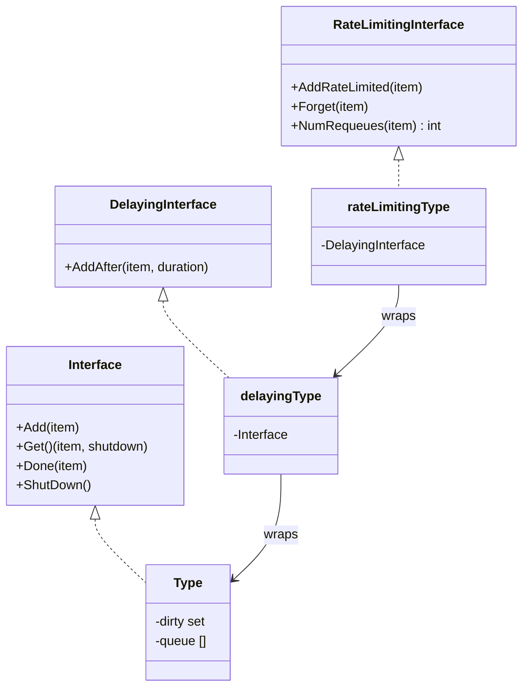
  </div>
</div>

### 12.5 Lister/Indexer/Store 接口层次

```mermaid
classDiagram
  class Store {
    +Add(obj)
    +Update(obj)
    +Delete(obj)
    +Get(obj)
    +List() []interface{}
  }
  class Indexer {
    +AddIndexers(map[string]IndexFunc)
    +ByIndex(name, key) []interface{}
  }
  class threadSafeStore {
    -cache map[string]interface{}
  }
  class GenericLister {
    +List(selector)
    +Get(name)
  }
  Store <|.. threadSafeStore
  Indexer <|.. cache.IndexerImpl
  GenericLister --> Indexer : uses
```
  </div>
</div>

### 12.6 Typed Client 接口分层

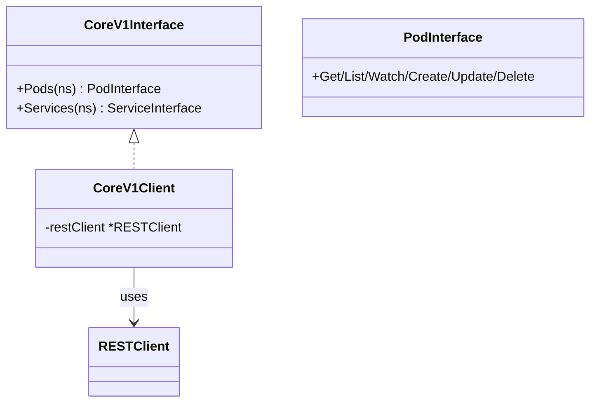
  </div>
</div>

### 12.7 RESTMapper 与 Discovery 缓存

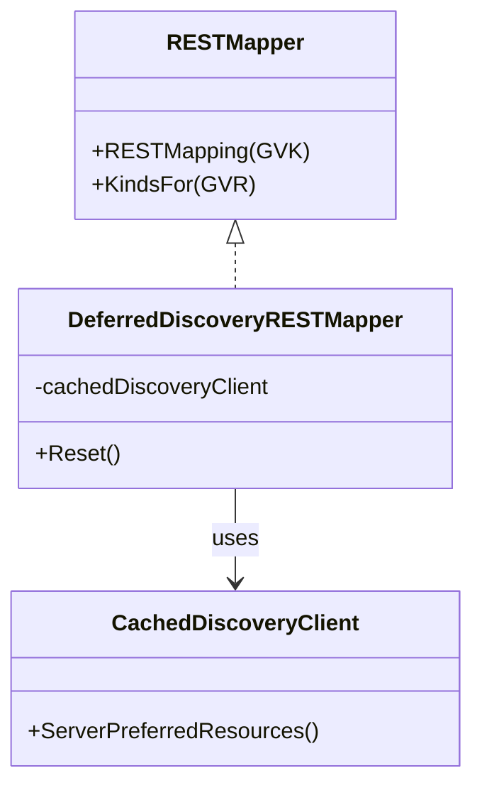
  </div>
</div>

### 12.8 Watch 接口与事件流

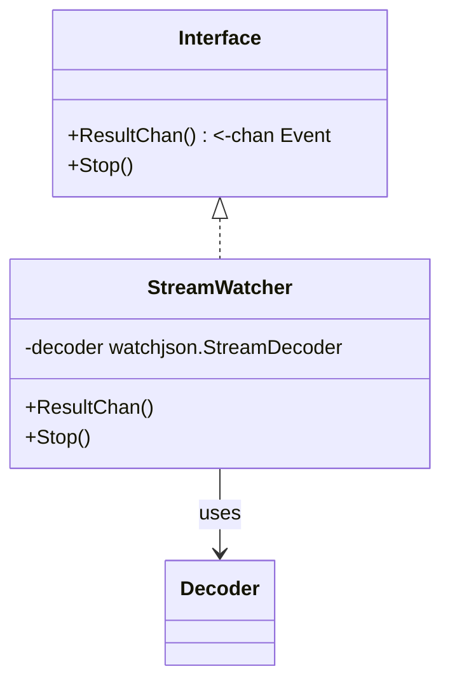
  </div>
</div>

## 2. RESTClient 与 Clientset 初始化

典型流程：`rest.Config` → `rest.HTTPClientFor`/`transport.Config` → `RESTClientFor` → `Clientset.NewForConfig[AndClient]`。

```go
// 入口：为各资源组构建 Clientset
func NewForConfig(c *rest.Config) (*Clientset, error) {
    cfg := *c
    if cfg.UserAgent == "" { cfg.UserAgent = rest.DefaultKubernetesUserAgent() }
    httpClient, err := rest.HTTPClientFor(&cfg)
    if err != nil { return nil, err }
    return NewForConfigAndClient(&cfg, httpClient)
}

func NewForConfigAndClient(c *rest.Config, httpClient *http.Client) (*Clientset, error) {
    cfg := *c
    var cs Clientset
    var err error
    cs.CoreV1, err = corev1.NewForConfigAndClient(&cfg, httpClient)
    if err != nil { return nil, err }
    cs.DiscoveryClient, err = discovery.NewDiscoveryClientForConfigAndClient(&cfg, httpClient)
    if err != nil { return nil, err }
    return &cs, nil
}
```

`RESTClient` 负责构造请求：URL 组装、序列化、`Do().Into(obj)` 解码，内部持有 `NegotiatedSerializer` 与 `http.RoundTripper`。

---

## 3. Transport/认证/限速与重试

- 认证与 TLS：通过 `transport.Config` 生成 `http.RoundTripper`，支持 `BearerToken`、`Exec`、`AuthProvider`、`mTLS`、`InsecureSkipTLSVerify`/`CAData` 等。
- 限速：`flowcontrol.RateLimiter`（令牌桶）内置于 `rest.Config`，被 `WithLimiter` 包装为 `RoundTripper`。
- 重试/超时：`rest.Request` 支持 `Timeout`；`watch` 在断线后自动重连（从 `resourceVersion` 续传）。
- Wrap 链：`WrapTransport` 扩展链式中间件（调试、追踪、审计）。

---

## 4. Informer 体系：SharedInformerFactory

`SharedInformerFactory` 复用 `ListerWatcher` 链路，集中创建各资源的 `SharedIndexInformer`，降低到 apiserver 的连接与负载。

```go
func NewSharedInformerFactory(cs kubernetes.Interface, resync time.Duration) informers.SharedInformerFactory {
    f := informers.NewSharedInformerFactory(cs, resync)
    // 示例：注册 Pod Informer
    f.InformerFor(&v1.Pod{}, func(k kubernetes.Interface, d time.Duration) cache.SharedIndexInformer {
        return coreinformers.NewFilteredPodInformer(k, metav1.NamespaceAll, d, cache.Indexers{}, nil)
    })
    return f
}
```

---

## 5. Reflector / ListAndWatch

`Reflector` 负责与 apiserver 同步：启动时 `List` 全量获取（记录 `resourceVersion`），随后 `Watch` 增量事件。异常或超时触发重连，遵循退避策略。

```go
// 关键：ListAndWatch 周期化同步
func (r *Reflector) ListAndWatch(stopCh <-chan struct{}) error {
    // 1) List -> sync store
    // 2) Start watch from resourceVersion
    // 3) Handle bookmarks, compaction, and relist on errors
    return nil
}
```

---

## 6. DeltaFIFO / Controller.processLoop

`DeltaFIFO` 按 key 聚合对象的增量序列（Added/Updated/Deleted/Sync），`controller.processLoop` 持续 `Pop()` 并处理。

```go
func (c *controller) processLoop() {
    for {
        obj, err := c.config.Queue.Pop(PopProcessFunc(c.handleDeltas))
        if err != nil { /* 终止或重试 */ }
        _ = obj
    }
}
```

---

## 7. Indexer / Store 与 Processor 分发器

- `Indexer`：线程安全存储（`Store`）+ `keyFunc` + 多索引器，支撑 `Lister` 的高效查询。
- `Processor`：面向多个 `processorListener` 的事件分发器，确保回调不阻塞主同步路径。

```go
func NewSharedIndexInformerWithOptions(lw cache.ListerWatcher, example runtime.Object, opt cache.SharedIndexInformerOptions) cache.SharedIndexInformer {
    return &sharedIndexInformer{
        indexer:       cache.NewIndexer(cache.DeletionHandlingMetaNamespaceKeyFunc, opt.Indexers),
        processor:     &sharedProcessor{clock: clock.RealClock{}},
        listerWatcher: lw,
        objectType:    example,
    }
}
```

---

## 8. Workqueue 与回调处理

`ResourceEventHandler` 的 `OnAdd/OnUpdate/OnDelete` 中常把 key 推入 `workqueue.RateLimitingInterface`，由控制器 worker 消费，实现“水平解耦 + 重试退避”。

```go
func (c *Controller) onAdd(obj interface{}) {
    key, _ := cache.MetaNamespaceKeyFunc(obj)
    c.queue.Add(key)
}
```

---

## 9. Lister/ListerWatcher 与本地只读视图

`Lister` 直接读取 `Indexer`，避免向 apiserver 发送读请求，提高吞吐与稳定性；`ListerWatcher` 封装 `List` 与 `Watch` 的构造，供 `Reflector` 复用。

---

## 10. Dynamic/Discovery/Cache 组件

- `dynamic.Interface`：以 `GroupVersionResource` 和 `unstructured.Unstructured` 访问任意资源，便于通用控制器与插件。
- `discovery.DiscoveryInterface`：发现与缓存 API 资源（`/apis`, `/api`），用于 GVK/GVR 映射、OpenAPI 协商与客户端生成。

---

## 11. 序列化：Scheme/Codec/NegotiatedSerializer

`Scheme` 注册 GVK 到 Go 类型；`CodecFactory` 结合 `Serializer` 实现编解码；`NegotiatedSerializer` 依据 `Accept`/`Content-Type` 协议化选择。

```go
var ( Scheme = runtime.NewScheme(); Codecs = serializer.NewCodecFactory(Scheme) )

type RESTClient struct {
    baseURL *url.URL
    content ContentConfig // 内含 NegotiatedSerializer
    // ...
}
```

---

## 12. 关键结构体类结构图

### 12.1 REST/Clientset/Discovery/Dynamic 关系

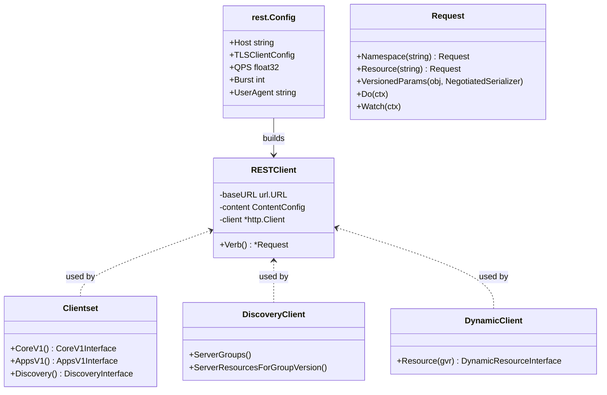
  </div>
</div>

### 12.2 Informer/Reflector/Store/Processor/Workqueue 关系

```mermaid
classDiagram
  class SharedInformerFactory {
    +Start()
    +InformerFor(obj, newFunc)
  }
  class SharedIndexInformer {
    +AddEventHandler(h)
    +Run(stopCh)
    -controller *controller
    -indexer Indexer
    -processor *sharedProcessor
  }
  class controller {
    +Run(stopCh)
    -config Config{ListerWatcher, Queue}
  }
  class Reflector {
    +ListAndWatch(stopCh)
  }
  class DeltaFIFO {
    +Add/Update/Delete/Replace
    +Pop(process)
  }
  class Indexer {
    +Add/Update/Delete
    +ByIndex()
  }
  class sharedProcessor {
    +addListener(l)
    +distribute()
  }
  class ResourceEventHandler {
    +OnAdd()
    +OnUpdate()
    +OnDelete()
  }
  class Workqueue~RateLimiting~ {
    +Add/AddAfter/AddRateLimited
    +Get/Done/Forget
  }
  SharedInformerFactory --> SharedIndexInformer : creates
  SharedIndexInformer --> controller : owns
  controller --> Reflector : uses
  controller --> DeltaFIFO : uses
  SharedIndexInformer --> Indexer : owns
  SharedIndexInformer --> sharedProcessor : owns
  sharedProcessor --> ResourceEventHandler : notifies
  ResourceEventHandler --> Workqueue : enqueues
```
  </div>
</div>

### 12.3 序列化与编解码关系

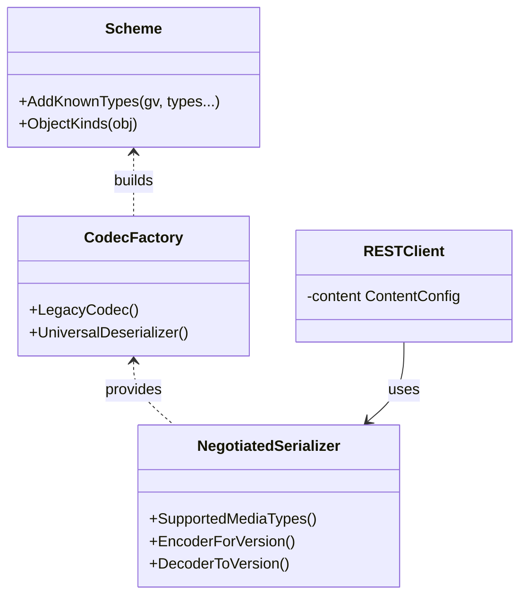
  </div>
</div>

---

## 13. 时序图：从 List/Watch 到回调

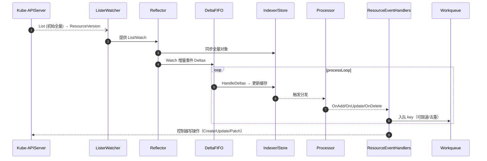
  </div>
</div>

---

## 13. 关键路径函数与调用链

### 13.1 Client 初始化链

1) `kubernetes.NewForConfig(cfg)`
→ `rest.HTTPClientFor(cfg)`
→ `transport.New(config)` 包装认证/TLS/限速
→ `rest.RESTClientFor(cfg)`
→ `Clientset` 填充各 group 版本接口。

2) `corev1.NewForConfigAndClient(cfg, httpClient)`
→ `rest.NewRESTClient(baseURL, negotiatedSerializer, httpClient)`
→ 生成 `PodsGetter` 等 typed client。

### 13.2 Informer 启动链

`SharedInformerFactory.Start(stopCh)`
→ 每个 `SharedIndexInformer.Run(stopCh)`
→ 内部 `controller.Run(stopCh)`
→ `Reflector.ListAndWatch(stopCh)`
→ `DeltaFIFO` 入队 → `processLoop.Pop()`
→ `HandleDeltas` 更新 `Indexer` 并分发到 `Processor`。

### 13.3 Reflector/Watch 复连与 RV 语义

- 记录并携带 `resourceVersion`；遇到 `Expired`/`Gone` 或压缩触发 `Relist`。
- 处理 `Bookmark` 以推进进度并降低压力。

### 13.4 Workqueue 重试链

`AddRateLimited(key)` → `Get()` → 处理错误时 `AddRateLimited(key)`/`Forget(key)`/`NumRequeues(key)` 控制退避重试。

---

### 13.5 Request.Do/Into 调用链

功能：构造并发送 HTTP 请求，按协商的序列化器把响应解码进对象或返回原始 `rest.Result`。

调用链：`RESTClient.Verb()` → `Request` 链式配置（`Namespace/Resource/...`）→ `Request.Do(ctx)` → `transformResponse` → `Into(obj)`。

```go
// 伪代码：关键步骤抽取
func (r *Request) Do(ctx context.Context) *Result {
    req, err := r.newHTTPRequest(ctx)        // URL、Headers、Body、超时、ctx
    if err != nil { return newErrResult(err) }
    resp, err := r.client.Do(req)            // http.Client 发送
    if err != nil { return newErrResult(err) }
    return r.transformResponse(resp, err)    // 返回 *Result（延后解码）
}

func (res *Result) Into(obj runtime.Object) error {
    if err := res.Error(); err != nil { return err }
    data, ct := res.body, res.contentType    // 读取响应体与 Content-Type
    // 基于 NegotiatedSerializer 选择解码器
    decoder := res.serializer.DecoderToVersion(res.decoder, res.gvk.GroupVersion())
    return runtime.DecodeInto(decoder, data, obj)
}
```

要点：
- 分离“发送请求”和“解码结果”以支持 `Raw()`、`Stream()`、`Watch()` 等多模式；
- 通过 `NegotiatedSerializer` 与 GVK 协商解码；错误优先返回。

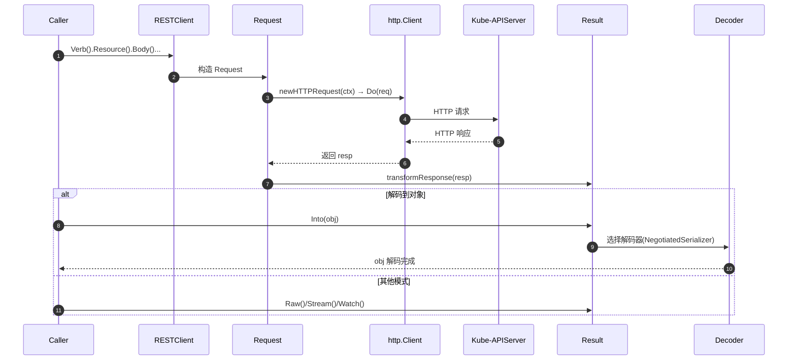
  </div>
</div>

---

### 13.6 Reflector.ListAndWatch 核心逻辑

功能：以 `List` 获取全量对象并同步到 `Store`，随后 `Watch` 增量事件推入 `DeltaFIFO`，根据错误与事件进行重试与 relist。

调用链：`Run()` → `ListAndWatch(stopCh)` → `list()` 同步 → `watchHandler()` 处理事件。

```go
// 伪代码：结构化主干
func (r *Reflector) ListAndWatch(stopCh <-chan struct{}) error {
    // 1) 初次或周期 List，拿到 ResourceVersion
    list, rv, err := r.listerWatcher.List(options)
    if err != nil { return err }
    r.store.Replace(list, rv)                 // 同步本地缓存

    // 2) 持续 Watch 增量，处理 Bookmark/Expired
    for {
        w, err := r.listerWatcher.Watch(rv)
        if err != nil { /* 退避后重试 */ continue }
        err = r.watchHandler(w, rv)
        if isExpired(err) { /* 触发 relist */ return nil }
    }
}
```

要点：
- 维护 `resourceVersion`，处理 `Bookmark` 推进进度；
- `Expired`/压缩触发 relist；错误采用退避策略。

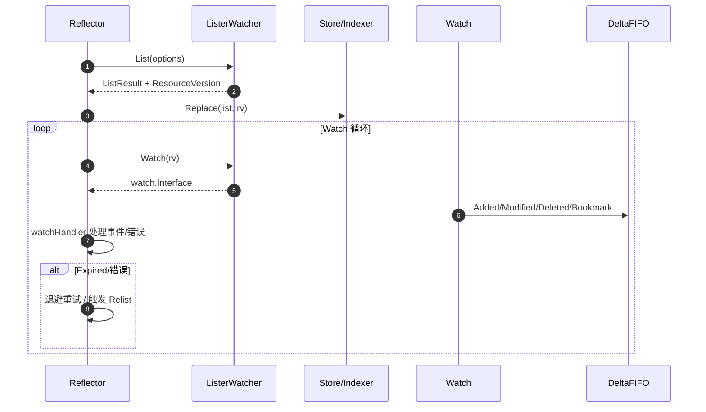
  </div>
</div>

---

### 13.7 controller.processLoop/HandleDeltas

功能：从 `DeltaFIFO` 弹出条目，调用 `HandleDeltas` 将变更应用到 `Indexer`，并触发 `Processor` 分发回调。

调用链：`controller.Run()` → `processLoop()` → `Queue.Pop(PopProcessFunc(handleDeltas))`。

```go
func (c *controller) processLoop() {
    for {
        obj, err := c.config.Queue.Pop(PopProcessFunc(c.handleDeltas))
        if err != nil { return }
        _ = obj // PopProcessFunc 内已处理
    }
}

func (c *controller) handleDeltas(obj interface{}) error {
    // 依序应用 Added/Updated/Deleted/Sync 到 Indexer
    // 然后通过 sharedProcessor 分发 OnAdd/OnUpdate/OnDelete
    return nil
}
```

要点：
- `PopProcessFunc` 保证处理与队列同步；
- 分发与缓存更新解耦，避免阻塞链路。

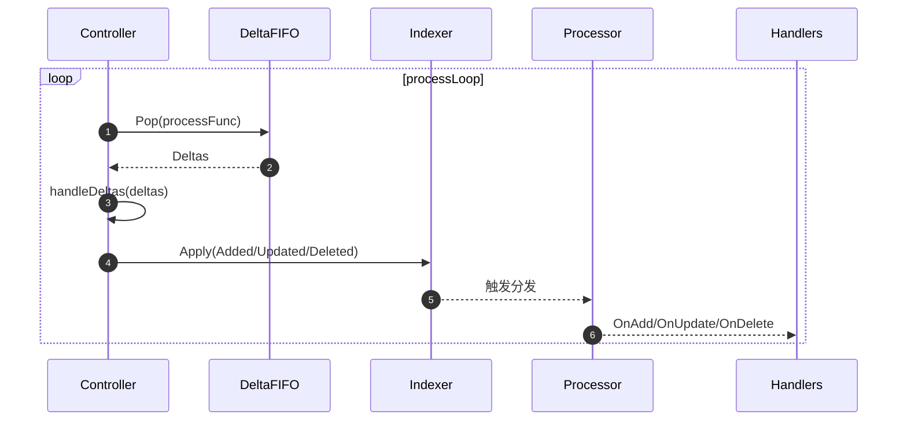
  </div>
</div>

---

### 13.8 SharedIndexInformer.Run/Processor

功能：启动内部 `controller`、等待缓存同步、在 `processor` 上广播事件到所有监听器。

调用链：`SharedIndexInformer.Run(stopCh)` → `controller.Run(stopCh)` → `WaitForCacheSync()` → `processor.run()`。

```go
func (s *sharedIndexInformer) Run(stopCh <-chan struct{}) {
    go s.controller.Run(stopCh)
    if !cache.WaitForCacheSync(stopCh, s.HasSynced) { return }
    go s.processor.run() // 分发事件到 listeners
}
```

要点：
- 先缓存同步再分发，保证下游观察到一致状态；
- 多 listener 互不阻塞。

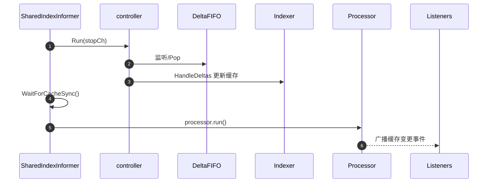
  </div>
</div>

---

### 13.9 Workqueue worker 模式

功能：从队列获取 key，执行业务处理，出错按次数退避重试，成功则 `Forget` 并 `Done`。

调用链：`runWorker()` → `processNextWorkItem()` → `syncHandler(key)`。

```go
func (c *Controller) runWorker() {
    for c.processNextWorkItem() {}
}

func (c *Controller) processNextWorkItem() bool {
    key, shutdown := c.queue.Get()
    if shutdown { return false }
    defer c.queue.Done(key)
    if err := c.syncHandler(key.(string)); err != nil {
        c.queue.AddRateLimited(key) // 退避
        return true
    }
    c.queue.Forget(key)
    return true
}
```

要点：
- `RateLimitingInterface` 提供退避策略；
- `Done/Forget` 正确配对，避免队列泄漏。

```mermaid
sequenceDiagram
  autonumber
  participant W as Worker
  participant Q as RateLimitingQueue
  participant Sync as syncHandler

  loop runWorker
    W->>Q: Get()
    Q-->>W: key
    W->>Sync: syncHandler(key)
    alt 失败
      W->>Q: AddRateLimited(key)
    else 成功
      W->>Q: Forget(key); Done(key)
    end
  end
```
  </div>
</div>

---

### 13.10 DynamicClient Resource 调用链

功能：以 `GroupVersionResource` 动态访问任意资源；命名空间与资源名在运行期确定。

调用链：`dynamicClient.Resource(gvr)` → `Namespace(ns)` → `Get/List/Create/Watch`。

```go
// 伪代码：接口概览
type DynamicResourceInterface interface {
    Namespace(string) NamespaceableResourceInterface
}

type ResourceInterface interface {
    Get(ctx, name string, opts metav1.GetOptions) (*unstructured.Unstructured, error)
    List(ctx context.Context, opts metav1.ListOptions) (*unstructured.UnstructuredList, error)
    Watch(ctx context.Context, opts metav1.ListOptions) (watch.Interface, error)
}
```

要点：
- 返回 `unstructured.Unstructured`，避免编译期类型耦合；
- 适合通用控制器、插件与聚合层。

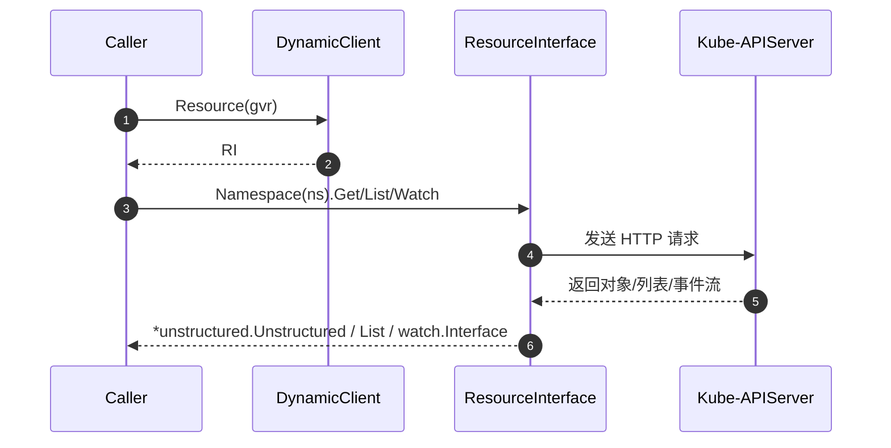
  </div>
</div>

---
## 14. 性能与可观测性要点

- 连接复用：`SharedInformerFactory` 降低 List/Watch 风暴；合理设置 `resyncPeriod`（非强一致）；
- 本地读：`Lister` 提升读性能，避免热点；
- 指标/日志：`workqueue_depth`, `workqueue_work_duration_seconds`, `reflector_list_duration_seconds`, `watch_events_total`；
- Trace：为序列化、网络、反序列化与回调耗时加埋点；
- 退避与限速：通过 `QPS/Burst` 与 `RateLimitingQueue` 控抖。

---

## 15. 小结

- REST/Typed Client 提供稳定的资源编解码与传输栈；
- Informer 以 `Reflector → DeltaFIFO → Indexer → Processor` 构成可靠的事件链路；
- Dynamic/Discovery 与序列化系统确保扩展性与向后兼容；
- 工作队列与回调模式简化控制器编排，兼顾吞吐、正确性与可观测性。

---

## 16. 关键函数汇总（核心代码/说明/调用链）

### 16.1 Reflector.ListAndWatch（核心代码与说明）

```go
// 文件：staging/src/k8s.io/client-go/tools/cache/reflector.go
// 作用：以 List 同步全量缓存，记录 ResourceVersion，随后基于 Watch 增量追踪，
// 遇到错误/过期按退避和压缩语义进行重连或 relist。
func (r *Reflector) ListAndWatch(stopCh <-chan struct{}) error {
    // 1) 初次 List：拿到列表与 RV，将对象同步进 Store（Replace）
    options := metav1.ListOptions{ResourceVersion: r.relistResourceVersion}
    list, err := r.listerWatcher.List(options)
    if err != nil { return err }

    resourceVersion := r.store.Replace(listItems(list), resourceVersionFrom(list))

    // 2) 主循环：自 RV 开始 Watch 增量事件
    for {
        // 可配置是否启用 Bookmark，以降低重放与 CPU 使用
        w, err := r.listerWatcher.Watch(metav1.ListOptions{ResourceVersion: resourceVersion, AllowWatchBookmarks: true})
        if err != nil { // 退避重试
            if utilwait.IsStopped(stopCh) { return nil }
            time.Sleep(r.backoff.Step())
            continue
        }

        // 3) 处理事件直到 watch 结束或错误
        err = r.watchHandler(w, &resourceVersion, stopCh)
        if err == errorResourceExpired { // GONE/Expired：触发 relist
            return nil // 交由上层重新进入 List
        }
        if err != nil { // 其他错误：退避并继续下一轮
            if utilwait.IsStopped(stopCh) { return nil }
            time.Sleep(r.backoff.Step())
            continue
        }
    }
}
```

- 功能说明：保证缓存与服务端一致；处理 Bookmark/Expired/压缩；在错误情况下退避重连。
- 调用链：
  - `SharedIndexInformer.Run()` → `controller.Run()` → `Reflector.ListAndWatch()` → `watchHandler()` → `DeltaFIFO.Add/Update/Delete`

### 16.2 DeltaFIFO.Pop 与 HandleDeltas（核心代码与说明）

```go
// 文件：staging/src/k8s.io/client-go/tools/cache/delta_fifo.go
// 作用：从队列取出一组同 key 的增量（Added/Updated/Deleted/Sync），
// 交由回调按序应用到本地 Indexer 并触发分发。
func (f *DeltaFIFO) Pop(process PopProcessFunc) (interface{}, error) {
    f.lock.Lock()
    for len(f.queue) == 0 {
        // 支持关闭与取消
        if f.closed { f.lock.Unlock(); return nil, ErrClosed }
        f.cond.Wait()
    }
    // 取队头 key 与其对应的 deltas
    key := f.queue[0]
    f.queue = f.queue[1:]
    deltas := f.items[key]
    delete(f.items, key)
    f.lock.Unlock()

    // 交由回调处理；若返回错误，按需重排或丢弃
    err := process(deltas)
    return deltas, err
}

// 文件：staging/src/k8s.io/client-go/tools/cache/controller.go
// 作用：逐条处理 Delta 列表，将其应用到 Indexer 并分发事件。
func (c *controller) handleDeltas(obj interface{}) error {
    for _, d := range obj.(Deltas) {
        switch d.Type {
        case Added, Sync:
            c.config.CacheMutationDetector.AddObject(d.Object)
            c.config.Indexer.Add(d.Object)
            c.config.Processors.distribute(Add, d.Object)
        case Updated:
            c.config.Indexer.Update(d.Object)
            c.config.Processors.distribute(Update, d.Object)
        case Deleted:
            c.config.Indexer.Delete(d.Object)
            c.config.Processors.distribute(Delete, d.Object)
        }
    }
    return nil
}
```

- 功能说明：Pop 提供“批量同 key 的增量”，`handleDeltas` 将增量应用至缓存并分发回调。
- 调用链：
  - `controller.processLoop()` → `DeltaFIFO.Pop(handleDeltas)` → `handleDeltas()` → `Indexer` + `sharedProcessor.distribute()`

### 16.3 sharedIndexInformer 与 sharedProcessor（核心代码与说明）

```go
// 文件：staging/src/k8s.io/client-go/tools/cache/shared_informer.go
// 作用：Informer 启动后先等待缓存同步，再启动分发器。
func (s *sharedIndexInformer) Run(stopCh <-chan struct{}) {
    go s.controller.Run(stopCh)
    if !cache.WaitForCacheSync(stopCh, s.HasSynced) { return }
    go s.processor.run(stopCh)
}

// 文件：staging/src/k8s.io/client-go/tools/cache/shared_informer.go
// 作用：为每个 listener 维护独立缓冲，避免慢 listener 拖慢全局。
func (p *sharedProcessor) run(stopCh <-chan struct{}) {
    for _, l := range p.listeners {
        go l.run() // 每个 listener 独立 goroutine
    }
    <-stopCh
}
```

- 功能说明：保证“先同步、后分发”；分发器以多 listener 并行，互不阻塞。
- 调用链：
  - `SharedInformerFactory.Start()` → `SharedIndexInformer.Run()` → `controller.Run()` → `DeltaFIFO.Pop()` → `processor.run()` → listeners callbacks

### 16.4 RESTClient.transformResponse/Into（核心代码与说明）

```go
// 文件：staging/src/k8s.io/client-go/rest/request.go
// 作用：把 http.Response 变换为 Result，延后进行编解码或流式处理。
func (r *Request) transformResponse(resp *http.Response, err error) *Result {
    if err != nil { return newErrResult(err) }
    data, readErr := io.ReadAll(resp.Body)
    _ = resp.Body.Close()
    if readErr != nil { return newErrResult(readErr) }
    return &Result{
        body:        data,
        contentType: resp.Header.Get("Content-Type"),
        statusCode:  resp.StatusCode,
        // 持有 negotiated serializer 等用于后续 Into/Stream/Watch
        // serializer: r.serializers,
    }
}

// 作用：基于协商的序列化器将响应体解码进目标对象。
func (res *Result) Into(obj runtime.Object) error {
    if err := res.Error(); err != nil { return err }
    decoder := res.serializer.DecoderToVersion(res.decoder, groupVersionOf(obj))
    return runtime.DecodeInto(decoder, res.body, obj)
}
```

- 功能说明：解耦“发送请求/收响应”与“解码/流模式”，支持 Raw/Stream/Watch 等多形态。
- 调用链：
  - `RESTClient.Verb().Resource()...Do(ctx)` → `transformResponse()` → `Into(obj)`

### 16.5 ListerWatcher 接口（核心代码与说明）

```go
// 文件：staging/src/k8s.io/client-go/tools/cache/listwatch.go
// 作用：为 Reflector 抽象 List 与 Watch 的构造，隐藏具体资源/客户端细节。
type ListerWatcher interface {
    List(options metav1.ListOptions) (runtime.Object, error)
    Watch(options metav1.ListOptions) (watch.Interface, error)
}
```

- 功能说明：把访问 apiserver 的 List/Watch 封装为统一接口，便于复用与测试。
- 调用链：
  - `Reflector.ListAndWatch()` → `ListerWatcher.List()/Watch()`

