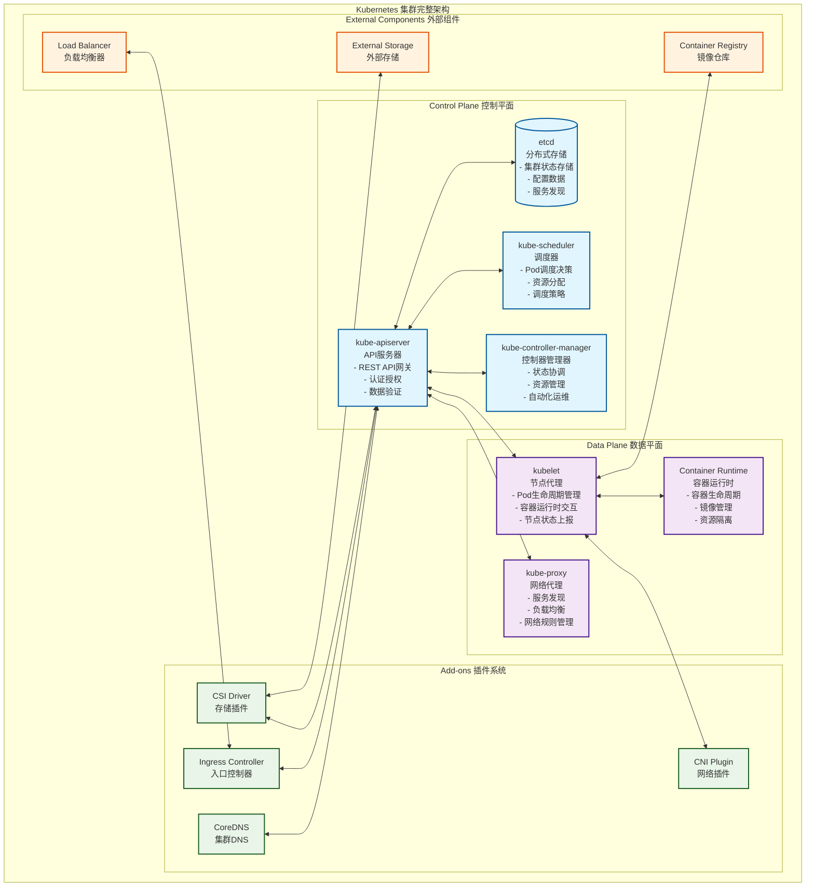
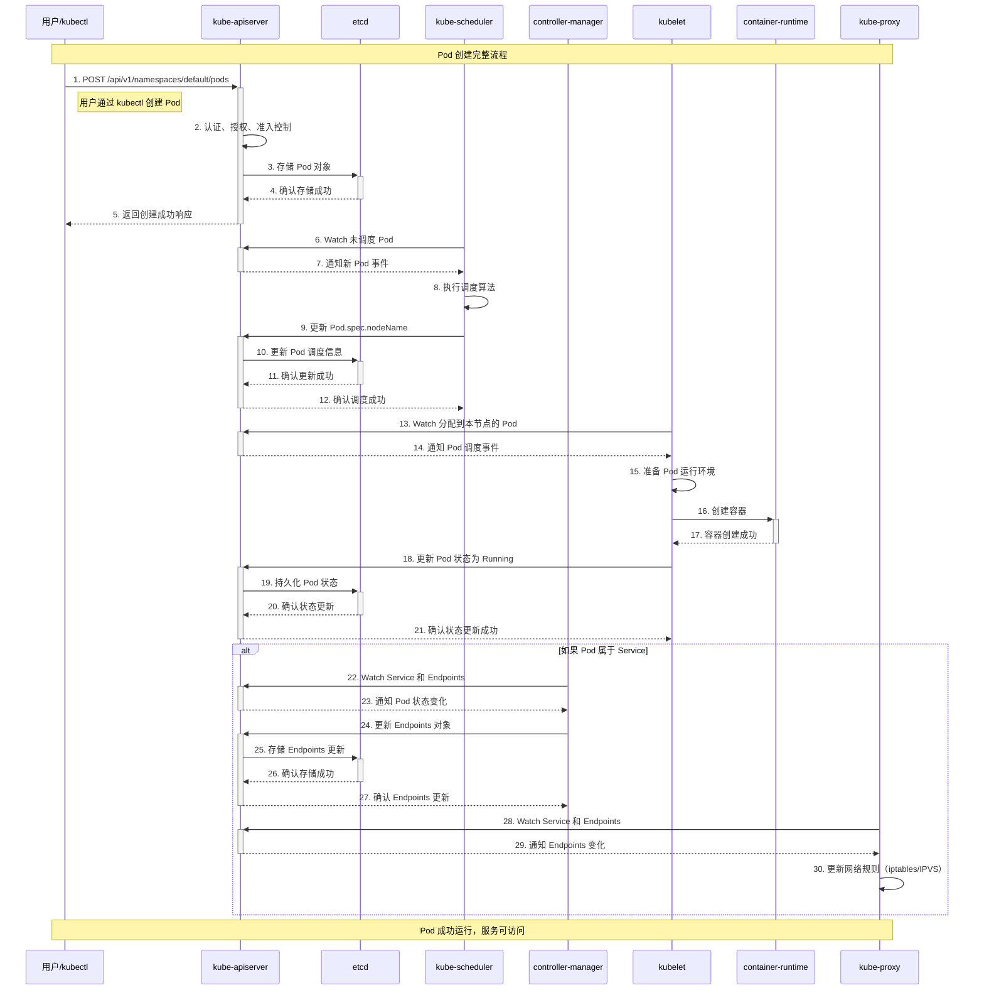
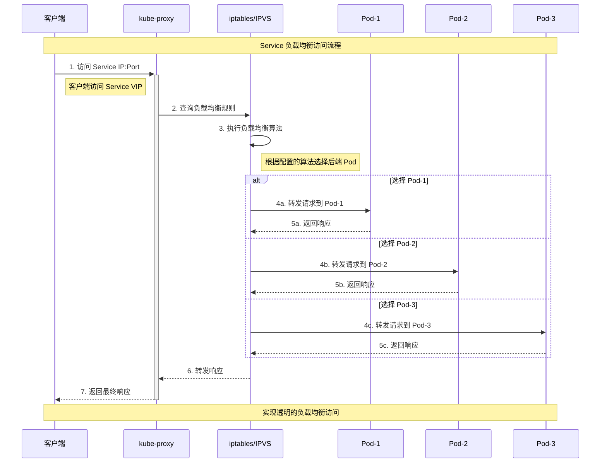
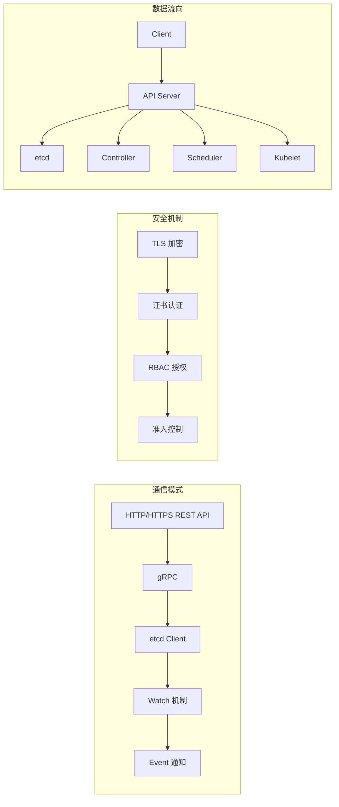
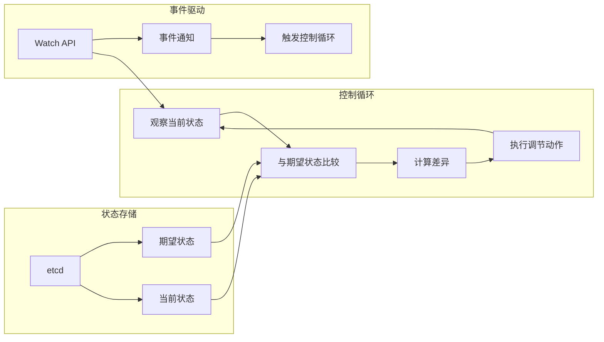

# Kubernetes 架构与源码完整剖析

## 📚 文档概述

本文档深入分析 Kubernetes 的整体架构设计和核心组件源码实现，通过详细的架构图、时序图和源码分析，帮助读者全面理解 Kubernetes 的工作原理和设计思想。

## 🏗️ Kubernetes 整体架构

### 1.1 集群架构概览

Kubernetes 采用主从架构模式，由控制平面（Control Plane）和数据平面（Data Plane）组成：



### 1.2 组件职责详解

#### 控制平面组件

**kube-apiserver（API服务器）**
- **核心功能**：作为集群的统一入口，提供 RESTful API 接口
- **主要职责**：
  - 处理所有 REST API 请求（CRUD 操作）
  - 执行认证、授权和准入控制
  - 数据验证和序列化/反序列化
  - 与 etcd 交互，持久化集群状态
  - 提供 Watch 机制，支持事件通知

**etcd（分布式存储）**
- **核心功能**：分布式键值存储，保存集群的所有数据
- **主要职责**：
  - 存储集群配置信息和状态数据
  - 提供强一致性保证
  - 支持 Watch 机制，实现事件通知
  - 提供分布式锁和选主功能

**kube-scheduler（调度器）**
- **核心功能**：负责 Pod 的调度决策
- **主要职责**：
  - 监听未调度的 Pod
  - 根据调度策略选择最适合的节点
  - 考虑资源需求、约束条件和策略
  - 将调度决策写入 API Server

**kube-controller-manager（控制器管理器）**
- **核心功能**：运行各种控制器，实现声明式管理
- **主要职责**：
  - 监控集群状态变化
  - 执行控制循环，确保期望状态与实际状态一致
  - 管理各种资源的生命周期
  - 处理节点故障和自动恢复

#### 数据平面组件

**kubelet（节点代理）**
- **核心功能**：每个节点上的主要代理，管理 Pod 和容器
- **主要职责**：
  - 管理 Pod 的生命周期
  - 与容器运行时交互
  - 监控节点和 Pod 状态
  - 执行健康检查和资源监控

**kube-proxy（网络代理）**
- **核心功能**：实现 Service 的网络代理和负载均衡
- **主要职责**：
  - 维护网络规则（iptables/IPVS）
  - 实现服务发现和负载均衡
  - 处理集群内部网络通信
  - 支持多种代理模式

### 1.3 核心工作流程

#### Pod 创建完整时序图



#### Service 访问流程图



## 🔧 核心组件源码入口分析

### 2.1 组件启动入口

所有核心组件都遵循相似的启动模式：

```go
// 通用启动模式（以 kube-apiserver 为例）
func main() {
    // 1. 创建命令对象
    command := app.NewAPIServerCommand()
    
    // 2. 执行命令
    code := cli.Run(command)
    
    // 3. 退出程序
    os.Exit(code)
}
```

#### kube-apiserver 启动入口

```go
// cmd/kube-apiserver/apiserver.go
/*
APIServer 是集群的主要 API 服务器和主控节点。
它负责提供集群管理 API 服务。

主要功能：
1. 提供 RESTful API 接口
2. 执行认证、授权和准入控制
3. 数据验证和持久化
4. 事件通知和 Watch 机制
*/
package main

import (
    "os"
    _ "time/tzdata" // 为 CronJob 提供时区支持

    "k8s.io/component-base/cli"
    _ "k8s.io/component-base/logs/json/register"          // JSON 日志格式注册
    _ "k8s.io/component-base/metrics/prometheus/clientgo" // Prometheus 客户端指标
    _ "k8s.io/component-base/metrics/prometheus/version"  // 版本指标注册
    "k8s.io/kubernetes/cmd/kube-apiserver/app"
)

func main() {
    // 创建 API Server 命令对象，包含所有配置选项和启动逻辑
    command := app.NewAPIServerCommand()
    
    // 执行命令，启动 API Server
    code := cli.Run(command)
    
    // 根据执行结果退出程序
    os.Exit(code)
}
```

#### kube-controller-manager 启动入口

```go
// cmd/kube-controller-manager/controller-manager.go
/*
控制器管理器负责监控复制控制器，并创建相应的 Pod 来达到期望状态。
它使用 API 来监听新的控制器并创建/删除 Pod。

主要功能：
1. 运行各种内置控制器
2. 监控集群状态变化
3. 执行状态协调逻辑
4. 处理资源生命周期管理
*/
package main

import (
    "os"
    _ "time/tzdata" // 为 CronJob 时区支持

    "k8s.io/component-base/cli"
    _ "k8s.io/component-base/logs/json/register"          // JSON 日志格式注册
    _ "k8s.io/component-base/metrics/prometheus/clientgo" // Prometheus 客户端插件
    _ "k8s.io/component-base/metrics/prometheus/version"  // 版本指标注册
    "k8s.io/kubernetes/cmd/kube-controller-manager/app"
)

func main() {
    // 创建控制器管理器命令对象
    command := app.NewControllerManagerCommand()
    
    // 执行命令，启动所有控制器
    code := cli.Run(command)
    
    // 退出程序
    os.Exit(code)
}
```

#### kube-scheduler 启动入口

```go
// cmd/kube-scheduler/scheduler.go
/*
调度器负责将 Pod 调度到合适的节点上。

主要功能：
1. 监听未调度的 Pod
2. 执行调度算法和策略
3. 选择最优节点
4. 更新 Pod 的调度信息
*/
package main

import (
    "os"

    "k8s.io/component-base/cli"
    _ "k8s.io/component-base/logs/json/register" // JSON 日志格式注册
    _ "k8s.io/component-base/metrics/prometheus/clientgo"
    _ "k8s.io/component-base/metrics/prometheus/version" // 版本指标注册
    "k8s.io/kubernetes/cmd/kube-scheduler/app"
)

func main() {
    // 创建调度器命令对象
    command := app.NewSchedulerCommand()
    
    // 执行调度器
    code := cli.Run(command)
    
    // 退出程序
    os.Exit(code)
}
```

#### kubelet 启动入口

```go
// cmd/kubelet/kubelet.go
/*
kubelet 二进制文件负责维护特定主机 VM 上的一组容器。
它从配置文件和 etcd 服务器的法定人数同步数据。
然后与容器运行时（或运行时的 CRI shim）通信以查看当前运行的内容。
它通过启动或停止容器来同步配置数据与正在运行的容器集。

主要功能：
1. Pod 生命周期管理
2. 容器运行时交互
3. 节点状态监控和上报
4. 资源管理和健康检查
*/
package main

import (
    "context"
    "os"

    "k8s.io/component-base/cli"
    _ "k8s.io/component-base/logs/json/register"          // JSON 日志格式注册
    _ "k8s.io/component-base/metrics/prometheus/clientgo" // 客户端指标注册
    _ "k8s.io/component-base/metrics/prometheus/version"  // 版本指标注册
    "k8s.io/kubernetes/cmd/kubelet/app"
)

func main() {
    // 创建 kubelet 命令对象，传入上下文
    command := app.NewKubeletCommand(context.Background())
    
    // 执行 kubelet
    code := cli.Run(command)
    
    // 退出程序
    os.Exit(code)
}
```

#### kube-proxy 启动入口

```go
// cmd/kube-proxy/proxy.go
/*
kube-proxy 实现 Kubernetes Service 的网络代理功能。

主要功能：
1. 维护网络规则（iptables/IPVS）
2. 实现服务发现和负载均衡
3. 处理集群网络通信
4. 支持多种代理模式
*/
package main

import (
    "os"

    "k8s.io/component-base/cli"
    _ "k8s.io/component-base/logs/json/register"
    _ "k8s.io/component-base/metrics/prometheus/clientgo" // 客户端指标注册
    _ "k8s.io/component-base/metrics/prometheus/version"  // 版本指标注册
    "k8s.io/kubernetes/cmd/kube-proxy/app"
)

func main() {
    // 创建代理命令对象
    command := app.NewProxyCommand()
    
    // 执行代理
    code := cli.Run(command)
    
    // 退出程序
    os.Exit(code)
}
```

### 2.2 组件间通信模式



## 📊 关键数据结构

### 3.1 核心 API 对象

#### Pod 数据结构

```go
// staging/src/k8s.io/api/core/v1/types.go
/*
Pod 是 Kubernetes 中最小的可部署单元，包含一个或多个容器。

核心字段说明：
- TypeMeta: API 版本和类型信息
- ObjectMeta: 对象元数据（名称、命名空间、标签等）
- Spec: 期望状态规范
- Status: 当前实际状态
*/
type Pod struct {
    metav1.TypeMeta   `json:",inline"`
    metav1.ObjectMeta `json:"metadata,omitempty" protobuf:"bytes,1,opt,name=metadata"`
    
    // Spec 定义了 Pod 的期望行为
    Spec PodSpec `json:"spec,omitempty" protobuf:"bytes,2,opt,name=spec"`
    
    // Status 表示 Pod 的当前状态信息
    Status PodStatus `json:"status,omitempty" protobuf:"bytes,3,opt,name=status"`
}

/*
PodSpec 描述了 Pod 的期望状态和行为。

关键字段：
- Containers: 容器列表
- RestartPolicy: 重启策略
- NodeName: 调度到的节点名称
- Volumes: 存储卷定义
*/
type PodSpec struct {
    // 容器列表，至少包含一个容器
    Containers []Container `json:"containers" protobuf:"bytes,2,rep,name=containers"`
    
    // 重启策略：Always、OnFailure、Never
    RestartPolicy RestartPolicy `json:"restartPolicy,omitempty" protobuf:"bytes,3,opt,name=restartPolicy,casttype=RestartPolicy"`
    
    // 调度到的节点名称
    NodeName string `json:"nodeName,omitempty" protobuf:"bytes,10,opt,name=nodeName"`
    
    // 存储卷定义
    Volumes []Volume `json:"volumes,omitempty" patchStrategy:"merge,retainKeys" patchMergeKey:"name" protobuf:"bytes,1,rep,name=volumes"`
    
    // 服务账户名称
    ServiceAccountName string `json:"serviceAccountName,omitempty" protobuf:"bytes,8,opt,name=serviceAccountName"`
}

/*
PodStatus 表示 Pod 的当前状态信息。

状态字段：
- Phase: Pod 生命周期阶段
- Conditions: 状态条件列表
- ContainerStatuses: 容器状态列表
- PodIP: Pod IP 地址
*/
type PodStatus struct {
    // Pod 生命周期阶段：Pending、Running、Succeeded、Failed、Unknown
    Phase PodPhase `json:"phase,omitempty" protobuf:"bytes,1,opt,name=phase,casttype=PodPhase"`
    
    // 状态条件列表
    Conditions []PodCondition `json:"conditions,omitempty" patchStrategy:"merge" patchMergeKey:"type" protobuf:"bytes,2,rep,name=conditions"`
    
    // 容器状态列表
    ContainerStatuses []ContainerStatus `json:"containerStatuses,omitempty" protobuf:"bytes,8,rep,name=containerStatuses"`
    
    // Pod IP 地址
    PodIP string `json:"podIP,omitempty" protobuf:"bytes,6,opt,name=podIP"`
    
    // 启动时间
    StartTime *metav1.Time `json:"startTime,omitempty" protobuf:"bytes,7,opt,name=startTime"`
}
```

#### Service 数据结构

```go
/*
Service 定义了一组 Pod 的逻辑集合和访问策略。

核心功能：
- 服务发现和负载均衡
- 网络抽象和端口映射
- 会话亲和性
*/
type Service struct {
    metav1.TypeMeta   `json:",inline"`
    metav1.ObjectMeta `json:"metadata,omitempty" protobuf:"bytes,1,opt,name=metadata"`
    
    // Spec 定义了服务的期望行为
    Spec ServiceSpec `json:"spec,omitempty" protobuf:"bytes,2,opt,name=spec"`
    
    // Status 表示服务的当前状态
    Status ServiceStatus `json:"status,omitempty" protobuf:"bytes,3,opt,name=status"`
}

/*
ServiceSpec 描述了服务的期望状态。

关键配置：
- Selector: Pod 选择器
- Ports: 端口映射
- Type: 服务类型
- ClusterIP: 集群内部 IP
*/
type ServiceSpec struct {
    // Pod 选择器，用于确定服务后端
    Selector map[string]string `json:"selector,omitempty" protobuf:"bytes,1,rep,name=selector"`
    
    // 端口映射列表
    Ports []ServicePort `json:"ports,omitempty" patchStrategy:"merge" patchMergeKey:"port" protobuf:"bytes,1,rep,name=ports"`
    
    // 服务类型：ClusterIP、NodePort、LoadBalancer、ExternalName
    Type ServiceType `json:"type,omitempty" protobuf:"bytes,4,opt,name=type,casttype=ServiceType"`
    
    // 集群内部 IP 地址
    ClusterIP string `json:"clusterIP,omitempty" protobuf:"bytes,3,opt,name=clusterIP"`
    
    // 会话亲和性：None、ClientIP
    SessionAffinity ServiceAffinity `json:"sessionAffinity,omitempty" protobuf:"bytes,7,opt,name=sessionAffinity,casttype=ServiceAffinity"`
}
```

### 3.2 核心数据结构 UML 图

```mermaid
classDiagram
    class Pod {
        +TypeMeta
        +ObjectMeta
        +PodSpec spec
        +PodStatus status
        +GetName() string
        +GetNamespace() string
        +GetLabels() map[string]string
    }
    
    class PodSpec {
        +[]Container containers
        +RestartPolicy restartPolicy
        +string nodeName
        +[]Volume volumes
        +string serviceAccountName
        +int64 terminationGracePeriodSeconds
    }
    
    class PodStatus {
        +PodPhase phase
        +[]PodCondition conditions
        +[]ContainerStatus containerStatuses
        +string podIP
        +Time startTime
        +string qosClass
    }
    
    class Container {
        +string name
        +string image
        +[]string command
        +[]string args
        +[]EnvVar env
        +ResourceRequirements resources
        +[]VolumeMount volumeMounts
    }
    
    class Service {
        +TypeMeta
        +ObjectMeta
        +ServiceSpec spec
        +ServiceStatus status
    }
    
    class ServiceSpec {
        +map[string]string selector
        +[]ServicePort ports
        +ServiceType type
        +string clusterIP
        +ServiceAffinity sessionAffinity
    }
    
    class Node {
        +TypeMeta
        +ObjectMeta
        +NodeSpec spec
        +NodeStatus status
    }
    
    class NodeStatus {
        +[]NodeCondition conditions
        +NodeSystemInfo nodeInfo
        +ResourceList capacity
        +ResourceList allocatable
        +[]ContainerImage images
    }
    
    Pod ||--|| PodSpec : contains
    Pod ||--|| PodStatus : contains
    PodSpec ||--o{ Container : contains
    Service ||--|| ServiceSpec : contains
    Node ||--|| NodeStatus : contains
    
    Pod --> Node : scheduled on
    Service --> Pod : selects
```

## 🔄 控制循环模式

### 4.1 控制器模式原理

Kubernetes 采用控制器模式实现声明式管理：



### 4.2 典型控制器实现

```go
/*
通用控制器接口定义
所有控制器都实现此接口，提供统一的控制循环机制
*/
type Controller interface {
    // Run 启动控制器，直到 stopCh 关闭
    Run(workers int, stopCh <-chan struct{})
    
    // HasSynced 返回控制器是否已完成初始同步
    HasSynced() bool
}

/*
控制器基础结构
包含工作队列、事件处理器和同步逻辑
*/
type BaseController struct {
    // 工作队列，存储待处理的对象键
    queue workqueue.RateLimitingInterface
    
    // 对象索引器，提供本地缓存
    indexer cache.Indexer
    
    // 事件通知器，监听 API 变化
    informer cache.Controller
    
    // 同步处理函数
    syncHandler func(key string) error
}

/*
控制器运行逻辑
实现标准的控制循环模式
*/
func (c *BaseController) Run(workers int, stopCh <-chan struct{}) {
    defer utilruntime.HandleCrash()
    defer c.queue.ShutDown()
    
    klog.Info("启动控制器")
    
    // 启动 informer，开始监听 API 变化
    go c.informer.Run(stopCh)
    
    // 等待缓存同步完成
    if !cache.WaitForCacheSync(stopCh, c.informer.HasSynced) {
        utilruntime.HandleError(fmt.Errorf("等待缓存同步超时"))
        return
    }
    
    // 启动工作协程
    for i := 0; i < workers; i++ {
        go wait.Until(c.runWorker, time.Second, stopCh)
    }
    
    klog.Info("控制器已启动")
    <-stopCh
    klog.Info("控制器正在关闭")
}

/*
工作协程逻辑
从队列中获取任务并处理
*/
func (c *BaseController) runWorker() {
    for c.processNextWorkItem() {
    }
}

func (c *BaseController) processNextWorkItem() bool {
    // 从队列获取下一个工作项
    obj, shutdown := c.queue.Get()
    if shutdown {
        return false
    }
    
    defer c.queue.Done(obj)
    
    var key string
    var ok bool
    
    if key, ok = obj.(string); !ok {
        c.queue.Forget(obj)
        utilruntime.HandleError(fmt.Errorf("期望字符串类型，得到 %#v", obj))
        return true
    }
    
    // 执行同步逻辑
    if err := c.syncHandler(key); err != nil {
        // 处理失败，重新入队
        c.queue.AddRateLimited(key)
        utilruntime.HandleError(fmt.Errorf("同步 '%s' 失败: %v", key, err))
        return true
    }
    
    // 处理成功，从队列中移除
    c.queue.Forget(obj)
    klog.Infof("成功同步 '%s'", key)
    return true
}
```

## 🚀 性能优化策略

### 5.1 API Server 优化

```yaml
# API Server 性能优化配置
apiVersion: v1
kind: Pod
metadata:
  name: kube-apiserver
spec:
  containers:
  - name: kube-apiserver
    image: k8s.gcr.io/kube-apiserver:v1.29.0
    command:
    - kube-apiserver
    # 连接池优化
    - --max-requests-inflight=400          # 并发请求限制
    - --max-mutating-requests-inflight=200 # 变更请求限制
    
    # etcd 连接优化
    - --etcd-servers-overrides=/events#https://etcd-events:2379  # 事件存储分离
    - --etcd-compaction-interval=300s      # 压缩间隔
    
    # 缓存优化
    - --default-watch-cache-size=100       # Watch 缓存大小
    - --watch-cache-sizes=pods#1000,nodes#100  # 分类缓存大小
    
    # 认证优化
    - --enable-bootstrap-token-auth=true   # 启用引导令牌
    - --token-auth-file=/etc/tokens.csv    # 令牌文件认证
    
    resources:
      requests:
        cpu: 250m
        memory: 512Mi
      limits:
        cpu: 1000m
        memory: 2Gi
```

### 5.2 etcd 优化

```yaml
# etcd 性能优化配置
apiVersion: v1
kind: Pod
metadata:
  name: etcd
spec:
  containers:
  - name: etcd
    image: k8s.gcr.io/etcd:3.5.9-0
    command:
    - etcd
    # 存储优化
    - --quota-backend-bytes=8589934592     # 8GB 存储限制
    - --auto-compaction-mode=periodic      # 自动压缩模式
    - --auto-compaction-retention=300s     # 压缩保留时间
    
    # 网络优化
    - --heartbeat-interval=100             # 心跳间隔 100ms
    - --election-timeout=1000              # 选举超时 1s
    
    # 快照优化
    - --snapshot-count=10000               # 快照触发阈值
    
    # 日志优化
    - --log-level=warn                     # 日志级别
    
    resources:
      requests:
        cpu: 100m
        memory: 512Mi
      limits:
        cpu: 500m
        memory: 2Gi
    
    volumeMounts:
    - name: etcd-data
      mountPath: /var/lib/etcd
      
  volumes:
  - name: etcd-data
    hostPath:
      path: /var/lib/etcd
      type: DirectoryOrCreate
```

### 5.3 调度器优化

```yaml
# 调度器性能优化配置
apiVersion: kubescheduler.config.k8s.io/v1beta3
kind: KubeSchedulerConfiguration
profiles:
- schedulerName: default-scheduler
  plugins:
    # 启用高效插件
    filter:
      enabled:
      - name: NodeResourcesFit
      - name: NodeAffinity
      - name: PodTopologySpread
    score:
      enabled:
      - name: NodeResourcesFit
      - name: NodeAffinity
      - name: PodTopologySpread
  
  # 调度性能参数
  pluginConfig:
  - name: NodeResourcesFit
    args:
      scoringStrategy:
        type: LeastAllocated  # 最少分配策略
        
# 并发调度配置
parallelism: 16              # 并发调度数量
percentageOfNodesToScore: 50 # 评分节点百分比
```

## 📈 监控和可观测性

### 6.1 关键指标监控

```yaml
# Prometheus 监控配置
apiVersion: v1
kind: ConfigMap
metadata:
  name: prometheus-config
data:
  prometheus.yml: |
    global:
      scrape_interval: 15s
      evaluation_interval: 15s
    
    rule_files:
    - "kubernetes-rules.yml"
    
    scrape_configs:
    # API Server 监控
    - job_name: 'kubernetes-apiservers'
      kubernetes_sd_configs:
      - role: endpoints
        namespaces:
          names:
          - default
      scheme: https
      tls_config:
        ca_file: /var/run/secrets/kubernetes.io/serviceaccount/ca.crt
        insecure_skip_verify: true
      bearer_token_file: /var/run/secrets/kubernetes.io/serviceaccount/token
      relabel_configs:
      - source_labels: [__meta_kubernetes_namespace, __meta_kubernetes_service_name, __meta_kubernetes_endpoint_port_name]
        action: keep
        regex: default;kubernetes;https
      
    # Kubelet 监控
    - job_name: 'kubernetes-nodes'
      kubernetes_sd_configs:
      - role: node
      scheme: https
      tls_config:
        ca_file: /var/run/secrets/kubernetes.io/serviceaccount/ca.crt
        insecure_skip_verify: true
      bearer_token_file: /var/run/secrets/kubernetes.io/serviceaccount/token
      relabel_configs:
      - action: labelmap
        regex: __meta_kubernetes_node_label_(.+)
      
    # Pod 监控
    - job_name: 'kubernetes-pods'
      kubernetes_sd_configs:
      - role: pod
      relabel_configs:
      - source_labels: [__meta_kubernetes_pod_annotation_prometheus_io_scrape]
        action: keep
        regex: true
      - source_labels: [__meta_kubernetes_pod_annotation_prometheus_io_path]
        action: replace
        target_label: __metrics_path__
        regex: (.+)
```

### 6.2 告警规则

```yaml
# Kubernetes 告警规则
apiVersion: v1
kind: ConfigMap
metadata:
  name: kubernetes-rules
data:
  kubernetes-rules.yml: |
    groups:
    - name: kubernetes-system
      rules:
      # API Server 告警
      - alert: KubernetesAPIServerDown
        expr: up{job="kubernetes-apiservers"} == 0
        for: 5m
        labels:
          severity: critical
        annotations:
          summary: "Kubernetes API Server is down"
          description: "API Server has been down for more than 5 minutes"
      
      - alert: KubernetesAPIServerHighLatency
        expr: histogram_quantile(0.99, sum(rate(apiserver_request_duration_seconds_bucket[5m])) by (le)) > 1
        for: 10m
        labels:
          severity: warning
        annotations:
          summary: "Kubernetes API Server high latency"
          description: "API Server 99th percentile latency is {{ $value }} seconds"
      
      # etcd 告警
      - alert: EtcdClusterDown
        expr: up{job="etcd"} == 0
        for: 5m
        labels:
          severity: critical
        annotations:
          summary: "etcd cluster is down"
          description: "etcd cluster has been down for more than 5 minutes"
      
      - alert: EtcdHighLatency
        expr: histogram_quantile(0.99, sum(rate(etcd_disk_wal_fsync_duration_seconds_bucket[5m])) by (le)) > 0.5
        for: 10m
        labels:
          severity: warning
        annotations:
          summary: "etcd high disk latency"
          description: "etcd disk latency is {{ $value }} seconds"
      
      # 节点告警
      - alert: KubernetesNodeNotReady
        expr: kube_node_status_condition{condition="Ready",status="true"} == 0
        for: 5m
        labels:
          severity: warning
        annotations:
          summary: "Kubernetes node not ready"
          description: "Node {{ $labels.node }} has been not ready for more than 5 minutes"
      
      # Pod 告警
      - alert: KubernetesPodCrashLooping
        expr: rate(kube_pod_container_status_restarts_total[15m]) > 0
        for: 5m
        labels:
          severity: warning
        annotations:
          summary: "Kubernetes pod crash looping"
          description: "Pod {{ $labels.namespace }}/{{ $labels.pod }} is crash looping"
```

## 🛡️ 安全最佳实践

### 7.1 RBAC 权限控制

```yaml
# 最小权限原则的 RBAC 配置
---
# 服务账户
apiVersion: v1
kind: ServiceAccount
metadata:
  name: app-service-account
  namespace: default

---
# 角色定义
apiVersion: rbac.authorization.k8s.io/v1
kind: Role
metadata:
  namespace: default
  name: app-role
rules:
# Pod 相关权限
- apiGroups: [""]
  resources: ["pods"]
  verbs: ["get", "list", "watch"]
- apiGroups: [""]
  resources: ["pods/log"]
  verbs: ["get"]
# ConfigMap 权限
- apiGroups: [""]
  resources: ["configmaps"]
  verbs: ["get", "list"]
# Secret 权限（只读）
- apiGroups: [""]
  resources: ["secrets"]
  verbs: ["get"]

---
# 角色绑定
apiVersion: rbac.authorization.k8s.io/v1
kind: RoleBinding
metadata:
  name: app-role-binding
  namespace: default
subjects:
- kind: ServiceAccount
  name: app-service-account
  namespace: default
roleRef:
  kind: Role
  name: app-role
  apiGroup: rbac.authorization.k8s.io

---
# 集群级别角色（谨慎使用）
apiVersion: rbac.authorization.k8s.io/v1
kind: ClusterRole
metadata:
  name: node-reader
rules:
- apiGroups: [""]
  resources: ["nodes"]
  verbs: ["get", "list", "watch"]
- apiGroups: ["metrics.k8s.io"]
  resources: ["nodes", "pods"]
  verbs: ["get", "list"]

---
# 集群角色绑定
apiVersion: rbac.authorization.k8s.io/v1
kind: ClusterRoleBinding
metadata:
  name: node-reader-binding
subjects:
- kind: ServiceAccount
  name: monitoring-service-account
  namespace: kube-system
roleRef:
  kind: ClusterRole
  name: node-reader
  apiGroup: rbac.authorization.k8s.io
```

### 7.2 网络策略

```yaml
# 网络隔离策略
---
# 默认拒绝所有流量
apiVersion: networking.k8s.io/v1
kind: NetworkPolicy
metadata:
  name: default-deny-all
  namespace: production
spec:
  podSelector: {}
  policyTypes:
  - Ingress
  - Egress

---
# 允许特定应用间通信
apiVersion: networking.k8s.io/v1
kind: NetworkPolicy
metadata:
  name: allow-frontend-to-backend
  namespace: production
spec:
  podSelector:
    matchLabels:
      app: backend
  policyTypes:
  - Ingress
  ingress:
  - from:
    - podSelector:
        matchLabels:
          app: frontend
    ports:
    - protocol: TCP
      port: 8080

---
# 允许访问外部服务
apiVersion: networking.k8s.io/v1
kind: NetworkPolicy
metadata:
  name: allow-external-access
  namespace: production
spec:
  podSelector:
    matchLabels:
      app: web-app
  policyTypes:
  - Egress
  egress:
  # 允许 DNS 查询
  - to: []
    ports:
    - protocol: UDP
      port: 53
  # 允许 HTTPS 访问
  - to: []
    ports:
    - protocol: TCP
      port: 443
  # 允许访问特定外部服务
  - to:
    - namespaceSelector:
        matchLabels:
          name: external-services
    ports:
    - protocol: TCP
      port: 80
```

### 7.3 Pod 安全策略

```yaml
# Pod 安全标准配置
apiVersion: v1
kind: Namespace
metadata:
  name: secure-namespace
  labels:
    pod-security.kubernetes.io/enforce: restricted
    pod-security.kubernetes.io/audit: restricted
    pod-security.kubernetes.io/warn: restricted

---
# 安全的 Pod 配置示例
apiVersion: v1
kind: Pod
metadata:
  name: secure-pod
  namespace: secure-namespace
spec:
  serviceAccountName: limited-service-account
  
  # 安全上下文
  securityContext:
    runAsNonRoot: true
    runAsUser: 1000
    runAsGroup: 1000
    fsGroup: 1000
    seccompProfile:
      type: RuntimeDefault
  
  containers:
  - name: app
    image: nginx:1.21-alpine
    
    # 容器安全上下文
    securityContext:
      allowPrivilegeEscalation: false
      readOnlyRootFilesystem: true
      runAsNonRoot: true
      runAsUser: 1000
      capabilities:
        drop:
        - ALL
    
    # 资源限制
    resources:
      requests:
        cpu: 100m
        memory: 128Mi
      limits:
        cpu: 500m
        memory: 512Mi
    
    # 只读根文件系统需要临时目录
    volumeMounts:
    - name: tmp
      mountPath: /tmp
    - name: var-cache-nginx
      mountPath: /var/cache/nginx
    - name: var-run
      mountPath: /var/run
  
  volumes:
  - name: tmp
    emptyDir: {}
  - name: var-cache-nginx
    emptyDir: {}
  - name: var-run
    emptyDir: {}
```

## 📚 总结

Kubernetes 作为现代容器编排平台，其架构设计体现了以下核心理念：

### 设计原则
1. **声明式管理**：用户声明期望状态，系统自动维护
2. **控制器模式**：通过控制循环实现状态协调
3. **API 驱动**：所有操作通过统一的 REST API
4. **插件化架构**：支持扩展和定制化
5. **分布式设计**：高可用和可扩展性

### 核心优势
1. **自动化运维**：自动处理故障恢复和扩缩容
2. **资源抽象**：提供统一的资源管理接口
3. **生态丰富**：庞大的云原生生态系统
4. **标准化**：CNCF 标准，厂商中立
5. **可移植性**：跨云、跨平台部署

### 最佳实践
1. **安全优先**：实施最小权限原则和网络隔离
2. **监控完善**：建立全面的监控和告警体系
3. **资源管理**：合理设置资源请求和限制
4. **高可用设计**：多副本和跨区域部署
5. **持续优化**：定期评估和优化性能

通过深入理解 Kubernetes 的架构设计和源码实现，我们能够更好地运用这个强大的平台，构建稳定、高效、安全的云原生应用系统。

---

**文档版本**: v1.0  
**最后更新**: 2025年09月27日  
**适用版本**: Kubernetes 1.29+
