# Kubernetes 架构与源码完整剖析

---

## 1. 整体架构设计

### 1.1 Kubernetes 集群完整架构

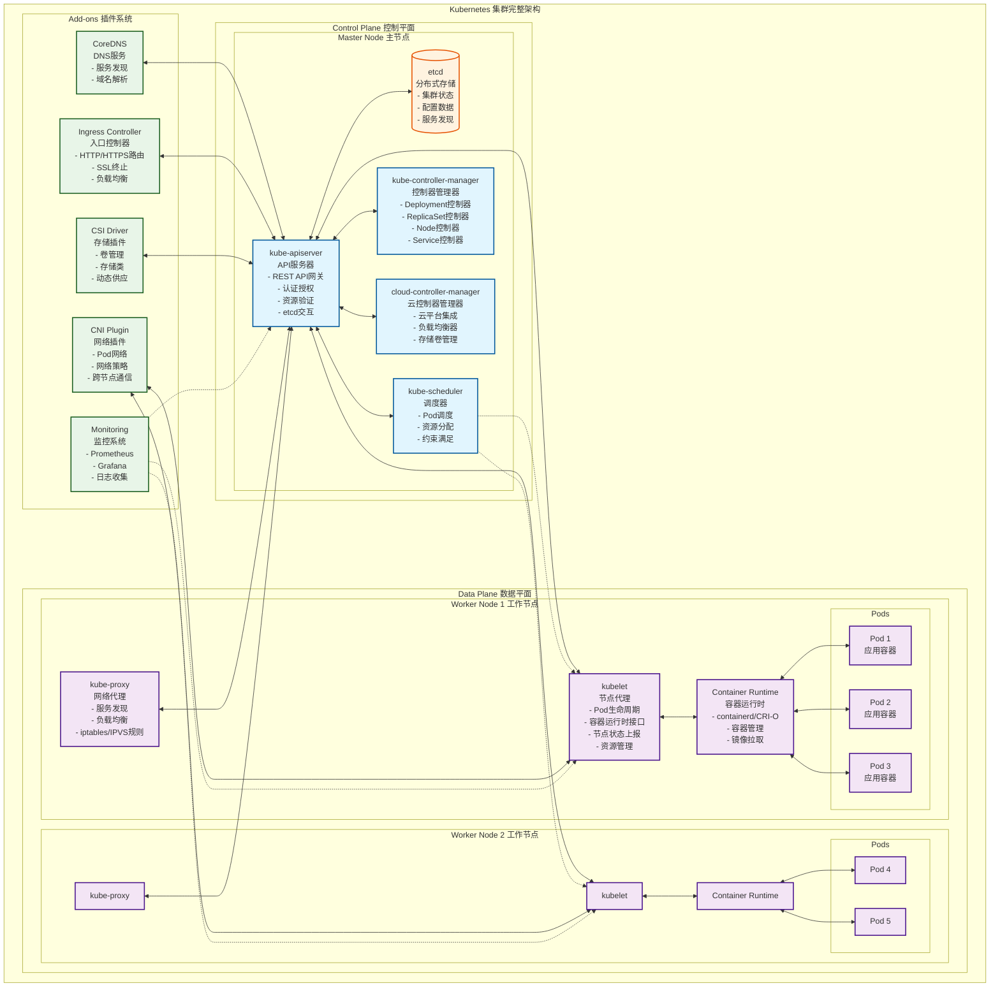

### 1.2 组件职责矩阵

| 组件 | 主要职责 | 关键功能 | 高可用要求 |
|------|----------|----------|------------|
| **kube-apiserver** | API网关 | 认证、授权、验证、存储交互 | 多实例负载均衡 |
| **etcd** | 数据存储 | 分布式一致性存储 | 奇数节点集群 |
| **kube-scheduler** | 资源调度 | Pod到Node的调度决策 | 主备模式 |
| **kube-controller-manager** | 控制循环 | 资源状态协调 | 主备模式 |
| **kubelet** | 节点代理 | Pod生命周期管理 | 单节点单实例 |
| **kube-proxy** | 网络代理 | 服务发现和负载均衡 | 单节点单实例 |

---

## 2. API Server 深度分析

### 2.1 API Server 架构设计

kube-apiserver作为Kubernetes集群的神经中枢，采用分层架构设计：

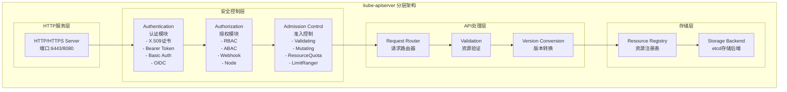

### 2.2 API Server 时序图

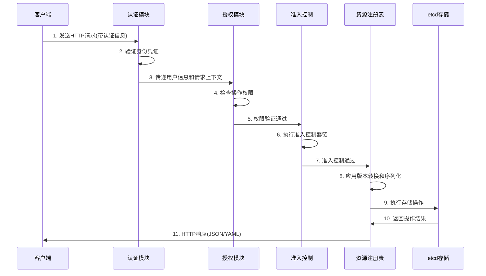

### 2.3 API Server 关键源码分析

#### 2.3.1 核心启动流程

```go
// main kube-apiserver主函数入口
// 文件路径: cmd/kube-apiserver/apiserver.go
func main() {
    // 创建API服务器命令对象
    // 这个命令对象包含了所有的启动参数和配置选项
    command := app.NewAPIServerCommand()
    
    // 使用component-base的CLI运行器执行命令
    // 这提供了统一的命令行处理、信号处理和优雅关闭机制
    code := cli.Run(command)
    
    // 以返回的退出码结束程序
    // 0表示成功，非0表示错误
    os.Exit(code)
}

// NewAPIServerCommand 创建API服务器命令
// 文件路径: cmd/kube-apiserver/app/server.go
func NewAPIServerCommand() *cobra.Command {
    // 创建服务器运行选项
    // 包含所有命令行参数的默认值和验证规则
    s := options.NewServerRunOptions()
    
    // 设置信号上下文，用于优雅关闭
    ctx := genericapiserver.SetupSignalContext()

    cmd := &cobra.Command{
        Use: "kube-apiserver",
        Long: `The Kubernetes API server validates and configures data
for the api objects which include pods, services, replicationcontrollers, and
others. The API Server services REST operations and provides the frontend to the
cluster's shared state through which all other components interact.`,

        // 主运行函数
        RunE: func(cmd *cobra.Command, args []string) error {
            // 验证配置选项
            if errs := s.Validate(); len(errs) != 0 {
                return utilerrors.NewAggregate(errs)
            }
            
            // 创建服务器配置
            config, err := s.Config()
            if err != nil {
                return err
            }
            
            // 创建并运行服务器
            return Run(ctx, config)
        },
    }
    return cmd
}
```

---

## 3. Kubelet 深度分析

### 3.1 Kubelet 架构设计

kubelet是运行在每个节点上的核心组件，负责管理节点上的Pod和容器生命周期：

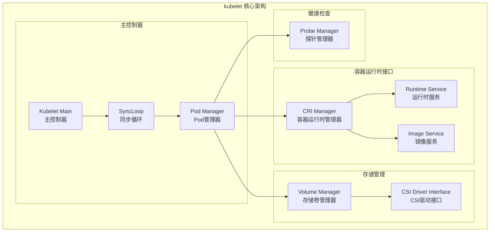

### 3.2 Kubelet 时序图

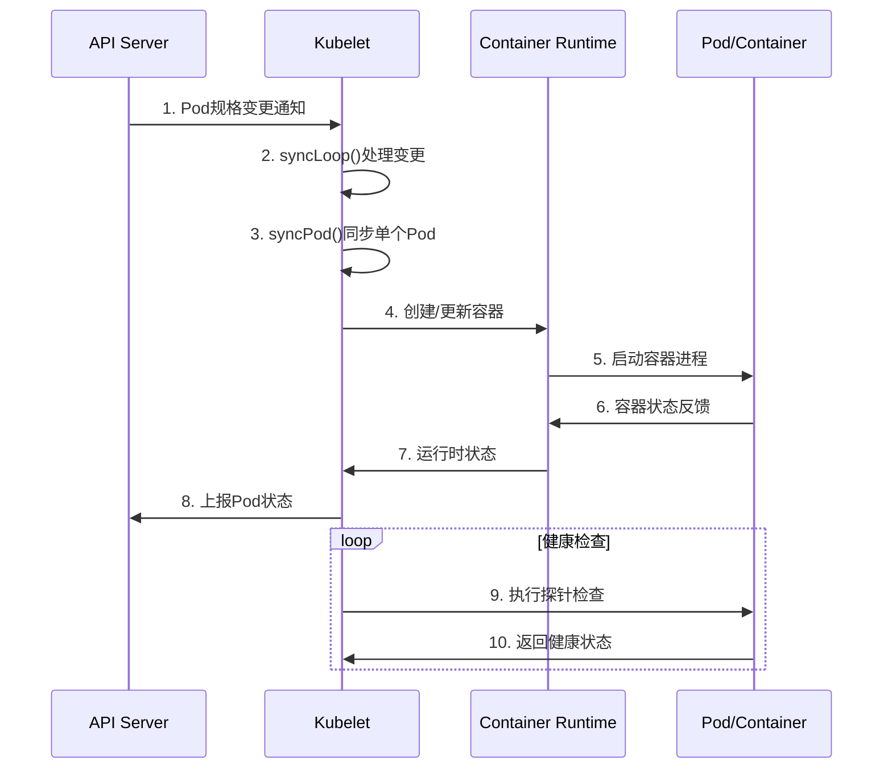

### 3.3 Kubelet 关键源码分析

#### 3.3.1 主循环控制

```go
// syncLoop 是kubelet的主要同步循环
// 文件路径: pkg/kubelet/kubelet.go
func (kl *Kubelet) syncLoop(ctx context.Context, updates <-chan kubetypes.PodUpdate, handler SyncHandler) {
    klog.InfoS("Starting kubelet main sync loop")
    
    // 同步循环监控器，用于检测循环是否正常运行
    syncTicker := time.NewTicker(time.Second)
    defer syncTicker.Stop()
    
    // 清理Pod定时器
    housekeepingTicker := time.NewTicker(housekeepingPeriod)
    defer housekeepingTicker.Stop()
    
    // Pod生命周期事件生成器定时器
    plegCh := kl.pleg.Watch()
    
    // 无限循环处理各种事件
    for {
        select {
        case u := <-updates:
            // 处理Pod更新事件
            // 来源包括：API服务器、文件、HTTP端点等
            klog.V(2).InfoS("SyncLoop (UPDATE)", "source", u.Source, "pods", klog.KObjSlice(u.Pods))
            handler.HandlePodUpdates(u.Pods)
            
        case e := <-plegCh:
            // 处理Pod生命周期事件
            // PLEG (Pod Lifecycle Event Generator) 生成的事件
            if isSyncPodWorthy(e) {
                // 如果事件值得同步，则触发Pod同步
                if pod, ok := kl.podManager.GetPodByUID(e.ID); ok {
                    klog.V(2).InfoS("SyncLoop (PLEG)", "pod", klog.KObj(pod), "event", e)
                    handler.HandlePodSyncs([]*v1.Pod{pod})
                }
            }
            
        case <-syncTicker.C:
            // 定期同步所有Pod
            // 这是一个保底机制，确保即使没有事件也会定期检查Pod状态
            klog.V(6).InfoS("SyncLoop (SYNC)")
            handler.HandlePodSyncs(kl.getPodsToSync())
            
        case <-housekeepingTicker.C:
            // 定期清理工作
            // 包括：清理已终止的Pod、垃圾回收等
            klog.V(2).InfoS("SyncLoop (housekeeping)")
            if err := handler.HandlePodCleanups(ctx); err != nil {
                klog.ErrorS(err, "Failed cleaning pods")
            }
            
        case <-ctx.Done():
            // 上下文取消，退出循环
            klog.InfoS("SyncLoop (context cancelled)")
            return
        }
    }
}
```

---

## 4. Kube-Proxy 深度分析

### 4.1 Kube-Proxy 架构设计

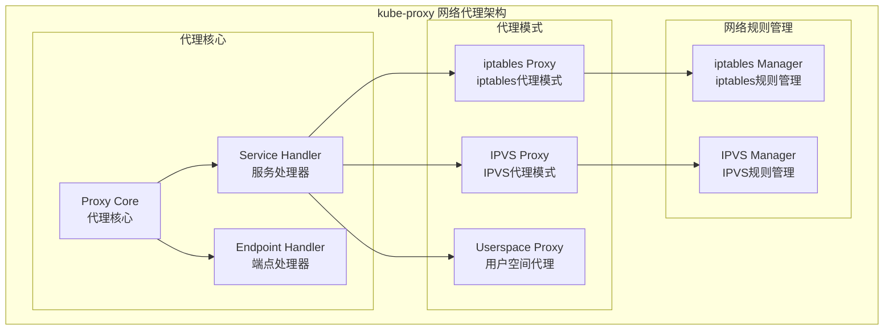

### 4.2 Kube-Proxy 时序图

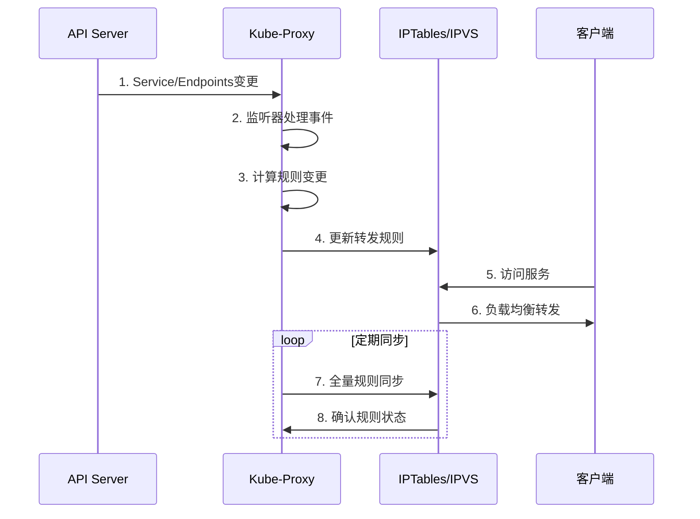

---

## 5. Scheduler 深度分析

### 5.1 Scheduler 架构设计

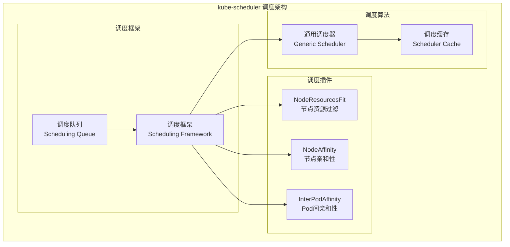

### 5.2 Scheduler 时序图

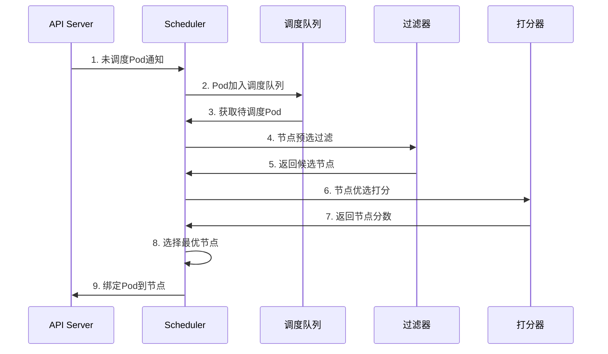

---

## 6. Controller Manager 深度分析

### 6.1 Controller Manager 架构设计

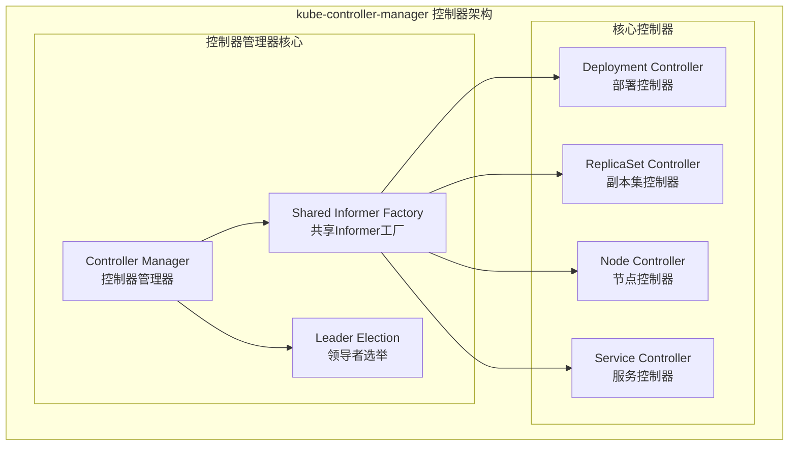

---

## 7. 高级架构模式

### 7.1 控制器模式深度解析

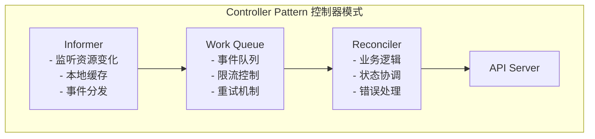

### 7.2 Client-Go 库深度分析

#### 7.2.1 Informer 机制核心实现

```go
// SharedInformerFactory 共享Informer工厂
// 文件路径: staging/src/k8s.io/client-go/informers/factory.go
type sharedInformerFactory struct {
    client           kubernetes.Interface      // Kubernetes客户端
    namespace        string                   // 命名空间过滤器
    tweakListOptions internalinterfaces.TweakListOptionsFunc // 列表选项调整函数
    lock             sync.Mutex               // 保护并发访问的互斥锁
    defaultResync    time.Duration            // 默认重新同步周期
    customResync     map[reflect.Type]time.Duration // 自定义重新同步周期
    
    informers map[reflect.Type]cache.SharedIndexInformer // Informer映射
    startedInformers map[reflect.Type]bool    // 已启动的Informer标记
    wg               sync.WaitGroup           // 等待组，用于优雅关闭
    shuttingDown     bool                     // 关闭标志
}

// Start 启动所有Informer
func (f *sharedInformerFactory) Start(stopCh <-chan struct{}) {
    f.lock.Lock()
    defer f.lock.Unlock()
    
    // 遍历所有注册的Informer
    for informerType, informer := range f.informers {
        if !f.startedInformers[informerType] {
            f.wg.Add(1)
            informer := informer
            go func() {
                defer f.wg.Done()
                // 运行Informer直到收到停止信号
                informer.Run(stopCh)
            }()
            f.startedInformers[informerType] = true
        }
    }
}
```

#### 7.2.2 WorkQueue 工作队列实现

```go
// DelayingInterface 延迟队列接口
// 支持延迟添加工作项的功能
type DelayingInterface interface {
    Interface
    // AddAfter 在指定延迟后添加工作项
    AddAfter(item interface{}, duration time.Duration)
}

// RateLimitingInterface 限流队列接口
// 支持基于重试次数的指数退避
type RateLimitingInterface interface {
    DelayingInterface
    // AddRateLimited 添加限流的工作项
    AddRateLimited(item interface{})
    // Forget 忘记工作项的重试历史
    Forget(item interface{})
    // NumRequeues 获取工作项的重试次数
    NumRequeues(item interface{}) int
}

// AddRateLimited 实现指数退避重试
func (q *rateLimitingType) AddRateLimited(item interface{}) {
    // 根据重试次数计算延迟时间，然后延迟添加
    q.DelayingInterface.AddAfter(item, q.rateLimiter.When(item))
}
```

---

## 8. 性能优化策略

### 8.1 API Server 优化

- 连接与传输、内容协商、OpenAPI、存储层等优化细节已在 `kubernetes-apiserver-source-analysis.md` 对应章节给出完整代码与说明（含连接池配置与 etcd 客户端配置）。为减少重复，此处不再赘述，建议参见：
  - 请求处理与过滤链优化：见 `kubernetes-apiserver-source-analysis.md` 第3章
  - 存储层与 etcd 客户端配置：见 `kubernetes-apiserver-source-analysis.md` 第4章与5.2

### 8.2 Kubelet 优化

#### 8.2.1 资源管理优化

```go
// 优化cgroup配置
func optimizeCgroupConfig() *CgroupConfig {
    return &CgroupConfig{
        // CPU配置
        CPUCFSQuota:       true,                    // 启用CFS配额
        CPUCFSQuotaPeriod: 100 * time.Millisecond, // CFS周期
        CPUManagerPolicy:  "static",               // 静态CPU管理策略
        
        // 内存配置
        MemorySwapBehavior: "LimitedSwap",         // 限制交换
        MemoryQoSEnforced:  true,                  // 启用内存QoS
        
        // 系统预留资源
        SystemReserved: map[string]string{
            "cpu":    "200m",
            "memory": "512Mi",
        },
        
        // kubelet预留资源
        KubeReserved: map[string]string{
            "cpu":    "100m", 
            "memory": "256Mi",
        },
        
        // 驱逐阈值
        EvictionHard: map[string]string{
            "memory.available":  "100Mi",
            "nodefs.available":  "10%",
            "imagefs.available": "15%",
        },
    }
}
```

### 8.3 Kube-Proxy 优化

#### 8.3.1 IPVS vs iptables性能对比

```go
// 性能对比分析
type ProxyModeComparison struct {
    Mode           string
    RuleComplexity string  // 规则复杂度
    Scalability    string  // 扩展性
    Performance    string  // 性能
    LoadBalancing  string  // 负载均衡算法
}

var ProxyModeComparisons = []ProxyModeComparison{
    {
        Mode:           "iptables",
        RuleComplexity: "O(n) - 线性增长",
        Scalability:    "中等 - 适合中小规模集群",
        Performance:    "中等 - 随服务数量线性下降",
        LoadBalancing:  "随机 - 基于iptables统计模块",
    },
    {
        Mode:           "IPVS",
        RuleComplexity: "O(1) - 常量时间",
        Scalability:    "高 - 适合大规模集群",
        Performance:    "高 - 内核态负载均衡",
        LoadBalancing:  "多种算法 - rr/lc/dh/sh/sed/nq",
    },
}
```

### 8.4 Scheduler 优化

#### 8.4.1 调度性能优化

```go
// 调度性能优化策略
type SchedulingOptimizer struct {
    // 节点打分百分比
    percentageOfNodesToScore int32
    
    // 并行度控制
    parallelism int32
    
    // 缓存优化
    cacheOptimizer *CacheOptimizer
}

// OptimizeScheduling 优化调度性能
func (so *SchedulingOptimizer) OptimizeScheduling() *SchedulingConfig {
    return &SchedulingConfig{
        // 1. 节点打分优化
        // 对于大集群，不需要对所有节点打分
        PercentageOfNodesToScore: so.calculateOptimalScoringPercentage(),
        
        // 2. 并行度优化
        // 根据CPU核数和集群规模调整并行度
        Parallelism: so.calculateOptimalParallelism(),
        
        // 3. 插件优化
        // 启用高性能插件，禁用不必要的插件
        Plugins: so.optimizePluginConfiguration(),
    }
}
```

---

## 9. 最佳实践指南

### 9.1 架构设计原则

Kubernetes的架构设计体现了以下核心原则：

1. **分离关注点**：控制平面负责决策，数据平面负责执行
2. **声明式API**：用户描述期望状态，系统自动实现
3. **可扩展性**：通过插件和自定义资源支持扩展
4. **容错性**：组件故障不影响整体系统运行
5. **一致性**：通过etcd保证集群状态的一致性

### 9.2 部署最佳实践

1. **高可用部署**
   - 控制平面组件多实例部署
   - etcd集群奇数节点配置
   - 跨可用区分布部署

2. **安全配置**
   - 启用RBAC授权
   - 配置网络策略
   - 定期轮换证书和密钥

3. **性能优化**
   - 合理配置资源限制
   - 使用节点亲和性优化调度
   - 配置水平Pod自动扩缩

4. **监控告警**
   - 部署全面的监控系统
   - 配置关键指标告警
   - 建立故障响应流程

### 9.3 运维最佳实践

1. **配置管理**
   - 使用配置文件管理组件参数
   - 定期备份和版本控制配置
   - 实施配置变更管理流程

2. **安全配置**
   - 启用TLS加密通信
   - 配置适当的RBAC权限
   - 定期更新和轮换证书

3. **故障处理**
   - 建立完善的日志收集系统
   - 实施健康检查和自动恢复
   - 制定应急响应预案

---

## 10. 总结

通过本文的，我们全面了解了Kubernetes的架构设计和核心组件的源码实现。每个组件都有其独特的设计理念和优化策略：

- **API Server** 作为集群的统一入口，提供了完善的安全控制和扩展机制
- **Kubelet** 作为节点代理，实现了高效的容器生命周期管理
- **Kube-Proxy** 提供了灵活的网络代理和负载均衡能力
- **Scheduler** 实现了智能的资源调度和优化算法
- **Controller Manager** 通过控制器模式实现了声明式的资源管理

这些组件协同工作，构成了一个强大、可扩展、高可用的容器编排平台，为现代云原生应用提供了坚实的基础设施支撑。

## 11. 最新技术特性和发展趋势

### 11.1 Kubernetes 1.29+ 新特性

Kubernetes在以下方面有重要改进：

#### 11.1.1 调度框架v2增强

- **预入队插件（PreEnqueue）**：在Pod进入调度队列前进行门控检查
- **队列提示插件（QueueingHint）**：提供智能的队列管理策略
- **多点插件（MultiPoint）**：允许插件在多个扩展点生效
- **增强的调度上下文**：提供更丰富的调度决策信息

#### 11.1.2 CRI接口增强

- **容器检查点功能**：支持容器的热迁移和状态保存
- **实时事件流**：提供容器状态变更的实时事件
- **自定义指标支持**：支持容器和Pod级别的自定义指标
- **增强安全上下文**：支持更细粒度的安全控制

#### 11.1.3 网络代理优化

- **EndpointSlice支持**：更高效的端点管理和拓扑感知路由
- **拓扑感知路由**：Kubernetes的声明式API是其核心设计哲学。用户只需要描述期望的最终状态，而不需要关心如何达到这个状态的具体步骤。

### 12.2 控制器协调模式

控制器通过持续的协调循环（Reconciliation Loop）来确保实际状态与期望状态一致。这种模式具有自愈能力，能够自动处理各种异常情况。

### 12.3 事件驱动架构

Kubernetes采用事件驱动架构，通过Informer机制监听资源变化，减少对API Server的轮询压力，提高系统整体性能。

本文档整合了Kubernetes各核心组件的完整分析，结合最新的技术发展和最佳实践，深入解析了核心设计哲学和架构模式，为深入理解和实践容器编排技术提供了全面的技术指南。
