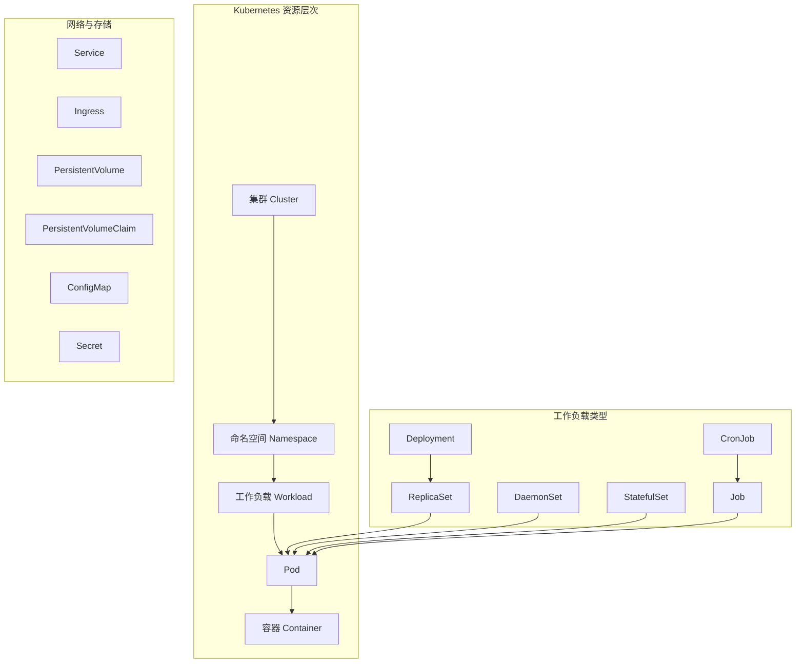
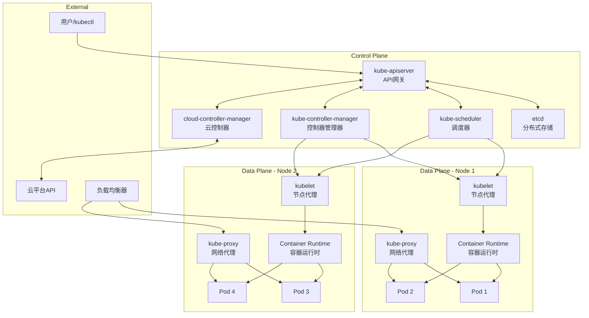
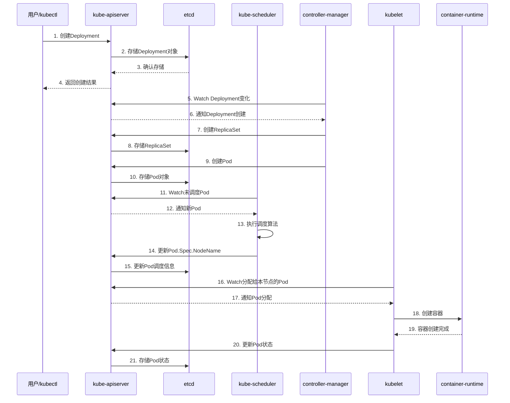
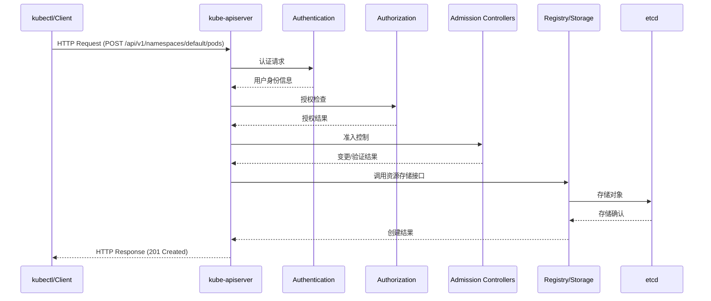
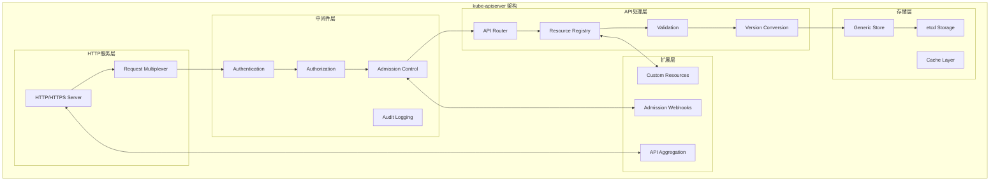
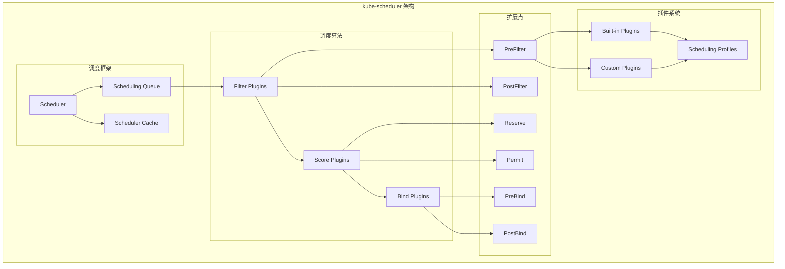
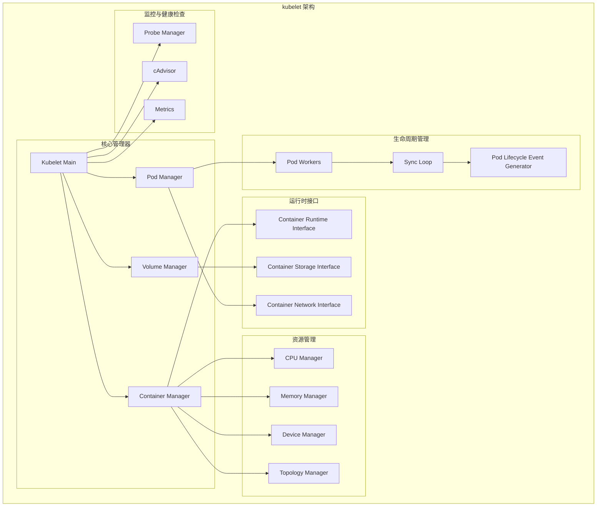
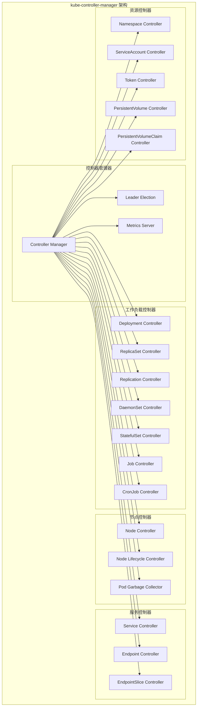
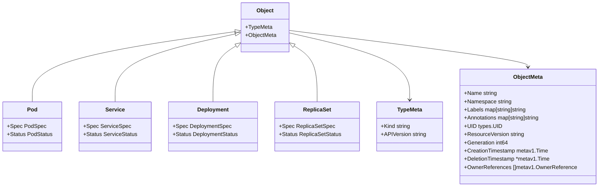
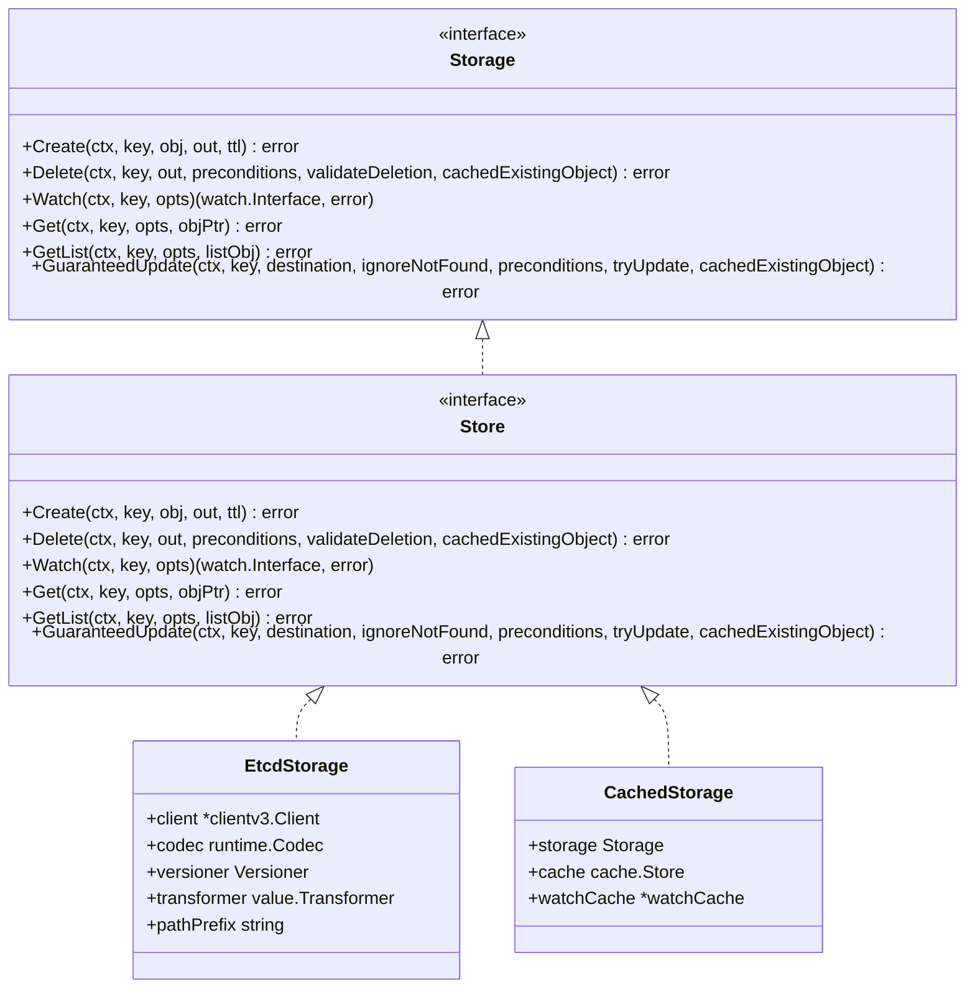

# Kubernetes 完整源码剖析手册

## 目录

- [1. 框架使用手册](#1-框架使用手册)
- [2. 整体架构与核心概念](#2-整体架构与核心概念)
- [3. 对外API深入分析](#3-对外api深入分析)
- [4. 核心模块详细分析](#4-核心模块详细分析)
- [5. 关键结构体与继承关系](#5-关键结构体与继承关系)
- [6. 实战经验与最佳实践](#6-实战经验与最佳实践)

---

## 1. 框架使用手册

### 1.1 Kubernetes 整体架构概览

Kubernetes 是一个容器编排平台，采用声明式API和控制器模式。其核心组件包括：

- **控制平面（Control Plane）**：
  - kube-apiserver：API网关，所有组件的统一入口
  - etcd：分布式键值存储，集群状态持久化
  - kube-scheduler：Pod调度器
  - kube-controller-manager：控制器管理器
  - cloud-controller-manager：云平台控制器

- **数据平面（Data Plane）**：
  - kubelet：节点代理，管理Pod生命周期
  - kube-proxy：网络代理，实现Service负载均衡
  - Container Runtime：容器运行时（Docker、containerd等）

### 1.2 核心概念与资源模型



### 1.3 使用指南

#### 1.3.1 基本操作流程

```bash
# 1. 集群初始化
kubeadm init --pod-network-cidr=10.244.0.0/16

# 2. 配置kubectl
mkdir -p $HOME/.kube
sudo cp -i /etc/kubernetes/admin.conf $HOME/.kube/config
sudo chown $(id -u):$(id -g) $HOME/.kube/config

# 3. 安装网络插件
kubectl apply -f https://raw.githubusercontent.com/flannel-io/flannel/master/Documentation/kube-flannel.yml

# 4. 加入工作节点
kubeadm join <master-ip>:6443 --token <token> --discovery-token-ca-cert-hash <hash>
```

#### 1.3.2 资源管理

```yaml
# deployment.yaml - 应用部署示例
apiVersion: apps/v1
kind: Deployment
metadata:
  name: nginx-deployment
  namespace: default
spec:
  replicas: 3
  selector:
    matchLabels:
      app: nginx
  template:
    metadata:
      labels:
        app: nginx
    spec:
      containers:
      - name: nginx
        image: nginx:1.20
        ports:
        - containerPort: 80
        resources:
          requests:
            memory: "64Mi"
            cpu: "250m"
          limits:
            memory: "128Mi"
            cpu: "500m"
---
apiVersion: v1
kind: Service
metadata:
  name: nginx-service
spec:
  selector:
    app: nginx
  ports:
  - protocol: TCP
    port: 80
    targetPort: 80
  type: ClusterIP
```

---

## 2. 整体架构与核心概念

### 2.1 系统架构图



### 2.2 组件交互时序图



---

## 3. 对外API深入分析

### 3.1 REST API 架构

Kubernetes 对外提供标准的 RESTful API，遵循以下规范：

- **API 版本化**：`/api/v1`、`/apis/apps/v1` 等
- **资源路径**：`/api/v1/namespaces/{namespace}/pods/{name}`
- **HTTP 方法**：GET、POST、PUT、PATCH、DELETE
- **内容协商**：支持 JSON、YAML、Protobuf

### 3.2 核心API分析

#### 3.2.1 Pod API

**入口函数**：
```go
// 文件：pkg/registry/core/pod/storage/storage.go
func NewStorage(optsGetter generic.RESTOptionsGetter, k client.ConnectionInfoGetter, 
    proxyTransport http.RoundTripper, podDisruptionBudgetClient policyclient.PodDisruptionBudgetsGetter) (PodStorage, error) {
    
    store := &genericregistry.Store{
        NewFunc:                  func() runtime.Object { return &api.Pod{} },
        NewListFunc:              func() runtime.Object { return &api.PodList{} },
        DefaultQualifiedResource: api.Resource("pods"),
        
        CreateStrategy: pod.Strategy,
        UpdateStrategy: pod.Strategy,
        DeleteStrategy: pod.Strategy,
        
        TableConvertor: printerstorage.TableConvertor{TableGenerator: printers.NewTableGenerator().With(printersinternal.AddHandlers)},
    }
    
    options := &generic.StoreOptions{
        RESTOptions: optsGetter,
        AttrFunc:    pod.GetAttrs,
    }
    
    if err := store.CompleteWithOptions(options); err != nil {
        return PodStorage{}, err
    }
    
    statusStore := *store
    statusStore.UpdateStrategy = pod.StatusStrategy
    statusStore.ResetFieldsStrategy = pod.StatusStrategy
    
    return PodStorage{
        Pod:         &REST{store, proxyTransport},
        Binding:     &BindingREST{store: store},
        Eviction:    newEvictionStorage(store, podDisruptionBudgetClient),
        Status:      &StatusREST{store: &statusStore},
        Log:         &podrest.LogREST{Store: store, KubeletConn: k},
        Proxy:       &podrest.ProxyREST{Store: store, ProxyTransport: proxyTransport},
        Exec:        &podrest.ExecREST{Store: store, KubeletConn: k},
        Attach:      &podrest.AttachREST{Store: store, KubeletConn: k},
        PortForward: &podrest.PortForwardREST{Store: store, KubeletConn: k},
    }, nil
}
```

**关键调用链路**：

1. **创建Pod**：
```go
// 文件：staging/src/k8s.io/apiserver/pkg/registry/generic/registry/store.go
func (e *Store) Create(ctx context.Context, obj runtime.Object, createValidation rest.ValidateObjectFunc, options *metav1.CreateOptions) (runtime.Object, error) {
    // 1. 验证对象
    if err := createValidation(ctx, obj); err != nil {
        return nil, err
    }
    
    // 2. 应用创建策略
    if err := e.CreateStrategy.PrepareForCreate(ctx, obj); err != nil {
        return nil, err
    }
    
    // 3. 验证创建
    if err := e.CreateStrategy.Validate(ctx, obj); err != nil {
        return nil, err
    }
    
    // 4. 存储到etcd
    out, err := e.Storage.Create(ctx, key, obj, nil, 0, false)
    if err != nil {
        return nil, err
    }
    
    // 5. 触发后置处理
    e.CreateStrategy.AfterCreate(obj)
    
    return out, nil
}
```

2. **Pod调度绑定**：
```go
// 文件：pkg/registry/core/pod/rest/subresources.go
type BindingREST struct {
    store *genericregistry.Store
}

func (r *BindingREST) Create(ctx context.Context, name string, obj runtime.Object, createValidation rest.ValidateObjectFunc, options *metav1.CreateOptions) (runtime.Object, error) {
    binding := obj.(*api.Binding)
    
    // 1. 获取Pod对象
    pod, err := r.getPod(ctx, name)
    if err != nil {
        return nil, err
    }
    
    // 2. 检查Pod是否已调度
    if pod.Spec.NodeName != "" {
        return nil, errors.NewConflict(api.Resource("pods/binding"), name, fmt.Errorf("pod %v is already assigned to node %q", name, pod.Spec.NodeName))
    }
    
    // 3. 更新Pod的NodeName
    pod.Spec.NodeName = binding.Target.Name
    
    // 4. 更新到etcd
    _, err = r.store.Update(ctx, name, rest.DefaultUpdatedObjectInfo(pod), createValidation, updateValidation, false, options)
    return &metav1.Status{Status: metav1.StatusSuccess}, err
}
```

#### 3.2.2 Service API

**入口函数**：
```go
// 文件：pkg/registry/core/service/storage/storage.go
func NewStorage(optsGetter generic.RESTOptionsGetter, endpoints endpoint.EndpointStorage, 
    proxyTransport http.RoundTripper, serviceAccountGetter serviceaccount.ServiceAccountTokenGetter) (ServiceStorage, error) {
    
    store := &genericregistry.Store{
        NewFunc:                  func() runtime.Object { return &api.Service{} },
        NewListFunc:              func() runtime.Object { return &api.ServiceList{} },
        DefaultQualifiedResource: api.Resource("services"),
        
        CreateStrategy:      service.Strategy,
        UpdateStrategy:      service.Strategy,
        DeleteStrategy:      service.Strategy,
        ExportStrategy:      service.Strategy,
        
        TableConvertor: printerstorage.TableConvertor{TableGenerator: printers.NewTableGenerator().With(printersinternal.AddHandlers)},
    }
    
    options := &generic.StoreOptions{RESTOptions: optsGetter}
    if err := store.CompleteWithOptions(options); err != nil {
        return ServiceStorage{}, err
    }
    
    statusStore := *store
    statusStore.UpdateStrategy = service.StatusStrategy
    statusStore.ResetFieldsStrategy = service.StatusStrategy
    
    return ServiceStorage{
        Service: &REST{store, endpoints, serviceAccountGetter},
        Status:  &StatusREST{store: &statusStore},
        ProxyREST: &ProxyREST{Redirector: &serviceREST{store, proxyTransport}, ProxyTransport: proxyTransport},
    }, nil
}
```

**Service创建策略**：
```go
// 文件：pkg/registry/core/service/strategy.go
func (svcStrategy) PrepareForCreate(ctx context.Context, obj runtime.Object) {
    service := obj.(*api.Service)
    service.Status = api.ServiceStatus{}
    
    // 1. 分配ClusterIP
    if service.Spec.Type == api.ServiceTypeClusterIP || service.Spec.Type == api.ServiceTypeNodePort || service.Spec.Type == api.ServiceTypeLoadBalancer {
        if service.Spec.ClusterIP == "" {
            service.Spec.ClusterIP = api.ClusterIPNone
        }
    }
    
    // 2. 处理端口
    for i := range service.Spec.Ports {
        port := &service.Spec.Ports[i]
        if port.Protocol == "" {
            port.Protocol = api.ProtocolTCP
        }
        if port.TargetPort.Type == intstr.String && port.TargetPort.StrVal == "" {
            port.TargetPort = intstr.FromInt(int(port.Port))
        }
    }
    
    // 3. 设置会话亲和性
    if service.Spec.SessionAffinity == "" {
        service.Spec.SessionAffinity = api.ServiceAffinityNone
    }
}
```

### 3.3 API请求处理流程



---

## 4. 核心模块详细分析

### 4.1 kube-apiserver 模块

#### 4.1.1 模块架构图



#### 4.1.2 启动流程分析

**主函数入口**：
```go
// 文件：cmd/kube-apiserver/apiserver.go
func main() {
    command := app.NewAPIServerCommand()
    code := cli.Run(command)
    os.Exit(code)
}

// 文件：cmd/kube-apiserver/app/server.go
func NewAPIServerCommand() *cobra.Command {
    s := options.NewServerRunOptions()
    cmd := &cobra.Command{
        Use: "kube-apiserver",
        Long: `The Kubernetes API server validates and configures data
for the api objects which include pods, services, replicationcontrollers, and
others. The API Server services REST operations and provides the frontend to the
cluster's shared state through which all other components interact.`,
        
        RunE: func(cmd *cobra.Command, args []string) error {
            // 1. 完成配置
            completedOptions, err := s.Complete()
            if err != nil {
                return err
            }
            
            // 2. 验证配置
            if errs := completedOptions.Validate(); len(errs) != 0 {
                return utilerrors.NewAggregate(errs)
            }
            
            // 3. 运行服务器
            return Run(completedOptions, genericapiserver.SetupSignalContext())
        },
    }
    
    // 添加命令行参数
    fs := cmd.Flags()
    namedFlagSets := s.Flags()
    for _, f := range namedFlagSets.FlagSets {
        fs.AddFlagSet(f)
    }
    
    return cmd
}
```

**服务器运行主流程**：
```go
// 文件：cmd/kube-apiserver/app/server.go
func Run(completeOptions completedServerRunOptions, stopCh <-chan struct{}) error {
    // 1. 创建服务器配置
    server, err := CreateServerChain(completeOptions, stopCh)
    if err != nil {
        return err
    }
    
    // 2. 准备运行
    prepared, err := server.PrepareRun()
    if err != nil {
        return err
    }
    
    // 3. 运行服务器
    return prepared.Run(stopCh)
}

func CreateServerChain(completedOptions completedServerRunOptions, stopCh <-chan struct{}) (*aggregatorapiserver.APIAggregator, error) {
    // 1. 创建核心API服务器
    kubeAPIServerConfig, serviceResolver, pluginInitializer, err := CreateKubeAPIServerConfig(completedOptions)
    if err != nil {
        return nil, err
    }
    
    kubeAPIServer, err := CreateKubeAPIServer(kubeAPIServerConfig, genericapiserver.NewEmptyDelegate())
    if err != nil {
        return nil, err
    }
    
    // 2. 创建扩展API服务器
    apiExtensionsConfig, err := createAPIExtensionsConfig(*kubeAPIServerConfig.GenericConfig, kubeAPIServerConfig.ExtraConfig.VersionedInformers, pluginInitializer, completedOptions.ServerRunOptions, completedOptions.MasterCount, serviceResolver, webhook.NewDefaultAuthenticationInfoResolverWrapper(kubeAPIServerConfig.ExtraConfig.ProxyTransport, kubeAPIServerConfig.GenericConfig.EgressSelector, kubeAPIServerConfig.GenericConfig.LoopbackClientConfig, kubeAPIServerConfig.GenericConfig.TracerProvider))
    if err != nil {
        return nil, err
    }
    
    apiExtensionsServer, err := createAPIExtensionsServer(apiExtensionsConfig, genericapiserver.NewEmptyDelegate())
    if err != nil {
        return nil, err
    }
    
    // 3. 创建聚合API服务器
    aggregatorConfig, err := createAggregatorConfig(*kubeAPIServerConfig.GenericConfig, completedOptions.ServerRunOptions, kubeAPIServerConfig.ExtraConfig.VersionedInformers, serviceResolver, kubeAPIServerConfig.ExtraConfig.ProxyTransport, pluginInitializer)
    if err != nil {
        return nil, err
    }
    
    aggregatorServer, err := createAggregatorServer(aggregatorConfig, kubeAPIServer.GenericAPIServer, apiExtensionsServer.GenericAPIServer)
    if err != nil {
        return nil, err
    }
    
    return aggregatorServer, nil
}
```

#### 4.1.3 请求处理链路

**HTTP过滤器链**：
```go
// 文件：staging/src/k8s.io/apiserver/pkg/server/config.go
func (c *Config) BuildHandlerChainFunc(apiHandler http.Handler, nonAPIHandler http.Handler) http.Handler {
    handler := apiHandler
    
    // 1. 恐慌恢复
    handler = genericapifilters.WithPanicRecovery(handler, c.RequestInfoResolver)
    
    // 2. 超时控制
    handler = genericapifilters.WithTimeoutForNonLongRunningRequests(handler, c.LongRunningFunc)
    
    // 3. CORS处理
    handler = genericapifilters.WithCORS(handler, c.CorsAllowedOriginList, nil, nil, nil, "true")
    
    // 4. 审计日志
    handler = genericapifilters.WithAudit(handler, c.AuditBackend, c.AuditPolicyRuleEvaluator, c.LongRunningFunc)
    
    // 5. 认证
    handler = genericapifilters.WithAuthentication(handler, c.Authentication.Authenticator, failedHandler, c.Authentication.APIAudiences)
    
    // 6. 授权
    handler = genericapifilters.WithAuthorization(handler, c.Authorization.Authorizer, c.Serializer)
    
    // 7. 准入控制
    handler = genericfilters.WithMaxInFlightLimit(handler, c.MaxRequestsInFlight, c.MaxMutatingRequestsInFlight, c.LongRunningFunc)
    
    return handler
}
```

**认证处理**：
```go
// 文件：staging/src/k8s.io/apiserver/pkg/server/filters/authentication.go
func WithAuthentication(handler http.Handler, auth authenticator.Request, failed http.Handler, apiAuds authenticator.Audiences) http.Handler {
    return http.HandlerFunc(func(w http.ResponseWriter, req *http.Request) {
        authenticationStart := time.Now()
        
        // 1. 执行认证
        resp, ok, err := auth.AuthenticateRequest(req)
        authenticationFinish := time.Now()
        defer func() {
            recordAuthenticationMetrics(resp, ok, err, apiAuds, authenticationStart, authenticationFinish)
        }()
        
        if err != nil || !ok {
            if err != nil {
                klog.ErrorS(err, "Unable to authenticate the request")
            }
            failed.ServeHTTP(w, req)
            return
        }
        
        // 2. 设置用户信息到请求上下文
        req = req.WithContext(request.WithUser(req.Context(), resp.User))
        
        // 3. 继续处理链
        handler.ServeHTTP(w, req)
    })
}
```

### 4.2 kube-scheduler 模块

#### 4.2.1 模块架构图



#### 4.2.2 调度流程分析

**调度器主循环**：
```go
// 文件：pkg/scheduler/scheduler.go
func (sched *Scheduler) Run(ctx context.Context) {
    sched.SchedulingQueue.Run()
    
    // 启动调度循环
    wait.UntilWithContext(ctx, sched.scheduleOne, 0)
    
    sched.SchedulingQueue.Close()
}

func (sched *Scheduler) scheduleOne(ctx context.Context) {
    // 1. 从队列获取Pod
    podInfo := sched.NextPod()
    if podInfo == nil || podInfo.Pod == nil {
        return
    }
    pod := podInfo.Pod
    
    // 2. 执行调度算法
    scheduleResult, err := sched.Algorithm.Schedule(ctx, sched.Profiles[pod.Spec.SchedulerName], framework.NewCycleState(), pod)
    if err != nil {
        // 调度失败处理
        sched.handleSchedulingFailure(ctx, podInfo, err, v1.PodReasonUnschedulable, err.Error())
        return
    }
    
    // 3. 执行绑定
    err = sched.bind(ctx, sched.Profiles[pod.Spec.SchedulerName], pod, scheduleResult.SuggestedHost, scheduleResult.EvaluatedNodes)
    if err != nil {
        sched.handleSchedulingFailure(ctx, podInfo, err, SchedulerError, err.Error())
        return
    }
}
```

**调度算法实现**：
```go
// 文件：pkg/scheduler/core/generic_scheduler.go
func (g *genericScheduler) Schedule(ctx context.Context, prof *profile.Profile, state *framework.CycleState, pod *v1.Pod) (result ScheduleResult, err error) {
    // 1. 预过滤
    preFilterStatus := prof.RunPreFilterPlugins(ctx, state, pod)
    if !preFilterStatus.IsSuccess() {
        return result, preFilterStatus.AsError()
    }
    
    // 2. 查找可调度节点
    feasibleNodes, filteredNodesStatuses, err := g.findNodesThatFitPod(ctx, prof, state, pod)
    if err != nil {
        return result, err
    }
    
    // 3. 如果没有可调度节点，运行后过滤插件
    if len(feasibleNodes) == 0 {
        postFilterStatus := prof.RunPostFilterPlugins(ctx, state, pod, filteredNodesStatuses)
        if !postFilterStatus.IsSuccess() {
            return result, postFilterStatus.AsError()
        }
        return result, fmt.Errorf("no nodes available to schedule pods")
    }
    
    // 4. 如果只有一个节点，直接返回
    if len(feasibleNodes) == 1 {
        return ScheduleResult{
            SuggestedHost:  feasibleNodes[0].Name,
            EvaluatedNodes: 1 + len(filteredNodesStatuses),
            FeasibleNodes:  1,
        }, nil
    }
    
    // 5. 对节点进行打分
    priorityList, err := g.prioritizeNodes(ctx, prof, state, pod, feasibleNodes)
    if err != nil {
        return result, err
    }
    
    // 6. 选择最高分节点
    host, err := g.selectHost(priorityList)
    return ScheduleResult{
        SuggestedHost:  host,
        EvaluatedNodes: len(feasibleNodes) + len(filteredNodesStatuses),
        FeasibleNodes:  len(feasibleNodes),
    }, err
}
```

**过滤插件示例**：
```go
// 文件：pkg/scheduler/framework/plugins/noderesources/fit.go
func (f *Fit) Filter(ctx context.Context, cycleState *framework.CycleState, pod *v1.Pod, nodeInfo *framework.NodeInfo) *framework.Status {
    // 1. 获取预计算的资源信息
    s, err := getPreFilterState(cycleState)
    if err != nil {
        return framework.AsStatus(err)
    }
    
    // 2. 检查资源是否充足
    insufficientResources := fitsRequest(s, nodeInfo, f.ignoredResources, f.ignoredResourceGroups)
    
    if len(insufficientResources) != 0 {
        // 资源不足，返回失败状态
        failureReasons := make([]string, 0, len(insufficientResources))
        for _, r := range insufficientResources {
            failureReasons = append(failureReasons, fmt.Sprintf("Insufficient %v", r.ResourceName))
        }
        return framework.NewStatus(framework.Unschedulable, failureReasons...)
    }
    
    return nil
}

func fitsRequest(podRequest *preFilterState, nodeInfo *framework.NodeInfo, ignoredExtendedResources, ignoredResourceGroups sets.String) []InsufficientResource {
    insufficientResources := make([]InsufficientResource, 0, 4)
    
    allowedPodNumber := nodeInfo.Allocatable.AllowedPodNumber
    if len(nodeInfo.Pods)+1 > allowedPodNumber {
        insufficientResources = append(insufficientResources, InsufficientResource{
            ResourceName: v1.ResourcePods,
            Reason:       "Too many pods",
            Requested:    1,
            Used:         int64(len(nodeInfo.Pods)),
            Capacity:     int64(allowedPodNumber),
        })
    }
    
    if podRequest.MilliCPU == 0 && podRequest.Memory == 0 && podRequest.EphemeralStorage == 0 && len(podRequest.ScalarResources) == 0 {
        return insufficientResources
    }
    
    if podRequest.MilliCPU > (nodeInfo.Allocatable.MilliCPU - nodeInfo.Requested.MilliCPU) {
        insufficientResources = append(insufficientResources, InsufficientResource{
            ResourceName: v1.ResourceCPU,
            Reason:       "Insufficient cpu",
            Requested:    podRequest.MilliCPU,
            Used:         nodeInfo.Requested.MilliCPU,
            Capacity:     nodeInfo.Allocatable.MilliCPU,
        })
    }
    
    if podRequest.Memory > (nodeInfo.Allocatable.Memory - nodeInfo.Requested.Memory) {
        insufficientResources = append(insufficientResources, InsufficientResource{
            ResourceName: v1.ResourceMemory,
            Reason:       "Insufficient memory",
            Requested:    podRequest.Memory,
            Used:         nodeInfo.Requested.Memory,
            Capacity:     nodeInfo.Allocatable.Memory,
        })
    }
    
    return insufficientResources
}
```

### 4.3 kubelet 模块

#### 4.3.1 模块架构图



#### 4.3.2 Pod生命周期管理

**主同步循环**：
```go
// 文件：pkg/kubelet/kubelet.go
func (kl *Kubelet) syncLoop(updates <-chan kubetypes.PodUpdate, handler SyncHandler) {
    klog.InfoS("Starting kubelet main sync loop")
    
    syncTicker := time.NewTicker(time.Second)
    defer syncTicker.Stop()
    housekeepingTicker := time.NewTicker(housekeepingPeriod)
    defer housekeepingTicker.Stop()
    plegCh := kl.pleg.Watch()
    
    const (
        base   = 100 * time.Millisecond
        max    = 5 * time.Second
        factor = 2
    )
    duration := base
    
    for {
        if err := kl.runtimeState.runtimeErrors(); err != nil {
            klog.ErrorS(err, "Skipping pod synchronization")
            time.Sleep(duration)
            duration = time.Duration(math.Min(float64(max), factor*float64(duration)))
            continue
        }
        duration = base
        
        kl.syncLoopMonitor.Store(kl.clock.Now())
        if !kl.syncLoopIteration(updates, handler, syncTicker.C, housekeepingTicker.C, plegCh) {
            break
        }
        kl.syncLoopMonitor.Store(kl.clock.Now())
    }
}

func (kl *Kubelet) syncLoopIteration(configCh <-chan kubetypes.PodUpdate, handler SyncHandler,
    syncCh <-chan time.Time, housekeepingCh <-chan time.Time, plegCh <-chan *pleg.PodLifecycleEvent) bool {
    
    select {
    case u := <-configCh:
        // 处理Pod配置更新
        switch u.Op {
        case kubetypes.ADD:
            klog.V(2).InfoS("SyncLoop ADD", "source", u.Source, "pods", format.Pods(u.Pods))
            handler.HandlePodAdditions(u.Pods)
        case kubetypes.UPDATE:
            klog.V(2).InfoS("SyncLoop UPDATE", "source", u.Source, "pods", format.Pods(u.Pods))
            handler.HandlePodUpdates(u.Pods)
        case kubetypes.REMOVE:
            klog.V(2).InfoS("SyncLoop REMOVE", "source", u.Source, "pods", format.Pods(u.Pods))
            handler.HandlePodRemoves(u.Pods)
        case kubetypes.RECONCILE:
            klog.V(4).InfoS("SyncLoop RECONCILE", "source", u.Source, "pods", format.Pods(u.Pods))
            handler.HandlePodReconcile(u.Pods)
        case kubetypes.DELETE:
            klog.V(2).InfoS("SyncLoop DELETE", "source", u.Source, "pods", format.Pods(u.Pods))
            handler.HandlePodUpdates(u.Pods)
        case kubetypes.SET:
            klog.V(2).InfoS("SyncLoop SET", "source", u.Source, "pods", format.Pods(u.Pods))
            handler.HandlePodUpdates(u.Pods)
        default:
            klog.ErrorS(nil, "Invalid operation type received", "operation", u.Op)
        }
        
    case e := <-plegCh:
        // 处理Pod生命周期事件
        if e.Type == pleg.ContainerStarted {
            kl.lastContainerStartedTime.Add(e.ID, time.Now())
        }
        if isSyncPodWorthy(e) {
            if pod, ok := kl.podManager.GetPodByUID(e.ID); ok {
                klog.V(2).InfoS("SyncLoop (PLEG): event for pod", "pod", klog.KObj(pod), "event", e)
                handler.HandlePodSyncs([]*v1.Pod{pod})
            } else {
                klog.V(4).InfoS("SyncLoop (PLEG): pod does not exist, ignore irrelevant event", "event", e)
            }
        }
        
    case <-syncCh:
        // 定期同步所有Pod
        podsToSync := kl.getPodsToSync()
        if len(podsToSync) == 0 {
            break
        }
        klog.V(4).InfoS("SyncLoop (SYNC) pods", "total", len(podsToSync), "pods", format.Pods(podsToSync))
        handler.HandlePodSyncs(podsToSync)
        
    case <-housekeepingCh:
        // 执行清理任务
        if !kl.sourcesReady.AllReady() {
            klog.V(4).InfoS("SyncLoop (housekeeping, skipped): sources aren't ready yet")
        } else {
            start := time.Now()
            klog.V(4).InfoS("SyncLoop (housekeeping)")
            if err := handler.HandlePodCleanups(); err != nil {
                klog.ErrorS(err, "Failed cleaning pods")
            }
            duration := time.Since(start)
            if duration > housekeepingWarningDuration {
                klog.ErrorS(nil, "Housekeeping took too long", "duration", duration, "threshold", housekeepingWarningDuration)
            }
            klog.V(4).InfoS("SyncLoop (housekeeping) end", "duration", duration)
        }
    }
    return true
}
```

**Pod同步处理**：
```go
// 文件：pkg/kubelet/kubelet.go
func (kl *Kubelet) syncPod(o syncPodOptions) error {
    // 1. 计算Pod的沙箱和容器变更
    podStatus, err := kl.containerRuntime.GetPodStatus(o.pod.UID, o.pod.Name, o.pod.Namespace)
    if err != nil {
        klog.ErrorS(err, "Unable to get pod status, for pod", "pod", klog.KObj(o.pod))
        return err
    }
    
    // 2. 检查Pod是否应该运行
    runnable := kl.canRunPod(o.pod)
    if !runnable.Admit {
        klog.ErrorS(nil, "Pod is not runnable", "pod", klog.KObj(o.pod), "message", runnable.Message)
        return fmt.Errorf("pod cannot be run: %s", runnable.Message)
    }
    
    // 3. 更新Pod状态
    kl.statusManager.SetPodStatus(o.pod, apiPodStatus)
    
    // 4. 如果Pod不应该运行，杀死它
    if !runnable.Admit || o.pod.DeletionTimestamp != nil || apiPodStatus.Phase == v1.PodFailed {
        var syncErr error
        if err := kl.killPod(o.pod, nil, podStatus, killPodOptions.PodTerminationGracePeriodSecondsOverride); err != nil {
            syncErr = fmt.Errorf("error killing pod: %v", err)
        }
        return syncErr
    }
    
    // 5. 创建镜像Pod的数据目录
    if err := kl.makePodDataDirs(o.pod); err != nil {
        klog.ErrorS(err, "Unable to make pod data directories for pod", "pod", klog.KObj(o.pod))
        return err
    }
    
    // 6. 挂载卷
    if !kl.podWorkers.IsPodVolumesTerminated(o.pod.UID) {
        if err := kl.volumeManager.WaitForAttachAndMount(o.pod); err != nil {
            klog.ErrorS(err, "Unable to attach or mount volumes for pod; skipping pod", "pod", klog.KObj(o.pod))
            return err
        }
    }
    
    // 7. 获取Pod的拉取密钥
    pullSecrets := kl.getPullSecretsForPod(o.pod)
    
    // 8. 调用容器运行时同步Pod
    result := kl.containerRuntime.SyncPod(o.pod, podStatus, pullSecrets, kl.backOff)
    kl.reasonCache.Update(o.pod.UID, result)
    if result.Error() != nil {
        for _, r := range result.SyncResults {
            if r.Error != kubecontainer.ErrCrashLoopBackOff && r.Error != images.ErrImagePullBackOff {
                return result.Error()
            }
        }
        return nil
    }
    
    return nil
}
```

### 4.4 kube-controller-manager 模块

#### 4.4.1 模块架构图



#### 4.4.2 Deployment控制器分析

**控制器结构**：
```go
// 文件：pkg/controller/deployment/deployment_controller.go
type DeploymentController struct {
    // rsControl 用于控制ReplicaSet
    rsControl controller.RSControlInterface
    
    // client 用于与API服务器通信
    client clientset.Interface
    
    // eventRecorder 用于记录事件
    eventRecorder record.EventRecorder
    
    // syncHandler 是实际的同步函数
    syncHandler func(dKey string) error
    
    // enqueueDeployment 将deployment加入工作队列
    enqueueDeployment func(deployment *apps.Deployment)
    
    // enqueueReplicaSet 将replicaset加入工作队列
    enqueueReplicaSet func(rs *apps.ReplicaSet)
    
    // deploymentLister 可以列出/获取deployment
    deploymentLister appslisters.DeploymentLister
    deploymentListerSynced cache.InformerSynced
    
    // rsLister 可以列出/获取replicaset
    rsLister appslisters.ReplicaSetLister
    rsListerSynced cache.InformerSynced
    
    // podLister 可以列出/获取pod
    podLister corelisters.PodLister
    podListerSynced cache.InformerSynced
    
    // queue 是工作队列
    queue workqueue.RateLimitingInterface
}
```

**控制器主循环**：
```go
// 文件：pkg/controller/deployment/deployment_controller.go
func (dc *DeploymentController) Run(workers int, stopCh <-chan struct{}) {
    defer utilruntime.HandleCrash()
    defer dc.queue.ShutDown()
    
    klog.InfoS("Starting deployment controller")
    defer klog.InfoS("Shutting down deployment controller")
    
    // 等待缓存同步
    if !cache.WaitForNamedCacheSync("deployment", stopCh, dc.deploymentListerSynced, dc.rsListerSynced, dc.podListerSynced) {
        return
    }
    
    // 启动工作协程
    for i := 0; i < workers; i++ {
        go wait.Until(dc.worker, time.Second, stopCh)
    }
    
    <-stopCh
}

func (dc *DeploymentController) worker() {
    for dc.processNextWorkItem() {
    }
}

func (dc *DeploymentController) processNextWorkItem() bool {
    key, quit := dc.queue.Get()
    if quit {
        return false
    }
    defer dc.queue.Done(key)
    
    err := dc.syncHandler(key.(string))
    dc.handleErr(err, key)
    
    return true
}
```

**Deployment同步逻辑**：
```go
// 文件：pkg/controller/deployment/deployment_controller.go
func (dc *DeploymentController) syncDeployment(key string) error {
    namespace, name, err := cache.SplitMetaNamespaceKey(key)
    if err != nil {
        return err
    }
    
    // 1. 获取Deployment对象
    deployment, err := dc.deploymentLister.Deployments(namespace).Get(name)
    if errors.IsNotFound(err) {
        klog.V(2).InfoS("Deployment has been deleted", "deployment", klog.KRef(namespace, name))
        return nil
    }
    if err != nil {
        return err
    }
    
    // 2. 深拷贝以避免修改缓存
    d := deployment.DeepCopy()
    
    everything := metav1.LabelSelector{}
    if reflect.DeepEqual(d.Spec.Selector, &everything) {
        dc.eventRecorder.Eventf(d, v1.EventTypeWarning, "SelectingAll", "This deployment is selecting all pods. A non-empty selector is required.")
        if d.Status.ObservedGeneration < d.Generation {
            d.Status.ObservedGeneration = d.Generation
            dc.client.AppsV1().Deployments(d.Namespace).UpdateStatus(context.TODO(), d, metav1.UpdateOptions{})
        }
        return nil
    }
    
    // 3. 获取所有相关的ReplicaSet
    rsList, err := dc.getReplicaSetsForDeployment(d)
    if err != nil {
        return err
    }
    
    // 4. 获取所有相关的Pod
    podMap, err := dc.getPodMapForDeployment(d, rsList)
    if err != nil {
        return err
    }
    
    // 5. 如果Deployment被暂停，只更新状态
    if d.Spec.Paused {
        return dc.sync(d, rsList, podMap)
    }
    
    // 6. 检查是否需要回滚
    if getRollbackTo(d) != nil {
        return dc.rollback(d, rsList, podMap)
    }
    
    // 7. 检查是否需要扩缩容
    scalingEvent, err := dc.isScalingEvent(d, rsList, podMap)
    if err != nil {
        return err
    }
    if scalingEvent {
        return dc.sync(d, rsList, podMap)
    }
    
    // 8. 根据部署策略进行更新
    switch d.Spec.Strategy.Type {
    case apps.RecreateDeploymentStrategyType:
        return dc.rolloutRecreate(d, rsList, podMap)
    case apps.RollingUpdateDeploymentStrategyType:
        return dc.rolloutRolling(d, rsList, podMap)
    }
    
    return fmt.Errorf("unexpected deployment strategy type: %s", d.Spec.Strategy.Type)
}
```

**滚动更新实现**：
```go
// 文件：pkg/controller/deployment/rolling.go
func (dc *DeploymentController) rolloutRolling(d *apps.Deployment, rsList []*apps.ReplicaSet, podMap map[types.UID][]*v1.Pod) error {
    newRS, oldRSs, err := dc.getAllReplicaSetsAndSyncRevision(d, rsList, podMap, true)
    if err != nil {
        return err
    }
    allRSs := append(oldRSs, newRS)
    
    // 1. 扩容新的ReplicaSet
    scaledUp, err := dc.reconcileNewReplicaSet(allRSs, newRS, d)
    if err != nil {
        return err
    }
    if scaledUp {
        // 如果扩容了新RS，更新部署状态并返回
        return dc.syncDeploymentStatus(allRSs, newRS, d)
    }
    
    // 2. 缩容旧的ReplicaSet
    scaledDown, err := dc.reconcileOldReplicaSets(allRSs, controller.FilterActiveReplicaSets(oldRSs), newRS, d)
    if err != nil {
        return err
    }
    if scaledDown {
        // 如果缩容了旧RS，更新部署状态并返回
        return dc.syncDeploymentStatus(allRSs, newRS, d)
    }
    
    // 3. 检查部署是否完成
    if deploymentutil.DeploymentComplete(d, &d.Status) {
        if err := dc.cleanupDeployment(oldRSs, d); err != nil {
            return err
        }
    }
    
    // 4. 同步部署状态
    return dc.syncDeploymentStatus(allRSs, newRS, d)
}

func (dc *DeploymentController) reconcileNewReplicaSet(allRSs []*apps.ReplicaSet, newRS *apps.ReplicaSet, deployment *apps.Deployment) (bool, error) {
    if newRS == nil {
        return false, nil
    }
    
    // 计算新RS应有的副本数
    desiredReplicas := *(deployment.Spec.Replicas)
    if deployment.Spec.Strategy.RollingUpdate != nil && deployment.Spec.Strategy.RollingUpdate.MaxSurge != nil {
        // 考虑MaxSurge设置
        maxSurge, err := intstrutil.GetValueFromIntOrPercent(deployment.Spec.Strategy.RollingUpdate.MaxSurge, int(desiredReplicas), true)
        if err != nil {
            return false, err
        }
        
        // 计算当前所有RS的副本总数
        currentPodCount := deploymentutil.GetReplicaCountForReplicaSets(allRSs)
        maxTotalPods := desiredReplicas + int32(maxSurge)
        
        if currentPodCount >= maxTotalPods {
            // 不能再创建更多Pod
            return false, nil
        }
        
        // 计算新RS可以扩容到的副本数
        scaleUpCount := maxTotalPods - currentPodCount
        scaleUpCount = int32(integer.IntMin(int(scaleUpCount), int(desiredReplicas-*(newRS.Spec.Replicas))))
        newReplicasCount := *(newRS.Spec.Replicas) + scaleUpCount
        
        if newReplicasCount > *(newRS.Spec.Replicas) {
            return dc.scaleReplicaSetAndRecordEvent(newRS, newReplicasCount, deployment)
        }
    }
    
    return false, nil
}
```

---

## 5. 关键结构体与继承关系

### 5.1 核心资源对象继承关系



### 5.2 控制器接口继承关系

```mermaid
classDiagram
    class Controller {
        <<interface>>
        +Run(workers int, stopCh <-chan struct{})
    }
    
    class BaseController {
        +queue workqueue.RateLimitingInterface
        +syncHandler func(string) error
        +Run(workers int, stopCh <-chan struct{})
        +processNextWorkItem() bool
        +worker()
    }
    
    class DeploymentController {
        +rsControl RSControlInterface
        +client clientset.Interface
        +deploymentLister DeploymentLister
        +syncDeployment(key string) error
    }
    
    class ReplicaSetController {
        +podControl PodControlInterface
        +client clientset.Interface
        +rsLister ReplicaSetLister
        +syncReplicaSet(key string) error
    }
    
    class ServiceController {
        +client clientset.Interface
        +serviceLister ServiceLister
        +syncService(key string) error
    }
    
    Controller <|.. BaseController
    BaseController <|-- DeploymentController
    BaseController <|-- ReplicaSetController
    BaseController <|-- ServiceController
```

### 5.3 存储接口继承关系



---

## 6. 实战经验与最佳实践

### 6.1 性能优化实践

#### 6.1.1 API Server 优化

**连接池优化**：
```go
// 优化etcd客户端连接池
func optimizeEtcdClient() *clientv3.Config {
    return &clientv3.Config{
        Endpoints:   []string{"etcd1:2379", "etcd2:2379", "etcd3:2379"},
        DialTimeout: 5 * time.Second,
        
        // 连接池优化
        MaxCallSendMsgSize: 2 * 1024 * 1024,  // 2MB
        MaxCallRecvMsgSize: 4 * 1024 * 1024,  // 4MB
        
        // 保持连接活跃
        DialKeepAliveTime:    30 * time.Second,
        DialKeepAliveTimeout: 5 * time.Second,
        
        // 自动同步端点
        AutoSyncInterval: 30 * time.Second,
        
        // 负载均衡
        BalancerName: roundrobin.Name,
    }
}
```

**缓存策略**：
```go
// 实现多级缓存
type MultiLevelCache struct {
    l1Cache *cache.LRUExpireCache  // 内存缓存
    l2Cache redis.Client           // 分布式缓存
    storage storage.Interface      // 持久化存储
}

func (c *MultiLevelCache) Get(key string) (runtime.Object, error) {
    // L1缓存查找
    if obj, ok := c.l1Cache.Get(key); ok {
        return obj.(runtime.Object), nil
    }
    
    // L2缓存查找
    if data, err := c.l2Cache.Get(key).Bytes(); err == nil {
        obj, err := c.decode(data)
        if err == nil {
            c.l1Cache.Add(key, obj, 5*time.Minute)
            return obj, nil
        }
    }
    
    // 存储查找
    obj, err := c.storage.Get(context.TODO(), key, storage.GetOptions{}, &unstructured.Unstructured{})
    if err != nil {
        return nil, err
    }
    
    // 回填缓存
    if data, err := c.encode(obj); err == nil {
        c.l2Cache.Set(key, data, 10*time.Minute)
        c.l1Cache.Add(key, obj, 5*time.Minute)
    }
    
    return obj, nil
}
```

#### 6.1.2 调度器优化

**调度缓存优化**：
```go
// 优化调度器缓存
type OptimizedSchedulerCache struct {
    nodeTree *nodeTree
    nodes    map[string]*framework.NodeInfo
    
    // 分区缓存，减少锁竞争
    partitions []*cachePartition
    
    // 异步更新
    updateChan chan *nodeUpdate
}

type cachePartition struct {
    mu    sync.RWMutex
    nodes map[string]*framework.NodeInfo
}

func (cache *OptimizedSchedulerCache) UpdateNode(oldNode, newNode *v1.Node) error {
    // 计算分区
    partition := cache.getPartition(newNode.Name)
    
    // 异步更新
    select {
    case cache.updateChan <- &nodeUpdate{oldNode: oldNode, newNode: newNode}:
    default:
        // 通道满时同步更新
        return cache.syncUpdateNode(oldNode, newNode)
    }
    
    return nil
}

func (cache *OptimizedSchedulerCache) getPartition(nodeName string) *cachePartition {
    hash := fnv.New32a()
    hash.Write([]byte(nodeName))
    index := hash.Sum32() % uint32(len(cache.partitions))
    return cache.partitions[index]
}
```

#### 6.1.3 控制器优化

**工作队列优化**：
```go
// 实现优先级工作队列
type PriorityWorkqueue struct {
    highPriorityQueue workqueue.RateLimitingInterface
    normalQueue       workqueue.RateLimitingInterface
    lowPriorityQueue  workqueue.RateLimitingInterface
    
    // 优先级判断函数
    priorityFunc func(obj interface{}) Priority
}

type Priority int

const (
    HighPriority Priority = iota
    NormalPriority
    LowPriority
)

func (pq *PriorityWorkqueue) Add(item interface{}) {
    priority := pq.priorityFunc(item)
    switch priority {
    case HighPriority:
        pq.highPriorityQueue.Add(item)
    case NormalPriority:
        pq.normalQueue.Add(item)
    case LowPriority:
        pq.lowPriorityQueue.Add(item)
    }
}

func (pq *PriorityWorkqueue) Get() (item interface{}, shutdown bool) {
    // 优先处理高优先级队列
    if item, shutdown = pq.highPriorityQueue.Get(); !shutdown && item != nil {
        return item, false
    }
    
    // 然后处理普通优先级队列
    if item, shutdown = pq.normalQueue.Get(); !shutdown && item != nil {
        return item, false
    }
    
    // 最后处理低优先级队列
    return pq.lowPriorityQueue.Get()
}
```

### 6.2 故障排查实践

#### 6.2.1 日志分析

**结构化日志**：
```go
// 使用结构化日志
import "k8s.io/klog/v2"

func (c *Controller) syncPod(key string) error {
    startTime := time.Now()
    defer func() {
        duration := time.Since(startTime)
        klog.V(2).InfoS("Finished syncing pod",
            "pod", key,
            "duration", duration,
            "durationMs", duration.Milliseconds())
    }()
    
    namespace, name, err := cache.SplitMetaNamespaceKey(key)
    if err != nil {
        klog.ErrorS(err, "Invalid resource key", "key", key)
        return nil
    }
    
    pod, err := c.podLister.Pods(namespace).Get(name)
    if err != nil {
        if errors.IsNotFound(err) {
            klog.V(4).InfoS("Pod not found, may have been deleted", 
                "pod", klog.KRef(namespace, name))
            return nil
        }
        klog.ErrorS(err, "Unable to retrieve pod from store", 
            "pod", klog.KRef(namespace, name))
        return err
    }
    
    klog.V(4).InfoS("Processing pod", 
        "pod", klog.KObj(pod),
        "phase", pod.Status.Phase,
        "deletionTimestamp", pod.DeletionTimestamp)
    
    return c.processPod(pod)
}
```

#### 6.2.2 指标监控

**自定义指标**：
```go
import (
    "github.com/prometheus/client_golang/prometheus"
    "k8s.io/component-base/metrics"
)

var (
    // 控制器同步延迟
    controllerSyncDuration = metrics.NewHistogramVec(
        &metrics.HistogramOpts{
            Name:    "controller_sync_duration_seconds",
            Help:    "Time spent syncing controller",
            Buckets: metrics.ExponentialBuckets(0.001, 2, 15),
        },
        []string{"controller", "result"},
    )
    
    // 队列深度
    workqueueDepth = metrics.NewGaugeVec(
        &metrics.GaugeOpts{
            Name: "workqueue_depth",
            Help: "Current depth of workqueue",
        },
        []string{"name"},
    )
    
    // 错误计数
    controllerErrors = metrics.NewCounterVec(
        &metrics.CounterOpts{
            Name: "controller_errors_total",
            Help: "Total number of controller errors",
        },
        []string{"controller", "error_type"},
    )
)

func init() {
    metrics.MustRegister(controllerSyncDuration)
    metrics.MustRegister(workqueueDepth)
    metrics.MustRegister(controllerErrors)
}

func (c *Controller) syncWithMetrics(key string) error {
    startTime := time.Now()
    
    err := c.sync(key)
    
    result := "success"
    if err != nil {
        result = "error"
        controllerErrors.WithLabelValues(c.name, classifyError(err)).Inc()
    }
    
    controllerSyncDuration.WithLabelValues(c.name, result).Observe(time.Since(startTime).Seconds())
    
    return err
}
```

### 6.3 安全最佳实践

#### 6.3.1 RBAC配置

**最小权限原则**：
```yaml
# 为控制器创建专用ServiceAccount
apiVersion: v1
kind: ServiceAccount
metadata:
  name: deployment-controller
  namespace: kube-system
---
# 创建ClusterRole定义权限
apiVersion: rbac.authorization.k8s.io/v1
kind: ClusterRole
metadata:
  name: deployment-controller
rules:
- apiGroups: ["apps"]
  resources: ["deployments"]
  verbs: ["get", "list", "watch", "update", "patch"]
- apiGroups: ["apps"]
  resources: ["replicasets"]
  verbs: ["get", "list", "watch", "create", "update", "patch", "delete"]
- apiGroups: [""]
  resources: ["pods"]
  verbs: ["get", "list", "watch"]
- apiGroups: [""]
  resources: ["events"]
  verbs: ["create", "patch"]
---
# 绑定权限
apiVersion: rbac.authorization.k8s.io/v1
kind: ClusterRoleBinding
metadata:
  name: deployment-controller
roleRef:
  apiGroup: rbac.authorization.k8s.io
  kind: ClusterRole
  name: deployment-controller
subjects:
- kind: ServiceAccount
  name: deployment-controller
  namespace: kube-system
```

#### 6.3.2 网络安全

**网络策略**：
```yaml
# 限制API Server访问
apiVersion: networking.k8s.io/v1
kind: NetworkPolicy
metadata:
  name: api-server-access
  namespace: kube-system
spec:
  podSelector:
    matchLabels:
      component: kube-apiserver
  policyTypes:
  - Ingress
  - Egress
  ingress:
  - from:
    - namespaceSelector:
        matchLabels:
          name: kube-system
    - podSelector:
        matchLabels:
          component: kube-controller-manager
    - podSelector:
        matchLabels:
          component: kube-scheduler
    ports:
    - protocol: TCP
      port: 6443
  egress:
  - to:
    - podSelector:
        matchLabels:
          component: etcd
    ports:
    - protocol: TCP
      port: 2379
```

### 6.4 运维最佳实践

#### 6.4.1 备份恢复

**etcd备份脚本**：
```bash
#!/bin/bash
# etcd备份脚本

ETCD_ENDPOINTS="https://etcd1:2379,https://etcd2:2379,https://etcd3:2379"
BACKUP_DIR="/backup/etcd"
DATE=$(date +%Y%m%d_%H%M%S)
BACKUP_FILE="$BACKUP_DIR/etcd_backup_$DATE.db"

# 创建备份目录
mkdir -p $BACKUP_DIR

# 执行备份
ETCDCTL_API=3 etcdctl \
  --endpoints=$ETCD_ENDPOINTS \
  --cacert=/etc/kubernetes/pki/etcd/ca.crt \
  --cert=/etc/kubernetes/pki/etcd/server.crt \
  --key=/etc/kubernetes/pki/etcd/server.key \
  snapshot save $BACKUP_FILE

# 验证备份
ETCDCTL_API=3 etcdctl \
  --write-out=table \
  snapshot status $BACKUP_FILE

# 清理旧备份（保留7天）
find $BACKUP_DIR -name "etcd_backup_*.db" -mtime +7 -delete

echo "Backup completed: $BACKUP_FILE"
```

#### 6.4.2 健康检查

**组件健康检查**：
```go
// 实现健康检查接口
type HealthChecker struct {
    name     string
    checkFunc func() error
}

func (hc *HealthChecker) Name() string {
    return hc.name
}

func (hc *HealthChecker) Check(req *http.Request) error {
    return hc.checkFunc()
}

// API Server健康检查
func NewAPIServerHealthChecker(client kubernetes.Interface) *HealthChecker {
    return &HealthChecker{
        name: "apiserver",
        checkFunc: func() error {
            ctx, cancel := context.WithTimeout(context.Background(), 5*time.Second)
            defer cancel()
            
            _, err := client.CoreV1().Namespaces().Get(ctx, "kube-system", metav1.GetOptions{})
            return err
        },
    }
}

// etcd健康检查
func NewEtcdHealthChecker(client *clientv3.Client) *HealthChecker {
    return &HealthChecker{
        name: "etcd",
        checkFunc: func() error {
            ctx, cancel := context.WithTimeout(context.Background(), 5*time.Second)
            defer cancel()
            
            _, err := client.Get(ctx, "health")
            return err
        },
    }
}
```

#### 6.4.3 升级策略

**滚动升级脚本**：
```bash
#!/bin/bash
# Kubernetes组件滚动升级脚本

COMPONENT=$1
NEW_VERSION=$2
NAMESPACE=${3:-kube-system}

if [ -z "$COMPONENT" ] || [ -z "$NEW_VERSION" ]; then
    echo "Usage: $0 <component> <version> [namespace]"
    exit 1
fi

echo "Starting rolling upgrade of $COMPONENT to version $NEW_VERSION"

# 更新镜像版本
kubectl set image deployment/$COMPONENT \
    $COMPONENT=k8s.gcr.io/$COMPONENT:$NEW_VERSION \
    -n $NAMESPACE

# 等待升级完成
kubectl rollout status deployment/$COMPONENT -n $NAMESPACE --timeout=600s

# 验证升级结果
if kubectl rollout status deployment/$COMPONENT -n $NAMESPACE | grep -q "successfully rolled out"; then
    echo "Upgrade completed successfully"
    
    # 清理旧的ReplicaSet
    kubectl delete rs -l app=$COMPONENT -n $NAMESPACE --field-selector=status.replicas=0
else
    echo "Upgrade failed, rolling back..."
    kubectl rollout undo deployment/$COMPONENT -n $NAMESPACE
    exit 1
fi
```

这个完整的Kubernetes源码剖析手册涵盖了：

1. **框架使用手册**：包含整体架构、核心概念和使用指南
2. **对外API深入分析**：详细分析了Pod、Service等核心API的入口函数和调用链路
3. **整体架构图和时序图**：展示了系统架构和组件交互
4. **模块详细分析**：按模块划分，包含架构图、时序图、API分析和关键函数
5. **关键结构体与继承关系**：梳理了核心数据结构的关系
6. **实战经验与最佳实践**：提供了性能优化、故障排查、安全配置和运维实践

每个部分都包含了详细的代码示例、功能说明和实际应用场景，帮助用户由浅入深地理解Kubernetes的源码逻辑。
