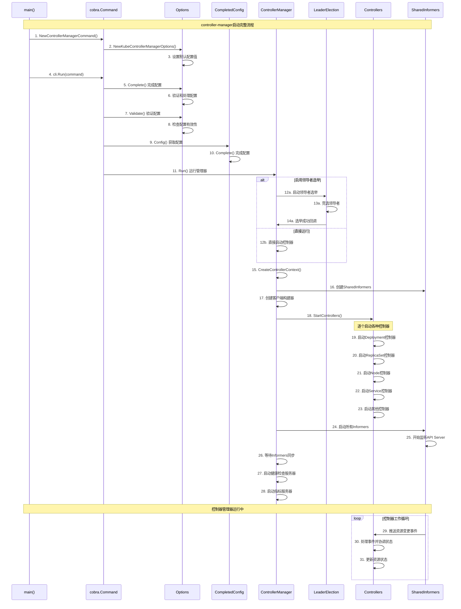
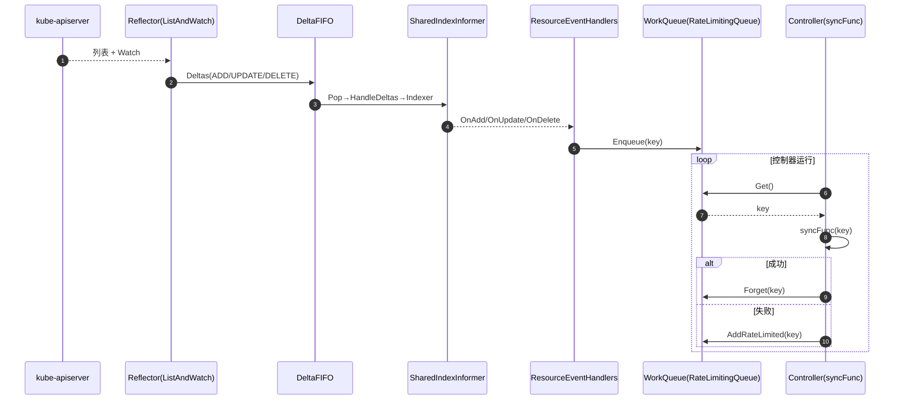

## 概述

kube-controller-manager是Kubernetes控制平面的核心组件，运行着集群中的各种控制器。这些控制器监视集群状态，并在当前状态与期望状态不符时进行必要的更改。每个控制器都试图将当前集群状态更接近期望状态。kube-controller-manager的源码实现，揭示其精妙的控制循环机制。

<!--more-->

## 1. kube-controller-manager架构设计

### 1.1 整体架构概览

```mermaid
graph TB
    subgraph "kube-controller-manager 核心架构"
        subgraph "控制器管理器核心"
            MAIN[Controller Manager Main<br/>控制器管理器主控制器<br/>- 启动协调<br/>- 生命周期管理<br/>- 领导者选举<br/>- 优雅关闭]
            
            LEADER_ELECTION[Leader Election<br/>领导者选举<br/>- 主备切换<br/>- 租约管理<br/>- 故障检测<br/>- 自动恢复]
            
            SHARED_INFORMER[Shared Informer Factory<br/>共享Informer工厂<br/>- 资源监听<br/>- 事件分发<br/>- 缓存管理<br/>- 状态同步]
        end
        
        subgraph "核心控制器"
            DEPLOYMENT[Deployment Controller<br/>部署控制器<br/>- ReplicaSet管理<br/>- 滚动更新<br/>- 版本回滚<br/>- 发布策略]
            
            REPLICASET[ReplicaSet Controller<br/>副本集控制器<br/>- Pod副本管理<br/>- 标签选择器<br/>- 扩缩容控制<br/>- 故障恢复]
            
            NODE[Node Controller<br/>节点控制器<br/>- 节点状态监控<br/>- 心跳检测<br/>- Pod驱逐<br/>- 污点管理]
            
            SERVICE[Service Controller<br/>服务控制器<br/>- Endpoints管理<br/>- 负载均衡器<br/>- NodePort分配<br/>- 云平台集成]
            
            NAMESPACE[Namespace Controller<br/>命名空间控制器<br/>- 资源清理<br/>- 终结器处理<br/>- 级联删除<br/>- 生命周期管理]
        end
        
        subgraph "资源控制器"
            PV[PersistentVolume Controller<br/>持久卷控制器<br/>- 卷绑定<br/>- 回收策略<br/>- 状态同步<br/>- 动态供应]
            
            SA[ServiceAccount Controller<br/>服务账户控制器<br/>- Token管理<br/>- Secret创建<br/>- 权限绑定<br/>- 自动轮换]
            
            ENDPOINT[Endpoints Controller<br/>端点控制器<br/>- Service后端更新<br/>- Pod IP跟踪<br/>- 健康检查<br/>- 负载均衡]
            
            RC[ResourceQuota Controller<br/>资源配额控制器<br/>- 资源使用统计<br/>- 配额限制<br/>- 准入控制<br/>- 使用量跟踪]
        end
        
        subgraph "任务控制器"
            JOB[Job Controller<br/>任务控制器<br/>- 批处理任务<br/>- 完成状态跟踪<br/>- 失败重试<br/>- 并行控制]
            
            CRONJOB[CronJob Controller<br/>定时任务控制器<br/>- 定时调度<br/>- 任务历史管理<br/>- 并发策略<br/>- 时区处理]
            
            DAEMONSET[DaemonSet Controller<br/>守护进程集控制器<br/>- 节点级部署<br/>- 滚动更新<br/>- 节点选择器<br/>- 污点容忍]
            
            STATEFULSET[StatefulSet Controller<br/>有状态集控制器<br/>- 有序部署<br/>- 持久化存储<br/>- 网络标识<br/>- 滚动更新]
        end
        
        subgraph "安全控制器"
            CERTIFICATE[Certificate Controller<br/>证书控制器<br/>- 证书签发<br/>- 证书轮换<br/>- CA管理<br/>- 安全审计]
            
            CSRAPPROVING[CSR Approving Controller<br/>证书签名请求控制器<br/>- 自动批准<br/>- 策略检查<br/>- 安全验证<br/>- 权限控制]
            
            DISRUPTION[PodDisruptionBudget Controller<br/>Pod中断预算控制器<br/>- 中断策略<br/>- 最小可用副本<br/>- 优雅终止<br/>- 滚动更新保护]
        end
        
        subgraph "网络控制器"
            INGRESS[Ingress Controller<br/>入口控制器<br/>- HTTP路由<br/>- SSL终止<br/>- 负载均衡<br/>- 域名管理]
            
            NETWORK_POLICY[NetworkPolicy Controller<br/>网络策略控制器<br/>- 流量控制<br/>- 安全隔离<br/>- 规则同步<br/>- 策略执行]
        end
    end
    
    %% 组件间连接关系
    MAIN --> LEADER_ELECTION
    MAIN --> SHARED_INFORMER
    
    SHARED_INFORMER --> DEPLOYMENT
    SHARED_INFORMER --> REPLICASET
    SHARED_INFORMER --> NODE
    SHARED_INFORMER --> SERVICE
    SHARED_INFORMER --> NAMESPACE
    
    SHARED_INFORMER --> PV
    SHARED_INFORMER --> SA
    SHARED_INFORMER --> ENDPOINT
    SHARED_INFORMER --> RC
    
    SHARED_INFORMER --> JOB
    SHARED_INFORMER --> CRONJOB
    SHARED_INFORMER --> DAEMONSET
    SHARED_INFORMER --> STATEFULSET
    
    SHARED_INFORMER --> CERTIFICATE
    SHARED_INFORMER --> CSRAPPROVING
    SHARED_INFORMER --> DISRUPTION
    
    SHARED_INFORMER --> INGRESS
    SHARED_INFORMER --> NETWORK_POLICY
    
    %% 样式定义
    classDef managerCore fill:#e1f5fe,stroke:#01579b,stroke-width:2px
    classDef coreController fill:#f3e5f5,stroke:#4a148c,stroke-width:2px
    classDef resourceController fill:#e8f5e8,stroke:#1b5e20,stroke-width:2px
    classDef workloadController fill:#fff3e0,stroke:#e65100,stroke-width:2px
    classDef securityController fill:#fce4ec,stroke:#880e4f,stroke-width:2px
    classDef networkController fill:#e0f2f1,stroke:#004d40,stroke-width:2px
    
    class MAIN,LEADER_ELECTION,SHARED_INFORMER managerCore
    class DEPLOYMENT,REPLICASET,NODE,SERVICE,NAMESPACE coreController
    class PV,SA,ENDPOINT,RC resourceController
    class JOB,CRONJOB,DAEMONSET,STATEFULSET workloadController
    class CERTIFICATE,CSRAPPROVING,DISRUPTION securityController
    class INGRESS,NETWORK_POLICY networkController
```



### 1.2 核心数据结构

#### 1.2.1 ControllerManager主结构体

```go
// ControllerManager 控制器管理器主结构体
// 文件路径: cmd/kube-controller-manager/app/controllermanager.go
type ControllerManager struct {
    // GenericControllerManager 通用控制器管理器
    *controllermanager.GenericControllerManager
    
    // SecureServing 安全服务配置
    SecureServing *apiserver.SecureServingInfo
    
    // InsecureServing 非安全服务配置（已废弃）
    InsecureServing *controllermanager.InsecureServingInfo
    
    // Authentication 认证配置
    Authentication apiserver.AuthenticationInfo
    
    // Authorization 授权配置
    Authorization apiserver.AuthorizationInfo
    
    // KubeCloudShared 云平台共享配置
    KubeCloudShared *cpconfig.KubeCloudSharedConfiguration
    
    // ServiceController 服务控制器配置
    ServiceController *serviceconfig.ServiceControllerConfiguration
    
    // AttachDetachController 附加分离控制器配置
    AttachDetachController *attachdetach.AttachDetachControllerConfiguration
    
    // CSRSigningController 证书签名控制器配置
    CSRSigningController *csrsigningconfig.CSRSigningControllerConfiguration
    
    // Extra 额外配置
    Extra ExtraConfig
}

// ExtraConfig 额外配置结构体
type ExtraConfig struct {
    // ClientBuilder 客户端构建器
    ClientBuilder clientbuilder.ControllerClientBuilder
    
    // EventRecorder 事件记录器
    EventRecorder events.EventRecorder
    
    // LeaderElection 领导者选举配置
    LeaderElection *leaderelection.LeaderElectionConfig
    
    // LeaderElectionResourceLock 领导者选举资源锁类型
    LeaderElectionResourceLock string
}

// ControllerContext 控制器上下文
type ControllerContext struct {
    // ClientBuilder 客户端构建器
    ClientBuilder clientbuilder.ControllerClientBuilder
    
    // InformerFactory Informer工厂
    InformerFactory informers.SharedInformerFactory
    
    // ComponentConfig 组件配置
    ComponentConfig kubectrlmgrconfig.KubeControllerManagerConfiguration
    
    // DeferredDiscoveryRESTMapper 延迟发现REST映射器
    DeferredDiscoveryRESTMapper *restmapper.DeferredDiscoveryRESTMapper
    
    // AvailableResources 可用资源映射
    AvailableResources map[schema.GroupVersionResource]bool
    
    // Cloud 云平台接口
    Cloud cloudprovider.Interface
    
    // LoopMode 循环模式
    LoopMode ControllerManagerLoopMode
    
    // Stop 停止信号通道
    Stop <-chan struct{}
    
    // InformersStarted Informers启动信号通道
    InformersStarted chan struct{}
    
    // ResyncPeriod 重新同步周期
    ResyncPeriod func() time.Duration
    
    // ControllerManagerMetrics 控制器管理器指标
    ControllerManagerMetrics *controllermanager.ControllerManagerMetrics
}
```

#### 1.2.2 控制器接口定义

```go
// Controller 控制器接口
// 文件路径: pkg/controller/controller_utils.go
type Controller interface {
    // Run 运行控制器
    // workers: 工作协程数量
    // stopCh: 停止信号通道
    Run(workers int, stopCh <-chan struct{})
    
    // HasSynced 检查控制器是否已同步
    HasSynced() bool
    
    // LastSyncResourceVersion 返回最后同步的资源版本
    LastSyncResourceVersion() string
}

// ControllerInitFunc 控制器初始化函数类型
type ControllerInitFunc func(ctx ControllerContext) (controller Controller, enabled bool, err error)

// InitFunc 控制器初始化函数映射
var InitFuncs = map[string]ControllerInitFunc{
    "deployment":                   startDeploymentController,
    "replicaset":                   startReplicaSetController,
    "node":                         startNodeController,
    "service":                      startServiceController,
    "namespace":                    startNamespaceController,
    "persistentvolume-binder":      startPersistentVolumeBinderController,
    "serviceaccount":               startServiceAccountController,
    "endpoints":                    startEndpointController,
    "resourcequota":                startResourceQuotaController,
    "job":                          startJobController,
    "cronjob":                      startCronJobController,
    "daemonset":                    startDaemonSetController,
    "statefulset":                  startStatefulSetController,
    "certificatesigningrequest":    startCSRSigningController,
    "disruption":                   startDisruptionController,
    // ... 更多控制器
}

// NewControllerInitializers 创建控制器初始化器映射
func NewControllerInitializers(loopMode ControllerManagerLoopMode) map[string]ControllerInitFunc {
    controllers := map[string]ControllerInitFunc{}
    
    // 注册所有控制器
    for name, initFunc := range InitFuncs {
        controllers[name] = initFunc
    }
    
    return controllers
}
```

## 2. 启动流程深度解析

### 2.1 main函数入口

```go
// main kube-controller-manager主函数入口
// 文件路径: cmd/kube-controller-manager/controller-manager.go
func main() {
    // 创建kube-controller-manager命令对象
    command := app.NewControllerManagerCommand()
    
    // 使用component-base的CLI运行器执行命令
    code := cli.Run(command)
    
    // 以返回的退出码结束程序
    os.Exit(code)
}
```

### 2.2 命令创建和配置

```go
// NewControllerManagerCommand 创建控制器管理器命令
// 文件路径: cmd/kube-controller-manager/app/controllermanager.go
func NewControllerManagerCommand() *cobra.Command {
    // 创建默认配置
    s, err := options.NewKubeControllerManagerOptions()
    if err != nil {
        klog.ErrorS(err, "Unable to initialize command options")
        klog.FlushAndExit(klog.ExitFlushTimeout, 1)
    }

    cmd := &cobra.Command{
        Use: "kube-controller-manager",
        Long: `The Kubernetes controller manager is a daemon that embeds
the core control loops shipped with Kubernetes. In applications of robotics and
automation, a control loop is a non-terminating loop that regulates the state of
the system. In Kubernetes, a controller is a control loop that watches the shared
state of the cluster through the apiserver and makes changes attempting to move the
current state towards the desired state. Examples of controllers that ship with
Kubernetes today are the replication controller, endpoints controller, namespace
controller, and serviceaccounts controller.`,

        // 禁用在命令错误时打印使用说明
        SilenceUsage: true,
        
        // 预运行钩子
        PersistentPreRunE: func(*cobra.Command, []string) error {
            // 设置默认的klog标志
            if err := s.Complete(); err != nil {
                return err
            }
            
            if err := s.Validate(); err != nil {
                return err
            }
            
            return nil
        },
        
        // 主运行函数
        RunE: func(cmd *cobra.Command, args []string) error {
            verflag.PrintAndExitIfRequested()
            
            // 应用配置
            c, err := s.Config(KnownControllers(), ControllersDisabledByDefault.List())
            if err != nil {
                return err
            }
            
            // 运行控制器管理器
            return Run(c.Complete(), setupSignalHandler())
        },
        
        Args: func(cmd *cobra.Command, args []string) error {
            for _, arg := range args {
                if len(arg) > 0 {
                    return fmt.Errorf("%q does not take any arguments, got %q", cmd.CommandPath(), args)
                }
            }
            return nil
        },
    }

    // 添加标志
    fs := cmd.Flags()
    namedFlagSets := s.Flags(KnownControllers(), ControllersDisabledByDefault.List())
    verflag.AddFlags(namedFlagSets.FlagSet("global"))
    globalflag.AddGlobalFlags(namedFlagSets.FlagSet("global"), cmd.Name(), logs.SkipLoggingConfigurationFlags())
    
    for _, f := range namedFlagSets.FlagSets {
        fs.AddFlagSet(f)
    }

    cols, _, _ := term.TerminalSize(cmd.OutOrStdout())
    cliflag.SetUsageAndHelpFunc(cmd, namedFlagSets, cols)

    return cmd
}

// Run 运行控制器管理器
func Run(c *config.CompletedConfig, stopCh <-chan struct{}) error {
    // 运行控制器管理器
    run := func(ctx context.Context, startSATokenController InitFunc, initializersFunc ControllerInitializersFunc) {
        // 创建控制器上下文
        controllerContext, err := CreateControllerContext(c, rootClientBuilder, clientBuilder, ctx.Done())
        if err != nil {
            klog.ErrorS(err, "Error building controller context")
            return
        }
        
        // 启动SAToken控制器
        saTokenControllerInitFunc := startSATokenController(controllerContext)
        if saTokenControllerInitFunc != nil {
            go saTokenControllerInitFunc(ctx, controllerContext)
        }
        
        // 启动所有控制器
        if err := StartControllers(ctx, controllerContext, initializersFunc, unsecuredMux, healthzHandler); err != nil {
            klog.ErrorS(err, "Error starting controllers")
            return
        }
        
        // 启动Informers
        controllerContext.InformerFactory.Start(ctx.Done())
        controllerContext.ObjectOrMetadataInformerFactory.Start(ctx.Done())
        close(controllerContext.InformersStarted)
        
        // 等待停止信号
        <-ctx.Done()
    }
    
    // 如果启用了领导者选举，则在选举成功后运行
    if c.ComponentConfig.LeaderElection.LeaderElect {
        id, err := os.Hostname()
        if err != nil {
            return err
        }
        
        // 添加唯一标识符避免冲突
        id = id + "_" + string(uuid.NewUUID())
        
        // 配置领导者选举
        rl, err := resourcelock.New(c.ComponentConfig.LeaderElection.ResourceLock,
            c.ComponentConfig.LeaderElection.ResourceNamespace,
            c.ComponentConfig.LeaderElection.ResourceName,
            c.LeaderElectionClient.CoreV1(),
            c.LeaderElectionClient.CoordinationV1(),
            resourcelock.ResourceLockConfig{
                Identity:      id,
                EventRecorder: c.EventRecorder,
            })
        if err != nil {
            return fmt.Errorf("couldn't create resource lock: %v", err)
        }
        
        // 启动领导者选举
        leaderelection.RunOrDie(context.TODO(), leaderelection.LeaderElectionConfig{
            Lock:          rl,
            LeaseDuration: c.ComponentConfig.LeaderElection.LeaseDuration.Duration,
            RenewDeadline: c.ComponentConfig.LeaderElection.RenewDeadline.Duration,
            RetryPeriod:   c.ComponentConfig.LeaderElection.RetryPeriod.Duration,
            Callbacks: leaderelection.LeaderCallbacks{
                OnStartedLeading: func(ctx context.Context) {
                    initializersFunc := NewControllerInitializers
                    run(ctx, startSATokenController, initializersFunc)
                },
                OnStoppedLeading: func() {
                    klog.ErrorS(nil, "Leaderelection lost")
                    klog.FlushAndExit(klog.ExitFlushTimeout, 1)
                },
            },
            WatchDog: electionChecker,
            Name:     "kube-controller-manager",
        })
        
        panic("unreachable")
    } else {
        // 直接运行，不进行领导者选举
        ctx, cancel := context.WithCancel(context.TODO())
        defer cancel()
        go func() {
            <-stopCh
            cancel()
        }()
        
        run(ctx, startSATokenController, NewControllerInitializers)
    }
    
    return nil
}
```

### 2.3 控制器启动流程

```go
// StartControllers 启动所有控制器
// 文件路径: cmd/kube-controller-manager/app/controllermanager.go
func StartControllers(ctx context.Context, controllerCtx ControllerContext, controllers map[string]ControllerInitFunc, 
    unsecuredMux *mux.PathRecorderMux, healthzHandler *controllerhealthz.MutableHealthzHandler) error {
    
    // 启动每个控制器
    for controllerName, initFn := range controllers {
        if !controllerCtx.IsControllerEnabled(controllerName) {
            klog.InfoS("Controller is disabled", "controller", controllerName)
            continue
        }
        
        klog.V(1).InfoS("Starting controller", "controller", controllerName)
        
        // 调用控制器初始化函数
        ctrl, started, err := initFn(controllerCtx)
        if err != nil {
            klog.ErrorS(err, "Error starting controller", "controller", controllerName)
            return err
        }
        if !started {
            klog.InfoS("Controller not started", "controller", controllerName)
            continue
        }
        
        // 添加健康检查
        check := controllerhealthz.NamedCheck(controllerName, func(req *http.Request) error {
            return ctrl.Healthz()
        })
        healthzHandler.AddHealthChecker(check)
        
        klog.InfoS("Started controller", "controller", controllerName)
    }
    
    return nil
}

// CreateControllerContext 创建控制器上下文
func CreateControllerContext(c *config.CompletedConfig, rootClientBuilder, clientBuilder clientbuilder.ControllerClientBuilder, stop <-chan struct{}) (ControllerContext, error) {
    // 创建版本化Informer工厂
    versionedClient := rootClientBuilder.ClientOrDie("shared-informers")
    sharedInformers := informers.NewSharedInformerFactory(versionedClient, ResyncPeriod(c)())
    
    // 创建元数据Informer工厂
    metadataClient := metadata.NewForConfigOrDie(rootClientBuilder.ConfigOrDie("metadata-informers"))
    metadataInformers := metadatainformer.NewSharedInformerFactory(metadataClient, ResyncPeriod(c)())
    
    // 如果启用了动态资源分配，创建动态Informer工厂
    var dynamicInformers dynamicinformer.DynamicSharedInformerFactory
    if utilfeature.DefaultFeatureGate.Enabled(features.DynamicResourceAllocation) {
        dynamicClient := dynamic.NewForConfigOrDie(rootClientBuilder.ConfigOrDie("dynamic-resource-allocation-informers"))
        dynamicInformers = dynamicinformer.NewFilteredDynamicSharedInformerFactory(dynamicClient, ResyncPeriod(c)(), metav1.NamespaceAll, nil)
    }
    
    // 创建可用资源映射
    availableResources, err := GetAvailableResources(rootClientBuilder)
    if err != nil {
        return ControllerContext{}, err
    }
    
    // 创建云平台接口
    cloud, loopMode, err := createCloudProvider(c.ComponentConfig.KubeCloudShared.CloudProvider.Name, c.ComponentConfig.KubeCloudShared.ExternalCloudVolumePlugin,
        c.ComponentConfig.KubeCloudShared.CloudProvider.CloudConfigFile, c.ComponentConfig.KubeCloudShared.AllowUntaggedCloud, sharedInformers)
    if err != nil {
        return ControllerContext{}, err
    }
    
    // 返回控制器上下文
    return ControllerContext{
        ClientBuilder:                   clientBuilder,
        InformerFactory:                sharedInformers,
        ObjectOrMetadataInformerFactory: informerfactory.NewInformerFactory(sharedInformers, metadataInformers),
        DynamicInformerFactory:         dynamicInformers,
        ComponentConfig:                c.ComponentConfig,
        RESTMapper:                     restMapper,
        AvailableResources:             availableResources,
        Cloud:                          cloud,
        LoopMode:                       loopMode,
        Stop:                           stop,
        InformersStarted:               make(chan struct{}),
        ResyncPeriod:                   ResyncPeriod(c),
        ControllerManagerMetrics:       controllermanager.NewControllerManagerMetrics("kube-controller-manager"),
    }, nil
}
```

### 2.4 启动时序图



### 2.5 控制器事件流时序图（API→Informer→Queue→Workers）



## 3. 控制器模式深度解析

### 3.1 通用控制器结构

```go
// Controller 通用控制器结构体
// 文件路径: pkg/controller/controller_utils.go
type Controller struct {
    // 名称
    name string
    
    // Kubernetes客户端
    kubeClient clientset.Interface
    
    // 工作队列
    queue workqueue.RateLimitingInterface
    
    // Informer和Lister
    informer cache.SharedIndexInformer
    lister   cache.GenericLister
    
    // 同步函数
    syncFunc func(key string) error
    
    // 事件记录器
    recorder record.EventRecorder
    
    // 工作协程数
    workers int
    
    // 同步状态
    hasSynced func() bool
}

// NewController 创建通用控制器
func NewController(name string, kubeClient clientset.Interface, informer cache.SharedIndexInformer, 
    syncFunc func(string) error) *Controller {
    
    // 创建工作队列
    queue := workqueue.NewNamedRateLimitingQueue(
        workqueue.DefaultControllerRateLimiter(), name)
    
    // 创建事件记录器
    eventBroadcaster := record.NewBroadcaster()
    eventBroadcaster.StartStructuredLogging(0)
    eventBroadcaster.StartRecordingToSink(&typedcorev1.EventSinkImpl{
        Interface: kubeClient.CoreV1().Events(""),
    })
    recorder := eventBroadcaster.NewRecorder(scheme.Scheme, corev1.EventSource{Component: name})
    
    controller := &Controller{
        name:       name,
        kubeClient: kubeClient,
        queue:      queue,
        informer:   informer,
        lister:     listers.NewGenericLister(informer.GetIndexer(), resource),
        syncFunc:   syncFunc,
        recorder:   recorder,
        workers:    1,
        hasSynced:  informer.HasSynced,
    }
    
    // 设置事件处理器
    informer.AddEventHandler(cache.ResourceEventHandlerFuncs{
        AddFunc: func(obj interface{}) {
            controller.enqueue(obj)
        },
        UpdateFunc: func(oldObj, newObj interface{}) {
            controller.enqueue(newObj)
        },
        DeleteFunc: func(obj interface{}) {
            controller.enqueue(obj)
        },
    })
    
    return controller
}

// Run 运行控制器
func (c *Controller) Run(workers int, stopCh <-chan struct{}) {
    defer utilruntime.HandleCrash()
    defer c.queue.ShutDown()
    
    klog.InfoS("Starting controller", "controller", c.name)
    defer klog.InfoS("Shutting down controller", "controller", c.name)
    
    // 等待缓存同步
    if !cache.WaitForCacheSync(stopCh, c.hasSynced) {
        utilruntime.HandleError(fmt.Errorf("failed to wait for %s caches to sync", c.name))
        return
    }
    
    // 启动工作协程
    for i := 0; i < workers; i++ {
        go wait.Until(c.runWorker, time.Second, stopCh)
    }
    
    <-stopCh
}

// runWorker 运行工作协程
func (c *Controller) runWorker() {
    for c.processNextWorkItem() {
    }
}

// processNextWorkItem 处理下一个工作项
func (c *Controller) processNextWorkItem() bool {
    obj, shutdown := c.queue.Get()
    if shutdown {
        return false
    }
    
    // 处理工作项
    err := func(obj interface{}) error {
        defer c.queue.Done(obj)
        
        var key string
        var ok bool
        
        if key, ok = obj.(string); !ok {
            // 无效的工作项，丢弃
            c.queue.Forget(obj)
            utilruntime.HandleError(fmt.Errorf("expected string in workqueue but got %#v", obj))
            return nil
        }
        
        // 调用同步函数处理
        if err := c.syncFunc(key); err != nil {
            // 同步失败，重新入队
            c.queue.AddRateLimited(key)
            return fmt.Errorf("error syncing '%s': %s, requeuing", key, err.Error())
        }
        
        // 同步成功，从队列中移除
        c.queue.Forget(obj)
        klog.V(4).InfoS("Successfully synced", "controller", c.name, "key", key)
        return nil
    }(obj)
    
    if err != nil {
        utilruntime.HandleError(err)
        return true
    }
    
    return true
}

// enqueue 将对象加入工作队列
func (c *Controller) enqueue(obj interface{}) {
    var key string
    var err error
    
    if key, err = cache.DeletionHandlingMetaNamespaceKeyFunc(obj); err != nil {
        utilruntime.HandleError(err)
        return
    }
    
    c.queue.Add(key)
}
```

## 4. 核心控制器实现分析

### 4.1 Deployment控制器

```go
// DeploymentController Deployment控制器结构体
// 文件路径: pkg/controller/deployment/deployment_controller.go
type DeploymentController struct {
    // rsControl ReplicaSet控制接口
    rsControl controller.RSControlInterface
    
    // client Kubernetes客户端
    client clientset.Interface
    
    // eventRecorder 事件记录器
    eventRecorder record.EventRecorder
    
    // syncHandler 同步处理函数
    syncHandler func(ctx context.Context, dKey string) error
    
    // enqueueDeployment 入队函数
    enqueueDeployment func(deployment *apps.Deployment)
    
    // Deployment相关
    dLister appslisters.DeploymentLister
    dListerSynced cache.InformerSynced
    
    // ReplicaSet相关
    rsLister appslisters.ReplicaSetLister
    rsListerSynced cache.InformerSynced
    
    // Pod相关
    podLister corelisters.PodLister
    podListerSynced cache.InformerSynced
    
    // 工作队列
    queue workqueue.RateLimitingInterface
}

// NewDeploymentController 创建Deployment控制器
func NewDeploymentController(ctx context.Context, dInformer appsinformers.DeploymentInformer, rsInformer appsinformers.ReplicaSetInformer, podInformer coreinformers.PodInformer, client clientset.Interface) (*DeploymentController, error) {
    eventBroadcaster := record.NewBroadcaster()
    eventBroadcaster.StartStructuredLogging(0)
    eventBroadcaster.StartRecordingToSink(&v1core.EventSinkImpl{Interface: client.CoreV1().Events("")})
    
    dc := &DeploymentController{
        client:        client,
        eventRecorder: eventBroadcaster.NewRecorder(scheme.Scheme, v1.EventSource{Component: "deployment-controller"}),
        queue:         workqueue.NewNamedRateLimitingQueue(workqueue.DefaultControllerRateLimiter(), "deployment"),
    }
    
    dc.rsControl = controller.RealRSControl{
        KubeClient: client,
        Recorder:   dc.eventRecorder,
    }
    
    dc.syncHandler = dc.syncDeployment
    dc.enqueueDeployment = dc.enqueue
    
    // 设置Deployment事件处理器
    dInformer.Informer().AddEventHandler(cache.ResourceEventHandlerFuncs{
        AddFunc: func(obj interface{}) {
            dc.addDeployment(logger, obj)
        },
        UpdateFunc: func(oldObj, newObj interface{}) {
            dc.updateDeployment(logger, oldObj, newObj)
        },
        DeleteFunc: func(obj interface{}) {
            dc.deleteDeployment(logger, obj)
        },
    })
    dc.dLister = dInformer.Lister()
    dc.dListerSynced = dInformer.Informer().HasSynced
    
    // 设置ReplicaSet事件处理器
    rsInformer.Informer().AddEventHandler(cache.ResourceEventHandlerFuncs{
        AddFunc: func(obj interface{}) {
            dc.addReplicaSet(logger, obj)
        },
        UpdateFunc: func(oldObj, newObj interface{}) {
            dc.updateReplicaSet(logger, oldObj, newObj)
        },
        DeleteFunc: func(obj interface{}) {
            dc.deleteReplicaSet(logger, obj)
        },
    })
    dc.rsLister = rsInformer.Lister()
    dc.rsListerSynced = rsInformer.Informer().HasSynced
    
    // 设置Pod事件处理器
    podInformer.Informer().AddEventHandler(cache.ResourceEventHandlerFuncs{
        DeleteFunc: func(obj interface{}) {
            dc.deletePod(logger, obj)
        },
    })
    dc.podLister = podInformer.Lister()
    dc.podListerSynced = podInformer.Informer().HasSynced
    
    return dc, nil
}

// syncDeployment 同步Deployment的核心函数
func (dc *DeploymentController) syncDeployment(ctx context.Context, key string) error {
    logger := klog.FromContext(ctx)
    startTime := time.Now()
    logger.V(4).Info("Started syncing deployment", "key", key, "startTime", startTime)
    defer func() {
        logger.V(4).Info("Finished syncing deployment", "key", key, "duration", time.Since(startTime))
    }()
    
    // 解析键获取命名空间和名称
    namespace, name, err := cache.SplitMetaNamespaceKey(key)
    if err != nil {
        return err
    }
    
    // 从缓存中获取Deployment
    deployment, err := dc.dLister.Deployments(namespace).Get(name)
    if errors.IsNotFound(err) {
        logger.V(2).Info("Deployment has been deleted", "deployment", klog.KRef(namespace, name))
        return nil
    }
    if err != nil {
        return err
    }
    
    // 深拷贝Deployment，避免修改缓存中的对象
    d := deployment.DeepCopy()
    
    // 检查Deployment是否暂停
    if d.Spec.Paused {
        return dc.sync(ctx, d, nil)
    }
    
    // 获取该Deployment的所有ReplicaSets
    rsList, err := dc.getReplicaSetsForDeployment(ctx, d)
    if err != nil {
        return err
    }
    
    // 获取该Deployment的所有Pods
    podMap, err := dc.getPodMapForDeployment(d, rsList)
    if err != nil {
        return err
    }
    
    // 检查是否需要回滚
    if getRollbackTo(d) != nil {
        return dc.rollback(ctx, d, rsList)
    }
    
    // 检查是否需要扩缩容
    scalingEvent, err := dc.isScalingEvent(ctx, d, rsList)
    if err != nil {
        return err
    }
    if scalingEvent {
        return dc.sync(ctx, d, rsList)
    }
    
    // 根据部署策略进行更新
    switch d.Spec.Strategy.Type {
    case apps.RecreateDeploymentStrategyType:
        return dc.rolloutRecreate(ctx, d, rsList, podMap)
    case apps.RollingUpdateDeploymentStrategyType:
        return dc.rolloutRolling(ctx, d, rsList)
    }
    
    return fmt.Errorf("unexpected deployment strategy type: %s", d.Spec.Strategy.Type)
}

// rolloutRolling 执行滚动更新
func (dc *DeploymentController) rolloutRolling(ctx context.Context, d *apps.Deployment, rsList []*apps.ReplicaSet) error {
    // 找到新的和旧的ReplicaSet
    newRS, oldRSs, err := dc.getAllReplicaSetsAndSyncRevision(ctx, d, rsList, true)
    if err != nil {
        return err
    }
    
    // 获取所有活跃的ReplicaSets
    allRSs := append(oldRSs, newRS)
    
    // 扩容新的ReplicaSet
    scaledUp, err := dc.reconcileNewReplicaSet(ctx, allRSs, newRS, d)
    if err != nil {
        return err
    }
    if scaledUp {
        // 如果进行了扩容，等待扩容完成再继续
        return dc.syncRolloutStatus(ctx, allRSs, newRS, d)
    }
    
    // 缩容旧的ReplicaSets
    scaledDown, err := dc.reconcileOldReplicaSets(ctx, allRSs, controller.FilterActiveReplicaSets(oldRSs), newRS, d)
    if err != nil {
        return err
    }
    if scaledDown {
        // 如果进行了缩容，等待缩容完成再继续
        return dc.syncRolloutStatus(ctx, allRSs, newRS, d)
    }
    
    // 检查是否需要清理旧的ReplicaSets
    if deploymentutil.DeploymentComplete(d, &d.Status) {
        if err := dc.cleanupDeployment(ctx, oldRSs, d); err != nil {
            return err
        }
    }
    
    // 同步部署状态
    return dc.syncRolloutStatus(ctx, allRSs, newRS, d)
}

// reconcileNewReplicaSet 协调新的ReplicaSet
func (dc *DeploymentController) reconcileNewReplicaSet(ctx context.Context, allRSs []*apps.ReplicaSet, newRS *apps.ReplicaSet, deployment *apps.Deployment) (bool, error) {
    if newRS == nil {
        return false, nil
    }
    
    // 计算期望的副本数
    desiredReplicas := *(deployment.Spec.Replicas)
    currentReplicas := newRS.Status.Replicas
    
    // 计算滚动更新参数
    maxSurge := deploymentutil.MaxSurge(*deployment)
    
    // 计算新ReplicaSet的最大副本数
    // 不能超过期望副本数 + maxSurge
    allPodsCount := deploymentutil.GetReplicaCountForReplicaSets(allRSs)
    maxTotalPods := desiredReplicas + maxSurge
    if allPodsCount >= maxTotalPods {
        // 已经达到最大Pod数，不能再扩容
        return false, nil
    }
    
    // 计算可以扩容的副本数
    scaleUpCount := maxTotalPods - allPodsCount
    scaleUpCount = integer.IntMin(scaleUpCount, desiredReplicas-currentReplicas)
    
    if scaleUpCount <= 0 {
        return false, nil
    }
    
    // 执行扩容
    newReplicasCount := currentReplicas + scaleUpCount
    scaledRS, err := dc.scaleReplicaSetAndRecordEvent(ctx, newRS, newReplicasCount, deployment)
    if err != nil {
        return false, err
    }
    
    if scaledRS.Spec.Replicas != scaledRS.Status.Replicas {
        // 扩容正在进行中
        return true, nil
    }
    
    return false, nil
}

// reconcileOldReplicaSets 协调旧的ReplicaSets
func (dc *DeploymentController) reconcileOldReplicaSets(ctx context.Context, allRSs, oldRSs []*apps.ReplicaSet, newRS *apps.ReplicaSet, deployment *apps.Deployment) (bool, error) {
    // 计算需要缩容的副本数
    oldPodsCount := deploymentutil.GetReplicaCountForReplicaSets(oldRSs)
    if oldPodsCount == 0 {
        // 没有旧Pod，无需缩容
        return false, nil
    }
    
    // 计算滚动更新参数
    maxUnavailable := deploymentutil.MaxUnavailable(*deployment)
    desiredReplicas := *(deployment.Spec.Replicas)
    
    // 计算可用的Pod数量
    totalPodsCount := deploymentutil.GetReplicaCountForReplicaSets(allRSs)
    availablePodCount := deploymentutil.GetAvailableReplicaCountForReplicaSets(allRSs)
    
    // 计算可以缩容的副本数
    minAvailable := desiredReplicas - maxUnavailable
    newRSUnavailablePodCount := newRS.Status.Replicas - newRS.Status.AvailableReplicas
    maxScaledDown := availablePodCount - minAvailable - newRSUnavailablePodCount
    if maxScaledDown <= 0 {
        return false, nil
    }
    
    // 计算实际要缩容的副本数
    totalScaleDownCount := integer.IntMin(maxScaledDown, oldPodsCount)
    targetRS := deploymentutil.FindOldReplicaSets(deployment, allRSs)
    
    // 执行缩容
    totalScaledDown := int32(0)
    for _, targetRS := range targetRS {
        if totalScaledDown >= totalScaleDownCount {
            break
        }
        
        if targetRS.Spec.Replicas == 0 {
            // 已经缩容到0，跳过
            continue
        }
        
        // 计算这个ReplicaSet要缩容的数量
        scaleDownCount := integer.IntMin(targetRS.Spec.Replicas, totalScaleDownCount-totalScaledDown)
        newReplicasCount := targetRS.Spec.Replicas - scaleDownCount
        
        // 执行缩容
        _, err := dc.scaleReplicaSetAndRecordEvent(ctx, targetRS, newReplicasCount, deployment)
        if err != nil {
            return false, err
        }
        
        totalScaledDown += scaleDownCount
    }
    
    return totalScaledDown > 0, nil
}

// scaleReplicaSetAndRecordEvent 扩缩容ReplicaSet并记录事件
func (dc *DeploymentController) scaleReplicaSetAndRecordEvent(ctx context.Context, rs *apps.ReplicaSet, newScale int32, deployment *apps.Deployment) (*apps.ReplicaSet, error) {
    // 如果副本数没有变化，直接返回
    if rs.Spec.Replicas == newScale {
        return rs, nil
    }
    
    var scalingOperation string
    if rs.Spec.Replicas < newScale {
        scalingOperation = "up"
    } else {
        scalingOperation = "down"
    }
    
    // 更新ReplicaSet的副本数
    scaled, err := dc.scaleReplicaSet(ctx, rs, newScale, deployment, scalingOperation)
    if err != nil {
        dc.eventRecorder.Eventf(deployment, v1.EventTypeWarning, "FailedScale", "Failed to scale %s %s/%s: %v", rs.Kind, rs.Namespace, rs.Name, err)
        return nil, err
    }
    
    // 记录扩缩容事件
    dc.eventRecorder.Eventf(deployment, v1.EventTypeNormal, "ScalingReplicaSet", "Scaled %s replica set %s to %d", scalingOperation, rs.Name, newScale)
    
    return scaled, nil
}

// scaleReplicaSet 扩缩容ReplicaSet
func (dc *DeploymentController) scaleReplicaSet(ctx context.Context, rs *apps.ReplicaSet, newScale int32, deployment *apps.Deployment, scalingOperation string) (*apps.ReplicaSet, error) {
    // 计算重试次数
    size := *(rs.Spec.Replicas)
    name := rs.Name
    
    // 使用指数退避重试
    err := retry.RetryOnConflict(retry.DefaultBackoff, func() error {
        // 重新获取ReplicaSet以获取最新版本
        rs.Spec.Replicas = &newScale
        _, updateErr := dc.client.AppsV1().ReplicaSets(rs.Namespace).Update(ctx, rs, metav1.UpdateOptions{})
        if updateErr == nil {
            return nil
        }
        
        // 如果是冲突错误，重新获取并重试
        if errors.IsConflict(updateErr) {
            updated, err := dc.rsLister.ReplicaSets(rs.Namespace).Get(rs.Name)
            if err == nil {
                rs = updated.DeepCopy()
            }
        }
        return updateErr
    })
    
    if err != nil {
        return nil, fmt.Errorf("failed to scale ReplicaSet %s/%s to %d: %v", rs.Namespace, rs.Name, newScale, err)
    }
    
    return rs, nil
}
```

### 4.2 ReplicaSet控制器

```go
// ReplicaSetController ReplicaSet控制器结构体
// 文件路径: pkg/controller/replicaset/replica_set.go
type ReplicaSetController struct {
    // schema.GroupVersionKind 用于设置scheme
    schema.GroupVersionKind
    
    // kubeClient Kubernetes客户端
    kubeClient clientset.Interface
    
    // podControl Pod控制接口
    podControl controller.PodControlInterface
    
    // burstReplicas 突发副本数
    // 允许在单次同步中创建的Pod数量
    burstReplicas int
    
    // syncHandler 同步处理函数
    syncHandler func(ctx context.Context, rsKey string) error
    
    // expectations 期望管理器
    // 跟踪控制器对Pod创建/删除的期望
    expectations *controller.UIDTrackingControllerExpectations
    
    // ReplicaSet相关
    rsLister appslisters.ReplicaSetLister
    rsListerSynced cache.InformerSynced
    
    // Pod相关
    podLister corelisters.PodLister
    podListerSynced cache.InformerSynced
    
    // 工作队列
    queue workqueue.RateLimitingInterface
}

// NewReplicaSetController 创建ReplicaSet控制器
func NewReplicaSetController(ctx context.Context, rsInformer appsinformers.ReplicaSetInformer, podInformer coreinformers.PodInformer, kubeClient clientset.Interface, burstReplicas int) *ReplicaSetController {
    eventBroadcaster := record.NewBroadcaster()
    eventBroadcaster.StartStructuredLogging(0)
    eventBroadcaster.StartRecordingToSink(&v1core.EventSinkImpl{Interface: kubeClient.CoreV1().Events("")})
    
    if kubeClient != nil && kubeClient.CoreV1().RESTClient().GetRateLimiter() != nil {
        ratelimiter.RegisterMetricAndTrackRateLimiterUsage("replicaset_controller", kubeClient.CoreV1().RESTClient().GetRateLimiter())
    }
    
    rsc := &ReplicaSetController{
        GroupVersionKind: apps.SchemeGroupVersion.WithKind("ReplicaSet"),
        kubeClient:       kubeClient,
        podControl: controller.RealPodControl{
            KubeClient: kubeClient,
            Recorder:   eventBroadcaster.NewRecorder(scheme.Scheme, v1.EventSource{Component: "replicaset-controller"}),
        },
        burstReplicas: burstReplicas,
        expectations:  controller.NewUIDTrackingControllerExpectations(controller.NewControllerExpectations()),
        queue:         workqueue.NewNamedRateLimitingQueue(workqueue.DefaultControllerRateLimiter(), "replicaset"),
    }
    
    // 设置ReplicaSet事件处理器
    rsInformer.Informer().AddEventHandler(cache.ResourceEventHandlerFuncs{
        AddFunc: func(obj interface{}) {
            rsc.addRS(logger, obj)
        },
        UpdateFunc: func(oldObj, newObj interface{}) {
            rsc.updateRS(logger, oldObj, newObj)
        },
        DeleteFunc: func(obj interface{}) {
            rsc.deleteRS(logger, obj)
        },
    })
    rsc.rsLister = rsInformer.Lister()
    rsc.rsListerSynced = rsInformer.Informer().HasSynced
    
    // 设置Pod事件处理器
    podInformer.Informer().AddEventHandler(cache.ResourceEventHandlerFuncs{
        AddFunc: func(obj interface{}) {
            rsc.addPod(logger, obj)
        },
        UpdateFunc: func(oldObj, newObj interface{}) {
            rsc.updatePod(logger, oldObj, newObj)
        },
        DeleteFunc: func(obj interface{}) {
            rsc.deletePod(logger, obj)
        },
    })
    rsc.podLister = podInformer.Lister()
    rsc.podListerSynced = podInformer.Informer().HasSynced
    
    rsc.syncHandler = rsc.syncReplicaSet
    return rsc
}

// syncReplicaSet 同步ReplicaSet的核心函数
func (rsc *ReplicaSetController) syncReplicaSet(ctx context.Context, key string) error {
    logger := klog.FromContext(ctx)
    startTime := time.Now()
    defer func() {
        logger.V(4).Info("Finished syncing replica set", "key", key, "duration", time.Since(startTime))
    }()
    
    // 解析键获取命名空间和名称
    namespace, name, err := cache.SplitMetaNamespaceKey(key)
    if err != nil {
        return err
    }
    
    // 从缓存中获取ReplicaSet
    rs, err := rsc.rsLister.ReplicaSets(namespace).Get(name)
    if errors.IsNotFound(err) {
        logger.V(4).Info("Replica set has been deleted", "replicaSet", klog.KRef(namespace, name))
        rsc.expectations.DeleteExpectations(key)
        return nil
    }
    if err != nil {
        return err
    }
    
    logger.V(4).Info("Syncing replica set", "replicaSet", klog.KObj(rs), "replicas", rs.Spec.Replicas)
    
    // 检查期望是否满足
    rsNeedsSync := rsc.expectations.SatisfiedExpectations(key)
    selector, err := metav1.LabelSelectorAsSelector(rs.Spec.Selector)
    if err != nil {
        utilruntime.HandleError(fmt.Errorf("error converting pod selector to selector: %v", err))
        return nil
    }
    
    // 获取所有匹配的Pod
    allPods, err := rsc.podLister.Pods(rs.Namespace).List(labels.Everything())
    if err != nil {
        return err
    }
    
    // 过滤出属于这个ReplicaSet的Pod
    filteredPods := controller.FilterActivePods(allPods)
    filteredPods, err = rsc.claimPods(ctx, rs, selector, filteredPods)
    if err != nil {
        return err
    }
    
    var manageReplicasErr error
    if rsNeedsSync && rs.DeletionTimestamp == nil {
        // 管理副本数
        manageReplicasErr = rsc.manageReplicas(ctx, filteredPods, rs)
    }
    
    // 更新ReplicaSet状态
    rs = rs.DeepCopy()
    newStatus := calculateStatus(rs, filteredPods, manageReplicasErr)
    
    // 更新状态到API服务器
    updatedRS, err := updateReplicaSetStatus(logger, rsc.kubeClient.AppsV1().ReplicaSets(rs.Namespace), rs, newStatus)
    if err != nil {
        // 状态更新失败，重新入队
        return err
    }
    
    // 如果期望的副本数为0且实际副本数也为0，可以删除ReplicaSet
    if manageReplicasErr == nil && updatedRS.Spec.Replicas != nil && *updatedRS.Spec.Replicas == 0 &&
        updatedRS.Status.Replicas == 0 {
        logger.V(2).Info("Replica set has 0 replicas and 0 pods", "replicaSet", klog.KObj(updatedRS))
    }
    
    return manageReplicasErr
}

// manageReplicas 管理副本数
func (rsc *ReplicaSetController) manageReplicas(ctx context.Context, filteredPods []*v1.Pod, rs *apps.ReplicaSet) error {
    diff := len(filteredPods) - int(*(rs.Spec.Replicas))
    rsKey, err := controller.KeyFunc(rs)
    if err != nil {
        utilruntime.HandleError(fmt.Errorf("couldn't get key for %v %#v: %v", rsc.Kind, rs, err))
        return nil
    }
    
    logger := klog.FromContext(ctx)
    if diff < 0 {
        // 需要创建更多Pod
        diff *= -1
        if diff > rsc.burstReplicas {
            diff = rsc.burstReplicas
        }
        
        // 设置期望
        rsc.expectations.ExpectCreations(rsKey, diff)
        
        logger.V(2).Info("Too few replicas", "replicaSet", klog.KObj(rs), "need", *(rs.Spec.Replicas), "have", len(filteredPods), "creating", diff)
        
        // 并发创建Pod
        successfulCreations, err := slowStartBatch(diff, controller.SlowStartInitialBatchSize, func() error {
            err := rsc.podControl.CreatePods(ctx, rs.Namespace, &rs.Spec.Template, rs, metav1.NewControllerRef(rs, rsc.GroupVersionKind))
            if err != nil {
                if apierrors.HasStatusCause(err, v1.NamespaceTerminatingCause) {
                    // 如果命名空间正在终止，不记录为错误
                    return nil
                }
            }
            return err
        })
        
        // 如果创建失败，调整期望
        if skippedPods := diff - successfulCreations; skippedPods > 0 {
            logger.V(2).Info("Slow-start failure. Skipping creation of pods", "skippedPods", skippedPods, "kind", rsc.Kind, "replicaSet", klog.KObj(rs))
            for i := 0; i < skippedPods; i++ {
                rsc.expectations.CreationObserved(rsKey)
            }
        }
        return err
        
    } else if diff > 0 {
        // 需要删除多余的Pod
        if diff > rsc.burstReplicas {
            diff = rsc.burstReplicas
        }
        
        logger.V(2).Info("Too many replicas", "replicaSet", klog.KObj(rs), "need", *(rs.Spec.Replicas), "have", len(filteredPods), "deleting", diff)
        
        // 选择要删除的Pod
        podsToDelete := getPodsToDelete(filteredPods, diff)
        
        // 设置期望
        rsc.expectations.ExpectDeletions(rsKey, getPodKeys(podsToDelete))
        
        // 并发删除Pod
        errCh := make(chan error, diff)
        var wg sync.WaitGroup
        wg.Add(diff)
        for _, pod := range podsToDelete {
            go func(targetPod *v1.Pod) {
                defer wg.Done()
                if err := rsc.podControl.DeletePod(ctx, rs.Namespace, targetPod.Name, rs); err != nil {
                    // 删除失败，调整期望
                    podKey := controller.PodKey(targetPod)
                    logger.V(2).Info("Failed to delete pod, decreasing expectations", "pod", podKey, "replicaSet", klog.KObj(rs))
                    rsc.expectations.DeletionObserved(rsKey, podKey)
                    errCh <- err
                }
            }(pod)
        }
        wg.Wait()
        
        // 收集错误
        select {
        case err := <-errCh:
            // 只返回第一个错误
            if err != nil {
                return err
            }
        default:
        }
    }
    
    return nil
}

// getPodsToDelete 选择要删除的Pod
func getPodsToDelete(filteredPods []*v1.Pod, diff int) []*v1.Pod {
    // 按优先级排序Pod，优先删除：
    // 1. 未调度的Pod
    // 2. 未就绪的Pod  
    // 3. 就绪时间较短的Pod
    // 4. 重启次数较多的Pod
    // 5. 创建时间较新的Pod
    
    sort.Sort(controller.ActivePods(filteredPods))
    return filteredPods[:diff]
}

// slowStartBatch 慢启动批量操作
func slowStartBatch(count int, initialBatchSize int, fn func() error) (int, error) {
    remaining := count
    successes := 0
    batchSize := integer.IntMin(remaining, initialBatchSize)
    
    for batchSize > 0 {
        errCh := make(chan error, batchSize)
        var wg sync.WaitGroup
        wg.Add(batchSize)
        
        // 并发执行批量操作
        for i := 0; i < batchSize; i++ {
            go func() {
                defer wg.Done()
                if err := fn(); err != nil {
                    errCh <- err
                }
            }()
        }
        wg.Wait()
        
        // 检查错误
        curSuccesses := batchSize
        curErrors := 0
        for i := 0; i < batchSize; i++ {
            select {
            case err := <-errCh:
                curErrors++
                curSuccesses--
                if !shouldRetry(err) {
                    continue
                }
            default:
                break
            }
        }
        
        successes += curSuccesses
        if curErrors > 0 && curSuccesses == 0 {
            return successes, fmt.Errorf("error in batch operation")
        }
        
        // 计算下一批的大小
        remaining -= batchSize
        batchSize = integer.IntMin(2*batchSize, remaining)
    }
    
    return successes, nil
}
```

### 4.3 Node控制器

```go
// NodeController 节点控制器结构体
// 文件路径: pkg/controller/nodelifecycle/node_lifecycle_controller.go
type Controller struct {
    // taintManager 污点管理器
    taintManager *scheduler.NoExecuteTaintManager
    
    // podUpdateWorkerSize Pod更新工作协程数
    podUpdateWorkerSize int
    
    // nodeUpdateWorkerSize 节点更新工作协程数  
    nodeUpdateWorkerSize int
    
    // nodeUpdateChannelSize 节点更新通道大小
    nodeUpdateChannelSize int
    
    // podUpdateChannelSize Pod更新通道大小
    podUpdateChannelSize int
    
    // lookupIP IP查找函数
    lookupIP func(host string) ([]net.IP, error)
    
    // now 当前时间函数（用于测试）
    now func() metav1.Time
    
    // kubeClient Kubernetes客户端
    kubeClient clientset.Interface
    
    // recorder 事件记录器
    recorder record.EventRecorder
    
    // 节点监控参数
    nodeMonitorPeriod time.Duration
    
    // 节点监控宽限期
    nodeMonitorGracePeriod time.Duration
    
    // 节点启动宽限期
    nodeStartupGracePeriod time.Duration
    
    // Pod驱逐超时
    podEvictionTimeout time.Duration
    
    // 驱逐限制器QPS
    evictionLimiterQPS float32
    
    // 二级节点驱逐限制器QPS
    secondaryEvictionLimiterQPS float32
    
    // 大集群阈值
    largeClusterThreshold int32
    
    // 不健康节点阈值
    unhealthyZoneThreshold float32
    
    // 节点相关
    nodeLister         corelisters.NodeLister
    nodeInformerSynced cache.InformerSynced
    
    // Pod相关
    podLister         corelisters.PodLister
    podInformerSynced cache.InformerSynced
    
    // DaemonSet相关
    daemonSetLister         appslisters.DaemonSetLister
    daemonSetInformerSynced cache.InformerSynced
    
    // 租约相关（用于节点心跳）
    leaseLister         coordlisters.LeaseLister
    leaseInformerSynced cache.InformerSynced
    
    // 节点健康映射
    nodeHealthMap *nodeHealthMap
    
    // 区域状态映射
    zoneStates map[string]ZoneState
    
    // 驱逐器映射
    zonePodEvictor map[string]*scheduler.RateLimitedTimedQueue
    
    // 区域不健康阈值
    zoneNoExecuteTainter map[string]*scheduler.RateLimitedTimedQueue
    
    // 节点更新队列和通道
    nodeUpdateQueue workqueue.Interface
    nodeUpdateChannel chan nodeUpdateItem
    
    // Pod更新队列和通道
    podUpdateQueue workqueue.Interface
    podUpdateChannel chan podUpdateItem
}

// Run 运行节点控制器
func (nc *Controller) Run(ctx context.Context) {
    defer utilruntime.HandleCrash()
    
    klog.InfoS("Starting node controller")
    defer klog.InfoS("Shutting down node controller")
    
    // 等待缓存同步
    if !cache.WaitForNamedCacheSync("taint", ctx.Done(), nc.nodeInformerSynced, nc.podInformerSynced, nc.daemonSetInformerSynced) {
        return
    }
    
    // 启动污点管理器
    go nc.taintManager.Run(ctx.Done())
    
    // 启动节点监控
    go wait.UntilWithContext(ctx, nc.doNodeProcessingPassWorker, time.Second)
    
    // 启动Pod处理工作协程
    for i := 0; i < nc.podUpdateWorkerSize; i++ {
        go wait.UntilWithContext(ctx, nc.doPodProcessingWorker, time.Second)
    }
    
    // 启动节点处理工作协程
    for i := 0; i < nc.nodeUpdateWorkerSize; i++ {
        go wait.UntilWithContext(ctx, nc.doNodeProcessingPassWorker, time.Second)
    }
    
    // 定期监控节点健康状态
    go wait.UntilWithContext(ctx, func(ctx context.Context) {
        if err := nc.monitorNodeHealth(ctx); err != nil {
            klog.ErrorS(err, "Error monitoring node health")
        }
    }, nc.nodeMonitorPeriod)
    
    <-ctx.Done()
}

// monitorNodeHealth 监控节点健康状态
func (nc *Controller) monitorNodeHealth(ctx context.Context) error {
    // 获取所有节点
    nodes, err := nc.nodeLister.List(labels.Everything())
    if err != nil {
        return err
    }
    
    // 更新节点健康状态
    for _, node := range nodes {
        if err := nc.processNodeHealth(ctx, node); err != nil {
            klog.ErrorS(err, "Failed to process node health", "node", klog.KObj(node))
        }
    }
    
    return nil
}

// processNodeHealth 处理单个节点的健康状态
func (nc *Controller) processNodeHealth(ctx context.Context, node *v1.Node) error {
    now := nc.now()
    
    // 检查节点状态条件
    var observedReadyCondition, currentReadyCondition *v1.NodeCondition
    for i := range node.Status.Conditions {
        if node.Status.Conditions[i].Type == v1.NodeReady {
            observedReadyCondition = &node.Status.Conditions[i]
            break
        }
    }
    
    // 获取节点健康状态
    savedNodeHealth, found := nc.nodeHealthMap.getDeepCopy(node.Name)
    if !found {
        savedNodeHealth = &nodeHealthData{
            status:                   node.Status,
            probeTimestamp:          now,
            readyTransitionTimestamp: now,
            lease:                   nil,
        }
    }
    
    // 检查节点租约
    var observedLease *coordv1.Lease
    if utilfeature.DefaultFeatureGate.Enabled(features.NodeLease) {
        observedLease, _ = nc.leaseLister.Leases(v1.NamespaceNodeLease).Get(node.Name)
    }
    
    // 更新节点健康状态
    gracePeriod := nc.nodeMonitorGracePeriod
    if node.Spec.Unschedulable {
        gracePeriod = nc.nodeStartupGracePeriod
    }
    
    // 判断节点是否健康
    if observedReadyCondition != nil {
        // 基于NodeReady条件判断
        if observedReadyCondition.Status == v1.ConditionTrue {
            currentReadyCondition = &v1.NodeCondition{
                Type:               v1.NodeReady,
                Status:             v1.ConditionTrue,
                Reason:             "KubeletReady",
                Message:            "kubelet is posting ready status",
                LastTransitionTime: now,
            }
        } else {
            currentReadyCondition = &v1.NodeCondition{
                Type:               v1.NodeReady,
                Status:             v1.ConditionFalse,
                Reason:             "KubeletNotReady",
                Message:            "kubelet is not ready",
                LastTransitionTime: now,
            }
        }
    } else if observedLease != nil {
        // 基于节点租约判断
        if observedLease.Spec.RenewTime.Time.Add(gracePeriod).After(now.Time) {
            currentReadyCondition = &v1.NodeCondition{
                Type:               v1.NodeReady,
                Status:             v1.ConditionTrue,
                Reason:             "NodeLease",
                Message:            "node is healthy",
                LastTransitionTime: now,
            }
        } else {
            currentReadyCondition = &v1.NodeCondition{
                Type:               v1.NodeReady,
                Status:             v1.ConditionUnknown,
                Reason:             "NodeStatusUnknown",
                Message:            "node status is unknown",
                LastTransitionTime: now,
            }
        }
    }
    
    // 如果节点状态发生变化，更新节点和处理污点
    if currentReadyCondition != nil {
        if err := nc.tryUpdateNodeHealth(ctx, node, currentReadyCondition); err != nil {
            return err
        }
        
        // 处理节点污点
        if err := nc.processTaint(ctx, node, currentReadyCondition); err != nil {
            return err
        }
    }
    
    return nil
}

// processTaint 处理节点污点
func (nc *Controller) processTaint(ctx context.Context, node *v1.Node, condition *v1.NodeCondition) error {
    // 根据节点状态添加或移除污点
    switch condition.Status {
    case v1.ConditionFalse:
        // 节点不健康，添加NoSchedule和NoExecute污点
        if err := nc.addTaintToNode(ctx, node, v1.TaintEffectNoSchedule, "node.kubernetes.io/not-ready", "NotReady"); err != nil {
            return err
        }
        if err := nc.addTaintToNode(ctx, node, v1.TaintEffectNoExecute, "node.kubernetes.io/not-ready", "NotReady"); err != nil {
            return err
        }
        
    case v1.ConditionUnknown:
        // 节点状态未知，添加污点
        if err := nc.addTaintToNode(ctx, node, v1.TaintEffectNoSchedule, "node.kubernetes.io/unreachable", "Unreachable"); err != nil {
            return err
        }
        if err := nc.addTaintToNode(ctx, node, v1.TaintEffectNoExecute, "node.kubernetes.io/unreachable", "Unreachable"); err != nil {
            return err
        }
        
    case v1.ConditionTrue:
        // 节点健康，移除相关污点
        if err := nc.removeTaintFromNode(ctx, node, "node.kubernetes.io/not-ready"); err != nil {
            return err
        }
        if err := nc.removeTaintFromNode(ctx, node, "node.kubernetes.io/unreachable"); err != nil {
            return err
        }
    }
    
    return nil
}
```

## 5. 性能优化和最佳实践

### 5.1 控制器性能优化

```go
// ControllerOptimizer 控制器性能优化器
type ControllerOptimizer struct {
    // 工作协程数配置
    workerConfigs map[string]WorkerConfig
    
    // 队列配置
    queueConfigs map[string]QueueConfig
    
    // 缓存配置
    cacheConfigs map[string]CacheConfig
}

// WorkerConfig 工作协程配置
type WorkerConfig struct {
    // 工作协程数量
    Workers int
    
    // 最大并发处理数
    MaxConcurrency int
    
    // 处理超时时间
    ProcessTimeout time.Duration
}

// QueueConfig 队列配置
type QueueConfig struct {
    // 队列大小
    QueueSize int
    
    // 重试配置
    RetryConfig *RetryConfig
    
    // 限流配置
    RateLimitConfig *RateLimitConfig
}

// RetryConfig 重试配置
type RetryConfig struct {
    // 初始退避时间
    InitialBackoff time.Duration
    
    // 最大退避时间
    MaxBackoff time.Duration
    
    // 退避倍数
    BackoffMultiplier float64
    
    // 最大重试次数
    MaxRetries int
}

// OptimizeControllers 优化控制器配置
func (co *ControllerOptimizer) OptimizeControllers() map[string]interface{} {
    return map[string]interface{}{
        // Deployment控制器优化
        "deployment": WorkerConfig{
            Workers:        5,  // 5个工作协程
            MaxConcurrency: 10, // 最大10个并发操作
            ProcessTimeout: 30 * time.Second,
        },
        
        // ReplicaSet控制器优化
        "replicaset": WorkerConfig{
            Workers:        3,  // 3个工作协程
            MaxConcurrency: 15, // 最大15个并发操作
            ProcessTimeout: 20 * time.Second,
        },
        
        // Node控制器优化
        "node": WorkerConfig{
            Workers:        1,  // 1个工作协程（避免竞争）
            MaxConcurrency: 1,  // 串行处理节点
            ProcessTimeout: 60 * time.Second,
        },
        
        // Service控制器优化
        "service": WorkerConfig{
            Workers:        2,  // 2个工作协程
            MaxConcurrency: 5,  // 最大5个并发操作
            ProcessTimeout: 15 * time.Second,
        },
    }
}

// 监控控制器性能
func (co *ControllerOptimizer) MonitorPerformance() {
    // 定期收集性能指标
    ticker := time.NewTicker(30 * time.Second)
    defer ticker.Stop()
    
    for range ticker.C {
        // 收集队列长度指标
        queueLengths := co.collectQueueLengths()
        
        // 收集处理延迟指标
        processingLatencies := co.collectProcessingLatencies()
        
        // 收集错误率指标
        errorRates := co.collectErrorRates()
        
        // 分析性能瓶颈
        bottlenecks := co.analyzeBottlenecks(queueLengths, processingLatencies, errorRates)
        
        // 如果发现瓶颈，自动调整配置
        if len(bottlenecks) > 0 {
            co.autoTuneConfiguration(bottlenecks)
        }
    }
}

// autoTuneConfiguration 自动调优配置
func (co *ControllerOptimizer) autoTuneConfiguration(bottlenecks []PerformanceBottleneck) {
    for _, bottleneck := range bottlenecks {
        switch bottleneck.Type {
        case "queue_length":
            // 队列过长，增加工作协程
            co.increaseWorkers(bottleneck.Controller, 1)
            
        case "processing_latency":
            // 处理延迟过高，优化处理逻辑
            co.optimizeProcessingLogic(bottleneck.Controller)
            
        case "error_rate":
            // 错误率过高，增加重试间隔
            co.adjustRetryPolicy(bottleneck.Controller)
        }
    }
}
```

### 5.2 资源管理优化

```go
// 优化控制器资源使用
type ResourceOptimizer struct {
    // 内存使用优化
    memoryOptimizer *MemoryOptimizer
    
    // CPU使用优化
    cpuOptimizer *CPUOptimizer
    
    // 网络使用优化
    networkOptimizer *NetworkOptimizer
}

// MemoryOptimizer 内存优化器
type MemoryOptimizer struct {
    // 对象池
    objectPools map[string]*sync.Pool
    
    // 缓存配置
    cacheConfigs map[string]CacheConfig
}

// OptimizeMemoryUsage 优化内存使用
func (mo *MemoryOptimizer) OptimizeMemoryUsage() {
    // 1. 使用对象池减少GC压力
    mo.setupObjectPools()
    
    // 2. 优化缓存大小和TTL
    mo.optimizeCaches()
    
    // 3. 减少深拷贝操作
    mo.optimizeObjectCopying()
}

// setupObjectPools 设置对象池
func (mo *MemoryOptimizer) setupObjectPools() {
    // Pod对象池
    mo.objectPools["pod"] = &sync.Pool{
        New: func() interface{} {
            return &v1.Pod{}
        },
    }
    
    // Node对象池
    mo.objectPools["node"] = &sync.Pool{
        New: func() interface{} {
            return &v1.Node{}
        },
    }
    
    // Service对象池
    mo.objectPools["service"] = &sync.Pool{
        New: func() interface{} {
            return &v1.Service{}
        },
    }
}

// GetPooledObject 从对象池获取对象
func (mo *MemoryOptimizer) GetPooledObject(objectType string) interface{} {
    if pool, exists := mo.objectPools[objectType]; exists {
        return pool.Get()
    }
    return nil
}

// ReturnPooledObject 返回对象到对象池
func (mo *MemoryOptimizer) ReturnPooledObject(objectType string, obj interface{}) {
    if pool, exists := mo.objectPools[objectType]; exists {
        // 重置对象状态
        mo.resetObject(obj)
        pool.Put(obj)
    }
}

// resetObject 重置对象状态
func (mo *MemoryOptimizer) resetObject(obj interface{}) {
    switch o := obj.(type) {
    case *v1.Pod:
        *o = v1.Pod{}
    case *v1.Node:
        *o = v1.Node{}
    case *v1.Service:
        *o = v1.Service{}
    }
}
```

## 6. Informer机制深度剖析

### 6.1 Reflector和List/Watch机制

文章，Informer机制是Kubernetes的核心：

```go
// Reflector 反射器实现 - 负责List/Watch API Server
// 文件路径: staging/src/k8s.io/client-go/tools/cache/reflector.go
type Reflector struct {
    // name 反射器名称，用于日志标识
    name string
    
    // typeDescription 类型描述，用于日志和错误消息
    typeDescription string
    
    // store 本地存储接口，通常是DeltaFIFO
    store Store
    
    // listerWatcher List和Watch接口
    listerWatcher ListerWatcher
    
    // backoffManager 退避管理器，用于处理错误重试
    backoffManager wait.BackoffManager
    
    // resyncPeriod 重新同步周期
    resyncPeriod time.Duration
    
    // lastSyncResourceVersion 最后同步的资源版本
    lastSyncResourceVersion string
}

// ListAndWatch 执行List和Watch操作的核心函数
func (r *Reflector) ListAndWatch(stopCh <-chan struct{}) error {
    klog.V(3).Infof("Listing and watching %v from %s", r.typeDescription, r.name)
    
    var resourceVersion string
    options := metav1.ListOptions{ResourceVersion: r.relistResourceVersion()}
    
    // 1. 执行List操作获取全量数据
    list, err := r.listerWatcher.List(options)
    if err != nil {
        return fmt.Errorf("failed to list %v: %v", r.typeDescription, err)
    }
    
    // 2. 提取资源版本
    listMetaInterface, err := meta.ListAccessor(list)
    if err != nil {
        return fmt.Errorf("unable to understand list result %#v: %v", list, err)
    }
    resourceVersion = listMetaInterface.GetResourceVersion()
    
    // 3. 将列表项同步到store
    items, err := meta.ExtractList(list)
    if err != nil {
        return fmt.Errorf("unable to understand list result %#v (%v)", list, err)
    }
    
    if err := r.syncWith(items, resourceVersion); err != nil {
        return fmt.Errorf("unable to sync list result: %v", err)
    }
    
    r.setLastSyncResourceVersion(resourceVersion)
    
    // 4. 启动Watch循环监听增量变化
    for {
        select {
        case <-stopCh:
            return nil
        default:
        }
        
        // 创建Watch请求
        timeoutSeconds := int64(minWatchTimeout.Seconds() * (rand.Float64() + 1.0))
        options = metav1.ListOptions{
            ResourceVersion: resourceVersion,
            TimeoutSeconds: &timeoutSeconds,
            AllowWatchBookmarks: true,
        }
        
        // 启动watch
        w, err := r.listerWatcher.Watch(options)
        if err != nil {
            return err
        }
        
        // 处理watch事件
        if err := r.watchHandler(w, &resourceVersion, stopCh); err != nil {
            return err
        }
    }
}
```

### 6.2 DeltaFIFO队列机制

```go
// DeltaFIFO 增量先进先出队列 - Informer的核心数据结构
// 文件路径: staging/src/k8s.io/client-go/tools/cache/delta_fifo.go
type DeltaFIFO struct {
    // items 存储对象键到增量列表的映射
    // key: 对象的唯一标识，value: 该对象的增量变化列表
    items map[string]Deltas
    
    // queue 存储对象键的队列，保证FIFO顺序
    queue []string
    
    // populated 队列是否已填充（首次List完成）
    populated bool
    
    // keyFunc 从对象提取键的函数
    keyFunc KeyFunc
    
    // knownObjects 已知对象的索引器，用于检测删除
    knownObjects KeyListerGetter
    
    // 互斥锁保护队列状态
    lock sync.RWMutex
    cond sync.Cond
}

// Add 添加对象到队列 - 对应Reflector的Added事件
func (f *DeltaFIFO) Add(obj interface{}) error {
    f.lock.Lock()
    defer f.lock.Unlock()
    f.populated = true
    return f.queueActionLocked(Added, obj)
}

// Update 更新队列中的对象 - 对应Reflector的Modified事件
func (f *DeltaFIFO) Update(obj interface{}) error {
    f.lock.Lock()
    defer f.lock.Unlock()
    f.populated = true
    return f.queueActionLocked(Updated, obj)
}

// Delete 从队列中删除对象 - 对应Reflector的Deleted事件
func (f *DeltaFIFO) Delete(obj interface{}) error {
    id, err := f.KeyOf(obj)
    if err != nil {
        return KeyError{obj, err}
    }
    f.lock.Lock()
    defer f.lock.Unlock()
    f.populated = true
    return f.queueActionLocked(Deleted, obj)
}

// queueActionLocked 在锁保护下将动作加入队列
func (f *DeltaFIFO) queueActionLocked(actionType DeltaType, obj interface{}) error {
    id, err := f.KeyOf(obj)
    if err != nil {
        return KeyError{obj, err}
    }
    
    // 创建新的增量并添加到现有增量列表
    newDeltas := append(f.items[id], Delta{actionType, obj})
    
    // 去重处理：合并连续的相同类型操作
    newDeltas = dedupDeltas(newDeltas)
    
    if len(newDeltas) > 0 {
        // 如果这是新的对象键，添加到队列尾部
        if _, exists := f.items[id]; !exists {
            f.queue = append(f.queue, id)
        }
        f.items[id] = newDeltas
        // 通知等待的消费者
        f.cond.Broadcast()
    } else {
        // 如果增量为空，从队列中移除
        delete(f.items, id)
    }
    return nil
}

// Pop 从队列中弹出一个对象进行处理
func (f *DeltaFIFO) Pop(process PopProcessFunc) (interface{}, error) {
    f.lock.Lock()
    defer f.lock.Unlock()
    
    for {
        // 等待队列非空
        for len(f.queue) == 0 {
            if f.closed {
                return nil, ErrFIFOClosed
            }
            f.cond.Wait()
        }
        
        // 获取队列头部的键（FIFO）
        id := f.queue[0]
        f.queue = f.queue[1:]
        
        // 获取对应的增量列表
        item, ok := f.items[id]
        if !ok {
            // 对象已被删除，继续下一个
            continue
        }
        delete(f.items, id)
        
        // 调用处理函数处理增量
        err := process(item)
        if e, ok := err.(ErrRequeue); ok {
            // 如果需要重新入队，将对象重新添加到队列
            f.addIfNotPresent(id, item)
            err = e.Err
        }
        
        return item, err
    }
}
```

## 8. 工作队列和限流机制深度分析

### 8.1 RateLimitingQueue限流队列实现

基于深度技术文章，工作队列的限流机制是控制器稳定性的关键：

```go
// rateLimitingType 限流队列实现
// 文件路径: staging/src/k8s.io/client-go/util/workqueue/rate_limiting_queue.go
type rateLimitingType struct {
    DelayingInterface
    
    // rateLimiter 限流器，控制重试频率
    rateLimiter RateLimiter
}

// AddRateLimited 添加限流的工作项
func (q *rateLimitingType) AddRateLimited(item interface{}) {
    // 根据限流器计算延迟时间，然后延迟添加
    q.DelayingInterface.AddAfter(item, q.rateLimiter.When(item))
}

// ItemExponentialFailureRateLimiter 指数退避限流器
type ItemExponentialFailureRateLimiter struct {
    // failuresLock 保护failures映射的互斥锁
    failuresLock sync.Mutex
    
    // failures 记录每个工作项的失败次数
    failures map[interface{}]int
    
    // baseDelay 基础延迟时间
    baseDelay time.Duration
    
    // maxDelay 最大延迟时间
    maxDelay time.Duration
}

// When 根据失败次数计算指数退避延迟
func (r *ItemExponentialFailureRateLimiter) When(item interface{}) time.Duration {
    r.failuresLock.Lock()
    defer r.failuresLock.Unlock()
    
    // 获取失败次数
    exp := r.failures[item]
    r.failures[item] = r.failures[item] + 1
    
    // 计算指数退避延迟：baseDelay * 2^exp
    backoff := float64(r.baseDelay.Nanoseconds()) * math.Pow(2, float64(exp))
    if backoff > math.MaxInt64 {
        return r.maxDelay
    }
    
    calculated := time.Duration(backoff)
    if calculated > r.maxDelay {
        return r.maxDelay
    }
    
    return calculated
}
```

## 9. 总结与最佳实践

### 9.1 架构设计原则

kube-controller-manager的设计体现了以下核心原则：

1. **控制器模式**：声明式API和控制循环的完美结合
2. **单一职责**：每个控制器负责特定类型资源的管理
3. **事件驱动**：基于Informer的事件驱动架构
4. **最终一致性**：通过持续协调达到期望状态
5. **高可用设计**：领导者选举保证单实例运行
6. **智能限流**：通过多种限流策略保证系统稳定性
7. **期望管理**：避免不必要的API调用和资源竞争

### 6.2 性能优化建议

1. **工作协程优化**
   - 根据集群规模调整工作协程数
   - 避免过多协程导致资源竞争
   - 监控队列长度和处理延迟

2. **缓存策略优化**
   - 合理设置Informer重同步周期
   - 使用对象池减少GC压力
   - 优化缓存大小和TTL

3. **网络优化**
   - 优化API客户端配置
   - 使用连接池减少连接开销
   - 启用HTTP/2提升性能

### 6.3 运维最佳实践

1. **监控指标**
   - 控制器队列长度和延迟
   - 资源协调成功率
   - API调用频率和延迟

2. **故障排查**
   - 检查控制器日志
   - 分析资源事件
   - 验证RBAC权限配置

3. **配置管理**
   - 合理设置控制器参数
   - 定期备份配置
   - 实施配置变更管理

