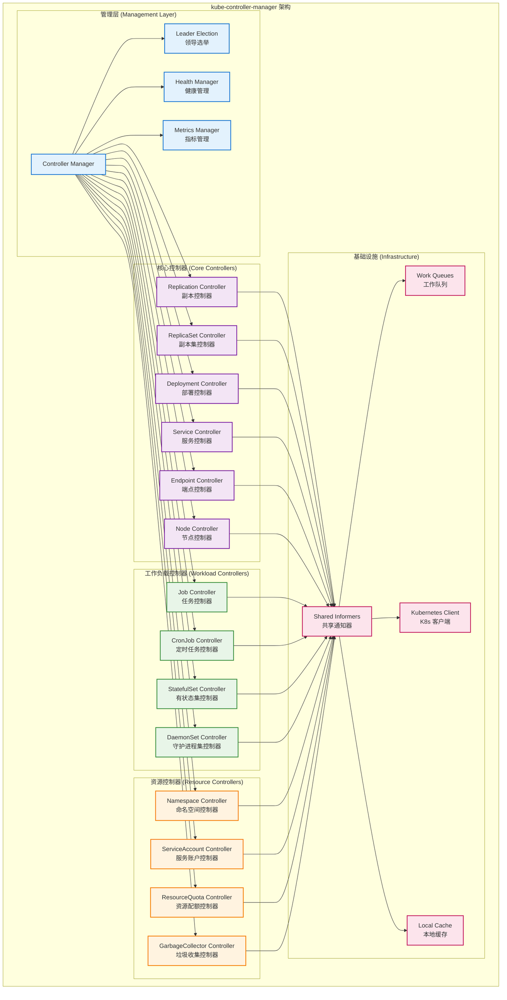
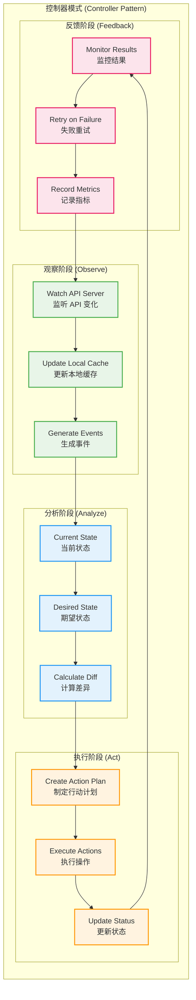
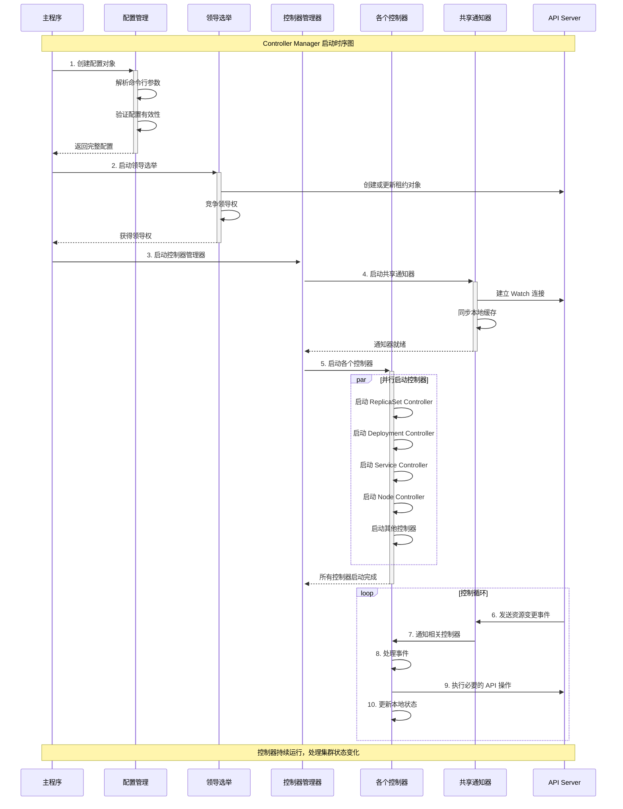
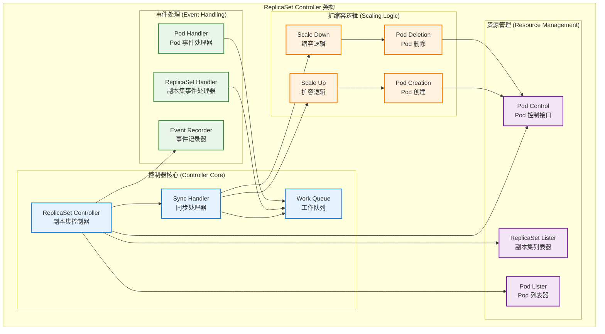
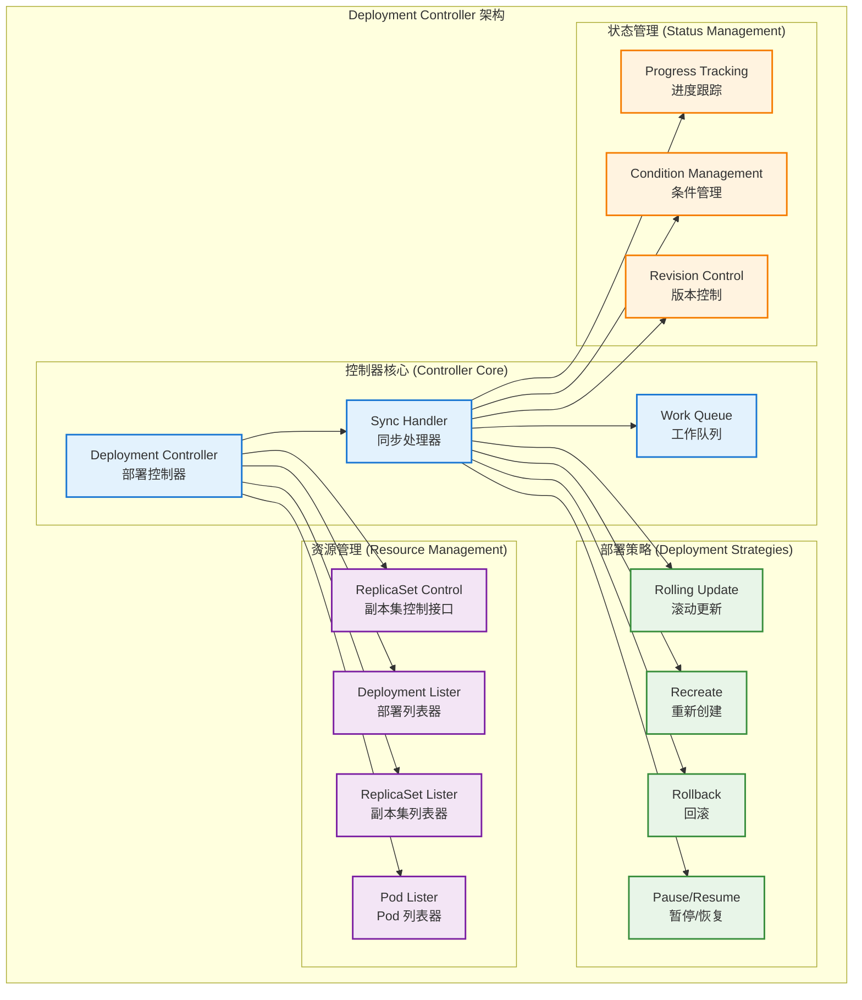
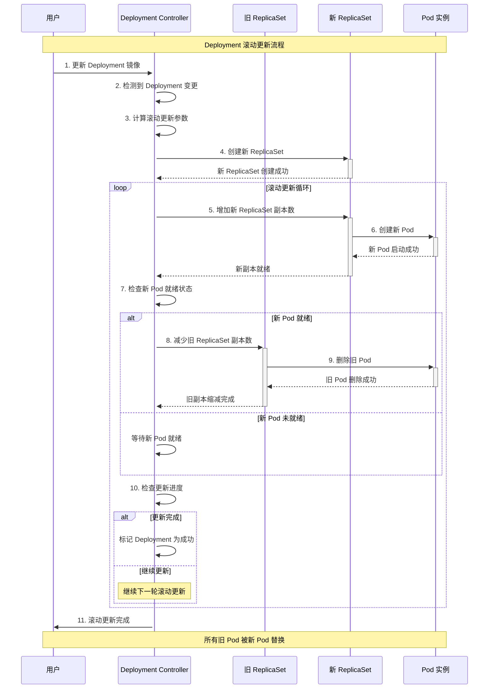

## 📚 文档概述

本文档深入分析 Kubernetes Controller Manager 的架构设计、源码实现和控制器模式。Controller Manager 是 Kubernetes 集群的"大脑"，负责运行各种控制器，实现声明式管理和自动化运维。

## 🏗️ Controller Manager 整体架构

### 1.1 控制器管理器架构



### 1.2 控制器模式核心原理



## 🚀 启动流程详细分析

### 2.1 Controller Manager 启动入口

```go
// cmd/kube-controller-manager/controller-manager.go
/*
Controller Manager 主入口文件
负责初始化和启动所有控制器

主要职责：
1. 创建 Cobra 命令对象
2. 解析命令行参数
3. 启动控制器管理器
*/
package main

import (
    "os"
    _ "time/tzdata" // 为 CronJob 时区支持

    "k8s.io/component-base/cli"
    _ "k8s.io/component-base/logs/json/register"          // JSON 日志格式注册
    _ "k8s.io/component-base/metrics/prometheus/clientgo" // Prometheus 客户端插件
    _ "k8s.io/component-base/metrics/prometheus/version"  // 版本指标注册
    "k8s.io/kubernetes/cmd/kube-controller-manager/app"
)

/*
main 函数是 Controller Manager 的程序入口点

执行流程：
1. 创建控制器管理器命令对象
2. 通过 CLI 框架执行命令
3. 根据执行结果退出程序

返回值：
- 程序退出码（0 表示成功，非 0 表示失败）
*/
func main() {
    // 创建控制器管理器命令对象
    command := app.NewControllerManagerCommand()
    
    // 执行命令，启动控制器管理器
    code := cli.Run(command)
    
    // 根据执行结果退出程序
    os.Exit(code)
}
```

### 2.2 命令创建和配置

```go
// cmd/kube-controller-manager/app/controllermanager.go
/*
NewControllerManagerCommand 创建控制器管理器的 Cobra 命令对象

功能说明：
1. 初始化控制器管理器选项
2. 设置命令行参数和标志
3. 定义命令执行逻辑
4. 配置控制器启动参数

返回值：
- *cobra.Command: 配置完整的命令对象
*/
func NewControllerManagerCommand() *cobra.Command {
    // 创建控制器管理器选项
    s, err := options.NewKubeControllerManagerOptions()
    if err != nil {
        klog.Background().Error(err, "无法初始化命令选项")
        klog.FlushAndExit(klog.ExitFlushTimeout, 1)
    }

    // 创建 Cobra 命令对象
    cmd := &cobra.Command{
        Use: kubeControllerManager,
        Long: `Kubernetes 控制器管理器是一个守护进程，它嵌入了
Kubernetes 附带的核心控制循环。在机器人和自动化应用中，
控制循环是一个调节系统状态的非终止循环。在 Kubernetes 中，
控制器是一个控制循环，它通过 apiserver 监视集群的共享状态，
并进行更改，试图将当前状态移向期望状态。
今天随 Kubernetes 一起提供的控制器示例包括副本控制器、
端点控制器、命名空间控制器和服务账户控制器。`,
        
        // 持久化预运行钩子
        PersistentPreRunE: func(*cobra.Command, []string) error {
            // 静默 client-go 警告
            // kube-controller-manager 通用地监视 API（包括已弃用的 API），
            // CI 确保它能够正确地与匹配的 kube-apiserver 版本一起工作
            restclient.SetDefaultWarningHandler(restclient.NoWarnings{})
            
            // 确保在 RunE 之前设置特性门控
            return s.ComponentGlobalsRegistry.Set()
        },
        
        // 主命令执行逻辑
        RunE: func(cmd *cobra.Command, args []string) error {
            // 检查并打印版本信息（如果请求）
            verflag.PrintAndExitIfRequested()

            // 尽早激活日志记录，然后显示最终日志配置的标志
            if err := logsapi.ValidateAndApply(s.Logs, utilfeature.DefaultFeatureGate); err != nil {
                return err
            }
            cliflag.PrintFlags(cmd.Flags())

            // 创建上下文
            ctx := context.Background()
            
            // 创建配置
            c, err := s.Config(ctx, KnownControllers(), ControllersDisabledByDefault(), ControllerAliases())
            if err != nil {
                return err
            }

            // 添加特性启用指标
            fg := s.ComponentGlobalsRegistry.FeatureGateFor(basecompatibility.DefaultKubeComponent)
            fg.(featuregate.MutableFeatureGate).AddMetrics()
            
            // 添加组件版本指标
            s.ComponentGlobalsRegistry.AddMetrics()
            
            // 运行控制器管理器
            return Run(ctx, c.Complete())
        },
        
        // 参数验证函数
        Args: func(cmd *cobra.Command, args []string) error {
            for _, arg := range args {
                if len(arg) > 0 {
                    return fmt.Errorf("%q 不接受任何参数，得到 %q", cmd.CommandPath(), args)
                }
            }
            return nil
        },
    }

    // 设置命令标志
    fs := cmd.Flags()
    namedFlagSets := s.Flags(KnownControllers(), ControllersDisabledByDefault(), ControllerAliases())
    
    // 添加版本标志
    verflag.AddFlags(namedFlagSets.FlagSet("global"))
    
    // 添加全局标志
    globalflag.AddGlobalFlags(namedFlagSets.FlagSet("global"), cmd.Name(), logs.SkipLoggingConfigurationFlags())
    
    // 将所有命名标志集添加到命令中
    for _, f := range namedFlagSets.FlagSets {
        fs.AddFlagSet(f)
    }

    // 设置使用说明和帮助函数
    cols, _, _ := term.TerminalSize(cmd.OutOrStdout())
    cliflag.SetUsageAndHelpFunc(cmd, namedFlagSets, cols)

    return cmd
}
```

### 2.3 控制器管理器运行流程



```go
/*
Run 运行控制器管理器的主函数

参数：
- ctx: 上下文对象，用于控制生命周期
- c: 完整的控制器管理器配置

返回值：
- error: 运行过程中的错误

执行流程：
1. 设置健康检查和指标服务
2. 启动共享通知器工厂
3. 启动各个控制器
4. 运行领导选举
5. 等待停止信号
*/
func Run(ctx context.Context, c *config.CompletedConfig) error {
    // 记录版本信息
    klog.InfoS("版本", "version", utilversion.Get())

    // 1. 设置健康检查和指标服务
    if c.ComponentConfig.Generic.LeaderElection.LeaderElect {
        // 如果启用领导选举，设置健康检查
        c.ComponentConfig.Generic.LeaderElection.Callbacks = leaderelection.LeaderCallbacks{
            OnStartedLeading: func(ctx context.Context) {
                klog.InfoS("开始领导")
                run(ctx, c)
            },
            OnStoppedLeading: func() {
                klog.ErrorS(nil, "领导选举失败")
                klog.FlushAndExit(klog.ExitFlushTimeout, 1)
            },
        }
        
        // 启动领导选举
        leaderElector, err := leaderelection.NewLeaderElector(*c.ComponentConfig.Generic.LeaderElection)
        if err != nil {
            return err
        }
        
        leaderElector.Run(ctx)
        return nil
    }

    // 2. 如果未启用领导选举，直接运行
    run(ctx, c)
    return nil
}

/*
run 实际运行控制器的函数

参数：
- ctx: 上下文对象
- c: 完整的控制器管理器配置

工作流程：
1. 启动 HTTP 服务器（健康检查、指标等）
2. 启动共享通知器工厂
3. 启动各个控制器
4. 等待停止信号
*/
func run(ctx context.Context, c *config.CompletedConfig) {
    // 1. 启动 HTTP 服务器
    if c.SecureServing != nil {
        handler := buildHandlerChain(newBaseHandler(&c.ComponentConfig, c.VersionedClient), c.Authentication.Authenticator, c.Authorization.Authorizer)
        
        // 启动安全服务器
        if _, _, err := c.SecureServing.Serve(handler, 0, ctx.Done()); err != nil {
            klog.ErrorS(err, "启动安全服务器失败")
            return
        }
    }

    // 2. 启动共享通知器工厂
    c.InformerFactory.Start(ctx.Done())
    c.ObjectOrMetadataInformerFactory.Start(ctx.Done())
    
    // 等待缓存同步
    c.InformerFactory.WaitForCacheSync(ctx.Done())
    c.ObjectOrMetadataInformerFactory.WaitForCacheSync(ctx.Done())

    // 3. 启动各个控制器
    controllerContext := CreateControllerContext(c, rootClientBuilder, clientBuilder, ctx.Done())
    
    if err := StartControllers(ctx, controllerContext, NewControllerInitializers(), unsecuredMux, healthzHandler); err != nil {
        klog.ErrorS(err, "启动控制器失败")
        return
    }

    // 4. 等待停止信号
    <-ctx.Done()
    klog.InfoS("控制器管理器正在关闭")
}
```

## 🎯 核心控制器详细分析

### 3.1 ReplicaSet 控制器

#### 3.1.1 ReplicaSet 控制器架构



#### 3.1.2 ReplicaSet 控制器源码实现

```go
// pkg/controller/replicaset/replica_set.go
/*
ReplicaSetController 负责同步存储在系统中的 ReplicaSet 对象与实际运行的 Pod

主要功能：
1. 监控 ReplicaSet 和 Pod 的变化
2. 确保实际运行的 Pod 数量与期望的副本数一致
3. 处理 Pod 的创建和删除
4. 管理 Pod 的所有权关系
*/

/*
ReplicaSetController 结构体定义

字段说明：
- GroupVersionKind: 控制器类型标识
- kubeClient: Kubernetes 客户端
- podControl: Pod 控制接口
- burstReplicas: 突发副本数限制
- syncHandler: 同步处理函数
- expectations: 期望管理器
- rsLister: ReplicaSet 列表器
- podLister: Pod 列表器
- queue: 工作队列
*/
type ReplicaSetController struct {
    // GroupVersionKind 表示控制器类型
    // 此结构的不同实例可能处理不同的 GVK
    // 例如，此结构可以（通过适配器）用于处理 ReplicationController
    schema.GroupVersionKind

    // Kubernetes 客户端
    kubeClient clientset.Interface
    
    // Pod 控制接口，用于创建和删除 Pod
    podControl controller.PodControlInterface
    
    // podIndexer 允许通过 ControllerRef UID 查找 Pod
    podIndexer cache.Indexer
    
    // 事件广播器
    eventBroadcaster record.EventBroadcaster

    // ReplicaSet 在创建/删除这么多副本后暂时挂起
    // 在观察到它们的 watch 事件后恢复正常操作
    burstReplicas int
    
    // 允许注入 syncReplicaSet 用于测试
    syncHandler func(ctx context.Context, rsKey string) error

    // 用于单元测试
    enqueueReplicaSet func(rs *apps.ReplicaSet)

    // rsLister 可以从共享通知器的存储中列出/获取 ReplicaSet
    rsLister appslisters.ReplicaSetLister
    
    // podLister 可以从共享通知器的存储中列出/获取 Pod
    podLister corelisters.PodLister

    // rsListerSynced 如果 ReplicaSet 存储至少同步过一次则返回 true
    rsListerSynced cache.InformerSynced
    
    // podListerSynced 如果 Pod 存储至少同步过一次则返回 true
    podListerSynced cache.InformerSynced

    // 期望管理器，用于跟踪控制器的期望状态
    expectations *controller.UIDTrackingControllerExpectations

    // 需要同步的 ReplicaSet
    queue workqueue.TypedRateLimitingInterface[string]
}

/*
NewReplicaSetController 创建新的 ReplicaSetController

参数：
- rsInformer: ReplicaSet 通知器
- podInformer: Pod 通知器
- kubeClient: Kubernetes 客户端
- burstReplicas: 突发副本数限制

返回值：
- *ReplicaSetController: 新创建的控制器实例

初始化流程：
1. 创建控制器实例
2. 设置事件处理器
3. 配置工作队列
4. 初始化期望管理器
*/
func NewReplicaSetController(rsInformer appsinformers.ReplicaSetInformer, podInformer coreinformers.PodInformer, kubeClient clientset.Interface, burstReplicas int) *ReplicaSetController {
    // 创建事件广播器
    eventBroadcaster := record.NewBroadcaster()
    eventBroadcaster.StartStructuredLogging(0)
    eventBroadcaster.StartRecordingToSink(&v1core.EventSinkImpl{Interface: kubeClient.CoreV1().Events("")})
    
    // 如果指标未注册，则注册指标
    if kubeClient != nil && kubeClient.Discovery().RESTClient().GetRateLimiter() != nil {
        ratelimiter.RegisterMetricAndTrackRateLimiterUsage("replicaset_controller", kubeClient.Discovery().RESTClient().GetRateLimiter())
    }

    // 创建控制器实例
    rsc := &ReplicaSetController{
        GroupVersionKind: apps.SchemeGroupVersion.WithKind("ReplicaSet"),
        kubeClient:       kubeClient,
        podControl:       controller.RealPodControl{KubeClient: kubeClient, Recorder: eventBroadcaster.NewRecorder(scheme.Scheme, v1.EventSource{Component: "replicaset-controller"})},
        burstReplicas:    burstReplicas,
        expectations:     controller.NewUIDTrackingControllerExpectations(controller.NewControllerExpectations()),
        queue:            workqueue.NewTypedRateLimitingQueueWithConfig(workqueue.DefaultTypedControllerRateLimiter[string](), workqueue.TypedRateLimitingQueueConfig[string]{Name: "replicaset"}),
        eventBroadcaster: eventBroadcaster,
    }

    // 设置同步处理函数
    rsc.syncHandler = rsc.syncReplicaSet

    // 设置 ReplicaSet 事件处理器
    rsInformer.Informer().AddEventHandler(cache.ResourceEventHandlerFuncs{
        AddFunc: func(obj interface{}) {
            rsc.addRS(obj)
        },
        UpdateFunc: func(oldObj, newObj interface{}) {
            rsc.updateRS(oldObj, newObj)
        },
        DeleteFunc: func(obj interface{}) {
            rsc.deleteRS(obj)
        },
    })
    rsc.rsLister = rsInformer.Lister()
    rsc.rsListerSynced = rsInformer.Informer().HasSynced

    // 设置 Pod 事件处理器
    podInformer.Informer().AddEventHandler(cache.ResourceEventHandlerFuncs{
        AddFunc: func(obj interface{}) {
            rsc.addPod(obj)
        },
        UpdateFunc: func(oldObj, newObj interface{}) {
            rsc.updatePod(oldObj, newObj)
        },
        DeleteFunc: func(obj interface{}) {
            rsc.deletePod(obj)
        },
    })
    rsc.podLister = podInformer.Lister()
    rsc.podListerSynced = podInformer.Informer().HasSynced

    return rsc
}

/*
Run 开始运行控制器

参数：
- ctx: 上下文对象
- workers: 工作协程数量

工作流程：
1. 等待缓存同步
2. 启动工作协程
3. 等待停止信号
4. 清理资源
*/
func (rsc *ReplicaSetController) Run(ctx context.Context, workers int) {
    defer utilruntime.HandleCrash()
    defer rsc.queue.ShutDown()

    klog.InfoS("启动控制器", "controller", "replicaset")
    defer klog.InfoS("关闭控制器", "controller", "replicaset")

    // 等待缓存同步
    if !cache.WaitForNamedCacheSync("replicaset", ctx.Done(), rsc.rsListerSynced, rsc.podListerSynced) {
        return
    }

    // 启动工作协程
    for i := 0; i < workers; i++ {
        go wait.UntilWithContext(ctx, rsc.worker, time.Second)
    }

    <-ctx.Done()
}

/*
worker 工作协程函数

工作流程：
1. 从队列获取工作项
2. 处理工作项
3. 处理结果（重试或完成）
*/
func (rsc *ReplicaSetController) worker(ctx context.Context) {
    for rsc.processNextWorkItem(ctx) {
    }
}

func (rsc *ReplicaSetController) processNextWorkItem(ctx context.Context) bool {
    // 从队列获取下一个工作项
    key, quit := rsc.queue.Get()
    if quit {
        return false
    }
    defer rsc.queue.Done(key)

    // 处理工作项
    err := rsc.syncHandler(ctx, key)
    if err == nil {
        // 处理成功，从队列中移除
        rsc.queue.Forget(key)
        return true
    }

    // 处理失败，重新入队
    utilruntime.HandleError(fmt.Errorf("同步 %q 时出错: %v", key, err))
    rsc.queue.AddRateLimited(key)

    return true
}

/*
syncReplicaSet 同步 ReplicaSet 的核心逻辑

参数：
- ctx: 上下文对象
- key: ReplicaSet 的键（namespace/name）

返回值：
- error: 同步过程中的错误

同步流程：
1. 解析键获取命名空间和名称
2. 获取 ReplicaSet 对象
3. 获取相关的 Pod 列表
4. 计算需要创建或删除的 Pod 数量
5. 执行扩缩容操作
6. 更新 ReplicaSet 状态
*/
func (rsc *ReplicaSetController) syncReplicaSet(ctx context.Context, key string) error {
    startTime := time.Now()
    defer func() {
        klog.V(4).InfoS("完成同步 ReplicaSet", "key", key, "duration", time.Since(startTime))
    }()

    // 1. 解析键
    namespace, name, err := cache.SplitMetaNamespaceKey(key)
    if err != nil {
        return err
    }

    // 2. 获取 ReplicaSet 对象
    rs, err := rsc.rsLister.ReplicaSets(namespace).Get(name)
    if apierrors.IsNotFound(err) {
        klog.V(4).InfoS("ReplicaSet 已被删除", "key", key)
        rsc.expectations.DeleteExpectations(key)
        return nil
    }
    if err != nil {
        return err
    }

    // 3. 检查期望状态
    rsNeedsSync := rsc.expectations.SatisfiedExpectations(key)
    selector, err := metav1.LabelSelectorAsSelector(rs.Spec.Selector)
    if err != nil {
        utilruntime.HandleError(fmt.Errorf("将 ReplicaSet %v 选择器转换为选择器时出错: %v", rs.Name, err))
        return nil
    }

    // 4. 获取相关的 Pod 列表
    allPods, err := rsc.podLister.Pods(rs.Namespace).List(labels.Everything())
    if err != nil {
        return err
    }
    
    // 过滤出匹配的 Pod
    filteredPods := controller.FilterActivePods(allPods)
    filteredPods, err = rsc.claimPods(ctx, rs, selector, filteredPods)
    if err != nil {
        return err
    }

    var manageReplicasErr error
    if rsNeedsSync && rs.DeletionTimestamp == nil {
        // 5. 执行副本管理
        manageReplicasErr = rsc.manageReplicas(ctx, filteredPods, rs)
    }

    // 6. 更新 ReplicaSet 状态
    rs = rs.DeepCopy()
    newStatus := calculateStatus(rs, filteredPods, manageReplicasErr)

    // 始终更新状态，因为即使在错误情况下，Pod 计数也可能已更改
    updatedRS, err := updateReplicaSetStatus(rsc.kubeClient.AppsV1().ReplicaSets(rs.Namespace), rs, newStatus)
    if err != nil {
        // 多次重试失败不应该成为致命错误
        utilruntime.HandleError(fmt.Errorf("无法更新 ReplicaSet %s/%s 的状态: %v", rs.Namespace, rs.Name, err))
        return manageReplicasErr
    }

    // 如果状态更新成功但副本管理失败，重新排队
    if manageReplicasErr == nil && updatedRS.Spec.MinReadySeconds > 0 && updatedRS.Status.ReadyReplicas == *(updatedRS.Spec.Replicas) && updatedRS.Status.AvailableReplicas != *(updatedRS.Spec.Replicas) {
        rsc.enqueueReplicaSetAfter(updatedRS, time.Duration(updatedRS.Spec.MinReadySeconds)*time.Second)
    }
    return manageReplicasErr
}

/*
manageReplicas 管理副本数量的核心逻辑

参数：
- ctx: 上下文对象
- filteredPods: 过滤后的 Pod 列表
- rs: ReplicaSet 对象

返回值：
- error: 管理过程中的错误

管理流程：
1. 计算当前副本数和期望副本数的差异
2. 如果需要扩容，创建新的 Pod
3. 如果需要缩容，删除多余的 Pod
4. 处理突发限制和批量操作
*/
func (rsc *ReplicaSetController) manageReplicas(ctx context.Context, filteredPods []*v1.Pod, rs *apps.ReplicaSet) error {
    // 计算差异
    diff := len(filteredPods) - int(*(rs.Spec.Replicas))
    rsKey := controller.KeyFunc(rs)
    
    if diff < 0 {
        // 需要扩容
        diff *= -1
        if diff > rsc.burstReplicas {
            diff = rsc.burstReplicas
        }
        
        // 设置期望
        rsc.expectations.ExpectCreations(rsKey, diff)
        
        klog.V(2).InfoS("创建 Pod 过多", "replicaSet", klog.KObj(rs), "need", diff)
        
        // 批量创建 Pod
        successfulCreations, err := slowStartBatch(diff, controller.SlowStartInitialBatchSize, func() error {
            err := rsc.podControl.CreatePods(ctx, rs.Namespace, &rs.Spec.Template, rs, metav1.NewControllerRef(rs, rsc.GroupVersionKind))
            if err != nil {
                if apierrors.HasStatusCause(err, v1.NamespaceTerminatingCause) {
                    // 如果命名空间正在终止，不要重试
                    return nil
                }
            }
            return err
        })
        
        // 如果创建失败，调整期望
        if skippedPods := diff - successfulCreations; skippedPods > 0 {
            klog.V(2).InfoS("慢启动失败，跳过创建 Pod", "skippedPods", skippedPods, "replicaSet", klog.KObj(rs))
            for i := 0; i < skippedPods; i++ {
                rsc.expectations.CreationObserved(rsKey)
            }
        }
        return err
        
    } else if diff > 0 {
        // 需要缩容
        if diff > rsc.burstReplicas {
            diff = rsc.burstReplicas
        }
        
        klog.V(2).InfoS("删除 Pod 过多", "replicaSet", klog.KObj(rs), "need", diff)
        
        // 选择要删除的 Pod
        podsToDelete := getPodsToDelete(filteredPods, diff)
        
        // 设置期望
        rsc.expectations.ExpectDeletions(rsKey, getPodKeys(podsToDelete))
        
        errCh := make(chan error, diff)
        var wg sync.WaitGroup
        wg.Add(diff)
        
        // 并行删除 Pod
        for _, pod := range podsToDelete {
            go func(targetPod *v1.Pod) {
                defer wg.Done()
                if err := rsc.podControl.DeletePod(ctx, rs.Namespace, targetPod.Name, rs); err != nil {
                    // 减少期望计数
                    podKey := controller.PodKey(targetPod)
                    klog.V(2).InfoS("删除 Pod 失败", "pod", podKey, "replicaSet", klog.KObj(rs), "error", err)
                    rsc.expectations.DeletionObserved(rsKey, podKey)
                    errCh <- err
                }
            }(pod)
        }
        wg.Wait()
        
        select {
        case err := <-errCh:
            // 所有错误都已记录在上面
            // 不要重新记录，只返回第一个错误
            if err != nil {
                return err
            }
        default:
        }
    }

    return nil
}
```

### 3.2 Deployment 控制器

#### 3.2.1 Deployment 控制器架构



#### 3.2.2 Deployment 滚动更新流程



#### 3.2.3 Deployment 控制器源码实现

```go
// pkg/controller/deployment/deployment_controller.go
/*
DeploymentController 负责同步存储在系统中的 Deployment 对象与实际运行的副本集和 Pod

主要功能：
1. 监控 Deployment、ReplicaSet 和 Pod 的变化
2. 实现滚动更新和重新创建部署策略
3. 管理部署的回滚和暂停/恢复
4. 跟踪部署进度和状态
*/

/*
DeploymentController 结构体定义

字段说明：
- rsControl: 用于采用/释放副本集的控制接口
- client: Kubernetes 客户端
- eventBroadcaster: 事件广播器
- syncHandler: 同步处理函数
- dLister: Deployment 列表器
- rsLister: ReplicaSet 列表器
- podLister: Pod 列表器
- queue: 工作队列
*/
type DeploymentController struct {
    // rsControl 用于采用/释放副本集
    rsControl controller.RSControlInterface
    client    clientset.Interface

    // 事件广播器和记录器
    eventBroadcaster record.EventBroadcaster
    eventRecorder    record.EventRecorder

    // 允许注入 syncDeployment 用于测试
    syncHandler func(ctx context.Context, dKey string) error
    
    // 用于单元测试
    enqueueDeployment func(deployment *apps.Deployment)

    // dLister 可以从共享通知器的存储中列出/获取部署
    dLister appslisters.DeploymentLister
    
    // rsLister 可以从共享通知器的存储中列出/获取副本集
    rsLister appslisters.ReplicaSetLister
    
    // podLister 可以从共享通知器的存储中列出/获取 Pod
    podLister corelisters.PodLister

    // dListerSynced 如果 Deployment 存储至少同步过一次则返回 true
    dListerSynced cache.InformerSynced
    
    // rsListerSynced 如果 ReplicaSet 存储至少同步过一次则返回 true
    rsListerSynced cache.InformerSynced
    
    // podListerSynced 如果 Pod 存储至少同步过一次则返回 true
    podListerSynced cache.InformerSynced

    // 需要同步的 Deployment
    queue workqueue.TypedRateLimitingInterface[string]
}

/*
NewDeploymentController 创建新的 DeploymentController

参数：
- dInformer: Deployment 通知器
- rsInformer: ReplicaSet 通知器
- podInformer: Pod 通知器
- client: Kubernetes 客户端

返回值：
- *DeploymentController: 新创建的控制器实例

初始化流程：
1. 创建控制器实例
2. 设置事件处理器
3. 配置工作队列
4. 初始化各种列表器
*/
func NewDeploymentController(dInformer appsinformers.DeploymentInformer, rsInformer appsinformers.ReplicaSetInformer, podInformer coreinformers.PodInformer, client clientset.Interface) (*DeploymentController, error) {
    // 创建事件广播器
    eventBroadcaster := record.NewBroadcaster()
    eventBroadcaster.StartStructuredLogging(0)
    eventBroadcaster.StartRecordingToSink(&v1core.EventSinkImpl{Interface: client.CoreV1().Events("")})

    // 如果指标未注册，则注册指标
    if client != nil && client.Discovery().RESTClient().GetRateLimiter() != nil {
        ratelimiter.RegisterMetricAndTrackRateLimiterUsage("deployment_controller", client.Discovery().RESTClient().GetRateLimiter())
    }

    // 创建控制器实例
    dc := &DeploymentController{
        client:           client,
        eventBroadcaster: eventBroadcaster,
        eventRecorder:    eventBroadcaster.NewRecorder(scheme.Scheme, v1.EventSource{Component: "deployment-controller"}),
        queue:            workqueue.NewTypedRateLimitingQueueWithConfig(workqueue.DefaultTypedControllerRateLimiter[string](), workqueue.TypedRateLimitingQueueConfig[string]{Name: "deployment"}),
    }
    
    // 设置同步处理函数
    dc.syncHandler = dc.syncDeployment
    dc.enqueueDeployment = dc.enqueue

    // 设置 Deployment 事件处理器
    dInformer.Informer().AddEventHandler(cache.ResourceEventHandlerFuncs{
        AddFunc: func(obj interface{}) {
            dc.addDeployment(obj)
        },
        UpdateFunc: func(oldObj, newObj interface{}) {
            dc.updateDeployment(oldObj, newObj)
        },
        DeleteFunc: func(obj interface{}) {
            dc.deleteDeployment(obj)
        },
    })
    dc.dLister = dInformer.Lister()
    dc.dListerSynced = dInformer.Informer().HasSynced

    // 设置 ReplicaSet 事件处理器
    rsInformer.Informer().AddEventHandler(cache.ResourceEventHandlerFuncs{
        AddFunc: func(obj interface{}) {
            dc.addReplicaSet(obj)
        },
        UpdateFunc: func(oldObj, newObj interface{}) {
            dc.updateReplicaSet(oldObj, newObj)
        },
        DeleteFunc: func(obj interface{}) {
            dc.deleteReplicaSet(obj)
        },
    })
    dc.rsLister = rsInformer.Lister()
    dc.rsListerSynced = rsInformer.Informer().HasSynced

    // 设置 Pod 事件处理器
    podInformer.Informer().AddEventHandler(cache.ResourceEventHandlerFuncs{
        DeleteFunc: func(obj interface{}) {
            dc.deletePod(obj)
        },
    })
    dc.podLister = podInformer.Lister()
    dc.podListerSynced = podInformer.Informer().HasSynced

    // 创建副本集控制接口
    dc.rsControl = controller.RealRSControl{
        KubeClient: client,
        Recorder:   dc.eventRecorder,
    }

    return dc, nil
}

/*
syncDeployment 同步 Deployment 的核心逻辑

参数：
- ctx: 上下文对象
- key: Deployment 的键（namespace/name）

返回值：
- error: 同步过程中的错误

同步流程：
1. 解析键获取命名空间和名称
2. 获取 Deployment 对象
3. 获取相关的 ReplicaSet 列表
4. 根据部署策略执行相应操作
5. 更新 Deployment 状态
*/
func (dc *DeploymentController) syncDeployment(ctx context.Context, key string) error {
    startTime := time.Now()
    defer func() {
        klog.V(4).InfoS("完成同步 Deployment", "key", key, "duration", time.Since(startTime))
    }()

    // 1. 解析键
    namespace, name, err := cache.SplitMetaNamespaceKey(key)
    if err != nil {
        return err
    }

    // 2. 获取 Deployment 对象
    deployment, err := dc.dLister.Deployments(namespace).Get(name)
    if errors.IsNotFound(err) {
        klog.V(2).InfoS("Deployment 已被删除", "key", key)
        return nil
    }
    if err != nil {
        return err
    }

    // 3. 深拷贝 Deployment 以避免修改缓存
    d := deployment.DeepCopy()

    // 4. 获取所有相关的 ReplicaSet
    rsList, err := dc.getReplicaSetsForDeployment(ctx, d)
    if err != nil {
        return err
    }

    // 5. 获取所有相关的 Pod
    podMap, err := dc.getPodMapForDeployment(d, rsList)
    if err != nil {
        return err
    }

    // 6. 检查 Deployment 是否暂停
    if d.Spec.Paused {
        return dc.sync(ctx, d, rsList)
    }

    // 7. 检查是否需要回滚
    if getRollbackTo(d) != nil {
        return dc.rollback(ctx, d, rsList)
    }

    // 8. 检查是否需要扩缩容
    scalingEvent, err := dc.isScalingEvent(ctx, d, rsList)
    if err != nil {
        return err
    }
    if scalingEvent {
        return dc.sync(ctx, d, rsList)
    }

    // 9. 根据部署策略执行操作
    switch d.Spec.Strategy.Type {
    case apps.RecreateDeploymentStrategyType:
        return dc.rolloutRecreate(ctx, d, rsList, podMap)
    case apps.RollingUpdateDeploymentStrategyType:
        return dc.rolloutRolling(ctx, d, rsList)
    }
    return fmt.Errorf("未知的部署策略类型: %s", d.Spec.Strategy.Type)
}

/*
rolloutRolling 执行滚动更新部署策略

参数：
- ctx: 上下文对象
- d: Deployment 对象
- rsList: ReplicaSet 列表

返回值：
- error: 执行过程中的错误

滚动更新流程：
1. 获取新旧 ReplicaSet
2. 计算滚动更新参数
3. 执行滚动更新逻辑
4. 更新部署状态
*/
func (dc *DeploymentController) rolloutRolling(ctx context.Context, d *apps.Deployment, rsList []*apps.ReplicaSet) error {
    // 1. 获取新 ReplicaSet，如果不存在则创建
    newRS, oldRSs, err := dc.getAllReplicaSetsAndSyncRevision(ctx, d, rsList, true)
    if err != nil {
        return err
    }
    
    // 2. 获取所有相关的 Pod
    allRSs := append(oldRSs, newRS)
    podMap, err := dc.getPodMapForDeployment(d, allRSs)
    if err != nil {
        return err
    }

    // 3. 如果只有一个副本集且是新的，直接扩容
    if len(oldRSs) == 0 {
        return dc.scaleUpNewReplicaSetForRollingUpdate(ctx, newRS, d)
    }

    // 4. 执行滚动更新逻辑
    if util.DeploymentComplete(d, &d.Status) {
        // 部署已完成，清理旧的副本集
        return dc.cleanupDeployment(ctx, oldRSs, d)
    }

    // 5. 计算滚动更新参数
    maxUnavailable := deploymentutil.MaxUnavailable(*d)
    maxSurge := deploymentutil.MaxSurge(*d)
    
    // 6. 获取当前可用的副本数
    availablePodCount := deploymentutil.GetAvailableReplicaCountForReplicaSets(allRSs)
    totalReplicaCount := deploymentutil.GetReplicaCountForReplicaSets(allRSs)
    
    // 7. 计算允许的不可用副本数
    allowedUnavailable := int32(math.Max(0, float64(*(d.Spec.Replicas)-maxUnavailable)))
    
    // 8. 如果当前可用副本数小于允许的最小值，需要扩容新副本集
    if availablePodCount < allowedUnavailable {
        return dc.scaleUpNewReplicaSetForRollingUpdate(ctx, newRS, d)
    }
    
    // 9. 计算允许的最大副本数
    allowedSurge := *(d.Spec.Replicas) + maxSurge
    
    // 10. 如果总副本数超过允许的最大值，需要缩容旧副本集
    if totalReplicaCount > allowedSurge {
        return dc.scaleDownOldReplicaSetsForRollingUpdate(ctx, oldRSs, d)
    }
    
    // 11. 同时进行扩容和缩容
    return dc.reconcileNewReplicaSet(ctx, allRSs, newRS, d)
}

/*
scaleUpNewReplicaSetForRollingUpdate 为滚动更新扩容新副本集

参数：
- ctx: 上下文对象
- newRS: 新 ReplicaSet
- deployment: Deployment 对象

返回值：
- error: 扩容过程中的错误

扩容逻辑：
1. 计算需要扩容的副本数
2. 考虑滚动更新参数限制
3. 执行扩容操作
4. 记录事件
*/
func (dc *DeploymentController) scaleUpNewReplicaSetForRollingUpdate(ctx context.Context, newRS *apps.ReplicaSet, deployment *apps.Deployment) error {
    if *(newRS.Spec.Replicas) == *(deployment.Spec.Replicas) {
        // 新副本集已经达到期望副本数
        return nil
    }
    
    // 计算最大可扩容的副本数
    maxSurge := deploymentutil.MaxSurge(*deployment)
    currentPodCount := deploymentutil.GetReplicaCountForReplicaSets([]*apps.ReplicaSet{newRS})
    maxTotalPods := *(deployment.Spec.Replicas) + maxSurge
    
    // 计算可以扩容的副本数
    scaleUpCount := maxTotalPods - currentPodCount
    if scaleUpCount <= 0 {
        return nil
    }
    
    // 不能超过期望的副本数
    newReplicasCount := int32(math.Min(float64(*(newRS.Spec.Replicas)+scaleUpCount), float64(*(deployment.Spec.Replicas))))
    
    // 执行扩容
    newRS, err := dc.scaleReplicaSetAndRecordEvent(ctx, newRS, newReplicasCount, deployment)
    if err != nil {
        return err
    }
    
    klog.V(4).InfoS("扩容新副本集", "replicaSet", klog.KObj(newRS), "oldReplicas", *(newRS.Spec.Replicas), "newReplicas", newReplicasCount)
    return nil
}

/*
scaleDownOldReplicaSetsForRollingUpdate 为滚动更新缩容旧副本集

参数：
- ctx: 上下文对象
- oldRSs: 旧 ReplicaSet 列表
- deployment: Deployment 对象

返回值：
- error: 缩容过程中的错误

缩容逻辑：
1. 计算需要缩容的总副本数
2. 按优先级选择要缩容的副本集
3. 执行缩容操作
4. 记录事件
*/
func (dc *DeploymentController) scaleDownOldReplicaSetsForRollingUpdate(ctx context.Context, oldRSs []*apps.ReplicaSet, deployment *apps.Deployment) error {
    // 计算当前旧副本集的总副本数
    oldPodsCount := deploymentutil.GetReplicaCountForReplicaSets(oldRSs)
    if oldPodsCount == 0 {
        // 没有旧副本需要缩容
        return nil
    }
    
    // 计算最大不可用副本数
    maxUnavailable := deploymentutil.MaxUnavailable(*deployment)
    minAvailable := *(deployment.Spec.Replicas) - maxUnavailable
    
    // 获取当前可用副本数
    newRS, err := deploymentutil.GetNewReplicaSet(deployment, dc.rsLister)
    if err != nil {
        return err
    }
    
    allRSs := append(oldRSs, newRS)
    availablePodCount := deploymentutil.GetAvailableReplicaCountForReplicaSets(allRSs)
    
    // 计算可以缩容的副本数
    if availablePodCount <= minAvailable {
        // 不能再缩容了，否则会违反最小可用副本数限制
        return nil
    }
    
    scaleDownCount := availablePodCount - minAvailable
    scaleDownCount = int32(math.Min(float64(scaleDownCount), float64(oldPodsCount)))
    
    // 按优先级排序旧副本集（副本数少的优先缩容）
    sort.Sort(controller.ReplicaSetsByCreationTimestamp(oldRSs))
    
    // 执行缩容
    totalScaledDown := int32(0)
    for _, targetRS := range oldRSs {
        if totalScaledDown >= scaleDownCount {
            break
        }
        
        if *(targetRS.Spec.Replicas) == 0 {
            // 副本集已经缩容到 0
            continue
        }
        
        // 计算这个副本集需要缩容的数量
        scaleDownCountForRS := int32(math.Min(float64(*(targetRS.Spec.Replicas)), float64(scaleDownCount-totalScaledDown)))
        newReplicasCount := *(targetRS.Spec.Replicas) - scaleDownCountForRS
        
        // 执行缩容
        _, err := dc.scaleReplicaSetAndRecordEvent(ctx, targetRS, newReplicasCount, deployment)
        if err != nil {
            return err
        }
        
        totalScaledDown += scaleDownCountForRS
        klog.V(4).InfoS("缩容旧副本集", "replicaSet", klog.KObj(targetRS), "oldReplicas", *(targetRS.Spec.Replicas), "newReplicas", newReplicasCount)
    }
    
    return nil
}
```

## 📊 控制器监控和指标

### 4.1 控制器指标体系

```yaml
# Controller Manager 监控配置
apiVersion: v1
kind: ServiceMonitor
metadata:
  name: kube-controller-manager
  namespace: kube-system
spec:
  selector:
    matchLabels:
      component: kube-controller-manager
  endpoints:
  - port: https
    scheme: https
    tlsConfig:
      caFile: /var/run/secrets/kubernetes.io/serviceaccount/ca.crt
      serverName: kube-controller-manager
      insecureSkipVerify: false
    bearerTokenFile: /var/run/secrets/kubernetes.io/serviceaccount/token
    interval: 30s
    path: /metrics
    
---
# 控制器关键指标告警规则
apiVersion: monitoring.coreos.com/v1
kind: PrometheusRule
metadata:
  name: kube-controller-manager-alerts
  namespace: kube-system
spec:
  groups:
  - name: kube-controller-manager.rules
    rules:
    # Controller Manager 可用性告警
    - alert: KubeControllerManagerDown
      expr: up{job="kube-controller-manager"} == 0
      for: 5m
      labels:
        severity: critical
      annotations:
        summary: "Kubernetes Controller Manager 不可用"
        description: "Controller Manager {{ $labels.instance }} 已经宕机超过 5 分钟"
    
    # 工作队列深度告警
    - alert: KubeControllerManagerWorkQueueDepth
      expr: |
        workqueue_depth{job="kube-controller-manager"} > 100
      for: 10m
      labels:
        severity: warning
      annotations:
        summary: "Controller Manager 工作队列深度过高"
        description: "Controller {{ $labels.name }} 工作队列深度为 {{ $value }}"
    
    # 工作队列延迟告警
    - alert: KubeControllerManagerWorkQueueLatency
      expr: |
        histogram_quantile(0.99, sum(rate(workqueue_queue_duration_seconds_bucket{job="kube-controller-manager"}[5m])) by (le, name)) > 60
      for: 10m
      labels:
        severity: warning
      annotations:
        summary: "Controller Manager 工作队列延迟过高"
        description: "Controller {{ $labels.name }} 工作队列 99% 分位延迟为 {{ $value }} 秒"
    
    # 控制器同步失败告警
    - alert: KubeControllerManagerSyncFailures
      expr: |
        increase(controller_runtime_reconcile_errors_total{job="kube-controller-manager"}[5m]) > 10
      for: 5m
      labels:
        severity: warning
      annotations:
        summary: "Controller Manager 同步失败次数过多"
        description: "Controller {{ $labels.controller }} 在过去 5 分钟内同步失败 {{ $value }} 次"
    
    # 领导选举失败告警
    - alert: KubeControllerManagerLeaderElectionFailure
      expr: |
        increase(leader_election_master_status{job="kube-controller-manager"}[5m]) == 0
      for: 5m
      labels:
        severity: critical
      annotations:
        summary: "Controller Manager 领导选举失败"
        description: "Controller Manager {{ $labels.instance }} 失去领导权"
    
    # 证书过期告警
    - alert: KubeControllerManagerCertificateExpiration
      expr: |
        apiserver_client_certificate_expiration_seconds{job="kube-controller-manager"} < 7*24*60*60
      for: 0m
      labels:
        severity: warning
      annotations:
        summary: "Controller Manager 客户端证书即将过期"
        description: "Controller Manager 客户端证书将在 7 天内过期"
```

### 4.2 性能优化配置

```yaml
# Controller Manager 高性能配置
apiVersion: v1
kind: Pod
metadata:
  name: kube-controller-manager
  namespace: kube-system
spec:
  containers:
  - name: kube-controller-manager
    image: k8s.gcr.io/kube-controller-manager:v1.29.0
    command:
    - kube-controller-manager
    
    # 基础配置
    - --bind-address=0.0.0.0
    - --secure-port=10257
    - --port=0
    
    # 领导选举配置
    - --leader-elect=true
    - --leader-elect-lease-duration=15s
    - --leader-elect-renew-deadline=10s
    - --leader-elect-retry-period=2s
    
    # 控制器配置
    - --controllers=*,bootstrapsigner,tokencleaner
    - --concurrent-deployment-syncs=5          # Deployment 控制器并发数
    - --concurrent-replicaset-syncs=5          # ReplicaSet 控制器并发数
    - --concurrent-service-syncs=1             # Service 控制器并发数
    - --concurrent-namespace-syncs=10          # Namespace 控制器并发数
    - --concurrent-gc-syncs=20                 # 垃圾收集器并发数
    
    # 节点控制器配置
    - --node-monitor-period=5s                 # 节点监控周期
    - --node-monitor-grace-period=40s          # 节点监控宽限期
    - --pod-eviction-timeout=5m0s              # Pod 驱逐超时
    - --unhealthy-zone-threshold=0.55          # 不健康区域阈值
    - --large-cluster-size-threshold=50        # 大集群大小阈值
    - --secondary-node-eviction-rate=0.01      # 次要节点驱逐速率
    
    # 资源配额控制器配置
    - --concurrent-resource-quota-syncs=5      # 资源配额控制器并发数
    
    # 服务账户控制器配置
    - --concurrent-serviceaccount-token-syncs=5 # 服务账户令牌控制器并发数
    
    # 垃圾收集器配置
    - --enable-garbage-collector=true          # 启用垃圾收集器
    
    # 水平 Pod 自动扩缩器配置
    - --horizontal-pod-autoscaler-sync-period=15s              # HPA 同步周期
    - --horizontal-pod-autoscaler-upscale-delay=3m0s           # HPA 扩容延迟
    - --horizontal-pod-autoscaler-downscale-delay=5m0s         # HPA 缩容延迟
    - --horizontal-pod-autoscaler-downscale-stabilization=5m0s # HPA 缩容稳定期
    - --horizontal-pod-autoscaler-cpu-initialization-period=5m0s # HPA CPU 初始化周期
    - --horizontal-pod-autoscaler-initial-readiness-delay=30s   # HPA 初始就绪延迟
    
    # 持久卷控制器配置
    - --pvclaimbinder-sync-period=15s          # PV 绑定器同步周期
    
    # 特性门控
    - --feature-gates=RemoveSelfLink=false     # 保持向后兼容
    
    # 日志配置
    - --v=2                                    # 日志级别
    - --logtostderr=true                       # 输出到标准错误
    
    # 认证和授权
    - --authentication-kubeconfig=/etc/kubernetes/controller-manager.conf
    - --authorization-kubeconfig=/etc/kubernetes/controller-manager.conf
    - --kubeconfig=/etc/kubernetes/controller-manager.conf
    
    # TLS 配置
    - --tls-cert-file=/etc/kubernetes/pki/kube-controller-manager.crt
    - --tls-private-key-file=/etc/kubernetes/pki/kube-controller-manager.key
    - --tls-cipher-suites=TLS_ECDHE_ECDSA_WITH_AES_128_GCM_SHA256,TLS_ECDHE_RSA_WITH_AES_128_GCM_SHA256,TLS_ECDHE_ECDSA_WITH_CHACHA20_POLY1305,TLS_ECDHE_RSA_WITH_AES_256_GCM_SHA384,TLS_ECDHE_RSA_WITH_CHACHA20_POLY1305,TLS_ECDHE_ECDSA_WITH_AES_256_GCM_SHA384
    
    # 资源配置
    resources:
      requests:
        cpu: 200m
        memory: 512Mi
      limits:
        cpu: 1000m
        memory: 2Gi
    
    # 存储卷挂载
    volumeMounts:
    - name: ca-certs
      mountPath: /etc/ssl/certs
      readOnly: true
    - name: etc-ca-certificates
      mountPath: /etc/ca-certificates
      readOnly: true
    - name: k8s-certs
      mountPath: /etc/kubernetes/pki
      readOnly: true
    - name: kubeconfig
      mountPath: /etc/kubernetes/controller-manager.conf
      readOnly: true
      
  # 主机网络模式
  hostNetwork: true
  
  # 优先级类
  priorityClassName: system-node-critical
  
  # 存储卷定义
  volumes:
  - name: ca-certs
    hostPath:
      path: /etc/ssl/certs
      type: DirectoryOrCreate
  - name: etc-ca-certificates
    hostPath:
      path: /etc/ca-certificates
      type: DirectoryOrCreate
  - name: k8s-certs
    hostPath:
      path: /etc/kubernetes/pki
      type: DirectoryOrCreate
  - name: kubeconfig
    hostPath:
      path: /etc/kubernetes/controller-manager.conf
      type: File
```

## 📚 总结

### 核心特性总结

1. **控制器模式**：声明式管理和自动化协调
2. **多控制器架构**：模块化设计，职责分离
3. **事件驱动**：基于 Watch 机制的响应式处理
4. **高可用设计**：领导选举和故障转移
5. **可扩展性**：支持自定义控制器和插件

### 最佳实践建议

1. **性能调优**：合理配置并发数和同步周期
2. **监控完善**：建立全面的指标和告警体系
3. **资源管理**：合理设置资源请求和限制
4. **故障处理**：实现优雅的错误处理和重试机制
5. **版本兼容**：保持 API 版本的向后兼容性

通过深入理解 Controller Manager 的架构和实现，我们能够更好地设计和实现自定义控制器，构建稳定可靠的 Kubernetes 应用系统。

---

**文档版本**: v1.0  
**最后更新**: 2025年09月27日  
**适用版本**: Kubernetes 1.29+
