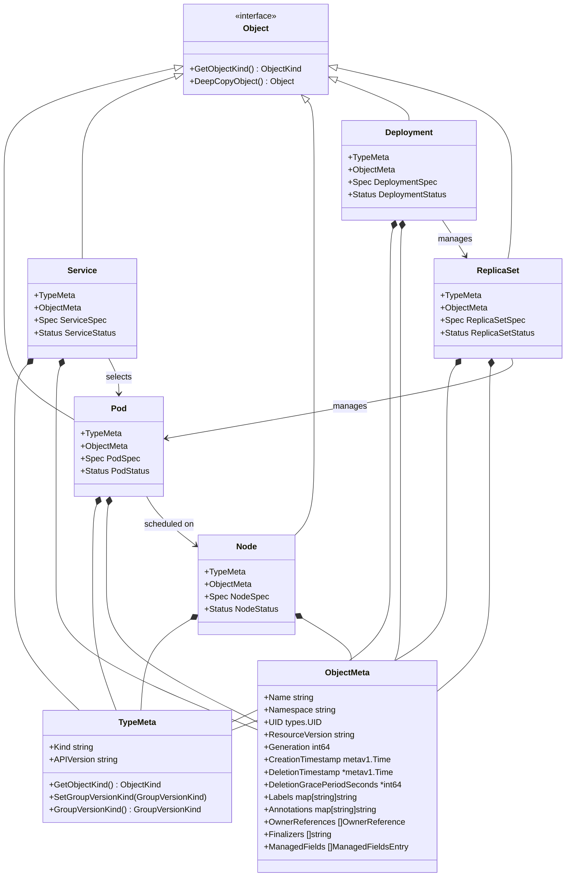
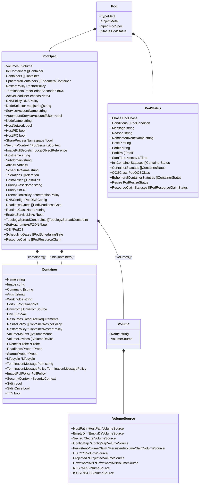
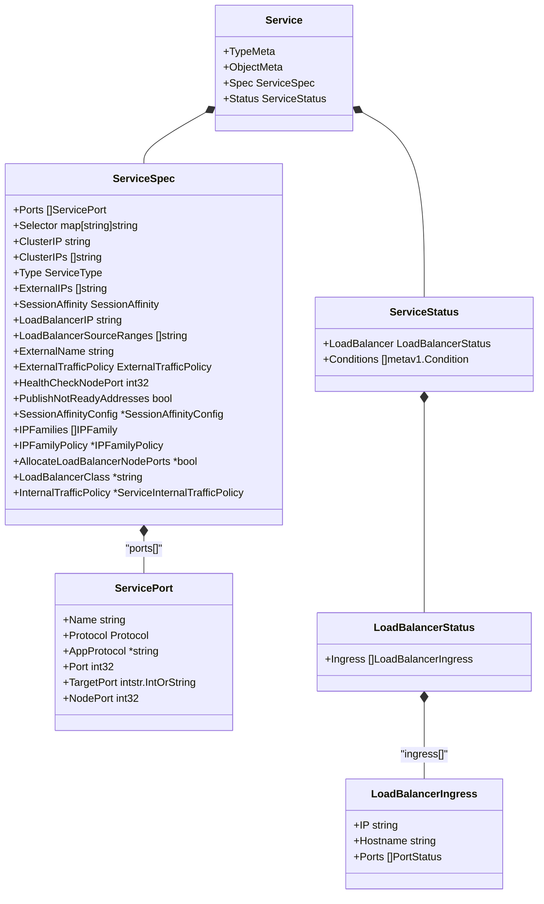
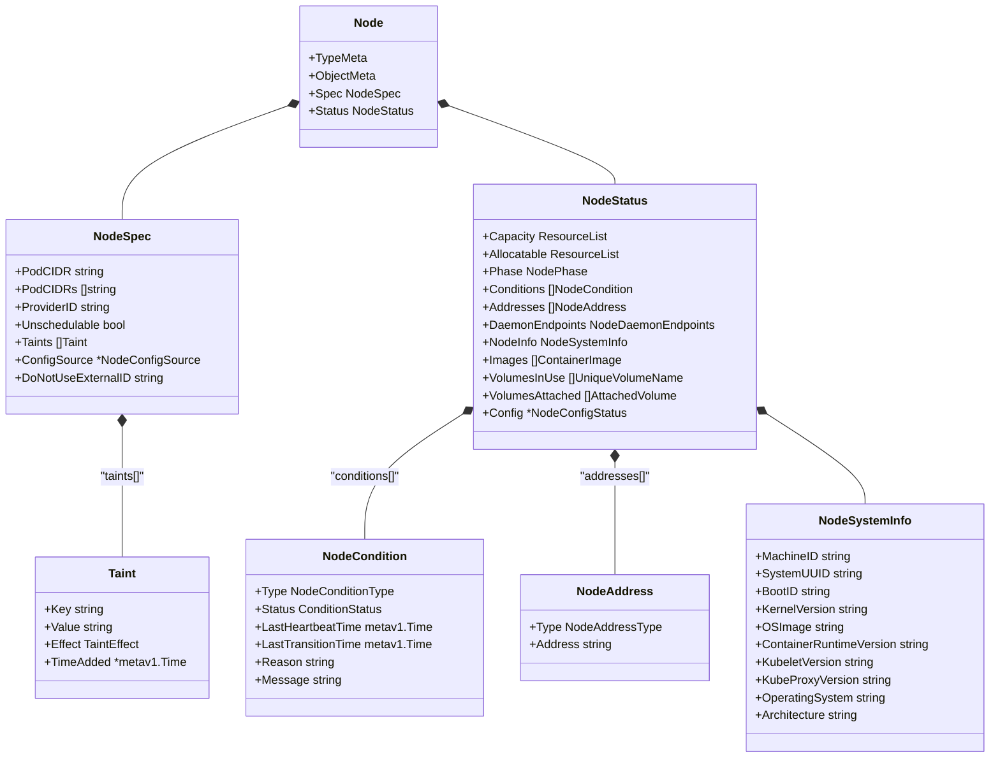
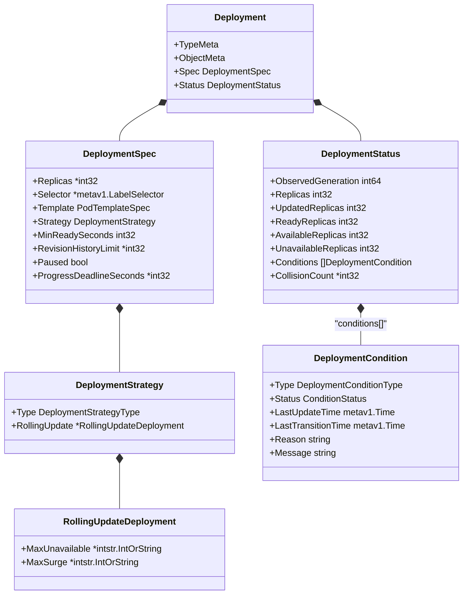
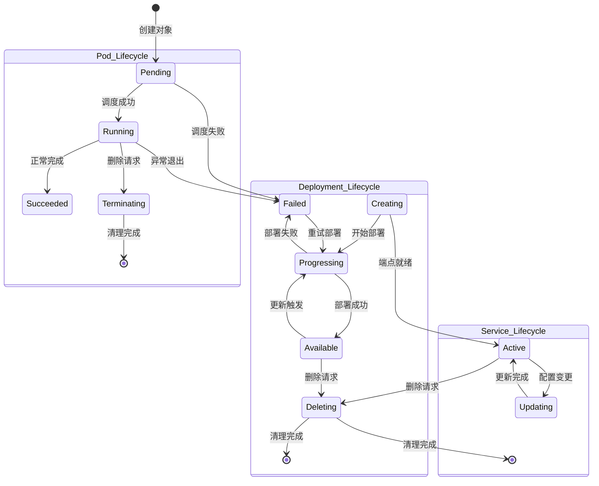

## 📚 文档概述

本文档深入分析 Kubernetes 的核心数据结构，包括 Pod、Service、Node、Deployment 等关键对象的 UML 图和详细说明。这些数据结构是理解 Kubernetes 架构和实现的基础。

## 🏗️ 核心对象关系图

### 1.1 Kubernetes 对象层次结构



## 🎯 Pod 数据结构详细分析

### 2.1 Pod 核心结构



### 2.2 Pod 数据结构源码分析

```go
/*
Pod 是 Kubernetes 中最小的可部署单元

主要字段说明：
- TypeMeta: 包含 Kind 和 APIVersion，标识对象类型
- ObjectMeta: 包含名称、命名空间、标签等元数据
- Spec: 定义 Pod 的期望状态
- Status: 反映 Pod 的当前状态
*/
type Pod struct {
    // TypeMeta 嵌入类型元数据
    // 包含 Kind="Pod" 和 APIVersion="v1"
    metav1.TypeMeta `json:",inline"`
    
    // ObjectMeta 包含标准对象元数据
    // 包括名称、命名空间、标签、注解等
    // 更多信息: https://git.k8s.io/community/contributors/devel/sig-architecture/api-conventions.md#metadata
    // +optional
    metav1.ObjectMeta `json:"metadata,omitempty" protobuf:"bytes,1,opt,name=metadata"`

    // Spec 定义 Pod 的期望行为
    // 更多信息: https://git.k8s.io/community/contributors/devel/sig-architecture/api-conventions.md#spec-and-status
    // +optional
    Spec PodSpec `json:"spec,omitempty" protobuf:"bytes,2,opt,name=spec"`

    // Status 表示 Pod 最近观察到的状态
    // 此数据可能不是最新的
    // 由系统填充
    // 只读
    // 更多信息: https://git.k8s.io/community/contributors/devel/sig-architecture/api-conventions.md#spec-and-status
    // +optional
    Status PodStatus `json:"status,omitempty" protobuf:"bytes,3,opt,name=status"`
}

/*
PodSpec 定义 Pod 的规格

主要字段说明：
- Volumes: Pod 中可用的存储卷列表
- InitContainers: 在应用容器启动前运行的初始化容器
- Containers: 属于 Pod 的容器列表
- RestartPolicy: Pod 中容器的重启策略
- NodeSelector: 节点选择器，用于将 Pod 调度到特定节点
- ServiceAccountName: 运行此 Pod 中容器的服务账户名称
- SecurityContext: Pod 级别的安全上下文
- Affinity: Pod 的调度约束
- Tolerations: Pod 的容忍度列表
*/
type PodSpec struct {
    // Volumes 是此 Pod 中容器可以挂载的存储卷列表
    // +optional
    // +patchMergeKey=name
    // +patchStrategy=merge,retainKeys
    Volumes []Volume `json:"volumes,omitempty" patchStrategy:"merge,retainKeys" patchMergeKey:"name" protobuf:"bytes,1,rep,name=volumes"`
    
    // InitContainers 是属于 Pod 的初始化容器列表
    // 初始化容器在应用容器启动前按顺序执行
    // 如果任何初始化容器失败，Pod 被认为失败，并根据其 restartPolicy 处理
    // 初始化容器的名称在所有容器中必须唯一
    // 初始化容器不能有生命周期操作、就绪探针、存活探针或启动探针
    // 初始化容器的 resourceRequirements 在调度期间通过查找每个资源类型的最高请求/限制来处理
    // 有效请求/限制是以下之一：
    // * 所有应用容器中资源的最高请求/限制
    // * 任何初始化容器中资源的最高请求/限制
    // 限制以相同方式应用于初始化容器
    // 初始化容器不能指定端口
    // +listType=map
    // +listMapKey=name
    InitContainers []Container `json:"initContainers,omitempty" protobuf:"bytes,20,rep,name=initContainers"`
    
    // Containers 是属于 Pod 的容器列表
    // 容器不能当前添加或删除
    // Pod 中必须至少有一个容器
    // 不能更新
    // +listType=map
    // +listMapKey=name
    Containers []Container `json:"containers" protobuf:"bytes,2,rep,name=containers"`
    
    // EphemeralContainers 是在此 Pod 中运行的临时容器列表
    // 临时容器可以添加到已经运行的 Pod 中以进行用户发起的活动，如调试
    // 此列表不能在 Pod 创建时指定，也不能通过更新 Pod 规格来修改
    // 要添加临时容器，请使用 Pod 的 ephemeralcontainers 子资源
    // +optional
    // +listType=map
    // +listMapKey=name
    EphemeralContainers []EphemeralContainer `json:"ephemeralContainers,omitempty" protobuf:"bytes,34,rep,name=ephemeralContainers"`
    
    // RestartPolicy 定义 Pod 中容器的重启策略
    // 可能的值：Always、OnFailure、Never
    // 默认为 Always
    // 更多信息: https://kubernetes.io/docs/concepts/workloads/pods/pod-lifecycle/#restart-policy
    // +optional
    RestartPolicy RestartPolicy `json:"restartPolicy,omitempty" protobuf:"bytes,3,opt,name=restartPolicy,casttype=RestartPolicy"`
    
    // TerminationGracePeriodSeconds 是 Pod 需要优雅终止的时间（秒）
    // 可能会在删除时被覆盖
    // 值必须是非负整数
    // 零值表示立即删除
    // 如果此值为 nil，将使用默认优雅期
    // 优雅期是从 Pod 中的进程发送终止信号到进程被 kill 信号强制停止的时间
    // 设置此值比进程的预期清理时间长
    // 默认为 30 秒
    // +optional
    TerminationGracePeriodSeconds *int64 `json:"terminationGracePeriodSeconds,omitempty" protobuf:"varint,4,opt,name=terminationGracePeriodSeconds"`
    
    // ActiveDeadlineSeconds 是 Pod 在系统主动尝试将其标记为失败并杀死相关容器之前可能在节点上活跃的时间（秒）
    // 值必须是正整数
    // +optional
    ActiveDeadlineSeconds *int64 `json:"activeDeadlineSeconds,omitempty" protobuf:"varint,5,opt,name=activeDeadlineSeconds"`
    
    // DNSPolicy 设置 Pod 的 DNS 策略
    // 默认为 "ClusterFirst"
    // 有效值为 'ClusterFirstWithHostNet'、'ClusterFirst'、'Default' 或 'None'
    // DNS 参数通过 dnsConfig 字段给出，将与通过 dnsPolicy 选择的策略合并
    // 要将 DNS 选项设置为 dnsPolicy 字段之外，必须将 dnsPolicy 字段设置为 "None"
    // +optional
    DNSPolicy DNSPolicy `json:"dnsPolicy,omitempty" protobuf:"bytes,6,opt,name=dnsPolicy,casttype=DNSPolicy"`
    
    // NodeSelector 是一个选择器，必须为 true 才能使 Pod 适合在节点上运行
    // 选择器必须匹配节点的标签才能在该节点上调度 Pod
    // 更多信息: https://kubernetes.io/docs/concepts/configuration/assign-pod-node/
    // +optional
    // +mapType=atomic
    NodeSelector map[string]string `json:"nodeSelector,omitempty" protobuf:"bytes,7,rep,name=nodeSelector"`
    
    // ServiceAccountName 是运行此 Pod 中容器的服务账户的名称
    // 更多信息: https://kubernetes.io/docs/tasks/configure-pod-container/configure-service-account/
    // +optional
    ServiceAccountName string `json:"serviceAccountName,omitempty" protobuf:"bytes,8,opt,name=serviceAccountName"`
    
    // AutomountServiceAccountToken 指示是否应自动挂载服务账户令牌
    // +optional
    AutomountServiceAccountToken *bool `json:"automountServiceAccountToken,omitempty" protobuf:"varint,21,opt,name=automountServiceAccountToken"`
    
    // NodeName 是将此 Pod 调度到特定节点的请求
    // 如果非空，调度器只是忽略此 Pod，kubelet 尝试在此节点上运行此 Pod
    // +optional
    NodeName string `json:"nodeName,omitempty" protobuf:"bytes,10,opt,name=nodeName"`
    
    // HostNetwork 请求此 Pod 使用主机网络命名空间
    // 使用主机的网络命名空间
    // 如果设置此选项，必须指定将使用的端口
    // 默认为 false
    // +k8s:conversion-gen=false
    // +optional
    HostNetwork bool `json:"hostNetwork,omitempty" protobuf:"varint,11,opt,name=hostNetwork"`
    
    // HostPID 请求此 Pod 使用主机进程 ID 命名空间
    // 使用主机的 pid 命名空间
    // 可选：默认为 false
    // +k8s:conversion-gen=false
    // +optional
    HostPID bool `json:"hostPID,omitempty" protobuf:"varint,12,opt,name=hostPID"`
    
    // HostIPC 请求此 Pod 使用主机 ipc 命名空间
    // 使用主机的 ipc 命名空间
    // 可选：默认为 false
    // +k8s:conversion-gen=false
    // +optional
    HostIPC bool `json:"hostIPC,omitempty" protobuf:"varint,13,opt,name=hostIPC"`
    
    // ShareProcessNamespace 在 Pod 中的所有容器之间共享单个进程命名空间
    // 启用时，Pod 中的容器可以查看和发信号给其他容器中的进程，并且每个容器中的进程 1 将接收来自 Pod 中其他容器的信号
    // 第一个在 Pod 中启动的进程将接收 SIGTERM 而不是 SIGKILL（进程 1 通常忽略 SIGTERM）
    // 默认为 false
    // +k8s:conversion-gen=false
    // +optional
    ShareProcessNamespace *bool `json:"shareProcessNamespace,omitempty" protobuf:"varint,27,opt,name=shareProcessNamespace"`
    
    // SecurityContext 保存 Pod 级别的安全属性和通用容器设置
    // 可选：默认为空。有关默认值，请参阅 SecurityContext 类型的文档
    // +optional
    SecurityContext *PodSecurityContext `json:"securityContext,omitempty" protobuf:"bytes,14,opt,name=securityContext"`
    
    // ImagePullSecrets 是对同一命名空间中 secrets 的引用列表，用于拉取此 PodSpec 中使用的任何镜像
    // 如果指定，这些 secrets 将传递给各个拉取器实现供其使用
    // 更多信息: https://kubernetes.io/docs/concepts/containers/images#specifying-imagepullsecrets-on-a-pod
    // +optional
    // +listType=map
    // +listMapKey=name
    ImagePullSecrets []LocalObjectReference `json:"imagePullSecrets,omitempty" protobuf:"bytes,15,rep,name=imagePullSecrets"`
    
    // Hostname 指定 Pod 的主机名
    // 如果未指定，Pod 的主机名将设置为系统定义的值
    // +optional
    Hostname string `json:"hostname,omitempty" protobuf:"bytes,16,opt,name=hostname"`
    
    // Subdomain 指定 Pod 的子域
    // 如果指定，完全限定的 Pod 主机名将是 "<hostname>.<subdomain>.<pod namespace>.svc.<cluster domain>"
    // 如果未指定，Pod 将没有域名
    // +optional
    Subdomain string `json:"subdomain,omitempty" protobuf:"bytes,17,opt,name=subdomain"`
    
    // Affinity 是 Pod 的调度约束
    // +optional
    Affinity *Affinity `json:"affinity,omitempty" protobuf:"bytes,18,opt,name=affinity"`
    
    // SchedulerName 指定用于调度 Pod 的调度器
    // 如果未指定，将使用默认调度器
    // +optional
    SchedulerName string `json:"schedulerName,omitempty" protobuf:"bytes,19,opt,name=schedulerName"`
    
    // Tolerations 是 Pod 的容忍度列表
    // +optional
    // +listType=atomic
    Tolerations []Toleration `json:"tolerations,omitempty" protobuf:"bytes,22,rep,name=tolerations"`
    
    // HostAliases 是 Pod 的 /etc/hosts 文件中的可选主机和 IP 列表
    // 这仅适用于非主机网络 Pod
    // +optional
    // +listType=map
    // +listMapKey=ip
    HostAliases []HostAlias `json:"hostAliases,omitempty" protobuf:"bytes,23,rep,name=hostAliases"`
    
    // PriorityClassName 指定 Pod 的优先级类
    // "system-node-critical" 和 "system-cluster-critical" 是两个特殊关键字，分别表示最高优先级
    // 任何其他名称必须通过创建具有该名称的 PriorityClass 对象来定义
    // 如果未指定，Pod 优先级将为默认值，如果没有默认值则为零
    // +optional
    PriorityClassName string `json:"priorityClassName,omitempty" protobuf:"bytes,24,opt,name=priorityClassName"`
    
    // Priority 是此 Pod 的优先级值
    // 这是 PriorityClassName 的实际优先级值
    // 如果未提供 PriorityClassName，这必须在有效范围内，否则将被忽略
    // 此字段是只读的，将由准入控制器基于 PriorityClassName 填充
    // 值越高，优先级越高
    // 更多信息: https://git.k8s.io/community/contributors/design-proposals/scheduling/pod-priority-api.md
    // +optional
    Priority *int32 `json:"priority,omitempty" protobuf:"bytes,25,opt,name=priority"`
    
    // PreemptionPolicy 是用于抢占较低优先级 Pod 的策略
    // 三个支持的值之一："Never"、"PreemptLowerPriority"
    // 默认为 "PreemptLowerPriority"
    // 如果设置为 "Never"，Pod 永远不会抢占其他 Pod
    // +optional
    PreemptionPolicy *PreemptionPolicy `json:"preemptionPolicy,omitempty" protobuf:"bytes,31,opt,name=preemptionPolicy"`
    
    // DNSConfig 指定 Pod 的 DNS 参数
    // 此处指定的参数将合并到基于 DNSPolicy 生成的 DNS 配置中
    // +optional
    DNSConfig *PodDNSConfig `json:"dnsConfig,omitempty" protobuf:"bytes,26,opt,name=dnsConfig"`
    
    // ReadinessGates 指定要评估 Pod 就绪性的附加条件列表
    // +optional
    // +listType=atomic
    ReadinessGates []PodReadinessGate `json:"readinessGates,omitempty" protobuf:"bytes,28,rep,name=readinessGates"`
    
    // RuntimeClassName 指向 node.k8s.io 组中的 RuntimeClass 对象，该对象应用于运行此 Pod
    // 如果没有 RuntimeClass 资源与命名类匹配，Pod 将不会运行
    // 如果未设置或为空，将使用 "legacy" RuntimeClass，这是一个隐式类，具有空定义，使用默认运行时处理程序
    // 更多信息: https://git.k8s.io/enhancements/keps/sig-node/585-runtime-class
    // +optional
    RuntimeClassName *string `json:"runtimeClassName,omitempty" protobuf:"bytes,29,opt,name=runtimeClassName"`
    
    // EnableServiceLinks 指示有关服务的信息是否应注入到 Pod 的环境变量中，匹配 Docker 链接的语法
    // 可选：默认为 true
    // +optional
    EnableServiceLinks *bool `json:"enableServiceLinks,omitempty" protobuf:"varint,30,opt,name=enableServiceLinks"`
    
    // TopologySpreadConstraints 描述一组 Pod 应如何在给定拓扑中分布
    // 调度器将以遵守约束的方式调度 Pod
    // 所有 topologySpreadConstraints 都使用逻辑 AND 进行评估
    // +optional
    // +listType=map
    // +listMapKey=topologyKey
    // +patchStrategy=merge
    // +patchMergeKey=topologyKey
    TopologySpreadConstraints []TopologySpreadConstraint `json:"topologySpreadConstraints,omitempty" patchStrategy:"merge" patchMergeKey:"topologyKey" protobuf:"bytes,33,rep,name=topologySpreadConstraints"`
    
    // SetHostnameAsFQDN 如果为 true，Pod 的主机名将配置为 Pod 的 FQDN，而不是叶名称（默认）
    // 在 Linux 容器中，这意味着将内核的 hostname 字段（struct utsname 的 nodename 字段）设置为 FQDN
    // 在 Windows 容器中，这意味着将注册表值 HostName 设置为 FQDN
    // 如果 Pod 没有 FQDN，此字段无效
    // 默认为 false
    // +optional
    SetHostnameAsFQDN *bool `json:"setHostnameAsFQDN,omitempty" protobuf:"varint,35,opt,name=setHostnameAsFQDN"`
    
    // OS 指定 Pod 中容器的操作系统
    // 某些 Pod 和容器字段受此限制
    //
    // 如果 OS 字段设置为 linux，则必须不设置以下字段：
    // -securityContext.windowsOptions
    //
    // 如果 OS 字段设置为 windows，则必须不设置以下字段：
    // -spec.hostPID
    // -spec.hostIPC
    // -spec.hostUsers
    // -spec.securityContext.seLinuxOptions
    // -spec.securityContext.seccompProfile
    // -spec.securityContext.fsGroup
    // -spec.securityContext.fsGroupChangePolicy
    // -spec.securityContext.sysctls
    // -spec.shareProcessNamespace
    // -spec.securityContext.runAsUser
    // -spec.securityContext.runAsGroup
    // -spec.securityContext.supplementalGroups
    // -spec.containers[*].securityContext.seLinuxOptions
    // -spec.containers[*].securityContext.seccompProfile
    // -spec.containers[*].securityContext.capabilities
    // -spec.containers[*].securityContext.readOnlyRootFilesystem
    // -spec.containers[*].securityContext.privileged
    // -spec.containers[*].securityContext.allowPrivilegeEscalation
    // -spec.containers[*].securityContext.procMount
    // -spec.containers[*].securityContext.runAsUser
    // -spec.containers[*].securityContext.runAsGroup
    // +optional
    OS *PodOS `json:"os,omitempty" protobuf:"bytes,36,opt,name=os"`
    
    // SchedulingGates 是一个不透明的值列表，如果指定，将阻止调度 Pod
    // 如果 schedulingGates 不为空，Pod 将保持在 SchedulingGated 状态，调度器将不会尝试调度 Pod
    //
    // SchedulingGates 只能在 Pod 创建时设置，并且只能在之后删除
    //
    // 这是一个 beta 功能，由 PodSchedulingReadiness 功能门控启用
    //
    // +optional
    // +listType=map
    // +listMapKey=name
    // +featureGate=PodSchedulingReadiness
    SchedulingGates []PodSchedulingGate `json:"schedulingGates,omitempty" protobuf:"bytes,37,rep,name=schedulingGates"`
    
    // ResourceClaims 定义此 Pod 使用哪些 ResourceClaims
    // 这是一个 alpha 功能，由 DynamicResourceAllocation 功能门控启用
    //
    // 此字段是不可变的
    //
    // +optional
    // +listType=map
    // +listMapKey=name
    // +featureGate=DynamicResourceAllocation
    ResourceClaims []PodResourceClaim `json:"resourceClaims,omitempty" protobuf:"bytes,38,rep,name=resourceClaims"`
}
```

## 🌐 Service 数据结构详细分析

### 3.1 Service 核心结构



### 3.2 Service 数据结构源码分析

```go
/*
Service 是将运行在一组 Pod 上的应用程序公开为网络服务的抽象方法

主要字段说明：
- TypeMeta: 包含 Kind="Service" 和 APIVersion="v1"
- ObjectMeta: 包含名称、命名空间、标签等元数据
- Spec: 定义服务的行为
- Status: 反映服务的当前状态
*/
type Service struct {
    // TypeMeta 嵌入类型元数据
    metav1.TypeMeta `json:",inline"`
    
    // ObjectMeta 包含标准对象元数据
    // 更多信息: https://git.k8s.io/community/contributors/devel/sig-architecture/api-conventions.md#metadata
    // +optional
    metav1.ObjectMeta `json:"metadata,omitempty" protobuf:"bytes,1,opt,name=metadata"`

    // Spec 定义服务的行为
    // https://git.k8s.io/community/contributors/devel/sig-architecture/api-conventions.md#spec-and-status
    // +optional
    Spec ServiceSpec `json:"spec,omitempty" protobuf:"bytes,2,opt,name=spec"`

    // Status 表示服务最近观察到的状态
    // 由系统填充
    // 只读
    // 更多信息: https://git.k8s.io/community/contributors/devel/sig-architecture/api-conventions.md#spec-and-status
    // +optional
    Status ServiceStatus `json:"status,omitempty" protobuf:"bytes,3,opt,name=status"`
}

/*
ServiceSpec 描述服务的属性

主要字段说明：
- Ports: 此服务公开的端口列表
- Selector: 将流量路由到的端点选择器
- ClusterIP: 服务的 IP 地址
- Type: 服务类型，决定服务如何公开
- ExternalIPs: 服务可用的外部 IP 列表
- SessionAffinity: 会话亲和性设置
- LoadBalancerIP: 负载均衡器 IP（已弃用）
- ExternalName: 外部服务的 DNS 名称
*/
type ServiceSpec struct {
    // Ports 是此服务公开的端口列表
    // 更多信息: https://kubernetes.io/docs/concepts/services-networking/service/#virtual-ips-and-service-proxies
    // +listType=map
    // +listMapKey=port
    // +listMapKey=protocol
    Ports []ServicePort `json:"ports,omitempty" protobuf:"bytes,1,rep,name=ports"`

    // Selector 将流量路由到与此标签选择器匹配的端点
    // 如果为空或不存在，则假定服务有外部进程管理其端点，Kubernetes 不会修改这些端点
    // 仅适用于 ClusterIP、NodePort 和 LoadBalancer 类型
    // 对于 ExternalName 类型忽略
    // 更多信息: https://kubernetes.io/docs/concepts/services-networking/service/
    // +optional
    // +mapType=atomic
    Selector map[string]string `json:"selector,omitempty" protobuf:"bytes,2,rep,name=selector"`

    // ClusterIP 是服务的 IP 地址，通常由主节点随机分配
    // 如果地址是手动指定的，在范围内且未使用，它将被分配给服务；否则创建将失败
    // 此字段可能不会更改为除 "None"（用于无头服务）之外的值，需要删除并重新创建服务
    // 有效值为 "None"、空字符串（""）或有效的 IP 地址
    // 设置此字段为 "None" 会使服务成为"无头服务"（没有虚拟 IP），并且 Endpoints 控制器不会创建端点
    // 更多信息: https://kubernetes.io/docs/concepts/services-networking/service/#headless-services
    // +optional
    ClusterIP string `json:"clusterIP,omitempty" protobuf:"bytes,3,opt,name=clusterIP"`

    // ClusterIPs 是分配给此服务的 IP 地址列表，通常由主节点随机分配
    // 如果地址是手动指定的，在范围内且未使用，它将被分配给服务；否则创建将失败
    // 此字段不能在服务创建后更改
    // 有效值为 "None"、空字符串（""）或有效的 IP 地址
    // 设置此字段为 "None" 会使服务成为"无头服务"（没有虚拟 IP），并且 Endpoints 控制器不会创建端点
    // 如果此字段未指定，它将从 clusterIP 字段初始化
    // 如果此字段指定，客户端必须确保 clusterIPs[0] 和 clusterIP 具有相同的值
    //
    // 此字段可能最多包含两个条目（双栈 IP，按任意顺序）
    // 这些 IP 必须对应于 ipFamilies 字段的值
    // IPv4 和 IPv6 地址都必须在集群的服务 CIDR 中
    // 更多信息: https://kubernetes.io/docs/concepts/services-networking/service/#headless-services
    // +listType=atomic
    // +optional
    ClusterIPs []string `json:"clusterIPs,omitempty" protobuf:"bytes,18,rep,name=clusterIPs"`

    // Type 确定服务的公开方式
    // 默认为 ClusterIP
    // 有效选项为 ExternalName、ClusterIP、NodePort 和 LoadBalancer
    // "ClusterIP" 在集群内部 IP 上分配服务，使服务只能从集群内访问
    // "NodePort" 在静态端口（NodePort）上的每个节点的 IP 上公开服务
    // 将自动创建 "ClusterIP" 服务，NodePort 服务将路由到该服务
    // 您将能够通过请求 <NodeIP>:<NodePort> 从集群外部联系 NodePort 服务
    // "LoadBalancer" 使用云提供商的负载均衡器在外部公开服务
    // 外部负载均衡器路由到的 NodePort 和 ClusterIP 服务将自动创建
    // "ExternalName" 通过返回带有其值的 CNAME 记录将服务映射到 externalName 字段的内容（例如 foo.bar.example.com）
    // 不设置任何类型的代理
    // 这需要 kube-dns 版本 1.7 或更高版本，或者 CoreDNS 版本 0.0.8 或更高版本
    // 更多信息: https://kubernetes.io/docs/concepts/services-networking/service/#publishing-services-service-types
    // +optional
    Type ServiceType `json:"type,omitempty" protobuf:"bytes,4,opt,name=type,casttype=ServiceType"`

    // ExternalIPs 是此服务可用的 IP 地址列表
    // 这些 IP 不由 Kubernetes 管理
    // 用户有责任确保到这些 IP 的流量被路由到服务
    // 常见示例是不属于 Kubernetes 系统的外部负载均衡器
    // +optional
    // +listType=atomic
    ExternalIPs []string `json:"externalIPs,omitempty" protobuf:"bytes,5,rep,name=externalIPs"`

    // SessionAffinity 支持 "ClientIP" 和 "None"
    // 用于维护会话亲和性
    // 启用基于客户端 IP 的会话亲和性
    // 必须是 ClientIP 或 None
    // 默认为 None
    // 更多信息: https://kubernetes.io/docs/concepts/services-networking/service/#virtual-ips-and-service-proxies
    // +optional
    SessionAffinity SessionAffinity `json:"sessionAffinity,omitempty" protobuf:"bytes,7,opt,name=sessionAffinity,casttype=SessionAffinity"`

    // LoadBalancerIP 已弃用：此字段被忽略，可能在将来的 API 版本中删除
    // +optional
    LoadBalancerIP string `json:"loadBalancerIP,omitempty" protobuf:"bytes,8,opt,name=loadBalancerIP"`

    // LoadBalancerSourceRanges 如果指定且平台支持，将限制通过云提供商负载均衡器的流量到指定的客户端 IP
    // 这字段将被忽略，如果云提供商不支持该功能
    // 更多信息: https://kubernetes.io/docs/tasks/access-application-cluster/create-external-load-balancer/
    // +optional
    // +listType=atomic
    LoadBalancerSourceRanges []string `json:"loadBalancerSourceRanges,omitempty" protobuf:"bytes,9,rep,name=loadBalancerSourceRanges"`

    // ExternalName 是此服务引用的外部服务的外部引用
    // （例如 DNS 名称）
    // ExternalName 的值必须是有效的 RFC-1123 DNS 名称
    // (https://tools.ietf.org/html/rfc1123) 并且需要 Type 为 ExternalName
    // +optional
    ExternalName string `json:"externalName,omitempty" protobuf:"bytes,10,opt,name=externalName"`

    // ExternalTrafficPolicy 描述节点如何分发它们接收的外部流量
    // 如果设置为 "Local"，代理将配置服务，以便它只代理到本地端点而不是集群范围的端点，并且不伪装客户端源 IP
    // （流量必须由外部负载均衡器发送到具有健康端点的节点，否则流量将被丢弃）
    // 默认值 "Cluster" 使用标准行为，将流量路由到所有端点，并伪装客户端源 IP
    // 请注意，此字段通常由云提供商负载均衡器控制器忽略
    // +optional
    ExternalTrafficPolicy ExternalTrafficPolicy `json:"externalTrafficPolicy,omitempty" protobuf:"bytes,11,opt,name=externalTrafficPolicy"`

    // HealthCheckNodePort 指定服务的健康检查节点端口（数字端口号）
    // 如果未指定，HealthCheckNodePort 由服务 API 后端创建，具有 "type" 设置为 "LoadBalancer"
    // 将分配一个节点端口（如果 ExternalTrafficPolicy 设置为 Local）
    // 如果指定，客户端必须确保该端口在所有参与的节点上可用，并且该端口不被任何其他服务使用
    // +optional
    HealthCheckNodePort int32 `json:"healthCheckNodePort,omitempty" protobuf:"bytes,12,opt,name=healthCheckNodePort"`

    // PublishNotReadyAddresses 指示任何代理此服务的代理是否应强制发送流量到"未就绪"地址
    // 此字段已弃用，从 Kubernetes v1.28 开始，它被忽略
    // +optional
    PublishNotReadyAddresses bool `json:"publishNotReadyAddresses,omitempty" protobuf:"varint,13,opt,name=publishNotReadyAddresses"`

    // SessionAffinityConfig 包含会话亲和性的配置
    // +optional
    SessionAffinityConfig *SessionAffinityConfig `json:"sessionAffinityConfig,omitempty" protobuf:"bytes,14,opt,name=sessionAffinityConfig"`

    // IPFamilies 是分配给此服务的 IP 协议族列表（例如 IPv4、IPv6）
    // 此字段通常根据集群配置和 ipFamilyPolicy 字段自动设置
    // 该字段可以包含最多两个条目（双栈族，按任意顺序）
    // 这些族必须对应于 clusterIPs 字段的值
    // IPv4 和 IPv6 都被认为是众所周知的标识符：
    // IPv4: "IPv4"
    // IPv6: "IPv6"
    // +listType=atomic
    // +optional
    IPFamilies []IPFamily `json:"ipFamilies,omitempty" protobuf:"bytes,19,rep,name=ipFamilies,casttype=IPFamily"`

    // IPFamilyPolicy 表示此服务可用的双栈-ness
    // 如果没有提供值，则此字段将根据集群配置设置为 SingleStack 或 RequireDualStack
    // 服务可以是 "SingleStack"（单个 IP 族）、"PreferDualStack"（两个 IP 族在双栈配置集群上或单栈集群上的单个 IP 族）或 "RequireDualStack"（两个 IP 族在双栈配置集群上，否则失败）
    // ipFamilies 和 clusterIPs 字段取决于此字段的值
    // 此字段将在服务创建后被清除
    // +optional
    IPFamilyPolicy *IPFamilyPolicy `json:"ipFamilyPolicy,omitempty" protobuf:"bytes,17,opt,name=ipFamilyPolicy,casttype=IPFamilyPolicy"`

    // AllocateLoadBalancerNodePorts 定义是否自动为 LoadBalancer 类型的服务分配 NodePort
    // 默认为 "true"
    // 如果云提供商负载均衡器实现依赖于 NodePort，则可以将此字段设置为 "false"
    // 如果调用者通过在服务端口中指定 NodePort 来请求特定的 NodePort，无论此字段如何，都会遵守这些请求
    // 此字段只能在 type 为 "LoadBalancer" 的服务上设置，如果 type 更改为任何其他类型，此字段将被清除
    // +optional
    AllocateLoadBalancerNodePorts *bool `json:"allocateLoadBalancerNodePorts,omitempty" protobuf:"bytes,20,opt,name=allocateLoadBalancerNodePorts"`

    // LoadBalancerClass 是此 LoadBalancer 类型服务的负载均衡器实现的类
    // 如果未设置，将使用默认负载均衡器实现
    // 此字段只能在 type 为 "LoadBalancer" 的服务上设置
    // 如果设置，假定负载均衡器实现正在监视具有相应负载均衡器类的服务
    // 任何默认负载均衡器实现（例如云提供商）应忽略设置此字段的服务
    // 此字段只能在服务创建或类型更改为 "LoadBalancer" 时设置
    // 一旦设置，就不能更改
    // 此字段将在 type 更改为任何其他类型时被清除
    // +optional
    LoadBalancerClass *string `json:"loadBalancerClass,omitempty" protobuf:"bytes,21,opt,name=loadBalancerClass"`

    // InternalTrafficPolicy 描述节点如何分发它们接收的内部流量
    // 如果设置为 "Local"，代理将配置服务，以便它只代理到本地端点而不是集群范围的端点，并且不伪装客户端源 IP
    // 默认值 "Cluster" 使用标准行为，将流量路由到所有端点，并伪装客户端源 IP
    // 请注意，此字段通常由云提供商负载均衡器控制器忽略
    // +featureGate=ServiceInternalTrafficPolicy
    // +optional
    InternalTrafficPolicy *ServiceInternalTrafficPolicy `json:"internalTrafficPolicy,omitempty" protobuf:"bytes,22,opt,name=internalTrafficPolicy"`
}
```

## 🖥️ Node 数据结构详细分析

### 4.1 Node 核心结构



### 4.2 Node 数据结构源码分析

```go
/*
Node 是 Kubernetes 集群中的工作机器

主要字段说明：
- TypeMeta: 包含 Kind="Node" 和 APIVersion="v1"
- ObjectMeta: 包含名称、标签等元数据（Node 没有命名空间）
- Spec: 定义节点的规格
- Status: 反映节点的当前状态
*/
type Node struct {
    // TypeMeta 嵌入类型元数据
    metav1.TypeMeta `json:",inline"`
    
    // ObjectMeta 包含标准对象元数据
    // 更多信息: https://git.k8s.io/community/contributors/devel/sig-architecture/api-conventions.md#metadata
    // +optional
    metav1.ObjectMeta `json:"metadata,omitempty" protobuf:"bytes,1,opt,name=metadata"`

    // Spec 定义节点的行为
    // https://git.k8s.io/community/contributors/devel/sig-architecture/api-conventions.md#spec-and-status
    // +optional
    Spec NodeSpec `json:"spec,omitempty" protobuf:"bytes,2,opt,name=spec"`

    // Status 表示节点最近观察到的状态
    // 由系统填充
    // 只读
    // 更多信息: https://git.k8s.io/community/contributors/devel/sig-architecture/api-conventions.md#spec-and-status
    // +optional
    Status NodeStatus `json:"status,omitempty" protobuf:"bytes,3,opt,name=status"`
}

/*
NodeSpec 描述节点创建时的属性

主要字段说明：
- PodCIDR: 分配给节点的 Pod IP 范围
- ProviderID: 云提供商特定的节点 ID
- Unschedulable: 是否禁止在此节点上调度新 Pod
- Taints: 节点污点列表
- ConfigSource: 节点配置源
*/
type NodeSpec struct {
    // PodCIDR 表示分配给节点的 Pod IP 范围
    // +optional
    PodCIDR string `json:"podCIDR,omitempty" protobuf:"bytes,1,opt,name=podCIDR"`

    // PodCIDRs 表示分配给节点的 Pod IP 范围
    // 如果指定此字段，第一个条目必须与 PodCIDR 字段匹配
    // 它可能包含最多 1 个 IPv4 和 1 个 IPv6 CIDR
    // +optional
    // +listType=atomic
    PodCIDRs []string `json:"podCIDRs,omitempty" protobuf:"bytes,7,rep,name=podCIDRs"`

    // ProviderID 是云提供商特定的节点 ID
    // 此字段不会由节点控制器设置，但如果云控制器管理器正在运行，则会由其设置
    // +optional
    ProviderID string `json:"providerID,omitempty" protobuf:"bytes,3,opt,name=providerID"`

    // Unschedulable 控制节点可调度性
    // 默认情况下，节点是可调度的
    // 更多信息: https://kubernetes.io/docs/concepts/nodes/node/#manual-node-administration
    // +optional
    Unschedulable bool `json:"unschedulable,omitempty" protobuf:"varint,4,opt,name=unschedulable"`

    // Taints 是应用于此节点的污点
    // 更多信息: https://kubernetes.io/docs/concepts/configuration/taint-and-toleration/
    // +optional
    // +listType=atomic
    Taints []Taint `json:"taints,omitempty" protobuf:"bytes,5,rep,name=taints"`

    // ConfigSource 指定节点配置的源
    // DynamicKubeletConfig 功能门控必须启用才能使用此字段
    // 此字段已弃用，从 Kubernetes v1.22 开始，它不再受支持
    // +optional
    ConfigSource *NodeConfigSource `json:"configSource,omitempty" protobuf:"bytes,6,opt,name=configSource"`

    // DoNotUseExternalID 已弃用
    // 为了向后兼容而保留
    // 将被忽略
    // +optional
    DoNotUseExternalID string `json:"externalID,omitempty" protobuf:"bytes,2,opt,name=externalID"`
}

/*
NodeStatus 是节点的最近观察状态

主要字段说明：
- Capacity: 节点的总资源容量
- Allocatable: 可分配给 Pod 的资源量
- Phase: 节点的生命周期阶段
- Conditions: 节点的当前服务状态数组
- Addresses: 可达到此节点的地址列表
- DaemonEndpoints: 节点上运行的守护进程端点
- NodeInfo: 节点的一般信息
- Images: 节点上的容器镜像列表
*/
type NodeStatus struct {
    // Capacity 表示节点的总资源
    // 更多信息: https://kubernetes.io/docs/concepts/storage/persistent-volumes#capacity
    // +optional
    Capacity ResourceList `json:"capacity,omitempty" protobuf:"bytes,1,rep,name=capacity,casttype=ResourceList,castkey=ResourceName"`

    // Allocatable 表示节点的可分配资源
    // 默认为 Capacity
    // +optional
    Allocatable ResourceList `json:"allocatable,omitempty" protobuf:"bytes,2,rep,name=allocatable,casttype=ResourceList,castkey=ResourceName"`

    // Phase 表示节点的生命周期阶段
    // +optional
    Phase NodePhase `json:"phase,omitempty" protobuf:"bytes,3,opt,name=phase,casttype=NodePhase"`

    // Conditions 是当前观察到的节点条件数组
    // 更多信息: https://kubernetes.io/docs/concepts/nodes/node/#condition
    // +optional
    // +listType=map
    // +listMapKey=type
    // +patchStrategy=merge
    // +patchMergeKey=type
    Conditions []NodeCondition `json:"conditions,omitempty" patchStrategy:"merge" patchMergeKey:"type" protobuf:"bytes,4,rep,name=conditions"`

    // Addresses 是可达到节点的地址列表
    // 从云提供商查询（如果有）
    // 更多信息: https://kubernetes.io/docs/concepts/nodes/node/#addresses
    // 注意：此字段声明为可合并，但合并逻辑未实现
    // +optional
    // +listType=map
    // +listMapKey=type
    // +patchStrategy=merge
    // +patchMergeKey=type
    Addresses []NodeAddress `json:"addresses,omitempty" patchStrategy:"merge" patchMergeKey:"type" protobuf:"bytes,5,rep,name=addresses"`

    // DaemonEndpoints 列出分配给节点的端口
    // +optional
    DaemonEndpoints NodeDaemonEndpoints `json:"daemonEndpoints,omitempty" protobuf:"bytes,6,opt,name=daemonEndpoints"`

    // NodeInfo 设置节点的一般信息
    // +optional
    NodeInfo NodeSystemInfo `json:"nodeInfo,omitempty" protobuf:"bytes,7,opt,name=nodeInfo"`

    // Images 列出节点上的容器镜像
    // +optional
    // +listType=atomic
    Images []ContainerImage `json:"images,omitempty" protobuf:"bytes,8,rep,name=images"`

    // VolumesInUse 是附加到节点并被 Pod 使用的卷的列表
    // +optional
    // +listType=atomic
    VolumesInUse []UniqueVolumeName `json:"volumesInUse,omitempty" protobuf:"bytes,9,rep,name=volumesInUse"`

    // VolumesAttached 是附加到节点的卷的列表
    // +optional
    // +listType=atomic
    VolumesAttached []AttachedVolume `json:"volumesAttached,omitempty" protobuf:"bytes,10,rep,name=volumesAttached"`

    // Config 报告节点配置的状态
    // DynamicKubeletConfig 功能门控必须启用才能使用此字段
    // 此字段已弃用，从 Kubernetes v1.22 开始，它不再受支持
    // +optional
    Config *NodeConfigStatus `json:"config,omitempty" protobuf:"bytes,11,opt,name=config"`
}

/*
Taint 表示节点污点

主要字段说明：
- Key: 污点键，必须是有效的标签键
- Value: 污点值，必须是有效的标签值
- Effect: 污点效果，定义对不容忍此污点的 Pod 的影响
- TimeAdded: 添加污点的时间
*/
type Taint struct {
    // Key 是污点键，应用于节点
    // 有效的污点键必须：
    // 1. 不超过 253 个字符
    // 2. 可选地以 DNS 子域前缀和单个 '/' 开头
    // 3. 以字母数字字符开头和结尾
    // 4. 只包含破折号、点、下划线和字母数字
    Key string `json:"key" protobuf:"bytes,1,opt,name=key"`

    // Value 是污点值，对应于污点键
    // +optional
    Value string `json:"value,omitempty" protobuf:"bytes,2,opt,name=value"`

    // Effect 表示匹配污点的效果
    // 有效效果为 NoSchedule、PreferNoSchedule 和 NoExecute
    Effect TaintEffect `json:"effect" protobuf:"bytes,3,opt,name=effect,casttype=TaintEffect"`

    // TimeAdded 表示添加污点的时间
    // 它仅适用于 NoExecute 污点
    // +optional
    TimeAdded *metav1.Time `json:"timeAdded,omitempty" protobuf:"bytes,4,opt,name=timeAdded"`
}
```

## 🚀 Deployment 数据结构详细分析

### 5.1 Deployment 核心结构



### 5.2 Deployment 数据结构源码分析

```go
/*
Deployment 为 Pod 和 ReplicaSet 提供声明式更新

主要字段说明：
- TypeMeta: 包含 Kind="Deployment" 和 APIVersion="apps/v1"
- ObjectMeta: 包含名称、命名空间、标签等元数据
- Spec: 定义 Deployment 的期望状态
- Status: 反映 Deployment 的当前状态
*/
type Deployment struct {
    // TypeMeta 嵌入类型元数据
    metav1.TypeMeta `json:",inline"`
    
    // ObjectMeta 包含标准对象元数据
    // 更多信息: https://git.k8s.io/community/contributors/devel/sig-architecture/api-conventions.md#metadata
    // +optional
    metav1.ObjectMeta `json:"metadata,omitempty" protobuf:"bytes,1,opt,name=metadata"`

    // Spec 定义 Deployment 的期望行为
    // +optional
    Spec DeploymentSpec `json:"spec,omitempty" protobuf:"bytes,2,opt,name=spec"`

    // Status 表示 Deployment 最近观察到的状态
    // +optional
    Status DeploymentStatus `json:"status,omitempty" protobuf:"bytes,3,opt,name=status"`
}

/*
DeploymentSpec 是 Deployment 的规格

主要字段说明：
- Replicas: 期望的 Pod 副本数
- Selector: 用于选择 Pod 的标签选择器
- Template: 描述将要创建的 Pod
- Strategy: 用新 Pod 替换现有 Pod 的部署策略
- MinReadySeconds: 新创建的 Pod 在没有任何容器崩溃的情况下被认为可用的最小秒数
- RevisionHistoryLimit: 要保留的旧 ReplicaSet 数量
- Paused: 指示部署是否暂停
- ProgressDeadlineSeconds: 部署进度的最大时间（秒）
*/
type DeploymentSpec struct {
    // Replicas 是期望的 Pod 数量
    // 这是一个指针，用于区分显式零和未指定
    // 默认为 1
    // +optional
    Replicas *int32 `json:"replicas,omitempty" protobuf:"varint,1,opt,name=replicas"`

    // Selector 是此部署目标 Pod 的标签选择器
    // 如果为空，默认为模板中的标签
    // 在 apps/v1 中，一旦创建，用户就不能更改选择器
    // +optional
    Selector *metav1.LabelSelector `json:"selector,omitempty" protobuf:"bytes,2,opt,name=selector"`

    // Template 描述将要创建的 Pod
    // +optional
    Template v1.PodTemplateSpec `json:"template,omitempty" protobuf:"bytes,3,opt,name=template"`

    // Strategy 描述用新 Pod 替换现有 Pod 的策略
    // +optional
    // +patchStrategy=retainKeys
    Strategy DeploymentStrategy `json:"strategy,omitempty" patchStrategy:"retainKeys" protobuf:"bytes,4,opt,name=strategy"`

    // MinReadySeconds 是新创建的 Pod 在没有任何容器崩溃的情况下被认为可用的最小秒数
    // 默认为 0（Pod 一旦就绪就被认为可用）
    // +optional
    MinReadySeconds int32 `json:"minReadySeconds,omitempty" protobuf:"varint,5,opt,name=minReadySeconds"`

    // RevisionHistoryLimit 是要保留的旧 ReplicaSet 数量，以允许回滚
    // 这是一个指针，用于区分显式零和未指定
    // 默认为 10
    // +optional
    RevisionHistoryLimit *int32 `json:"revisionHistoryLimit,omitempty" protobuf:"varint,6,opt,name=revisionHistoryLimit"`

    // Paused 指示部署是否暂停
    // +optional
    Paused bool `json:"paused,omitempty" protobuf:"varint,7,opt,name=paused"`

    // ProgressDeadlineSeconds 指定系统在报告部署进度失败之前等待部署取得进展的最大秒数
    // 系统将继续重试部署
    // 在将来，一旦实现了自动回滚，部署控制器将在观察到这种情况时自动回滚部署
    //
    // 请注意，如果部署暂停，则不会估计进度
    // 默认为 600s
    ProgressDeadlineSeconds *int32 `json:"progressDeadlineSeconds,omitempty" protobuf:"varint,9,opt,name=progressDeadlineSeconds"`
}

/*
DeploymentStatus 是 Deployment 最近观察到的状态

主要字段说明：
- ObservedGeneration: 部署控制器观察到的最新一代
- Replicas: 此部署目标的非终止 Pod 总数
- UpdatedReplicas: 此部署目标的非终止 Pod 总数，具有所需的模板规格
- ReadyReplicas: 此部署目标的就绪 Pod 总数
- AvailableReplicas: 此部署目标的可用 Pod 总数
- UnavailableReplicas: 此部署目标的不可用 Pod 总数
- Conditions: 表示部署当前状态的最新可用观察结果
- CollisionCount: 此部署的哈希冲突计数
*/
type DeploymentStatus struct {
    // ObservedGeneration 反映部署控制器观察到的最新一代
    // +optional
    ObservedGeneration int64 `json:"observedGeneration,omitempty" protobuf:"varint,1,opt,name=observedGeneration"`

    // Replicas 是此部署目标的非终止 Pod 总数
    // +optional
    Replicas int32 `json:"replicas,omitempty" protobuf:"varint,2,opt,name=replicas"`

    // UpdatedReplicas 是此部署目标的非终止 Pod 总数，具有所需的模板规格
    // +optional
    UpdatedReplicas int32 `json:"updatedReplicas,omitempty" protobuf:"varint,3,opt,name=updatedReplicas"`

    // ReadyReplicas 是此部署目标的就绪 Pod 总数
    // +optional
    ReadyReplicas int32 `json:"readyReplicas,omitempty" protobuf:"varint,7,opt,name=readyReplicas"`

    // AvailableReplicas 是此部署目标的可用 Pod 总数（至少 minReadySeconds 就绪）
    // +optional
    AvailableReplicas int32 `json:"availableReplicas,omitempty" protobuf:"varint,4,opt,name=availableReplicas"`

    // UnavailableReplicas 是此部署目标的不可用 Pod 总数
    // +optional
    UnavailableReplicas int32 `json:"unavailableReplicas,omitempty" protobuf:"varint,5,opt,name=unavailableReplicas"`

    // Conditions 表示部署当前状态的最新可用观察结果
    // +listType=map
    // +listMapKey=type
    // +patchStrategy=merge
    // +patchMergeKey=type
    Conditions []DeploymentCondition `json:"conditions,omitempty" patchStrategy:"merge" patchMergeKey:"type" protobuf:"bytes,6,rep,name=conditions"`

    // CollisionCount 是此部署的哈希冲突计数
    // 部署控制器使用此字段作为避免哈希冲突的机制
    // +optional
    CollisionCount *int32 `json:"collisionCount,omitempty" protobuf:"varint,8,opt,name=collisionCount"`
}

/*
DeploymentStrategy 描述如何用新 Pod 替换现有 Pod

主要字段说明：
- Type: 部署策略类型，可以是 "Recreate" 或 "RollingUpdate"
- RollingUpdate: 滚动更新配置参数，仅在 Type=RollingUpdate 时存在
*/
type DeploymentStrategy struct {
    // Type 部署策略类型，可以是 "Recreate" 或 "RollingUpdate"
    // 默认为 RollingUpdate
    // +optional
    Type DeploymentStrategyType `json:"type,omitempty" protobuf:"bytes,1,opt,name=type,casttype=DeploymentStrategyType"`

    // RollingUpdate 滚动更新配置参数
    // 仅在 DeploymentStrategyType = RollingUpdate 时存在
    // +optional
    RollingUpdate *RollingUpdateDeployment `json:"rollingUpdate,omitempty" protobuf:"bytes,2,opt,name=rollingUpdate"`
}

/*
RollingUpdateDeployment 用于与 RollingUpdate 部署策略通信的规格

主要字段说明：
- MaxUnavailable: 更新过程中可以不可用的最大 Pod 数量
- MaxSurge: 更新过程中可以创建的超过期望副本数的最大 Pod 数量
*/
type RollingUpdateDeployment struct {
    // MaxUnavailable 是更新过程中可以不可用的最大 Pod 数量
    // 值可以是绝对数字（例如：5）或期望 Pod 的百分比（例如：10%）
    // 绝对数字通过四舍五入百分比计算得出
    // 如果 MaxSurge 为 0，则此值不能为 0
    // 默认为 25%
    // 示例：当此值设置为 30% 时，旧的 ReplicaSet 可以在滚动更新开始时立即缩减到期望 Pod 的 70%
    // 一旦新 Pod 就绪，旧的 ReplicaSet 可以进一步缩减，然后扩展新的 ReplicaSet，确保更新期间任何时候可用的 Pod 总数至少是期望 Pod 的 70%
    // +optional
    MaxUnavailable *intstr.IntOrString `json:"maxUnavailable,omitempty" protobuf:"bytes,1,opt,name=maxUnavailable"`

    // MaxSurge 是可以创建的超过期望 Pod 数量的最大 Pod 数量
    // 值可以是绝对数字（例如：5）或期望 Pod 的百分比（例如：10%）
    // 如果 MaxUnavailable 为 0，则此值不能为 0
    // 绝对数字通过四舍五入百分比计算得出
    // 默认为 25%
    // 示例：当此值设置为 30% 时，新的 ReplicaSet 可以在滚动更新开始时立即扩展，使得新旧 Pod 的总数不超过期望 Pod 的 130%
    // 一旦旧 Pod 被杀死，新的 ReplicaSet 可以进一步扩展，确保更新期间任何时候运行的 Pod 总数最多是期望 Pod 的 130%
    // +optional
    MaxSurge *intstr.IntOrString `json:"maxSurge,omitempty" protobuf:"bytes,2,opt,name=maxSurge"`
}
```

## 📊 对象关系和生命周期

### 6.1 Kubernetes 对象生命周期



### 6.2 对象间依赖关系

```mermaid
graph TB
    subgraph "工作负载层 (Workload Layer)"
        DEPLOYMENT[Deployment]
        REPLICASET[ReplicaSet]
        DAEMONSET[DaemonSet]
        STATEFULSET[StatefulSet]
        JOB[Job]
        CRONJOB[CronJob]
    end
    
    subgraph "Pod 层 (Pod Layer)"
        POD[Pod]
        CONTAINER[Container]
    end
    
    subgraph "服务层 (Service Layer)"
        SERVICE[Service]
        ENDPOINTS[Endpoints]
        ENDPOINTSLICE[EndpointSlice]
        INGRESS[Ingress]
    end
    
    subgraph "存储层 (Storage Layer)"
        PV[PersistentVolume]
        PVC[PersistentVolumeClaim]
        STORAGECLASS[StorageClass]
        VOLUME[Volume]
    end
    
    subgraph "配置层 (Configuration Layer)"
        CONFIGMAP[ConfigMap]
        SECRET[Secret]
        SERVICEACCOUNT[ServiceAccount]
    end
    
    subgraph "基础设施层 (Infrastructure Layer)"
        NODE[Node]
        NAMESPACE[Namespace]
    end
    
    %% 工作负载到 Pod 的关系
    DEPLOYMENT --> REPLICASET : creates
    REPLICASET --> POD : manages
    DAEMONSET --> POD : manages
    STATEFULSET --> POD : manages
    JOB --> POD : manages
    CRONJOB --> JOB : creates
    
    %% Pod 到容器的关系
    POD --> CONTAINER : contains
    
    %% 服务发现关系
    SERVICE --> ENDPOINTS : creates
    SERVICE --> ENDPOINTSLICE : creates
    ENDPOINTS --> POD : targets
    ENDPOINTSLICE --> POD : targets
    INGRESS --> SERVICE : routes to
    
    %% 存储关系
    PVC --> PV : binds to
    STORAGECLASS --> PV : provisions
    POD --> PVC : mounts
    POD --> VOLUME : mounts
    
    %% 配置关系
    POD --> CONFIGMAP : uses
    POD --> SECRET : uses
    POD --> SERVICEACCOUNT : runs as
    
    %% 基础设施关系
    POD --> NODE : scheduled on
    POD --> NAMESPACE : belongs to
    SERVICE --> NAMESPACE : belongs to
    DEPLOYMENT --> NAMESPACE : belongs to
    
    %% 样式定义
    classDef workload fill:#e3f2fd,stroke:#1976d2,stroke-width:2px
    classDef pod fill:#f3e5f5,stroke:#7b1fa2,stroke-width:2px
    classDef service fill:#e8f5e8,stroke:#388e3c,stroke-width:2px
    classDef storage fill:#fff3e0,stroke:#f57c00,stroke-width:2px
    classDef config fill:#fce4ec,stroke:#c2185b,stroke-width:2px
    classDef infra fill:#f1f8e9,stroke:#689f38,stroke-width:2px
    
    class DEPLOYMENT,REPLICASET,DAEMONSET,STATEFULSET,JOB,CRONJOB workload
    class POD,CONTAINER pod
    class SERVICE,ENDPOINTS,ENDPOINTSLICE,INGRESS service
    class PV,PVC,STORAGECLASS,VOLUME storage
    class CONFIGMAP,SECRET,SERVICEACCOUNT config
    class NODE,NAMESPACE infra
```

## 📚 总结

### 核心数据结构特点

1. **统一的对象模型**：所有 Kubernetes 对象都遵循统一的结构（TypeMeta + ObjectMeta + Spec + Status）
2. **声明式设计**：通过 Spec 字段描述期望状态，通过 Status 字段反映实际状态
3. **丰富的元数据**：ObjectMeta 提供标签、注解、所有者引用等丰富的元数据支持
4. **版本化 API**：通过 TypeMeta 支持 API 版本演进和兼容性
5. **可扩展性**：通过标签、注解和自定义资源支持功能扩展

### 设计原则总结

1. **关注点分离**：Spec 和 Status 分离，控制器负责协调两者
2. **最终一致性**：通过控制循环实现最终一致性
3. **幂等性**：操作可以安全地重复执行
4. **可观测性**：丰富的状态信息和条件支持监控和调试
5. **向后兼容**：API 版本化确保向后兼容性

通过深入理解这些核心数据结构，我们能够更好地设计和实现 Kubernetes 应用，充分利用 Kubernetes 的声明式管理能力。

---

**文档版本**: v1.0  
**最后更新**: 2025年09月27日  
**适用版本**: Kubernetes 1.29+
