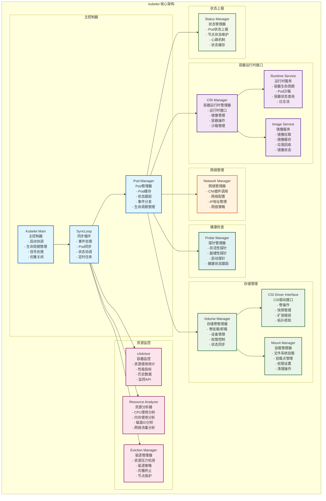
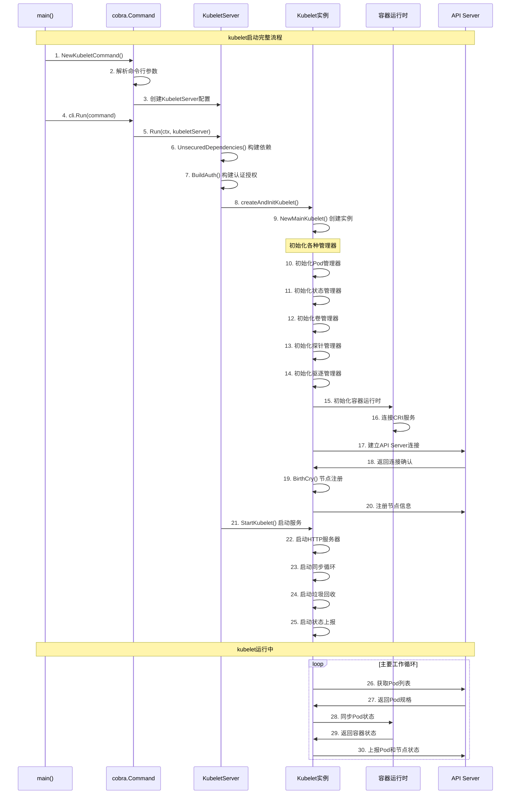

## 概述

kubelet是运行在每个Kubernetes节点上的核心组件，负责管理节点上的Pod和容器生命周期。它通过与API服务器通信获取Pod规格，与容器运行时交互管理容器，并持续监控和上报节点及Pod状态。kubelet的源码实现，揭示其精妙的设计和高效的管理机制。

<!--more-->

## 1. kubelet架构设计

### 1.1 整体架构概览



### 1.2 核心数据结构

#### 1.2.1 Kubelet主结构体

```go
// Kubelet 是运行在每个节点上的主要kubelet实现
// 文件路径: pkg/kubelet/kubelet.go
type Kubelet struct {
    // 基础配置
    hostname                      string
    nodeName                      types.NodeName
    runtimeState                  *runtimeState
    kubeClient                    clientset.Interface
    heartbeatClient              clientset.Interface
    
    // 运行时管理
    containerRuntime              kubecontainer.Runtime
    streamingRuntime             kubecontainer.StreamingRuntime
    runner                       kubecontainer.CommandRunner
    
    // HTTP服务器
    httpServer                   *httpserver.Server
    
    // 管理器组件
    podManager                   kubepod.Manager
    statusManager               status.Manager
    probeManager                prober.Manager
    volumeManager               volumemanager.VolumeManager
    evictionManager             eviction.Manager
    
    // 监控组件
    cadvisor                    cadvisor.Interface
    
    // 配置和策略
    kubeletConfiguration        *kubeletconfiginternal.KubeletConfiguration
    nodeStatusReportFrequency   time.Duration
    nodeStatusUpdateFrequency   time.Duration
    
    // 同步和控制
    syncLoopMonitor             atomic.Value
    podWorkers                  PodWorkers
    workQueue                   queue.WorkQueue
    
    // 网络和存储
    networkPlugin               network.NetworkPlugin
    volumePluginMgr            *volume.VolumePluginMgr
    
    // 资源管理
    containerGCPolicy          kubecontainer.GCPolicy
    imageGCPolicy              images.ImageGCPolicy
    diskSpacePolicy            DiskSpacePolicy
    
    // 安全和认证
    tlsOptions                 *server.TLSOptions
    auth                       server.AuthInterface
    
    // 状态和缓存
    lastObservedNodeAddressesMux sync.RWMutex
    lastObservedNodeAddresses   []v1.NodeAddress
    
    // 驱逐相关
    evictionAdmitHandler        lifecycle.PodAdmitHandler
    
    // 生命周期管理
    shutdownManager             shutdown.Manager
    
    // 插件管理
    pluginManager              pluginmanager.PluginManager
    
    // 设备管理
    deviceManager              devicemanager.Manager
    
    // CPU管理
    cpuManager                 cpumanager.Manager
    
    // 内存管理
    memoryManager              memorymanager.Manager
    
    // 拓扑管理
    topologyManager            topologymanager.Manager
}
```

#### 1.2.2 Pod工作器结构体

```go
// podWorkers 管理所有Pod的工作协程
// 文件路径: pkg/kubelet/pod_workers.go
type podWorkers struct {
    // 每个Pod的工作器
    podUpdates map[types.UID]chan podWork
    
    // 工作器状态
    isWorking map[types.UID]bool
    
    // 最后已知的Pod状态
    lastUndeliveredWorkUpdate map[types.UID]podWork
    
    // 同步锁
    podLock sync.Mutex
    
    // kubelet实例引用
    kubelet *Kubelet
    
    // 工作队列
    workQueue queue.WorkQueue
    
    // 工作器状态跟踪
    podSyncStatuses map[types.UID]podSyncStatus
}

// podWork 表示需要对Pod执行的工作
type podWork struct {
    // Pod对象
    pod *v1.Pod
    
    // 镜像Pod（用于静态Pod）
    mirrorPod *v1.Pod
    
    // 更新类型
    updateType kubetypes.SyncPodType
    
    // 工作完成回调
    onCompleteFunc func()
    
    // 工作开始时间
    workType podWorkType
}

// podSyncStatus Pod同步状态
type podSyncStatus struct {
    // 同步状态
    syncedAt time.Time
    
    // 是否正在同步
    working bool
    
    // 是否需要终止
    terminatingAt time.Time
    
    // 是否已删除
    deleted bool
    
    // 最后同步结果
    lastSyncResult error
}
```

## 2. 启动流程深度解析

### 2.1 main函数入口

```go
// main kubelet主函数入口
// 文件路径: cmd/kubelet/kubelet.go
func main() {
    // 创建kubelet命令对象
    // 包含所有启动参数和配置选项
    command := app.NewKubeletCommand(context.Background())
    
    // 使用component-base的CLI运行器执行命令
    // 提供统一的命令行处理、信号处理和优雅关闭机制
    code := cli.Run(command)
    
    // 以返回的退出码结束程序
    os.Exit(code)
}
```

### 2.2 命令创建和配置

```go
// NewKubeletCommand 创建kubelet命令
// 文件路径: cmd/kubelet/app/server.go
func NewKubeletCommand(ctx context.Context) *cobra.Command {
    // 清理函数列表，用于程序退出时的清理工作
    cleanFlagSet := pflag.NewFlagSet("clean", pflag.ContinueOnError)
    cleanFlagSet.SetNormalizeFunc(cliflag.WordSepNormalizeFunc)
    
    // kubelet配置选项
    kubeletFlags := options.NewKubeletFlags()
    kubeletConfig, err := options.NewKubeletConfiguration()
    if err != nil {
        klog.ErrorS(err, "Failed to create a new kubelet configuration")
        os.Exit(1)
    }

    cmd := &cobra.Command{
        Use: componentKubelet,
        Long: `The kubelet is the primary "node agent" that runs on each
node. It can register the node with the apiserver using one of: the hostname; a flag to
override the hostname; or specific logic for a cloud provider.

The kubelet works in terms of a PodSpec. A PodSpec is a YAML or JSON object
that describes a pod. The kubelet takes a set of PodSpecs that are provided through
various mechanisms (primarily through the apiserver) and ensures that the containers
described in those PodSpecs are running and healthy. The kubelet doesn't manage
containers which were not created by Kubernetes.

Other than from an PodSpec from the apiserver, there are two ways that a container
manifest can be provided to the Kubelet.

File: Path passed as a flag on the command line. Files under this path will be monitored
periodically for updates. The monitoring period is 20s by default and is configurable
via a flag.

HTTP endpoint: HTTP endpoint passed as a parameter on the command line. This endpoint
is checked every 20 seconds (also configurable with a flag).`,
        
        // 禁用在命令错误时打印使用说明
        SilenceUsage: true,
        
        // 主运行函数
        RunE: func(cmd *cobra.Command, args []string) error {
            // 验证初始标志
            if err := cleanFlagSet.Parse(args); err != nil {
                return fmt.Errorf("failed to parse clean flag: %w", err)
            }
            
            // 短路清理标志
            if cleanFlagSet.NArg() > 0 {
                return fmt.Errorf("%q does not take any arguments, got %q", cmd.CommandPath(), cleanFlagSet.Args())
            }

            // 设置特性门控
            if err := utilfeature.DefaultMutableFeatureGate.SetFromMap(kubeletConfig.FeatureGates); err != nil {
                return fmt.Errorf("failed to set feature gates from initial flags-based config: %w", err)
            }

            // 验证初始kubelet配置
            if err := kubeletconfigvalidation.ValidateKubeletConfiguration(kubeletConfig, utilfeature.DefaultFeatureGate); err != nil {
                return fmt.Errorf("failed to validate kubelet configuration, error: %w, path: %s", err, kubeletConfig)
            }

            // 加载kubelet配置文件
            if configFile := kubeletFlags.KubeletConfigFile; len(configFile) > 0 {
                kubeletConfig, err = loadConfigFile(configFile)
                if err != nil {
                    return fmt.Errorf("failed to load kubelet config file, error: %w, path: %s", err, configFile)
                }
                
                // 重新设置特性门控
                if err := utilfeature.DefaultMutableFeatureGate.SetFromMap(kubeletConfig.FeatureGates); err != nil {
                    return fmt.Errorf("failed to set feature gates from config file: %w", err)
                }
            }

            // 构造kubelet服务器配置
            kubeletServer := &options.KubeletServer{
                KubeletFlags:         *kubeletFlags,
                KubeletConfiguration: *kubeletConfig,
            }

            // 使用动态kubelet配置，如果启用的话
            if dynamicConfigDir := kubeletFlags.DynamicConfigDir.Value(); len(dynamicConfigDir) > 0 {
                kubeletServer, err = getDynamicKubeletConfig(kubeletServer.KubeletConfiguration, dynamicConfigDir, kubeletServer.KubeletFlags)
                if err != nil {
                    return fmt.Errorf("failed to get dynamic kubelet config: %w", err)
                }
            }

            // 运行kubelet
            return Run(ctx, kubeletServer)
        },
    }

    // 添加kubelet标志
    kubeletFlags.AddFlags(cleanFlagSet)
    options.AddKubeletConfigFlags(cleanFlagSet, kubeletConfig)
    options.AddGlobalFlags(cleanFlagSet)
    cleanFlagSet.BoolP("help", "h", false, fmt.Sprintf("help for %s", cmd.Name()))

    // 将清理标志集合添加到命令中
    cmd.Flags().AddFlagSet(cleanFlagSet)
    return cmd
}
```

### 2.3 kubelet运行主流程

```go
// Run 运行kubelet的主函数
// 文件路径: cmd/kubelet/app/server.go
func Run(ctx context.Context, s *options.KubeletServer) error {
    // 构造kubelet依赖项
    kubeletDeps, err := UnsecuredDependencies(s, utilfeature.DefaultFeatureGate)
    if err != nil {
        return err
    }

    // 添加认证/授权
    if s.KubeletConfiguration.Authentication.Anonymous.Enabled || 
       (len(s.KubeletConfiguration.Authentication.X509.ClientCAFile) > 0) ||
       s.KubeletConfiguration.Authentication.Webhook.Enabled {
        kubeletDeps.Auth, err = BuildAuth(s.KubeletConfiguration.Authentication, s.KubeletConfiguration.Authorization, s.KubeletFlags.ExperimentalMounts)
        if err != nil {
            return err
        }
    }

    // 运行kubelet
    return RunKubelet(s, kubeletDeps, s.RunOnce)
}

// RunKubelet 运行kubelet实例
func RunKubelet(kubeServer *options.KubeletServer, kubeletDeps *kubelet.Dependencies, runOnce bool) error {
    // 获取主机名
    hostname, err := nodeutil.GetHostname(kubeServer.HostnameOverride)
    if err != nil {
        return err
    }
    
    // 设置节点名称
    nodeName, err := getNodeName(kubeletDeps.Cloud, hostname)
    if err != nil {
        return err
    }
    
    // 检查权限
    if err := checkPermissions(); err != nil {
        klog.ErrorS(err, "kubelet running with insufficient permissions")
    }

    // 设置资源限制
    if kubeServer.KubeletConfiguration.KernelMemcgNotification {
        if err := watchForLowMemory(); err != nil {
            klog.ErrorS(err, "Failed to start watching for low memory")
        }
    }

    // 创建并运行kubelet
    k, err := createAndInitKubelet(kubeServer, kubeletDeps, hostname, nodeName)
    if err != nil {
        return fmt.Errorf("failed to create kubelet: %w", err)
    }

    // 启动kubelet
    if runOnce {
        if _, err := k.RunOnce(); err != nil {
            return fmt.Errorf("runonce failed: %w", err)
        }
        klog.InfoS("Started kubelet as runonce")
    } else {
        startKubelet(k, kubeServer, kubeletDeps, kubeServer.EnableServer)
        klog.InfoS("Started kubelet")
    }
    return nil
}

// createAndInitKubelet 创建并初始化kubelet
func createAndInitKubelet(kubeServer *options.KubeletServer, kubeletDeps *kubelet.Dependencies, 
    hostname string, nodeName types.NodeName) (k kubelet.Bootstrap, err error) {
    
    // 创建kubelet实例
    k, err = kubelet.NewMainKubelet(
        &kubeServer.KubeletConfiguration,
        kubeletDeps,
        &kubeServer.ContainerRuntimeOptions,
        hostname,
        nodeName,
        kubeServer.NodeIP,
        kubeServer.ProviderID,
        kubeServer.CloudProvider,
        kubeServer.CertDirectory,
        kubeServer.RootDirectory,
        kubeServer.ImageCredentialProviderConfigFile,
        kubeServer.ImageCredentialProviderBinDir,
        kubeServer.RegisterNode,
        kubeServer.RegisterWithTaints,
        kubeServer.AllowedUnsafeSysctls,
        kubeServer.ExperimentalMounterPath,
        kubeServer.KernelMemcgNotification,
        kubeServer.ExperimentalCheckNodeCapabilitiesBeforeMount,
        kubeServer.ExperimentalNodeAllocatableIgnoreEvictionThreshold,
        kubeServer.MinimumGCAge,
        kubeServer.MaxPerPodContainerCount,
        kubeServer.MaxContainerCount,
        kubeServer.MasterServiceNamespace,
        kubeServer.RegisterSchedulable,
        kubeServer.KeepTerminatedPodVolumes,
        kubeServer.NodeLabels,
        kubeServer.SeccompDefault || kubeServer.KubeletConfiguration.SeccompDefault,
        kubeServer.NodeStatusMaxImages,
        kubeServer.KubeletConfiguration.LocalStorageCapacityIsolation,
    )
    if err != nil {
        return nil, err
    }

    // 初始化kubelet
    k.BirthCry()

    // 启动垃圾回收
    go k.StartGarbageCollection()

    return k, nil
}
```

### 2.4 启动时序图



## 3. 同步循环核心机制

### 3.1 syncLoop主循环

```go
// syncLoop 是kubelet的主要同步循环
// 文件路径: pkg/kubelet/kubelet.go
func (kl *Kubelet) syncLoop(ctx context.Context, updates <-chan kubetypes.PodUpdate, handler SyncHandler) {
    klog.InfoS("Starting kubelet main sync loop")
    
    // 同步循环监控器，用于检测循环是否正常运行
    syncTicker := time.NewTicker(time.Second)
    defer syncTicker.Stop()
    
    // 清理Pod定时器
    housekeepingTicker := time.NewTicker(housekeepingPeriod)
    defer housekeepingTicker.Stop()
    
    // Pod生命周期事件生成器定时器
    plegCh := kl.pleg.Watch()
    const (
        base   = 100 * time.Millisecond
        max    = 5 * time.Second
        factor = 2
    )
    duration := base
    
    // 无限循环处理各种事件
    for {
        select {
        case u := <-updates:
            // 处理Pod更新事件
            // 来源包括：API服务器、文件、HTTP端点等
            klog.V(2).InfoS("SyncLoop (UPDATE)", "source", u.Source, "pods", klog.KObjSlice(u.Pods))
            handler.HandlePodUpdates(u.Pods)
            
        case e := <-plegCh:
            // 处理Pod生命周期事件
            // PLEG (Pod Lifecycle Event Generator) 生成的事件
            if e.Type == pleg.ContainerStarted {
                // 更新最新的容器启动时间，用于驱逐管理器
                kl.lastContainerStartedTime.Add(e.ID, time.Now())
            }
            if isSyncPodWorthy(e) {
                // 如果事件值得同步，则触发Pod同步
                if pod, ok := kl.podManager.GetPodByUID(e.ID); ok {
                    klog.V(2).InfoS("SyncLoop (PLEG)", "pod", klog.KObj(pod), "event", e)
                    handler.HandlePodSyncs([]*v1.Pod{pod})
                } else {
                    // 如果找不到Pod，记录警告
                    klog.V(4).InfoS("SyncLoop (PLEG): pod does not exist, ignore irrelevant event", "event", e)
                }
            }
            
            if e.Type == pleg.ContainerDied {
                // 容器死亡事件，检查是否需要重启
                if containerID, ok := e.Data.(string); ok {
                    kl.cleanUpContainersInPod(e.ID, containerID)
                }
            }
            
        case <-syncTicker.C:
            // 定期同步所有Pod
            // 这是一个保底机制，确保即使没有事件也会定期检查Pod状态
            klog.V(6).InfoS("SyncLoop (SYNC)")
            handler.HandlePodSyncs(kl.getPodsToSync())
            
        case update := <-kl.livenessManager.Updates():
            // 处理存活性探针结果
            if update.Result == proberesults.Failure {
                handleProbeSync(kl, update, handler, "liveness", "unhealthy")
            }
            
        case update := <-kl.readinessManager.Updates():
            // 处理就绪性探针结果  
            ready := update.Result == proberesults.Success
            kl.statusManager.SetContainerReadiness(update.PodUID, update.ContainerID, ready)
            status := "ready"
            if !ready {
                status = "unready"
            }
            klog.V(1).InfoS("SyncLoop (probe)", "probe", "readiness", "status", status, "pod", klog.KRef(update.PodNamespace, update.PodName))
            
        case update := <-kl.startupManager.Updates():
            // 处理启动探针结果
            started := update.Result == proberesults.Success
            kl.statusManager.SetContainerStartup(update.PodUID, update.ContainerID, started)
            status := "started"
            if !started {
                status = "unhealthy"
            }
            klog.V(1).InfoS("SyncLoop (probe)", "probe", "startup", "status", status, "pod", klog.KRef(update.PodNamespace, update.PodName))
            
        case <-housekeepingTicker.C:
            // 定期清理工作
            // 包括：清理已终止的Pod、垃圾回收等
            klog.V(2).InfoS("SyncLoop (housekeeping)")
            if !kl.sourcesReady.AllReady() {
                // 如果Pod源还没有准备好，跳过清理工作
                klog.V(4).InfoS("SyncLoop (housekeeping, skipped): sources aren't ready yet")
            } else {
                start := time.Now()
                if err := handler.HandlePodCleanups(ctx); err != nil {
                    klog.ErrorS(err, "Failed cleaning pods")
                }
                duration := time.Since(start)
                if duration > housekeepingWarningDuration {
                    klog.ErrorS(nil, "Housekeeping took too long", "duration", duration, "threshold", housekeepingWarningDuration)
                }
            }
            
        case <-ctx.Done():
            // 上下文取消，退出循环
            klog.InfoS("SyncLoop (context cancelled)")
            return
        }
    }
}

// isSyncPodWorthy 判断PLEG事件是否值得同步Pod
func isSyncPodWorthy(e *pleg.PodLifecycleEvent) bool {
    // 只有以下事件类型才值得同步：
    // - 容器启动
    // - 容器死亡  
    // - 网络设置完成
    // - 网络拆除完成
    return e.Type == pleg.ContainerStarted ||
           e.Type == pleg.ContainerDied ||
           e.Type == pleg.NetworkSetupCompleted ||
           e.Type == pleg.NetworkTeardownCompleted
}

// getPodsToSync 获取需要同步的Pod列表
func (kl *Kubelet) getPodsToSync() []*v1.Pod {
    allPods := kl.podManager.GetPods()
    podUIDs := make(map[types.UID]empty, len(allPods))
    for _, pod := range allPods {
        podUIDs[pod.UID] = empty{}
    }
    
    // 添加正在工作的Pod
    kl.podWorkers.ForEachWorker(func(podUID types.UID, syncStatus *podSyncStatus) {
        if syncStatus.working {
            podUIDs[podUID] = empty{}
        }
    })
    
    // 转换为Pod切片
    var pods []*v1.Pod
    for _, pod := range allPods {
        if _, exists := podUIDs[pod.UID]; exists {
            pods = append(pods, pod)
        }
    }
    return pods
}
```

### 3.2 Pod同步处理

```go
// HandlePodUpdates 处理Pod更新
// 文件路径: pkg/kubelet/kubelet.go
func (kl *Kubelet) HandlePodUpdates(pods []*v1.Pod) {
    start := kl.clock.Now()
    for _, pod := range pods {
        // 更新Pod管理器中的Pod信息
        existing, found := kl.podManager.GetPodByUID(pod.UID)
        kl.podManager.UpdatePod(pod)
        
        if (found && !podutil.IsMirrorPod(existing) && podutil.IsMirrorPod(pod)) ||
           (found && podutil.IsMirrorPod(existing) && !podutil.IsMirrorPod(pod)) {
            // 镜像Pod状态变更，需要特殊处理
            kl.handleMirrorPod(pod, start)
        }
    }
}

// HandlePodSyncs 处理Pod同步请求
func (kl *Kubelet) HandlePodSyncs(pods []*v1.Pod) {
    start := kl.clock.Now()
    for _, pod := range pods {
        // 为每个Pod分派同步工作
        kl.podWorkers.UpdatePod(UpdatePodOptions{
            Pod:        pod,
            MirrorPod:  kl.podManager.GetMirrorPodByPod(pod),
            UpdateType: kubetypes.SyncPodSync,
            StartTime:  start,
        })
    }
}

// syncPod 是同步单个Pod的核心函数
func (kl *Kubelet) syncPod(ctx context.Context, updateType kubetypes.SyncPodType, pod *v1.Pod, mirrorPod *v1.Pod, podStatus *kubecontainer.PodStatus) (isTerminal bool, err error) {
    // 记录同步开始时间，用于性能监控
    start := time.Now()
    defer func() {
        metrics.PodSyncDuration.Observe(metrics.SinceInSeconds(start))
        metrics.DeprecatedPodSyncDuration.Observe(metrics.SinceInMicroseconds(start))
    }()
    
    // 生成Pod状态
    apiPodStatus := kl.generateAPIPodStatus(pod, podStatus)
    
    // 检查Pod是否可以在此节点上运行
    runnable := kl.canRunPod(pod)
    if !runnable.Admit {
        // 如果不能运行，拒绝Pod并返回
        kl.rejectPod(pod, runnable.Reason, runnable.Message)
        return true, fmt.Errorf("pod rejected: %s", runnable.Message)
    }
    
    // 更新Pod状态到API服务器
    kl.statusManager.SetPodStatus(pod, apiPodStatus)
    
    // 检查Pod是否应该被终止
    if !kl.podIsTerminated(pod) {
        // Pod还在运行，检查是否需要杀死
        if apiPodStatus.Phase == v1.PodFailed || apiPodStatus.Phase == v1.PodSucceeded || (pod.DeletionTimestamp != nil && notRunning(apiPodStatus.ContainerStatuses)) {
            klog.V(3).InfoS("Pod is terminated, but some containers are still running", "pod", klog.KObj(pod))
            return false, kl.killPod(pod, nil, podStatus, killPodReasonTerminated)
        }
    }
    
    // 如果Pod没有被删除且不是终止状态，继续同步
    if pod.DeletionTimestamp == nil {
        // 确保数据目录存在
        if err := kl.makePodDataDirs(pod); err != nil {
            klog.ErrorS(err, "Unable to make pod data directories for pod", "pod", klog.KObj(pod))
            return false, err
        }
        
        // 等待卷附加和挂载
        if !kl.podWorkers.IsPodTerminationRequested(pod.UID) {
            // 等待卷挂载完成
            if err := kl.volumeManager.WaitForAttachAndMount(pod); err != nil {
                kl.recorder.Eventf(pod, v1.EventTypeWarning, events.FailedMountVolume, "Unable to attach or mount volumes: %v", err)
                klog.ErrorS(err, "Unable to attach or mount volumes for pod; skipping pod", "pod", klog.KObj(pod))
                return false, err
            }
        }
        
        // 获取镜像拉取密钥
        pullSecrets := kl.getPullSecretsForPod(pod)
        
        // 调用容器运行时同步Pod
        result := kl.containerRuntime.SyncPod(ctx, pod, podStatus, pullSecrets, kl.backOff)
        kl.reasonCache.Update(pod.UID, result)
        if result.Error() != nil {
            // 如果同步失败，记录错误但不返回，因为状态管理器会处理
            klog.ErrorS(result.Error(), "Error syncing pod, skipping", "pod", klog.KObj(pod))
            return false, result.Error()
        }
    }
    
    return false, nil
}
```

## 4. 容器运行时接口(CRI)集成

### 4.1 CRI接口定义

```go
// Runtime 容器运行时接口定义
// 文件路径: pkg/kubelet/container/runtime.go
type Runtime interface {
    // Type 返回容器运行时类型
    Type() string
    
    // Version 返回容器运行时版本信息
    Version(ctx context.Context) (Version, error)
    
    // APIVersion 返回容器运行时API版本
    APIVersion() (Version, error)
    
    // Status 返回容器运行时状态
    Status(ctx context.Context) (*RuntimeStatus, error)
    
    // GetPods 返回所有Pod列表
    GetPods(ctx context.Context, all bool) ([]*Pod, error)
    
    // SyncPod 同步Pod状态，这是最重要的方法
    SyncPod(ctx context.Context, pod *v1.Pod, podStatus *PodStatus, pullSecrets []v1.Secret, backOff *flowcontrol.Backoff) PodSyncResult
    
    // KillPod 杀死Pod中的所有容器
    KillPod(ctx context.Context, pod *v1.Pod, runningPod Pod, gracePeriodOverride *int64) error
    
    // GetPodStatus 获取Pod状态
    GetPodStatus(ctx context.Context, uid types.UID, name, namespace string) (*PodStatus, error)
    
    // PullImage 拉取容器镜像
    PullImage(ctx context.Context, image ImageSpec, pullSecrets []v1.Secret, podSandboxConfig *runtimeapi.PodSandboxConfig) (string, error)
    
    // GetImageRef 获取镜像引用
    GetImageRef(ctx context.Context, image ImageSpec) (string, error)
    
    // ListImages 列出所有镜像
    ListImages(ctx context.Context) ([]Image, error)
    
    // RemoveImage 删除镜像
    RemoveImage(ctx context.Context, image ImageSpec) error
    
    // ImageStats 获取镜像统计信息
    ImageStats(ctx context.Context) (*ImageStats, error)
    
    // DeleteContainer 删除容器
    DeleteContainer(ctx context.Context, containerID ContainerID) error
}
```

### 4.2 CRI运行时管理器实现

```go
// kubeGenericRuntimeManager CRI运行时管理器
// 文件路径: pkg/kubelet/kuberuntime/kuberuntime_manager.go
type kubeGenericRuntimeManager struct {
    // CRI服务客户端
    runtimeService internalapi.RuntimeService
    imageService   internalapi.ImageService
    
    // 记录器
    recorder record.EventRecorder
    
    // 操作系统接口
    osInterface kubecontainer.OSInterface
    
    // 运行时助手
    runtimeHelper kubecontainer.RuntimeHelper
    
    // HTTP客户端（用于流式操作）
    httpClient types.HTTPClient
    
    // 流式运行时服务
    streamingRuntime kubecontainer.StreamingRuntime
    
    // 镜像拉取QPS限制
    imageBackOff *flowcontrol.Backoff
    
    // 序列化镜像拉取
    serializedImagePulls bool
    
    // 镜像拉取信号量
    imagePullSemaphore semaphore.Weighted
    
    // CPU CFS配额
    cpuCFSQuota bool
    
    // CPU CFS配额周期
    cpuCFSQuotaPeriod metav1.Duration
    
    // seccomp配置文件根目录
    seccompProfileRoot string
    
    // 内部生命周期事件
    internalLifecycle cm.InternalContainerLifecycle
    
    // 日志管理器
    logManager logs.ContainerLogManager
    
    // 运行时类管理器
    runtimeClassManager *runtimeclass.Manager
    
    // 内存交换行为
    memorySwapBehavior string
    
    // 获取容器和镜像文件系统信息
    getNodeAllocatableAbsolute func() v1.ResourceList
    
    // 内存QoS
    memoryQoSEnforced bool
}

// SyncPod 同步Pod，这是CRI运行时管理器的核心方法
func (m *kubeGenericRuntimeManager) SyncPod(ctx context.Context, pod *v1.Pod, podStatus *kubecontainer.PodStatus, pullSecrets []v1.Secret, backOff *flowcontrol.Backoff) (result kubecontainer.PodSyncResult) {
    // 创建结果对象
    result = kubecontainer.NewSyncResult(kubecontainer.SyncPod, pod.Name)
    result.StartTime = time.Now()
    defer func() {
        result.EndTime = time.Now()
    }()
    
    // 第1步：计算沙箱和容器变更
    podContainerChanges := m.computePodActions(ctx, pod, podStatus)
    klog.V(3).InfoS("computePodActions got for pod", "podActions", podContainerChanges, "pod", klog.KObj(pod))
    
    if podContainerChanges.CreateSandbox {
        ref, err := ref.GetReference(legacyscheme.Scheme, pod)
        if err != nil {
            klog.ErrorS(err, "Couldn't make a ref to pod", "pod", klog.KObj(pod))
        }
        
        if podContainerChanges.SandboxID != "" {
            // 需要杀死现有的沙箱
            m.recorder.Eventf(ref, v1.EventTypeNormal, events.SandboxChanged, "Pod sandbox changed, it will be killed and re-created.")
        } else {
            // 创建新的沙箱
            klog.V(4).InfoS("Creating PodSandbox for pod", "pod", klog.KObj(pod))
            m.recorder.Eventf(ref, v1.EventTypeNormal, events.SandboxReceived, "Pod sandbox received")
        }
    }
    
    // 第2步：如果需要，杀死Pod沙箱
    if podContainerChanges.KillPod {
        if podContainerChanges.CreateSandbox {
            klog.V(4).InfoS("Stopping PodSandbox for pod, will start new one", "pod", klog.KObj(pod))
        } else {
            klog.V(4).InfoS("Stopping PodSandbox for pod", "pod", klog.KObj(pod))
        }
        
        // 杀死Pod中的所有容器
        if err := m.killPodWithSyncResult(ctx, pod, kubecontainer.ConvertPodStatusToRunningPod(m.runtimeName, podStatus), &result); err != nil {
            klog.ErrorS(err, "killPodWithSyncResult failed", "pod", klog.KObj(pod))
            return result
        }
    } else {
        // 第3步：杀死不需要的容器
        for containerID, containerInfo := range podContainerChanges.ContainersToKill {
            klog.V(3).InfoS("Killing unwanted container for pod", "containerName", containerInfo.name, "containerID", containerID, "pod", klog.KObj(pod))
            if err := m.killContainer(ctx, pod, containerID, containerInfo.name, containerInfo.message, containerInfo.reason, nil); err != nil {
                klog.ErrorS(err, "killContainer for pod failed", "containerName", containerInfo.name, "containerID", containerID, "pod", klog.KObj(pod))
                result.Fail(kubecontainer.ErrKillContainer, err.Error())
                return result
            }
        }
    }
    
    // 记录Pod沙箱状态变更的事件
    m.recordPodSandboxChange(pod, podContainerChanges)
    
    // 第4步：如果需要，创建沙箱
    podSandboxID := podContainerChanges.SandboxID
    if podContainerChanges.CreateSandbox {
        var msg string
        var err error
        
        klog.V(4).InfoS("Creating PodSandbox for pod", "pod", klog.KObj(pod))
        metrics.StartedPodsTotal.Inc()
        createSandboxResult := kubecontainer.NewSyncResult(kubecontainer.CreatePodSandbox, format.Pod(pod))
        result.AddSyncResult(createSandboxResult)
        
        // 创建Pod沙箱配置
        podSandboxConfig, err := m.generatePodSandboxConfig(pod, podContainerChanges.Attempt)
        if err != nil {
            message := fmt.Sprintf("Failed to generate sandbox config for pod %q: %v", format.Pod(pod), err)
            klog.ErrorS(err, "Failed to generate sandbox config for pod", "pod", klog.KObj(pod))
            createSandboxResult.Fail(kubecontainer.ErrConfigPodSandbox, message)
            m.recorder.Eventf(pod, v1.EventTypeWarning, events.FailedCreatePodSandBox, "Failed to create pod sandbox: %v", err)
            return result
        }
        
        // 创建Pod沙箱
        podSandboxID, err = m.runtimeService.RunPodSandbox(ctx, podSandboxConfig, runtimeHandler)
        if err != nil {
            message := fmt.Sprintf("Failed to create sandbox for pod %q: %v", format.Pod(pod), err)
            klog.ErrorS(err, "Failed to create sandbox for pod", "pod", klog.KObj(pod))
            createSandboxResult.Fail(kubecontainer.ErrCreatePodSandbox, message)
            m.recorder.Eventf(pod, v1.EventTypeWarning, events.FailedCreatePodSandBox, "Failed to create pod sandbox: %v", err)
            return result
        }
        klog.V(4).InfoS("Created PodSandbox for pod", "podSandboxID", podSandboxID, "pod", klog.KObj(pod))
        
        podSandboxStatus, err := m.runtimeService.PodSandboxStatus(ctx, podSandboxID, false)
        if err != nil {
            ref, referr := ref.GetReference(legacyscheme.Scheme, pod)
            if referr != nil {
                klog.ErrorS(referr, "Couldn't make a ref to pod", "pod", klog.KObj(pod))
            }
            klog.ErrorS(err, "Failed to get pod sandbox status; Skipping pod", "pod", klog.KObj(pod))
            result.Fail(kubecontainer.ErrPodSandboxStatus, err.Error())
            m.recorder.Eventf(ref, v1.EventTypeWarning, events.FailedStatusPodSandBox, "Unable to get pod sandbox status: %v", err)
            return result
        }
        
        // 设置Pod网络
        if !kubecontainer.IsHostNetworkPod(pod) {
            // 为Pod设置网络
            if err := m.runtimeHelper.SetUpPodNetwork(ctx, pod, podSandboxStatus.GetNetwork().GetNamespace(), podSandboxStatus.GetMetadata().GetUid(), podSandboxID); err != nil {
                message := fmt.Sprintf("Failed to setup network for pod %q using network plugins %q: %v", format.Pod(pod), m.runtimeHelper.GetPodNetworkPlugins(), err)
                
                klog.ErrorS(err, "Failed to setup network for pod using network plugins", "pod", klog.KObj(pod), "networkPlugins", m.runtimeHelper.GetPodNetworkPlugins())
                
                killResult := kubecontainer.NewSyncResult(kubecontainer.KillPodSandbox, format.Pod(pod))
                result.AddSyncResult(killResult)
                if killErr := m.runtimeService.StopPodSandbox(ctx, podSandboxID); killErr != nil {
                    killResult.Fail(kubecontainer.ErrKillPodSandbox, killErr.Error())
                    klog.ErrorS(killErr, "Failed to stop sandbox", "podSandboxID", podSandboxID)
                }
                
                createSandboxResult.Fail(kubecontainer.ErrSetupNetwork, message)
                m.recorder.Eventf(pod, v1.EventTypeWarning, events.FailedSetupNetwork, "Failed to setup network for pod using network plugins %q: %v", m.runtimeHelper.GetPodNetworkPlugins(), err)
                
                return result
            }
        }
    }
    
    // 获取Pod沙箱配置
    configPodSandboxResult := kubecontainer.NewSyncResult(kubecontainer.ConfigPodSandbox, podSandboxID)
    result.AddSyncResult(configPodSandboxResult)
    podSandboxConfig, err := m.generatePodSandboxConfig(pod, podContainerChanges.Attempt)
    if err != nil {
        message := fmt.Sprintf("Failed to generate sandbox config for pod %q: %v", format.Pod(pod), err)
        klog.ErrorS(err, "Failed to generate sandbox config for pod", "pod", klog.KObj(pod))
        configPodSandboxResult.Fail(kubecontainer.ErrConfigPodSandbox, message)
        return result
    }
    
    // 第5步：获取Pod IP
    podIPs := m.determinePodSandboxIPs(pod.Namespace, pod.Name, podSandboxStatus)
    
    // 第6步：启动init容器
    if container := podContainerChanges.NextInitContainerToStart; container != nil {
        // 启动下一个init容器
        if err := m.startContainer(ctx, podSandboxID, podSandboxConfig, container.container, pod, podStatus, pullSecrets, podIPs, kubecontainer.ContainerTypeInit); err != nil {
            klog.ErrorS(err, "Container start failed", "pod", klog.KObj(pod), "podSandboxID", podSandboxID, "containerName", container.container.Name)
            result.Fail(err)
            return result
        }
        
        // 成功启动init容器后，返回，等待下次同步
        klog.V(4).InfoS("Completed init container for pod", "containerName", container.container.Name, "pod", klog.KObj(pod))
        return result
    }
    
    // 第7步：启动常规容器
    for _, idx := range podContainerChanges.ContainersToStart {
        container := &pod.Spec.Containers[idx]
        if err := m.startContainer(ctx, podSandboxID, podSandboxConfig, container, pod, podStatus, pullSecrets, podIPs, kubecontainer.ContainerTypeRegular); err != nil {
            klog.ErrorS(err, "Container start failed", "pod", klog.KObj(pod), "podSandboxID", podSandboxID, "containerName", container.Name)
            result.Fail(err)
            continue
        }
    }
    
    return result
}
```

## 5. 存储卷管理

### 5.1 卷管理器架构

```go
// VolumeManager 卷管理器接口
// 文件路径: pkg/kubelet/volumemanager/volume_manager.go
type VolumeManager interface {
    // Run 启动卷管理器
    Run(sourcesReady config.SourcesReady, stopCh <-chan struct{})
    
    // WaitForAttachAndMount 等待卷附加和挂载完成
    WaitForAttachAndMount(pod *v1.Pod) error
    
    // WaitForUnmount 等待卷卸载完成
    WaitForUnmount(pod *v1.Pod) error
    
    // GetMountedVolumesForPod 获取Pod已挂载的卷
    GetMountedVolumesForPod(podName types.UniquePodName) container.VolumeMap
    
    // GetVolumesInUse 获取正在使用的卷
    GetVolumesInUse() []v1.UniqueVolumeName
    
    // ReconcilerStatesHasBeenSynced 检查协调器状态是否已同步
    ReconcilerStatesHasBeenSynced() bool
    
    // VolumeIsAttached 检查卷是否已附加
    VolumeIsAttached(volumeName v1.UniqueVolumeName) bool
    
    // MarkVolumesAsReportedInUse 标记卷为正在使用状态
    MarkVolumesAsReportedInUse(volumesReportedAsInUse []v1.UniqueVolumeName)
}

// volumeManager 卷管理器实现
type volumeManager struct {
    // kubeClient Kubernetes客户端
    kubeClient clientset.Interface
    
    // volumePluginMgr 卷插件管理器
    volumePluginMgr *volume.VolumePluginMgr
    
    // desiredStateOfWorld 期望状态
    desiredStateOfWorld cache.DesiredStateOfWorld
    
    // actualStateOfWorld 实际状态
    actualStateOfWorld cache.ActualStateOfWorld
    
    // operationExecutor 操作执行器
    operationExecutor operationexecutor.OperationExecutor
    
    // reconciler 协调器
    reconciler reconciler.Reconciler
    
    // desiredStateOfWorldPopulator 期望状态填充器
    desiredStateOfWorldPopulator populator.DesiredStateOfWorldPopulator
    
    // csiMigratedPluginManager CSI迁移插件管理器
    csiMigratedPluginManager csimigration.PluginManager
    
    // intreeToCSITranslator 内置插件到CSI转换器
    intreeToCSITranslator csimigration.InTreeToCSITranslator
    
    // csiDriverLister CSI驱动列表器
    csiDriverLister storagelistersv1.CSIDriverLister
    
    // csiDriversSynced CSI驱动同步状态
    csiDriversSynced cache.InformerSynced
}

// Run 运行卷管理器
func (vm *volumeManager) Run(sourcesReady config.SourcesReady, stopCh <-chan struct{}) {
    defer runtime.HandleCrash()
    
    if vm.kubeClient != nil {
        // 等待CSI驱动缓存同步
        klog.InfoS("VolumeManager waiting for CSI driver cache to sync")
        if !cache.WaitForCacheSync(stopCh, vm.csiDriversSynced) {
            klog.ErrorS(nil, "Cannot sync CSI driver cache")
            return
        }
        klog.V(2).InfoS("VolumeManager CSI driver cache synced")
    }
    
    klog.InfoS("Starting Kubelet Volume Manager")
    
    // 启动期望状态填充器
    go vm.desiredStateOfWorldPopulator.Run(sourcesReady, stopCh)
    klog.InfoS("Started Kubelet Volume Manager desired state populator")
    
    // 启动协调器
    go vm.reconciler.Run(stopCh)
    klog.InfoS("Started Kubelet Volume Manager reconciler")
    
    metrics.Register(vm.actualStateOfWorld, vm.desiredStateOfWorld, vm.volumePluginMgr)
    
    <-stopCh
    klog.InfoS("Shutting down Kubelet Volume Manager")
}

// WaitForAttachAndMount 等待卷附加和挂载
func (vm *volumeManager) WaitForAttachAndMount(pod *v1.Pod) error {
    if pod == nil {
        return nil
    }
    
    expectedVolumes := getExpectedVolumes(pod)
    if len(expectedVolumes) == 0 {
        // 没有卷需要等待
        return nil
    }
    
    klog.V(3).InfoS("Waiting for volumes to attach and mount for pod", "pod", klog.KObj(pod))
    uniquePodName := util.GetUniquePodName(pod)
    
    // 创建等待条件
    wait := &volumeWait{
        pod:             pod,
        expectedVolumes: expectedVolumes,
        actualStateOfWorld: vm.actualStateOfWorld,
    }
    
    return wait.WaitForAttachAndMount(uniquePodName)
}

// volumeWait 卷等待结构
type volumeWait struct {
    pod             *v1.Pod
    expectedVolumes []string
    actualStateOfWorld cache.ActualStateOfWorld
}

// WaitForAttachAndMount 等待附加和挂载
func (vw *volumeWait) WaitForAttachAndMount(uniquePodName types.UniquePodName) error {
    // 使用指数退避等待
    backoff := wait.Backoff{
        Duration: time.Second,
        Factor:   1.2,
        Steps:    6,
    }
    
    var lastError error
    err := wait.ExponentialBackoff(backoff, func() (bool, error) {
        // 检查所有期望的卷是否都已挂载
        for _, volumeName := range vw.expectedVolumes {
            mounted := vw.actualStateOfWorld.PodExistsInVolume(uniquePodName, v1.UniqueVolumeName(volumeName))
            if !mounted {
                lastError = fmt.Errorf("volume %q is not mounted", volumeName)
                return false, nil
            }
        }
        return true, nil
    })
    
    if err != nil {
        return fmt.Errorf("timeout waiting for volume mounts for pod %q: %v", uniquePodName, lastError)
    }
    
    klog.V(3).InfoS("All volumes are attached and mounted for pod", "pod", klog.KObj(vw.pod))
    return nil
}
```

## 6. 健康检查和探针管理

### 6.1 探针管理器实现

```go
// Manager 探针管理器接口
// 文件路径: pkg/kubelet/prober/prober_manager.go
type Manager interface {
    // AddPod 添加Pod的探针
    AddPod(pod *v1.Pod)
    
    // RemovePod 移除Pod的探针
    RemovePod(pod *v1.Pod)
    
    // CleanupPods 清理不再需要的Pod探针
    CleanupPods(desiredPods map[types.UID]sets.Empty)
    
    // UpdatePodStatus 更新Pod状态
    UpdatePodStatus(pod *v1.Pod, podStatus *v1.PodStatus)
    
    // Start 启动探针管理器
    Start()
}

// manager 探针管理器实现
type manager struct {
    // prober 探针执行器
    prober *prober
    
    // readinessManager 就绪性管理器
    readinessManager results.Manager
    
    // livenessManager 存活性管理器
    livenessManager results.Manager
    
    // startupManager 启动探针管理器
    startupManager results.Manager
    
    // workers 工作协程映射
    // key: probeKey (pod UID + container name + probe type)
    // value: worker goroutine
    workers map[probeKey]*worker
    
    // workerLock 工作协程锁
    workerLock sync.RWMutex
    
    // statusManager 状态管理器
    statusManager status.Manager
    
    // recorder 事件记录器
    recorder record.EventRecorder
}

// NewManager 创建探针管理器
func NewManager(
    statusManager status.Manager,
    livenessManager results.Manager,
    readinessManager results.Manager,
    startupManager results.Manager,
    runner kubecontainer.CommandRunner,
    recorder record.EventRecorder) Manager {
    
    prober := newProber(runner, recorder)
    return &manager{
        prober:           prober,
        statusManager:    statusManager,
        readinessManager: readinessManager,
        livenessManager:  livenessManager,
        startupManager:   startupManager,
        workers:          make(map[probeKey]*worker),
        recorder:         recorder,
    }
}

// AddPod 为Pod添加探针
func (m *manager) AddPod(pod *v1.Pod) {
    m.workerLock.Lock()
    defer m.workerLock.Unlock()
    
    key := probeKey{podUID: pod.UID}
    for _, c := range pod.Spec.Containers {
        key.containerName = c.Name
        
        // 添加存活性探针
        if c.LivenessProbe != nil {
            key.probeType = liveness
            if _, ok := m.workers[key]; !ok {
                w := newWorker(m, liveness, pod, c)
                m.workers[key] = w
                go w.run()
            }
        }
        
        // 添加就绪性探针
        if c.ReadinessProbe != nil {
            key.probeType = readiness
            if _, ok := m.workers[key]; !ok {
                w := newWorker(m, readiness, pod, c)
                m.workers[key] = w
                go w.run()
            }
        }
        
        // 添加启动探针
        if c.StartupProbe != nil {
            key.probeType = startup
            if _, ok := m.workers[key]; !ok {
                w := newWorker(m, startup, pod, c)
                m.workers[key] = w
                go w.run()
            }
        }
    }
}

// worker 探针工作器
type worker struct {
    // 停止通道
    stopCh chan struct{}
    
    // 管理器引用
    managerRef *manager
    
    // 探针类型
    probeType probeType
    
    // Pod引用
    pod *v1.Pod
    
    // 容器引用
    container v1.Container
    
    // 探针规格
    spec *v1.Probe
    
    // 结果管理器
    resultsManager results.Manager
    
    // 探针键
    probeKey probeKey
    
    // 容器ID
    containerID kubecontainer.ContainerID
    
    // 容器重启次数
    restartCount int32
    
    // 初始延迟是否已过
    initialDelayPassed bool
}

// run 运行探针工作器
func (w *worker) run() {
    ctx := context.Background()
    probeTickerPeriod := time.Duration(w.spec.PeriodSeconds) * time.Second
    
    // 如果设置了初始延迟，先等待
    if w.spec.InitialDelaySeconds > 0 {
        select {
        case <-time.After(time.Duration(w.spec.InitialDelaySeconds) * time.Second):
            w.initialDelayPassed = true
        case <-w.stopCh:
            return
        }
    } else {
        w.initialDelayPassed = true
    }
    
    // 创建定时器
    probeTicker := time.NewTicker(probeTickerPeriod)
    defer probeTicker.Stop()
    
probeLoop:
    for w.doProbe(ctx) {
        // 等待下次探测或停止信号
        select {
        case <-w.stopCh:
            break probeLoop
        case <-probeTicker.C:
            // 继续下次探测
        }
    }
}

// doProbe 执行探针检查
func (w *worker) doProbe(ctx context.Context) (keepGoing bool) {
    defer func() { recover() }() // 防止panic导致工作器退出
    
    // 获取Pod状态
    status, ok := w.managerRef.statusManager.GetPodStatus(w.pod.UID)
    if !ok {
        // Pod状态不存在，停止探测
        klog.V(3).InfoS("No status for pod", "pod", klog.KObj(w.pod))
        return true
    }
    
    // 查找容器状态
    var containerStatus *v1.ContainerStatus
    for _, c := range status.ContainerStatuses {
        if c.Name == w.container.Name {
            containerStatus = &c
            break
        }
    }
    
    if containerStatus == nil || containerStatus.State.Running == nil {
        // 容器未运行，跳过探测
        klog.V(3).InfoS("Probe target container not found or not running", "pod", klog.KObj(w.pod), "containerName", w.container.Name)
        return true
    }
    
    // 检查容器是否重启过
    if containerStatus.RestartCount != w.restartCount {
        w.restartCount = containerStatus.RestartCount
        w.initialDelayPassed = false
        if w.spec.InitialDelaySeconds > 0 {
            // 重新等待初始延迟
            return true
        }
    }
    
    if !w.initialDelayPassed {
        // 初始延迟尚未过期
        return true
    }
    
    // 执行探针
    result, err := w.managerRef.prober.probe(ctx, w.probeType, w.pod, status, w.container, containerStatus.ContainerID)
    if err != nil {
        // 探针执行出错，但继续探测
        klog.V(1).ErrorS(err, "Probe errored", "probeType", w.probeType, "pod", klog.KObj(w.pod), "containerName", w.container.Name)
        w.resultsManager.Set(kubecontainer.ParseContainerID(containerStatus.ContainerID), results.Failure, w.pod)
        return true
    }
    
    // 设置探针结果
    switch result {
    case results.Success:
        ProberResults.With(w.proberResultsSuccessfulMetricLabels).Inc()
    case results.Warning:
        ProberResults.With(w.proberResultsWarningMetricLabels).Inc()
    case results.Failure:
        ProberResults.With(w.proberResultsFailedMetricLabels).Inc()
    }
    
    w.resultsManager.Set(kubecontainer.ParseContainerID(containerStatus.ContainerID), result, w.pod)
    
    // 如果是存活性探针失败，记录事件
    if w.probeType == liveness && result == results.Failure {
        w.managerRef.recorder.Eventf(w.pod, v1.EventTypeWarning, events.ContainerUnhealthy, "Liveness probe failed: %s", err)
    }
    
    return true
}
```

## 7. 性能优化和最佳实践

### 7.1 资源管理优化

```go
// 优化cgroup配置
func optimizeCgroupConfig() *CgroupConfig {
    return &CgroupConfig{
        // CPU配置
        CPUCFSQuota:       true,                    // 启用CFS配额
        CPUCFSQuotaPeriod: 100 * time.Millisecond, // CFS周期
        CPUManagerPolicy:  "static",               // 静态CPU管理策略
        
        // 内存配置
        MemorySwapBehavior: "LimitedSwap",         // 限制交换
        MemoryQoSEnforced:  true,                  // 启用内存QoS
        
        // 系统预留资源
        SystemReserved: map[string]string{
            "cpu":    "200m",
            "memory": "512Mi",
        },
        
        // kubelet预留资源
        KubeReserved: map[string]string{
            "cpu":    "100m", 
            "memory": "256Mi",
        },
        
        // 驱逐阈值
        EvictionHard: map[string]string{
            "memory.available":  "100Mi",
            "nodefs.available":  "10%",
            "imagefs.available": "15%",
        },
    }
}
```

### 7.2 镜像管理优化

```go
// 优化镜像垃圾回收策略
type OptimizedImageGCPolicy struct {
    // 高水位阈值，超过此值开始垃圾回收
    HighThresholdPercent int
    
    // 低水位阈值，垃圾回收到此值停止
    LowThresholdPercent int
    
    // 垃圾回收周期
    GCPeriod time.Duration
    
    // 最小镜像年龄，低于此年龄的镜像不会被回收
    MinAge time.Duration
    
    // 最大并发垃圾回收数
    MaxConcurrency int
}

func NewOptimizedImageGCPolicy() *OptimizedImageGCPolicy {
    return &OptimizedImageGCPolicy{
        HighThresholdPercent: 85,  // 85%时开始回收
        LowThresholdPercent:  80,  // 回收到80%停止
        GCPeriod:            5 * time.Minute, // 5分钟检查一次
        MinAge:              24 * time.Hour,  // 24小时内的镜像不回收
        MaxConcurrency:      2,    // 最多2个并发回收
    }
}
```

### 7.3 Pod启动优化

```go
// 优化Pod启动性能
type PodStartupOptimizer struct {
    // 镜像预拉取
    imagePuller *ImagePuller
    
    // 并行容器启动
    parallelContainerStart bool
    
    // 快速容器启动
    fastContainerStart bool
}

// 并行启动容器
func (p *PodStartupOptimizer) StartContainersParallel(ctx context.Context, pod *v1.Pod, containers []v1.Container) error {
    var wg sync.WaitGroup
    errCh := make(chan error, len(containers))
    
    for _, container := range containers {
        wg.Add(1)
        go func(c v1.Container) {
            defer wg.Done()
            
            // 预拉取镜像
            if err := p.imagePuller.PullImage(ctx, c.Image); err != nil {
                errCh <- fmt.Errorf("failed to pull image %s: %v", c.Image, err)
                return
            }
            
            // 启动容器
            if err := p.startContainer(ctx, pod, c); err != nil {
                errCh <- fmt.Errorf("failed to start container %s: %v", c.Name, err)
                return
            }
        }(container)
    }
    
    // 等待所有容器启动完成
    wg.Wait()
    close(errCh)
    
    // 检查错误
    var errors []error
    for err := range errCh {
        errors = append(errors, err)
    }
    
    if len(errors) > 0 {
        return fmt.Errorf("container startup errors: %v", errors)
    }
    
    return nil
}
```

## 8. 总结与最佳实践

### 8.1 架构设计原则

kubelet的设计体现了以下核心原则：

1. **单一职责**：每个管理器负责特定的功能领域
2. **事件驱动**：通过事件和状态变化驱动操作
3. **声明式管理**：根据期望状态协调实际状态
4. **插件化架构**：支持多种容器运行时和网络插件
5. **容错设计**：具备重试和恢复机制

### 8.2 性能优化建议

1. **资源管理**
   - 合理配置CPU和内存管理策略
   - 设置适当的系统预留资源
   - 配置合理的驱逐阈值

2. **存储优化**
   - 使用高性能存储后端
   - 启用卷快照和克隆功能
   - 合理配置存储类和回收策略

3. **网络优化**
   - 选择高性能的CNI插件
   - 优化iptables规则
   - 启用网络策略提高安全性

4. **监控告警**
   - 监控关键性能指标
   - 设置合理的告警阈值
   - 建立完善的故障排查流程

### 8.3 运维最佳实践

1. **配置管理**
   - 使用配置文件管理kubelet参数
   - 定期备份和版本控制配置
   - 实施配置变更管理流程

2. **安全配置**
   - 启用TLS加密通信
   - 配置适当的RBAC权限
   - 定期更新和轮换证书

3. **故障处理**
   - 建立完善的日志收集系统
   - 实施健康检查和自动恢复
   - 制定应急响应预案

## 9. 最新CRI和容器管理特性

### 9.1 CRI v1.29+新特性

基于最新的技术文章，CRI接口在新版本中有重要改进：

```go
// RuntimeServiceV2 运行时服务v2接口
// 文件路径: staging/src/k8s.io/cri-api/pkg/apis/runtime/v1/api.proto
type RuntimeServiceV2 interface {
    RuntimeService
    
    // CheckpointContainer 容器检查点功能
    // 支持容器的热迁移和状态保存
    CheckpointContainer(ctx context.Context, req *CheckpointContainerRequest) (*CheckpointContainerResponse, error)
    
    // GetContainerEvents 获取容器事件流
    // 提供实时的容器状态变更事件
    GetContainerEvents(req *GetEventsRequest, server CRIService_GetContainerEventsServer) error
    
    // ListMetricDescriptors 列出指标描述符
    // 支持容器和Pod级别的自定义指标
    ListMetricDescriptors(ctx context.Context, req *ListMetricDescriptorsRequest) (*ListMetricDescriptorsResponse, error)
    
    // ListPodSandboxMetrics 列出Pod沙箱指标
    // 提供Pod级别的资源使用统计
    ListPodSandboxMetrics(ctx context.Context, req *ListPodSandboxMetricsRequest) (*ListPodSandboxMetricsResponse, error)
}

// 增强的Pod沙箱配置
type EnhancedPodSandboxConfig struct {
    *runtimeapi.PodSandboxConfig
    
    // runtimeHandler 运行时处理器
    // 支持多运行时（如kata-containers、gvisor）
    RuntimeHandler string
    
    // overhead Pod开销资源
    // 定义Pod基础设施的资源消耗
    Overhead *runtimeapi.LinuxContainerResources
    
    // securityContext 增强安全上下文
    // 支持更细粒度的安全控制
    SecurityContext *EnhancedPodSecurityContext
    
    // networkConfig 网络配置
    // 支持多网络接口和自定义网络配置
    NetworkConfig *NetworkConfig
}

// EnhancedPodSecurityContext 增强Pod安全上下文
type EnhancedPodSecurityContext struct {
    *runtimeapi.PodSecurityContext
    
    // seccompProfile Seccomp配置文件
    // 支持自定义系统调用过滤
    SeccompProfile *runtimeapi.SecurityProfile
    
    // apparmorProfile AppArmor配置文件
    // 支持强制访问控制
    ApparmorProfile *runtimeapi.SecurityProfile
    
    // selinuxOptions SELinux选项
    // 支持SELinux安全标签
    SelinuxOptions *runtimeapi.SELinuxOption
    
    // sysctls 系统控制参数
    // 支持容器级别的内核参数调整
    Sysctls map[string]string
}

// 容器生命周期钩子增强
type ContainerLifecycleHooks struct {
    // preStart 容器启动前钩子
    // 支持复杂的初始化逻辑
    PreStart *LifecycleHook
    
    // postStart 容器启动后钩子
    // 支持启动后的配置和注册
    PostStart *LifecycleHook
    
    // preStop 容器停止前钩子
    // 支持优雅关闭和清理逻辑
    PreStop *LifecycleHook
    
    // postStop 容器停止后钩子
    // 支持停止后的清理和通知
    PostStop *LifecycleHook
}

// LifecycleHook 生命周期钩子
type LifecycleHook struct {
    // exec 执行命令钩子
    Exec *ExecAction
    
    // httpGet HTTP请求钩子
    HTTPGet *HTTPGetAction
    
    // tcpSocket TCP连接钩子
    TCPSocket *TCPSocketAction
    
    // grpc gRPC调用钩子
    GRPC *GRPCAction
    
    // timeout 钩子执行超时时间
    Timeout time.Duration
    
    // retryPolicy 重试策略
    RetryPolicy *RetryPolicy
}

// 容器资源管理增强
type EnhancedResourceManager struct {
    // cpuManager CPU管理器
    cpuManager cpumanager.Manager
    
    // memoryManager 内存管理器
    memoryManager memorymanager.Manager
    
    // deviceManager 设备管理器
    deviceManager devicemanager.Manager
    
    // topologyManager 拓扑管理器
    topologyManager topologymanager.Manager
    
    // resourceQuotaManager 资源配额管理器
    resourceQuotaManager *ResourceQuotaManager
}

// CPUManagerV2 CPU管理器v2
type CPUManagerV2 struct {
    // policy CPU分配策略
    // 支持static、none、dynamic等策略
    policy cpumanager.Policy
    
    // reconcilePeriod 协调周期
    reconcilePeriod time.Duration
    
    // topology CPU拓扑信息
    topology *topology.CPUTopology
    
    // assignmentManager CPU分配管理器
    assignmentManager *CPUAssignmentManager
    
    // nodeAllocatableReservation 节点可分配资源预留
    nodeAllocatableReservation v1.ResourceList
}

// ManageCPUResources 管理CPU资源分配
func (cm *CPUManagerV2) ManageCPUResources(pod *v1.Pod, container *v1.Container) error {
    // 1. 检查容器QoS类别
    qosClass := v1qos.GetPodQOS(pod)
    
    // 2. 根据QoS类别和CPU策略分配CPU
    switch cm.policy.Name() {
    case "static":
        // 静态策略：为Guaranteed Pod分配独占CPU
        if qosClass == v1.PodQOSGuaranteed {
            return cm.allocateExclusiveCPUs(pod, container)
        }
        return cm.allocateSharedCPUs(pod, container)
        
    case "dynamic":
        // 动态策略：根据负载动态调整CPU分配
        return cm.allocateDynamicCPUs(pod, container)
        
    default:
        // 默认策略：共享CPU池
        return cm.allocateSharedCPUs(pod, container)
    }
}

// allocateExclusiveCPUs 分配独占CPU
func (cm *CPUManagerV2) allocateExclusiveCPUs(pod *v1.Pod, container *v1.Container) error {
    // 1. 计算CPU需求
    cpuQuantity := container.Resources.Requests[v1.ResourceCPU]
    cpuRequest := int(cpuQuantity.MilliValue() / 1000)
    
    if cpuRequest == 0 {
        return fmt.Errorf("container %s has no CPU request", container.Name)
    }
    
    // 2. 从拓扑中选择最佳CPU
    cpuSet, err := cm.assignmentManager.AllocateCPUs(cpuRequest, cm.topology)
    if err != nil {
        return fmt.Errorf("failed to allocate %d CPUs: %v", cpuRequest, err)
    }
    
    // 3. 应用CPU分配
    containerID := getContainerID(pod, container)
    if err := cm.applyCPUAssignment(containerID, cpuSet); err != nil {
        // 回滚CPU分配
        cm.assignmentManager.ReleaseCPUs(cpuSet)
        return fmt.Errorf("failed to apply CPU assignment: %v", err)
    }
    
    klog.V(2).InfoS("Allocated exclusive CPUs", "pod", klog.KObj(pod), "container", container.Name, "cpus", cpuSet.String())
    return nil
}

// MemoryManagerV2 内存管理器v2
type MemoryManagerV2 struct {
    // policy 内存分配策略
    policy memorymanager.Policy
    
    // topology 内存拓扑信息
    topology *topology.MemoryTopology
    
    // numaAssignmentManager NUMA分配管理器
    numaAssignmentManager *NUMAAssignmentManager
    
    // memoryThrottling 内存限流配置
    memoryThrottling *MemoryThrottlingConfig
}

// ManageMemoryResources 管理内存资源分配
func (mm *MemoryManagerV2) ManageMemoryResources(pod *v1.Pod, container *v1.Container) error {
    // 1. 检查内存QoS策略
    qosClass := v1qos.GetPodQOS(pod)
    
    // 2. 计算内存需求
    memoryRequest := container.Resources.Requests[v1.ResourceMemory]
    memoryLimit := container.Resources.Limits[v1.ResourceMemory]
    
    // 3. 根据策略分配NUMA节点
    switch mm.policy.Name() {
    case "Static":
        // 静态策略：为Guaranteed Pod分配独占NUMA节点
        if qosClass == v1.PodQOSGuaranteed && !memoryRequest.IsZero() && !memoryLimit.IsZero() {
            return mm.allocateNUMANodes(pod, container, memoryRequest.Value())
        }
        return nil
        
    case "Restricted":
        // 受限策略：限制跨NUMA访问
        return mm.restrictNUMAAccess(pod, container)
        
    default:
        // 默认策略：不做特殊处理
        return nil
    }
}

// allocateNUMANodes 分配NUMA节点
func (mm *MemoryManagerV2) allocateNUMANodes(pod *v1.Pod, container *v1.Container, memorySize int64) error {
    // 1. 选择最佳NUMA节点
    numaNodes, err := mm.numaAssignmentManager.AllocateNUMANodes(memorySize, mm.topology)
    if err != nil {
        return fmt.Errorf("failed to allocate NUMA nodes: %v", err)
    }
    
    // 2. 应用NUMA分配
    containerID := getContainerID(pod, container)
    if err := mm.applyNUMAAssignment(containerID, numaNodes); err != nil {
        // 回滚NUMA分配
        mm.numaAssignmentManager.ReleaseNUMANodes(numaNodes)
        return fmt.Errorf("failed to apply NUMA assignment: %v", err)
    }
    
    klog.V(2).InfoS("Allocated NUMA nodes", "pod", klog.KObj(pod), "container", container.Name, "nodes", numaNodes)
    return nil
}
```

### 9.2 Pod生命周期事件生成器(PLEG)优化

```go
// GenericPLEG 通用Pod生命周期事件生成器
// 文件路径: pkg/kubelet/pleg/generic.go
type GenericPLEG struct {
    // relistPeriod 重新列举周期
    relistPeriod time.Duration
    
    // clock 时钟接口
    clock clock.Clock
    
    // podRecords Pod记录映射
    // 存储上次观察到的Pod状态
    podRecords podRecords
    
    // eventChannel 事件通道
    eventChannel chan *PodLifecycleEvent
    
    // podCache Pod缓存
    podCache kubecontainer.Cache
    
    // runtime 容器运行时
    runtime kubecontainer.Runtime
    
    // runtimeUptime 运行时启动时间
    runtimeUptime time.Time
    
    // clock 时钟
    clock clock.Clock
    
    // 同步锁
    lock sync.Mutex
}

// Start 启动PLEG
func (g *GenericPLEG) Start() {
    go wait.Until(g.relist, g.relistPeriod, wait.NeverStop)
}

// relist 重新列举容器状态
func (g *GenericPLEG) relist() {
    klog.V(5).InfoS("GenericPLEG: Relisting")
    
    // 记录重新列举开始时间
    start := g.clock.Now()
    defer func() {
        metrics.PLEGRelistLatency.Observe(metrics.SinceInSeconds(start))
    }()
    
    // 1. 获取所有Pod的当前状态
    podList, err := g.runtime.GetPods(context.Background(), true)
    if err != nil {
        klog.ErrorS(err, "GenericPLEG: Unable to retrieve pods")
        return
    }
    
    // 2. 更新运行时启动时间
    g.updateRelatedTime(start)
    
    // 3. 比较当前状态与上次状态，生成事件
    pods := kubecontainer.Pods(podList)
    g.podRecords.setCurrent(pods)
    
    // 4. 为每个Pod生成生命周期事件
    for pid := range g.podRecords {
        oldPod := g.podRecords.getOld(pid)
        pod := g.podRecords.getCurrent(pid)
        
        // 生成Pod级别的事件
        events := computeEvents(oldPod, pod, g.cacheEnabled())
        
        // 发送事件到事件通道
        for _, e := range events {
            select {
            case g.eventChannel <- e:
            default:
                // 事件通道满，记录警告
                klog.ErrorS(nil, "Event channel is full, discarding this relist() cycle")
                return
            }
        }
    }
    
    // 5. 更新Pod记录
    g.podRecords.update()
}

// computeEvents 计算Pod生命周期事件
func computeEvents(oldPod, newPod *kubecontainer.Pod, cacheEnabled bool) []*PodLifecycleEvent {
    var events []*PodLifecycleEvent
    
    // 检查Pod级别的变化
    if newPod != nil {
        switch {
        case oldPod == nil:
            // 新Pod出现
            events = append(events, &PodLifecycleEvent{
                ID:   newPod.ID,
                Type: ContainerStarted,
                Data: newPod,
            })
            
        case oldPod.Name != newPod.Name:
            // Pod名称变化（不应该发生）
            klog.V(4).InfoS("Pod name changed", "old", oldPod.Name, "new", newPod.Name)
            
        default:
            // 检查容器级别的变化
            events = append(events, computeContainerEvents(oldPod, newPod)...)
        }
    } else if oldPod != nil {
        // Pod消失
        events = append(events, &PodLifecycleEvent{
            ID:   oldPod.ID,
            Type: ContainerDied,
            Data: oldPod,
        })
    }
    
    return events
}

// computeContainerEvents 计算容器级别的事件
func computeContainerEvents(oldPod, newPod *kubecontainer.Pod) []*PodLifecycleEvent {
    var events []*PodLifecycleEvent
    
    // 创建容器状态映射
    oldContainers := make(map[string]*kubecontainer.Container)
    for _, c := range oldPod.Containers {
        oldContainers[c.ID.ID] = c
    }
    
    newContainers := make(map[string]*kubecontainer.Container)
    for _, c := range newPod.Containers {
        newContainers[c.ID.ID] = c
    }
    
    // 检查新容器
    for _, newContainer := range newPod.Containers {
        containerID := newContainer.ID.ID
        if oldContainer, exists := oldContainers[containerID]; exists {
            // 容器已存在，检查状态变化
            if oldContainer.State != newContainer.State {
                events = append(events, &PodLifecycleEvent{
                    ID:   newPod.ID,
                    Type: getEventType(newContainer.State),
                    Data: containerID,
                })
            }
        } else {
            // 新容器
            events = append(events, &PodLifecycleEvent{
                ID:   newPod.ID,
                Type: ContainerStarted,
                Data: containerID,
            })
        }
    }
    
    // 检查消失的容器
    for _, oldContainer := range oldPod.Containers {
        containerID := oldContainer.ID.ID
        if _, exists := newContainers[containerID]; !exists {
            events = append(events, &PodLifecycleEvent{
                ID:   newPod.ID,
                Type: ContainerDied,
                Data: containerID,
            })
        }
    }
    
    return events
}

// getEventType 根据容器状态获取事件类型
func getEventType(state kubecontainer.State) PodLifecycleEventType {
    switch state {
    case kubecontainer.ContainerStateRunning:
        return ContainerStarted
    case kubecontainer.ContainerStateExited:
        return ContainerDied
    case kubecontainer.ContainerStateUnknown:
        return ContainerChanged
    default:
        return ContainerChanged
    }
}
```

