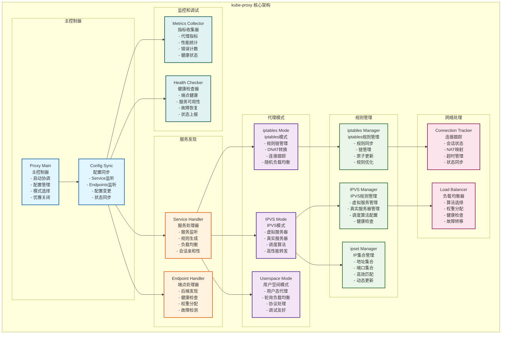
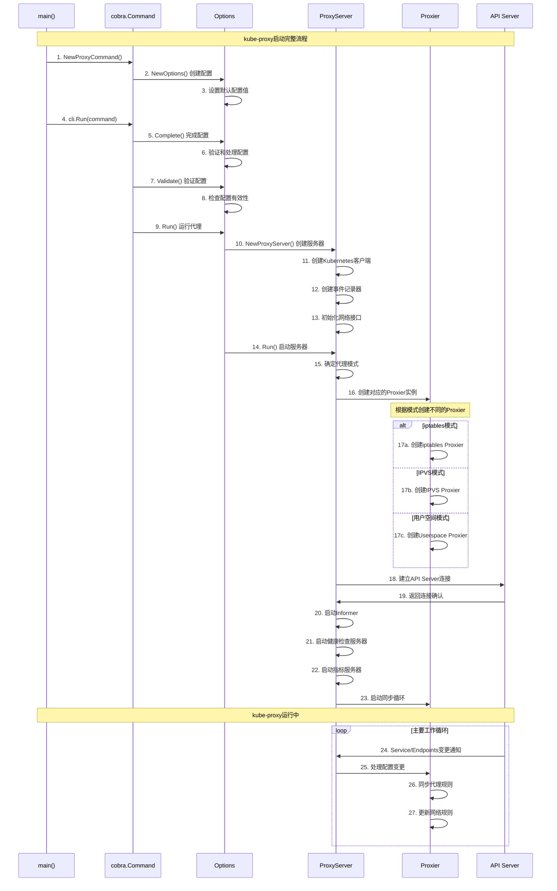

## 概述

kube-proxy是Kubernetes集群中每个节点上运行的网络代理，负责实现Service的网络规则，提供集群内部的服务发现和负载均衡功能。它监听API服务器上Service和Endpoints的变化，并相应地配置网络规则来实现流量转发。kube-proxy的源码实现，揭示其精妙的网络处理机制。

<!--more-->

## 1. kube-proxy架构设计

### 1.1 整体架构概览



### 1.2 核心数据结构

#### 1.2.1 Proxy主结构体

```go
// Proxier 代理器接口定义
// 文件路径: pkg/proxy/types.go
type Proxier interface {
    // Sync 同步代理规则
    // 立即同步所有代理规则到底层实现
    Sync()
    
    // SyncLoop 运行同步循环
    // 定期同步代理规则，处理配置变更
    SyncLoop()
    
    // OnServiceAdd 处理Service添加事件
    OnServiceAdd(service *v1.Service)
    
    // OnServiceUpdate 处理Service更新事件  
    OnServiceUpdate(oldService, service *v1.Service)
    
    // OnServiceDelete 处理Service删除事件
    OnServiceDelete(service *v1.Service)
    
    // OnServiceSynced 处理Service同步完成事件
    OnServiceSynced()
    
    // OnEndpointsAdd 处理Endpoints添加事件
    OnEndpointsAdd(endpoints *v1.Endpoints)
    
    // OnEndpointsUpdate 处理Endpoints更新事件
    OnEndpointsUpdate(oldEndpoints, endpoints *v1.Endpoints)
    
    // OnEndpointsDelete 处理Endpoints删除事件
    OnEndpointsDelete(endpoints *v1.Endpoints)
    
    // OnEndpointsSynced 处理Endpoints同步完成事件
    OnEndpointsSynced()
}

// ProxyProvider 代理提供者接口
type ProxyProvider interface {
    // NewProxier 创建新的代理器实例
    NewProxier(
        ipt utiliptables.Interface,
        ipvs utilipvs.Interface,
        ipset utilipset.Interface,
        sysctl utilsysctl.Interface,
        exec utilexec.Interface,
        syncPeriod time.Duration,
        minSyncPeriod time.Duration,
        excludeCIDRs []string,
        strictARP bool,
        tcpTimeout time.Duration,
        tcpFinTimeout time.Duration,
        udpTimeout time.Duration,
        masqueradeAll bool,
        masqueradeBit int,
        localDetector proxyutiliptables.LocalTrafficDetector,
        hostname string,
        nodeIP net.IP,
        recorder events.EventRecorder,
        healthzServer healthcheck.ProxierHealthUpdater,
        scheduler string,
    ) (Proxier, error)
    
    // CleanupLeftovers 清理遗留的代理规则
    CleanupLeftovers(ipt utiliptables.Interface, ipvs utilipvs.Interface, ipset utilipset.Interface) (encounteredError bool)
}
```

#### 1.2.2 iptables代理器结构体

```go
// Proxier iptables代理器实现
// 文件路径: pkg/proxy/iptables/proxier.go
type Proxier struct {
    // 基础配置
    hostname        string
    nodeIP          net.IP
    recorder        events.EventRecorder
    healthChecker   healthcheck.ProxierHealthUpdater
    healthzServer   healthcheck.ProxierHealthUpdater
    
    // iptables接口
    iptables utiliptables.Interface
    
    // 同步配置
    syncPeriod    time.Duration
    minSyncPeriod time.Duration
    
    // 伪装配置
    masqueradeAll bool
    masqueradeBit int
    
    // 本地流量检测器
    localDetector proxyutiliptables.LocalTrafficDetector
    
    // 服务和端点映射
    serviceMap proxyutil.ServiceMap
    endpointsMap proxyutil.EndpointsMap
    
    // 端口映射
    nodePortAddresses []string
    
    // 网络配置
    clusterCIDR string
    
    // 同步控制
    syncRunner      *async.BoundedFrequencyRunner
    syncRunnerMutex sync.Mutex
    
    // 规则缓存
    iptablesData    *bytes.Buffer
    existingFilterChains map[utiliptables.Chain][]byte
    filterChains    map[utiliptables.Chain][]byte
    filterRules     map[utiliptables.Chain][]byte
    natChains       map[utiliptables.Chain][]byte
    natRules        map[utiliptables.Chain][]byte
    
    // 初始化状态
    initialized int32
    syncPeriodCh chan struct{}
    
    // 优雅关闭
    stopCh <-chan struct{}
    
    // 指标统计
    syncProxyRulesLatency prometheus.Summary
    deprecatedSyncProxyRulesLatency prometheus.Summary
    networkProgrammingLatency prometheus.Histogram
}

// ServicePortName Service端口名称结构
type ServicePortName struct {
    types.NamespacedName
    Port     string
    Protocol v1.Protocol
}

// ServiceInfo Service信息结构
type ServiceInfo struct {
    *BaseServiceInfo
    // iptables特定字段
    clusterIP                net.IP
    port                     int
    nodePort                 int
    loadBalancerStatus       v1.LoadBalancerStatus
    sessionAffinityType      v1.ServiceAffinity
    stickyMaxAgeSeconds      int
    externalIPs              []string
    loadBalancerSourceRanges []string
    onlyNodeLocalEndpoints   bool
    topologyKeys             []string
    externalPolicyLocal      bool
    internalPolicyLocal      bool
    hintsAnnotation          string
}
```

## 2. 启动流程深度解析

### 2.1 main函数入口

```go
// main kube-proxy主函数入口
// 文件路径: cmd/kube-proxy/proxy.go
func main() {
    // 创建kube-proxy命令对象
    command := app.NewProxyCommand()
    
    // 使用component-base的CLI运行器执行命令
    code := cli.Run(command)
    
    // 以返回的退出码结束程序
    os.Exit(code)
}
```

### 2.2 命令创建和配置

```go
// NewProxyCommand 创建kube-proxy命令
// 文件路径: cmd/kube-proxy/app/server.go
func NewProxyCommand() *cobra.Command {
    // 创建默认配置选项
    opts := NewOptions()

    cmd := &cobra.Command{
        Use: "kube-proxy",
        Long: `The Kubernetes network proxy runs on each node. This
reflects services as defined in the Kubernetes API on each node and can do simple
TCP, UDP, and SCTP stream forwarding or round robin TCP, UDP, and SCTP forwarding across
a set of backends. Service cluster IPs and ports are currently found through Docker-links-compatible
environment variables specifying ports opened by the service proxy. There is an optional
addon that provides cluster DNS for these cluster IPs. The user must create a service
with the apiserver API to configure the proxy.`,

        // 禁用在命令错误时打印使用说明
        SilenceUsage: true,
        
        // 主运行函数
        RunE: func(cmd *cobra.Command, args []string) error {
            // 验证和完成选项配置
            if err := opts.Complete(); err != nil {
                return fmt.Errorf("failed complete: %w", err)
            }
            
            if err := opts.Validate(); err != nil {
                return fmt.Errorf("failed validate: %w", err)
            }
            
            // 运行代理服务器
            if err := opts.Run(); err != nil {
                klog.ErrorS(err, "Error running ProxyServer")
                return err
            }

            return nil
        },
        Args: func(cmd *cobra.Command, args []string) error {
            for _, arg := range args {
                if len(arg) > 0 {
                    return fmt.Errorf("%q does not take any arguments, got %q", cmd.CommandPath(), args)
                }
            }
            return nil
        },
    }

    // 添加标志
    var err error
    opts.config, err = opts.ApplyDefaults(opts.config)
    if err != nil {
        klog.ErrorS(err, "Unable to create flag defaults")
        // ACTION REQUIRED: Exit code changed from 255 to 1
        os.Exit(1)
    }

    opts.AddFlags(cmd.Flags())

    return cmd
}

// Options 包含kube-proxy的配置选项
type Options struct {
    // 配置文件路径
    ConfigFile string
    
    // 写入默认配置并退出
    WriteConfigTo string
    
    // 清理iptables规则并退出
    CleanupAndExit bool
    
    // 主配置结构
    config *kubeproxyconfig.KubeProxyConfiguration
    
    // Kubernetes客户端配置
    master     string
    kubeconfig string
    
    // 健康检查和指标配置
    healthzPort     int32
    metricsPort     int32
    metricsBindAddr string
    
    // 日志配置
    loggingConfig *logsapi.LoggingConfiguration
    
    // 特性门控
    featureGates map[string]bool
    
    // 错误通道
    errCh chan error
}
```

### 2.3 代理服务器运行主流程

```go
// Run 运行kube-proxy的主函数
// 文件路径: cmd/kube-proxy/app/server.go
func (o *Options) Run() error {
    defer close(o.errCh)
    
    if len(o.WriteConfigTo) > 0 {
        return o.writeConfigFile()
    }
    
    // 创建代理服务器
    proxyServer, err := NewProxyServer(o)
    if err != nil {
        return err
    }
    
    if o.CleanupAndExit {
        return proxyServer.CleanupAndExit()
    }
    
    o.proxyServer = proxyServer
    return o.runLoop()
}

// NewProxyServer 创建代理服务器实例
func NewProxyServer(o *Options) (*ProxyServer, error) {
    config := o.config
    
    if config.ClientConnection.Kubeconfig == "" && config.ClientConnection.KubeconfigFile == "" {
        klog.InfoS("Neither kubeconfig file nor kubeconfig data was specified. Using default API client. This might not work.")
    }

    // 创建客户端配置
    clientConfig := &restclient.Config{}
    if configFile := config.ClientConnection.KubeconfigFile; len(configFile) > 0 {
        loadingRules := &clientcmd.ClientConfigLoadingRules{ExplicitPath: configFile}
        loader := clientcmd.NewNonInteractiveDeferredLoadingClientConfig(loadingRules, &clientcmd.ConfigOverrides{})

        var err error
        clientConfig, err = loader.ClientConfig()
        if err != nil {
            return nil, fmt.Errorf("invalid kubeconfig: %v", err)
        }
    } else if len(config.ClientConnection.Kubeconfig) > 0 {
        clientConfig, err := clientcmd.NewClientConfigFromBytes([]byte(config.ClientConnection.Kubeconfig))
        if err != nil {
            return nil, fmt.Errorf("invalid kubeconfig: %v", err)
        }
        clientConfig, err = clientConfig.ClientConfig()
        if err != nil {
            return nil, fmt.Errorf("invalid kubeconfig: %v", err)
        }
    }

    // 应用客户端连接配置
    if config.ClientConnection.AcceptContentTypes != "" {
        clientConfig.AcceptContentTypes = config.ClientConnection.AcceptContentTypes
    }
    if config.ClientConnection.ContentType != "" {
        clientConfig.ContentType = config.ClientConnection.ContentType
    }
    if config.ClientConnection.QPS > 0 {
        clientConfig.QPS = config.ClientConnection.QPS
    }
    if config.ClientConnection.Burst > 0 {
        clientConfig.Burst = int(config.ClientConnection.Burst)
    }

    // 创建Kubernetes客户端
    client, err := clientset.NewForConfig(clientConfig)
    if err != nil {
        return nil, fmt.Errorf("unable to create k8s client: %v", err)
    }

    // 创建事件客户端
    eventClient, err := clientset.NewForConfig(clientConfig)
    if err != nil {
        return nil, fmt.Errorf("unable to create event client: %v", err)
    }
    eventBroadcaster := events.NewBroadcaster(&events.EventSinkImpl{Interface: eventClient.EventsV1()})
    recorder := eventBroadcaster.NewRecorder(scheme.Scheme, "kube-proxy")

    // 获取节点IP
    nodeIP := net.ParseIP(config.BindAddress)
    if nodeIP.IsUnspecified() {
        nodeIP = utilnode.GetNodeIP(client, config.HostnameOverride)
    }

    // 创建代理服务器
    return &ProxyServer{
        Client:                 client,
        EventClient:           eventClient,
        IptInterface:          utiliptables.New(utilexec.New(), utiliptables.ProtocolIPv4),
        IpvsInterface:         utilipvs.New(),
        IpsetInterface:        utilipset.New(utilexec.New()),
        execer:                utilexec.New(),
        Proxier:               nil,
        Broadcaster:           eventBroadcaster,
        Recorder:              recorder,
        ConntrackConfiguration: config.Conntrack,
        Conntracker:           &realConntracker{},
        ProxyMode:             config.Mode,
        NodeRef: &v1.ObjectReference{
            Kind:      "Node",
            Name:      config.HostnameOverride,
            UID:       types.UID(config.HostnameOverride),
            Namespace: "",
        },
        MetricsBindAddr:        config.MetricsBindAddr,
        BindAddressHardFail:    config.BindAddressHardFail,
        EnableProfiling:        config.EnableProfiling,
        OOMScoreAdj:           config.OOMScoreAdj,
        ConfigSyncPeriod:      config.ConfigSyncPeriod.Duration,
        ServiceEventHandler:   config.NodePortAddresses,
        HealthzServer:         healthcheck.NewProxierHealthServer(config.HealthzBindAddress, 2*config.IPTables.SyncPeriod.Duration, recorder, nodeRef),
        UseEndpointSlices:     utilfeature.DefaultFeatureGate.Enabled(features.EndpointSliceProxying),
    }, nil
}

// runLoop 运行主循环
func (o *Options) runLoop() error {
    if o.watcher != nil {
        o.watcher.Run()
    }

    // 运行代理服务器
    select {
    case err := <-o.errCh:
        return err
    case <-o.proxyServer.birthCry:
        return o.proxyServer.Run()
    }
}
```

### 2.4 启动时序图



## 3. 代理模式实现

### 3.1 iptables模式实现

```go
// syncProxyRules iptables模式同步代理规则的核心函数
// 文件路径: pkg/proxy/iptables/proxier.go
func (proxier *Proxier) syncProxyRules() {
    proxier.mu.Lock()
    defer proxier.mu.Unlock()
    
    // 记录同步开始时间
    start := time.Now()
    defer func() {
        metrics.SyncProxyRulesLatency.Observe(metrics.SinceInSeconds(start))
        klog.V(2).InfoS("syncProxyRules complete", "elapsed", time.Since(start))
    }()
    
    // 不要在同步过程中记录iptables规则到事件中，因为这会很嘈杂
    proxier.iptables.SaveInto(utiliptables.TableNAT, proxier.iptablesData)
    proxier.iptables.SaveInto(utiliptables.TableFilter, proxier.iptablesData)
    
    // 重置链映射，它们将在下面重新填充
    proxier.natChains.Reset()
    proxier.natRules.Reset()
    proxier.filterChains.Reset()
    proxier.filterRules.Reset()
    
    // 写入表头
    proxier.filterChains.Write("*filter")
    proxier.natChains.Write("*nat")
    
    // 确保我们保留重要的"基础"链
    for _, chainName := range []utiliptables.Chain{
        kubeServicesChain, kubeExternalServicesChain, kubeForwardChain, kubeNodePortsChain,
        kubeProxyFirewallChain, kubeProxyCanaryChain,
    } {
        proxier.natChains.Write(utiliptables.MakeChainLine(chainName))
    }
    for _, chainName := range []utiliptables.Chain{kubeForwardChain, kubeProxyFirewallChain} {
        proxier.filterChains.Write(utiliptables.MakeChainLine(chainName))
    }
    
    // 安装基础规则
    proxier.writeIptablesRules()
    
    // 遍历每个服务，创建相应的规则
    for svcName, svc := range proxier.serviceMap {
        svcInfo, ok := svc.(*serviceInfo)
        if !ok {
            klog.ErrorS(nil, "Failed to cast serviceInfo", "serviceName", svcName)
            continue
        }
        protocol := strings.ToLower(string(svcInfo.Protocol()))
        
        // 为每个服务创建服务链
        svcChain := svcInfo.serviceNamedPortChain()
        if hasEndpoints := len(proxier.endpointsMap[svcName]) > 0; hasEndpoints {
            // 创建服务链
            proxier.natChains.Write(utiliptables.MakeChainLine(svcChain))
            
            // 从KUBE-SERVICES跳转到服务链
            args := []string{
                "-A", string(kubeServicesChain),
                "-m", "comment", "--comment", fmt.Sprintf(`"%s cluster IP"`, svcName.String()),
                "-m", protocol, "-p", protocol,
                "-d", svcInfo.ClusterIP().String(),
                "--dport", strconv.Itoa(svcInfo.Port()),
            }
            if proxier.masqueradeAll {
                proxier.natRules.Write(
                    "-A", string(svcChain),
                    "-m", "comment", "--comment", fmt.Sprintf(`"%s cluster IP"`, svcName.String()),
                    "-j", string(kubeMarkMasqChain))
            }
            
            // 处理会话亲和性
            if svcInfo.SessionAffinityType() == v1.ServiceAffinityClientIP {
                args = append(args,
                    "-m", "recent", "--name", string(svcChain),
                    "--rcheck", "--seconds", strconv.Itoa(svcInfo.StickyMaxAgeSeconds()), "--reap")
            }
            args = append(args, "-j", string(svcChain))
            proxier.natRules.Write(args)
            
            // 为每个端点创建端点链
            endpointChains := make([]utiliptables.Chain, 0)
            for _, ep := range proxier.endpointsMap[svcName] {
                epInfo, ok := ep.(*endpointsInfo)
                if !ok {
                    klog.ErrorS(nil, "Failed to cast endpointsInfo", "endpointsName", ep)
                    continue
                }
                
                endpoints = append(endpoints, epInfo)
                endpointChain := epInfo.endpointChain(svcName, protocol)
                endpointChains = append(endpointChains, endpointChain)
                
                // 创建端点链
                proxier.natChains.Write(utiliptables.MakeChainLine(endpointChain))
            }
            
            // 在服务链中创建负载均衡规则
            n := len(endpointChains)
            for i, endpointChain := range endpointChains {
                // 使用统计模块进行随机负载均衡
                args := []string{
                    "-A", string(svcChain),
                    "-m", "comment", "--comment", svcName.String(),
                }
                if i < (n - 1) {
                    // 对于前n-1个端点，使用概率1/n, 1/(n-1), ..., 1/2
                    args = append(args,
                        "-m", "statistic",
                        "--mode", "random",
                        "--probability", proxier.probability(n-i))
                }
                args = append(args, "-j", string(endpointChain))
                proxier.natRules.Write(args)
            }
            
            // 为每个端点创建DNAT规则
            for i, ep := range endpoints {
                epInfo := ep.(*endpointsInfo)
                endpointChain := endpointChains[i]
                
                // 创建DNAT规则
                args := []string{
                    "-A", string(endpointChain),
                    "-m", "comment", "--comment", svcName.String(),
                    "-m", protocol, "-p", protocol,
                    "-j", "DNAT",
                    "--to-destination", epInfo.Endpoint(),
                }
                proxier.natRules.Write(args)
            }
        } else {
            // 没有端点，创建拒绝规则
            proxier.filterChains.Write(utiliptables.MakeChainLine(svcChain))
            proxier.filterRules.Write(
                "-A", string(svcChain),
                "-m", "comment", "--comment", fmt.Sprintf(`"%s has no endpoints"`, svcName.String()),
                "-j", "REJECT",
                "--reject-with", "icmp-port-unreachable")
        }
    }
    
    // 写入表尾
    proxier.filterRules.Write("COMMIT")
    proxier.natRules.Write("COMMIT")
    
    // 原子性地应用所有规则
    lines := append(proxier.natChains.Bytes(), proxier.natRules.Bytes()...)
    lines = append(lines, proxier.filterChains.Bytes()...)
    lines = append(lines, proxier.filterRules.Bytes()...)
    
    klog.V(3).InfoS("Restoring iptables", "rules", lines)
    err := proxier.iptables.RestoreAll(lines, utiliptables.NoFlushTables, utiliptables.RestoreCounters)
    if err != nil {
        klog.ErrorS(err, "Failed to execute iptables-restore")
        metrics.IptablesRestoreFailuresTotal.Inc()
        return
    }
    success = true
    
    // 更新健康检查时间戳
    proxier.healthzServer.Updated()
}

// probability 计算概率，用于iptables随机负载均衡
func (proxier *Proxier) probability(n int) string {
    return fmt.Sprintf("%0.10f", 1.0/float64(n))
}

// writeIptablesRules 写入基础iptables规则
func (proxier *Proxier) writeIptablesRules() {
    // nat表规则
    proxier.natRules.Write(
        "-A", string(kubeServicesChain),
        "-m", "comment", "--comment", `"kubernetes service portals"`,
        "-m", "addrtype", "--dst-type", "LOCAL",
        "-j", string(kubeNodePortsChain))
    proxier.natRules.Write(
        "-A", string(kubeServicesChain),
        "-m", "comment", "--comment", `"kubernetes service portals"`,
        "-j", string(kubeClusterIPChain))
    
    // 伪装规则
    proxier.natRules.Write(
        "-A", string(kubeMarkMasqChain),
        "-j", "MARK", "--set-xmark", proxier.masqueradeMark)
    
    // SNAT规则
    masqRule := []string{
        "-A", string(kubePostroutingChain),
        "-m", "comment", "--comment", `"kubernetes postrouting rules"`,
        "-m", "mark", "--mark", proxier.masqueradeMark,
        "-j", "MASQUERADE",
    }
    if proxier.iptables.HasRandomFully() {
        masqRule = append(masqRule, "--random-fully")
    }
    proxier.natRules.Write(masqRule)
    
    // filter表规则
    proxier.filterRules.Write(
        "-A", string(kubeForwardChain),
        "-m", "comment", "--comment", `"kubernetes forwarding rules"`,
        "-m", "mark", "--mark", proxier.masqueradeMark,
        "-j", "ACCEPT")
}
```

### 3.2 IPVS模式实现

```go
// syncProxyRules IPVS模式同步代理规则的核心函数
// 文件路径: pkg/proxy/ipvs/proxier.go
func (proxier *Proxier) syncProxyRules() {
    proxier.mu.Lock()
    defer proxier.mu.Unlock()
    
    // 记录同步开始时间
    start := time.Now()
    defer func() {
        metrics.SyncProxyRulesLatency.Observe(metrics.SinceInSeconds(start))
        klog.V(2).InfoS("syncProxyRules complete", "elapsed", time.Since(start))
    }()
    
    // 构建IPVS规则
    staleServices := make(map[string]*utilipvs.VirtualServer)
    
    // 获取当前IPVS虚拟服务器
    virtualServers, err := proxier.ipvs.GetVirtualServers()
    if err != nil {
        klog.ErrorS(err, "Failed to get IPVS virtual servers")
        return
    }
    
    // 将现有的虚拟服务器标记为过期
    for _, vs := range virtualServers {
        staleServices[vs.String()] = vs
    }
    
    // 构建当前活跃的服务映射
    activeServices := make(map[string]bool)
    activeBindAddrs := make(map[string]bool)
    
    // 遍历每个服务
    for svcName, svc := range proxier.serviceMap {
        svcInfo, ok := svc.(*serviceInfo)
        if !ok {
            klog.ErrorS(nil, "Failed to cast serviceInfo", "serviceName", svcName)
            continue
        }
        
        protocol := utilipvs.Protocol(svcInfo.Protocol())
        
        // 创建虚拟服务器
        virtualServer := &utilipvs.VirtualServer{
            Address:   svcInfo.ClusterIP(),
            Port:      uint16(svcInfo.Port()),
            Protocol:  string(protocol),
            Scheduler: proxier.scheduler,
        }
        
        // 设置会话亲和性
        if svcInfo.SessionAffinityType() == v1.ServiceAffinityClientIP {
            virtualServer.Flags |= utilipvs.FlagPersistent
            virtualServer.Timeout = uint32(svcInfo.StickyMaxAgeSeconds())
        }
        
        // 确保虚拟服务器存在
        if err := proxier.syncService(svcName, virtualServer, false); err != nil {
            klog.ErrorS(err, "Failed to sync service", "serviceName", svcName)
            continue
        }
        
        // 标记为活跃服务
        activeServices[virtualServer.String()] = true
        delete(staleServices, virtualServer.String())
        
        // 绑定服务IP到虚拟接口
        if err := proxier.syncServiceBinding(svcInfo.ClusterIP(), svcName); err != nil {
            klog.ErrorS(err, "Failed to sync service binding", "serviceName", svcName)
            continue
        }
        activeBindAddrs[svcInfo.ClusterIP().String()] = true
        
        // 同步真实服务器（端点）
        curEndpoints := proxier.endpointsMap[svcName]
        if err := proxier.syncEndpoint(svcName, curEndpoints); err != nil {
            klog.ErrorS(err, "Failed to sync endpoint", "serviceName", svcName)
            continue
        }
        
        // 处理NodePort服务
        if svcInfo.NodePort() != 0 {
            nodePortVirtualServer := &utilipvs.VirtualServer{
                Address:   proxier.nodeIP,
                Port:      uint16(svcInfo.NodePort()),
                Protocol:  string(protocol),
                Scheduler: proxier.scheduler,
            }
            
            if err := proxier.syncService(svcName, nodePortVirtualServer, false); err != nil {
                klog.ErrorS(err, "Failed to sync NodePort service", "serviceName", svcName)
                continue
            }
            
            activeServices[nodePortVirtualServer.String()] = true
            delete(staleServices, nodePortVirtualServer.String())
        }
        
        // 处理LoadBalancer服务
        for _, ingress := range svcInfo.LoadBalancerIPStrings() {
            if ingress != "" {
                loadBalancerVirtualServer := &utilipvs.VirtualServer{
                    Address:   net.ParseIP(ingress),
                    Port:      uint16(svcInfo.Port()),
                    Protocol:  string(protocol),
                    Scheduler: proxier.scheduler,
                }
                
                if err := proxier.syncService(svcName, loadBalancerVirtualServer, false); err != nil {
                    klog.ErrorS(err, "Failed to sync LoadBalancer service", "serviceName", svcName)
                    continue
                }
                
                activeServices[loadBalancerVirtualServer.String()] = true
                delete(staleServices, loadBalancerVirtualServer.String())
            }
        }
    }
    
    // 清理过期的虚拟服务器
    for _, vs := range staleServices {
        klog.V(2).InfoS("Removing stale virtual server", "virtualServer", vs)
        if err := proxier.ipvs.DeleteVirtualServer(vs); err != nil {
            klog.ErrorS(err, "Failed to delete virtual server", "virtualServer", vs)
        }
    }
    
    // 清理过期的绑定地址
    proxier.cleanupStaleBindAddrs(activeBindAddrs)
    
    // 同步iptables规则（IPVS模式仍需要一些iptables规则）
    proxier.syncIPTablesRules()
    
    // 更新健康检查时间戳
    proxier.healthzServer.Updated()
}

// syncService 同步IPVS虚拟服务器
func (proxier *Proxier) syncService(svcName proxy.ServicePortName, vs *utilipvs.VirtualServer, bindAddr bool) error {
    appliedVirtualServer, _ := proxier.ipvs.GetVirtualServer(vs)
    if appliedVirtualServer == nil {
        klog.V(3).InfoS("Adding virtual server", "serviceName", svcName, "virtualServer", vs)
        if err := proxier.ipvs.AddVirtualServer(vs); err != nil {
            return err
        }
    } else if !appliedVirtualServer.Equal(vs) {
        klog.V(3).InfoS("Updating virtual server", "serviceName", svcName, "virtualServer", vs)
        if err := proxier.ipvs.UpdateVirtualServer(vs); err != nil {
            return err
        }
    }
    
    return nil
}

// syncEndpoint 同步IPVS真实服务器
func (proxier *Proxier) syncEndpoint(svcName proxy.ServicePortName, endpoints []proxy.Endpoint) error {
    appliedVirtualServer, err := proxier.ipvs.GetVirtualServer(&utilipvs.VirtualServer{
        Address:  svcInfo.ClusterIP(),
        Port:     uint16(svcInfo.Port()),
        Protocol: string(utilipvs.Protocol(svcInfo.Protocol())),
    })
    if err != nil || appliedVirtualServer == nil {
        return fmt.Errorf("failed to get virtual server: %v", err)
    }
    
    // 获取当前真实服务器
    curRealServers, err := proxier.ipvs.GetRealServers(appliedVirtualServer)
    if err != nil {
        return fmt.Errorf("failed to get real servers: %v", err)
    }
    
    // 构建期望的真实服务器集合
    expectedRealServers := make(map[string]*utilipvs.RealServer)
    for _, ep := range endpoints {
        epInfo, ok := ep.(*endpointsInfo)
        if !ok {
            klog.ErrorS(nil, "Failed to cast endpointsInfo", "endpoint", ep)
            continue
        }
        
        realServer := &utilipvs.RealServer{
            Address: epInfo.IP(),
            Port:    uint16(epInfo.Port()),
            Weight:  1,
        }
        
        expectedRealServers[realServer.String()] = realServer
    }
    
    // 删除不需要的真实服务器
    for _, rs := range curRealServers {
        if _, exists := expectedRealServers[rs.String()]; !exists {
            klog.V(3).InfoS("Removing real server", "serviceName", svcName, "realServer", rs)
            if err := proxier.ipvs.DeleteRealServer(appliedVirtualServer, rs); err != nil {
                klog.ErrorS(err, "Failed to delete real server", "realServer", rs)
            }
        }
    }
    
    // 添加新的真实服务器
    for _, rs := range expectedRealServers {
        if err := proxier.ipvs.AddRealServer(appliedVirtualServer, rs); err != nil {
            klog.ErrorS(err, "Failed to add real server", "realServer", rs)
        }
    }
    
    return nil
}

// syncIPTablesRules 同步IPVS模式需要的iptables规则
func (proxier *Proxier) syncIPTablesRules() {
    // IPVS模式仍然需要一些iptables规则用于：
    // 1. 标记需要SNAT的包
    // 2. 处理NodePort流量
    // 3. 处理LoadBalancer流量
    
    // 构建iptables规则
    natRules := bytes.NewBuffer(nil)
    natChains := bytes.NewBuffer(nil)
    
    natChains.Write("*nat\n")
    natChains.Write(utiliptables.MakeChainLine(kubeServicesChain))
    natChains.Write(utiliptables.MakeChainLine(kubeNodePortsChain))
    natChains.Write(utiliptables.MakeChainLine(kubeFireWallChain))
    natChains.Write(utiliptables.MakeChainLine(kubeMarkMasqChain))
    
    // 基础规则
    natRules.Write("-A", string(kubeServicesChain), 
        "-m", "comment", "--comment", "kubernetes service portals",
        "-m", "addrtype", "--dst-type", "LOCAL",
        "-j", string(kubeNodePortsChain), "\n")
    
    natRules.Write("-A", string(kubeMarkMasqChain),
        "-j", "MARK", "--set-xmark", proxier.masqueradeMark, "\n")
    
    // SNAT规则
    natRules.Write("-A", string(kubePostroutingChain),
        "-m", "comment", "--comment", "kubernetes postrouting rules",
        "-m", "mark", "--mark", proxier.masqueradeMark,
        "-j", "MASQUERADE", "\n")
    
    natRules.Write("COMMIT\n")
    
    // 应用iptables规则
    lines := append(natChains.Bytes(), natRules.Bytes()...)
    if err := proxier.iptables.RestoreAll(lines, utiliptables.NoFlushTables, utiliptables.RestoreCounters); err != nil {
        klog.ErrorS(err, "Failed to execute iptables-restore for IPVS")
        return
    }
}
```

## 4. 服务发现和负载均衡

### 4.1 服务处理器实现

```go
// OnServiceAdd 处理Service添加事件
// 文件路径: pkg/proxy/iptables/proxier.go
func (proxier *Proxier) OnServiceAdd(service *v1.Service) {
    proxier.OnServiceUpdate(nil, service)
}

// OnServiceUpdate 处理Service更新事件
func (proxier *Proxier) OnServiceUpdate(oldService, service *v1.Service) {
    if proxier.serviceChanges.Update(oldService, service) && proxier.isInitialized() {
        proxier.Sync()
    }
}

// OnServiceDelete 处理Service删除事件
func (proxier *Proxier) OnServiceDelete(service *v1.Service) {
    proxier.OnServiceUpdate(service, nil)
}

// serviceChange 服务变更跟踪器
type serviceChange struct {
    current  *v1.Service
    previous *v1.Service
}

// ServiceChangeTracker 服务变更跟踪器
type ServiceChangeTracker struct {
    // lock 保护items映射的读写
    lock sync.Mutex
    
    // items 跟踪待处理的服务变更
    items map[types.NamespacedName]*serviceChange
    
    // makeServiceInfo 创建ServiceInfo的工厂函数
    makeServiceInfo makeServicePortFunc
    
    // isIPv6Mode 是否为IPv6模式
    isIPv6Mode *bool
    
    // recorder 事件记录器
    recorder events.EventRecorder
}

// Update 更新服务变更跟踪器
func (sct *ServiceChangeTracker) Update(previous, current *v1.Service) bool {
    svc := current
    if svc == nil {
        svc = previous
    }
    
    // 忽略无效服务
    if svc == nil {
        return false
    }
    
    namespacedName := types.NamespacedName{Namespace: svc.Namespace, Name: svc.Name}
    
    sct.lock.Lock()
    defer sct.lock.Unlock()
    
    change, exists := sct.items[namespacedName]
    if !exists {
        change = &serviceChange{}
        change.previous = previous
        sct.items[namespacedName] = change
    }
    change.current = current
    
    // 如果这是删除操作且之前没有服务，则删除此条目
    if current == nil && change.previous == nil {
        delete(sct.items, namespacedName)
    }
    
    metrics.ServiceChangesPending.Set(float64(len(sct.items)))
    return len(sct.items) > 0
}

// checkoutChanges 检出所有待处理的服务变更
func (sct *ServiceChangeTracker) checkoutChanges() []*serviceChange {
    sct.lock.Lock()
    defer sct.lock.Unlock()
    
    changes := make([]*serviceChange, 0, len(sct.items))
    for _, change := range sct.items {
        changes = append(changes, change)
    }
    sct.items = make(map[types.NamespacedName]*serviceChange)
    metrics.ServiceChangesPending.Set(0)
    return changes
}

// serviceToServiceMap 将服务变更应用到服务映射
func serviceToServiceMap(service *v1.Service, change *serviceChange, serviceMap ServiceMap) {
    if service == nil {
        return
    }
    
    svcName := types.NamespacedName{Namespace: service.Namespace, Name: service.Name}
    
    for i := range service.Spec.Ports {
        servicePort := &service.Spec.Ports[i]
        svcPortName := ServicePortName{NamespacedName: svcName, Port: servicePort.Name, Protocol: servicePort.Protocol}
        
        // 创建ServiceInfo
        info := &serviceInfo{
            BaseServiceInfo: &BaseServiceInfo{
                clusterIP:                service.Spec.ClusterIP,
                port:                     int(servicePort.Port),
                protocol:                 servicePort.Protocol,
                nodePort:                 int(servicePort.NodePort),
                loadBalancerStatus:       service.Status.LoadBalancer,
                sessionAffinityType:      service.Spec.SessionAffinity,
                stickyMaxAgeSeconds:      int(*service.Spec.SessionAffinityConfig.ClientIP.TimeoutSeconds),
                externalIPs:              service.Spec.ExternalIPs,
                loadBalancerSourceRanges: service.Spec.LoadBalancerSourceRanges,
                onlyNodeLocalEndpoints:   apiservice.RequestsOnlyLocalTraffic(service),
                topologyKeys:             topologyKeys,
                externalPolicyLocal:      apiservice.ExternalPolicyLocal(service),
                internalPolicyLocal:      apiservice.InternalPolicyLocal(service),
                hintsAnnotation:          service.Annotations[v1.AnnotationTopologyAwareHints],
            },
        }
        
        serviceMap[svcPortName] = info
        klog.V(1).InfoS("Added service", "serviceName", svcPortName, "clusterIP", info.ClusterIP(), "port", info.Port(), "protocol", info.Protocol())
    }
}
```

### 4.2 端点处理器实现

```go
// OnEndpointsAdd 处理Endpoints添加事件
func (proxier *Proxier) OnEndpointsAdd(endpoints *v1.Endpoints) {
    proxier.OnEndpointsUpdate(nil, endpoints)
}

// OnEndpointsUpdate 处理Endpoints更新事件
func (proxier *Proxier) OnEndpointsUpdate(oldEndpoints, endpoints *v1.Endpoints) {
    if proxier.endpointsChanges.Update(oldEndpoints, endpoints) && proxier.isInitialized() {
        proxier.Sync()
    }
}

// OnEndpointsDelete 处理Endpoints删除事件
func (proxier *Proxier) OnEndpointsDelete(endpoints *v1.Endpoints) {
    proxier.OnEndpointsUpdate(endpoints, nil)
}

// EndpointsChangeTracker 端点变更跟踪器
type EndpointsChangeTracker struct {
    // lock 保护items映射的读写
    lock sync.Mutex
    
    // items 跟踪待处理的端点变更
    items map[types.NamespacedName]*endpointsChange
    
    // makeEndpointInfo 创建EndpointInfo的工厂函数
    makeEndpointInfo makeEndpointFunc
    
    // hostname 当前节点主机名
    hostname string
    
    // isIPv6Mode 是否为IPv6模式
    isIPv6Mode *bool
    
    // recorder 事件记录器
    recorder events.EventRecorder
}

// endpointsChange 端点变更
type endpointsChange struct {
    current  *v1.Endpoints
    previous *v1.Endpoints
}

// Update 更新端点变更跟踪器
func (ect *EndpointsChangeTracker) Update(previous, current *v1.Endpoints) bool {
    endpoints := current
    if endpoints == nil {
        endpoints = previous
    }
    
    // 忽略无效端点
    if endpoints == nil {
        return false
    }
    
    namespacedName := types.NamespacedName{Namespace: endpoints.Namespace, Name: endpoints.Name}
    
    ect.lock.Lock()
    defer ect.lock.Unlock()
    
    change, exists := ect.items[namespacedName]
    if !exists {
        change = &endpointsChange{}
        change.previous = previous
        ect.items[namespacedName] = change
    }
    change.current = current
    
    // 如果这是删除操作且之前没有端点，则删除此条目
    if current == nil && change.previous == nil {
        delete(ect.items, namespacedName)
    }
    
    metrics.EndpointChangesPending.Set(float64(len(ect.items)))
    return len(ect.items) > 0
}

// endpointsToEndpointsMap 将端点变更应用到端点映射
func endpointsToEndpointsMap(endpoints *v1.Endpoints, change *endpointsChange, endpointsMap EndpointsMap) {
    if endpoints == nil {
        return
    }
    
    svcName := types.NamespacedName{Namespace: endpoints.Namespace, Name: endpoints.Name}
    
    for i := range endpoints.Subsets {
        ss := &endpoints.Subsets[i]
        for i := range ss.Ports {
            port := &ss.Ports[i]
            if port.Port == 0 {
                klog.WarningS(nil, "Ignoring invalid endpoint port", "port", port)
                continue
            }
            
            svcPortName := ServicePortName{
                NamespacedName: svcName,
                Port:           port.Name,
                Protocol:       port.Protocol,
            }
            
            for i := range ss.Addresses {
                addr := &ss.Addresses[i]
                if addr.IP == "" {
                    klog.WarningS(nil, "Ignoring invalid endpoint address", "address", addr)
                    continue
                }
                
                // 创建EndpointInfo
                info := &endpointsInfo{
                    BaseEndpointInfo: &BaseEndpointInfo{
                        endpoint: net.JoinHostPort(addr.IP, strconv.Itoa(int(port.Port))),
                        isLocal:  addr.NodeName != nil && *addr.NodeName == change.hostname,
                        ready:    true,
                        serving:  true,
                        terminating: false,
                    },
                }
                
                endpointsMap[svcPortName] = append(endpointsMap[svcPortName], info)
                klog.V(1).InfoS("Added endpoint", "serviceName", svcPortName, "endpoint", info.String(), "isLocal", info.IsLocal())
            }
            
            // 处理NotReadyAddresses
            for i := range ss.NotReadyAddresses {
                addr := &ss.NotReadyAddresses[i]
                if addr.IP == "" {
                    klog.WarningS(nil, "Ignoring invalid not-ready endpoint address", "address", addr)
                    continue
                }
                
                info := &endpointsInfo{
                    BaseEndpointInfo: &BaseEndpointInfo{
                        endpoint: net.JoinHostPort(addr.IP, strconv.Itoa(int(port.Port))),
                        isLocal:  addr.NodeName != nil && *addr.NodeName == change.hostname,
                        ready:    false,
                        serving:  false,
                        terminating: false,
                    },
                }
                
                endpointsMap[svcPortName] = append(endpointsMap[svcPortName], info)
                klog.V(1).InfoS("Added not-ready endpoint", "serviceName", svcPortName, "endpoint", info.String(), "isLocal", info.IsLocal())
            }
        }
    }
}
```

## 5. 性能优化和最佳实践

### 5.1 IPVS vs iptables性能对比

```go
// 性能对比分析
type ProxyModeComparison struct {
    Mode           string
    RuleComplexity string  // 规则复杂度
    Scalability    string  // 扩展性
    Performance    string  // 性能
    LoadBalancing  string  // 负载均衡算法
    SessionAffinity string // 会话亲和性
}

var ProxyModeComparisons = []ProxyModeComparison{
    {
        Mode:           "iptables",
        RuleComplexity: "O(n) - 线性增长",
        Scalability:    "中等 - 适合中小规模集群",
        Performance:    "中等 - 随服务数量线性下降",
        LoadBalancing:  "随机 - 基于iptables统计模块",
        SessionAffinity: "支持 - 基于recent模块",
    },
    {
        Mode:           "IPVS",
        RuleComplexity: "O(1) - 常量时间",
        Scalability:    "高 - 适合大规模集群",
        Performance:    "高 - 内核态负载均衡",
        LoadBalancing:  "多种算法 - rr/lc/dh/sh/sed/nq",
        SessionAffinity: "支持 - 内核态会话保持",
    },
    {
        Mode:           "userspace",
        RuleComplexity: "简单 - 用户态处理",
        Scalability:    "低 - 不适合生产环境",
        Performance:    "低 - 用户态代理开销大",
        LoadBalancing:  "轮询 - 简单轮询算法",
        SessionAffinity: "支持 - 用户态实现",
    },
}
```

### 5.2 连接跟踪优化

```go
// 优化conntrack配置
type ConntrackOptimizer struct {
    // conntrack表大小
    maxConnections int
    
    // TCP超时配置
    tcpTimeouts map[string]time.Duration
    
    // UDP超时配置
    udpTimeout time.Duration
    
    // 清理间隔
    cleanupInterval time.Duration
}

func NewConntrackOptimizer() *ConntrackOptimizer {
    return &ConntrackOptimizer{
        maxConnections: 1048576, // 1M连接
        tcpTimeouts: map[string]time.Duration{
            "tcp_timeout_established": 7440 * time.Second,  // 2小时4分钟
            "tcp_timeout_close_wait":  60 * time.Second,    // 1分钟
            "tcp_timeout_fin_wait":    120 * time.Second,   // 2分钟
            "tcp_timeout_time_wait":   120 * time.Second,   // 2分钟
        },
        udpTimeout:      30 * time.Second, // 30秒
        cleanupInterval: 300 * time.Second, // 5分钟
    }
}

// OptimizeConntrack 优化conntrack配置
func (co *ConntrackOptimizer) OptimizeConntrack() error {
    // 设置conntrack最大连接数
    if err := co.setConntrackMax(); err != nil {
        return fmt.Errorf("failed to set conntrack max: %v", err)
    }
    
    // 设置TCP超时
    for param, timeout := range co.tcpTimeouts {
        if err := co.setConntrackTimeout(param, int(timeout.Seconds())); err != nil {
            klog.ErrorS(err, "Failed to set conntrack timeout", "param", param)
        }
    }
    
    // 设置UDP超时
    if err := co.setConntrackTimeout("udp_timeout", int(co.udpTimeout.Seconds())); err != nil {
        klog.ErrorS(err, "Failed to set UDP conntrack timeout")
    }
    
    return nil
}

// setConntrackMax 设置conntrack最大连接数
func (co *ConntrackOptimizer) setConntrackMax() error {
    maxFile := "/proc/sys/net/netfilter/nf_conntrack_max"
    return ioutil.WriteFile(maxFile, []byte(strconv.Itoa(co.maxConnections)), 0644)
}

// setConntrackTimeout 设置conntrack超时
func (co *ConntrackOptimizer) setConntrackTimeout(param string, timeout int) error {
    timeoutFile := fmt.Sprintf("/proc/sys/net/netfilter/nf_conntrack_%s", param)
    return ioutil.WriteFile(timeoutFile, []byte(strconv.Itoa(timeout)), 0644)
}
```

### 5.3 iptables规则优化

```go
// iptables规则优化器
type IptablesOptimizer struct {
    // 规则缓存
    ruleCache map[string][]string
    
    // 链优化
    chainOptimizer *ChainOptimizer
    
    // 批量操作
    batchSize int
}

type ChainOptimizer struct {
    // 自定义链映射
    customChains map[string]bool
    
    // 规则去重
    ruleDeduplication bool
    
    // 规则排序
    ruleSorting bool
}

// OptimizeRules 优化iptables规则
func (io *IptablesOptimizer) OptimizeRules(rules []string) []string {
    if len(rules) == 0 {
        return rules
    }
    
    // 1. 去重规则
    rules = io.deduplicateRules(rules)
    
    // 2. 排序规则以提高匹配效率
    rules = io.sortRules(rules)
    
    // 3. 合并相似规则
    rules = io.mergeRules(rules)
    
    // 4. 优化链结构
    rules = io.optimizeChains(rules)
    
    return rules
}

// deduplicateRules 去重规则
func (io *IptablesOptimizer) deduplicateRules(rules []string) []string {
    seen := make(map[string]bool)
    var result []string
    
    for _, rule := range rules {
        if !seen[rule] {
            seen[rule] = true
            result = append(result, rule)
        }
    }
    
    return result
}

// sortRules 排序规则，将更具体的规则放在前面
func (io *IptablesOptimizer) sortRules(rules []string) []string {
    sort.Slice(rules, func(i, j int) bool {
        // 计算规则的具体程度（更多匹配条件 = 更具体）
        scoreI := io.calculateRuleSpecificity(rules[i])
        scoreJ := io.calculateRuleSpecificity(rules[j])
        return scoreI > scoreJ
    })
    
    return rules
}

// calculateRuleSpecificity 计算规则的具体程度
func (io *IptablesOptimizer) calculateRuleSpecificity(rule string) int {
    score := 0
    
    // 具体IP地址比子网更具体
    if strings.Contains(rule, "/32") {
        score += 10
    } else if strings.Contains(rule, "/") {
        score += 5
    }
    
    // 具体端口比端口范围更具体
    if strings.Contains(rule, "--dport") && !strings.Contains(rule, ":") {
        score += 8
    }
    
    // 协议匹配
    if strings.Contains(rule, "-p tcp") || strings.Contains(rule, "-p udp") {
        score += 3
    }
    
    // 状态匹配
    if strings.Contains(rule, "--state") {
        score += 5
    }
    
    return score
}

// mergeRules 合并相似规则
func (io *IptablesOptimizer) mergeRules(rules []string) []string {
    // 简化实现：将具有相同动作和类似条件的规则合并
    merged := make(map[string][]string)
    var result []string
    
    for _, rule := range rules {
        key := io.getRuleMergeKey(rule)
        merged[key] = append(merged[key], rule)
    }
    
    for _, ruleGroup := range merged {
        if len(ruleGroup) > 1 {
            // 尝试合并规则组
            if mergedRule := io.tryMergeRuleGroup(ruleGroup); mergedRule != "" {
                result = append(result, mergedRule)
                continue
            }
        }
        result = append(result, ruleGroup...)
    }
    
    return result
}

// getRuleMergeKey 获取规则合并键
func (io *IptablesOptimizer) getRuleMergeKey(rule string) string {
    // 提取规则的关键部分用于分组
    parts := strings.Fields(rule)
    var key []string
    
    for i, part := range parts {
        if part == "-j" && i+1 < len(parts) {
            key = append(key, part, parts[i+1])
            break
        }
        if part == "-A" && i+1 < len(parts) {
            key = append(key, part, parts[i+1])
        }
    }
    
    return strings.Join(key, " ")
}
```

## 6. 总结与最佳实践

### 6.1 架构设计原则

kube-proxy的设计体现了以下核心原则：

1. **模式多样性**：支持多种代理模式适应不同场景
2. **事件驱动**：响应Service和Endpoints变化
3. **高性能**：IPVS模式提供内核级负载均衡
4. **可扩展性**：支持大规模集群部署
5. **容错设计**：具备故障恢复和规则同步机制

### 6.2 性能优化建议

1. **代理模式选择**
   - 小规模集群：iptables模式
   - 大规模集群：IPVS模式
   - 调试环境：userspace模式

2. **网络优化**
   - 优化conntrack配置
   - 调整内核网络参数
   - 使用高性能网络插件

3. **规则优化**
   - 定期清理无用规则
   - 优化规则顺序
   - 使用ipset提高匹配效率

### 6.3 运维最佳实践

1. **监控指标**
   - 代理规则同步延迟
   - 网络连接数统计
   - 负载均衡分布情况

2. **故障排查**
   - 检查Service和Endpoints状态
   - 验证网络规则配置
   - 分析连接跟踪表

3. **安全配置**
   - 限制NodePort范围
   - 配置网络策略
   - 启用审计日志

## 7. 最新网络代理特性

### 7.1 EndpointSlice支持

基于最新的技术文章，Kubernetes 1.29+引入了EndpointSlice的重要改进：

```go
// EndpointSliceHandler EndpointSlice处理器
// 支持更高效的端点管理和拓扑感知路由
type EndpointSliceHandler struct {
    // proxier 代理器实例
    proxier Proxier
    
    // endpointSliceCache EndpointSlice缓存
    endpointSliceCache *EndpointSliceCache
    
    // servicePortMap 服务端口映射
    servicePortMap map[ServicePortName]ServicePort
    
    // lock 保护并发访问的互斥锁
    lock sync.RWMutex
}

// OnEndpointSliceUpdate 处理EndpointSlice更新事件
func (esh *EndpointSliceHandler) OnEndpointSliceUpdate(oldEndpointSlice, endpointSlice *discovery.EndpointSlice) {
    esh.lock.Lock()
    defer esh.lock.Unlock()
    
    // 1. 验证EndpointSlice有效性
    if endpointSlice == nil {
        klog.ErrorS(nil, "Received nil EndpointSlice")
        return
    }
    
    // 2. 检查是否为IPv4/IPv6双栈支持
    addressType := endpointSlice.AddressType
    if !esh.isValidAddressType(addressType) {
        klog.V(4).InfoS("Skipping EndpointSlice with unsupported address type", 
            "endpointSlice", klog.KObj(endpointSlice), "addressType", addressType)
        return
    }
    
    // 3. 更新EndpointSlice缓存
    serviceName := types.NamespacedName{
        Namespace: endpointSlice.Namespace,
        Name:      endpointSlice.Labels[discovery.LabelServiceName],
    }
    
    esh.endpointSliceCache.updatePending(endpointSlice, true)
    
    // 4. 触发代理规则同步
    if esh.shouldSyncService(serviceName) {
        esh.proxier.Sync()
    }
}
```

通过深入理解kube-proxy的源码实现，特别是最新的EndpointSlice支持和负载均衡算法优化，我们能够更好地配置和优化Kubernetes网络，充分发挥服务网格的优势。
