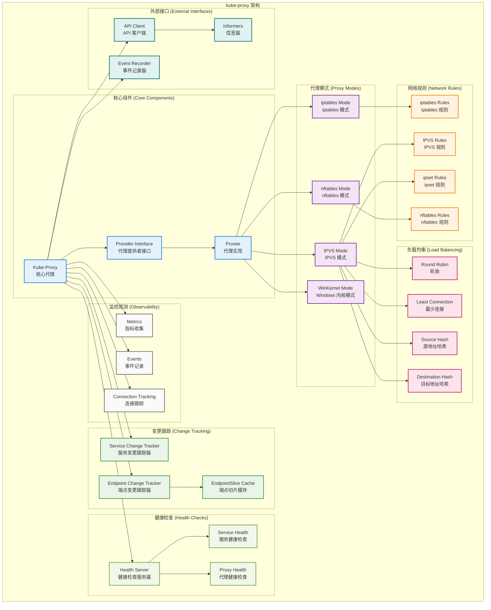
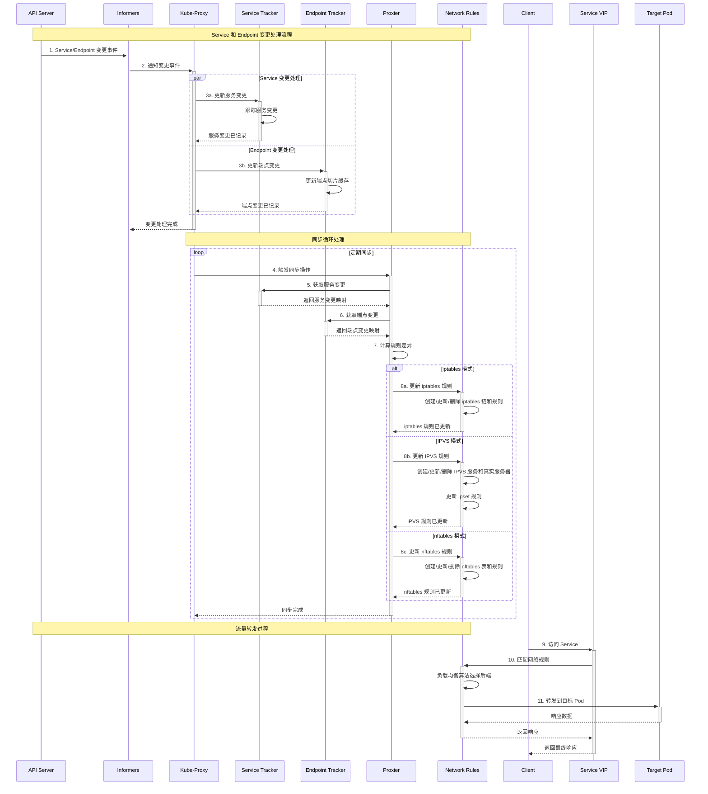
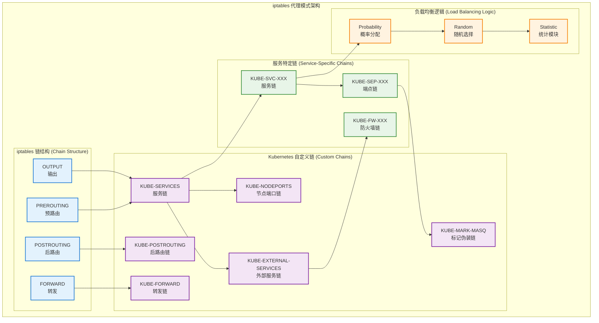
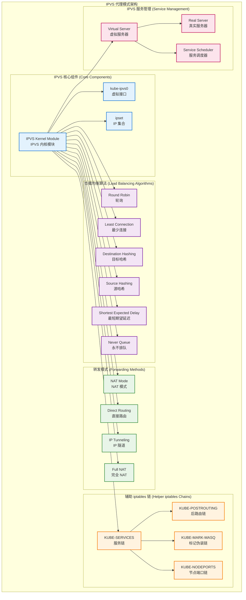

## 📚 文档概述

本文档深入分析 Kubernetes Kube-Proxy 的架构设计、源码实现和核心机制。Kube-Proxy 是 Kubernetes 集群中负责网络代理和负载均衡的关键组件，它在每个节点上运行，实现 Service 到 Pod 的流量转发和负载均衡。

## 🏗️ Kube-Proxy 整体架构

### 1.1 Kube-Proxy 架构设计



### 1.2 Kube-Proxy 工作流程



## 🚀 启动流程详细分析

### 2.1 Kube-Proxy 启动入口

```go
// cmd/kube-proxy/proxy.go
/*
Kube-Proxy 主入口文件
负责初始化和启动 Kube-Proxy 服务

主要职责：
1. 创建 Cobra 命令对象
2. 解析命令行参数和配置
3. 启动 Kube-Proxy 主循环
*/
package main

import (
    "os"

    "k8s.io/component-base/cli"
    _ "k8s.io/component-base/logs/json/register"          // JSON 日志格式注册
    _ "k8s.io/component-base/metrics/prometheus/clientgo" // 客户端指标注册
    _ "k8s.io/component-base/metrics/prometheus/version"  // 版本指标注册
    "k8s.io/kubernetes/cmd/kube-proxy/app"
)

/*
main 函数是 Kube-Proxy 的程序入口点

执行流程：
1. 创建 Kube-Proxy 命令对象
2. 通过 CLI 框架执行命令
3. 根据执行结果退出程序

返回值：
- 程序退出码（0 表示成功，非 0 表示失败）
*/
func main() {
    // 创建 Kube-Proxy 命令对象
    command := app.NewProxyCommand()
    
    // 执行命令，启动 Kube-Proxy
    code := cli.Run(command)
    
    // 根据执行结果退出程序
    os.Exit(code)
}
```

### 2.2 Provider 接口定义

```go
// pkg/proxy/types.go
/*
Provider 接口定义了代理提供者的核心功能

主要功能：
1. 处理服务和端点变更事件
2. 同步代理规则
3. 运行同步循环
*/

/*
Provider 接口定义了所有代理实现必须提供的方法

接口方法：
- OnServiceAdd/Update/Delete: 处理服务变更事件
- OnEndpointsAdd/Update/Delete: 处理端点变更事件（已弃用）
- OnEndpointSliceAdd/Update/Delete: 处理端点切片变更事件
- OnNodeAdd/Update/Delete: 处理节点拓扑变更事件
- OnServiceCIDRsChanged: 处理服务 CIDR 变更事件
- Sync: 立即同步代理规则
- SyncLoop: 运行定期同步循环
*/
type Provider interface {
    config.EndpointSliceHandler  // 端点切片处理器
    config.ServiceHandler        // 服务处理器
    config.NodeTopologyHandler   // 节点拓扑处理器
    config.ServiceCIDRHandler    // 服务 CIDR 处理器

    // Sync 立即同步 Provider 的当前状态到代理规则
    Sync()
    
    // SyncLoop 运行定期工作
    // 这应该作为 goroutine 或应用程序的主循环运行
    // 它不会返回
    SyncLoop()
}

/*
ServicePortName 携带命名空间 + 名称 + 端口名称
这是负载均衡服务的唯一标识符

字段说明：
- NamespacedName: 命名空间和名称
- Port: 端口名称
- Protocol: 协议类型（TCP/UDP/SCTP）
*/
type ServicePortName struct {
    types.NamespacedName  // 命名空间名称
    Port     string       // 端口名称
    Protocol v1.Protocol  // 协议类型
}

/*
String 返回 ServicePortName 的字符串表示

返回值：
- string: 格式化的字符串表示
*/
func (spn ServicePortName) String() string {
    return fmt.Sprintf("%s%s", spn.NamespacedName.String(), fmtPortName(spn.Port))
}

/*
fmtPortName 格式化端口名称

参数：
- in: 输入的端口名称

返回值：
- string: 格式化后的端口名称
*/
func fmtPortName(in string) string {
    if in == "" {
        return ""
    }
    return fmt.Sprintf(":%s", in)
}

/*
ServiceEndpoint 用于标识服务和其端点对

字段说明：
- Endpoint: 端点地址
- ServicePortName: 服务端口名称
*/
type ServiceEndpoint struct {
    Endpoint        string          // 端点地址
    ServicePortName ServicePortName // 服务端口名称
}
```

## 🔄 变更跟踪机制

### 3.1 服务变更跟踪器

```go
// pkg/proxy/servicechangetracker.go
/*
ServiceChangeTracker 跟踪服务的未提交变更

主要功能：
1. 跟踪服务的添加、更新、删除操作
2. 累积变更，避免频繁同步
3. 提供变更应用和重置机制
*/

/*
ServiceChangeTracker 结构体定义

字段说明：
- lock: 保护 items 的互斥锁
- items: 服务变更映射，键为命名空间名称
- makeServiceInfo: 创建服务信息的函数
- processServiceMapChange: 处理服务映射变更的函数
- ipFamily: IP 协议族（IPv4/IPv6）
*/
type ServiceChangeTracker struct {
    // lock 保护 items
    lock sync.Mutex
    // items 映射服务到其变更
    items map[types.NamespacedName]*serviceChange

    // makeServiceInfo 允许代理器在处理服务时注入自定义信息
    makeServiceInfo makeServicePortFunc
    // processServiceMapChange 在应用函数的每次变更时调用
    // 此函数不应修改 ServicePortMaps，只是使用变更进行代理器特定的清理
    processServiceMapChange processServiceMapChangeFunc

    ipFamily v1.IPFamily // IP 协议族
}

/*
makeServicePortFunc 定义创建服务端口的函数类型

参数：
- *v1.ServicePort: 服务端口规格
- *v1.Service: 服务对象
- *BaseServicePortInfo: 基础服务端口信息

返回值：
- ServicePort: 服务端口接口
*/
type makeServicePortFunc func(*v1.ServicePort, *v1.Service, *BaseServicePortInfo) ServicePort

/*
processServiceMapChangeFunc 定义处理服务映射变更的函数类型

参数：
- previous: 变更前的服务端口映射
- current: 变更后的服务端口映射
*/
type processServiceMapChangeFunc func(previous, current ServicePortMap)

/*
serviceChange 包含自代理规则同步以来服务发生的所有变更
对于单个对象，变更是累积的，即 previous 是应用变更前的状态，
current 是应用所有变更后的状态

字段说明：
- previous: 变更前的服务端口映射
- current: 变更后的服务端口映射
*/
type serviceChange struct {
    previous ServicePortMap // 变更前状态
    current  ServicePortMap // 变更后状态
}

/*
NewServiceChangeTracker 初始化 ServiceChangeTracker

参数：
- ipFamily: IP 协议族
- makeServiceInfo: 创建服务信息的函数
- processServiceMapChange: 处理服务映射变更的函数

返回值：
- *ServiceChangeTracker: 服务变更跟踪器实例
*/
func NewServiceChangeTracker(ipFamily v1.IPFamily, makeServiceInfo makeServicePortFunc, processServiceMapChange processServiceMapChangeFunc) *ServiceChangeTracker {
    return &ServiceChangeTracker{
        items:                   make(map[types.NamespacedName]*serviceChange),
        makeServiceInfo:         makeServiceInfo,
        ipFamily:                ipFamily,
        processServiceMapChange: processServiceMapChange,
    }
}

/*
Update 基于 <previous, current> 服务对更新 ServiceChangeTracker
（其中 previous 或 current 可以为 nil，但不能都为 nil）
如果 sct 包含需要同步的变更，则返回 true（无论这些变更是否由此更新引起）

参数：
- previous: 变更前的服务对象
- current: 变更后的服务对象

返回值：
- bool: 是否有变更需要同步
*/
func (sct *ServiceChangeTracker) Update(previous, current *v1.Service) bool {
    // 这是意外情况，应该直接返回 false
    if previous == nil && current == nil {
        return false
    }

    svc := current
    if svc == nil {
        svc = previous
    }
    metrics.ServiceChangesTotal.Inc()
    namespacedName := types.NamespacedName{Namespace: svc.Namespace, Name: svc.Name}

    sct.lock.Lock()
    defer sct.lock.Unlock()

    change, exists := sct.items[namespacedName]
    if !exists {
        change = &serviceChange{}
        change.previous = sct.serviceToServiceMap(previous)
        sct.items[namespacedName] = change
    }
    change.current = sct.serviceToServiceMap(current)
    
    // 如果 change.previous 等于 change.current，表示没有变更
    if reflect.DeepEqual(change.previous, change.current) {
        delete(sct.items, namespacedName)
    } else {
        klog.V(2).InfoS("Service updated ports", "service", klog.KObj(svc), "portCount", len(change.current))
    }
    metrics.ServiceChangesTotal.Inc()
    return len(sct.items) > 0
}

/*
serviceToServiceMap 将服务对象转换为服务端口映射

参数：
- service: 服务对象

返回值：
- ServicePortMap: 服务端口映射
*/
func (sct *ServiceChangeTracker) serviceToServiceMap(service *v1.Service) ServicePortMap {
    if service == nil {
        return nil
    }

    svcPortMap := make(ServicePortMap)
    svcName := types.NamespacedName{Namespace: service.Namespace, Name: service.Name}

    for i := range service.Spec.Ports {
        servicePort := &service.Spec.Ports[i]
        svcPortName := ServicePortName{NamespacedName: svcName, Port: servicePort.Name, Protocol: servicePort.Protocol}
        
        // 创建基础服务端口信息
        baseSvcInfo := &BaseServicePortInfo{
            clusterIP:                service.Spec.ClusterIP,
            port:                     int(servicePort.Port),
            protocol:                 servicePort.Protocol,
            nodePort:                 int(servicePort.NodePort),
            loadBalancerStatus:       service.Status.LoadBalancer,
            sessionAffinityType:      service.Spec.SessionAffinity,
            stickyMaxAgeSeconds:      int(*service.Spec.SessionAffinityConfig.ClientIP.TimeoutSeconds),
            externalIPs:              service.Spec.ExternalIPs,
            loadBalancerSourceRanges: service.Spec.LoadBalancerSourceRanges,
            onlyNodeLocalEndpoints:   apiservice.RequestsOnlyLocalTraffic(service),
            topologyKeys:             service.Spec.TopologyKeys,
            nodeLocalExternal:        apiservice.ExternalPolicyLocal(service),
            internalTrafficPolicy:    service.Spec.InternalTrafficPolicy,
        }

        // 使用自定义函数创建服务端口信息
        svcPortMap[svcPortName] = sct.makeServiceInfo(servicePort, service, baseSvcInfo)
    }
    return svcPortMap
}

/*
Update 应用当前变更状态到实际的服务映射，并重置变更跟踪器

参数：
- serviceMap: 当前的服务端口映射

返回值：
- UpdateServiceMapResult: 更新结果，包含更新的服务映射和存根 UDP 服务
*/
func (sct *ServiceChangeTracker) Update(serviceMap ServicePortMap) (result UpdateServiceMapResult) {
    result.UpdatedServices = sets.New[types.NamespacedName]()
    result.DeletedUDPClusterIPs = sets.New[string]()

    sct.lock.Lock()
    defer sct.lock.Unlock()

    for _, change := range sct.items {
        result.UpdatedServices = result.UpdatedServices.Union(change.updateServiceMap(serviceMap, &result.DeletedUDPClusterIPs))
        sct.processServiceMapChange(change.previous, change.current)
    }

    // 清空变更项
    sct.items = make(map[types.NamespacedName]*serviceChange)
    metrics.ServicesInstalledTotal.Set(float64(len(serviceMap)))
    return result
}
```

### 3.2 端点变更跟踪器

```go
// pkg/proxy/endpointschangetracker.go
/*
EndpointsChangeTracker 跟踪端点的未提交变更

主要功能：
1. 跟踪端点切片的添加、更新、删除操作
2. 维护端点切片缓存
3. 计算网络编程延迟指标
*/

/*
EndpointsChangeTracker 结构体定义

字段说明：
- lock: 保护 lastChangeTriggerTimes 的互斥锁
- processEndpointsMapChange: 处理端点映射变更的函数
- addressType: 此代理跟踪的端点切片类型
- endpointSliceCache: 端点切片缓存
- lastChangeTriggerTimes: 服务变更触发时间映射
- trackerStartTime: 跟踪器启动时间
*/
type EndpointsChangeTracker struct {
    // lock 保护 lastChangeTriggerTimes
    lock sync.Mutex

    // processEndpointsMapChange 在应用函数的每次变更时调用
    // 此函数不应修改 EndpointsMaps，只是使用变更进行代理器特定的清理
    processEndpointsMapChange processEndpointsMapChangeFunc

    // addressType 是此代理跟踪的端点切片类型
    addressType discovery.AddressType

    // endpointSliceCache 保存端点切片的简化版本
    endpointSliceCache *EndpointSliceCache

    // lastChangeTriggerTimes 从服务的 NamespacedName 映射到
    // 导致其 EndpointSlice 对象变更的触发器时间
    // 用于计算网络编程延迟指标
    lastChangeTriggerTimes map[types.NamespacedName][]time.Time
    
    // trackerStartTime 是 EndpointsChangeTracker 创建的时间
    // 用于避免为在此之前发生的变更生成网络编程延迟指标
    trackerStartTime time.Time
}

/*
makeEndpointFunc 定义创建端点的函数类型

参数：
- info: 基础端点信息
- svcPortName: 服务端口名称

返回值：
- Endpoint: 端点接口
*/
type makeEndpointFunc func(info *BaseEndpointInfo, svcPortName *ServicePortName) Endpoint

/*
processEndpointsMapChangeFunc 定义处理端点映射变更的函数类型

参数：
- oldEndpointsMap: 旧的端点映射
- newEndpointsMap: 新的端点映射
*/
type processEndpointsMapChangeFunc func(oldEndpointsMap, newEndpointsMap EndpointsMap)

/*
NewEndpointsChangeTracker 初始化 EndpointsChangeTracker

参数：
- ipFamily: IP 协议族
- nodeName: 节点名称
- makeEndpointInfo: 创建端点信息的函数
- processEndpointsMapChange: 处理端点映射变更的函数

返回值：
- *EndpointsChangeTracker: 端点变更跟踪器实例
*/
func NewEndpointsChangeTracker(ipFamily v1.IPFamily, nodeName string, makeEndpointInfo makeEndpointFunc, processEndpointsMapChange processEndpointsMapChangeFunc) *EndpointsChangeTracker {
    addressType := discovery.AddressTypeIPv4
    if ipFamily == v1.IPv6Protocol {
        addressType = discovery.AddressTypeIPv6
    }

    return &EndpointsChangeTracker{
        addressType:               addressType,
        lastChangeTriggerTimes:    make(map[types.NamespacedName][]time.Time),
        trackerStartTime:          time.Now(),
        processEndpointsMapChange: processEndpointsMapChange,
        endpointSliceCache:        NewEndpointSliceCache(nodeName, makeEndpointInfo),
    }
}

/*
EndpointSliceUpdate 通过添加/更新或删除端点切片来更新 EndpointsChangeTracker
如果此更新包含需要同步的变更，则返回 true

参数：
- endpointSlice: 端点切片对象
- removeSlice: 是否删除切片

返回值：
- bool: 是否需要同步
*/
func (ect *EndpointsChangeTracker) EndpointSliceUpdate(endpointSlice *discovery.EndpointSlice, removeSlice bool) bool {
    if endpointSlice.AddressType != ect.addressType {
        klog.V(4).InfoS("忽略不支持的 EndpointSlice", "endpointSlice", klog.KObj(endpointSlice), "type", endpointSlice.AddressType, "expected", ect.addressType)
        return false
    }

    namespacedName, _, err := endpointSliceCacheKeys(endpointSlice)
    if err != nil {
        klog.InfoS("获取端点切片缓存键时出错", "err", err)
        return false
    }

    metrics.EndpointChangesTotal.Inc()

    ect.lock.Lock()
    defer ect.lock.Unlock()

    changeNeeded := ect.endpointSliceCache.updatePending(endpointSlice, removeSlice)

    if changeNeeded {
        metrics.EndpointChangesPending.Inc()
        // 在端点切片变更时，记录触发时间用于延迟计算
        now := time.Now()
        ect.lastChangeTriggerTimes[namespacedName] = append(ect.lastChangeTriggerTimes[namespacedName], now)

        // 保持最近的触发时间，避免内存泄漏
        if len(ect.lastChangeTriggerTimes[namespacedName]) > 10 {
            ect.lastChangeTriggerTimes[namespacedName] = ect.lastChangeTriggerTimes[namespacedName][1:]
        }
    }

    return changeNeeded
}

/*
PendingChanges 返回当前待处理的变更数量

返回值：
- int: 待处理变更数量
*/
func (ect *EndpointsChangeTracker) PendingChanges() int {
    return ect.endpointSliceCache.pendingChanges()
}

/*
Update 应用当前变更状态到实际的端点映射，并重置变更跟踪器

参数：
- endpointsMap: 当前的端点映射

返回值：
- bool: 是否有变更应用
*/
func (ect *EndpointsChangeTracker) Update(endpointsMap EndpointsMap) bool {
    ect.lock.Lock()
    defer ect.lock.Unlock()

    appliedChanges, appliedState := ect.endpointSliceCache.apply(endpointsMap, ect.lastChangeTriggerTimes)
    
    // 清理已应用的触发时间
    for serviceNN := range appliedChanges {
        delete(ect.lastChangeTriggerTimes, serviceNN)
    }

    if appliedState != nil {
        ect.processEndpointsMapChange(appliedState.previous, appliedState.current)
    }
    
    metrics.EndpointsInstalledTotal.Set(float64(len(endpointsMap)))
    // TODO: 如果这变得过于昂贵，切换到基于采样的方法
    for _, endpoints := range endpointsMap {
        metrics.EndpointsAddressesPerSlice.Observe(float64(len(endpoints)))
    }
    return len(appliedChanges) > 0
}
```

## 🔧 代理模式实现

### 4.1 iptables 模式



### 4.2 iptables Proxier 实现

```go
// pkg/proxy/iptables/proxier.go
/*
Proxier 是基于 iptables 的代理实现

主要功能：
1. 管理 iptables 规则的创建、更新和删除
2. 实现服务到端点的负载均衡
3. 处理 NodePort、LoadBalancer 和 ExternalIP 服务类型
4. 支持会话亲和性和源 IP 保留
*/

/*
Proxier 结构体定义

字段说明：
- ipFamily: IP 协议族（IPv4/IPv6）
- endpointsChanges: 端点变更跟踪器
- serviceChanges: 服务变更跟踪器
- svcPortMap: 服务端口映射
- endpointsMap: 端点映射
- iptables: iptables 接口
- masqueradeAll: 是否伪装所有流量
- masqueradeBit: 伪装标记位
- localDetector: 本地流量检测器
- hostname: 主机名
- nodeIP: 节点 IP
- recorder: 事件记录器
- healthChecker: 健康检查器
- nodePortAddresses: 节点端口地址
- iptablesData: iptables 数据缓冲区
*/
type Proxier struct {
    // ipFamily 定义此代理跟踪的 IP 协议族
    ipFamily v1.IPFamily

    // endpointsChanges 和 serviceChanges 包含自 iptables 同步以来
    // 端点和服务发生的所有变更。对于单个对象，变更是累积的
    endpointsChanges *proxy.EndpointsChangeTracker
    serviceChanges   *proxy.ServiceChangeTracker

    mu             sync.Mutex // 保护以下字段
    svcPortMap     proxy.ServicePortMap
    endpointsMap   proxy.EndpointsMap
    topologyLabels map[string]string
    
    // endpointSlicesSynced 和 servicesSynced 在启动后相应对象同步时设置为 true
    // 用于避免在启动期间更新 iptables
    endpointSlicesSynced bool
    servicesSynced       bool
    initialized          int32
    syncRunner           *runner.BoundedFrequencyRunner // 管理调用 syncProxyRules

    // 这些是有效的 iptables 规则，按表分组
    iptablesData *bytes.Buffer
    // 用于跟踪我们需要删除的链
    existingFilterChains map[utiliptables.Chain]string
    // 用于跟踪我们需要删除的 NAT 链
    existingNATChains map[utiliptables.Chain]string

    // 值在 NewProxier 中设置，之后是只读的
    iptables       utiliptables.Interface
    masqueradeAll  bool
    masqueradeBit  int
    localDetector  proxyutil.LocalTrafficDetector
    hostname       string
    nodeIP         net.IP
    recorder       events.EventRecorder
    healthChecker  healthcheck.ProxyHealthChecker
    healthzServer  *healthcheck.ProxyHealthServer

    // 自上次规则同步以来，这些值可能会发生变化
    nodePortAddresses   []string
    networkInterfacer   proxyutil.NetworkInterfacer
    gracefuldeleteManager *conntrack.GracefulTerminationManager

    // 大集群模式下的优化
    largeClusterMode bool

    // 连接跟踪
    conntrackTool conntrack.Interface

    // 本地主机节点端口
    localhostNodePorts bool
}

/*
NewProxier 创建新的 iptables Proxier 实例

参数：
- ctx: 上下文对象
- ipFamily: IP 协议族
- ipt: iptables 接口
- sysctl: sysctl 接口
- syncPeriod: 同步周期
- minSyncPeriod: 最小同步周期
- masqueradeAll: 是否伪装所有流量
- localhostNodePorts: 是否允许本地主机节点端口
- masqueradeBit: 伪装标记位
- localDetector: 本地流量检测器
- nodeName: 节点名称
- nodeIP: 节点 IP
- recorder: 事件记录器
- healthzServer: 健康检查服务器
- nodePortAddresses: 节点端口地址
- initOnly: 是否仅初始化

返回值：
- *Proxier: Proxier 实例
- error: 创建过程中的错误
*/
func NewProxier(ctx context.Context,
    ipFamily v1.IPFamily,
    ipt utiliptables.Interface,
    sysctl utilsysctl.Interface,
    syncPeriod time.Duration,
    minSyncPeriod time.Duration,
    masqueradeAll bool,
    localhostNodePorts bool,
    masqueradeBit int,
    localDetector proxyutil.LocalTrafficDetector,
    nodeName string,
    nodeIP net.IP,
    recorder events.EventRecorder,
    healthzServer *healthcheck.ProxyHealthServer,
    nodePortAddresses []string,
    initOnly bool) (*Proxier, error) {

    // 设置 conntrack 参数
    if val, err := sysctl.GetSysctl(sysctlNFConntrackTCPBeLiberal); err == nil && val != 1 {
        klog.InfoS("设置 conntrack TCP be liberal 参数", "currentValue", val)
        if err := sysctl.SetSysctl(sysctlNFConntrackTCPBeLiberal, 1); err != nil {
            return nil, fmt.Errorf("无法设置 sysctl %s: %v", sysctlNFConntrackTCPBeLiberal, err)
        }
    }

    // 设置路由本地网络参数
    if localhostNodePorts {
        if val, err := sysctl.GetSysctl(sysctlRouteLocalnet); err == nil && val != 1 {
            klog.InfoS("设置 route_localnet 参数", "currentValue", val)
            if err := sysctl.SetSysctl(sysctlRouteLocalnet, 1); err != nil {
                return nil, fmt.Errorf("无法设置 sysctl %s: %v", sysctlRouteLocalnet, err)
            }
        }
    }

    // 生成伪装标记
    masqueradeValue := 1 << uint(masqueradeBit)
    masqueradeMark := fmt.Sprintf("%#08x", masqueradeValue)
    klog.V(2).InfoS("使用 iptables 伪装标记", "mark", masqueradeMark)

    // 创建健康检查器
    var healthChecker healthcheck.ProxyHealthChecker
    if healthzServer != nil {
        healthChecker = healthzServer
    }

    // 创建 Proxier 实例
    proxier := &Proxier{
        ipFamily:                ipFamily,
        svcPortMap:              make(proxy.ServicePortMap),
        serviceChanges:          proxy.NewServiceChangeTracker(ipFamily, newServiceInfo, proxier.processServiceMapChange),
        endpointsMap:            make(proxy.EndpointsMap),
        endpointsChanges:        proxy.NewEndpointsChangeTracker(ipFamily, nodeName, newEndpointInfo, proxier.processEndpointsMapChange),
        iptables:                ipt,
        masqueradeAll:           masqueradeAll,
        masqueradeBit:           masqueradeBit,
        localDetector:           localDetector,
        hostname:                nodeName,
        nodeIP:                  nodeIP,
        recorder:                recorder,
        healthChecker:           healthChecker,
        healthzServer:           healthzServer,
        iptablesData:            bytes.NewBuffer(nil),
        existingFilterChains:    make(map[utiliptables.Chain]string),
        existingNATChains:       make(map[utiliptables.Chain]string),
        nodePortAddresses:       nodePortAddresses,
        networkInterfacer:       proxyutil.RealNetwork{},
        gracefuldeleteManager:   conntrack.NewGracefulTerminationManager(conntrack.NewExecer()),
        conntrackTool:           conntrack.NewExecer(),
        localhostNodePorts:      localhostNodePorts,
    }

    // 创建同步运行器
    proxier.syncRunner = runner.New(proxier.syncProxyRules, minSyncPeriod, time.Hour, burstSyncs)

    if initOnly {
        return proxier, nil
    }

    // 启动同步运行器
    go proxier.syncRunner.Loop()

    return proxier, nil
}

/*
syncProxyRules 同步代理规则到 iptables

这是 iptables 代理的核心方法，负责：
1. 获取当前的服务和端点变更
2. 构建新的 iptables 规则
3. 应用规则到内核
4. 清理不再需要的规则

工作流程：
1. 检查初始化状态
2. 获取服务和端点变更
3. 构建 iptables 规则
4. 应用规则
5. 清理旧规则
6. 更新健康检查
*/
func (proxier *Proxier) syncProxyRules() {
    proxier.mu.Lock()
    defer proxier.mu.Unlock()

    // 不要在我们尚未收到任何服务或端点事件时同步规则
    if !proxier.isInitialized() {
        klog.V(2).InfoS("尚未收到服务和端点的初始事件，跳过同步")
        return
    }

    // 跟踪同步开始时间
    start := time.Now()
    defer func() {
        metrics.SyncProxyRulesLatency.Observe(metrics.SinceInSeconds(start))
        klog.V(2).InfoS("同步 iptables 规则完成", "elapsed", time.Since(start))
    }()

    // 获取服务变更
    serviceUpdateResult := proxier.serviceChanges.Update(proxier.svcPortMap)
    endpointUpdateResult := proxier.endpointsChanges.Update(proxier.endpointsMap)

    klog.V(3).InfoS("同步 iptables 规则", 
        "serviceCount", len(proxier.svcPortMap),
        "endpointCount", len(proxier.endpointsMap),
        "conntrackCleanupThreshold", largeClusterEndpointsThreshold)

    // 创建和链接 kube 链
    for _, jump := range iptablesJumps {
        if _, err := proxier.iptables.EnsureChain(jump.table, jump.dstChain); err != nil {
            klog.ErrorS(err, "创建链失败", "table", jump.table, "chain", jump.dstChain)
            return
        }
        args := append(jump.extraArgs,
            "-m", "comment", "--comment", jump.comment,
            "-j", string(jump.dstChain),
        )
        if _, err := proxier.iptables.EnsureRule(utiliptables.Prepend, jump.table, jump.srcChain, args...); err != nil {
            klog.ErrorS(err, "创建规则失败", "table", jump.table, "chain", jump.srcChain, "args", args)
            return
        }
    }

    // 下面我们将构建规则
    proxier.iptablesData.Reset()
    proxier.writeIptablesRules()

    // 注意：`iptables-restore` 不会刷新我们没有提供的链或表
    // 这是我们想要的，因为它允许用户添加自定义规则，我们不会干扰它们
    klog.V(3).InfoS("恢复 iptables 规则", "rules", proxier.iptablesData.Len())
    err := proxier.iptables.RestoreAll(proxier.iptablesData.Bytes(), utiliptables.NoFlushTables, utiliptables.RestoreCounters)
    if err != nil {
        if pErr, ok := err.(utiliptables.ParseError); ok {
            lines := utiliptables.ExtractLines(proxier.iptablesData.Bytes(), pErr.Line(), 3)
            klog.ErrorS(pErr, "iptables-restore 解析失败", "rules", lines)
        } else {
            klog.ErrorS(err, "iptables-restore 失败")
        }
        metrics.IptablesRestoreFailuresTotal.Inc()
        return
    }
    success := true

    for name := range endpointUpdateResult.StaleEndpoints {
        if err := conntrack.ClearEntriesForNAT(proxier.conntrackTool, name.IP, v1.ProtocolTCP); err != nil {
            klog.ErrorS(err, "清理 TCP conntrack 条目失败", "ip", name.IP)
        }
        if err := conntrack.ClearEntriesForNAT(proxier.conntrackTool, name.IP, v1.ProtocolUDP); err != nil {
            klog.ErrorS(err, "清理 UDP conntrack 条目失败", "ip", name.IP)
        }
        if err := conntrack.ClearEntriesForNAT(proxier.conntrackTool, name.IP, v1.ProtocolSCTP); err != nil {
            klog.ErrorS(err, "清理 SCTP conntrack 条目失败", "ip", name.IP)
        }
    }

    // 更新健康检查器
    if proxier.healthzServer != nil {
        proxier.healthzServer.Updated()
    }
    metrics.SyncProxyRulesLastTimestamp.SetToCurrentTime()

    // 更新指标
    if success {
        metrics.SyncProxyRulesNoLocalEndpointsTotal.WithLabelValues("internal").Add(float64(endpointUpdateResult.HCEndpointsLocalTerminating))
        metrics.SyncProxyRulesNoLocalEndpointsTotal.WithLabelValues("external").Add(float64(endpointUpdateResult.HCEndpointsExternalTerminating))
        for _, svcPortName := range endpointUpdateResult.HCServiceNodePorts {
            klog.InfoS("服务没有本地端点", "service", svcPortName.String())
        }
    }
}
```

### 4.3 IPVS 模式



### 4.4 IPVS Proxier 实现

```go
// pkg/proxy/ipvs/proxier.go
/*
Proxier 是基于 IPVS 的代理实现

主要功能：
1. 管理 IPVS 虚拟服务器和真实服务器
2. 使用 ipset 管理 IP 集合
3. 支持多种负载均衡算法
4. 提供更好的性能和可扩展性
*/

/*
Proxier 结构体定义

字段说明：
- ipFamily: IP 协议族
- endpointsChanges: 端点变更跟踪器
- serviceChanges: 服务变更跟踪器
- ipvs: IPVS 接口
- ipset: ipset 接口
- iptables: iptables 接口
- masqueradeAll: 是否伪装所有流量
- masqueradeBit: 伪装标记位
- scheduler: 负载均衡调度算法
- syncPeriod: 同步周期
- excludeCIDRs: 排除的 CIDR
- strictARP: 是否启用严格 ARP
- tcpTimeout: TCP 超时时间
- tcpFinTimeout: TCP FIN 超时时间
- udpTimeout: UDP 超时时间
- gracefuldeleteManager: 优雅删除管理器
*/
type Proxier struct {
    // ipFamily 定义此代理跟踪的 IP 协议族
    ipFamily v1.IPFamily

    endpointsChanges *proxy.EndpointsChangeTracker
    serviceChanges   *proxy.ServiceChangeTracker

    mu           sync.Mutex // 保护以下字段
    svcPortMap   proxy.ServicePortMap
    endpointsMap proxy.EndpointsMap
    
    // endpointSlicesSynced 和 servicesSynced 在启动后相应对象同步时设置为 true
    endpointSlicesSynced bool
    servicesSynced       bool
    initialized          int32
    syncRunner           *runner.BoundedFrequencyRunner

    // 这些是有效的 ipvs 规则
    ipvsRules map[string]*utilipvs.VirtualServer

    // ipvs 接口和相关工具
    ipvs      utilipvs.Interface
    ipset     utilipset.Interface
    iptables  utiliptables.Interface
    
    // 配置参数
    masqueradeAll  bool
    masqueradeBit  int
    localDetector  proxyutil.LocalTrafficDetector
    hostname       string
    nodeIP         net.IP
    recorder       events.EventRecorder
    healthChecker  healthcheck.ProxyHealthChecker
    healthzServer  *healthcheck.ProxyHealthServer

    // IPVS 特定配置
    scheduler             string
    syncPeriod            time.Duration
    excludeCIDRs          []string
    strictARP             bool
    tcpTimeout            time.Duration
    tcpFinTimeout         time.Duration
    udpTimeout            time.Duration
    gracefuldeleteManager *conntrack.GracefulTerminationManager

    // ipset 名称
    ipsetList             map[string]*IPSet
    
    // 网络接口
    netlinkHandle         NetLinkHandle
    
    // 节点端口地址
    nodePortAddresses     []string
    networkInterfacer     proxyutil.NetworkInterfacer
}

/*
NewProxier 创建新的 IPVS Proxier 实例

参数：
- ctx: 上下文对象
- ipFamily: IP 协议族
- ipt: iptables 接口
- ipvs: IPVS 接口
- ipset: ipset 接口
- sysctl: sysctl 接口
- syncPeriod: 同步周期
- minSyncPeriod: 最小同步周期
- excludeCIDRs: 排除的 CIDR
- strictARP: 是否启用严格 ARP
- tcpTimeout: TCP 超时时间
- tcpFinTimeout: TCP FIN 超时时间
- udpTimeout: UDP 超时时间
- masqueradeAll: 是否伪装所有流量
- masqueradeBit: 伪装标记位
- localDetector: 本地流量检测器
- nodeName: 节点名称
- nodeIP: 节点 IP
- recorder: 事件记录器
- healthzServer: 健康检查服务器
- scheduler: 负载均衡调度算法
- nodePortAddresses: 节点端口地址
- initOnly: 是否仅初始化

返回值：
- *Proxier: Proxier 实例
- error: 创建过程中的错误
*/
func NewProxier(ctx context.Context,
    ipFamily v1.IPFamily,
    ipt utiliptables.Interface,
    ipvs utilipvs.Interface,
    ipset utilipset.Interface,
    sysctl utilsysctl.Interface,
    syncPeriod time.Duration,
    minSyncPeriod time.Duration,
    excludeCIDRs []string,
    strictARP bool,
    tcpTimeout time.Duration,
    tcpFinTimeout time.Duration,
    udpTimeout time.Duration,
    masqueradeAll bool,
    masqueradeBit int,
    localDetector proxyutil.LocalTrafficDetector,
    nodeName string,
    nodeIP net.IP,
    recorder events.EventRecorder,
    healthzServer *healthcheck.ProxyHealthServer,
    scheduler string,
    nodePortAddresses []string,
    initOnly bool) (*Proxier, error) {

    // 设置 IPVS 相关的 sysctl 参数
    if err := utilipvs.NewLinuxKernelHandler().ConfigureTimeouts(tcpTimeout, tcpFinTimeout, udpTimeout); err != nil {
        return nil, err
    }

    // 设置连接跟踪
    if val, err := sysctl.GetSysctl(sysctlVSConnTrack); err == nil && val != 1 {
        klog.InfoS("设置 vs/conntrack 参数", "currentValue", val)
        if err := sysctl.SetSysctl(sysctlVSConnTrack, 1); err != nil {
            return nil, fmt.Errorf("无法设置 sysctl %s: %v", sysctlVSConnTrack, err)
        }
    }

    // 设置连接复用
    if val, err := sysctl.GetSysctl(sysctlConnReuse); err == nil && val != 0 {
        klog.InfoS("设置 conn_reuse_mode 参数", "currentValue", val)
        if err := sysctl.SetSysctl(sysctlConnReuse, 0); err != nil {
            return nil, fmt.Errorf("无法设置 sysctl %s: %v", sysctlConnReuse, err)
        }
    }

    // 设置过期无目标连接
    if val, err := sysctl.GetSysctl(sysctlExpireNoDestConn); err == nil && val != 1 {
        klog.InfoS("设置 expire_nodest_conn 参数", "currentValue", val)
        if err := sysctl.SetSysctl(sysctlExpireNoDestConn, 1); err != nil {
            return nil, fmt.Errorf("无法设置 sysctl %s: %v", sysctlExpireNoDestConn, err)
        }
    }

    // 设置过期静默模板
    if val, err := sysctl.GetSysctl(sysctlExpireQuiescentTemplate); err == nil && val != 1 {
        klog.InfoS("设置 expire_quiescent_template 参数", "currentValue", val)
        if err := sysctl.SetSysctl(sysctlExpireQuiescentTemplate, 1); err != nil {
            return nil, fmt.Errorf("无法设置 sysctl %s: %v", sysctlExpireQuiescentTemplate, err)
        }
    }

    // 设置 IP 转发
    if val, err := sysctl.GetSysctl(sysctlForward); err == nil && val != 1 {
        klog.InfoS("设置 ip_forward 参数", "currentValue", val)
        if err := sysctl.SetSysctl(sysctlForward, 1); err != nil {
            return nil, fmt.Errorf("无法设置 sysctl %s: %v", sysctlForward, err)
        }
    }

    // 设置严格 ARP
    if strictARP {
        // 设置 arp_ignore
        if val, err := sysctl.GetSysctl(sysctlArpIgnore); err == nil && val != 1 {
            klog.InfoS("设置 arp_ignore 参数", "currentValue", val)
            if err := sysctl.SetSysctl(sysctlArpIgnore, 1); err != nil {
                return nil, fmt.Errorf("无法设置 sysctl %s: %v", sysctlArpIgnore, err)
            }
        }

        // 设置 arp_announce
        if val, err := sysctl.GetSysctl(sysctlArpAnnounce); err == nil && val != 2 {
            klog.InfoS("设置 arp_announce 参数", "currentValue", val)
            if err := sysctl.SetSysctl(sysctlArpAnnounce, 2); err != nil {
                return nil, fmt.Errorf("无法设置 sysctl %s: %v", sysctlArpAnnounce, err)
            }
        }
    }

    // 生成伪装标记
    masqueradeValue := 1 << uint(masqueradeBit)
    masqueradeMark := fmt.Sprintf("%#08x", masqueradeValue)
    klog.V(2).InfoS("使用 iptables 伪装标记", "mark", masqueradeMark)

    // 创建健康检查器
    var healthChecker healthcheck.ProxyHealthChecker
    if healthzServer != nil {
        healthChecker = healthzServer
    }

    // 设置默认调度算法
    if len(scheduler) == 0 {
        scheduler = defaultScheduler
    }

    // 创建 Proxier 实例
    proxier := &Proxier{
        ipFamily:                ipFamily,
        svcPortMap:              make(proxy.ServicePortMap),
        serviceChanges:          proxy.NewServiceChangeTracker(ipFamily, newServiceInfo, proxier.processServiceMapChange),
        endpointsMap:            make(proxy.EndpointsMap),
        endpointsChanges:        proxy.NewEndpointsChangeTracker(ipFamily, nodeName, newEndpointInfo, proxier.processEndpointsMapChange),
        ipvs:                    ipvs,
        ipset:                   ipset,
        iptables:                ipt,
        masqueradeAll:           masqueradeAll,
        masqueradeBit:           masqueradeBit,
        localDetector:           localDetector,
        hostname:                nodeName,
        nodeIP:                  nodeIP,
        recorder:                recorder,
        healthChecker:           healthChecker,
        healthzServer:           healthzServer,
        scheduler:               scheduler,
        syncPeriod:              syncPeriod,
        excludeCIDRs:            excludeCIDRs,
        strictARP:               strictARP,
        tcpTimeout:              tcpTimeout,
        tcpFinTimeout:           tcpFinTimeout,
        udpTimeout:              udpTimeout,
        ipvsRules:               make(map[string]*utilipvs.VirtualServer),
        ipsetList:               make(map[string]*IPSet),
        nodePortAddresses:       nodePortAddresses,
        networkInterfacer:       proxyutil.RealNetwork{},
        gracefuldeleteManager:   conntrack.NewGracefulTerminationManager(conntrack.NewExecer()),
    }

    // 初始化 ipset
    proxier.initIPSet()

    // 创建同步运行器
    proxier.syncRunner = runner.New(proxier.syncProxyRules, minSyncPeriod, time.Hour, burstSyncs)

    if initOnly {
        return proxier, nil
    }

    // 启动同步运行器
    go proxier.syncRunner.Loop()

    return proxier, nil
}

/*
syncProxyRules 同步代理规则到 IPVS

这是 IPVS 代理的核心方法，负责：
1. 获取当前的服务和端点变更
2. 构建新的 IPVS 规则
3. 应用规则到内核
4. 清理不再需要的规则

工作流程：
1. 检查初始化状态
2. 获取服务和端点变更
3. 构建 IPVS 虚拟服务器和真实服务器
4. 更新 ipset 规则
5. 应用 IPVS 规则
6. 清理旧规则
7. 更新健康检查
*/
func (proxier *Proxier) syncProxyRules() {
    proxier.mu.Lock()
    defer proxier.mu.Unlock()

    // 不要在我们尚未收到任何服务或端点事件时同步规则
    if !proxier.isInitialized() {
        klog.V(2).InfoS("尚未收到服务和端点的初始事件，跳过同步")
        return
    }

    // 跟踪同步开始时间
    start := time.Now()
    defer func() {
        metrics.SyncProxyRulesLatency.Observe(metrics.SinceInSeconds(start))
        klog.V(2).InfoS("同步 IPVS 规则完成", "elapsed", time.Since(start))
    }()

    // 获取服务变更
    serviceUpdateResult := proxier.serviceChanges.Update(proxier.svcPortMap)
    endpointUpdateResult := proxier.endpointsChanges.Update(proxier.endpointsMap)

    klog.V(3).InfoS("同步 IPVS 规则", 
        "serviceCount", len(proxier.svcPortMap),
        "endpointCount", len(proxier.endpointsMap))

    // 构建 IPVS 规则
    activeIPVSServices := make(map[string]*utilipvs.VirtualServer)
    activeBindAddrs := make(map[string]bool)

    // 处理每个服务
    for svcName, svc := range proxier.svcPortMap {
        svcInfo, ok := svc.(*servicePortInfo)
        if !ok {
            klog.ErrorS(nil, "转换为 servicePortInfo 失败", "servicePortName", svcName)
            continue
        }

        protocol := strings.ToLower(string(svcInfo.Protocol()))
        addr := net.ParseIP(svcInfo.ClusterIP().String())
        if addr == nil {
            klog.ErrorS(nil, "解析集群 IP 失败", "clusterIP", svcInfo.ClusterIP())
            continue
        }

        // 创建 IPVS 虚拟服务器
        serv := &utilipvs.VirtualServer{
            Address:   addr,
            Port:      uint16(svcInfo.Port()),
            Protocol:  protocol,
            Scheduler: proxier.scheduler,
        }

        // 添加到活跃服务列表
        activeIPVSServices[serv.String()] = serv

        // 绑定服务地址到虚拟接口
        if err := proxier.netlinkHandle.EnsureAddressBind(addr, defaultDummyDevice); err != nil {
            klog.ErrorS(err, "绑定服务地址到虚拟接口失败", "address", addr)
        }
        activeBindAddrs[addr.String()] = true

        // 获取端点
        endpoints := proxier.endpointsMap[svcName]
        
        // 添加真实服务器
        for _, ep := range endpoints {
            epInfo, ok := ep.(*endpointsInfo)
            if !ok {
                klog.ErrorS(nil, "转换为 endpointsInfo 失败")
                continue
            }

            rs := &utilipvs.RealServer{
                Address: net.ParseIP(epInfo.IP()),
                Port:    uint16(epInfo.Port()),
                Weight:  1,
            }

            if err := proxier.ipvs.AddRealServer(serv, rs); err != nil {
                klog.ErrorS(err, "添加真实服务器失败", "service", serv, "realServer", rs)
            }
        }

        // 添加或更新 IPVS 服务
        if err := proxier.ipvs.AddVirtualServer(serv); err != nil {
            klog.ErrorS(err, "添加虚拟服务器失败", "service", serv)
        }
    }

    // 清理不再需要的 IPVS 服务
    existingVirtualServers, err := proxier.ipvs.GetVirtualServers()
    if err != nil {
        klog.ErrorS(err, "获取现有虚拟服务器失败")
        return
    }

    for _, vs := range existingVirtualServers {
        if _, ok := activeIPVSServices[vs.String()]; !ok {
            klog.V(2).InfoS("删除虚拟服务器", "service", vs)
            if err := proxier.ipvs.DeleteVirtualServer(vs); err != nil {
                klog.ErrorS(err, "删除虚拟服务器失败", "service", vs)
            }
        }
    }

    // 更新 ipset 规则
    proxier.syncIPSetEntries()

    // 更新健康检查器
    if proxier.healthzServer != nil {
        proxier.healthzServer.Updated()
    }
    metrics.SyncProxyRulesLastTimestamp.SetToCurrentTime()
}

/*
syncIPSetEntries 同步 ipset 条目

ipset 用于高效管理大量 IP 地址集合，
主要用于：
1. 节点端口访问控制
2. 负载均衡器源范围限制
3. 外部 IP 访问控制
*/
func (proxier *Proxier) syncIPSetEntries() {
    // 清空所有 ipset
    for _, set := range proxier.ipsetList {
        if err := proxier.ipset.FlushSet(set.Name); err != nil {
            klog.ErrorS(err, "刷新 ipset 失败", "set", set.Name)
        }
    }

    // 重新填充 ipset
    for svcName, svc := range proxier.svcPortMap {
        svcInfo, ok := svc.(*servicePortInfo)
        if !ok {
            continue
        }

        // 处理负载均衡器源范围
        if len(svcInfo.LoadBalancerSourceRanges()) > 0 {
            setName := getLoadBalancerSourceRangesIPSetName(svcName)
            for _, cidr := range svcInfo.LoadBalancerSourceRanges() {
                if err := proxier.ipset.AddEntry(setName, &utilipset.Entry{
                    IP:       cidr,
                    Protocol: string(svcInfo.Protocol()),
                    Port:     strconv.Itoa(svcInfo.Port()),
                    SetType:  utilipset.HashIPPortNet,
                }); err != nil {
                    klog.ErrorS(err, "添加 ipset 条目失败", "set", setName, "entry", cidr)
                }
            }
        }

        // 处理外部 IP
        if len(svcInfo.ExternalIPs()) > 0 {
            setName := getExternalIPsIPSetName(svcName)
            for _, externalIP := range svcInfo.ExternalIPs() {
                if err := proxier.ipset.AddEntry(setName, &utilipset.Entry{
                    IP:       externalIP,
                    Protocol: string(svcInfo.Protocol()),
                    Port:     strconv.Itoa(svcInfo.Port()),
                    SetType:  utilipset.HashIPPort,
                }); err != nil {
                    klog.ErrorS(err, "添加 ipset 条目失败", "set", setName, "entry", externalIP)
                }
            }
        }
    }
}
```

## 📊 监控和性能优化

### 5.1 Kube-Proxy 指标监控

```yaml
# Kube-Proxy 监控配置
apiVersion: v1
kind: ServiceMonitor
metadata:
  name: kube-proxy
  namespace: kube-system
spec:
  selector:
    matchLabels:
      app.kubernetes.io/name: kube-proxy
  endpoints:
  - port: http-metrics
    scheme: http
    path: /metrics
    interval: 30s
    
---
# Kube-Proxy 关键指标告警规则
apiVersion: monitoring.coreos.com/v1
kind: PrometheusRule
metadata:
  name: kube-proxy-alerts
  namespace: kube-system
spec:
  groups:
  - name: kube-proxy.rules
    rules:
    # Kube-Proxy 可用性告警
    - alert: KubeProxyDown
      expr: up{job="kube-proxy"} == 0
      for: 5m
      labels:
        severity: critical
      annotations:
        summary: "Kube-Proxy 不可用"
        description: "节点 {{ $labels.instance }} 上的 Kube-Proxy 已经宕机超过 5 分钟"
    
    # 代理规则同步延迟告警
    - alert: KubeProxyRulesSyncLatencyHigh
      expr: |
        histogram_quantile(0.99, sum(rate(kubeproxy_sync_proxy_rules_duration_seconds_bucket{job="kube-proxy"}[5m])) by (le, instance)) > 10
      for: 10m
      labels:
        severity: warning
      annotations:
        summary: "Kube-Proxy 规则同步延迟过高"
        description: "节点 {{ $labels.instance }} 上代理规则同步 99% 分位延迟为 {{ $value }} 秒"
    
    # 网络编程延迟告警
    - alert: KubeProxyNetworkProgrammingLatencyHigh
      expr: |
        histogram_quantile(0.99, sum(rate(kubeproxy_network_programming_duration_seconds_bucket{job="kube-proxy"}[5m])) by (le, instance)) > 30
      for: 10m
      labels:
        severity: warning
      annotations:
        summary: "Kube-Proxy 网络编程延迟过高"
        description: "节点 {{ $labels.instance }} 上网络编程 99% 分位延迟为 {{ $value }} 秒"
    
    # iptables 恢复失败告警
    - alert: KubeProxyIptablesRestoreFailures
      expr: |
        increase(kubeproxy_iptables_restore_failures_total{job="kube-proxy"}[5m]) > 0
      for: 0m
      labels:
        severity: warning
      annotations:
        summary: "Kube-Proxy iptables 恢复失败"
        description: "节点 {{ $labels.instance }} 上 iptables 恢复失败 {{ $value }} 次"
    
    # IPVS 同步失败告警
    - alert: KubeProxyIPVSSyncFailures
      expr: |
        increase(kubeproxy_ipvs_sync_proxy_rules_last_queued_timestamp_seconds{job="kube-proxy"}[5m]) > 0
      for: 5m
      labels:
        severity: warning
      annotations:
        summary: "Kube-Proxy IPVS 同步失败"
        description: "节点 {{ $labels.instance }} 上 IPVS 规则同步出现问题"
    
    # 服务端口分配告警
    - alert: KubeProxyServicePortAllocationHigh
      expr: |
        (kubeproxy_sync_proxy_rules_service_ports_total{job="kube-proxy"} / kubeproxy_sync_proxy_rules_service_ports_capacity{job="kube-proxy"}) > 0.8
      for: 10m
      labels:
        severity: warning
      annotations:
        summary: "Kube-Proxy 服务端口分配率过高"
        description: "节点 {{ $labels.instance }} 上服务端口分配率为 {{ $value | humanizePercentage }}"
```

### 5.2 Kube-Proxy 性能优化配置

```yaml
# Kube-Proxy 高性能配置
apiVersion: kubeproxy.config.k8s.io/v1alpha1
kind: KubeProxyConfiguration

# 基础配置
bindAddress: 0.0.0.0
clientConnection:
  acceptContentTypes: ""
  burst: 100
  contentType: application/vnd.kubernetes.protobuf
  kubeconfig: /var/lib/kube-proxy/kubeconfig.conf
  qps: 50
clusterCIDR: 10.244.0.0/16
configSyncPeriod: 15m0s
conntrack:
  maxPerCore: 32768
  min: 131072
  tcpCloseWaitTimeout: 1h0m0s
  tcpEstablishedTimeout: 24h0m0s
enableProfiling: false
healthzBindAddress: 0.0.0.0:10256
hostnameOverride: ""
iptables:
  masqueradeAll: false
  masqueradeBit: 14
  minSyncPeriod: 0s
  syncPeriod: 30s
ipvs:
  excludeCIDRs: []
  minSyncPeriod: 0s
  scheduler: "rr"
  strictARP: false
  syncPeriod: 30s
  tcpTimeout: 0s
  tcpFinTimeout: 0s
  udpTimeout: 0s
kind: KubeProxyConfiguration
metricsBindAddress: 127.0.0.1:10249
mode: "ipvs"
nodePortAddresses: []
oomScoreAdj: -999
portRange: ""
showHiddenMetricsForVersion: ""
udpIdleTimeout: 250ms
winkernel:
  enableDSR: false
  networkName: ""
  sourceVip: ""

---
# Kube-Proxy DaemonSet 优化配置
apiVersion: apps/v1
kind: DaemonSet
metadata:
  name: kube-proxy
  namespace: kube-system
spec:
  selector:
    matchLabels:
      k8s-app: kube-proxy
  template:
    metadata:
      labels:
        k8s-app: kube-proxy
    spec:
      containers:
      - name: kube-proxy
        image: k8s.gcr.io/kube-proxy:v1.29.0
        command:
        - /usr/local/bin/kube-proxy
        - --config=/var/lib/kube-proxy/config.conf
        - --hostname-override=$(NODE_NAME)
        - --v=2
        env:
        - name: NODE_NAME
          valueFrom:
            fieldRef:
              fieldPath: spec.nodeName
        resources:
          requests:
            cpu: 100m
            memory: 128Mi
          limits:
            cpu: 500m
            memory: 512Mi
        securityContext:
          privileged: true
        volumeMounts:
        - name: kube-proxy
          mountPath: /var/lib/kube-proxy
        - name: xtables-lock
          mountPath: /run/xtables.lock
          readOnly: false
        - name: lib-modules
          mountPath: /lib/modules
          readOnly: true
        - name: proc
          mountPath: /host/proc
          readOnly: true
        - name: sys
          mountPath: /host/sys
          readOnly: true
      hostNetwork: true
      dnsPolicy: ClusterFirst
      nodeSelector:
        kubernetes.io/os: linux
      priorityClassName: system-node-critical
      serviceAccountName: kube-proxy
      tolerations:
      - operator: Exists
      volumes:
      - name: kube-proxy
        configMap:
          name: kube-proxy
      - name: xtables-lock
        hostPath:
          path: /run/xtables.lock
          type: FileOrCreate
      - name: lib-modules
        hostPath:
          path: /lib/modules
      - name: proc
        hostPath:
          path: /proc
      - name: sys
        hostPath:
          path: /sys

---
# IPVS 模式系统优化脚本
apiVersion: v1
kind: ConfigMap
metadata:
  name: kube-proxy-ipvs-setup
  namespace: kube-system
data:
  setup.sh: |
    #!/bin/bash
    
    # 加载 IPVS 内核模块
    modprobe ip_vs
    modprobe ip_vs_rr
    modprobe ip_vs_wrr
    modprobe ip_vs_sh
    modprobe ip_vs_sed
    modprobe ip_vs_nq
    modprobe nf_conntrack
    
    # 设置 IPVS 相关的 sysctl 参数
    sysctl -w net.ipv4.vs.conntrack=1
    sysctl -w net.ipv4.vs.conn_reuse_mode=0
    sysctl -w net.ipv4.vs.expire_nodest_conn=1
    sysctl -w net.ipv4.vs.expire_quiescent_template=1
    sysctl -w net.ipv4.ip_forward=1
    
    # 严格 ARP 设置（可选）
    # sysctl -w net.ipv4.conf.all.arp_ignore=1
    # sysctl -w net.ipv4.conf.all.arp_announce=2
    
    # 优化连接跟踪
    sysctl -w net.netfilter.nf_conntrack_max=1048576
    sysctl -w net.netfilter.nf_conntrack_tcp_timeout_established=86400
    sysctl -w net.netfilter.nf_conntrack_tcp_timeout_close_wait=3600
    
    # 创建虚拟接口
    ip link add kube-ipvs0 type dummy || true
    ip link set kube-ipvs0 up || true
    
    echo "IPVS 设置完成"
```

## 📚 总结

### 核心特性总结

1. **多种代理模式**：支持 iptables、IPVS、nftables 和 Windows 内核模式
2. **高性能负载均衡**：IPVS 模式提供更好的性能和可扩展性
3. **智能变更跟踪**：高效跟踪服务和端点变更，减少不必要的同步
4. **丰富的负载均衡算法**：支持轮询、最少连接、哈希等多种算法
5. **完整的服务类型支持**：ClusterIP、NodePort、LoadBalancer、ExternalName

### 最佳实践建议

1. **模式选择**：大规模集群推荐使用 IPVS 模式，小规模集群可使用 iptables 模式
2. **性能调优**：合理设置同步周期和连接跟踪参数
3. **监控完善**：建立全面的 Kube-Proxy 监控和告警
4. **系统优化**：优化内核参数和网络配置
5. **故障排查**：掌握网络规则调试和性能分析方法

通过深入理解 Kube-Proxy 的架构和实现，我们能够更好地管理和优化 Kubernetes 集群的网络代理，确保服务间通信的高效和稳定。

---

**文档版本**: v1.0  
**最后更新**: 2025年09月27日  
**适用版本**: Kubernetes 1.29+
