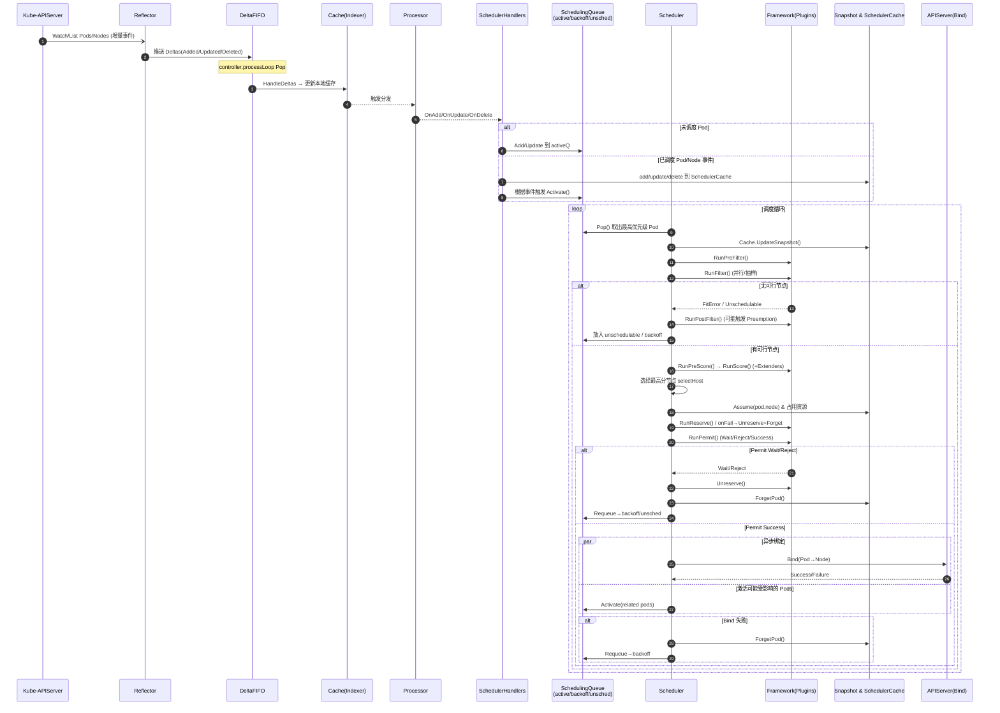

# kubernetes源码剖析：kube-scheduler

## 目录

- [kubernetes源码剖析：kube-scheduler](#kubernetes源码剖析kube-scheduler)
  - [目录](#目录)
  - [1. 调度整体观](#1-调度整体观)
  - [2. 入口命令与 `runCommand`](#2-入口命令与-runcommand)
  - [3. `Setup`：构造 Scheduler 与依赖](#3-setup构造-scheduler-与依赖)
  - [4. Clientset 初始化](#4-clientset-初始化)
  - [5. SharedInformerFactory 与 Pod Informer](#5-sharedinformerfactory-与-pod-informer)
  - [6. SharedIndexInformer 三要素](#6-sharedindexinformer-三要素)
  - [7. 调度器 `scheduler.New` 及 Profile/Framework](#7-调度器-schedulernew-及-profileframework)
  - [8. 调度队列：active / backoff / unschedulable](#8-调度队列active--backoff--unschedulable)
  - [9. 事件处理与监听注册](#9-事件处理与监听注册)
  - [10. `Run`：启动、同步与（可选）选主](#10-run启动同步与可选选主)
  - [11. Reflector、List/Watch 与 DeltaFIFO](#11-reflectorlistwatch-与-deltafifo)
  - [12. 调度主循环 `ScheduleOne`](#12-调度主循环-scheduleone)
  - [13. `schedulingCycle`：assume / reserve / permit / bind](#13-schedulingcycleassume--reserve--permit--bind)
  - [14. 候选节点与打分](#14-候选节点与打分)
  - [15. Assume 与缓存更新](#15-assume-与缓存更新)
  - [16. 细节：抽样比例与起始下标](#16-细节抽样比例与起始下标)
  - [17. 小结](#17-小结)
  - [附录 A｜Mermaid 时序图：从 List/Watch 到 Bind](#附录-amermaid-时序图从-listwatch-到-bind)
  - [附录 B｜插件扩展点速查表（Cheat Sheet）](#附录-b插件扩展点速查表cheat-sheet)
  - [附录 C｜常见失败路径与回退策略](#附录-c常见失败路径与回退策略)
    - [1) 没有可用节点（`ErrNoNodesAvailable`）](#1-没有可用节点errnonodesavailable)
    - [2) 预选失败（`Filter` 全挂 → `FitError`）](#2-预选失败filter-全挂--fiterror)
    - [3) `Reserve` 失败](#3-reserve-失败)
    - [4) `Permit` Wait/Reject/Timeout](#4-permit-waitrejecttimeout)
    - [5) `Bind` 失败（写回 apiserver 或 Webhook 拒绝）](#5-bind-失败写回-apiserver-或-webhook-拒绝)
    - [6) Extender 异常](#6-extender-异常)
    - [7) 长时间不可调度 \& 回队策略](#7-长时间不可调度--回队策略)
  - [18. 抢占机制（Preemption）详解](#18-抢占机制preemption详解)
  - [19. 预入队与 QueueingHint](#19-预入队与-queueinghint)
  - [20. 性能与可观测性](#20-性能与可观测性)
  - [21. 参数调优实践](#21-参数调优实践)

---

## 1. 调度整体观

* **输入**：`pod.spec.nodeName` 为空的 Pod。
* **过程**：经调度框架（**预选 Filter → 优选 Score**）从集群 Nodes 中挑选一个可行节点。
* **输出**：回写 `pod.spec.nodeName`（经 `assume`、`reserve/permit`、`bind`），最终持久化到 etcd。

---

## 2. 入口命令与 `runCommand`

借助 `cobra`，入口命令创建并执行：

```go
func NewSchedulerCommand(registryOptions ...Option) *cobra.Command {
    opts := options.NewOptions()
    return &cobra.Command{
        Use: "kube-scheduler",
        RunE: func(cmd *cobra.Command, args []string) error {
            return runCommand(cmd, opts, registryOptions...)
        },
    }
}

func runCommand(cmd *cobra.Command, opts *options.Options, registryOptions ...Option) error {
    cc, sched, err := Setup(ctx, opts, registryOptions...)
    if err != nil { return err }
    return Run(ctx, cc, sched)
}
```

---

## 3. `Setup`：构造 Scheduler 与依赖

`opts.Config` 创建 `kubeClient`、`InformerFactory`、`DynInformerFactory`，以 `scheduler.With*` 选项配置调度器：

```go
func Setup(ctx context.Context, opts *options.Options, outOfTreeRegistryOptions ...Option) (
    *schedulerserverconfig.CompletedConfig, *scheduler.Scheduler, error,
) {
    c, err := opts.Config(ctx)
    if err != nil { return nil, nil, err }
    cc := c.Complete()

    recorderFactory := getRecorderFactory(&cc)
    completedProfiles := make([]kubeschedulerconfig.KubeSchedulerProfile, 0)

    sched, err := scheduler.New(
        ctx,
        cc.Client,
        cc.InformerFactory,
        cc.DynInformerFactory,
        recorderFactory,
        scheduler.WithComponentConfigVersion(cc.ComponentConfig.TypeMeta.APIVersion),
        scheduler.WithKubeConfig(cc.KubeConfig),
        scheduler.WithProfiles(cc.ComponentConfig.Profiles...),
        scheduler.WithPercentageOfNodesToScore(cc.ComponentConfig.PercentageOfNodesToScore),
        scheduler.WithFrameworkOutOfTreeRegistry(outOfTreeRegistry),
        scheduler.WithPodMaxBackoffSeconds(cc.ComponentConfig.PodMaxBackoffSeconds),
        scheduler.WithPodInitialBackoffSeconds(cc.ComponentConfig.PodInitialBackoffSeconds),
        scheduler.WithPodMaxInUnschedulablePodsDuration(cc.PodMaxInUnschedulablePodsDuration),
        scheduler.WithExtenders(cc.ComponentConfig.Extenders...),
        scheduler.WithParallelism(cc.ComponentConfig.Parallelism),
        scheduler.WithBuildFrameworkCapturer(func(p kubeschedulerconfig.KubeSchedulerProfile) {
            completedProfiles = append(completedProfiles, p)
        }),
    )
    if err != nil { return nil, nil, err }
    return &cc, sched, nil
}
```

---

## 4. Clientset 初始化

基于 `rest.Config` 与 `http.Client` 生成各资源组客户端：

```go
func NewForConfig(c *rest.Config) (*Clientset, error) {
    cfg := *c
    if cfg.UserAgent == "" { cfg.UserAgent = rest.DefaultKubernetesUserAgent() }
    httpClient, err := rest.HTTPClientFor(&cfg)
    if err != nil { return nil, err }
    return NewForConfigAndClient(&cfg, httpClient)
}

func NewForConfigAndClient(c *rest.Config, httpClient *http.Client) (*Clientset, error) {
    cfg := *c
    var cs Clientset
    var err error
    cs.coreV1, err = corev1.NewForConfigAndClient(&cfg, httpClient)
    if err != nil { return nil, err }
    cs.DiscoveryClient, err = discovery.NewDiscoveryClientForConfigAndClient(&cfg, httpClient)
    if err != nil { return nil, err }
    return &cs, nil
}

func (c *Clientset) CoreV1() corev1.CoreV1Interface { return c.coreV1 }
```

---

## 5. SharedInformerFactory 与 Pod Informer

```go
func NewInformerFactory(cs clientset.Interface, resync time.Duration) informers.SharedInformerFactory {
    f := informers.NewSharedInformerFactory(cs, resync)
    f.InformerFor(&v1.Pod{}, newPodInformer)
    return f
}

func newPodInformer(cs clientset.Interface, resync time.Duration) cache.SharedIndexInformer {
    inf := coreinformers.NewFilteredPodInformer(
        cs, metav1.NamespaceAll, resync, cache.Indexers{}, tweakListOptions,
    )
    inf.SetTransform(trim)
    return inf
}
```

`NewFilteredPodInformer` 注册 **List/Watch** 函数，通过 `client.CoreV1().Pods(namespace)` 与 apiserver 交互。

---

## 6. SharedIndexInformer 三要素

* **Indexer**：本地缓存（线程安全存储 + keyFunc + 多索引）；
* **Processor**：分发器（`sharedProcessor` + 多个 `processorListener`）；
* **ListerWatcher**：连接 apiserver 的 List/Watch。

```go
func NewSharedIndexInformerWithOptions(lw ListerWatcher, example runtime.Object, opt SharedIndexInformerOptions) SharedIndexInformer {
    return &sharedIndexInformer{
        indexer:       NewIndexer(DeletionHandlingMetaNamespaceKeyFunc, opt.Indexers),
        processor:     &sharedProcessor{clock: &clock.RealClock{}},
        listerWatcher: lw,
        objectType:    example,
    }
}
```

---

## 7. 调度器 `scheduler.New` 及 Profile/Framework

`scheduler.New` 汇集 **Extenders**、**Lister**、**缓存 snapshot**、**等待队列** 等，并构建 **Profile → Framework**：

```go
profiles, err := profile.NewMap(
    ctx, options.profiles, registry, recorderFactory,
    frameworkruntime.WithClientSet(client),
    frameworkruntime.WithKubeConfig(options.kubeConfig),
    frameworkruntime.WithInformerFactory(informerFactory),
    frameworkruntime.WithSnapshotSharedLister(snapshot),
    frameworkruntime.WithExtenders(extenders),
    frameworkruntime.WithParallelism(int(options.parallelism)),
)
```

Framework 内部落地各类插件（QueueSort/PreFilter/Filter/PreScore/Score/Reserve/Permit/Bind…），并校验权重、扩展点等。

---

## 8. 调度队列：active / backoff / unschedulable

优先队列由三级结构组成：

* **activeQ**：待调度的 Pod；
* **backoffQ**：退避中的 Pod（失败后指数退避）；
* **unschedulablePods**：当前不可调度（等待事件触发再次入队）。

```go
func NewPriorityQueue(lessFn framework.LessFunc, f informers.SharedInformerFactory, opts ...Option) *PriorityQueue {
    backoffQ := newBackoffQueue(...)
    return &PriorityQueue{
        backoffQ:          backoffQ,
        unschedulablePods: newUnschedulablePods(...),
        activeQ:           newActiveQueue(...),
        nsLister:          f.Core().V1().Namespaces().Lister(),
        nominator:         newPodNominator(options.podLister),
    }
}
```

---

## 9. 事件处理与监听注册

向 Pod Informer 注册 **两个**处理器：

* **已调度 Pod（assignedPod）**：维护调度器缓存（add/update/delete）；
* **未调度 Pod（!assigned & responsibleForPod）**：进调度队列（add/update/delete）。

```go
cache.FilteringResourceEventHandler{
    FilterFunc: func(obj interface{}) bool {
        switch t := obj.(type) {
        case *v1.Pod:
            return !assignedPod(t) && responsibleForPod(t, sched.Profiles)
        case cache.DeletedFinalStateUnknown:
            if pod, ok := t.Obj.(*v1.Pod); ok { return responsibleForPod(pod, sched.Profiles) }
            return false
        default:
            return false
        }
    },
    Handler: cache.ResourceEventHandlerFuncs{
        AddFunc:    sched.addPodToSchedulingQueue,
        UpdateFunc: sched.updatePodInSchedulingQueue,
        DeleteFunc: sched.deletePodFromSchedulingQueue,
    },
}
```

---

## 10. `Run`：启动、同步与（可选）选主

关键步骤：

1. **启动 Informers**：`InformerFactory.Start(ctx.Done())`；
2. **等待缓存同步**：`WaitForCacheSync`；
3. **等待 handlers 初始列表投递完成**：`sched.WaitForHandlersSync`；
4. （若启用）**LeaderElection** 成为 Leader 后启动 `sched.Run(ctx)`。

---

## 11. Reflector、List/Watch 与 DeltaFIFO

Informer 启动后，内部 `controller` 运行 `Reflector`：

* **ListAndWatch** 周期拉取与增量监听；
* 事件进入 **DeltaFIFO**；
* `processLoop` 从队列弹出，调用 `HandleDeltas`：

  * 更新本地 **Indexer**；
  * 通过 **Processor → Listeners** 分发至回调（`OnAdd/OnUpdate/OnDelete`）。

这一套机制驱动 **调度队列与缓存** 的持续更新。

---

## 12. 调度主循环 `ScheduleOne`

核心：从队列取 Pod → 定位 Framework → 启动一次调度周期。

```go
func (sched *Scheduler) ScheduleOne(ctx context.Context) {
    podInfo, _ := sched.NextPod(logger) // = pq.Pop
    pod := podInfo.Pod
    fwk, _ := sched.frameworkForPod(pod)

    state := framework.NewCycleState()
    podsToActivate := framework.NewPodsToActivate()
    state.Write(framework.PodsToActivateKey, podsToActivate)

    result, assumedPodInfo, status := sched.schedulingCycle(ctx, state, fwk, podInfo, start, podsToActivate)
    if !status.IsSuccess() { sched.FailureHandler(...); return }

    go func() {
        status := sched.bindingCycle(ctx, state, fwk, result, assumedPodInfo, start, podsToActivate)
        if !status.IsSuccess() { sched.handleBindingCycleError(...) }
    }()
}
```

---

## 13. `schedulingCycle`：assume / reserve / permit / bind

`schedulePod` 找到建议节点 → **assume** → 执行 **Reserve/Permit** → 激活受影响 Pod：

```go
scheduleResult, _ := sched.SchedulePod(ctx, fwk, state, pod)
assumed := podInfo.DeepCopy().Pod

if err := sched.assume(logger, assumed, scheduleResult.SuggestedHost); err != nil { ... }

if sts := fwk.RunReservePluginsReserve(ctx, state, assumed, scheduleResult.SuggestedHost); !sts.IsSuccess() {
    fwk.RunReservePluginsUnreserve(ctx, state, assumed, scheduleResult.SuggestedHost)
    sched.Cache.ForgetPod(logger, assumed)
    return ...
}

runPermitStatus := fwk.RunPermitPlugins(ctx, state, assumed, scheduleResult.SuggestedHost)
if !runPermitStatus.IsWait() && !runPermitStatus.IsSuccess() {
    fwk.RunReservePluginsUnreserve(ctx, state, assumed, scheduleResult.SuggestedHost)
    sched.Cache.ForgetPod(logger, assumed)
    return ...
}

if len(podsToActivate.Map) != 0 {
    sched.SchedulingQueue.Activate(logger, podsToActivate.Map)
}
```

绑定 `bind` 在 **bindingCycle** 异步完成。

---

## 14. 候选节点与打分

`schedulePod` 核心：**更新快照 → 预选（Filter）→ 优选（Score）→ 选择 Host**。

```go
sched.Cache.UpdateSnapshot(logger, sched.nodeInfoSnapshot)
if sched.nodeInfoSnapshot.NumNodes() == 0 { return ErrNoNodesAvailable }

feasible, diagnosis, err := sched.findNodesThatFitPod(ctx, fwk, state, pod)
if len(feasible) == 0 { return FitError{Diagnosis: diagnosis} }

priorityList, _ := prioritizeNodes(ctx, sched.Extenders, fwk, state, pod, feasible)
host, _, err := selectHost(priorityList, numberOfHighestScoredNodesToReport)
```

* 仅 1 个可行节点时直接返回；
* 运行 `Score` 前会先运行 `PreScore`；
* Extender 的 `Prioritize` 分值会归一到 `MaxNodeScore` 后与内置打分合并。

---

## 15. Assume 与缓存更新

`assume` 先在 **调度缓存** 上标记资源占用，使随后决策基于最新“假定”状态：

```go
func (sched *Scheduler) assume(logger klog.Logger, assumed *v1.Pod, host string) error {
    assumed.Spec.NodeName = host
    if err := sched.Cache.AssumePod(logger, assumed); err != nil { return err }
    sched.SchedulingQueue.DeleteNominatedPodIfExists(assumed)
    return nil
}
```

`NodeInfo.update` 将 Pod 资源请求量计入 `Requested`、端口占用、PVC 计数等，提升后续调度准确性。

---

## 16. 细节：抽样比例与起始下标

* **`percentageOfNodesToScore`**：为提升吞吐，调度器常**抽样**部分节点评估（默认按节点规模自适应，至少保证阈值）。
* **`nextStartNodeIndex`**：下一轮从**不同起点**遍历节点，避免从 0 开始导致的偏置。

  ```go
  sched.nextStartNodeIndex = (sched.nextStartNodeIndex + processedNodes) % len(allNodes)
  ```

---

## 17. 小结

* **Informer 负责“感知变化、填充缓存、驱动回调”**；`Reflector → DeltaFIFO → Indexer → Processor` 形成稳定的资源事件链路。
* **调度器构建**：Profile/Framework 搭插件体系，缓存（snapshot & scheduler cache）与队列（active/backoff/unschedulable）协同。
* **一次调度**：`Pop → Filter → Score → select → assume → reserve/permit → bind`，中间穿插 **诊断信息**、**退避与激活** 机制，既追求**低延迟**又兼顾**公平与稳定**。

---

## 附录 A｜Mermaid 时序图：从 List/Watch 到 Bind


  </div>
</div>

---

## 附录 B｜插件扩展点速查表（Cheat Sheet）

| 扩展点                     | 触发阶段        | 目的/输入输出                 | 成功/失败效果                       | 常见内置插件示例                                                     |
| ----------------------- | ----------- | ----------------------- | ----------------------------- | ------------------------------------------------------------ |
| **QueueSort**           | 入队/出队       | 决定队列优先级顺序               | 仅影响取出顺序                       | `PrioritySort`                                               |
| **PreEnqueue**          | 入 activeQ 前 | **门控**Pod 是否可入队         | 不通过→进 unschedulable           | `PodSchedulingReadiness`（门控/编队）                              |
| **PreFilter**           | Filter 前    | 预检查与派生状态（写入 CycleState） | Reject→直接不可调度                 | `NodeResourcesFit`、`InterPodAffinity`                        |
| **Filter**              | 预选          | 判断节点是否可行                | 非 Error 的 Fail 计入诊断；Error 中断  | `NodeAffinity`、`TaintToleration`、`NodePorts`、`VolumeBinding` |
| **PostFilter**          | 预选后无可行      | **二次尝试**（如抢占）           | 可返回 NominatingInfo            | `DefaultPreemption`                                          |
| **PreScore**            | 打分前         | 构造打分所需中间态               | 失败→中断打分                       | `InterPodAffinity`、`PodTopologySpread`                       |
| **Score** (+Normalize)  | 优选          | 对可行节点打分并归一化             | 失败→中断优选                       | `BalancedAllocation`、`ImageLocality`、`TopologySpread`        |
| **Reserve / Unreserve** | assume 后    | **资源占用/回滚钩子**           | Reserve fail→Unreserve+Forget | `VolumeBinding` 等                                            |
| **Permit**              | 绑定前         | 阻塞/编队/并发控制              | Wait/Reject→回滚并重排队            | 协同/编队类                                                       |
| **PreBind**             | 绑定请求前       | 前置绑定动作（如 PV 绑定）         | 失败→回滚并重排队                     | `VolumeBinding`                                              |
| **Bind**                | 绑定          | 执行绑定（写回 apiserver）      | 失败→回滚并重排队                     | `DefaultBinder`（内置）                                          |
| **PostBind**            | 绑定后         | 善后与观测                   | 不影响调度结果                       | 观测/审计类                                                       |
| **MultiPoint**          | 配置层         | 一处声明，展开到多个扩展点           | —                             | 多点组合插件                                                       |
| **EnqueueExtensions**   | 事件→队列       | 定义哪些事件**激活**哪些 Pod      | 影响激活效率                        | 默认 + Extender 事件                                             |

---

## 附录 C｜常见失败路径与回退策略

### 1) 没有可用节点（`ErrNoNodesAvailable`）

* **症状**：快照中节点数为 0 或全部不可调度（NotReady/Taint 不容忍）。
* **调度行为**：直接失败，不进入 PostFilter。
* **回退建议**：检查 NodeReady、污点/容忍、`nodeSelector` / `nodeAffinity` 是否过严；确认资源/配额/LimitRange；确保 Node 事件能激活队列。

### 2) 预选失败（`Filter` 全挂 → `FitError`）

* **症状**：`findNodesThatPassFilters` 返回空，`Diagnosis.NodeToStatus` 记录失败原因。
* **调度行为**：若有 `PostFilter`，进入 **抢占** 或二次策略；否则标记 Unschedulable。
* **回退建议**：启用/优化 `DefaultPreemption`；合理设置 `priorityClass`、PDB；调整 requests、亲和/反亲和、拓扑扩散。

### 3) `Reserve` 失败

* **症状**：插件在资源占用阶段失败（例如卷不可用）。
* **调度行为**：`Unreserve` 回滚，`Cache.ForgetPod()`，Pod 重入队（多为 backoff）。
* **回退建议**：确认 `PVC/PV` 可用、SC/容量/访问模式匹配；调整 `PodMaxInUnschedulablePodsDuration`；基于事件定位失败点。

### 4) `Permit` Wait/Reject/Timeout

* **症状**：门控/编队场景常见。
* **调度行为**：Wait 超时或 Reject → `Unreserve`+`ForgetPod` → 回队（backoff/unsched）。
* **回退建议**：调 Permit 超时与并发策略；明确编队条件（批大小、队友选择）；用 `PreEnqueue` 过滤达不到门槛的 Pod。

### 5) `Bind` 失败（写回 apiserver 或 Webhook 拒绝）

* **症状**：冲突、准入失败、瞬时网络问题。
* **调度行为**：`handleBindingCycleError` → `ForgetPod` → 回队（backoff）。
* **回退建议**：排查准入 Webhook/PSA/OPA/策略；避免控制器并发修改 Pod；依赖 backoff 处理瞬时错误。

### 6) Extender 异常

* **症状**：外部调度扩展服务报错。
* **调度行为**：**Filter** 报错多视为不可行；**Prioritize** 报错通常忽略（不加分）。
* **回退建议**：关键逻辑尽量内置化以便**可降级**；对 extender 做监控与熔断。

### 7) 长时间不可调度 & 回队策略

* **症状**：Pod 长期停留在 `unschedulablePods` 或频繁 backoff。
* **调度行为**：事件驱动 `Activate()`；指数退避受 `PodInitialBackoffSeconds` / `PodMaxBackoffSeconds` 控制。
* **回退建议（操作性）**：

  * **提高覆盖面**：增大 `percentageOfNodesToScore`；
  * **提升并行度**：调高 `Parallelism`；
  * **降低约束**：放宽亲和/反亲和与拓扑扩散；审视 `limits/requests`；
  * **资源治理**：清理“卡位”低优 Pod；设置合理优先级与 PDB；
  * **事件驱动**：确保 Node/PVC/PV/CSINode 等事件能触发激活。

---

## 18. 抢占机制（Preemption）详解

- 触发时机：`PostFilter` 无可行节点时由 `DefaultPreemption` 插件进入候选筛选。
- 核心流程：`findCandidates` → `selectVictimsOnNode` → `evaluateNodeForPreemption` → 生成 `NominatingInfo`。

```go
// 文件：pkg/scheduler/framework/plugins/defaultpreemption/default_preemption.go
func (pl *DefaultPreemption) PostFilter(ctx context.Context, state *framework.CycleState, pod *v1.Pod, m framework.NodeToStatusMap) (*framework.PostFilterResult, *framework.Status) {
    cands, err := pl.findCandidates(ctx, state, pod, m)
    if err != nil || len(cands) == 0 {
        return nil, framework.NewStatus(framework.Unschedulable)
    }
    best := pickOneNodeForPreemption(cands)
    return &framework.PostFilterResult{NominatingInfo: &framework.NominatingInfo{NominatingMode: framework.ModeOverride, NominatedNodeName: best.Name()}}, framework.NewStatus(framework.Success)
}
```

要点：
- 优先保留高优先级 Pod（`MoreImportantPod`）；
- 遵循 PDB（PodDisruptionBudget）；
- 尽量减少驱逐代价，优先选择受影响最小的节点与受害者集合。

## 19. 预入队与 QueueingHint

- 预入队（`PreEnqueue`）在 activeQ 之前门控，降低无效排队；
- QueueingHint 用于“事件→Pod 激活”的精准化，减少激活风暴。

```go
// 伪代码：预入队插件接口
type PreEnqueuePlugin interface { ShouldEnqueue(pod *v1.Pod) (bool, *framework.Status) }

// 伪代码：QueueingHint 插件接口
type QueueingHintPlugin interface { QueueingHint(event framework.ClusterEvent, pod *v1.Pod) framework.QueueingHint }
```

实践建议：
- 在编队/门控场景（如 batch、gang-scheduling）开启 `PreEnqueue`；
- 为节点容量变更、CSI 事件等配置针对性的 QueueingHint，加速收敛。

## 20. 性能与可观测性

- 指标：
  - `scheduler_pending_pods`, `scheduler_scheduling_attempts_total`；
  - 各扩展点耗时直方图（PreFilter/Filter/Score/...）；
  - 端到端 `schedule_attempt_duration_seconds`。
- Trace：启用 `--config` 中的 `apiserver-tracing` 与调度器 `--enable-profiling`，配合 OpenTelemetry 输出。
- 日志：为慢调度周期增加结构化诊断（候选数、并发度、抽样比例、瓶颈阶段）。

## 21. 参数调优实践

- 覆盖面与吞吐：
  - `percentageOfNodesToScore`：小到中型集群建议 20%–50%；海量集群采用自适应默认；
  - `parallelism`：结合节点核数与 Filter/Score 复杂度调优（常见 16–128）。
- 退避策略：
  - `PodInitialBackoffSeconds`/`PodMaxBackoffSeconds`：避免抖动，区分短期资源紧张与结构性短缺；
- 队列收敛：
  - 合理配置激活事件来源（Node/PV/CSI/Endpoints），避免无关事件激活。

