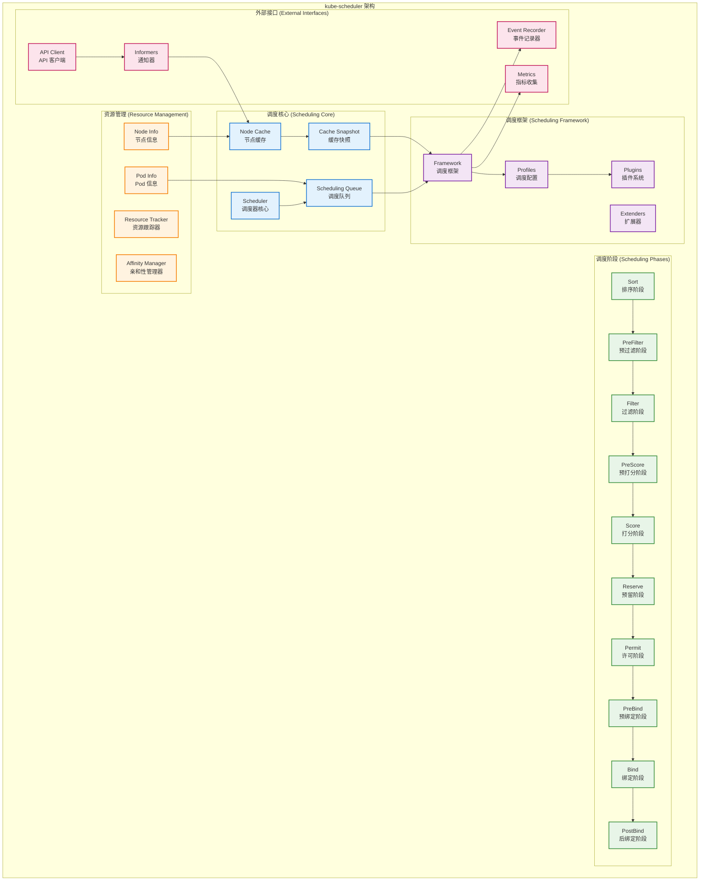
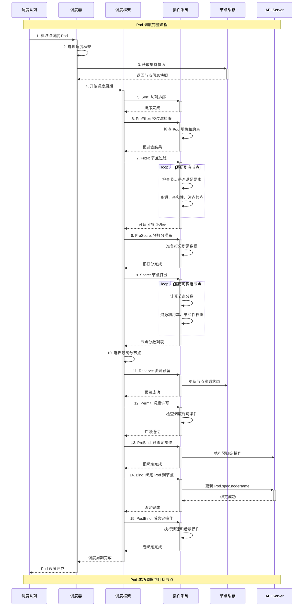
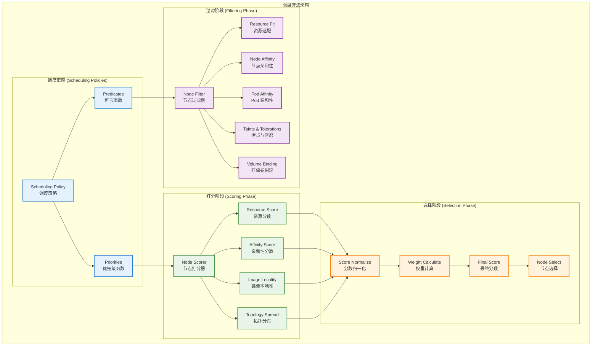
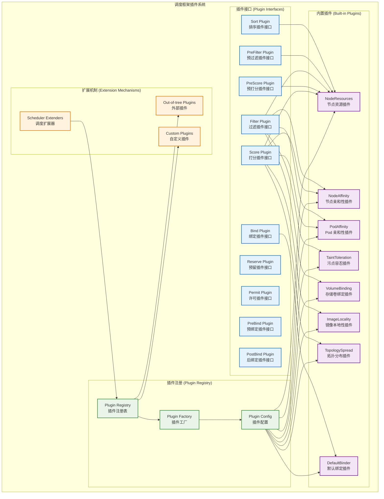

## 📚 文档概述

本文档深入分析 Kubernetes Scheduler 的架构设计、源码实现和调度算法。Scheduler 是 Kubernetes 集群的"调度大脑"，负责将 Pod 调度到最合适的节点上，是实现资源优化配置和负载均衡的核心组件。

## 🏗️ Scheduler 整体架构

### 1.1 调度器架构设计



### 1.2 调度流程时序图



## 🚀 启动流程详细分析

### 2.1 Scheduler 启动入口

```go
// cmd/kube-scheduler/scheduler.go
/*
Scheduler 主入口文件
负责初始化和启动调度器服务

主要职责：
1. 创建 Cobra 命令对象
2. 解析命令行参数和配置
3. 启动调度器主循环
*/
package main

import (
    "os"

    "k8s.io/component-base/cli"
    _ "k8s.io/component-base/logs/json/register" // JSON 日志格式注册
    _ "k8s.io/component-base/metrics/prometheus/clientgo"
    _ "k8s.io/component-base/metrics/prometheus/version" // 版本指标注册
    "k8s.io/kubernetes/cmd/kube-scheduler/app"
)

/*
main 函数是 Scheduler 的程序入口点

执行流程：
1. 创建调度器命令对象
2. 通过 CLI 框架执行命令
3. 根据执行结果退出程序

返回值：
- 程序退出码（0 表示成功，非 0 表示失败）
*/
func main() {
    // 创建调度器命令对象
    command := app.NewSchedulerCommand()
    
    // 执行命令，启动调度器
    code := cli.Run(command)
    
    // 根据执行结果退出程序
    os.Exit(code)
}
```

### 2.2 调度器核心结构

```go
// pkg/scheduler/scheduler.go
/*
Scheduler 结构体定义了调度器的核心组件和功能

主要功能：
1. 监听未调度的 Pod
2. 为 Pod 寻找合适的节点
3. 将绑定信息写回 API Server
4. 处理调度失败和重试
*/

/*
Scheduler 调度器核心结构体

字段说明：
- Cache: 节点和 Pod 信息的本地缓存
- Extenders: 外部调度扩展器列表
- NextPod: 获取下一个待调度 Pod 的函数
- FailureHandler: 调度失败处理函数
- SchedulePod: Pod 调度核心函数
- SchedulingQueue: 调度队列，存储待调度的 Pod
- Profiles: 调度配置文件映射
- client: Kubernetes API 客户端
- percentageOfNodesToScore: 参与打分的节点百分比
*/
type Scheduler struct {
    // 预期通过 Cache 进行的更改将被 NodeLister 和 Algorithm 观察到
    Cache internalcache.Cache

    // 外部调度扩展器
    Extenders []fwk.Extender

    // NextPod 应该是一个阻塞函数，直到下一个 Pod 可用
    // 我们不使用通道，因为调度一个 Pod 可能需要一些时间，
    // 我们不希望 Pod 在通道中等待时变得陈旧
    NextPod func(logger klog.Logger) (*framework.QueuedPodInfo, error)

    // FailureHandler 在调度失败时被调用
    FailureHandler FailureHandlerFn

    // SchedulePod 尝试将给定的 Pod 调度到节点列表中的一个节点
    // 成功时返回带有建议主机名称的 ScheduleResult 结构，
    // 否则将返回带有原因的 FitError
    SchedulePod func(ctx context.Context, fwk framework.Framework, state fwk.CycleState, pod *v1.Pod) (ScheduleResult, error)

    // 关闭此通道以关闭调度器
    StopEverything <-chan struct{}

    // SchedulingQueue 保存要调度的 Pod
    SchedulingQueue internalqueue.SchedulingQueue

    // API 调度器，用于异步 API 调用
    APIDispatcher *apidispatcher.APIDispatcher

    // Profiles 是调度配置文件
    Profiles profile.Map

    // Kubernetes API 客户端
    client clientset.Interface

    // 节点信息快照
    nodeInfoSnapshot *internalcache.Snapshot

    // 参与打分的节点百分比
    percentageOfNodesToScore int32

    // 下一个开始节点索引（用于负载均衡）
    nextStartNodeIndex int

    // 日志记录器，创建 Scheduler 时必须初始化
    logger klog.Logger

    // 已注册的处理器，用于检查所有处理器是否已完成同步
    registeredHandlers []cache.ResourceEventHandlerRegistration

    // 是否启用提名节点名称期望功能
    nominatedNodeNameForExpectationEnabled bool
}

/*
applyDefaultHandlers 应用默认的处理器

功能说明：
1. 设置默认的 Pod 调度函数
2. 设置默认的失败处理函数
3. 初始化调度器的核心功能
*/
func (sched *Scheduler) applyDefaultHandlers() {
    // 设置默认的 Pod 调度函数
    sched.SchedulePod = sched.schedulePod
    
    // 设置默认的失败处理函数
    sched.FailureHandler = sched.handleSchedulingFailure
}
```

### 2.3 调度器运行主循环

```go
/*
Run 启动调度器的主运行循环

参数：
- ctx: 上下文对象，用于控制生命周期

工作流程：
1. 等待缓存同步完成
2. 启动调度主循环
3. 处理停止信号
4. 清理资源
*/
func (sched *Scheduler) Run(ctx context.Context) {
    // 等待所有事件处理器完成同步
    sched.logger.Info("等待缓存同步")
    if !cache.WaitForCacheSync(ctx.Done(), sched.registeredHandlers...) {
        sched.logger.Error(nil, "无法同步缓存")
        return
    }
    sched.logger.Info("缓存同步完成，开始调度")

    // 启动调度主循环
    wait.UntilWithContext(ctx, sched.ScheduleOne, 0)
}

/*
ScheduleOne 执行单个 Pod 的完整调度工作流程

参数：
- ctx: 上下文对象

工作流程：
1. 从队列获取待调度的 Pod
2. 选择合适的调度框架
3. 执行调度算法
4. 处理调度结果
5. 更新调度队列状态
*/
func (sched *Scheduler) ScheduleOne(ctx context.Context) {
    logger := klog.FromContext(ctx)
    
    // 1. 从调度队列获取下一个 Pod
    podInfo, err := sched.NextPod(logger)
    if err != nil {
        utilruntime.HandleErrorWithContext(ctx, err, "从调度队列检索下一个 Pod 时出错")
        return
    }
    
    // Pod 可能为 nil，当 schedulerQueue 关闭时
    if podInfo == nil || podInfo.Pod == nil {
        return
    }

    pod := podInfo.Pod
    logger = klog.LoggerWithValues(logger, "pod", klog.KObj(pod))
    ctx = klog.NewContext(ctx, logger)
    logger.V(4).Info("准备尝试调度 Pod", "pod", klog.KObj(pod))

    // 2. 为 Pod 选择调度框架
    fwk, err := sched.frameworkForPod(pod)
    if err != nil {
        // 这不应该发生，因为我们只接受调度那些指定了
        // 与某个配置文件匹配的调度器名称的 Pod
        logger.Error(err, "发生错误")
        sched.SchedulingQueue.Done(pod.UID)
        return
    }
    
    // 3. 检查是否应该跳过此 Pod 的调度
    if sched.skipPodSchedule(ctx, fwk, pod) {
        // 我们不将此 Pod 放回队列，但必须清理正在处理的 Pod/事件
        sched.SchedulingQueue.Done(pod.UID)
        return
    }

    logger.V(3).Info("尝试调度 Pod", "pod", klog.KObj(pod))

    // 4. 执行调度算法
    start := time.Now()
    state := framework.NewCycleState()
    state.SetRecordPluginMetrics(rand.Intn(100) < pluginMetricsSamplePercent)

    // 初始化 Pod 的调度上下文
    schedulingCycleCtx, cancel := context.WithCancel(ctx)
    defer cancel()

    // 执行调度
    scheduleResult, err := sched.SchedulePod(schedulingCycleCtx, fwk, state, pod)
    if err != nil {
        // 5. 处理调度失败
        sched.handleSchedulingFailure(ctx, fwk, podInfo, err, v1.PodReasonUnschedulable, clearNominatedNode)
        return
    }
    
    // 6. 记录调度成功的指标
    metrics.SchedulingAlgorithmLatency.Observe(metrics.SinceInSeconds(start))
    metrics.DeprecatedSchedulingAlgorithmLatency.Observe(metrics.SinceInMicroseconds(start))

    // 7. 告诉缓存假设一个 Pod 现在正在运行在给定节点上，
    // 即使它还没有被绑定
    // 这允许我们在等待绑定发生时继续调度，而不会过度提交资源
    assumedPodInfo := podInfo.DeepCopy()
    assumedPod := assumedPodInfo.Pod
    
    // 假设：在实际绑定之前，我们假设 Pod 已经运行在选定的节点上
    err = sched.assume(assumedPod, scheduleResult.SuggestedHost)
    if err != nil {
        // 这通常不会发生，因为我们只是从缓存中获取了节点
        // 但是如果节点被删除了，可能会发生这种情况
        logger.Error(err, "调度器缓存中假设 Pod 失败")
        sched.handleSchedulingFailure(ctx, fwk, assumedPodInfo, err, v1.PodReasonSchedulerError, clearNominatedNode)
        return
    }

    // 8. 异步运行 "permit" 插件
    runPermitStatus := fwk.RunPermitPlugins(schedulingCycleCtx, state, assumedPod, scheduleResult.SuggestedHost)
    if !runPermitStatus.IsWait() && !runPermitStatus.IsSuccess() {
        var reason string
        if runPermitStatus.IsUnschedulable() {
            reason = v1.PodReasonUnschedulable
        } else {
            reason = v1.PodReasonSchedulerError
        }
        
        // 撤销假设，因为 permit 插件拒绝了调度
        if forgetErr := sched.Cache.ForgetPod(assumedPod); forgetErr != nil {
            logger.Error(forgetErr, "调度器缓存中忘记 Pod 失败")
        }
        
        sched.handleSchedulingFailure(ctx, fwk, assumedPodInfo, runPermitStatus.AsError(), reason, clearNominatedNode)
        return
    }

    // 9. 异步绑定 Pod 到节点
    go func() {
        bindingCycleCtx, cancel := context.WithCancel(ctx)
        defer cancel()

        waitOnPermitStatus := fwk.WaitOnPermit(bindingCycleCtx, assumedPod)
        if !waitOnPermitStatus.IsSuccess() {
            var reason string
            if waitOnPermitStatus.IsUnschedulable() {
                reason = v1.PodReasonUnschedulable
            } else {
                reason = v1.PodReasonSchedulerError
            }
            
            // 撤销假设
            if forgetErr := sched.Cache.ForgetPod(assumedPod); forgetErr != nil {
                logger.Error(forgetErr, "调度器缓存中忘记 Pod 失败")
            }
            
            sched.handleSchedulingFailure(ctx, fwk, assumedPodInfo, waitOnPermitStatus.AsError(), reason, clearNominatedNode)
            return
        }

        // 执行绑定操作
        err := sched.bind(bindingCycleCtx, fwk, assumedPod, scheduleResult.SuggestedHost, state)
        if err != nil {
            // 绑定失败，撤销假设
            if forgetErr := sched.Cache.ForgetPod(assumedPod); forgetErr != nil {
                logger.Error(forgetErr, "调度器缓存中忘记 Pod 失败")
            }
            
            sched.handleSchedulingFailure(ctx, fwk, assumedPodInfo, err, v1.PodReasonSchedulerError, clearNominatedNode)
            return
        }

        // 绑定成功，完成调度
        logger.V(2).Info("成功绑定 Pod 到节点", "pod", klog.KObj(pod), "node", scheduleResult.SuggestedHost)
    }()
}
```

## 🎯 调度算法核心实现

### 3.1 调度算法架构



### 3.2 调度算法核心实现

```go
// pkg/scheduler/schedule_one.go
/*
schedulePod 是调度单个 Pod 的核心算法实现

参数：
- ctx: 上下文对象
- fwk: 调度框架
- state: 调度周期状态
- pod: 待调度的 Pod

返回值：
- ScheduleResult: 调度结果，包含建议的节点
- error: 调度过程中的错误

调度流程：
1. 运行 PreFilter 插件
2. 查找可行的节点（Filter 阶段）
3. 运行 PreScore 插件
4. 对可行节点进行打分（Score 阶段）
5. 选择最佳节点
*/
func (sched *Scheduler) schedulePod(ctx context.Context, fwk framework.Framework, state *framework.CycleState, pod *v1.Pod) (result ScheduleResult, err error) {
    trace := utiltrace.New("Scheduling", utiltrace.Field{Key: "namespace", Value: pod.Namespace}, utiltrace.Field{Key: "name", Value: pod.Name})
    defer trace.LogIfLong(100 * time.Millisecond)

    // 1. 运行 PreFilter 插件
    preFilterStatus := fwk.RunPreFilterPlugins(ctx, state, pod)
    if !preFilterStatus.IsSuccess() {
        return result, preFilterStatus.AsError()
    }

    // 2. 查找可行的节点（Filter 阶段）
    startTime := time.Now()
    feasibleNodes, diagnosis, err := sched.findNodesThatFitPod(ctx, fwk, state, pod)
    if err != nil {
        return result, err
    }
    trace.Step("Computing predicates done")

    // 3. 如果没有可行节点，返回错误
    if len(feasibleNodes) == 0 {
        return result, &framework.FitError{
            Pod:         pod,
            NumAllNodes: sched.nodeInfoSnapshot.NumNodes(),
            Diagnosis:   diagnosis,
        }
    }

    // 4. 记录过滤阶段的指标
    metrics.SchedulingAlgorithmPredicateEvaluationSecond.Observe(metrics.SinceInSeconds(startTime))
    metrics.DeprecatedSchedulingAlgorithmPredicateEvaluationSecond.Observe(metrics.SinceInMicroseconds(startTime))
    metrics.SchedulingLatency.WithLabelValues(metrics.PredicateEvaluation).Observe(metrics.SinceInSeconds(startTime))

    // 5. 如果只有一个可行节点，直接返回
    if len(feasibleNodes) == 1 {
        return ScheduleResult{
            SuggestedHost:  feasibleNodes[0].Name,
            EvaluatedNodes: 1 + len(diagnosis.NodeToStatusMap),
            FeasibleNodes:  1,
        }, nil
    }

    // 6. 运行 PreScore 插件
    preScoreStatus := fwk.RunPreScorePlugins(ctx, state, pod, feasibleNodes)
    if !preScoreStatus.IsSuccess() {
        return result, preScoreStatus.AsError()
    }

    // 7. 对可行节点进行打分（Score 阶段）
    startTime = time.Now()
    priorityList, err := prioritizeNodes(ctx, sched.Extenders, fwk, state, pod, feasibleNodes)
    if err != nil {
        return result, err
    }
    trace.Step("Prioritizing done")

    // 8. 记录打分阶段的指标
    metrics.SchedulingAlgorithmPriorityEvaluationSecond.Observe(metrics.SinceInSeconds(startTime))
    metrics.DeprecatedSchedulingAlgorithmPriorityEvaluationSecond.Observe(metrics.SinceInMicroseconds(startTime))
    metrics.SchedulingLatency.WithLabelValues(metrics.PriorityEvaluation).Observe(metrics.SinceInSeconds(startTime))

    // 9. 选择最佳节点
    host, err := selectHost(priorityList)
    trace.Step("Selecting host done")
    
    return ScheduleResult{
        SuggestedHost:  host,
        EvaluatedNodes: len(feasibleNodes) + len(diagnosis.NodeToStatusMap),
        FeasibleNodes:  len(feasibleNodes),
    }, err
}

/*
findNodesThatFitPod 查找适合调度 Pod 的节点

参数：
- ctx: 上下文对象
- fwk: 调度框架
- state: 调度周期状态
- pod: 待调度的 Pod

返回值：
- []*v1.Node: 可行节点列表
- framework.Diagnosis: 诊断信息
- error: 查找过程中的错误

过滤流程：
1. 获取所有节点信息
2. 并行运行 Filter 插件
3. 收集过滤结果和诊断信息
4. 返回可行节点列表
*/
func (sched *Scheduler) findNodesThatFitPod(ctx context.Context, fwk framework.Framework, state *framework.CycleState, pod *v1.Pod) ([]*v1.Node, framework.Diagnosis, error) {
    diagnosis := framework.Diagnosis{
        NodeToStatusMap:      make(framework.NodeToStatusMap),
        UnschedulablePlugins: sets.NewString(),
    }

    // 1. 获取所有节点信息
    allNodes, err := sched.nodeInfoSnapshot.NodeInfos().List()
    if err != nil {
        return nil, diagnosis, err
    }

    // 2. 如果没有节点，直接返回
    if len(allNodes) == 0 {
        return nil, diagnosis, ErrNoNodesAvailable
    }

    // 3. 并行运行 Filter 插件
    feasibleNodes := make([]*v1.Node, 0, len(allNodes))
    
    if !fwk.HasFilterPlugins() {
        // 如果没有过滤插件，所有节点都是可行的
        for _, nodeInfo := range allNodes {
            feasibleNodes = append(feasibleNodes, nodeInfo.Node())
        }
        return feasibleNodes, diagnosis, nil
    }

    // 4. 计算需要检查的节点数量
    numNodesToFind := sched.numFeasibleNodesToFind(int32(len(allNodes)))

    // 5. 并行过滤节点
    ctx, cancel := context.WithCancel(ctx)
    defer cancel()
    
    feasibleNodesLen := int32(0)
    processedNodes := int32(0)
    
    checkNode := func(i int) {
        // 检查是否已经找到足够的节点
        if sched.nextStartNodeIndex >= len(allNodes) {
            sched.nextStartNodeIndex = 0
        }
        
        nodeInfo := allNodes[(sched.nextStartNodeIndex+i)%len(allNodes)]
        node := nodeInfo.Node()
        
        // 运行 Filter 插件
        status := fwk.RunFilterPluginsWithNominatedPods(ctx, state, pod, nodeInfo)
        
        // 原子操作增加已处理节点数
        atomic.AddInt32(&processedNodes, 1)
        
        if status.IsSuccess() {
            // 节点通过过滤，添加到可行节点列表
            length := atomic.AddInt32(&feasibleNodesLen, 1)
            if length <= numNodesToFind {
                feasibleNodes = append(feasibleNodes, node)
            }
            
            // 如果找到足够的节点，取消其他协程
            if length > numNodesToFind {
                cancel()
            }
        } else {
            // 节点未通过过滤，记录诊断信息
            diagnosis.NodeToStatusMap[node.Name] = status
            diagnosis.UnschedulablePlugins.Insert(status.FailedPlugin())
        }
    }

    // 6. 使用工作池并行处理节点
    fwk.Parallelizer().Until(ctx, len(allNodes), checkNode, metrics.Filter)
    
    // 7. 更新下一个开始节点索引（用于负载均衡）
    sched.nextStartNodeIndex = (sched.nextStartNodeIndex + int(processedNodes)) % len(allNodes)

    // 8. 记录过滤指标
    feasibleNodesCount := int(feasibleNodesLen)
    metrics.FeasibleNodes.Observe(float64(feasibleNodesCount))

    return feasibleNodes, diagnosis, nil
}

/*
prioritizeNodes 对可行节点进行打分

参数：
- ctx: 上下文对象
- extenders: 外部扩展器列表
- fwk: 调度框架
- state: 调度周期状态
- pod: 待调度的 Pod
- feasibleNodes: 可行节点列表

返回值：
- []framework.NodePluginScores: 节点分数列表
- error: 打分过程中的错误

打分流程：
1. 运行框架内置的 Score 插件
2. 运行外部扩展器的打分逻辑
3. 合并和归一化分数
4. 返回最终的节点分数列表
*/
func prioritizeNodes(
    ctx context.Context,
    extenders []framework.Extender,
    fwk framework.Framework,
    state *framework.CycleState,
    pod *v1.Pod,
    feasibleNodes []*v1.Node,
) ([]framework.NodePluginScores, error) {
    // 1. 如果没有可行节点，返回空列表
    if len(feasibleNodes) == 0 {
        return nil, nil
    }

    // 2. 运行框架内置的 Score 插件
    scoresMap, scoreStatus := fwk.RunScorePlugins(ctx, state, pod, feasibleNodes)
    if !scoreStatus.IsSuccess() {
        return nil, scoreStatus.AsError()
    }

    // 3. 运行外部扩展器的打分逻辑
    if len(extenders) != 0 && feasibleNodes != nil {
        for i := range extenders {
            if !extenders[i].IsInterested(pod) {
                continue
            }
            
            // 调用外部扩展器
            prioritizedList, weight, err := extenders[i].Prioritize(pod, feasibleNodes)
            if err != nil {
                return nil, err
            }
            
            // 将外部扩展器的分数合并到总分中
            for j := range feasibleNodes {
                host := feasibleNodes[j].Name
                score, ok := prioritizedList[host]
                if !ok {
                    continue
                }
                
                if scoresMap[host] == nil {
                    scoresMap[host] = make(framework.PluginToNodeScores)
                }
                scoresMap[host][extenders[i].Name()] = int64(score * weight)
            }
        }
    }

    // 4. 将分数映射转换为节点分数列表
    result := make([]framework.NodePluginScores, 0, len(feasibleNodes))
    for i := range feasibleNodes {
        nodeName := feasibleNodes[i].Name
        result = append(result, framework.NodePluginScores{
            Name:   nodeName,
            Scores: scoresMap[nodeName],
        })
    }

    return result, nil
}

/*
selectHost 从打分结果中选择最佳节点

参数：
- nodeScoreList: 节点分数列表

返回值：
- string: 选中的节点名称
- error: 选择过程中的错误

选择逻辑：
1. 计算每个节点的总分
2. 找出最高分数
3. 如果有多个节点具有相同的最高分数，随机选择一个
4. 返回选中的节点名称
*/
func selectHost(nodeScoreList []framework.NodePluginScores) (string, error) {
    if len(nodeScoreList) == 0 {
        return "", fmt.Errorf("空的优先级列表")
    }
    
    // 1. 计算每个节点的总分并找出最高分
    maxScore := nodeScoreList[0].TotalScore()
    selected := nodeScoreList[0].Name
    cntOfMaxScore := 1
    
    for i := 1; i < len(nodeScoreList); i++ {
        score := nodeScoreList[i].TotalScore()
        if score > maxScore {
            // 找到更高分数的节点
            maxScore = score
            selected = nodeScoreList[i].Name
            cntOfMaxScore = 1
        } else if score == maxScore {
            // 找到相同分数的节点，随机选择
            cntOfMaxScore++
            if rand.Intn(cntOfMaxScore) == 0 {
                selected = nodeScoreList[i].Name
            }
        }
    }
    
    return selected, nil
}
```

## 🔌 插件系统详细分析

### 4.1 调度框架插件架构



### 4.2 核心插件实现示例

#### 4.2.1 NodeResources 插件

```go
// pkg/scheduler/framework/plugins/noderesources/fit.go
/*
NodeResourcesFit 插件实现节点资源适配检查

主要功能：
1. 检查节点是否有足够的资源来运行 Pod
2. 支持多种资源类型（CPU、内存、存储等）
3. 考虑已分配和请求的资源
4. 提供资源利用率打分
*/

/*
Fit 结构体实现 PreFilter、Filter 和 Score 插件接口

字段说明：
- handle: 调度框架句柄
- resourceAllocationScorer: 资源分配打分器
*/
type Fit struct {
    handle framework.Handle
    resourceAllocationScorer resourceAllocationScorer
}

/*
Name 返回插件名称

返回值：
- string: 插件名称 "NodeResourcesFit"
*/
func (f *Fit) Name() string {
    return Name
}

/*
PreFilter 预过滤阶段检查 Pod 的资源请求

参数：
- ctx: 上下文对象
- state: 调度周期状态
- pod: 待调度的 Pod

返回值：
- *framework.PreFilterResult: 预过滤结果
- *framework.Status: 执行状态

预过滤逻辑：
1. 计算 Pod 的资源请求
2. 检查集群是否有足够的总资源
3. 为后续过滤阶段准备数据
*/
func (f *Fit) PreFilter(ctx context.Context, state *framework.CycleState, pod *v1.Pod) (*framework.PreFilterResult, *framework.Status) {
    // 1. 计算 Pod 的资源请求
    podRequest := computePodResourceRequest(pod)
    if podRequest.IsEmpty() {
        // Pod 没有资源请求，跳过检查
        return nil, framework.NewStatus(framework.Success, "")
    }

    // 2. 将资源请求存储到状态中，供后续阶段使用
    state.Write(preFilterStateKey, &preFilterState{
        Resource: podRequest,
    })

    // 3. 检查集群是否有足够的总资源
    nodes := f.handle.SnapshotSharedLister().NodeInfos()
    totalResource := framework.Resource{}
    
    for _, nodeInfo := range nodes {
        if nodeInfo.Node() == nil {
            continue
        }
        
        // 累加所有节点的可分配资源
        totalResource.Add(nodeInfo.Allocatable)
    }

    // 4. 检查总资源是否足够
    if !totalResource.Fits(podRequest) {
        return nil, framework.NewStatus(framework.UnschedulableAndUnresolvable, 
            fmt.Sprintf("集群总资源不足: 需要 %v, 可用 %v", podRequest, totalResource))
    }

    return nil, framework.NewStatus(framework.Success, "")
}

/*
Filter 过滤阶段检查单个节点是否有足够资源

参数：
- ctx: 上下文对象
- state: 调度周期状态
- pod: 待调度的 Pod
- nodeInfo: 节点信息

返回值：
- *framework.Status: 过滤结果状态

过滤逻辑：
1. 从状态中获取 Pod 资源请求
2. 检查节点可分配资源
3. 检查是否有足够的剩余资源
4. 返回过滤结果
*/
func (f *Fit) Filter(ctx context.Context, state *framework.CycleState, pod *v1.Pod, nodeInfo *framework.NodeInfo) *framework.Status {
    // 1. 从状态中获取预过滤结果
    s, err := getPreFilterState(state)
    if err != nil {
        return framework.AsStatus(err)
    }

    // 2. 检查节点资源是否足够
    insufficientResources := fitsRequest(s.Resource, nodeInfo)
    
    if len(insufficientResources) != 0 {
        // 3. 资源不足，返回失败状态
        failureReasons := make([]string, 0, len(insufficientResources))
        for _, r := range insufficientResources {
            failureReasons = append(failureReasons, fmt.Sprintf("资源不足: %v", r.String()))
        }
        
        return framework.NewStatus(framework.Unschedulable, strings.Join(failureReasons, ", "))
    }

    return framework.NewStatus(framework.Success, "")
}

/*
Score 打分阶段计算节点资源利用率分数

参数：
- ctx: 上下文对象
- state: 调度周期状态
- pod: 待调度的 Pod
- nodeName: 节点名称

返回值：
- int64: 节点分数（0-100）
- *framework.Status: 执行状态

打分逻辑：
1. 获取节点信息
2. 计算资源利用率
3. 根据配置的打分策略计算分数
4. 返回标准化后的分数
*/
func (f *Fit) Score(ctx context.Context, state *framework.CycleState, pod *v1.Pod, nodeName string) (int64, *framework.Status) {
    // 1. 获取节点信息
    nodeInfo, err := f.handle.SnapshotSharedLister().NodeInfos().Get(nodeName)
    if err != nil {
        return 0, framework.AsStatus(fmt.Errorf("获取节点 %q 信息失败: %w", nodeName, err))
    }

    // 2. 从状态中获取 Pod 资源请求
    s, err := getPreFilterState(state)
    if err != nil {
        return 0, framework.AsStatus(err)
    }

    // 3. 使用资源分配打分器计算分数
    return f.resourceAllocationScorer.score(pod, nodeInfo, s.Resource)
}

/*
ScoreExtensions 返回打分扩展接口

返回值：
- framework.ScoreExtensions: 打分扩展接口
*/
func (f *Fit) ScoreExtensions() framework.ScoreExtensions {
    return f
}

/*
NormalizeScore 标准化分数到 0-100 范围

参数：
- ctx: 上下文对象
- state: 调度周期状态
- pod: 待调度的 Pod
- scores: 节点分数映射

返回值：
- *framework.Status: 执行状态

标准化逻辑：
1. 找出最高和最低分数
2. 计算分数范围
3. 将所有分数标准化到 0-100 范围
4. 更新分数映射
*/
func (f *Fit) NormalizeScore(ctx context.Context, state *framework.CycleState, pod *v1.Pod, scores framework.NodeScoreList) *framework.Status {
    return helper.DefaultNormalizeScore(framework.MaxNodeScore, false, scores)
}

/*
computePodResourceRequest 计算 Pod 的资源请求

参数：
- pod: Pod 对象

返回值：
- *framework.Resource: Pod 的总资源请求

计算逻辑：
1. 遍历 Pod 中的所有容器
2. 累加每个容器的资源请求
3. 考虑 Init 容器的资源需求
4. 返回总的资源请求
*/
func computePodResourceRequest(pod *v1.Pod) *framework.Resource {
    result := &framework.Resource{}
    
    // 1. 计算普通容器的资源请求
    for _, container := range pod.Spec.Containers {
        result.Add(container.Resources.Requests)
    }
    
    // 2. 考虑 Init 容器的资源需求
    // Init 容器是串行执行的，所以取最大值
    for _, container := range pod.Spec.InitContainers {
        containerResource := framework.NewResource(container.Resources.Requests)
        result.SetMaxResource(containerResource)
    }
    
    // 3. 添加 Pod 级别的开销
    if pod.Spec.Overhead != nil {
        result.Add(pod.Spec.Overhead)
    }
    
    return result
}

/*
fitsRequest 检查节点是否能满足资源请求

参数：
- podRequest: Pod 资源请求
- nodeInfo: 节点信息

返回值：
- []InsufficientResource: 不足的资源列表

检查逻辑：
1. 计算节点剩余可分配资源
2. 检查每种资源类型是否足够
3. 记录不足的资源
4. 返回不足资源列表
*/
func fitsRequest(podRequest *framework.Resource, nodeInfo *framework.NodeInfo) []InsufficientResource {
    insufficientResources := make([]InsufficientResource, 0, 4)
    
    // 1. 计算节点剩余资源
    allowedPodNumber := nodeInfo.Allocatable.AllowedPodNumber
    if len(nodeInfo.Pods)+1 > allowedPodNumber {
        insufficientResources = append(insufficientResources, InsufficientResource{
            ResourceName: v1.ResourcePods,
            Reason:       "节点 Pod 数量已达上限",
            Requested:    1,
            Used:         len(nodeInfo.Pods),
            Capacity:     allowedPodNumber,
        })
    }
    
    // 2. 检查各种资源类型
    if podRequest.MilliCPU > (nodeInfo.Allocatable.MilliCPU - nodeInfo.Requested.MilliCPU) {
        insufficientResources = append(insufficientResources, InsufficientResource{
            ResourceName: v1.ResourceCPU,
            Reason:       "CPU 资源不足",
            Requested:    podRequest.MilliCPU,
            Used:         nodeInfo.Requested.MilliCPU,
            Capacity:     nodeInfo.Allocatable.MilliCPU,
        })
    }
    
    if podRequest.Memory > (nodeInfo.Allocatable.Memory - nodeInfo.Requested.Memory) {
        insufficientResources = append(insufficientResources, InsufficientResource{
            ResourceName: v1.ResourceMemory,
            Reason:       "内存资源不足",
            Requested:    podRequest.Memory,
            Used:         nodeInfo.Requested.Memory,
            Capacity:     nodeInfo.Allocatable.Memory,
        })
    }
    
    // 3. 检查扩展资源
    for rName, rQuant := range podRequest.ScalarResources {
        if rQuant > (nodeInfo.Allocatable.ScalarResources[rName] - nodeInfo.Requested.ScalarResources[rName]) {
            insufficientResources = append(insufficientResources, InsufficientResource{
                ResourceName: rName,
                Reason:       fmt.Sprintf("%s 资源不足", rName),
                Requested:    rQuant,
                Used:         nodeInfo.Requested.ScalarResources[rName],
                Capacity:     nodeInfo.Allocatable.ScalarResources[rName],
            })
        }
    }
    
    return insufficientResources
}
```

## 📊 调度器监控和性能优化

### 5.1 调度器指标监控

```yaml
# Scheduler 监控配置
apiVersion: v1
kind: ServiceMonitor
metadata:
  name: kube-scheduler
  namespace: kube-system
spec:
  selector:
    matchLabels:
      component: kube-scheduler
  endpoints:
  - port: https
    scheme: https
    tlsConfig:
      caFile: /var/run/secrets/kubernetes.io/serviceaccount/ca.crt
      serverName: kube-scheduler
      insecureSkipVerify: false
    bearerTokenFile: /var/run/secrets/kubernetes.io/serviceaccount/token
    interval: 30s
    path: /metrics
    
---
# 调度器关键指标告警规则
apiVersion: monitoring.coreos.com/v1
kind: PrometheusRule
metadata:
  name: kube-scheduler-alerts
  namespace: kube-system
spec:
  groups:
  - name: kube-scheduler.rules
    rules:
    # Scheduler 可用性告警
    - alert: KubeSchedulerDown
      expr: up{job="kube-scheduler"} == 0
      for: 5m
      labels:
        severity: critical
      annotations:
        summary: "Kubernetes Scheduler 不可用"
        description: "Scheduler {{ $labels.instance }} 已经宕机超过 5 分钟"
    
    # 调度延迟告警
    - alert: KubeSchedulerHighLatency
      expr: |
        histogram_quantile(0.99, sum(rate(scheduler_scheduling_algorithm_duration_seconds_bucket{job="kube-scheduler"}[5m])) by (le)) > 1
      for: 10m
      labels:
        severity: warning
      annotations:
        summary: "Scheduler 调度延迟过高"
        description: "Scheduler 调度算法 99% 分位延迟为 {{ $value }} 秒"
    
    # 调度失败率告警
    - alert: KubeSchedulerHighFailureRate
      expr: |
        sum(rate(scheduler_schedule_attempts_total{result="error",job="kube-scheduler"}[5m])) / sum(rate(scheduler_schedule_attempts_total{job="kube-scheduler"}[5m])) > 0.1
      for: 10m
      labels:
        severity: warning
      annotations:
        summary: "Scheduler 调度失败率过高"
        description: "Scheduler 调度失败率为 {{ $value | humanizePercentage }}"
    
    # 调度队列深度告警
    - alert: KubeSchedulerQueueDepth
      expr: |
        scheduler_pending_pods{job="kube-scheduler",queue="active"} > 100
      for: 5m
      labels:
        severity: warning
      annotations:
        summary: "Scheduler 调度队列深度过高"
        description: "Scheduler 活跃队列中有 {{ $value }} 个待调度 Pod"
    
    # 不可调度 Pod 告警
    - alert: KubeSchedulerUnschedulablePods
      expr: |
        scheduler_pending_pods{job="kube-scheduler",queue="unschedulable"} > 50
      for: 10m
      labels:
        severity: warning
      annotations:
        summary: "Scheduler 不可调度 Pod 过多"
        description: "Scheduler 不可调度队列中有 {{ $value }} 个 Pod"
    
    # 调度器插件错误告警
    - alert: KubeSchedulerPluginErrors
      expr: |
        increase(scheduler_plugin_execution_duration_seconds_count{result="error",job="kube-scheduler"}[5m]) > 10
      for: 5m
      labels:
        severity: warning
      annotations:
        summary: "Scheduler 插件执行错误过多"
        description: "Scheduler 插件 {{ $labels.plugin }} 在过去 5 分钟内执行失败 {{ $value }} 次"
```

### 5.2 调度器性能优化配置

```yaml
# Scheduler 高性能配置
apiVersion: v1
kind: Pod
metadata:
  name: kube-scheduler
  namespace: kube-system
spec:
  containers:
  - name: kube-scheduler
    image: k8s.gcr.io/kube-scheduler:v1.29.0
    command:
    - kube-scheduler
    
    # 基础配置
    - --bind-address=0.0.0.0
    - --secure-port=10259
    - --port=0
    
    # 领导选举配置
    - --leader-elect=true
    - --leader-elect-lease-duration=15s
    - --leader-elect-renew-deadline=10s
    - --leader-elect-retry-period=2s
    
    # 调度性能配置
    - --kube-api-qps=100                    # API 请求 QPS 限制
    - --kube-api-burst=100                  # API 请求突发限制
    - --percentage-of-nodes-to-score=50     # 参与打分的节点百分比
    
    # 配置文件
    - --config=/etc/kubernetes/scheduler-config.yaml
    
    # 认证配置
    - --authentication-kubeconfig=/etc/kubernetes/scheduler.conf
    - --authorization-kubeconfig=/etc/kubernetes/scheduler.conf
    - --kubeconfig=/etc/kubernetes/scheduler.conf
    
    # TLS 配置
    - --tls-cert-file=/etc/kubernetes/pki/kube-scheduler.crt
    - --tls-private-key-file=/etc/kubernetes/pki/kube-scheduler.key
    
    # 日志配置
    - --v=2                                 # 日志级别
    - --logtostderr=true                    # 输出到标准错误
    
    # 资源配置
    resources:
      requests:
        cpu: 100m
        memory: 128Mi
      limits:
        cpu: 500m
        memory: 512Mi
    
    # 存储卷挂载
    volumeMounts:
    - name: config
      mountPath: /etc/kubernetes/scheduler-config.yaml
      readOnly: true
    - name: kubeconfig
      mountPath: /etc/kubernetes/scheduler.conf
      readOnly: true
    - name: k8s-certs
      mountPath: /etc/kubernetes/pki
      readOnly: true
      
  # 主机网络模式
  hostNetwork: true
  
  # 优先级类
  priorityClassName: system-node-critical
  
  # 存储卷定义
  volumes:
  - name: config
    configMap:
      name: scheduler-config
  - name: kubeconfig
    hostPath:
      path: /etc/kubernetes/scheduler.conf
      type: File
  - name: k8s-certs
    hostPath:
      path: /etc/kubernetes/pki
      type: DirectoryOrCreate

---
# 调度器配置文件
apiVersion: v1
kind: ConfigMap
metadata:
  name: scheduler-config
  namespace: kube-system
data:
  scheduler-config.yaml: |
    apiVersion: kubescheduler.config.k8s.io/v1beta3
    kind: KubeSchedulerConfiguration
    
    # 调度配置文件
    profiles:
    - schedulerName: default-scheduler
      plugins:
        # 启用的插件
        queueSort:
          enabled:
          - name: PrioritySort
        preFilter:
          enabled:
          - name: NodeResourcesFit
          - name: NodeAffinity
          - name: PodTopologySpread
          - name: InterPodAffinity
          - name: VolumeBinding
          - name: NodePorts
        filter:
          enabled:
          - name: NodeUnschedulable
          - name: NodeName
          - name: TaintToleration
          - name: NodeAffinity
          - name: NodePorts
          - name: NodeResourcesFit
          - name: VolumeRestrictions
          - name: EBSLimits
          - name: GCEPDLimits
          - name: NodeVolumeLimits
          - name: AzureDiskLimits
          - name: VolumeBinding
          - name: VolumeZone
          - name: PodTopologySpread
          - name: InterPodAffinity
        postFilter:
          enabled:
          - name: DefaultPreemption
        preScore:
          enabled:
          - name: InterPodAffinity
          - name: PodTopologySpread
          - name: TaintToleration
          - name: NodeAffinity
          - name: NodeResourcesFit
        score:
          enabled:
          - name: NodeResourcesFit
            weight: 1
          - name: InterPodAffinity
            weight: 1
          - name: NodeAffinity
            weight: 1
          - name: PodTopologySpread
            weight: 2
          - name: TaintToleration
            weight: 1
          - name: ImageLocality
            weight: 1
        reserve:
          enabled:
          - name: VolumeBinding
        permit:
          enabled: []
        preBind:
          enabled:
          - name: VolumeBinding
        bind:
          enabled:
          - name: DefaultBinder
        postBind:
          enabled: []
      
      # 插件配置
      pluginConfig:
      - name: NodeResourcesFit
        args:
          scoringStrategy:
            type: LeastAllocated    # 最少分配策略
            resources:
            - name: cpu
              weight: 1
            - name: memory
              weight: 1
      
      - name: PodTopologySpread
        args:
          defaultingType: List
          defaultConstraints:
          - maxSkew: 3
            topologyKey: topology.kubernetes.io/zone
            whenUnsatisfiable: ScheduleAnyway
          - maxSkew: 5
            topologyKey: kubernetes.io/hostname
            whenUnsatisfiable: ScheduleAnyway
      
      - name: InterPodAffinity
        args:
          hardPodAffinityWeight: 1
      
      - name: NodeAffinity
        args:
          addedAffinity:
            requiredDuringSchedulingIgnoredDuringExecution:
              nodeSelectorTerms:
              - matchExpressions:
                - key: kubernetes.io/arch
                  operator: In
                  values: ["amd64", "arm64"]
    
    # 扩展器配置
    extenders: []
    
    # 性能配置
    percentageOfNodesToScore: 50    # 参与打分的节点百分比
    podInitialBackoffSeconds: 1     # Pod 初始退避时间
    podMaxBackoffSeconds: 10        # Pod 最大退避时间
    
    # 并行配置
    parallelism: 16                 # 并行度
    
    # 领导选举配置
    leaderElection:
      leaderElect: true
      leaseDuration: 15s
      renewDeadline: 10s
      retryPeriod: 2s
      resourceLock: leases
      resourceName: kube-scheduler
      resourceNamespace: kube-system
```

## 📚 总结

### 核心特性总结

1. **插件化架构**：灵活的插件系统支持自定义调度逻辑
2. **多阶段调度**：完整的调度生命周期管理
3. **高性能设计**：并行处理和优化的算法实现
4. **可扩展性**：支持外部扩展器和自定义插件
5. **丰富的调度策略**：内置多种调度算法和策略

### 最佳实践建议

1. **性能调优**：合理配置节点打分百分比和并行度
2. **监控完善**：建立全面的调度指标监控体系
3. **插件优化**：根据集群特点选择和配置合适的插件
4. **资源管理**：合理设置资源请求和限制
5. **故障处理**：实现完善的调度失败处理和重试机制

通过深入理解 Scheduler 的架构和实现，我们能够更好地优化集群的资源分配和调度性能，构建高效稳定的 Kubernetes 集群。

---

**文档版本**: v1.0  
**最后更新**: 2025年09月27日  
**适用版本**: Kubernetes 1.29+
