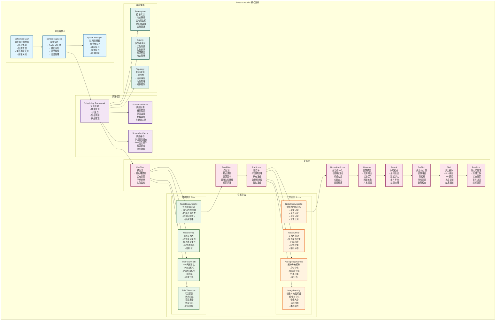
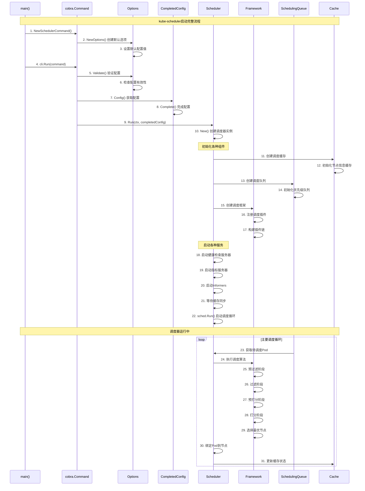

## 概述

kube-scheduler是Kubernetes集群的调度器，负责为新创建的Pod选择合适的节点。它通过一系列复杂的调度算法，考虑资源需求、硬件/软件/策略约束、亲和性和反亲和性规范、数据局部性、工作负载间干扰等因素，做出最优的调度决策。kube-scheduler的源码实现，揭示其精妙的调度机制。

<!--more-->

## 1. kube-scheduler架构设计

### 1.1 整体架构概览



### 1.2 核心数据结构

#### 1.2.1 Scheduler主结构体

```go
// Scheduler 调度器主结构体
// 文件路径: pkg/scheduler/scheduler.go
type Scheduler struct {
    // Cache 调度缓存，存储集群状态信息
    Cache internalcache.Cache
    
    // Extenders 调度器扩展器列表
    Extenders []framework.Extender
    
    // NextPod 获取下一个待调度Pod的函数
    NextPod func() *framework.QueuedPodInfo
    
    // Error 错误处理函数
    Error func(*framework.QueuedPodInfo, error)
    
    // StopEverything 停止所有操作的通道
    StopEverything <-chan struct{}
    
    // SchedulingQueue 调度队列
    SchedulingQueue internalqueue.SchedulingQueue
    
    // Profiles 调度配置文件映射
    // key: 调度器名称，value: 对应的Framework实例
    Profiles map[string]framework.Framework
    
    // client Kubernetes客户端
    client clientset.Interface
    
    // nodeInfoSnapshot 节点信息快照
    nodeInfoSnapshot *internalcache.Snapshot
    
    // percentageOfNodesToScore 需要打分的节点百分比
    percentageOfNodesToScore int32
    
    // nextStartNodeIndex 下次开始调度的节点索引
    nextStartNodeIndex int
}

// QueuedPodInfo 队列中的Pod信息
type QueuedPodInfo struct {
    // PodInfo Pod基础信息
    *framework.PodInfo
    
    // Timestamp Pod入队时间
    Timestamp time.Time
    
    // Attempts 调度尝试次数
    Attempts int
    
    // InitialAttemptTimestamp 首次调度尝试时间
    InitialAttemptTimestamp time.Time
}

// PodInfo Pod信息结构体
type PodInfo struct {
    Pod *v1.Pod
    
    // RequiredAffinity 必须满足的亲和性条件
    RequiredAffinity *nodeaffinity.RequiredNodeAffinity
    
    // RequiredAntiAffinity 必须满足的反亲和性条件
    RequiredAntiAffinity *podaffinity.RequiredPodAntiAffinity
}
```

#### 1.2.2 调度框架结构体

```go
// Framework 调度框架接口
// 文件路径: pkg/scheduler/framework/interface.go
type Framework interface {
    // QueueSortFunc 返回队列排序函数
    QueueSortFunc() LessFunc
    
    // RunPreFilterPlugins 运行预过滤插件
    RunPreFilterPlugins(ctx context.Context, state *CycleState, pod *v1.Pod) (status *Status)
    
    // RunFilterPlugins 运行过滤插件
    RunFilterPlugins(ctx context.Context, state *CycleState, pod *v1.Pod, nodeInfo *NodeInfo) PluginToStatus
    
    // RunPostFilterPlugins 运行后过滤插件
    RunPostFilterPlugins(ctx context.Context, state *CycleState, pod *v1.Pod, filteredNodeStatusMap NodeToStatusMap) (*PostFilterResult, *Status)
    
    // RunPreScorePlugins 运行预打分插件
    RunPreScorePlugins(ctx context.Context, state *CycleState, pod *v1.Pod, nodes []*v1.Node) *Status
    
    // RunScorePlugins 运行打分插件
    RunScorePlugins(ctx context.Context, state *CycleState, pod *v1.Pod, nodes []*v1.Node) (PluginToNodeScores, *Status)
    
    // RunNormalizeScorePlugins 运行分数归一化插件
    RunNormalizeScorePlugins(ctx context.Context, state *CycleState, pod *v1.Pod, scores NodeScoreList) *Status
    
    // RunReservePlugins 运行资源预留插件
    RunReservePlugins(ctx context.Context, state *CycleState, pod *v1.Pod, nodeName string) *Status
    
    // RunUnreservePlugins 运行资源释放插件
    RunUnreservePlugins(ctx context.Context, state *CycleState, pod *v1.Pod, nodeName string)
    
    // RunPermitPlugins 运行许可插件
    RunPermitPlugins(ctx context.Context, state *CycleState, pod *v1.Pod, nodeName string) *Status
    
    // RunPreBindPlugins 运行绑定前插件
    RunPreBindPlugins(ctx context.Context, state *CycleState, pod *v1.Pod, nodeName string) *Status
    
    // RunBindPlugins 运行绑定插件
    RunBindPlugins(ctx context.Context, state *CycleState, pod *v1.Pod, nodeName string) *Status
    
    // RunPostBindPlugins 运行绑定后插件
    RunPostBindPlugins(ctx context.Context, state *CycleState, pod *v1.Pod, nodeName string)
    
    // HasFilterPlugins 检查是否有过滤插件
    HasFilterPlugins() bool
    
    // HasPostFilterPlugins 检查是否有后过滤插件
    HasPostFilterPlugins() bool
    
    // HasScorePlugins 检查是否有打分插件
    HasScorePlugins() bool
    
    // ListPlugins 列出所有插件
    ListPlugins() *config.Plugins
    
    // ProfileName 返回配置文件名称
    ProfileName() string
    
    // PercentageOfNodesToScore 返回需要打分的节点百分比
    PercentageOfNodesToScore() *int32
    
    // SetPodNominator 设置Pod提名器
    SetPodNominator(nominator PodNominator)
}

// frameworkImpl 调度框架实现
type frameworkImpl struct {
    registry              Registry
    snapshotSharedLister  SharedLister
    waitingPods          *waitingPodsMap
    scorePluginWeight    map[string]int
    queueSortPlugins     []QueueSortPlugin
    preFilterPlugins     []PreFilterPlugin
    filterPlugins        []FilterPlugin
    postFilterPlugins    []PostFilterPlugin
    preScorePlugins      []PreScorePlugin
    scorePlugins         []ScorePlugin
    reservePlugins       []ReservePlugin
    unreservePlugins     []UnreservePlugin
    permitPlugins        []PermitPlugin
    preBindPlugins       []PreBindPlugin
    bindPlugins          []BindPlugin
    postBindPlugins      []PostBindPlugin
    
    clientSet            clientset.Interface
    kubeConfig           *restclient.Config
    eventRecorder        events.EventRecorder
    informerFactory      informers.SharedInformerFactory
    
    metricsRecorder      *MetricsRecorder
    profileName          string
    percentageOfNodesToScore *int32
    podNominator         PodNominator
    
    extenders            []Extender
    
    parallelizer         parallelize.Parallelizer
    
    // 插件运行时状态
    pluginsNeeded        config.PluginSet
}
```

## 2. 启动流程深度解析

### 2.1 main函数入口

```go
// main kube-scheduler主函数入口
// 文件路径: cmd/kube-scheduler/scheduler.go
func main() {
    // 创建kube-scheduler命令对象
    command := app.NewSchedulerCommand()
    
    // 使用component-base的CLI运行器执行命令
    code := cli.Run(command)
    
    // 以返回的退出码结束程序
    os.Exit(code)
}
```

### 2.2 命令创建和配置

```go
// NewSchedulerCommand 创建调度器命令
// 文件路径: cmd/kube-scheduler/app/server.go
func NewSchedulerCommand(registryOptions ...Option) *cobra.Command {
    // 创建默认选项
    opts := options.NewOptions()

    cmd := &cobra.Command{
        Use: "kube-scheduler",
        Long: `The Kubernetes scheduler is a control plane process which assigns
Pods to Nodes. The scheduler determines which Nodes are valid placements for
each Pod in the scheduling queue according to constraints and available
resources. The scheduler then ranks each valid Node and binds the Pod to a
suitable Node. Multiple different schedulers may be used within a cluster;
kube-scheduler is the reference implementation.
See [scheduling](https://kubernetes.io/docs/concepts/scheduling-eviction/)
for more information about scheduling and the kube-scheduler component.`,

        // 禁用错误时的使用说明
        SilenceUsage: true,
        
        // 预运行钩子
        PersistentPreRunE: func(*cobra.Command, []string) error {
            // 设置默认的klog标志
            cliflag.PrintFlags(cmd.Flags())
            return nil
        },
        
        // 主运行函数
        RunE: func(cmd *cobra.Command, args []string) error {
            return runCommand(cmd, opts, registryOptions...)
        },
        
        Args: func(cmd *cobra.Command, args []string) error {
            for _, arg := range args {
                if len(arg) > 0 {
                    return fmt.Errorf("%q does not take any arguments, got %q", cmd.CommandPath(), args)
                }
            }
            return nil
        },
    }

    // 添加标志
    nfs := opts.Flags()
    verflag.AddFlags(nfs.FlagSet("global"))
    globalflag.AddGlobalFlags(nfs.FlagSet("global"), cmd.Name(), logs.SkipLoggingConfigurationFlags())
    
    fs := cmd.Flags()
    for _, f := range nfs.FlagSets {
        fs.AddFlagSet(f)
    }

    cols, _, _ := term.TerminalSize(cmd.OutOrStdout())
    cliflag.SetUsageAndHelpFunc(cmd, nfs, cols)

    return cmd
}

// runCommand 运行调度器命令
func runCommand(cmd *cobra.Command, opts *options.Options, registryOptions ...Option) error {
    verflag.PrintAndExitIfRequested()

    // 验证选项
    if errs := opts.Validate(); len(errs) > 0 {
        return utilerrors.NewAggregate(errs)
    }

    // 获取配置
    c, err := opts.Config()
    if err != nil {
        return err
    }

    // 完成配置
    cc := c.Complete()

    // 应用插件注册选项
    for _, option := range registryOptions {
        if err := option(cc.Registry); err != nil {
            return err
        }
    }

    // 获取调度器上下文
    ctx, cancel := context.WithCancel(context.Background())
    defer cancel()
    
    // 运行调度器
    return Run(ctx, cc)
}
```

### 2.3 调度器运行主流程

```go
// Run 运行调度器的主函数
// 文件路径: cmd/kube-scheduler/app/server.go
func Run(ctx context.Context, cc *schedulerserverconfig.CompletedConfig) error {
    // 记录调度器启动
    klog.InfoS("Starting Kubernetes Scheduler", "version", version.Get())

    // 创建调度器
    sched, err := scheduler.New(cc.Client,
        cc.InformerFactory,
        cc.DynInformerFactory,
        recorderFactory,
        ctx.Done(),
        scheduler.WithProfiles(cc.ComponentConfig.Profiles...),
        scheduler.WithAlgorithmSource(cc.ComponentConfig.AlgorithmSource),
        scheduler.WithPercentageOfNodesToScore(cc.ComponentConfig.PercentageOfNodesToScore),
        scheduler.WithFrameworkOutOfTreeRegistry(cc.Registry),
        scheduler.WithPodMaxBackoffSeconds(cc.ComponentConfig.PodMaxBackoffSeconds),
        scheduler.WithPodInitialBackoffSeconds(cc.ComponentConfig.PodInitialBackoffSeconds),
        scheduler.WithPodMaxInUnschedulablePodsDuration(cc.PodMaxInUnschedulablePodsDuration),
        scheduler.WithExtenders(cc.ComponentConfig.Extenders...),
        scheduler.WithParallelism(cc.ComponentConfig.Parallelism),
        scheduler.WithBuildFrameworkCapturer(func(profile kubeschedulerconfig.KubeSchedulerProfile) {
            // 捕获框架构建过程，用于调试
        }),
    )
    if err != nil {
        return err
    }

    // 准备事件广播器
    eventBroadcaster := events.NewBroadcaster(&events.EventSinkImpl{Interface: cc.Client.EventsV1()})
    sched.EventRecorder = eventBroadcaster.NewRecorder(scheme.Scheme, "kube-scheduler")
    eventBroadcaster.StartRecordingToSink(ctx.Done())

    // 设置健康检查
    if cc.SecureServing != nil {
        handler := buildHandlerChain(newHealthzAndMetricsHandler(&cc.ComponentConfig, cc.InformerFactory, sched), cc.Authentication.Authenticator, cc.Authorization.Authorizer)
        // 启动安全服务器
        if _, _, err := cc.SecureServing.Serve(handler, 0, ctx.Done()); err != nil {
            return fmt.Errorf("failed to start secure server: %v", err)
        }
    }

    // 启动所有informers
    cc.InformerFactory.Start(ctx.Done())
    cc.DynInformerFactory.Start(ctx.Done())

    // 等待缓存同步
    cc.InformerFactory.WaitForCacheSync(ctx.Done())
    cc.DynInformerFactory.WaitForCacheSync(ctx.Done())

    // 启动调度器
    sched.Run(ctx)
    return nil
}

// New 创建新的调度器实例
func New(client clientset.Interface,
    informerFactory informers.SharedInformerFactory,
    dynInformerFactory dynamicinformer.DynamicSharedInformerFactory,
    recorderFactory profile.RecorderFactory,
    stopCh <-chan struct{},
    opts ...Option) (*Scheduler, error) {

    // 设置默认选项
    options := defaultSchedulerOptions
    for _, opt := range opts {
        opt(&options)
    }

    // 创建调度缓存
    cache := internalcache.New(30*time.Second, stopCh)

    // 创建调度队列
    podQueue := internalqueue.NewSchedulingQueue(
        profiles[options.profiles[0].SchedulerName].QueueSortFunc(),
        informerFactory,
        internalqueue.WithPodInitialBackoffDuration(time.Duration(options.podInitialBackoffSeconds)*time.Second),
        internalqueue.WithPodMaxBackoffDuration(time.Duration(options.podMaxBackoffSeconds)*time.Second),
        internalqueue.WithPodLister(podLister),
        internalqueue.WithPodMaxInUnschedulablePodsDuration(options.podMaxInUnschedulablePodsDuration),
        internalqueue.WithPreEnqueuePluginMap(preEnqueuePluginMap),
        internalqueue.WithQueueingHintMapPerProfile(queueingHintsPerProfile),
        internalqueue.WithPluginMetricsSamplePercent(pluginMetricsSamplePercent),
        internalqueue.WithMetricsRecorder(*metricsRecorder),
    )

    // 创建调度器实例
    sched := &Scheduler{
        Cache:                    cache,
        client:                   client,
        nodeInfoSnapshot:         snapshot,
        percentageOfNodesToScore: options.percentageOfNodesToScore,
        Extenders:                extenders,
        StopEverything:           stopCh,
        SchedulingQueue:          podQueue,
        Profiles:                 profiles,
    }

    // 设置调度队列的调度器引用
    sched.SchedulingQueue.SetScheduler(sched)

    // 添加事件处理器
    addAllEventHandlers(sched, informerFactory, dynInformerFactory, unionedGVKs(queueingHintsPerProfile))

    return sched, nil
}
```

### 2.4 启动时序图



## 3. 调度算法核心实现

### 3.1 调度主循环

```go
// Run 运行调度器主循环
// 文件路径: pkg/scheduler/scheduler.go
func (sched *Scheduler) Run(ctx context.Context) {
    klog.InfoS("Starting Kubernetes Scheduler")
    
    // 启动调度队列
    sched.SchedulingQueue.Run()
    
    // 等待缓存同步
    if !cache.WaitForCacheSync(ctx.Done(), sched.Cache.HasSynced) {
        klog.ErrorS(nil, "Cannot sync cache")
        return
    }
    
    // 启动调度循环
    wait.UntilWithContext(ctx, sched.scheduleOne, 0)
    
    // 关闭调度队列
    sched.SchedulingQueue.Close()
    klog.InfoS("Shutting down Kubernetes Scheduler")
}

// scheduleOne 调度单个Pod的核心函数
func (sched *Scheduler) scheduleOne(ctx context.Context) {
    // 从调度队列获取下一个Pod
    podInfo := sched.NextPod()
    if podInfo == nil || podInfo.Pod == nil {
        return
    }
    pod := podInfo.Pod
    
    // 记录调度开始时间
    start := time.Now()
    defer func() {
        metrics.SchedulingAlgorithmLatency.Observe(metrics.SinceInSeconds(start))
    }()
    
    // 获取调度框架
    fwk, ok := sched.Profiles[pod.Spec.SchedulerName]
    if !ok {
        // 如果找不到对应的调度器，使用默认调度器
        klog.V(2).InfoS("Unable to find profile for scheduler name, using default profile", "pod", klog.KObj(pod), "schedulerName", pod.Spec.SchedulerName)
        fwk = sched.Profiles[v1.DefaultSchedulerName]
    }
    
    // 创建调度上下文
    state := framework.NewCycleState()
    state.SetRecordPluginMetrics(rand.Intn(100) < pluginMetricsSamplePercent)
    
    // 执行调度算法
    scheduleResult, err := sched.Algorithm.Schedule(ctx, fwk, state, pod)
    if err != nil {
        // 调度失败处理
        nominatedNode := ""
        if fitError, ok := err.(*framework.FitError); ok {
            if !fwk.HasPostFilterPlugins() {
                klog.V(3).InfoS("No PostFilter plugins are registered, so no preemption will be performed")
            } else {
                // 尝试抢占
                result, status := fwk.RunPostFilterPlugins(ctx, state, pod, fitError.Diagnosis.NodeToStatusMap)
                if status.Code() == framework.Error {
                    klog.ErrorS(nil, "Status after running PostFilter plugins for pod", "pod", klog.KObj(pod), "status", status)
                } else {
                    klog.V(5).InfoS("Status after running PostFilter plugins for pod", "pod", klog.KObj(pod), "status", status)
                    if result != nil {
                        nominatedNode = result.NominatedNodeName
                    }
                }
            }
            
            // 记录调度失败指标
            metrics.PodUnschedulable(fwk.ProfileName(), metrics.SinceInSeconds(start))
        } else if err == ErrNoNodesAvailable {
            nominatedNode = ""
            metrics.PodUnschedulable(fwk.ProfileName(), metrics.SinceInSeconds(start))
        } else {
            klog.ErrorS(err, "Error selecting node for pod", "pod", klog.KObj(pod))
            metrics.PodScheduleError(fwk.ProfileName(), metrics.SinceInSeconds(start))
        }
        
        // 处理调度失败
        sched.handleSchedulingFailure(ctx, fwk, podInfo, err, nominatedNode, start)
        return
    }
    
    // 调度成功，记录指标
    metrics.PodScheduled(fwk.ProfileName(), metrics.SinceInSeconds(start))
    metrics.PodSchedulingAttempts.Observe(float64(podInfo.Attempts))
    
    // 执行绑定操作
    err = sched.bind(ctx, fwk, pod, scheduleResult.SuggestedHost, state)
    if err != nil {
        // 绑定失败处理
        metrics.PodScheduleError(fwk.ProfileName(), metrics.SinceInSeconds(start))
        sched.handleBindingFailure(ctx, fwk, podInfo, scheduleResult, err, start)
        return
    }
    
    // 绑定成功
    klog.V(2).InfoS("Successfully bound pod to node", "pod", klog.KObj(pod), "node", scheduleResult.SuggestedHost, "evaluatedNodes", scheduleResult.EvaluatedNodes, "feasibleNodes", scheduleResult.FeasibleNodes)
}

// handleSchedulingFailure 处理调度失败
func (sched *Scheduler) handleSchedulingFailure(ctx context.Context, fwk framework.Framework, podInfo *framework.QueuedPodInfo, err error, nominatedNodeName string, start time.Time) {
    pod := podInfo.Pod
    
    // 更新Pod的调度失败状态
    if err == ErrNoNodesAvailable {
        klog.V(2).InfoS("Unable to schedule pod; no nodes are registered to the cluster; waiting", "pod", klog.KObj(pod))
    } else if fitError, ok := err.(*framework.FitError); ok {
        // 记录不适合的节点信息
        if sched.Error != nil {
            sched.Error(podInfo, err)
        }
        
        // 记录调度失败事件
        sched.Recorder.Eventf(pod, nil, v1.EventTypeWarning, "FailedScheduling", "Scheduling", err.Error())
        
        // 如果有提名节点，更新Pod状态
        if nominatedNodeName != "" {
            sched.SchedulingQueue.AddNominatedPod(podInfo.PodInfo, nominatedNodeName)
        }
    } else {
        klog.ErrorS(err, "Error selecting node for pod", "pod", klog.KObj(pod))
        if sched.Error != nil {
            sched.Error(podInfo, err)
        }
        sched.Recorder.Eventf(pod, nil, v1.EventTypeWarning, "FailedScheduling", "Scheduling", err.Error())
    }
    
    // 将Pod重新加入队列
    if err := sched.SchedulingQueue.AddUnschedulableIfNotPresent(podInfo, sched.SchedulingQueue.SchedulingCycle()); err != nil {
        klog.ErrorS(err, "Error occurred")
    }
}
```

### 3.2 调度算法实现

```go
// Schedule 执行调度算法选择节点
// 文件路径: pkg/scheduler/core/generic_scheduler.go
func (g *genericScheduler) Schedule(ctx context.Context, fwk framework.Framework, state *framework.CycleState, pod *v1.Pod) (result ScheduleResult, err error) {
    trace := utiltrace.New("Scheduling", utiltrace.Field{Key: "namespace", Value: pod.Namespace}, utiltrace.Field{Key: "name", Value: pod.Name})
    defer trace.LogIfLong(100 * time.Millisecond)
    
    // 获取节点列表快照
    if err := g.snapshot(); err != nil {
        return result, err
    }
    trace.Step("Snapshotting scheduler cache and node infos done")
    
    if g.nodeInfoSnapshot.NumNodes() == 0 {
        return result, ErrNoNodesAvailable
    }
    
    // 第一阶段：预过滤阶段
    // 运行PreFilter插件进行预处理
    preFilterStatus := fwk.RunPreFilterPlugins(ctx, state, pod)
    if !preFilterStatus.IsSuccess() {
        return result, preFilterStatus.AsError()
    }
    trace.Step("Running PreFilter plugins done")
    
    // 第二阶段：过滤阶段
    // 找出所有可调度的节点
    feasibleNodes, diagnosis, err := g.findNodesThatFitPod(ctx, fwk, state, pod)
    if err != nil {
        return result, err
    }
    trace.Step("Computing predicates done")
    
    // 如果没有可调度的节点，返回错误
    if len(feasibleNodes) == 0 {
        return result, &framework.FitError{
            Pod:         pod,
            NumAllNodes: g.nodeInfoSnapshot.NumNodes(),
            Diagnosis:   diagnosis,
        }
    }
    
    // 如果只有一个节点，直接返回
    if len(feasibleNodes) == 1 {
        return ScheduleResult{
            SuggestedHost:  feasibleNodes[0].Name,
            EvaluatedNodes: 1 + len(diagnosis.NodeToStatusMap),
            FeasibleNodes:  1,
        }, nil
    }
    
    // 第三阶段：打分阶段
    // 对可调度的节点进行打分
    priorityList, err := g.prioritizeNodes(ctx, fwk, state, pod, feasibleNodes)
    if err != nil {
        return result, err
    }
    
    // 选择得分最高的节点
    host, err := g.selectHost(priorityList)
    trace.Step("Prioritizing done")
    
    return ScheduleResult{
        SuggestedHost:  host,
        EvaluatedNodes: len(feasibleNodes) + len(diagnosis.NodeToStatusMap),
        FeasibleNodes:  len(feasibleNodes),
    }, err
}

// findNodesThatFitPod 找出适合Pod的节点
func (g *genericScheduler) findNodesThatFitPod(ctx context.Context, fwk framework.Framework, state *framework.CycleState, pod *v1.Pod) ([]*v1.Node, framework.Diagnosis, error) {
    diagnosis := framework.Diagnosis{
        NodeToStatusMap:      make(framework.NodeToStatusMap),
        UnschedulablePlugins: sets.NewString(),
    }
    
    // 获取所有节点
    allNodes, err := g.nodeInfoSnapshot.NodeInfos().List()
    if err != nil {
        return nil, diagnosis, err
    }
    
    // 计算需要检查的节点数量
    numNodesToFind := g.numFeasibleNodesToFind(int32(len(allNodes)))
    
    // 并发检查节点
    feasibleNodes := make([]*v1.Node, 0, numNodesToFind)
    if !fwk.HasFilterPlugins() {
        // 如果没有过滤插件，所有节点都是可调度的
        for _, nodeInfo := range allNodes {
            feasibleNodes = append(feasibleNodes, nodeInfo.Node())
        }
        return feasibleNodes, diagnosis, nil
    }
    
    // 并发过滤节点
    errCh := parallelize.NewErrorChannel()
    var statusesLock sync.Mutex
    var feasibleNodesLock sync.Mutex
    
    ctx, cancel := context.WithCancel(ctx)
    
    // 检查单个节点的函数
    checkNode := func(i int) {
        nodeInfo := allNodes[i]
        node := nodeInfo.Node()
        
        // 运行Filter插件
        status := fwk.RunFilterPluginsWithNominatedPods(ctx, state, pod, nodeInfo)
        if status.Code() == framework.Error {
            errCh.SendErrorWithCancel(status.AsError(), cancel)
            return
        }
        
        if status.IsSuccess() {
            // 节点通过过滤
            feasibleNodesLock.Lock()
            feasibleNodes = append(feasibleNodes, node)
            feasibleNodesLock.Unlock()
        } else {
            // 节点未通过过滤
            statusesLock.Lock()
            diagnosis.NodeToStatusMap[node.Name] = status
            diagnosis.UnschedulablePlugins.Insert(status.FailedPlugin())
            statusesLock.Unlock()
        }
    }
    
    // 并行执行节点检查
    fwk.Parallelizer().Until(ctx, len(allNodes), checkNode)
    if err := errCh.ReceiveError(); err != nil {
        return nil, diagnosis, err
    }
    
    return feasibleNodes, diagnosis, nil
}

// prioritizeNodes 对节点进行打分
func (g *genericScheduler) prioritizeNodes(ctx context.Context, fwk framework.Framework, state *framework.CycleState, pod *v1.Pod, feasibleNodes []*v1.Node) (framework.NodeScoreList, error) {
    // 如果没有打分插件，给所有节点相同分数
    if !fwk.HasScorePlugins() {
        result := make(framework.NodeScoreList, 0, len(feasibleNodes))
        for _, node := range feasibleNodes {
            result = append(result, framework.NodeScore{
                Name:  node.Name,
                Score: 1,
            })
        }
        return result, nil
    }
    
    // 运行PreScore插件
    preScoreStatus := fwk.RunPreScorePlugins(ctx, state, pod, feasibleNodes)
    if !preScoreStatus.IsSuccess() {
        return nil, preScoreStatus.AsError()
    }
    
    // 运行Score插件
    scoresMap, scoreStatus := fwk.RunScorePlugins(ctx, state, pod, feasibleNodes)
    if !scoreStatus.IsSuccess() {
        return nil, scoreStatus.AsError()
    }
    
    // 应用权重并归一化分数
    result := make(framework.NodeScoreList, 0, len(feasibleNodes))
    for _, node := range feasibleNodes {
        result = append(result, framework.NodeScore{Name: node.Name, Score: 0})
        for plugin, nodeScoreList := range scoresMap {
            weight := fwk.ScorePluginWeight(plugin)
            nodeScore := nodeScoreList[node.Name]
            result[len(result)-1].Score += nodeScore.Score * int64(weight)
        }
    }
    
    // 运行NormalizeScore插件
    if fwk.HasNormalizeScorePlugins() {
        normalizeStatus := fwk.RunNormalizeScorePlugins(ctx, state, pod, result)
        if !normalizeStatus.IsSuccess() {
            return nil, normalizeStatus.AsError()
        }
    }
    
    return result, nil
}

// selectHost 选择得分最高的节点
func (g *genericScheduler) selectHost(nodeScoreList framework.NodeScoreList) (string, error) {
    if len(nodeScoreList) == 0 {
        return "", fmt.Errorf("empty priorityList")
    }
    
    // 找出最高分数
    maxScore := nodeScoreList[0].Score
    selected := nodeScoreList[0].Name
    cntOfMaxScore := 1
    
    for _, ns := range nodeScoreList[1:] {
        if ns.Score > maxScore {
            maxScore = ns.Score
            selected = ns.Name
            cntOfMaxScore = 1
        } else if ns.Score == maxScore {
            cntOfMaxScore++
            // 随机选择一个最高分节点
            if rand.Intn(cntOfMaxScore) == 0 {
                selected = ns.Name
            }
        }
    }
    
    klog.V(2).InfoS("Selected node for pod", "node", selected, "score", maxScore)
    return selected, nil
}
```

## 4. 调度插件深度分析

### 4.1 NodeResourcesFit插件实现

```go
// NodeResourcesFit 节点资源适配插件
// 文件路径: pkg/scheduler/framework/plugins/noderesources/fit.go
type Fit struct {
    handle framework.Handle
    
    // ignoredResources 忽略的资源类型
    ignoredResources sets.String
    
    // ignoredResourceGroups 忽略的资源组
    ignoredResourceGroups sets.String
    
    // enableInPlacePodVerticalScaling 是否启用原地Pod垂直扩缩
    enableInPlacePodVerticalScaling bool
}

// Name 返回插件名称
func (f *Fit) Name() string {
    return Name
}

// Filter 实现过滤接口，检查节点资源是否满足Pod需求
func (f *Fit) Filter(ctx context.Context, state *framework.CycleState, pod *v1.Pod, nodeInfo *framework.NodeInfo) *framework.Status {
    // 检查节点资源是否足够
    return fitsRequest(pod, nodeInfo, f.ignoredResources, f.ignoredResourceGroups, f.enableInPlacePodVerticalScaling)
}

// fitsRequest 检查节点是否有足够的资源满足Pod请求
func fitsRequest(pod *v1.Pod, nodeInfo *framework.NodeInfo, ignoredExtendedResources, ignoredResourceGroups sets.String, enableInPlacePodVerticalScaling bool) *framework.Status {
    var insufficientResources []InsufficientResource
    
    // 计算Pod的资源请求
    podRequest := computePodResourceRequest(pod, enableInPlacePodVerticalScaling)
    
    // 检查每种资源类型
    allowedPodNumber := nodeInfo.Allocatable.AllowedPodNumber
    if len(nodeInfo.Pods)+1 > allowedPodNumber {
        insufficientResources = append(insufficientResources, InsufficientResource{
            ResourceName: v1.ResourcePods,
            Reason:       "Too many pods",
            Requested:    1,
            Used:         int64(len(nodeInfo.Pods)),
            Capacity:     int64(allowedPodNumber),
        })
    }
    
    // 检查CPU资源
    if podRequest.MilliCPU > (nodeInfo.Allocatable.MilliCPU - nodeInfo.Requested.MilliCPU) {
        insufficientResources = append(insufficientResources, InsufficientResource{
            ResourceName: v1.ResourceCPU,
            Reason:       "Insufficient cpu",
            Requested:    podRequest.MilliCPU,
            Used:         nodeInfo.Requested.MilliCPU,
            Capacity:     nodeInfo.Allocatable.MilliCPU,
        })
    }
    
    // 检查内存资源
    if podRequest.Memory > (nodeInfo.Allocatable.Memory - nodeInfo.Requested.Memory) {
        insufficientResources = append(insufficientResources, InsufficientResource{
            ResourceName: v1.ResourceMemory,
            Reason:       "Insufficient memory",
            Requested:    podRequest.Memory,
            Used:         nodeInfo.Requested.Memory,
            Capacity:     nodeInfo.Allocatable.Memory,
        })
    }
    
    // 检查临时存储资源
    if podRequest.EphemeralStorage > (nodeInfo.Allocatable.EphemeralStorage - nodeInfo.Requested.EphemeralStorage) {
        insufficientResources = append(insufficientResources, InsufficientResource{
            ResourceName: v1.ResourceEphemeralStorage,
            Reason:       "Insufficient ephemeral-storage",
            Requested:    podRequest.EphemeralStorage,
            Used:         nodeInfo.Requested.EphemeralStorage,
            Capacity:     nodeInfo.Allocatable.EphemeralStorage,
        })
    }
    
    // 检查扩展资源
    for rName, rQuant := range podRequest.ScalarResources {
        if v1helper.IsExtendedResourceName(rName) {
            // 跳过忽略的扩展资源
            if ignoredExtendedResources.Has(string(rName)) {
                continue
            }
            // 跳过忽略的资源组
            if ignoredResourceGroups.Has(strings.Split(string(rName), "/")[0]) {
                continue
            }
        }
        
        if rQuant > (nodeInfo.Allocatable.ScalarResources[rName] - nodeInfo.Requested.ScalarResources[rName]) {
            insufficientResources = append(insufficientResources, InsufficientResource{
                ResourceName: rName,
                Reason:       fmt.Sprintf("Insufficient %v", rName),
                Requested:    rQuant,
                Used:         nodeInfo.Requested.ScalarResources[rName],
                Capacity:     nodeInfo.Allocatable.ScalarResources[rName],
            })
        }
    }
    
    if len(insufficientResources) != 0 {
        // 构造失败状态
        failureReasons := make([]string, 0, len(insufficientResources))
        for _, r := range insufficientResources {
            failureReasons = append(failureReasons, r.Reason)
        }
        return framework.NewStatus(framework.Unschedulable, failureReasons...)
    }
    
    return nil
}

// computePodResourceRequest 计算Pod的资源请求
func computePodResourceRequest(pod *v1.Pod, enableInPlacePodVerticalScaling bool) *preFilterState {
    result := &preFilterState{}
    for _, container := range pod.Spec.Containers {
        result.Add(container.Resources.Requests)
    }
    
    // 添加Init容器的资源请求
    // Init容器是串行执行的，所以取最大值
    for _, container := range pod.Spec.InitContainers {
        result.SetMaxResource(container.Resources.Requests)
    }
    
    // 添加Overhead
    if pod.Spec.Overhead != nil {
        result.Add(pod.Spec.Overhead)
    }
    
    return result
}

// Score 实现打分接口，根据资源利用率给节点打分
func (f *Fit) Score(ctx context.Context, state *framework.CycleState, pod *v1.Pod, nodeName string) (int64, *framework.Status) {
    nodeInfo, err := f.handle.SnapshotSharedLister().NodeInfos().Get(nodeName)
    if err != nil {
        return 0, framework.AsStatus(fmt.Errorf("getting node %q from Snapshot: %w", nodeName, err))
    }
    
    // 使用LeastAllocated策略进行打分
    return f.score(pod, nodeInfo)
}

// score 计算节点分数
func (f *Fit) score(pod *v1.Pod, nodeInfo *framework.NodeInfo) (int64, *framework.Status) {
    node := nodeInfo.Node()
    if node == nil {
        return 0, framework.NewStatus(framework.Error, "node not found")
    }
    
    // 如果节点不可调度，返回0分
    if node.Spec.Unschedulable {
        return 0, nil
    }
    
    // 计算Pod资源请求
    podRequest := computePodResourceRequest(pod, f.enableInPlacePodVerticalScaling)
    
    // 计算资源利用率分数
    cpuScore := leastAllocatedScore(podRequest.MilliCPU, nodeInfo.Allocatable.MilliCPU)
    memoryScore := leastAllocatedScore(podRequest.Memory, nodeInfo.Allocatable.Memory)
    
    // 取CPU和内存分数的平均值
    score := (cpuScore + memoryScore) / 2
    return score, nil
}

// leastAllocatedScore 计算最少分配分数
// 分数越高表示资源利用率越低，越适合调度
func leastAllocatedScore(requested, capacity int64) int64 {
    if capacity == 0 {
        return 0
    }
    if requested > capacity {
        return 0
    }
    
    // 计算剩余资源比例，转换为0-100的分数
    return ((capacity - requested) * framework.MaxNodeScore) / capacity
}
```

### 4.2 NodeAffinity插件实现

```go
// NodeAffinity 节点亲和性插件
// 文件路径: pkg/scheduler/framework/plugins/nodeaffinity/node_affinity.go
type NodeAffinity struct {
    handle framework.Handle
}

// Name 返回插件名称
func (pl *NodeAffinity) Name() string {
    return Name
}

// Filter 实现过滤接口，检查节点是否满足亲和性要求
func (pl *NodeAffinity) Filter(ctx context.Context, state *framework.CycleState, pod *v1.Pod, nodeInfo *framework.NodeInfo) *framework.Status {
    node := nodeInfo.Node()
    if node == nil {
        return framework.NewStatus(framework.Error, "node not found")
    }
    
    // 检查必须满足的节点亲和性条件
    if !pl.GetRequiredNodeAffinity(pod).Match(node) {
        return framework.NewStatus(framework.UnschedulableAndUnresolvable, ErrReasonPod)
    }
    
    return nil
}

// GetRequiredNodeAffinity 获取必须满足的节点亲和性条件
func (pl *NodeAffinity) GetRequiredNodeAffinity(pod *v1.Pod) nodeaffinity.RequiredNodeAffinity {
    var nodeAffinity *v1.NodeAffinity
    if pod.Spec.Affinity != nil {
        nodeAffinity = pod.Spec.Affinity.NodeAffinity
    }
    
    return nodeaffinity.GetRequiredNodeAffinity(pod, nodeAffinity)
}

// Score 实现打分接口，根据优选条件给节点打分
func (pl *NodeAffinity) Score(ctx context.Context, state *framework.CycleState, pod *v1.Pod, nodeName string) (int64, *framework.Status) {
    nodeInfo, err := pl.handle.SnapshotSharedLister().NodeInfos().Get(nodeName)
    if err != nil {
        return 0, framework.AsStatus(fmt.Errorf("getting node %q from Snapshot: %w", nodeName, err))
    }
    
    node := nodeInfo.Node()
    if node == nil {
        return 0, framework.NewStatus(framework.Error, "node not found")
    }
    
    // 获取优选节点亲和性条件
    var nodeAffinity *v1.NodeAffinity
    if pod.Spec.Affinity != nil {
        nodeAffinity = pod.Spec.Affinity.NodeAffinity
    }
    
    // 计算优选条件的匹配分数
    return pl.calculatePreferredSchedulingTermsScore(nodeAffinity, node), nil
}

// calculatePreferredSchedulingTermsScore 计算优选调度条件的分数
func (pl *NodeAffinity) calculatePreferredSchedulingTermsScore(nodeAffinity *v1.NodeAffinity, node *v1.Node) int64 {
    if nodeAffinity == nil || len(nodeAffinity.PreferredDuringSchedulingIgnoredDuringExecution) == 0 {
        return 0
    }
    
    var score int64
    for _, preferredSchedulingTerm := range nodeAffinity.PreferredDuringSchedulingIgnoredDuringExecution {
        if nodeMatchesNodeSelectorTerms(node, preferredSchedulingTerm.Preference) {
            score += int64(preferredSchedulingTerm.Weight)
        }
    }
    
    return score
}

// nodeMatchesNodeSelectorTerms 检查节点是否匹配选择器条件
func nodeMatchesNodeSelectorTerms(node *v1.Node, nodeSelectorTerm v1.NodeSelectorTerm) bool {
    // 检查MatchExpressions
    for _, req := range nodeSelectorTerm.MatchExpressions {
        if !nodeMatchesNodeSelectorRequirement(node, req) {
            return false
        }
    }
    
    // 检查MatchFields
    for _, req := range nodeSelectorTerm.MatchFields {
        if !nodeMatchesNodeSelectorRequirement(node, req) {
            return false
        }
    }
    
    return true
}

// nodeMatchesNodeSelectorRequirement 检查节点是否匹配选择器要求
func nodeMatchesNodeSelectorRequirement(node *v1.Node, req v1.NodeSelectorRequirement) bool {
    switch req.Key {
    case metav1.LabelHostname:
        return nodeSelectorRequirementMatches(req, node.Name)
    case v1.LabelTopologyZone:
        return nodeSelectorRequirementMatches(req, node.Labels[v1.LabelTopologyZone])
    case v1.LabelTopologyRegion:
        return nodeSelectorRequirementMatches(req, node.Labels[v1.LabelTopologyRegion])
    case v1.LabelInstanceTypeStable:
        return nodeSelectorRequirementMatches(req, node.Labels[v1.LabelInstanceTypeStable])
    case v1.LabelOSStable:
        return nodeSelectorRequirementMatches(req, node.Labels[v1.LabelOSStable])
    case v1.LabelArchStable:
        return nodeSelectorRequirementMatches(req, node.Labels[v1.LabelArchStable])
    default:
        return nodeSelectorRequirementMatches(req, node.Labels[req.Key])
    }
}

// nodeSelectorRequirementMatches 检查选择器要求是否匹配
func nodeSelectorRequirementMatches(req v1.NodeSelectorRequirement, value string) bool {
    switch req.Operator {
    case v1.NodeSelectorOpIn:
        return sets.NewString(req.Values...).Has(value)
    case v1.NodeSelectorOpNotIn:
        return !sets.NewString(req.Values...).Has(value)
    case v1.NodeSelectorOpExists:
        return value != ""
    case v1.NodeSelectorOpDoesNotExist:
        return value == ""
    case v1.NodeSelectorOpGt:
        if len(req.Values) != 1 {
            return false
        }
        return compareVersions(value, req.Values[0]) > 0
    case v1.NodeSelectorOpLt:
        if len(req.Values) != 1 {
            return false
        }
        return compareVersions(value, req.Values[0]) < 0
    default:
        return false
    }
}
```

## 5. 调度队列管理

### 5.1 优先级队列实现

```go
// PriorityQueue 优先级队列实现
// 文件路径: pkg/scheduler/internal/queue/scheduling_queue.go
type PriorityQueue struct {
    // stop 停止信号
    stop chan struct{}
    
    // clock 时钟接口，用于测试
    clock util.Clock
    
    // activeQ 活跃队列，存储准备调度的Pod
    activeQ *heap.Heap
    
    // podBackoffQ 退避队列，存储调度失败需要等待的Pod
    podBackoffQ *heap.Heap
    
    // unschedulablePods 不可调度Pod集合
    unschedulablePods *UnschedulablePods
    
    // moveRequestCycle 移动请求周期
    moveRequestCycle int64
    
    // closed 队列是否已关闭
    closed bool
    
    // nsLister 命名空间列表器
    nsLister listersv1.NamespaceLister
    
    // 指标相关
    metricsRecorder metrics.MetricRecorder
    
    // 插件相关
    preEnqueuePluginMap map[string][]framework.PreEnqueuePlugin
    queueingHintMap     QueueingHintMapPerProfile
    
    // 互斥锁保护队列状态
    lock sync.RWMutex
    cond sync.Cond
}

// NewPriorityQueue 创建新的优先级队列
func NewPriorityQueue(
    lessFn framework.LessFunc,
    informerFactory informers.SharedInformerFactory,
    opts ...Option) *PriorityQueue {
    
    options := defaultPriorityQueueOptions
    for _, opt := range opts {
        opt(&options)
    }
    
    comp := func(podInfo1, podInfo2 interface{}) bool {
        pInfo1 := podInfo1.(*framework.QueuedPodInfo)
        pInfo2 := podInfo2.(*framework.QueuedPodInfo)
        return lessFn(pInfo1, pInfo2)
    }
    
    pq := &PriorityQueue{
        clock:                     options.clock,
        stop:                      make(chan struct{}),
        activeQ:                   heap.NewWithRecorder(podInfoKeyFunc, comp, metrics.NewActivePodsRecorder()),
        unschedulablePods:         newUnschedulablePods(metrics.NewUnschedulablePodsRecorder()),
        moveRequestCycle:          -1,
        preEnqueuePluginMap:       options.preEnqueuePluginMap,
        queueingHintMap:           options.queueingHintMap,
        metricsRecorder:           options.metricsRecorder,
        nsLister:                  informerFactory.Core().V1().Namespaces().Lister(),
    }
    
    pq.cond.L = &pq.lock
    pq.podBackoffQ = heap.NewWithRecorder(podInfoKeyFunc, pq.podsCompareBackoffCompleted, metrics.NewBackoffPodsRecorder())
    
    return pq
}

// Add 添加Pod到队列
func (p *PriorityQueue) Add(pod *v1.Pod) error {
    p.lock.Lock()
    defer p.lock.Unlock()
    
    // 创建PodInfo
    pInfo := p.newQueuedPodInfo(pod)
    
    // 运行PreEnqueue插件
    if err := p.runPreEnqueuePlugins(context.Background(), pInfo); err != nil {
        return fmt.Errorf("error while running pre enqueue plugins for pod %v: %v", pod.Name, err)
    }
    
    // 添加到活跃队列
    if err := p.activeQ.Add(pInfo); err != nil {
        return fmt.Errorf("error adding pod %v to the active queue: %v", pod.Name, err)
    }
    
    // 如果Pod在不可调度列表中，移除它
    if p.unschedulablePods.delete(pod, pInfo.Gated) != nil {
        klog.V(4).InfoS("Pod moved to active queue", "pod", klog.KObj(pod))
        p.metricsRecorder.RecordIncomingPod(pInfo.Pod, "active", "unschedulable")
    } else {
        p.metricsRecorder.RecordIncomingPod(pInfo.Pod, "active", "")
    }
    
    // 通知等待的调度器
    p.cond.Broadcast()
    
    return nil
}

// Pop 从队列中弹出一个Pod
func (p *PriorityQueue) Pop() (*framework.QueuedPodInfo, error) {
    p.lock.Lock()
    defer p.lock.Unlock()
    
    for p.activeQ.Len() == 0 {
        // 如果队列已关闭，返回错误
        if p.closed {
            return nil, fmt.Errorf(queueClosed)
        }
        // 等待新的Pod加入队列
        p.cond.Wait()
    }
    
    // 弹出优先级最高的Pod
    obj, err := p.activeQ.Pop()
    if err != nil {
        return nil, err
    }
    
    pInfo := obj.(*framework.QueuedPodInfo)
    pInfo.Attempts++
    p.metricsRecorder.RecordPodDequeue(pInfo.Pod, "active")
    
    return pInfo, nil
}

// AddUnschedulableIfNotPresent 添加不可调度的Pod
func (p *PriorityQueue) AddUnschedulableIfNotPresent(pInfo *framework.QueuedPodInfo, podSchedulingCycle int64) error {
    p.lock.Lock()
    defer p.lock.Unlock()
    
    pod := pInfo.Pod
    
    // 检查Pod是否已经在活跃队列中
    if p.activeQ.Get(pInfo) != nil {
        return fmt.Errorf("pod %v is already present in the active queue", klog.KObj(pod))
    }
    
    // 检查Pod是否已经在退避队列中
    if p.podBackoffQ.Get(pInfo) != nil {
        return fmt.Errorf("pod %v is already present in the backoff queue", klog.KObj(pod))
    }
    
    // 如果调度周期已经过期，将Pod移回活跃队列
    if p.moveRequestCycle >= podSchedulingCycle {
        if err := p.activeQ.Add(pInfo); err != nil {
            return fmt.Errorf("error adding pod %v to the active queue: %v", klog.KObj(pod), err)
        }
        p.metricsRecorder.RecordIncomingPod(pInfo.Pod, "active", "unschedulable")
        p.cond.Broadcast()
    } else {
        // 将Pod添加到不可调度列表
        p.unschedulablePods.addOrUpdate(pInfo)
        p.metricsRecorder.RecordIncomingPod(pInfo.Pod, "unschedulable", "")
    }
    
    return nil
}

// flushBackoffQCompleted 将退避时间已到的Pod移回活跃队列
func (p *PriorityQueue) flushBackoffQCompleted() {
    p.lock.Lock()
    defer p.lock.Unlock()
    
    activated := make([]*framework.QueuedPodInfo, 0)
    for {
        obj := p.podBackoffQ.Peek()
        if obj == nil {
            break
        }
        
        pInfo := obj.(*framework.QueuedPodInfo)
        boTime := p.getBackoffTime(pInfo)
        if boTime.After(p.clock.Now()) {
            break
        }
        
        // 退避时间已到，移回活跃队列
        _, err := p.podBackoffQ.Pop()
        if err != nil {
            klog.ErrorS(err, "Unable to pop pod from backoff queue despite getting it from peek")
            break
        }
        
        if err := p.activeQ.Add(pInfo); err != nil {
            klog.ErrorS(err, "Error adding pod to active queue", "pod", klog.KObj(pInfo.Pod))
        } else {
            activated = append(activated, pInfo)
            defer p.metricsRecorder.RecordIncomingPod(pInfo.Pod, "active", "backoff")
        }
    }
    
    if len(activated) > 0 {
        p.cond.Broadcast()
    }
}

// getBackoffTime 计算Pod的退避时间
func (p *PriorityQueue) getBackoffTime(podInfo *framework.QueuedPodInfo) time.Time {
    duration := p.calculateBackoffDuration(podInfo)
    backoffTime := podInfo.Timestamp.Add(duration)
    return backoffTime
}

// calculateBackoffDuration 计算退避持续时间
func (p *PriorityQueue) calculateBackoffDuration(podInfo *framework.QueuedPodInfo) time.Duration {
    duration := p.podInitialBackoffDuration
    for i := 1; i < podInfo.Attempts; i++ {
        // 指数退避
        duration = duration * 2
        if duration > p.podMaxBackoffDuration {
            return p.podMaxBackoffDuration
        }
    }
    return duration
}
```

## 6. 性能优化和最佳实践

### 6.1 调度性能优化

```go
// 调度性能优化策略
type SchedulingOptimizer struct {
    // 节点打分百分比
    percentageOfNodesToScore int32
    
    // 并行度控制
    parallelism int32
    
    // 缓存优化
    cacheOptimizer *CacheOptimizer
    
    // 算法优化
    algorithmOptimizer *AlgorithmOptimizer
}

// CacheOptimizer 缓存优化器
type CacheOptimizer struct {
    // 节点信息缓存TTL
    nodeInfoCacheTTL time.Duration
    
    // 预计算结果缓存
    precomputedResults map[string]interface{}
    
    // 缓存命中率统计
    cacheHitRate *prometheus.GaugeVec
}

// OptimizeScheduling 优化调度性能
func (so *SchedulingOptimizer) OptimizeScheduling() *SchedulingConfig {
    return &SchedulingConfig{
        // 1. 节点打分优化
        // 对于大集群，不需要对所有节点打分
        PercentageOfNodesToScore: so.calculateOptimalScoringPercentage(),
        
        // 2. 并行度优化
        // 根据CPU核数和集群规模调整并行度
        Parallelism: so.calculateOptimalParallelism(),
        
        // 3. 插件优化
        // 启用高性能插件，禁用不必要的插件
        Plugins: so.optimizePluginConfiguration(),
        
        // 4. 缓存优化
        // 配置合适的缓存策略
        CacheConfig: so.optimizeCacheConfiguration(),
    }
}

// calculateOptimalScoringPercentage 计算最优打分节点百分比
func (so *SchedulingOptimizer) calculateOptimalScoringPercentage() int32 {
    // 根据集群规模动态调整
    // 小集群(< 50节点): 100%
    // 中等集群(50-500节点): 50%
    // 大集群(> 500节点): 10%
    
    nodeCount := so.getNodeCount()
    
    switch {
    case nodeCount <= 50:
        return 100
    case nodeCount <= 500:
        return 50
    default:
        return 10
    }
}

// calculateOptimalParallelism 计算最优并行度
func (so *SchedulingOptimizer) calculateOptimalParallelism() int32 {
    // 并行度 = min(CPU核数, 节点数/10, 16)
    cpuCount := runtime.NumCPU()
    nodeCount := so.getNodeCount()
    
    parallelism := int32(cpuCount)
    if nodeParallelism := int32(nodeCount / 10); nodeParallelism < parallelism {
        parallelism = nodeParallelism
    }
    if parallelism > 16 {
        parallelism = 16
    }
    if parallelism < 1 {
        parallelism = 1
    }
    
    return parallelism
}

// optimizePluginConfiguration 优化插件配置
func (so *SchedulingOptimizer) optimizePluginConfiguration() *config.Plugins {
    return &config.Plugins{
        // 预过滤插件 - 启用高效的预过滤
        PreFilter: config.PluginSet{
            Enabled: []config.Plugin{
                {Name: "NodeResourcesFit"},
                {Name: "NodeAffinity"},
                {Name: "PodTopologySpread"},
            },
        },
        
        // 过滤插件 - 按性能排序
        Filter: config.PluginSet{
            Enabled: []config.Plugin{
                {Name: "NodeUnschedulable"},      // 最快的过滤器
                {Name: "NodeResourcesFit"},       // 资源检查
                {Name: "NodeAffinity"},           // 亲和性检查
                {Name: "VolumeRestrictions"},     // 卷限制检查
                {Name: "TaintToleration"},        // 污点容忍检查
                {Name: "InterPodAffinity"},       // Pod间亲和性（最慢）
            },
        },
        
        // 打分插件 - 启用关键打分器
        Score: config.PluginSet{
            Enabled: []config.Plugin{
                {Name: "NodeResourcesFit", Weight: 1},
                {Name: "NodeAffinity", Weight: 1},
                {Name: "PodTopologySpread", Weight: 2},
                {Name: "ImageLocality", Weight: 1},
            },
        },
    }
}

// optimizeCacheConfiguration 优化缓存配置
func (so *SchedulingOptimizer) optimizeCacheConfiguration() *CacheConfig {
    return &CacheConfig{
        // 节点信息缓存时间
        NodeInfoCacheTTL: 30 * time.Second,
        
        // 启用预计算缓存
        EnablePrecomputedCache: true,
        
        // 缓存大小限制
        MaxCacheSize: 1000,
        
        // 缓存清理间隔
        CacheCleanupInterval: 5 * time.Minute,
    }
}
```

### 6.2 调度延迟优化

```go
// 调度延迟优化策略
type LatencyOptimizer struct {
    // 调度器实例
    scheduler *Scheduler
    
    // 延迟指标收集器
    latencyMetrics *LatencyMetrics
}

// LatencyMetrics 延迟指标
type LatencyMetrics struct {
    // 调度延迟直方图
    SchedulingLatency *prometheus.HistogramVec
    
    // 各阶段延迟
    FilterLatency    *prometheus.HistogramVec
    ScoreLatency     *prometheus.HistogramVec
    BindLatency      *prometheus.HistogramVec
    
    // 队列等待时间
    QueueWaitTime *prometheus.HistogramVec
}

// OptimizeLatency 优化调度延迟
func (lo *LatencyOptimizer) OptimizeLatency() {
    // 1. 优化过滤阶段
    lo.optimizeFilterPhase()
    
    // 2. 优化打分阶段
    lo.optimizeScorePhase()
    
    // 3. 优化绑定阶段
    lo.optimizeBindPhase()
    
    // 4. 优化队列管理
    lo.optimizeQueueManagement()
}

// optimizeFilterPhase 优化过滤阶段
func (lo *LatencyOptimizer) optimizeFilterPhase() {
    // 启用快速路径过滤
    // 1. 节点预过滤：提前排除明显不合适的节点
    // 2. 早期退出：一旦找到足够的候选节点就停止
    // 3. 并行过滤：并行检查多个节点
    
    config := &FilterOptimizationConfig{
        EnableEarlyExit:     true,
        MinFeasibleNodes:    100,  // 找到100个可行节点就停止
        ParallelFilterNodes: true,
        FilterBatchSize:     50,   // 批量处理50个节点
    }
    
    lo.applyFilterOptimization(config)
}

// optimizeScorePhase 优化打分阶段
func (lo *LatencyOptimizer) optimizeScorePhase() {
    // 打分阶段优化策略：
    // 1. 限制打分节点数量
    // 2. 并行打分
    // 3. 缓存打分结果
    // 4. 简化打分算法
    
    config := &ScoreOptimizationConfig{
        MaxNodesToScore:     50,   // 最多对50个节点打分
        EnableScoreCache:    true,
        CacheTTL:           30 * time.Second,
        ParallelScoring:    true,
        ScoreBatchSize:     10,   // 批量打分10个节点
    }
    
    lo.applyScoreOptimization(config)
}

// optimizeBindPhase 优化绑定阶段
func (lo *LatencyOptimizer) optimizeBindPhase() {
    // 绑定阶段优化：
    // 1. 异步绑定
    // 2. 绑定重试机制
    // 3. 批量绑定
    
    config := &BindOptimizationConfig{
        AsyncBinding:        true,
        BindTimeout:         5 * time.Second,
        MaxBindRetries:      3,
        BindRetryInterval:   1 * time.Second,
        EnableBatchBinding:  true,
        BatchBindSize:       10,
    }
    
    lo.applyBindOptimization(config)
}

// optimizeQueueManagement 优化队列管理
func (lo *LatencyOptimizer) optimizeQueueManagement() {
    // 队列管理优化：
    // 1. 优化队列排序算法
    // 2. 减少队列锁竞争
    // 3. 预处理Pod信息
    
    config := &QueueOptimizationConfig{
        EnablePreprocessing:    true,
        QueueBatchSize:        100,
        ReduceLockContention:  true,
        OptimizedSorting:      true,
    }
    
    lo.applyQueueOptimization(config)
}

// 监控调度延迟
func (lo *LatencyOptimizer) MonitorLatency() {
    // 定期收集延迟指标
    ticker := time.NewTicker(30 * time.Second)
    defer ticker.Stop()
    
    for range ticker.C {
        // 收集各阶段延迟
        filterLatency := lo.measureFilterLatency()
        scoreLatency := lo.measureScoreLatency()
        bindLatency := lo.measureBindLatency()
        
        // 记录指标
        lo.latencyMetrics.FilterLatency.Observe(filterLatency.Seconds())
        lo.latencyMetrics.ScoreLatency.Observe(scoreLatency.Seconds())
        lo.latencyMetrics.BindLatency.Observe(bindLatency.Seconds())
        
        // 分析性能瓶颈
        lo.analyzeBottlenecks(filterLatency, scoreLatency, bindLatency)
    }
}
```

## 7. 总结与最佳实践

### 7.1 架构设计原则

kube-scheduler的设计体现了以下核心原则：

1. **插件化架构**：通过调度框架支持灵活的插件扩展
2. **分阶段处理**：预过滤、过滤、打分、绑定的清晰流程
3. **并行处理**：支持多节点并行过滤和打分
4. **优先级调度**：基于优先级的Pod调度队列
5. **性能优化**：多种优化策略保证大规模集群性能

### 7.2 性能优化建议

1. **调度算法优化**
   - 合理设置节点打分百分比
   - 启用并行过滤和打分
   - 使用高效的调度插件

2. **队列管理优化**
   - 配置合适的退避策略
   - 优化队列排序算法
   - 减少锁竞争

3. **缓存策略优化**
   - 启用节点信息缓存
   - 缓存调度决策结果
   - 定期清理过期缓存

### 7.3 运维最佳实践

1. **监控指标**
   - 调度延迟和吞吐量
   - 调度成功率和失败率
   - 各阶段性能指标

2. **调度策略**
   - 合理配置亲和性和反亲和性
   - 使用污点和容忍度控制调度
   - 配置资源请求和限制

3. **故障排查**
   - 分析调度失败原因
   - 检查节点资源状态
   - 验证调度约束配置

## 8. 最新调度框架特性

### 8.1 调度框架v2增强

基于最新的技术文章，Kubernetes 1.29+引入了调度框架的重要改进：

```go
// SchedulingFrameworkV2 调度框架v2接口
// 支持更灵活的插件扩展和状态管理
type SchedulingFrameworkV2 interface {
    Framework
    
    // RunPreEnqueuePlugins 运行预入队插件
    // 在Pod进入调度队列前进行门控检查
    RunPreEnqueuePlugins(ctx context.Context, pod *v1.Pod) *Status
    
    // RunQueueingHintPlugins 运行队列提示插件
    // 提供智能的队列管理策略
    RunQueueingHintPlugins(ctx context.Context, pod *v1.Pod, event framework.ClusterEvent) []QueueingHint
    
    // RunMultiPointPlugins 运行多点插件
    // 允许插件在多个扩展点生效
    RunMultiPointPlugins(ctx context.Context, state *CycleState, pod *v1.Pod) *Status
}

// PreEnqueuePlugin 预入队插件接口
type PreEnqueuePlugin interface {
    Plugin
    // PreEnqueue 在Pod入队前执行检查
    // 可以用于实现批量调度、资源预检等功能
    PreEnqueue(ctx context.Context, pod *v1.Pod) *Status
}

// QueueingHintPlugin 队列提示插件接口
type QueueingHintPlugin interface {
    Plugin
    // QueueingHint 提供队列管理提示
    // 帮助调度器决定何时重新激活不可调度的Pod
    QueueingHint(logger klog.Logger, pod *v1.Pod, event ClusterEvent) QueueingHint
}

// MultiPointPlugin 多点插件接口
type MultiPointPlugin interface {
    Plugin
    // GetExtensionPoints 返回插件生效的扩展点列表
    GetExtensionPoints() []ExtensionPoint
}

// 调度上下文增强
type EnhancedCycleState struct {
    *CycleState
    
    // podSchedulingContext Pod调度上下文
    // 包含调度过程中的中间状态和计算结果
    podSchedulingContext *PodSchedulingContext
    
    // clusterSnapshot 集群快照
    // 提供一致的集群状态视图
    clusterSnapshot *ClusterSnapshot
    
    // schedulingHints 调度提示
    // 存储插件间共享的调度信息
    schedulingHints map[string]interface{}
}

// PodSchedulingContext Pod调度上下文
type PodSchedulingContext struct {
    // schedulingCycle 调度周期标识
    schedulingCycle int64
    
    // nominatingInfo 提名信息
    // 用于抢占调度的节点提名
    nominatingInfo *NominatingInfo
    
    // affinityTerms 亲和性条件缓存
    // 避免重复计算亲和性匹配
    affinityTerms *AffinityTerms
    
    // resourceRequests 资源请求缓存
    // 缓存Pod的资源需求计算结果
    resourceRequests *ResourceRequests
    
    // topologySpreadConstraints 拓扑分布约束
    topologySpreadConstraints []v1.TopologySpreadConstraint
}

// 智能调度队列实现
type IntelligentSchedulingQueue struct {
    *PriorityQueue
    
    // queueingHints 队列提示映射
    // 存储不同事件类型对应的队列操作提示
    queueingHints map[framework.ClusterEventType][]QueueingHintFunction
    
    // podNominator Pod提名器
    // 管理抢占调度中的节点提名
    podNominator PodNominator
    
    // clusterEventMap 集群事件映射
    // 跟踪集群事件与受影响Pod的关系
    clusterEventMap map[framework.ClusterEventType]sets.String
}

// ActivatePodsBasedOnClusterEvent 基于集群事件激活Pod
func (isq *IntelligentSchedulingQueue) ActivatePodsBasedOnClusterEvent(event framework.ClusterEvent) {
    // 1. 根据事件类型获取队列提示函数
    hintFuncs, exists := isq.queueingHints[event.Type]
    if !exists {
        return
    }
    
    // 2. 遍历不可调度的Pod
    isq.lock.Lock()
    defer isq.lock.Unlock()
    
    var podsToActivate []*framework.QueuedPodInfo
    
    for _, podInfo := range isq.unschedulablePods.podInfoMap {
        shouldActivate := false
        
        // 3. 运行队列提示函数
        for _, hintFunc := range hintFuncs {
            hint := hintFunc(klog.TODO(), podInfo.Pod, event)
            if hint == QueueingHintActivate {
                shouldActivate = true
                break
            }
        }
        
        // 4. 如果需要激活，将Pod移回活跃队列
        if shouldActivate {
            podsToActivate = append(podsToActivate, podInfo)
        }
    }
    
    // 5. 批量激活Pod
    for _, podInfo := range podsToActivate {
        if err := isq.activeQ.Add(podInfo); err != nil {
            klog.ErrorS(err, "Error adding pod to active queue", "pod", klog.KObj(podInfo.Pod))
            continue
        }
        
        delete(isq.unschedulablePods.podInfoMap, podInfo.Pod.UID)
        isq.metricsRecorder.RecordIncomingPod(podInfo.Pod, "active", "event-triggered")
    }
    
    if len(podsToActivate) > 0 {
        isq.cond.Broadcast()
    }
}
```

### 8.2 抢占调度机制

```go
// DefaultPreemption 默认抢占插件实现
// 文件路径: pkg/scheduler/framework/plugins/defaultpreemption/default_preemption.go
type DefaultPreemption struct {
    handle framework.Handle
    
    // podLister Pod列表器
    podLister corelisters.PodLister
    
    // pdbLister PodDisruptionBudget列表器
    pdbLister policylisters.PodDisruptionBudgetLister
    
    // args 插件参数
    args *config.DefaultPreemptionArgs
}

// PostFilter 实现后过滤接口，执行抢占逻辑
func (pl *DefaultPreemption) PostFilter(ctx context.Context, state *framework.CycleState, pod *v1.Pod, m framework.NodeToStatusMap) (*framework.PostFilterResult, *framework.Status) {
    defer func() {
        metrics.PreemptionAttempts.Inc()
    }()
    
    // 1. 检查Pod是否有抢占权限
    if !PodEligibleToPreemptOthers(pod, pl.handle.SnapshotSharedLister().NodeInfos(), m) {
        klog.V(5).InfoS("Pod is not eligible for preemption", "pod", klog.KObj(pod))
        return nil, framework.NewStatus(framework.Unschedulable, "Pod is not eligible for preemption")
    }
    
    // 2. 查找抢占候选节点
    candidates, err := pl.findCandidates(ctx, state, pod, m)
    if err != nil {
        return nil, framework.AsStatus(err)
    }
    
    if len(candidates) == 0 {
        klog.V(5).InfoS("No preemption candidates found", "pod", klog.KObj(pod))
        return nil, framework.NewStatus(framework.Unschedulable, "No preemption candidates found")
    }
    
    // 3. 选择最佳抢占候选
    bestCandidate := pl.selectBestCandidate(candidates)
    if bestCandidate == nil || len(bestCandidate.Victims().Pods) == 0 {
        klog.V(5).InfoS("No victims found for preemption", "pod", klog.KObj(pod))
        return nil, framework.NewStatus(framework.Unschedulable, "No victims found for preemption")
    }
    
    // 4. 执行抢占操作
    nominatedNodeName := bestCandidate.Name()
    
    // 删除被抢占的Pod
    for _, victim := range bestCandidate.Victims().Pods {
        if err := pl.handle.ClientSet().CoreV1().Pods(victim.Namespace).Delete(ctx, victim.Name, metav1.DeleteOptions{}); err != nil {
            klog.ErrorS(err, "Error preempting pod", "pod", klog.KObj(victim))
            return nil, framework.AsStatus(err)
        }
        
        // 记录抢占事件
        pl.handle.EventRecorder().Eventf(victim, pod, v1.EventTypeNormal, "Preempted", "Preempting", "Preempted by %s/%s on node %s", pod.Namespace, pod.Name, nominatedNodeName)
    }
    
    // 5. 返回提名节点信息
    return &framework.PostFilterResult{
        NominatedNodeName: nominatedNodeName,
    }, framework.NewStatus(framework.Success)
}

// findCandidates 查找抢占候选节点
func (pl *DefaultPreemption) findCandidates(ctx context.Context, state *framework.CycleState, pod *v1.Pod, m framework.NodeToStatusMap) ([]Candidate, error) {
    allNodes, err := pl.handle.SnapshotSharedLister().NodeInfos().List()
    if err != nil {
        return nil, err
    }
    
    var candidates []Candidate
    
    // 并行检查每个节点的抢占可能性
    checkNode := func(i int) {
        nodeInfo := allNodes[i]
        statuses := m[nodeInfo.Node().Name]
        
        // 检查是否可以通过抢占使Pod可调度
        if candidate := pl.evaluateNodeForPreemption(ctx, state, pod, nodeInfo, statuses); candidate != nil {
            candidates = append(candidates, candidate)
        }
    }
    
    pl.handle.Parallelizer().Until(ctx, len(allNodes), checkNode)
    return candidates, nil
}

// evaluateNodeForPreemption 评估节点的抢占可能性
func (pl *DefaultPreemption) evaluateNodeForPreemption(ctx context.Context, state *framework.CycleState, pod *v1.Pod, nodeInfo *framework.NodeInfo, statuses framework.PluginToStatus) Candidate {
    // 1. 检查节点是否适合抢占
    if !pl.nodeEligibleForPreemption(nodeInfo, pod) {
        return nil
    }
    
    // 2. 查找可被抢占的Pod
    victims := pl.selectVictimsOnNode(ctx, state, pod, nodeInfo, statuses)
    if len(victims) == 0 {
        return nil
    }
    
    // 3. 验证抢占后Pod是否可调度
    if !pl.podCanBeScheduledAfterPreemption(ctx, state, pod, nodeInfo, victims) {
        return nil
    }
    
    // 4. 创建抢占候选
    return &candidate{
        node:    nodeInfo.Node(),
        victims: &victims,
    }
}

// selectVictimsOnNode 在节点上选择被抢占的Pod
func (pl *DefaultPreemption) selectVictimsOnNode(ctx context.Context, state *framework.CycleState, pod *v1.Pod, nodeInfo *framework.NodeInfo, statuses framework.PluginToStatus) *extenderv1.Victims {
    var victims []*v1.Pod
    
    // 按优先级排序节点上的Pod
    podsOnNode := nodeInfo.Pods
    sort.Slice(podsOnNode, func(i, j int) bool {
        return MoreImportantPod(podsOnNode[i].Pod, podsOnNode[j].Pod)
    })
    
    // 贪心算法选择最少的受害者
    removePods := make([]*v1.Pod, 0, len(podsOnNode))
    for i := range podsOnNode {
        pod := podsOnNode[i].Pod
        
        // 检查Pod是否可以被抢占
        if !pl.podEligibleForPreemption(pod, pod) {
            continue
        }
        
        // 检查抢占后是否满足调度条件
        removePods = append(removePods, pod)
        if pl.checkPreemptionConditions(ctx, state, pod, nodeInfo, removePods, statuses) {
            victims = removePods
            break
        }
    }
    
    return &extenderv1.Victims{
        Pods: victims,
    }
}

// MoreImportantPod 比较Pod重要性
func MoreImportantPod(pod1, pod2 *v1.Pod) bool {
    // 1. 比较优先级
    p1 := corev1helpers.PodPriority(pod1)
    p2 := corev1helpers.PodPriority(pod2)
    if p1 != p2 {
        return p1 > p2
    }
    
    // 2. 比较QoS类别
    qos1 := v1qos.GetPodQOS(pod1)
    qos2 := v1qos.GetPodQOS(pod2)
    if qos1 != qos2 {
        // Guaranteed > Burstable > BestEffort
        return qosComparison[qos1] > qosComparison[qos2]
    }
    
    // 3. 比较创建时间（较新的Pod优先级更高）
    if pod1.CreationTimestamp.Time != pod2.CreationTimestamp.Time {
        return pod1.CreationTimestamp.Time.After(pod2.CreationTimestamp.Time)
    }
    
    return false
}
```

### 8.3 调度性能监控和诊断

```go
// SchedulingDiagnostics 调度诊断工具
type SchedulingDiagnostics struct {
    // latencyTracker 延迟跟踪器
    latencyTracker *LatencyTracker
    
    // throughputMeter 吞吐量计量器
    throughputMeter *ThroughputMeter
    
    // bottleneckDetector 瓶颈检测器
    bottleneckDetector *BottleneckDetector
}

// LatencyTracker 延迟跟踪器
type LatencyTracker struct {
    // 各阶段延迟统计
    preFilterLatency  *prometheus.HistogramVec
    filterLatency     *prometheus.HistogramVec
    postFilterLatency *prometheus.HistogramVec
    preScoreLatency   *prometheus.HistogramVec
    scoreLatency      *prometheus.HistogramVec
    reserveLatency    *prometheus.HistogramVec
    permitLatency     *prometheus.HistogramVec
    bindLatency       *prometheus.HistogramVec
    
    // 端到端延迟
    e2eLatency *prometheus.HistogramVec
}

// RecordSchedulingLatency 记录调度延迟
func (lt *LatencyTracker) RecordSchedulingLatency(pod *v1.Pod, phases map[string]time.Duration) {
    labels := []string{
        pod.Namespace,
        string(pod.UID),
        getSchedulerName(pod),
        getPriorityClass(pod),
    }
    
    // 记录各阶段延迟
    for phase, duration := range phases {
        switch phase {
        case "PreFilter":
            lt.preFilterLatency.WithLabelValues(labels...).Observe(duration.Seconds())
        case "Filter":
            lt.filterLatency.WithLabelValues(labels...).Observe(duration.Seconds())
        case "PostFilter":
            lt.postFilterLatency.WithLabelValues(labels...).Observe(duration.Seconds())
        case "PreScore":
            lt.preScoreLatency.WithLabelValues(labels...).Observe(duration.Seconds())
        case "Score":
            lt.scoreLatency.WithLabelValues(labels...).Observe(duration.Seconds())
        case "Reserve":
            lt.reserveLatency.WithLabelValues(labels...).Observe(duration.Seconds())
        case "Permit":
            lt.permitLatency.WithLabelValues(labels...).Observe(duration.Seconds())
        case "Bind":
            lt.bindLatency.WithLabelValues(labels...).Observe(duration.Seconds())
        }
    }
    
    // 计算端到端延迟
    var totalDuration time.Duration
    for _, duration := range phases {
        totalDuration += duration
    }
    lt.e2eLatency.WithLabelValues(labels...).Observe(totalDuration.Seconds())
}

// BottleneckDetector 瓶颈检测器
type BottleneckDetector struct {
    // 阈值配置
    latencyThresholds map[string]time.Duration
    
    // 检测窗口
    detectionWindow time.Duration
    
    // 样本缓冲区
    samples map[string][]LatencySample
    
    // 互斥锁
    mutex sync.RWMutex
}

// DetectBottlenecks 检测调度瓶颈
func (bd *BottleneckDetector) DetectBottlenecks() []SchedulingBottleneck {
    bd.mutex.RLock()
    defer bd.mutex.RUnlock()
    
    var bottlenecks []SchedulingBottleneck
    
    for phase, samples := range bd.samples {
        if len(samples) < 10 {
            continue // 样本不足
        }
        
        // 计算P95延迟
        sort.Slice(samples, func(i, j int) bool {
            return samples[i].Latency < samples[j].Latency
        })
        
        p95Index := int(float64(len(samples)) * 0.95)
        p95Latency := samples[p95Index].Latency
        
        // 检查是否超过阈值
        if threshold, exists := bd.latencyThresholds[phase]; exists && p95Latency > threshold {
            bottlenecks = append(bottlenecks, SchedulingBottleneck{
                Phase:       phase,
                P95Latency:  p95Latency,
                Threshold:   threshold,
                SampleCount: len(samples),
                Severity:    calculateSeverity(p95Latency, threshold),
            })
        }
    }
    
    return bottlenecks
}

type SchedulingBottleneck struct {
    Phase       string
    P95Latency  time.Duration
    Threshold   time.Duration
    SampleCount int
    Severity    string
}

// calculateSeverity 计算瓶颈严重程度
func calculateSeverity(actual, threshold time.Duration) string {
    ratio := float64(actual) / float64(threshold)
    
    switch {
    case ratio >= 3.0:
        return "Critical"
    case ratio >= 2.0:
        return "High"
    case ratio >= 1.5:
        return "Medium"
    default:
        return "Low"
    }
}
```

<function_calls>
<invoke name="todo_write">
<parameter name="merge">true
