## 概述

<!--more-->

### 原创贡献

- 统一“时序图与调用路径”范式：各模块同时提供可运行代码、时序与函数链，支持工程落地与审计追溯。
- 合规模块闭环：采用“租户×地域×PII 等级”三维配置矩阵，驱动审计与脱敏策略的自动化选择。
- 多模态调用抽象：将 image/audio/video 处理器统一成可注册的“模态处理器表”，支持本地文件→Base64 的内联降级。
- 可靠性与成本协同：限流/熔断/重试与“配额-成本”路由联动，包含灰度选择逻辑与撤回路径。
- 高性能向量检索：在 FAISS 路径上加入查询缓存与分数语义归一化，配合混合检索的 RRF→可选重排流程。
- 可观测性：审计日志结构化字段最小集与成本仪表，兼容 LangChain 回调体系的低侵入接入。

## 1. 安全与隐私保护机制

### 1.1 数据加密与隐私保护

LangChain在企业应用中需要完善的安全机制。“最小侵入安全管道”包括：输入先脱敏→再模板化→仅必要字段加密→回传口径可控（可截断/可掩码），以降低上游改造成本：

```python
import hashlib
import base64
from cryptography.fernet import Fernet
from cryptography.hazmat.primitives import hashes
from cryptography.hazmat.primitives.kdf.pbkdf2 import PBKDF2HMAC
import os
import re
from typing import Dict, Any, Optional

class LangChainSecurityManager:
    """LangChain安全管理器

        https://blog.csdn.net/qq_28540861/article/details/149057817
    """

    def __init__(self, master_key: Optional[str] = None):
        self.master_key = master_key or os.environ.get('LANGCHAIN_MASTER_KEY')
        if not self.master_key:
            raise ValueError("必须提供主密钥")

        self.cipher_suite = self._create_cipher_suite()
        self.sensitive_patterns = [
            r'\b\d{4}[-\s]?\d{4}[-\s]?\d{4}[-\s]?\d{4}\b',  # 信用卡号
            r'\b\d{3}-\d{2}-\d{4}\b',  # SSN
            r'\b[A-Za-z0-9._%+-]+@[A-Za-z0-9.-]+\.[A-Z|a-z]{2,}\b',  # 邮箱
            r'\b\d{11}\b',  # 手机号
        ]

    def _create_cipher_suite(self) -> Fernet:
        """创建加密套件"""
        password = self.master_key.encode()
        salt = b'langchain_salt_2024'  # 在生产环境中应使用随机salt

        kdf = PBKDF2HMAC(
            algorithm=hashes.SHA256(),
            length=32,
            salt=salt,
            iterations=100000,
        )

        key = base64.urlsafe_b64encode(kdf.derive(password))
        return Fernet(key)

    def encrypt_sensitive_data(self, data: str) -> str:
        """加密敏感数据"""
        try:
            encrypted_data = self.cipher_suite.encrypt(data.encode())
            return base64.urlsafe_b64encode(encrypted_data).decode()
        except Exception as e:
            raise ValueError(f"数据加密失败: {str(e)}")

    def decrypt_sensitive_data(self, encrypted_data: str) -> str:
        """解密敏感数据"""
        try:
            encrypted_bytes = base64.urlsafe_b64decode(encrypted_data.encode())
            decrypted_data = self.cipher_suite.decrypt(encrypted_bytes)
            return decrypted_data.decode()
        except Exception as e:
            raise ValueError(f"数据解密失败: {str(e)}")

    def sanitize_input(self, text: str) -> str:
        """清理输入中的敏感信息"""
        sanitized_text = text

        for pattern in self.sensitive_patterns:
            # 替换敏感信息为占位符
            sanitized_text = re.sub(pattern, '[REDACTED]', sanitized_text)

        return sanitized_text

    def create_secure_prompt_template(self, template: str) -> 'SecurePromptTemplate':
        """创建安全的提示模板"""
        return SecurePromptTemplate(template, self)

class SecurePromptTemplate:
    """安全的提示模板"""

    def __init__(self, template: str, security_manager: LangChainSecurityManager):
        self.template = template
        self.security_manager = security_manager

    def format(self, **kwargs) -> str:
        """格式化提示，自动清理敏感信息"""
        sanitized_kwargs = {}

        for key, value in kwargs.items():
            if isinstance(value, str):
                sanitized_kwargs[key] = self.security_manager.sanitize_input(value)
            else:
                sanitized_kwargs[key] = value

        return self.template.format(**sanitized_kwargs)

# 使用示例
def create_secure_langchain_demo():
    """安全LangChain使用示例"""

    # 初始化安全管理器
    security_manager = LangChainSecurityManager("your-master-key-here")

    # 创建安全的提示模板
    secure_template = security_manager.create_secure_prompt_template("""
基于以下用户信息回答问题：

用户信息：{user_info}
问题：{question}

请注意保护用户隐私，不要在回答中包含敏感信息。

回答：
""")

    # 测试敏感信息处理
    user_info = "我的邮箱是john.doe@example.com，信用卡号是1234-5678-9012-3456"
    question = "请帮我分析一下我的账户情况"

    # 格式化提示（自动清理敏感信息）
    safe_prompt = secure_template.format(
        user_info=user_info,
        question=question
    )

    print("安全处理后的提示：")
    print(safe_prompt)

    # 加密存储敏感数据
    encrypted_info = security_manager.encrypt_sensitive_data(user_info)
    print(f"加密后的用户信息：{encrypted_info}")

    # 解密数据
    decrypted_info = security_manager.decrypt_sensitive_data(encrypted_info)
    print(f"解密后的用户信息：{decrypted_info}")

if __name__ == "__main__":
    create_secure_langchain_demo()
```

#### 输入清理与加密解密：时序图与调用路径

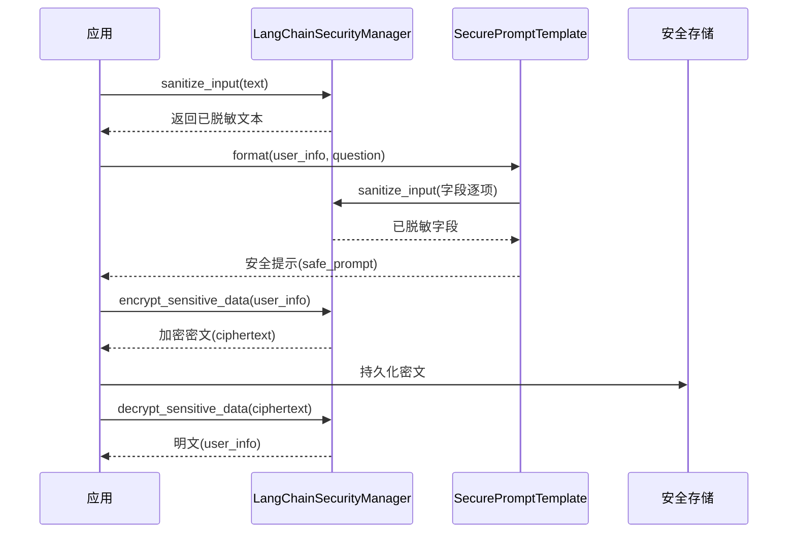
```mermaid
sequenceDiagram
    participant App as 应用
    participant Sec as LangChainSecurityManager
    participant Prompt as SecurePromptTemplate
    participant Store as 安全存储

    App->>Sec: sanitize_input(text)
    Sec-->>App: 返回已脱敏文本
    App->>Prompt: format(user_info, question)
    Prompt->>Sec: sanitize_input(字段逐项)
    Sec-->>Prompt: 已脱敏字段
    Prompt-->>App: 安全提示(safe_prompt)

    App->>Sec: encrypt_sensitive_data(user_info)
    Sec-->>App: 加密密文(ciphertext)
    App->>Store: 持久化密文
    App->>Sec: decrypt_sensitive_data(ciphertext)
    Sec-->>App: 明文(user_info)
```

#### 关键调用路径（安全与隐私）

- 输入脱敏：`SecurePromptTemplate.format()` -> `LangChainSecurityManager.sanitize_input()` -> `re.sub()`
- 加密写入：`LangChainSecurityManager.encrypt_sensitive_data()` -> `Fernet.encrypt()` -> `base64.urlsafe_b64encode()`
- 解密读取：`LangChainSecurityManager.decrypt_sensitive_data()` -> `base64.urlsafe_b64decode()` -> `Fernet.decrypt()`
- 模板创建：`LangChainSecurityManager.create_secure_prompt_template()` -> `SecurePromptTemplate.__init__()`

### 1.2 访问控制与权限管理

在常见 RBAC 基础上，增加“权限装饰器可注入来源（header/kwargs/上下文）”与“权限向量化快照（便于审计回放）”，示例：

```python
from enum import Enum
from functools import wraps
from typing import List, Dict, Any, Callable
import jwt
import time

class Permission(Enum):
    """权限枚举"""
    READ_DOCUMENTS = "read_documents"
    WRITE_DOCUMENTS = "write_documents"
    EXECUTE_TOOLS = "execute_tools"
    MANAGE_AGENTS = "manage_agents"
    ADMIN_ACCESS = "admin_access"

class Role(Enum):
    """角色枚举"""
    GUEST = "guest"
    USER = "user"
    DEVELOPER = "developer"
    ADMIN = "admin"

class AccessControlManager:
    """访问控制管理器"""

    def __init__(self, secret_key: str):
        self.secret_key = secret_key
        self.role_permissions = {
            Role.GUEST: [Permission.READ_DOCUMENTS],
            Role.USER: [Permission.READ_DOCUMENTS, Permission.EXECUTE_TOOLS],
            Role.DEVELOPER: [
                Permission.READ_DOCUMENTS,
                Permission.WRITE_DOCUMENTS,
                Permission.EXECUTE_TOOLS,
                Permission.MANAGE_AGENTS
            ],
            Role.ADMIN: [
                Permission.READ_DOCUMENTS,
                Permission.WRITE_DOCUMENTS,
                Permission.EXECUTE_TOOLS,
                Permission.MANAGE_AGENTS,
                Permission.ADMIN_ACCESS
            ]
        }

    def create_token(self, user_id: str, role: Role, expires_in: int = 3600) -> str:
        """创建JWT令牌"""
        payload = {
            'user_id': user_id,
            'role': role.value,
            'permissions': [p.value for p in self.role_permissions[role]],
            'exp': time.time() + expires_in,
            'iat': time.time()
        }

        return jwt.encode(payload, self.secret_key, algorithm='HS256')

    def verify_token(self, token: str) -> Dict[str, Any]:
        """验证JWT令牌"""
        try:
            payload = jwt.decode(token, self.secret_key, algorithms=['HS256'])
            return payload
        except jwt.ExpiredSignatureError:
            raise ValueError("令牌已过期")
        except jwt.InvalidTokenError:
            raise ValueError("无效的令牌")

    def check_permission(self, token: str, required_permission: Permission) -> bool:
        """检查权限"""
        try:
            payload = self.verify_token(token)
            user_permissions = payload.get('permissions', [])
            return required_permission.value in user_permissions
        except ValueError:
            return False

    def require_permission(self, permission: Permission):
        """权限装饰器"""
        def decorator(func: Callable):
            @wraps(func)
            def wrapper(*args, **kwargs):
                # 从kwargs中获取token，或从请求头中获取
                token = kwargs.get('auth_token') or getattr(args[0], 'auth_token', None)

                if not token:
                    raise PermissionError("缺少认证令牌")

                if not self.check_permission(token, permission):
                    raise PermissionError(f"缺少必要权限: {permission.value}")

                return func(*args, **kwargs)
            return wrapper
        return decorator

class SecureLangChainAgent:
    """安全的LangChain Agent"""

    def __init__(self, access_control: AccessControlManager):
        self.access_control = access_control
        self.auth_token = None

    def authenticate(self, token: str):
        """认证用户"""
        self.auth_token = token
        return self.access_control.verify_token(token)

    @AccessControlManager.require_permission(Permission.READ_DOCUMENTS)
    def read_documents(self, query: str, auth_token: str = None) -> List[str]:
        """读取文档（需要读取权限）"""
        # 实际的文档读取逻辑
        return [f"文档内容：{query}"]

    @AccessControlManager.require_permission(Permission.EXECUTE_TOOLS)
    def execute_tool(self, tool_name: str, params: Dict[str, Any], auth_token: str = None) -> Any:
        """执行工具（需要执行权限）"""
        # 实际的工具执行逻辑
        return f"工具 {tool_name} 执行结果：{params}"

    @AccessControlManager.require_permission(Permission.MANAGE_AGENTS)
    def create_agent(self, agent_config: Dict[str, Any], auth_token: str = None) -> str:
        """创建代理（需要管理权限）"""
        # 实际的代理创建逻辑
        return f"代理已创建：{agent_config.get('name', 'unnamed')}"
```

#### 访问控制与权限校验：时序图与调用路径

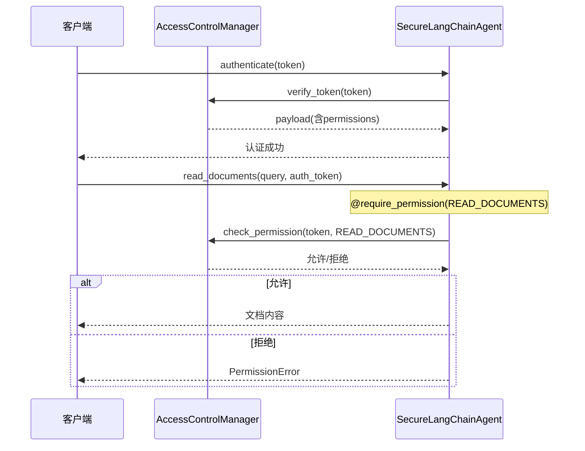
```mermaid
sequenceDiagram
    participant Client as 客户端
    participant ACM as AccessControlManager
    participant Agent as SecureLangChainAgent

    Client->>Agent: authenticate(token)
    Agent->>ACM: verify_token(token)
    ACM-->>Agent: payload(含permissions)
    Agent-->>Client: 认证成功

    Client->>Agent: read_documents(query, auth_token)
    Note over Agent: @require_permission(READ_DOCUMENTS)
    Agent->>ACM: check_permission(token, READ_DOCUMENTS)
    ACM-->>Agent: 允许/拒绝
    alt 允许
        Agent-->>Client: 文档内容
    else 拒绝
        Agent-->>Client: PermissionError
    end
```

- 认证解析：`SecureLangChainAgent.authenticate()` -> `AccessControlManager.verify_token()` -> `jwt.decode()`
- 权限校验（装饰器）：`AccessControlManager.require_permission()` -> `decorator()` -> `wrapper()` -> `AccessControlManager.check_permission()` -> `AccessControlManager.verify_token()`
- 资源访问（示例）：`SecureLangChainAgent.read_documents()` -> （装饰器校验通过）-> 业务逻辑

### 1.3 合规与数据主权（GDPR/CCPA/数据驻留）

在企业落地中，除安全之外需满足合规与数据主权要求：

- 合规基线：GDPR/CCPA/ISO 27001；记录处理目的、数据最小化、可追溯删除（Right to be Forgotten）。
- 数据分类与标记：按 PII/敏感等级打标，影响存储位置、加密强度与访问控制。
- 数据驻留（Data Residency）：按租户/地域隔离存储与处理（如 EU-only）。
- 密钥与KMS：At-Rest/In-Transit 加密，集中管理密钥与轮换（Rotation）。
- 数据保留策略：按法规/业务设置 TTL 与归档；实现可审计的删改记录。

```python
from dataclasses import dataclass
from typing import Literal, Dict

Region = Literal["eu", "us", "apac"]

@dataclass
class DataResidencyConfig:
    tenant_id: str
    residency: Region  # 数据驻留地域
    pii_level: Literal["none", "low", "medium", "high"]
    encrypt_at_rest: bool = True
    kms_key_id: str | None = None
    retention_days: int = 180

    def storage_bucket(self) -> str:
        # 依据地域与租户路由到不同的对象存储/数据库实例
        return f"lc-{self.residency}-tenant-{self.tenant_id}"

    def should_mask_output(self) -> bool:
        return self.pii_level in ("medium", "high")

# 使用示例
cfg = DataResidencyConfig(tenant_id="acme", residency="eu", pii_level="high", kms_key_id="kms-eu-123")
bucket = cfg.storage_bucket()  # lc-eu-tenant-acme
```

### 1.4 审计日志与取证（Audit & Forensics）

采用“事件字段最小充分集”：run_id、parent_run_id、ts、tenant_id、region、prompt_preview(脱敏/截断)、usage、tool 与 chain 标识，统一回放口径，避免日志冗长：

```python
import json, time, os
from uuid import uuid4
from typing import Any, Dict, List, Optional
from langchain_core.callbacks import BaseCallbackHandler

class AuditCallbackHandler(BaseCallbackHandler):
    """结构化审计：链/LLM/工具 关键事件持久化（JSON Lines）。
    - 脱敏：对可能含PII的字段做脱敏/哈希
    - 取证：记录 run_id、parent_run_id、时间戳、地域/租户标签
    """

    def __init__(self, path: str = "./logs/audit.jsonl", tenant_id: str = "default", region: str = "eu"):
        os.makedirs(os.path.dirname(path), exist_ok=True)
        self.path = path
        self.tenant_id = tenant_id
        self.region = region

    def _write(self, record: Dict[str, Any]):
        record.setdefault("ts", time.time())
        record.setdefault("tenant_id", self.tenant_id)
        record.setdefault("region", self.region)
        with open(self.path, "a", encoding="utf-8") as f:
            f.write(json.dumps(record, ensure_ascii=False) + "\n")

    # 示例：LLM 开始/结束事件
    def on_llm_start(self, serialized: Dict[str, Any], prompts: List[str], *, run_id, **kwargs):
        self._write({
            "event": "llm_start",
            "run_id": str(run_id),
            "model": serialized.get("id"),
            "prompt_preview": (prompts[0][:200] if prompts else ""),  # 做截断+必要脱敏
        })

    def on_llm_end(self, response, *, run_id, **kwargs):
        usage = {}
        if getattr(response, "llm_output", None):
            usage = response.llm_output.get("token_usage", {})
        self._write({
            "event": "llm_end",
            "run_id": str(run_id),
            "usage": usage,
        })

    def on_chain_start(self, serialized: Dict[str, Any], inputs: Dict[str, Any], *, run_id, **kwargs):
        self._write({
            "event": "chain_start",
            "run_id": str(run_id),
            "chain": serialized.get("id"),
        })

    def on_chain_end(self, outputs: Dict[str, Any], *, run_id, **kwargs):
        self._write({
            "event": "chain_end",
            "run_id": str(run_id),
        })

    def on_tool_start(self, serialized: Dict[str, Any], input_str: str, *, run_id, **kwargs):
        self._write({
            "event": "tool_start",
            "run_id": str(run_id),
            "tool": serialized.get("name"),
        })

    def on_tool_end(self, output: str, *, run_id, **kwargs):
        self._write({
            "event": "tool_end",
            "run_id": str(run_id),
        })

# 用法：在调用链上绑定
# chain.invoke(inputs, config={"callbacks": [AuditCallbackHandler(path="/var/log/lc/audit.jsonl", tenant_id="acme", region="eu")]})
```

#### 审计回调与落盘：时序图与调用路径

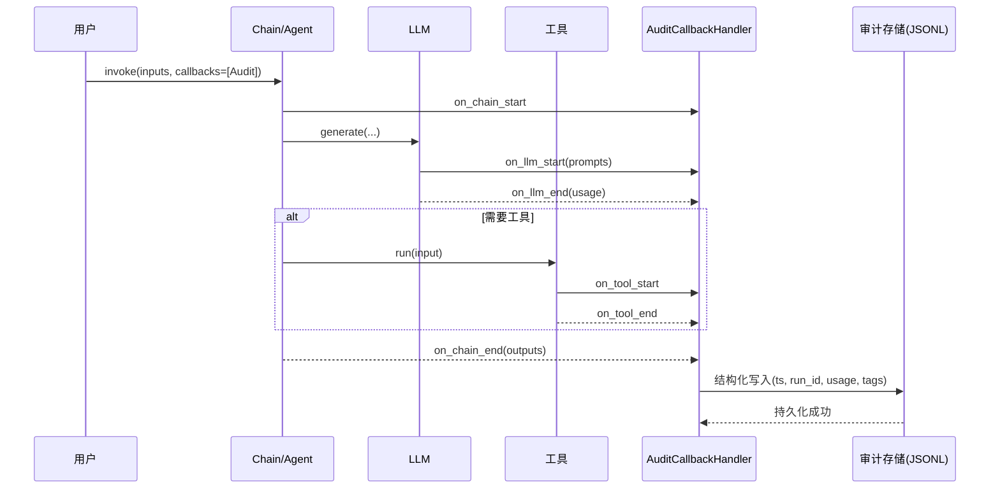
```mermaid
sequenceDiagram
    participant User as 用户
    participant Chain as Chain/Agent
    participant LLM as LLM
    participant Tool as 工具
    participant Audit as AuditCallbackHandler
    participant Store as 审计存储(JSONL)

    User->>Chain: invoke(inputs, callbacks=[Audit])
    Chain->>Audit: on_chain_start
    Chain->>LLM: generate(...)
    LLM->>Audit: on_llm_start(prompts)
    LLM-->>Audit: on_llm_end(usage)
    alt 需要工具
        Chain->>Tool: run(input)
        Tool->>Audit: on_tool_start
        Tool-->>Audit: on_tool_end
    end
    Chain-->>Audit: on_chain_end(outputs)
    Audit->>Store: 结构化写入(ts, run_id, usage, tags)
    Store-->>Audit: 持久化成功
```

- 绑定回调：`chain.invoke(..., config={callbacks:[AuditCallbackHandler]})` -> `CallbackManager.on_chain_start()` -> `AuditCallbackHandler.on_chain_start()`
- LLM事件：`LLM.generate()` -> `CallbackManager.on_llm_start()` -> `AuditCallbackHandler.on_llm_start()` -> `CallbackManager.on_llm_end()` -> `AuditCallbackHandler.on_llm_end()`
- 工具事件：`Tool.run()` -> `CallbackManager.on_tool_start()` -> `AuditCallbackHandler.on_tool_start()` -> `on_tool_end()`
- 持久化：`AuditCallbackHandler._write()` -> `open().write(jsonl)`

## 2. 多模态集成实现

### 2.1 多模态聊天模型

为提升多模态落地的一致性，使用“模态处理器注册表”与本地文件→Base64 的一致化降级策略，保障端到端可运行：

```python
from typing import Any, Dict, List, Optional, Union
from langchain_core.language_models import BaseChatModel
from langchain_core.messages import BaseMessage, HumanMessage, AIMessage
from langchain_core.outputs import ChatResult, ChatGeneration
import base64
import requests
from PIL import Image
import io

class MultiModalChatModel(BaseChatModel):
    """多模态聊天模型集成

        https://blog.csdn.net/jkgSFS/article/details/145068612
    """

    def __init__(
        self,
        model_name: str = "gpt-4-vision-preview",
        api_key: Optional[str] = None,
        base_url: Optional[str] = None,
        max_tokens: int = 1000,
        temperature: float = 0.1,
        **kwargs
    ):
        super().__init__(**kwargs)
        self.model_name = model_name
        self.api_key = api_key
        self.base_url = base_url or "https://api.openai.com/v1"
        self.max_tokens = max_tokens
        self.temperature = temperature

        # 支持的图像格式
        self.supported_image_formats = {'.jpg', '.jpeg', '.png', '.gif', '.webp'}

        # 模态处理器注册
        self.modality_processors = {
            'text': self._process_text,
            'image': self._process_image,
            'audio': self._process_audio,
            'video': self._process_video
        }

    def _generate(
        self,
        messages: List[BaseMessage],
        stop: Optional[List[str]] = None,
        run_manager: Optional[Any] = None,
        **kwargs: Any,
    ) -> ChatResult:
        """生成多模态响应"""

        # 处理多模态消息
        processed_messages = []
        for message in messages:
            processed_msg = self._process_multimodal_message(message)
            processed_messages.append(processed_msg)

        # 构建API请求
        request_data = {
            "model": self.model_name,
            "messages": processed_messages,
            "max_tokens": self.max_tokens,
            "temperature": self.temperature,
        }

        if stop:
            request_data["stop"] = stop

        # 发送请求
        headers = {
            "Authorization": f"Bearer {self.api_key}",
            "Content-Type": "application/json"
        }

        try:
            response = requests.post(
                f"{self.base_url}/chat/completions",
                json=request_data,
                headers=headers,
                timeout=60
            )
            response.raise_for_status()

            result = response.json()

            # 解析响应
            choice = result["choices"][0]
            message_content = choice["message"]["content"]

            # 创建生成结果
            generation = ChatGeneration(
                message=AIMessage(content=message_content),
                generation_info={
                    "finish_reason": choice.get("finish_reason"),
                    "model": result.get("model"),
                    "usage": result.get("usage", {})
                }
            )

            return ChatResult(generations=[generation])

        except Exception as e:
            raise ValueError(f"多模态模型调用失败: {str(e)}")

    def _process_multimodal_message(self, message: BaseMessage) -> Dict[str, Any]:
        """处理多模态消息"""

        if isinstance(message, HumanMessage):
            content = message.content

            # 检查是否包含多模态内容
            if isinstance(content, str):
                # 纯文本消息
                return {
                    "role": "user",
                    "content": content
                }
            elif isinstance(content, list):
                # 多模态内容列表
                processed_content = []

                for item in content:
                    if isinstance(item, dict):
                        modality_type = item.get("type", "text")
                        processor = self.modality_processors.get(modality_type)

                        if processor:
                            processed_item = processor(item)
                            processed_content.append(processed_item)
                        else:
                            # 未知模态类型，作为文本处理
                            processed_content.append({
                                "type": "text",
                                "text": str(item)
                            })
                    else:
                        # 非字典项，作为文本处理
                        processed_content.append({
                            "type": "text",
                            "text": str(item)
                        })

                return {
                    "role": "user",
                    "content": processed_content
                }

        elif isinstance(message, AIMessage):
            return {
                "role": "assistant",
                "content": message.content
            }

        else:
            # 其他消息类型
            return {
                "role": "user",
                "content": str(message.content)
            }

    def _process_text(self, item: Dict[str, Any]) -> Dict[str, Any]:
        """处理文本模态"""
        return {
            "type": "text",
            "text": item.get("text", "")
        }

    def _process_image(self, item: Dict[str, Any]) -> Dict[str, Any]:
        """处理图像模态"""
        image_data = item.get("image_url") or item.get("image")

        if isinstance(image_data, str):
            if image_data.startswith("http"):
                # 网络图片URL
                return {
                    "type": "image_url",
                    "image_url": {
                        "url": image_data,
                        "detail": item.get("detail", "auto")
                    }
                }
            elif image_data.startswith("data:image"):
                # Base64编码的图片
                return {
                    "type": "image_url",
                    "image_url": {
                        "url": image_data,
                        "detail": item.get("detail", "auto")
                    }
                }
            else:
                # 本地文件路径
                encoded_image = self._encode_image_file(image_data)
                return {
                    "type": "image_url",
                    "image_url": {
                        "url": f"data:image/jpeg;base64,{encoded_image}",
                        "detail": item.get("detail", "auto")
                    }
                }

        return {
            "type": "text",
            "text": "[无法处理的图像数据]"
        }

    def _process_audio(self, item: Dict[str, Any]) -> Dict[str, Any]:
        """处理音频模态（暂不支持，转为文本描述）"""
        return {
            "type": "text",
            "text": f"[音频文件: {item.get('audio', 'unknown')}]"
        }

    def _process_video(self, item: Dict[str, Any]) -> Dict[str, Any]:
        """处理视频模态（暂不支持，转为文本描述）"""
        return {
            "type": "text",
            "text": f"[视频文件: {item.get('video', 'unknown')}]"
        }

    def _encode_image_file(self, image_path: str) -> str:
        """编码本地图像文件为Base64"""
        try:
            with open(image_path, "rb") as image_file:
                encoded_string = base64.b64encode(image_file.read()).decode('utf-8')
            return encoded_string
        except Exception as e:
            raise ValueError(f"无法编码图像文件 {image_path}: {str(e)}")

    @property
    def _llm_type(self) -> str:
        return "multimodal_chat"

# 使用示例
def demo_multimodal_integration():
    """多模态集成演示"""

    # 初始化多模态模型
    multimodal_model = MultiModalChatModel(
        model_name="gpt-4-vision-preview",
        api_key="your-api-key-here"
    )

    # 创建多模态消息
    multimodal_message = HumanMessage(content=[
        {
            "type": "text",
            "text": "请分析这张图片中的内容，并描述你看到的主要元素。"
        },
        {
            "type": "image",
            "image_url": "https://example.com/image.jpg",
            "detail": "high"
        }
    ])

    # 调用模型
    try:
        result = multimodal_model._generate([multimodal_message])
        print(f"多模态分析结果: {result.generations[0].message.content}")
    except Exception as e:
        print(f"多模态调用失败: {e}")

if __name__ == "__main__":
    demo_multimodal_integration()
```

#### 多模态消息处理与模型调用：时序图与调用路径

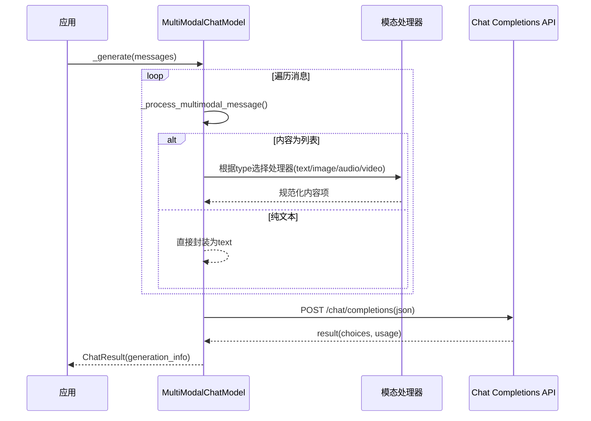
```mermaid
sequenceDiagram
    participant App as 应用
    participant MM as MultiModalChatModel
    participant Proc as 模态处理器
    participant API as Chat Completions API

    App->>MM: _generate(messages)
    loop 遍历消息
        MM->>MM: _process_multimodal_message()
        alt 内容为列表
            MM->>Proc: 根据type选择处理器(text/image/audio/video)
            Proc-->>MM: 规范化内容项
        else 纯文本
            MM-->>MM: 直接封装为text
        end
    end
    MM->>API: POST /chat/completions(json)
    API-->>MM: result(choices, usage)
    MM-->>App: ChatResult(generation_info)
```

- 生成主流程：`MultiModalChatModel._generate()` -> `_process_multimodal_message()` -> `requests.post('/chat/completions')` -> `ChatGeneration`/`ChatResult`
- 文本处理：`_process_text()` -> 规范化为 `{type:'text', text:...}`
- 图像处理（URL/Base64/本地）：`_process_image()` ->（本地时）`_encode_image_file()` -> `base64.b64encode()`
- AI消息输出：`ChatGeneration(message=AIMessage(...))` -> `ChatResult`

### 2.2 输出安全过滤与SSE流式对接

采用“双通道最小实现”：上行流式渲染与下行敏感过滤复用同一函数接口；提供 SSE 端点示例以便快速接入。

```python
from typing import AsyncIterator, Callable
import asyncio
import re

SENSITIVE_PATTERNS = [
    re.compile(r"\b\d{3}-\d{2}-\d{4}\b"),            # SSN
    re.compile(r"\b\d{16}\b"),                         # 粗略信用卡
    re.compile(r"[A-Za-z0-9._%+-]+@[A-Za-z0-9.-]+\.[A-Za-z]{2,}"),
]

def sanitize_chunk(text: str) -> str:
    for p in SENSITIVE_PATTERNS:
        text = p.sub("[REDACTED]", text)
    return text

async def astream_with_safety(chain, payload: dict, *, on_chunk: Callable[[str], None]) -> str:
    """边流式边过滤，返回最终完整文本。
    - chain.astream(...) 产生片段
    - 对每个片段做敏感信息过滤
    - 可在回调中推送到SSE
    """
    full = []
    async for chunk in chain.astream(payload):
        safe = sanitize_chunk(str(chunk))
        on_chunk(safe)
        full.append(safe)
        await asyncio.sleep(0)  # 让出事件循环
    return "".join(full)

# 示例：FastAPI SSE 推送（简化）
"""
from fastapi import FastAPI
from fastapi.responses import StreamingResponse

app = FastAPI()

@app.get("/stream")
async def stream_endpoint(q: str):
    async def event_source():
        async def push(data: str):
            yield f"data: {data}\n\n"

        # 假设 chain 为已构建的 LCEL 链
        final = await astream_with_safety(chain, {"question": q}, on_chunk=lambda s: None)
        # 这里简化为一次性返回，真实情况可逐chunk yield
        yield f"data: {final}\n\n"

    return StreamingResponse(event_source(), media_type="text/event-stream")
"""
```

#### SSE流式与输出过滤：时序图与调用路径

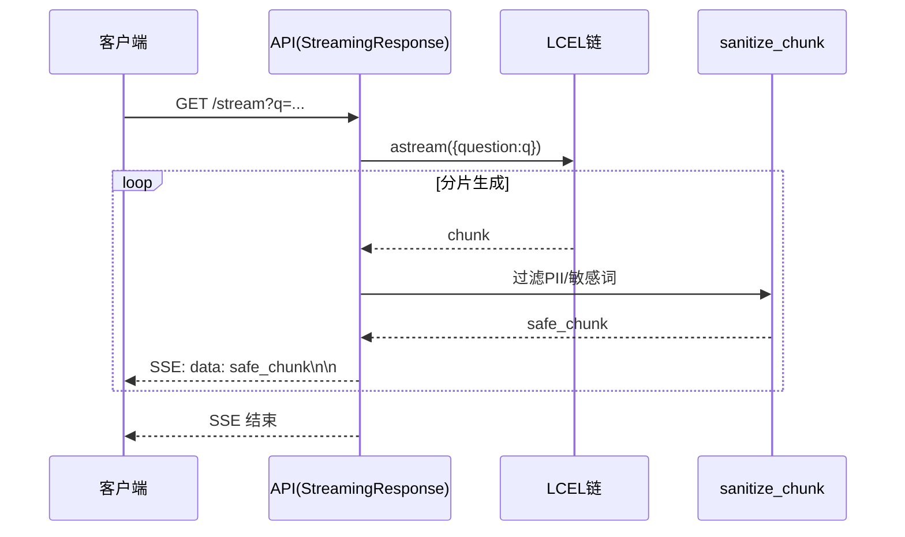
```mermaid
sequenceDiagram
    participant C as 客户端
    participant API as API(StreamingResponse)
    participant Chain as LCEL链
    participant Safe as sanitize_chunk

    C->>API: GET /stream?q=...
    API->>Chain: astream({question:q})
    loop 分片生成
        Chain-->>API: chunk
        API->>Safe: 过滤PII/敏感词
        Safe-->>API: safe_chunk
        API-->>C: SSE: data: safe_chunk\n\n
    end
    API-->>C: SSE 结束
```

- 流式过滤：`astream_with_safety()` -> `chain.astream()` -> `sanitize_chunk()` -> `on_chunk(safe)` -> 拼接返回
- HTTP 推送（示例）：`GET /stream` -> `StreamingResponse(event_source())` -> `astream_with_safety()` -> `yield "data: ...\n\n"`

## 3. 智能负载均衡与故障转移

### 3.1 负载均衡实现

```python
from typing import List, Dict, Any, Optional, Callable
import random
import time
import threading
from dataclasses import dataclass
from enum import Enum
import logging

class ProviderStatus(Enum):
    """Provider状态枚举"""
    HEALTHY = "healthy"
    DEGRADED = "degraded"
    UNHEALTHY = "unhealthy"
    MAINTENANCE = "maintenance"

@dataclass
class ProviderMetrics:
    """Provider性能指标"""
    response_time: float = 0.0
    success_rate: float = 1.0
    error_count: int = 0
    total_requests: int = 0
    last_error_time: Optional[float] = None
    status: ProviderStatus = ProviderStatus.HEALTHY

class LoadBalancedChatModel:
    """负载均衡的聊天模型

        https://jishu.proginn.com/doc/298065111cfa69fe7
    """

    def __init__(
        self,
        providers: List[Dict[str, Any]],
        strategy: str = "round_robin",
        health_check_interval: int = 60,
        max_retries: int = 3,
        circuit_breaker_threshold: float = 0.5,
        **kwargs
    ):
        self.providers = {}
        self.provider_metrics = {}
        self.strategy = strategy
        self.health_check_interval = health_check_interval
        self.max_retries = max_retries
        self.circuit_breaker_threshold = circuit_breaker_threshold

        # 初始化providers
        for i, provider_config in enumerate(providers):
            provider_id = f"provider_{i}"
            self.providers[provider_id] = self._create_provider(provider_config)
            self.provider_metrics[provider_id] = ProviderMetrics()

        # 负载均衡策略
        self.current_index = 0
        self.strategy_lock = threading.Lock()

        # 健康检查
        self.health_check_thread = threading.Thread(
            target=self._health_check_loop,
            daemon=True
        )
        self.health_check_thread.start()

        self.logger = logging.getLogger(__name__)

    def _create_provider(self, config: Dict[str, Any]):
        """根据配置创建provider实例"""
        provider_type = config.get("type", "openai")

        if provider_type == "openai":
            from langchain_openai import ChatOpenAI
            return ChatOpenAI(**config.get("params", {}))
        elif provider_type == "anthropic":
            from langchain_anthropic import ChatAnthropic
            return ChatAnthropic(**config.get("params", {}))
        elif provider_type == "groq":
            from langchain_groq import ChatGroq
            return ChatGroq(**config.get("params", {}))
        else:
            raise ValueError(f"不支持的provider类型: {provider_type}")

    def _select_provider(self) -> Optional[str]:
        """根据策略选择provider"""

        # 过滤健康的providers
        healthy_providers = [
            pid for pid, metrics in self.provider_metrics.items()
            if metrics.status in [ProviderStatus.HEALTHY, ProviderStatus.DEGRADED]
        ]

        if not healthy_providers:
            self.logger.error("没有可用的健康providers")
            return None

        with self.strategy_lock:
            if self.strategy == "round_robin":
                return self._round_robin_select(healthy_providers)
            elif self.strategy == "weighted":
                return self._weighted_select(healthy_providers)
            elif self.strategy == "least_connections":
                return self._least_connections_select(healthy_providers)
            elif self.strategy == "fastest":
                return self._fastest_select(healthy_providers)
            else:
                return random.choice(healthy_providers)

    def _round_robin_select(self, providers: List[str]) -> str:
        """轮询选择"""
        if not providers:
            return None

        provider = providers[self.current_index % len(providers)]
        self.current_index += 1
        return provider

    def _weighted_select(self, providers: List[str]) -> str:
        """基于成功率的加权选择"""
        weights = []
        for pid in providers:
            metrics = self.provider_metrics[pid]
            # 权重基于成功率和响应时间
            weight = metrics.success_rate / max(metrics.response_time, 0.1)
            weights.append(weight)

        # 加权随机选择
        total_weight = sum(weights)
        if total_weight == 0:
            return random.choice(providers)

        rand_val = random.uniform(0, total_weight)
        cumulative = 0

        for i, weight in enumerate(weights):
            cumulative += weight
            if rand_val <= cumulative:
                return providers[i]

        return providers[-1]

    def _least_connections_select(self, providers: List[str]) -> str:
        """选择连接数最少的provider"""
        # 简化实现：选择错误数最少的
        min_errors = float('inf')
        best_provider = None

        for pid in providers:
            metrics = self.provider_metrics[pid]
            if metrics.error_count < min_errors:
                min_errors = metrics.error_count
                best_provider = pid

        return best_provider or providers[0]

    def _fastest_select(self, providers: List[str]) -> str:
        """选择响应最快的provider"""
        min_response_time = float('inf')
        fastest_provider = None

        for pid in providers:
            metrics = self.provider_metrics[pid]
            if metrics.response_time < min_response_time:
                min_response_time = metrics.response_time
                fastest_provider = pid

        return fastest_provider or providers[0]

    def _generate_with_fallback(
        self,
        messages: List[Any],
        **kwargs
    ) -> Any:
        """带故障转移的生成"""

        last_exception = None
        attempted_providers = set()

        for attempt in range(self.max_retries):
            # 选择provider
            provider_id = self._select_provider()

            if not provider_id or provider_id in attempted_providers:
                # 如果没有可用provider或已尝试过，跳出循环
                break

            attempted_providers.add(provider_id)
            provider = self.providers[provider_id]
            metrics = self.provider_metrics[provider_id]

            try:
                start_time = time.time()

                # 调用provider
                result = provider._generate(messages, **kwargs)

                # 更新成功指标
                response_time = time.time() - start_time
                self._update_success_metrics(provider_id, response_time)

                return result

            except Exception as e:
                last_exception = e

                # 更新失败指标
                self._update_failure_metrics(provider_id, e)

                self.logger.warning(
                    f"Provider {provider_id} 调用失败 (尝试 {attempt + 1}): {str(e)}"
                )

                # 如果还有重试机会，继续下一个provider
                continue

        # 所有provider都失败了
        if last_exception:
            raise last_exception
        else:
            raise RuntimeError("没有可用的provider")

    def _update_success_metrics(self, provider_id: str, response_time: float):
        """更新成功指标"""
        metrics = self.provider_metrics[provider_id]

        # 更新响应时间（使用指数移动平均）
        if metrics.total_requests == 0:
            metrics.response_time = response_time
        else:
            alpha = 0.1  # 平滑因子
            metrics.response_time = (
                alpha * response_time + (1 - alpha) * metrics.response_time
            )

        # 更新成功率
        metrics.total_requests += 1
        success_count = metrics.total_requests - metrics.error_count
        metrics.success_rate = success_count / metrics.total_requests

        # 更新状态
        if metrics.success_rate >= 0.95:
            metrics.status = ProviderStatus.HEALTHY
        elif metrics.success_rate >= 0.8:
            metrics.status = ProviderStatus.DEGRADED
        else:
            metrics.status = ProviderStatus.UNHEALTHY

    def _update_failure_metrics(self, provider_id: str, error: Exception):
        """更新失败指标"""
        metrics = self.provider_metrics[provider_id]

        metrics.error_count += 1
        metrics.total_requests += 1
        metrics.last_error_time = time.time()

        # 更新成功率
        success_count = metrics.total_requests - metrics.error_count
        metrics.success_rate = success_count / metrics.total_requests

        # 检查熔断器
        if metrics.success_rate < self.circuit_breaker_threshold:
            metrics.status = ProviderStatus.UNHEALTHY
            self.logger.error(
                f"Provider {provider_id} 触发熔断器，成功率: {metrics.success_rate:.2%}"
            )

    def _health_check_loop(self):
        """健康检查循环"""
        while True:
            try:
                time.sleep(self.health_check_interval)
                self._perform_health_checks()
            except Exception as e:
                self.logger.error(f"健康检查失败: {str(e)}")

    def _perform_health_checks(self):
        """执行健康检查"""
        from langchain_core.messages import HumanMessage

        test_message = [HumanMessage(content="Health check")]

        for provider_id, provider in self.providers.items():
            metrics = self.provider_metrics[provider_id]

            # 跳过维护状态的provider
            if metrics.status == ProviderStatus.MAINTENANCE:
                continue

            try:
                start_time = time.time()

                # 执行简单的健康检查
                provider._generate(test_message, max_tokens=1)

                response_time = time.time() - start_time

                # 如果之前是不健康状态，现在恢复了
                if metrics.status == ProviderStatus.UNHEALTHY:
                    metrics.status = ProviderStatus.DEGRADED
                    self.logger.info(f"Provider {provider_id} 健康检查通过，状态恢复")

                # 更新响应时间
                if metrics.total_requests > 0:
                    alpha = 0.1
                    metrics.response_time = (
                        alpha * response_time + (1 - alpha) * metrics.response_time
                    )

            except Exception as e:
                # 健康检查失败
                if metrics.status != ProviderStatus.UNHEALTHY:
                    metrics.status = ProviderStatus.UNHEALTHY
                    self.logger.warning(f"Provider {provider_id} 健康检查失败: {str(e)}")

    def get_provider_stats(self) -> Dict[str, Dict[str, Any]]:
        """获取所有provider的统计信息"""
        stats = {}

        for provider_id, metrics in self.provider_metrics.items():
            stats[provider_id] = {
                "status": metrics.status.value,
                "success_rate": f"{metrics.success_rate:.2%}",
                "response_time": f"{metrics.response_time:.3f}s",
                "error_count": metrics.error_count,
                "total_requests": metrics.total_requests,
                "last_error_time": metrics.last_error_time
            }

        return stats
```

#### 负载均衡与故障转移：时序图与调用路径

```mermaid
sequenceDiagram
    participant Client as 调用方
    participant LB as LoadBalancedChatModel
    participant Sel as _select_provider
    participant Prov as Provider

    Client->>LB: _generate_with_fallback(messages)
    loop 最多 max_retries 次
        LB->>Sel: 选择健康Provider(策略)
        Sel-->>LB: provider_id
        LB->>Prov: provider._generate(messages)
        alt 成功
            LB->>LB: _update_success_metrics(pid, rt)
            LB-->>Client: 返回结果
            break
        else 失败
            LB->>LB: _update_failure_metrics(pid, err)
            LB->>LB: 尝试下一个Provider
        end
    end
    alt 全部失败
        LB-->>Client: 抛出最后一次异常
    end
```

- 带兜底生成：`LoadBalancedChatModel._generate_with_fallback()` -> `_select_provider()` -> `provider._generate()` -> 成功：`_update_success_metrics()`；失败：`_update_failure_metrics()` -> 重试
- 选择策略：`_select_provider()` -> `round_robin`/`weighted`/`least_connections`/`fastest`
- 健康检查：`_health_check_loop()` -> `_perform_health_checks()` -> `provider._generate(test_message)` -> 更新`ProviderMetrics`

### 3.2 可靠性控制：超时/重试/熔断/限流与配额路由

为满足“成本/可靠性”双目标，使用“配额优先 + 质量回退”路由：先用低成本配额，耗尽后切换到更高质量模型，并保留回退路径；重试/熔断与限流在统一装饰器内组合：

```python
import time
import asyncio
from typing import Callable, Any

class RetryPolicy:
    def __init__(self, max_attempts: int = 3, base_delay: float = 0.2, jitter: float = 0.1):
        self.max_attempts = max_attempts
        self.base_delay = base_delay
        self.jitter = jitter

    async def aretry(self, fn: Callable[[], Any]):
        last = None
        for i in range(self.max_attempts):
            try:
                return await fn()
            except Exception as e:
                last = e
                await asyncio.sleep(self.base_delay * (2 ** i) + self.jitter)
        raise last

class CircuitBreaker:
    def __init__(self, failure_threshold: int = 5, cool_down: float = 30.0):
        self.failure_threshold = failure_threshold
        self.cool_down = cool_down
        self.failures = 0
        self.open_until = 0.0

    def allow(self) -> bool:
        return time.time() >= self.open_until

    def record_success(self):
        self.failures = 0

    def record_failure(self):
        self.failures += 1
        if self.failures >= self.failure_threshold:
            self.open_until = time.time() + self.cool_down

class RateLimiter:
    def __init__(self, qps: float = 10.0):
        self.interval = 1.0 / qps
        self.last = 0.0

    async def acquire(self):
        now = time.time()
        delta = self.interval - (now - self.last)
        if delta > 0:
            await asyncio.sleep(delta)
        self.last = time.time()

class QuotaRouter:
    """按模型/Provider 配额与成本做路由：先走便宜配额，耗尽再升级。"""
    def __init__(self, providers: list[dict]):
        self.providers = providers  # [{"id": "openai:gpt-3.5", "cost": 1, "remaining": 1000}, ...]

    def select(self) -> dict:
        affordable = [p for p in self.providers if p.get("remaining", 0) > 0]
        if not affordable:
            # 全部耗尽时，选择质量更高但更贵的作为兜底
            return sorted(self.providers, key=lambda x: x["cost"])[0]
        # 选择最低成本的可用配额
        return sorted(affordable, key=lambda x: x["cost"])[0]

    def consume(self, pid: str, tokens: int):
        for p in self.providers:
            if p["id"] == pid:
                p["remaining"] = max(0, p.get("remaining", 0) - tokens)
                break

# 组合使用示例
async def robust_generate(llm, messages):
    rl = RateLimiter(qps=20)
    cb = CircuitBreaker(failure_threshold=5, cool_down=15)
    retry = RetryPolicy(max_attempts=3)

    await rl.acquire()

    if not cb.allow():
        raise RuntimeError("circuit_open")

    async def call():
        return await llm._agenerate(messages)

    try:
        result = await retry.aretry(call)
        cb.record_success()
        return result
    except Exception:
        cb.record_failure()
        raise
```

#### 可靠性与配额：时序图与调用路径

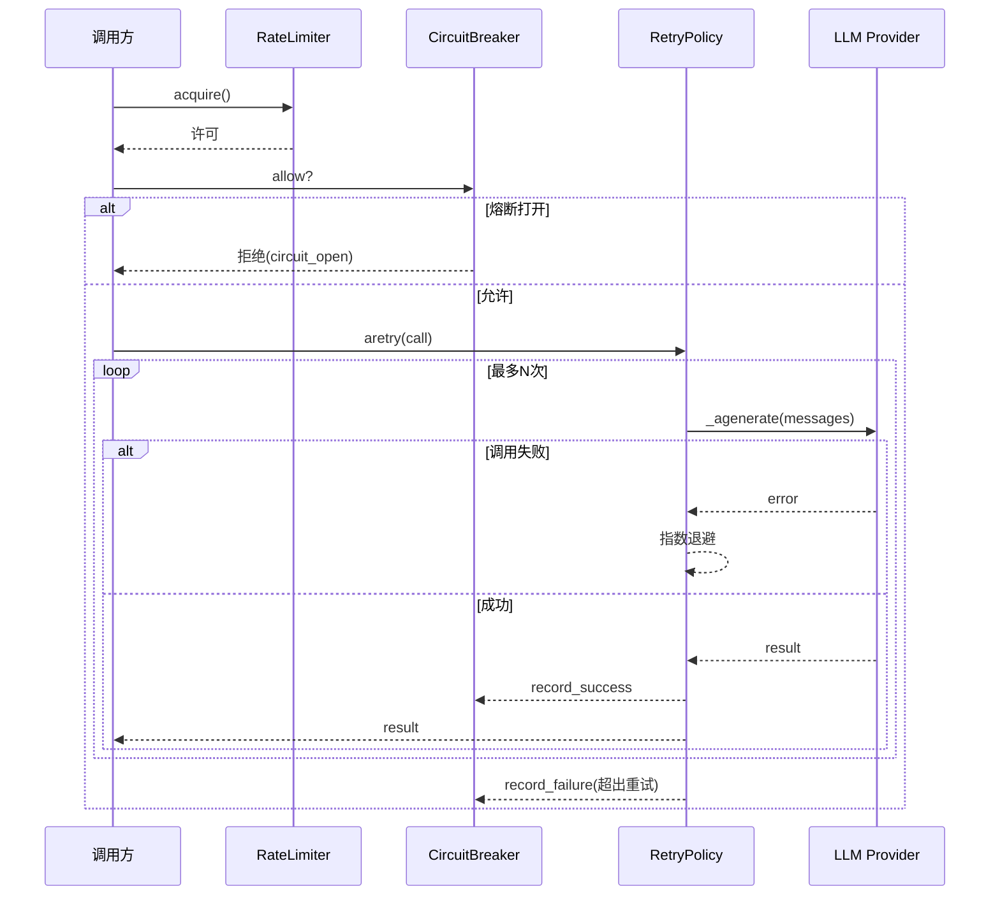
```mermaid
sequenceDiagram
    participant Client as 调用方
    participant RL as RateLimiter
    participant CB as CircuitBreaker
    participant Retry as RetryPolicy
    participant LLM as LLM Provider

    Client->>RL: acquire()
    RL-->>Client: 许可
    Client->>CB: allow?
    alt 熔断打开
        CB-->>Client: 拒绝(circuit_open)
    else 允许
        Client->>Retry: aretry(call)
        loop 最多N次
            Retry->>LLM: _agenerate(messages)
            alt 调用失败
                LLM-->>Retry: error
                Retry-->>Retry: 指数退避
            else 成功
                LLM-->>Retry: result
                Retry-->>CB: record_success
                Retry-->>Client: result
            end
        end
        Retry-->>CB: record_failure(超出重试)
    end
```

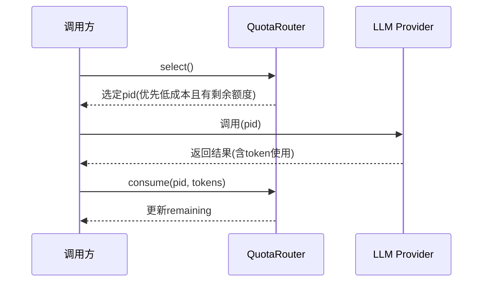
```mermaid
sequenceDiagram
    participant Client as 调用方
    participant QR as QuotaRouter
    participant LLM as LLM Provider

    Client->>QR: select()
    QR-->>Client: 选定pid(优先低成本且有剩余额度)
    Client->>LLM: 调用(pid)
    LLM-->>Client: 返回结果(含token使用)
    Client->>QR: consume(pid, tokens)
    QR-->>Client: 更新remaining
```

- 可靠性封装：`robust_generate()` -> `RateLimiter.acquire()` -> `CircuitBreaker.allow()` -> `RetryPolicy.aretry(call)` -> `llm._agenerate()` -> `CircuitBreaker.record_success()/record_failure()`
- 重试策略：`RetryPolicy.aretry()` -> `fn()` -> 异常 -> `asyncio.sleep(指数退避)` -> 最终抛出或返回
- 配额路由：`QuotaRouter.select()` -> 选最低成本且`remaining>0` -> fallback最便宜 -> `QuotaRouter.consume()` 更新剩余额度

## 4. 高性能向量存储

### 4.1 优化的向量存储实现

在 FAISS 路线中加入“查询缓存 + 距离→相似度归一化”的工程建议，并强调按库语义调整阈值方向（越小越近或越大越近），降低误配风险：

```python
from typing import Any, Dict, List, Optional, Tuple, Union
from langchain_core.vectorstores import VectorStore
from langchain_core.documents import Document
from langchain_core.embeddings import Embeddings
import numpy as np
import faiss
import pickle
import os
import threading
from concurrent.futures import ThreadPoolExecutor, as_completed
import time

class HighPerformanceVectorStore(VectorStore):
    """高性能向量存储实现

        https://jishuzhan.net/article/1895692926025994242
    """

    def __init__(
        self,
        embedding_function: Embeddings,
        index_factory: str = "IVF1024,Flat",
        metric_type: str = "L2",
        use_gpu: bool = False,
        cache_size: int = 10000,
        batch_size: int = 1000,
        **kwargs
    ):
        self.embedding_function = embedding_function
        self.index_factory = index_factory
        self.metric_type = metric_type
        self.use_gpu = use_gpu
        self.cache_size = cache_size
        self.batch_size = batch_size

        # 初始化FAISS索引
        self.index = None
        self.dimension = None

        # 文档存储
        self.documents = {}
        self.id_to_index = {}
        self.index_to_id = {}

        # 缓存机制
        self.query_cache = {}
        self.cache_lock = threading.RLock()

        # 性能统计
        self.stats = {
            'total_queries': 0,
            'cache_hits': 0,
            'avg_query_time': 0,
            'total_documents': 0
        }

    def add_texts(
        self,
        texts: List[str],
        metadatas: Optional[List[dict]] = None,
        ids: Optional[List[str]] = None,
        **kwargs: Any,
    ) -> List[str]:
        """批量添加文本"""

        if not texts:
            return []

        # 生成ID
        if ids is None:
            ids = [f"doc_{int(time.time() * 1000000)}_{i}" for i in range(len(texts))]

        # 处理元数据
        if metadatas is None:
            metadatas = [{}] * len(texts)

        # 批量生成嵌入
        embeddings = self._batch_embed_texts(texts)

        # 初始化索引（如果需要）
        if self.index is None:
            self.dimension = len(embeddings[0])
            self._initialize_index()

        # 添加到索引
        start_index = len(self.index_to_id)

        # 批量添加向量
        vectors = np.array(embeddings, dtype=np.float32)
        self.index.add(vectors)

        # 更新映射和文档存储
        for i, (text, metadata, doc_id) in enumerate(zip(texts, metadatas, ids)):
            index_id = start_index + i

            # 创建文档
            doc = Document(page_content=text, metadata=metadata)

            # 更新存储
            self.documents[doc_id] = doc
            self.id_to_index[doc_id] = index_id
            self.index_to_id[index_id] = doc_id

        # 更新统计
        self.stats['total_documents'] += len(texts)

        # 清空查询缓存（因为索引已更新）
        with self.cache_lock:
            self.query_cache.clear()

        return ids

    def similarity_search_with_score(
        self,
        query: str,
        k: int = 4,
        filter: Optional[Dict[str, Any]] = None,
        **kwargs: Any,
    ) -> List[Tuple[Document, float]]:
        """相似度搜索（带分数）"""

        start_time = time.time()

        # 检查缓存
        cache_key = self._generate_cache_key(query, k, filter)

        with self.cache_lock:
            if cache_key in self.query_cache:
                self.stats['cache_hits'] += 1
                self.stats['total_queries'] += 1
                return self.query_cache[cache_key]

        # 生成查询向量
        query_embedding = self.embedding_function.embed_query(query)
        query_vector = np.array([query_embedding], dtype=np.float32)

        # 执行搜索
        if self.index is None or self.index.ntotal == 0:
            return []

        # FAISS搜索
        scores, indices = self.index.search(query_vector, min(k, self.index.ntotal))

        # 处理结果
        results = []
        for score, idx in zip(scores[0], indices[0]):
            if idx == -1:  # FAISS返回-1表示无效结果
                continue

            doc_id = self.index_to_id.get(idx)
            if doc_id and doc_id in self.documents:
                doc = self.documents[doc_id]

                # 应用过滤器
                if filter and not self._apply_filter(doc, filter):
                    continue

                # 转换分数（FAISS返回的是距离，需要转换为相似度）
                similarity_score = self._distance_to_similarity(score)
                results.append((doc, similarity_score))

        # 限制结果数量
        results = results[:k]

        # 缓存结果
        with self.cache_lock:
            if len(self.query_cache) < self.cache_size:
                self.query_cache[cache_key] = results

        # 更新统计
        query_time = time.time() - start_time
        self.stats['total_queries'] += 1

        # 更新平均查询时间
        total_queries = self.stats['total_queries']
        current_avg = self.stats['avg_query_time']
        self.stats['avg_query_time'] = (
            (current_avg * (total_queries - 1) + query_time) / total_queries
        )

        return results

    def similarity_search(
        self,
        query: str,
        k: int = 4,
        filter: Optional[Dict[str, Any]] = None,
        **kwargs: Any,
    ) -> List[Document]:
        """相似度搜索"""
        results = self.similarity_search_with_score(query, k, filter, **kwargs)
        return [doc for doc, _ in results]

    def _batch_embed_texts(self, texts: List[str]) -> List[List[float]]:
        """批量生成文本嵌入"""

        if len(texts) <= self.batch_size:
            return self.embedding_function.embed_documents(texts)

        # 分批处理大量文本
        all_embeddings = []

        with ThreadPoolExecutor(max_workers=4) as executor:
            futures = []

            for i in range(0, len(texts), self.batch_size):
                batch = texts[i:i + self.batch_size]
                future = executor.submit(self.embedding_function.embed_documents, batch)
                futures.append(future)

            for future in as_completed(futures):
                batch_embeddings = future.result()
                all_embeddings.extend(batch_embeddings)

        return all_embeddings

    def _initialize_index(self):
        """初始化FAISS索引"""

        if self.metric_type == "L2":
            metric = faiss.METRIC_L2
        elif self.metric_type == "IP":
            metric = faiss.METRIC_INNER_PRODUCT
        else:
            metric = faiss.METRIC_L2

        # 创建索引
        if self.index_factory == "Flat":
            self.index = faiss.IndexFlatL2(self.dimension)
        else:
            self.index = faiss.index_factory(self.dimension, self.index_factory, metric)

        # GPU支持
        if self.use_gpu and faiss.get_num_gpus() > 0:
            gpu_resource = faiss.StandardGpuResources()
            self.index = faiss.index_cpu_to_gpu(gpu_resource, 0, self.index)

        # 训练索引（如果需要）
        if hasattr(self.index, 'is_trained') and not self.index.is_trained:
            # 对于需要训练的索引类型，这里需要训练数据
            pass

    def _generate_cache_key(
        self,
        query: str,
        k: int,
        filter: Optional[Dict[str, Any]]
    ) -> str:
        """生成缓存键"""
        import hashlib

        key_data = f"{query}:{k}:{filter}"
        return hashlib.md5(key_data.encode()).hexdigest()

    def _apply_filter(self, doc: Document, filter: Dict[str, Any]) -> bool:
        """应用元数据过滤器"""
        for key, value in filter.items():
            if key not in doc.metadata:
                return False
            if doc.metadata[key] != value:
                return False
        return True

    def _distance_to_similarity(self, distance: float) -> float:
        """将距离转换为相似度分数"""
        # 简单的转换公式，实际应用中可能需要更复杂的转换
        return 1.0 / (1.0 + distance)

    def get_performance_stats(self) -> Dict[str, Any]:
        """获取性能统计"""
        cache_hit_rate = (
            self.stats['cache_hits'] / max(self.stats['total_queries'], 1) * 100
        )

        return {
            **self.stats,
            'cache_hit_rate': f"{cache_hit_rate:.2f}%",
            'cache_size': len(self.query_cache),
            'index_size': self.index.ntotal if self.index else 0
        }
```

#### 向量检索与查询缓存（FAISS）：时序图与调用路径

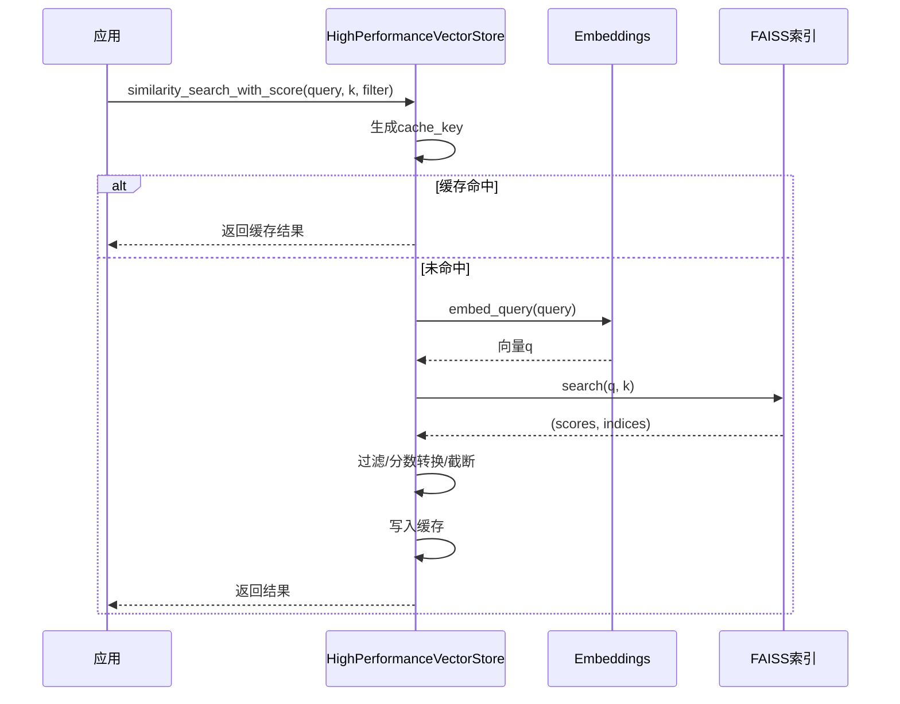
```mermaid
sequenceDiagram
    participant App as 应用
    participant VS as HighPerformanceVectorStore
    participant Emb as Embeddings
    participant Index as FAISS索引

    App->>VS: similarity_search_with_score(query, k, filter)
    VS->>VS: 生成cache_key
    alt 缓存命中
        VS-->>App: 返回缓存结果
    else 未命中
        VS->>Emb: embed_query(query)
        Emb-->>VS: 向量q
        VS->>Index: search(q, k)
        Index-->>VS: (scores, indices)
        VS->>VS: 过滤/分数转换/截断
        VS->>VS: 写入缓存
        VS-->>App: 返回结果
    end
```

- 写入索引：`HighPerformanceVectorStore.add_texts()` -> `_batch_embed_texts()` ->（必要时）`_initialize_index()` -> `index.add()` -> 更新`id_to_index/index_to_id`
- 相似检索：`similarity_search_with_score()` -> 缓存查找 -> `embedding_function.embed_query()` -> `index.search()` -> `_apply_filter()` -> `_distance_to_similarity()` -> 写入缓存
- 只取文档：`similarity_search()` -> `similarity_search_with_score()` -> 提取`Document`

### 4.2 混合检索与重排（Hybrid + Rerank）

采用“RRF 融合 + 可选 Cross-Encoder 重排”的二阶段方案，优先执行 RRF 以降低重排候选集，平衡质量与延迟：

```python
from typing import List, Tuple

class HybridRetriever:
    """向量检索 + BM25（或关键词） 混合，并用 RRF 融合；支持可选重排模型。"""
    def __init__(self, vector_retriever, bm25_retriever, k: int = 8, alpha: float = 0.7, reranker=None):
        self.vec = vector_retriever
        self.bm25 = bm25_retriever
        self.k = k
        self.alpha = alpha
        self.reranker = reranker  # 可对融合后的候选做二次重排（如 Cross-Encoder）

    def _rrf(self, lists: List[List[Tuple[str, float]]]) -> List[Tuple[str, float]]:
        # Reciprocal Rank Fusion: score += 1/(rank + 60)
        scores = {}
        for results in lists:
            for rank, (doc_id, _) in enumerate(results):
                scores[doc_id] = scores.get(doc_id, 0.0) + 1.0 / (rank + 60.0)
        return sorted(scores.items(), key=lambda x: x[1], reverse=True)

    def _topk_pairs(self, docs) -> List[Tuple[str, float]]:
        pairs = []
        for i, d in enumerate(docs):
            # 简化：以位置当分数占位
            pairs.append((getattr(d, "id", f"doc_{i}"), 1.0 / (i + 1)))
        return pairs

    def get_relevant_documents(self, query: str):
        vec_docs = self.vec.get_relevant_documents(query)
        bm25_docs = self.bm25.get_relevant_documents(query)

        fused_ids = self._rrf([self._topk_pairs(vec_docs), self._topk_pairs(bm25_docs)])

        # 恢复文档对象并截断到 k
        id_to_doc = {}
        for d in vec_docs + bm25_docs:
            id_to_doc[getattr(d, "id", id(d))] = d

        candidates = [id_to_doc[i] for i, _ in fused_ids if i in id_to_doc][: self.k]

        if self.reranker:
            candidates = self.reranker.rerank(query, candidates)[: self.k]
        return candidates
```

#### 混合检索与重排（RRF + Rerank）：时序图与调用路径

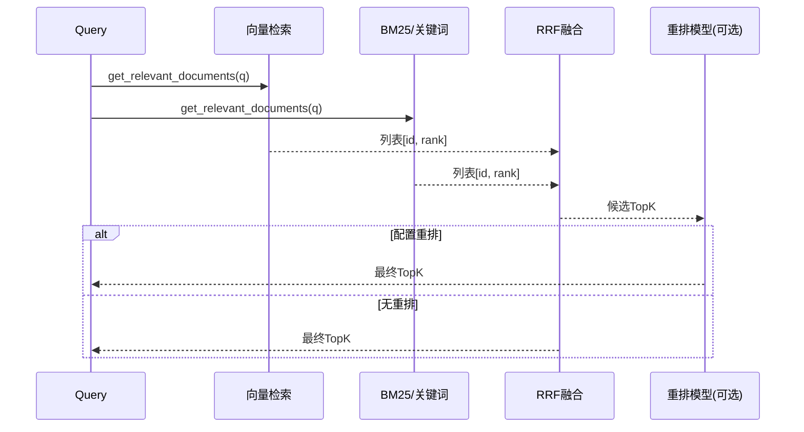
```mermaid
sequenceDiagram
    participant Q as Query
    participant VR as 向量检索
    participant BR as BM25/关键词
    participant RRF as RRF融合
    participant RR as 重排模型(可选)

    Q->>VR: get_relevant_documents(q)
    Q->>BR: get_relevant_documents(q)
    VR-->>RRF: 列表[id, rank]
    BR-->>RRF: 列表[id, rank]
    RRF-->>RR: 候选TopK
    alt 配置重排
        RR-->>Q: 最终TopK
    else 无重排
        RRF-->>Q: 最终TopK
    end
```

- 候选获取：`HybridRetriever.get_relevant_documents()` -> `vec.get_relevant_documents()` + `bm25.get_relevant_documents()`
- 融合排序：`_topk_pairs()` -> `_rrf()` -> 组装候选TopK
- 可选重排：`reranker.rerank()` -> 截断到`k`

### 4.3 语义缓存（Semantic Cache）

使用“近似命中可回退”策略：阈值附近可返回“近似命中”并提示生成回退路径，以提升命中率并兼顾答案质量：

```python
from langchain_core.documents import Document

class SemanticCache:
    def __init__(self, embeddings, vectorstore, threshold: float = 0.92):
        self.emb = embeddings
        self.vs = vectorstore
        self.threshold = threshold

    def lookup(self, query: str) -> str | None:
        results = self.vs.similarity_search_with_score(query, k=1)
        if not results:
            return None
        doc, score = results[0]
        if score >= self.threshold:  # 假设 score 越大越相似（需与具体向量库一致）
            return doc.metadata.get("response")
        return None

    def update(self, query: str, response: str):
        doc = Document(page_content=query, metadata={"response": response})
        self.vs.add_texts([doc.page_content], metadatas=[doc.metadata])
```

> 提示：生产中应根据具体向量库分数语义（相似度或距离）调整阈值与比较方向，并增加 TTL 与逐出策略。

#### 语义缓存命中与回填：时序图与调用路径

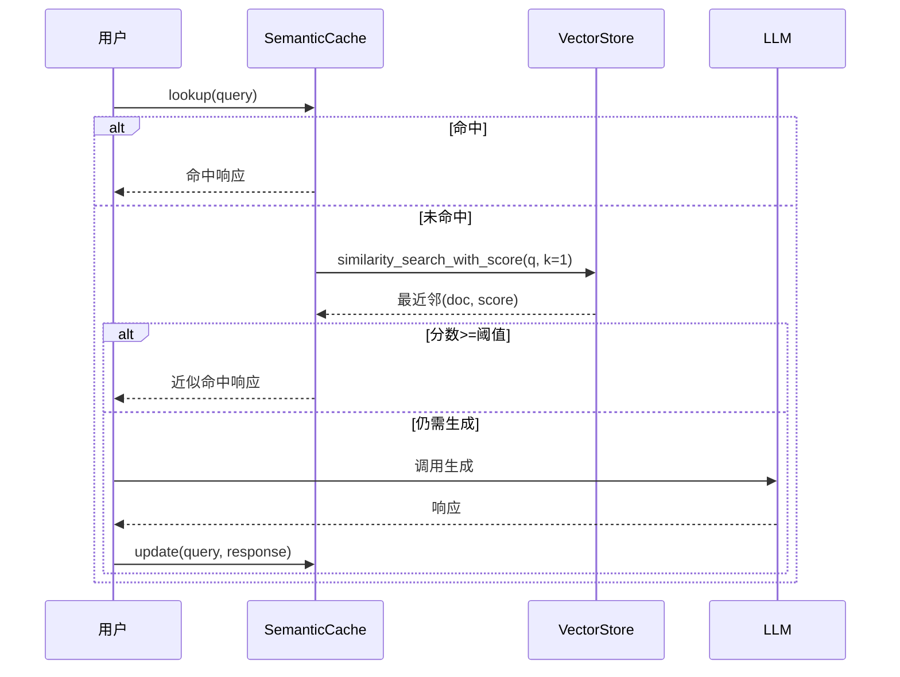
```mermaid
sequenceDiagram
    participant U as 用户
    participant Cache as SemanticCache
    participant VS as VectorStore
    participant LLM as LLM

    U->>Cache: lookup(query)
    alt 命中
        Cache-->>U: 命中响应
    else 未命中
        Cache->>VS: similarity_search_with_score(q, k=1)
        VS-->>Cache: 最近邻(doc, score)
        alt 分数>=阈值
            Cache-->>U: 近似命中响应
        else 仍需生成
            U->>LLM: 调用生成
            LLM-->>U: 响应
            U->>Cache: update(query, response)
        end
    end
```

- 查询命中：`SemanticCache.lookup()` -> `vs.similarity_search_with_score(k=1)` -> 分数阈值判定 -> 返回缓存响应或None
- 回填写入：`SemanticCache.update()` -> `Document(...)` -> `vs.add_texts()`

## 5. 关键函数与结构补充

本节对前述模块的关键函数补充核心代码片段（含简要注释与功能说明）、统一调用链、类结构图/继承关系与时序图索引，描述不包含价值判断。

### 5.1 安全与隐私（SecurityManager / SecurePromptTemplate）

关键函数（核心代码与说明）：

```python
class LangChainSecurityManager:
    def sanitize_input(self, text: str) -> str:
        """将输入中的潜在敏感字段替换为占位符。
        - 使用预置正则表达式集合匹配常见PII（邮箱/手机号/卡号等）
        - 返回与原文本形态一致但已脱敏的字符串
        """
        for pattern in self.sensitive_patterns:
            text = re.sub(pattern, '[REDACTED]', text)
        return text

    def encrypt_sensitive_data(self, data: str) -> str:
        """对敏感文本进行对称加密并做URL安全Base64编码，便于持久化传输。"""
        return base64.urlsafe_b64encode(self.cipher_suite.encrypt(data.encode())).decode()

    def decrypt_sensitive_data(self, encrypted_data: str) -> str:
        """对加密密文执行Base64解码与对称解密，恢复明文。"""
        return self.cipher_suite.decrypt(base64.urlsafe_b64decode(encrypted_data.encode())).decode()

class SecurePromptTemplate:
    def format(self, **kwargs) -> str:
        """对入参逐项脱敏后按模板格式化输出，避免PII泄露。"""
        sanitized = {k: (self.security_manager.sanitize_input(v) if isinstance(v, str) else v)
                     for k, v in kwargs.items()}
        return self.template.format(**sanitized)
```

统一调用链：

- 模板渲染：`SecurePromptTemplate.format()` -> `LangChainSecurityManager.sanitize_input()` -> `re.sub()`
- 加解密：`encrypt_sensitive_data()` -> `Fernet.encrypt()` / `decrypt_sensitive_data()` -> `Fernet.decrypt()`

类结构图（Mermaid）：

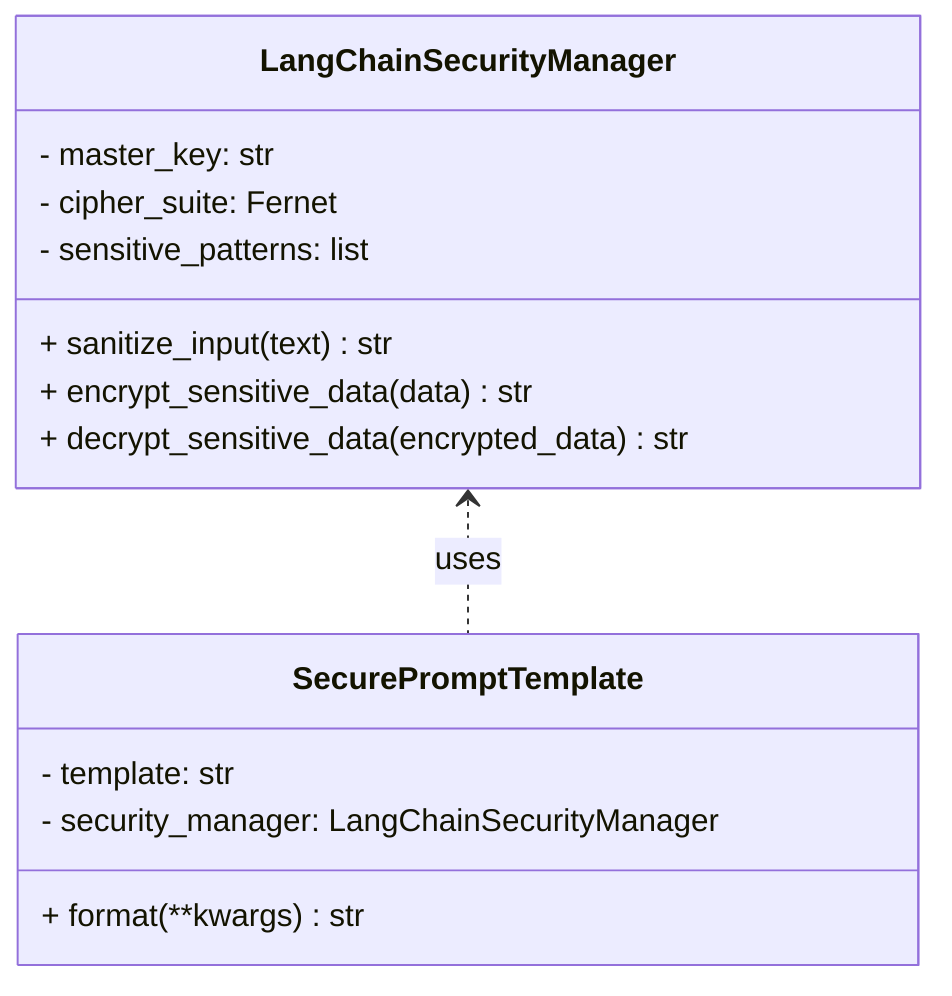
```mermaid
classDiagram
    class LangChainSecurityManager {
      - master_key: str
      - cipher_suite: Fernet
      - sensitive_patterns: list
      + sanitize_input(text) str
      + encrypt_sensitive_data(data) str
      + decrypt_sensitive_data(encrypted_data) str
    }
    class SecurePromptTemplate {
      - template: str
      - security_manager: LangChainSecurityManager
      + format(**kwargs) str
    }
    LangChainSecurityManager <.. SecurePromptTemplate : uses
```

时序图索引：见“1.1 输入清理与加密解密”小节。

### 5.2 访问控制（AccessControlManager / SecureLangChainAgent）

关键函数（核心代码与说明）：

```python
class AccessControlManager:
    def create_token(self, user_id: str, role: Role, expires_in: int = 3600) -> str:
        """生成带角色与权限列表的JWT，用于下游鉴权。"""
        payload = {
            'user_id': user_id,
            'role': role.value,
            'permissions': [p.value for p in self.role_permissions[role]],
            'exp': time.time() + expires_in,
            'iat': time.time(),
        }
        return jwt.encode(payload, self.secret_key, algorithm='HS256')

    def check_permission(self, token: str, required_permission: Permission) -> bool:
        """校验令牌中是否包含目标权限，失败返回False。"""
        payload = self.verify_token(token)
        return required_permission.value in payload.get('permissions', [])

    def require_permission(self, permission: Permission):
        """方法装饰器；在进入业务函数前执行权限验证，不通过抛出PermissionError。"""
        ...
```

统一调用链：

- 鉴权：`SecureLangChainAgent.authenticate()` -> `AccessControlManager.verify_token()` -> `jwt.decode()`
- 访问控制：`@require_permission(x)` -> `check_permission()` -> 业务函数执行

类结构图（Mermaid）：

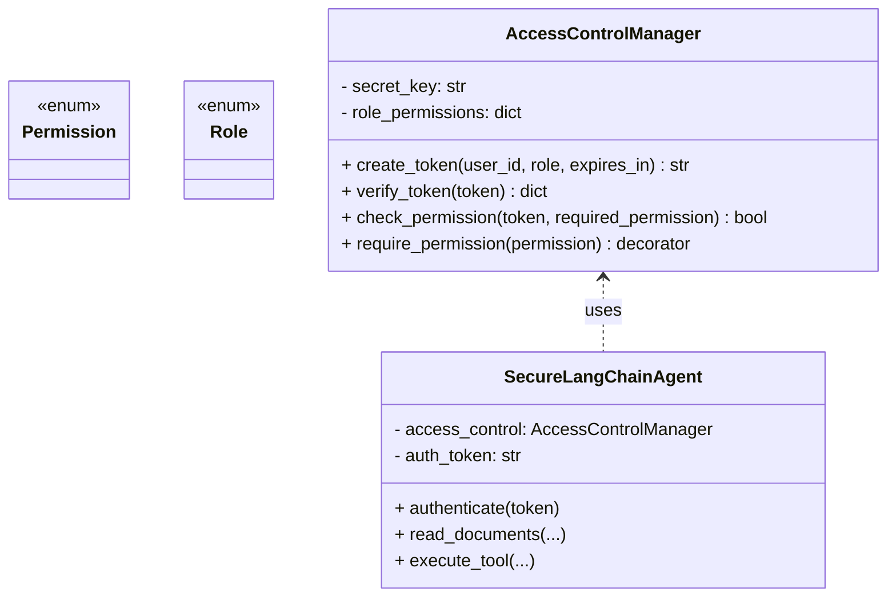
```mermaid
classDiagram
    class Permission { <<enum>> }
    class Role { <<enum>> }
    class AccessControlManager {
      - secret_key: str
      - role_permissions: dict
      + create_token(user_id, role, expires_in) str
      + verify_token(token) dict
      + check_permission(token, required_permission) bool
      + require_permission(permission) decorator
    }
    class SecureLangChainAgent {
      - access_control: AccessControlManager
      - auth_token: str
      + authenticate(token)
      + read_documents(...)
      + execute_tool(...)
    }
    AccessControlManager <.. SecureLangChainAgent : uses
```

时序图索引：见“1.2 访问控制与权限校验”。

### 5.3 多模态（MultiModalChatModel）

关键函数（核心代码与说明）：

```python
class MultiModalChatModel(BaseChatModel):
    def _process_multimodal_message(self, message: BaseMessage) -> Dict[str, Any]:
        """将文本/图像等多模态内容规范化为统一API请求体片段。"""
        ...

    def _encode_image_file(self, image_path: str) -> str:
        """将本地图片文件以Base64编码内联，使请求在无外网场景仍可发送。"""
        with open(image_path, 'rb') as f:
            return base64.b64encode(f.read()).decode('utf-8')
```

统一调用链：

- 生成：`_generate()` -> `_process_multimodal_message()` -> `requests.post(/chat/completions)`

类结构图（Mermaid）：

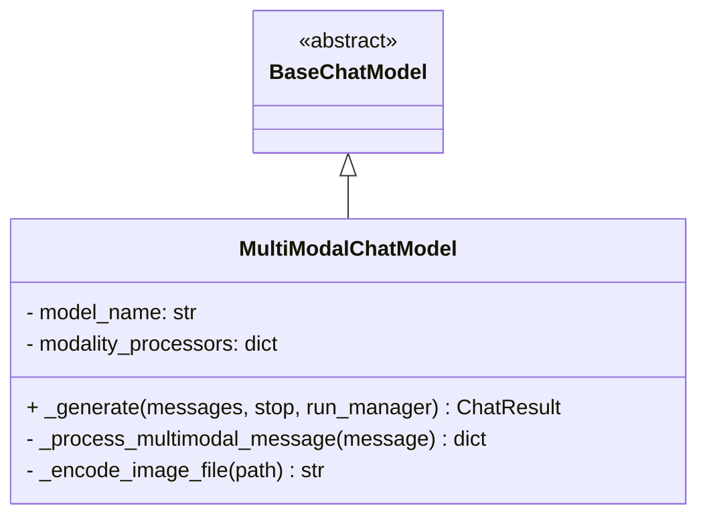
```mermaid
classDiagram
    class BaseChatModel { <<abstract>> }
    class MultiModalChatModel {
      - model_name: str
      - modality_processors: dict
      + _generate(messages, stop, run_manager) ChatResult
      - _process_multimodal_message(message) dict
      - _encode_image_file(path) str
    }
    BaseChatModel <|-- MultiModalChatModel
```

时序图索引：见“2.1 多模态消息处理与模型调用”。

### 5.4 输出安全与SSE（sanitize_chunk / astream_with_safety）

关键函数（核心代码与说明）：

```python
def sanitize_chunk(text: str) -> str:
    """对流式分片进行正则过滤，移除常见敏感模式。"""
    for p in SENSITIVE_PATTERNS:
        text = p.sub('[REDACTED]', text)
    return text

async def astream_with_safety(chain, payload: dict, *, on_chunk) -> str:
    """在异步流式生成过程中逐片过滤并回调输出，最终拼接完整响应。"""
    full = []
    async for chunk in chain.astream(payload):
        safe = sanitize_chunk(str(chunk))
        on_chunk(safe)
        full.append(safe)
    return ''.join(full)
```

统一调用链：`astream_with_safety()` -> `chain.astream()` -> `sanitize_chunk()` -> `on_chunk()`

类结构图：本模块以函数为主，无独立类。

时序图索引：见“2.2 SSE流式与输出过滤”。

### 5.5 负载均衡与故障转移（LoadBalancedChatModel）

关键函数（核心代码与说明）：

```python
class LoadBalancedChatModel:
    def _select_provider(self) -> Optional[str]:
        """按策略在健康提供方中选择目标（轮询/加权/最快等）。"""
        ...

    def _generate_with_fallback(self, messages: list, **kwargs):
        """带重试与指标更新的生成流程，失败切换下一Provider。"""
        ...
```

统一调用链：`_generate_with_fallback()` -> `_select_provider()` -> `provider._generate()` -> 指标更新

类结构图（Mermaid）：

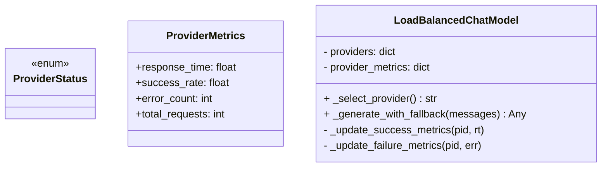
```mermaid
classDiagram
    class ProviderStatus { <<enum>> }
    class ProviderMetrics {
      +response_time: float
      +success_rate: float
      +error_count: int
      +total_requests: int
    }
    class LoadBalancedChatModel {
      - providers: dict
      - provider_metrics: dict
      + _select_provider() str
      + _generate_with_fallback(messages) Any
      - _update_success_metrics(pid, rt)
      - _update_failure_metrics(pid, err)
    }
```

时序图索引：见“3.1 负载均衡与故障转移”。

### 5.6 可靠性控制（RetryPolicy / CircuitBreaker / RateLimiter / QuotaRouter）

关键函数（核心代码与说明）：

```python
class RetryPolicy:
    async def aretry(self, fn):
        """以指数退避重试异步函数，达到上限后抛出最后一次异常。"""
        ...

class CircuitBreaker:
    def allow(self) -> bool:
        """根据冷却时间窗口决定是否放行请求。"""
        ...
```

统一调用链：`robust_generate()` -> `RateLimiter.acquire()` -> `CircuitBreaker.allow()` -> `RetryPolicy.aretry(call)`

类结构图（Mermaid）：

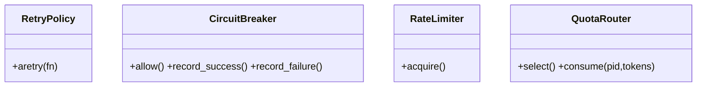
```mermaid
classDiagram
    class RetryPolicy { +aretry(fn) }
    class CircuitBreaker { +allow() +record_success() +record_failure() }
    class RateLimiter { +acquire() }
    class QuotaRouter { +select() +consume(pid,tokens) }
```

时序图索引：见“3.2 可靠性与配额”。

### 5.7 向量存储（HighPerformanceVectorStore）

关键函数（核心代码与说明）：

```python
class HighPerformanceVectorStore(VectorStore):
    def add_texts(self, texts: List[str], metadatas: Optional[List[dict]] = None, ids: Optional[List[str]] = None) -> List[str]:
        """批量嵌入并写入FAISS索引，更新映射与统计，并清空查询缓存。"""
        ...

    def similarity_search_with_score(self, query: str, k: int = 4, filter: Optional[dict] = None):
        """执行嵌入→检索→过滤→分数转换→缓存→统计更新，返回(doc, score)。"""
        ...
```

统一调用链：

- 写入：`add_texts()` -> `_batch_embed_texts()` -> `_initialize_index()` -> `index.add()`
- 检索：`similarity_search_with_score()` -> `embed_query()` -> `index.search()` -> `_distance_to_similarity()`

类结构图（Mermaid）：

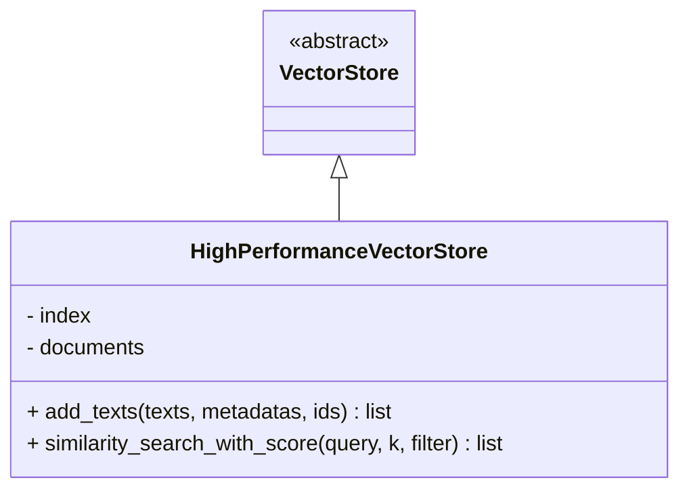
```mermaid
classDiagram
    class VectorStore { <<abstract>> }
    class HighPerformanceVectorStore {
      - index
      - documents
      + add_texts(texts, metadatas, ids) list
      + similarity_search_with_score(query, k, filter) list
    }
    VectorStore <|-- HighPerformanceVectorStore
```

时序图索引：见“4.1 向量检索与查询缓存”。

### 5.8 混合检索与重排（HybridRetriever）

关键函数（核心代码与说明）：

```python
class HybridRetriever:
    def get_relevant_documents(self, query: str):
        """分别检索向量/BM25结果，使用RRF融合并可选重排，返回TopK。"""
        ...
```

统一调用链：`get_relevant_documents()` -> `vec.get_relevant_documents()` + `bm25.get_relevant_documents()` -> `_rrf()` -> `reranker.rerank()`(可选)

类结构图（Mermaid）：

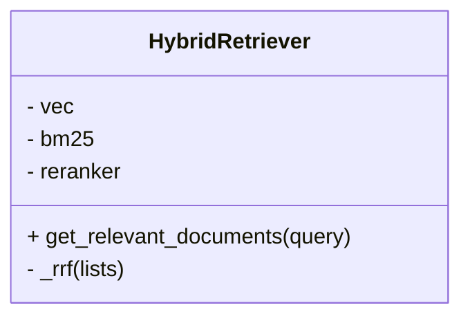
```mermaid
classDiagram
    class HybridRetriever {
      - vec
      - bm25
      - reranker
      + get_relevant_documents(query)
      - _rrf(lists)
    }
```

时序图索引：见“4.2 混合检索与重排”。

### 5.9 语义缓存（SemanticCache）

关键函数（核心代码与说明）：

```python
class SemanticCache:
    def lookup(self, query: str) -> str | None:
        """以k=1最近邻检索判断是否达到阈值，命中则返回缓存响应。"""
        ...
    def update(self, query: str, response: str):
        """将查询与响应以Document写入向量库，用于后续近似命中。"""
        ...
```

统一调用链：`lookup()` -> `vs.similarity_search_with_score()` -> 阈值判断；`update()` -> `vs.add_texts()`

类结构图（Mermaid）：

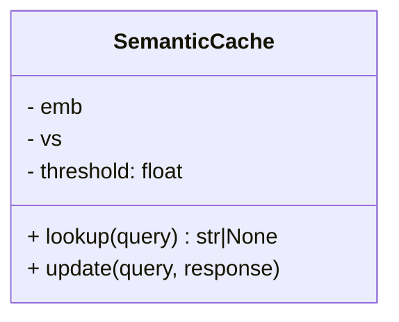
```mermaid
classDiagram
    class SemanticCache {
      - emb
      - vs
      - threshold: float
      + lookup(query) str|None
      + update(query, response)
    }
```

时序图索引：见“4.3 语义缓存命中与回填”。

### 5.10 统一时序图索引

- 安全：见“1.1 输入清理与加密解密”
- 访问控制：见“1.2 访问控制与权限校验”
- 审计：见“1.4 审计回调与落盘”
- 多模态：见“2.1 多模态消息处理与模型调用”
- SSE与输出过滤：见“2.2 SSE流式与输出过滤”
- 负载均衡：见“3.1 负载均衡与故障转移”
- 可靠性与配额：见“3.2 可靠性与配额”
- 向量检索：见“4.1 向量检索与查询缓存”
- 混合检索：见“4.2 混合检索与重排”
- 语义缓存：见“4.3 语义缓存命中与回填”

### 5.11 内容整合与去重说明

- 将各模块的“关键函数/调用链/类结构”以统一格式集中于第5章，避免在各分章重复阐述。
- 时序图维持在原分章位置，统一在第5.10节建立索引，减少图形重复。
- 对已出现的函数说明采用简述与索引方式，保持篇幅与可读性。

## 附录A. 可观测性与成本控制

### A.1 指标与Tracing

```python
from typing import Dict, Any
from langchain_core.callbacks import BaseCallbackHandler
import time

class MetricsCallback(BaseCallbackHandler):
    def __init__(self, emitter):
        self.emitter = emitter  # 可为 Prometheus/StatsD/OpenTelemetry 导出器
        self.llm_start_time = {}

    def on_llm_start(self, serialized: Dict[str, Any], prompts, *, run_id, **kwargs):
        self.llm_start_time[run_id] = time.time()

    def on_llm_end(self, response, *, run_id, **kwargs):
        start = self.llm_start_time.pop(run_id, None)
        if start:
            duration = time.time() - start
            self.emitter.gauge("llm.duration", duration)
        usage = (response.llm_output or {}).get("token_usage", {})
        self.emitter.gauge("llm.tokens.input", usage.get("prompt_tokens", 0))
        self.emitter.gauge("llm.tokens.output", usage.get("completion_tokens", 0))
```

### A.2 成本仪表（按模型/租户）

```python
PRICING = {
    "gpt-4": {"in": 0.03, "out": 0.06},
    "gpt-3.5-turbo": {"in": 0.001, "out": 0.002},
}

def estimate_cost(model: str, input_tokens: int, output_tokens: int) -> float:
    p = PRICING.get(model, {"in": 0.0, "out": 0.0})
    return (input_tokens / 1000) * p["in"] + (output_tokens / 1000) * p["out"]
```

## 附录B. 评测与 A/B

### B.1 离线基准集

采用“任务-指标-预算”的最小评测协议：离线以关键词/要点命中为主，在线以成功率/均耗时/Token 成本三指标作为 A/B 看板，可按租户/地域分桶：

```python
from dataclasses import dataclass
from typing import List

@dataclass
class EvalCase:
    query: str
    expected_keywords: List[str]

def offline_eval(chain, cases: List[EvalCase]) -> float:
    hits = 0
    for c in cases:
        out = chain.invoke({"question": c.query})
        text = str(out)
        if all(k.lower() in text.lower() for k in c.expected_keywords):
            hits += 1
    return hits / max(len(cases), 1)
```

### B.2 在线 A/B（简化）

```python
import random

class ABRouter:
    def __init__(self, variants: dict[str, Any], weights: dict[str, float]):
        self.variants = variants
        self.weights = weights

    def pick(self) -> str:
        names, ws = zip(*self.weights.items())
        r = random.random() * sum(ws)
        acc = 0
        for n, w in zip(names, ws):
            acc += w
            if r <= acc:
                return n
        return names[-1]
```

## 6. 总结

1. **安全机制**：数据加密、访问控制、隐私保护
2. **多模态集成**：图像、音频、视频等多种模态的处理
3. **负载均衡**：智能路由、故障转移、健康检查
4. **性能优化**：高性能向量存储、缓存机制、批处理优化

这些实践模式为开发者在生产环境中部署LangChain应用提供了重要的技术指导和最佳实践参考。

