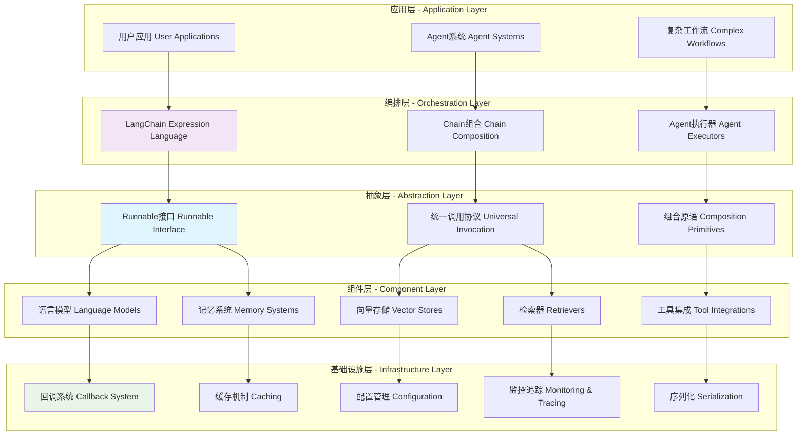
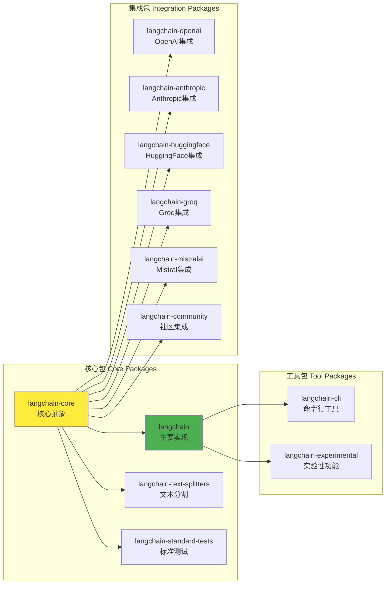
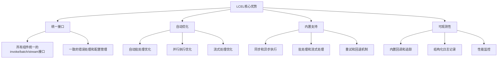
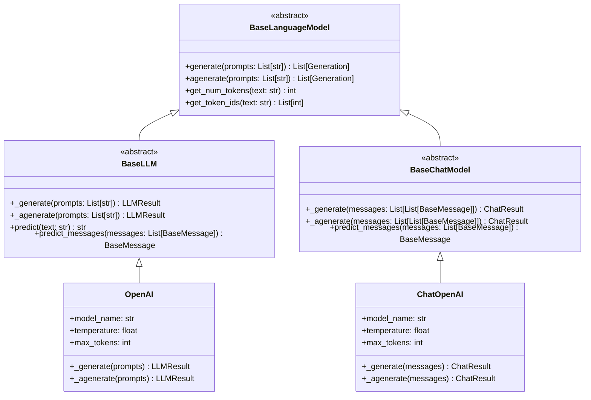
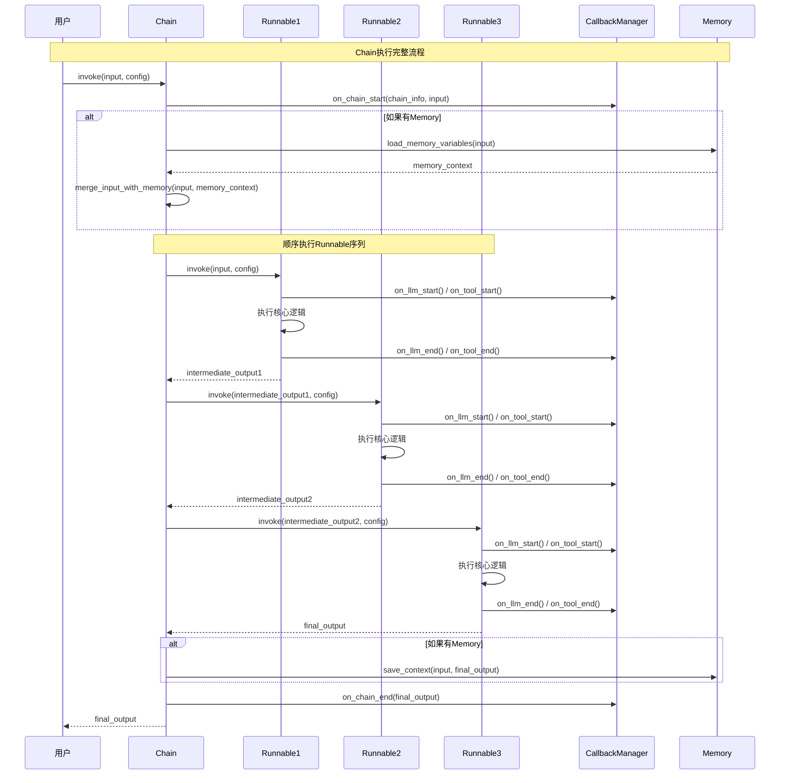
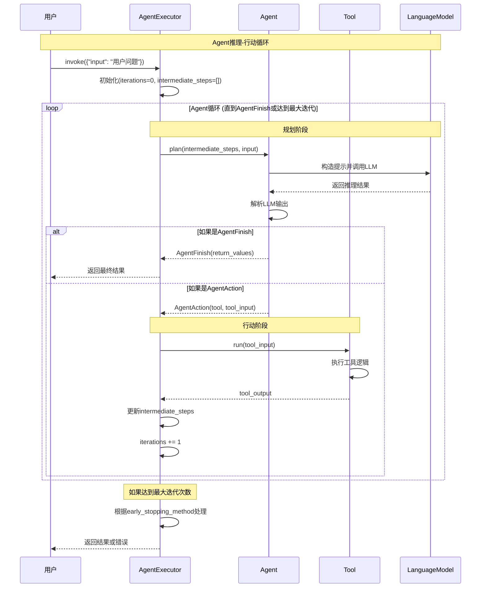
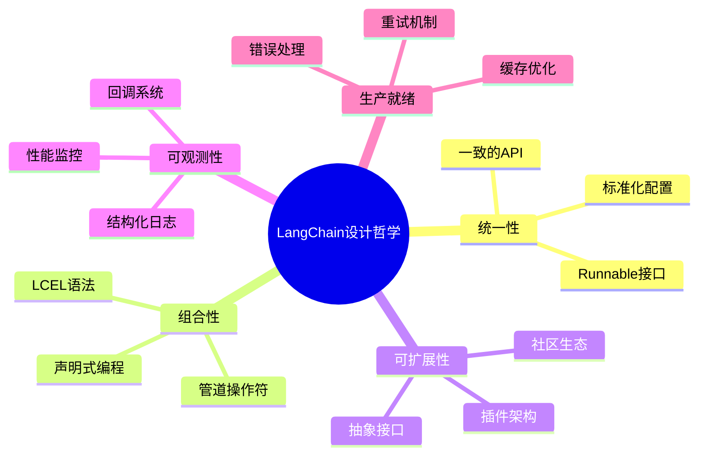

## 概述

LangChain是一个用于构建大语言模型(LLM)应用的框架，其核心设计理念是通过统一的抽象接口和声明式组合语法，让开发者能够快速构建复杂的AI应用。本文将深入分析LangChain的架构设计，揭示其背后的技术细节和设计哲学，并提供生产环境的实践指导。

<!--more-->

## 1. LangChain整体架构

### 1.1 架构分层设计

LangChain采用分层架构，从底层抽象到上层应用形成清晰的层次结构：



### 1.2 核心包结构

LangChain生态系统由多个相互协作的包组成：



## 2. Runnable：统一抽象的核心

### 2.1 Runnable接口设计

Runnable是LangChain最重要的抽象，所有组件都实现这个接口：

```python
from abc import ABC, abstractmethod
from typing import Generic, TypeVar, Optional, List, Iterator, AsyncIterator

Input = TypeVar('Input')
Output = TypeVar('Output')

class Runnable(ABC, Generic[Input, Output]):
    """可调用、可批处理、可流式处理、可转换和可组合的工作单元。

    核心方法
    ========
    - invoke/ainvoke: 将单个输入转换为输出
    - batch/abatch: 高效地将多个输入转换为输出
    - stream/astream: 从单个输入流式输出
    - astream_log: 流式输出和选定的中间结果

    内置优化
    ========
    - 批处理: 默认使用线程池并行执行invoke()
    - 异步: 带'a'前缀的方法是异步的，默认在asyncio线程池中执行同步版本

    LCEL和组合
    ==========
    LangChain表达式语言(LCEL)是组合Runnable的声明式方式。
    主要组合原语是RunnableSequence和RunnableParallel。
    """

    @abstractmethod
    def invoke(
        self,
        input: Input,
        config: Optional[RunnableConfig] = None,
        **kwargs: Any,
    ) -> Output:
        """将单个输入转换为输出。

        Args:
            input: Runnable的输入
            config: 调用Runnable时使用的配置，支持标准键如'tags'、'metadata'
                   用于追踪目的，'max_concurrency'用于控制并行工作量

        Returns:
            Runnable的输出
        """

    async def ainvoke(
        self,
        input: Input,
        config: Optional[RunnableConfig] = None,
        **kwargs: Any,
    ) -> Output:
        """ainvoke的默认实现，从线程调用invoke。

        默认实现允许使用异步代码，即使Runnable没有实现invoke的原生异步版本。
        如果子类可以异步运行，应该重写此方法。
        """
        return await run_in_executor(config, self.invoke, input, config, **kwargs)

    def batch(
        self,
        inputs: List[Input],
        config: Optional[Union[RunnableConfig, List[RunnableConfig]]] = None,
        *,
        return_exceptions: bool = False,
        **kwargs: Optional[Any],
    ) -> List[Output]:
        """批量处理输入列表。

        Args:
            inputs: 输入列表
            config: 配置或配置列表
            return_exceptions: 是否返回异常而不是抛出

        Returns:
            输出列表
        """

    def stream(
        self,
        input: Input,
        config: Optional[RunnableConfig] = None,
        **kwargs: Optional[Any],
    ) -> Iterator[Output]:
        """流式处理输出。

        Args:
            input: 单个输入
            config: 配置

        Yields:
            输出块
        """

    async def astream(
        self,
        input: Input,
        config: Optional[RunnableConfig] = None,
        **kwargs: Optional[Any],
    ) -> AsyncIterator[Output]:
        """异步流式处理输出。"""
```

### 2.2 Runnable的组合机制

LangChain通过操作符重载实现直观的组合语法：

```python
class Runnable(ABC, Generic[Input, Output]):

    def __or__(self, other: Runnable[Any, Other]) -> RunnableSequence[Input, Other]:
        """实现 | 操作符，创建序列组合。

        Example:
            chain = prompt | model | parser
        """
        return RunnableSequence(first=self, last=other)

    def __ror__(self, other: Runnable[Other, Input]) -> RunnableSequence[Other, Output]:
        """实现反向 | 操作符。"""
        return RunnableSequence(first=other, last=self)

    def __getitem__(self, key: str) -> RunnableBinding[Input, Output]:
        """实现索引操作，用于配置绑定。

        Example:
            configured_chain = chain.with_config({"temperature": 0.7})
        """
        return RunnableBinding(bound=self, config={"configurable": {key: True}})
```

### 2.3 核心组合原语

#### RunnableSequence：序列组合

```python
class RunnableSequence(RunnableSerializable[Input, Output]):
    """Runnable序列，其中每个的输出是下一个的输入。

    RunnableSequence是LangChain中最重要的组合操作符，因为它几乎用于每个链中。

    RunnableSequence可以直接实例化，或更常见地通过|操作符使用，
    其中左或右操作数（或两者）必须是Runnable。

    任何RunnableSequence都自动支持同步、异步、批处理。
    """

    first: Runnable[Input, Any]  # 第一个runnable
    middle: List[Runnable[Any, Any]]  # 中间的runnable列表
    last: Runnable[Any, Output]  # 最后一个runnable

    def invoke(self, input: Input, config: Optional[RunnableConfig] = None) -> Output:
        """顺序调用每个runnable。"""
        # 配置管理
        config = ensure_config(config)
        callback_manager = get_callback_manager_for_config(config)

        # 执行序列
        with callback_manager.on_chain_start(
            dumpd(self), input, name=config.get("run_name")
        ):
            # 执行第一个runnable
            intermediate = self.first.invoke(input, config)

            # 执行中间的runnable
            for step in self.middle:
                intermediate = step.invoke(intermediate, config)

            # 执行最后一个runnable
            output = self.last.invoke(intermediate, config)

            return output

    def batch(
        self,
        inputs: List[Input],
        config: Optional[Union[RunnableConfig, List[RunnableConfig]]] = None,
        **kwargs: Any,
    ) -> List[Output]:
        """批处理实现，按顺序对每个组件调用batch方法。"""
        configs = get_config_list(config, len(inputs))

        # 批处理第一个runnable
        intermediate_outputs = self.first.batch(inputs, configs, **kwargs)

        # 批处理中间的runnable
        for step in self.middle:
            intermediate_outputs = step.batch(intermediate_outputs, configs, **kwargs)

        # 批处理最后一个runnable
        return self.last.batch(intermediate_outputs, configs, **kwargs)
```

#### RunnableParallel：并行组合

```python
class RunnableParallel(RunnableSerializable[Input, Dict[str, Any]]):
    """并行调用runnable，为每个提供相同的输入。

    使用序列中的字典字面量或通过将字典传递给RunnableParallel来构造。
    """

    steps: Dict[str, Runnable[Input, Any]]

    def invoke(self, input: Input, config: Optional[RunnableConfig] = None) -> Dict[str, Any]:
        """并行调用所有步骤。"""
        config = ensure_config(config)

        # 使用线程池并行执行
        with ThreadPoolExecutor(max_workers=config.get("max_concurrency")) as executor:
            futures = {
                key: executor.submit(runnable.invoke, input, config)
                for key, runnable in self.steps.items()
            }

            return {
                key: future.result()
                for key, future in futures.items()
            }

    async def ainvoke(self, input: Input, config: Optional[RunnableConfig] = None) -> Dict[str, Any]:
        """异步并行调用所有步骤。"""
        config = ensure_config(config)

        # 使用asyncio并发执行
        tasks = {
            key: runnable.ainvoke(input, config)
            for key, runnable in self.steps.items()
        }

        results = await asyncio.gather(*tasks.values())
        return dict(zip(tasks.keys(), results))
```

## 3. LangChain Expression Language (LCEL)

### 3.1 LCEL设计理念

LCEL是LangChain的声明式组合语言，让开发者能够用简洁的语法构建复杂的处理链：

```python
# 传统命令式写法
def traditional_chain(input_text):
    prompt_result = prompt_template.format(input=input_text)
    model_result = model.invoke(prompt_result)
    parsed_result = output_parser.parse(model_result)
    return parsed_result

# LCEL声明式写法
chain = prompt_template | model | output_parser
result = chain.invoke({"input": input_text})
```

### 3.2 LCEL的核心优势



### 3.3 复杂LCEL示例

```python
from langchain_core.prompts import ChatPromptTemplate
from langchain_core.output_parsers import StrOutputParser
from langchain_openai import ChatOpenAI

# 构建复杂的RAG链
def build_rag_chain():
    # 1. 检索相关文档
    retriever = vectorstore.as_retriever(search_kwargs={"k": 5})

    # 2. 格式化检索到的文档
    def format_docs(docs):
        return "\n\n".join(doc.page_content for doc in docs)

    # 3. 构建提示模板
    prompt = ChatPromptTemplate.from_messages([
        ("system", "你是一个有用的助手。基于以下上下文回答问题：\n\n{context}"),
        ("human", "{question}")
    ])

    # 4. 初始化模型和解析器
    model = ChatOpenAI(temperature=0)
    output_parser = StrOutputParser()

    # 5. 使用LCEL组合整个链
    rag_chain = (
        {
            "context": retriever | format_docs,  # 并行：检索并格式化文档
            "question": RunnablePassthrough()     # 直接传递问题
        }
        | prompt          # 格式化提示
        | model           # 调用LLM
        | output_parser   # 解析输出
    )

    return rag_chain

# 使用链
chain = build_rag_chain()

# 单次调用
result = chain.invoke({"question": "什么是LangChain？"})

# 批量调用
results = chain.batch([
    {"question": "什么是LangChain？"},
    {"question": "如何使用LCEL？"},
    {"question": "Runnable接口的作用是什么？"}
])

# 流式调用
for chunk in chain.stream({"question": "解释一下RAG的工作原理"}):
    print(chunk, end="", flush=True)
```

## 4. 核心组件架构

### 4.1 语言模型抽象



### 4.2 向量存储抽象

```python
from abc import ABC, abstractmethod
from typing import List, Optional, Tuple

class VectorStore(ABC):
    """向量存储的抽象基类。

    向量存储负责存储嵌入向量并执行相似性搜索。
    """

    @abstractmethod
    def add_texts(
        self,
        texts: List[str],
        metadatas: Optional[List[dict]] = None,
        **kwargs: Any,
    ) -> List[str]:
        """向向量存储添加文本。

        Args:
            texts: 要添加的文本列表
            metadatas: 可选的元数据列表

        Returns:
            添加的文档ID列表
        """

    @abstractmethod
    def similarity_search(
        self,
        query: str,
        k: int = 4,
        **kwargs: Any,
    ) -> List[Document]:
        """返回与查询最相似的文档。

        Args:
            query: 查询字符串
            k: 返回的文档数量

        Returns:
            最相似的文档列表
        """

    def similarity_search_with_score(
        self,
        query: str,
        k: int = 4,
        **kwargs: Any,
    ) -> List[Tuple[Document, float]]:
        """返回与查询最相似的文档及其相似性分数。"""

    def as_retriever(self, **kwargs: Any) -> VectorStoreRetriever:
        """将向量存储转换为检索器。"""
        return VectorStoreRetriever(vectorstore=self, **kwargs)
```

### 4.3 工具集成架构

```python
from abc import ABC, abstractmethod
from typing import Optional, Type, Union

class BaseTool(ABC, BaseModel):
    """所有工具的基类。

    工具是Agent可以使用的函数，用于与外部世界交互。
    """

    name: str
    """工具的唯一名称，用于Agent识别"""

    description: str
    """工具功能的描述，用于Agent理解何时使用此工具"""

    args_schema: Optional[Type[BaseModel]] = None
    """工具参数的Pydantic模式"""

    return_direct: bool = False
    """是否直接返回工具的结果给用户"""

    @abstractmethod
    def _run(
        self,
        *args: Any,
        run_manager: Optional[CallbackManagerForToolRun] = None,
        **kwargs: Any,
    ) -> Any:
        """同步执行工具。"""

    async def _arun(
        self,
        *args: Any,
        run_manager: Optional[AsyncCallbackManagerForToolRun] = None,
        **kwargs: Any,
    ) -> Any:
        """异步执行工具。默认实现调用同步版本。"""
        return await run_in_executor(None, self._run, *args, **kwargs)

    def run(
        self,
        tool_input: Union[str, Dict],
        verbose: Optional[bool] = None,
        start_color: Optional[str] = "green",
        color: Optional[str] = "green",
        callbacks: Callbacks = None,
        **kwargs: Any,
    ) -> Any:
        """运行工具的用户接口。"""
        # 参数验证
        parsed_input = self._parse_input(tool_input)

        # 回调管理
        callback_manager = CallbackManager.configure(
            callbacks, verbose, None, None
        )

        # 执行工具
        with callback_manager.on_tool_start(
            {"name": self.name, "description": self.description},
            tool_input if isinstance(tool_input, str) else str(tool_input),
            color=start_color,
        ) as run_manager:
            try:
                tool_output = self._run(parsed_input, run_manager=run_manager, **kwargs)
            except Exception as e:
                run_manager.on_tool_error(e)
                raise
            else:
                run_manager.on_tool_end(str(tool_output), color=color)
                return tool_output
```

## 5. 执行流程和时序分析

### 5.1 Chain执行时序图



### 5.2 Agent执行循环



## 6. 配置和回调系统

### 6.1 RunnableConfig设计

```python
from typing import Any, Dict, List, Optional, Union
from langchain_core.callbacks import BaseCallbackHandler

class RunnableConfig(TypedDict, total=False):
    """Runnable的配置。

    这个配置用于控制Runnable的执行行为，包括回调、标签、元数据等。
    """

    # 回调配置
    callbacks: Optional[Union[List[BaseCallbackHandler], BaseCallbackManager]]
    """要使用的回调处理器列表或回调管理器"""

    # 执行控制
    max_concurrency: Optional[int]
    """最大并发数，用于控制并行执行的工作量"""

    recursion_limit: Optional[int]
    """递归限制，防止无限递归"""

    # 追踪和监控
    tags: Optional[List[str]]
    """用于追踪和过滤的标签列表"""

    metadata: Optional[Dict[str, Any]]
    """附加的元数据，用于追踪和调试"""

    run_name: Optional[str]
    """运行的名称，用于标识特定的执行"""

    run_id: Optional[UUID]
    """运行的唯一标识符"""

    # 可配置字段
    configurable: Optional[Dict[str, Any]]
    """可配置字段的值，用于运行时配置"""

def ensure_config(config: Optional[RunnableConfig] = None) -> RunnableConfig:
    """确保配置是有效的RunnableConfig。"""
    if config is None:
        return RunnableConfig()

    # 验证和标准化配置
    if not isinstance(config, dict):
        raise TypeError("config must be a dict")

    # 设置默认值
    config.setdefault("tags", [])
    config.setdefault("metadata", {})
    config.setdefault("configurable", {})

    return config
```

### 6.2 回调系统架构

```python
from abc import ABC, abstractmethod
from typing import Any, Dict, List, Optional, Union
from uuid import UUID

class BaseCallbackHandler(ABC):
    """回调处理器的基类。

    回调处理器用于在Runnable执行过程中的关键点执行自定义逻辑，
    如日志记录、监控、调试等。
    """

    ignore_llm: bool = False
    """是否忽略LLM事件"""

    ignore_chain: bool = False
    """是否忽略Chain事件"""

    ignore_agent: bool = False
    """是否忽略Agent事件"""

    ignore_retriever: bool = False
    """是否忽略Retriever事件"""

    def on_llm_start(
        self,
        serialized: Dict[str, Any],
        prompts: List[str],
        *,
        run_id: UUID,
        parent_run_id: Optional[UUID] = None,
        tags: Optional[List[str]] = None,
        metadata: Optional[Dict[str, Any]] = None,
        **kwargs: Any,
    ) -> Any:
        """LLM开始执行时调用。"""

    def on_llm_new_token(
        self,
        token: str,
        *,
        chunk: Optional[Union[GenerationChunk, ChatGenerationChunk]] = None,
        run_id: UUID,
        parent_run_id: Optional[UUID] = None,
        **kwargs: Any,
    ) -> Any:
        """LLM生成新token时调用。"""

    def on_llm_end(
        self,
        response: LLMResult,
        *,
        run_id: UUID,
        parent_run_id: Optional[UUID] = None,
        **kwargs: Any,
    ) -> Any:
        """LLM执行结束时调用。"""

    def on_llm_error(
        self,
        error: Union[Exception, KeyboardInterrupt],
        *,
        run_id: UUID,
        parent_run_id: Optional[UUID] = None,
        **kwargs: Any,
    ) -> Any:
        """LLM执行出错时调用。"""

    def on_chain_start(
        self,
        serialized: Dict[str, Any],
        inputs: Dict[str, Any],
        *,
        run_id: UUID,
        parent_run_id: Optional[UUID] = None,
        tags: Optional[List[str]] = None,
        metadata: Optional[Dict[str, Any]] = None,
        **kwargs: Any,
    ) -> Any:
        """Chain开始执行时调用。"""

    def on_chain_end(
        self,
        outputs: Dict[str, Any],
        *,
        run_id: UUID,
        parent_run_id: Optional[UUID] = None,
        **kwargs: Any,
    ) -> Any:
        """Chain执行结束时调用。"""

    def on_chain_error(
        self,
        error: Union[Exception, KeyboardInterrupt],
        *,
        run_id: UUID,
        parent_run_id: Optional[UUID] = None,
        **kwargs: Any,
    ) -> Any:
        """Chain执行出错时调用。"""

    def on_tool_start(
        self,
        serialized: Dict[str, Any],
        input_str: str,
        *,
        run_id: UUID,
        parent_run_id: Optional[UUID] = None,
        tags: Optional[List[str]] = None,
        metadata: Optional[Dict[str, Any]] = None,
        inputs: Optional[Dict[str, Any]] = None,
        **kwargs: Any,
    ) -> Any:
        """Tool开始执行时调用。"""

    def on_tool_end(
        self,
        output: str,
        *,
        run_id: UUID,
        parent_run_id: Optional[UUID] = None,
        **kwargs: Any,
    ) -> Any:
        """Tool执行结束时调用。"""

    def on_tool_error(
        self,
        error: Union[Exception, KeyboardInterrupt],
        *,
        run_id: UUID,
        parent_run_id: Optional[UUID] = None,
        **kwargs: Any,
    ) -> Any:
        """Tool执行出错时调用。"""

class CallbackManager:
    """回调管理器，负责管理和调度回调处理器。"""

    def __init__(
        self,
        handlers: List[BaseCallbackHandler],
        inheritable_handlers: Optional[List[BaseCallbackHandler]] = None,
        parent_run_id: Optional[UUID] = None,
        *,
        tags: Optional[List[str]] = None,
        inheritable_tags: Optional[List[str]] = None,
        metadata: Optional[Dict[str, Any]] = None,
        inheritable_metadata: Optional[Dict[str, Any]] = None,
    ):
        """初始化回调管理器。"""
        self.handlers = handlers or []
        self.inheritable_handlers = inheritable_handlers or []
        self.parent_run_id = parent_run_id
        self.tags = tags or []
        self.inheritable_tags = inheritable_tags or []
        self.metadata = metadata or {}
        self.inheritable_metadata = inheritable_metadata or {}

    def on_llm_start(
        self,
        serialized: Dict[str, Any],
        prompts: List[str],
        **kwargs: Any,
    ) -> CallbackManagerForLLMRun:
        """创建LLM运行的回调管理器。"""
        run_id = uuid4()

        # 通知所有处理器
        for handler in self.handlers:
            if not handler.ignore_llm:
                try:
                    handler.on_llm_start(
                        serialized,
                        prompts,
                        run_id=run_id,
                        parent_run_id=self.parent_run_id,
                        tags=self.tags,
                        metadata=self.metadata,
                        **kwargs,
                    )
                except Exception as e:
                    logger.warning(f"Error in callback handler: {e}")

        return CallbackManagerForLLMRun(
            run_id=run_id,
            handlers=self.handlers,
            inheritable_handlers=self.inheritable_handlers,
            parent_run_id=self.parent_run_id,
            tags=self.tags,
            inheritable_tags=self.inheritable_tags,
            metadata=self.metadata,
            inheritable_metadata=self.inheritable_metadata,
        )
```

## 7. 性能优化和最佳实践

### 7.1 批处理优化

LangChain通过智能批处理显著提升性能：

```python
# 自动批处理优化示例
class OptimizedChain(RunnableSequence):
    """优化的链，支持智能批处理。"""

    def batch(
        self,
        inputs: List[Input],
        config: Optional[Union[RunnableConfig, List[RunnableConfig]]] = None,
        **kwargs: Any,
    ) -> List[Output]:
        """优化的批处理实现。"""
        configs = get_config_list(config, len(inputs))

        # 检查是否可以进行批处理优化
        if self._can_batch_optimize():
            return self._optimized_batch(inputs, configs, **kwargs)
        else:
            return self._default_batch(inputs, configs, **kwargs)

    def _can_batch_optimize(self) -> bool:
        """检查是否所有组件都支持高效批处理。"""
        for step in [self.first] + self.middle + [self.last]:
            if not hasattr(step, 'batch') or not step._supports_batch_optimization:
                return False
        return True

    def _optimized_batch(
        self,
        inputs: List[Input],
        configs: List[RunnableConfig],
        **kwargs: Any,
    ) -> List[Output]:
        """优化的批处理实现，最小化网络调用。"""
        # 批量执行第一个步骤
        intermediate = self.first.batch(inputs, configs, **kwargs)

        # 批量执行中间步骤
        for step in self.middle:
            intermediate = step.batch(intermediate, configs, **kwargs)

        # 批量执行最后步骤
        return self.last.batch(intermediate, configs, **kwargs)
```

### 7.2 流式处理优化

```python
class StreamingChain(RunnableSequence):
    """支持流式处理的链。"""

    def stream(
        self,
        input: Input,
        config: Optional[RunnableConfig] = None,
        **kwargs: Any,
    ) -> Iterator[Output]:
        """流式处理实现。"""
        config = ensure_config(config)

        # 检查哪些组件支持流式处理
        streaming_components = self._identify_streaming_components()

        if streaming_components:
            yield from self._streaming_execution(input, config, **kwargs)
        else:
            # 回退到标准执行
            yield self.invoke(input, config, **kwargs)

    def _identify_streaming_components(self) -> List[int]:
        """识别支持流式处理的组件。"""
        streaming_indices = []
        for i, step in enumerate([self.first] + self.middle + [self.last]):
            if hasattr(step, 'stream') and step._supports_streaming:
                streaming_indices.append(i)
        return streaming_indices

    def _streaming_execution(
        self,
        input: Input,
        config: RunnableConfig,
        **kwargs: Any,
    ) -> Iterator[Output]:
        """流式执行实现。"""
        current_input = input

        # 执行非流式组件直到第一个流式组件
        for i, step in enumerate([self.first] + self.middle + [self.last]):
            if step._supports_streaming:
                # 开始流式处理
                for chunk in step.stream(current_input, config, **kwargs):
                    # 处理后续组件
                    processed_chunk = self._process_chunk_through_remaining_steps(
                        chunk, i + 1, config, **kwargs
                    )
                    if processed_chunk is not None:
                        yield processed_chunk
                break
            else:
                current_input = step.invoke(current_input, config, **kwargs)
```

### 7.3 缓存机制

```python
from functools import lru_cache
from typing import Hashable

class CachedRunnable(Runnable[Input, Output]):
    """带缓存的Runnable包装器。"""

    def __init__(
        self,
        runnable: Runnable[Input, Output],
        cache_size: int = 128,
        cache_ttl: Optional[int] = None,
    ):
        self.runnable = runnable
        self.cache_size = cache_size
        self.cache_ttl = cache_ttl
        self._cache = {}
        self._cache_times = {}

    def invoke(
        self,
        input: Input,
        config: Optional[RunnableConfig] = None,
        **kwargs: Any,
    ) -> Output:
        """带缓存的调用。"""
        # 生成缓存键
        cache_key = self._generate_cache_key(input, config, **kwargs)

        # 检查缓存
        if cache_key in self._cache:
            if self._is_cache_valid(cache_key):
                return self._cache[cache_key]
            else:
                # 缓存过期，删除
                del self._cache[cache_key]
                del self._cache_times[cache_key]

        # 执行并缓存结果
        result = self.runnable.invoke(input, config, **kwargs)

        # 更新缓存
        if len(self._cache) >= self.cache_size:
            self._evict_oldest()

        self._cache[cache_key] = result
        self._cache_times[cache_key] = time.time()

        return result

    def _generate_cache_key(
        self,
        input: Input,
        config: Optional[RunnableConfig],
        **kwargs: Any,
    ) -> str:
        """生成缓存键。"""
        # 简化的缓存键生成逻辑
        import hashlib

        key_data = {
            "input": input,
            "config": config,
            "kwargs": kwargs,
        }

        key_str = json.dumps(key_data, sort_keys=True, default=str)
        return hashlib.md5(key_str.encode()).hexdigest()

    def _is_cache_valid(self, cache_key: str) -> bool:
        """检查缓存是否有效。"""
        if self.cache_ttl is None:
            return True

        cache_time = self._cache_times.get(cache_key)
        if cache_time is None:
            return False

        return time.time() - cache_time < self.cache_ttl

    def _evict_oldest(self):
        """驱逐最老的缓存项。"""
        if not self._cache_times:
            return

        oldest_key = min(self._cache_times.keys(), key=lambda k: self._cache_times[k])
        del self._cache[oldest_key]
        del self._cache_times[oldest_key]
```

## 8. 安全与隐私保护机制

### 8.1 数据加密与隐私保护

LangChain在企业应用中需要完善的安全机制：

```python
import hashlib
import base64
from cryptography.fernet import Fernet
from cryptography.hazmat.primitives import hashes
from cryptography.hazmat.primitives.kdf.pbkdf2 import PBKDF2HMAC
import os
import re
from typing import Dict, Any, Optional

class LangChainSecurityManager:
    """LangChain安全管理器"""

    def __init__(self, master_key: Optional[str] = None):
        self.master_key = master_key or os.environ.get('LANGCHAIN_MASTER_KEY')
        if not self.master_key:
            raise ValueError("必须提供主密钥")

        self.cipher_suite = self._create_cipher_suite()
        self.sensitive_patterns = [
            r'\b\d{4}[-\s]?\d{4}[-\s]?\d{4}[-\s]?\d{4}\b',  # 信用卡号
            r'\b\d{3}-\d{2}-\d{4}\b',  # SSN
            r'\b[A-Za-z0-9._%+-]+@[A-Za-z0-9.-]+\.[A-Z|a-z]{2,}\b',  # 邮箱
            r'\b\d{11}\b',  # 手机号
        ]

    def _create_cipher_suite(self) -> Fernet:
        """创建加密套件"""
        password = self.master_key.encode()
        salt = b'langchain_salt_2024'  # 在生产环境中应使用随机salt

        kdf = PBKDF2HMAC(
            algorithm=hashes.SHA256(),
            length=32,
            salt=salt,
            iterations=100000,
        )

        key = base64.urlsafe_b64encode(kdf.derive(password))
        return Fernet(key)

    def encrypt_sensitive_data(self, data: str) -> str:
        """加密敏感数据"""
        try:
            encrypted_data = self.cipher_suite.encrypt(data.encode())
            return base64.urlsafe_b64encode(encrypted_data).decode()
        except Exception as e:
            raise ValueError(f"数据加密失败: {str(e)}")

    def decrypt_sensitive_data(self, encrypted_data: str) -> str:
        """解密敏感数据"""
        try:
            encrypted_bytes = base64.urlsafe_b64decode(encrypted_data.encode())
            decrypted_data = self.cipher_suite.decrypt(encrypted_bytes)
            return decrypted_data.decode()
        except Exception as e:
            raise ValueError(f"数据解密失败: {str(e)}")

    def sanitize_input(self, text: str) -> str:
        """清理输入中的敏感信息"""
        sanitized_text = text

        for pattern in self.sensitive_patterns:
            # 替换敏感信息为占位符
            sanitized_text = re.sub(pattern, '[REDACTED]', sanitized_text)

        return sanitized_text

class SecurePromptTemplate:
    """安全的提示模板"""

    def __init__(self, template: str, security_manager: LangChainSecurityManager):
        self.template = template
        self.security_manager = security_manager

    def format(self, **kwargs) -> str:
        """格式化提示，自动清理敏感信息"""
        sanitized_kwargs = {}

        for key, value in kwargs.items():
            if isinstance(value, str):
                sanitized_kwargs[key] = self.security_manager.sanitize_input(value)
            else:
                sanitized_kwargs[key] = value

        return self.template.format(**sanitized_kwargs)
```

### 8.2 访问控制与权限管理

```python
from enum import Enum
from functools import wraps
from typing import List, Dict, Any, Callable
import jwt
import time

class Permission(Enum):
    """权限枚举"""
    READ_DOCUMENTS = "read_documents"
    WRITE_DOCUMENTS = "write_documents"
    EXECUTE_TOOLS = "execute_tools"
    MANAGE_AGENTS = "manage_agents"
    ADMIN_ACCESS = "admin_access"

class Role(Enum):
    """角色枚举"""
    GUEST = "guest"
    USER = "user"
    DEVELOPER = "developer"
    ADMIN = "admin"

class AccessControlManager:
    """访问控制管理器"""

    def __init__(self, secret_key: str):
        self.secret_key = secret_key
        self.role_permissions = {
            Role.GUEST: [Permission.READ_DOCUMENTS],
            Role.USER: [Permission.READ_DOCUMENTS, Permission.EXECUTE_TOOLS],
            Role.DEVELOPER: [
                Permission.READ_DOCUMENTS,
                Permission.WRITE_DOCUMENTS,
                Permission.EXECUTE_TOOLS,
                Permission.MANAGE_AGENTS
            ],
            Role.ADMIN: [
                Permission.READ_DOCUMENTS,
                Permission.WRITE_DOCUMENTS,
                Permission.EXECUTE_TOOLS,
                Permission.MANAGE_AGENTS,
                Permission.ADMIN_ACCESS
            ]
        }

    def create_token(self, user_id: str, role: Role, expires_in: int = 3600) -> str:
        """创建JWT令牌"""
        payload = {
            'user_id': user_id,
            'role': role.value,
            'permissions': [p.value for p in self.role_permissions[role]],
            'exp': time.time() + expires_in,
            'iat': time.time()
        }

        return jwt.encode(payload, self.secret_key, algorithm='HS256')

    def verify_token(self, token: str) -> Dict[str, Any]:
        """验证JWT令牌"""
        try:
            payload = jwt.decode(token, self.secret_key, algorithms=['HS256'])
            return payload
        except jwt.ExpiredSignatureError:
            raise ValueError("令牌已过期")
        except jwt.InvalidTokenError:
            raise ValueError("无效的令牌")

    def check_permission(self, token: str, required_permission: Permission) -> bool:
        """检查权限"""
        try:
            payload = self.verify_token(token)
            user_permissions = payload.get('permissions', [])
            return required_permission.value in user_permissions
        except ValueError:
            return False
```

## 9. 实际应用案例与最佳实践

### 9.1 企业级RAG系统实现

```python
from langchain_core.runnables import RunnablePassthrough, RunnableParallel
from langchain_core.prompts import ChatPromptTemplate
from langchain_core.output_parsers import StrOutputParser
from langchain_openai import ChatOpenAI, OpenAIEmbeddings
from langchain_community.vectorstores import FAISS
from langchain_text_splitters import RecursiveCharacterTextSplitter
from functools import lru_cache
import logging

class EnterpriseRAGSystem:
    """企业级RAG系统实现"""

    def __init__(self, model_name: str = "gpt-3.5-turbo"):
        self.model = ChatOpenAI(model_name=model_name, temperature=0.1)
        self.embeddings = OpenAIEmbeddings()
        self.text_splitter = RecursiveCharacterTextSplitter(
            chunk_size=1000,
            chunk_overlap=200,
            separators=["\n\n", "\n", "。", "！", "？", "；", "，", " ", ""]
        )
        self.logger = logging.getLogger(__name__)

    @lru_cache(maxsize=128)
    def load_vector_store(self, vs_path: str):
        """加载向量存储器，使用LRU缓存优化性能"""
        try:
            return FAISS.load_local(vs_path, self.embeddings)
        except Exception as e:
            self.logger.error(f"加载向量存储失败: {e}")
            raise

    def create_retrieval_chain(self, vectorstore):
        """创建检索链，实现混合检索策略"""

        # 定义提示模板
        prompt = ChatPromptTemplate.from_messages([
            ("system", """你是一个专业的AI助手。请基于以下上下文信息回答用户问题：

上下文信息：
{context}

请注意：
1. 如果上下文中没有相关信息，请明确说明
2. 回答要准确、简洁、有条理
3. 可以适当引用上下文中的具体内容"""),
            ("human", "{question}")
        ])

        # 创建检索器
        retriever = vectorstore.as_retriever(
            search_type="similarity_score_threshold",
            search_kwargs={
                "k": 5,
                "score_threshold": 0.7
            }
        )

        # 文档格式化函数
        def format_docs(docs):
            """格式化检索到的文档"""
            if not docs:
                return "未找到相关信息"

            formatted = []
            for i, doc in enumerate(docs, 1):
                content = doc.page_content.strip()
                source = doc.metadata.get('source', '未知来源')
                formatted.append(f"文档{i} (来源: {source}):\n{content}")

            return "\n\n".join(formatted)

        # 构建RAG链 - 使用LCEL语法
        rag_chain = (
            RunnableParallel({
                "context": retriever | format_docs,
                "question": RunnablePassthrough()
            })
            | prompt
            | self.model
            | StrOutputParser()
        )

        return rag_chain

    def create_conversational_chain(self, vectorstore, memory):
        """创建对话式检索链"""
        from langchain.chains import ConversationalRetrievalChain
        from langchain.memory import ConversationBufferMemory

        # 初始化对话内存
        if memory is None:
            memory = ConversationBufferMemory(
                memory_key="chat_history",
                return_messages=True,
                output_key="answer"
            )

        # 创建对话式检索链
        conversational_chain = ConversationalRetrievalChain.from_llm(
            llm=self.model,
            retriever=vectorstore.as_retriever(search_kwargs={"k": 4}),
            memory=memory,
            return_source_documents=True,
            verbose=True
        )

        return conversational_chain

# 使用示例
def create_enterprise_rag_demo():
    """企业级RAG系统使用示例"""

    # 初始化系统
    rag_system = EnterpriseRAGSystem()

    # 加载预构建的向量存储
    vectorstore = rag_system.load_vector_store("./knowledge_base")

    # 创建检索链
    rag_chain = rag_system.create_retrieval_chain(vectorstore)

    # 测试查询
    question = "什么是LangChain的核心设计理念？"

    try:
        response = rag_chain.invoke(question)
        print(f"问题: {question}")
        print(f"回答: {response}")
    except Exception as e:
        print(f"查询失败: {e}")

# 运行示例
if __name__ == "__main__":
    create_enterprise_rag_demo()
```

### 9.2 性能优化最佳实践

#### 9.2.1 向量存储优化

```python
class OptimizedVectorStore:
    """优化的向量存储实现"""

    def __init__(self, embeddings, cache_size=1000):
        self.embeddings = embeddings
        self.cache_size = cache_size
        self._embedding_cache = {}
        self._query_cache = {}

    @lru_cache(maxsize=1000)
    def cached_similarity_search(self, query: str, k: int = 4):
        """缓存相似性搜索结果"""
        cache_key = f"{query}:{k}"

        if cache_key in self._query_cache:
            return self._query_cache[cache_key]

        # 执行搜索
        results = self.vectorstore.similarity_search(query, k=k)

        # 缓存结果
        if len(self._query_cache) < self.cache_size:
            self._query_cache[cache_key] = results

        return results

    def batch_add_texts(self, texts: List[str], batch_size: int = 100):
        """批量添加文本，提高索引构建效率"""
        for i in range(0, len(texts), batch_size):
            batch = texts[i:i + batch_size]
            embeddings = self.embeddings.embed_documents(batch)
            self.vectorstore.add_embeddings(
                list(zip(batch, embeddings))
            )
```

#### 9.2.2 LLM调用优化

```python
class OptimizedLLMChain:
    """优化的LLM调用链"""

    def __init__(self, llm, prompt_template):
        self.llm = llm
        self.prompt_template = prompt_template
        self.request_cache = {}
        self.batch_queue = []
        self.batch_size = 10

    async def optimized_batch_invoke(self, inputs: List[Dict]):
        """优化的批量调用实现"""
        import asyncio
        from concurrent.futures import ThreadPoolExecutor

        # 检查缓存
        cached_results = {}
        uncached_inputs = []

        for i, input_data in enumerate(inputs):
            cache_key = self._generate_cache_key(input_data)
            if cache_key in self.request_cache:
                cached_results[i] = self.request_cache[cache_key]
            else:
                uncached_inputs.append((i, input_data))

        # 批量处理未缓存的请求
        if uncached_inputs:
            batch_results = await self._batch_process(
                [inp for _, inp in uncached_inputs]
            )

            # 更新缓存和结果
            for (i, input_data), result in zip(uncached_inputs, batch_results):
                cache_key = self._generate_cache_key(input_data)
                self.request_cache[cache_key] = result
                cached_results[i] = result

        # 按原始顺序返回结果
        return [cached_results[i] for i in range(len(inputs))]

    def _generate_cache_key(self, input_data: Dict) -> str:
        """生成缓存键"""
        import hashlib
        import json

        key_str = json.dumps(input_data, sort_keys=True)
        return hashlib.md5(key_str.encode()).hexdigest()

    async def _batch_process(self, inputs: List[Dict]):
        """批量处理输入"""
        # 格式化提示
        prompts = [
            self.prompt_template.format(**input_data)
            for input_data in inputs
        ]

        # 批量调用LLM
        responses = await self.llm.agenerate(prompts)

        return [resp.generations[0][0].text for resp in responses]
```

### 9.3 监控和调试最佳实践

```python
class LangChainMonitor:
    """LangChain监控和调试工具"""

    def __init__(self):
        self.metrics = {
            'total_requests': 0,
            'successful_requests': 0,
            'failed_requests': 0,
            'average_response_time': 0,
            'token_usage': 0
        }
        self.request_logs = []

    def create_monitoring_callback(self):
        """创建监控回调处理器"""
        from langchain.callbacks import BaseCallbackHandler
        import time

        class MonitoringCallback(BaseCallbackHandler):
            def __init__(self, monitor):
                self.monitor = monitor
                self.start_time = None

            def on_llm_start(self, serialized, prompts, **kwargs):
                self.start_time = time.time()
                self.monitor.metrics['total_requests'] += 1

            def on_llm_end(self, response, **kwargs):
                if self.start_time:
                    duration = time.time() - self.start_time
                    self.monitor._update_response_time(duration)

                self.monitor.metrics['successful_requests'] += 1

                # 记录token使用情况
                if hasattr(response, 'llm_output') and response.llm_output:
                    token_usage = response.llm_output.get('token_usage', {})
                    total_tokens = token_usage.get('total_tokens', 0)
                    self.monitor.metrics['token_usage'] += total_tokens

            def on_llm_error(self, error, **kwargs):
                self.monitor.metrics['failed_requests'] += 1
                self.monitor.request_logs.append({
                    'timestamp': time.time(),
                    'error': str(error),
                    'type': 'llm_error'
                })

        return MonitoringCallback(self)

    def _update_response_time(self, duration):
        """更新平均响应时间"""
        current_avg = self.metrics['average_response_time']
        total_requests = self.metrics['total_requests']

        if total_requests == 1:
            self.metrics['average_response_time'] = duration
        else:
            self.metrics['average_response_time'] = (
                (current_avg * (total_requests - 1) + duration) / total_requests
            )

    def get_performance_report(self):
        """获取性能报告"""
        success_rate = (
            self.metrics['successful_requests'] /
            max(self.metrics['total_requests'], 1) * 100
        )

        return {
            'success_rate': f"{success_rate:.2f}%",
            'average_response_time': f"{self.metrics['average_response_time']:.2f}s",
            'total_token_usage': self.metrics['token_usage'],
            'total_requests': self.metrics['total_requests'],
            'recent_errors': self.request_logs[-5:]  # 最近5个错误
        }

# 使用示例
monitor = LangChainMonitor()
callback = monitor.create_monitoring_callback()

# 在链中使用监控回调
chain = prompt | model | parser
result = chain.invoke(
    {"question": "测试问题"},
    config={"callbacks": [callback]}
)

# 查看性能报告
print(monitor.get_performance_report())
```

## 10. 总结

### 10.1 LangChain架构优势

1. **统一抽象**：Runnable接口提供了一致的编程模型
2. **组合性**：通过LCEL实现声明式组合
3. **可扩展性**：模块化设计支持灵活扩展
4. **可观测性**：内置的回调和追踪系统
5. **性能优化**：自动批处理和流式处理

### 10.2 设计哲学



### 10.3 生产环境建议

- **监控告警**：完整的指标收集和异常告警
- **降级策略**：关键路径的备用方案
- **配置管理**：环境变量和动态配置
- **安全防护**：输入验证和权限控制
- **容量规划**：基于负载的资源预估

LangChain的架构设计体现了现代软件工程的最佳实践，通过统一的抽象和灵活的组合机制，为构建复杂的AI应用提供了强大而优雅的解决方案。
