## 1. LangChain 整体架构概览

### 1.1 核心架构图

```mermaid
graph TB
    subgraph "应用层 (Application Layer)"
        A[用户应用] --> B[LangChain SDK]
        B --> C[Chain 编排器]
        B --> D[Agent 智能体]
        B --> E[Tool 工具集]
    end

    subgraph "核心抽象层 (Core Abstractions)"
        F[Runnable 接口] --> G[BaseChain]
        F --> H[BaseLLM]
        F --> I[BaseRetriever]
        F --> J[BaseTool]
        F --> K[BaseMemory]
    end

    subgraph "模型层 (Model Layer)"
        L[LLM Models]
        M[Chat Models]
        N[Embedding Models]
        O[Multimodal Models]

        L --> P[OpenAI]
        L --> Q[Anthropic]
        L --> R[Local Models]

        M --> S[ChatOpenAI]
        M --> T[ChatAnthropic]

        N --> U[OpenAIEmbeddings]
        N --> V[HuggingFaceEmbeddings]
    end

    subgraph "工具生态 (Tool Ecosystem)"
        W[Search Tools] --> W1[DuckDuckGo]
        W --> W2[Tavily]
        W --> W3[Google Search]

        X[Database Tools] --> X1[SQL Database]
        X --> X2[Vector Database]
        X --> X3[Graph Database]

        Y[API Tools] --> Y1[REST API]
        Y --> Y2[GraphQL]
        Y --> Y3[Custom Tools]
    end

    subgraph "记忆系统 (Memory System)"
        Z[Memory Types] --> Z1[ConversationBufferMemory]
        Z --> Z2[ConversationSummaryMemory]
        Z --> Z3[VectorStoreRetrieverMemory]
        Z --> Z4[EntityMemory]
    end

    subgraph "检索系统 (Retrieval System)"
        AA[Document Loaders] --> AA1[PDF Loader]
        AA --> AA2[Web Loader]
        AA --> AA3[Database Loader]

        BB[Text Splitters] --> BB1[RecursiveCharacterTextSplitter]
        BB --> BB2[TokenTextSplitter]
        BB --> BB3[SemanticSplitter]

        CC[Vector Stores] --> CC1[FAISS]
        CC --> CC2[Pinecone]
        CC --> CC3[Weaviate]
        CC --> CC4[Chroma]

        DD[Retrievers] --> DD1[VectorStoreRetriever]
        DD --> DD2[BM25Retriever]
        DD --> DD3[HybridRetriever]
    end

    subgraph "可观测性 (Observability)"
        EE[Callbacks] --> EE1[StdOutCallbackHandler]
        EE --> EE2[FileCallbackHandler]
        EE --> EE3[LangSmithCallbackHandler]
        EE --> EE4[WandbCallbackHandler]

        FF[Tracing] --> FF1[LangSmith]
        FF --> FF2[LangFuse]
        FF --> FF3[Custom Tracers]

        GG[Metrics] --> GG1[Token Usage]
        GG --> GG2[Latency]
        GG --> GG3[Error Rate]
    end

    subgraph "基础设施层 (Infrastructure)"
        HH[Cache Layer] --> HH1[InMemoryCache]
        HH --> HH2[RedisCache]
        HH --> HH3[SQLiteCache]

        II[Serialization] --> II1[JSON Serializer]
        II --> II2[Pickle Serializer]

        JJ[Configuration] --> JJ1[Environment Variables]
        JJ --> JJ2[Config Files]
        JJ --> JJ3[Runtime Config]
    end

    %% 连接关系
    C --> F
    D --> F
    E --> F

    G --> L
    G --> M
    H --> L
    H --> M
    I --> CC
    J --> W
    J --> X
    J --> Y
    K --> Z

    D --> E
    D --> K
    C --> I
    C --> K

    AA --> BB
    BB --> CC
    CC --> DD

    F --> EE
    F --> FF
    F --> GG

    style A fill:#e1f5fe
    style F fill:#f3e5f5
    style L fill:#e8f5e8
    style W fill:#fff3e0
    style Z fill:#fce4ec
    style AA fill:#e0f2f1
    style EE fill:#f1f8e9
    style HH fill:#fafafa
```
  </div>
</div>

### 1.2 数据流架构

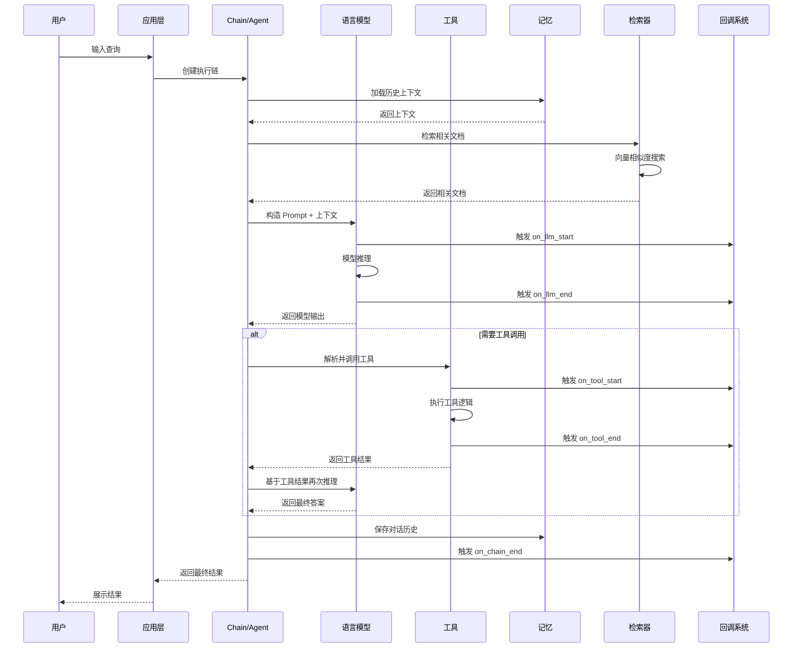
  </div>
</div>

## 2. 核心模块深度解析

### 2.1 Runnable 接口：统一抽象

```python
class Runnable(Generic[Input, Output], ABC):
    """LangChain 的核心抽象接口"""

    @abstractmethod
    def invoke(self, input: Input, config: Optional[RunnableConfig] = None) -> Output:
        """同步执行"""

    @abstractmethod
    async def ainvoke(self, input: Input, config: Optional[RunnableConfig] = None) -> Output:
        """异步执行"""

    def stream(self, input: Input, config: Optional[RunnableConfig] = None) -> Iterator[Output]:
        """流式执行"""

    def batch(self, inputs: List[Input], config: Optional[RunnableConfig] = None) -> List[Output]:
        """批量执行"""
```

**设计理念**：
- **统一接口**：所有组件都实现 `Runnable` 接口，支持 `invoke/ainvoke/stream/batch`
- **组合性**：通过 `|` 操作符实现链式组合
- **可配置性**：通过 `RunnableConfig` 传递配置和回调

### 2.2 Chain 执行引擎

#### 2.2.1 LLMChain：基础链

```python
class LLMChain(Chain):
    """最基础的 LLM 调用链"""

    llm: BaseLanguageModel
    prompt: BasePromptTemplate
    output_parser: Optional[BaseOutputParser] = None

    def _call(self, inputs: Dict[str, Any], run_manager: Optional[CallbackManagerForChainRun] = None) -> Dict[str, Any]:
        # 1. 格式化 Prompt
        prompt_value = self.prompt.format_prompt(**inputs)

        # 2. 调用 LLM
        response = self.llm.generate_prompt(
            [prompt_value],
            callbacks=run_manager.get_child() if run_manager else None
        )

        # 3. 解析输出
        if self.output_parser:
            return {"text": self.output_parser.parse(response.generations[0][0].text)}
        else:
            return {"text": response.generations[0][0].text}
```

#### 2.2.2 SequentialChain：顺序链

```python
class SequentialChain(Chain):
    """顺序执行多个链"""

    chains: List[Chain]
    input_variables: List[str]
    output_variables: List[str]

    def _call(self, inputs: Dict[str, Any], run_manager: Optional[CallbackManagerForChainRun] = None) -> Dict[str, Any]:
        known_values = inputs.copy()

        for i, chain in enumerate(self.chains):
            # 执行每个链，将输出作为下个链的输入
            chain_inputs = {k: known_values[k] for k in chain.input_keys if k in known_values}

            outputs = chain(
                chain_inputs,
                callbacks=run_manager.get_child(f"step_{i}") if run_manager else None
            )

            known_values.update(outputs)

        return {k: known_values[k] for k in self.output_variables}
```

### 2.3 Agent 智能体系统

#### 2.3.1 Agent 执行循环

```python
class AgentExecutor(Chain):
    """Agent 执行器 - 实现推理-行动循环"""

    agent: BaseSingleActionAgent
    tools: Sequence[BaseTool]
    max_iterations: int = 15
    max_execution_time: Optional[float] = None

    def _call(self, inputs: Dict[str, Any], run_manager: Optional[CallbackManagerForChainRun] = None) -> Dict[str, Any]:
        # 初始化
        agent_scratchpad = []
        iterations = 0
        time_elapsed = 0.0
        start_time = time.time()

        while self._should_continue(iterations, time_elapsed):
            # 1. Agent 规划下一步行动
            next_step_output = self._take_next_step(
                name_to_tool_map=self.name_to_tool_map,
                color_mapping=color_mapping,
                inputs=inputs,
                intermediate_steps=intermediate_steps,
                run_manager=run_manager
            )

            if isinstance(next_step_output, AgentFinish):
                # Agent 决定结束
                return self._return(next_step_output, intermediate_steps, run_manager)

            # 2. 执行工具调用
            intermediate_steps.extend(next_step_output)

            # 3. 更新状态
            iterations += 1
            time_elapsed = time.time() - start_time

        # 超出限制，强制结束
        return self._return(
            AgentFinish({"output": "Agent stopped due to iteration limit or time limit."}, ""),
            intermediate_steps,
            run_manager
        )
```

#### 2.3.2 ReAct Agent 实现

```python
def create_react_agent(llm: BaseLanguageModel, tools: Sequence[BaseTool], prompt: ChatPromptTemplate) -> Runnable:
    """创建 ReAct (Reasoning + Acting) Agent"""

    missing_vars = {"tools", "tool_names", "agent_scratchpad"}.difference(prompt.input_variables)
    if missing_vars:
        raise ValueError(f"Prompt missing variables: {missing_vars}")

    # 工具描述
    tool_strings = "\n".join([f"{tool.name}: {tool.description}" for tool in tools])
    tool_names = ", ".join([tool.name for tool in tools])

    # 格式化 Prompt
    prompt = prompt.partial(
        tools=tool_strings,
        tool_names=tool_names,
    )

    # 构建 Agent 链
    agent = (
        RunnablePassthrough.assign(
            agent_scratchpad=lambda x: format_to_openai_function_messages(x["intermediate_steps"])
        )
        | prompt
        | llm
        | ReActSingleActionAgent()
    )

    return agent
```

### 2.4 工具系统架构

#### 2.4.1 BaseTool 抽象

```python
class BaseTool(BaseModel, ABC):
    """工具基类"""

    name: str
    description: str
    return_direct: bool = False
    verbose: bool = False
    callbacks: Callbacks = Field(default=None, exclude=True)

    @abstractmethod
    def _run(self, *args: Any, **kwargs: Any) -> Any:
        """同步执行工具"""

    async def _arun(self, *args: Any, **kwargs: Any) -> Any:
        """异步执行工具"""
        raise NotImplementedError("Tool does not support async")

    def run(self, tool_input: Union[str, Dict], verbose: Optional[bool] = None, start_color: Optional[str] = "green", color: Optional[str] = "blue", callbacks: Callbacks = None, **kwargs: Any) -> Any:
        """执行工具的入口方法"""

        # 1. 参数解析和验证
        parsed_input = self._parse_input(tool_input)

        # 2. 回调通知开始
        if callbacks:
            callbacks.on_tool_start({"name": self.name, "description": self.description}, tool_input)

        try:
            # 3. 执行工具逻辑
            tool_run_kwargs = self._to_args_and_kwargs(parsed_input)
            observation = self._run(*tool_run_kwargs["args"], **tool_run_kwargs["kwargs"])

            # 4. 回调通知结束
            if callbacks:
                callbacks.on_tool_end(observation)

            return observation

        except Exception as e:
            # 5. 错误处理
            if callbacks:
                callbacks.on_tool_error(e)
            raise e
```

#### 2.4.2 工具调用流程

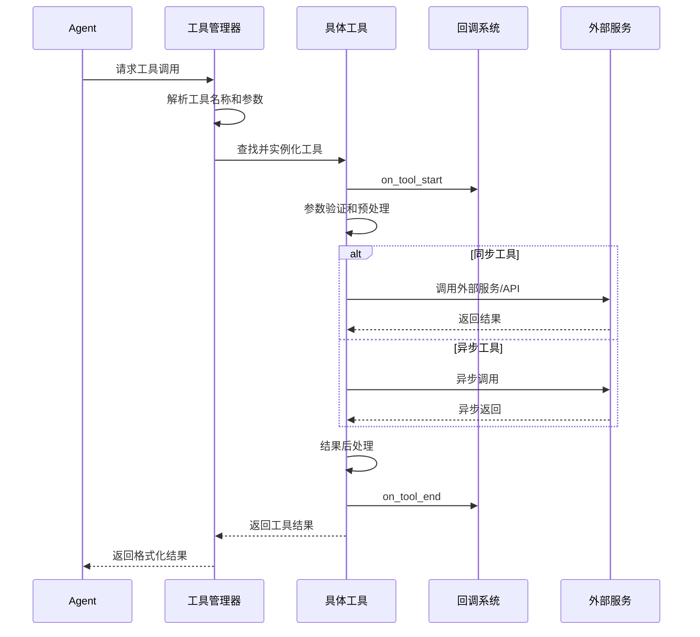
  </div>
</div>

### 2.5 记忆系统实现

#### 2.5.1 ConversationBufferMemory

```python
class ConversationBufferMemory(BaseChatMemory):
    """对话缓冲记忆 - 保存完整对话历史"""

    human_prefix: str = "Human"
    ai_prefix: str = "AI"
    buffer: str = ""

    @property
    def buffer_as_str(self) -> str:
        """获取字符串格式的缓冲区"""
        return get_buffer_string(
            self.chat_memory.messages,
            human_prefix=self.human_prefix,
            ai_prefix=self.ai_prefix,
        )

    @property
    def buffer_as_messages(self) -> List[BaseMessage]:
        """获取消息格式的缓冲区"""
        return self.chat_memory.messages

    def save_context(self, inputs: Dict[str, Any], outputs: Dict[str, str]) -> None:
        """保存对话上下文"""
        input_str, output_str = self._get_input_output(inputs, outputs)
        self.chat_memory.add_user_message(input_str)
        self.chat_memory.add_ai_message(output_str)

    def load_memory_variables(self, inputs: Dict[str, Any]) -> Dict[str, Any]:
        """加载记忆变量"""
        if self.return_messages:
            return {self.memory_key: self.buffer_as_messages}
        else:
            return {self.memory_key: self.buffer_as_str}
```

#### 2.5.2 ConversationSummaryMemory

```python
class ConversationSummaryMemory(BaseChatMemory):
    """对话摘要记忆 - 使用 LLM 生成摘要"""

    llm: BaseLanguageModel
    prompt: BasePromptTemplate = SUMMARY_PROMPT
    buffer: str = ""

    def predict_new_summary(self, messages: List[BaseMessage], existing_summary: str) -> str:
        """预测新的摘要"""
        new_lines = get_buffer_string(
            messages,
            human_prefix=self.human_prefix,
            ai_prefix=self.ai_prefix,
        )

        chain = LLMChain(llm=self.llm, prompt=self.prompt, verbose=self.verbose)
        return chain.predict(summary=existing_summary, new_lines=new_lines)

    def save_context(self, inputs: Dict[str, Any], outputs: Dict[str, str]) -> None:
        """保存上下文并更新摘要"""
        input_str, output_str = self._get_input_output(inputs, outputs)

        # 添加新消息
        self.chat_memory.add_user_message(input_str)
        self.chat_memory.add_ai_message(output_str)

        # 更新摘要
        self.buffer = self.predict_new_summary(
            self.chat_memory.messages[-2:], self.buffer
        )

        # 清理旧消息（保留最近几条）
        self.chat_memory.messages = self.chat_memory.messages[-2:]
```

### 2.6 检索系统架构

#### 2.6.1 文档加载与处理流程

```python
class DocumentLoader(ABC):
    """文档加载器基类"""

    @abstractmethod
    def load(self) -> List[Document]:
        """加载文档"""

    def load_and_split(self, text_splitter: Optional[TextSplitter] = None) -> List[Document]:
        """加载并分割文档"""
        if text_splitter is None:
            text_splitter = RecursiveCharacterTextSplitter()

        docs = self.load()
        return text_splitter.split_documents(docs)

class RecursiveCharacterTextSplitter(TextSplitter):
    """递归字符文本分割器"""

    def __init__(self, separators: Optional[List[str]] = None, **kwargs):
        super().__init__(**kwargs)
        self._separators = separators or ["\n\n", "\n", " ", ""]

    def split_text(self, text: str) -> List[str]:
        """递归分割文本"""
        final_chunks = []

        # 选择合适的分隔符
        separator = self._separators[-1]
        for _s in self._separators:
            if _s == "":
                separator = _s
                break
            if _s in text:
                separator = _s
                break

        # 按分隔符分割
        if separator:
            splits = text.split(separator)
        else:
            splits = [text]

        # 处理每个分割块
        good_splits = []
        for s in splits:
            if self._length_function(s) < self._chunk_size:
                good_splits.append(s)
            else:
                if good_splits:
                    merged_text = self._merge_splits(good_splits, separator)
                    final_chunks.extend(merged_text)
                    good_splits = []

                # 递归处理过大的块
                other_info = self.split_text(s)
                final_chunks.extend(other_info)

        if good_splits:
            merged_text = self._merge_splits(good_splits, separator)
            final_chunks.extend(merged_text)

        return final_chunks
```

#### 2.6.2 向量存储与检索

```python
class VectorStore(ABC):
    """向量存储抽象基类"""

    @abstractmethod
    def add_texts(self, texts: Iterable[str], metadatas: Optional[List[dict]] = None, **kwargs) -> List[str]:
        """添加文本到向量存储"""

    @abstractmethod
    def similarity_search(self, query: str, k: int = 4, **kwargs) -> List[Document]:
        """相似度搜索"""

    @abstractmethod
    def similarity_search_with_score(self, query: str, k: int = 4, **kwargs) -> List[Tuple[Document, float]]:
        """带分数的相似度搜索"""

    def as_retriever(self, **kwargs) -> VectorStoreRetriever:
        """转换为检索器"""
        return VectorStoreRetriever(vectorstore=self, **kwargs)

class FAISS(VectorStore):
    """FAISS 向量存储实现"""

    def __init__(self, embedding_function: Embeddings, index: Any, docstore: Docstore, index_to_docstore_id: Dict[int, str]):
        self.embedding_function = embedding_function
        self.index = index
        self.docstore = docstore
        self.index_to_docstore_id = index_to_docstore_id

    def add_texts(self, texts: Iterable[str], metadatas: Optional[List[dict]] = None, **kwargs) -> List[str]:
        """添加文本"""
        # 1. 生成嵌入向量
        embeddings = self.embedding_function.embed_documents(list(texts))

        # 2. 添加到 FAISS 索引
        starting_len = len(self.index_to_docstore_id)
        self.index.add(np.array(embeddings, dtype=np.float32))

        # 3. 更新文档存储
        ids = []
        for i, text in enumerate(texts):
            _id = str(uuid.uuid4())
            metadata = metadatas[i] if metadatas else {}
            doc = Document(page_content=text, metadata=metadata)

            self.docstore.add({_id: doc})
            self.index_to_docstore_id[starting_len + i] = _id
            ids.append(_id)

        return ids

    def similarity_search_with_score(self, query: str, k: int = 4, **kwargs) -> List[Tuple[Document, float]]:
        """相似度搜索"""
        # 1. 查询向量化
        embedding = self.embedding_function.embed_query(query)

        # 2. FAISS 搜索
        scores, indices = self.index.search(np.array([embedding], dtype=np.float32), k)

        # 3. 获取文档
        docs = []
        for j, i in enumerate(indices[0]):
            if i == -1:
                continue
            _id = self.index_to_docstore_id[i]
            doc = self.docstore.search(_id)
            if not isinstance(doc, Document):
                raise ValueError(f"Could not find document for id {_id}")
            docs.append((doc, scores[0][j]))

        return docs
```

### 2.7 回调系统与可观测性

#### 2.7.1 回调管理器

```python
class CallbackManager(BaseCallbackManager):
    """回调管理器 - 统一管理所有回调"""

    def __init__(self, handlers: List[BaseCallbackHandler], inheritable_handlers: Optional[List[BaseCallbackHandler]] = None, parent_run_id: Optional[UUID] = None, **kwargs):
        self.handlers: List[BaseCallbackHandler] = handlers
        self.inheritable_handlers: List[BaseCallbackHandler] = inheritable_handlers or []
        self.parent_run_id: Optional[UUID] = parent_run_id
        self.tags: List[str] = kwargs.get("tags", [])
        self.metadata: Dict[str, Any] = kwargs.get("metadata", {})

    def on_llm_start(self, serialized: Dict[str, Any], prompts: List[str], **kwargs) -> List[CallbackManagerForLLMRun]:
        """LLM 开始回调"""
        managers = []
        for handler in self.handlers:
            try:
                handler.on_llm_start(serialized, prompts, **kwargs)
                managers.append(CallbackManagerForLLMRun(
                    run_id=kwargs.get("run_id"),
                    handlers=[handler],
                    inheritable_handlers=self.inheritable_handlers,
                    parent_run_id=self.parent_run_id,
                    tags=self.tags,
                    metadata=self.metadata
                ))
            except Exception as e:
                logger.warning(f"Error in callback {handler}: {e}")
        return managers

    def on_chain_start(self, serialized: Dict[str, Any], inputs: Dict[str, Any], **kwargs) -> CallbackManagerForChainRun:
        """Chain 开始回调"""
        for handler in self.handlers:
            try:
                handler.on_chain_start(serialized, inputs, **kwargs)
            except Exception as e:
                logger.warning(f"Error in callback {handler}: {e}")

        return CallbackManagerForChainRun(
            run_id=kwargs.get("run_id"),
            handlers=self.handlers,
            inheritable_handlers=self.inheritable_handlers,
            parent_run_id=self.parent_run_id,
            tags=self.tags,
            metadata=self.metadata
        )
```

#### 2.7.2 性能监控回调

```python
class PerformanceCallbackHandler(BaseCallbackHandler):
    """性能监控回调处理器"""

    def __init__(self):
        self.chain_starts: Dict[UUID, float] = {}
        self.llm_starts: Dict[UUID, float] = {}
        self.tool_starts: Dict[UUID, float] = {}
        self.metrics: Dict[str, List[float]] = {
            "chain_duration": [],
            "llm_duration": [],
            "tool_duration": [],
            "token_usage": []
        }

    def on_chain_start(self, serialized: Dict[str, Any], inputs: Dict[str, Any], *, run_id: UUID, **kwargs) -> None:
        """记录 Chain 开始时间"""
        self.chain_starts[run_id] = time.time()

    def on_chain_end(self, outputs: Dict[str, Any], *, run_id: UUID, **kwargs) -> None:
        """计算 Chain 执行时间"""
        if run_id in self.chain_starts:
            duration = time.time() - self.chain_starts[run_id]
            self.metrics["chain_duration"].append(duration)
            del self.chain_starts[run_id]

    def on_llm_start(self, serialized: Dict[str, Any], prompts: List[str], *, run_id: UUID, **kwargs) -> None:
        """记录 LLM 开始时间"""
        self.llm_starts[run_id] = time.time()

    def on_llm_end(self, response: LLMResult, *, run_id: UUID, **kwargs) -> None:
        """计算 LLM 执行时间和 Token 使用"""
        if run_id in self.llm_starts:
            duration = time.time() - self.llm_starts[run_id]
            self.metrics["llm_duration"].append(duration)
            del self.llm_starts[run_id]

        # 记录 Token 使用
        if response.llm_output and "token_usage" in response.llm_output:
            total_tokens = response.llm_output["token_usage"].get("total_tokens", 0)
            self.metrics["token_usage"].append(total_tokens)

    def get_metrics_summary(self) -> Dict[str, Dict[str, float]]:
        """获取指标摘要"""
        summary = {}
        for metric_name, values in self.metrics.items():
            if values:
                summary[metric_name] = {
                    "count": len(values),
                    "total": sum(values),
                    "avg": sum(values) / len(values),
                    "min": min(values),
                    "max": max(values),
                    "p50": np.percentile(values, 50),
                    "p95": np.percentile(values, 95),
                    "p99": np.percentile(values, 99)
                }
        return summary
```

## 3. 核心执行流程分析

### 3.1 Chain 执行流程

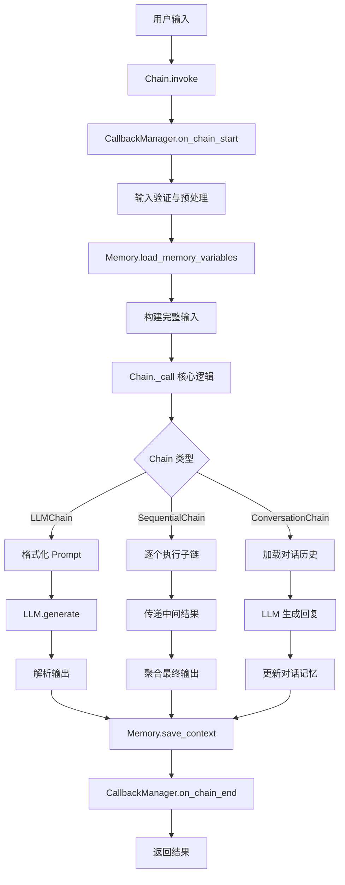
  </div>
</div>

### 3.2 Agent 推理循环

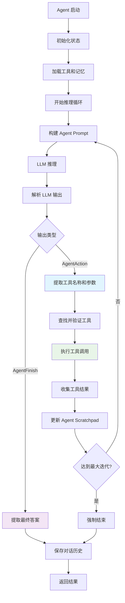
  </div>
</div>

### 3.3 RAG 检索流程

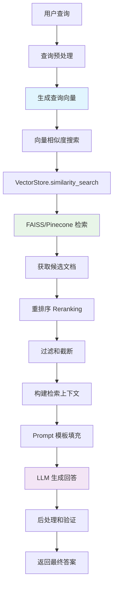
  </div>
</div>

## 4. 工程实践与性能优化

### 4.1 性能优化策略

#### 4.1.1 LLM 调用优化

```python
class OptimizedLLM:
    """优化的 LLM 调用封装"""

    def __init__(self, base_llm: BaseLanguageModel):
        self.base_llm = base_llm
        self.cache = {}  # 简单内存缓存
        self.request_queue = asyncio.Queue()
        self.batch_size = 10
        self.batch_timeout = 0.1  # 100ms

    async def batch_generate(self, prompts: List[str]) -> List[str]:
        """批量生成 - 提高吞吐量"""
        if len(prompts) == 1:
            return await self.base_llm.agenerate([prompts])

        # 分批处理
        results = []
        for i in range(0, len(prompts), self.batch_size):
            batch = prompts[i:i + self.batch_size]
            batch_results = await self.base_llm.agenerate(batch)
            results.extend(batch_results)

        return results

    def cached_generate(self, prompt: str) -> str:
        """缓存生成 - 避免重复调用"""
        prompt_hash = hashlib.md5(prompt.encode()).hexdigest()

        if prompt_hash in self.cache:
            return self.cache[prompt_hash]

        result = self.base_llm.generate([prompt])
        self.cache[prompt_hash] = result.generations[0][0].text

        return self.cache[prompt_hash]
```

#### 4.1.2 向量检索优化

```python
class OptimizedRetriever:
    """优化的检索器"""

    def __init__(self, vectorstore: VectorStore):
        self.vectorstore = vectorstore
        self.query_cache = {}
        self.embedding_cache = {}

    def retrieve_with_cache(self, query: str, k: int = 4) -> List[Document]:
        """带缓存的检索"""
        cache_key = f"{query}:{k}"

        if cache_key in self.query_cache:
            return self.query_cache[cache_key]

        docs = self.vectorstore.similarity_search(query, k=k)
        self.query_cache[cache_key] = docs

        return docs

    def hybrid_search(self, query: str, k: int = 4, alpha: float = 0.7) -> List[Document]:
        """混合检索 - 向量 + BM25"""
        # 向量检索
        vector_docs = self.vectorstore.similarity_search(query, k=k*2)

        # BM25 检索 (简化实现)
        bm25_docs = self._bm25_search(query, k=k*2)

        # 结果融合
        combined_docs = self._combine_results(vector_docs, bm25_docs, alpha)

        return combined_docs[:k]

    def _combine_results(self, vector_docs: List[Document], bm25_docs: List[Document], alpha: float) -> List[Document]:
        """结果融合算法"""
        # 实现 RRF (Reciprocal Rank Fusion) 或其他融合策略
        pass
```

### 4.2 错误处理与重试机制

```python
class RobustChain(Chain):
    """健壮的链实现 - 带重试和降级"""

    def __init__(self, base_chain: Chain, max_retries: int = 3, fallback_chain: Optional[Chain] = None):
        self.base_chain = base_chain
        self.max_retries = max_retries
        self.fallback_chain = fallback_chain

    def _call_with_retry(self, inputs: Dict[str, Any], run_manager: Optional[CallbackManagerForChainRun] = None) -> Dict[str, Any]:
        """带重试的调用"""
        last_exception = None

        for attempt in range(self.max_retries + 1):
            try:
                return self.base_chain(inputs, callbacks=run_manager.get_child() if run_manager else None)

            except Exception as e:
                last_exception = e

                if attempt < self.max_retries:
                    # 指数退避
                    wait_time = (2 ** attempt) * 0.1
                    time.sleep(wait_time)

                    if run_manager:
                        run_manager.on_text(f"Retry attempt {attempt + 1} after error: {str(e)}")
                else:
                    # 最后一次尝试失败，使用降级策略
                    if self.fallback_chain:
                        if run_manager:
                            run_manager.on_text("Using fallback chain due to repeated failures")
                        return self.fallback_chain(inputs, callbacks=run_manager.get_child() if run_manager else None)

        # 所有重试都失败
        raise last_exception
```

### 4.3 监控与告警

```python
class MonitoringCallbackHandler(BaseCallbackHandler):
    """监控回调处理器"""

    def __init__(self, metrics_client=None, alert_thresholds=None):
        self.metrics_client = metrics_client
        self.alert_thresholds = alert_thresholds or {
            "llm_duration": 30.0,  # 30秒
            "error_rate": 0.05,    # 5%
            "token_usage": 10000   # 10k tokens
        }
        self.error_count = 0
        self.total_requests = 0

    def on_llm_end(self, response: LLMResult, *, run_id: UUID, **kwargs) -> None:
        """监控 LLM 性能"""
        self.total_requests += 1

        # 记录 Token 使用
        if response.llm_output and "token_usage" in response.llm_output:
            tokens = response.llm_output["token_usage"]["total_tokens"]

            if self.metrics_client:
                self.metrics_client.gauge("llm.token_usage", tokens)

            # 检查告警阈值
            if tokens > self.alert_thresholds["token_usage"]:
                self._send_alert(f"High token usage: {tokens}")

    def on_llm_error(self, error: Union[Exception, KeyboardInterrupt], *, run_id: UUID, **kwargs) -> None:
        """监控错误率"""
        self.error_count += 1
        error_rate = self.error_count / max(self.total_requests, 1)

        if self.metrics_client:
            self.metrics_client.gauge("llm.error_rate", error_rate)

        if error_rate > self.alert_thresholds["error_rate"]:
            self._send_alert(f"High error rate: {error_rate:.2%}")

    def _send_alert(self, message: str):
        """发送告警"""
        logger.error(f"ALERT: {message}")
        # 集成 Slack、邮件等告警渠道
```

### 4.4 配置管理最佳实践

```python
class LangChainConfig:
    """LangChain 配置管理"""

    def __init__(self):
        self.llm_config = {
            "model": os.getenv("LLM_MODEL", "gpt-3.5-turbo"),
            "temperature": float(os.getenv("LLM_TEMPERATURE", "0.1")),
            "max_tokens": int(os.getenv("LLM_MAX_TOKENS", "1000")),
            "timeout": int(os.getenv("LLM_TIMEOUT", "30")),
            "max_retries": int(os.getenv("LLM_MAX_RETRIES", "3"))
        }

        self.agent_config = {
            "max_iterations": int(os.getenv("AGENT_MAX_ITERATIONS", "15")),
            "max_execution_time": int(os.getenv("AGENT_MAX_EXECUTION_TIME", "120")),
            "verbose": os.getenv("AGENT_VERBOSE", "false").lower() == "true"
        }

        self.retrieval_config = {
            "chunk_size": int(os.getenv("CHUNK_SIZE", "1000")),
            "chunk_overlap": int(os.getenv("CHUNK_OVERLAP", "200")),
            "top_k": int(os.getenv("RETRIEVAL_TOP_K", "4")),
            "similarity_threshold": float(os.getenv("SIMILARITY_THRESHOLD", "0.7"))
        }

    def create_llm(self) -> BaseLanguageModel:
        """创建配置化的 LLM"""
        return ChatOpenAI(**self.llm_config)

    def create_agent_executor(self, agent: Runnable, tools: List[BaseTool]) -> AgentExecutor:
        """创建配置化的 Agent 执行器"""
        return AgentExecutor(
            agent=agent,
            tools=tools,
            **self.agent_config
        )
```

## 5. 架构演进与扩展

### 5.1 模块化架构设计

```python
// 核心抽象层
from langchain_core.runnables import Runnable
from langchain_core.language_models import BaseLanguageModel
from langchain_core.tools import BaseTool
from langchain_core.memory import BaseMemory

// 实现层 - 可插拔组件
class PluggableAgent:
    """可插拔的 Agent 架构"""

    def __init__(self,
                 llm: BaseLanguageModel,
                 tools: List[BaseTool],
                 memory: BaseMemory,
                 planner: BasePlanner,
                 executor: BaseExecutor):
        self.llm = llm
        self.tools = tools
        self.memory = memory
        self.planner = planner
        self.executor = executor

    def run(self, query: str) -> str:
        """执行 Agent 任务"""
        # 1. 加载上下文
        context = self.memory.load_context()

        # 2. 规划任务
        plan = self.planner.plan(query, context, self.tools)

        # 3. 执行计划
        result = self.executor.execute(plan, self.tools, self.llm)

        # 4. 保存结果
        self.memory.save_context(query, result)

        return result
```

### 5.2 分布式架构支持

```python
class DistributedAgent:
    """分布式 Agent 系统"""

    def __init__(self, node_id: str, cluster_config: Dict):
        self.node_id = node_id
        self.cluster_config = cluster_config
        self.message_queue = MessageQueue(cluster_config["mq_url"])
        self.state_store = StateStore(cluster_config["state_url"])

    async def coordinate_task(self, task: Task) -> TaskResult:
        """协调分布式任务执行"""
        # 1. 任务分解
        subtasks = self.decompose_task(task)

        # 2. 分发子任务
        futures = []
        for subtask in subtasks:
            node = self.select_node(subtask)
            future = self.delegate_task(node, subtask)
            futures.append(future)

        # 3. 收集结果
        results = await asyncio.gather(*futures)

        # 4. 结果聚合
        final_result = self.aggregate_results(results)

        return final_result
```

## 6. 安全与隐私保护机制

### 6.1 数据加密与隐私保护

LangChain在企业应用中需要完善的安全机制：

```python
import hashlib
import base64
from cryptography.fernet import Fernet
from cryptography.hazmat.primitives import hashes
from cryptography.hazmat.primitives.kdf.pbkdf2 import PBKDF2HMAC
import os
import re
from typing import Dict, Any, Optional

class LangChainSecurityManager:
    """LangChain安全管理器

        https://blog.csdn.net/qq_28540861/article/details/149057817
    """

    def __init__(self, master_key: Optional[str] = None):
        self.master_key = master_key or os.environ.get('LANGCHAIN_MASTER_KEY')
        if not self.master_key:
            raise ValueError("必须提供主密钥")

        self.cipher_suite = self._create_cipher_suite()
        self.sensitive_patterns = [
            r'\b\d{4}[-\s]?\d{4}[-\s]?\d{4}[-\s]?\d{4}\b',  # 信用卡号
            r'\b\d{3}-\d{2}-\d{4}\b',  # SSN
            r'\b[A-Za-z0-9._%+-]+@[A-Za-z0-9.-]+\.[A-Z|a-z]{2,}\b',  # 邮箱
            r'\b\d{11}\b',  # 手机号
        ]

    def _create_cipher_suite(self) -> Fernet:
        """创建加密套件"""
        password = self.master_key.encode()
        salt = b'langchain_salt_2024'  # 在生产环境中应使用随机salt

        kdf = PBKDF2HMAC(
            algorithm=hashes.SHA256(),
            length=32,
            salt=salt,
            iterations=100000,
        )

        key = base64.urlsafe_b64encode(kdf.derive(password))
        return Fernet(key)

    def encrypt_sensitive_data(self, data: str) -> str:
        """加密敏感数据"""
        try:
            encrypted_data = self.cipher_suite.encrypt(data.encode())
            return base64.urlsafe_b64encode(encrypted_data).decode()
        except Exception as e:
            raise ValueError(f"数据加密失败: {str(e)}")

    def decrypt_sensitive_data(self, encrypted_data: str) -> str:
        """解密敏感数据"""
        try:
            encrypted_bytes = base64.urlsafe_b64decode(encrypted_data.encode())
            decrypted_data = self.cipher_suite.decrypt(encrypted_bytes)
            return decrypted_data.decode()
        except Exception as e:
            raise ValueError(f"数据解密失败: {str(e)}")

    def sanitize_input(self, text: str) -> str:
        """清理输入中的敏感信息"""
        sanitized_text = text

        for pattern in self.sensitive_patterns:
            # 替换敏感信息为占位符
            sanitized_text = re.sub(pattern, '[REDACTED]', sanitized_text)

        return sanitized_text

class SecurePromptTemplate:
    """安全的提示模板"""

    def __init__(self, template: str, security_manager: LangChainSecurityManager):
        self.template = template
        self.security_manager = security_manager

    def format(self, **kwargs) -> str:
        """格式化提示，自动清理敏感信息"""
        sanitized_kwargs = {}

        for key, value in kwargs.items():
            if isinstance(value, str):
                sanitized_kwargs[key] = self.security_manager.sanitize_input(value)
            else:
                sanitized_kwargs[key] = value

        return self.template.format(**sanitized_kwargs)
```

### 6.2 访问控制与权限管理

```python
from enum import Enum
from functools import wraps
from typing import List, Dict, Any, Callable
import jwt
import time

class Permission(Enum):
    """权限枚举"""
    READ_DOCUMENTS = "read_documents"
    WRITE_DOCUMENTS = "write_documents"
    EXECUTE_TOOLS = "execute_tools"
    MANAGE_AGENTS = "manage_agents"
    ADMIN_ACCESS = "admin_access"

class Role(Enum):
    """角色枚举"""
    GUEST = "guest"
    USER = "user"
    DEVELOPER = "developer"
    ADMIN = "admin"

class AccessControlManager:
    """访问控制管理器"""

    def __init__(self, secret_key: str):
        self.secret_key = secret_key
        self.role_permissions = {
            Role.GUEST: [Permission.READ_DOCUMENTS],
            Role.USER: [Permission.READ_DOCUMENTS, Permission.EXECUTE_TOOLS],
            Role.DEVELOPER: [
                Permission.READ_DOCUMENTS,
                Permission.WRITE_DOCUMENTS,
                Permission.EXECUTE_TOOLS,
                Permission.MANAGE_AGENTS
            ],
            Role.ADMIN: [
                Permission.READ_DOCUMENTS,
                Permission.WRITE_DOCUMENTS,
                Permission.EXECUTE_TOOLS,
                Permission.MANAGE_AGENTS,
                Permission.ADMIN_ACCESS
            ]
        }

    def create_token(self, user_id: str, role: Role, expires_in: int = 3600) -> str:
        """创建JWT令牌"""
        payload = {
            'user_id': user_id,
            'role': role.value,
            'permissions': [p.value for p in self.role_permissions[role]],
            'exp': time.time() + expires_in,
            'iat': time.time()
        }

        return jwt.encode(payload, self.secret_key, algorithm='HS256')

    def verify_token(self, token: str) -> Dict[str, Any]:
        """验证JWT令牌"""
        try:
            payload = jwt.decode(token, self.secret_key, algorithms=['HS256'])
            return payload
        except jwt.ExpiredSignatureError:
            raise ValueError("令牌已过期")
        except jwt.InvalidTokenError:
            raise ValueError("无效的令牌")

    def check_permission(self, token: str, required_permission: Permission) -> bool:
        """检查权限"""
        try:
            payload = self.verify_token(token)
            user_permissions = payload.get('permissions', [])
            return required_permission.value in user_permissions
        except ValueError:
            return False
```

## 7. 小结与最佳实践

### 7.1 架构设计原则

和企业实践，LangChain的核心设计原则包括：

1. **统一抽象**：通过 `Runnable` 接口实现组件的一致性
2. **组合优于继承**：使用链式组合构建复杂应用
3. **可观测性优先**：内置完整的回调和监控机制
4. **错误隔离**：工具执行失败不影响整体流程
5. **异步优先**：支持高并发和流式处理
6. **安全第一**：内置数据加密和访问控制机制
7. **性能优化**：编译时优化和运行时自适应

### 6.2 性能优化要点

- **批量处理**：LLM 调用、向量检索的批量优化
- **缓存策略**：多层缓存减少重复计算
- **连接池**：数据库和 API 连接复用
- **异步执行**：I/O 密集操作的异步化
- **资源限制**：内存、Token 使用的合理控制

### 6.3 生产环境建议

- **监控告警**：完整的指标收集和异常告警
- **降级策略**：关键路径的备用方案
- **配置管理**：环境变量和动态配置
- **安全防护**：输入验证和权限控制
- **容量规划**：基于负载的资源预估

---

*参考 [LangChain 官方文档](https://python.langchain.com/) 和源码实现*

---

## 7. 关键函数与结构补充


### 7.1 Runnable 与组合原语

关键函数（核心代码与说明）：

```python
class Runnable(Generic[Input, Output], ABC):
    def invoke(self, input: Input, config: Optional[RunnableConfig] = None, **kwargs) -> Output:
        """同步处理单个输入，返回对应输出；具体逻辑由子类实现。"""
        raise NotImplementedError

    def batch(self, inputs: List[Input], config: Optional[Union[RunnableConfig, List[RunnableConfig]]] = None, *, return_exceptions: bool = False, **kwargs) -> List[Output]:
        """并行/串行组合多次 invoke；默认线程池聚合结果。"""
        ...

    def stream(self, input: Input, config: Optional[RunnableConfig] = None, **kwargs) -> Iterator[Output]:
        """流式接口；默认退化为一次性返回 invoke 结果。"""
        yield self.invoke(input, config, **kwargs)
```

统一调用链：

- 单次执行：`invoke()` → 子类实现
- 批处理：`batch()` → 多次 `invoke()` 聚合
- 流式：`stream()` → 默认基于 `invoke()` 回退

类结构图（Mermaid）：

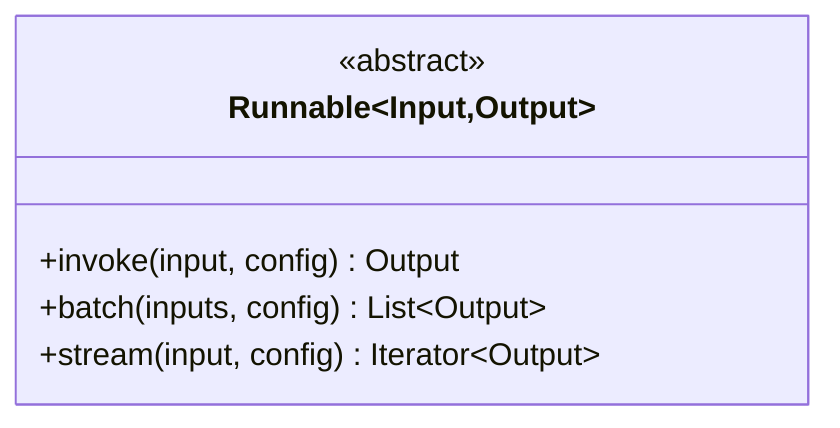

时序图索引：见“3.1 Chain 执行流程”。

### 7.2 Chain（LLMChain / SequentialChain）

关键函数（核心代码与说明）：

```python
class LLMChain(Chain):
    def _call(self, inputs: Dict[str, Any], run_manager: Optional[CallbackManagerForChainRun] = None) -> Dict[str, Any]:
        """将输入经 Prompt 格式化，调用 LLM，按需解析输出后返回。"""
        prompt_value = self.prompt.format_prompt(**inputs)
        response = self.llm.generate_prompt([prompt_value], callbacks=run_manager.get_child() if run_manager else None)
        return {"text": response.generations[0][0].text}

class SequentialChain(Chain):
    def _call(self, inputs: Dict[str, Any], run_manager: Optional[CallbackManagerForChainRun] = None) -> Dict[str, Any]:
        """串行执行子链，将上一步输出合并为下一步输入，最终聚合需要的输出键。"""
        known_values = inputs.copy()
        for i, chain in enumerate(self.chains):
            outputs = chain({k: known_values[k] for k in chain.input_keys if k in known_values}, callbacks=run_manager.get_child(f"step_{i}") if run_manager else None)
            known_values.update(outputs)
        return {k: known_values[k] for k in self.output_variables}
```

统一调用链：

- `LLMChain._call()`：格式化 → `LLM.generate_prompt()` → 解析
- `SequentialChain._call()`：依序执行子链 → 合并输出

类结构图（Mermaid）：

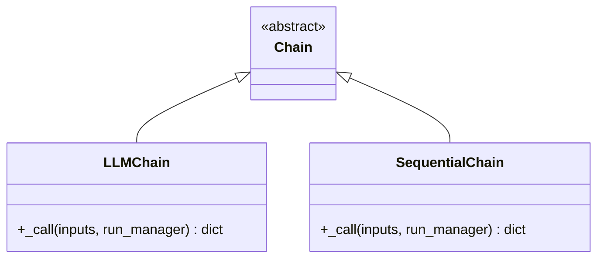

时序图索引：见“3.1 Chain 执行流程”。

### 7.3 Agent 执行（AgentExecutor / ReAct Agent）

关键函数（核心代码与说明）：

```python
class AgentExecutor(Chain):
    def _call(self, inputs: Dict[str, Any], run_manager: Optional[CallbackManagerForChainRun] = None) -> Dict[str, Any]:
        """执行推理-行动循环：规划→工具→汇总，直至结束或达到上限。"""
        intermediate_steps, iterations = [], 0
        start_time = time.time()
        while self._should_continue(iterations, time.time()-start_time):
            next_step = self._take_next_step(...)
            if isinstance(next_step, AgentFinish):
                return self._return(next_step, intermediate_steps, run_manager)
            intermediate_steps.extend(next_step)
            iterations += 1
        return self._return(AgentFinish({"output":"Agent stopped..."}, ""), intermediate_steps, run_manager)

def create_react_agent(llm, tools, prompt) -> Runnable:
    """基于 ReAct 模式构建单步 Agent：注入工具描述与scratchpad，串接 prompt→llm→解析器。"""
    ...
```

统一调用链：

- 执行器：`_take_next_step()` → 工具调用/AgentFinish → `_return()`
- ReAct：`format(prompt)` → `llm` → `ReActSingleActionAgent()`

类结构图（Mermaid）：

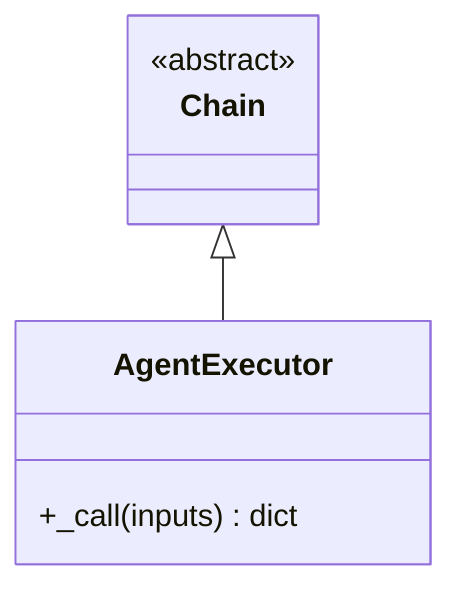

时序图索引：见“3.2 Agent 推理循环”。

### 7.4 工具系统（BaseTool）

关键函数（核心代码与说明）：

```python
class BaseTool(BaseModel, ABC):
    def run(self, tool_input: Union[str, Dict], verbose: Optional[bool] = None, start_color: Optional[str] = "green", color: Optional[str] = "blue", callbacks: Callbacks = None, **kwargs) -> Any:
        """统一入口：解析与校验参数→回调开始→执行 _run → 回调结束/错误处理。"""
        parsed = self._parse_input(tool_input)
        with callbacks.on_tool_start({"name": self.name}, tool_input) as rm:
            try:
                if self.args_schema: self._validate_args(parsed)
                obs = self._run(**parsed, run_manager=rm, **kwargs)
            except Exception as e:
                rm.on_tool_error(e); raise
            else:
                rm.on_tool_end(str(obs)); return obs
```

统一调用链：`run()` → `_parse_input()` →（可选）`_validate_args()` → `_run()` → 回调收尾

类结构图（Mermaid）：

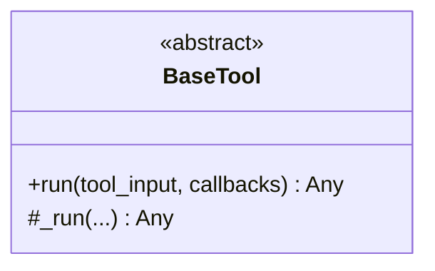

时序图索引：见“2.4.2 工具调用流程”。

### 7.5 回调系统（CallbackManager）

关键函数（核心代码与说明）：

```python
class CallbackManager(BaseCallbackManager):
    def on_llm_start(self, serialized: Dict[str, Any], prompts: List[str], **kwargs) -> List[CallbackManagerForLLMRun]:
        """构造子运行管理器并触发所有处理器的 on_llm_start 事件。"""
        managers = []
        for handler in self.handlers:
            handler.on_llm_start(serialized, prompts, **kwargs)
            managers.append(CallbackManagerForLLMRun(...))
        return managers
```

统一调用链：`on_chain_start()/on_llm_start()/on_tool_start()` → 对应 handler 事件 → 子 run 管理器

类结构图（Mermaid）：

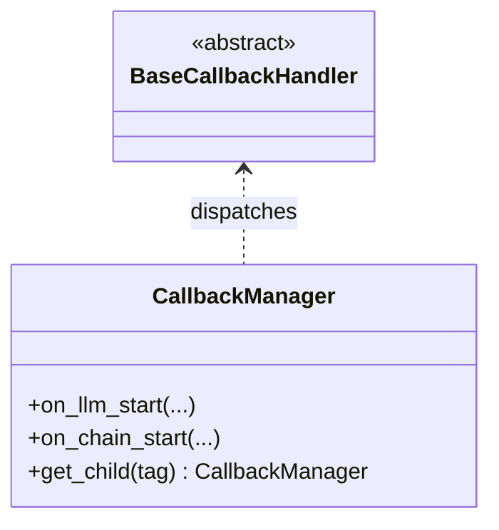

### 7.6 统一时序图索引

- Chain 执行：见“3.1 Chain 执行流程”
- Agent 循环：见“3.2 Agent 推理循环”
- 工具调用：见“2.4.2 工具调用流程”

