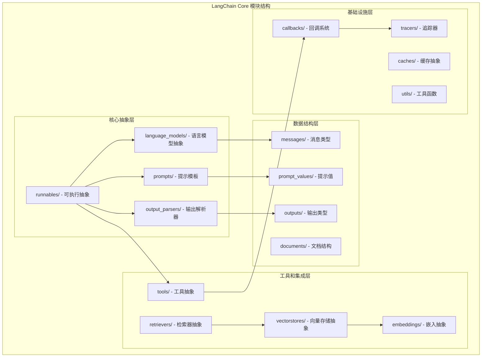
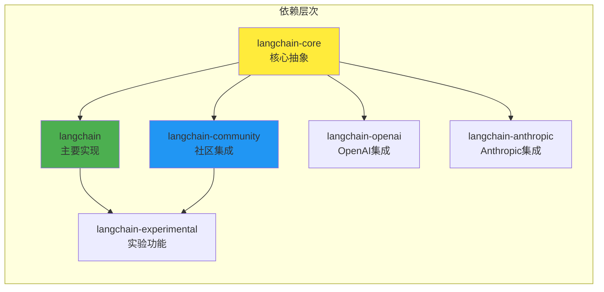
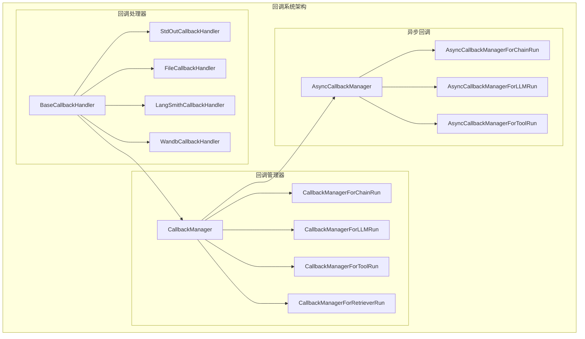

## 概述

LangChain Core是整个LangChain生态系统的基石，定义了核心抽象和统一的编程接口。本文将深入分析Core模块的设计理念、关键组件实现和源码细节，揭示其如何通过Runnable接口实现统一的编程模型。

<!--more-->

## 1. LangChain Core模块架构

### 1.1 Core模块组织结构



### 1.2 核心包依赖关系



## 2. Runnable：统一抽象的核心

### 2.1 Runnable接口设计哲学

Runnable是LangChain最重要的抽象，体现了"一切皆可执行"的设计理念：

```python
# langchain_core/runnables/base.py
from abc import ABC, abstractmethod
from typing import Generic, TypeVar, Optional, List, Iterator, AsyncIterator, Union, Any, Dict
from concurrent.futures import ThreadPoolExecutor, as_completed
import asyncio

Input = TypeVar('Input')
Output = TypeVar('Output')

class Runnable(ABC, Generic[Input, Output]):
    """可调用、可批处理、可流式处理、可转换和可组合的工作单元。

    核心方法
    ========
    - invoke/ainvoke: 将单个输入转换为输出
    - batch/abatch: 高效地将多个输入转换为输出
    - stream/astream: 从单个输入流式输出
    - astream_log: 流式输出和选定的中间结果

    内置优化
    ========
    - 批处理: 默认使用线程池并行执行invoke()
    - 异步: 带'a'前缀的方法是异步的，默认在asyncio线程池中执行同步版本

    LCEL和组合
    ==========
    LangChain表达式语言(LCEL)是组合Runnable的声明式方式。
    主要组合原语是RunnableSequence和RunnableParallel。
    """

    @abstractmethod
    def invoke(
        self,
        input: Input,
        config: Optional[RunnableConfig] = None,
        **kwargs: Any,
    ) -> Output:
        """将单个输入转换为输出。

        Args:
            input: Runnable的输入
            config: 调用Runnable时使用的配置，支持标准键如'tags'、'metadata'
                   用于追踪目的，'max_concurrency'用于控制并行工作量

        Returns:
            Runnable的输出
        """

    async def ainvoke(
        self,
        input: Input,
        config: Optional[RunnableConfig] = None,
        **kwargs: Any,
    ) -> Output:
        """ainvoke的默认实现，从线程调用invoke。

        默认实现允许使用异步代码，即使Runnable没有实现invoke的原生异步版本。
        如果子类可以异步运行，应该重写此方法。
        """
        return await run_in_executor(config, self.invoke, input, config, **kwargs)

    def batch(
        self,
        inputs: List[Input],
        config: Optional[Union[RunnableConfig, List[RunnableConfig]]] = None,
        *,
        return_exceptions: bool = False,
        **kwargs: Optional[Any],
    ) -> List[Output]:
        """批量处理输入列表。

        Args:
            inputs: 输入列表
            config: 配置或配置列表
            return_exceptions: 是否返回异常而不是抛出

        Returns:
            输出列表
        """
        if not inputs:
            return []

        # 处理配置
        configs = get_config_list(config, len(inputs))

        # 使用线程池并行执行
        def run_input(input_config_pair):
            input_item, config_item = input_config_pair
            try:
                return self.invoke(input_item, config_item, **kwargs)
            except Exception as e:
                if return_exceptions:
                    return e
                raise

        with ThreadPoolExecutor(max_workers=config.get("max_concurrency", None) if config else None) as executor:
            futures = [
                executor.submit(run_input, (input_item, config_item))
                for input_item, config_item in zip(inputs, configs)
            ]

            results = []
            for future in as_completed(futures):
                try:
                    result = future.result()
                    results.append(result)
                except Exception as e:
                    if return_exceptions:
                        results.append(e)
                    else:
                        raise

            return results

    def stream(
        self,
        input: Input,
        config: Optional[RunnableConfig] = None,
        **kwargs: Optional[Any],
    ) -> Iterator[Output]:
        """流式处理输出。

        默认实现简单地yield invoke()的结果。
        子类应该重写此方法以提供真正的流式处理。

        Args:
            input: 单个输入
            config: 配置

        Yields:
            输出块
        """
        yield self.invoke(input, config, **kwargs)

    async def astream(
        self,
        input: Input,
        config: Optional[RunnableConfig] = None,
        **kwargs: Optional[Any],
    ) -> AsyncIterator[Output]:
        """异步流式处理输出。

        默认实现在线程池中执行stream()。
        """
        async def _astream():
            for chunk in self.stream(input, config, **kwargs):
                yield chunk

        async for chunk in _astream():
            yield chunk

    # 组合操作符
    def __or__(self, other: Union["Runnable[Any, Other]", Callable[[Any], Other]]) -> "RunnableSequence[Input, Other]":
        """实现 | 操作符，创建序列组合。

        Example:
            chain = prompt | model | parser
        """
        return RunnableSequence(first=self, last=coerce_to_runnable(other))

    def __ror__(self, other: Union["Runnable[Other, Input]", Callable[[Other], Input]]) -> "RunnableSequence[Other, Output]":
        """实现反向 | 操作符。"""
        return RunnableSequence(first=coerce_to_runnable(other), last=self)

    def pipe(self, *others: Union["Runnable[Any, Any]", Callable[[Any], Any]]) -> "RunnableSequence[Input, Any]":
        """管道操作，等价于使用|操作符。"""
        runnable = self
        for other in others:
            runnable = runnable | other
        return runnable

    def with_config(
        self,
        config: Optional[RunnableConfig] = None,
        # 其他配置参数
        **kwargs: Any,
    ) -> "RunnableBinding[Input, Output]":
        """绑定配置到Runnable。

        Returns:
            绑定了配置的新Runnable
        """
        return RunnableBinding(bound=self, config=config, kwargs=kwargs)

    def with_retry(
        self,
        *,
        retry_if_exception_type: Tuple[Type[BaseException], ...] = (Exception,),
        wait_exponential_jitter: bool = True,
        stop_after_attempt: int = 3,
    ) -> "RunnableRetry[Input, Output]":
        """添加重试机制。"""
        return RunnableRetry(
            bound=self,
            retry_if_exception_type=retry_if_exception_type,
            wait_exponential_jitter=wait_exponential_jitter,
            stop_after_attempt=stop_after_attempt,
        )

    def with_fallbacks(
        self,
        fallbacks: Sequence["Runnable[Input, Output]"],
        *,
        exceptions_to_handle: Tuple[Type[BaseException], ...] = (Exception,),
    ) -> "RunnableWithFallbacks[Input, Output]":
        """添加回退机制。"""
        return RunnableWithFallbacks(
            runnable=self,
            fallbacks=fallbacks,
            exceptions_to_handle=exceptions_to_handle,
        )

    def assign(self, **kwargs: Union["Runnable[Dict, Any]", Callable[[Dict], Any], Any]) -> "RunnableAssign":
        """分配新的键值对到输入字典。"""
        return RunnableAssign(RunnableParallel(kwargs))

    def pick(self, keys: Union[str, List[str]]) -> "RunnablePick":
        """从输入字典中选择指定的键。"""
        return RunnablePick(keys) | self

    def map(self) -> "RunnableEach[List[Input], List[Output]]":
        """将Runnable映射到输入列表的每个元素。"""
        return RunnableEach(bound=self)
```

### 2.2 核心组合原语实现

#### RunnableSequence：序列组合

```python
# langchain_core/runnables/base.py
class RunnableSequence(RunnableSerializable[Input, Output]):
    """Runnable序列，其中每个的输出是下一个的输入。

    RunnableSequence是LangChain中最重要的组合操作符，因为它几乎用于每个链中。

    RunnableSequence可以直接实例化，或更常见地通过|操作符使用，
    其中左或右操作数（或两者）必须是Runnable。

    任何RunnableSequence都自动支持同步、异步、批处理和流式处理。
    """

    first: Runnable[Input, Any]  # 第一个runnable
    middle: List[Runnable[Any, Any]]  # 中间的runnable列表
    last: Runnable[Any, Output]  # 最后一个runnable

    def __init__(
        self,
        first: Runnable[Input, Any],
        *middle: Runnable[Any, Any],
        last: Runnable[Any, Output],
    ) -> None:
        """初始化序列。"""
        super().__init__(first=first, middle=list(middle), last=last)

    @classmethod
    def get_lc_namespace(cls) -> List[str]:
        """获取LangChain命名空间。"""
        return ["langchain", "schema", "runnable"]

    @property
    def steps(self) -> List[Runnable[Any, Any]]:
        """获取所有步骤。"""
        return [self.first] + self.middle + [self.last]

    def invoke(self, input: Input, config: Optional[RunnableConfig] = None) -> Output:
        """顺序调用每个runnable。"""
        # 配置管理
        config = ensure_config(config)
        callback_manager = get_callback_manager_for_config(config)

        # 执行序列
        run_manager = callback_manager.on_chain_start(
            dumpd(self),
            input,
            name=config.get("run_name", self.__class__.__name__)
        )

        try:
            # 执行第一个runnable
            for i, step in enumerate(self.steps):
                # 为每个步骤创建子配置
                step_config = patch_config(config, callbacks=run_manager.get_child(f"seq:step:{i+1}"))

                if i == 0:
                    input = step.invoke(input, step_config)
                else:
                    input = step.invoke(input, step_config)

            # 记录成功
            run_manager.on_chain_end(input)
            return input

        except Exception as e:
            run_manager.on_chain_error(e)
            raise

    async def ainvoke(self, input: Input, config: Optional[RunnableConfig] = None) -> Output:
        """异步顺序调用每个runnable。"""
        config = ensure_config(config)
        callback_manager = get_async_callback_manager_for_config(config)

        run_manager = await callback_manager.on_chain_start(
            dumpd(self),
            input,
            name=config.get("run_name", self.__class__.__name__)
        )

        try:
            for i, step in enumerate(self.steps):
                step_config = patch_config(config, callbacks=run_manager.get_child(f"seq:step:{i+1}"))
                input = await step.ainvoke(input, step_config)

            await run_manager.on_chain_end(input)
            return input

        except Exception as e:
            await run_manager.on_chain_error(e)
            raise

    def batch(
        self,
        inputs: List[Input],
        config: Optional[Union[RunnableConfig, List[RunnableConfig]]] = None,
        **kwargs: Any,
    ) -> List[Output]:
        """批处理实现，按顺序对每个组件调用batch方法。"""
        if not inputs:
            return []

        configs = get_config_list(config, len(inputs))

        # 批处理所有步骤
        def run_step(step: Runnable, step_inputs: List[Any], step_configs: List[RunnableConfig]) -> List[Any]:
            return step.batch(step_inputs, step_configs, **kwargs)

        # 依次执行每个步骤
        current_inputs = inputs
        for i, step in enumerate(self.steps):
            step_configs = [
                patch_config(config, callbacks=get_callback_manager_for_config(config).get_child(f"seq:step:{i+1}"))
                for config in configs
            ]
            current_inputs = run_step(step, current_inputs, step_configs)

        return current_inputs

    def stream(
        self,
        input: Input,
        config: Optional[RunnableConfig] = None,
        **kwargs: Optional[Any],
    ) -> Iterator[Output]:
        """流式处理实现。"""
        config = ensure_config(config)

        # 检查最后一个步骤是否支持流式处理
        if hasattr(self.last, 'stream') and callable(getattr(self.last, 'stream')):
            # 执行前面的步骤
            intermediate = input
            for step in self.steps[:-1]:
                intermediate = step.invoke(intermediate, config, **kwargs)

            # 流式执行最后一个步骤
            yield from self.last.stream(intermediate, config, **kwargs)
        else:
            # 回退到标准执行
            yield self.invoke(input, config, **kwargs)

    def __repr__(self) -> str:
        return f"{self.first!r} | ... | {self.last!r}"

    def __eq__(self, other: object) -> bool:
        return (
            isinstance(other, RunnableSequence)
            and self.first == other.first
            and self.middle == other.middle
            and self.last == other.last
        )

    def __hash__(self) -> int:
        return hash((self.first, tuple(self.middle), self.last))
```

#### RunnableParallel：并行组合

```python
# langchain_core/runnables/base.py
class RunnableParallel(RunnableSerializable[Input, Dict[str, Any]]):
    """并行调用runnable，为每个提供相同的输入。

    使用序列中的字典字面量或通过将字典传递给RunnableParallel来构造。

    Example:
        # 使用字典字面量
        chain = {"joke": joke_chain, "poem": poem_chain}

        # 显式构造
        chain = RunnableParallel(joke=joke_chain, poem=poem_chain)

        # 混合使用
        chain = RunnableParallel({"joke": joke_chain, "poem": poem_chain})
    """

    steps: Dict[str, Runnable[Input, Any]]

    def __init__(
        self,
        steps: Optional[Dict[str, Union[Runnable[Input, Any], Callable[[Input], Any], Any]]] = None,
        **kwargs: Union[Runnable[Input, Any], Callable[[Input], Any], Any],
    ) -> None:
        """初始化并行组合。"""
        steps = steps or {}
        merged = {**steps, **kwargs}
        super().__init__(steps={key: coerce_to_runnable(r) for key, r in merged.items()})

    @classmethod
    def get_lc_namespace(cls) -> List[str]:
        return ["langchain", "schema", "runnable"]

    def invoke(self, input: Input, config: Optional[RunnableConfig] = None) -> Dict[str, Any]:
        """并行调用所有步骤。"""
        config = ensure_config(config)
        callback_manager = get_callback_manager_for_config(config)

        run_manager = callback_manager.on_chain_start(
            dumpd(self),
            input,
            name=config.get("run_name", self.__class__.__name__)
        )

        try:
            # 使用线程池并行执行
            with ThreadPoolExecutor(max_workers=config.get("max_concurrency")) as executor:
                # 提交所有任务
                futures = {}
                for key, runnable in self.steps.items():
                    step_config = patch_config(config, callbacks=run_manager.get_child(f"parallel:step:{key}"))
                    future = executor.submit(runnable.invoke, input, step_config)
                    futures[key] = future

                # 收集结果
                results = {}
                for key, future in futures.items():
                    try:
                        results[key] = future.result()
                    except Exception as e:
                        run_manager.on_chain_error(e)
                        raise

            run_manager.on_chain_end(results)
            return results

        except Exception as e:
            run_manager.on_chain_error(e)
            raise

    async def ainvoke(self, input: Input, config: Optional[RunnableConfig] = None) -> Dict[str, Any]:
        """异步并行调用所有步骤。"""
        config = ensure_config(config)
        callback_manager = get_async_callback_manager_for_config(config)

        run_manager = await callback_manager.on_chain_start(
            dumpd(self),
            input,
            name=config.get("run_name", self.__class__.__name__)
        )

        try:
            # 使用asyncio并发执行
            async def run_step(key: str, runnable: Runnable) -> Tuple[str, Any]:
                step_config = patch_config(config, callbacks=run_manager.get_child(f"parallel:step:{key}"))
                result = await runnable.ainvoke(input, step_config)
                return key, result

            # 并发执行所有步骤
            tasks = [run_step(key, runnable) for key, runnable in self.steps.items()]
            step_results = await asyncio.gather(*tasks)

            # 构建结果字典
            results = dict(step_results)

            await run_manager.on_chain_end(results)
            return results

        except Exception as e:
            await run_manager.on_chain_error(e)
            raise

    def batch(
        self,
        inputs: List[Input],
        config: Optional[Union[RunnableConfig, List[RunnableConfig]]] = None,
        **kwargs: Any,
    ) -> List[Dict[str, Any]]:
        """批处理实现。"""
        if not inputs:
            return []

        configs = get_config_list(config, len(inputs))

        # 为每个步骤批量执行
        def run_step_batch(key: str, runnable: Runnable) -> List[Any]:
            step_configs = [
                patch_config(config, callbacks=get_callback_manager_for_config(config).get_child(f"parallel:step:{key}"))
                for config in configs
            ]
            return runnable.batch(inputs, step_configs, **kwargs)

        # 并行执行所有步骤的批处理
        with ThreadPoolExecutor() as executor:
            futures = {
                key: executor.submit(run_step_batch, key, runnable)
                for key, runnable in self.steps.items()
            }

            step_results = {}
            for key, future in futures.items():
                step_results[key] = future.result()

        # 重新组织结果
        results = []
        for i in range(len(inputs)):
            result = {key: step_results[key][i] for key in self.steps.keys()}
            results.append(result)

        return results

    def __repr__(self) -> str:
        items = [f"{k}: {v!r}" for k, v in self.steps.items()]
        return "{\n  " + ",\n  ".join(items) + "\n}"

    def __eq__(self, other: object) -> bool:
        return isinstance(other, RunnableParallel) and self.steps == other.steps

    def __hash__(self) -> int:
        return hash(tuple(sorted(self.steps.items())))
```

### 2.3 其他重要的Runnable实现

#### RunnableLambda：函数包装器

```python
# langchain_core/runnables/base.py
class RunnableLambda(Runnable[Input, Output]):
    """将普通函数包装为Runnable。

    RunnableLambda将任何函数转换为Runnable，使其可以在LCEL链中使用。
    """

    def __init__(
        self,
        func: Union[
            Callable[[Input], Output],
            Callable[[Input, RunnableConfig], Output],
            Callable[[Input, CallbackManagerForChainRun], Output],
            Callable[[Input, CallbackManagerForChainRun, RunnableConfig], Output],
        ],
        afunc: Optional[
            Union[
                Callable[[Input], Awaitable[Output]],
                Callable[[Input, RunnableConfig], Awaitable[Output]],
                Callable[[Input, AsyncCallbackManagerForChainRun], Awaitable[Output]],
                Callable[[Input, AsyncCallbackManagerForChainRun, RunnableConfig], Awaitable[Output]],
            ]
        ] = None,
    ) -> None:
        """初始化Lambda Runnable。

        Args:
            func: 要包装的函数
            afunc: 可选的异步版本函数
        """
        if afunc is not None:
            self.afunc = afunc

        self.func = func

    def invoke(self, input: Input, config: Optional[RunnableConfig] = None) -> Output:
        """调用包装的函数。"""
        config = ensure_config(config)
        callback_manager = get_callback_manager_for_config(config)

        run_manager = callback_manager.on_chain_start(
            dumpd(self),
            input,
            name=config.get("run_name", "RunnableLambda")
        )

        try:
            # 检查函数签名并调用
            if accepts_run_manager(self.func):
                if accepts_config(self.func):
                    output = self.func(input, run_manager, config)  # type: ignore
                else:
                    output = self.func(input, run_manager)  # type: ignore
            elif accepts_config(self.func):
                output = self.func(input, config)  # type: ignore
            else:
                output = self.func(input)  # type: ignore

            run_manager.on_chain_end(output)
            return output

        except Exception as e:
            run_manager.on_chain_error(e)
            raise

    async def ainvoke(self, input: Input, config: Optional[RunnableConfig] = None) -> Output:
        """异步调用包装的函数。"""
        if hasattr(self, 'afunc'):
            config = ensure_config(config)
            callback_manager = get_async_callback_manager_for_config(config)

            run_manager = await callback_manager.on_chain_start(
                dumpd(self),
                input,
                name=config.get("run_name", "RunnableLambda")
            )

            try:
                # 调用异步函数
                if accepts_run_manager(self.afunc):
                    if accepts_config(self.afunc):
                        output = await self.afunc(input, run_manager, config)  # type: ignore
                    else:
                        output = await self.afunc(input, run_manager)  # type: ignore
                elif accepts_config(self.afunc):
                    output = await self.afunc(input, config)  # type: ignore
                else:
                    output = await self.afunc(input)  # type: ignore

                await run_manager.on_chain_end(output)
                return output

            except Exception as e:
                await run_manager.on_chain_error(e)
                raise
        else:
            # 回退到在线程池中执行同步版本
            return await super().ainvoke(input, config)

    def __repr__(self) -> str:
        """返回函数的字符串表示。"""
        if hasattr(self.func, '__name__'):
            return f"RunnableLambda({self.func.__name__})"
        else:
            return f"RunnableLambda({self.func!r})"
```

#### RunnablePassthrough：透传组件

```python
# langchain_core/runnables/passthrough.py
class RunnablePassthrough(RunnableSerializable[Input, Input]):
    """透传输入到输出的Runnable。

    通常用于在并行组合中保持原始输入。
    """

    input_type: Optional[Type[Input]] = None

    @classmethod
    def assign(
        cls,
        **kwargs: Union[Runnable[Dict, Any], Callable[[Dict], Any], Any],
    ) -> "RunnableAssign":
        """分配新的键值对到输入字典。

        Example:
            runnable = RunnablePassthrough.assign(
                new_key=lambda x: x["existing_key"] + " processed"
            )
        """
        return RunnableAssign(RunnableParallel(kwargs))

    def invoke(self, input: Input, config: Optional[RunnableConfig] = None) -> Input:
        """直接返回输入。"""
        return input

    async def ainvoke(self, input: Input, config: Optional[RunnableConfig] = None) -> Input:
        """异步直接返回输入。"""
        return input

    def batch(
        self,
        inputs: List[Input],
        config: Optional[Union[RunnableConfig, List[RunnableConfig]]] = None,
        **kwargs: Any,
    ) -> List[Input]:
        """批量透传输入。"""
        return inputs

    def stream(
        self,
        input: Input,
        config: Optional[RunnableConfig] = None,
        **kwargs: Any,
    ) -> Iterator[Input]:
        """流式透传输入。"""
        yield input

    def __repr__(self) -> str:
        return "RunnablePassthrough()"
```

## 3. 回调系统深度分析

### 3.1 回调系统架构



### 3.2 BaseCallbackHandler实现

```python
# langchain_core/callbacks/base.py
from abc import ABC, abstractmethod
from typing import Any, Dict, List, Optional, Union
from uuid import UUID

class BaseCallbackHandler(ABC):
    """回调处理器的基类。

    回调处理器用于在Runnable执行过程中的关键点执行自定义逻辑，
    如日志记录、监控、调试等。
    """

    ignore_llm: bool = False
    """是否忽略LLM事件"""

    ignore_chain: bool = False
    """是否忽略Chain事件"""

    ignore_agent: bool = False
    """是否忽略Agent事件"""

    ignore_retriever: bool = False
    """是否忽略Retriever事件"""

    ignore_chat_model: bool = False
    """是否忽略ChatModel事件"""

    raise_error: bool = False
    """是否在回调中抛出错误"""

    run_inline: bool = False
    """是否内联运行回调"""

    def on_llm_start(
        self,
        serialized: Dict[str, Any],
        prompts: List[str],
        *,
        run_id: UUID,
        parent_run_id: Optional[UUID] = None,
        tags: Optional[List[str]] = None,
        metadata: Optional[Dict[str, Any]] = None,
        **kwargs: Any,
    ) -> Any:
        """LLM开始执行时调用。

        Args:
            serialized: LLM的序列化信息
            prompts: 输入提示列表
            run_id: 运行ID
            parent_run_id: 父运行ID
            tags: 标签列表
            metadata: 元数据字典
        """

    def on_chat_model_start(
        self,
        serialized: Dict[str, Any],
        messages: List[List[BaseMessage]],
        *,
        run_id: UUID,
        parent_run_id: Optional[UUID] = None,
        tags: Optional[List[str]] = None,
        metadata: Optional[Dict[str, Any]] = None,
        **kwargs: Any,
    ) -> Any:
        """ChatModel开始执行时调用。"""

    def on_llm_new_token(
        self,
        token: str,
        *,
        chunk: Optional[Union[GenerationChunk, ChatGenerationChunk]] = None,
        run_id: UUID,
        parent_run_id: Optional[UUID] = None,
        **kwargs: Any,
    ) -> Any:
        """LLM生成新token时调用。

        Args:
            token: 新生成的token
            chunk: 生成块（可选）
            run_id: 运行ID
            parent_run_id: 父运行ID
        """

    def on_llm_end(
        self,
        response: LLMResult,
        *,
        run_id: UUID,
        parent_run_id: Optional[UUID] = None,
        **kwargs: Any,
    ) -> Any:
        """LLM执行结束时调用。

        Args:
            response: LLM响应结果
            run_id: 运行ID
            parent_run_id: 父运行ID
        """

    def on_llm_error(
        self,
        error: Union[Exception, KeyboardInterrupt],
        *,
        run_id: UUID,
        parent_run_id: Optional[UUID] = None,
        **kwargs: Any,
    ) -> Any:
        """LLM执行出错时调用。

        Args:
            error: 异常对象
            run_id: 运行ID
            parent_run_id: 父运行ID
        """

    def on_chain_start(
        self,
        serialized: Dict[str, Any],
        inputs: Dict[str, Any],
        *,
        run_id: UUID,
        parent_run_id: Optional[UUID] = None,
        tags: Optional[List[str]] = None,
        metadata: Optional[Dict[str, Any]] = None,
        **kwargs: Any,
    ) -> Any:
        """Chain开始执行时调用。

        Args:
            serialized: Chain的序列化信息
            inputs: 输入字典
            run_id: 运行ID
            parent_run_id: 父运行ID
            tags: 标签列表
            metadata: 元数据字典
        """

    def on_chain_end(
        self,
        outputs: Dict[str, Any],
        *,
        run_id: UUID,
        parent_run_id: Optional[UUID] = None,
        **kwargs: Any,
    ) -> Any:
        """Chain执行结束时调用。

        Args:
            outputs: 输出字典
            run_id: 运行ID
            parent_run_id: 父运行ID
        """

    def on_chain_error(
        self,
        error: Union[Exception, KeyboardInterrupt],
        *,
        run_id: UUID,
        parent_run_id: Optional[UUID] = None,
        **kwargs: Any,
    ) -> Any:
        """Chain执行出错时调用。

        Args:
            error: 异常对象
            run_id: 运行ID
            parent_run_id: 父运行ID
        """

    def on_tool_start(
        self,
        serialized: Dict[str, Any],
        input_str: str,
        *,
        run_id: UUID,
        parent_run_id: Optional[UUID] = None,
        tags: Optional[List[str]] = None,
        metadata: Optional[Dict[str, Any]] = None,
        inputs: Optional[Dict[str, Any]] = None,
        **kwargs: Any,
    ) -> Any:
        """Tool开始执行时调用。

        Args:
            serialized: Tool的序列化信息
            input_str: 输入字符串
            run_id: 运行ID
            parent_run_id: 父运行ID
            tags: 标签列表
            metadata: 元数据字典
            inputs: 输入字典（可选）
        """

    def on_tool_end(
        self,
        output: str,
        *,
        run_id: UUID,
        parent_run_id: Optional[UUID] = None,
        **kwargs: Any,
    ) -> Any:
        """Tool执行结束时调用。

        Args:
            output: 工具输出
            run_id: 运行ID
            parent_run_id: 父运行ID
        """

    def on_tool_error(
        self,
        error: Union[Exception, KeyboardInterrupt],
        *,
        run_id: UUID,
        parent_run_id: Optional[UUID] = None,
        **kwargs: Any,
    ) -> Any:
        """Tool执行出错时调用。

        Args:
            error: 异常对象
            run_id: 运行ID
            parent_run_id: 父运行ID
        """

    def on_text(
        self,
        text: str,
        *,
        run_id: UUID,
        parent_run_id: Optional[UUID] = None,
        **kwargs: Any,
    ) -> Any:
        """任意文本事件时调用。

        Args:
            text: 文本内容
            run_id: 运行ID
            parent_run_id: 父运行ID
        """

    def on_retriever_start(
        self,
        serialized: Dict[str, Any],
        query: str,
        *,
        run_id: UUID,
        parent_run_id: Optional[UUID] = None,
        tags: Optional[List[str]] = None,
        metadata: Optional[Dict[str, Any]] = None,
        **kwargs: Any,
    ) -> Any:
        """Retriever开始执行时调用。"""

    def on_retriever_end(
        self,
        documents: Sequence[Document],
        *,
        run_id: UUID,
        parent_run_id: Optional[UUID] = None,
        **kwargs: Any,
    ) -> Any:
        """Retriever执行结束时调用。"""

    def on_retriever_error(
        self,
        error: Union[Exception, KeyboardInterrupt],
        *,
        run_id: UUID,
        parent_run_id: Optional[UUID] = None,
        **kwargs: Any,
    ) -> Any:
        """Retriever执行出错时调用。"""
```

### 3.3 CallbackManager实现

```python
# langchain_core/callbacks/manager.py
class CallbackManager(BaseCallbackManager):
    """回调管理器，负责管理和调度回调处理器。"""

    def __init__(
        self,
        handlers: List[BaseCallbackHandler],
        inheritable_handlers: Optional[List[BaseCallbackHandler]] = None,
        parent_run_id: Optional[UUID] = None,
        *,
        tags: Optional[List[str]] = None,
        inheritable_tags: Optional[List[str]] = None,
        metadata: Optional[Dict[str, Any]] = None,
        inheritable_metadata: Optional[Dict[str, Any]] = None,
    ):
        """初始化回调管理器。

        Args:
            handlers: 回调处理器列表
            inheritable_handlers: 可继承的处理器列表
            parent_run_id: 父运行ID
            tags: 标签列表
            inheritable_tags: 可继承的标签列表
            metadata: 元数据字典
            inheritable_metadata: 可继承的元数据字典
        """
        self.handlers: List[BaseCallbackHandler] = handlers or []
        self.inheritable_handlers: List[BaseCallbackHandler] = inheritable_handlers or []
        self.parent_run_id: Optional[UUID] = parent_run_id
        self.tags: List[str] = tags or []
        self.inheritable_tags: List[str] = inheritable_tags or []
        self.metadata: Dict[str, Any] = metadata or {}
        self.inheritable_metadata: Dict[str, Any] = inheritable_metadata or {}

    def on_llm_start(
        self,
        serialized: Dict[str, Any],
        prompts: List[str],
        **kwargs: Any,
    ) -> CallbackManagerForLLMRun:
        """创建LLM运行的回调管理器。"""
        run_id = uuid4()

        # 通知所有处理器
        for handler in self.handlers:
            if not handler.ignore_llm:
                try:
                    handler.on_llm_start(
                        serialized,
                        prompts,
                        run_id=run_id,
                        parent_run_id=self.parent_run_id,
                        tags=self.tags,
                        metadata=self.metadata,
                        **kwargs,
                    )
                except Exception as e:
                    if handler.raise_error:
                        raise e
                    logger.warning(f"Error in callback handler {handler}: {e}")

        return CallbackManagerForLLMRun(
            run_id=run_id,
            handlers=self.handlers,
            inheritable_handlers=self.inheritable_handlers,
            parent_run_id=self.parent_run_id,
            tags=self.tags,
            inheritable_tags=self.inheritable_tags,
            metadata=self.metadata,
            inheritable_metadata=self.inheritable_metadata,
        )

    def on_chat_model_start(
        self,
        serialized: Dict[str, Any],
        messages: List[List[BaseMessage]],
        **kwargs: Any,
    ) -> CallbackManagerForLLMRun:
        """创建ChatModel运行的回调管理器。"""
        run_id = uuid4()

        for handler in self.handlers:
            if not handler.ignore_chat_model:
                try:
                    handler.on_chat_model_start(
                        serialized,
                        messages,
                        run_id=run_id,
                        parent_run_id=self.parent_run_id,
                        tags=self.tags,
                        metadata=self.metadata,
                        **kwargs,
                    )
                except Exception as e:
                    if handler.raise_error:
                        raise e
                    logger.warning(f"Error in callback handler {handler}: {e}")

        return CallbackManagerForLLMRun(
            run_id=run_id,
            handlers=self.handlers,
            inheritable_handlers=self.inheritable_handlers,
            parent_run_id=self.parent_run_id,
            tags=self.tags,
            inheritable_tags=self.inheritable_tags,
            metadata=self.metadata,
            inheritable_metadata=self.inheritable_metadata,
        )

    def on_chain_start(
        self,
        serialized: Dict[str, Any],
        inputs: Dict[str, Any],
        **kwargs: Any,
    ) -> CallbackManagerForChainRun:
        """创建Chain运行的回调管理器。"""
        run_id = uuid4()

        for handler in self.handlers:
            if not handler.ignore_chain:
                try:
                    handler.on_chain_start(
                        serialized,
                        inputs,
                        run_id=run_id,
                        parent_run_id=self.parent_run_id,
                        tags=self.tags,
                        metadata=self.metadata,
                        **kwargs,
                    )
                except Exception as e:
                    if handler.raise_error:
                        raise e
                    logger.warning(f"Error in callback handler {handler}: {e}")

        return CallbackManagerForChainRun(
            run_id=run_id,
            handlers=self.handlers,
            inheritable_handlers=self.inheritable_handlers,
            parent_run_id=self.parent_run_id,
            tags=self.tags,
            inheritable_tags=self.inheritable_tags,
            metadata=self.metadata,
            inheritable_metadata=self.inheritable_metadata,
        )

    def on_tool_start(
        self,
        serialized: Dict[str, Any],
        input_str: str,
        **kwargs: Any,
    ) -> CallbackManagerForToolRun:
        """创建Tool运行的回调管理器。"""
        run_id = uuid4()

        for handler in self.handlers:
            if not handler.ignore_tool:
                try:
                    handler.on_tool_start(
                        serialized,
                        input_str,
                        run_id=run_id,
                        parent_run_id=self.parent_run_id,
                        tags=self.tags,
                        metadata=self.metadata,
                        **kwargs,
                    )
                except Exception as e:
                    if handler.raise_error:
                        raise e
                    logger.warning(f"Error in callback handler {handler}: {e}")

        return CallbackManagerForToolRun(
            run_id=run_id,
            handlers=self.handlers,
            inheritable_handlers=self.inheritable_handlers,
            parent_run_id=self.parent_run_id,
            tags=self.tags,
            inheritable_tags=self.inheritable_tags,
            metadata=self.metadata,
            inheritable_metadata=self.inheritable_metadata,
        )

    def add_handler(self, handler: BaseCallbackHandler, inherit: bool = True) -> None:
        """添加回调处理器。

        Args:
            handler: 要添加的处理器
            inherit: 是否可被子运行继承
        """
        self.handlers.append(handler)
        if inherit:
            self.inheritable_handlers.append(handler)

    def remove_handler(self, handler: BaseCallbackHandler) -> None:
        """移除回调处理器。"""
        if handler in self.handlers:
            self.handlers.remove(handler)
        if handler in self.inheritable_handlers:
            self.inheritable_handlers.remove(handler)

    def set_handlers(self, handlers: List[BaseCallbackHandler], inherit: bool = True) -> None:
        """设置回调处理器列表。"""
        self.handlers = handlers
        if inherit:
            self.inheritable_handlers = handlers

    def set_handler(self, handler: BaseCallbackHandler, inherit: bool = True) -> None:
        """设置单个回调处理器。"""
        self.set_handlers([handler], inherit)
```

## 4. 配置系统实现

### 4.1 RunnableConfig设计

```python
# langchain_core/runnables/config.py
from typing import Any, Dict, List, Optional, Union
from typing_extensions import TypedDict
from langchain_core.callbacks import BaseCallbackHandler, BaseCallbackManager

class RunnableConfig(TypedDict, total=False):
    """Runnable的配置。

    这个配置用于控制Runnable的执行行为，包括回调、标签、元数据等。
    """

    # 回调配置
    callbacks: Optional[Union[List[BaseCallbackHandler], BaseCallbackManager]]
    """要使用的回调处理器列表或回调管理器"""

    # 执行控制
    max_concurrency: Optional[int]
    """最大并发数，用于控制并行执行的工作量"""

    recursion_limit: Optional[int]
    """递归限制，防止无限递归"""

    # 追踪和监控
    tags: Optional[List[str]]
    """用于追踪和过滤的标签列表"""

    metadata: Optional[Dict[str, Any]]
    """附加的元数据，用于追踪和调试"""

    run_name: Optional[str]
    """运行的名称，用于标识特定的执行"""

    run_id: Optional[UUID]
    """运行的唯一标识符"""

    # 可配置字段
    configurable: Optional[Dict[str, Any]]
    """可配置字段的值，用于运行时配置"""

def ensure_config(config: Optional[RunnableConfig] = None) -> RunnableConfig:
    """确保配置是有效的RunnableConfig。

    Args:
        config: 可选的配置字典

    Returns:
        有效的RunnableConfig
    """
    if config is None:
        return RunnableConfig()

    # 验证和标准化配置
    if not isinstance(config, dict):
        raise TypeError("config must be a dict")

    # 设置默认值
    config.setdefault("tags", [])
    config.setdefault("metadata", {})
    config.setdefault("configurable", {})

    return config

def get_config_list(
    config: Optional[Union[RunnableConfig, List[RunnableConfig]]],
    length: int
) -> List[RunnableConfig]:
    """获取配置列表。

    Args:
        config: 单个配置或配置列表
        length: 所需的配置数量

    Returns:
        配置列表
    """
    if config is None:
        return [RunnableConfig() for _ in range(length)]
    elif isinstance(config, list):
        if len(config) != length:
            raise ValueError(f"Config list length {len(config)} does not match input length {length}")
        return [ensure_config(c) for c in config]
    else:
        return [ensure_config(config) for _ in range(length)]

def patch_config(
    config: RunnableConfig,
    *,
    deep_copy_locals: Optional[List[str]] = None,
    callbacks: Optional[BaseCallbackManager] = None,
    recursion_limit: Optional[int] = None,
    max_concurrency: Optional[int] = None,
    run_name: Optional[str] = None,
    **kwargs: Any,
) -> RunnableConfig:
    """修补配置，创建新的配置副本。

    Args:
        config: 原始配置
        deep_copy_locals: 需要深拷贝的本地字段
        callbacks: 新的回调管理器
        recursion_limit: 新的递归限制
        max_concurrency: 新的最大并发数
        run_name: 新的运行名称
        **kwargs: 其他配置项

    Returns:
        修补后的新配置
    """
    config_kwargs = config.copy() if config else {}

    if callbacks is not None:
        config_kwargs["callbacks"] = callbacks
    if recursion_limit is not None:
        config_kwargs["recursion_limit"] = recursion_limit
    if max_concurrency is not None:
        config_kwargs["max_concurrency"] = max_concurrency
    if run_name is not None:
        config_kwargs["run_name"] = run_name

    config_kwargs.update(kwargs)

    return RunnableConfig(**config_kwargs)
```

### 4.2 可配置字段系统

```python
# langchain_core/runnables/configurable.py
from typing import Any, Dict, Optional, Type, Union
from pydantic import BaseModel

class ConfigurableField(BaseModel):
    """可配置字段定义。"""

    id: str
    """字段的唯一标识符"""

    name: Optional[str] = None
    """字段的显示名称"""

    description: Optional[str] = None
    """字段的描述"""

    annotation: Optional[Type] = None
    """字段的类型注解"""

    default: Optional[Any] = None
    """字段的默认值"""

    is_shared: bool = False
    """是否为共享字段"""

class ConfigurableFieldSpec(BaseModel):
    """可配置字段规范。"""

    id: str
    name: Optional[str] = None
    description: Optional[str] = None
    default: Optional[Any] = None
    annotation: Optional[Type] = None
    is_shared: bool = False

class RunnableConfigurableFields(RunnableSerializable[Input, Output]):
    """支持可配置字段的Runnable包装器。"""

    default: Runnable[Input, Output]
    """默认的Runnable"""

    alternatives: Dict[str, Union[Runnable[Input, Output], Callable[[], Runnable[Input, Output]]]]
    """备选的Runnable映射"""

    which: ConfigurableField
    """选择字段"""

    def __init__(
        self,
        default: Runnable[Input, Output],
        *,
        which: ConfigurableField,
        **alternatives: Union[Runnable[Input, Output], Callable[[], Runnable[Input, Output]]],
    ) -> None:
        """初始化可配置字段Runnable。

        Args:
            default: 默认的Runnable
            which: 选择字段配置
            **alternatives: 备选Runnable映射
        """
        super().__init__(
            default=default,
            which=which,
            alternatives=alternatives,
        )

    def configurable_fields(self, **kwargs: ConfigurableField) -> "RunnableConfigurableFields":
        """配置字段。"""
        return self

    def configurable_alternatives(
        self,
        which: ConfigurableField,
        *,
        default_key: str = "default",
        prefix_keys: bool = False,
        **kwargs: Union[Runnable[Input, Output], Callable[[], Runnable[Input, Output]]],
    ) -> "RunnableConfigurableAlternatives":
        """配置备选项。"""
        return RunnableConfigurableAlternatives(
            which=which,
            default=self,
            alternatives=kwargs,
            default_key=default_key,
            prefix_keys=prefix_keys,
        )

    def invoke(self, input: Input, config: Optional[RunnableConfig] = None, **kwargs: Any) -> Output:
        """根据配置选择相应的Runnable执行。"""
        config = ensure_config(config)

        # 获取配置值
        which_value = config.get("configurable", {}).get(self.which.id, "default")

        # 选择Runnable
        if which_value == "default":
            runnable = self.default
        elif which_value in self.alternatives:
            alternative = self.alternatives[which_value]
            if callable(alternative) and not isinstance(alternative, Runnable):
                runnable = alternative()
            else:
                runnable = alternative
        else:
            raise ValueError(f"Unknown alternative: {which_value}")

        return runnable.invoke(input, config, **kwargs)

    async def ainvoke(self, input: Input, config: Optional[RunnableConfig] = None, **kwargs: Any) -> Output:
        """异步版本的invoke。"""
        config = ensure_config(config)

        which_value = config.get("configurable", {}).get(self.which.id, "default")

        if which_value == "default":
            runnable = self.default
        elif which_value in self.alternatives:
            alternative = self.alternatives[which_value]
            if callable(alternative) and not isinstance(alternative, Runnable):
                runnable = alternative()
            else:
                runnable = alternative
        else:
            raise ValueError(f"Unknown alternative: {which_value}")

        return await runnable.ainvoke(input, config, **kwargs)

    def config_specs(self) -> List[ConfigurableFieldSpec]:
        """获取配置规范。"""
        return [
            ConfigurableFieldSpec(
                id=self.which.id,
                name=self.which.name,
                description=self.which.description,
                default="default",
                annotation=str,
                is_shared=self.which.is_shared,
            )
        ]
```

## 5. 总结

LangChain Core模块通过精心设计的抽象层次，实现了统一、灵活、可扩展的编程模型：

### 5.1 核心设计原则

1. **统一抽象**：Runnable接口提供了一致的编程模型
2. **组合优先**：通过组合而非继承实现复杂功能
3. **异步优先**：原生支持异步和并发执行
4. **可观测性**：内置完整的回调和追踪系统
5. **配置驱动**：通过配置系统实现灵活的运行时行为

### 5.2 架构优势

1. **类型安全**：完整的泛型类型系统
2. **性能优化**：自动批处理和并行执行
3. **错误处理**：统一的异常处理机制
4. **可扩展性**：插件化的组件架构
5. **生产就绪**：完善的监控和调试支持

LangChain Core的设计体现了现代软件架构的最佳实践，为构建复杂的AI应用提供了坚实的基础。

