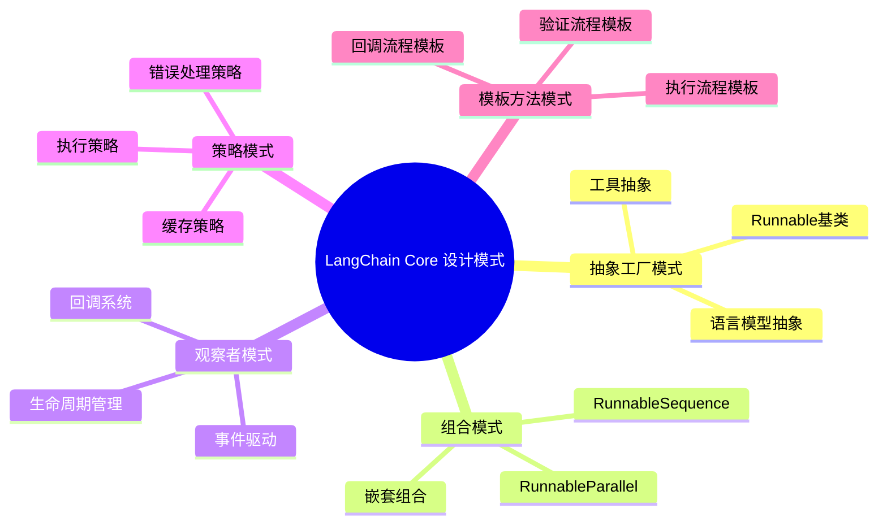
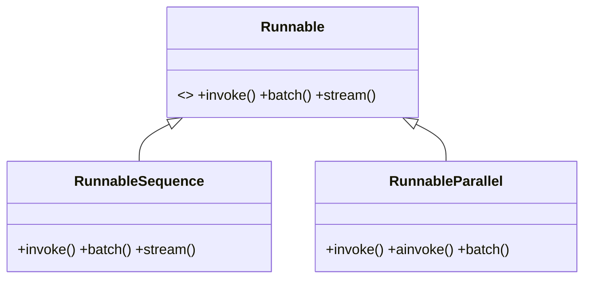
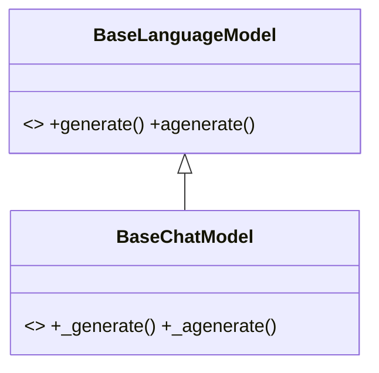
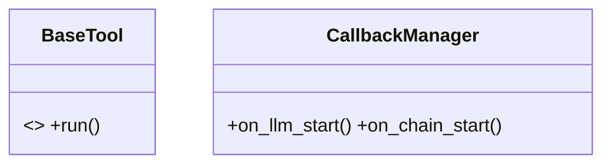

## 概述

LangChain Core是整个LangChain生态系统的基石，定义了核心抽象和统一的编程接口。Core模块的设计理念、关键组件实现和源码细节，揭示其如何通过Runnable接口实现统一的编程模型。

<!--more-->

## 1. LangChain Core模块架构

### 1.1 Core模块组织结构

```mermaid
graph TB
    subgraph "LangChain Core 模块结构"
        subgraph "核心抽象层"
            R[runnables/ - 可执行抽象]
            LM[language_models/ - 语言模型抽象]
            P[prompts/ - 提示模板]
            OP[output_parsers/ - 输出解析器]
        end

        subgraph "数据结构层"
            M[messages/ - 消息类型]
            D[documents/ - 文档结构]
            O[outputs/ - 输出类型]
            PV[prompt_values/ - 提示值]
        end

        subgraph "工具和集成层"
            T[tools/ - 工具抽象]
            E[embeddings/ - 嵌入抽象]
            VS[vectorstores/ - 向量存储抽象]
            RT[retrievers/ - 检索器抽象]
        end

        subgraph "基础设施层"
            CB[callbacks/ - 回调系统]
            TR[tracers/ - 追踪系统]
            U[utils/ - 工具函数]
            L[load/ - 序列化加载]
        end

        subgraph "兼容性层"
            MEM[memory/ - 内存抽象(已废弃)]
            AG[agents/ - Agent抽象]
            EX[exceptions/ - 异常定义]
        end
    end

    R --> LM
    R --> P
    R --> OP
    R --> T

    LM --> M
    P --> PV
    OP --> O

    T --> CB
    E --> VS
    VS --> RT

    CB --> TR
    TR --> U
    U --> L

    style R fill:#e1f5fe
    style CB fill:#f3e5f5
    style U fill:#e8f5e8
```

### 1.2 核心依赖关系

```python
# langchain_core/__init__.py
"""langchain-core 定义了 LangChain 生态系统的基础抽象。

此包定义了核心组件的接口，包括聊天模型、LLM、向量存储、检索器等。
通用调用协议（Runnables）以及组合组件的语法（LangChain 表达式语言）也在此定义。

**这里不定义任何第三方集成。** 依赖项被有意保持非常轻量级。
"""

from langchain_core._api import (
    surface_langchain_beta_warnings,
    surface_langchain_deprecation_warnings,
)
from langchain_core.version import VERSION

__version__ = VERSION

# 启用弃用和Beta功能警告
surface_langchain_deprecation_warnings()
surface_langchain_beta_warnings()
```

## 2. Runnable接口：统一抽象的核心

### 2.1 Runnable基类设计

```python
from abc import ABC, abstractmethod
from typing import Generic, TypeVar, Optional, List, Iterator, AsyncIterator, Any, Union
from concurrent.futures import ThreadPoolExecutor
import asyncio

Input = TypeVar('Input')
Output = TypeVar('Output')

class Runnable(ABC, Generic[Input, Output]):
    """可调用、可批处理、可流式处理、可转换和可组合的工作单元。

    这是LangChain中最重要的抽象，所有组件都实现这个接口。

    设计理念：
    1. 统一接口：所有组件都有相同的调用方式
    2. 自动优化：内置批处理和异步支持
    3. 组合性：通过操作符重载实现直观组合
    4. 可观测性：内置回调和配置支持
    """

    # === 核心抽象方法 ===

    @abstractmethod
    def invoke(
        self,
        input: Input,
        config: Optional[RunnableConfig] = None,
        **kwargs: Any,
    ) -> Output:
        """将单个输入转换为输出。

        这是所有Runnable必须实现的核心方法。

        Args:
            input: 输入数据，类型由具体实现定义
            config: 运行时配置，包含回调、标签、元数据等
            **kwargs: 额外的关键字参数

        Returns:
            处理后的输出数据

        Raises:
            NotImplementedError: 子类必须实现此方法
        """
        raise NotImplementedError("Runnable子类必须实现invoke方法")

    # === 异步支持 ===

    async def ainvoke(
        self,
        input: Input,
        config: Optional[RunnableConfig] = None,
        **kwargs: Any,
    ) -> Output:
        """异步版本的invoke方法。

        默认实现：在线程池中执行同步版本
        子类可以重写此方法以提供原生异步支持
        """
        return await run_in_executor(
            config,
            self.invoke,
            input,
            config,
            **kwargs
        )

    # === 批处理支持 ===

    def batch(
        self,
        inputs: List[Input],
        config: Optional[Union[RunnableConfig, List[RunnableConfig]]] = None,
        *,
        return_exceptions: bool = False,
        **kwargs: Any,
    ) -> List[Output]:
        """批量处理多个输入。

        默认实现：使用线程池并行调用invoke
        子类可以重写以提供更高效的批处理

        Args:
            inputs: 输入列表
            config: 单个配置或配置列表
            return_exceptions: 是否返回异常而不是抛出
            **kwargs: 额外参数

        Returns:
            输出列表，与输入列表一一对应
        """
        # 标准化配置
        configs = get_config_list(config, len(inputs))

        # 并行执行
        with ThreadPoolExecutor(
            max_workers=min(len(inputs), 10)  # 限制最大线程数
        ) as executor:
            futures = [
                executor.submit(self.invoke, input_item, config_item, **kwargs)
                for input_item, config_item in zip(inputs, configs)
            ]

            results = []
            for future in futures:
                try:
                    result = future.result()
                    results.append(result)
                except Exception as e:
                    if return_exceptions:
                        results.append(e)
                    else:
                        raise e

            return results

    async def abatch(
        self,
        inputs: List[Input],
        config: Optional[Union[RunnableConfig, List[RunnableConfig]]] = None,
        *,
        return_exceptions: bool = False,
        **kwargs: Any,
    ) -> List[Output]:
        """异步批量处理。

        使用asyncio.gather实现并发执行
        """
        configs = get_config_list(config, len(inputs))

        # 创建协程任务
        tasks = [
            self.ainvoke(input_item, config_item, **kwargs)
            for input_item, config_item in zip(inputs, configs)
        ]

        # 并发执行
        if return_exceptions:
            results = await asyncio.gather(*tasks, return_exceptions=True)
        else:
            results = await asyncio.gather(*tasks)

        return results

    # === 流式处理支持 ===

    def stream(
        self,
        input: Input,
        config: Optional[RunnableConfig] = None,
        **kwargs: Any,
    ) -> Iterator[Output]:
        """流式处理输入，逐步产生输出。

        默认实现：调用invoke并yield结果
        支持流式处理的子类应该重写此方法
        """
        yield self.invoke(input, config, **kwargs)

    async def astream(
        self,
        input: Input,
        config: Optional[RunnableConfig] = None,
        **kwargs: Any,
    ) -> AsyncIterator[Output]:
        """异步流式处理。"""
        result = await self.ainvoke(input, config, **kwargs)
        yield result

    # === 组合操作符 ===

    def __or__(self, other: Runnable[Any, Other]) -> RunnableSequence[Input, Other]:
        """实现 | 操作符，创建序列组合。

        Example:
            chain = prompt | model | parser
        """
        return RunnableSequence(first=self, last=other)

    def __ror__(self, other: Runnable[Other, Input]) -> RunnableSequence[Other, Output]:
        """实现反向 | 操作符。"""
        return RunnableSequence(first=other, last=self)

    # === 配置和绑定 ===

    def with_config(
        self,
        config: Optional[RunnableConfig] = None,
        **kwargs: Any,
    ) -> RunnableBinding[Input, Output]:
        """绑定配置到Runnable。

        返回一个新的Runnable，预设了指定的配置
        """
        return RunnableBinding(
            bound=self,
            config=config or {},
            kwargs=kwargs,
        )

    def with_retry(
        self,
        *,
        retry_if_exception_type: tuple[type[BaseException], ...] = (Exception,),
        wait_exponential_jitter: bool = True,
        stop_after_attempt: int = 3,
    ) -> RunnableRetry[Input, Output]:
        """添加重试机制。"""
        return RunnableRetry(
            bound=self,
            retry_if_exception_type=retry_if_exception_type,
            wait_exponential_jitter=wait_exponential_jitter,
            stop_after_attempt=stop_after_attempt,
        )

    def with_fallbacks(
        self,
        fallbacks: List[Runnable[Input, Output]],
        *,
        exceptions_to_handle: tuple[type[BaseException], ...] = (Exception,),
    ) -> RunnableWithFallbacks[Input, Output]:
        """添加回退机制。"""
        return RunnableWithFallbacks(
            runnable=self,
            fallbacks=fallbacks,
            exceptions_to_handle=exceptions_to_handle,
        )

    # === 模式和验证 ===

    @property
    def input_schema(self) -> type[BaseModel]:
        """输入模式，用于验证和文档生成。"""
        return self.get_input_schema()

    @property
    def output_schema(self) -> type[BaseModel]:
        """输出模式，用于验证和文档生成。"""
        return self.get_output_schema()

    def get_input_schema(
        self,
        config: Optional[RunnableConfig] = None
    ) -> type[BaseModel]:
        """获取输入模式。

        子类可以重写此方法提供更精确的模式定义
        """
        return create_model_v2(
            f"{self.__class__.__name__}Input",
            __root__=(Any, ...),
        )

    def get_output_schema(
        self,
        config: Optional[RunnableConfig] = None
    ) -> type[BaseModel]:
        """获取输出模式。"""
        return create_model_v2(
            f"{self.__class__.__name__}Output",
            __root__=(Any, ...),
        )
```

### 2.2 RunnableSequence：序列组合的实现

```python
class RunnableSequence(RunnableSerializable[Input, Output]):
    """Runnable序列，其中每个的输出是下一个的输入。

    这是LangChain中最重要的组合操作符，几乎用于每个链中。

    设计特点：
    1. 类型安全：通过泛型确保类型一致性
    2. 自动优化：支持批处理和流式处理
    3. 错误处理：提供完整的错误传播机制
    4. 可观测性：集成回调和追踪系统
    """

    # 类型安全的组件定义
    first: Runnable[Input, Any]
    """序列中的第一个runnable"""

    middle: List[Runnable[Any, Any]]
    """序列中的中间runnable列表"""

    last: Runnable[Any, Output]
    """序列中的最后一个runnable"""

    def __init__(
        self,
        *,
        first: Runnable[Input, Any],
        middle: Optional[List[Runnable[Any, Any]]] = None,
        last: Runnable[Any, Output],
        name: Optional[str] = None,
    ):
        """初始化序列。

        Args:
            first: 第一个runnable
            middle: 中间runnable列表
            last: 最后一个runnable
            name: 序列名称，用于调试和追踪
        """
        super().__init__(name=name)
        self.first = first
        self.middle = middle or []
        self.last = last

    @classmethod
    def from_runnables(
        cls,
        *runnables: Runnable[Any, Any],
        name: Optional[str] = None,
    ) -> RunnableSequence[Any, Any]:
        """从runnable列表创建序列。"""
        if len(runnables) < 2:
            raise ValueError("序列至少需要2个runnable")

        if len(runnables) == 2:
            return cls(first=runnables[0], last=runnables[1], name=name)
        else:
            return cls(
                first=runnables[0],
                middle=list(runnables[1:-1]),
                last=runnables[-1],
                name=name,
            )

    def invoke(
        self,
        input: Input,
        config: Optional[RunnableConfig] = None,
        **kwargs: Any,
    ) -> Output:
        """顺序执行所有runnable。"""
        # 配置管理
        config = ensure_config(config)
        callback_manager = get_callback_manager_for_config(config)

        # 开始执行链
        with callback_manager.on_chain_start(
            dumpd(self),
            input,
            name=config.get("run_name", self.name),
        ) as run_manager:
            try:
                # 执行第一个runnable
                intermediate = self.first.invoke(
                    input,
                    patch_config(config, callbacks=run_manager.get_child()),
                    **kwargs
                )

                # 执行中间runnable
                for i, step in enumerate(self.middle):
                    intermediate = step.invoke(
                        intermediate,
                        patch_config(
                            config,
                            callbacks=run_manager.get_child(f"step_{i+1}")
                        ),
                        **kwargs
                    )

                # 执行最后一个runnable
                output = self.last.invoke(
                    intermediate,
                    patch_config(config, callbacks=run_manager.get_child("last")),
                    **kwargs
                )

                return output

            except Exception as e:
                run_manager.on_chain_error(e)
                raise
            else:
                run_manager.on_chain_end(output)
                return output

    def batch(
        self,
        inputs: List[Input],
        config: Optional[Union[RunnableConfig, List[RunnableConfig]]] = None,
        *,
        return_exceptions: bool = False,
        **kwargs: Any,
    ) -> List[Output]:
        """优化的批处理实现。

        按顺序对每个组件调用batch方法，最大化并行性
        """
        if not inputs:
            return []

        configs = get_config_list(config, len(inputs))

        # 批处理第一个runnable
        intermediate_outputs = self.first.batch(
            inputs,
            configs,
            return_exceptions=return_exceptions,
            **kwargs
        )

        # 处理异常情况
        if return_exceptions:
            # 分离成功和失败的结果
            success_indices = []
            success_outputs = []

            for i, output in enumerate(intermediate_outputs):
                if not isinstance(output, Exception):
                    success_indices.append(i)
                    success_outputs.append(output)

            # 只对成功的结果继续处理
            current_outputs = success_outputs
            current_configs = [configs[i] for i in success_indices]
        else:
            current_outputs = intermediate_outputs
            current_configs = configs

        # 批处理中间runnable
        for step in self.middle:
            if current_outputs:  # 只有当还有成功结果时才继续
                current_outputs = step.batch(
                    current_outputs,
                    current_configs,
                    return_exceptions=return_exceptions,
                    **kwargs
                )

                # 更新成功索引（如果启用异常返回）
                if return_exceptions:
                    new_success_indices = []
                    new_success_outputs = []

                    for i, output in enumerate(current_outputs):
                        if not isinstance(output, Exception):
                            new_success_indices.append(success_indices[i])
                            new_success_outputs.append(output)

                    success_indices = new_success_indices
                    current_outputs = new_success_outputs
                    current_configs = [configs[i] for i in success_indices]

        # 批处理最后一个runnable
        if current_outputs:
            final_outputs = self.last.batch(
                current_outputs,
                current_configs,
                return_exceptions=return_exceptions,
                **kwargs
            )
        else:
            final_outputs = []

        # 重构完整结果（如果启用异常返回）
        if return_exceptions:
            results = [None] * len(inputs)

            # 填入异常
            for i, output in enumerate(intermediate_outputs):
                if isinstance(output, Exception):
                    results[i] = output

            # 填入成功结果
            for i, output in zip(success_indices, final_outputs):
                results[i] = output

            return results
        else:
            return final_outputs

    def stream(
        self,
        input: Input,
        config: Optional[RunnableConfig] = None,
        **kwargs: Any,
    ) -> Iterator[Output]:
        """流式执行序列。

        如果所有组件都支持transform方法，则可以实现真正的流式处理
        否则在最后一个支持流式的组件处开始流式输出
        """
        config = ensure_config(config)

        # 检查流式支持
        streaming_start_index = self._find_streaming_start()

        if streaming_start_index == -1:
            # 没有组件支持流式，回退到标准执行
            yield self.invoke(input, config, **kwargs)
            return

        # 执行非流式部分
        current_input = input
        all_steps = [self.first] + self.middle + [self.last]

        for i in range(streaming_start_index):
            current_input = all_steps[i].invoke(current_input, config, **kwargs)

        # 开始流式执行
        streaming_step = all_steps[streaming_start_index]
        remaining_steps = all_steps[streaming_start_index + 1:]

        for chunk in streaming_step.stream(current_input, config, **kwargs):
            # 将chunk通过剩余步骤处理
            processed_chunk = chunk
            for step in remaining_steps:
                if hasattr(step, 'transform'):
                    # 如果支持transform，继续流式处理
                    processed_chunk = next(step.transform([processed_chunk], config))
                else:
                    # 否则批量处理
                    processed_chunk = step.invoke(processed_chunk, config, **kwargs)

            yield processed_chunk

    def _find_streaming_start(self) -> int:
        """找到第一个支持流式处理的组件索引。"""
        all_steps = [self.first] + self.middle + [self.last]

        for i, step in enumerate(all_steps):
            if hasattr(step, 'transform') or hasattr(step, 'stream'):
                return i

        return -1  # 没有找到支持流式的组件

    # === 类型推导和模式 ===

    def get_input_schema(
        self,
        config: Optional[RunnableConfig] = None
    ) -> type[BaseModel]:
        """获取输入模式，来自第一个runnable。"""
        return self.first.get_input_schema(config)

    def get_output_schema(
        self,
        config: Optional[RunnableConfig] = None
    ) -> type[BaseModel]:
        """获取输出模式，来自最后一个runnable。"""
        return self.last.get_output_schema(config)

    # === 序列化支持 ===

    @property
    def lc_serializable(self) -> bool:
        """是否可序列化。"""
        return True

    def to_dict(self) -> Dict[str, Any]:
        """转换为字典表示。"""
        return {
            "lc": 1,
            "type": "constructor",
            "id": ["langchain_core", "runnables", "RunnableSequence"],
            "kwargs": {
                "first": self.first.to_dict() if hasattr(self.first, 'to_dict') else str(self.first),
                "middle": [
                    step.to_dict() if hasattr(step, 'to_dict') else str(step)
                    for step in self.middle
                ],
                "last": self.last.to_dict() if hasattr(self.last, 'to_dict') else str(self.last),
            },
        }
```

### 2.3 RunnableParallel：并行组合的实现

```python
class RunnableParallel(RunnableSerializable[Input, Dict[str, Any]]):
    """并行调用runnable，为每个提供相同的输入。

    设计特点：
    1. 并发执行：使用线程池或asyncio实现并行
    2. 结果聚合：将所有结果组合成字典
    3. 错误处理：支持部分失败的处理策略
    4. 资源管理：智能控制并发数量
    """

    steps: Dict[str, Runnable[Input, Any]]
    """并行执行的步骤字典"""

    def __init__(
        self,
        steps: Optional[Dict[str, Runnable[Input, Any]]] = None,
        **kwargs: Runnable[Input, Any],
    ):
        """初始化并行runnable。

        Args:
            steps: 步骤字典
            **kwargs: 额外的步骤，会合并到steps中
        """
        super().__init__()
        self.steps = {**(steps or {}), **kwargs}

        if not self.steps:
            raise ValueError("RunnableParallel至少需要一个步骤")

    def invoke(
        self,
        input: Input,
        config: Optional[RunnableConfig] = None,
        **kwargs: Any,
    ) -> Dict[str, Any]:
        """并行执行所有步骤。"""
        config = ensure_config(config)

        # 获取最大并发数
        max_concurrency = config.get("max_concurrency", len(self.steps))

        # 使用线程池并行执行
        with ThreadPoolExecutor(max_workers=max_concurrency) as executor:
            # 提交所有任务
            futures = {
                key: executor.submit(
                    runnable.invoke,
                    input,
                    patch_config(config, callbacks=get_callback_manager_for_config(config).get_child(key)),
                    **kwargs
                )
                for key, runnable in self.steps.items()
            }

            # 收集结果
            results = {}
            exceptions = {}

            for key, future in futures.items():
                try:
                    results[key] = future.result()
                except Exception as e:
                    exceptions[key] = e

            # 处理异常
            if exceptions:
                # 如果有异常，抛出第一个异常
                first_exception = next(iter(exceptions.values()))
                raise first_exception

            return results

    async def ainvoke(
        self,
        input: Input,
        config: Optional[RunnableConfig] = None,
        **kwargs: Any,
    ) -> Dict[str, Any]:
        """异步并行执行所有步骤。"""
        config = ensure_config(config)

        # 创建所有协程任务
        tasks = {
            key: runnable.ainvoke(
                input,
                patch_config(config, callbacks=get_async_callback_manager_for_config(config).get_child(key)),
                **kwargs
            )
            for key, runnable in self.steps.items()
        }

        # 并发执行
        try:
            results = await asyncio.gather(*tasks.values())
            return dict(zip(tasks.keys(), results))
        except Exception as e:
            # 取消所有未完成的任务
            for task in tasks.values():
                if hasattr(task, 'cancel'):
                    task.cancel()
            raise e

    def batch(
        self,
        inputs: List[Input],
        config: Optional[Union[RunnableConfig, List[RunnableConfig]]] = None,
        *,
        return_exceptions: bool = False,
        **kwargs: Any,
    ) -> List[Dict[str, Any]]:
        """批量并行执行。"""
        if not inputs:
            return []

        configs = get_config_list(config, len(inputs))

        # 为每个步骤批量执行
        step_results = {}

        for key, runnable in self.steps.items():
            try:
                step_results[key] = runnable.batch(
                    inputs,
                    configs,
                    return_exceptions=return_exceptions,
                    **kwargs
                )
            except Exception as e:
                if return_exceptions:
                    step_results[key] = [e] * len(inputs)
                else:
                    raise e

        # 重组结果
        results = []
        for i in range(len(inputs)):
            result = {}
            for key in self.steps.keys():
                result[key] = step_results[key][i]
            results.append(result)

        return results

    def stream(
        self,
        input: Input,
        config: Optional[RunnableConfig] = None,
        **kwargs: Any,
    ) -> Iterator[Dict[str, Any]]:
        """流式并行执行。

        注意：由于需要等待所有步骤完成才能组合结果，
        实际上无法实现真正的流式处理
        """
        # 对于并行执行，流式处理意义不大
        # 直接返回最终结果
        yield self.invoke(input, config, **kwargs)

    # === 辅助方法 ===

    def with_step(
        self,
        key: str,
        runnable: Runnable[Input, Any],
    ) -> RunnableParallel[Input]:
        """添加新步骤。"""
        new_steps = {**self.steps, key: runnable}
        return RunnableParallel(steps=new_steps)

    def without_step(self, key: str) -> RunnableParallel[Input]:
        """移除步骤。"""
        new_steps = {k: v for k, v in self.steps.items() if k != key}
        return RunnableParallel(steps=new_steps)

    # === 模式推导 ===

    def get_output_schema(
        self,
        config: Optional[RunnableConfig] = None
    ) -> type[BaseModel]:
        """获取输出模式，基于所有步骤的输出模式。"""
        # 构建字段定义
        fields = {}
        for key, runnable in self.steps.items():
            step_schema = runnable.get_output_schema(config)
            fields[key] = (step_schema, ...)

        # 创建组合模式
        return create_model_v2(
            f"{self.__class__.__name__}Output",
            **fields
        )
```

## 3. 语言模型抽象层

### 3.1 BaseLanguageModel：语言模型基类

```python
from abc import ABC, abstractmethod
from typing import List, Optional, Any, Dict, Union, AsyncIterator, Iterator

class BaseLanguageModel(RunnableSerializable[LanguageModelInput, BaseMessage], ABC):
    """所有语言模型的抽象基类。

    定义了语言模型的核心接口，包括：
    1. 文本生成接口
    2. 消息处理接口
    3. Token计算接口
    4. 缓存和回调支持
    """

    # === 核心配置 ===

    cache: Optional[BaseCache] = None
    """可选的缓存实例，用于缓存模型调用结果"""

    verbose: bool = Field(default_factory=_get_verbosity)
    """是否启用详细日志输出"""

    callbacks: Callbacks = Field(default=None, exclude=True)
    """回调处理器列表"""

    tags: Optional[List[str]] = Field(default=None, exclude=True)
    """用于追踪的标签列表"""

    metadata: Optional[Dict[str, Any]] = Field(default=None, exclude=True)
    """附加元数据"""

    # === 抽象方法 ===

    @abstractmethod
    def generate_prompt(
        self,
        prompts: List[PromptValue],
        stop: Optional[List[str]] = None,
        callbacks: Callbacks = None,
        **kwargs: Any,
    ) -> LLMResult:
        """从提示值生成响应。

        Args:
            prompts: 提示值列表
            stop: 停止序列列表
            callbacks: 回调处理器
            **kwargs: 额外参数

        Returns:
            包含生成结果的LLMResult
        """

    @abstractmethod
    async def agenerate_prompt(
        self,
        prompts: List[PromptValue],
        stop: Optional[List[str]] = None,
        callbacks: Callbacks = None,
        **kwargs: Any,
    ) -> LLMResult:
        """异步版本的generate_prompt。"""

    @abstractmethod
    def get_num_tokens(self, text: str) -> int:
        """计算文本的token数量。

        Args:
            text: 输入文本

        Returns:
            token数量
        """

    def get_token_ids(self, text: str) -> List[int]:
        """获取文本的token ID列表。

        默认实现抛出NotImplementedError，子类可以重写
        """
        raise NotImplementedError(
            f"{self.__class__.__name__} 不支持获取token IDs"
        )

    # === 便利方法 ===

    def predict(
        self,
        text: str,
        *,
        stop: Optional[Sequence[str]] = None,
        **kwargs: Any,
    ) -> str:
        """预测单个文本输入的响应。

        Args:
            text: 输入文本
            stop: 停止序列
            **kwargs: 额外参数

        Returns:
            生成的文本响应
        """
        if stop is None:
            _stop = None
        else:
            _stop = list(stop)

        result = self.generate([text], stop=_stop, **kwargs)
        return result.generations[0][0].text

    def predict_messages(
        self,
        messages: List[BaseMessage],
        *,
        stop: Optional[Sequence[str]] = None,
        **kwargs: Any,
    ) -> BaseMessage:
        """预测消息列表的响应。

        Args:
            messages: 输入消息列表
            stop: 停止序列
            **kwargs: 额外参数

        Returns:
            生成的消息响应
        """
        prompt_value = ChatPromptValue(messages=messages)
        if stop is None:
            _stop = None
        else:
            _stop = list(stop)

        result = self.generate_prompt([prompt_value], stop=_stop, **kwargs)
        return result.generations[0][0].message

    async def apredict(
        self,
        text: str,
        *,
        stop: Optional[Sequence[str]] = None,
        **kwargs: Any,
    ) -> str:
        """异步预测文本响应。"""
        if stop is None:
            _stop = None
        else:
            _stop = list(stop)

        result = await self.agenerate([text], stop=_stop, **kwargs)
        return result.generations[0][0].text

    async def apredict_messages(
        self,
        messages: List[BaseMessage],
        *,
        stop: Optional[Sequence[str]] = None,
        **kwargs: Any,
    ) -> BaseMessage:
        """异步预测消息响应。"""
        prompt_value = ChatPromptValue(messages=messages)
        if stop is None:
            _stop = None
        else:
            _stop = list(stop)

        result = await self.agenerate_prompt([prompt_value], stop=_stop, **kwargs)
        return result.generations[0][0].message

    # === Runnable接口实现 ===

    def invoke(
        self,
        input: LanguageModelInput,
        config: Optional[RunnableConfig] = None,
        *,
        stop: Optional[List[str]] = None,
        **kwargs: Any,
    ) -> BaseMessage:
        """Runnable接口的invoke实现。"""
        config = ensure_config(config)

        # 处理不同类型的输入
        if isinstance(input, str):
            # 字符串输入，转换为HumanMessage
            messages = [HumanMessage(content=input)]
        elif isinstance(input, list):
            # 消息列表
            messages = input
        elif isinstance(input, BaseMessage):
            # 单个消息
            messages = [input]
        else:
            raise ValueError(f"不支持的输入类型: {type(input)}")

        # 调用预测方法
        return self.predict_messages(
            messages,
            stop=stop,
            callbacks=config.get("callbacks"),
            tags=config.get("tags"),
            metadata=config.get("metadata"),
            **kwargs,
        )

    async def ainvoke(
        self,
        input: LanguageModelInput,
        config: Optional[RunnableConfig] = None,
        *,
        stop: Optional[List[str]] = None,
        **kwargs: Any,
    ) -> BaseMessage:
        """异步invoke实现。"""
        config = ensure_config(config)

        # 处理输入
        if isinstance(input, str):
            messages = [HumanMessage(content=input)]
        elif isinstance(input, list):
            messages = input
        elif isinstance(input, BaseMessage):
            messages = [input]
        else:
            raise ValueError(f"不支持的输入类型: {type(input)}")

        # 异步调用
        return await self.apredict_messages(
            messages,
            stop=stop,
            callbacks=config.get("callbacks"),
            tags=config.get("tags"),
            metadata=config.get("metadata"),
            **kwargs,
        )

    # === 流式处理支持 ===

    def stream(
        self,
        input: LanguageModelInput,
        config: Optional[RunnableConfig] = None,
        *,
        stop: Optional[List[str]] = None,
        **kwargs: Any,
    ) -> Iterator[BaseMessage]:
        """流式处理输入。

        默认实现：调用invoke并yield结果
        支持流式的子类应该重写此方法
        """
        yield self.invoke(input, config, stop=stop, **kwargs)

    async def astream(
        self,
        input: LanguageModelInput,
        config: Optional[RunnableConfig] = None,
        *,
        stop: Optional[List[str]] = None,
        **kwargs: Any,
    ) -> AsyncIterator[BaseMessage]:
        """异步流式处理。"""
        result = await self.ainvoke(input, config, stop=stop, **kwargs)
        yield result

    # === 缓存支持 ===

    def _get_cache_key(
        self,
        prompts: List[PromptValue],
        **kwargs: Any,
    ) -> str:
        """生成缓存键。"""
        import hashlib

        # 构建缓存键数据
        key_data = {
            "prompts": [prompt.to_string() for prompt in prompts],
            "model_name": getattr(self, "model_name", self.__class__.__name__),
            "kwargs": kwargs,
        }

        # 生成哈希
        key_str = json.dumps(key_data, sort_keys=True)
        return hashlib.md5(key_str.encode()).hexdigest()

    def _cache_lookup(
        self,
        prompts: List[PromptValue],
        **kwargs: Any,
    ) -> Optional[LLMResult]:
        """查找缓存结果。"""
        if self.cache is None:
            return None

        cache_key = self._get_cache_key(prompts, **kwargs)
        return self.cache.lookup(cache_key)

    def _cache_update(
        self,
        prompts: List[PromptValue],
        result: LLMResult,
        **kwargs: Any,
    ) -> None:
        """更新缓存。"""
        if self.cache is None:
            return

        cache_key = self._get_cache_key(prompts, **kwargs)
        self.cache.update(cache_key, result)
```

### 3.2 BaseChatModel：聊天模型抽象

```python
class BaseChatModel(BaseLanguageModel):
    """聊天模型的抽象基类。

    聊天模型专门处理结构化的消息对话，支持：
    1. 多轮对话管理
    2. 角色区分（system, human, ai）
    3. 函数调用支持
    4. 流式对话生成
    """

    # === 抽象方法 ===

    @abstractmethod
    def _generate(
        self,
        messages: List[BaseMessage],
        stop: Optional[List[str]] = None,
        run_manager: Optional[CallbackManagerForLLMRun] = None,
        **kwargs: Any,
    ) -> ChatResult:
        """生成聊天响应的核心方法。

        Args:
            messages: 输入消息列表
            stop: 停止序列
            run_manager: 回调管理器
            **kwargs: 额外参数

        Returns:
            聊天结果
        """

    async def _agenerate(
        self,
        messages: List[BaseMessage],
        stop: Optional[List[str]] = None,
        run_manager: Optional[AsyncCallbackManagerForLLMRun] = None,
        **kwargs: Any,
    ) -> ChatResult:
        """异步生成聊天响应。

        默认实现：在线程池中调用同步版本
        """
        return await run_in_executor(
            None,
            self._generate,
            messages,
            stop,
            run_manager.get_sync() if run_manager else None,
            **kwargs,
        )

    # === 流式处理支持 ===

    def _stream(
        self,
        messages: List[BaseMessage],
        stop: Optional[List[str]] = None,
        run_manager: Optional[CallbackManagerForLLMRun] = None,
        **kwargs: Any,
    ) -> Iterator[ChatGenerationChunk]:
        """流式生成聊天响应。

        默认实现：调用_generate并yield结果
        支持流式的子类应该重写此方法
        """
        result = self._generate(messages, stop, run_manager, **kwargs)

        # 将完整结果转换为单个chunk
        generation = result.generations[0]
        chunk = ChatGenerationChunk(
            message=generation.message,
            generation_info=generation.generation_info,
        )
        yield chunk

    async def _astream(
        self,
        messages: List[BaseMessage],
        stop: Optional[List[str]] = None,
        run_manager: Optional[AsyncCallbackManagerForLLMRun] = None,
        **kwargs: Any,
    ) -> AsyncIterator[ChatGenerationChunk]:
        """异步流式生成。"""
        result = await self._agenerate(messages, stop, run_manager, **kwargs)

        generation = result.generations[0]
        chunk = ChatGenerationChunk(
            message=generation.message,
            generation_info=generation.generation_info,
        )
        yield chunk

    # === 公共接口实现 ===

    def generate(
        self,
        messages: List[List[BaseMessage]],
        stop: Optional[List[str]] = None,
        callbacks: Callbacks = None,
        *,
        tags: Optional[List[str]] = None,
        metadata: Optional[Dict[str, Any]] = None,
        run_name: Optional[str] = None,
        **kwargs: Any,
    ) -> LLMResult:
        """生成多个消息序列的响应。"""
        # 参数验证
        if not messages:
            raise ValueError("消息列表不能为空")

        # 配置回调管理器
        callback_manager = CallbackManager.configure(
            callbacks,
            self.callbacks,
            self.verbose,
            tags,
            self.tags,
            metadata,
            self.metadata,
        )

        # 执行生成
        generations = []
        llm_output = {}

        for message_list in messages:
            with callback_manager.on_llm_start(
                dumpd(self),
                [message_list],
                invocation_params=self._get_invocation_params(stop=stop, **kwargs),
                options={
                    "stop": stop,
                    "run_name": run_name,
                },
            ) as run_manager:
                try:
                    result = self._generate(
                        message_list,
                        stop=stop,
                        run_manager=run_manager,
                        **kwargs,
                    )
                    generations.extend(result.generations)

                    # 合并LLM输出
                    if result.llm_output:
                        llm_output.update(result.llm_output)

                except Exception as e:
                    run_manager.on_llm_error(e)
                    raise
                else:
                    run_manager.on_llm_end(result)

        return LLMResult(
            generations=generations,
            llm_output=llm_output,
        )

    async def agenerate(
        self,
        messages: List[List[BaseMessage]],
        stop: Optional[List[str]] = None,
        callbacks: Callbacks = None,
        *,
        tags: Optional[List[str]] = None,
        metadata: Optional[Dict[str, Any]] = None,
        run_name: Optional[str] = None,
        **kwargs: Any,
    ) -> LLMResult:
        """异步生成多个消息序列的响应。"""
        if not messages:
            raise ValueError("消息列表不能为空")

        callback_manager = AsyncCallbackManager.configure(
            callbacks,
            self.callbacks,
            self.verbose,
            tags,
            self.tags,
            metadata,
            self.metadata,
        )

        generations = []
        llm_output = {}

        for message_list in messages:
            async with callback_manager.on_llm_start(
                dumpd(self),
                [message_list],
                invocation_params=self._get_invocation_params(stop=stop, **kwargs),
                options={
                    "stop": stop,
                    "run_name": run_name,
                },
            ) as run_manager:
                try:
                    result = await self._agenerate(
                        message_list,
                        stop=stop,
                        run_manager=run_manager,
                        **kwargs,
                    )
                    generations.extend(result.generations)

                    if result.llm_output:
                        llm_output.update(result.llm_output)

                except Exception as e:
                    await run_manager.on_llm_error(e)
                    raise
                else:
                    await run_manager.on_llm_end(result)

        return LLMResult(
            generations=generations,
            llm_output=llm_output,
        )

    # === 函数调用支持 ===

    def bind_functions(
        self,
        functions: List[Dict[str, Any]],
        *,
        function_call: Optional[Union[str, Dict[str, Any]]] = None,
        **kwargs: Any,
    ) -> Runnable[LanguageModelInput, BaseMessage]:
        """绑定函数到聊天模型。

        Args:
            functions: 函数定义列表
            function_call: 函数调用配置
            **kwargs: 额外参数

        Returns:
            绑定了函数的Runnable
        """
        return self.bind(
            functions=functions,
            function_call=function_call,
            **kwargs,
        )

    def bind_tools(
        self,
        tools: List[Union[Dict[str, Any], type[BaseModel], Callable, BaseTool]],
        **kwargs: Any,
    ) -> Runnable[LanguageModelInput, BaseMessage]:
        """绑定工具到聊天模型。"""
        # 转换工具为函数格式
        functions = []
        for tool in tools:
            if isinstance(tool, dict):
                functions.append(tool)
            elif isinstance(tool, type) and issubclass(tool, BaseModel):
                functions.append(convert_pydantic_to_openai_function(tool))
            elif callable(tool):
                functions.append(convert_to_openai_function(tool))
            elif isinstance(tool, BaseTool):
                functions.append(format_tool_to_openai_function(tool))
            else:
                raise ValueError(f"不支持的工具类型: {type(tool)}")

        return self.bind_functions(functions, **kwargs)

    # === 辅助方法 ===

    def _get_invocation_params(
        self,
        stop: Optional[List[str]] = None,
        **kwargs: Any,
    ) -> Dict[str, Any]:
        """获取调用参数，用于回调和日志。"""
        params = {
            "stop": stop,
            **kwargs,
        }

        # 添加模型特定参数
        if hasattr(self, "model_name"):
            params["model_name"] = self.model_name
        if hasattr(self, "temperature"):
            params["temperature"] = self.temperature
        if hasattr(self, "max_tokens"):
            params["max_tokens"] = self.max_tokens

        return params

    def _format_messages_for_logging(
        self,
        messages: List[BaseMessage],
    ) -> List[str]:
        """格式化消息用于日志记录。"""
        formatted = []
        for message in messages:
            role = message.__class__.__name__.replace("Message", "").lower()
            content = message.content
            if isinstance(content, str):
                formatted.append(f"{role}: {content}")
            else:
                formatted.append(f"{role}: {str(content)}")

        return formatted
```

## 4. 工具抽象和集成

### 4.1 BaseTool：工具基类

```python
from abc import ABC, abstractmethod
from typing import Any, Optional, Type, Union, Dict, List
from pydantic import BaseModel, Field, field_validator

class BaseTool(BaseModel, ABC):
    """所有工具的抽象基类。

    工具是Agent可以使用的函数，用于与外部世界交互。

    设计特点：
    1. 标准化接口：统一的运行和描述接口
    2. 参数验证：基于Pydantic的参数模式验证
    3. 错误处理：完整的异常处理和回调支持
    4. 异步支持：同步和异步执行模式
    """

    # === 核心属性 ===

    name: str = Field(description="工具的唯一名称")
    """工具名称，必须在Agent的工具集中唯一"""

    description: str = Field(description="工具功能的详细描述")
    """工具描述，用于Agent理解何时使用此工具"""

    args_schema: Optional[Type[BaseModel]] = Field(default=None)
    """工具参数的Pydantic模式，用于参数验证"""

    return_direct: bool = Field(default=False)
    """是否直接返回工具结果给用户，而不是继续Agent循环"""

    verbose: bool = Field(default=False)
    """是否启用详细日志输出"""

    callbacks: Callbacks = Field(default=None, exclude=True)
    """回调处理器列表"""

    callback_manager: Optional[BaseCallbackManager] = Field(default=None, exclude=True)
    """回调管理器"""

    tags: Optional[List[str]] = Field(default=None, exclude=True)
    """用于追踪的标签"""

    metadata: Optional[Dict[str, Any]] = Field(default=None, exclude=True)
    """附加元数据"""

    handle_tool_error: Optional[
        Union[bool, str, Callable[[ToolException], str]]
    ] = Field(default=False)
    """工具错误处理策略"""

    handle_validation_error: Optional[
        Union[bool, str, Callable[[ValidationError], str]]
    ] = Field(default=False)
    """参数验证错误处理策略"""

    # === 抽象方法 ===

    @abstractmethod
    def _run(
        self,
        *args: Any,
        run_manager: Optional[CallbackManagerForToolRun] = None,
        **kwargs: Any,
    ) -> Any:
        """同步执行工具的核心方法。

        Args:
            *args: 位置参数
            run_manager: 回调管理器
            **kwargs: 关键字参数

        Returns:
            工具执行结果
        """

    async def _arun(
        self,
        *args: Any,
        run_manager: Optional[AsyncCallbackManagerForToolRun] = None,
        **kwargs: Any,
    ) -> Any:
        """异步执行工具。

        默认实现：在线程池中调用同步版本
        支持异步的子类应该重写此方法
        """
        return await run_in_executor(
            None,
            self._run,
            *args,
            run_manager.get_sync() if run_manager else None,
            **kwargs,
        )

    # === 公共接口 ===

    def run(
        self,
        tool_input: Union[str, Dict[str, Any]],
        verbose: Optional[bool] = None,
        start_color: Optional[str] = "green",
        color: Optional[str] = "green",
        callbacks: Callbacks = None,
        *,
        tags: Optional[List[str]] = None,
        metadata: Optional[Dict[str, Any]] = None,
        run_name: Optional[str] = None,
        **kwargs: Any,
    ) -> Any:
        """运行工具的用户接口。

        Args:
            tool_input: 工具输入，可以是字符串或字典
            verbose: 是否启用详细输出
            start_color: 开始时的颜色
            color: 结束时的颜色
            callbacks: 回调处理器
            tags: 标签
            metadata: 元数据
            run_name: 运行名称
            **kwargs: 额外参数

        Returns:
            工具执行结果
        """
        # 解析输入
        parsed_input = self._parse_input(tool_input)

        # 配置回调管理器
        callback_manager = CallbackManager.configure(
            callbacks,
            self.callbacks,
            verbose or self.verbose,
            tags,
            self.tags,
            metadata,
            self.metadata,
        )

        # 执行工具
        with callback_manager.on_tool_start(
            {"name": self.name, "description": self.description},
            tool_input if isinstance(tool_input, str) else str(tool_input),
            color=start_color,
            name=run_name,
            **kwargs,
        ) as run_manager:
            try:
                # 参数验证
                if self.args_schema:
                    self._validate_args(parsed_input)

                # 执行工具
                tool_output = self._run(
                    **parsed_input,
                    run_manager=run_manager,
                    **kwargs,
                )

            except ValidationError as e:
                # 处理验证错误
                error_msg = self._handle_validation_error(e)
                run_manager.on_tool_error(e)
                if isinstance(error_msg, str):
                    return error_msg
                else:
                    raise e

            except Exception as e:
                # 处理工具错误
                error_msg = self._handle_tool_error(e)
                run_manager.on_tool_error(e)
                if isinstance(error_msg, str):
                    return error_msg
                else:
                    raise e

            else:
                # 成功完成
                run_manager.on_tool_end(str(tool_output), color=color)
                return tool_output

    async def arun(
        self,
        tool_input: Union[str, Dict[str, Any]],
        verbose: Optional[bool] = None,
        start_color: Optional[str] = "green",
        color: Optional[str] = "green",
        callbacks: Callbacks = None,
        *,
        tags: Optional[List[str]] = None,
        metadata: Optional[Dict[str, Any]] = None,
        run_name: Optional[str] = None,
        **kwargs: Any,
    ) -> Any:
        """异步运行工具。"""
        parsed_input = self._parse_input(tool_input)

        callback_manager = AsyncCallbackManager.configure(
            callbacks,
            self.callbacks,
            verbose or self.verbose,
            tags,
            self.tags,
            metadata,
            self.metadata,
        )

        async with callback_manager.on_tool_start(
            {"name": self.name, "description": self.description},
            tool_input if isinstance(tool_input, str) else str(tool_input),
            color=start_color,
            name=run_name,
            **kwargs,
        ) as run_manager:
            try:
                if self.args_schema:
                    self._validate_args(parsed_input)

                tool_output = await self._arun(
                    **parsed_input,
                    run_manager=run_manager,
                    **kwargs,
                )

            except ValidationError as e:
                error_msg = self._handle_validation_error(e)
                await run_manager.on_tool_error(e)
                if isinstance(error_msg, str):
                    return error_msg
                else:
                    raise e

            except Exception as e:
                error_msg = self._handle_tool_error(e)
                await run_manager.on_tool_error(e)
                if isinstance(error_msg, str):
                    return error_msg
                else:
                    raise e

            else:
                await run_manager.on_tool_end(str(tool_output), color=color)
                return tool_output

    # === 输入处理和验证 ===

    def _parse_input(
        self,
        tool_input: Union[str, Dict[str, Any]],
    ) -> Dict[str, Any]:
        """解析工具输入。

        Args:
            tool_input: 原始输入

        Returns:
            解析后的参数字典
        """
        if isinstance(tool_input, str):
            # 字符串输入
            if self.args_schema:
                # 如果有参数模式，尝试解析为JSON
                try:
                    import json
                    parsed = json.loads(tool_input)
                    if isinstance(parsed, dict):
                        return parsed
                    else:
                        # 如果不是字典，包装为单个参数
                        return {"input": tool_input}
                except json.JSONDecodeError:
                    # JSON解析失败，作为单个字符串参数
                    return {"input": tool_input}
            else:
                # 没有参数模式，直接作为输入
                return {"input": tool_input}

        elif isinstance(tool_input, dict):
            # 字典输入，直接返回
            return tool_input

        else:
            # 其他类型，转换为字符串
            return {"input": str(tool_input)}

    def _validate_args(self, args: Dict[str, Any]) -> None:
        """验证参数。

        Args:
            args: 参数字典

        Raises:
            ValidationError: 参数验证失败
        """
        if self.args_schema:
            self.args_schema(**args)

    # === 错误处理 ===

    def _handle_tool_error(self, error: Exception) -> Union[str, None]:
        """处理工具执行错误。

        Args:
            error: 异常对象

        Returns:
            错误消息字符串，或None表示重新抛出异常
        """
        if self.handle_tool_error is False:
            return None
        elif self.handle_tool_error is True:
            return f"工具 '{self.name}' 执行出错: {str(error)}"
        elif isinstance(self.handle_tool_error, str):
            return self.handle_tool_error
        elif callable(self.handle_tool_error):
            return self.handle_tool_error(ToolException(str(error)))
        else:
            return None

    def _handle_validation_error(self, error: ValidationError) -> Union[str, None]:
        """处理参数验证错误。"""
        if self.handle_validation_error is False:
            return None
        elif self.handle_validation_error is True:
            return f"工具 '{self.name}' 参数验证失败: {str(error)}"
        elif isinstance(self.handle_validation_error, str):
            return self.handle_validation_error
        elif callable(self.handle_validation_error):
            return self.handle_validation_error(error)
        else:
            return None

    # === 工具信息 ===

    @property
    def tool_call_schema(self) -> Dict[str, Any]:
        """获取工具调用模式，用于函数调用。"""
        schema = {
            "type": "function",
            "function": {
                "name": self.name,
                "description": self.description,
            },
        }

        if self.args_schema:
            schema["function"]["parameters"] = self.args_schema.model_json_schema()

        return schema

    def to_args_and_kwargs(self, tool_input: Union[str, Dict]) -> tuple[tuple, Dict]:
        """将工具输入转换为args和kwargs。"""
        parsed = self._parse_input(tool_input)
        return (), parsed

    # === Runnable接口支持 ===

    def invoke(
        self,
        input: Union[str, Dict],
        config: Optional[RunnableConfig] = None,
        **kwargs: Any,
    ) -> Any:
        """Runnable接口的invoke实现。"""
        config = ensure_config(config)

        return self.run(
            input,
            callbacks=config.get("callbacks"),
            tags=config.get("tags"),
            metadata=config.get("metadata"),
            run_name=config.get("run_name"),
            **kwargs,
        )

    async def ainvoke(
        self,
        input: Union[str, Dict],
        config: Optional[RunnableConfig] = None,
        **kwargs: Any,
    ) -> Any:
        """异步invoke实现。"""
        config = ensure_config(config)

        return await self.arun(
            input,
            callbacks=config.get("callbacks"),
            tags=config.get("tags"),
            metadata=config.get("metadata"),
            run_name=config.get("run_name"),
            **kwargs,
        )
```

## 5. 回调和追踪系统

### 5.1 BaseCallbackHandler：回调处理器基类

```python
from abc import ABC, abstractmethod
from typing import Any, Dict, List, Optional, Union
from uuid import UUID

class BaseCallbackHandler(ABC):
    """回调处理器的抽象基类。

    回调处理器用于在Runnable执行过程中的关键点执行自定义逻辑。

    设计特点：
    1. 事件驱动：基于执行生命周期的事件
    2. 可选实现：所有方法都有默认实现
    3. 类型安全：明确的事件参数类型
    4. 错误隔离：回调错误不影响主流程
    """

    # === 忽略标志 ===

    ignore_llm: bool = False
    """是否忽略LLM相关事件"""

    ignore_chain: bool = False
    """是否忽略Chain相关事件"""

    ignore_agent: bool = False
    """是否忽略Agent相关事件"""

    ignore_retriever: bool = False
    """是否忽略Retriever相关事件"""

    ignore_chat_model: bool = False
    """是否忽略ChatModel相关事件"""

    raise_error: bool = False
    """回调出错时是否抛出异常"""

    # === LLM事件 ===

    def on_llm_start(
        self,
        serialized: Dict[str, Any],
        prompts: List[str],
        *,
        run_id: UUID,
        parent_run_id: Optional[UUID] = None,
        tags: Optional[List[str]] = None,
        metadata: Optional[Dict[str, Any]] = None,
        **kwargs: Any,
    ) -> Any:
        """LLM开始执行时调用。

        Args:
            serialized: 序列化的LLM信息
            prompts: 输入提示列表
            run_id: 运行ID
            parent_run_id: 父运行ID
            tags: 标签列表
            metadata: 元数据
            **kwargs: 额外参数
        """

    def on_llm_new_token(
        self,
        token: str,
        *,
        chunk: Optional[Union[GenerationChunk, ChatGenerationChunk]] = None,
        run_id: UUID,
        parent_run_id: Optional[UUID] = None,
        tags: Optional[List[str]] = None,
        **kwargs: Any,
    ) -> Any:
        """LLM生成新token时调用。

        Args:
            token: 新生成的token
            chunk: 生成块（如果可用）
            run_id: 运行ID
            parent_run_id: 父运行ID
            tags: 标签列表
            **kwargs: 额外参数
        """

    def on_llm_end(
        self,
        response: LLMResult,
        *,
        run_id: UUID,
        parent_run_id: Optional[UUID] = None,
        tags: Optional[List[str]] = None,
        **kwargs: Any,
    ) -> Any:
        """LLM执行结束时调用。

        Args:
            response: LLM响应结果
            run_id: 运行ID
            parent_run_id: 父运行ID
            tags: 标签列表
            **kwargs: 额外参数
        """

    def on_llm_error(
        self,
        error: Union[Exception, KeyboardInterrupt],
        *,
        run_id: UUID,
        parent_run_id: Optional[UUID] = None,
        tags: Optional[List[str]] = None,
        **kwargs: Any,
    ) -> Any:
        """LLM执行出错时调用。

        Args:
            error: 异常对象
            run_id: 运行ID
            parent_run_id: 父运行ID
            tags: 标签列表
            **kwargs: 额外参数
        """

    # === Chain事件 ===

    def on_chain_start(
        self,
        serialized: Dict[str, Any],
        inputs: Dict[str, Any],
        *,
        run_id: UUID,
        parent_run_id: Optional[UUID] = None,
        tags: Optional[List[str]] = None,
        metadata: Optional[Dict[str, Any]] = None,
        **kwargs: Any,
    ) -> Any:
        """Chain开始执行时调用。"""

    def on_chain_end(
        self,
        outputs: Dict[str, Any],
        *,
        run_id: UUID,
        parent_run_id: Optional[UUID] = None,
        tags: Optional[List[str]] = None,
        **kwargs: Any,
    ) -> Any:
        """Chain执行结束时调用。"""

    def on_chain_error(
        self,
        error: Union[Exception, KeyboardInterrupt],
        *,
        run_id: UUID,
        parent_run_id: Optional[UUID] = None,
        tags: Optional[List[str]] = None,
        **kwargs: Any,
    ) -> Any:
        """Chain执行出错时调用。"""

    # === Tool事件 ===

    def on_tool_start(
        self,
        serialized: Dict[str, Any],
        input_str: str,
        *,
        run_id: UUID,
        parent_run_id: Optional[UUID] = None,
        tags: Optional[List[str]] = None,
        metadata: Optional[Dict[str, Any]] = None,
        inputs: Optional[Dict[str, Any]] = None,
        **kwargs: Any,
    ) -> Any:
        """Tool开始执行时调用。"""

    def on_tool_end(
        self,
        output: str,
        *,
        run_id: UUID,
        parent_run_id: Optional[UUID] = None,
        tags: Optional[List[str]] = None,
        **kwargs: Any,
    ) -> Any:
        """Tool执行结束时调用。"""

    def on_tool_error(
        self,
        error: Union[Exception, KeyboardInterrupt],
        *,
        run_id: UUID,
        parent_run_id: Optional[UUID] = None,
        tags: Optional[List[str]] = None,
        **kwargs: Any,
    ) -> Any:
        """Tool执行出错时调用。"""

    # === Agent事件 ===

    def on_agent_action(
        self,
        action: AgentAction,
        *,
        run_id: UUID,
        parent_run_id: Optional[UUID] = None,
        tags: Optional[List[str]] = None,
        **kwargs: Any,
    ) -> Any:
        """Agent执行动作时调用。"""

    def on_agent_finish(
        self,
        finish: AgentFinish,
        *,
        run_id: UUID,
        parent_run_id: Optional[UUID] = None,
        tags: Optional[List[str]] = None,
        **kwargs: Any,
    ) -> Any:
        """Agent完成时调用。"""

    # === Retriever事件 ===

    def on_retriever_start(
        self,
        serialized: Dict[str, Any],
        query: str,
        *,
        run_id: UUID,
        parent_run_id: Optional[UUID] = None,
        tags: Optional[List[str]] = None,
        metadata: Optional[Dict[str, Any]] = None,
        **kwargs: Any,
    ) -> Any:
        """Retriever开始检索时调用。"""

    def on_retriever_end(
        self,
        documents: List[Document],
        *,
        run_id: UUID,
        parent_run_id: Optional[UUID] = None,
        tags: Optional[List[str]] = None,
        **kwargs: Any,
    ) -> Any:
        """Retriever检索结束时调用。"""

    def on_retriever_error(
        self,
        error: Union[Exception, KeyboardInterrupt],
        *,
        run_id: UUID,
        parent_run_id: Optional[UUID] = None,
        tags: Optional[List[str]] = None,
        **kwargs: Any,
    ) -> Any:
        """Retriever检索出错时调用。"""

    # === 文本事件 ===

    def on_text(
        self,
        text: str,
        *,
        run_id: UUID,
        parent_run_id: Optional[UUID] = None,
        tags: Optional[List[str]] = None,
        **kwargs: Any,
    ) -> Any:
        """处理文本时调用。"""

class CallbackManager:
    """回调管理器，负责管理和调度回调处理器。

    设计特点：
    1. 集中管理：统一管理所有回调处理器
    2. 错误隔离：单个回调错误不影响其他回调
    3. 层次结构：支持父子回调管理器
    4. 异步支持：同步和异步回调管理
    """

    def __init__(
        self,
        handlers: List[BaseCallbackHandler],
        inheritable_handlers: Optional[List[BaseCallbackHandler]] = None,
        parent_run_id: Optional[UUID] = None,
        *,
        tags: Optional[List[str]] = None,
        inheritable_tags: Optional[List[str]] = None,
        metadata: Optional[Dict[str, Any]] = None,
        inheritable_metadata: Optional[Dict[str, Any]] = None,
    ):
        """初始化回调管理器。

        Args:
            handlers: 当前级别的回调处理器
            inheritable_handlers: 可继承的回调处理器
            parent_run_id: 父运行ID
            tags: 当前级别的标签
            inheritable_tags: 可继承的标签
            metadata: 当前级别的元数据
            inheritable_metadata: 可继承的元数据
        """
        self.handlers = handlers or []
        self.inheritable_handlers = inheritable_handlers or []
        self.parent_run_id = parent_run_id
        self.tags = tags or []
        self.inheritable_tags = inheritable_tags or []
        self.metadata = metadata or {}
        self.inheritable_metadata = inheritable_metadata or {}

    @classmethod
    def configure(
        cls,
        callbacks: Callbacks = None,
        inheritable_callbacks: Callbacks = None,
        verbose: bool = False,
        tags: Optional[List[str]] = None,
        inheritable_tags: Optional[List[str]] = None,
        metadata: Optional[Dict[str, Any]] = None,
        inheritable_metadata: Optional[Dict[str, Any]] = None,
    ) -> CallbackManager:
        """配置回调管理器。

        Args:
            callbacks: 回调处理器或管理器
            inheritable_callbacks: 可继承的回调
            verbose: 是否启用详细输出
            tags: 标签
            inheritable_tags: 可继承标签
            metadata: 元数据
            inheritable_metadata: 可继承元数据

        Returns:
            配置好的回调管理器
        """
        # 处理回调参数
        handlers = []
        inheritable_handlers = []

        # 处理主回调
        if callbacks:
            if isinstance(callbacks, list):
                handlers.extend(callbacks)
            elif isinstance(callbacks, BaseCallbackManager):
                handlers.extend(callbacks.handlers)
                inheritable_handlers.extend(callbacks.inheritable_handlers)
            elif isinstance(callbacks, BaseCallbackHandler):
                handlers.append(callbacks)

        # 处理可继承回调
        if inheritable_callbacks:
            if isinstance(inheritable_callbacks, list):
                inheritable_handlers.extend(inheritable_callbacks)
            elif isinstance(inheritable_callbacks, BaseCallbackHandler):
                inheritable_handlers.append(inheritable_callbacks)

        # 添加默认处理器
        if verbose:
            from langchain_core.tracers import ConsoleCallbackHandler
            handlers.append(ConsoleCallbackHandler())

        return cls(
            handlers=handlers,
            inheritable_handlers=inheritable_handlers,
            tags=tags,
            inheritable_tags=inheritable_tags,
            metadata=metadata,
            inheritable_metadata=inheritable_metadata,
        )

    def on_llm_start(
        self,
        serialized: Dict[str, Any],
        prompts: List[str],
        *,
        invocation_params: Optional[Dict[str, Any]] = None,
        options: Optional[Dict[str, Any]] = None,
        name: Optional[str] = None,
        **kwargs: Any,
    ) -> CallbackManagerForLLMRun:
        """创建LLM运行的回调管理器。"""
        from uuid import uuid4

        run_id = uuid4()

        # 合并标签和元数据
        run_tags = (self.tags or []) + (self.inheritable_tags or [])
        run_metadata = {**(self.inheritable_metadata or {}), **(self.metadata or {})}

        if options:
            run_tags.extend(options.get("tags", []))
            run_metadata.update(options.get("metadata", {}))

        # 通知所有处理器
        for handler in self.handlers + self.inheritable_handlers:
            if not handler.ignore_llm:
                try:
                    handler.on_llm_start(
                        serialized,
                        prompts,
                        run_id=run_id,
                        parent_run_id=self.parent_run_id,
                        tags=run_tags,
                        metadata=run_metadata,
                        invocation_params=invocation_params,
                        name=name,
                        **kwargs,
                    )
                except Exception as e:
                    if handler.raise_error:
                        raise e
                    else:
                        logger.warning(f"回调处理器出错: {e}")

        return CallbackManagerForLLMRun(
            run_id=run_id,
            handlers=self.handlers,
            inheritable_handlers=self.inheritable_handlers,
            parent_run_id=self.parent_run_id,
            tags=run_tags,
            inheritable_tags=self.inheritable_tags,
            metadata=run_metadata,
            inheritable_metadata=self.inheritable_metadata,
        )

    def on_chain_start(
        self,
        serialized: Dict[str, Any],
        inputs: Dict[str, Any],
        *,
        name: Optional[str] = None,
        **kwargs: Any,
    ) -> CallbackManagerForChainRun:
        """创建Chain运行的回调管理器。"""
        from uuid import uuid4

        run_id = uuid4()

        run_tags = (self.tags or []) + (self.inheritable_tags or [])
        run_metadata = {**(self.inheritable_metadata or {}), **(self.metadata or {})}

        for handler in self.handlers + self.inheritable_handlers:
            if not handler.ignore_chain:
                try:
                    handler.on_chain_start(
                        serialized,
                        inputs,
                        run_id=run_id,
                        parent_run_id=self.parent_run_id,
                        tags=run_tags,
                        metadata=run_metadata,
                        name=name,
                        **kwargs,
                    )
                except Exception as e:
                    if handler.raise_error:
                        raise e
                    else:
                        logger.warning(f"回调处理器出错: {e}")

        return CallbackManagerForChainRun(
            run_id=run_id,
            handlers=self.handlers,
            inheritable_handlers=self.inheritable_handlers,
            parent_run_id=self.parent_run_id,
            tags=run_tags,
            inheritable_tags=self.inheritable_tags,
            metadata=run_metadata,
            inheritable_metadata=self.inheritable_metadata,
        )

    def get_child(self, tag: Optional[str] = None) -> CallbackManager:
        """获取子回调管理器。

        Args:
            tag: 子管理器的标签

        Returns:
            子回调管理器
        """
        child_tags = []
        if tag:
            child_tags.append(tag)

        return CallbackManager(
            handlers=[],  # 子管理器不直接包含处理器
            inheritable_handlers=self.handlers + self.inheritable_handlers,
            parent_run_id=None,  # 将在具体运行时设置
            tags=child_tags,
            inheritable_tags=self.tags + self.inheritable_tags,
            metadata={},
            inheritable_metadata={**self.inheritable_metadata, **self.metadata},
        )
```

## 6. 总结

### 6.1 深度源码剖析与实践案例

1. **统一抽象**：Runnable接口提供了一致的编程模型
2. **组合性**：通过操作符重载实现直观的组合语法
3. **类型安全**：基于泛型的类型系统确保编译时安全
4. **可扩展性**：清晰的抽象层次支持灵活扩展
5. **可观测性**：内置的回调和追踪系统

#### 实际应用案例：自定义RAG Runnable

```python
from langchain_core.runnables import Runnable, RunnableConfig
from typing import Any, Dict, List, Optional
import time

class CustomRAGRunnable(Runnable[Dict[str, Any], str]):
    """自定义RAG Runnable实现

        https://liz-starfield.github.io/blog/zh/posts/LLM/langchain_source_code.html
    """

    def __init__(self, retriever, llm, prompt_template):
        self.retriever = retriever
        self.llm = llm
        self.prompt_template = prompt_template
        self._execution_stats = {
            'total_calls': 0,
            'avg_retrieval_time': 0,
            'avg_generation_time': 0
        }

    def invoke(self, input: Dict[str, Any], config: Optional[RunnableConfig] = None) -> str:
        """同步执行RAG流程"""
        # 检索阶段
        retrieval_start = time.time()
        query = input.get('question', '')
        docs = self.retriever.get_relevant_documents(query)
        retrieval_time = time.time() - retrieval_start

        # 上下文构建和生成
        context = "\n\n".join([doc.page_content for doc in docs])
        prompt = self.prompt_template.format(context=context, question=query)

        generation_start = time.time()
        response = self.llm.invoke(prompt, config=config)
        generation_time = time.time() - generation_start

        # 统计更新
        self._update_stats(retrieval_time, generation_time)

        return response.content if hasattr(response, 'content') else str(response)

    def _update_stats(self, retrieval_time: float, generation_time: float):
        """更新执行统计"""
        self._execution_stats['total_calls'] += 1
        total_calls = self._execution_stats['total_calls']

        # 更新平均时间
        current_avg_ret = self._execution_stats['avg_retrieval_time']
        self._execution_stats['avg_retrieval_time'] = (
            (current_avg_ret * (total_calls - 1) + retrieval_time) / total_calls
        )

        current_avg_gen = self._execution_stats['avg_generation_time']
        self._execution_stats['avg_generation_time'] = (
            (current_avg_gen * (total_calls - 1) + generation_time) / total_calls
        )
```

### 6.2 核心设计模式



## 7. 关键函数与结构补充

### 7.1 Runnable / RunnableSequence / RunnableParallel

关键函数（核心代码与说明）：

```python
class Runnable(ABC, Generic[Input, Output]):
    def invoke(self, input: Input, config: Optional[RunnableConfig] = None, **kwargs) -> Output:
        """同步执行；子类实现转换逻辑。"""
        raise NotImplementedError

class RunnableSequence(RunnableSerializable[Input, Output]):
    def invoke(self, input: Input, config: Optional[RunnableConfig] = None, **kwargs) -> Output:
        """顺序执行 first→middle→last，并通过回调管理器标注生命周期事件。"""
        ...

class RunnableParallel(RunnableSerializable[Input, Dict[str, Any]]):
    def invoke(self, input: Input, config: Optional[RunnableConfig] = None, **kwargs) -> Dict[str, Any]:
        """并行调用 steps，聚合为键-值结果。"""
        ...
```

统一调用链：

- 顺序：`first.invoke()` → `for step in middle: step.invoke()` → `last.invoke()`
- 并行：线程池/协程 `for key, step in steps: step.invoke()` → 聚合

类结构图（Mermaid）：



时序图索引：见文内“2.3/2.4 相关小节”的流程图。

### 7.2 BaseLanguageModel / BaseChatModel

关键函数（核心代码与说明）：

```python
class BaseLanguageModel(...):
    def generate(self, messages: List[List[BaseMessage]], stop: Optional[List[str]] = None, callbacks: Callbacks = None, **kwargs) -> LLMResult:
        """触发回调，执行 _generate / _agenerate，聚合 generations。"""
        ...

class BaseChatModel(BaseLanguageModel):
    def _generate(self, messages: List[BaseMessage], stop: Optional[List[str]] = None, run_manager: Optional[CallbackManagerForLLMRun] = None, **kwargs) -> ChatResult:
        """子类负责单批消息的生成逻辑。"""
        ...
```

统一调用链：`generate()` → `on_llm_start` → `_generate()` → `on_llm_end`

类结构图（Mermaid）：



### 7.3 BaseTool 与回调

关键函数（核心代码与说明）：

```python
class BaseTool(BaseModel, ABC):
    def run(self, tool_input: Union[str, Dict], callbacks: Callbacks = None, **kwargs) -> Any:
        """参数解析/验证→回调开始→_run→回调结束/错误处理。"""
        ...

class CallbackManager:
    def on_llm_start(self, serialized: Dict[str, Any], prompts: List[str], **kwargs) -> CallbackManagerForLLMRun:
        """分发给所有处理器，并返回LLM运行上下文。"""
        ...
```

统一调用链：

- 工具：`run()` → `_parse_input()` → 可选 `_validate_args()` → `_run()`
- 回调：`on_chain_start()` / `on_llm_start()` / `on_tool_start()` → handler 事件

类结构图（Mermaid）：


