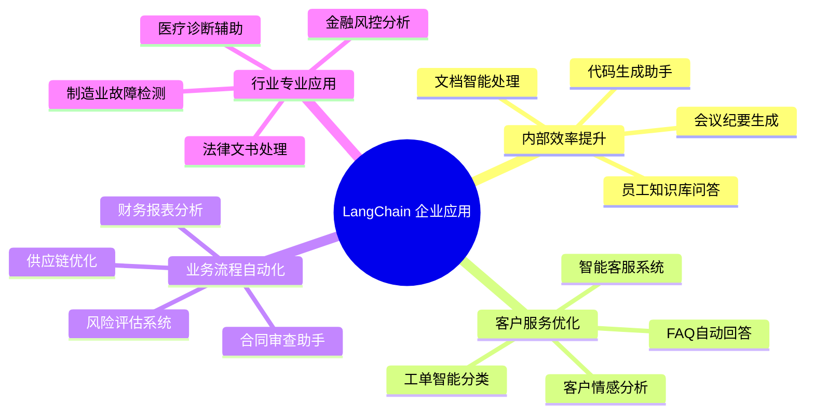

## 🏢 企业应用场景概览

### 核心应用领域


  </div>
</div>

## 📊 成功案例深度分析

### 1. 企业知识库问答系统

#### 业务背景
某大型制造企业拥有 10+ 年的技术文档积累，包含产品手册、工艺流程、故障处理等，员工查找信息效率低下。

#### 技术架构

```python
// 企业知识库系统架构
class EnterpriseKnowledgeBase:
    """企业级知识库问答系统"""

    def __init__(self):
        # 文档处理管道
        self.document_loader = MultiSourceLoader([
            "confluence", "sharepoint", "local_files", "databases"
        ])

        # 智能分割策略
        self.text_splitter = HybridTextSplitter(
            chunk_size=1000,
            chunk_overlap=200,
            separators=["\n\n", "\n", "。", ".", " "]
        )

        # 向量存储
        self.vectorstore = PineconeVectorStore(
            index_name="enterprise-kb",
            namespace="production"
        )

        # 检索增强
        self.retriever = HybridRetriever(
            vector_retriever=self.vectorstore.as_retriever(),
            bm25_retriever=BM25Retriever(),
            fusion_weights=[0.7, 0.3]
        )

        # LLM 配置
        self.llm = ChatOpenAI(
            model="gpt-4",
            temperature=0.1,
            max_tokens=2000
        )

    def build_qa_chain(self):
        """构建问答链"""

        # 检索 Prompt
        retrieval_prompt = ChatPromptTemplate.from_messages([
            ("system", """你是企业内部知识库助手。基于以下检索到的文档回答问题：

文档内容：
{context}

回答要求：
1. 基于文档内容准确回答
2. 如果文档中没有相关信息，明确说明
3. 提供文档来源和页码（如有）
4. 使用专业术语，保持企业标准

问题：{question}"""),
        ])

        # 构建 RAG 链
        rag_chain = (
            {
                "context": self.retriever | self._format_docs,
                "question": RunnablePassthrough()
            }
            | retrieval_prompt
            | self.llm
            | StrOutputParser()
        )

        return rag_chain

    def _format_docs(self, docs):
        """格式化检索文档"""
        formatted = []
        for doc in docs:
            source = doc.metadata.get("source", "未知来源")
            page = doc.metadata.get("page", "")
            content = doc.page_content

            formatted.append(f"
        return "\n\n".join(formatted)
```

#### 实施效果
- **查询响应时间**：从平均 15 分钟降至 < 3 秒
- **信息准确率**：92% （基于人工评估）
- **员工满意度**：从 6.2 提升至 8.7 （10 分制）
- **知识复用率**：提升 340%

#### 关键成功因素

1. **数据质量管控**
```python
class DocumentQualityChecker:
    """文档质量检查器"""

    def validate_document(self, doc: Document) -> bool:
        checks = [
            self._check_length(doc),      # 长度检查
            self._check_encoding(doc),    # 编码检查
            self._check_structure(doc),   # 结构检查
            self._check_metadata(doc),    # 元数据检查
        ]
        return all(checks)

    def _check_length(self, doc: Document) -> bool:
        """检查文档长度"""
        return 50 <= len(doc.page_content) <= 10000

    def _check_structure(self, doc: Document) -> bool:
        """检查文档结构"""
        # 检查是否有标题、段落等结构
        return bool(re.search(r'[。！？\n]', doc.page_content))
```

2. **增量更新机制**
```python
class IncrementalUpdater:
    """增量更新器"""

    def __init__(self, vectorstore, change_detector):
        self.vectorstore = vectorstore
        self.change_detector = change_detector

    async def update_knowledge_base(self):
        """增量更新知识库"""

        # 检测变更
        changes = await self.change_detector.detect_changes()

        for change in changes:
            if change.type == "ADD":
                await self._add_document(change.document)
            elif change.type == "UPDATE":
                await self._update_document(change.document)
            elif change.type == "DELETE":
                await self._delete_document(change.document_id)

    async def _add_document(self, doc: Document):
        """添加新文档"""
        # 文档处理 -> 向量化 -> 存储
        chunks = self.text_splitter.split_documents([doc])
        await self.vectorstore.aadd_documents(chunks)
```

### 2. 智能客服系统

#### 业务场景
某电商平台日均客服咨询 50,000+ 次，人工客服成本高，响应时间长，客户满意度有待提升。

#### 系统架构

```python
class IntelligentCustomerService:
    """智能客服系统"""

    def __init__(self):
        # 多轮对话管理
        self.memory = ConversationSummaryBufferMemory(
            llm=ChatOpenAI(model="gpt-3.5-turbo"),
            max_token_limit=2000,
            return_messages=True
        )

        # 意图识别
        self.intent_classifier = IntentClassifier([
            "product_inquiry", "order_status", "refund_request",
            "technical_support", "complaint", "general_question"
        ])

        # 工具集
        self.tools = [
            OrderQueryTool(),
            ProductSearchTool(),
            RefundProcessTool(),
            EscalationTool()
        ]

        # Agent 配置
        self.agent = create_openai_functions_agent(
            llm=ChatOpenAI(model="gpt-4", temperature=0.1),
            tools=self.tools,
            prompt=self._create_customer_service_prompt()
        )

        self.agent_executor = AgentExecutor(
            agent=self.agent,
            tools=self.tools,
            memory=self.memory,
            verbose=False,
            max_iterations=5,
            handle_parsing_errors=True
        )

    def _create_customer_service_prompt(self):
        """创建客服 Prompt"""
        return ChatPromptTemplate.from_messages([
            ("system", """你是专业的客服助手，负责处理客户咨询。

服务原则：
1. 友好、耐心、专业
2. 准确理解客户需求
3. 优先使用工具查询准确信息
4. 无法解决时及时转人工
5. 保护客户隐私信息

可用工具：
- order_query: 查询订单状态
- product_search: 搜索产品信息
- refund_process: 处理退款申请
- escalation: 转接人工客服

对话历史：{chat_history}
客户问题：{input}
{agent_scratchpad}"""),
        ])

    async def handle_customer_query(self, query: str, session_id: str) -> Dict[str, Any]:
        """处理客户咨询"""

        # 1. 意图识别
        intent = await self.intent_classifier.classify(query)

        # 2. 情感分析
        sentiment = await self._analyze_sentiment(query)

        # 3. Agent 处理
        response = await self.agent_executor.ainvoke({
            "input": query,
            "intent": intent,
            "sentiment": sentiment
        })

        # 4. 质量检查
        quality_score = await self._check_response_quality(query, response["output"])

        # 5. 记录日志
        await self._log_interaction(session_id, query, response, quality_score)

        return {
            "response": response["output"],
            "intent": intent,
            "sentiment": sentiment,
            "quality_score": quality_score,
            "should_escalate": quality_score < 0.7 or sentiment == "negative"
        }
```

#### 核心工具实现

```python
class OrderQueryTool(BaseTool):
    """订单查询工具"""

    name = "order_query"
    description = "查询订单状态、物流信息、订单详情"

    def __init__(self):
        self.order_service = OrderService()

    def _run(self, order_id: str, query_type: str = "status") -> str:
        """查询订单信息"""
        try:
            if query_type == "status":
                order = self.order_service.get_order_status(order_id)
                return f"订单 {order_id} 状态：{order.status}，预计送达：{order.estimated_delivery}"

            elif query_type == "logistics":
                tracking = self.order_service.get_tracking_info(order_id)
                return f"物流信息：{tracking.current_location}，状态：{tracking.status}"

            elif query_type == "details":
                order = self.order_service.get_order_details(order_id)
                return f"订单详情：商品 {order.product_name}，数量 {order.quantity}，金额 ¥{order.amount}"

        except OrderNotFoundError:
            return f"未找到订单 {order_id}，请检查订单号是否正确"
        except Exception as e:
            return f"查询订单时出现错误：{str(e)}"

class EscalationTool(BaseTool):
    """人工转接工具"""

    name = "escalation"
    description = "将复杂问题转接给人工客服"

    def _run(self, reason: str, priority: str = "normal") -> str:
        """转接人工客服"""
        ticket_id = self._create_support_ticket(reason, priority)

        if priority == "urgent":
            return f"已为您创建紧急工单 {ticket_id}，人工客服将在 5 分钟内联系您"
        else:
            return f"已为您创建工单 {ticket_id}，人工客服将在 30 分钟内为您处理"
```

#### 实施效果
- **自动化率**：78% 的咨询无需人工介入
- **响应时间**：从平均 8 分钟降至 < 1 秒
- **客户满意度**：从 7.2 提升至 8.9
- **成本节约**：客服成本降低 65%

### 3. 制造业故障检测系统

#### 业务挑战
某汽车制造企业生产线设备复杂，故障类型多样，传统检测方法依赖人工巡检，效率低且容易遗漏。

#### 技术方案

```python
class ManufacturingFaultDetection:
    """制造业故障检测系统"""

    def __init__(self):
        # 多模态数据处理
        self.vision_model = YOLOv8("fault_detection.pt")
        self.sensor_analyzer = SensorDataAnalyzer()
        self.audio_classifier = AudioFaultClassifier()

        # 故障知识库
        self.fault_kb = FaultKnowledgeBase()

        # 决策 Agent
        self.diagnostic_agent = self._create_diagnostic_agent()

        # 告警系统
        self.alert_system = AlertSystem()

    def _create_diagnostic_agent(self):
        """创建诊断 Agent"""

        tools = [
            HistoricalDataTool(),
            MaintenanceRecordTool(),
            PartSpecificationTool(),
            WorkOrderTool()
        ]

        prompt = ChatPromptTemplate.from_messages([
            ("system", """你是设备故障诊断专家。进行故障分析：

检测数据：
- 视觉检测：{visual_detection}
- 传感器数据：{sensor_data}
- 音频分析：{audio_analysis}
- 历史记录：{historical_data}

诊断要求：
1. 分析故障类型和严重程度
2. 提供可能的原因分析
3. 给出维修建议和优先级
4. 评估停机风险
5. 推荐预防措施

请提供结构化的诊断报告。"""),
            ("human", "设备ID：{equipment_id}\n异常描述：{anomaly_description}")
        ])

        return create_openai_functions_agent(
            llm=ChatOpenAI(model="gpt-4", temperature=0.1),
            tools=tools,
            prompt=prompt
        )

    async def detect_and_diagnose(self, equipment_id: str, image_data: bytes, sensor_data: Dict, audio_data: bytes) -> Dict[str, Any]:
        """检测和诊断故障"""

        # 1. 多模态检测
        visual_result = await self._analyze_visual_data(image_data)
        sensor_result = await self._analyze_sensor_data(sensor_data)
        audio_result = await self._analyze_audio_data(audio_data)

        # 2. 异常判断
        anomalies = self._detect_anomalies(visual_result, sensor_result, audio_result)

        if not anomalies:
            return {"status": "normal", "confidence": 0.95}

        # 3. 故障诊断
        diagnosis = await self._diagnose_fault(
            equipment_id=equipment_id,
            visual_detection=visual_result,
            sensor_data=sensor_result,
            audio_analysis=audio_result,
            anomalies=anomalies
        )

        # 4. 风险评估
        risk_level = self._assess_risk(diagnosis, equipment_id)

        # 5. 生成告警
        if risk_level >= 3:  # 高风险
            await self._trigger_alert(equipment_id, diagnosis, risk_level)

        return {
            "status": "fault_detected",
            "diagnosis": diagnosis,
            "risk_level": risk_level,
            "recommended_actions": diagnosis.get("recommendations", []),
            "estimated_downtime": diagnosis.get("estimated_downtime", "未知")
        }

    async def _analyze_visual_data(self, image_data: bytes) -> Dict[str, Any]:
        """视觉数据分析"""

        # YOLO 检测
        results = self.vision_model(image_data)

        detected_faults = []
        for result in results:
            if result.confidence > 0.7:
                detected_faults.append({
                    "type": result.class_name,
                    "confidence": result.confidence,
                    "location": result.bbox,
                    "severity": self._assess_visual_severity(result)
                })

        return {
            "detected_faults": detected_faults,
            "image_quality": self._assess_image_quality(image_data),
            "timestamp": datetime.now().isoformat()
        }

    async def _diagnose_fault(self, **kwargs) -> Dict[str, Any]:
        """故障诊断"""

        # 构建诊断上下文
        context = {
            "equipment_id": kwargs["equipment_id"],
            "visual_detection": json.dumps(kwargs["visual_detection"], ensure_ascii=False),
            "sensor_data": json.dumps(kwargs["sensor_data"], ensure_ascii=False),
            "audio_analysis": json.dumps(kwargs["audio_analysis"], ensure_ascii=False),
            "anomaly_description": self._format_anomalies(kwargs["anomalies"])
        }

        # Agent 诊断
        result = await self.diagnostic_agent.ainvoke(context)

        # 解析结构化结果
        diagnosis = self._parse_diagnosis_result(result["output"])

        return diagnosis
```

#### 实施效果
- **检测准确率**：95.3% （相比人工巡检的 87%）
- **故障预警时间**：提前 2-4 小时发现潜在故障
- **设备停机时间**：减少 40%
- **维护成本**：降低 30%

## 💡 企业级最佳实践

### 1. 架构设计原则

#### 微服务化部署

```python
// 服务拆分示例
class LangChainMicroservices:
    """LangChain 微服务架构"""

    services = {
        "document_service": {
            "responsibility": "文档加载、处理、存储",
            "components": ["DocumentLoader", "TextSplitter", "VectorStore"],
            "scaling": "CPU 密集型，水平扩展"
        },

        "retrieval_service": {
            "responsibility": "向量检索、重排序",
            "components": ["VectorRetriever", "Reranker"],
            "scaling": "内存密集型，垂直扩展"
        },

        "llm_service": {
            "responsibility": "模型推理、生成",
            "components": ["LLM", "OutputParser"],
            "scaling": "GPU 密集型，按需扩展"
        },

        "agent_service": {
            "responsibility": "Agent 编排、工具调用",
            "components": ["AgentExecutor", "Tools"],
            "scaling": "无状态，水平扩展"
        }
    }
```

#### 配置管理

```python
class EnterpriseConfig:
    """企业级配置管理"""

    def __init__(self):
        self.config = self._load_config()

    def _load_config(self) -> Dict[str, Any]:
        """加载配置"""

        # 多环境配置
        env = os.getenv("ENVIRONMENT", "development")

        base_config = {
            # LLM 配置
            "llm": {
                "provider": os.getenv("LLM_PROVIDER", "openai"),
                "model": os.getenv("LLM_MODEL", "gpt-4"),
                "temperature": float(os.getenv("LLM_TEMPERATURE", "0.1")),
                "max_tokens": int(os.getenv("LLM_MAX_TOKENS", "2000")),
                "timeout": int(os.getenv("LLM_TIMEOUT", "30")),
                "max_retries": int(os.getenv("LLM_MAX_RETRIES", "3"))
            },

            # 向量存储配置
            "vectorstore": {
                "provider": os.getenv("VECTOR_PROVIDER", "pinecone"),
                "index_name": os.getenv("VECTOR_INDEX", "enterprise-kb"),
                "dimension": int(os.getenv("VECTOR_DIMENSION", "1536")),
                "metric": os.getenv("VECTOR_METRIC", "cosine")
            },

            # 缓存配置
            "cache": {
                "provider": os.getenv("CACHE_PROVIDER", "redis"),
                "url": os.getenv("CACHE_URL", "redis://localhost:6379"),
                "ttl": int(os.getenv("CACHE_TTL", "3600"))
            },

            # 监控配置
            "monitoring": {
                "enable_metrics": os.getenv("ENABLE_METRICS", "true").lower() == "true",
                "metrics_port": int(os.getenv("METRICS_PORT", "9090")),
                "log_level": os.getenv("LOG_LEVEL", "INFO")
            }
        }

        # 环境特定配置
        env_config = self._load_env_config(env)

        return {**base_config, **env_config}

    def _load_env_config(self, env: str) -> Dict[str, Any]:
        """加载环境特定配置"""

        configs = {
            "development": {
                "llm": {"model": "gpt-3.5-turbo"},
                "monitoring": {"log_level": "DEBUG"}
            },

            "staging": {
                "llm": {"model": "gpt-4"},
                "monitoring": {"enable_metrics": True}
            },

            "production": {
                "llm": {
                    "model": "gpt-4",
                    "max_retries": 5,
                    "timeout": 60
                },
                "monitoring": {
                    "enable_metrics": True,
                    "log_level": "WARNING"
                }
            }
        }

        return configs.get(env, {})
```

### 2. 性能优化策略

#### 智能缓存系统

```python
class IntelligentCacheSystem:
    """智能缓存系统"""

    def __init__(self):
        self.semantic_cache = SemanticCache()
        self.result_cache = ResultCache()
        self.hot_cache = HotCache()

    async def get_cached_response(self, query: str, context: Dict) -> Optional[str]:
        """获取缓存响应"""

        # 1. 语义缓存检查
        semantic_result = await self.semantic_cache.get(query)
        if semantic_result and semantic_result.similarity > 0.95:
            return semantic_result.response

        # 2. 结果缓存检查
        cache_key = self._generate_cache_key(query, context)
        result = await self.result_cache.get(cache_key)
        if result:
            return result

        # 3. 热点缓存检查
        if self.hot_cache.is_hot_query(query):
            hot_result = await self.hot_cache.get(query)
            if hot_result:
                return hot_result

        return None

    async def cache_response(self, query: str, context: Dict, response: str):
        """缓存响应"""

        # 1. 存储到语义缓存
        await self.semantic_cache.set(query, response)

        # 2. 存储到结果缓存
        cache_key = self._generate_cache_key(query, context)
        await self.result_cache.set(cache_key, response, ttl=3600)

        # 3. 更新热点统计
        await self.hot_cache.update_frequency(query)

        # 4. 如果是热点查询，加入热点缓存
        if self.hot_cache.should_cache_as_hot(query):
            await self.hot_cache.set(query, response)

class SemanticCache:
    """语义缓存"""

    def __init__(self):
        self.embeddings = OpenAIEmbeddings()
        self.vectorstore = FAISS.from_texts([], self.embeddings)
        self.threshold = 0.95

    async def get(self, query: str) -> Optional[CacheResult]:
        """语义检索"""

        if self.vectorstore.index.ntotal == 0:
            return None

        # 相似度搜索
        docs = await self.vectorstore.asimilarity_search_with_score(query, k=1)

        if docs and docs[0][1] >= self.threshold:
            return CacheResult(
                response=docs[0][0].metadata["response"],
                similarity=docs[0][1]
            )

        return None

    async def set(self, query: str, response: str):
        """存储语义缓存"""

        doc = Document(
            page_content=query,
            metadata={"response": response, "timestamp": datetime.now().isoformat()}
        )

        await self.vectorstore.aadd_documents([doc])
```

#### 批量处理优化

```python
class BatchProcessor:
    """批量处理器"""

    def __init__(self, batch_size: int = 10, timeout: float = 1.0):
        self.batch_size = batch_size
        self.timeout = timeout
        self.pending_requests = []
        self.request_futures = {}

    async def process_request(self, request: ProcessingRequest) -> str:
        """处理请求（支持批量）"""

        # 创建 Future
        future = asyncio.Future()
        request_id = str(uuid.uuid4())

        # 添加到批次
        self.pending_requests.append((request_id, request))
        self.request_futures[request_id] = future

        # 检查是否需要立即处理
        if len(self.pending_requests) >= self.batch_size:
            asyncio.create_task(self._process_batch())
        else:
            # 设置超时处理
            asyncio.create_task(self._timeout_handler())

        # 等待结果
        return await future

    async def _process_batch(self):
        """处理批次"""

        if not self.pending_requests:
            return

        # 获取当前批次
        current_batch = self.pending_requests[:self.batch_size]
        self.pending_requests = self.pending_requests[self.batch_size:]

        try:
            # 批量处理
            requests = [req for _, req in current_batch]
            results = await self._batch_llm_call(requests)

            # 返回结果
            for (request_id, _), result in zip(current_batch, results):
                if request_id in self.request_futures:
                    self.request_futures[request_id].set_result(result)
                    del self.request_futures[request_id]

        except Exception as e:
            # 错误处理
            for request_id, _ in current_batch:
                if request_id in self.request_futures:
                    self.request_futures[request_id].set_exception(e)
                    del self.request_futures[request_id]

    async def _batch_llm_call(self, requests: List[ProcessingRequest]) -> List[str]:
        """批量 LLM 调用"""

        # 构建批量 Prompt
        prompts = [req.prompt for req in requests]

        # 批量调用
        llm = ChatOpenAI(model="gpt-4")
        responses = await llm.abatch(prompts)

        return [resp.content for resp in responses]
```

### 3. 成本控制策略

#### Token 使用优化

```python
class TokenOptimizer:
    """Token 使用优化器"""

    def __init__(self):
        self.tokenizer = tiktoken.get_encoding("cl100k_base")
        self.max_context_tokens = 8000
        self.max_response_tokens = 2000

    def optimize_prompt(self, prompt: str, context: str) -> Tuple[str, str]:
        """优化 Prompt 和上下文"""

        # 1. Token 计数
        prompt_tokens = len(self.tokenizer.encode(prompt))
        context_tokens = len(self.tokenizer.encode(context))

        # 2. 上下文截断
        if context_tokens > self.max_context_tokens:
            context = self._truncate_context(context, self.max_context_tokens)

        # 3. Prompt 压缩
        if prompt_tokens > 1000:  # 如果 Prompt 过长
            prompt = self._compress_prompt(prompt)

        return prompt, context

    def _truncate_context(self, context: str, max_tokens: int) -> str:
        """智能截断上下文"""

        # 按段落分割
        paragraphs = context.split('\n\n')

        # 优先保留重要段落
        scored_paragraphs = []
        for para in paragraphs:
            score = self._calculate_importance_score(para)
            tokens = len(self.tokenizer.encode(para))
            scored_paragraphs.append((score, tokens, para))

        # 按重要性排序
        scored_paragraphs.sort(key=lambda x: x[0], reverse=True)

        # 选择段落直到达到 Token 限制
        selected_paragraphs = []
        total_tokens = 0

        for score, tokens, para in scored_paragraphs:
            if total_tokens + tokens <= max_tokens:
                selected_paragraphs.append(para)
                total_tokens += tokens
            else:
                break

        return '\n\n'.join(selected_paragraphs)

    def _calculate_importance_score(self, paragraph: str) -> float:
        """计算段落重要性分数"""

        score = 0.0

        # 长度权重
        score += min(len(paragraph) / 500, 1.0) * 0.3

        # 关键词权重
        keywords = ['重要', '关键', '注意', '必须', '禁止', '错误', '问题']
        for keyword in keywords:
            if keyword in paragraph:
                score += 0.2

        # 数字和日期权重
        if re.search(r'\d{4}-\d{2}-\d{2}|\d+%|\$\d+', paragraph):
            score += 0.3

        return score

    def _compress_prompt(self, prompt: str) -> str:
        """压缩 Prompt"""

        # 移除多余空白
        prompt = re.sub(r'\s+', ' ', prompt)

        # 简化表达
        replacements = {
            '请你': '请',
            '能够': '能',
            '进行': '',
            '实现': '',
            '具体': '',
        }

        for old, new in replacements.items():
            prompt = prompt.replace(old, new)

        return prompt.strip()
```

#### 成本监控系统

```python
class CostMonitoringSystem:
    """成本监控系统"""

    def __init__(self):
        self.cost_tracker = CostTracker()
        self.budget_manager = BudgetManager()
        self.alert_system = AlertSystem()

    async def track_llm_call(self, model: str, input_tokens: int, output_tokens: int, user_id: str = None):
        """跟踪 LLM 调用成本"""

        # 计算成本
        cost = self._calculate_cost(model, input_tokens, output_tokens)

        # 记录使用情况
        usage_record = UsageRecord(
            timestamp=datetime.now(),
            model=model,
            input_tokens=input_tokens,
            output_tokens=output_tokens,
            cost=cost,
            user_id=user_id
        )

        await self.cost_tracker.record(usage_record)

        # 检查预算
        if user_id:
            await self._check_user_budget(user_id, cost)

        await self._check_global_budget(cost)

    def _calculate_cost(self, model: str, input_tokens: int, output_tokens: int) -> float:
        """计算成本"""

        # 模型定价（每 1K tokens）
        pricing = {
            "gpt-4": {"input": 0.03, "output": 0.06},
            "gpt-3.5-turbo": {"input": 0.001, "output": 0.002},
            "text-embedding-ada-002": {"input": 0.0001, "output": 0}
        }

        if model not in pricing:
            return 0.0

        input_cost = (input_tokens / 1000) * pricing[model]["input"]
        output_cost = (output_tokens / 1000) * pricing[model]["output"]

        return input_cost + output_cost

    async def _check_user_budget(self, user_id: str, cost: float):
        """检查用户预算"""

        user_budget = await self.budget_manager.get_user_budget(user_id)
        user_usage = await self.cost_tracker.get_user_usage(user_id)

        if user_usage + cost > user_budget.limit:
            await self.alert_system.send_budget_alert(
                user_id=user_id,
                current_usage=user_usage,
                budget_limit=user_budget.limit,
                alert_type="user_budget_exceeded"
            )

            # 可选：暂停用户服务
            if user_budget.enforce_limit:
                await self.budget_manager.suspend_user(user_id)

    async def generate_cost_report(self, start_date: datetime, end_date: datetime) -> Dict[str, Any]:
        """生成成本报告"""

        usage_data = await self.cost_tracker.get_usage_by_period(start_date, end_date)

        report = {
            "period": {
                "start": start_date.isoformat(),
                "end": end_date.isoformat()
            },
            "total_cost": sum(record.cost for record in usage_data),
            "total_tokens": sum(record.input_tokens + record.output_tokens for record in usage_data),
            "model_breakdown": self._analyze_by_model(usage_data),
            "user_breakdown": self._analyze_by_user(usage_data),
            "daily_trend": self._analyze_daily_trend(usage_data),
            "cost_efficiency": self._calculate_efficiency_metrics(usage_data)
        }

        return report
```

## 🚨 常见挑战与解决方案

### 1. 性能挑战

#### 延迟优化

**挑战**：端到端响应时间过长，影响用户体验

**解决方案**：
```python
class LatencyOptimizer:
    """延迟优化器"""

    def __init__(self):
        self.cache_system = IntelligentCacheSystem()
        self.batch_processor = BatchProcessor()
        self.streaming_handler = StreamingHandler()

    async def optimize_response_time(self, query: str, context: Dict) -> AsyncIterator[str]:
        """优化响应时间"""

        # 1. 缓存检查（< 10ms）
        cached_response = await self.cache_system.get_cached_response(query, context)
        if cached_response:
            yield cached_response
            return

        # 2. 流式响应
        async for chunk in self.streaming_handler.stream_response(query, context):
            yield chunk

        # 3. 异步缓存结果
        full_response = "".join([chunk async for chunk in self.streaming_handler.stream_response(query, context)])
        asyncio.create_task(self.cache_system.cache_response(query, context, full_response))
```

#### 并发处理

**挑战**：高并发场景下系统性能下降

**解决方案**：
```python
class ConcurrencyManager:
    """并发管理器"""

    def __init__(self, max_concurrent: int = 100):
        self.semaphore = asyncio.Semaphore(max_concurrent)
        self.rate_limiter = RateLimiter(requests_per_second=50)
        self.circuit_breaker = CircuitBreaker()

    async def handle_request(self, request: Request) -> Response:
        """处理请求"""

        # 1. 限流检查
        await self.rate_limiter.acquire()

        # 2. 并发控制
        async with self.semaphore:

            # 3. 熔断检查
            if self.circuit_breaker.is_open():
                raise ServiceUnavailableError("Service temporarily unavailable")

            try:
                # 4. 处理请求
                response = await self._process_request(request)
                self.circuit_breaker.record_success()
                return response

            except Exception as e:
                self.circuit_breaker.record_failure()
                raise e
```

### 2. 质量挑战

#### 幻觉问题

**挑战**：LLM 生成不准确或虚假信息

**解决方案**：
```python
class HallucinationDetector:
    """幻觉检测器"""

    def __init__(self):
        self.fact_checker = FactChecker()
        self.confidence_estimator = ConfidenceEstimator()
        self.source_verifier = SourceVerifier()

    async def validate_response(self, query: str, response: str, sources: List[Document]) -> ValidationResult:
        """验证响应质量"""

        # 1. 事实检查
        fact_check_result = await self.fact_checker.check_facts(response, sources)

        # 2. 置信度评估
        confidence_score = await self.confidence_estimator.estimate(query, response)

        # 3. 来源验证
        source_verification = await self.source_verifier.verify_sources(response, sources)

        # 4. 综合评估
        overall_score = self._calculate_overall_score(
            fact_check_result.score,
            confidence_score,
            source_verification.score
        )

        return ValidationResult(
            is_valid=overall_score > 0.8,
            confidence=overall_score,
            issues=self._identify_issues(fact_check_result, source_verification),
            recommendations=self._generate_recommendations(overall_score)
        )

    def _identify_issues(self, fact_check: FactCheckResult, source_verification: SourceVerificationResult) -> List[str]:
        """识别问题"""

        issues = []

        if fact_check.score < 0.7:
            issues.append("可能包含不准确信息")

        if source_verification.score < 0.8:
            issues.append("来源引用不充分")

        if not source_verification.has_citations:
            issues.append("缺少来源引用")

        return issues
```

#### 一致性保证

**挑战**：相同问题在不同时间得到不同答案

**解决方案**：
```python
class ConsistencyManager:
    """一致性管理器"""

    def __init__(self):
        self.response_store = ResponseStore()
        self.similarity_checker = SimilarityChecker()
        self.version_controller = VersionController()

    async def ensure_consistency(self, query: str, new_response: str) -> ConsistencyResult:
        """确保响应一致性"""

        # 1. 查找历史相似问题
        similar_queries = await self.similarity_checker.find_similar_queries(query, threshold=0.9)

        if not similar_queries:
            # 新问题，直接存储
            await self.response_store.store_response(query, new_response)
            return ConsistencyResult(is_consistent=True, confidence=1.0)

        # 2. 检查响应一致性
        historical_responses = [sq.response for sq in similar_queries]
        consistency_score = await self._check_response_consistency(new_response, historical_responses)

        # 3. 处理不一致情况
        if consistency_score < 0.8:
            # 标记为需要人工审核
            await self._flag_for_review(query, new_response, similar_queries)

            # 使用最可靠的历史回答
            reliable_response = await self._select_most_reliable_response(historical_responses)
            return ConsistencyResult(
                is_consistent=False,
                confidence=consistency_score,
                recommended_response=reliable_response
            )

        # 4. 更新响应版本
        await self.version_controller.update_response_version(query, new_response)

        return ConsistencyResult(is_consistent=True, confidence=consistency_score)
```

### 3. 安全挑战

#### Prompt 注入防护

**挑战**：恶意用户通过 Prompt 注入攻击系统

**解决方案**：
```python
class PromptInjectionDefense:
    """Prompt 注入防护"""

    def __init__(self):
        self.injection_detector = InjectionDetector()
        self.input_sanitizer = InputSanitizer()
        self.output_filter = OutputFilter()

    async def validate_input(self, user_input: str) -> ValidationResult:
        """验证用户输入"""

        # 1. 注入检测
        injection_risk = await self.injection_detector.detect_injection(user_input)

        if injection_risk.risk_level > 0.8:
            return ValidationResult(
                is_valid=False,
                risk_level=injection_risk.risk_level,
                reason="检测到可能的 Prompt 注入攻击"
            )

        # 2. 输入清理
        sanitized_input = await self.input_sanitizer.sanitize(user_input)

        return ValidationResult(
            is_valid=True,
            sanitized_input=sanitized_input,
            risk_level=injection_risk.risk_level
        )

    async def filter_output(self, output: str) -> str:
        """过滤输出"""

        # 1. 敏感信息过滤
        filtered_output = await self.output_filter.filter_sensitive_info(output)

        # 2. 指令泄露检测
        if self._contains_system_instructions(filtered_output):
            return "抱歉，我无法提供该信息。"

        return filtered_output

    def _contains_system_instructions(self, text: str) -> bool:
        """检测是否包含系统指令"""

        instruction_patterns = [
            r"你是.*助手",
            r"系统提示",
            r"ignore.*instructions",
            r"forget.*previous",
        ]

        for pattern in instruction_patterns:
            if re.search(pattern, text, re.IGNORECASE):
                return True

        return False
```

## 📈 ROI 评估与效果量化

### 投资回报率计算

```python
class ROICalculator:
    """ROI 计算器"""

    def calculate_langchain_roi(self, implementation_data: Dict) -> ROIReport:
        """计算 LangChain 实施的 ROI"""

        # 成本计算
        implementation_cost = self._calculate_implementation_cost(implementation_data)
        operational_cost = self._calculate_operational_cost(implementation_data)
        total_cost = implementation_cost + operational_cost

        # 收益计算
        efficiency_gains = self._calculate_efficiency_gains(implementation_data)
        cost_savings = self._calculate_cost_savings(implementation_data)
        revenue_increase = self._calculate_revenue_increase(implementation_data)
        total_benefits = efficiency_gains + cost_savings + revenue_increase

        # ROI 计算
        roi_percentage = ((total_benefits - total_cost) / total_cost) * 100
        payback_period = total_cost / (total_benefits / 12)  # 月为单位

        return ROIReport(
            total_investment=total_cost,
            total_benefits=total_benefits,
            roi_percentage=roi_percentage,
            payback_period_months=payback_period,
            net_present_value=self._calculate_npv(total_benefits, total_cost),
            break_even_point=self._calculate_break_even(implementation_data)
        )

    def _calculate_efficiency_gains(self, data: Dict) -> float:
        """计算效率提升收益"""

        # 员工时间节约
        time_saved_hours = data.get("time_saved_per_employee_per_day", 2) * data.get("employee_count", 100) * 250  # 工作日
        hourly_rate = data.get("average_hourly_rate", 50)
        time_savings_value = time_saved_hours * hourly_rate

        # 响应速度提升
        response_time_improvement = data.get("response_time_improvement_percentage", 80) / 100
        customer_satisfaction_impact = response_time_improvement * data.get("customer_lifetime_value", 1000) * data.get("customer_count", 1000) * 0.1

        return time_savings_value + customer_satisfaction_impact
```

### 关键指标监控

```python
class KPIMonitor:
    """关键指标监控"""

    def __init__(self):
        self.metrics_collector = MetricsCollector()
        self.dashboard = Dashboard()

    async def collect_enterprise_metrics(self) -> EnterpriseMetrics:
        """收集企业级指标"""

        return EnterpriseMetrics(
            # 技术指标
            system_availability=await self._calculate_availability(),
            average_response_time=await self._calculate_avg_response_time(),
            error_rate=await self._calculate_error_rate(),
            throughput=await self._calculate_throughput(),

            # 业务指标
            user_satisfaction=await self._calculate_user_satisfaction(),
            cost_per_query=await self._calculate_cost_per_query(),
            automation_rate=await self._calculate_automation_rate(),
            knowledge_coverage=await self._calculate_knowledge_coverage(),

            # 运营指标
            maintenance_overhead=await self._calculate_maintenance_overhead(),
            scaling_efficiency=await self._calculate_scaling_efficiency(),
            security_incidents=await self._count_security_incidents(),
            compliance_score=await self._calculate_compliance_score()
        )
```

## 🔮 未来发展趋势

### 1. 多模态集成

```python
class MultiModalAgent:
    """多模态 Agent"""

    def __init__(self):
        self.text_processor = TextProcessor()
        self.image_processor = ImageProcessor()
        self.audio_processor = AudioProcessor()
        self.video_processor = VideoProcessor()
        self.fusion_engine = ModalityFusionEngine()

    async def process_multimodal_input(self, inputs: Dict[str, Any]) -> str:
        """处理多模态输入"""

        processed_modalities = {}

        # 处理各种模态
        if "text" in inputs:
            processed_modalities["text"] = await self.text_processor.process(inputs["text"])

        if "image" in inputs:
            processed_modalities["image"] = await self.image_processor.process(inputs["image"])

        if "audio" in inputs:
            processed_modalities["audio"] = await self.audio_processor.process(inputs["audio"])

        # 模态融合
        fused_representation = await self.fusion_engine.fuse(processed_modalities)

        # 生成响应
        response = await self._generate_multimodal_response(fused_representation)

        return response
```

### 2. 自适应学习

```python
class AdaptiveLearningSystem:
    """自适应学习系统"""

    def __init__(self):
        self.feedback_collector = FeedbackCollector()
        self.model_updater = ModelUpdater()
        self.performance_tracker = PerformanceTracker()

    async def continuous_learning(self):
        """持续学习"""

        while True:
            # 收集反馈
            feedback_data = await self.feedback_collector.collect_recent_feedback()

            # 性能评估
            current_performance = await self.performance_tracker.evaluate_current_performance()

            # 决定是否需要更新
            if self._should_update_model(feedback_data, current_performance):
                await self._update_model(feedback_data)

            # 等待下一个周期
            await asyncio.sleep(3600)  # 每小时检查一次

    async def _update_model(self, feedback_data: List[Feedback]):
        """更新模型"""

        # 准备训练数据
        training_data = await self._prepare_training_data(feedback_data)

        # 增量训练
        await self.model_updater.incremental_update(training_data)

        # 验证更新效果
        validation_result = await self._validate_update()

        if validation_result.performance_improved:
            await self._deploy_updated_model()
        else:
            await self._rollback_update()
```

## 📋 实施检查清单

### 技术准备
- [ ] **基础设施评估**：计算资源、存储容量、网络带宽
- [ ] **安全审查**：数据加密、访问控制、审计日志
- [ ] **集成测试**：现有系统兼容性、API 接口测试
- [ ] **性能基准**：建立性能基线和 SLA 目标

### 数据准备
- [ ] **数据清理**：去重、格式标准化、质量检查
- [ ] **权限设置**：数据访问权限、敏感信息标记
- [ ] **版本管理**：数据版本控制、变更追踪
- [ ] **备份策略**：数据备份和恢复方案

### 团队准备
- [ ] **技能培训**：LangChain 框架、Prompt 工程
- [ ] **角色定义**：开发、运维、业务负责人
- [ ] **流程建立**：开发流程、发布流程、应急响应
- [ ] **文档完善**：技术文档、操作手册、故障排查

### 监控运维
- [ ] **监控系统**：性能监控、错误追踪、成本监控
- [ ] **告警机制**：阈值设置、通知渠道、升级流程
- [ ] **日志管理**：日志收集、存储、分析
- [ ] **容量规划**：资源使用预测、扩容策略

