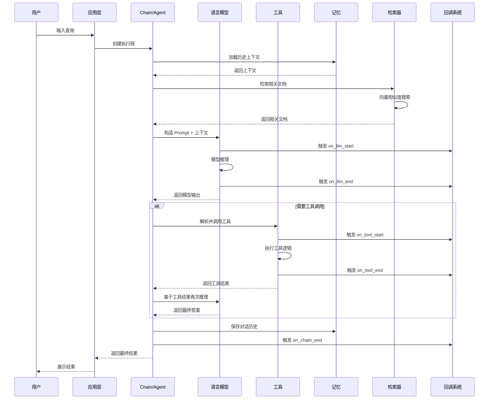
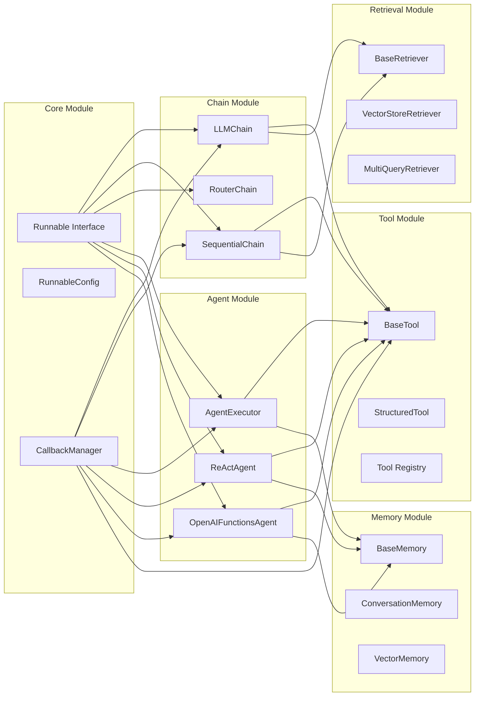

## 概述

本文档提供LangChain框架的完整使用手册和深度源码分析，帮助开发者从入门到精通掌握整个项目的代码逻辑。

<!--more-->

## 1. LangChain框架使用手册

### 1.1 快速入门

#### 1.1.1 安装与配置

```bash
# 安装核心包
pip install langchain-core

# 安装主要集成包
pip install langchain-openai langchain-anthropic langchain-community

# 安装完整包（包含所有组件）
pip install langchain
```

#### 1.1.2 基础使用示例

```python
from langchain_core.messages import HumanMessage
from langchain_openai import ChatOpenAI
from langchain_core.output_parsers import StrOutputParser

# 1. 创建LLM实例
llm = ChatOpenAI(model="gpt-3.5-turbo", temperature=0.1)

# 2. 创建简单链
chain = llm | StrOutputParser()

# 3. 调用链
result = chain.invoke([HumanMessage(content="Hello, world!")])
print(result)
```

### 1.2 核心概念

#### 1.2.1 Runnable接口

所有LangChain组件都实现了`Runnable`接口，提供统一的执行模式：

```python
from langchain_core.runnables import Runnable
from typing import Any, Dict, List, Optional

class MyCustomRunnable(Runnable):
    """自定义Runnable组件示例"""

    def invoke(self, input: Any, config: Optional[Dict] = None) -> Any:
        """同步执行"""
        return f"Processed: {input}"

    async def ainvoke(self, input: Any, config: Optional[Dict] = None) -> Any:
        """异步执行"""
        return f"Async processed: {input}"

    def stream(self, input: Any, config: Optional[Dict] = None):
        """流式执行"""
        for char in str(input):
            yield char

    def batch(self, inputs: List[Any], config: Optional[Dict] = None) -> List[Any]:
        """批量执行"""
        return [self.invoke(inp, config) for inp in inputs]
```

#### 1.2.2 链式组合

使用`|`操作符进行链式组合：

```python
from langchain_core.prompts import ChatPromptTemplate
from langchain_openai import ChatOpenAI
from langchain_core.output_parsers import StrOutputParser

# 创建提示模板
prompt = ChatPromptTemplate.from_template("Tell me a joke about {topic}")

# 创建LLM
llm = ChatOpenAI()

# 创建输出解析器
output_parser = StrOutputParser()

# 链式组合
chain = prompt | llm | output_parser

# 执行
result = chain.invoke({"topic": "cats"})
```

### 1.3 主要组件API概览

#### 1.3.1 语言模型API

```python
# Chat Models
from langchain_openai import ChatOpenAI
from langchain_anthropic import ChatAnthropic

# 基础LLM
from langchain_openai import OpenAI

# 嵌入模型
from langchain_openai import OpenAIEmbeddings
```

#### 1.3.2 提示模板API

```python
from langchain_core.prompts import (
    PromptTemplate,
    ChatPromptTemplate,
    FewShotPromptTemplate,
    MessagesPlaceholder
)

# 简单模板
template = PromptTemplate.from_template("Tell me about {topic}")

# 聊天模板
chat_template = ChatPromptTemplate.from_messages([
    ("system", "You are a helpful assistant"),
    ("human", "{input}")
])
```

#### 1.3.3 输出解析器API

```python
from langchain_core.output_parsers import (
    StrOutputParser,
    JsonOutputParser,
    PydanticOutputParser
)
from pydantic import BaseModel

class Person(BaseModel):
    name: str
    age: int

# 结构化输出解析
parser = PydanticOutputParser(pydantic_object=Person)
```

## 2. 核心API深入分析

### 2.1 Runnable接口源码分析

#### 2.1.1 核心接口定义

```python
# langchain_core/runnables/base.py
from abc import ABC, abstractmethod
from typing import Any, AsyncIterator, Dict, Iterator, List, Optional, Union

class Runnable(Generic[Input, Output], ABC):
    """LangChain的核心抽象接口，所有组件的基类"""

    @abstractmethod
    def invoke(
        self,
        input: Input,
        config: Optional[RunnableConfig] = None,
        **kwargs: Any
    ) -> Output:
        """
        同步执行单个输入

        Args:
            input: 输入数据
            config: 运行时配置，包含callbacks、tags、metadata等
            **kwargs: 额外参数

        Returns:
            处理后的输出
        """
        ...

    async def ainvoke(
        self,
        input: Input,
        config: Optional[RunnableConfig] = None,
        **kwargs: Any
    ) -> Output:
        """
        异步执行单个输入

        默认实现：在线程池中执行同步invoke方法
        """
        return await asyncio.get_event_loop().run_in_executor(
            None, partial(self.invoke, input, config, **kwargs)
        )

    def stream(
        self,
        input: Input,
        config: Optional[RunnableConfig] = None,
        **kwargs: Any
    ) -> Iterator[Output]:
        """
        流式执行，返回迭代器

        默认实现：一次性返回invoke结果
        """
        yield self.invoke(input, config, **kwargs)

    def batch(
        self,
        inputs: List[Input],
        config: Optional[Union[RunnableConfig, List[RunnableConfig]]] = None,
        *,
        return_exceptions: bool = False,
        **kwargs: Any
    ) -> List[Output]:
        """
        批量执行多个输入

        Args:
            inputs: 输入列表
            config: 配置，可以是单个配置或配置列表
            return_exceptions: 是否返回异常而不是抛出

        Returns:
            输出列表
        """
        if not inputs:
            return []

        # 处理配置
        configs = self._get_config_list(config, len(inputs))

        # 并发执行
        with ThreadPoolExecutor() as executor:
            futures = [
                executor.submit(self.invoke, input, config, **kwargs)
                for input, config in zip(inputs, configs)
            ]

            results = []
            for future in futures:
                try:
                    results.append(future.result())
                except Exception as e:
                    if return_exceptions:
                        results.append(e)
                    else:
                        raise e

        return results
```

#### 2.1.2 链式组合实现

```python
# langchain_core/runnables/base.py
class Runnable(Generic[Input, Output], ABC):

    def __or__(self, other: Runnable[Any, Other]) -> RunnableSequence[Input, Other]:
        """
        实现 | 操作符，创建序列链

        Args:
            other: 下一个Runnable组件

        Returns:
            RunnableSequence实例
        """
        return RunnableSequence(first=self, last=other)

    def __ror__(self, other: Runnable[Other, Input]) -> RunnableSequence[Other, Output]:
        """
        实现反向 | 操作符
        """
        return RunnableSequence(first=other, last=self)

class RunnableSequence(Runnable[Input, Output]):
    """序列执行多个Runnable组件"""

    def __init__(
        self,
        *steps: Runnable[Any, Any],
        first: Optional[Runnable[Input, Any]] = None,
        middle: Optional[List[Runnable[Any, Any]]] = None,
        last: Optional[Runnable[Any, Output]] = None,
        name: Optional[str] = None
    ):
        """
        初始化序列

        Args:
            steps: 步骤列表
            first: 第一个步骤
            middle: 中间步骤列表
            last: 最后一个步骤
            name: 序列名称
        """
        if steps and (first is not None or last is not None):
            raise ValueError("Cannot specify both steps and first/last")

        if steps:
            self.steps = list(steps)
        else:
            self.steps = []
            if first is not None:
                self.steps.append(first)
            if middle:
                self.steps.extend(middle)
            if last is not None:
                self.steps.append(last)

        self.name = name

    def invoke(
        self,
        input: Input,
        config: Optional[RunnableConfig] = None,
        **kwargs: Any
    ) -> Output:
        """
        顺序执行所有步骤

        每个步骤的输出作为下个步骤的输入
        """
        # 配置回调管理
        callback_manager = get_callback_manager_for_config(config)
        run_manager = callback_manager.on_chain_start(
            dumpd(self), input, name=self.name
        )

        try:
            # 逐步执行
            for i, step in enumerate(self.steps):
                input = step.invoke(
                    input,
                    patch_config(
                        config,
                        callbacks=run_manager.get_child(f"seq:step:{i+1}")
                    ),
                    **kwargs
                )

            # 记录结束
            run_manager.on_chain_end(input)
            return input

        except Exception as e:
            run_manager.on_chain_error(e)
            raise e
```

### 2.2 Chain组件源码分析

#### 2.2.1 LLMChain实现

```python
# langchain/chains/llm.py
from langchain_core.chains import Chain
from langchain_core.language_models import BaseLanguageModel
from langchain_core.prompts import BasePromptTemplate
from langchain_core.output_parsers import BaseOutputParser

class LLMChain(Chain):
    """
    最基础的LLM调用链

    将Prompt模板、LLM和输出解析器组合成一个可执行的链
    """

    llm: BaseLanguageModel
    """语言模型实例"""

    prompt: BasePromptTemplate
    """提示模板"""

    output_parser: Optional[BaseOutputParser] = None
    """输出解析器，可选"""

    output_key: str = "text"
    """输出键名"""

    @property
    def input_keys(self) -> List[str]:
        """返回输入键列表"""
        return self.prompt.input_variables

    @property
    def output_keys(self) -> List[str]:
        """返回输出键列表"""
        return [self.output_key]

    def _call(
        self,
        inputs: Dict[str, Any],
        run_manager: Optional[CallbackManagerForChainRun] = None,
    ) -> Dict[str, Any]:
        """
        执行LLM链的核心逻辑

        Args:
            inputs: 输入字典，包含prompt模板所需的变量
            run_manager: 回调管理器

        Returns:
            包含输出的字典
        """
        # 1. 格式化Prompt
        prompt_value = self.prompt.format_prompt(**inputs)

        # 2. 调用LLM生成
        response = self.llm.generate_prompt(
            [prompt_value],
            callbacks=run_manager.get_child() if run_manager else None
        )

        # 3. 提取生成文本
        if self.llm._llm_type == "chat":
            # Chat模型返回AIMessage
            generated_text = response.generations[0][0].message.content
        else:
            # 文本模型返回字符串
            generated_text = response.generations[0][0].text

        # 4. 解析输出
        if self.output_parser:
            try:
                parsed_output = self.output_parser.parse(generated_text)
                return {self.output_key: parsed_output}
            except Exception as e:
                # 解析失败时的处理
                if run_manager:
                    run_manager.on_text(f"Output parsing failed: {e}")
                return {self.output_key: generated_text}
        else:
            return {self.output_key: generated_text}

    async def _acall(
        self,
        inputs: Dict[str, Any],
        run_manager: Optional[AsyncCallbackManagerForChainRun] = None,
    ) -> Dict[str, Any]:
        """异步版本的_call方法"""
        # 1. 格式化Prompt
        prompt_value = self.prompt.format_prompt(**inputs)

        # 2. 异步调用LLM
        response = await self.llm.agenerate_prompt(
            [prompt_value],
            callbacks=run_manager.get_child() if run_manager else None
        )

        # 3. 处理输出（同步版本相同逻辑）
        generated_text = response.generations[0][0].text

        if self.output_parser:
            parsed_output = self.output_parser.parse(generated_text)
            return {self.output_key: parsed_output}
        else:
            return {self.output_key: generated_text}

    def predict(self, **kwargs: Any) -> str:
        """
        便捷方法：直接返回生成的文本

        Args:
            **kwargs: 输入变量

        Returns:
            生成的文本
        """
        return self(kwargs)[self.output_key]

    async def apredict(self, **kwargs: Any) -> str:
        """predict的异步版本"""
        result = await self.acall(kwargs)
        return result[self.output_key]
```

#### 2.2.2 SequentialChain实现

```python
# langchain/chains/sequential.py
class SequentialChain(Chain):
    """
    顺序执行多个Chain的组合链

    每个Chain的输出会作为下个Chain的输入
    """

    chains: List[Chain]
    """Chain列表，按顺序执行"""

    input_variables: List[str]
    """整个序列的输入变量"""

    output_variables: List[str]
    """整个序列的输出变量"""

    return_all: bool = False
    """是否返回所有中间结果"""

    @property
    def input_keys(self) -> List[str]:
        return self.input_variables

    @property
    def output_keys(self) -> List[str]:
        return self.output_variables

    def _call(
        self,
        inputs: Dict[str, Any],
        run_manager: Optional[CallbackManagerForChainRun] = None,
    ) -> Dict[str, Any]:
        """
        顺序执行所有Chain

        Args:
            inputs: 初始输入
            run_manager: 回调管理器

        Returns:
            最终输出字典
        """
        known_values = inputs.copy()

        # 逐个执行Chain
        for i, chain in enumerate(self.chains):
            # 1. 准备当前Chain的输入
            chain_inputs = {
                k: known_values[k]
                for k in chain.input_keys
                if k in known_values
            }

            # 2. 检查输入完整性
            missing_keys = set(chain.input_keys) - set(chain_inputs.keys())
            if missing_keys:
                raise ValueError(
                    f"Chain {i} missing required inputs: {missing_keys}"
                )

            # 3. 执行Chain
            outputs = chain(
                chain_inputs,
                callbacks=run_manager.get_child(f"step_{i}") if run_manager else None
            )

            # 4. 更新已知值
            known_values.update(outputs)

        # 5. 返回指定的输出变量
        if self.return_all:
            return known_values
        else:
            return {k: known_values[k] for k in self.output_variables}

    def _validate_chains(self) -> None:
        """
        验证Chain序列的有效性

        检查：
        1. 输入输出变量的连接性
        2. 没有循环依赖
        3. 所有必需的变量都能被提供
        """
        available_vars = set(self.input_variables)

        for i, chain in enumerate(self.chains):
            # 检查当前Chain的输入是否都可用
            missing_inputs = set(chain.input_keys) - available_vars
            if missing_inputs:
                raise ValueError(
                    f"Chain {i} ({chain.__class__.__name__}) "
                    f"missing inputs: {missing_inputs}. "
                    f"Available: {available_vars}"
                )

            # 添加当前Chain的输出到可用变量
            available_vars.update(chain.output_keys)

        # 检查最终输出是否都可用
        missing_outputs = set(self.output_variables) - available_vars
        if missing_outputs:
            raise ValueError(
                f"Output variables {missing_outputs} not produced by any chain"
            )
```

### 2.3 Agent系统源码分析

#### 2.3.1 AgentExecutor核心实现

```python
# langchain/agents/agent.py
from langchain_core.agents import BaseSingleActionAgent, AgentAction, AgentFinish
from langchain_core.tools import BaseTool

class AgentExecutor(Chain):
    """
    Agent执行器 - 实现推理-行动循环

    核心功能：
    1. 管理Agent的执行循环
    2. 工具调用和结果处理
    3. 错误处理和重试机制
    4. 执行限制和安全控制
    """

    agent: BaseSingleActionAgent
    """Agent实例，负责决策"""

    tools: Sequence[BaseTool]
    """可用工具列表"""

    max_iterations: int = 15
    """最大迭代次数"""

    max_execution_time: Optional[float] = None
    """最大执行时间（秒）"""

    early_stopping_method: str = "force"
    """早停方法：force或generate"""

    handle_parsing_errors: Union[bool, str, Callable[[OutputParserException], str]] = False
    """解析错误处理方式"""

    def __init__(self, **kwargs):
        super().__init__(**kwargs)
        # 构建工具映射
        self.name_to_tool_map = {tool.name: tool for tool in self.tools}

    @property
    def input_keys(self) -> List[str]:
        return self.agent.input_keys

    @property
    def output_keys(self) -> List[str]:
        return self.agent.return_values

    def _call(
        self,
        inputs: Dict[str, Any],
        run_manager: Optional[CallbackManagerForChainRun] = None,
    ) -> Dict[str, Any]:
        """
        执行Agent的推理-行动循环

        Args:
            inputs: 输入字典，通常包含'input'键
            run_manager: 回调管理器

        Returns:
            Agent的最终输出
        """
        # 初始化状态
        intermediate_steps: List[Tuple[AgentAction, str]] = []
        iterations = 0
        time_elapsed = 0.0
        start_time = time.time()

        # 主循环
        while self._should_continue(iterations, time_elapsed):
            try:
                # 1. Agent规划下一步行动
                next_step_output = self._take_next_step(
                    name_to_tool_map=self.name_to_tool_map,
                    color_mapping={},
                    inputs=inputs,
                    intermediate_steps=intermediate_steps,
                    run_manager=run_manager,
                )

                # 2. 检查是否结束
                if isinstance(next_step_output, AgentFinish):
                    return self._return(
                        next_step_output,
                        intermediate_steps,
                        run_manager
                    )

                # 3. 更新中间步骤
                intermediate_steps.extend(next_step_output)

            except Exception as e:
                # 错误处理
                if self.handle_parsing_errors:
                    error_msg = self._handle_parsing_error(e)
                    intermediate_steps.append(
                        (AgentAction("_Exception", error_msg, ""), error_msg)
                    )
                else:
                    raise e

            # 4. 更新计数器
            iterations += 1
            time_elapsed = time.time() - start_time

        # 超出限制，强制结束
        output = self._return(
            AgentFinish(
                {"output": "Agent stopped due to iteration limit or time limit."},
                ""
            ),
            intermediate_steps,
            run_manager,
        )
        return output

    def _take_next_step(
        self,
        name_to_tool_map: Dict[str, BaseTool],
        color_mapping: Dict[str, str],
        inputs: Dict[str, Any],
        intermediate_steps: List[Tuple[AgentAction, str]],
        run_manager: Optional[CallbackManagerForChainRun] = None,
    ) -> Union[AgentFinish, List[Tuple[AgentAction, str]]]:
        """
        执行Agent的一个推理-行动步骤

        Args:
            name_to_tool_map: 工具名称到工具的映射
            color_mapping: 颜色映射（用于日志）
            inputs: 原始输入
            intermediate_steps: 已执行的中间步骤
            run_manager: 回调管理器

        Returns:
            AgentFinish（结束）或新的中间步骤列表
        """
        try:
            # 1. Agent决策
            output = self.agent.plan(
                intermediate_steps=intermediate_steps,
                callbacks=run_manager.get_child() if run_manager else None,
                **inputs,
            )
        except OutputParserException as e:
            # 处理解析错误
            if self.handle_parsing_errors:
                text = self._handle_parsing_error(e)
                output = AgentAction("_Exception", text, text)
            else:
                raise e

        # 2. 检查输出类型
        if isinstance(output, AgentFinish):
            return output

        actions: List[AgentAction]
        if isinstance(output, AgentAction):
            actions = [output]
        else:
            actions = output

        # 3. 执行工具调用
        result = []
        for agent_action in actions:
            if run_manager:
                run_manager.on_agent_action(agent_action, color="green")

            # 查找工具
            tool = name_to_tool_map.get(agent_action.tool)
            if tool is None:
                observation = f"Error: Tool '{agent_action.tool}' not found."
            else:
                try:
                    # 执行工具
                    observation = tool.run(
                        agent_action.tool_input,
                        verbose=self.verbose,
                        color="blue",
                        callbacks=run_manager.get_child() if run_manager else None,
                    )
                except Exception as e:
                    observation = f"Error running tool: {str(e)}"

            result.append((agent_action, observation))

        return result

    def _should_continue(self, iterations: int, time_elapsed: float) -> bool:
        """
        判断是否应该继续执行

        Args:
            iterations: 当前迭代次数
            time_elapsed: 已用时间

        Returns:
            是否继续执行
        """
        if iterations >= self.max_iterations:
            return False
        if self.max_execution_time and time_elapsed >= self.max_execution_time:
            return False
        return True

    def _return(
        self,
        output: AgentFinish,
        intermediate_steps: List[Tuple[AgentAction, str]],
        run_manager: Optional[CallbackManagerForChainRun] = None,
    ) -> Dict[str, Any]:
        """
        处理Agent的最终返回

        Args:
            output: Agent的最终输出
            intermediate_steps: 所有中间步骤
            run_manager: 回调管理器

        Returns:
            格式化的输出字典
        """
        if run_manager:
            run_manager.on_agent_finish(output, color="green")

        final_output = output.return_values
        if self.return_intermediate_steps:
            final_output["intermediate_steps"] = intermediate_steps

        return final_output
```

#### 2.3.2 ReAct Agent实现

```python
# langchain/agents/react/agent.py
def create_react_agent(
    llm: BaseLanguageModel,
    tools: Sequence[BaseTool],
    prompt: ChatPromptTemplate,
    tools_renderer: ToolsRenderer = render_text_description,
) -> Runnable:
    """
    创建ReAct (Reasoning + Acting) Agent

    ReAct模式：
    1. Thought: 思考当前情况
    2. Action: 选择要执行的行动
    3. Observation: 观察行动结果
    4. 重复直到得出最终答案

    Args:
        llm: 语言模型
        tools: 可用工具列表
        prompt: 提示模板，必须包含特定变量
        tools_renderer: 工具描述渲染器

    Returns:
        可执行的Agent Runnable
    """
    # 验证提示模板
    missing_vars = {"tools", "tool_names", "agent_scratchpad"}.difference(
        prompt.input_variables
    )
    if missing_vars:
        raise ValueError(f"Prompt missing variables: {missing_vars}")

    # 渲染工具信息
    tools_str = tools_renderer(list(tools))
    tool_names = ", ".join([tool.name for tool in tools])

    # 部分填充提示模板
    prompt = prompt.partial(
        tools=tools_str,
        tool_names=tool_names,
    )

    # 构建Agent链
    agent = (
        RunnablePassthrough.assign(
            agent_scratchpad=lambda x: format_to_openai_function_messages(
                x["intermediate_steps"]
            )
        )
        | prompt
        | llm
        | ReActSingleActionAgent()
    )

    return agent

class ReActSingleActionAgent(BaseSingleActionAgent):
    """
    ReAct单动作Agent

    解析LLM输出，提取思考过程和下一步行动
    """

    @property
    def input_keys(self) -> List[str]:
        return ["input", "intermediate_steps"]

    def plan(
        self,
        intermediate_steps: List[Tuple[AgentAction, str]],
        callbacks: Callbacks = None,
        **kwargs: Any,
    ) -> Union[AgentAction, AgentFinish]:
        """
        根据当前状态规划下一步行动

        Args:
            intermediate_steps: 已执行的步骤
            callbacks: 回调函数
            **kwargs: 其他参数，包含'input'

        Returns:
            下一个行动或结束信号
        """
        # 构建agent_scratchpad
        thoughts = ""
        for action, observation in intermediate_steps:
            thoughts += f"Thought: {action.log}\n"
            thoughts += f"Action: {action.tool}\n"
            thoughts += f"Action Input: {action.tool_input}\n"
            thoughts += f"Observation: {observation}\n"

        # 添加当前思考提示
        if thoughts:
            thoughts += "Thought:"

        # 构建完整输入
        full_input = kwargs.copy()
        full_input["agent_scratchpad"] = thoughts

        # 调用LLM
        llm_output = self.llm_chain.run(callbacks=callbacks, **full_input)

        # 解析输出
        return self.output_parser.parse(llm_output)

class ReActOutputParser(AgentOutputParser):
    """
    ReAct输出解析器

    解析LLM的输出，提取Action和Action Input
    """

    def parse(self, llm_output: str) -> Union[AgentAction, AgentFinish]:
        """
        解析LLM输出

        Args:
            llm_output: LLM的原始输出

        Returns:
            解析后的AgentAction或AgentFinish
        """
        # 检查是否包含Final Answer
        if "Final Answer:" in llm_output:
            return AgentFinish(
                return_values={"output": llm_output.split("Final Answer:")[-1].strip()},
                log=llm_output,
            )

        # 解析Action
        regex = r"Action\s*\d*\s*:(.*?)\nAction\s*\d*\s*Input\s*\d*\s*:[\s]*(.*)"
        match = re.search(regex, llm_output, re.DOTALL)

        if not match:
            raise OutputParserException(f"Could not parse LLM output: `{llm_output}`")

        action = match.group(1).strip()
        action_input = match.group(2)

        # 尝试解析JSON格式的action_input
        try:
            action_input = json.loads(action_input)
        except json.JSONDecodeError:
            # 如果不是JSON，保持原字符串
            action_input = action_input.strip(' "')

        return AgentAction(
            tool=action,
            tool_input=action_input,
            log=llm_output
        )

    @property
    def _type(self) -> str:
        return "react"
```

## 3. 整体架构图和时序图

### 3.1 LangChain整体架构图

```mermaid
graph TB
    subgraph "应用层 (Application Layer)"
        A[用户应用] --> B[LangChain SDK]
        B --> C[Chain 编排器]
        B --> D[Agent 智能体]
        B --> E[Tool 工具集]
    end

    subgraph "核心抽象层 (Core Abstractions)"
        F[Runnable 接口] --> G[BaseChain]
        F --> H[BaseLLM]
        F --> I[BaseRetriever]
        F --> J[BaseTool]
        F --> K[BaseMemory]
    end

    subgraph "模型层 (Model Layer)"
        L[LLM Models]
        M[Chat Models]
        N[Embedding Models]
        O[Multimodal Models]

        L --> P[OpenAI]
        L --> Q[Anthropic]
        L --> R[Local Models]

        M --> S[ChatOpenAI]
        M --> T[ChatAnthropic]

        N --> U[OpenAIEmbeddings]
        N --> V[HuggingFaceEmbeddings]
    end

    subgraph "工具生态 (Tool Ecosystem)"
        W[Search Tools] --> W1[DuckDuckGo]
        W --> W2[Tavily]
        W --> W3[Google Search]

        X[Database Tools] --> X1[SQL Database]
        X --> X2[Vector Database]
        X --> X3[Graph Database]

        Y[API Tools] --> Y1[REST API]
        Y --> Y2[GraphQL]
        Y --> Y3[Custom Tools]
    end

    subgraph "记忆系统 (Memory System)"
        Z[Memory Types] --> Z1[ConversationBufferMemory]
        Z --> Z2[ConversationSummaryMemory]
        Z --> Z3[VectorStoreRetrieverMemory]
        Z --> Z4[EntityMemory]
    end

    subgraph "检索系统 (Retrieval System)"
        AA[Document Loaders] --> AA1[PDF Loader]
        AA --> AA2[Web Loader]
        AA --> AA3[Database Loader]

        BB[Text Splitters] --> BB1[RecursiveCharacterTextSplitter]
        BB --> BB2[TokenTextSplitter]
        BB --> BB3[SemanticSplitter]

        CC[Vector Stores] --> CC1[FAISS]
        CC --> CC2[Pinecone]
        CC --> CC3[Weaviate]
        CC --> CC4[Chroma]

        DD[Retrievers] --> DD1[VectorStoreRetriever]
        DD --> DD2[BM25Retriever]
        DD --> DD3[HybridRetriever]
    end

    subgraph "可观测性 (Observability)"
        EE[Callbacks] --> EE1[StdOutCallbackHandler]
        EE --> EE2[FileCallbackHandler]
        EE --> EE3[LangSmithCallbackHandler]
        EE --> EE4[WandbCallbackHandler]

        FF[Tracing] --> FF1[LangSmith]
        FF --> FF2[LangFuse]
        FF --> FF3[Custom Tracers]

        GG[Metrics] --> GG1[Token Usage]
        GG --> GG2[Latency]
        GG --> GG3[Error Rate]
    end

    %% 连接关系
    C --> F
    D --> F
    E --> F

    G --> L
    G --> M
    H --> L
    H --> M
    I --> CC
    J --> W
    J --> X
    J --> Y
    K --> Z

    D --> E
    D --> K
    C --> I
    C --> K

    AA --> BB
    BB --> CC
    CC --> DD

    F --> EE
    F --> FF
    F --> GG
```



### 3.2 数据流时序图



### 3.3 模块交互图



<function_calls>
<invoke name="todo_write">
<parameter name="merge">true
