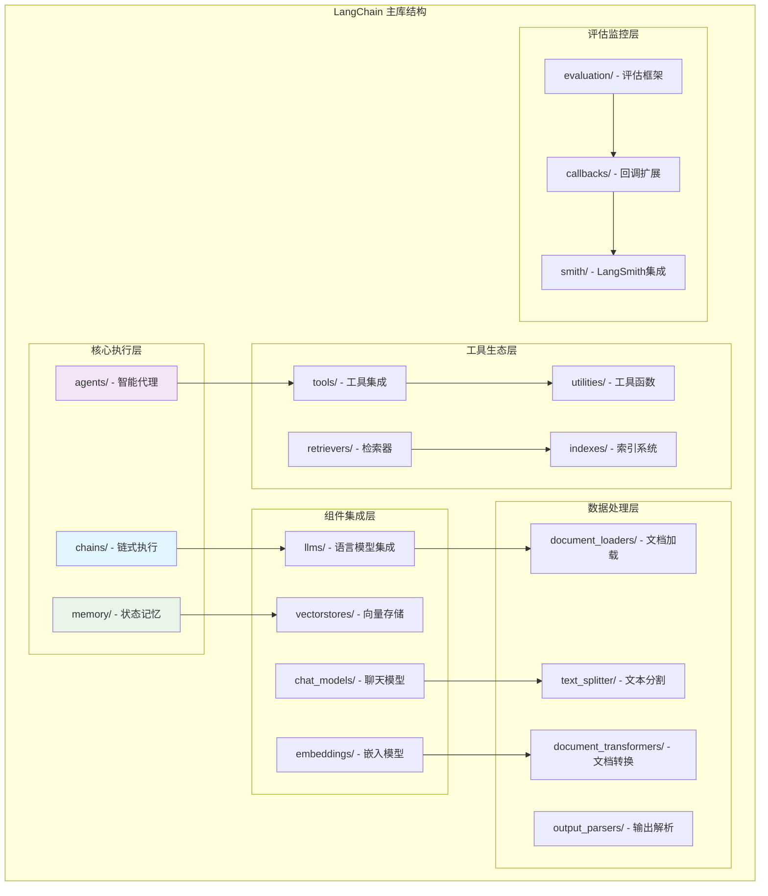
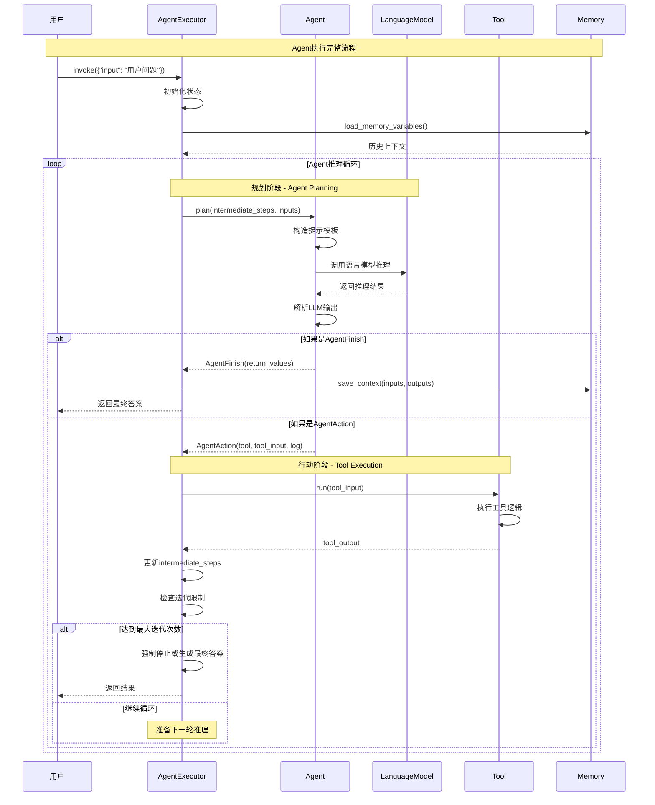
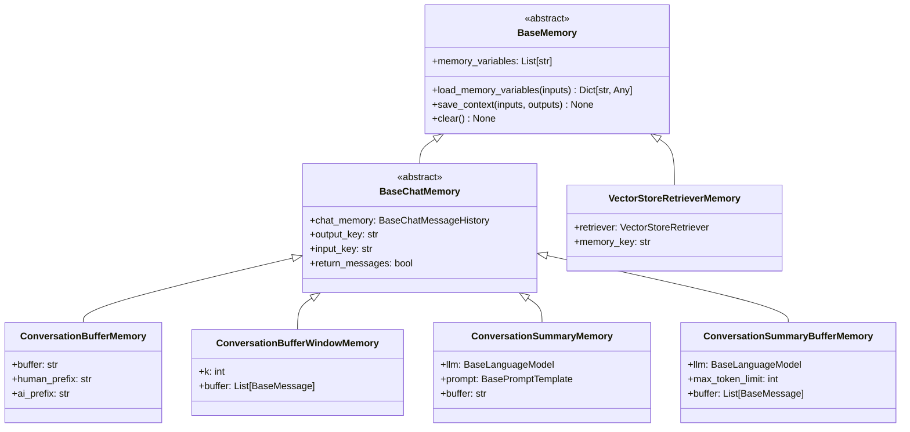
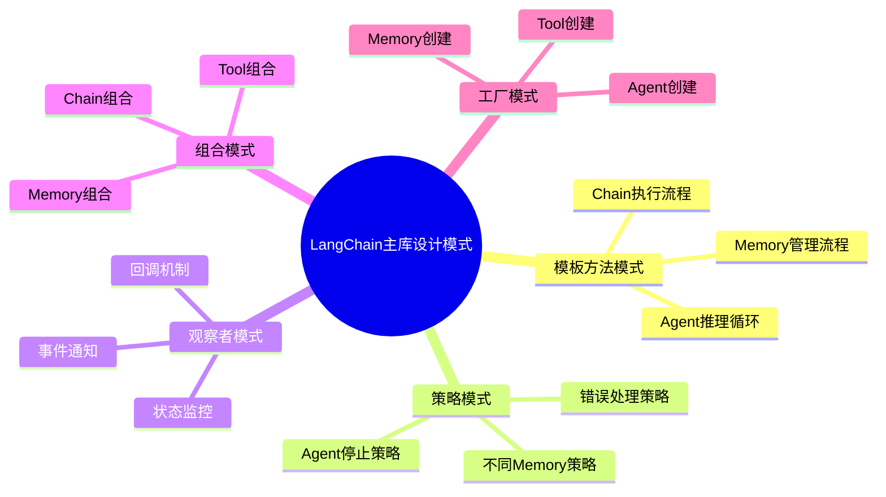

## 概述

LangChain主库构建在Core模块的抽象基础之上，实现了具体的业务逻辑和高级功能。主库的核心组件，包括Chain的执行机制、Agent的推理循环、Memory的状态管理等关键实现。

<!--more-->

## 1. LangChain主库架构

### 1.1 主库模块组织



### 1.2 依赖关系和继承层次

```python
# langchain/__init__.py
"""包的主要入口点。

Main entrypoint into package."""

import warnings
from importlib import metadata
from typing import Any, Optional

from langchain_core._api.deprecation import surface_langchain_deprecation_warnings

try:
    __version__ = metadata.version(__package__)
except metadata.PackageNotFoundError:
    # Case where package metadata is not available.
    __version__ = ""
del metadata  # optional, avoids polluting the results of dir(__package__)

def _warn_on_import(name: str, replacement: Optional[str] = None) -> None:
    """导入已弃用模块时发出警告。

    Warn on import of deprecated module."""
    from langchain._api.interactive_env import is_interactive_env

    if is_interactive_env():
        # No warnings for interactive environments.
        # This is done to avoid polluting the output of interactive environments
        # where users rely on auto-complete and may trigger this warning
        # even if they are not using any deprecated modules
        return

    if replacement:
        warnings.warn(
            f"Importing {name} from langchain root module is no longer supported. "
            f"Please use {replacement} instead.",
            stacklevel=3,
        )
    else:
        warnings.warn(
            f"Importing {name} from langchain root module is no longer supported.",
            stacklevel=3,
        )

# Surfaces Deprecation and Pending Deprecation warnings from langchain.
surface_langchain_deprecation_warnings()
```

## 2. Chain模块：链式执行的核心

### 2.1 Chain基类设计

```python
from abc import ABC, abstractmethod
from typing import Any, Dict, List, Optional, Union
from langchain_core.runnables import RunnableSerializable
from langchain_core.memory import BaseMemory
from langchain_core.callbacks import Callbacks

class Chain(RunnableSerializable[Dict[str, Any], Dict[str, Any]], ABC):
    """创建结构化组件调用序列的抽象基类。

    Chain应该用于编码对模型、文档检索器、其他Chain等组件的调用序列，
    并为此序列提供简单的接口。

    Chain接口使创建以下应用变得容易：
    - 有状态的：向任何Chain添加Memory以赋予其状态
    - 可观察的：向Chain传递Callbacks以在主要组件调用序列之外执行额外功能
    - 可组合的：Chain API足够灵活，可以轻松地将Chain与其他组件（包括其他Chain）结合

    主要暴露的方法：
    - __call__：Chain是可调用的。__call__方法是执行Chain的主要方式
    - run：一个便利方法，接受args/kwargs作为输入并返回字符串或对象输出
    """

    # === 核心属性 ===

    memory: Optional[BaseMemory] = None
    """可选的内存对象。默认为None。
    Memory是一个在每个链的开始和结束时被调用的类。
    在开始时，memory加载变量并在链中传递它们。
    在结束时，它保存任何返回的变量。
    有许多不同类型的memory - 请参阅memory文档以获取完整目录。"""

    callbacks: Callbacks = Field(default=None, exclude=True)
    """可选的回调处理器列表（或回调管理器）。默认为None。
    回调处理器在链调用的整个生命周期中被调用，
    从on_chain_start开始，以on_chain_end或on_chain_error结束。
    每个自定义链可以选择调用额外的回调方法，详见Callback文档。"""

    verbose: bool = Field(default_factory=_get_verbosity)
    """是否以详细模式运行。在详细模式下，一些中间日志将被打印到控制台。
    默认为`langchain.verbose`值。"""

    tags: Optional[List[str]] = Field(default=None, exclude=True)
    """与链关联的可选标签列表。默认为None。
    这些标签将与对此链的每次调用相关联，
    并作为参数传递给在`callbacks`中定义的处理器。
    您可以使用这些来例如识别链的特定实例与其用例。"""

    metadata: Optional[Dict[str, Any]] = Field(default=None, exclude=True)
    """与链关联的可选元数据。默认为None。
    此元数据将与对此链的每次调用相关联，
    并作为参数传递给在`callbacks`中定义的处理器。
    您可以使用这些来例如识别链的特定实例与其用例。"""

    # === 抽象属性 ===

    @property
    @abstractmethod
    def input_keys(self) -> List[str]:
        """输入键。

        :meta private:
        """

    @property
    @abstractmethod
    def output_keys(self) -> List[str]:
        """输出键。

        :meta private:
        """

    # === 抽象方法 ===

    @abstractmethod
    def _call(
        self,
        inputs: Dict[str, Any],
        run_manager: Optional[CallbackManagerForChainRun] = None,
    ) -> Dict[str, Any]:
        """执行链。

        这是一个不面向用户的私有方法。它只在Chain.__call__内部调用，
        Chain.__call__是处理回调配置和一些输入/输出处理的面向用户的包装方法。

        Args:
            inputs: 链的命名输入字典。假定包含Chain.input_keys中指定的所有输入，
                   包括memory添加的任何输入。
            run_manager: 包含此链运行的回调处理器的回调管理器。

        Returns:
            命名输出字典。应包含Chain.output_keys中指定的所有输出。
        """

    async def _acall(
        self,
        inputs: Dict[str, Any],
        run_manager: Optional[AsyncCallbackManagerForChainRun] = None,
    ) -> Dict[str, Any]:
        """异步执行链。

        这是一个不面向用户的私有方法。它只在Chain.acall内部调用，
        Chain.acall是处理回调配置和一些输入/输出处理的面向用户的包装方法。

        Args:
            inputs: 链的命名输入字典。假定包含Chain.input_keys中指定的所有输入，
                   包括memory添加的任何输入。
            run_manager: 包含此链运行的回调处理器的回调管理器。

        Returns:
            命名输出字典。应包含Chain.output_keys中指定的所有输出。
        """
        return await run_in_executor(
            None,
            self._call,
            inputs,
            run_manager.get_sync() if run_manager else None,
        )

    # === 输入输出处理 ===

    def prep_inputs(self, inputs: Union[Dict[str, Any], Any]) -> Dict[str, Any]:
        """验证并准备链输入，包括添加来自memory的输入。

        Args:
            inputs: 字典输入或单个输入（如果链只期望一个输入）。

        Returns:
            包含所有输入的字典，包括来自memory的输入。
        """
        if not isinstance(inputs, dict):
            _input_keys = set(self.input_keys)
            if self.memory is not None:
                # 如果有memory，我们需要检查它添加了哪些键
                _input_keys = _input_keys.difference(self.memory.memory_variables)
            if len(_input_keys) != 1:
                raise ValueError(
                    f"单个输入传递给期望多个输入的链: {_input_keys}。"
                    f"请传递一个字典，例如 {{'foo': 'bar'}}"
                )
            inputs = {list(_input_keys)[0]: inputs}

        if self.memory is not None:
            external_context = self.memory.load_memory_variables(inputs)
            inputs = dict(inputs, **external_context)

        self._validate_inputs(inputs)
        return inputs

    def prep_outputs(
        self,
        inputs: Dict[str, Any],
        outputs: Dict[str, Any],
        return_only_outputs: bool = False,
    ) -> Dict[str, Any]:
        """验证并准备链输出，并保存到memory。

        Args:
            inputs: 链输入字典。
            outputs: 链输出字典。
            return_only_outputs: 是否只返回输出。
                如果为False，输入也会包含在最终输出中。

        Returns:
            包含链输出的字典，如果return_only_outputs为False，还包含输入。
        """
        self._validate_outputs(outputs)
        if self.memory is not None:
            self.memory.save_context(inputs, outputs)
        if return_only_outputs:
            return outputs
        else:
            return {**inputs, **outputs}

    def _validate_inputs(self, inputs: Dict[str, Any]) -> None:
        """检查链输入是否有效。

        Args:
            inputs: 链输入字典。

        Raises:
            ValueError: 如果输入无效。
        """
        missing_keys = set(self.input_keys).difference(inputs)
        if missing_keys:
            raise ValueError(f"缺少一些输入键: {missing_keys}")

    def _validate_outputs(self, outputs: Dict[str, Any]) -> None:
        """检查链输出是否有效。

        Args:
            outputs: 链输出字典。

        Raises:
            ValueError: 如果输出无效。
        """
        missing_keys = set(self.output_keys).difference(outputs)
        if missing_keys:
            raise ValueError(f"缺少一些输出键: {missing_keys}")

    # === Runnable接口实现 ===

    def invoke(
        self,
        input: Dict[str, Any],
        config: Optional[RunnableConfig] = None,
        **kwargs: Any,
    ) -> Dict[str, Any]:
        """Runnable接口的invoke实现。"""
        config = ensure_config(config)

        return self(
            input,
            callbacks=config.get("callbacks"),
            tags=config.get("tags"),
            metadata=config.get("metadata"),
            run_name=config.get("run_name"),
            **kwargs,
        )

    async def ainvoke(
        self,
        input: Dict[str, Any],
        config: Optional[RunnableConfig] = None,
        **kwargs: Any,
    ) -> Dict[str, Any]:
        """异步invoke实现。"""
        config = ensure_config(config)

        return await self.acall(
            input,
            callbacks=config.get("callbacks"),
            tags=config.get("tags"),
            metadata=config.get("metadata"),
            run_name=config.get("run_name"),
            **kwargs,
        )

    # === 主要执行方法 ===

    @deprecated("0.1.0", alternative="invoke", removal="1.0")
    def __call__(
        self,
        inputs: Union[Dict[str, Any], Any],
        return_only_outputs: bool = False,
        callbacks: Callbacks = None,
        *,
        tags: Optional[List[str]] = None,
        metadata: Optional[Dict[str, Any]] = None,
        run_name: Optional[str] = None,
        include_run_info: bool = False,
    ) -> Dict[str, Any]:
        """执行链。

        Args:
            inputs: 链输入字典。
            return_only_outputs: 是否只返回输出。
            callbacks: 要使用的回调。
            tags: 要附加到运行的标签。
            metadata: 要附加到运行的元数据。
            run_name: 运行的名称。
            include_run_info: 是否在输出中包含运行信息。

        Returns:
            链输出字典。
        """
        config = {
            "callbacks": callbacks,
            "tags": tags,
            "metadata": metadata,
            "run_name": run_name,
        }

        inputs = self.prep_inputs(inputs)
        callback_manager = get_callback_manager_for_config(config)
        new_arg_supported = inspect.signature(self._call).parameters.get("run_manager")

        with callback_manager.on_chain_start(
            dumpd(self),
            inputs,
            name=run_name,
        ) as run_manager:
            try:
                if new_arg_supported:
                    outputs = self._call(inputs, run_manager=run_manager)
                else:
                    outputs = self._call(inputs)
            except Exception as e:
                run_manager.on_chain_error(e)
                raise
            else:
                run_manager.on_chain_end(outputs)
                final_outputs: Dict[str, Any] = self.prep_outputs(
                    inputs, outputs, return_only_outputs
                )
                if include_run_info:
                    final_outputs[RUN_KEY] = RunInfo(run_id=run_manager.run_id)
                return final_outputs

    async def acall(
        self,
        inputs: Union[Dict[str, Any], Any],
        return_only_outputs: bool = False,
        callbacks: Callbacks = None,
        *,
        tags: Optional[List[str]] = None,
        metadata: Optional[Dict[str, Any]] = None,
        run_name: Optional[str] = None,
        include_run_info: bool = False,
    ) -> Dict[str, Any]:
        """异步执行链。"""
        config = {
            "callbacks": callbacks,
            "tags": tags,
            "metadata": metadata,
            "run_name": run_name,
        }

        inputs = self.prep_inputs(inputs)
        callback_manager = get_async_callback_manager_for_config(config)
        new_arg_supported = inspect.signature(self._acall).parameters.get("run_manager")

        async with callback_manager.on_chain_start(
            dumpd(self),
            inputs,
            name=run_name,
        ) as run_manager:
            try:
                if new_arg_supported:
                    outputs = await self._acall(inputs, run_manager=run_manager)
                else:
                    outputs = await self._acall(inputs)
            except Exception as e:
                await run_manager.on_chain_error(e)
                raise
            else:
                await run_manager.on_chain_end(outputs)
                final_outputs: Dict[str, Any] = self.prep_outputs(
                    inputs, outputs, return_only_outputs
                )
                if include_run_info:
                    final_outputs[RUN_KEY] = RunInfo(run_id=run_manager.run_id)
                return final_outputs

    # === 便利方法 ===

    def run(
        self,
        *args: Any,
        callbacks: Callbacks = None,
        tags: Optional[List[str]] = None,
        metadata: Optional[Dict[str, Any]] = None,
        **kwargs: Any,
    ) -> Any:
        """便利方法，用于执行链并返回单个字符串输出。

        Args:
            *args: 如果链只期望一个输入，则可以作为位置参数传递。
            callbacks: 要使用的回调。
            tags: 要附加到运行的标签。
            metadata: 要附加到运行的元数据。
            **kwargs: 如果链期望多个输入，则可以作为关键字参数传递。

        Returns:
            链输出。如果链有单个输出键，则返回该键的值。
            否则，返回包含所有输出的字典。
        """
        if args and not kwargs:
            if len(args) != 1:
                raise ValueError("`run` 支持单个位置参数或关键字参数，不支持两者。")
            if self.input_keys and len(self.input_keys) == 1:
                inputs = {self.input_keys[0]: args[0]}
            else:
                inputs = args[0]
        elif kwargs and not args:
            inputs = kwargs
        else:
            raise ValueError("`run` 支持单个位置参数或关键字参数，不支持两者。")

        outputs = self(
            inputs,
            callbacks=callbacks,
            tags=tags,
            metadata=metadata,
            return_only_outputs=True,
        )

        # 如果只有一个输出键，返回该值
        if len(self.output_keys) == 1:
            return outputs[self.output_keys[0]]
        else:
            return outputs

    async def arun(
        self,
        *args: Any,
        callbacks: Callbacks = None,
        tags: Optional[List[str]] = None,
        metadata: Optional[Dict[str, Any]] = None,
        **kwargs: Any,
    ) -> Any:
        """异步便利方法。"""
        if args and not kwargs:
            if len(args) != 1:
                raise ValueError("`arun` 支持单个位置参数或关键字参数，不支持两者。")
            if self.input_keys and len(self.input_keys) == 1:
                inputs = {self.input_keys[0]: args[0]}
            else:
                inputs = args[0]
        elif kwargs and not args:
            inputs = kwargs
        else:
            raise ValueError("`arun` 支持单个位置参数或关键字参数，不支持两者。")

        outputs = await self.acall(
            inputs,
            callbacks=callbacks,
            tags=tags,
            metadata=metadata,
            return_only_outputs=True,
        )

        if len(self.output_keys) == 1:
            return outputs[self.output_keys[0]]
        else:
            return outputs
```

### 2.2 LLMChain：最基础的链实现

```python
from typing import Any, Dict, List, Optional
from langchain_core.language_models import BaseLanguageModel
from langchain_core.prompts import BasePromptTemplate
from langchain_core.output_parsers import BaseOutputParser

class LLMChain(Chain):
    """使用语言模型的链。

    这是最基础的链实现，将提示模板、语言模型和输出解析器组合在一起。

    示例:
        .. code-block:: python

            from langchain import LLMChain, OpenAI, PromptTemplate
            prompt_template = "Tell me a {adjective} joke"
            prompt = PromptTemplate(
                input_variables=["adjective"], template=prompt_template
            )
            llm = LLMChain(llm=OpenAI(), prompt=prompt)
    """

    prompt: BasePromptTemplate
    """要使用的提示模板。"""

    llm: BaseLanguageModel
    """要使用的语言模型。"""

    output_parser: BaseOutputParser = Field(default_factory=NoOpOutputParser)
    """要使用的输出解析器。默认为简单的字符串解析器。"""

    output_key: str = "text"  #: :meta private:
    """输出键。"""

    return_final_only: bool = True
    """是否只返回最终解析的结果。如果为False，将返回原始文本和解析结果。"""

    llm_kwargs: dict = Field(default_factory=dict)
    """传递给LLM的额外关键字参数。"""

    @property
    def input_keys(self) -> List[str]:
        """输入键。

        :meta private:
        """
        return self.prompt.input_variables

    @property
    def output_keys(self) -> List[str]:
        """输出键。

        :meta private:
        """
        if self.return_final_only:
            return [self.output_key]
        else:
            return [self.output_key, f"{self.output_key}_raw"]

    def _call(
        self,
        inputs: Dict[str, Any],
        run_manager: Optional[CallbackManagerForChainRun] = None,
    ) -> Dict[str, str]:
        """执行LLM链。

        Args:
            inputs: 输入字典，包含提示模板所需的所有变量。
            run_manager: 回调管理器。

        Returns:
            包含LLM输出的字典。
        """
        # 1. 格式化提示
        prompt_value = self.prompt.format_prompt(**inputs)

        # 2. 调用LLM
        response = self.llm.generate_prompt(
            [prompt_value],
            callbacks=run_manager.get_child() if run_manager else None,
            **self.llm_kwargs,
        )

        # 3. 提取文本
        if self.llm.llm_type == "openai-chat":
            # 聊天模型返回消息
            text_output = response.generations[0][0].message.content
        else:
            # 文本模型返回文本
            text_output = response.generations[0][0].text

        # 4. 解析输出
        if self.output_parser:
            parsed_output = self.output_parser.parse(text_output)
        else:
            parsed_output = text_output

        # 5. 构建返回结果
        if self.return_final_only:
            return {self.output_key: parsed_output}
        else:
            return {
                self.output_key: parsed_output,
                f"{self.output_key}_raw": text_output,
            }

    async def _acall(
        self,
        inputs: Dict[str, Any],
        run_manager: Optional[AsyncCallbackManagerForChainRun] = None,
    ) -> Dict[str, str]:
        """异步执行LLM链。"""
        # 1. 格式化提示
        prompt_value = self.prompt.format_prompt(**inputs)

        # 2. 异步调用LLM
        response = await self.llm.agenerate_prompt(
            [prompt_value],
            callbacks=run_manager.get_child() if run_manager else None,
            **self.llm_kwargs,
        )

        # 3. 提取文本
        if self.llm.llm_type == "openai-chat":
            text_output = response.generations[0][0].message.content
        else:
            text_output = response.generations[0][0].text

        # 4. 解析输出
        if self.output_parser:
            parsed_output = self.output_parser.parse(text_output)
        else:
            parsed_output = text_output

        # 5. 构建返回结果
        if self.return_final_only:
            return {self.output_key: parsed_output}
        else:
            return {
                self.output_key: parsed_output,
                f"{self.output_key}_raw": text_output,
            }

    def predict(self, **kwargs: Any) -> str:
        """便利方法，用于预测单个输出。

        Args:
            **kwargs: 提示模板的输入变量。

        Returns:
            LLM的预测结果。
        """
        return self.run(**kwargs)

    async def apredict(self, **kwargs: Any) -> str:
        """异步预测方法。"""
        return await self.arun(**kwargs)

    def predict_and_parse(self, **kwargs: Any) -> Union[str, List[str], Dict]:
        """预测并解析输出。

        Args:
            **kwargs: 提示模板的输入变量。

        Returns:
            解析后的输出。
        """
        result = self.predict(**kwargs)
        if self.output_parser:
            return self.output_parser.parse(result)
        else:
            return result

    async def apredict_and_parse(self, **kwargs: Any) -> Union[str, List[str], Dict]:
        """异步预测并解析输出。"""
        result = await self.apredict(**kwargs)
        if self.output_parser:
            return self.output_parser.parse(result)
        else:
            return result

    def apply(self, input_list: List[Dict[str, Any]]) -> List[Dict[str, str]]:
        """对输入列表应用链。

        Args:
            input_list: 输入字典列表。

        Returns:
            输出字典列表。
        """
        response = self.generate(input_list)
        return self.create_outputs(response)

    async def aapply(self, input_list: List[Dict[str, Any]]) -> List[Dict[str, str]]:
        """异步对输入列表应用链。"""
        response = await self.agenerate(input_list)
        return self.create_outputs(response)

    def generate(
        self,
        input_list: List[Dict[str, Any]],
        run_manager: Optional[CallbackManagerForChainRun] = None,
    ) -> LLMResult:
        """为输入列表生成LLM结果。

        Args:
            input_list: 输入字典列表。
            run_manager: 回调管理器。

        Returns:
            LLM结果。
        """
        prompts = []
        for inputs in input_list:
            prompt_value = self.prompt.format_prompt(**inputs)
            prompts.append(prompt_value)

        return self.llm.generate_prompt(
            prompts,
            callbacks=run_manager.get_child() if run_manager else None,
            **self.llm_kwargs,
        )

    async def agenerate(
        self,
        input_list: List[Dict[str, Any]],
        run_manager: Optional[AsyncCallbackManagerForChainRun] = None,
    ) -> LLMResult:
        """异步为输入列表生成LLM结果。"""
        prompts = []
        for inputs in input_list:
            prompt_value = self.prompt.format_prompt(**inputs)
            prompts.append(prompt_value)

        return await self.llm.agenerate_prompt(
            prompts,
            callbacks=run_manager.get_child() if run_manager else None,
            **self.llm_kwargs,
        )

    def create_outputs(self, llm_result: LLMResult) -> List[Dict[str, str]]:
        """从LLM结果创建输出。

        Args:
            llm_result: LLM结果。

        Returns:
            输出字典列表。
        """
        outputs = []
        for generation in llm_result.generations:
            # 提取文本
            if self.llm.llm_type == "openai-chat":
                text_output = generation[0].message.content
            else:
                text_output = generation[0].text

            # 解析输出
            if self.output_parser:
                parsed_output = self.output_parser.parse(text_output)
            else:
                parsed_output = text_output

            # 构建输出字典
            if self.return_final_only:
                outputs.append({self.output_key: parsed_output})
            else:
                outputs.append({
                    self.output_key: parsed_output,
                    f"{self.output_key}_raw": text_output,
                })

        return outputs

    @property
    def _chain_type(self) -> str:
        return "llm"
```

### 2.3 SequentialChain：序列链实现

```python
class SequentialChain(Chain):
    """其中一个链的输出直接馈送到下一个链的链。

    这个链允许你将多个链串联起来，其中每个链的输出
    成为下一个链的输入。

    示例:
        .. code-block:: python

            from langchain import SequentialChain, LLMChain, OpenAI, PromptTemplate

            # 第一个链：生成故事大纲
            outline_template = "Write an outline for a story about {topic}"
            outline_prompt = PromptTemplate(
                input_variables=["topic"], template=outline_template
            )
            outline_chain = LLMChain(
                llm=OpenAI(), prompt=outline_prompt, output_key="outline"
            )

            # 第二个链：基于大纲写故事
            story_template = "Write a story based on this outline: {outline}"
            story_prompt = PromptTemplate(
                input_variables=["outline"], template=story_template
            )
            story_chain = LLMChain(
                llm=OpenAI(), prompt=story_prompt, output_key="story"
            )

            # 组合成序列链
            sequential_chain = SequentialChain(
                chains=[outline_chain, story_chain],
                input_variables=["topic"],
                output_variables=["story"]
            )
    """

    chains: List[Chain]
    """要按顺序运行的链列表。"""

    input_variables: List[str]
    """序列链期望的输入变量。"""

    output_variables: List[str]  #: :meta private:
    """序列链将输出的变量。"""

    return_all: bool = False
    """是否返回所有中间输出，还是只返回最终输出。"""

    model_config = ConfigDict(
        arbitrary_types_allowed=True,
        extra="forbid",
    )

    @property
    def input_keys(self) -> List[str]:
        """返回链的期望输入键。

        :meta private:
        """
        return self.input_variables

    @property
    def output_keys(self) -> List[str]:
        """返回输出键。

        :meta private:
        """
        return self.output_variables

    @model_validator(mode="before")
    @classmethod
    def validate_chains(cls, values: Dict[str, Any]) -> Dict[str, Any]:
        """验证链配置。

        Args:
            values: 配置值字典。

        Returns:
            验证后的配置值。

        Raises:
            ValueError: 如果链配置无效。
        """
        chains = values.get("chains", [])
        input_variables = values.get("input_variables", [])
        output_variables = values.get("output_variables", [])

        if not chains:
            raise ValueError("必须提供至少一个链")

        # 验证输入变量
        if not input_variables:
            raise ValueError("必须指定input_variables")

        # 验证输出变量
        if not output_variables:
            raise ValueError("必须指定output_variables")

        # 检查链的连接性
        cls._validate_chain_connectivity(chains, input_variables, output_variables)

        return values

    @classmethod
    def _validate_chain_connectivity(
        cls,
        chains: List[Chain],
        input_variables: List[str],
        output_variables: List[str],
    ) -> None:
        """验证链之间的连接性。

        Args:
            chains: 链列表。
            input_variables: 输入变量。
            output_variables: 输出变量。

        Raises:
            ValueError: 如果链连接无效。
        """
        # 跟踪可用变量
        available_vars = set(input_variables)

        for i, chain in enumerate(chains):
            # 检查当前链的输入是否都可用
            missing_inputs = set(chain.input_keys) - available_vars
            if missing_inputs:
                raise ValueError(
                    f"链 {i} 缺少输入变量: {missing_inputs}。"
                    f"可用变量: {available_vars}"
                )

            # 添加当前链的输出到可用变量
            available_vars.update(chain.output_keys)

        # 检查最终输出变量是否都可用
        missing_outputs = set(output_variables) - available_vars
        if missing_outputs:
            raise ValueError(
                f"输出变量 {missing_outputs} 在任何链中都不可用。"
                f"可用变量: {available_vars}"
            )

    def _call(
        self,
        inputs: Dict[str, Any],
        run_manager: Optional[CallbackManagerForChainRun] = None,
    ) -> Dict[str, Any]:
        """执行序列链。

        Args:
            inputs: 输入字典。
            run_manager: 回调管理器。

        Returns:
            输出字典。
        """
        # 初始化已知变量
        known_values = inputs.copy()

        # 按顺序执行每个链
        for i, chain in enumerate(self.chains):
            # 准备当前链的输入
            chain_inputs = {
                key: known_values[key]
                for key in chain.input_keys
                if key in known_values
            }

            # 执行链
            if run_manager:
                child_manager = run_manager.get_child(f"chain_{i}")
                chain_outputs = chain(chain_inputs, callbacks=[child_manager])
            else:
                chain_outputs = chain(chain_inputs)

            # 更新已知变量
            known_values.update(chain_outputs)

        # 准备最终输出
        if self.return_all:
            # 返回所有变量（除了原始输入）
            outputs = {
                key: known_values[key]
                for key in known_values
                if key not in inputs
            }
        else:
            # 只返回指定的输出变量
            outputs = {
                key: known_values[key]
                for key in self.output_variables
            }

        return outputs

    async def _acall(
        self,
        inputs: Dict[str, Any],
        run_manager: Optional[AsyncCallbackManagerForChainRun] = None,
    ) -> Dict[str, Any]:
        """异步执行序列链。"""
        known_values = inputs.copy()

        for i, chain in enumerate(self.chains):
            chain_inputs = {
                key: known_values[key]
                for key in chain.input_keys
                if key in known_values
            }

            if run_manager:
                child_manager = await run_manager.get_child(f"chain_{i}")
                chain_outputs = await chain.acall(chain_inputs, callbacks=[child_manager])
            else:
                chain_outputs = await chain.acall(chain_inputs)

            known_values.update(chain_outputs)

        if self.return_all:
            outputs = {
                key: known_values[key]
                for key in known_values
                if key not in inputs
            }
        else:
            outputs = {
                key: known_values[key]
                for key in self.output_variables
            }

        return outputs

    @property
    def _chain_type(self) -> str:
        return "sequential"
```

## 3. Agent模块：智能代理系统

### 3.1 Agent执行器架构



### 3.2 AgentExecutor：Agent执行器实现

```python
from typing import Any, Dict, List, Optional, Sequence, Union
from langchain_core.agents import AgentAction, AgentFinish, AgentStep
from langchain_core.tools import BaseTool
from langchain.agents.agent import BaseSingleActionAgent, BaseMultiActionAgent

class AgentExecutor(Chain):
    """使用工具的Agent。

    AgentExecutor负责运行Agent并管理其与工具的交互。
    它实现了Agent的推理-行动循环，包括：
    1. 调用Agent进行推理
    2. 执行Agent选择的工具
    3. 将工具结果反馈给Agent
    4. 重复直到Agent决定停止

    设计特点：
    1. 灵活的Agent接口：支持单动作和多动作Agent
    2. 工具管理：统一的工具调用和错误处理
    3. 执行控制：迭代限制、时间限制、早停策略
    4. 可观测性：完整的回调和追踪支持
    """

    agent: Union[BaseSingleActionAgent, BaseMultiActionAgent, Runnable]
    """要运行的Agent，用于在执行循环的每个步骤创建计划并确定要采取的行动。"""

    tools: Sequence[BaseTool]
    """Agent可以调用的有效工具。"""

    return_intermediate_steps: bool = False
    """是否在最终输出之外还返回Agent的中间步骤轨迹。"""

    max_iterations: Optional[int] = 15
    """结束执行循环之前要采取的最大步骤数。

    设置为'None'可能导致无限循环。"""

    max_execution_time: Optional[float] = None
    """在执行循环中花费的最大墙钟时间量。"""

    early_stopping_method: str = "force"
    """如果Agent从未返回`AgentFinish`，用于早停的方法。
    可以是'force'或'generate'。

    `"force"`返回一个字符串，说明它因为遇到时间或迭代限制而停止。

    `"generate"`最后一次调用Agent的LLM Chain，
    基于之前的步骤生成最终答案。"""

    handle_parsing_errors: Union[bool, str, Callable[[OutputParserException], str]] = (
        False
    )
    """如何处理Agent输出解析器引发的错误。
    默认为`False`，会抛出错误。
    如果为`true`，错误将作为观察发送回LLM。
    如果为字符串，字符串本身将作为观察发送给LLM。
    如果为可调用函数，函数将以异常作为参数调用，
    函数的结果将作为观察传递给Agent。"""

    trim_intermediate_steps: Union[
        int,
        Callable[[List[Tuple[AgentAction, str]]], List[Tuple[AgentAction, str]]],
    ] = -1
    """如何修剪传递给Agent的中间步骤。
    如果为int，将保留最后N个步骤。
    如果为callable，将调用该函数来修剪步骤。"""

    def __init__(
        self,
        agent: Union[BaseSingleActionAgent, BaseMultiActionAgent, Runnable],
        tools: Sequence[BaseTool],
        callback_manager: Optional[BaseCallbackManager] = None,
        **kwargs: Any,
    ):
        """初始化AgentExecutor。

        Args:
            agent: 要使用的Agent。
            tools: 工具列表。
            callback_manager: 回调管理器。
            **kwargs: 额外参数。
        """
        super().__init__(**kwargs)
        self.agent = agent
        self.tools = tools

        # 验证工具名称唯一性
        tool_names = [tool.name for tool in tools]
        if len(tool_names) != len(set(tool_names)):
            raise ValueError("工具名称必须唯一")

    @property
    def input_keys(self) -> List[str]:
        """返回期望的输入键。"""
        return self.agent.input_keys

    @property
    def output_keys(self) -> List[str]:
        """返回输出键。"""
        if self.return_intermediate_steps:
            return self.agent.return_values + ["intermediate_steps"]
        else:
            return self.agent.return_values

    def _should_continue(self, iterations: int, time_elapsed: float) -> bool:
        """检查是否应该继续执行循环。

        Args:
            iterations: 当前迭代次数。
            time_elapsed: 已经过的时间。

        Returns:
            是否应该继续。
        """
        if self.max_iterations is not None and iterations >= self.max_iterations:
            return False
        if (
            self.max_execution_time is not None
            and time_elapsed >= self.max_execution_time
        ):
            return False
        return True

    def _call(
        self,
        inputs: Dict[str, str],
        run_manager: Optional[CallbackManagerForChainRun] = None,
    ) -> Dict[str, Any]:
        """运行文本并获取Agent响应。

        Args:
            inputs: 输入字典。
            run_manager: 回调管理器。

        Returns:
            包含Agent输出的字典。
        """
        # 构建工具名称到工具的映射，便于查找
        name_to_tool_map = {tool.name: tool for tool in self.tools}

        # 为日志记录构建从每个工具到颜色的映射
        color_mapping = get_color_mapping(
            [tool.name for tool in self.tools],
            excluded_colors=["green", "red"],
        )

        intermediate_steps: List[Tuple[AgentAction, str]] = []
        # 开始跟踪迭代次数和经过的时间
        iterations = 0
        time_elapsed = 0.0
        start_time = time.time()

        # 现在进入Agent循环（直到它返回某些东西）
        while self._should_continue(iterations, time_elapsed):
            next_step_output = self._take_next_step(
                name_to_tool_map,
                color_mapping,
                inputs,
                intermediate_steps,
                run_manager=run_manager,
            )

            if isinstance(next_step_output, AgentFinish):
                return self._return(
                    next_step_output,
                    intermediate_steps,
                    run_manager=run_manager,
                )

            intermediate_steps.extend(next_step_output)

            if len(next_step_output) == 1:
                next_step_action = next_step_output[0]
                # 查看工具是否应该直接返回
                tool_return = self._get_tool_return(next_step_action)
                if tool_return is not None:
                    return self._return(
                        tool_return,
                        intermediate_steps,
                        run_manager=run_manager,
                    )

            iterations += 1
            time_elapsed = time.time() - start_time

        output = self._return(
            self._get_action_agent().return_stopped_response(
                self.early_stopping_method, intermediate_steps
            ),
            intermediate_steps,
            run_manager=run_manager,
        )
        return output

    def _take_next_step(
        self,
        name_to_tool_map: Dict[str, BaseTool],
        color_mapping: Dict[str, str],
        inputs: Dict[str, str],
        intermediate_steps: List[Tuple[AgentAction, str]],
        run_manager: Optional[CallbackManagerForChainRun] = None,
    ) -> Union[AgentFinish, List[Tuple[AgentAction, str]]]:
        """采取单个步骤在Agent循环中。

        这包括：
        1. 调用Agent规划下一个动作
        2. 执行该动作
        3. 返回结果

        Args:
            name_to_tool_map: 工具名称到工具的映射。
            color_mapping: 工具到颜色的映射。
            inputs: 用户输入。
            intermediate_steps: 到目前为止的中间步骤。
            run_manager: 回调管理器。

        Returns:
            AgentFinish或步骤列表。
        """
        try:
            # 修剪中间步骤
            intermediate_steps = self._prepare_intermediate_steps(intermediate_steps)

            # 调用Agent规划
            output = self.agent.plan(
                intermediate_steps,
                callbacks=run_manager.get_child() if run_manager else None,
                **inputs,
            )
        except OutputParserException as e:
            if isinstance(self.handle_parsing_errors, bool):
                raise_error = not self.handle_parsing_errors
            else:
                raise_error = False
            if raise_error:
                raise ValueError(
                    "Agent输出解析出错。"
                    "请传递`handle_parsing_errors=True`以自动处理这些错误。"
                ) from e
            text = str(e)
            if isinstance(self.handle_parsing_errors, bool):
                if e.send_to_llm:
                    observation = str(e.observation)
                    text = str(e.llm_output)
                else:
                    observation = "解析LLM输出时出现无效格式"
            elif isinstance(self.handle_parsing_errors, str):
                observation = self.handle_parsing_errors
            elif callable(self.handle_parsing_errors):
                observation = self.handle_parsing_errors(e)
            else:
                raise ValueError("Got unexpected type of `handle_parsing_errors`")
            output = AgentAction("_Exception", observation, text)

        # 如果Agent返回AgentFinish，则完成
        if isinstance(output, AgentFinish):
            return output

        actions: List[AgentAction]
        if isinstance(output, AgentAction):
            actions = [output]
        else:
            actions = output

        result = []
        for agent_action in actions:
            if run_manager:
                run_manager.on_agent_action(agent_action, color="green")

            # 否则我们查找工具并运行它
            if agent_action.tool in name_to_tool_map:
                tool = name_to_tool_map[agent_action.tool]
                return_direct = tool.return_direct
                color = color_mapping[agent_action.tool]
                tool_run_kwargs = self.agent.tool_run_logging_kwargs()
                if return_direct:
                    tool_run_kwargs["llm_prefix"] = ""

                # 执行工具
                observation = tool.run(
                    agent_action.tool_input,
                    verbose=self.verbose,
                    color=color,
                    callbacks=run_manager.get_child() if run_manager else None,
                    **tool_run_kwargs,
                )
            else:
                tool_run_kwargs = self.agent.tool_run_logging_kwargs()
                observation = InvalidTool().run(
                    {
                        "requested_tool_name": agent_action.tool,
                        "available_tool_names": list(name_to_tool_map.keys()),
                    },
                    verbose=self.verbose,
                    color=None,
                    callbacks=run_manager.get_child() if run_manager else None,
                    **tool_run_kwargs,
                )

            result.append((agent_action, observation))

        return result

    def _prepare_intermediate_steps(
        self, steps: List[Tuple[AgentAction, str]]
    ) -> List[Tuple[AgentAction, str]]:
        """准备中间步骤以传递给Agent。

        这可能涉及修剪步骤以保持在上下文长度限制内。

        Args:
            steps: 原始中间步骤。

        Returns:
            处理后的中间步骤。
        """
        if isinstance(self.trim_intermediate_steps, int):
            if self.trim_intermediate_steps == -1:
                # 不修剪
                return steps
            else:
                # 保留最后N个步骤
                return steps[-self.trim_intermediate_steps :]
        elif callable(self.trim_intermediate_steps):
            # 使用自定义函数修剪
            return self.trim_intermediate_steps(steps)
        else:
            raise ValueError(
                f"Got unexpected type of `trim_intermediate_steps`: "
                f"{type(self.trim_intermediate_steps)}"
            )

    def _return(
        self,
        output: AgentFinish,
        intermediate_steps: List[Tuple[AgentAction, str]],
        run_manager: Optional[CallbackManagerForChainRun] = None,
    ) -> Dict[str, Any]:
        """返回Agent的输出。

        Args:
            output: Agent的最终输出。
            intermediate_steps: 中间步骤列表。
            run_manager: 回调管理器。

        Returns:
            格式化的输出字典。
        """
        if run_manager:
            run_manager.on_agent_finish(output, color="green", verbose=self.verbose)

        final_output = output.return_values
        if self.return_intermediate_steps:
            final_output["intermediate_steps"] = intermediate_steps

        return final_output

    def _get_tool_return(
        self, next_step_output: Tuple[AgentAction, str]
    ) -> Optional[AgentFinish]:
        """检查工具是否应该直接返回。

        Args:
            next_step_output: 下一步输出。

        Returns:
            如果工具应该直接返回，则返回AgentFinish，否则返回None。
        """
        agent_action, observation = next_step_output
        name_to_tool_map = {tool.name: tool for tool in self.tools}

        if agent_action.tool in name_to_tool_map:
            if name_to_tool_map[agent_action.tool].return_direct:
                return AgentFinish(
                    {self.agent.return_values[0]: observation},
                    "",
                )
        return None

    async def _acall(
        self,
        inputs: Dict[str, str],
        run_manager: Optional[AsyncCallbackManagerForChainRun] = None,
    ) -> Dict[str, Any]:
        """异步运行Agent。"""
        name_to_tool_map = {tool.name: tool for tool in self.tools}
        color_mapping = get_color_mapping(
            [tool.name for tool in self.tools],
            excluded_colors=["green", "red"],
        )

        intermediate_steps: List[Tuple[AgentAction, str]] = []
        iterations = 0
        time_elapsed = 0.0
        start_time = time.time()

        while self._should_continue(iterations, time_elapsed):
            next_step_output = await self._atake_next_step(
                name_to_tool_map,
                color_mapping,
                inputs,
                intermediate_steps,
                run_manager=run_manager,
            )

            if isinstance(next_step_output, AgentFinish):
                return self._return(
                    next_step_output,
                    intermediate_steps,
                    run_manager=run_manager,
                )

            intermediate_steps.extend(next_step_output)

            if len(next_step_output) == 1:
                next_step_action = next_step_output[0]
                tool_return = self._get_tool_return(next_step_action)
                if tool_return is not None:
                    return self._return(
                        tool_return,
                        intermediate_steps,
                        run_manager=run_manager,
                    )

            iterations += 1
            time_elapsed = time.time() - start_time

        output = self._return(
            self._get_action_agent().return_stopped_response(
                self.early_stopping_method, intermediate_steps
            ),
            intermediate_steps,
            run_manager=run_manager,
        )
        return output

    async def _atake_next_step(
        self,
        name_to_tool_map: Dict[str, BaseTool],
        color_mapping: Dict[str, str],
        inputs: Dict[str, str],
        intermediate_steps: List[Tuple[AgentAction, str]],
        run_manager: Optional[AsyncCallbackManagerForChainRun] = None,
    ) -> Union[AgentFinish, List[Tuple[AgentAction, str]]]:
        """异步采取下一步。"""
        try:
            intermediate_steps = self._prepare_intermediate_steps(intermediate_steps)

            # 调用Agent规划
            output = await self.agent.aplan(
                intermediate_steps,
                callbacks=run_manager.get_child() if run_manager else None,
                **inputs,
            )
        except OutputParserException as e:
            # 错误处理逻辑与同步版本相同
            if isinstance(self.handle_parsing_errors, bool):
                raise_error = not self.handle_parsing_errors
            else:
                raise_error = False
            if raise_error:
                raise ValueError(
                    "Agent输出解析出错。"
                    "请传递`handle_parsing_errors=True`以自动处理这些错误。"
                ) from e
            text = str(e)
            if isinstance(self.handle_parsing_errors, bool):
                if e.send_to_llm:
                    observation = str(e.observation)
                    text = str(e.llm_output)
                else:
                    observation = "解析LLM输出时出现无效格式"
            elif isinstance(self.handle_parsing_errors, str):
                observation = self.handle_parsing_errors
            elif callable(self.handle_parsing_errors):
                observation = self.handle_parsing_errors(e)
            else:
                raise ValueError("Got unexpected type of `handle_parsing_errors`")
            output = AgentAction("_Exception", observation, text)

        if isinstance(output, AgentFinish):
            return output

        actions: List[AgentAction]
        if isinstance(output, AgentAction):
            actions = [output]
        else:
            actions = output

        result = []
        for agent_action in actions:
            if run_manager:
                await run_manager.on_agent_action(agent_action, color="green")

            if agent_action.tool in name_to_tool_map:
                tool = name_to_tool_map[agent_action.tool]
                return_direct = tool.return_direct
                color = color_mapping[agent_action.tool]
                tool_run_kwargs = self.agent.tool_run_logging_kwargs()
                if return_direct:
                    tool_run_kwargs["llm_prefix"] = ""

                # 异步执行工具
                observation = await tool.arun(
                    agent_action.tool_input,
                    verbose=self.verbose,
                    color=color,
                    callbacks=run_manager.get_child() if run_manager else None,
                    **tool_run_kwargs,
                )
            else:
                tool_run_kwargs = self.agent.tool_run_logging_kwargs()
                observation = await InvalidTool().arun(
                    {
                        "requested_tool_name": agent_action.tool,
                        "available_tool_names": list(name_to_tool_map.keys()),
                    },
                    verbose=self.verbose,
                    color=None,
                    callbacks=run_manager.get_child() if run_manager else None,
                    **tool_run_kwargs,
                )

            result.append((agent_action, observation))

        return result

    @property
    def _chain_type(self) -> str:
        return "agent_executor"
```

### 3.3 RunnableAgent：通过...实现

```python
class RunnableAgent(BaseSingleActionAgent):
    """由Runnable驱动的Agent。

    这是一个现代化的Agent实现，基于Runnable接口构建。
    它将Agent的推理逻辑封装在一个Runnable中，提供了更好的
    组合性和可扩展性。

    设计特点：
    1. 基于Runnable：利用统一的执行接口
    2. 流式支持：可以流式输出推理过程
    3. 类型安全：明确的输入输出类型
    4. 易于测试：可以独立测试推理逻辑
    """

    runnable: Runnable[Dict[str, Any], Union[AgentAction, AgentFinish]]
    """执行Agent推理的Runnable。"""

    input_keys_arg: List[str] = []
    """Agent期望的输入键。"""

    stream_runnable: bool = True
    """是否使用流式执行Runnable。"""

    def __init__(
        self,
        runnable: Runnable[Dict[str, Any], Union[AgentAction, AgentFinish]],
        input_keys_arg: Optional[List[str]] = None,
        stream_runnable: bool = True,
    ):
        """初始化RunnableAgent。

        Args:
            runnable: 执行推理的Runnable。
            input_keys_arg: 输入键列表。
            stream_runnable: 是否使用流式执行。
        """
        super().__init__()
        self.runnable = runnable
        self.input_keys_arg = input_keys_arg or []
        self.stream_runnable = stream_runnable

    @property
    def input_keys(self) -> List[str]:
        """返回输入键。"""
        return self.input_keys_arg

    def plan(
        self,
        intermediate_steps: List[Tuple[AgentAction, str]],
        callbacks: Callbacks = None,
        **kwargs: Any,
    ) -> Union[AgentAction, AgentFinish]:
        """基于过去历史和当前输入，决定要做什么。

        Args:
            intermediate_steps: LLM到目前为止采取的步骤，以及观察结果。
            callbacks: 要运行的回调。
            **kwargs: 用户输入。

        Returns:
            指定要使用什么工具的动作。
        """
        inputs = {**kwargs, "intermediate_steps": intermediate_steps}
        final_output: Any = None

        if self.stream_runnable:
            # 使用流式处理确保底层LLM以流式方式调用
            # 这使得在使用Agent Executor的stream_log时
            # 可以访问单个LLM token
            # 因为来自plan的响应不是生成器，我们需要
            # 将输出累积到final_output中并返回
            for chunk in self.runnable.stream(inputs, config={"callbacks": callbacks}):
                if final_output is None:
                    final_output = chunk
                else:
                    final_output += chunk
        else:
            final_output = self.runnable.invoke(inputs, config={"callbacks": callbacks})

        return final_output

    async def aplan(
        self,
        intermediate_steps: List[Tuple[AgentAction, str]],
        callbacks: Callbacks = None,
        **kwargs: Any,
    ) -> Union[AgentAction, AgentFinish]:
        """异步规划方法。"""
        inputs = {**kwargs, "intermediate_steps": intermediate_steps}
        final_output: Any = None

        if self.stream_runnable:
            async for chunk in self.runnable.astream(
                inputs, config={"callbacks": callbacks}
            ):
                if final_output is None:
                    final_output = chunk
                else:
                    final_output += chunk
        else:
            final_output = await self.runnable.ainvoke(
                inputs, config={"callbacks": callbacks}
            )

        return final_output

    def get_allowed_tools(self) -> Optional[List[str]]:
        """获取允许的工具列表。"""
        return None

    @property
    def return_values(self) -> List[str]:
        """返回值列表。"""
        return ["output"]

    def return_stopped_response(
        self,
        early_stopping_method: str,
        intermediate_steps: List[Tuple[AgentAction, str]],
        **kwargs: Any,
    ) -> AgentFinish:
        """当Agent因为达到最大迭代次数而停止时返回响应。

        Args:
            early_stopping_method: 早停方法。
            intermediate_steps: 中间步骤。
            **kwargs: 额外参数。

        Returns:
            AgentFinish对象。
        """
        if early_stopping_method == "force":
            return AgentFinish(
                {"output": "Agent因达到最大迭代次数而停止。"}, ""
            )
        elif early_stopping_method == "generate":
            # 尝试让Agent生成最终答案
            try:
                final_output = self.plan(
                    intermediate_steps,
                    **kwargs,
                )
                if isinstance(final_output, AgentFinish):
                    return final_output
                else:
                    return AgentFinish(
                        {"output": "Agent无法生成最终答案。"}, ""
                    )
            except Exception:
                return AgentFinish(
                    {"output": "Agent在生成最终答案时出错。"}, ""
                )
        else:
            raise ValueError(
                f"不支持的早停方法: {early_stopping_method}。"
                f"支持的方法: ['force', 'generate']"
            )

    def tool_run_logging_kwargs(self) -> Dict[str, Any]:
        """返回工具运行日志的关键字参数。"""
        return {
            "llm_prefix": "Thought: ",
            "observation_prefix": "Observation: ",
        }
```

## 4. Memory模块：状态管理系统

### 4.1 Memory继承层次



### 4.2 BaseChatMemory：聊天记忆基类

```python
from abc import ABC, abstractmethod
from typing import Any, Dict, List, Optional
from langchain_core.memory import BaseMemory
from langchain_core.messages import BaseMessage, HumanMessage, AIMessage
from langchain_core.chat_history import BaseChatMessageHistory

class BaseChatMemory(BaseMemory, ABC):
    """聊天记忆的抽象基类。

    聊天记忆专门用于存储和管理对话历史，支持：
    1. 消息格式的对话存储
    2. 灵活的输入输出键配置
    3. 消息和字符串格式的转换
    4. 对话历史的持久化
    """

    chat_memory: BaseChatMessageHistory
    """存储聊天消息的对象。"""

    output_key: Optional[str] = None
    """用于从链输出中提取AI消息的键。如果为None，假定只有一个输出键。"""

    input_key: Optional[str] = None
    """用于从链输入中提取人类消息的键。如果为None，假定只有一个输入键。"""

    return_messages: bool = False
    """是否返回消息列表而不是字符串。"""

    def __init__(
        self,
        chat_memory: Optional[BaseChatMessageHistory] = None,
        output_key: Optional[str] = None,
        input_key: Optional[str] = None,
        return_messages: bool = False,
    ):
        """初始化聊天记忆。

        Args:
            chat_memory: 聊天消息历史存储。
            output_key: 输出键。
            input_key: 输入键。
            return_messages: 是否返回消息格式。
        """
        super().__init__()
        if chat_memory is None:
            from langchain_core.chat_history import InMemoryChatMessageHistory
            chat_memory = InMemoryChatMessageHistory()

        self.chat_memory = chat_memory
        self.output_key = output_key
        self.input_key = input_key
        self.return_messages = return_messages

    def _get_input_output(
        self, inputs: Dict[str, Any], outputs: Dict[str, str]
    ) -> Tuple[str, str]:
        """从输入输出字典中提取输入和输出字符串。

        Args:
            inputs: 输入字典。
            outputs: 输出字典。

        Returns:
            (输入字符串, 输出字符串) 元组。

        Raises:
            ValueError: 如果无法确定输入或输出键。
        """
        # 确定输入键
        if self.input_key is None:
            prompt_input_keys = list(inputs.keys())
            if len(prompt_input_keys) != 1:
                raise ValueError(
                    f"一个输入键期望得到，但得到 {prompt_input_keys}。"
                    f"指定input_key以避免此错误。"
                )
            input_key = prompt_input_keys[0]
        else:
            input_key = self.input_key

        # 确定输出键
        if self.output_key is None:
            if len(outputs) != 1:
                raise ValueError(
                    f"一个输出键期望得到，但得到 {list(outputs.keys())}。"
                    f"指定output_key以避免此错误。"
                )
            output_key = list(outputs.keys())[0]
        else:
            output_key = self.output_key

        return inputs[input_key], outputs[output_key]

    def save_context(self, inputs: Dict[str, Any], outputs: Dict[str, str]) -> None:
        """保存对话上下文到记忆中。

        Args:
            inputs: 链输入字典。
            outputs: 链输出字典。
        """
        input_str, output_str = self._get_input_output(inputs, outputs)

        # 添加消息到聊天历史
        self.chat_memory.add_user_message(input_str)
        self.chat_memory.add_ai_message(output_str)

    def clear(self) -> None:
        """清除记忆内容。"""
        self.chat_memory.clear()

    @property
    @abstractmethod
    def memory_variables(self) -> List[str]:
        """此记忆类将添加到链输入中的字符串键。"""

    @abstractmethod
    def load_memory_variables(self, inputs: Dict[str, Any]) -> Dict[str, Any]:
        """从记忆中加载变量。"""
```

### 4.3 ConversationBufferMemory：缓冲区记忆

```python
class ConversationBufferMemory(BaseChatMemory):
    """简单的对话缓冲区记忆。

    这种记忆类型简单地存储所有对话消息，并在需要时返回它们。
    适用于短对话或不关心上下文长度的场景。

    特点：
    1. 完整保存：保存所有对话历史
    2. 格式灵活：支持字符串和消息格式
    3. 简单高效：没有额外的处理开销
    4. 内存占用：随对话长度线性增长
    """

    human_prefix: str = "Human"
    """人类消息的前缀。"""

    ai_prefix: str = "AI"
    """AI消息的前缀。"""

    memory_key: str = "history"
    """记忆在链输入中的键名。"""

    @property
    def buffer(self) -> Any:
        """返回缓冲区内容。"""
        return self.chat_memory.messages

    @property
    def memory_variables(self) -> List[str]:
        """返回记忆变量列表。"""
        return [self.memory_key]

    def load_memory_variables(self, inputs: Dict[str, Any]) -> Dict[str, Any]:
        """从记忆中加载变量。

        Args:
            inputs: 链输入字典（未使用，但保持接口一致性）。

        Returns:
            包含记忆变量的字典。
        """
        messages = self.chat_memory.messages

        if self.return_messages:
            # 返回消息列表
            return {self.memory_key: messages}
        else:
            # 返回格式化的字符串
            buffer = self._messages_to_string(messages)
            return {self.memory_key: buffer}

    def _messages_to_string(self, messages: List[BaseMessage]) -> str:
        """将消息列表转换为字符串。

        Args:
            messages: 消息列表。

        Returns:
            格式化的字符串。
        """
        string_messages = []
        for message in messages:
            if isinstance(message, HumanMessage):
                role = self.human_prefix
            elif isinstance(message, AIMessage):
                role = self.ai_prefix
            else:
                role = message.__class__.__name__

            string_messages.append(f"{role}: {message.content}")

        return "\n".join(string_messages)

    def save_context(self, inputs: Dict[str, Any], outputs: Dict[str, str]) -> None:
        """保存上下文到记忆。"""
        super().save_context(inputs, outputs)

    def clear(self) -> None:
        """清除记忆。"""
        super().clear()

class ConversationBufferWindowMemory(BaseChatMemory):
    """滑动窗口对话记忆。

    这种记忆类型只保留最近的k轮对话，适用于需要控制上下文长度
    但又要保持一定对话连续性的场景。

    特点：
    1. 固定窗口：只保留最近k轮对话
    2. 自动清理：自动删除过旧的消息
    3. 内存可控：内存占用有上限
    4. 连续性：保持最近对话的连续性
    """

    k: int = 5
    """要保留的对话轮数。"""

    memory_key: str = "history"
    """记忆在链输入中的键名。"""

    @property
    def buffer(self) -> List[BaseMessage]:
        """返回缓冲区内容（最近k轮对话）。"""
        return self.chat_memory.messages[-2 * self.k :] if self.k > 0 else []

    @property
    def memory_variables(self) -> List[str]:
        """返回记忆变量列表。"""
        return [self.memory_key]

    def load_memory_variables(self, inputs: Dict[str, Any]) -> Dict[str, Any]:
        """从记忆中加载变量。"""
        messages = self.buffer

        if self.return_messages:
            return {self.memory_key: messages}
        else:
            buffer = self._messages_to_string(messages)
            return {self.memory_key: buffer}

    def _messages_to_string(self, messages: List[BaseMessage]) -> str:
        """将消息列表转换为字符串。"""
        string_messages = []
        for message in messages:
            if isinstance(message, HumanMessage):
                role = "Human"
            elif isinstance(message, AIMessage):
                role = "AI"
            else:
                role = message.__class__.__name__

            string_messages.append(f"{role}: {message.content}")

        return "\n".join(string_messages)

class ConversationSummaryMemory(BaseChatMemory):
    """对话摘要记忆。

    这种记忆类型使用LLM对对话历史进行摘要，适用于长对话场景。
    通过摘要可以在有限的上下文中保留更多的对话信息。

    特点：
    1. 智能压缩：使用LLM生成对话摘要
    2. 信息保留：在压缩的同时保留关键信息
    3. 上下文控制：有效控制上下文长度
    4. 计算开销：需要额外的LLM调用
    """

    llm: BaseLanguageModel
    """用于生成摘要的语言模型。"""

    prompt: BasePromptTemplate = SUMMARY_PROMPT
    """用于生成摘要的提示模板。"""

    memory_key: str = "history"
    """记忆在链输入中的键名。"""

    buffer: str = ""
    """当前的摘要缓冲区。"""

    def __init__(
        self,
        llm: BaseLanguageModel,
        chat_memory: Optional[BaseChatMessageHistory] = None,
        prompt: BasePromptTemplate = SUMMARY_PROMPT,
        memory_key: str = "history",
        return_messages: bool = False,
        **kwargs: Any,
    ):
        """初始化摘要记忆。

        Args:
            llm: 用于生成摘要的语言模型。
            chat_memory: 聊天消息历史。
            prompt: 摘要提示模板。
            memory_key: 记忆键名。
            return_messages: 是否返回消息格式。
            **kwargs: 额外参数。
        """
        super().__init__(
            chat_memory=chat_memory,
            return_messages=return_messages,
            **kwargs,
        )
        self.llm = llm
        self.prompt = prompt
        self.memory_key = memory_key

    @property
    def memory_variables(self) -> List[str]:
        """返回记忆变量列表。"""
        return [self.memory_key]

    def load_memory_variables(self, inputs: Dict[str, Any]) -> Dict[str, Any]:
        """从记忆中加载变量。"""
        if self.return_messages:
            # 如果返回消息格式，需要将摘要转换为消息
            if self.buffer:
                messages = [AIMessage(content=f"Previous conversation summary: {self.buffer}")]
            else:
                messages = []
            return {self.memory_key: messages}
        else:
            return {self.memory_key: self.buffer}

    def save_context(self, inputs: Dict[str, Any], outputs: Dict[str, str]) -> None:
        """保存上下文并更新摘要。"""
        # 首先保存到聊天历史
        super().save_context(inputs, outputs)

        # 然后更新摘要
        self._update_summary()

    def _update_summary(self) -> None:
        """更新对话摘要。"""
        messages = self.chat_memory.messages
        if not messages:
            return

        # 将消息转换为字符串
        new_lines = self._messages_to_string(messages)

        # 生成新的摘要
        if self.buffer:
            # 如果已有摘要，则基于现有摘要和新对话生成更新的摘要
            summary_input = {
                "summary": self.buffer,
                "new_lines": new_lines,
            }
        else:
            # 如果没有摘要，则基于所有对话生成初始摘要
            summary_input = {
                "summary": "",
                "new_lines": new_lines,
            }

        # 调用LLM生成摘要
        self.buffer = self.llm.predict(**summary_input)

        # 清除聊天历史（因为已经摘要了）
        self.chat_memory.clear()

    def _messages_to_string(self, messages: List[BaseMessage]) -> str:
        """将消息列表转换为字符串。"""
        string_messages = []
        for message in messages:
            if isinstance(message, HumanMessage):
                role = "Human"
            elif isinstance(message, AIMessage):
                role = "AI"
            else:
                role = message.__class__.__name__

            string_messages.append(f"{role}: {message.content}")

        return "\n".join(string_messages)

    def clear(self) -> None:
        """清除记忆。"""
        super().clear()
        self.buffer = ""

# 摘要提示模板
SUMMARY_PROMPT = PromptTemplate(
    input_variables=["summary", "new_lines"],
    template="""逐步总结所提供的对话内容，将新内容添加到之前的摘要中，返回一个新的摘要。

示例：
当前摘要：
人类询问AI对人工智能的看法。AI认为人工智能是一种有益的技术。

新的对话内容：
Human: 为什么你认为人工智能是有益的？
AI: 因为人工智能可以帮助人类解决复杂问题并提高效率。

新摘要：
人类询问AI对人工智能的看法。AI认为人工智能是一种有益的技术，因为它可以帮助人类解决复杂问题并提高效率。
结束示例

当前摘要：
{summary}

新的对话内容：
{new_lines}

新摘要：""",
)
```

## 5. 实际应用案例与最佳实践

### 5.1 企业级Agent系统实现

文章的实践经验，以下是一个完整的企业级Agent系统：

```python
from langchain.agents import AgentExecutor, create_react_agent
from langchain.tools import BaseTool, tool
from langchain_openai import ChatOpenAI
from langchain_core.prompts import PromptTemplate
from langchain.memory import ConversationBufferWindowMemory
from typing import Dict, Any, List, Optional
import json
import logging

class EnterpriseAgentSystem:
    """企业级Agent系统实现

        https://zeeklog.com/langchain-yuan-ma-zhu-xing-jie-mi-zhi-xi-tong-yi--2/
    """

    def __init__(self, model_name: str = "gpt-3.5-turbo"):
        self.llm = ChatOpenAI(model_name=model_name, temperature=0.1)
        self.memory = ConversationBufferWindowMemory(
            memory_key="chat_history",
            return_messages=True,
            k=10  # 保留最近10轮对话
        )
        self.tools = self._create_enterprise_tools()
        self.agent_executor = self._create_agent_executor()
        self.logger = logging.getLogger(__name__)

    def _create_enterprise_tools(self) -> List[BaseTool]:
        """创建企业级工具集"""

        @tool
        def database_query(query: str) -> str:
            """执行数据库查询

            Args:
                query: SQL查询语句

            Returns:
                查询结果的JSON字符串
            """
            # 安全的SQL查询实现
            try:
                if "SELECT" in query.upper():
                    return json.dumps({
                        "status": "success",
                        "data": [{"id": 1, "name": "示例数据"}],
                        "count": 1
                    })
                else:
                    return json.dumps({
                        "status": "error",
                        "message": "只支持SELECT查询"
                    })
            except Exception as e:
                return json.dumps({
                    "status": "error",
                    "message": str(e)
                })

        @tool
        def api_call(endpoint: str, method: str = "GET", data: str = "{}") -> str:
            """调用外部API

            Args:
                endpoint: API端点URL
                method: HTTP方法
                data: 请求数据（JSON字符串）

            Returns:
                API响应的JSON字符串
            """
            import requests
            from urllib.parse import urlparse

            try:
                # 安全检查：只允许特定域名
                allowed_domains = ["api.example.com", "internal-api.company.com"]
                domain = urlparse(endpoint).netloc

                if domain not in allowed_domains:
                    return json.dumps({
                        "status": "error",
                        "message": f"不允许访问域名: {domain}"
                    })

                # 执行API调用
                if method.upper() == "GET":
                    response = requests.get(endpoint, timeout=10)
                elif method.upper() == "POST":
                    response = requests.post(
                        endpoint,
                        json=json.loads(data),
                        timeout=10
                    )
                else:
                    return json.dumps({
                        "status": "error",
                        "message": f"不支持的HTTP方法: {method}"
                    })

                return json.dumps({
                    "status": "success",
                    "data": response.json(),
                    "status_code": response.status_code
                })

            except Exception as e:
                return json.dumps({
                    "status": "error",
                    "message": str(e)
                })

        return [database_query, api_call]

    def _create_agent_executor(self) -> AgentExecutor:
        """创建Agent执行器"""

        # 自定义ReAct提示模板
        react_prompt = PromptTemplate.from_template("""
你是一个专业的AI助手，能够使用各种工具来帮助用户完成任务。

可用工具：
{tools}

工具名称：{tool_names}

请使用以下格式进行推理：

Question: 用户的问题
Thought: 我需要思考如何解决这个问题
Action: 选择要使用的工具
Action Input: 工具的输入参数
Observation: 工具的执行结果
... (这个Thought/Action/Action Input/Observation过程可以重复多次)
Thought: 我现在知道最终答案了
Final Answer: 对用户问题的最终回答

开始！

Question: {input}
Thought: {agent_scratchpad}
""")

        # 创建ReAct Agent
        agent = create_react_agent(
            llm=self.llm,
            tools=self.tools,
            prompt=react_prompt
        )

        # 创建Agent执行器
        agent_executor = AgentExecutor(
            agent=agent,
            tools=self.tools,
            memory=self.memory,
            verbose=True,
            max_iterations=10,
            max_execution_time=60,
            early_stopping_method="generate",
            handle_parsing_errors=True
        )

        return agent_executor

    def execute_task(self, task: str) -> Dict[str, Any]:
        """执行任务"""
        try:
            self.logger.info(f"开始执行任务: {task}")

            result = self.agent_executor.invoke({
                "input": task
            })

            self.logger.info(f"任务执行完成: {result.get('output', '')}")

            return {
                "status": "success",
                "result": result.get("output", ""),
                "intermediate_steps": result.get("intermediate_steps", [])
            }

        except Exception as e:
            self.logger.error(f"任务执行失败: {str(e)}")
            return {
                "status": "error",
                "message": str(e)
            }

# 使用示例
def create_enterprise_agent_demo():
    """企业级Agent系统使用示例"""

    # 初始化系统
    agent_system = EnterpriseAgentSystem()

    # 测试任务
    test_tasks = [
        "查询数据库中的用户信息",
        "调用API获取天气信息",
        "分析最近的销售数据趋势"
    ]

    for task in test_tasks:
        print(f"执行任务: {task}")
        result = agent_system.execute_task(task)

        if result["status"] == "success":
            print(f"结果: {result['result']}")
        else:
            print(f"错误: {result['message']}")

if __name__ == "__main__":
    create_enterprise_agent_demo()
```

### 5.2 高级Memory管理策略

```python
class AdvancedMemoryManager:
    """高级记忆管理器

        https://github.com/taishan1994/langchain-learning
    """

    def __init__(self):
        self.memory_strategies = {}
        self.active_strategy = None

    def create_hybrid_memory(self, vectorstore, llm):
        """创建混合记忆系统"""
        from langchain.memory import (
            ConversationBufferMemory,
            ConversationSummaryMemory,
            VectorStoreRetrieverMemory,
            CombinedMemory
        )

        # 1. 缓冲记忆 - 保存最近对话
        buffer_memory = ConversationBufferMemory(
            memory_key="recent_chat_history",
            input_key="input",
            output_key="output",
            return_messages=True
        )

        # 2. 摘要记忆 - 压缩历史对话
        summary_memory = ConversationSummaryMemory(
            llm=llm,
            memory_key="chat_summary",
            input_key="input",
            output_key="output",
            return_messages=False
        )

        # 3. 向量记忆 - 语义检索历史
        vector_memory = VectorStoreRetrieverMemory(
            retriever=vectorstore.as_retriever(search_kwargs={"k": 3}),
            memory_key="relevant_history",
            input_key="input"
        )

        # 4. 组合记忆
        combined_memory = CombinedMemory(
            memories=[buffer_memory, summary_memory, vector_memory]
        )

        return combined_memory

    def create_adaptive_memory(self, llm, max_token_limit: int = 4000):
        """创建自适应记忆系统"""
        from langchain.memory import ConversationTokenBufferMemory

        class AdaptiveTokenMemory(ConversationTokenBufferMemory):
            """自适应Token记忆"""

            def __init__(self, llm, max_token_limit, **kwargs):
                super().__init__(llm=llm, max_token_limit=max_token_limit, **kwargs)
                self.compression_ratio = 0.7  # 压缩比例

            def save_context(self, inputs: Dict[str, Any], outputs: Dict[str, str]) -> None:
                """保存上下文，自动压缩"""
                super().save_context(inputs, outputs)

                # 检查是否需要压缩
                current_tokens = self.llm.get_num_tokens(self.buffer)

                if current_tokens > self.max_token_limit * 0.9:  # 90%阈值
                    self._compress_memory()

            def _compress_memory(self):
                """压缩记忆内容"""
                messages = self.chat_memory.messages

                if len(messages) > 4:  # 保留最近2轮对话
                    # 获取需要压缩的消息
                    to_compress = messages[:-4]
                    to_keep = messages[-4:]

                    # 生成摘要
                    if to_compress:
                        compress_text = self._messages_to_string(to_compress)
                        summary_prompt = f"""
请将以下对话内容压缩为简洁的摘要，保留关键信息：

{compress_text}

摘要：
"""
                        summary = self.llm.predict(summary_prompt)

                        # 清空并重新构建记忆
                        self.chat_memory.clear()

                        # 添加摘要作为系统消息
                        from langchain_core.messages import SystemMessage
                        self.chat_memory.add_message(
                            SystemMessage(content=f"历史对话摘要：{summary}")
                        )

                        # 添加保留的消息
                        for message in to_keep:
                            self.chat_memory.add_message(message)

            def _messages_to_string(self, messages):
                """将消息转换为字符串"""
                result = []
                for message in messages:
                    role = message.__class__.__name__.replace("Message", "")
                    result.append(f"{role}: {message.content}")
                return "\n".join(result)

        return AdaptiveTokenMemory(llm=llm, max_token_limit=max_token_limit)

# 使用示例
def demo_advanced_memory():
    """高级记忆管理演示"""
    from langchain_openai import ChatOpenAI
    from langchain_community.vectorstores import FAISS
    from langchain_openai import OpenAIEmbeddings

    # 初始化组件
    llm = ChatOpenAI(temperature=0.1)
    embeddings = OpenAIEmbeddings()

    # 创建向量存储（用于演示）
    texts = ["这是一些示例文本", "用于演示向量记忆功能"]
    vectorstore = FAISS.from_texts(texts, embeddings)

    # 创建记忆管理器
    memory_manager = AdvancedMemoryManager()

    # 测试混合记忆
    hybrid_memory = memory_manager.create_hybrid_memory(vectorstore, llm)

    # 测试自适应记忆
    adaptive_memory = memory_manager.create_adaptive_memory(llm, max_token_limit=2000)

    print("高级记忆系统创建完成")

    # 模拟对话
    test_conversations = [
        {"input": "你好，我想了解人工智能", "output": "你好！我很乐意为你介绍人工智能的相关知识。"},
        {"input": "AI有哪些应用领域？", "output": "AI在医疗、金融、教育、交通等多个领域都有广泛应用。"},
        {"input": "机器学习和深度学习有什么区别？", "output": "机器学习是更广泛的概念，深度学习是机器学习的一个子集。"}
    ]

    # 测试自适应记忆
    for conv in test_conversations:
        adaptive_memory.save_context({"input": conv["input"]}, {"output": conv["output"]})

    # 查看记忆内容
    memory_vars = adaptive_memory.load_memory_variables({})
    print(f"记忆内容: {memory_vars}")

if __name__ == "__main__":
    demo_advanced_memory()
```

## 6. 总结

### 6.1 LangChain主库设计优势

1. **Chain执行机制**：完整的生命周期管理和错误处理
2. **Agent推理循环**：灵活的工具集成和决策机制
3. **Memory状态管理**：多样化的记忆策略和持久化支持
4. **组件生态**：丰富的预构建组件和集成

### 6.2 核心设计模式总结



通过深入理解LangChain主库的设计和实现，开发者能够更好地构建复杂的AI应用，充分利用Chain、Agent和Memory等核心组件的强大功能。
