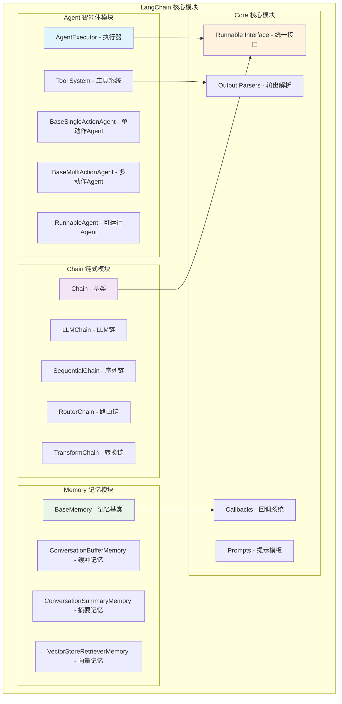
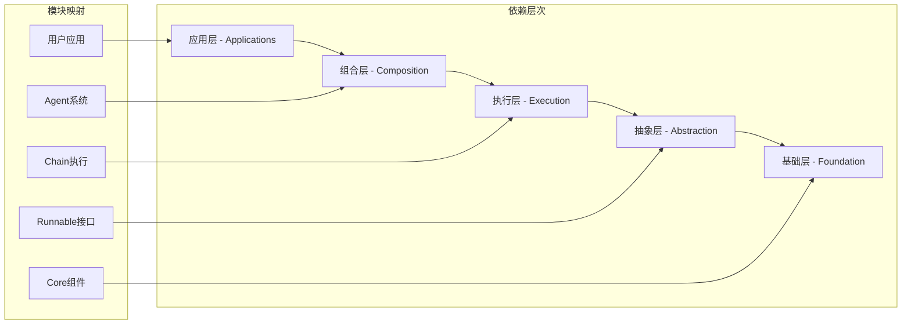
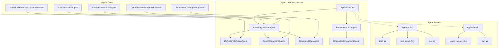
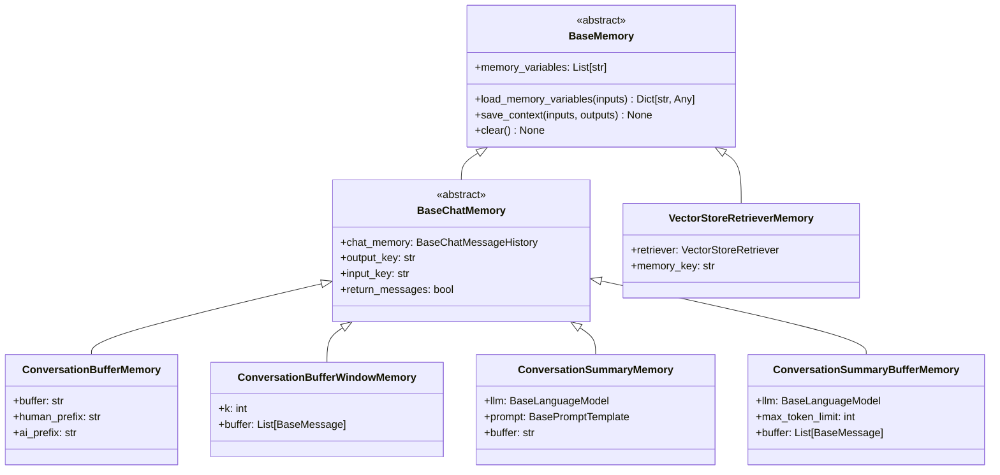
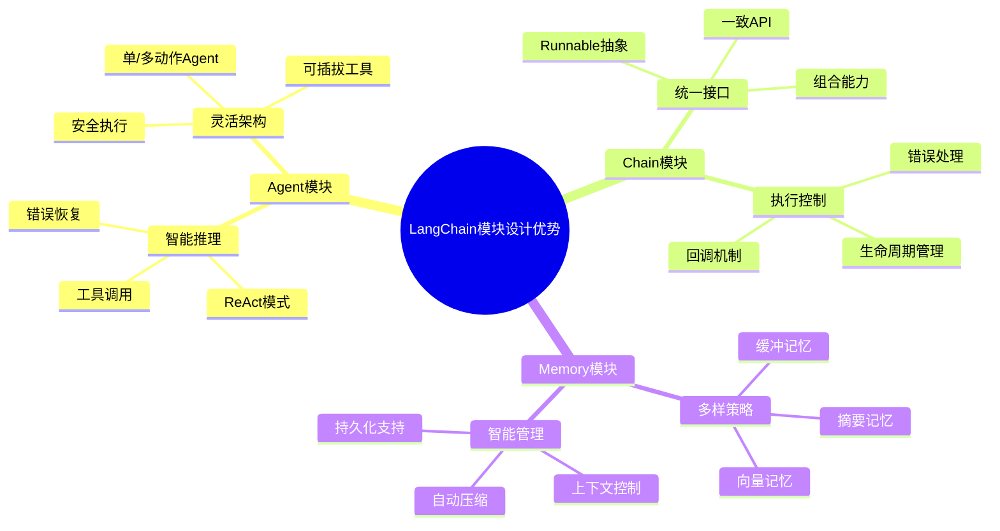

## 概述

LangChain作为构建大语言模型应用的核心框架，其模块化设计是其强大功能的基础。本文将深入分析LangChain的三大核心模块：Agent智能体系统、Chain链式执行引擎和主库组件架构，揭示其背后的设计哲学和技术实现。

<!--more-->

## 1. LangChain模块架构总览

### 1.1 整体模块结构



### 1.2 模块间依赖关系



## 2. Agent模块：智能代理系统

### 2.1 Agent架构设计

Agent模块是LangChain最具创新性的组件，实现了能够使用工具、进行推理和执行复杂任务的智能体。



### 2.2 AgentExecutor核心实现

```python
from typing import Any, Dict, List, Optional, Sequence, Union
from langchain_core.agents import AgentAction, AgentFinish, AgentStep
from langchain_core.tools import BaseTool
from langchain.agents.agent import BaseSingleActionAgent, BaseMultiActionAgent

class AgentExecutor(Chain):
    """Agent执行器 - Agent系统的核心执行引擎

    负责：
    1. 管理Agent的推理-行动循环
    2. 工具调用和结果处理
    3. 错误处理和重试机制
    4. 执行限制和安全控制
    5. 内存管理和状态维护
    """

    agent: Union[BaseSingleActionAgent, BaseMultiActionAgent, Runnable]
    """要运行的Agent，用于在执行循环的每个步骤创建计划并确定要采取的行动"""

    tools: Sequence[BaseTool]
    """Agent可以调用的有效工具"""

    return_intermediate_steps: bool = False
    """是否在最终输出之外还返回Agent的中间步骤轨迹"""

    max_iterations: Optional[int] = 15
    """结束执行循环之前要采取的最大步骤数"""

    max_execution_time: Optional[float] = None
    """在执行循环中花费的最大墙钟时间量"""

    early_stopping_method: str = "force"
    """如果Agent从未返回AgentFinish，用于早停的方法"""

    handle_parsing_errors: Union[bool, str, Callable] = False
    """如何处理Agent输出解析器引发的错误"""

    def _call(
        self,
        inputs: Dict[str, str],
        run_manager: Optional[CallbackManagerForChainRun] = None,
    ) -> Dict[str, Any]:
        """运行Agent并获取响应"""

        # 构建工具映射
        name_to_tool_map = {tool.name: tool for tool in self.tools}

        intermediate_steps: List[Tuple[AgentAction, str]] = []
        iterations = 0
        time_elapsed = 0.0
        start_time = time.time()

        # Agent执行循环
        while self._should_continue(iterations, time_elapsed):
            next_step_output = self._take_next_step(
                name_to_tool_map,
                inputs,
                intermediate_steps,
                run_manager=run_manager,
            )

            if isinstance(next_step_output, AgentFinish):
                return self._return(
                    next_step_output,
                    intermediate_steps,
                    run_manager=run_manager,
                )

            intermediate_steps.extend(next_step_output)
            iterations += 1
            time_elapsed = time.time() - start_time

        # 达到限制，强制停止
        output = self.agent.return_stopped_response(
            self.early_stopping_method, intermediate_steps
        )
        return self._return(output, intermediate_steps, run_manager)

    def _take_next_step(
        self,
        name_to_tool_map: Dict[str, BaseTool],
        inputs: Dict[str, str],
        intermediate_steps: List[Tuple[AgentAction, str]],
        run_manager: Optional[CallbackManagerForChainRun] = None,
    ) -> Union[AgentFinish, List[Tuple[AgentAction, str]]]:
        """执行Agent的一个推理-行动步骤"""

        try:
            # 修剪中间步骤
            intermediate_steps = self._prepare_intermediate_steps(intermediate_steps)

            # Agent规划
            output = self.agent.plan(
                intermediate_steps,
                callbacks=run_manager.get_child() if run_manager else None,
                **inputs,
            )
        except OutputParserException as e:
            # 处理解析错误
            if isinstance(self.handle_parsing_errors, bool):
                raise_error = not self.handle_parsing_errors
            else:
                raise_error = False

            if raise_error:
                raise ValueError("Agent输出解析出错") from e

            # 创建错误观察
            observation = self._handle_parsing_error(e)
            output = AgentAction("_Exception", observation, str(e))

        # 处理Agent输出
        if isinstance(output, AgentFinish):
            return output

        actions = [output] if isinstance(output, AgentAction) else output
        result = []

        for agent_action in actions:
            if run_manager:
                run_manager.on_agent_action(agent_action, color="green")

            # 执行工具
            if agent_action.tool in name_to_tool_map:
                tool = name_to_tool_map[agent_action.tool]
                observation = tool.run(
                    agent_action.tool_input,
                    verbose=self.verbose,
                    callbacks=run_manager.get_child() if run_manager else None,
                )
            else:
                observation = f"Error: Tool '{agent_action.tool}' not found"

            result.append((agent_action, observation))

        return result
```

### 2.3 ReAct Agent实现

```python
def create_react_agent(
    llm: BaseLanguageModel,
    tools: Sequence[BaseTool],
    prompt: BasePromptTemplate,
    output_parser: Optional[AgentOutputParser] = None,
    tools_renderer: Callable[[List[BaseTool]], str] = render_text_description,
    stop_sequence: Union[bool, List[str]] = True,
) -> Runnable:
    """创建ReAct (Reasoning + Acting) Agent

    ReAct是一种将推理和行动结合的Agent模式：
    1. Thought: 分析当前情况，思考下一步
    2. Action: 选择要执行的工具
    3. Action Input: 工具的输入参数
    4. Observation: 观察工具执行结果
    5. 重复上述过程直到得出最终答案
    """

    # 验证提示模板
    missing_vars = {"tools", "tool_names", "agent_scratchpad"}.difference(
        prompt.input_variables
    )
    if missing_vars:
        raise ValueError(f"Prompt missing variables: {missing_vars}")

    # 渲染工具信息
    tools_str = tools_renderer(list(tools))
    tool_names = ", ".join([tool.name for tool in tools])

    # 部分填充提示模板
    prompt = prompt.partial(
        tools=tools_str,
        tool_names=tool_names,
    )

    # 设置停止序列
    if stop_sequence:
        if isinstance(stop_sequence, bool):
            stop = ["\nObservation"]
        else:
            stop = stop_sequence
        llm = llm.bind(stop=stop)

    # 设置输出解析器
    if output_parser is None:
        output_parser = ReActSingleActionAgent()

    # 构建Agent链
    agent = (
        RunnablePassthrough.assign(
            agent_scratchpad=lambda x: format_to_openai_function_messages(
                x["intermediate_steps"]
            )
        )
        | prompt
        | llm
        | output_parser
    )

    return agent

class ReActOutputParser(AgentOutputParser):
    """ReAct输出解析器"""

    def parse(self, llm_output: str) -> Union[AgentAction, AgentFinish]:
        """解析LLM输出"""

        # 检查是否包含Final Answer
        if "Final Answer:" in llm_output:
            return AgentFinish(
                return_values={"output": llm_output.split("Final Answer:")[-1].strip()},
                log=llm_output,
            )

        # 解析Action
        regex = r"Action\s*\d*\s*:(.*?)\nAction\s*\d*\s*Input\s*\d*\s*:[\s]*(.*)"
        match = re.search(regex, llm_output, re.DOTALL)

        if not match:
            raise OutputParserException(f"Could not parse LLM output: `{llm_output}`")

        action = match.group(1).strip()
        action_input = match.group(2)

        # 处理action_input
        try:
            action_input = json.loads(action_input.strip())
        except (json.JSONDecodeError, AttributeError):
            action_input = action_input.strip(' "')

        return AgentAction(
            tool=action,
            tool_input=action_input,
            log=llm_output
        )
```

### 2.4 工具系统架构

```python
class ToolRegistry:
    """工具注册表 - 管理可用工具的中央注册表"""

    def __init__(self):
        self._tools: Dict[str, BaseTool] = {}
        self._categories: Dict[str, List[str]] = {}
        self._aliases: Dict[str, str] = {}

    def register(
        self,
        tool: BaseTool,
        category: Optional[str] = None,
        aliases: Optional[List[str]] = None
    ) -> None:
        """注册工具"""
        if tool.name in self._tools:
            raise ValueError(f"Tool '{tool.name}' already registered")

        self._tools[tool.name] = tool

        if category:
            if category not in self._categories:
                self._categories[category] = []
            self._categories[category].append(tool.name)

        if aliases:
            for alias in aliases:
                if alias in self._aliases:
                    raise ValueError(f"Alias '{alias}' already exists")
                self._aliases[alias] = tool.name

    def get(self, name: str) -> Optional[BaseTool]:
        """获取工具"""
        if name in self._tools:
            return self._tools[name]
        if name in self._aliases:
            real_name = self._aliases[name]
            return self._tools.get(real_name)
        return None

class SafeToolExecutor:
    """安全工具执行器"""

    def __init__(
        self,
        timeout: float = 30.0,
        max_memory_mb: Optional[int] = None,
        allowed_imports: Optional[List[str]] = None,
        blocked_functions: Optional[List[str]] = None
    ):
        self.timeout = timeout
        self.max_memory_mb = max_memory_mb
        self.allowed_imports = allowed_imports or []
        self.blocked_functions = blocked_functions or [
            'eval', 'exec', 'compile', '__import__',
            'open', 'file', 'input', 'raw_input'
        ]

    def execute_tool(
        self,
        tool: BaseTool,
        tool_input: Any,
        **kwargs
    ) -> Any:
        """安全执行工具"""
        # 安全检查
        self._security_check(tool, tool_input)

        # 执行工具（带超时）
        try:
            with self._timeout_context(self.timeout):
                result = tool.run(tool_input, **kwargs)
            return result
        except TimeoutError:
            raise ToolTimeout(f"Tool '{tool.name}' execution timed out")
        except Exception as e:
            raise ToolExecutionError(f"Tool '{tool.name}' execution failed: {str(e)}")
```

## 3. Chain模块：链式执行引擎

### 3.1 Chain基类设计

Chain模块是LangChain的核心执行引擎，提供了各种链式组合模式。

```python
from abc import ABC, abstractmethod
from typing import Any, Dict, List, Optional, Union
from langchain_core.runnables import Runnable
from langchain_core.callbacks import CallbackManagerForChainRun
from langchain_core.memory import BaseMemory

class Chain(Runnable[Dict[str, Any], Dict[str, Any]], ABC):
    """Chain基类 - 所有链的抽象基类

    Chain定义了：
    1. 输入输出键的规范
    2. 内存管理接口
    3. 回调和日志机制
    4. 执行流程控制
    """

    memory: Optional[BaseMemory] = None
    """内存组件，用于存储和检索对话历史"""

    callbacks: Optional[Union[List[BaseCallbackHandler], BaseCallbackManager]] = None
    """回调处理器列表或回调管理器"""

    verbose: bool = False
    """是否启用详细日志输出"""

    @property
    @abstractmethod
    def input_keys(self) -> List[str]:
        """输入键列表"""
        pass

    @property
    @abstractmethod
    def output_keys(self) -> List[str]:
        """输出键列表"""
        pass

    @abstractmethod
    def _call(
        self,
        inputs: Dict[str, Any],
        run_manager: Optional[CallbackManagerForChainRun] = None,
    ) -> Dict[str, Any]:
        """Chain的核心执行逻辑"""
        pass

    def __call__(
        self,
        inputs: Union[Dict[str, Any], Any],
        return_only_outputs: bool = False,
        callbacks: Optional[Union[List[BaseCallbackHandler], BaseCallbackManager]] = None,
        **kwargs
    ) -> Dict[str, Any]:
        """执行Chain的主入口方法"""

        # 预处理输入
        inputs = self.prep_inputs(inputs)

        # 配置回调管理器
        callback_manager = get_callback_manager_for_config({
            "callbacks": callbacks,
            "verbose": self.verbose
        })

        # 执行Chain
        with callback_manager.on_chain_start(
            dumpd(self),
            inputs,
        ) as run_manager:
            try:
                outputs = self._call(inputs, run_manager=run_manager)
                final_outputs = self.prep_outputs(inputs, outputs, return_only_outputs)
            except Exception as e:
                run_manager.on_chain_error(e)
                raise
            else:
                run_manager.on_chain_end(final_outputs)
                return final_outputs

    def prep_inputs(self, inputs: Union[Dict[str, Any], Any]) -> Dict[str, Any]:
        """预处理输入"""
        if not isinstance(inputs, dict):
            if len(self.input_keys) == 1:
                inputs = {self.input_keys[0]: inputs}
            else:
                raise ValueError("单个输入传递给期望多个输入的链")

        # 加载内存
        if self.memory is not None:
            external_context = self.memory.load_memory_variables(inputs)
            inputs.update(external_context)

        self._validate_inputs(inputs)
        return inputs

    def prep_outputs(
        self,
        inputs: Dict[str, Any],
        outputs: Dict[str, Any],
        return_only_outputs: bool = False,
    ) -> Dict[str, Any]:
        """后处理输出"""
        self._validate_outputs(outputs)

        # 保存内存
        if self.memory is not None:
            self.memory.save_context(inputs, outputs)

        if return_only_outputs:
            return outputs
        else:
            return {**inputs, **outputs}
```

### 3.2 LLMChain实现

```python
class LLMChain(Chain):
    """LLM链 - 最基础和最重要的Chain实现

    LLMChain将Prompt模板、LLM和输出解析器组合成一个可执行的链
    """

    llm: BaseLanguageModel
    """语言模型实例"""

    prompt: BasePromptTemplate
    """提示模板，用于格式化输入"""

    output_parser: Optional[BaseOutputParser] = None
    """输出解析器，用于解析LLM的输出"""

    output_key: str = "text"
    """输出键名，默认为'text'"""

    @property
    def input_keys(self) -> List[str]:
        return self.prompt.input_variables

    @property
    def output_keys(self) -> List[str]:
        return [self.output_key]

    def _call(
        self,
        inputs: Dict[str, Any],
        run_manager: Optional[CallbackManagerForChainRun] = None,
    ) -> Dict[str, str]:
        """执行LLMChain的核心逻辑"""

        # 格式化Prompt
        prompt_value = self.prompt.format_prompt(**inputs)

        # 调用LLM生成
        response = self.llm.generate_prompt(
            [prompt_value],
            callbacks=run_manager.get_child() if run_manager else None,
        )

        # 提取生成文本
        if self.llm._llm_type == "chat":
            generated_text = response.generations[0][0].message.content
        else:
            generated_text = response.generations[0][0].text

        # 解析输出
        if self.output_parser:
            try:
                parsed_output = self.output_parser.parse(generated_text)
                return {self.output_key: parsed_output}
            except Exception as e:
                if run_manager:
                    run_manager.on_text(f"Output parsing failed: {e}")
                return {self.output_key: generated_text}
        else:
            return {self.output_key: generated_text}

    def predict(self, **kwargs: Any) -> str:
        """便捷方法：直接返回生成的文本"""
        return self(kwargs)[self.output_key]

    def apply(self, input_list: List[Dict[str, Any]], **kwargs) -> List[Dict[str, Any]]:
        """批量执行LLMChain"""
        if hasattr(self.llm, 'generate') and len(input_list) > 1:
            return self._batch_generate(input_list, **kwargs)
        else:
            return super().apply(input_list, **kwargs)

    def _batch_generate(
        self,
        input_list: List[Dict[str, Any]],
        **kwargs
    ) -> List[Dict[str, Any]]:
        """批量生成优化"""

        # 批量格式化Prompt
        prompt_values = []
        for inputs in input_list:
            prompt_value = self.prompt.format_prompt(**inputs)
            prompt_values.append(prompt_value)

        # 批量调用LLM
        response = self.llm.generate_prompt(prompt_values)

        # 处理批量输出
        results = []
        for i, generation in enumerate(response.generations):
            if self.llm._llm_type == "chat":
                generated_text = generation[0].message.content
            else:
                generated_text = generation[0].text

            if self.output_parser:
                try:
                    parsed_output = self.output_parser.parse(generated_text)
                    results.append({self.output_key: parsed_output})
                except Exception:
                    results.append({self.output_key: generated_text})
            else:
                results.append({self.output_key: generated_text})

        return results
```

### 3.3 SequentialChain实现

```python
class SequentialChain(Chain):
    """顺序链 - 按顺序执行多个Chain

    每个Chain的输出会作为下个Chain的输入，实现复杂的多步骤处理流程
    """

    chains: List[Chain]
    """Chain列表，按顺序执行"""

    input_variables: List[str]
    """整个序列的输入变量"""

    output_variables: List[str]
    """整个序列的输出变量"""

    return_all: bool = False
    """是否返回所有中间结果"""

    def __init__(
        self,
        chains: List[Chain],
        input_variables: List[str],
        output_variables: List[str],
        return_all: bool = False,
        **kwargs
    ):
        super().__init__(**kwargs)
        self.chains = chains
        self.input_variables = input_variables
        self.output_variables = output_variables
        self.return_all = return_all

        # 验证Chain序列的有效性
        self._validate_chains()

    @property
    def input_keys(self) -> List[str]:
        return self.input_variables

    @property
    def output_keys(self) -> List[str]:
        return self.output_variables

    def _call(
        self,
        inputs: Dict[str, Any],
        run_manager: Optional[CallbackManagerForChainRun] = None,
    ) -> Dict[str, Any]:
        """顺序执行所有Chain"""

        known_values = inputs.copy()

        # 逐个执行Chain
        for i, chain in enumerate(self.chains):
            # 准备当前Chain的输入
            chain_inputs = self._prepare_chain_inputs(chain, known_values)

            # 执行Chain
            if run_manager:
                child_manager = run_manager.get_child(f"step_{i}")
            else:
                child_manager = None

            outputs = chain._call(chain_inputs, child_manager)
            known_values.update(outputs)

        # 返回指定的输出变量
        return self._prepare_final_outputs(known_values)

    def _prepare_chain_inputs(
        self,
        chain: Chain,
        known_values: Dict[str, Any]
    ) -> Dict[str, Any]:
        """为特定Chain准备输入"""

        chain_inputs = {}
        for key in chain.input_keys:
            if key in known_values:
                chain_inputs[key] = known_values[key]
            else:
                raise ValueError(
                    f"Chain {chain.__class__.__name__} requires input '{key}' "
                    f"which is not available"
                )
        return chain_inputs

    def _prepare_final_outputs(self, known_values: Dict[str, Any]) -> Dict[str, Any]:
        """准备最终输出"""

        if self.return_all:
            return known_values
        else:
            final_outputs = {}
            for key in self.output_variables:
                if key in known_values:
                    final_outputs[key] = known_values[key]
                else:
                    raise ValueError(f"Output variable '{key}' not found")
            return final_outputs

    def _validate_chains(self) -> None:
        """验证Chain序列的有效性"""

        if not self.chains:
            raise ValueError("SequentialChain must have at least one chain")

        available_vars = set(self.input_variables)

        for i, chain in enumerate(self.chains):
            # 检查当前Chain的输入是否都可用
            missing_inputs = set(chain.input_keys) - available_vars
            if missing_inputs:
                raise ValueError(
                    f"Chain {i} missing inputs: {missing_inputs}"
                )

            # 添加当前Chain的输出到可用变量
            available_vars.update(chain.output_keys)

        # 检查最终输出变量是否都可用
        missing_outputs = set(self.output_variables) - available_vars
        if missing_outputs:
            raise ValueError(f"Output variables {missing_outputs} not produced")
```

### 3.4 RouterChain实现

```python
class RouterChain(Chain):
    """路由链 - 根据输入动态选择执行哪个Chain"""

    router_chain: Chain
    """路由器Chain，负责做路由决策"""

    destination_chains: Mapping[str, Chain]
    """目标Chain字典，键为Chain名称"""

    default_chain: Optional[Chain] = None
    """默认Chain，当路由器无法决策时使用"""

    silent_errors: bool = False
    """是否静默处理错误"""

    @property
    def input_keys(self) -> List[str]:
        return self.router_chain.input_keys

    @property
    def output_keys(self) -> List[str]:
        output_keys = set()
        for chain in self.destination_chains.values():
            output_keys.update(chain.output_keys)
        if self.default_chain:
            output_keys.update(self.default_chain.output_keys)
        return list(output_keys)

    def route(self, inputs: Dict[str, Any]) -> Route:
        """执行路由决策"""

        route_result = self.router_chain(inputs)

        if "destination" in route_result:
            destination = route_result["destination"]
        else:
            destination = self._parse_destination_from_text(
                route_result.get("text", "")
            )

        if "next_inputs" in route_result:
            next_inputs = route_result["next_inputs"]
        else:
            next_inputs = inputs

        return Route(destination=destination, next_inputs=next_inputs)

    def _call(
        self,
        inputs: Dict[str, Any],
        run_manager: Optional[CallbackManagerForChainRun] = None,
    ) -> Dict[str, Any]:
        """执行路由和目标Chain"""

        try:
            # 执行路由决策
            route = self.route(inputs)

            # 选择目标Chain
            if route.destination and route.destination in self.destination_chains:
                target_chain = self.destination_chains[route.destination]
            elif self.default_chain:
                target_chain = self.default_chain
            else:
                raise ValueError(f"No chain found for destination '{route.destination}'")

            # 执行目标Chain
            return target_chain._call(route.next_inputs, run_manager)

        except Exception as e:
            if self.silent_errors:
                return {"error": str(e)}
            else:
                raise e

class Route:
    """路由结果"""

    def __init__(self, destination: Optional[str], next_inputs: Dict[str, Any]):
        self.destination = destination
        self.next_inputs = next_inputs
```

## 4. Memory模块：状态管理系统

### 4.1 Memory继承层次



### 4.2 BaseChatMemory实现

```python
from abc import ABC, abstractmethod
from typing import Any, Dict, List, Optional, Tuple
from langchain_core.memory import BaseMemory
from langchain_core.messages import BaseMessage, HumanMessage, AIMessage
from langchain_core.chat_history import BaseChatMessageHistory

class BaseChatMemory(BaseMemory, ABC):
    """聊天记忆的抽象基类

    聊天记忆专门用于存储和管理对话历史，支持：
    1. 消息格式的对话存储
    2. 灵活的输入输出键配置
    3. 消息和字符串格式的转换
    4. 对话历史的持久化
    """

    chat_memory: BaseChatMessageHistory
    """存储聊天消息的对象"""

    output_key: Optional[str] = None
    """用于从链输出中提取AI消息的键"""

    input_key: Optional[str] = None
    """用于从链输入中提取人类消息的键"""

    return_messages: bool = False
    """是否返回消息列表而不是字符串"""

    def _get_input_output(
        self, inputs: Dict[str, Any], outputs: Dict[str, str]
    ) -> Tuple[str, str]:
        """从输入输出字典中提取输入和输出字符串"""

        # 确定输入键
        if self.input_key is None:
            prompt_input_keys = list(inputs.keys())
            if len(prompt_input_keys) != 1:
                raise ValueError(f"一个输入键期望得到，但得到 {prompt_input_keys}")
            input_key = prompt_input_keys[0]
        else:
            input_key = self.input_key

        # 确定输出键
        if self.output_key is None:
            if len(outputs) != 1:
                raise ValueError(f"一个输出键期望得到，但得到 {list(outputs.keys())}")
            output_key = list(outputs.keys())[0]
        else:
            output_key = self.output_key

        return inputs[input_key], outputs[output_key]

    def save_context(self, inputs: Dict[str, Any], outputs: Dict[str, str]) -> None:
        """保存对话上下文到记忆中"""

        input_str, output_str = self._get_input_output(inputs, outputs)
        self.chat_memory.add_user_message(input_str)
        self.chat_memory.add_ai_message(output_str)

    def clear(self) -> None:
        """清除记忆内容"""
        self.chat_memory.clear()
```

### 4.3 ConversationBufferMemory实现

```python
class ConversationBufferMemory(BaseChatMemory):
    """简单的对话缓冲区记忆

    特点：
    1. 完整保存：保存所有对话历史
    2. 格式灵活：支持字符串和消息格式
    3. 简单高效：没有额外的处理开销
    4. 内存占用：随对话长度线性增长
    """

    human_prefix: str = "Human"
    """人类消息的前缀"""

    ai_prefix: str = "AI"
    """AI消息的前缀"""

    memory_key: str = "history"
    """记忆在链输入中的键名"""

    @property
    def buffer(self) -> Any:
        """返回缓冲区内容"""
        return self.chat_memory.messages

    @property
    def memory_variables(self) -> List[str]:
        """返回记忆变量列表"""
        return [self.memory_key]

    def load_memory_variables(self, inputs: Dict[str, Any]) -> Dict[str, Any]:
        """从记忆中加载变量"""

        messages = self.chat_memory.messages

        if self.return_messages:
            return {self.memory_key: messages}
        else:
            buffer = self._messages_to_string(messages)
            return {self.memory_key: buffer}

    def _messages_to_string(self, messages: List[BaseMessage]) -> str:
        """将消息列表转换为字符串"""

        string_messages = []
        for message in messages:
            if isinstance(message, HumanMessage):
                role = self.human_prefix
            elif isinstance(message, AIMessage):
                role = self.ai_prefix
            else:
                role = message.__class__.__name__

            string_messages.append(f"{role}: {message.content}")

        return "\n".join(string_messages)

class ConversationBufferWindowMemory(BaseChatMemory):
    """滑动窗口对话记忆

    特点：
    1. 固定窗口：只保留最近k轮对话
    2. 自动清理：自动删除过旧的消息
    3. 内存可控：内存占用有上限
    4. 连续性：保持最近对话的连续性
    """

    k: int = 5
    """要保留的对话轮数"""

    memory_key: str = "history"

    @property
    def buffer(self) -> List[BaseMessage]:
        """返回缓冲区内容（最近k轮对话）"""
        return self.chat_memory.messages[-2 * self.k :] if self.k > 0 else []

    @property
    def memory_variables(self) -> List[str]:
        return [self.memory_key]

    def load_memory_variables(self, inputs: Dict[str, Any]) -> Dict[str, Any]:
        """从记忆中加载变量"""

        messages = self.buffer

        if self.return_messages:
            return {self.memory_key: messages}
        else:
            buffer = self._messages_to_string(messages)
            return {self.memory_key: buffer}
```

### 4.4 ConversationSummaryMemory实现

```python
class ConversationSummaryMemory(BaseChatMemory):
    """对话摘要记忆

    特点：
    1. 智能压缩：使用LLM生成对话摘要
    2. 信息保留：在压缩的同时保留关键信息
    3. 上下文控制：有效控制上下文长度
    4. 计算开销：需要额外的LLM调用
    """

    llm: BaseLanguageModel
    """用于生成摘要的语言模型"""

    prompt: BasePromptTemplate = SUMMARY_PROMPT
    """用于生成摘要的提示模板"""

    memory_key: str = "history"
    """记忆在链输入中的键名"""

    buffer: str = ""
    """当前的摘要缓冲区"""

    @property
    def memory_variables(self) -> List[str]:
        return [self.memory_key]

    def load_memory_variables(self, inputs: Dict[str, Any]) -> Dict[str, Any]:
        """从记忆中加载变量"""

        if self.return_messages:
            if self.buffer:
                messages = [AIMessage(content=f"Previous conversation summary: {self.buffer}")]
            else:
                messages = []
            return {self.memory_key: messages}
        else:
            return {self.memory_key: self.buffer}

    def save_context(self, inputs: Dict[str, Any], outputs: Dict[str, str]) -> None:
        """保存上下文并更新摘要"""

        # 首先保存到聊天历史
        super().save_context(inputs, outputs)

        # 然后更新摘要
        self._update_summary()

    def _update_summary(self) -> None:
        """更新对话摘要"""

        messages = self.chat_memory.messages
        if not messages:
            return

        # 将消息转换为字符串
        new_lines = self._messages_to_string(messages)

        # 生成新的摘要
        if self.buffer:
            summary_input = {
                "summary": self.buffer,
                "new_lines": new_lines,
            }
        else:
            summary_input = {
                "summary": "",
                "new_lines": new_lines,
            }

        # 调用LLM生成摘要
        self.buffer = self.llm.predict(**summary_input)

        # 清除聊天历史（因为已经摘要了）
        self.chat_memory.clear()

# 摘要提示模板
SUMMARY_PROMPT = PromptTemplate(
    input_variables=["summary", "new_lines"],
    template="""逐步总结所提供的对话内容，将新内容添加到之前的摘要中，返回一个新的摘要。

示例：
当前摘要：
人类询问AI对人工智能的看法。AI认为人工智能是一种有益的技术。

新的对话内容：
Human: 为什么你认为人工智能是有益的？
AI: 因为人工智能可以帮助人类解决复杂问题并提高效率。

新摘要：
人类询问AI对人工智能的看法。AI认为人工智能是一种有益的技术，因为它可以帮助人类解决复杂问题并提高效率。
结束示例

当前摘要：
{summary}

新的对话内容：
{new_lines}

新摘要：""",
)
```

## 5. 实际应用案例与最佳实践

### 5.1 企业级Agent系统实现

```python
from langchain.agents import AgentExecutor, create_react_agent
from langchain.tools import BaseTool, tool
from langchain_openai import ChatOpenAI
from langchain_core.prompts import PromptTemplate
from langchain.memory import ConversationBufferWindowMemory
from typing import Dict, Any, List, Optional
import json
import logging

class EnterpriseAgentSystem:
    """企业级Agent系统实现"""

    def __init__(self, model_name: str = "gpt-3.5-turbo"):
        self.llm = ChatOpenAI(model_name=model_name, temperature=0.1)
        self.memory = ConversationBufferWindowMemory(
            memory_key="chat_history",
            return_messages=True,
            k=10  # 保留最近10轮对话
        )
        self.tools = self._create_enterprise_tools()
        self.agent_executor = self._create_agent_executor()
        self.logger = logging.getLogger(__name__)

    def _create_enterprise_tools(self) -> List[BaseTool]:
        """创建企业级工具集"""

        @tool
        def database_query(query: str) -> str:
            """执行数据库查询"""
            try:
                if "SELECT" in query.upper():
                    return json.dumps({
                        "status": "success",
                        "data": [{"id": 1, "name": "示例数据"}],
                        "count": 1
                    })
                else:
                    return json.dumps({
                        "status": "error",
                        "message": "只支持SELECT查询"
                    })
            except Exception as e:
                return json.dumps({
                    "status": "error",
                    "message": str(e)
                })

        @tool
        def api_call(endpoint: str, method: str = "GET", data: str = "{}") -> str:
            """调用外部API"""
            import requests
            from urllib.parse import urlparse

            try:
                # 安全检查：只允许特定域名
                allowed_domains = ["api.example.com", "internal-api.company.com"]
                domain = urlparse(endpoint).netloc

                if domain not in allowed_domains:
                    return json.dumps({
                        "status": "error",
                        "message": f"不允许访问域名: {domain}"
                    })

                # 执行API调用
                if method.upper() == "GET":
                    response = requests.get(endpoint, timeout=10)
                elif method.upper() == "POST":
                    response = requests.post(
                        endpoint,
                        json=json.loads(data),
                        timeout=10
                    )
                else:
                    return json.dumps({
                        "status": "error",
                        "message": f"不支持的HTTP方法: {method}"
                    })

                return json.dumps({
                    "status": "success",
                    "data": response.json(),
                    "status_code": response.status_code
                })

            except Exception as e:
                return json.dumps({
                    "status": "error",
                    "message": str(e)
                })

        return [database_query, api_call]

    def _create_agent_executor(self) -> AgentExecutor:
        """创建Agent执行器"""

        # 自定义ReAct提示模板
        react_prompt = PromptTemplate.from_template("""
你是一个专业的AI助手，能够使用各种工具来帮助用户完成任务。

可用工具：
{tools}

工具名称：{tool_names}

请使用以下格式进行推理：

Question: 用户的问题
Thought: 我需要思考如何解决这个问题
Action: 选择要使用的工具
Action Input: 工具的输入参数
Observation: 工具的执行结果
... (这个Thought/Action/Action Input/Observation过程可以重复多次)
Thought: 我现在知道最终答案了
Final Answer: 对用户问题的最终回答

开始！

Question: {input}
Thought: {agent_scratchpad}
""")

        # 创建ReAct Agent
        agent = create_react_agent(
            llm=self.llm,
            tools=self.tools,
            prompt=react_prompt
        )

        # 创建Agent执行器
        agent_executor = AgentExecutor(
            agent=agent,
            tools=self.tools,
            memory=self.memory,
            verbose=True,
            max_iterations=10,
            max_execution_time=60,
            early_stopping_method="generate",
            handle_parsing_errors=True
        )

        return agent_executor

    def execute_task(self, task: str) -> Dict[str, Any]:
        """执行任务"""
        try:
            self.logger.info(f"开始执行任务: {task}")

            result = self.agent_executor.invoke({
                "input": task
            })

            self.logger.info(f"任务执行完成: {result.get('output', '')}")

            return {
                "status": "success",
                "result": result.get("output", ""),
                "intermediate_steps": result.get("intermediate_steps", [])
            }

        except Exception as e:
            self.logger.error(f"任务执行失败: {str(e)}")
            return {
                "status": "error",
                "message": str(e)
            }
```

### 5.2 高级Memory管理策略

```python
class AdvancedMemoryManager:
    """高级记忆管理器"""

    def __init__(self):
        self.memory_strategies = {}
        self.active_strategy = None

    def create_hybrid_memory(self, vectorstore, llm):
        """创建混合记忆系统"""
        from langchain.memory import (
            ConversationBufferMemory,
            ConversationSummaryMemory,
            VectorStoreRetrieverMemory,
            CombinedMemory
        )

        # 1. 缓冲记忆 - 保存最近对话
        buffer_memory = ConversationBufferMemory(
            memory_key="recent_chat_history",
            input_key="input",
            output_key="output",
            return_messages=True
        )

        # 2. 摘要记忆 - 压缩历史对话
        summary_memory = ConversationSummaryMemory(
            llm=llm,
            memory_key="chat_summary",
            input_key="input",
            output_key="output",
            return_messages=False
        )

        # 3. 向量记忆 - 语义检索历史
        vector_memory = VectorStoreRetrieverMemory(
            retriever=vectorstore.as_retriever(search_kwargs={"k": 3}),
            memory_key="relevant_history",
            input_key="input"
        )

        # 4. 组合记忆
        combined_memory = CombinedMemory(
            memories=[buffer_memory, summary_memory, vector_memory]
        )

        return combined_memory

    def create_adaptive_memory(self, llm, max_token_limit: int = 4000):
        """创建自适应记忆系统"""
        from langchain.memory import ConversationTokenBufferMemory

        class AdaptiveTokenMemory(ConversationTokenBufferMemory):
            """自适应Token记忆"""

            def __init__(self, llm, max_token_limit, **kwargs):
                super().__init__(llm=llm, max_token_limit=max_token_limit, **kwargs)
                self.compression_ratio = 0.7

            def save_context(self, inputs: Dict[str, Any], outputs: Dict[str, str]) -> None:
                """保存上下文，自动压缩"""
                super().save_context(inputs, outputs)

                # 检查是否需要压缩
                current_tokens = self.llm.get_num_tokens(self.buffer)

                if current_tokens > self.max_token_limit * 0.9:  # 90%阈值
                    self._compress_memory()

            def _compress_memory(self):
                """压缩记忆内容"""
                messages = self.chat_memory.messages

                if len(messages) > 4:  # 保留最近2轮对话
                    # 获取需要压缩的消息
                    to_compress = messages[:-4]
                    to_keep = messages[-4:]

                    # 生成摘要
                    if to_compress:
                        compress_text = self._messages_to_string(to_compress)
                        summary_prompt = f"""
请将以下对话内容压缩为简洁的摘要，保留关键信息：

{compress_text}

摘要：
"""
                        summary = self.llm.predict(summary_prompt)

                        # 清空并重新构建记忆
                        self.chat_memory.clear()

                        # 添加摘要作为系统消息
                        from langchain_core.messages import SystemMessage
                        self.chat_memory.add_message(
                            SystemMessage(content=f"历史对话摘要：{summary}")
                        )

                        # 添加保留的消息
                        for message in to_keep:
                            self.chat_memory.add_message(message)

        return AdaptiveTokenMemory(llm=llm, max_token_limit=max_token_limit)
```

### 5.3 性能优化最佳实践

```python
class OptimizedChainExecutor:
    """优化的链执行器"""

    def __init__(self):
        self.cache = {}
        self.performance_metrics = {}

    def create_cached_chain(self, base_chain: Chain, cache_size: int = 1000):
        """创建带缓存的链"""

        class CachedChain(Chain):
            def __init__(self, base_chain, cache_size):
                super().__init__()
                self.base_chain = base_chain
                self.cache = {}
                self.cache_size = cache_size

            @property
            def input_keys(self):
                return self.base_chain.input_keys

            @property
            def output_keys(self):
                return self.base_chain.output_keys

            def _get_cache_key(self, inputs):
                import hashlib
                import json
                inputs_str = json.dumps(inputs, sort_keys=True, default=str)
                return hashlib.md5(inputs_str.encode()).hexdigest()

            def _call(self, inputs, run_manager=None):
                cache_key = self._get_cache_key(inputs)

                if cache_key in self.cache:
                    if run_manager:
                        run_manager.on_text("Cache hit")
                    return self.cache[cache_key]

                result = self.base_chain._call(inputs, run_manager)

                if len(self.cache) >= self.cache_size:
                    # 简单的LRU：删除第一个元素
                    first_key = next(iter(self.cache))
                    del self.cache[first_key]

                self.cache[cache_key] = result
                return result

        return CachedChain(base_chain, cache_size)

    def create_parallel_chain(self, chains: List[Chain]):
        """创建并行执行链"""

        class ParallelChain(Chain):
            def __init__(self, chains):
                super().__init__()
                self.chains = chains

            @property
            def input_keys(self):
                # 所有链的输入键的并集
                keys = set()
                for chain in self.chains:
                    keys.update(chain.input_keys)
                return list(keys)

            @property
            def output_keys(self):
                # 所有链的输出键的并集
                keys = set()
                for chain in self.chains:
                    keys.update(chain.output_keys)
                return list(keys)

            def _call(self, inputs, run_manager=None):
                import concurrent.futures

                def execute_chain(chain):
                    # 准备该链的输入
                    chain_inputs = {
                        key: inputs[key]
                        for key in chain.input_keys
                        if key in inputs
                    }
                    return chain._call(chain_inputs, run_manager)

                # 并行执行所有链
                with concurrent.futures.ThreadPoolExecutor() as executor:
                    futures = [
                        executor.submit(execute_chain, chain)
                        for chain in self.chains
                    ]

                    results = {}
                    for future in concurrent.futures.as_completed(futures):
                        result = future.result()
                        results.update(result)

                return results

        return ParallelChain(chains)
```

## 6. 总结与展望

### 6.1 LangChain模块设计优势



### 6.2 核心设计模式

1. **模板方法模式**：Chain执行流程、Agent推理循环
2. **策略模式**：不同Memory策略、Agent停止策略
3. **观察者模式**：回调机制、事件通知
4. **组合模式**：Chain组合、Tool组合
5. **工厂模式**：Agent创建、Memory创建

### 6.3 最佳实践总结

1. **Agent设计**：
   - 合理设置迭代限制和超时
   - 实现完善的错误处理机制
   - 使用安全的工具执行环境
   - 优化提示模板和输出解析

2. **Chain组合**：
   - 验证输入输出的连接性
   - 使用适当的并行和缓存策略
   - 实现智能的错误恢复
   - 监控性能和资源使用

3. **Memory管理**：
   - 根据场景选择合适的记忆策略
   - 实现自适应的上下文管理
   - 考虑持久化和分布式需求
   - 优化记忆的检索和更新

通过深入理解LangChain的模块设计和实现原理，开发者能够更好地构建复杂的AI应用，充分利用Agent、Chain和Memory等核心组件的强大功能。
