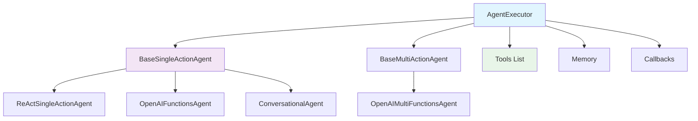
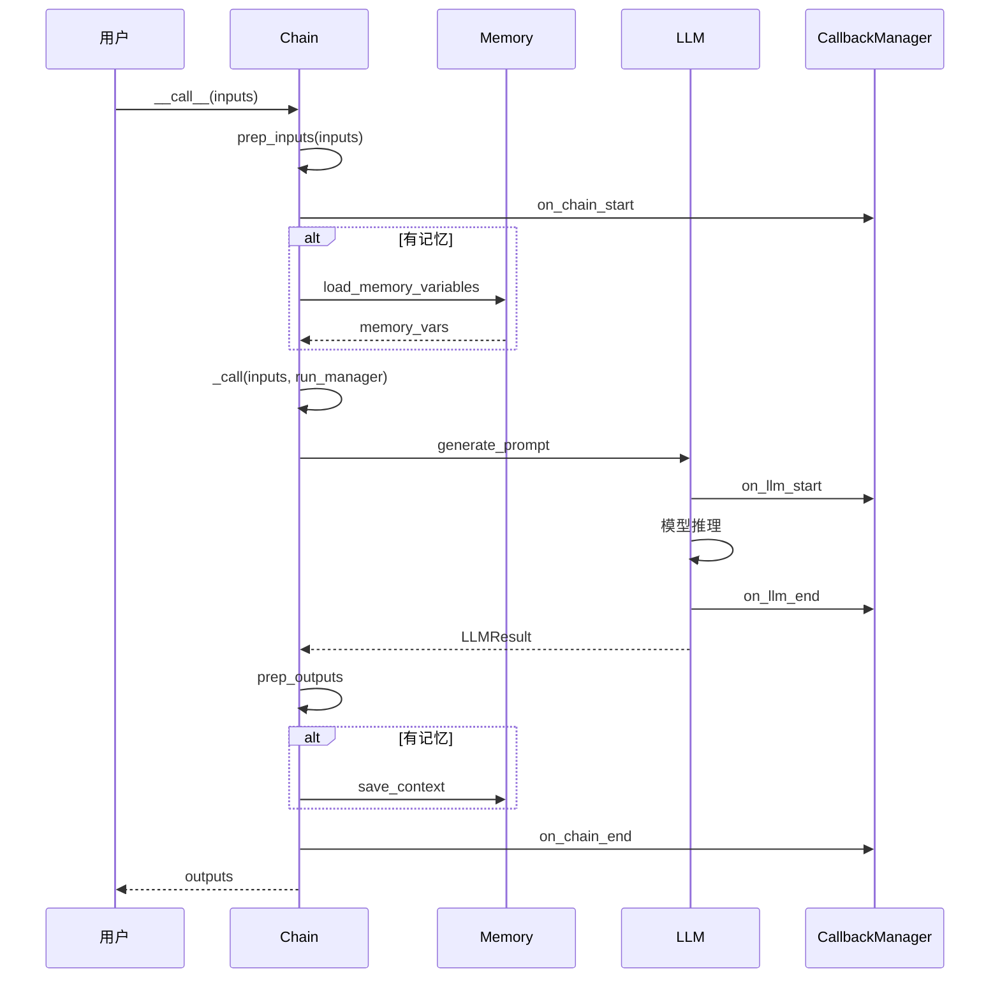
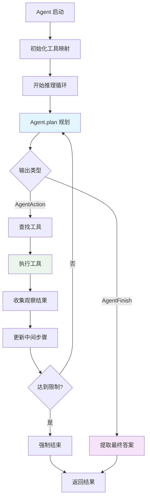
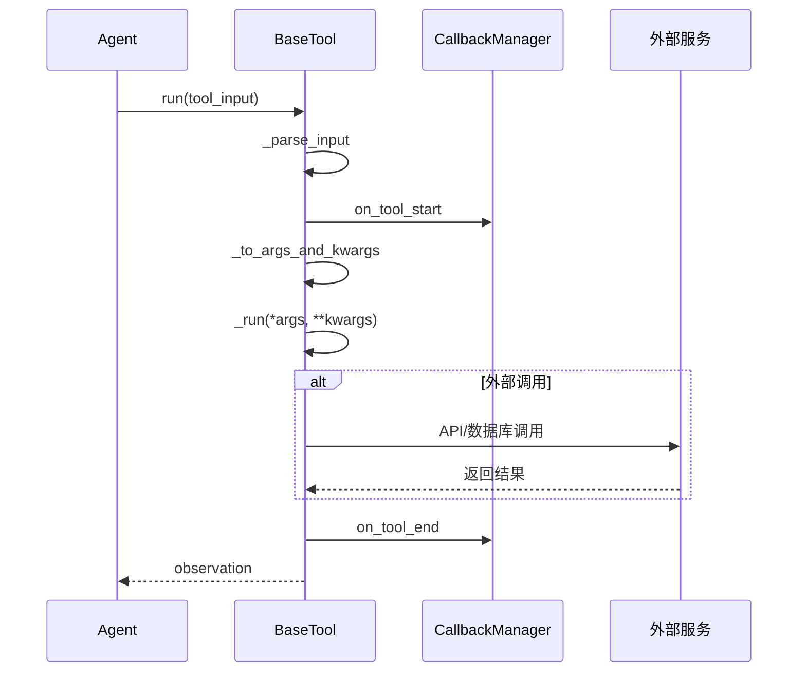

## 1. 核心抽象层：Runnable 统一接口

### 1.1 Runnable 接口设计哲学

LangChain 的核心设计理念是**统一抽象**，所有组件都实现 `Runnable` 接口：

```python
// langchain_core/runnables/base.py
class Runnable(Generic[Input, Output], ABC):
    """LangChain 的核心抽象 - 可运行对象"""

    @abstractmethod
    def invoke(self, input: Input, config: Optional[RunnableConfig] = None) -> Output:
        """同步调用 - 核心执行方法"""

    @abstractmethod
    async def ainvoke(self, input: Input, config: Optional[RunnableConfig] = None) -> Output:
        """异步调用 - 支持高并发"""

    def stream(self, input: Input, config: Optional[RunnableConfig] = None) -> Iterator[Output]:
        """流式调用 - 实时响应"""
        yield from self._transform_stream_with_config(
            iter([input]), self._transform, config, **kwargs
        )

    def batch(self, inputs: List[Input], config: Optional[RunnableConfig] = None) -> List[Output]:
        """批量调用 - 提升吞吐量"""
        return [self.invoke(input, config) for input in inputs]
```

**设计优势**：
- **组合性**：通过 `|` 操作符实现链式组合
- **一致性**：统一的调用接口，降低学习成本
- **扩展性**：新组件只需实现 `Runnable` 即可无缝集成

### 1.2 RunnableConfig 配置体系

```python
class RunnableConfig(TypedDict, total=False):
    """运行时配置 - 贯穿整个执行链路"""

    tags: List[str]                    # 标签，用于分类和过滤
    metadata: Dict[str, Any]           # 元数据，携带上下文信息
    callbacks: Callbacks               # 回调处理器
    run_name: str                      # 运行名称，便于调试
    max_concurrency: Optional[int]     # 最大并发数
    recursion_limit: int               # 递归深度限制
    configurable: Dict[str, Any]       # 可配置参数
```

**配置传递机制**：
```python
def ensure_config(config: Optional[RunnableConfig] = None) -> RunnableConfig:
    """确保配置完整性"""
    empty_config: RunnableConfig = {}
    if config is None:
        return empty_config

    # 合并默认配置
    config = {**empty_config, **config}

    # 生成唯一运行ID
    if "run_id" not in config:
        config["run_id"] = uuid.uuid4()

    return config
```

---

## 2. Chain 模块：结构化调用序列

### 2.1 Chain 基类架构

```python
// langchain/chains/base.py
class Chain(RunnableSerializable[dict[str, Any], dict[str, Any]], ABC):
    """链的抽象基类 - 结构化组件调用序列"""

    memory: Optional[BaseMemory] = None
    """记忆组件 - 维护状态"""

    callbacks: Callbacks = Field(default=None, exclude=True)
    """回调处理器 - 可观测性"""

    verbose: bool = Field(default_factory=_get_verbosity)
    """详细模式 - 调试输出"""

    @property
    @abstractmethod
    def input_keys(self) -> List[str]:
        """输入键列表 - 定义接口契约"""

    @property
    @abstractmethod
    def output_keys(self) -> List[str]:
        """输出键列表 - 定义返回格式"""

    @abstractmethod
    def _call(self, inputs: Dict[str, Any], run_manager: Optional[CallbackManagerForChainRun] = None) -> Dict[str, Any]:
        """核心执行逻辑 - 子类必须实现"""
```

### 2.2 Chain 执行流程解析

```python
def __call__(self, inputs: Union[Dict[str, Any], Any], return_only_outputs: bool = False, callbacks: Callbacks = None, *, include_run_info: bool = False) -> Dict[str, Any]:
    """Chain 调用入口 - 完整的执行流程"""

    # 1. 输入预处理和验证
    inputs = self.prep_inputs(inputs)

    # 2. 回调管理器初始化
    callback_manager = CallbackManager.configure(
        callbacks,
        self.callbacks,
        self.verbose,
        self.tags,
        self.metadata
    )

    # 3. 执行前回调
    new_arg_supported = inspect.signature(self._call).parameters.get("run_manager")
    run_manager = callback_manager.on_chain_start(
        dumpd(self),
        inputs,
        name=run_name,
    )

    try:
        # 4. 核心执行逻辑
        outputs = (
            self._call(inputs, run_manager=run_manager)
            if new_arg_supported
            else self._call(inputs)
        )

        # 5. 执行后回调
        run_manager.on_chain_end(outputs)

        # 6. 输出后处理
        final_outputs: Dict[str, Any] = self.prep_outputs(
            inputs, outputs, return_only_outputs
        )

    except Exception as e:
        # 7. 错误处理
        run_manager.on_chain_error(e)
        raise e

    return final_outputs
```

### 2.3 LLMChain：最基础的链实现

```python
class LLMChain(Chain):
    """LLM 调用链 - 最基础的实现"""

    prompt: BasePromptTemplate
    """Prompt 模板"""

    llm: BaseLanguageModel
    """语言模型"""

    output_parser: BaseOutputParser = Field(default_factory=NoOpOutputParser)
    """输出解析器"""

    def _call(self, inputs: Dict[str, Any], run_manager: Optional[CallbackManagerForChainRun] = None) -> Dict[str, Any]:
        # 1. 格式化 Prompt
        response = self.generate([inputs], run_manager=run_manager)
        return self.create_outputs(response)[0]

    def generate(self, input_list: List[Dict[str, Any]], run_manager: Optional[CallbackManagerForChainRun] = None) -> LLMResult:
        """批量生成 - 核心实现"""

        # 1. 构建 Prompt 列表
        prompts, stop = self.prep_prompts(input_list, run_manager=run_manager)

        # 2. 调用 LLM
        response = self.llm.generate_prompt(
            prompts,
            stop,
            callbacks=run_manager.get_child() if run_manager else None,
            **self.llm_kwargs,
        )

        return response

    def prep_prompts(self, input_list: List[Dict[str, Any]], run_manager: Optional[CallbackManagerForChainRun] = None) -> Tuple[List[PromptValue], Optional[List[str]]]:
        """准备 Prompt 列表"""
        stop = None
        if "stop" in input_list[0]:
            stop = input_list[0]["stop"]

        prompts = []
        for inputs in input_list:
            selected_inputs = {k: inputs[k] for k in self.prompt.input_variables}
            prompt = self.prompt.format_prompt(**selected_inputs)

            # 记录 Prompt 格式化过程
            if run_manager:
                run_manager.on_text(prompt.to_string(), verbose=self.verbose)

            prompts.append(prompt)

        return prompts, stop
```

### 2.4 SequentialChain：顺序执行链

```python
class SequentialChain(Chain):
    """顺序链 - 多个链的串行执行"""

    chains: List[Chain]
    """子链列表"""

    input_variables: List[str]
    """输入变量名"""

    output_variables: List[str]
    """输出变量名"""

    return_all: bool = False
    """是否返回所有中间结果"""

    def _call(self, inputs: Dict[str, Any], run_manager: Optional[CallbackManagerForChainRun] = None) -> Dict[str, Any]:
        known_values = inputs.copy()

        # 逐个执行子链
        for i, chain in enumerate(self.chains):
            # 提取当前链需要的输入
            chain_inputs = {k: known_values[k] for k in chain.input_keys if k in known_values}

            # 执行子链
            if run_manager:
                child_manager = run_manager.get_child(f"step_{i}")
                outputs = chain(chain_inputs, callbacks=child_manager.handlers, include_run_info=True)
            else:
                outputs = chain(chain_inputs, return_only_outputs=True)

            # 更新已知值
            known_values.update(outputs)

        # 返回指定的输出变量
        if self.return_all:
            return known_values
        else:
            return {k: known_values[k] for k in self.output_variables}
```

---

## 3. Agent 模块：智能决策与工具调用

### 3.1 Agent 架构层次


  </div>
</div>

### 3.2 AgentExecutor：执行引擎

```python
class AgentExecutor(Chain):
    """Agent 执行器 - 实现推理-行动循环"""

    agent: Union[BaseSingleActionAgent, BaseMultiActionAgent, Runnable]
    """智能体实例"""

    tools: Sequence[BaseTool]
    """工具集合"""

    return_intermediate_steps: bool = False
    """是否返回中间步骤"""

    max_iterations: Optional[int] = 15
    """最大迭代次数"""

    max_execution_time: Optional[float] = None
    """最大执行时间"""

    early_stopping_method: str = "force"
    """早停策略"""

    handle_parsing_errors: Union[bool, str, Callable[[OutputParserException], str]] = False
    """解析错误处理"""
```

### 3.3 Agent 执行循环实现

```python
def _call(self, inputs: Dict[str, Any], run_manager: Optional[CallbackManagerForChainRun] = None) -> Dict[str, Any]:
    """Agent 执行的核心循环"""

    # 初始化状态
    name_to_tool_map = {tool.name: tool for tool in self.tools}
    color_mapping = get_color_mapping([tool.name for tool in self.tools], excluded_colors=["green", "red"])

    intermediate_steps: List[Tuple[AgentAction, str]] = []
    iterations = 0
    time_elapsed = 0.0
    start_time = time.time()

    # 主循环：推理-行动-观察
    while self._should_continue(iterations, time_elapsed):
        # 1. Agent 规划下一步
        next_step_output = self._take_next_step(
            name_to_tool_map,
            color_mapping,
            inputs,
            intermediate_steps,
            run_manager=run_manager,
        )

        # 2. 检查是否结束
        if isinstance(next_step_output, AgentFinish):
            return self._return(
                next_step_output, intermediate_steps, run_manager=run_manager
            )

        # 3. 更新中间步骤
        intermediate_steps.extend(next_step_output)

        # 4. 更新计数器
        if len(next_step_output) == 1:
            next_step_action = next_step_output[0]
            tool_run_kwargs = self.agent.tool_run_logging_kwargs()
            if next_step_action[0].tool == "_Exception":
                # 工具执行异常
                observation = next_step_action[1]
                if run_manager:
                    run_manager.on_agent_action(next_step_action[0], color="red")
                    run_manager.on_tool_end(observation, color="red", observation_prefix="", llm_prefix="", **tool_run_kwargs)

        iterations += 1
        time_elapsed = time.time() - start_time

    # 超出限制，强制结束
    output = self.agent.return_stopped_response(
        self.early_stopping_method, intermediate_steps, **inputs
    )
    return self._return(output, intermediate_steps, run_manager=run_manager)
```

### 3.4 _take_next_step：单步执行逻辑

```python
def _take_next_step(self, name_to_tool_map: Dict[str, BaseTool], color_mapping: Dict[str, str], inputs: Dict[str, Any], intermediate_steps: List[Tuple[AgentAction, str]], run_manager: Optional[CallbackManagerForChainRun] = None) -> Union[AgentFinish, List[Tuple[AgentAction, str]]]:
    """执行 Agent 的下一步行动"""

    try:
        intermediate_steps = self._prepare_intermediate_steps(intermediate_steps)

        # 1. Agent 规划
        output = self.agent.plan(
            intermediate_steps,
            callbacks=run_manager.get_child() if run_manager else None,
            **inputs,
        )

    except OutputParserException as e:
        # 2. 解析错误处理
        if isinstance(self.handle_parsing_errors, bool):
            raise_error = not self.handle_parsing_errors
        else:
            raise_error = False

        if raise_error:
            raise ValueError(f"An output parsing error occurred. {str(e)}")
        else:
            text = str(e)
            if isinstance(self.handle_parsing_errors, str):
                text = self.handle_parsing_errors
            elif callable(self.handle_parsing_errors):
                text = self.handle_parsing_errors(e)

            output = AgentAction("_Exception", text, text)

            if run_manager:
                run_manager.on_agent_action(output, color="red")

            tool_run_kwargs = self.agent.tool_run_logging_kwargs()
            observation = InvalidTool().run(
                output.tool_input,
                verbose=self.verbose,
                color="red",
                callbacks=run_manager.get_child() if run_manager else None,
                **tool_run_kwargs,
            )
            return [(output, observation)]

    # 3. 处理 Agent 输出
    if isinstance(output, AgentFinish):
        return output

    actions: List[AgentAction]
    if isinstance(output, AgentAction):
        actions = [output]
    else:
        actions = output

    # 4. 执行工具调用
    result = []
    for agent_action in actions:
        if run_manager:
            run_manager.on_agent_action(agent_action, color="green")

        # 查找工具
        if agent_action.tool in name_to_tool_map:
            tool = name_to_tool_map[agent_action.tool]
            return_direct = tool.return_direct
            color = color_mapping[agent_action.tool]
            tool_run_kwargs = self.agent.tool_run_logging_kwargs()

            # 执行工具
            if return_direct:
                tool_run_kwargs["llm_prefix"] = ""

            observation = tool.run(
                agent_action.tool_input,
                verbose=self.verbose,
                color=color,
                callbacks=run_manager.get_child() if run_manager else None,
                **tool_run_kwargs,
            )
        else:
            # 工具不存在
            tool_run_kwargs = self.agent.tool_run_logging_kwargs()
            observation = InvalidTool().run(
                agent_action.tool_input,
                verbose=self.verbose,
                color=None,
                callbacks=run_manager.get_child() if run_manager else None,
                **tool_run_kwargs,
            )

        result.append((agent_action, observation))

    return result
```

### 3.5 ReAct Agent 实现

```python
def create_react_agent(llm: BaseLanguageModel, tools: Sequence[BaseTool], prompt: ChatPromptTemplate, *, tools_renderer: ToolsRenderer = render_text_description) -> Runnable:
    """创建 ReAct (Reasoning + Acting) Agent"""

    # 验证 Prompt 模板
    missing_vars = {"tools", "tool_names", "agent_scratchpad"}.difference(prompt.input_variables)
    if missing_vars:
        raise ValueError(f"Prompt missing variables: {missing_vars}")

    # 工具描述渲染
    tool_strings = tools_renderer(list(tools))
    tool_names = ", ".join([tool.name for tool in tools])

    # 部分填充 Prompt
    prompt = prompt.partial(
        tools=tool_strings,
        tool_names=tool_names,
    )

    # 构建 Agent 链
    agent = (
        RunnablePassthrough.assign(
            agent_scratchpad=lambda x: format_to_openai_function_messages(x["intermediate_steps"])
        )
        | prompt
        | llm
        | ReActSingleActionAgent()
    )

    return agent

class ReActSingleActionAgent(BaseSingleActionAgent):
    """ReAct 单动作 Agent"""

    def plan(self, intermediate_steps: List[Tuple[AgentAction, str]], callbacks: Callbacks = None, **kwargs: Any) -> Union[AgentAction, AgentFinish]:
        """规划下一步行动"""

        # 构建思考过程
        thoughts = ""
        for action, observation in intermediate_steps:
            thoughts += action.log
            thoughts += f"\nObservation: {observation}\nThought: "

        # 构建新的输入
        new_inputs = {"agent_scratchpad": thoughts, "stop": ["\nObservation:"]}
        full_inputs = {**kwargs, **new_inputs}

        # LLM 推理
        full_output = self.llm_chain.predict(callbacks=callbacks, **full_inputs)

        # 解析输出
        return self.output_parser.parse(full_output)
```

---

## 4. Tool 模块：外部能力集成

### 4.1 BaseTool 抽象设计

```python
class BaseTool(BaseModel, ABC):
    """工具基类 - 外部能力的统一抽象"""

    name: str
    """工具名称 - 唯一标识符"""

    description: str = ""
    """工具描述 - Agent 选择工具的依据"""

    args_schema: Optional[Type[BaseModel]] = None
    """参数模式 - 定义输入格式"""

    return_direct: bool = False
    """是否直接返回 - 跳过后续推理"""

    verbose: bool = False
    """详细模式"""

    callbacks: Callbacks = Field(default=None, exclude=True)
    """回调处理器"""

    @abstractmethod
    def _run(self, *args: Any, **kwargs: Any) -> Any:
        """同步执行 - 核心逻辑"""

    async def _arun(self, *args: Any, **kwargs: Any) -> Any:
        """异步执行"""
        raise NotImplementedError("Tool does not support async")
```

### 4.2 Tool 执行流程

```python
def run(self, tool_input: Union[str, Dict], verbose: Optional[bool] = None, start_color: Optional[str] = "green", color: Optional[str] = "blue", callbacks: Callbacks = None, *, tags: Optional[List[str]] = None, metadata: Optional[Dict[str, Any]] = None, run_name: Optional[str] = None, **kwargs: Any) -> Any:
    """工具执行入口 - 完整的执行流程"""

    # 1. 参数解析
    parsed_input = self._parse_input(tool_input)

    # 2. 回调管理器配置
    callback_manager = CallbackManager.configure(
        callbacks, self.callbacks, verbose, tags, metadata
    )

    # 3. 执行前回调
    run_manager = callback_manager.on_tool_start(
        {"name": self.name, "description": self.description},
        tool_input if isinstance(tool_input, str) else str(tool_input),
        color=start_color,
        name=run_name,
        **kwargs,
    )

    try:
        # 4. 参数转换
        tool_args, tool_kwargs = self._to_args_and_kwargs(parsed_input)

        # 5. 核心执行
        observation = self._run(*tool_args, callbacks=run_manager.get_child(), **tool_kwargs)

        # 6. 执行后回调
        run_manager.on_tool_end(str(observation), color=color, name=run_name, **kwargs)

    except Exception as e:
        # 7. 错误处理
        run_manager.on_tool_error(e)
        raise e

    return observation

def _parse_input(self, tool_input: Union[str, Dict]) -> Union[str, Dict[str, Any]]:
    """解析工具输入"""

    # 字符串输入处理
    if isinstance(tool_input, str):
        if self.args_schema:
            # 尝试 JSON 解析
            try:
                return json.loads(tool_input)
            except json.JSONDecodeError:
                # 单参数情况
                if len(self.args_schema.__fields__) == 1:
                    field_name = list(self.args_schema.__fields__.keys())[0]
                    return {field_name: tool_input}
                else:
                    raise ValueError(f"Tool input should be JSON for multi-argument tools")
        return tool_input

    # 字典输入验证
    elif isinstance(tool_input, dict):
        if self.args_schema:
            # 使用 Pydantic 验证
            try:
                return self.args_schema(**tool_input).dict()
            except ValidationError as e:
                raise ValueError(f"Tool input validation failed: {e}")
        return tool_input

    else:
        raise ValueError(f"Tool input must be string or dict, got {type(tool_input)}")
```

### 4.3 具体工具实现示例

#### 4.3.1 搜索工具

```python
class DuckDuckGoSearchRun(BaseTool):
    """DuckDuckGo 搜索工具"""

    name = "duckduckgo_search"
    description = "A wrapper around DuckDuckGo Search. Useful for when you need to answer questions about current events."

    api_wrapper: DuckDuckGoSearchAPIWrapper = Field(default_factory=DuckDuckGoSearchAPIWrapper)

    def _run(self, query: str, run_manager: Optional[CallbackManagerForToolRun] = None) -> str:
        """执行搜索"""
        try:
            # 调用搜索 API
            results = self.api_wrapper.run(query)

            # 记录搜索过程
            if run_manager:
                run_manager.on_text(f"Searching for: {query}", verbose=True)

            return results

        except Exception as e:
            # 错误处理
            error_msg = f"Search failed: {str(e)}"
            if run_manager:
                run_manager.on_text(error_msg, color="red")
            return error_msg

class DuckDuckGoSearchAPIWrapper(BaseModel):
    """DuckDuckGo API 封装"""

    region: str = "wt-wt"
    safesearch: str = "moderate"
    time: Optional[str] = None
    max_results: int = 5

    def run(self, query: str) -> str:
        """执行搜索并格式化结果"""
        results = self._ddgs_search(query)

        if not results:
            return "No search results found."

        # 格式化输出
        formatted_results = []
        for result in results[:self.max_results]:
            formatted_results.append(
                f"Title: {result.get('title', 'N/A')}\n"
                f"Link: {result.get('href', 'N/A')}\n"
                f"Snippet: {result.get('body', 'N/A')}\n"
            )

        return "\n".join(formatted_results)

    def _ddgs_search(self, query: str) -> List[Dict[str, Any]]:
        """实际的搜索实现"""
        # 调用 DuckDuckGo API
        pass
```

#### 4.3.2 数据库工具

```python
class SQLDatabaseQueryTool(BaseTool):
    """SQL 数据库查询工具"""

    name = "sql_db_query"
    description = "Execute a SQL query against the database and get back the result."

    db: SQLDatabase = Field(exclude=True)

    class Config:
        arbitrary_types_allowed = True

    def _run(self, query: str, run_manager: Optional[CallbackManagerForToolRun] = None) -> str:
        """执行 SQL 查询"""

        # 1. 查询验证
        if not self._is_safe_query(query):
            return "Error: Query contains potentially dangerous operations"

        # 2. 记录查询
        if run_manager:
            run_manager.on_text(f"Executing SQL: {query}", verbose=True)

        try:
            # 3. 执行查询
            result = self.db.run(query)

            # 4. 结果处理
            if run_manager:
                run_manager.on_text(f"Query result: {result}", verbose=True)

            return result

        except Exception as e:
            error_msg = f"SQL execution failed: {str(e)}"
            if run_manager:
                run_manager.on_text(error_msg, color="red")
            return error_msg

    def _is_safe_query(self, query: str) -> bool:
        """查询安全检查"""
        query_upper = query.upper().strip()

        # 禁止的操作
        dangerous_keywords = [
            "DROP", "DELETE", "UPDATE", "INSERT",
            "ALTER", "CREATE", "TRUNCATE", "REPLACE"
        ]

        for keyword in dangerous_keywords:
            if keyword in query_upper:
                return False

        return True
```

---

## 5. Memory 模块：状态管理与上下文维护

### 5.1 BaseMemory 抽象

```python
class BaseMemory(Serializable, ABC):
    """记忆基类 - 状态管理抽象"""

    class Config:
        arbitrary_types_allowed = True

    @property
    @abstractmethod
    def memory_variables(self) -> List[str]:
        """返回记忆变量名列表"""

    @abstractmethod
    def load_memory_variables(self, inputs: Dict[str, Any]) -> Dict[str, Any]:
        """加载记忆变量"""

    @abstractmethod
    def save_context(self, inputs: Dict[str, Any], outputs: Dict[str, str]) -> None:
        """保存上下文到记忆"""

    @abstractmethod
    def clear(self) -> None:
        """清空记忆"""
```

### 5.2 ConversationBufferMemory：缓冲记忆

```python
class ConversationBufferMemory(BaseChatMemory):
    """对话缓冲记忆 - 保存完整对话历史"""

    human_prefix: str = "Human"
    ai_prefix: str = "AI"
    memory_key: str = "history"

    @property
    def buffer(self) -> Any:
        """获取缓冲区内容"""
        if self.return_messages:
            return self.chat_memory.messages
        else:
            return get_buffer_string(
                self.chat_memory.messages,
                human_prefix=self.human_prefix,
                ai_prefix=self.ai_prefix,
            )

    @property
    def memory_variables(self) -> List[str]:
        """记忆变量列表"""
        return [self.memory_key]

    def load_memory_variables(self, inputs: Dict[str, Any]) -> Dict[str, Any]:
        """加载记忆变量"""
        return {self.memory_key: self.buffer}

    def save_context(self, inputs: Dict[str, Any], outputs: Dict[str, str]) -> None:
        """保存对话上下文"""
        input_str, output_str = self._get_input_output(inputs, outputs)
        self.chat_memory.add_user_message(input_str)
        self.chat_memory.add_ai_message(output_str)
```

### 5.3 ConversationSummaryMemory：摘要记忆

```python
class ConversationSummaryMemory(BaseChatMemory):
    """对话摘要记忆 - 使用 LLM 压缩历史"""

    llm: BaseLanguageModel
    prompt: BasePromptTemplate = SUMMARY_PROMPT
    summary_message_cls: Type[BaseMessage] = SystemMessage
    buffer: str = ""

    def predict_new_summary(self, messages: List[BaseMessage], existing_summary: str) -> str:
        """预测新摘要"""

        # 格式化新对话
        new_lines = get_buffer_string(
            messages,
            human_prefix=self.human_prefix,
            ai_prefix=self.ai_prefix,
        )

        # 构建摘要链
        chain = LLMChain(llm=self.llm, prompt=self.prompt, verbose=self.verbose)

        # 生成新摘要
        return chain.predict(summary=existing_summary, new_lines=new_lines)

    def save_context(self, inputs: Dict[str, Any], outputs: Dict[str, str]) -> None:
        """保存上下文并更新摘要"""

        # 添加新消息
        input_str, output_str = self._get_input_output(inputs, outputs)
        self.chat_memory.add_user_message(input_str)
        self.chat_memory.add_ai_message(output_str)

        # 更新摘要
        self.buffer = self.predict_new_summary(
            self.chat_memory.messages[-2:], self.buffer
        )

        # 清理旧消息
        self.chat_memory.clear()

        # 添加摘要消息
        if self.buffer:
            self.chat_memory.add_message(
                self.summary_message_cls(content=self.buffer)
            )
```

### 5.4 VectorStoreRetrieverMemory：向量记忆

```python
class VectorStoreRetrieverMemory(BaseMemory):
    """向量存储检索记忆 - 基于相似度的记忆检索"""

    retriever: VectorStoreRetriever = Field(exclude=True)
    """向量检索器"""

    memory_key: str = "history"
    """记忆键名"""

    input_key: Optional[str] = None
    """输入键名"""

    return_docs: bool = False
    """是否返回文档对象"""

    @property
    def memory_variables(self) -> List[str]:
        """记忆变量列表"""
        return [self.memory_key]

    def load_memory_variables(self, inputs: Dict[str, Any]) -> Dict[str, Any]:
        """基于输入检索相关记忆"""

        # 确定查询文本
        if self.input_key is None:
            prompt = inputs[list(inputs.keys())[0]]
        else:
            prompt = inputs[self.input_key]

        # 检索相关文档
        docs = self.retriever.get_relevant_documents(prompt)

        # 格式化返回
        if self.return_docs:
            return {self.memory_key: docs}
        else:
            return {self.memory_key: "\n".join([doc.page_content for doc in docs])}

    def save_context(self, inputs: Dict[str, Any], outputs: Dict[str, str]) -> None:
        """保存对话到向量存储"""

        # 构建文档
        input_str, output_str = self._get_input_output(inputs, outputs)
        document = Document(
            page_content=f"Human: {input_str}\nAI: {output_str}",
            metadata={"timestamp": datetime.now().isoformat()}
        )

        # 添加到向量存储
        self.retriever.vectorstore.add_documents([document])
```

---

## 6. Callback 模块：可观测性与监控

### 6.1 BaseCallbackHandler 抽象

```python
class BaseCallbackHandler:
    """回调处理器基类 - 可观测性的核心"""

    ignore_llm: bool = False
    ignore_chain: bool = False
    ignore_agent: bool = False
    ignore_retriever: bool = False
    ignore_chat_model: bool = False

    # LLM 回调
    def on_llm_start(self, serialized: Dict[str, Any], prompts: List[str], **kwargs: Any) -> Any:
        """LLM 开始时调用"""
        pass

    def on_llm_new_token(self, token: str, **kwargs: Any) -> Any:
        """LLM 生成新 token 时调用"""
        pass

    def on_llm_end(self, response: LLMResult, **kwargs: Any) -> Any:
        """LLM 结束时调用"""
        pass

    def on_llm_error(self, error: Union[Exception, KeyboardInterrupt], **kwargs: Any) -> Any:
        """LLM 出错时调用"""
        pass

    # Chain 回调
    def on_chain_start(self, serialized: Dict[str, Any], inputs: Dict[str, Any], **kwargs: Any) -> Any:
        """Chain 开始时调用"""
        pass

    def on_chain_end(self, outputs: Dict[str, Any], **kwargs: Any) -> Any:
        """Chain 结束时调用"""
        pass

    def on_chain_error(self, error: Union[Exception, KeyboardInterrupt], **kwargs: Any) -> Any:
        """Chain 出错时调用"""
        pass

    # Tool 回调
    def on_tool_start(self, serialized: Dict[str, Any], input_str: str, **kwargs: Any) -> Any:
        """Tool 开始时调用"""
        pass

    def on_tool_end(self, output: str, **kwargs: Any) -> Any:
        """Tool 结束时调用"""
        pass

    def on_tool_error(self, error: Union[Exception, KeyboardInterrupt], **kwargs: Any) -> Any:
        """Tool 出错时调用"""
        pass

    # Agent 回调
    def on_agent_action(self, action: AgentAction, **kwargs: Any) -> Any:
        """Agent 执行动作时调用"""
        pass

    def on_agent_finish(self, finish: AgentFinish, **kwargs: Any) -> Any:
        """Agent 完成时调用"""
        pass
```

### 6.2 CallbackManager：回调管理器

```python
class CallbackManager(BaseCallbackManager):
    """回调管理器 - 统一管理回调处理器"""

    def __init__(self, handlers: List[BaseCallbackHandler], inheritable_handlers: Optional[List[BaseCallbackHandler]] = None, parent_run_id: Optional[UUID] = None, **kwargs: Any):

        self.handlers: List[BaseCallbackHandler] = handlers
        self.inheritable_handlers: List[BaseCallbackHandler] = inheritable_handlers or []
        self.parent_run_id: Optional[UUID] = parent_run_id
        self.tags: List[str] = kwargs.get("tags", [])
        self.metadata: Dict[str, Any] = kwargs.get("metadata", {})

    @classmethod
    def configure(cls, callbacks: Callbacks = None, inheritable_callbacks: Callbacks = None, local_callbacks: Callbacks = None, verbose: bool = False, tags: Optional[List[str]] = None, metadata: Optional[Dict[str, Any]] = None) -> Optional["CallbackManager"]:
        """配置回调管理器"""

        callback_manager = None
        if callbacks or inheritable_callbacks or local_callbacks or verbose:

            # 处理不同类型的回调
            if isinstance(callbacks, list):
                handlers = callbacks
            elif callbacks:
                handlers = [callbacks]
            else:
                handlers = []

            # 添加详细输出处理器
            if verbose and not any(isinstance(handler, StdOutCallbackHandler) for handler in handlers):
                handlers.append(StdOutCallbackHandler())

            # 处理可继承回调
            inheritable_handlers = []
            if isinstance(inheritable_callbacks, list):
                inheritable_handlers = inheritable_callbacks
            elif inheritable_callbacks:
                inheritable_handlers = [inheritable_callbacks]

            # 处理本地回调
            if isinstance(local_callbacks, list):
                handlers.extend(local_callbacks)
            elif local_callbacks:
                handlers.append(local_callbacks)

            callback_manager = cls(
                handlers=handlers,
                inheritable_handlers=inheritable_handlers,
                tags=tags,
                metadata=metadata,
            )

        return callback_manager

    def on_llm_start(self, serialized: Dict[str, Any], prompts: List[str], **kwargs: Any) -> List[CallbackManagerForLLMRun]:
        """LLM 开始回调分发"""

        managers = []
        for handler in self.handlers:
            try:
                if not handler.ignore_llm:
                    handler.on_llm_start(serialized, prompts, **kwargs)

                # 创建子管理器
                manager = CallbackManagerForLLMRun(
                    run_id=kwargs.get("run_id", uuid.uuid4()),
                    handlers=[handler],
                    inheritable_handlers=self.inheritable_handlers,
                    parent_run_id=self.parent_run_id,
                    tags=self.tags,
                    metadata=self.metadata,
                )
                managers.append(manager)

            except Exception as e:
                logger.warning(f"Error in callback {handler.__class__.__name__}: {e}")

        return managers
```

### 6.3 性能监控回调实现

```python
class PerformanceCallbackHandler(BaseCallbackHandler):
    """性能监控回调处理器"""

    def __init__(self):
        self.start_times: Dict[UUID, float] = {}
        self.metrics: Dict[str, List[float]] = defaultdict(list)
        self.error_counts: Dict[str, int] = defaultdict(int)
        self.total_counts: Dict[str, int] = defaultdict(int)

    def on_llm_start(self, serialized: Dict[str, Any], prompts: List[str], *, run_id: UUID, **kwargs: Any) -> None:
        """记录 LLM 开始时间"""
        self.start_times[run_id] = time.time()
        self.total_counts["llm"] += 1

    def on_llm_end(self, response: LLMResult, *, run_id: UUID, **kwargs: Any) -> None:
        """计算 LLM 执行时间和 Token 使用"""

        # 计算执行时间
        if run_id in self.start_times:
            duration = time.time() - self.start_times[run_id]
            self.metrics["llm_duration"].append(duration)
            del self.start_times[run_id]

        # 记录 Token 使用
        if response.llm_output and "token_usage" in response.llm_output:
            token_usage = response.llm_output["token_usage"]

            for key, value in token_usage.items():
                self.metrics[f"tokens_{key}"].append(value)

    def on_llm_error(self, error: Union[Exception, KeyboardInterrupt], *, run_id: UUID, **kwargs: Any) -> None:
        """记录 LLM 错误"""
        self.error_counts["llm"] += 1

        # 清理开始时间
        if run_id in self.start_times:
            del self.start_times[run_id]

    def on_tool_start(self, serialized: Dict[str, Any], input_str: str, *, run_id: UUID, **kwargs: Any) -> None:
        """记录工具开始时间"""
        self.start_times[run_id] = time.time()
        tool_name = serialized.get("name", "unknown_tool")
        self.total_counts[f"tool_{tool_name}"] += 1

    def on_tool_end(self, output: str, *, run_id: UUID, **kwargs: Any) -> None:
        """计算工具执行时间"""
        if run_id in self.start_times:
            duration = time.time() - self.start_times[run_id]
            self.metrics["tool_duration"].append(duration)
            del self.start_times[run_id]

    def on_tool_error(self, error: Union[Exception, KeyboardInterrupt], *, run_id: UUID, **kwargs: Any) -> None:
        """记录工具错误"""
        self.error_counts["tool"] += 1

        if run_id in self.start_times:
            del self.start_times[run_id]

    def get_metrics_summary(self) -> Dict[str, Any]:
        """获取指标摘要"""
        summary = {}

        # 性能指标
        for metric_name, values in self.metrics.items():
            if values:
                summary[metric_name] = {
                    "count": len(values),
                    "total": sum(values),
                    "avg": sum(values) / len(values),
                    "min": min(values),
                    "max": max(values),
                    "p50": np.percentile(values, 50) if len(values) > 1 else values[0],
                    "p95": np.percentile(values, 95) if len(values) > 1 else values[0],
                    "p99": np.percentile(values, 99) if len(values) > 1 else values[0],
                }

        # 错误率
        for component, error_count in self.error_counts.items():
            total_count = self.total_counts.get(component, 0)
            if total_count > 0:
                summary[f"{component}_error_rate"] = error_count / total_count

        return summary

    def reset_metrics(self):
        """重置指标"""
        self.start_times.clear()
        self.metrics.clear()
        self.error_counts.clear()
        self.total_counts.clear()
```

---

## 7. 关键执行路径分析

### 7.1 Chain 执行路径


  </div>
</div>

### 7.2 Agent 执行路径


  </div>
</div>

### 7.3 工具调用路径


  </div>
</div>

---

## 8. 工程实践与优化要点

### 8.1 性能优化策略

#### 8.1.1 批量处理优化

```python
class BatchOptimizedChain(Chain):
    """批量优化的链实现"""

    def batch(self, inputs: List[Dict[str, Any]], config: Optional[RunnableConfig] = None, *, return_exceptions: bool = False, **kwargs: Any) -> List[Dict[str, Any]]:
        """批量执行优化"""

        # 1. 批量准备输入
        prepared_inputs = [self.prep_inputs(input_dict) for input_dict in inputs]

        # 2. 批量 LLM 调用
        if hasattr(self, 'llm') and hasattr(self.llm, 'batch'):
            # 构建批量 Prompt
            prompts = []
            for input_dict in prepared_inputs:
                prompt = self.prompt.format_prompt(**input_dict)
                prompts.append(prompt)

            # 批量生成
            responses = self.llm.generate_prompt(prompts)

            # 批量后处理
            outputs = []
            for i, response in enumerate(responses.generations):
                output = self.create_outputs([response])[0]
                final_output = self.prep_outputs(prepared_inputs[i], output, True)
                outputs.append(final_output)

            return outputs
        else:
            # 回退到逐个处理
            return super().batch(inputs, config, return_exceptions=return_exceptions, **kwargs)
```

#### 8.1.2 缓存机制

```python
class CachedLLM:
    """带缓存的 LLM 封装"""

    def __init__(self, llm: BaseLanguageModel, cache_backend: str = "memory"):
        self.llm = llm
        self.cache_backend = cache_backend
        self._init_cache()

    def _init_cache(self):
        """初始化缓存"""
        if self.cache_backend == "memory":
            self.cache = {}
        elif self.cache_backend == "redis":
            import redis
            self.cache = redis.Redis(host='localhost', port=6379, db=0)
        else:
            raise ValueError(f"Unsupported cache backend: {self.cache_backend}")

    def generate_prompt(self, prompts: List[PromptValue], **kwargs) -> LLMResult:
        """带缓存的生成"""

        # 1. 计算缓存键
        cache_keys = []
        uncached_prompts = []
        uncached_indices = []

        for i, prompt in enumerate(prompts):
            cache_key = self._compute_cache_key(prompt, kwargs)
            cache_keys.append(cache_key)

            if not self._cache_exists(cache_key):
                uncached_prompts.append(prompt)
                uncached_indices.append(i)

        # 2. 批量生成未缓存的结果
        if uncached_prompts:
            uncached_results = self.llm.generate_prompt(uncached_prompts, **kwargs)

            # 缓存结果
            for j, result in enumerate(uncached_results.generations):
                cache_key = cache_keys[uncached_indices[j]]
                self._cache_set(cache_key, result)

        # 3. 组装最终结果
        all_generations = []
        for cache_key in cache_keys:
            generation = self._cache_get(cache_key)
            all_generations.append(generation)

        return LLMResult(generations=all_generations)

    def _compute_cache_key(self, prompt: PromptValue, kwargs: Dict) -> str:
        """计算缓存键"""
        import hashlib

        # 组合 prompt 和参数
        content = prompt.to_string() + json.dumps(kwargs, sort_keys=True)
        return hashlib.md5(content.encode()).hexdigest()
```

### 8.2 错误处理与重试

```python
class ResilientAgent(AgentExecutor):
    """弹性 Agent - 带重试和降级"""

    def __init__(self, *args, max_retries: int = 3, retry_delay: float = 1.0, fallback_response: str = "I apologize, but I'm experiencing technical difficulties.", **kwargs):
        super().__init__(*args, **kwargs)
        self.max_retries = max_retries
        self.retry_delay = retry_delay
        self.fallback_response = fallback_response

    def _call(self, inputs: Dict[str, Any], run_manager: Optional[CallbackManagerForChainRun] = None) -> Dict[str, Any]:
        """带重试的执行"""

        last_exception = None

        for attempt in range(self.max_retries + 1):
            try:
                return super()._call(inputs, run_manager)

            except Exception as e:
                last_exception = e

                if run_manager:
                    run_manager.on_text(f"Attempt {attempt + 1} failed: {str(e)}", color="yellow")

                if attempt < self.max_retries:
                    # 指数退避
                    delay = self.retry_delay * (2 ** attempt)
                    time.sleep(delay)
                else:
                    # 最后一次失败，返回降级响应
                    if run_manager:
                        run_manager.on_text("All retries exhausted, using fallback response", color="red")

                    return {self.output_keys[0]: self.fallback_response}

        # 理论上不会到达这里
        raise last_exception
```

### 8.3 监控与告警

```python
class MonitoringAgent(AgentExecutor):
    """带监控的 Agent"""

    def __init__(self, *args, alert_thresholds: Optional[Dict[str, float]] = None, **kwargs):
        super().__init__(*args, **kwargs)

        self.alert_thresholds = alert_thresholds or {
            "execution_time": 60.0,    # 60秒
            "error_rate": 0.05,        # 5%
            "tool_failures": 3         # 连续3次工具失败
        }

        self.metrics = {
            "total_executions": 0,
            "total_errors": 0,
            "consecutive_tool_failures": 0,
            "execution_times": []
        }

    def _call(self, inputs: Dict[str, Any], run_manager: Optional[CallbackManagerForChainRun] = None) -> Dict[str, Any]:
        """带监控的执行"""

        start_time = time.time()
        self.metrics["total_executions"] += 1

        try:
            result = super()._call(inputs, run_manager)

            # 重置连续失败计数
            self.metrics["consecutive_tool_failures"] = 0

            return result

        except Exception as e:
            self.metrics["total_errors"] += 1

            # 检查错误率告警
            error_rate = self.metrics["total_errors"] / self.metrics["total_executions"]
            if error_rate > self.alert_thresholds["error_rate"]:
                self._send_alert(f"High error rate: {error_rate:.2%}")

            raise e

        finally:
            # 记录执行时间
            execution_time = time.time() - start_time
            self.metrics["execution_times"].append(execution_time)

            # 检查执行时间告警
            if execution_time > self.alert_thresholds["execution_time"]:
                self._send_alert(f"Long execution time: {execution_time:.2f}s")

    def _send_alert(self, message: str):
        """发送告警"""
        logger.error(f"ALERT: {message}")

        # 集成告警系统
        # - Slack 通知
        # - 邮件告警
        # - 监控系统集成
```

---

## 9. 小结与最佳实践

### 9.1 架构设计要点

1. **统一抽象**：`Runnable` 接口实现组件一致性
2. **组合优于继承**：通过链式组合构建复杂应用
3. **可观测性内建**：完整的回调和监控机制
4. **错误隔离**：组件失败不影响整体稳定性
5. **异步优先**：支持高并发和流式处理

### 9.2 性能优化建议

- **批量处理**：LLM 调用、向量检索的批量优化
- **智能缓存**：多层缓存减少重复计算
- **连接复用**：数据库和 API 连接池
- **异步执行**：I/O 密集操作异步化
- **资源控制**：内存、Token 使用限制

### 9.3 生产环境要点

- **监控告警**：完整指标收集和异常通知
- **降级策略**：关键路径备用方案
- **配置管理**：环境变量和动态配置
- **安全防护**：输入验证和权限控制
- **容量规划**：参考 [官方文档](https://python.langchain.com/) 和社区最佳实践*
