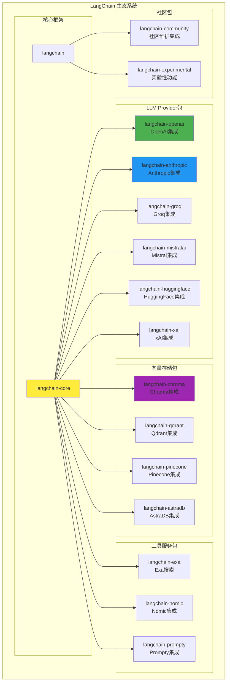
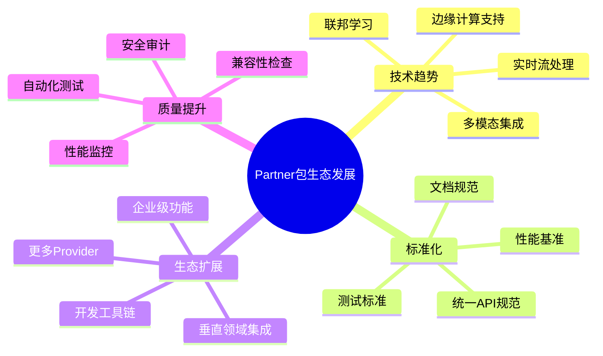

## 概述

LangChain Partner包是LangChain生态系统的重要组成部分，通过标准化的集成接口，将各种第三方服务和模型无缝集成到LangChain框架中。Partner包的设计理念、实现模式和扩展机制。

<!--more-->

## 1. Partner包生态架构

### 1.1 生态系统概览



### 1.2 Partner包设计原则

```python
# Partner包的核心设计原则

class PartnerPackageDesignPrinciples:
    """Partner包设计原则。

    1. 标准化接口：所有Partner包都实现相同的抽象接口
    2. 独立版本：每个包有独立的版本控制和发布周期
    3. 轻量依赖：最小化依赖，避免版本冲突
    4. 向后兼容：保持API的向后兼容性
    5. 文档完整：提供完整的文档和示例
    """

    @staticmethod
    def standard_interface_example():
        """标准化接口示例。"""
        from langchain_core.language_models import BaseChatModel

        # 所有聊天模型都继承自BaseChatModel
        class PartnerChatModel(BaseChatModel):
            def _generate(self, messages, stop=None, run_manager=None, **kwargs):
                # 实现具体的生成逻辑
                pass

            def _llm_type(self):
                return "partner_model"

    @staticmethod
    def independent_versioning_example():
        """独立版本控制示例。"""
        # pyproject.toml
        """
        [project]
        name = "langchain-partner"
        version = "0.1.0"
        dependencies = [
            "langchain-core>=0.1.0,<0.2.0",
            "partner-sdk>=1.0.0",
        ]
        """

    @staticmethod
    def lightweight_dependencies():
        """轻量依赖原则。"""
        # 只依赖必要的包
        required_deps = [
            "langchain-core",  # 核心抽象
            "partner-sdk",     # 第三方SDK
        ]

        optional_deps = [
            "numpy",          # 可选的数值计算
            "pandas",         # 可选的数据处理
        ]
```

## 2. OpenAI集成包深度解析

### 2.1 langchain-openai包结构

```python
# langchain_openai/__init__.py
"""OpenAI集成包的主要入口。

提供OpenAI模型的LangChain集成，包括：
- ChatOpenAI: OpenAI聊天模型
- OpenAI: OpenAI完成模型
- OpenAIEmbeddings: OpenAI嵌入模型
- AzureChatOpenAI: Azure OpenAI聊天模型
- AzureOpenAI: Azure OpenAI完成模型
- AzureOpenAIEmbeddings: Azure OpenAI嵌入模型
"""

from langchain_openai.chat_models import ChatOpenAI, AzureChatOpenAI
from langchain_openai.llms import OpenAI, AzureOpenAI
from langchain_openai.embeddings import OpenAIEmbeddings, AzureOpenAIEmbeddings

__all__ = [
    "ChatOpenAI",
    "AzureChatOpenAI",
    "OpenAI",
    "AzureOpenAI",
    "OpenAIEmbeddings",
    "AzureOpenAIEmbeddings",
]
```

### 2.2 ChatOpenAI实现分析

```python
from typing import Any, Dict, List, Optional, Union, Iterator, AsyncIterator
from langchain_core.language_models import BaseChatModel
from langchain_core.messages import BaseMessage, AIMessage, HumanMessage, SystemMessage
from langchain_core.outputs import ChatGeneration, ChatResult, ChatGenerationChunk
from langchain_core.callbacks import CallbackManagerForLLMRun, AsyncCallbackManagerForLLMRun
import openai

class ChatOpenAI(BaseChatModel):
    """OpenAI聊天模型的LangChain包装器。

    这个类将OpenAI的聊天完成API包装成LangChain的BaseChatModel接口，
    提供统一的调用方式和完整的功能支持。

    主要特性：
    1. 完整的OpenAI API支持：支持所有OpenAI聊天模型
    2. 流式处理：支持实时流式响应
    3. 函数调用：支持OpenAI的函数调用功能
    4. 异步支持：原生异步实现
    5. 错误处理：完善的错误处理和重试机制
    """

    # === 核心配置 ===

    client: Any = Field(default=None, exclude=True)
    """OpenAI客户端实例。"""

    async_client: Any = Field(default=None, exclude=True)
    """异步OpenAI客户端实例。"""

    model_name: str = Field(default="gpt-3.5-turbo", alias="model")
    """要使用的模型名称。"""

    temperature: float = 0.7
    """采样温度，控制输出的随机性。"""

    max_tokens: Optional[int] = None
    """生成的最大token数。"""

    top_p: float = 1
    """核采样参数。"""

    frequency_penalty: float = 0
    """频率惩罚参数。"""

    presence_penalty: float = 0
    """存在惩罚参数。"""

    n: int = 1
    """为每个输入生成的完成数。"""

    request_timeout: Optional[Union[float, Tuple[float, float]]] = None
    """请求超时时间。"""

    max_retries: int = 2
    """最大重试次数。"""

    streaming: bool = False
    """是否使用流式处理。"""

    # === OpenAI特定配置 ===

    openai_api_key: Optional[str] = Field(default=None, alias="api_key")
    """OpenAI API密钥。"""

    openai_api_base: Optional[str] = Field(default=None, alias="base_url")
    """OpenAI API基础URL。"""

    openai_organization: Optional[str] = Field(default=None, alias="organization")
    """OpenAI组织ID。"""

    openai_proxy: Optional[str] = None
    """代理设置。"""

    tiktoken_model_name: Optional[str] = None
    """用于token计数的模型名称。"""

    # === 函数调用支持 ===

    model_kwargs: Dict[str, Any] = Field(default_factory=dict)
    """传递给模型的额外参数。"""

    def __init__(self, **kwargs: Any):
        """初始化ChatOpenAI。

        Args:
            **kwargs: 配置参数。
        """
        super().__init__(**kwargs)

        # 初始化OpenAI客户端
        self._init_clients()

    def _init_clients(self) -> None:
        """初始化OpenAI客户端。"""
        client_params = {
            "api_key": self.openai_api_key,
            "base_url": self.openai_api_base,
            "organization": self.openai_organization,
            "timeout": self.request_timeout,
            "max_retries": self.max_retries,
        }

        # 移除None值
        client_params = {k: v for k, v in client_params.items() if v is not None}

        # 创建同步客户端
        self.client = openai.OpenAI(**client_params)

        # 创建异步客户端
        self.async_client = openai.AsyncOpenAI(**client_params)

    @property
    def _llm_type(self) -> str:
        """返回LLM类型。"""
        return "openai-chat"

    @property
    def _identifying_params(self) -> Dict[str, Any]:
        """获取标识参数。"""
        return {
            "model_name": self.model_name,
            "temperature": self.temperature,
            "max_tokens": self.max_tokens,
            "top_p": self.top_p,
            "frequency_penalty": self.frequency_penalty,
            "presence_penalty": self.presence_penalty,
            "n": self.n,
        }

    def _convert_messages_to_openai_format(
        self, messages: List[BaseMessage]
    ) -> List[Dict[str, Any]]:
        """将LangChain消息转换为OpenAI格式。

        Args:
            messages: LangChain消息列表。

        Returns:
            OpenAI格式的消息列表。
        """
        openai_messages = []

        for message in messages:
            if isinstance(message, HumanMessage):
                role = "user"
            elif isinstance(message, AIMessage):
                role = "assistant"
            elif isinstance(message, SystemMessage):
                role = "system"
            else:
                raise ValueError(f"不支持的消息类型: {type(message)}")

            openai_message = {"role": role, "content": message.content}

            # 处理函数调用
            if hasattr(message, "additional_kwargs") and message.additional_kwargs:
                openai_message.update(message.additional_kwargs)

            openai_messages.append(openai_message)

        return openai_messages

    def _create_chat_result(self, response: Any) -> ChatResult:
        """从OpenAI响应创建ChatResult。

        Args:
            response: OpenAI API响应。

        Returns:
            LangChain ChatResult。
        """
        generations = []

        for choice in response.choices:
            message = choice.message

            # 创建AIMessage
            ai_message = AIMessage(
                content=message.content or "",
                additional_kwargs={
                    k: v for k, v in message.dict().items()
                    if k not in ("content", "role")
                },
            )

            # 创建ChatGeneration
            generation = ChatGeneration(
                message=ai_message,
                generation_info={
                    "finish_reason": choice.finish_reason,
                    "logprobs": getattr(choice, "logprobs", None),
                },
            )
            generations.append(generation)

        # 创建LLM输出信息
        llm_output = {
            "token_usage": response.usage.dict() if response.usage else {},
            "model_name": response.model,
            "system_fingerprint": getattr(response, "system_fingerprint", None),
        }

        return ChatResult(generations=generations, llm_output=llm_output)

    def _generate(
        self,
        messages: List[BaseMessage],
        stop: Optional[List[str]] = None,
        run_manager: Optional[CallbackManagerForLLMRun] = None,
        **kwargs: Any,
    ) -> ChatResult:
        """生成聊天响应。

        Args:
            messages: 输入消息列表。
            stop: 停止序列。
            run_manager: 回调管理器。
            **kwargs: 额外参数。

        Returns:
            聊天结果。
        """
        # 准备请求参数
        openai_messages = self._convert_messages_to_openai_format(messages)

        params = {
            "model": self.model_name,
            "messages": openai_messages,
            "temperature": self.temperature,
            "max_tokens": self.max_tokens,
            "top_p": self.top_p,
            "frequency_penalty": self.frequency_penalty,
            "presence_penalty": self.presence_penalty,
            "n": self.n,
            "stream": False,
        }

        # 添加停止序列
        if stop:
            params["stop"] = stop

        # 添加额外参数
        params.update(self.model_kwargs)
        params.update(kwargs)

        # 调用OpenAI API
        try:
            response = self.client.chat.completions.create(**params)
            return self._create_chat_result(response)
        except Exception as e:
            if run_manager:
                run_manager.on_llm_error(e)
            raise e

    async def _agenerate(
        self,
        messages: List[BaseMessage],
        stop: Optional[List[str]] = None,
        run_manager: Optional[AsyncCallbackManagerForLLMRun] = None,
        **kwargs: Any,
    ) -> ChatResult:
        """异步生成聊天响应。"""
        openai_messages = self._convert_messages_to_openai_format(messages)

        params = {
            "model": self.model_name,
            "messages": openai_messages,
            "temperature": self.temperature,
            "max_tokens": self.max_tokens,
            "top_p": self.top_p,
            "frequency_penalty": self.frequency_penalty,
            "presence_penalty": self.presence_penalty,
            "n": self.n,
            "stream": False,
        }

        if stop:
            params["stop"] = stop

        params.update(self.model_kwargs)
        params.update(kwargs)

        try:
            response = await self.async_client.chat.completions.create(**params)
            return self._create_chat_result(response)
        except Exception as e:
            if run_manager:
                await run_manager.on_llm_error(e)
            raise e

    def _stream(
        self,
        messages: List[BaseMessage],
        stop: Optional[List[str]] = None,
        run_manager: Optional[CallbackManagerForLLMRun] = None,
        **kwargs: Any,
    ) -> Iterator[ChatGenerationChunk]:
        """流式生成聊天响应。

        Args:
            messages: 输入消息列表。
            stop: 停止序列。
            run_manager: 回调管理器。
            **kwargs: 额外参数。

        Yields:
            聊天生成块。
        """
        openai_messages = self._convert_messages_to_openai_format(messages)

        params = {
            "model": self.model_name,
            "messages": openai_messages,
            "temperature": self.temperature,
            "max_tokens": self.max_tokens,
            "top_p": self.top_p,
            "frequency_penalty": self.frequency_penalty,
            "presence_penalty": self.presence_penalty,
            "n": self.n,
            "stream": True,
        }

        if stop:
            params["stop"] = stop

        params.update(self.model_kwargs)
        params.update(kwargs)

        try:
            stream = self.client.chat.completions.create(**params)

            for chunk in stream:
                if not chunk.choices:
                    continue

                choice = chunk.choices[0]
                delta = choice.delta

                # 创建消息块
                message_chunk = AIMessage(
                    content=delta.content or "",
                    additional_kwargs={
                        k: v for k, v in delta.dict().items()
                        if k not in ("content", "role")
                    },
                )

                # 创建生成块
                generation_chunk = ChatGenerationChunk(
                    message=message_chunk,
                    generation_info={
                        "finish_reason": choice.finish_reason,
                    },
                )

                # 触发回调
                if run_manager:
                    run_manager.on_llm_new_token(
                        delta.content or "",
                        chunk=generation_chunk,
                    )

                yield generation_chunk

        except Exception as e:
            if run_manager:
                run_manager.on_llm_error(e)
            raise e

    async def _astream(
        self,
        messages: List[BaseMessage],
        stop: Optional[List[str]] = None,
        run_manager: Optional[AsyncCallbackManagerForLLMRun] = None,
        **kwargs: Any,
    ) -> AsyncIterator[ChatGenerationChunk]:
        """异步流式生成聊天响应。"""
        openai_messages = self._convert_messages_to_openai_format(messages)

        params = {
            "model": self.model_name,
            "messages": openai_messages,
            "temperature": self.temperature,
            "max_tokens": self.max_tokens,
            "top_p": self.top_p,
            "frequency_penalty": self.frequency_penalty,
            "presence_penalty": self.presence_penalty,
            "n": self.n,
            "stream": True,
        }

        if stop:
            params["stop"] = stop

        params.update(self.model_kwargs)
        params.update(kwargs)

        try:
            stream = await self.async_client.chat.completions.create(**params)

            async for chunk in stream:
                if not chunk.choices:
                    continue

                choice = chunk.choices[0]
                delta = choice.delta

                message_chunk = AIMessage(
                    content=delta.content or "",
                    additional_kwargs={
                        k: v for k, v in delta.dict().items()
                        if k not in ("content", "role")
                    },
                )

                generation_chunk = ChatGenerationChunk(
                    message=message_chunk,
                    generation_info={
                        "finish_reason": choice.finish_reason,
                    },
                )

                if run_manager:
                    await run_manager.on_llm_new_token(
                        delta.content or "",
                        chunk=generation_chunk,
                    )

                yield generation_chunk

        except Exception as e:
            if run_manager:
                await run_manager.on_llm_error(e)
            raise e

    # === 函数调用支持 ===

    def bind_functions(
        self,
        functions: List[Dict[str, Any]],
        *,
        function_call: Optional[Union[str, Dict[str, Any]]] = None,
        **kwargs: Any,
    ) -> "ChatOpenAI":
        """绑定函数到模型。

        Args:
            functions: 函数定义列表。
            function_call: 函数调用配置。
            **kwargs: 额外参数。

        Returns:
            绑定了函数的新模型实例。
        """
        extra_kwargs = {
            "functions": functions,
            **kwargs,
        }

        if function_call is not None:
            extra_kwargs["function_call"] = function_call

        return self.bind(**extra_kwargs)

    def bind_tools(
        self,
        tools: List[Union[Dict[str, Any], type, Callable, BaseTool]],
        **kwargs: Any,
    ) -> "ChatOpenAI":
        """绑定工具到模型。

        Args:
            tools: 工具列表。
            **kwargs: 额外参数。

        Returns:
            绑定了工具的新模型实例。
        """
        # 转换工具为OpenAI函数格式
        functions = []
        for tool in tools:
            if isinstance(tool, dict):
                functions.append(tool)
            elif isinstance(tool, type) and issubclass(tool, BaseModel):
                functions.append(convert_pydantic_to_openai_function(tool))
            elif callable(tool):
                functions.append(convert_to_openai_function(tool))
            elif isinstance(tool, BaseTool):
                functions.append(format_tool_to_openai_function(tool))
            else:
                raise ValueError(f"不支持的工具类型: {type(tool)}")

        return self.bind_functions(functions, **kwargs)

    # === Token计算 ===

    def get_num_tokens(self, text: str) -> int:
        """计算文本的token数量。

        Args:
            text: 输入文本。

        Returns:
            token数量。
        """
        try:
            import tiktoken
        except ImportError:
            raise ImportError(
                "tiktoken包是计算token数量所必需的。"
                "请使用 `pip install tiktoken` 安装。"
            )

        model_name = self.tiktoken_model_name or self.model_name

        try:
            encoding = tiktoken.encoding_for_model(model_name)
        except KeyError:
            # 如果模型不支持，使用默认编码
            encoding = tiktoken.get_encoding("cl100k_base")

        return len(encoding.encode(text))

    def get_num_tokens_from_messages(self, messages: List[BaseMessage]) -> int:
        """计算消息列表的token数量。

        Args:
            messages: 消息列表。

        Returns:
            token数量。
        """
        try:
            import tiktoken
        except ImportError:
            raise ImportError(
                "tiktoken包是计算token数量所必需的。"
                "请使用 `pip install tiktoken` 安装。"
            )

        model_name = self.tiktoken_model_name or self.model_name

        try:
            encoding = tiktoken.encoding_for_model(model_name)
        except KeyError:
            encoding = tiktoken.get_encoding("cl100k_base")

        # 计算消息的token数量
        # 这是OpenAI官方推荐的计算方法
        tokens_per_message = 3  # 每条消息的固定开销
        tokens_per_name = 1     # 每个名称的开销

        num_tokens = 0
        for message in messages:
            num_tokens += tokens_per_message

            # 计算内容token
            if message.content:
                num_tokens += len(encoding.encode(message.content))

            # 计算角色token
            if isinstance(message, HumanMessage):
                num_tokens += len(encoding.encode("user"))
            elif isinstance(message, AIMessage):
                num_tokens += len(encoding.encode("assistant"))
            elif isinstance(message, SystemMessage):
                num_tokens += len(encoding.encode("system"))

        num_tokens += 3  # 每次回复的固定开销
        return num_tokens
```

## 3. Anthropic集成包分析

### 3.1 langchain-anthropic包特色

```python
# langchain_anthropic/chat_models.py
from typing import Any, Dict, List, Optional, Union, Iterator, AsyncIterator
from langchain_core.language_models import BaseChatModel
from langchain_core.messages import BaseMessage, AIMessage, HumanMessage, SystemMessage
import anthropic

class ChatAnthropic(BaseChatModel):
    """Anthropic聊天模型的LangChain包装器。

    Anthropic的Claude模型具有独特的特性：
    1. 长上下文支持：支持100K+的上下文长度
    2. 安全性优先：内置安全过滤和对齐机制
    3. 推理能力强：在复杂推理任务上表现优异
    4. 多模态支持：支持文本和图像输入

    与OpenAI的主要区别：
    - 消息格式：使用不同的角色和格式约定
    - 系统消息：系统消息的处理方式不同
    - 流式处理：流式响应的格式和处理方式
    - 函数调用：使用工具调用而非函数调用
    """

    # === 核心配置 ===

    client: Any = Field(default=None, exclude=True)
    """Anthropic客户端实例。"""

    async_client: Any = Field(default=None, exclude=True)
    """异步Anthropic客户端实例。"""

    model: str = Field(default="claude-3-sonnet-20240229")
    """要使用的Claude模型名称。"""

    max_tokens: int = 1024
    """生成的最大token数。注意：Anthropic要求明确指定max_tokens。"""

    temperature: Optional[float] = None
    """采样温度。"""

    top_p: Optional[float] = None
    """核采样参数。"""

    top_k: Optional[int] = None
    """Top-k采样参数。"""

    # === Anthropic特定配置 ===

    anthropic_api_key: Optional[str] = Field(default=None, alias="api_key")
    """Anthropic API密钥。"""

    anthropic_api_url: Optional[str] = Field(default=None, alias="base_url")
    """Anthropic API基础URL。"""

    max_retries: int = 2
    """最大重试次数。"""

    timeout: Optional[float] = None
    """请求超时时间。"""

    def __init__(self, **kwargs: Any):
        """初始化ChatAnthropic。"""
        super().__init__(**kwargs)
        self._init_clients()

    def _init_clients(self) -> None:
        """初始化Anthropic客户端。"""
        client_params = {
            "api_key": self.anthropic_api_key,
            "base_url": self.anthropic_api_url,
            "max_retries": self.max_retries,
            "timeout": self.timeout,
        }

        # 移除None值
        client_params = {k: v for k, v in client_params.items() if v is not None}

        self.client = anthropic.Anthropic(**client_params)
        self.async_client = anthropic.AsyncAnthropic(**client_params)

    @property
    def _llm_type(self) -> str:
        """返回LLM类型。"""
        return "anthropic-chat"

    def _convert_messages_to_anthropic_format(
        self, messages: List[BaseMessage]
    ) -> Tuple[Optional[str], List[Dict[str, Any]]]:
        """将LangChain消息转换为Anthropic格式。

        Anthropic的消息格式特点：
        1. 系统消息单独处理，不在messages数组中
        2. 消息必须交替出现（user/assistant/user/assistant...）
        3. 第一条消息必须是user消息

        Args:
            messages: LangChain消息列表。

        Returns:
            (系统消息, Anthropic格式的消息列表) 元组。
        """
        system_message = None
        anthropic_messages = []

        for message in messages:
            if isinstance(message, SystemMessage):
                # 系统消息单独处理
                if system_message is None:
                    system_message = message.content
                else:
                    # 如果有多个系统消息，合并它们
                    system_message += "\n\n" + message.content
            elif isinstance(message, HumanMessage):
                anthropic_messages.append({
                    "role": "user",
                    "content": self._format_message_content(message),
                })
            elif isinstance(message, AIMessage):
                anthropic_messages.append({
                    "role": "assistant",
                    "content": self._format_message_content(message),
                })
            else:
                raise ValueError(f"不支持的消息类型: {type(message)}")

        # 确保消息格式正确
        anthropic_messages = self._ensure_alternating_roles(anthropic_messages)

        return system_message, anthropic_messages

    def _format_message_content(self, message: BaseMessage) -> Union[str, List[Dict[str, Any]]]:
        """格式化消息内容，支持多模态。

        Args:
            message: 输入消息。

        Returns:
            格式化的内容。
        """
        if isinstance(message.content, str):
            return message.content
        elif isinstance(message.content, list):
            # 多模态内容
            formatted_content = []
            for item in message.content:
                if isinstance(item, dict):
                    if item.get("type") == "text":
                        formatted_content.append({
                            "type": "text",
                            "text": item["text"],
                        })
                    elif item.get("type") == "image":
                        formatted_content.append({
                            "type": "image",
                            "source": {
                                "type": "base64",
                                "media_type": item.get("media_type", "image/jpeg"),
                                "data": item["data"],
                            },
                        })
                else:
                    # 纯文本项
                    formatted_content.append({
                        "type": "text",
                        "text": str(item),
                    })
            return formatted_content
        else:
            return str(message.content)

    def _ensure_alternating_roles(
        self, messages: List[Dict[str, Any]]
    ) -> List[Dict[str, Any]]:
        """确保消息角色交替出现。

        Anthropic要求消息必须在user和assistant之间交替。

        Args:
            messages: 原始消息列表。

        Returns:
            处理后的消息列表。
        """
        if not messages:
            return messages

        processed_messages = []
        last_role = None

        for message in messages:
            current_role = message["role"]

            if current_role == last_role:
                # 角色重复，需要合并或插入分隔符
                if current_role == "user":
                    # 合并用户消息
                    if processed_messages:
                        last_message = processed_messages[-1]
                        if isinstance(last_message["content"], str) and isinstance(message["content"], str):
                            last_message["content"] += "\n\n" + message["content"]
                        else:
                            # 复杂内容，添加新消息
                            processed_messages.append(message)
                    else:
                        processed_messages.append(message)
                else:
                    # assistant角色重复，插入空的user消息
                    processed_messages.append({
                        "role": "user",
                        "content": "继续",
                    })
                    processed_messages.append(message)
            else:
                processed_messages.append(message)

            last_role = current_role

        # 确保第一条消息是user消息
        if processed_messages and processed_messages[0]["role"] != "user":
            processed_messages.insert(0, {
                "role": "user",
                "content": "你好",
            })

        return processed_messages

    def _generate(
        self,
        messages: List[BaseMessage],
        stop: Optional[List[str]] = None,
        run_manager: Optional[CallbackManagerForLLMRun] = None,
        **kwargs: Any,
    ) -> ChatResult:
        """生成聊天响应。"""
        system_message, anthropic_messages = self._convert_messages_to_anthropic_format(messages)

        # 准备请求参数
        params = {
            "model": self.model,
            "messages": anthropic_messages,
            "max_tokens": self.max_tokens,
        }

        # 添加可选参数
        if system_message:
            params["system"] = system_message

        if self.temperature is not None:
            params["temperature"] = self.temperature

        if self.top_p is not None:
            params["top_p"] = self.top_p

        if self.top_k is not None:
            params["top_k"] = self.top_k

        if stop:
            params["stop_sequences"] = stop

        # 添加额外参数
        params.update(kwargs)

        try:
            response = self.client.messages.create(**params)
            return self._create_chat_result(response)
        except Exception as e:
            if run_manager:
                run_manager.on_llm_error(e)
            raise e

    def _create_chat_result(self, response: Any) -> ChatResult:
        """从Anthropic响应创建ChatResult。

        Args:
            response: Anthropic API响应。

        Returns:
            LangChain ChatResult。
        """
        # 提取内容
        content = ""
        if response.content:
            for content_block in response.content:
                if content_block.type == "text":
                    content += content_block.text

        # 创建AIMessage
        ai_message = AIMessage(
            content=content,
            additional_kwargs={
                "id": response.id,
                "model": response.model,
                "stop_reason": response.stop_reason,
                "stop_sequence": response.stop_sequence,
            },
        )

        # 创建ChatGeneration
        generation = ChatGeneration(
            message=ai_message,
            generation_info={
                "finish_reason": response.stop_reason,
                "model": response.model,
            },
        )

        # 创建LLM输出信息
        llm_output = {
            "token_usage": {
                "input_tokens": response.usage.input_tokens,
                "output_tokens": response.usage.output_tokens,
            },
            "model_name": response.model,
        }

        return ChatResult(generations=[generation], llm_output=llm_output)

    def _stream(
        self,
        messages: List[BaseMessage],
        stop: Optional[List[str]] = None,
        run_manager: Optional[CallbackManagerForLLMRun] = None,
        **kwargs: Any,
    ) -> Iterator[ChatGenerationChunk]:
        """流式生成聊天响应。"""
        system_message, anthropic_messages = self._convert_messages_to_anthropic_format(messages)

        params = {
            "model": self.model,
            "messages": anthropic_messages,
            "max_tokens": self.max_tokens,
            "stream": True,
        }

        if system_message:
            params["system"] = system_message

        if self.temperature is not None:
            params["temperature"] = self.temperature

        if self.top_p is not None:
            params["top_p"] = self.top_p

        if self.top_k is not None:
            params["top_k"] = self.top_k

        if stop:
            params["stop_sequences"] = stop

        params.update(kwargs)

        try:
            stream = self.client.messages.create(**params)

            for event in stream:
                if event.type == "content_block_delta":
                    # 文本内容增量
                    if hasattr(event.delta, 'text'):
                        content = event.delta.text

                        message_chunk = AIMessage(content=content)
                        generation_chunk = ChatGenerationChunk(
                            message=message_chunk,
                            generation_info={"delta_type": "content_block_delta"},
                        )

                        if run_manager:
                            run_manager.on_llm_new_token(content, chunk=generation_chunk)

                        yield generation_chunk

                elif event.type == "message_stop":
                    # 消息结束
                    message_chunk = AIMessage(content="")
                    generation_chunk = ChatGenerationChunk(
                        message=message_chunk,
                        generation_info={
                            "finish_reason": "stop",
                            "delta_type": "message_stop",
                        },
                    )
                    yield generation_chunk

        except Exception as e:
            if run_manager:
                run_manager.on_llm_error(e)
            raise e

    # === 工具调用支持 ===

    def bind_tools(
        self,
        tools: List[Union[Dict[str, Any], type, Callable, BaseTool]],
        **kwargs: Any,
    ) -> "ChatAnthropic":
        """绑定工具到模型。

        Anthropic使用工具调用而非函数调用。

        Args:
            tools: 工具列表。
            **kwargs: 额外参数。

        Returns:
            绑定了工具的新模型实例。
        """
        # 转换工具为Anthropic工具格式
        anthropic_tools = []
        for tool in tools:
            if isinstance(tool, dict):
                anthropic_tools.append(tool)
            elif isinstance(tool, type) and issubclass(tool, BaseModel):
                anthropic_tools.append(convert_pydantic_to_anthropic_tool(tool))
            elif callable(tool):
                anthropic_tools.append(convert_to_anthropic_tool(tool))
            elif isinstance(tool, BaseTool):
                anthropic_tools.append(format_tool_to_anthropic_tool(tool))
            else:
                raise ValueError(f"不支持的工具类型: {type(tool)}")

        return self.bind(tools=anthropic_tools, **kwargs)
```

## 4. 向量存储集成包

### 4.1 Chroma集成包分析

```python
# langchain_chroma/vectorstores.py
from typing import Any, Dict, List, Optional, Union, Tuple
from langchain_core.vectorstores import VectorStore
from langchain_core.documents import Document
from langchain_core.embeddings import Embeddings
import chromadb

class Chroma(VectorStore):
    """Chroma向量数据库的LangChain集成。

    Chroma是一个开源的向量数据库，专为AI应用设计：
    1. 简单易用：最小化配置，开箱即用
    2. 高性能：优化的向量搜索和存储
    3. 可扩展：支持从原型到生产的扩展
    4. 多模态：支持文本、图像等多种数据类型

    主要特性：
    - 内存和持久化存储
    - 多种距离度量（余弦、欧几里得、内积）
    - 元数据过滤
    - 集合管理
    - 批量操作
    """

    def __init__(
        self,
        collection_name: str = "langchain",
        embedding_function: Optional[Embeddings] = None,
        persist_directory: Optional[str] = None,
        client_settings: Optional[chromadb.config.Settings] = None,
        collection_metadata: Optional[Dict] = None,
        client: Optional[chromadb.Client] = None,
        relevance_score_fn: Optional[Callable[[float], float]] = None,
    ):
        """初始化Chroma向量存储。

        Args:
            collection_name: 集合名称。
            embedding_function: 嵌入函数。
            persist_directory: 持久化目录。
            client_settings: 客户端设置。
            collection_metadata: 集合元数据。
            client: Chroma客户端实例。
            relevance_score_fn: 相关性分数函数。
        """
        try:
            import chromadb
            import chromadb.config
        except ImportError:
            raise ImportError(
                "无法导入chromadb，请使用 `pip install chromadb` 安装。"
            )

        if client is not None:
            self._client = client
        else:
            if client_settings:
                self._client = chromadb.Client(client_settings)
            elif persist_directory:
                self._client = chromadb.PersistentClient(path=persist_directory)
            else:
                self._client = chromadb.Client()

        self._collection_name = collection_name
        self._embedding_function = embedding_function
        self._collection_metadata = collection_metadata
        self._relevance_score_fn = relevance_score_fn

        # 获取或创建集合
        self._collection = self._get_or_create_collection()

    def _get_or_create_collection(self) -> chromadb.Collection:
        """获取或创建Chroma集合。

        Returns:
            Chroma集合实例。
        """
        try:
            # 尝试获取现有集合
            collection = self._client.get_collection(
                name=self._collection_name,
                embedding_function=self._get_chroma_embedding_function(),
            )
        except ValueError:
            # 集合不存在，创建新集合
            collection = self._client.create_collection(
                name=self._collection_name,
                embedding_function=self._get_chroma_embedding_function(),
                metadata=self._collection_metadata,
            )

        return collection

    def _get_chroma_embedding_function(self) -> Optional[Any]:
        """获取Chroma嵌入函数。

        Returns:
            Chroma嵌入函数或None。
        """
        if self._embedding_function is None:
            return None

        # 包装LangChain嵌入函数为Chroma格式
        class ChromaEmbeddingFunction:
            def __init__(self, langchain_embedding: Embeddings):
                self.langchain_embedding = langchain_embedding

            def __call__(self, input: List[str]) -> List[List[float]]:
                return self.langchain_embedding.embed_documents(input)

        return ChromaEmbeddingFunction(self._embedding_function)

    def add_texts(
        self,
        texts: List[str],
        metadatas: Optional[List[Dict]] = None,
        ids: Optional[List[str]] = None,
        **kwargs: Any,
    ) -> List[str]:
        """向向量存储添加文本。

        Args:
            texts: 要添加的文本列表。
            metadatas: 可选的元数据列表。
            ids: 可选的ID列表。
            **kwargs: 额外参数。

        Returns:
            添加的文档ID列表。
        """
        # 生成ID（如果未提供）
        if ids is None:
            import uuid
            ids = [str(uuid.uuid4()) for _ in texts]

        # 准备嵌入
        embeddings = None
        if self._embedding_function:
            embeddings = self._embedding_function.embed_documents(texts)

        # 添加到Chroma
        self._collection.add(
            documents=texts,
            metadatas=metadatas,
            ids=ids,
            embeddings=embeddings,
        )

        return ids

    def similarity_search(
        self,
        query: str,
        k: int = 4,
        filter: Optional[Dict[str, str]] = None,
        **kwargs: Any,
    ) -> List[Document]:
        """返回与查询最相似的文档。

        Args:
            query: 查询字符串。
            k: 返回的文档数量。
            filter: 元数据过滤器。
            **kwargs: 额外参数。

        Returns:
            最相似的文档列表。
        """
        # 生成查询嵌入
        if self._embedding_function:
            query_embedding = self._embedding_function.embed_query(query)
        else:
            query_embedding = None

        # 执行搜索
        results = self._collection.query(
            query_texts=[query] if query_embedding is None else None,
            query_embeddings=[query_embedding] if query_embedding else None,
            n_results=k,
            where=filter,
            **kwargs,
        )

        # 转换结果为Document对象
        documents = []
        for i in range(len(results["documents"][0])):
            metadata = results["metadatas"][0][i] if results["metadatas"][0] else {}
            doc = Document(
                page_content=results["documents"][0][i],
                metadata=metadata,
            )
            documents.append(doc)

        return documents

    def similarity_search_with_score(
        self,
        query: str,
        k: int = 4,
        filter: Optional[Dict[str, str]] = None,
        **kwargs: Any,
    ) -> List[Tuple[Document, float]]:
        """返回与查询最相似的文档及其相似性分数。

        Args:
            query: 查询字符串。
            k: 返回的文档数量。
            filter: 元数据过滤器。
            **kwargs: 额外参数。

        Returns:
            (文档, 相似性分数) 元组列表。
        """
        if self._embedding_function:
            query_embedding = self._embedding_function.embed_query(query)
        else:
            query_embedding = None

        results = self._collection.query(
            query_texts=[query] if query_embedding is None else None,
            query_embeddings=[query_embedding] if query_embedding else None,
            n_results=k,
            where=filter,
            include=["documents", "metadatas", "distances"],
            **kwargs,
        )

        documents_with_scores = []
        for i in range(len(results["documents"][0])):
            metadata = results["metadatas"][0][i] if results["metadatas"][0] else {}
            doc = Document(
                page_content=results["documents"][0][i],
                metadata=metadata,
            )

            # 转换距离为相似性分数
            distance = results["distances"][0][i]
            if self._relevance_score_fn:
                score = self._relevance_score_fn(distance)
            else:
                # 默认：距离越小，相似性越高
                score = 1.0 - distance

            documents_with_scores.append((doc, score))

        return documents_with_scores

    def max_marginal_relevance_search(
        self,
        query: str,
        k: int = 4,
        fetch_k: int = 20,
        lambda_mult: float = 0.5,
        filter: Optional[Dict[str, str]] = None,
        **kwargs: Any,
    ) -> List[Document]:
        """使用最大边际相关性进行搜索。

        MMR算法平衡相关性和多样性：
        1. 首先检索fetch_k个最相关的文档
        2. 然后使用MMR算法选择k个多样化的文档

        Args:
            query: 查询字符串。
            k: 最终返回的文档数量。
            fetch_k: 初始检索的文档数量。
            lambda_mult: 多样性参数（0=最大多样性，1=最大相关性）。
            filter: 元数据过滤器。
            **kwargs: 额外参数。

        Returns:
            多样化的文档列表。
        """
        if self._embedding_function is None:
            raise ValueError("MMR搜索需要嵌入函数")

        # 获取查询嵌入
        query_embedding = self._embedding_function.embed_query(query)

        # 检索候选文档
        results = self._collection.query(
            query_embeddings=[query_embedding],
            n_results=fetch_k,
            where=filter,
            include=["documents", "metadatas", "embeddings"],
            **kwargs,
        )

        if not results["documents"][0]:
            return []

        # 提取嵌入和文档
        embeddings = results["embeddings"][0]
        documents = results["documents"][0]
        metadatas = results["metadatas"][0] or [{}] * len(documents)

        # 执行MMR算法
        selected_indices = self._mmr_search(
            query_embedding,
            embeddings,
            k=k,
            lambda_mult=lambda_mult,
        )

        # 构建结果文档
        selected_documents = []
        for idx in selected_indices:
            doc = Document(
                page_content=documents[idx],
                metadata=metadatas[idx],
            )
            selected_documents.append(doc)

        return selected_documents

    def _mmr_search(
        self,
        query_embedding: List[float],
        embeddings: List[List[float]],
        k: int,
        lambda_mult: float,
    ) -> List[int]:
        """执行最大边际相关性搜索算法。

        Args:
            query_embedding: 查询嵌入。
            embeddings: 候选文档嵌入列表。
            k: 要选择的文档数量。
            lambda_mult: 多样性参数。

        Returns:
            选中的文档索引列表。
        """
        import numpy as np

        # 转换为numpy数组
        query_emb = np.array(query_embedding)
        doc_embs = np.array(embeddings)

        # 计算查询与所有文档的相似性
        query_similarities = np.dot(doc_embs, query_emb) / (
            np.linalg.norm(doc_embs, axis=1) * np.linalg.norm(query_emb)
        )

        # MMR算法
        selected = []
        remaining = list(range(len(embeddings)))

        for _ in range(min(k, len(embeddings))):
            if not remaining:
                break

            if not selected:
                # 选择第一个最相关的文档
                best_idx = remaining[np.argmax(query_similarities[remaining])]
            else:
                # 计算MMR分数
                mmr_scores = []
                for idx in remaining:
                    # 相关性分数
                    relevance = query_similarities[idx]

                    # 多样性分数（与已选文档的最大相似性）
                    max_sim = 0
                    for selected_idx in selected:
                        sim = np.dot(doc_embs[idx], doc_embs[selected_idx]) / (
                            np.linalg.norm(doc_embs[idx]) * np.linalg.norm(doc_embs[selected_idx])
                        )
                        max_sim = max(max_sim, sim)

                    # MMR分数
                    mmr_score = lambda_mult * relevance - (1 - lambda_mult) * max_sim
                    mmr_scores.append(mmr_score)

                # 选择MMR分数最高的文档
                best_idx = remaining[np.argmax(mmr_scores)]

            selected.append(best_idx)
            remaining.remove(best_idx)

        return selected

    def delete(self, ids: Optional[List[str]] = None, **kwargs: Any) -> Optional[bool]:
        """删除文档。

        Args:
            ids: 要删除的文档ID列表。
            **kwargs: 额外参数。

        Returns:
            是否成功删除。
        """
        if ids:
            self._collection.delete(ids=ids)
            return True
        return False

    @classmethod
    def from_texts(
        cls,
        texts: List[str],
        embedding: Embeddings,
        metadatas: Optional[List[Dict]] = None,
        ids: Optional[List[str]] = None,
        collection_name: str = "langchain",
        persist_directory: Optional[str] = None,
        client_settings: Optional[chromadb.config.Settings] = None,
        client: Optional[chromadb.Client] = None,
        **kwargs: Any,
    ) -> "Chroma":
        """从文本列表创建Chroma向量存储。

        Args:
            texts: 文本列表。
            embedding: 嵌入函数。
            metadatas: 元数据列表。
            ids: ID列表。
            collection_name: 集合名称。
            persist_directory: 持久化目录。
            client_settings: 客户端设置。
            client: 客户端实例。
            **kwargs: 额外参数。

        Returns:
            Chroma向量存储实例。
        """
        chroma_instance = cls(
            collection_name=collection_name,
            embedding_function=embedding,
            persist_directory=persist_directory,
            client_settings=client_settings,
            client=client,
            **kwargs,
        )

        chroma_instance.add_texts(texts=texts, metadatas=metadatas, ids=ids)
        return chroma_instance

    @classmethod
    def from_documents(
        cls,
        documents: List[Document],
        embedding: Embeddings,
        ids: Optional[List[str]] = None,
        collection_name: str = "langchain",
        persist_directory: Optional[str] = None,
        client_settings: Optional[chromadb.config.Settings] = None,
        client: Optional[chromadb.Client] = None,
        **kwargs: Any,
    ) -> "Chroma":
        """从文档列表创建Chroma向量存储。

        Args:
            documents: 文档列表。
            embedding: 嵌入函数。
            ids: ID列表。
            collection_name: 集合名称。
            persist_directory: 持久化目录。
            client_settings: 客户端设置。
            client: 客户端实例。
            **kwargs: 额外参数。

        Returns:
            Chroma向量存储实例。
        """
        texts = [doc.page_content for doc in documents]
        metadatas = [doc.metadata for doc in documents]

        return cls.from_texts(
            texts=texts,
            embedding=embedding,
            metadatas=metadatas,
            ids=ids,
            collection_name=collection_name,
            persist_directory=persist_directory,
            client_settings=client_settings,
            client=client,
            **kwargs,
        )
```

## 5. Partner包开发指南

### 5.1 创建新的Partner包

```python
# 创建新Partner包的标准模板

# pyproject.toml
"""
[build-system]
requires = ["poetry-core"]
build-backend = "poetry.core.masonry.api"

[project]
name = "langchain-newpartner"
version = "0.1.0"
description = "LangChain integration for NewPartner"
authors = ["Your Name <your.email@example.com>"]
license = "MIT"
readme = "README.md"
repository = "https://github.com/langchain-ai/langchain"
keywords = ["langchain", "newpartner", "llm"]

dependencies = [
    "langchain-core>=0.1.0,<0.2.0",
    "newpartner-sdk>=1.0.0",
]

[project.optional-dependencies]
test = [
    "pytest>=7.0.0",
    "pytest-asyncio>=0.21.0",
    "pytest-mock>=3.10.0",
]

[tool.pytest.ini_options]
testpaths = ["tests"]
asyncio_mode = "auto"
"""

# langchain_newpartner/__init__.py
"""NewPartner集成包。

提供NewPartner服务的LangChain集成。
"""

from langchain_newpartner.chat_models import ChatNewPartner
from langchain_newpartner.llms import NewPartner
from langchain_newpartner.embeddings import NewPartnerEmbeddings

__all__ = [
    "ChatNewPartner",
    "NewPartner",
    "NewPartnerEmbeddings",
]

# langchain_newpartner/chat_models.py
from typing import Any, Dict, List, Optional, Iterator, AsyncIterator
from langchain_core.language_models import BaseChatModel
from langchain_core.messages import BaseMessage, AIMessage
from langchain_core.outputs import ChatGeneration, ChatResult, ChatGenerationChunk
from langchain_core.callbacks import CallbackManagerForLLMRun, AsyncCallbackManagerForLLMRun
import newpartner_sdk

class ChatNewPartner(BaseChatModel):
    """NewPartner聊天模型的LangChain包装器。

    实现Partner包的标准模式：
    1. 继承BaseChatModel
    2. 实现必需的抽象方法
    3. 提供完整的配置选项
    4. 支持同步和异步操作
    5. 集成回调系统
    """

    # === 核心配置 ===

    client: Any = Field(default=None, exclude=True)
    """NewPartner客户端实例。"""

    async_client: Any = Field(default=None, exclude=True)
    """异步NewPartner客户端实例。"""

    model: str = Field(default="newpartner-default")
    """要使用的模型名称。"""

    api_key: Optional[str] = Field(default=None, alias="newpartner_api_key")
    """NewPartner API密钥。"""

    base_url: Optional[str] = Field(default=None)
    """API基础URL。"""

    temperature: float = 0.7
    """采样温度。"""

    max_tokens: Optional[int] = None
    """最大生成token数。"""

    def __init__(self, **kwargs: Any):
        """初始化ChatNewPartner。"""
        super().__init__(**kwargs)
        self._init_clients()

    def _init_clients(self) -> None:
        """初始化客户端。"""
        client_params = {
            "api_key": self.api_key,
            "base_url": self.base_url,
        }

        # 移除None值
        client_params = {k: v for k, v in client_params.items() if v is not None}

        self.client = newpartner_sdk.Client(**client_params)
        self.async_client = newpartner_sdk.AsyncClient(**client_params)

    @property
    def _llm_type(self) -> str:
        """返回LLM类型。"""
        return "newpartner-chat"

    def _generate(
        self,
        messages: List[BaseMessage],
        stop: Optional[List[str]] = None,
        run_manager: Optional[CallbackManagerForLLMRun] = None,
        **kwargs: Any,
    ) -> ChatResult:
        """生成聊天响应。"""
        # 转换消息格式
        newpartner_messages = self._convert_messages(messages)

        # 准备请求参数
        params = {
            "model": self.model,
            "messages": newpartner_messages,
            "temperature": self.temperature,
        }

        if self.max_tokens:
            params["max_tokens"] = self.max_tokens

        if stop:
            params["stop"] = stop

        params.update(kwargs)

        try:
            # 调用API
            response = self.client.chat.completions.create(**params)
            return self._create_chat_result(response)
        except Exception as e:
            if run_manager:
                run_manager.on_llm_error(e)
            raise e

    async def _agenerate(
        self,
        messages: List[BaseMessage],
        stop: Optional[List[str]] = None,
        run_manager: Optional[AsyncCallbackManagerForLLMRun] = None,
        **kwargs: Any,
    ) -> ChatResult:
        """异步生成聊天响应。"""
        newpartner_messages = self._convert_messages(messages)

        params = {
            "model": self.model,
            "messages": newpartner_messages,
            "temperature": self.temperature,
        }

        if self.max_tokens:
            params["max_tokens"] = self.max_tokens

        if stop:
            params["stop"] = stop

        params.update(kwargs)

        try:
            response = await self.async_client.chat.completions.create(**params)
            return self._create_chat_result(response)
        except Exception as e:
            if run_manager:
                await run_manager.on_llm_error(e)
            raise e

    def _convert_messages(self, messages: List[BaseMessage]) -> List[Dict[str, Any]]:
        """转换消息格式。"""
        # 实现消息格式转换逻辑
        converted = []
        for message in messages:
            # 根据NewPartner的API格式转换
            converted.append({
                "role": self._get_message_role(message),
                "content": message.content,
            })
        return converted

    def _get_message_role(self, message: BaseMessage) -> str:
        """获取消息角色。"""
        # 根据消息类型返回相应的角色
        if isinstance(message, HumanMessage):
            return "user"
        elif isinstance(message, AIMessage):
            return "assistant"
        elif isinstance(message, SystemMessage):
            return "system"
        else:
            raise ValueError(f"不支持的消息类型: {type(message)}")

    def _create_chat_result(self, response: Any) -> ChatResult:
        """创建聊天结果。"""
        # 从API响应创建LangChain ChatResult
        content = response.choices[0].message.content

        ai_message = AIMessage(content=content)
        generation = ChatGeneration(message=ai_message)

        return ChatResult(generations=[generation])
```

### 5.2 测试和质量保证

```python
# tests/test_chat_models.py
import pytest
from unittest.mock import Mock, patch
from langchain_newpartner import ChatNewPartner
from langchain_core.messages import HumanMessage, AIMessage

class TestChatNewPartner:
    """ChatNewPartner测试套件。

    Partner包的标准测试模式：
    1. 单元测试：测试核心功能
    2. 集成测试：测试与第三方API的集成
    3. 异步测试：测试异步功能
    4. 错误处理测试：测试异常情况
    5. 回调测试：测试回调机制
    """

    def test_init(self):
        """测试初始化。"""
        model = ChatNewPartner(
            api_key="test-key",
            model="test-model",
        )

        assert model.api_key == "test-key"
        assert model.model == "test-model"
        assert model._llm_type == "newpartner-chat"

    @patch('newpartner_sdk.Client')
    def test_generate(self, mock_client):
        """测试生成功能。"""
        # 模拟API响应
        mock_response = Mock()
        mock_response.choices = [Mock()]
        mock_response.choices[0].message.content = "Hello, world!"

        mock_client.return_value.chat.completions.create.return_value = mock_response

        # 创建模型实例
        model = ChatNewPartner(api_key="test-key")

        # 测试生成
        messages = [HumanMessage(content="Hello")]
        result = model._generate(messages)

        assert len(result.generations) == 1
        assert result.generations[0].message.content == "Hello, world!"

        # 验证API调用
        mock_client.return_value.chat.completions.create.assert_called_once()

    @pytest.mark.asyncio
    @patch('newpartner_sdk.AsyncClient')
    async def test_agenerate(self, mock_async_client):
        """测试异步生成功能。"""
        # 模拟异步API响应
        mock_response = Mock()
        mock_response.choices = [Mock()]
        mock_response.choices[0].message.content = "Hello, async world!"

        mock_async_client.return_value.chat.completions.create.return_value = mock_response

        model = ChatNewPartner(api_key="test-key")

        messages = [HumanMessage(content="Hello")]
        result = await model._agenerate(messages)

        assert len(result.generations) == 1
        assert result.generations[0].message.content == "Hello, async world!"

    def test_convert_messages(self):
        """测试消息转换。"""
        model = ChatNewPartner(api_key="test-key")

        messages = [
            HumanMessage(content="Hello"),
            AIMessage(content="Hi there!"),
        ]

        converted = model._convert_messages(messages)

        assert len(converted) == 2
        assert converted[0]["role"] == "user"
        assert converted[0]["content"] == "Hello"
        assert converted[1]["role"] == "assistant"
        assert converted[1]["content"] == "Hi there!"

    @patch('newpartner_sdk.Client')
    def test_error_handling(self, mock_client):
        """测试错误处理。"""
        # 模拟API错误
        mock_client.return_value.chat.completions.create.side_effect = Exception("API Error")

        model = ChatNewPartner(api_key="test-key")
        messages = [HumanMessage(content="Hello")]

        with pytest.raises(Exception, match="API Error"):
            model._generate(messages)

    def test_callback_integration(self):
        """测试回调集成。"""
        from langchain_core.callbacks import CallbackManagerForLLMRun

        # 创建模拟回调管理器
        run_manager = Mock(spec=CallbackManagerForLLMRun)

        with patch('newpartner_sdk.Client') as mock_client:
            # 模拟API错误
            mock_client.return_value.chat.completions.create.side_effect = Exception("Test Error")

            model = ChatNewPartner(api_key="test-key")
            messages = [HumanMessage(content="Hello")]

            with pytest.raises(Exception):
                model._generate(messages, run_manager=run_manager)

            # 验证错误回调被调用
            run_manager.on_llm_error.assert_called_once()

# tests/integration_tests/test_newpartner_integration.py
import pytest
import os
from langchain_newpartner import ChatNewPartner
from langchain_core.messages import HumanMessage

@pytest.mark.skipif(
    not os.getenv("NEWPARTNER_API_KEY"),
    reason="需要NEWPARTNER_API_KEY环境变量"
)
class TestNewPartnerIntegration:
    """NewPartner集成测试。

    这些测试需要真实的API密钥，通常在CI/CD环境中运行。
    """

    def test_real_api_call(self):
        """测试真实API调用。"""
        model = ChatNewPartner(
            api_key=os.getenv("NEWPARTNER_API_KEY"),
        )

        messages = [HumanMessage(content="Hello, how are you?")]
        result = model._generate(messages)

        assert len(result.generations) > 0
        assert result.generations[0].message.content

    @pytest.mark.asyncio
    async def test_real_async_api_call(self):
        """测试真实异步API调用。"""
        model = ChatNewPartner(
            api_key=os.getenv("NEWPARTNER_API_KEY"),
        )

        messages = [HumanMessage(content="Hello, how are you?")]
        result = await model._agenerate(messages)

        assert len(result.generations) > 0
        assert result.generations[0].message.content
```

## 6. 总结

### 6.1 Partner包生态优势

LangChain Partner包生态系统的设计体现了现代软件架构的最佳实践：

1. **标准化集成**：统一的抽象接口确保一致的开发体验
2. **独立演进**：每个包独立版本控制，避免依赖冲突
3. **轻量化设计**：最小化依赖，提高安装和使用效率
4. **质量保证**：完整的测试覆盖和文档支持
5. **社区驱动**：开放的贡献模式和维护机制

### 6.2 生态系统发展趋势




通过深入理解Partner包的设计模式和实现机制，开发者能够更好地利用LangChain的生态系统，构建强大而灵活的AI应用，同时也能够贡献自己的集成包，丰富整个生态系统。

