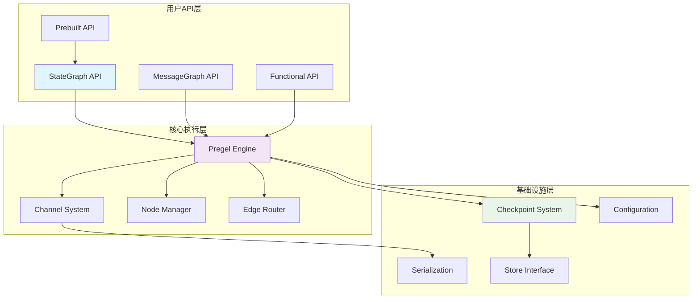
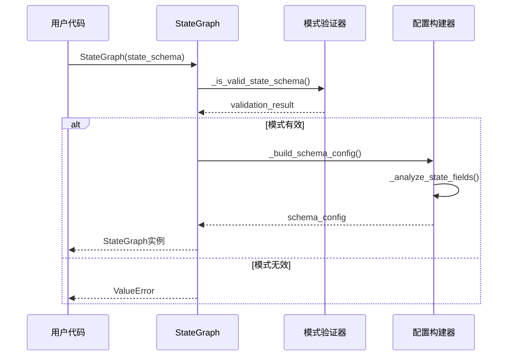

## 概述

本文将深入分析LangGraph框架的对外API，从用户调用的入口函数开始，追踪完整的调用链路，详细解析每个关键函数的实现和功能。通过源码级别的分析，帮助开发者深入理解LangGraph的内部工作机制。

<!--more-->

## 1. 整体API架构

### 1.1 API分层结构



### 1.2 核心API概览

| API类别 | 主要接口 | 功能描述 | 使用场景 |
|---------|----------|----------|----------|
| StateGraph | `StateGraph()`, `add_node()`, `compile()` | 状态图构建和编译 | 复杂工作流构建 |
| MessageGraph | `MessageGraph()`, `add_messages()` | 消息流处理 | 对话系统 |
| Execution | `invoke()`, `stream()`, `astream()` | 图执行控制 | 运行时执行 |
| Checkpoint | `get_state()`, `update_state()` | 状态管理 | 持久化和恢复 |
| Prebuilt | `create_react_agent()`, `ToolNode()` | 预构建组件 | 快速开发 |

## 2. StateGraph API深度解析

### 2.1 StateGraph构造函数

#### 入口函数

```python
# 文件：langgraph/graph/state.py
class StateGraph(Generic[N]):
    """状态图构建器
    
    StateGraph是LangGraph的核心API，负责构建和管理状态驱动的计算图。
    它提供了声明式的图构建接口，支持复杂的控制流和状态管理。
    """
    
    def __init__(
        self,
        state_schema: Type[N],
        config_schema: Optional[Type[C]] = None,
    ) -> None:
        """初始化状态图
        
        Args:
            state_schema: 状态模式，必须是TypedDict或Pydantic模型
            config_schema: 可选的配置模式
            
        调用链路：
        1. 验证状态模式
        2. 初始化内部数据结构
        3. 设置默认配置
        """
        # 验证状态模式
        if not self._is_valid_state_schema(state_schema):
            raise ValueError(f"Invalid state schema: {state_schema}")
        
        self.state_schema = state_schema
        self.config_schema = config_schema
        
        # 初始化图结构
        self.nodes: Dict[str, PregelNode] = {}
        self.edges: Set[tuple[str, str]] = set()
        self.branches: Dict[str, Branch[N]] = {}
        self.support_multiple_edges = False
        
        # 入口和出口点
        self.entry_point: Optional[str] = None
        self.finish_point: Optional[str] = None
        
        # 中断配置
        self.interrupt_before_nodes: List[str] = []
        self.interrupt_after_nodes: List[str] = []
        
        # 内部状态
        self._compiled = False
        self._schema_config = self._build_schema_config()
    
    def _is_valid_state_schema(self, schema: Type) -> bool:
        """验证状态模式是否有效
        
        Args:
            schema: 要验证的模式类型
            
        Returns:
            bool: 是否为有效的状态模式
        """
        # 检查是否为TypedDict
        if hasattr(schema, '__annotations__') and hasattr(schema, '__total__'):
            return True
        
        # 检查是否为Pydantic模型
        try:
            from pydantic import BaseModel
            if issubclass(schema, BaseModel):
                return True
        except ImportError:
            pass
        
        # 检查是否为dataclass
        import dataclasses
        if dataclasses.is_dataclass(schema):
            return True
        
        return False
    
    def _build_schema_config(self) -> Dict[str, Any]:
        """构建模式配置
        
        Returns:
            Dict[str, Any]: 模式配置字典
        """
        config = {
            "state_schema": self.state_schema,
            "config_schema": self.config_schema,
        }
        
        # 分析状态字段
        if hasattr(self.state_schema, '__annotations__'):
            config["state_fields"] = self._analyze_state_fields(
                self.state_schema.__annotations__
            )
        
        return config
    
    def _analyze_state_fields(self, annotations: Dict[str, Any]) -> Dict[str, Dict]:
        """分析状态字段配置
        
        Args:
            annotations: 类型注解字典
            
        Returns:
            Dict[str, Dict]: 字段配置映射
        """
        fields = {}
        
        for field_name, field_type in annotations.items():
            field_config = {
                "type": field_type,
                "reducer": None,
                "default": None
            }
            
            # 检查是否为Annotated类型
            if hasattr(field_type, '__origin__') and hasattr(field_type, '__metadata__'):
                # 提取reducer函数
                for metadata in field_type.__metadata__:
                    if callable(metadata):
                        field_config["reducer"] = metadata
                        break
            
            fields[field_name] = field_config
        
        return fields
```

#### 关键调用链路



### 2.2 add_node方法

#### 入口函数

```python
def add_node(
    self,
    node: Union[str, RunnableLike],
    action: Optional[RunnableLike] = None,
    *,
    metadata: Optional[Dict[str, Any]] = None,
    input: Optional[Type[Any]] = None,
    retry: Optional[RetryPolicy] = None,
) -> "StateGraph[N]":
    """添加节点到状态图
    
    Args:
        node: 节点名称或可运行对象
        action: 节点执行动作（如果node是字符串）
        metadata: 节点元数据
        input: 输入类型约束
        retry: 重试策略
        
    Returns:
        StateGraph[N]: 支持链式调用的图实例
        
    调用链路：
    1. 参数规范化和验证
    2. 创建PregelNode实例
    3. 注册到节点映射
    4. 更新图结构
    """
    if self._compiled:
        raise ValueError("Cannot add nodes to a compiled graph")
    
    # 参数规范化
    if isinstance(node, str):
        if action is None:
            raise ValueError("Action is required when node is a string")
        node_name = node
        node_action = action
    else:
        # node是可运行对象
        node_name = getattr(node, 'name', None) or str(id(node))
        node_action = node
    
    # 验证节点名称唯一性
    if node_name in self.nodes:
        raise ValueError(f"Node '{node_name}' already exists")
    
    # 创建PregelNode
    pregel_node = self._create_pregel_node(
        name=node_name,
        action=node_action,
        metadata=metadata or {},
        input_type=input,
        retry_policy=retry
    )
    
    # 注册节点
    self.nodes[node_name] = pregel_node
    
    return self

def _create_pregel_node(
    self,
    name: str,
    action: RunnableLike,
    metadata: Dict[str, Any],
    input_type: Optional[Type[Any]],
    retry_policy: Optional[RetryPolicy]
) -> PregelNode:
    """创建Pregel节点实例
    
    Args:
        name: 节点名称
        action: 执行动作
        metadata: 元数据
        input_type: 输入类型
        retry_policy: 重试策略
        
    Returns:
        PregelNode: 创建的节点实例
    """
    # 包装动作为可运行对象
    if not isinstance(action, Runnable):
        action = RunnableLambda(action)
    
    # 应用重试策略
    if retry_policy:
        action = action.with_retry(**retry_policy.to_dict())
    
    # 应用输入类型验证
    if input_type:
        action = action.with_types(input_schema=input_type)
    
    # 创建节点
    node = PregelNode(
        name=name,
        action=action,
        metadata=metadata,
        input_channels=self._get_node_input_channels(name),
        output_channels=self._get_node_output_channels(name),
        triggers=[START] if not self.nodes else [],  # 第一个节点默认为入口
    )
    
    return node

def _get_node_input_channels(self, node_name: str) -> List[str]:
    """获取节点输入通道
    
    Args:
        node_name: 节点名称
        
    Returns:
        List[str]: 输入通道列表
    """
    # 基于状态模式确定输入通道
    if hasattr(self.state_schema, '__annotations__'):
        return list(self.state_schema.__annotations__.keys())
    
    return ["__root__"]  # 默认根通道

def _get_node_output_channels(self, node_name: str) -> List[str]:
    """获取节点输出通道
    
    Args:
        node_name: 节点名称
        
    Returns:
        List[str]: 输出通道列表
    """
    # 输出通道与输入通道相同（状态更新模式）
    return self._get_node_input_channels(node_name)
```

### 2.3 add_edge方法

#### 入口函数

```python
def add_edge(
    self,
    start_key: Union[str, list[str]],
    end_key: str,
) -> "StateGraph[N]":
    """添加无条件边
    
    Args:
        start_key: 起始节点名称或节点列表
        end_key: 结束节点名称或END常量
        
    Returns:
        StateGraph[N]: 支持链式调用的图实例
        
    调用链路：
    1. 验证节点存在性
    2. 检查循环依赖
    3. 添加边到图结构
    4. 更新节点触发器
    """
    if self._compiled:
        raise ValueError("Cannot add edges to a compiled graph")
    
    # 规范化起始节点
    start_nodes = [start_key] if isinstance(start_key, str) else start_key
    
    # 验证节点存在
    for start_node in start_nodes:
        if start_node not in self.nodes and start_node != START:
            raise ValueError(f"Start node '{start_node}' not found")
    
    if end_key not in self.nodes and end_key != END:
        raise ValueError(f"End node '{end_key}' not found")
    
    # 检查循环依赖
    for start_node in start_nodes:
        if self._would_create_cycle(start_node, end_key):
            raise ValueError(f"Adding edge {start_node} -> {end_key} would create a cycle")
    
    # 添加边
    for start_node in start_nodes:
        edge = (start_node, end_key)
        self.edges.add(edge)
        
        # 更新目标节点的触发器
        if end_key in self.nodes:
            self.nodes[end_key].triggers.append(start_node)
    
    return self

def _would_create_cycle(self, start: str, end: str) -> bool:
    """检查添加边是否会创建循环
    
    Args:
        start: 起始节点
        end: 结束节点
        
    Returns:
        bool: 是否会创建循环
    """
    if start == end:
        return True
    
    # 使用DFS检查从end到start是否存在路径
    visited = set()
    
    def dfs(current: str) -> bool:
        if current == start:
            return True
        
        if current in visited:
            return False
        
        visited.add(current)
        
        # 检查所有从current出发的边
        for edge_start, edge_end in self.edges:
            if edge_start == current and edge_end != END:
                if dfs(edge_end):
                    return True
        
        return False
    
    return dfs(end)
```

### 2.4 add_conditional_edges方法

#### 入口函数

```python
def add_conditional_edges(
    self,
    start_key: str,
    condition: Union[Callable, str],
    condition_map: Optional[Dict[Hashable, str]] = None,
    then: Optional[str] = None,
) -> "StateGraph[N]":
    """添加条件边
    
    Args:
        start_key: 起始节点名称
        condition: 条件函数或条件表达式
        condition_map: 条件值到目标节点的映射
        then: 默认目标节点
        
    Returns:
        StateGraph[N]: 支持链式调用的图实例
        
    调用链路：
    1. 验证参数有效性
    2. 创建Branch对象
    3. 注册到分支映射
    4. 更新图结构
    """
    if self._compiled:
        raise ValueError("Cannot add conditional edges to a compiled graph")
    
    # 验证起始节点
    if start_key not in self.nodes:
        raise ValueError(f"Start node '{start_key}' not found")
    
    # 处理条件函数
    if isinstance(condition, str):
        # 字符串条件转换为函数
        condition_func = self._create_condition_from_string(condition)
    else:
        condition_func = condition
    
    # 验证条件映射
    if condition_map is None and then is None:
        raise ValueError("Either condition_map or then must be provided")
    
    if condition_map:
        # 验证目标节点存在
        for target in condition_map.values():
            if target not in self.nodes and target != END:
                raise ValueError(f"Target node '{target}' not found")
    
    # 创建分支对象
    branch = self._create_branch(
        start_key=start_key,
        condition=condition_func,
        condition_map=condition_map or {},
        then=then
    )
    
    # 注册分支
    self.branches[start_key] = branch
    
    return self

def _create_condition_from_string(self, condition_str: str) -> Callable:
    """从字符串创建条件函数
    
    Args:
        condition_str: 条件表达式字符串
        
    Returns:
        Callable: 条件函数
    """
    def condition_func(state: Dict[str, Any]) -> str:
        """动态条件函数"""
        try:
            # 安全的表达式求值
            result = eval(condition_str, {"__builtins__": {}}, state)
            return str(result)
        except Exception as e:
            raise ValueError(f"Condition evaluation failed: {e}")
    
    return condition_func

def _create_branch(
    self,
    start_key: str,
    condition: Callable,
    condition_map: Dict[Hashable, str],
    then: Optional[str]
) -> Branch:
    """创建分支对象
    
    Args:
        start_key: 起始节点
        condition: 条件函数
        condition_map: 条件映射
        then: 默认目标
        
    Returns:
        Branch: 分支对象
    """
    # 包装条件函数
    wrapped_condition = self._wrap_condition_function(condition)
    
    # 创建路径映射
    path_map = {}
    for condition_value, target_node in condition_map.items():
        path_map[condition_value] = target_node
    
    # 添加默认路径
    if then:
        path_map[CONDITION_DEFAULT] = then
    
    return Branch(
        path=wrapped_condition,
        path_map=path_map,
        then=then
    )

def _wrap_condition_function(self, condition: Callable) -> RunnableLambda:
    """包装条件函数为可运行对象
    
    Args:
        condition: 原始条件函数
        
    Returns:
        RunnableLambda: 包装后的可运行条件函数
    """
    def wrapped_condition(state: Dict[str, Any]) -> str:
        """包装的条件函数"""
        try:
            result = condition(state)
            
            # 确保返回字符串
            if not isinstance(result, str):
                result = str(result)
            
            return result
            
        except Exception as e:
            # 条件函数执行失败时的处理
            logger.error(f"Condition function failed: {e}")
            return CONDITION_ERROR
    
    return RunnableLambda(wrapped_condition)
```

### 2.5 compile方法

#### 入口函数

```python
def compile(
    self,
    checkpointer: Optional[BaseCheckpointSaver] = None,
    *,
    store: Optional[BaseStore] = None,
    interrupt_before: Optional[Union[All, list[str]]] = None,
    interrupt_after: Optional[Union[All, list[str]]] = None,
    debug: bool = False,
) -> CompiledStateGraph:
    """编译状态图为可执行对象
    
    Args:
        checkpointer: 检查点保存器
        store: 存储接口
        interrupt_before: 在这些节点前中断
        interrupt_after: 在这些节点后中断
        debug: 调试模式
        
    Returns:
        CompiledStateGraph: 编译后的可执行图
        
    调用链路：
    1. 验证图结构完整性
    2. 创建通道系统
    3. 构建Pregel执行器
    4. 返回编译后的图
    """
    if self._compiled:
        raise ValueError("Graph is already compiled")
    
    # 验证图结构
    self._validate_graph_structure()
    
    # 处理中断配置
    interrupt_before_nodes = self._process_interrupt_config(interrupt_before)
    interrupt_after_nodes = self._process_interrupt_config(interrupt_after)
    
    # 创建通道系统
    channels = self._create_channels()
    
    # 构建节点映射
    compiled_nodes = self._compile_nodes()
    
    # 创建Pregel执行器
    pregel = Pregel(
        nodes=compiled_nodes,
        channels=channels,
        input_channels=list(channels.keys()),
        output_channels=list(channels.keys()),
        stream_channels=list(channels.keys()),
        checkpointer=checkpointer,
        store=store,
        interrupt_before=interrupt_before_nodes,
        interrupt_after=interrupt_after_nodes,
        debug=debug,
        step_timeout=None,  # 可配置
        retry_policy=None,  # 可配置
    )
    
    # 标记为已编译
    self._compiled = True
    
    return CompiledStateGraph(pregel)

def _validate_graph_structure(self) -> None:
    """验证图结构的完整性
    
    Raises:
        ValueError: 图结构无效时
    """
    if not self.nodes:
        raise ValueError("Graph must have at least one node")
    
    # 检查入口点
    entry_nodes = self._find_entry_nodes()
    if not entry_nodes:
        raise ValueError("Graph must have at least one entry point")
    
    # 检查可达性
    reachable_nodes = self._find_reachable_nodes(entry_nodes)
    unreachable_nodes = set(self.nodes.keys()) - reachable_nodes
    if unreachable_nodes:
        logger.warning(f"Unreachable nodes found: {unreachable_nodes}")
    
    # 检查死锁
    if self._has_deadlock():
        raise ValueError("Graph contains potential deadlock")

def _find_entry_nodes(self) -> Set[str]:
    """查找入口节点
    
    Returns:
        Set[str]: 入口节点集合
    """
    entry_nodes = set()
    
    # 显式设置的入口点
    if self.entry_point:
        entry_nodes.add(self.entry_point)
    
    # 没有前驱的节点
    nodes_with_predecessors = set()
    for start, end in self.edges:
        if end != END:
            nodes_with_predecessors.add(end)
    
    for branch in self.branches.values():
        for target in branch.path_map.values():
            if target != END:
                nodes_with_predecessors.add(target)
    
    for node_name in self.nodes:
        if node_name not in nodes_with_predecessors:
            entry_nodes.add(node_name)
    
    return entry_nodes

def _create_channels(self) -> Dict[str, BaseChannel]:
    """创建通道系统
    
    Returns:
        Dict[str, BaseChannel]: 通道映射
    """
    channels = {}
    
    # 基于状态模式创建通道
    if hasattr(self.state_schema, '__annotations__'):
        for field_name, field_config in self._schema_config["state_fields"].items():
            channel = self._create_channel_for_field(field_name, field_config)
            channels[field_name] = channel
    else:
        # 默认根通道
        channels["__root__"] = LastValue(self.state_schema)
    
    return channels

def _create_channel_for_field(
    self, 
    field_name: str, 
    field_config: Dict[str, Any]
) -> BaseChannel:
    """为状态字段创建通道
    
    Args:
        field_name: 字段名称
        field_config: 字段配置
        
    Returns:
        BaseChannel: 创建的通道
    """
    field_type = field_config["type"]
    reducer = field_config.get("reducer")
    
    if reducer:
        # 有reducer的字段使用BinaryOperatorAggregate
        return BinaryOperatorAggregate(field_type, reducer)
    else:
        # 无reducer的字段使用LastValue
        return LastValue(field_type)

def _compile_nodes(self) -> Dict[str, PregelNode]:
    """编译节点映射
    
    Returns:
        Dict[str, PregelNode]: 编译后的节点映射
    """
    compiled_nodes = {}
    
    for node_name, node in self.nodes.items():
        # 编译节点动作
        compiled_action = self._compile_node_action(node.action)
        
        # 创建编译后的节点
        compiled_node = PregelNode(
            name=node_name,
            action=compiled_action,
            metadata=node.metadata,
            input_channels=node.input_channels,
            output_channels=node.output_channels,
            triggers=node.triggers,
            retry_policy=getattr(node, 'retry_policy', None),
        )
        
        compiled_nodes[node_name] = compiled_node
    
    return compiled_nodes

def _compile_node_action(self, action: RunnableLike) -> Runnable:
    """编译节点动作
    
    Args:
        action: 原始动作
        
    Returns:
        Runnable: 编译后的可运行动作
    """
    if isinstance(action, Runnable):
        return action
    
    # 包装为RunnableLambda
    return RunnableLambda(action)
```

## 3. Pregel执行引擎API

### 3.1 Pregel构造函数

#### 入口函数

```python
# 文件：langgraph/pregel/__init__.py
class Pregel(Runnable[Union[dict, Any], Union[dict, Any]]):
    """Pregel执行引擎
    
    基于Google Pregel模型的图计算引擎，实现了：
    - 超步执行模型（Bulk Synchronous Parallel）
    - 并行节点处理
    - 消息传递机制
    - 状态一致性保证
    - 检查点和恢复
    """
    
    def __init__(
        self,
        nodes: Mapping[str, PregelNode],
        channels: Mapping[str, BaseChannel],
        input_channels: Union[str, Sequence[str]],
        output_channels: Union[str, Sequence[str]],
        stream_channels: Optional[Union[str, Sequence[str]]] = None,
        checkpointer: Optional[BaseCheckpointSaver] = None,
        store: Optional[BaseStore] = None,
        interrupt_before: Optional[Union[All, Sequence[str]]] = None,
        interrupt_after: Optional[Union[All, Sequence[str]]] = None,
        debug: bool = False,
        step_timeout: Optional[float] = None,
        retry_policy: Optional[RetryPolicy] = None,
    ) -> None:
        """初始化Pregel执行引擎
        
        Args:
            nodes: 节点映射
            channels: 通道映射
            input_channels: 输入通道
            output_channels: 输出通道
            stream_channels: 流式输出通道
            checkpointer: 检查点保存器
            store: 存储接口
            interrupt_before: 中断前节点
            interrupt_after: 中断后节点
            debug: 调试模式
            step_timeout: 步骤超时时间
            retry_policy: 重试策略
        """
        # 验证参数
        self._validate_init_params(nodes, channels, input_channels, output_channels)
        
        # 存储核心组件
        self.nodes = dict(nodes)
        self.channels = dict(channels)
        
        # 规范化通道配置
        self.input_channels = self._normalize_channels(input_channels)
        self.output_channels = self._normalize_channels(output_channels)
        self.stream_channels = self._normalize_channels(stream_channels or output_channels)
        
        # 持久化和存储
        self.checkpointer = checkpointer
        self.store = store
        
        # 中断配置
        self.interrupt_before = self._normalize_interrupt_config(interrupt_before)
        self.interrupt_after = self._normalize_interrupt_config(interrupt_after)
        
        # 执行配置
        self.debug = debug
        self.step_timeout = step_timeout
        self.retry_policy = retry_policy
        
        # 内部状态
        self._schema = self._build_schema()
        self._signature = self._build_signature()
        
        # 性能统计
        self._stats = PregelStats() if debug else None
    
    def _validate_init_params(
        self,
        nodes: Mapping[str, PregelNode],
        channels: Mapping[str, BaseChannel],
        input_channels: Union[str, Sequence[str]],
        output_channels: Union[str, Sequence[str]]
    ) -> None:
        """验证初始化参数
        
        Args:
            nodes: 节点映射
            channels: 通道映射
            input_channels: 输入通道
            output_channels: 输出通道
            
        Raises:
            ValueError: 参数无效时
        """
        if not nodes:
            raise ValueError("At least one node is required")
        
        if not channels:
            raise ValueError("At least one channel is required")
        
        # 验证节点引用的通道存在
        for node_name, node in nodes.items():
            for channel_name in node.input_channels:
                if channel_name not in channels:
                    raise ValueError(f"Node '{node_name}' references unknown input channel '{channel_name}'")
            
            for channel_name in node.output_channels:
                if channel_name not in channels:
                    raise ValueError(f"Node '{node_name}' references unknown output channel '{channel_name}'")
        
        # 验证输入输出通道存在
        for channel_name in self._normalize_channels(input_channels):
            if channel_name not in channels:
                raise ValueError(f"Input channel '{channel_name}' not found")
        
        for channel_name in self._normalize_channels(output_channels):
            if channel_name not in channels:
                raise ValueError(f"Output channel '{channel_name}' not found")
    
    def _normalize_channels(self, channels: Union[str, Sequence[str], None]) -> List[str]:
        """规范化通道配置
        
        Args:
            channels: 通道配置
            
        Returns:
            List[str]: 规范化的通道列表
        """
        if channels is None:
            return []
        elif isinstance(channels, str):
            return [channels]
        else:
            return list(channels)
    
    def _normalize_interrupt_config(
        self, 
        interrupt_config: Optional[Union[All, Sequence[str]]]
    ) -> Set[str]:
        """规范化中断配置
        
        Args:
            interrupt_config: 中断配置
            
        Returns:
            Set[str]: 规范化的中断节点集合
        """
        if interrupt_config is None:
            return set()
        elif interrupt_config is All:
            return set(self.nodes.keys())
        else:
            return set(interrupt_config)
    
    def _build_schema(self) -> Dict[str, Any]:
        """构建执行模式
        
        Returns:
            Dict[str, Any]: 执行模式配置
        """
        return {
            "nodes": {name: node.to_dict() for name, node in self.nodes.items()},
            "channels": {name: channel.to_dict() for name, channel in self.channels.items()},
            "input_channels": self.input_channels,
            "output_channels": self.output_channels,
            "stream_channels": self.stream_channels,
        }
    
    def _build_signature(self) -> RunnableSignature:
        """构建可运行签名
        
        Returns:
            RunnableSignature: 可运行签名
        """
        # 构建输入模式
        input_schema = {}
        for channel_name in self.input_channels:
            channel = self.channels[channel_name]
            input_schema[channel_name] = channel.ValueType
        
        # 构建输出模式
        output_schema = {}
        for channel_name in self.output_channels:
            channel = self.channels[channel_name]
            output_schema[channel_name] = channel.ValueType
        
        return RunnableSignature(
            input_schema=input_schema,
            output_schema=output_schema
        )
```

### 3.2 invoke方法

#### 入口函数

```python
def invoke(
    self,
    input: Union[dict, Any],
    config: Optional[RunnableConfig] = None,
    *,
    stream_mode: StreamMode = "values",
    output_keys: Optional[Union[str, Sequence[str]]] = None,
    interrupt_before: Optional[Union[All, Sequence[str]]] = None,
    interrupt_after: Optional[Union[All, Sequence[str]]] = None,
    debug: Optional[bool] = None,
    **kwargs: Any,
) -> Union[dict, Any]:
    """同步执行图
    
    Args:
        input: 输入数据
        config: 运行配置
        stream_mode: 流模式
        output_keys: 输出键
        interrupt_before: 执行前中断
        interrupt_after: 执行后中断
        debug: 调试模式
        **kwargs: 额外参数
        
    Returns:
        Union[dict, Any]: 执行结果
        
    调用链路：
    1. 参数预处理和验证
    2. 调用stream方法获取流
    3. 消费流并返回最终结果
    """
    # 预处理配置
    config = self._prepare_config(config, debug, interrupt_before, interrupt_after)
    
    # 验证输入
    validated_input = self._validate_input(input)
    
    # 执行流并获取最终结果
    final_result = None
    for chunk in self.stream(
        validated_input,
        config,
        stream_mode=stream_mode,
        output_keys=output_keys,
        **kwargs
    ):
        final_result = chunk
    
    # 处理输出
    if output_keys:
        return self._extract_output_keys(final_result, output_keys)
    
    return final_result

def _prepare_config(
    self,
    config: Optional[RunnableConfig],
    debug: Optional[bool],
    interrupt_before: Optional[Union[All, Sequence[str]]],
    interrupt_after: Optional[Union[All, Sequence[str]]]
) -> RunnableConfig:
    """准备运行配置
    
    Args:
        config: 原始配置
        debug: 调试模式
        interrupt_before: 执行前中断
        interrupt_after: 执行后中断
        
    Returns:
        RunnableConfig: 准备好的配置
    """
    config = config or {}
    
    # 合并中断配置
    if interrupt_before is not None:
        config = {**config, "interrupt_before": self._normalize_interrupt_config(interrupt_before)}
    
    if interrupt_after is not None:
        config = {**config, "interrupt_after": self._normalize_interrupt_config(interrupt_after)}
    
    # 设置调试模式
    if debug is not None:
        config = {**config, "debug": debug}
    
    # 确保有线程ID
    if "configurable" not in config:
        config["configurable"] = {}
    
    if "thread_id" not in config["configurable"]:
        import uuid
        config["configurable"]["thread_id"] = str(uuid.uuid4())
    
    return config

def _validate_input(self, input: Union[dict, Any]) -> dict:
    """验证输入数据
    
    Args:
        input: 输入数据
        
    Returns:
        dict: 验证后的输入数据
        
    Raises:
        ValueError: 输入无效时
    """
    if not isinstance(input, dict):
        # 尝试转换为字典
        if hasattr(input, '__dict__'):
            input = input.__dict__
        else:
            # 包装为根键
            input = {"__root__": input}
    
    # 验证必需的输入通道
    missing_channels = []
    for channel_name in self.input_channels:
        if channel_name not in input:
            channel = self.channels[channel_name]
            if not hasattr(channel, 'default') or channel.default is None:
                missing_channels.append(channel_name)
    
    if missing_channels:
        raise ValueError(f"Missing required input channels: {missing_channels}")
    
    return input
```

### 3.3 stream方法

#### 入口函数

```python
def stream(
    self,
    input: Union[dict, Any],
    config: Optional[RunnableConfig] = None,
    *,
    stream_mode: StreamMode = "values",
    output_keys: Optional[Union[str, Sequence[str]]] = None,
    interrupt_before: Optional[Union[All, Sequence[str]]] = None,
    interrupt_after: Optional[Union[All, Sequence[str]]] = None,
    debug: Optional[bool] = None,
    **kwargs: Any,
) -> Iterator[Union[dict, Any]]:
    """流式执行图
    
    Args:
        input: 输入数据
        config: 运行配置
        stream_mode: 流模式 ("values", "updates", "debug")
        output_keys: 输出键
        interrupt_before: 执行前中断
        interrupt_after: 执行后中断
        debug: 调试模式
        **kwargs: 额外参数
        
    Yields:
        Union[dict, Any]: 流式输出
        
    调用链路：
    1. 准备执行环境
    2. 初始化状态和检查点
    3. 执行超步循环
    4. 流式输出结果
    """
    # 准备配置
    config = self._prepare_config(config, debug, interrupt_before, interrupt_after)
    
    # 验证输入
    validated_input = self._validate_input(input)
    
    # 初始化执行上下文
    execution_context = self._create_execution_context(validated_input, config)
    
    # 执行主循环
    yield from self._execute_stream_loop(execution_context, stream_mode, output_keys)

def _create_execution_context(
    self, 
    input: dict, 
    config: RunnableConfig
) -> ExecutionContext:
    """创建执行上下文
    
    Args:
        input: 输入数据
        config: 运行配置
        
    Returns:
        ExecutionContext: 执行上下文
    """
    # 获取或创建检查点
    checkpoint = self._get_or_create_checkpoint(input, config)
    
    # 创建执行上下文
    context = ExecutionContext(
        config=config,
        checkpoint=checkpoint,
        channels=self._initialize_channels(checkpoint),
        step=0,
        stop_reason=None,
        exception=None,
        interrupt_before=config.get("interrupt_before", self.interrupt_before),
        interrupt_after=config.get("interrupt_after", self.interrupt_after),
        debug=config.get("debug", self.debug),
    )
    
    return context

def _execute_stream_loop(
    self,
    context: ExecutionContext,
    stream_mode: StreamMode,
    output_keys: Optional[Union[str, Sequence[str]]]
) -> Iterator[Union[dict, Any]]:
    """执行流式循环
    
    Args:
        context: 执行上下文
        stream_mode: 流模式
        output_keys: 输出键
        
    Yields:
        Union[dict, Any]: 流式输出
    """
    try:
        # 输出初始状态
        if stream_mode == "values":
            yield self._extract_values(context.checkpoint, output_keys)
        
        # 主执行循环
        while True:
            # 1. 计划阶段：确定活跃任务
            tasks = self._plan_execution_step(context)
            
            if not tasks:
                # 没有更多任务，执行完成
                context.stop_reason = "completed"
                break
            
            # 2. 检查执行前中断
            if self._should_interrupt_before(tasks, context):
                context.stop_reason = "interrupt_before"
                yield self._create_interrupt_output(context, tasks, "before")
                break
            
            # 3. 执行阶段：并行执行任务
            step_results = self._execute_step(tasks, context)
            
            # 4. 更新阶段：应用状态更新
            self._apply_step_results(step_results, context)
            
            # 5. 保存检查点
            if self.checkpointer:
                self._save_checkpoint(context)
            
            # 6. 检查执行后中断
            if self._should_interrupt_after(tasks, context):
                context.stop_reason = "interrupt_after"
                yield self._create_interrupt_output(context, tasks, "after")
                break
            
            # 7. 输出中间结果
            if stream_mode == "values":
                yield self._extract_values(context.checkpoint, output_keys)
            elif stream_mode == "updates":
                yield self._extract_updates(step_results, output_keys)
            elif stream_mode == "debug":
                yield self._create_debug_output(context, tasks, step_results)
            
            # 8. 更新步骤计数
            context.step += 1
            
            # 9. 检查超时和限制
            if self._should_stop_execution(context):
                context.stop_reason = "limit_reached"
                break
    
    except Exception as e:
        context.exception = e
        context.stop_reason = "error"
        
        if context.debug:
            yield self._create_error_output(context, e)
        
        raise
    
    finally:
        # 清理资源
        self._cleanup_execution_context(context)

def _plan_execution_step(self, context: ExecutionContext) -> List[PregelTask]:
    """计划执行步骤
    
    Args:
        context: 执行上下文
        
    Returns:
        List[PregelTask]: 待执行任务列表
    """
    tasks = []
    checkpoint = context.checkpoint
    
    # 检查每个节点是否应该执行
    for node_name, node in self.nodes.items():
        if self._should_execute_node(node, checkpoint, context):
            # 准备节点输入
            node_input = self._prepare_node_input(node, checkpoint)
            
            # 创建任务
            task = PregelTask(
                id=f"{context.step}:{node_name}",
                name=node_name,
                node=node,
                input=node_input,
                config=context.config,
                retry_count=0,
                max_retries=getattr(node, 'max_retries', 3),
            )
            
            tasks.append(task)
    
    return tasks

def _should_execute_node(
    self,
    node: PregelNode,
    checkpoint: Checkpoint,
    context: ExecutionContext
) -> bool:
    """判断节点是否应该执行
    
    Args:
        node: 节点对象
        checkpoint: 当前检查点
        context: 执行上下文
        
    Returns:
        bool: 是否应该执行
    """
    # 检查触发条件
    for trigger in node.triggers:
        if trigger == START:
            # 起始触发器
            if context.step == 0:
                return True
        elif trigger in self.nodes:
            # 节点触发器：检查前驱节点是否已执行
            if self._is_node_completed(trigger, checkpoint):
                return True
    
    # 检查通道更新
    node_versions = checkpoint.get("versions_seen", {}).get(node.name, {})
    for channel_name in node.input_channels:
        channel_version = checkpoint.get("channel_versions", {}).get(channel_name)
        if channel_version and node_versions.get(channel_name) != channel_version:
            return True
    
    return False

def _execute_step(
    self,
    tasks: List[PregelTask],
    context: ExecutionContext
) -> Dict[str, Any]:
    """执行步骤中的所有任务
    
    Args:
        tasks: 任务列表
        context: 执行上下文
        
    Returns:
        Dict[str, Any]: 执行结果
    """
    if not tasks:
        return {}
    
    # 并行执行任务
    if len(tasks) == 1:
        # 单任务直接执行
        task = tasks[0]
        result = self._execute_single_task(task, context)
        return {task.name: result}
    else:
        # 多任务并行执行
        return self._execute_parallel_tasks(tasks, context)

def _execute_single_task(
    self,
    task: PregelTask,
    context: ExecutionContext
) -> Any:
    """执行单个任务
    
    Args:
        task: 要执行的任务
        context: 执行上下文
        
    Returns:
        Any: 任务执行结果
    """
    start_time = time.time()
    
    try:
        # 应用超时
        if self.step_timeout:
            with timeout(self.step_timeout):
                result = self._invoke_node_action(task.node.action, task.input, task.config)
        else:
            result = self._invoke_node_action(task.node.action, task.input, task.config)
        
        # 记录统计信息
        if self._stats:
            self._stats.record_task_success(
                task.name,
                time.time() - start_time,
                len(str(result))
            )
        
        return result
        
    except Exception as e:
        # 记录错误统计
        if self._stats:
            self._stats.record_task_error(task.name, time.time() - start_time, str(e))
        
        # 重试逻辑
        if task.retry_count < task.max_retries:
            task.retry_count += 1
            if context.debug:
                print(f"Retrying task {task.name} (attempt {task.retry_count})")
            
            # 指数退避
            time.sleep(2 ** task.retry_count)
            return self._execute_single_task(task, context)
        
        # 包装为任务错误
        return PregelTaskError(task.name, e, task.retry_count)

def _execute_parallel_tasks(
    self,
    tasks: List[PregelTask],
    context: ExecutionContext
) -> Dict[str, Any]:
    """并行执行多个任务
    
    Args:
        tasks: 任务列表
        context: 执行上下文
        
    Returns:
        Dict[str, Any]: 执行结果映射
    """
    import concurrent.futures
    
    results = {}
    
    # 使用线程池并行执行
    with concurrent.futures.ThreadPoolExecutor(
        max_workers=min(len(tasks), 10)  # 限制并发数
    ) as executor:
        # 提交所有任务
        future_to_task = {
            executor.submit(self._execute_single_task, task, context): task
            for task in tasks
        }
        
        # 收集结果
        for future in concurrent.futures.as_completed(future_to_task):
            task = future_to_task[future]
            try:
                result = future.result()
                results[task.name] = result
            except Exception as e:
                # 任务执行异常
                results[task.name] = PregelTaskError(task.name, e, 0)
    
    return results

def _invoke_node_action(
    self,
    action: Runnable,
    input: Any,
    config: RunnableConfig
) -> Any:
    """调用节点动作
    
    Args:
        action: 节点动作
        input: 输入数据
        config: 运行配置
        
    Returns:
        Any: 执行结果
    """
    try:
        # 同步调用
        if hasattr(action, 'invoke'):
            return action.invoke(input, config)
        elif callable(action):
            return action(input)
        else:
            raise ValueError(f"Invalid action type: {type(action)}")
    
    except Exception as e:
        # 增强错误信息
        raise RuntimeError(f"Node action execution failed: {e}") from e
```

## 4. 检查点系统API

### 4.1 BaseCheckpointSaver接口

#### 核心方法实现

```python
# 文件：langgraph/checkpoint/base.py
class BaseCheckpointSaver(Generic[V]):
    """检查点保存器基类
    
    定义了检查点系统的核心接口，支持：
    - 状态持久化和恢复
    - 版本管理和历史追踪
    - 多线程和多租户隔离
    - 增量更新和优化
    """
    
    serde: SerializerProtocol = JsonPlusSerializer()
    
    def __init__(
        self,
        *,
        serde: Optional[SerializerProtocol] = None,
    ) -> None:
        """初始化检查点保存器
        
        Args:
            serde: 序列化器实例
        """
        if serde is not None:
            self.serde = serde
        
        # 添加类型化方法支持
        self.serde = maybe_add_typed_methods(self.serde)
    
    def get_tuple(self, config: RunnableConfig) -> Optional[CheckpointTuple]:
        """获取检查点元组（核心接口方法）
        
        Args:
            config: 运行配置，包含thread_id和checkpoint_id
            
        Returns:
            Optional[CheckpointTuple]: 检查点元组或None
            
        调用链路：
        1. 解析配置参数
        2. 查询存储后端
        3. 反序列化数据
        4. 构建检查点元组
        """
        raise NotImplementedError("Subclasses must implement get_tuple")
    
    def list(
        self,
        config: Optional[RunnableConfig],
        *,
        filter: Optional[Dict[str, Any]] = None,
        before: Optional[RunnableConfig] = None,
        limit: Optional[int] = None,
    ) -> Iterator[CheckpointTuple]:
        """列出检查点（核心接口方法）
        
        Args:
            config: 基础配置
            filter: 过滤条件
            before: 获取此配置之前的检查点
            limit: 限制数量
            
        Yields:
            CheckpointTuple: 匹配的检查点元组
            
        调用链路：
        1. 构建查询条件
        2. 执行存储查询
        3. 分页和排序
        4. 流式返回结果
        """
        raise NotImplementedError("Subclasses must implement list")
    
    def put(
        self,
        config: RunnableConfig,
        checkpoint: Checkpoint,
        metadata: CheckpointMetadata,
        new_versions: ChannelVersions,
    ) -> RunnableConfig:
        """保存检查点（核心接口方法）
        
        Args:
            config: 运行配置
            checkpoint: 检查点数据
            metadata: 元数据
            new_versions: 新版本信息
            
        Returns:
            RunnableConfig: 更新后的配置
            
        调用链路：
        1. 生成检查点ID
        2. 序列化数据
        3. 存储到后端
        4. 更新版本信息
        """
        raise NotImplementedError("Subclasses must implement put")
    
    def put_writes(
        self,
        config: RunnableConfig,
        writes: Sequence[Tuple[str, Any]],
        task_id: str,
    ) -> None:
        """保存写入操作（核心接口方法）
        
        Args:
            config: 运行配置
            writes: 写入操作序列
            task_id: 任务ID
            
        调用链路：
        1. 验证写入数据
        2. 序列化写入操作
        3. 关联到检查点
        4. 存储到后端
        """
        raise NotImplementedError("Subclasses must implement put_writes")
    
    # 便利方法
    def get(self, config: RunnableConfig) -> Optional[Checkpoint]:
        """获取检查点数据
        
        Args:
            config: 运行配置
            
        Returns:
            Optional[Checkpoint]: 检查点数据或None
        """
        if value := self.get_tuple(config):
            return value.checkpoint
        return None
    
    def get_metadata(self, config: RunnableConfig) -> Optional[CheckpointMetadata]:
        """获取检查点元数据
        
        Args:
            config: 运行配置
            
        Returns:
            Optional[CheckpointMetadata]: 元数据或None
        """
        if value := self.get_tuple(config):
            return value.metadata
        return None
```

### 4.2 PostgresCheckpointSaver实现

#### 核心方法实现

```python
# 文件：langgraph/checkpoint/postgres/base.py
class PostgresCheckpointSaver(BaseCheckpointSaver[str]):
    """PostgreSQL检查点保存器实现
    
    提供生产级的检查点持久化能力：
    - ACID事务保证
    - 高并发支持
    - 数据压缩和优化
    - 自动迁移和版本管理
    """
    
    def __init__(
        self,
        conn: Union[Connection, ConnectionPool],
        pipe: Optional[Pipeline] = None,
        serde: Optional[SerializerProtocol] = None,
    ) -> None:
        """初始化PostgreSQL检查点保存器
        
        Args:
            conn: 数据库连接或连接池
            pipe: 可选的Pipeline用于批量操作
            serde: 序列化器
        """
        super().__init__(serde=serde)
        
        # 验证连接配置
        if isinstance(conn, ConnectionPool) and pipe is not None:
            raise ValueError("Pipeline should be used only with Connection, not ConnectionPool")
        
        self.conn = conn
        self.pipe = pipe
        self.lock = threading.Lock()
        
        # 功能检测
        self.supports_pipeline = self._detect_pipeline_support()
    
    def get_tuple(self, config: RunnableConfig) -> Optional[CheckpointTuple]:
        """获取检查点元组的PostgreSQL实现
        
        Args:
            config: 运行配置
            
        Returns:
            Optional[CheckpointTuple]: 检查点元组或None
            
        调用链路：
        1. 解析配置参数（thread_id, checkpoint_id等）
        2. 构建SQL查询
        3. 执行数据库查询
        4. 反序列化检查点数据
        5. 获取待写入操作
        6. 构建检查点元组
        """
        # 解析配置参数
        thread_id = config["configurable"]["thread_id"]
        checkpoint_ns = config["configurable"].get("checkpoint_ns", "")
        checkpoint_id = config["configurable"].get("checkpoint_id")
        
        with self._cursor() as cur:
            if checkpoint_id is not None:
                # 获取特定检查点
                cur.execute(
                    """
                    SELECT checkpoint, metadata, parent_checkpoint_id, checkpoint_id
                    FROM checkpoints 
                    WHERE thread_id = %s AND checkpoint_ns = %s AND checkpoint_id = %s
                    """,
                    (thread_id, checkpoint_ns, checkpoint_id),
                )
            else:
                # 获取最新检查点
                cur.execute(
                    """
                    SELECT checkpoint, metadata, parent_checkpoint_id, checkpoint_id
                    FROM checkpoints 
                    WHERE thread_id = %s AND checkpoint_ns = %s
                    ORDER BY created_at DESC 
                    LIMIT 1
                    """,
                    (thread_id, checkpoint_ns),
                )
            
            row = cur.fetchone()
            if row is None:
                return None
            
            # 反序列化检查点数据
            try:
                checkpoint = self.serde.loads(row["checkpoint"])
                metadata = self.serde.loads(row["metadata"])
            except Exception as e:
                raise CheckpointDeserializationError(f"Failed to deserialize checkpoint: {e}")
            
            # 获取待写入操作
            pending_writes = self._get_pending_writes(cur, config)
            
            # 构建当前配置
            current_config = {
                **config,
                "configurable": {
                    **config["configurable"],
                    "checkpoint_id": row["checkpoint_id"],
                }
            }
            
            # 构建父配置
            parent_config = None
            if row["parent_checkpoint_id"]:
                parent_config = {
                    **config,
                    "configurable": {
                        **config["configurable"],
                        "checkpoint_id": row["parent_checkpoint_id"],
                    }
                }
            
            return CheckpointTuple(
                config=current_config,
                checkpoint=checkpoint,
                metadata=metadata,
                parent_config=parent_config,
                pending_writes=pending_writes,
            )
    
    def put(
        self,
        config: RunnableConfig,
        checkpoint: Checkpoint,
        metadata: CheckpointMetadata,
        new_versions: ChannelVersions,
    ) -> RunnableConfig:
        """保存检查点的PostgreSQL实现
        
        Args:
            config: 运行配置
            checkpoint: 检查点数据
            metadata: 元数据
            new_versions: 新版本信息
            
        Returns:
            RunnableConfig: 更新后的配置
            
        调用链路：
        1. 解析配置参数
        2. 序列化检查点和元数据
        3. 执行UPSERT操作
        4. 处理并发冲突
        5. 返回更新的配置
        """
        # 解析配置参数
        thread_id = config["configurable"]["thread_id"]
        checkpoint_ns = config["configurable"].get("checkpoint_ns", "")
        checkpoint_id = checkpoint["id"]
        parent_checkpoint_id = metadata.get("parents", {}).get(checkpoint_ns)
        
        # 序列化数据
        try:
            checkpoint_data = self.serde.dumps(checkpoint)
            metadata_data = self.serde.dumps(metadata)
        except Exception as e:
            raise CheckpointSerializationError(f"Failed to serialize checkpoint: {e}")
        
        with self._cursor() as cur:
            try:
                # 执行UPSERT操作
                cur.execute(
                    """
                    INSERT INTO checkpoints 
                    (thread_id, checkpoint_ns, checkpoint_id, parent_checkpoint_id, 
                     type, checkpoint, metadata)
                    VALUES (%s, %s, %s, %s, %s, %s, %s)
                    ON CONFLICT (thread_id, checkpoint_ns, checkpoint_id) 
                    DO UPDATE SET 
                        checkpoint = EXCLUDED.checkpoint,
                        metadata = EXCLUDED.metadata,
                        updated_at = CURRENT_TIMESTAMP
                    """,
                    (
                        thread_id,
                        checkpoint_ns,
                        checkpoint_id,
                        parent_checkpoint_id,
                        "checkpoint",  # 类型标识
                        checkpoint_data,
                        metadata_data,
                    ),
                )
                
                # 同步Pipeline（如果使用）
                if self.pipe:
                    self.pipe.sync()
                
            except Exception as e:
                raise CheckpointStorageError(f"Failed to store checkpoint: {e}")
        
        return {
            **config,
            "configurable": {
                **config["configurable"],
                "checkpoint_id": checkpoint_id,
            }
        }
    
    def list(
        self,
        config: Optional[RunnableConfig],
        *,
        filter: Optional[Dict[str, Any]] = None,
        before: Optional[RunnableConfig] = None,
        limit: Optional[int] = None,
    ) -> Iterator[CheckpointTuple]:
        """列出检查点的PostgreSQL实现
        
        Args:
            config: 基础配置
            filter: 过滤条件
            before: 获取此配置之前的检查点
            limit: 限制数量
            
        Yields:
            CheckpointTuple: 检查点元组
            
        调用链路：
        1. 构建动态SQL查询
        2. 应用过滤条件
        3. 执行分页查询
        4. 流式处理结果
        5. 反序列化和构建元组
        """
        if config is None:
            return
        
        thread_id = config["configurable"]["thread_id"]
        checkpoint_ns = config["configurable"].get("checkpoint_ns", "")
        
        # 构建基础查询
        query_parts = [
            "SELECT checkpoint, metadata, checkpoint_id, parent_checkpoint_id, created_at",
            "FROM checkpoints",
            "WHERE thread_id = %s AND checkpoint_ns = %s"
        ]
        params = [thread_id, checkpoint_ns]
        
        # 应用过滤条件
        if filter:
            for key, value in filter.items():
                if key == "source":
                    query_parts.append("AND metadata->>'source' = %s")
                    params.append(value)
                elif key == "step":
                    query_parts.append("AND (metadata->>'step')::int = %s")
                    params.append(value)
                else:
                    # 通用元数据过滤
                    query_parts.append(f"AND metadata->>%s = %s")
                    params.extend([key, str(value)])
        
        # 应用before条件
        if before:
            before_ts = before.get("configurable", {}).get("checkpoint_ts")
            if before_ts:
                query_parts.append("AND created_at < %s")
                params.append(before_ts)
        
        # 排序和限制
        query_parts.append("ORDER BY created_at DESC")
        if limit is not None:
            query_parts.append(f"LIMIT {limit}")
        
        query = " ".join(query_parts)
        
        with self._cursor() as cur:
            cur.execute(query, params)
            
            for row in cur:
                try:
                    # 反序列化数据
                    checkpoint = self.serde.loads(row["checkpoint"])
                    metadata = self.serde.loads(row["metadata"])
                    
                    # 构建配置
                    current_config = {
                        **config,
                        "configurable": {
                            **config["configurable"],
                            "checkpoint_id": row["checkpoint_id"],
                            "checkpoint_ts": row["created_at"].isoformat(),
                        }
                    }
                    
                    # 构建父配置
                    parent_config = None
                    if row["parent_checkpoint_id"]:
                        parent_config = {
                            **config,
                            "configurable": {
                                **config["configurable"],
                                "checkpoint_id": row["parent_checkpoint_id"],
                            }
                        }
                    
                    # 获取待写入操作
                    pending_writes = self._get_pending_writes(cur, current_config)
                    
                    yield CheckpointTuple(
                        config=current_config,
                        checkpoint=checkpoint,
                        metadata=metadata,
                        parent_config=parent_config,
                        pending_writes=pending_writes,
                    )
                    
                except Exception as e:
                    logger.error(f"Failed to process checkpoint row: {e}")
                    continue
    
    def put_writes(
        self,
        config: RunnableConfig,
        writes: Sequence[Tuple[str, Any]],
        task_id: str,
    ) -> None:
        """保存写入操作的PostgreSQL实现
        
        Args:
            config: 运行配置
            writes: 写入操作序列
            task_id: 任务ID
            
        调用链路：
        1. 解析配置参数
        2. 序列化写入数据
        3. 批量插入操作
        4. 处理冲突和重复
        """
        thread_id = config["configurable"]["thread_id"]
        checkpoint_ns = config["configurable"].get("checkpoint_ns", "")
        checkpoint_id = config["configurable"]["checkpoint_id"]
        
        if not writes:
            return
        
        # 准备批量插入数据
        insert_data = []
        for idx, (channel, value) in enumerate(writes):
            try:
                serialized_value = self.serde.dumps(value)
                insert_data.append((
                    thread_id,
                    checkpoint_ns,
                    checkpoint_id,
                    task_id,
                    idx,
                    channel,
                    "write",  # 类型标识
                    serialized_value,
                ))
            except Exception as e:
                logger.error(f"Failed to serialize write value: {e}")
                continue
        
        if not insert_data:
            return
        
        with self._cursor() as cur:
            try:
                # 批量插入
                cur.executemany(
                    """
                    INSERT INTO checkpoint_writes 
                    (thread_id, checkpoint_ns, checkpoint_id, task_id, idx, 
                     channel, type, value)
                    VALUES (%s, %s, %s, %s, %s, %s, %s, %s)
                    ON CONFLICT (thread_id, checkpoint_ns, checkpoint_id, task_id, idx)
                    DO UPDATE SET 
                        channel = EXCLUDED.channel,
                        value = EXCLUDED.value,
                        updated_at = CURRENT_TIMESTAMP
                    """,
                    insert_data,
                )
                
                # 同步Pipeline
                if self.pipe:
                    self.pipe.sync()
                    
            except Exception as e:
                raise CheckpointStorageError(f"Failed to store writes: {e}")
    
    def _get_pending_writes(
        self, 
        cur: Cursor, 
        config: RunnableConfig
    ) -> List[PendingWrite]:
        """获取待写入操作
        
        Args:
            cur: 数据库游标
            config: 运行配置
            
        Returns:
            List[PendingWrite]: 待写入操作列表
        """
        thread_id = config["configurable"]["thread_id"]
        checkpoint_ns = config["configurable"].get("checkpoint_ns", "")
        checkpoint_id = config["configurable"].get("checkpoint_id")
        
        if not checkpoint_id:
            return []
        
        cur.execute(
            """
            SELECT task_id, idx, channel, value
            FROM checkpoint_writes 
            WHERE thread_id = %s AND checkpoint_ns = %s AND checkpoint_id = %s
            ORDER BY task_id, idx
            """,
            (thread_id, checkpoint_ns, checkpoint_id),
        )
        
        pending_writes = []
        for row in cur:
            try:
                value = self.serde.loads(row["value"])
                pending_writes.append((
                    row["channel"],
                    row["task_id"],
                    value
                ))
            except Exception as e:
                logger.error(f"Failed to deserialize pending write: {e}")
                continue
        
        return pending_writes
    
    @contextmanager
    def _cursor(self) -> Iterator[Cursor]:
        """获取数据库游标的上下文管理器
        
        Yields:
            Cursor: 数据库游标
        """
        if isinstance(self.conn, ConnectionPool):
            with self.conn.connection() as conn:
                if self.pipe:
                    with conn.pipeline() as pipe:
                        yield pipe
                else:
                    yield conn.cursor()
        else:
            if self.pipe:
                yield self.pipe
            else:
                yield self.conn.cursor()
```

## 5. 总结

通过深入分析LangGraph的核心API，我们可以看到：

### 5.1 API设计特点

1. **分层清晰**：用户API、执行引擎、基础设施层次分明
2. **接口统一**：所有组件都遵循统一的接口规范
3. **扩展性强**：通过抽象基类支持自定义实现
4. **类型安全**：广泛使用类型注解确保类型安全

### 5.2 调用链路特征

1. **参数验证**：每个API都有完善的参数验证机制
2. **错误处理**：统一的错误处理和异常传播
3. **资源管理**：自动的资源获取和释放
4. **性能优化**：并行执行、缓存、批量操作等优化

### 5.3 关键技术点

1. **图编译**：将声明式图定义编译为可执行的Pregel引擎
2. **超步执行**：BSP模型确保状态一致性和并行性能
3. **检查点系统**：完整的状态持久化和恢复机制
4. **通道系统**：灵活的状态传播和更新机制

这些API设计和实现为LangGraph提供了强大而灵活的多智能体应用开发能力，是框架成功的关键所在。

---

---

tommie blog
