## 概述

本文通过详细的架构图、时序图和交互图，全面展示LangGraph框架的系统设计。从宏观的整体架构到微观的模块交互，帮助开发者深入理解LangGraph的设计理念和实现机制。

<!--more-->

## 1. 整体系统架构

### 1.1 LangGraph完整架构图

```mermaid
graph TB
    subgraph "用户接口层 (User Interface Layer)"
        A1[StateGraph API]
        A2[MessageGraph API] 
        A3[Functional API]
        A4[CLI Tools]
        A5[SDK Interfaces]
    end
    
    subgraph "应用构建层 (Application Layer)"
        B1[Graph Builder]
        B2[Node Manager]
        B3[Edge Router]
        B4[Condition Handler]
        B5[Prebuilt Components]
    end
    
    subgraph "核心执行层 (Execution Layer)"
        C1[Pregel Engine]
        C2[Task Scheduler]
        C3[Parallel Executor]
        C4[State Manager]
        C5[Flow Controller]
    end
    
    subgraph "通信系统层 (Communication Layer)"
        D1[Channel System]
        D2[Message Passing]
        D3[State Propagation]
        D4[Event Broadcasting]
        D5[Signal Handling]
    end
    
    subgraph "持久化层 (Persistence Layer)"
        E1[Checkpoint System]
        E2[State Serialization]
        E3[Version Management]
        E4[Storage Abstraction]
        E5[Recovery Mechanism]
    end
    
    subgraph "存储后端层 (Storage Backend Layer)"
        F1[Memory Store]
        F2[PostgreSQL]
        F3[SQLite]
        F4[Redis Cache]
        F5[Custom Stores]
    end
    
    subgraph "基础设施层 (Infrastructure Layer)"
        G1[Configuration]
        G2[Logging & Metrics]
        G3[Error Handling]
        G4[Security & Auth]
        G5[Resource Management]
    end
    
    subgraph "扩展生态层 (Extension Ecosystem)"
        H1[LangChain Integration]
        H2[Tool Ecosystem]
        H3[Model Providers]
        H4[Custom Extensions]
        H5[Third-party Plugins]
    end
    
    %% 垂直连接
    A1 --> B1
    A2 --> B1
    A3 --> B1
    A4 --> B1
    A5 --> B1
    
    B1 --> C1
    B2 --> C2
    B3 --> C5
    B4 --> C5
    B5 --> C1
    
    C1 --> D1
    C2 --> D2
    C3 --> D2
    C4 --> D3
    C5 --> D4
    
    D1 --> E1
    D2 --> E2
    D3 --> E3
    D4 --> E4
    D5 --> E5
    
    E1 --> F1
    E1 --> F2
    E1 --> F3
    E2 --> F4
    E4 --> F5
    
    %% 水平连接（基础设施支撑）
    G1 -.-> C1
    G2 -.-> C1
    G3 -.-> C1
    G4 -.-> E1
    G5 -.-> C3
    
    %% 扩展连接
    H1 -.-> B5
    H2 -.-> B2
    H3 -.-> C1
    H4 -.-> B1
    H5 -.-> A1
    
    %% 样式定义
    classDef userLayer fill:#e3f2fd,stroke:#1976d2,stroke-width:2px
    classDef appLayer fill:#f3e5f5,stroke:#7b1fa2,stroke-width:2px
    classDef coreLayer fill:#e8f5e8,stroke:#388e3c,stroke-width:2px
    classDef commLayer fill:#fff3e0,stroke:#f57c00,stroke-width:2px
    classDef persistLayer fill:#fce4ec,stroke:#c2185b,stroke-width:2px
    classDef storageLayer fill:#e0f2f1,stroke:#00695c,stroke-width:2px
    classDef infraLayer fill:#f1f8e9,stroke:#558b2f,stroke-width:2px
    classDef extLayer fill:#e8eaf6,stroke:#3f51b5,stroke-width:2px
    
    class A1,A2,A3,A4,A5 userLayer
    class B1,B2,B3,B4,B5 appLayer
    class C1,C2,C3,C4,C5 coreLayer
    class D1,D2,D3,D4,D5 commLayer
    class E1,E2,E3,E4,E5 persistLayer
    class F1,F2,F3,F4,F5 storageLayer
    class G1,G2,G3,G4,G5 infraLayer
    class H1,H2,H3,H4,H5 extLayer
```

### 1.2 核心组件关系图

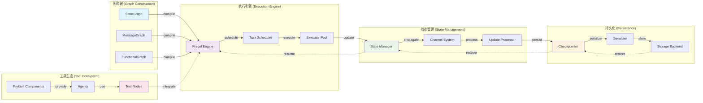

## 2. 执行时序图

### 2.1 完整执行生命周期

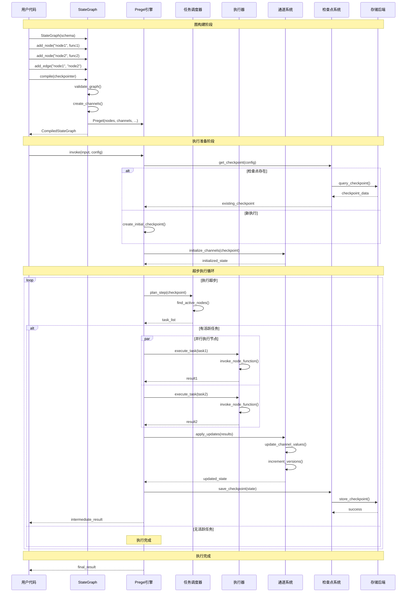

### 2.2 节点执行详细时序

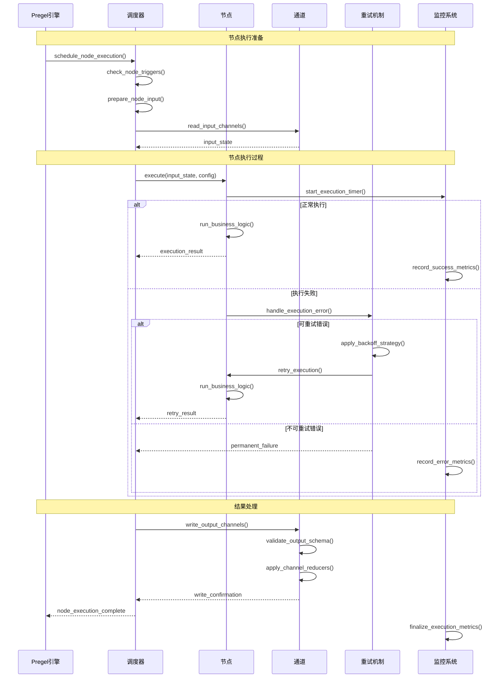

### 2.3 检查点保存和恢复时序

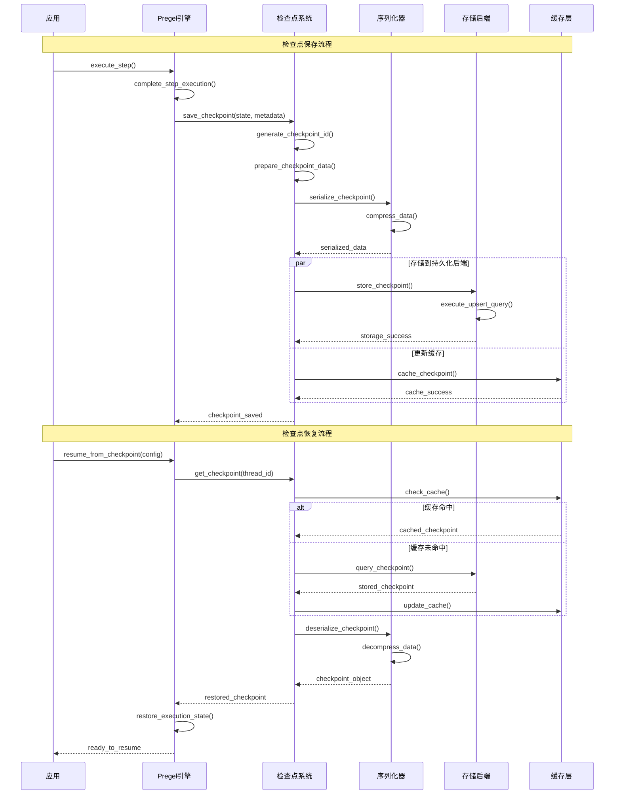

## 3. 模块交互图

### 3.1 核心模块交互关系

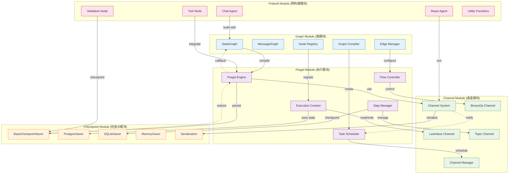

### 3.2 数据流向图

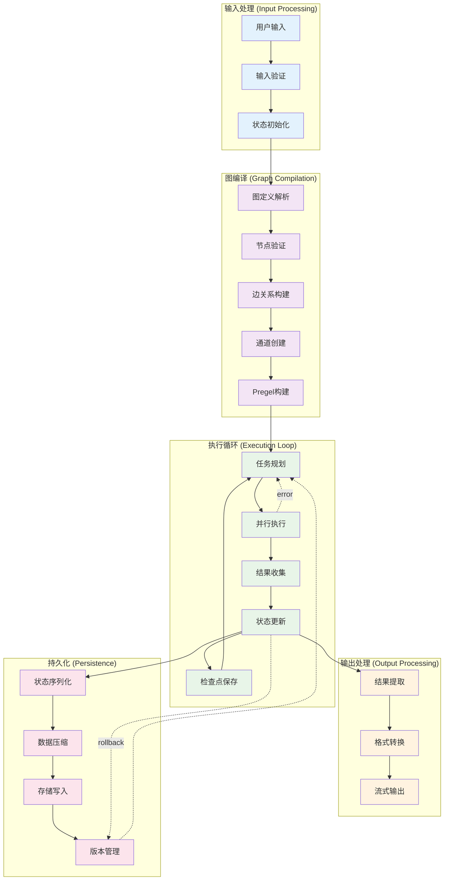

### 3.3 错误处理和恢复流程

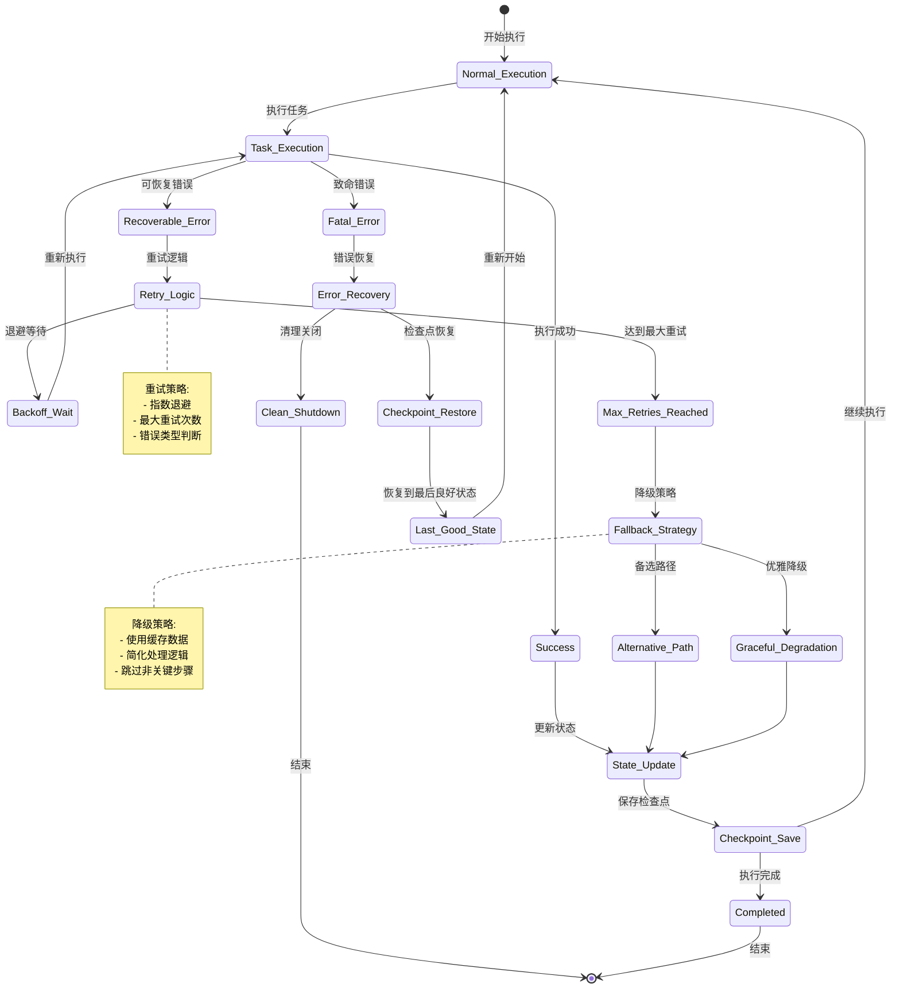

## 4. 性能和扩展架构

### 4.1 性能优化架构

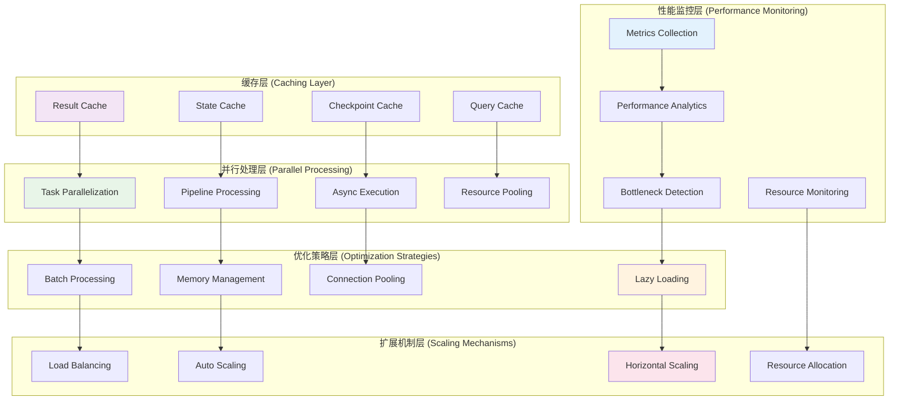

### 4.2 扩展点架构

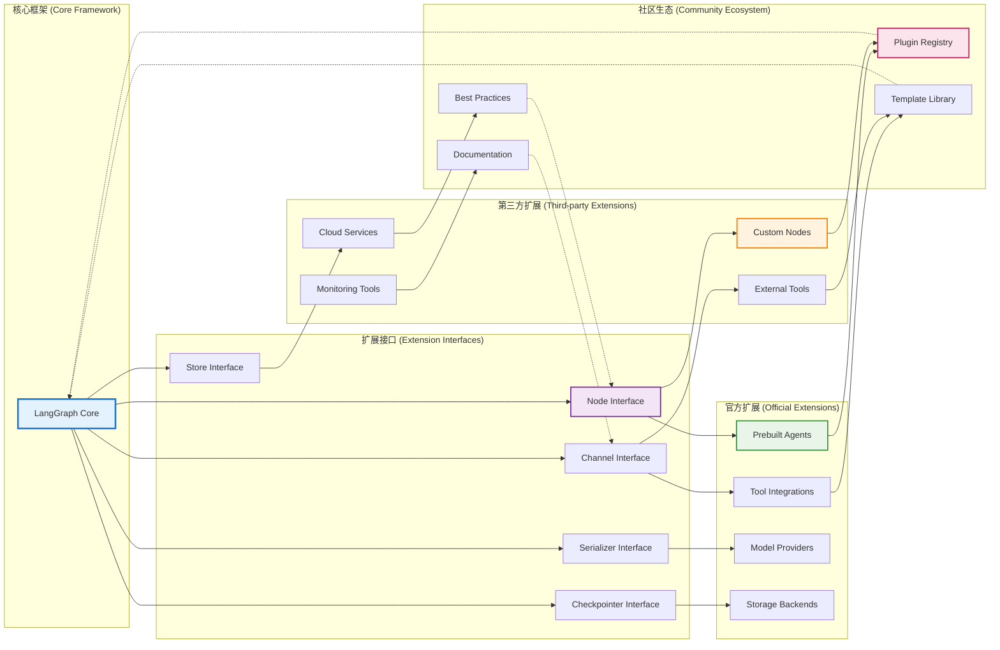

## 5. 部署架构图

### 5.1 云原生部署架构

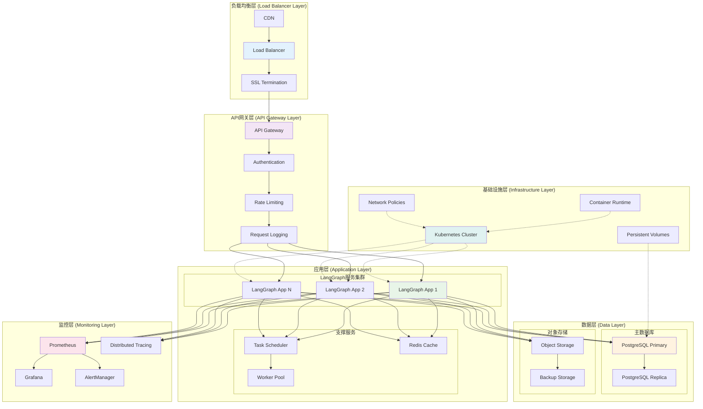

### 5.2 微服务架构分解

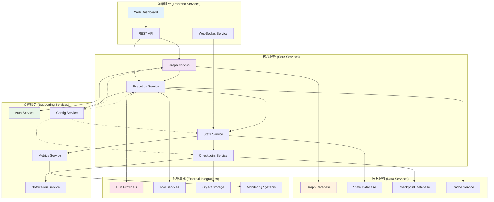

## 6. 安全架构图

### 6.1 安全层次架构

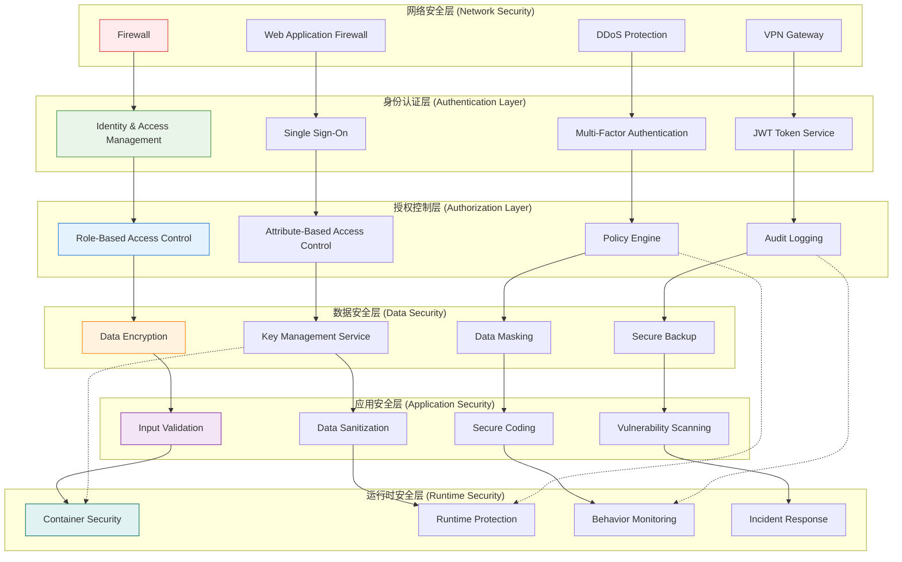

### 6.2 数据流安全控制

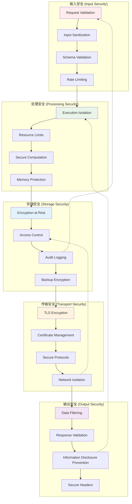

## 7. 总结

通过这些详细的架构图和时序图，我们可以清晰地看到：

### 7.1 架构特点

1. **分层清晰**：从用户接口到存储后端的清晰分层
2. **模块解耦**：各模块间通过明确的接口进行交互
3. **扩展性强**：多个扩展点支持自定义和第三方集成
4. **容错性好**：完善的错误处理和恢复机制

### 7.2 设计优势

1. **高性能**：并行执行和缓存优化确保高性能
2. **高可用**：检查点系统和故障恢复保证高可用性
3. **可扩展**：云原生架构支持水平扩展
4. **安全性**：多层次安全防护确保系统安全

### 7.3 技术亮点

1. **BSP模型**：Pregel的超步执行模型确保状态一致性
2. **检查点机制**：完整的状态持久化和恢复能力
3. **通道系统**：灵活的状态传播和更新机制
4. **微服务架构**：支持大规模分布式部署

这些架构设计为LangGraph提供了强大的技术基础，使其能够支持复杂的多智能体应用场景。

---

---

tommie blog
