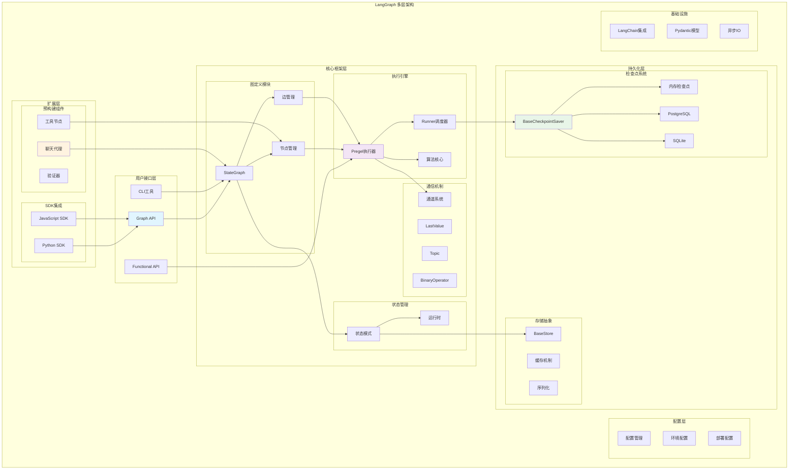
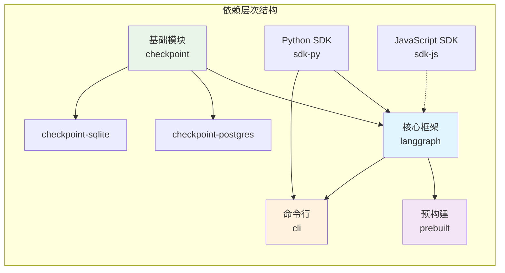
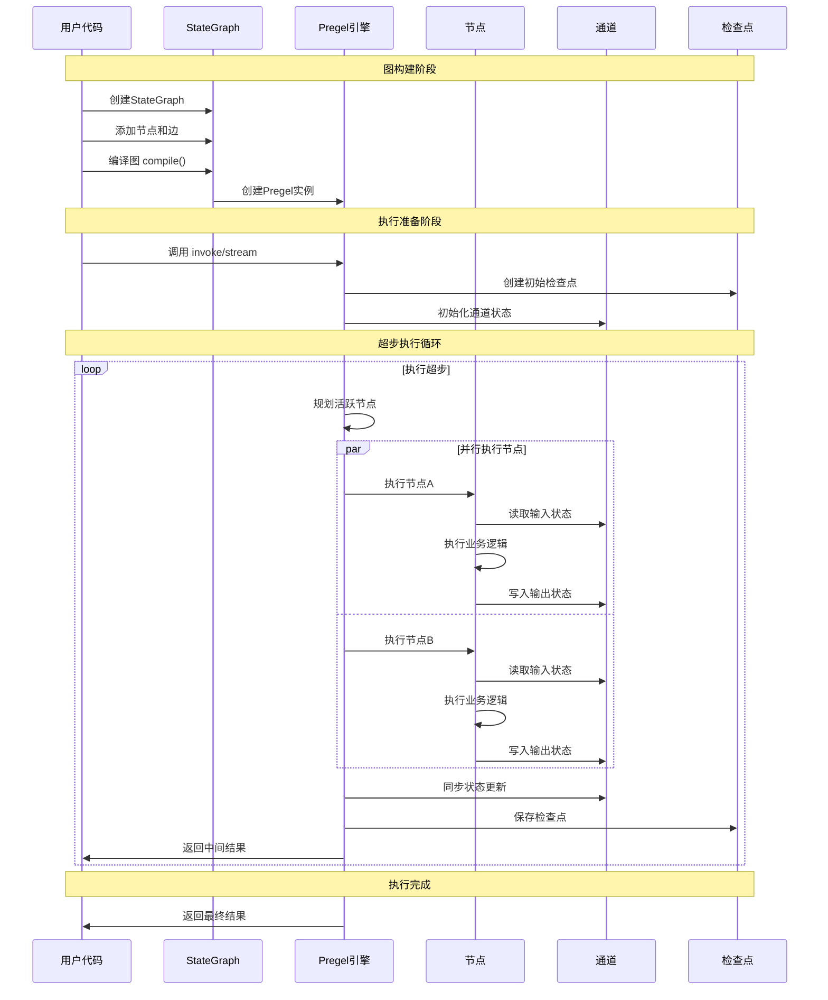

## 概述

LangGraph是一个专为构建多智能体应用而设计的Python框架，它通过...实现复杂的AI工作流。本文将深入解析LangGraph的架构设计，揭示其背后的技术原理和实现细节。

<!--more-->

## 1. LangGraph架构全景

### 1.1 核心设计理念

LangGraph的设计遵循以下核心理念：

- **图驱动计算**：将AI工作流建模为有向图，通过节点和边定义执行逻辑
- **状态中心化**：采用共享状态模式，确保数据一致性和可追溯性
- **并行执行**：通过...实现高效的并行计算
- **检查点机制**：内置持久化能力，支持故障恢复和状态回滚
- **模块化架构**：清晰的模块划分，支持灵活扩展和自定义

### 1.2 配置驱动的架构设计

LangGraph采用配置驱动的架构，通过`langgraph.json`文件实现图的声明式定义和管理：

```json
{
  "graphs": {
    "deep_research": "./src/workflow.py:graph",
    "podcast_generation": "./src/podcast/graph/builder.py:workflow", 
    "ppt_generation": "./src/ppt/graph/builder.py:workflow",
    "multi_agent_system": "./src/agents/orchestrator.py:coordinator_graph"
  },
  "python_version": "3.12",
  "env": "./.env",
  "dependencies": ["."],
  "dockerfile_lines": [
    "RUN apt-get update && apt-get install -y git",
    "RUN pip install --no-cache-dir torch torchvision"
  ],
  "deployment": {
    "platform": "langgraph-cloud",
    "scaling": {
      "min_instances": 2,
      "max_instances": 50,
      "auto_scaling_metric": "cpu_utilization",
      "target_utilization": 70
    },
    "monitoring": {
      "enable_tracing": true,
      "log_level": "INFO",
      "metrics_collection": ["latency", "throughput", "error_rate"]
    }
  }
}
```

**配置文件核心功能**：
- **图注册表**：centralized registry of all workflow graphs
- **环境管理**：统一的环境变量和依赖管理
- **部署配置**：声明式的部署和扩缩容策略
- **监控设置**：内置的可观测性配置

### 1.3 整体架构图



### 1.3 模块依赖关系



## 2. 核心组件详解

### 2.1 Graph API：高级图构建接口

Graph API是用户与LangGraph交互的主要入口，提供直观的图构建体验：

```python
from langgraph.graph import StateGraph, START, END
from typing import TypedDict

class State(TypedDict):
    messages: list[str]
    result: str

# 创建状态图
graph = StateGraph(State)

# 添加节点
def process_node(state: State) -> State:
    """处理节点：执行核心业务逻辑"""
    messages = state["messages"]
    result = f"Processed: {', '.join(messages)}"
    return {"result": result}

graph.add_node("process", process_node)

# 设置入口和出口
graph.set_entry_point("process")
graph.set_finish_point("process")

# 编译图
app = graph.compile()
```

**Graph API核心特性**：
- **类型安全**：基于TypedDict的强类型状态定义
- **声明式构建**：通过链式调用构建复杂图结构
- **自动优化**：编译期优化执行路径和资源分配

### 2.2 Pregel执行引擎

Pregel是LangGraph的执行核心，基于Google的Pregel图计算模型：

```python
class Pregel:
    """Pregel执行引擎
    
    基于消息传递的图计算模型，支持：
    - 超步（Super-step）执行
    - 并行节点处理
    - 状态同步机制
    """
    
    def __init__(self, nodes, channels, input_channels, output_channels):
        self.nodes = nodes          # 节点映射
        self.channels = channels    # 通道映射
        self.input_channels = input_channels    # 输入通道
        self.output_channels = output_channels  # 输出通道
        
    async def astream(self, input_data, config=None):
        """异步流式执行"""
        # 初始化状态
        checkpoint = self._prepare_checkpoint(input_data)
        
        # 执行超步循环
        while True:
            # 1. 计划阶段：确定活跃节点
            active_nodes = self._plan_step(checkpoint)
            if not active_nodes:
                break
                
            # 2. 执行阶段：并行执行节点
            results = await self._execute_step(active_nodes, checkpoint)
            
            # 3. 更新阶段：同步状态更新
            checkpoint = self._update_step(results, checkpoint)
            
            yield checkpoint
```

**Pregel执行模型特点**：
- **超步执行**：将复杂图计算分解为离散的执行步骤
- **消息传递**：节点间通过消息进行通信，避免共享状态竞争
- **并行处理**：同一超步内的节点可并行执行
- **状态一致性**：每个超步结束后统一更新全局状态

### 2.3 通道系统：节点通信机制

LangGraph通过通道系统实现节点间的数据传递：

```python
from abc import ABC, abstractmethod

class BaseChannel(ABC):
    """通道基类"""
    
    @abstractmethod
    def update(self, updates: Sequence[Any]) -> None:
        """更新通道值"""
        pass
    
    @abstractmethod
    def get(self) -> Any:
        """获取通道值"""
        pass
    
    @abstractmethod
    def checkpoint(self) -> Any:
        """创建检查点"""
        pass

class LastValue(BaseChannel):
    """最后值通道：保存最后一次更新的值"""
    
    def __init__(self, typ: type):
        self.typ = typ
        self.value = None
    
    def update(self, updates: Sequence[Any]) -> None:
        if updates:
            self.value = updates[-1]
    
    def get(self) -> Any:
        return self.value

class Topic(BaseChannel):
    """主题通道：支持消息累积和去重"""
    
    def __init__(self, typ: type, accumulate: bool = False, unique: bool = False):
        self.typ = typ
        self.accumulate = accumulate
        self.unique = unique
        self.values = []
    
    def update(self, updates: Sequence[Any]) -> None:
        for update in updates:
            if self.unique and update in self.values:
                continue
            self.values.append(update)
    
    def get(self) -> Any:
        return self.values if self.accumulate else (self.values[-1] if self.values else None)
```

**通道类型及应用场景**：

| 通道类型 | 用途 | 适用场景 |
|---------|------|----------|
| LastValue | 保存最新值 | 状态传递、结果输出 |
| Topic | 消息队列 | 多对多通信、事件收集 |
| BinaryOperatorAggregate | 累积计算 | 计数器、求和操作 |
| EphemeralValue | 临时存储 | 中间计算结果 |

### 2.4 检查点系统：持久化与恢复

检查点系统是LangGraph的核心特性，提供应用级的持久化能力：

```python
from abc import ABC, abstractmethod
from typing import Optional, AsyncIterator

class BaseCheckpointSaver(ABC):
    """检查点保存器基类"""
    
    @abstractmethod
    async def aput(
        self, 
        config: RunnableConfig, 
        checkpoint: Checkpoint,
        metadata: CheckpointMetadata
    ) -> RunnableConfig:
        """保存检查点"""
        pass
    
    @abstractmethod
    async def aget(
        self, 
        config: RunnableConfig
    ) -> Optional[CheckpointTuple]:
        """获取检查点"""
        pass
    
    @abstractmethod
    async def alist(
        self,
        config: RunnableConfig,
        before: Optional[RunnableConfig] = None,
        limit: Optional[int] = None,
    ) -> AsyncIterator[CheckpointTuple]:
        """列举检查点历史"""
        pass

# PostgreSQL实现示例
class PostgresCheckpointSaver(BaseCheckpointSaver):
    """PostgreSQL检查点保存器"""
    
    def __init__(self, connection_string: str):
        self.conn_string = connection_string
        
    async def aput(self, config, checkpoint, metadata):
        """将检查点保存到PostgreSQL"""
        async with asyncpg.connect(self.conn_string) as conn:
            await conn.execute("""
                INSERT INTO checkpoints (thread_id, checkpoint_id, data, metadata)
                VALUES ($1, $2, $3, $4)
            """, 
            config["configurable"]["thread_id"],
            config["configurable"]["checkpoint_id"],
            pickle.dumps(checkpoint),
            json.dumps(metadata)
            )
```

**检查点机制优势**：
- **故障恢复**：应用崩溃后可从最近检查点恢复执行
- **状态回溯**：支持回滚到历史状态进行调试
- **分支执行**：基于检查点创建执行分支
- **增量处理**：避免重复计算，提升性能

## 3. 执行流程深度解析

### 3.1 图执行生命周期



### 3.2 状态传播机制

```python
class StateManager:
    """状态管理器：协调状态在节点间的传播"""
    
    def __init__(self, channels: dict[str, BaseChannel]):
        self.channels = channels
        self.pending_updates = defaultdict(list)
    
    def apply_writes(self, writes: list[tuple[str, Any]]):
        """应用写操作到通道"""
        for channel_key, value in writes:
            if channel_key in self.channels:
                self.pending_updates[channel_key].append(value)
    
    def commit_updates(self):
        """提交所有待处理的更新"""
        for channel_key, updates in self.pending_updates.items():
            channel = self.channels[channel_key]
            channel.update(updates)
        self.pending_updates.clear()
    
    def read_state(self, node_inputs: list[str]) -> dict[str, Any]:
        """读取节点所需的状态"""
        state = {}
        for input_key in node_inputs:
            if input_key in self.channels:
                state[input_key] = self.channels[input_key].get()
        return state
```

**状态传播特点**：
- **原子更新**：所有状态更新在超步结束后统一提交
- **读写分离**：读操作基于当前快照，写操作缓存到下一超步
- **类型安全**：基于通道类型进行运行时类型检查
- **冲突解决**：通过减少函数处理多个写入的冲突

### 3.3 并行执行策略

```python
class ParallelExecutor:
    """并行执行器：管理节点的并行执行"""
    
    async def execute_step(self, active_nodes: list[PregelNode]) -> dict[str, Any]:
        """并行执行一个超步中的所有活跃节点"""
        tasks = []
        
        for node in active_nodes:
            # 为每个节点创建异步任务
            task = asyncio.create_task(
                self._execute_node(node),
                name=f"node-{node.name}"
            )
            tasks.append((node.name, task))
        
        # 等待所有任务完成或超时
        results = {}
        try:
            for node_name, task in tasks:
                result = await asyncio.wait_for(task, timeout=self.timeout)
                results[node_name] = result
        except asyncio.TimeoutError:
            # 取消未完成的任务
            for _, task in tasks:
                if not task.done():
                    task.cancel()
            raise
        
        return results
    
    async def _execute_node(self, node: PregelNode) -> Any:
        """执行单个节点"""
        try:
            # 读取节点输入
            input_state = self.state_manager.read_state(node.input_channels)
            
            # 调用节点函数
            if asyncio.iscoroutinefunction(node.func):
                result = await node.func(input_state)
            else:
                result = node.func(input_state)
            
            return result
            
        except Exception as e:
            # 错误处理和传播
            return PregelTaskError(node.name, e)
```

**并行执行优势**：
- **资源利用率**：充分利用多核CPU和异步IO能力
- **故障隔离**：单个节点失败不影响其他并行节点
- **超时控制**：防止长时间运行的节点阻塞整个流程
- **负载均衡**：智能调度节点到不同的执行单元

### 3.4 Command/Send 调度模型

LangGraph提供了两种核心控制流原语用于“下一步如何走”的调度：`Command` 与 `Send`。

```python
from langgraph.types import Command, Send

def router(state: dict) -> Command[str]:
    """基于状态的路由：返回下一个要执行的节点，并可同时更新状态"""
    if state.get("needs_more_info"):
        return Command(goto="search", update={"query": state["query"]})
    else:
        return Command(goto="answer", update={"finalize": True})

def dispatcher(state: dict) -> list[Send]:
    """并行分发：将一批子任务以Send形式分发到多个节点实例"""
    tasks = state.get("subtasks", [])
    return [
        Send("worker", {"task": t, "task_id": i})
        for i, t in enumerate(tasks)
    ]
```

要点：
- **Command**：单跳路由，适合“下一步去哪”的条件流，支持伴随`update`进行原子状态更新。
- **Send**：一对多分发，适合并行子任务或工具并发执行，执行结果在下个超步统一汇聚。
- **结合使用**：先由`Command`判定流程，再由`Send`面向多分支/多任务并发推进，充分发挥BSP（超步）模型优势。

## 4. 高级特性

### 4.1 反思式智能体架构

LangGraph支持反思式智能体模式，在代码生成、决策制定等场景中通过自我修正提升输出质量：

```python
class ReflectiveAgent:
    """反思式智能体：支持自我修正和迭代优化"""
    
    def __init__(self, model, max_reflections: int = 3):
        self.model = model
        self.max_reflections = max_reflections
        
    def generate_with_reflection(self, state: State) -> State:
        """带反思机制的生成过程"""
        attempt = 0
        current_result = None
        
        while attempt < self.max_reflections:
            if attempt == 0:
                # 初次生成
                current_result = self._generate_initial(state)
            else:
                # 基于前次结果和错误进行反思
                current_result = self._reflect_and_improve(
                    state, current_result, error_feedback
                )
            
            # 验证结果
            validation_result = self._validate_result(current_result)
            if validation_result.success:
                break
            
            error_feedback = validation_result.error_details
            attempt += 1
        
        return {"result": current_result, "iterations": attempt + 1}
    
    def _validate_result(self, result) -> ValidationResult:
        """验证生成结果，支持代码执行、逻辑检查等"""
        try:
            # 执行代码验证（如果是代码生成任务）
            if self._is_code_generation_task():
                exec_result = self._execute_code_safely(result)
                return ValidationResult(success=True, result=exec_result)
            
            # 其他类型的验证逻辑
            return self._generic_validation(result)
            
        except Exception as e:
            return ValidationResult(
                success=False, 
                error_details=str(e),
                stack_trace=traceback.format_exc()
            )

# 反思式代码生成的完整流程
def create_reflective_code_agent():
    """创建反思式代码生成智能体"""
    graph = StateGraph(CodeGenState)
    
    # 添加生成节点
    graph.add_node("generate", code_generation_node)
    
    # 添加验证节点
    graph.add_node("validate", code_validation_node)
    
    # 添加反思节点
    graph.add_node("reflect", reflection_node)
    
    # 设置条件边
    graph.add_conditional_edges(
        "validate",
        lambda state: "reflect" if state.get("has_errors") else END,
        {"reflect": "reflect", END: END}
    )
    
    graph.add_edge("generate", "validate")
    graph.add_edge("reflect", "generate")
    
    return graph.compile()
```

**反思式架构特点**：
- **迭代优化**：通过多轮反思持续改进输出质量
- **错误学习**：从失败中学习，避免重复相同错误
- **上下文积累**：保持对话历史和错误信息的完整记录
- **自适应调整**：根据任务复杂度动态调整反思次数

### 4.2 多智能体协调机制

LangGraph原生支持多智能体系统，通过图结构实现复杂的智能体间协作：

```python
class MultiAgentOrchestrator:
    """多智能体编排器：协调多个专业智能体的协作"""
    
    def __init__(self):
        self.agents = {}
        self.coordination_graph = StateGraph(MultiAgentState)
    
    def create_hierarchical_system(self):
        """创建分层多智能体系统"""
        # 管理者智能体：负责任务分解和结果整合
        manager_agent = self._create_manager_agent()
        self.coordination_graph.add_node("manager", manager_agent)
        
        # 专业智能体：负责特定领域任务
        specialist_agents = {
            "data_analyst": self._create_data_analyst(),
            "code_generator": self._create_code_generator(),
            "qa_specialist": self._create_qa_specialist(),
        }
        
        for name, agent in specialist_agents.items():
            self.coordination_graph.add_node(name, agent)
        
        # 建立协作关系
        self.coordination_graph.add_conditional_edges(
            "manager",
            self._route_to_specialist,
            {**specialist_agents, END: END}
        )
        
        # 专业智能体完成后返回管理者
        for specialist in specialist_agents:
            self.coordination_graph.add_edge(specialist, "manager")
        
        return self.coordination_graph.compile()
    
    def _route_to_specialist(self, state: MultiAgentState) -> str:
        """智能路由：根据任务类型选择合适的专业智能体"""
        task_type = self._classify_task(state["current_task"])
        
        routing_map = {
            "data_analysis": "data_analyst",
            "code_generation": "code_generator", 
            "quality_assurance": "qa_specialist",
        }
        
        return routing_map.get(task_type, END)
    
    def _create_manager_agent(self):
        """创建管理者智能体"""
        def manager_node(state: MultiAgentState) -> dict:
            messages = state["messages"]
            current_task = state.get("current_task")
            
            if not current_task:
                # 初始任务分解
                task_breakdown = self._decompose_task(messages[-1].content)
                return {
                    "current_task": task_breakdown[0],
                    "remaining_tasks": task_breakdown[1:],
                    "task_results": [],
                }
            else:
                # 处理专业智能体的结果
                if "specialist_result" in state:
                    results = state.get("task_results", [])
                    results.append(state["specialist_result"])
                    
                    remaining = state.get("remaining_tasks", [])
                    if remaining:
                        # 还有待处理任务
                        return {
                            "current_task": remaining[0],
                            "remaining_tasks": remaining[1:],
                            "task_results": results,
                        }
                    else:
                        # 所有任务完成，整合结果
                        final_result = self._integrate_results(results)
                        return {
                            "messages": [AIMessage(content=final_result)],
                            "task_results": results,
                            "status": "completed",
                        }
        
        return manager_node

# 多智能体状态模式
class MultiAgentState(TypedDict):
    messages: Annotated[list[BaseMessage], add_messages]
    current_task: Optional[str]
    remaining_tasks: list[str]
    task_results: list[dict]
    specialist_result: Optional[dict]
    status: str
```

**多智能体协调特点**：
- **分层管理**：管理者智能体负责任务分解和结果整合
- **专业分工**：每个智能体专注于特定领域的任务
- **动态路由**：根据任务类型智能选择最适合的专业智能体
- **结果聚合**：自动整合多个智能体的输出结果

### 4.3 中断与人工介入

LangGraph支持执行过程中的中断机制，允许人工介入：

```python
from langgraph.constants import INTERRUPT

def approval_node(state: State) -> State:
    """需要人工审批的节点"""
    if state["requires_approval"]:
        # 触发中断，等待人工介入
        raise INTERRUPT("Waiting for human approval")
    
    return {"approved": True}

# 使用中断后恢复执行
app = graph.compile(checkpointer=checkpointer)

# 第一次执行到中断点
try:
    result = app.invoke({"data": "sensitive_operation"})
except Interrupt as e:
    print(f"Interrupted: {e.value}")
    
# 人工处理后恢复执行
config = {"configurable": {"thread_id": "thread-1"}}
app.update_state(config, {"approved": True})
result = app.invoke(None, config)  # 从中断点恢复
```

### 4.2 子图和模块化

支持将复杂图分解为可重用的子图：

```python
def create_processing_subgraph():
    """创建处理子图"""
    subgraph = StateGraph(ProcessingState)
    subgraph.add_node("validate", validate_node)
    subgraph.add_node("process", process_node)
    subgraph.add_edge("validate", "process")
    return subgraph

# 在主图中使用子图
main_graph = StateGraph(MainState)
processing_graph = create_processing_subgraph()

main_graph.add_node("preprocessing", preprocessing_node)
main_graph.add_node("processing", processing_graph.compile())
main_graph.add_node("postprocessing", postprocessing_node)
```

### 4.3 动态图构建

支持运行时动态修改图结构：

```python
class DynamicGraph:
    """动态图：支持运行时图结构修改"""
    
    def __init__(self):
        self.graph = StateGraph(DynamicState)
        self.compiled_cache = {}
    
    def add_conditional_node(self, state: DynamicState):
        """根据状态动态添加节点"""
        if state["node_type"] == "llm":
            self.graph.add_node("dynamic_llm", llm_node)
        elif state["node_type"] == "tool":
            self.graph.add_node("dynamic_tool", tool_node)
    
    def compile_dynamic(self, state: DynamicState):
        """动态编译图"""
        graph_hash = self._compute_graph_hash(state)
        if graph_hash not in self.compiled_cache:
            self.add_conditional_node(state)
            self.compiled_cache[graph_hash] = self.graph.compile()
        return self.compiled_cache[graph_hash]
```

## 5. 性能优化策略

### 5.1 执行优化

```python
class OptimizedExecutor:
    """优化执行器：实现多种性能优化策略"""
    
    def __init__(self):
        self.node_cache = {}  # 节点结果缓存
        self.execution_pool = ThreadPoolExecutor(max_workers=4)
    
    async def execute_with_cache(self, node: PregelNode, state: dict):
        """带缓存的节点执行"""
        # 生成缓存键
        cache_key = self._generate_cache_key(node, state)
        
        # 检查缓存
        if cache_key in self.node_cache:
            return self.node_cache[cache_key]
        
        # 执行并缓存结果
        result = await self._execute_node(node, state)
        self.node_cache[cache_key] = result
        return result
    
    def _generate_cache_key(self, node: PregelNode, state: dict) -> str:
        """生成缓存键"""
        state_hash = hashlib.md5(
            json.dumps(state, sort_keys=True).encode()
        ).hexdigest()
        return f"{node.name}:{state_hash}"
```

### 5.2 内存管理

```python
class MemoryManager:
    """内存管理器：优化内存使用和垃圾回收"""
    
    def __init__(self, max_checkpoints: int = 100):
        self.max_checkpoints = max_checkpoints
        self.checkpoint_cache = OrderedDict()
    
    def add_checkpoint(self, checkpoint_id: str, checkpoint: Checkpoint):
        """添加检查点并管理内存"""
        # 移除最老的检查点
        if len(self.checkpoint_cache) >= self.max_checkpoints:
            self.checkpoint_cache.popitem(last=False)
        
        self.checkpoint_cache[checkpoint_id] = checkpoint
    
    def cleanup_unused_channels(self, active_channels: set[str]):
        """清理未使用的通道"""
        for channel_key in list(self.channels.keys()):
            if channel_key not in active_channels:
                del self.channels[channel_key]
```

### 5.3 监控和调试

```python
class GraphProfiler:
    """图分析器：提供性能监控和调试能力"""
    
    def __init__(self):
        self.execution_stats = defaultdict(list)
        self.error_log = []
    
    async def profile_execution(self, graph, input_data):
        """分析图执行性能"""
        start_time = time.time()
        
        async for step in graph.astream(input_data):
            step_time = time.time() - start_time
            self.execution_stats["step_times"].append(step_time)
            
            # 记录节点执行时间
            for node_name, node_result in step.items():
                if hasattr(node_result, "execution_time"):
                    self.execution_stats[f"node_{node_name}"].append(
                        node_result.execution_time
                    )
        
        return self._generate_performance_report()
    
    def _generate_performance_report(self) -> dict:
        """生成性能报告"""
        return {
            "total_steps": len(self.execution_stats["step_times"]),
            "avg_step_time": statistics.mean(self.execution_stats["step_times"]),
            "slowest_nodes": self._find_slowest_nodes(),
            "memory_usage": self._get_memory_stats(),
        }
```

## 6. 最佳实践

### 6.1 图设计原则

1. **单一职责**：每个节点专注于一个明确的任务
2. **状态最小化**：只在状态中保留必要信息
3. **错误处理**：为每个节点提供适当的错误处理
4. **可测试性**：设计时考虑单元测试和集成测试

### 6.2 性能优化建议

1. **合理使用缓存**：对计算密集型节点启用缓存
2. **批量处理**：将相似操作合并为批处理节点
3. **异步优化**：充分利用异步能力处理IO密集型任务
4. **资源管理**：合理设置并发度和超时时间

### 6.3 错误处理策略

```python
class RobustNode:
    """健壮的节点实现"""
    
    def __init__(self, max_retries: int = 3):
        self.max_retries = max_retries
    
    async def execute(self, state: dict) -> dict:
        """带重试和错误处理的节点执行"""
        for attempt in range(self.max_retries):
            try:
                return await self._core_logic(state)
            except RetryableError as e:
                if attempt == self.max_retries - 1:
                    # 最后一次尝试失败，记录错误并降级处理
                    return self._fallback_logic(state, e)
                await asyncio.sleep(2 ** attempt)  # 指数退避
            except FatalError as e:
                # 不可恢复错误，立即失败
                raise
    
    async def _core_logic(self, state: dict) -> dict:
        """核心业务逻辑"""
        # 实际的节点处理逻辑
        pass
    
    def _fallback_logic(self, state: dict, error: Exception) -> dict:
        """降级处理逻辑"""
        return {"error": str(error), "status": "fallback"}
```

### 6.4 运维与SLO与可观测性

- **推荐SLO**：
  - 网关请求P95 < 200ms；端到端对话P95 < 2.5s（含检索/推理/工具）
  - 可用性 >= 99.9%；关键链路N+1与熔断/限流策略生效
- **四象限可观测性**：日志（结构化/采样）、指标（QPS、P95、错误率、Token成本）、Trace（跨节点/超步）、合成监控（拨测用例）。
- **资源与配额**：按线程/租户维度限流与配额；超配时退化到便宜模型或关闭非关键工具。
- **成本看板**：按模型/向量/外部API维度归集成本；设置阈值与告警，结合采样回溯高成本对话。
- **回滚与开关**：为关键节点/工具引入特性开关；异常升高时自动降级或回滚上个稳定版本。

## 7. 总结

LangGraph作为一个成熟的多智能体应用框架，通过其精心设计的架构解决了复杂AI工作流的关键挑战：

### 7.1 核心优势

- **图驱动编程**：直观的图模型简化复杂工作流的设计和理解
- **高性能执行**：基于Pregel的并行执行引擎确保高效处理
- **企业级特性**：内置持久化、监控、错误处理等生产环境必需功能
- **生态整合**：与LangChain生态系统的深度集成提供丰富的组件库

### 7.2 适用场景

- **多智能体协作**：复杂的AI代理协调和通信
- **工作流自动化**：业务流程的智能化改造
- **决策支持系统**：多步骤的分析和推理流程
- **人机协作**：需要人工介入的半自动化处理


通过深入理解LangGraph的架构设计，开发者可以更好地构建稳定、高效的多智能体应用，充分发挥AI技术在复杂业务场景中的价值。

