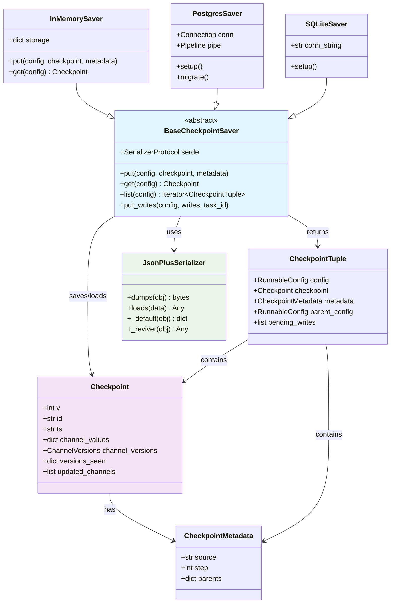
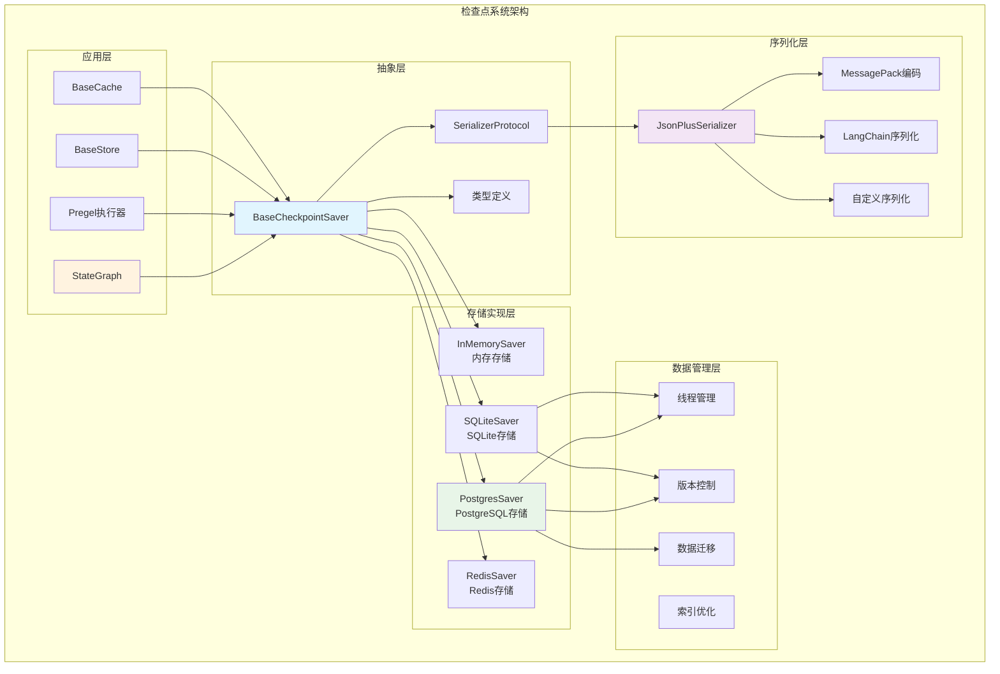
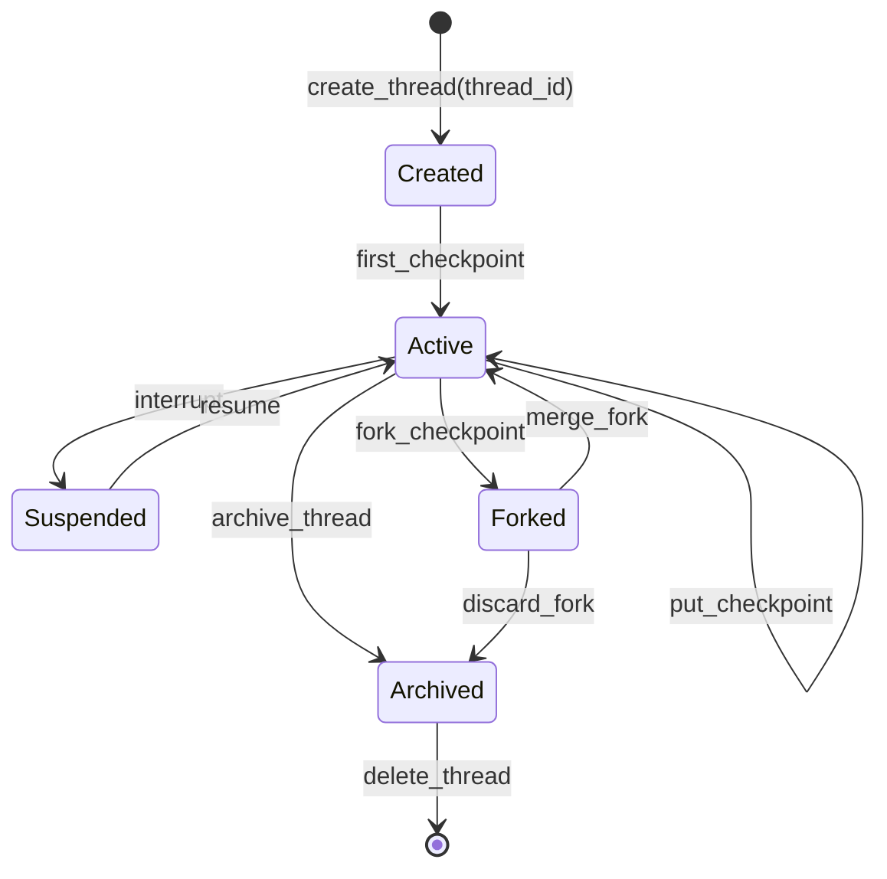

## 概述

LangGraph检查点系统是整个框架的核心基础设施，负责图执行状态的持久化、恢复和管理。它通过精巧的设计实现了多线程、多租户的状态管理，并支持多种存储后端。本文将深入解析检查点系统的架构设计和实现细节。

<!--more-->

## 1. 检查点系统架构

### 1.1 核心组件关系图



### 1.2 系统架构图



## 2. 核心数据结构

### 2.1 Checkpoint：状态快照

```python
class Checkpoint(TypedDict):
    """给定时间点的状态快照
    
    检查点是LangGraph执行状态的完整记录，包含：
    - 版本信息
    - 唯一标识符
    - 时间戳
    - 通道状态值
    - 通道版本号
    - 节点已见版本
    - 更新通道列表
    """
    
    v: int
    """检查点格式版本，当前为1
    
    用于处理格式升级和向后兼容性
    """
    
    id: str
    """检查点的唯一ID
    
    既唯一又单调递增，可用于从第一个到最后一个排序检查点
    使用uuid6生成，确保时间有序性
    """
    
    ts: str
    """检查点的时间戳，ISO 8601格式
    
    示例: "2024-01-15T10:30:45.123456Z"
    """
    
    channel_values: dict[str, Any]
    """检查点时通道的值
    
    从通道名到反序列化通道快照值的映射
    这是图状态的实际数据内容
    """
    
    channel_versions: ChannelVersions
    """检查点时通道的版本
    
    键是通道名，值是每个通道单调递增的版本字符串
    用于增量更新和变化检测
    """
    
    versions_seen: dict[str, ChannelVersions]
    """从节点ID到从通道名到版本的映射
    
    跟踪每个节点已见的通道版本
    用于确定接下来执行哪些节点
    格式: {node_id: {channel_name: version}}
    """
    
    updated_channels: list[str] | None
    """在此检查点中更新的通道列表
    
    用于优化，快速识别哪些通道发生了变化
    """

# 检查点复制函数
def copy_checkpoint(checkpoint: Checkpoint) -> Checkpoint:
    """深拷贝检查点对象
    
    Args:
        checkpoint: 要复制的检查点
        
    Returns:
        Checkpoint: 检查点的深拷贝
    """
    return Checkpoint(
        v=checkpoint["v"],
        ts=checkpoint["ts"],
        id=checkpoint["id"],
        channel_values=checkpoint["channel_values"].copy(),
        channel_versions=checkpoint["channel_versions"].copy(),
        versions_seen={
            k: v.copy() for k, v in checkpoint["versions_seen"].items()
        },
        pending_sends=checkpoint.get("pending_sends", []).copy(),
        updated_channels=checkpoint.get("updated_channels", None),
    )
```

### 2.2 CheckpointMetadata：检查点元数据

```python
class CheckpointMetadata(TypedDict, total=False):
    """与检查点关联的元数据"""
    
    source: Literal["input", "loop", "update", "fork"]
    """检查点的来源
    
    - "input": 从invoke/stream/batch的输入创建的检查点
    - "loop": 从pregel循环内部创建的检查点  
    - "update": 从手动状态更新创建的检查点
    - "fork": 作为另一个检查点副本创建的检查点
    """
    
    step: int
    """检查点的步骤编号
    
    -1 表示第一个"input"检查点
    0 表示第一个"loop"检查点
    ... 之后的第n个检查点
    """
    
    parents: dict[str, str]
    """父检查点的ID映射
    
    从检查点命名空间到检查点ID的映射
    用于支持分支和合并操作
    """

# 获取检查点元数据的辅助函数
def get_checkpoint_metadata(
    config: RunnableConfig,
    step: int = -1,
    source: Literal["input", "loop", "update", "fork"] = "input",
) -> CheckpointMetadata:
    """构造检查点元数据
    
    Args:
        config: 运行配置
        step: 步骤编号
        source: 检查点来源
        
    Returns:
        CheckpointMetadata: 构造的元数据
    """
    metadata: CheckpointMetadata = {
        "source": source,
        "step": step,
        "parents": {},
    }
    
    # 从配置中提取父检查点信息
    if "checkpoint_id" in config.get("configurable", {}):
        parent_id = config["configurable"]["checkpoint_id"]
        ns = config.get("configurable", {}).get("checkpoint_ns", "")
        metadata["parents"][ns] = parent_id
    
    return metadata
```

### 2.3 CheckpointTuple：检查点元组

```python
class CheckpointTuple(NamedTuple):
    """包含检查点及其关联数据的元组
    
    这是检查点系统的主要返回类型，包含了
    完整的检查点信息和相关的配置、元数据
    """
    
    config: RunnableConfig
    """与检查点关联的运行配置
    
    包含thread_id、checkpoint_id等标识信息
    """
    
    checkpoint: Checkpoint
    """检查点数据本身"""
    
    metadata: CheckpointMetadata
    """检查点元数据"""
    
    parent_config: RunnableConfig | None = None
    """父检查点的配置（如果有）
    
    用于支持检查点链和历史追踪
    """
    
    pending_writes: list[PendingWrite] | None = None
    """待写入操作列表
    
    当节点执行失败时，成功完成的节点的写入
    会保存为待写入，以便恢复执行时不重复运行
    """

# 待写入类型定义
PendingWrite = tuple[str, str, Any]  # (channel, task_id, value)
```

## 3. BaseCheckpointSaver：抽象基类

### 3.1 接口定义

```python
class BaseCheckpointSaver(Generic[V]):
    """创建图检查点保存器的基类
    
    检查点保存器允许LangGraph智能体在多次交互中持久化状态
    
    Attributes:
        serde (SerializerProtocol): 用于编码/解码检查点的序列化器
        
    Note:
        创建自定义检查点保存器时，考虑实现异步版本以避免阻塞主线程
    """
    
    serde: SerializerProtocol = JsonPlusSerializer()
    """序列化协议实例，默认使用JsonPlus序列化器"""
    
    def __init__(
        self,
        *,
        serde: SerializerProtocol | None = None,
    ) -> None:
        """初始化检查点保存器
        
        Args:
            serde: 序列化器实例，如果为None则使用默认序列化器
        """
        self.serde = maybe_add_typed_methods(serde or self.serde)
    
    @property
    def config_specs(self) -> list:
        """定义检查点保存器的配置选项
        
        Returns:
            list: 配置字段规格列表
        """
        return [
            {
                "name": "thread_id",
                "type": "string",
                "description": "线程唯一标识符",
                "required": True,
            },
            {
                "name": "checkpoint_id", 
                "type": "string",
                "description": "检查点唯一标识符",
                "required": False,
            },
            {
                "name": "checkpoint_ns",
                "type": "string", 
                "description": "检查点命名空间",
                "required": False,
                "default": "",
            },
        ]

    # 核心接口方法
    def get(self, config: RunnableConfig) -> Checkpoint | None:
        """使用给定配置获取检查点
        
        Args:
            config: 指定要检索哪个检查点的配置
            
        Returns:
            Optional[Checkpoint]: 请求的检查点，如果未找到则为None
        """
        if value := self.get_tuple(config):
            return value.checkpoint

    def get_tuple(self, config: RunnableConfig) -> CheckpointTuple | None:
        """使用给定配置获取检查点元组
        
        Args:
            config: 指定要检索哪个检查点的配置
            
        Returns:
            Optional[CheckpointTuple]: 请求的检查点元组，如果未找到则为None
            
        Raises:
            NotImplementedError: 在自定义检查点保存器中实现此方法
        """
        raise NotImplementedError

    def list(
        self,
        config: RunnableConfig | None,
        *,
        filter: dict[str, Any] | None = None,
        before: RunnableConfig | None = None,
        limit: int | None = None,
    ) -> Iterator[CheckpointTuple]:
        """列出与给定条件匹配的检查点
        
        Args:
            config: 基础配置，包含thread_id等
            filter: 过滤条件字典
            before: 返回此配置之前的检查点
            limit: 返回的最大检查点数量
            
        Yields:
            CheckpointTuple: 匹配的检查点元组
            
        Raises:
            NotImplementedError: 在自定义检查点保存器中实现此方法
        """
        raise NotImplementedError

    def put(
        self,
        config: RunnableConfig,
        checkpoint: Checkpoint,
        metadata: CheckpointMetadata,
        new_versions: ChannelVersions,
    ) -> RunnableConfig:
        """存储检查点及其配置和元数据
        
        Args:
            config: 与检查点关联的配置
            checkpoint: 要存储的检查点
            metadata: 检查点元数据
            new_versions: 新的通道版本
            
        Returns:
            RunnableConfig: 更新的配置（可能包含新的checkpoint_id）
            
        Raises:
            NotImplementedError: 在自定义检查点保存器中实现此方法
        """
        raise NotImplementedError

    def put_writes(
        self,
        config: RunnableConfig,
        writes: Sequence[tuple[str, Any]],
        task_id: str,
    ) -> None:
        """存储与检查点关联的中间写入
        
        Args:
            config: 与检查点关联的配置
            writes: 要存储的写入操作序列
            task_id: 执行写入的任务ID
            
        Note:
            中间写入用于在节点执行失败时保存成功节点的结果，
            以便恢复时不需要重新执行
        """
        raise NotImplementedError

    # 异步接口方法（可选实现）
    async def aget(self, config: RunnableConfig) -> Checkpoint | None:
        """get方法的异步版本"""
        if value := await self.aget_tuple(config):
            return value.checkpoint

    async def aget_tuple(self, config: RunnableConfig) -> CheckpointTuple | None:
        """get_tuple方法的异步版本"""
        raise NotImplementedError

    async def alist(
        self,
        config: RunnableConfig | None,
        *,
        filter: dict[str, Any] | None = None,
        before: RunnableConfig | None = None,
        limit: int | None = None,
    ) -> AsyncIterator[CheckpointTuple]:
        """list方法的异步版本"""
        raise NotImplementedError
        yield  # 使其成为异步生成器

    async def aput(
        self,
        config: RunnableConfig,
        checkpoint: Checkpoint,
        metadata: CheckpointMetadata,
        new_versions: ChannelVersions,
    ) -> RunnableConfig:
        """put方法的异步版本"""
        raise NotImplementedError

    async def aput_writes(
        self,
        config: RunnableConfig,
        writes: Sequence[tuple[str, Any]],
        task_id: str,
    ) -> None:
        """put_writes方法的异步版本"""
        raise NotImplementedError
```

### 3.2 版本管理机制

```python
def get_next_version(current: V | None, channel: BaseChannel) -> V:
    """获取通道的下一个版本号
    
    Args:
        current: 当前版本号
        channel: 通道实例
        
    Returns:
        V: 下一个版本号
    """
    if current is None:
        return 1
    elif isinstance(current, int):
        return current + 1
    elif isinstance(current, float):
        return current + 1.0
    elif isinstance(current, str):
        try:
            # 尝试解析为整数并递增
            return str(int(current) + 1)
        except ValueError:
            # 如果不能解析，生成新的UUID
            from langgraph.checkpoint.base.id import uuid6
            return str(uuid6())
    else:
        raise ValueError(f"Unsupported version type: {type(current)}")

def get_checkpoint_id(config: RunnableConfig, checkpoint: Checkpoint) -> str:
    """从配置或检查点获取检查点ID
    
    Args:
        config: 运行配置
        checkpoint: 检查点数据
        
    Returns:
        str: 检查点ID
    """
    # 首先尝试从配置获取
    if checkpoint_id := config.get("configurable", {}).get("checkpoint_id"):
        return checkpoint_id
    
    # 否则从检查点本身获取
    return checkpoint["id"]
```

## 4. JsonPlusSerializer：高级序列化器

### 4.1 序列化器架构

```python
class JsonPlusSerializer(SerializerProtocol):
    """使用ormsgpack的序列化器，具有扩展JSON序列化的回退功能
    
    该序列化器支持：
    - MessagePack高效二进制编码
    - LangChain对象序列化
    - Pydantic模型序列化  
    - Python标准库类型
    - 自定义类型扩展
    """
    
    def __init__(
        self,
        *,
        pickle_fallback: bool = False,
        __unpack_ext_hook__: Callable[[int, bytes], Any] | None = None,
    ) -> None:
        """初始化序列化器
        
        Args:
            pickle_fallback: 是否使用pickle作为最后的回退方案
            __unpack_ext_hook__: MessagePack扩展类型解包钩子
        """
        self.pickle_fallback = pickle_fallback
        self._unpack_ext_hook = (
            __unpack_ext_hook__
            if __unpack_ext_hook__ is not None
            else _msgpack_ext_hook
        )
    
    def dumps(self, obj: Any) -> bytes:
        """将对象序列化为字节
        
        Args:
            obj: 要序列化的对象
            
        Returns:
            bytes: 序列化后的字节数据
        """
        try:
            # 首先尝试使用MessagePack
            return ormsgpack.packb(
                obj, 
                default=self._default,
                option=ormsgpack.OPT_NON_STR_KEYS | ormsgpack.OPT_SERIALIZE_DATACLASS
            )
        except (TypeError, ValueError) as e:
            if self.pickle_fallback:
                # 使用pickle作为回退
                return pickle.dumps(obj)
            else:
                raise ValueError(f"Failed to serialize object: {e}") from e
    
    def loads(self, data: bytes) -> Any:
        """从字节反序列化对象
        
        Args:
            data: 要反序列化的字节数据
            
        Returns:
            Any: 反序列化后的对象
        """
        if not data:
            return None
            
        try:
            # 首先尝试MessagePack解包
            return ormsgpack.unpackb(
                data, 
                ext_hook=self._unpack_ext_hook,
                str_hook=self._str_hook,
            )
        except (ormsgpack.MsgpackDecodeError, ValueError):
            if self.pickle_fallback:
                # 尝试pickle解包
                return pickle.loads(data)
            else:
                raise

    def _default(self, obj: Any) -> str | dict[str, Any]:
        """处理不能直接序列化的对象
        
        Args:
            obj: 要处理的对象
            
        Returns:
            str | dict: 可序列化的表示
        """
        # LangChain Serializable对象
        if isinstance(obj, Serializable):
            return cast(dict[str, Any], obj.to_json())
        
        # Pydantic模型（v2）
        elif hasattr(obj, "model_dump") and callable(obj.model_dump):
            return self._encode_constructor_args(
                obj.__class__, 
                method=(None, "model_construct"), 
                kwargs=obj.model_dump()
            )
        
        # Pydantic模型（v1）
        elif hasattr(obj, "dict") and callable(obj.dict):
            return self._encode_constructor_args(
                obj.__class__, 
                method=(None, "construct"), 
                kwargs=obj.dict()
            )
        
        # NamedTuple
        elif hasattr(obj, "_asdict") and callable(obj._asdict):
            return self._encode_constructor_args(
                obj.__class__, 
                kwargs=obj._asdict()
            )
        
        # 路径对象
        elif isinstance(obj, pathlib.Path):
            return self._encode_constructor_args(
                pathlib.Path, 
                args=obj.parts
            )
        
        # 正则表达式
        elif isinstance(obj, re.Pattern):
            return self._encode_constructor_args(
                re.compile, 
                args=(obj.pattern, obj.flags)
            )
        
        # UUID对象
        elif isinstance(obj, UUID):
            return self._encode_constructor_args(
                UUID, 
                args=(obj.hex,)
            )
        
        # Decimal对象
        elif isinstance(obj, decimal.Decimal):
            return self._encode_constructor_args(
                decimal.Decimal, 
                args=(str(obj),)
            )
        
        # 集合类型
        elif isinstance(obj, (set, frozenset, deque)):
            return self._encode_constructor_args(
                obj.__class__, 
                args=(list(obj),)
            )
        
        # 日期时间类型
        elif isinstance(obj, (datetime, date, time)):
            return self._encode_datetime(obj)
        
        # IP地址类型
        elif isinstance(obj, (IPv4Address, IPv6Address, IPv4Network, IPv6Network)):
            return self._encode_constructor_args(
                obj.__class__, 
                args=(str(obj),)
            )
        
        # 枚举类型
        elif isinstance(obj, Enum):
            return self._encode_constructor_args(
                obj.__class__, 
                args=(obj.value,)
            )
        
        # 数据类
        elif dataclasses.is_dataclass(obj):
            return self._encode_constructor_args(
                obj.__class__, 
                kwargs=dataclasses.asdict(obj)
            )
        
        # 如果启用了pickle回退
        elif self.pickle_fallback:
            # 使用pickle编码为MessagePack扩展类型
            return ormsgpack.packb(
                pickle.dumps(obj), 
                option=ormsgpack.OPT_NON_STR_KEYS
            )
        
        else:
            raise TypeError(f"Object of type {type(obj)} is not serializable")

    def _encode_constructor_args(
        self,
        constructor: Callable | type[Any],
        *,
        method: None | str | Sequence[None | str] = None,
        args: Sequence[Any] | None = None,
        kwargs: dict[str, Any] | None = None,
    ) -> dict[str, Any]:
        """编码构造函数参数为可序列化格式
        
        这个格式与LangChain的序列化格式兼容，
        支持在反序列化时重建对象
        """
        out = {
            "lc": 2,  # LangChain序列化版本
            "type": "constructor",
            "id": (*constructor.__module__.split("."), constructor.__name__),
        }
        if method is not None:
            out["method"] = method
        if args is not None:
            out["args"] = args
        if kwargs is not None:
            out["kwargs"] = kwargs
        return out

    def _str_hook(self, obj: str) -> Any:
        """字符串反序列化钩子，处理特殊字符串格式"""
        # 处理LangChain序列化标记
        if obj.startswith("lc://"):
            return LC_REVIVER(json.loads(obj[5:]))
        return obj
```

### 4.2 序列化性能优化

通过...实现了多层优化策略：

```python
class OptimizedJsonPlusSerializer(JsonPlusSerializer):
    """优化的JsonPlus序列化器：针对大规模数据的性能优化"""
    
    def __init__(self, *args, **kwargs):
        super().__init__(*args, **kwargs)
        self.compression_threshold = 1024  # 1KB压缩阈值
        self.lru_cache = {}
        self.cache_size = 10000
        self.type_registry = {}  # 类型注册表
        
    def dumps_optimized(self, obj: Any, compress: bool = True) -> bytes:
        """优化的序列化方法"""
        # 1. 类型检查和快速路径
        if self._is_simple_type(obj):
            return self._serialize_simple(obj)
        
        # 2. 检查缓存
        obj_hash = self._compute_hash(obj)
        if obj_hash in self.lru_cache:
            return self.lru_cache[obj_hash]
        
        # 3. 常规序列化
        serialized = super().dumps(obj)
        
        # 4. 压缩处理
        if compress and len(serialized) > self.compression_threshold:
            import zlib
            compressed = zlib.compress(serialized, level=6)
            if len(compressed) < len(serialized) * 0.8:  # 压缩率阈值
                serialized = b'\x01' + compressed  # 添加压缩标记
        
        # 5. 更新缓存
        self._update_cache(obj_hash, serialized)
        
        return serialized
    
    def loads_optimized(self, data: bytes) -> Any:
        """优化的反序列化方法"""
        if not data:
            return None
        
        # 检查压缩标记
        if data[0:1] == b'\x01':
            import zlib
            data = zlib.decompress(data[1:])
        
        # 反序列化
        return super().loads(data)
    
    def _is_simple_type(self, obj: Any) -> bool:
        """检查是否为简单类型（可快速序列化）"""
        return isinstance(obj, (int, float, str, bool, type(None)))
    
    def _serialize_simple(self, obj: Any) -> bytes:
        """简单类型的快速序列化"""
        return json.dumps(obj).encode('utf-8')
    
    def _compute_hash(self, obj: Any) -> str:
        """计算对象哈希用于缓存"""
        try:
            return hashlib.sha256(
                json.dumps(obj, sort_keys=True, default=str).encode()
            ).hexdigest()[:16]  # 取前16位作为缓存键
        except:
            return str(id(obj))
    
    def _update_cache(self, key: str, value: bytes):
        """更新LRU缓存"""
        if len(self.lru_cache) >= self.cache_size:
            # 移除最老的缓存项
            oldest_key = next(iter(self.lru_cache))
            del self.lru_cache[oldest_key]
        
        self.lru_cache[key] = value

# 智能类型注册机制
class TypeRegistryManager:
    """类型注册管理器：智能识别和处理自定义类型"""
    
    def __init__(self):
        self.type_handlers = {}
        self.auto_discovery = True
        self.reflection_cache = {}
    
    def register_type_handler(
        self, 
        type_class: type, 
        serializer: Callable, 
        deserializer: Callable
    ):
        """注册自定义类型处理器"""
        self.type_handlers[type_class] = {
            "serialize": serializer,
            "deserialize": deserializer,
            "registered_at": time.time(),
        }
    
    def auto_register_pydantic_models(self, module_name: str):
        """自动注册模块中的Pydantic模型"""
        import importlib
        import inspect
        from pydantic import BaseModel
        
        try:
            module = importlib.import_module(module_name)
            for name, obj in inspect.getmembers(module):
                if (inspect.isclass(obj) and 
                    issubclass(obj, BaseModel) and 
                    obj != BaseModel):
                    
                    self.register_type_handler(
                        obj,
                        lambda instance: instance.model_dump_json(),
                        lambda data: obj.model_validate_json(data)
                    )
        except ImportError:
            pass

# 增量序列化机制
class IncrementalSerializer:
    """增量序列化器：支持大型状态对象的增量序列化"""
    
    def __init__(self, base_serializer: SerializerProtocol):
        self.base_serializer = base_serializer
        self.state_snapshots = {}
        self.change_tracker = {}
    
    def serialize_incremental(
        self, 
        obj: Any, 
        obj_id: str, 
        force_full: bool = False
    ) -> tuple[bytes, bool]:
        """增量序列化
        
        Returns:
            tuple: (序列化数据, 是否为增量数据)
        """
        if force_full or obj_id not in self.state_snapshots:
            # 全量序列化
            serialized = self.base_serializer.dumps(obj)
            self.state_snapshots[obj_id] = obj
            return serialized, False
        
        # 计算增量
        previous_obj = self.state_snapshots[obj_id]
        changes = self._compute_changes(previous_obj, obj)
        
        if len(changes) > len(str(obj)) * 0.5:  # 变化太大，使用全量
            serialized = self.base_serializer.dumps(obj)
            self.state_snapshots[obj_id] = obj
            return serialized, False
        else:
            # 增量序列化
            delta_data = {
                "type": "incremental",
                "base_id": obj_id,
                "changes": changes,
                "timestamp": time.time(),
            }
            self.state_snapshots[obj_id] = obj
            return self.base_serializer.dumps(delta_data), True
    
    def deserialize_incremental(
        self, 
        data: bytes, 
        obj_id: str
    ) -> Any:
        """增量反序列化"""
        deserialized = self.base_serializer.loads(data)
        
        if isinstance(deserialized, dict) and deserialized.get("type") == "incremental":
            # 增量数据
            base_obj = self.state_snapshots.get(obj_id)
            if base_obj is None:
                raise ValueError(f"Base object for {obj_id} not found")
            
            return self._apply_changes(base_obj, deserialized["changes"])
        else:
            # 全量数据
            self.state_snapshots[obj_id] = deserialized
            return deserialized
```

**序列化优化特点**：
- **智能压缩**：根据数据大小和压缩率自动选择压缩策略
- **缓存机制**：LRU缓存减少重复序列化的开销
- **增量处理**：大型状态对象支持增量序列化和反序列化
- **类型注册**：自动发现和注册自定义类型的序列化处理器

### 4.3 扩展类型支持

```python
def _msgpack_ext_hook(code: int, data: bytes) -> Any:
    """MessagePack扩展类型钩子
    
    Args:
        code: 扩展类型代码
        data: 扩展数据
        
    Returns:
        Any: 反序列化后的对象
    """
    if code == 1:  # datetime
        return datetime.fromisoformat(data.decode())
    elif code == 2:  # date
        return date.fromisoformat(data.decode())
    elif code == 3:  # time
        return time.fromisoformat(data.decode())
    elif code == 4:  # timedelta
        return timedelta(seconds=float(data.decode()))
    elif code == 5:  # timezone
        return ZoneInfo(data.decode())
    elif code == 6:  # decimal
        return decimal.Decimal(data.decode())
    elif code == 7:  # uuid
        return UUID(data.decode())
    elif code == 8:  # pickle fallback
        return pickle.loads(data)
    else:
        raise ValueError(f"Unknown extension type: {code}")

def _encode_datetime(obj: datetime | date | time) -> dict[str, Any]:
    """编码日期时间对象
    
    Args:
        obj: 日期时间对象
        
    Returns:
        dict: 编码后的字典
    """
    if isinstance(obj, datetime):
        return {
            "__msgpack_ext__": {
                "code": 1,
                "data": obj.isoformat().encode(),
            }
        }
    elif isinstance(obj, date):
        return {
            "__msgpack_ext__": {
                "code": 2,
                "data": obj.isoformat().encode(),
            }
        }
    elif isinstance(obj, time):
        return {
            "__msgpack_ext__": {
                "code": 3,
                "data": obj.isoformat().encode(),
            }
        }
    else:
        raise TypeError(f"Unsupported datetime type: {type(obj)}")
```

## 5. InMemorySaver：内存存储实现

### 5.1 实现结构

```python
class InMemorySaver(
    BaseCheckpointSaver[str], 
    AbstractContextManager, 
    AbstractAsyncContextManager
):
    """内存中的检查点保存器
    
    此检查点保存器使用defaultdict在内存中存储检查点
    
    Note:
        只能用于调试或测试目的
        对于生产用例，我们推荐安装langgraph-checkpoint-postgres
        并使用PostgresSaver / AsyncPostgresSaver
        
        如果您使用LangGraph平台，无需指定检查点保存器
        将自动使用正确的托管检查点保存器
    """
    
    def __init__(
        self,
        *,
        serde: SerializerProtocol | None = None,
    ) -> None:
        """初始化内存保存器
        
        Args:
            serde: 序列化器，默认为None使用JsonPlusSerializer
        """
        super().__init__(serde=serde)
        
        # 存储结构：thread_id -> checkpoint_ns -> checkpoint_id -> (checkpoint, metadata)
        self.storage: defaultdict[
            str, defaultdict[str, dict[str, tuple[Checkpoint, CheckpointMetadata]]]
        ] = defaultdict(lambda: defaultdict(dict))
        
        # 待写入存储：thread_id -> checkpoint_ns -> checkpoint_id -> task_id -> writes
        self.writes: defaultdict[
            str, defaultdict[str, defaultdict[str, defaultdict[str, list[tuple[str, Any]]]]]
        ] = defaultdict(lambda: defaultdict(lambda: defaultdict(lambda: defaultdict(list))))
    
    def get_tuple(self, config: RunnableConfig) -> CheckpointTuple | None:
        """获取检查点元组
        
        Args:
            config: 运行配置，必须包含thread_id
            
        Returns:
            CheckpointTuple | None: 检查点元组或None
        """
        # 提取配置参数
        thread_id = config["configurable"]["thread_id"]
        checkpoint_ns = config["configurable"].get("checkpoint_ns", "")
        checkpoint_id = config["configurable"].get("checkpoint_id")
        
        # 获取线程的存储
        thread_checkpoints = self.storage.get(thread_id, {}).get(checkpoint_ns, {})
        
        if checkpoint_id is not None:
            # 获取特定检查点
            if checkpoint_id in thread_checkpoints:
                checkpoint, metadata = thread_checkpoints[checkpoint_id]
                return CheckpointTuple(
                    config=config,
                    checkpoint=checkpoint,
                    metadata=metadata,
                    parent_config=self._get_parent_config(config, metadata),
                    pending_writes=self._get_pending_writes(config),
                )
        else:
            # 获取最新检查点
            if thread_checkpoints:
                # 按时间戳排序获取最新的
                latest_id = max(
                    thread_checkpoints.keys(),
                    key=lambda x: thread_checkpoints[x][0]["ts"]
                )
                checkpoint, metadata = thread_checkpoints[latest_id]
                updated_config = {
                    **config,
                    "configurable": {
                        **config["configurable"],
                        "checkpoint_id": latest_id,
                    }
                }
                return CheckpointTuple(
                    config=updated_config,
                    checkpoint=checkpoint,
                    metadata=metadata,
                    parent_config=self._get_parent_config(updated_config, metadata),
                    pending_writes=self._get_pending_writes(updated_config),
                )
        
        return None
    
    def list(
        self,
        config: RunnableConfig | None,
        *,
        filter: dict[str, Any] | None = None,
        before: RunnableConfig | None = None,
        limit: int | None = None,
    ) -> Iterator[CheckpointTuple]:
        """列出检查点
        
        Args:
            config: 基础配置，包含thread_id
            filter: 过滤条件
            before: 返回此配置之前的检查点
            limit: 最大返回数量
            
        Yields:
            CheckpointTuple: 匹配的检查点元组
        """
        if config is None:
            return
            
        thread_id = config["configurable"]["thread_id"]
        checkpoint_ns = config["configurable"].get("checkpoint_ns", "")
        
        # 获取线程的所有检查点
        thread_checkpoints = self.storage.get(thread_id, {}).get(checkpoint_ns, {})
        
        if not thread_checkpoints:
            return
        
        # 构建检查点列表
        checkpoints = []
        for checkpoint_id, (checkpoint, metadata) in thread_checkpoints.items():
            # 应用过滤器
            if filter:
                if not self._matches_filter(metadata, filter):
                    continue
            
            # 应用before过滤
            if before:
                before_ts = before.get("configurable", {}).get("checkpoint_ts")
                if before_ts and checkpoint["ts"] >= before_ts:
                    continue
            
            checkpoint_config = {
                **config,
                "configurable": {
                    **config["configurable"],
                    "checkpoint_id": checkpoint_id,
                }
            }
            
            checkpoints.append(CheckpointTuple(
                config=checkpoint_config,
                checkpoint=checkpoint,
                metadata=metadata,
                parent_config=self._get_parent_config(checkpoint_config, metadata),
                pending_writes=self._get_pending_writes(checkpoint_config),
            ))
        
        # 按时间戳排序（最新的在前）
        checkpoints.sort(key=lambda x: x.checkpoint["ts"], reverse=True)
        
        # 应用限制
        if limit is not None:
            checkpoints = checkpoints[:limit]
        
        yield from checkpoints
    
    def put(
        self,
        config: RunnableConfig,
        checkpoint: Checkpoint,
        metadata: CheckpointMetadata,
        new_versions: ChannelVersions,
    ) -> RunnableConfig:
        """存储检查点
        
        Args:
            config: 运行配置
            checkpoint: 检查点数据
            metadata: 检查点元数据
            new_versions: 新的通道版本
            
        Returns:
            RunnableConfig: 更新的配置
        """
        # 提取配置参数
        thread_id = config["configurable"]["thread_id"]
        checkpoint_ns = config["configurable"].get("checkpoint_ns", "")
        
        # 生成检查点ID（如果没有提供）
        checkpoint_id = checkpoint.get("id")
        if not checkpoint_id:
            from langgraph.checkpoint.base.id import uuid6
            checkpoint_id = str(uuid6())
            checkpoint["id"] = checkpoint_id
        
        # 存储检查点
        self.storage[thread_id][checkpoint_ns][checkpoint_id] = (
            checkpoint, 
            metadata
        )
        
        # 返回更新的配置
        return {
            **config,
            "configurable": {
                **config["configurable"],
                "checkpoint_id": checkpoint_id,
            }
        }
    
    def put_writes(
        self,
        config: RunnableConfig,
        writes: Sequence[tuple[str, Any]],
        task_id: str,
    ) -> None:
        """存储待写入操作
        
        Args:
            config: 运行配置
            writes: 写入操作序列
            task_id: 任务ID
        """
        # 提取配置参数
        thread_id = config["configurable"]["thread_id"]
        checkpoint_ns = config["configurable"].get("checkpoint_ns", "")
        checkpoint_id = config["configurable"]["checkpoint_id"]
        
        # 存储写入操作
        self.writes[thread_id][checkpoint_ns][checkpoint_id][task_id].extend(
            writes
        )
    
    def _get_pending_writes(self, config: RunnableConfig) -> list[PendingWrite]:
        """获取待写入操作
        
        Args:
            config: 运行配置
            
        Returns:
            list[PendingWrite]: 待写入操作列表
        """
        thread_id = config["configurable"]["thread_id"]
        checkpoint_ns = config["configurable"].get("checkpoint_ns", "")
        checkpoint_id = config["configurable"].get("checkpoint_id")
        
        if not checkpoint_id:
            return []
        
        pending = []
        checkpoint_writes = self.writes.get(thread_id, {}).get(checkpoint_ns, {}).get(checkpoint_id, {})
        
        for task_id, writes in checkpoint_writes.items():
            for channel, value in writes:
                pending.append((channel, task_id, value))
        
        return pending
    
    def _get_parent_config(
        self, 
        config: RunnableConfig, 
        metadata: CheckpointMetadata
    ) -> RunnableConfig | None:
        """获取父检查点配置
        
        Args:
            config: 当前配置
            metadata: 检查点元数据
            
        Returns:
            RunnableConfig | None: 父检查点配置或None
        """
        checkpoint_ns = config["configurable"].get("checkpoint_ns", "")
        parent_id = metadata.get("parents", {}).get(checkpoint_ns)
        
        if parent_id:
            return {
                **config,
                "configurable": {
                    **config["configurable"],
                    "checkpoint_id": parent_id,
                }
            }
        
        return None
    
    def _matches_filter(self, metadata: CheckpointMetadata, filter: dict[str, Any]) -> bool:
        """检查元数据是否匹配过滤器
        
        Args:
            metadata: 检查点元数据
            filter: 过滤条件
            
        Returns:
            bool: 是否匹配
        """
        for key, value in filter.items():
            if key not in metadata:
                return False
            if metadata[key] != value:
                return False
        return True
    
    # 上下文管理器方法
    def __enter__(self) -> InMemorySaver:
        return self
    
    def __exit__(self, *args) -> None:
        pass
    
    async def __aenter__(self) -> InMemorySaver:
        return self
    
    async def __aexit__(self, *args) -> None:
        pass
```

## 6. PostgresSaver：生产级存储

### 6.1 数据库模式

```sql
-- 检查点主表
CREATE TABLE IF NOT EXISTS checkpoints (
    thread_id TEXT NOT NULL,
    checkpoint_ns TEXT NOT NULL DEFAULT '',
    checkpoint_id TEXT NOT NULL,
    parent_checkpoint_id TEXT,
    type TEXT,
    checkpoint JSONB NOT NULL,
    metadata JSONB NOT NULL DEFAULT '{}',
    created_at TIMESTAMP WITH TIME ZONE DEFAULT CURRENT_TIMESTAMP,
    PRIMARY KEY (thread_id, checkpoint_ns, checkpoint_id)
);

-- 索引优化
CREATE INDEX IF NOT EXISTS checkpoints_thread_id_idx 
ON checkpoints (thread_id);

CREATE INDEX IF NOT EXISTS checkpoints_created_at_idx 
ON checkpoints (created_at);

CREATE INDEX IF NOT EXISTS checkpoints_parent_id_idx 
ON checkpoints (parent_checkpoint_id);

-- 检查点写入表
CREATE TABLE IF NOT EXISTS checkpoint_writes (
    thread_id TEXT NOT NULL,
    checkpoint_ns TEXT NOT NULL DEFAULT '',
    checkpoint_id TEXT NOT NULL,
    task_id TEXT NOT NULL,
    idx INTEGER NOT NULL,
    channel TEXT NOT NULL,
    type TEXT,
    value JSONB,
    created_at TIMESTAMP WITH TIME ZONE DEFAULT CURRENT_TIMESTAMP,
    PRIMARY KEY (thread_id, checkpoint_ns, checkpoint_id, task_id, idx)
);

-- 写入表索引
CREATE INDEX IF NOT EXISTS checkpoint_writes_lookup_idx 
ON checkpoint_writes (thread_id, checkpoint_ns, checkpoint_id);

-- 迁移版本表
CREATE TABLE IF NOT EXISTS checkpoint_migrations (
    v INTEGER PRIMARY KEY
);
```

### 6.2 PostgresSaver实现

```python
class PostgresSaver(BasePostgresSaver):
    """存储检查点到Postgres数据库的检查点保存器"""
    
    lock: threading.Lock
    
    # 数据库迁移脚本
    MIGRATIONS = [
        # 初始表结构
        """
        CREATE TABLE IF NOT EXISTS checkpoint_migrations (
            v INTEGER PRIMARY KEY
        );
        """,
        
        """
        CREATE TABLE IF NOT EXISTS checkpoints (
            thread_id TEXT NOT NULL,
            checkpoint_ns TEXT NOT NULL DEFAULT '',
            checkpoint_id TEXT NOT NULL,
            parent_checkpoint_id TEXT,
            type TEXT,
            checkpoint JSONB NOT NULL,
            metadata JSONB NOT NULL DEFAULT '{}',
            created_at TIMESTAMP WITH TIME ZONE DEFAULT CURRENT_TIMESTAMP,
            PRIMARY KEY (thread_id, checkpoint_ns, checkpoint_id)
        );
        """,
        
        """
        CREATE TABLE IF NOT EXISTS checkpoint_writes (
            thread_id TEXT NOT NULL,
            checkpoint_ns TEXT NOT NULL DEFAULT '',
            checkpoint_id TEXT NOT NULL,
            task_id TEXT NOT NULL,
            idx INTEGER NOT NULL,
            channel TEXT NOT NULL,
            type TEXT,
            value JSONB,
            created_at TIMESTAMP WITH TIME ZONE DEFAULT CURRENT_TIMESTAMP,
            PRIMARY KEY (thread_id, checkpoint_ns, checkpoint_id, task_id, idx)
        );
        """,
        
        # 添加索引
        """
        CREATE INDEX IF NOT EXISTS checkpoints_thread_id_idx 
        ON checkpoints (thread_id);
        
        CREATE INDEX IF NOT EXISTS checkpoints_created_at_idx 
        ON checkpoints (created_at);
        
        CREATE INDEX IF NOT EXISTS checkpoint_writes_lookup_idx 
        ON checkpoint_writes (thread_id, checkpoint_ns, checkpoint_id);
        """,
    ]
    
    def __init__(
        self,
        conn: _internal.Conn,
        pipe: Pipeline | None = None,
        serde: SerializerProtocol | None = None,
    ) -> None:
        """初始化PostgreSQL检查点保存器
        
        Args:
            conn: 数据库连接或连接池
            pipe: 可选的Pipeline用于批量操作
            serde: 序列化器
        """
        super().__init__(serde=serde)
        
        if isinstance(conn, ConnectionPool) and pipe is not None:
            raise ValueError(
                "Pipeline should be used only with a single Connection, not ConnectionPool."
            )
        
        self.conn = conn
        self.pipe = pipe
        self.lock = threading.Lock()
        self.supports_pipeline = Capabilities().has_pipeline()
    
    @classmethod
    @contextmanager
    def from_conn_string(
        cls, 
        conn_string: str, 
        *, 
        pipeline: bool = False
    ) -> Iterator[PostgresSaver]:
        """从连接字符串创建PostgresSaver实例
        
        Args:
            conn_string: Postgres连接字符串
            pipeline: 是否使用Pipeline
            
        Returns:
            PostgresSaver: 新的PostgresSaver实例
        """
        with Connection.connect(
            conn_string, 
            autocommit=True, 
            prepare_threshold=0, 
            row_factory=dict_row
        ) as conn:
            if pipeline:
                with conn.pipeline() as pipe:
                    yield cls(conn, pipe)
            else:
                yield cls(conn)
    
    def setup(self) -> None:
        """设置检查点数据库
        
        此方法在Postgres数据库中创建必要的表（如果它们不存在）
        并运行数据库迁移。用户第一次使用检查点保存器时必须直接调用。
        """
        with self._cursor() as cur:
            # 执行初始迁移
            cur.execute(self.MIGRATIONS[0])
            
            # 检查当前版本
            results = cur.execute(
                "SELECT v FROM checkpoint_migrations ORDER BY v DESC LIMIT 1"
            )
            row = results.fetchone()
            if row is None:
                version = -1
            else:
                version = row["v"]
            
            # 执行未完成的迁移
            for v, migration in zip(
                range(version + 1, len(self.MIGRATIONS)),
                self.MIGRATIONS[version + 1 :],
            ):
                cur.execute(migration)
                cur.execute(f"INSERT INTO checkpoint_migrations (v) VALUES ({v})")
        
        # 同步Pipeline（如果使用）
        if self.pipe:
            self.pipe.sync()
    
    def get_tuple(self, config: RunnableConfig) -> CheckpointTuple | None:
        """获取检查点元组"""
        thread_id = config["configurable"]["thread_id"]
        checkpoint_ns = config["configurable"].get("checkpoint_ns", "")
        checkpoint_id = config["configurable"].get("checkpoint_id")
        
        with self._cursor() as cur:
            if checkpoint_id is not None:
                # 获取特定检查点
                cur.execute(
                    """
                    SELECT checkpoint, metadata, parent_checkpoint_id 
                    FROM checkpoints 
                    WHERE thread_id = %s AND checkpoint_ns = %s AND checkpoint_id = %s
                    """,
                    (thread_id, checkpoint_ns, checkpoint_id),
                )
            else:
                # 获取最新检查点
                cur.execute(
                    """
                    SELECT checkpoint, metadata, parent_checkpoint_id, checkpoint_id
                    FROM checkpoints 
                    WHERE thread_id = %s AND checkpoint_ns = %s
                    ORDER BY created_at DESC 
                    LIMIT 1
                    """,
                    (thread_id, checkpoint_ns),
                )
            
            row = cur.fetchone()
            if row is None:
                return None
            
            # 反序列化检查点数据
            checkpoint = self.serde.loads(row["checkpoint"])
            metadata = self.serde.loads(row["metadata"])
            
            # 获取待写入操作
            pending_writes = self._get_pending_writes(cur, config)
            
            # 构建配置
            if checkpoint_id is None:
                checkpoint_id = row["checkpoint_id"]
            
            current_config = {
                **config,
                "configurable": {
                    **config["configurable"],
                    "checkpoint_id": checkpoint_id,
                }
            }
            
            # 构建父配置
            parent_config = None
            if row["parent_checkpoint_id"]:
                parent_config = {
                    **config,
                    "configurable": {
                        **config["configurable"],
                        "checkpoint_id": row["parent_checkpoint_id"],
                    }
                }
            
            return CheckpointTuple(
                config=current_config,
                checkpoint=checkpoint,
                metadata=metadata,
                parent_config=parent_config,
                pending_writes=pending_writes,
            )
    
    def put(
        self,
        config: RunnableConfig,
        checkpoint: Checkpoint,
        metadata: CheckpointMetadata,
        new_versions: ChannelVersions,
    ) -> RunnableConfig:
        """存储检查点"""
        thread_id = config["configurable"]["thread_id"]
        checkpoint_ns = config["configurable"].get("checkpoint_ns", "")
        checkpoint_id = checkpoint["id"]
        parent_checkpoint_id = metadata.get("parents", {}).get(checkpoint_ns)
        
        # 序列化数据
        checkpoint_data = self.serde.dumps(checkpoint)
        metadata_data = self.serde.dumps(metadata)
        
        with self._cursor() as cur:
            cur.execute(
                """
                INSERT INTO checkpoints 
                (thread_id, checkpoint_ns, checkpoint_id, parent_checkpoint_id, checkpoint, metadata)
                VALUES (%s, %s, %s, %s, %s, %s)
                ON CONFLICT (thread_id, checkpoint_ns, checkpoint_id) 
                DO UPDATE SET 
                    checkpoint = EXCLUDED.checkpoint,
                    metadata = EXCLUDED.metadata
                """,
                (
                    thread_id,
                    checkpoint_ns, 
                    checkpoint_id,
                    parent_checkpoint_id,
                    Jsonb(checkpoint_data),
                    Jsonb(metadata_data),
                ),
            )
        
        return {
            **config,
            "configurable": {
                **config["configurable"],
                "checkpoint_id": checkpoint_id,
            }
        }
    
    def put_writes(
        self,
        config: RunnableConfig,
        writes: Sequence[tuple[str, Any]],
        task_id: str,
    ) -> None:
        """存储写入操作"""
        thread_id = config["configurable"]["thread_id"]
        checkpoint_ns = config["configurable"].get("checkpoint_ns", "")
        checkpoint_id = config["configurable"]["checkpoint_id"]
        
        with self._cursor() as cur:
            cur.executemany(
                """
                INSERT INTO checkpoint_writes 
                (thread_id, checkpoint_ns, checkpoint_id, task_id, idx, channel, value)
                VALUES (%s, %s, %s, %s, %s, %s, %s)
                """,
                [
                    (
                        thread_id,
                        checkpoint_ns,
                        checkpoint_id,
                        task_id,
                        idx,
                        channel,
                        Jsonb(self.serde.dumps(value)),
                    )
                    for idx, (channel, value) in enumerate(writes)
                ],
            )
    
    def list(
        self,
        config: RunnableConfig | None,
        *,
        filter: dict[str, Any] | None = None,
        before: RunnableConfig | None = None,
        limit: int | None = None,
    ) -> Iterator[CheckpointTuple]:
        """列出检查点"""
        if config is None:
            return
        
        thread_id = config["configurable"]["thread_id"]
        checkpoint_ns = config["configurable"].get("checkpoint_ns", "")
        
        # 构建查询
        query = """
            SELECT checkpoint, metadata, checkpoint_id, parent_checkpoint_id, created_at
            FROM checkpoints 
            WHERE thread_id = %s AND checkpoint_ns = %s
        """
        params = [thread_id, checkpoint_ns]
        
        # 添加过滤条件
        if filter:
            for key, value in filter.items():
                query += f" AND metadata->>{key!r} = %s"
                params.append(value)
        
        # 添加before条件
        if before:
            before_ts = before.get("configurable", {}).get("checkpoint_ts")
            if before_ts:
                query += " AND created_at < %s"
                params.append(before_ts)
        
        query += " ORDER BY created_at DESC"
        
        # 添加限制
        if limit is not None:
            query += f" LIMIT {limit}"
        
        with self._cursor() as cur:
            cur.execute(query, params)
            
            for row in cur:
                checkpoint = self.serde.loads(row["checkpoint"])
                metadata = self.serde.loads(row["metadata"])
                
                current_config = {
                    **config,
                    "configurable": {
                        **config["configurable"],
                        "checkpoint_id": row["checkpoint_id"],
                    }
                }
                
                parent_config = None
                if row["parent_checkpoint_id"]:
                    parent_config = {
                        **config,
                        "configurable": {
                            **config["configurable"],
                            "checkpoint_id": row["parent_checkpoint_id"],
                        }
                    }
                
                pending_writes = self._get_pending_writes(cur, current_config)
                
                yield CheckpointTuple(
                    config=current_config,
                    checkpoint=checkpoint,
                    metadata=metadata,
                    parent_config=parent_config,
                    pending_writes=pending_writes,
                )
    
    @contextmanager
    def _cursor(self) -> Iterator[Cursor[DictRow]]:
        """获取数据库游标的上下文管理器"""
        if isinstance(self.conn, ConnectionPool):
            with self.conn.connection() as conn:
                if self.pipe:
                    with conn.pipeline() as pipe:
                        yield pipe
                else:
                    yield conn.cursor()
        else:
            if self.pipe:
                yield self.pipe
            else:
                yield self.conn.cursor()
```

## 7. 线程和版本管理

### 7.1 线程生命周期管理



### 7.2 版本控制机制

```python
class VersionManager:
    """检查点版本管理器"""
    
    def __init__(self, checkpointer: BaseCheckpointSaver):
        self.checkpointer = checkpointer
        self._version_locks: dict[str, threading.Lock] = {}
    
    def get_next_version(
        self, 
        thread_id: str, 
        channel: str, 
        current_version: V | None = None
    ) -> V:
        """获取通道的下一个版本号
        
        Args:
            thread_id: 线程ID
            channel: 通道名
            current_version: 当前版本
            
        Returns:
            V: 下一个版本号
        """
        lock_key = f"{thread_id}:{channel}"
        
        # 获取或创建锁
        if lock_key not in self._version_locks:
            self._version_locks[lock_key] = threading.Lock()
        
        with self._version_locks[lock_key]:
            if current_version is None:
                return self._initial_version()
            elif isinstance(current_version, int):
                return current_version + 1
            elif isinstance(current_version, str):
                # 尝试解析为整数
                try:
                    return str(int(current_version) + 1)
                except ValueError:
                    # 生成新的时间有序UUID
                    from langgraph.checkpoint.base.id import uuid6
                    return str(uuid6())
            else:
                raise ValueError(f"Unsupported version type: {type(current_version)}")
    
    def _initial_version(self) -> V:
        """获取初始版本号"""
        return 1
    
    def compare_versions(self, v1: V, v2: V) -> int:
        """比较两个版本号
        
        Args:
            v1: 版本1
            v2: 版本2
            
        Returns:
            int: -1 if v1 < v2, 0 if v1 == v2, 1 if v1 > v2
        """
        if isinstance(v1, int) and isinstance(v2, int):
            return (v1 > v2) - (v1 < v2)
        elif isinstance(v1, str) and isinstance(v2, str):
            # 假设字符串版本是时间有序的UUID
            return (v1 > v2) - (v1 < v2)
        else:
            raise ValueError(f"Cannot compare versions of different types: {type(v1)}, {type(v2)}")
    
    def get_version_history(
        self, 
        config: RunnableConfig,
        channel: str,
        limit: int = 10
    ) -> list[tuple[V, Checkpoint]]:
        """获取通道的版本历史
        
        Args:
            config: 运行配置
            channel: 通道名
            limit: 返回的最大版本数
            
        Returns:
            list: 版本历史列表
        """
        history = []
        
        for checkpoint_tuple in self.checkpointer.list(config, limit=limit * 2):
            checkpoint = checkpoint_tuple.checkpoint
            if channel in checkpoint["channel_versions"]:
                version = checkpoint["channel_versions"][channel]
                history.append((version, checkpoint))
                
                if len(history) >= limit:
                    break
        
        return history
```

## 8. 性能优化策略

### 8.1 批量操作优化

```python
class BatchingCheckpointer:
    """支持批量操作的检查点保存器装饰器"""
    
    def __init__(
        self, 
        checkpointer: BaseCheckpointSaver,
        batch_size: int = 100,
        flush_interval: float = 1.0,
    ):
        self.checkpointer = checkpointer
        self.batch_size = batch_size
        self.flush_interval = flush_interval
        
        # 批量缓冲区
        self._checkpoint_buffer: list[tuple] = []
        self._writes_buffer: list[tuple] = []
        
        # 定时刷新
        self._last_flush = time.time()
        self._flush_lock = threading.Lock()
        
        # 启动后台刷新线程
        self._flush_thread = threading.Thread(
            target=self._periodic_flush, daemon=True
        )
        self._flush_thread.start()
    
    def put(self, config, checkpoint, metadata, new_versions):
        """批量存储检查点"""
        with self._flush_lock:
            self._checkpoint_buffer.append((config, checkpoint, metadata, new_versions))
            
            if len(self._checkpoint_buffer) >= self.batch_size:
                self._flush_checkpoints()
        
        return config
    
    def put_writes(self, config, writes, task_id):
        """批量存储写入"""
        with self._flush_lock:
            self._writes_buffer.append((config, writes, task_id))
            
            if len(self._writes_buffer) >= self.batch_size:
                self._flush_writes()
    
    def _flush_checkpoints(self):
        """刷新检查点缓冲区"""
        if not self._checkpoint_buffer:
            return
        
        # 使用事务批量插入
        if hasattr(self.checkpointer, '_cursor'):
            with self.checkpointer._cursor() as cur:
                for config, checkpoint, metadata, new_versions in self._checkpoint_buffer:
                    # 执行单个插入（在实际实现中会使用executemany）
                    self.checkpointer._put_single(cur, config, checkpoint, metadata, new_versions)
        else:
            # 回退到单个操作
            for config, checkpoint, metadata, new_versions in self._checkpoint_buffer:
                self.checkpointer.put(config, checkpoint, metadata, new_versions)
        
        self._checkpoint_buffer.clear()
        self._last_flush = time.time()
    
    def _flush_writes(self):
        """刷新写入缓冲区"""
        if not self._writes_buffer:
            return
        
        if hasattr(self.checkpointer, '_cursor'):
            with self.checkpointer._cursor() as cur:
                for config, writes, task_id in self._writes_buffer:
                    self.checkpointer._put_writes_single(cur, config, writes, task_id)
        else:
            for config, writes, task_id in self._writes_buffer:
                self.checkpointer.put_writes(config, writes, task_id)
        
        self._writes_buffer.clear()
        self._last_flush = time.time()
    
    def _periodic_flush(self):
        """定期刷新缓冲区"""
        while True:
            time.sleep(self.flush_interval)
            
            current_time = time.time()
            if current_time - self._last_flush >= self.flush_interval:
                with self._flush_lock:
                    self._flush_checkpoints()
                    self._flush_writes()
```

### 8.2 缓存优化

```python
class CachedCheckpointer:
    """带缓存的检查点保存器"""
    
    def __init__(
        self, 
        checkpointer: BaseCheckpointSaver,
        cache_size: int = 1000,
        ttl: float = 300.0,  # 5分钟TTL
    ):
        self.checkpointer = checkpointer
        self.cache_size = cache_size
        self.ttl = ttl
        
        # LRU缓存
        from collections import OrderedDict
        self._cache: OrderedDict[str, tuple[float, CheckpointTuple]] = OrderedDict()
        self._cache_lock = threading.RLock()
    
    def get_tuple(self, config: RunnableConfig) -> CheckpointTuple | None:
        """带缓存的获取检查点元组"""
        cache_key = self._make_cache_key(config)
        current_time = time.time()
        
        with self._cache_lock:
            # 检查缓存
            if cache_key in self._cache:
                timestamp, checkpoint_tuple = self._cache[cache_key]
                
                # 检查是否过期
                if current_time - timestamp < self.ttl:
                    # 移到末尾（LRU更新）
                    self._cache.move_to_end(cache_key)
                    return checkpoint_tuple
                else:
                    # 已过期，删除
                    del self._cache[cache_key]
        
        # 从底层存储获取
        checkpoint_tuple = self.checkpointer.get_tuple(config)
        
        if checkpoint_tuple:
            with self._cache_lock:
                # 添加到缓存
                self._cache[cache_key] = (current_time, checkpoint_tuple)
                
                # 检查缓存大小限制
                while len(self._cache) > self.cache_size:
                    self._cache.popitem(last=False)
        
        return checkpoint_tuple
    
    def put(self, config, checkpoint, metadata, new_versions):
        """存储检查点并更新缓存"""
        result = self.checkpointer.put(config, checkpoint, metadata, new_versions)
        
        # 构建检查点元组
        checkpoint_tuple = CheckpointTuple(
            config=result,
            checkpoint=checkpoint,
            metadata=metadata,
        )
        
        # 更新缓存
        cache_key = self._make_cache_key(result)
        with self._cache_lock:
            self._cache[cache_key] = (time.time(), checkpoint_tuple)
            self._cache.move_to_end(cache_key)
            
            # 检查缓存大小
            while len(self._cache) > self.cache_size:
                self._cache.popitem(last=False)
        
        return result
    
    def _make_cache_key(self, config: RunnableConfig) -> str:
        """生成缓存键"""
        configurable = config.get("configurable", {})
        return f"{configurable.get('thread_id')}:{configurable.get('checkpoint_ns', '')}:{configurable.get('checkpoint_id', 'latest')}"
    
    def clear_cache(self, thread_id: str | None = None):
        """清理缓存"""
        with self._cache_lock:
            if thread_id is None:
                # 清理所有缓存
                self._cache.clear()
            else:
                # 清理特定线程的缓存
                keys_to_remove = [
                    key for key in self._cache.keys()
                    if key.startswith(f"{thread_id}:")
                ]
                for key in keys_to_remove:
                    del self._cache[key]
```

## 9. 监控和调试

### 9.1 检查点统计

```python
class CheckpointStats:
    """检查点统计信息收集器"""
    
    def __init__(self, checkpointer: BaseCheckpointSaver):
        self.checkpointer = checkpointer
        self.stats = {
            "total_checkpoints": 0,
            "total_writes": 0,
            "total_threads": 0,
            "avg_checkpoint_size": 0.0,
            "checkpoint_frequency": defaultdict(int),
            "thread_activity": defaultdict(int),
        }
    
    def collect_stats(self) -> dict[str, Any]:
        """收集统计信息"""
        if hasattr(self.checkpointer, '_cursor'):
            return self._collect_db_stats()
        else:
            return self._collect_memory_stats()
    
    def _collect_db_stats(self) -> dict[str, Any]:
        """从数据库收集统计信息"""
        with self.checkpointer._cursor() as cur:
            # 总检查点数
            cur.execute("SELECT COUNT(*) as total FROM checkpoints")
            self.stats["total_checkpoints"] = cur.fetchone()["total"]
            
            # 总写入数
            cur.execute("SELECT COUNT(*) as total FROM checkpoint_writes")
            self.stats["total_writes"] = cur.fetchone()["total"]
            
            # 总线程数
            cur.execute("SELECT COUNT(DISTINCT thread_id) as total FROM checkpoints")
            self.stats["total_threads"] = cur.fetchone()["total"]
            
            # 平均检查点大小
            cur.execute("SELECT AVG(LENGTH(checkpoint::text)) as avg_size FROM checkpoints")
            result = cur.fetchone()
            self.stats["avg_checkpoint_size"] = result["avg_size"] or 0.0
            
            # 检查点频率分布
            cur.execute("""
                SELECT DATE_TRUNC('hour', created_at) as hour, COUNT(*) as count
                FROM checkpoints 
                WHERE created_at > NOW() - INTERVAL '24 hours'
                GROUP BY hour
                ORDER BY hour
            """)
            for row in cur:
                self.stats["checkpoint_frequency"][row["hour"].isoformat()] = row["count"]
            
            # 线程活动
            cur.execute("""
                SELECT thread_id, COUNT(*) as count
                FROM checkpoints 
                GROUP BY thread_id
                ORDER BY count DESC
                LIMIT 10
            """)
            for row in cur:
                self.stats["thread_activity"][row["thread_id"]] = row["count"]
        
        return self.stats
    
    def _collect_memory_stats(self) -> dict[str, Any]:
        """从内存存储收集统计信息"""
        if hasattr(self.checkpointer, 'storage'):
            storage = self.checkpointer.storage
            
            total_checkpoints = sum(
                len(checkpoints) 
                for thread in storage.values()
                for checkpoints in thread.values()
            )
            self.stats["total_checkpoints"] = total_checkpoints
            self.stats["total_threads"] = len(storage)
            
            # 计算平均检查点大小
            total_size = 0
            count = 0
            for thread in storage.values():
                for checkpoints in thread.values():
                    for checkpoint, _ in checkpoints.values():
                        total_size += len(str(checkpoint))
                        count += 1
            
            if count > 0:
                self.stats["avg_checkpoint_size"] = total_size / count
        
        return self.stats
    
    def generate_report(self) -> str:
        """生成统计报告"""
        stats = self.collect_stats()
        
        report = f"""
检查点系统统计报告
================

基本统计:
- 总检查点数: {stats['total_checkpoints']:,}
- 总写入数: {stats['total_writes']:,}  
- 总线程数: {stats['total_threads']:,}
- 平均检查点大小: {stats['avg_checkpoint_size']:.2f} 字节

最活跃的线程:
"""
        for thread_id, count in list(stats['thread_activity'].items())[:5]:
            report += f"- {thread_id}: {count} 个检查点\n"
        
        return report
```

## 10. 生产环境优化实践

### 10.1 大规模部署优化

基于企业级生产环境的实践经验，LangGraph检查点系统的优化策略：

```python
class ProductionCheckpointOptimizer:
    """生产环境检查点优化器"""
    
    def __init__(self, checkpointer: BaseCheckpointSaver):
        self.checkpointer = checkpointer
        self.metrics = ProductionMetrics()
        self.optimizer_config = self._load_optimizer_config()
    
    async def optimized_checkpoint_strategy(
        self,
        config: RunnableConfig,
        checkpoint: Checkpoint,
        metadata: CheckpointMetadata,
    ) -> RunnableConfig:
        """生产优化的检查点策略"""
        
        # 1. 智能存储决策
        storage_strategy = self._determine_storage_strategy(checkpoint, metadata)
        
        if storage_strategy == "hot_storage":
            # 热数据：使用Redis缓存 + PostgreSQL持久化
            result = await self._hot_storage_strategy(config, checkpoint, metadata)
        elif storage_strategy == "warm_storage":
            # 温数据：直接存储到PostgreSQL
            result = await self._warm_storage_strategy(config, checkpoint, metadata)
        else:
            # 冷数据：压缩后存储到对象存储
            result = await self._cold_storage_strategy(config, checkpoint, metadata)
        
        # 2. 清理过期数据
        await self._cleanup_expired_checkpoints(config)
        
        # 3. 更新性能指标
        self.metrics.record_checkpoint_operation(
            operation="put",
            size=len(str(checkpoint)),
            strategy=storage_strategy,
            duration=time.time() - start_time
        )
        
        return result
    
    def _determine_storage_strategy(
        self, 
        checkpoint: Checkpoint, 
        metadata: CheckpointMetadata
    ) -> str:
        """确定存储策略"""
        # 基于检查点特征决定存储策略
        
        # 检查点大小
        checkpoint_size = len(str(checkpoint))
        
        # 访问频率（基于元数据中的模式）
        access_pattern = self._analyze_access_pattern(metadata)
        
        # 数据新鲜度
        age_hours = (time.time() - time.mktime(
            datetime.fromisoformat(checkpoint["ts"]).timetuple()
        )) / 3600
        
        if checkpoint_size < 10240 and access_pattern == "frequent" and age_hours < 1:
            return "hot_storage"
        elif age_hours < 24 and access_pattern in ["frequent", "moderate"]:
            return "warm_storage"
        else:
            return "cold_storage"

class AdvancedPostgresSaver(PostgresSaver):
    """增强的PostgreSQL检查点保存器：支持分区和索引优化"""
    
    def __init__(self, *args, **kwargs):
        super().__init__(*args, **kwargs)
        self.partitioning_enabled = True
        self.compression_enabled = True
    
    def setup_with_optimizations(self):
        """设置优化的数据库结构"""
        with self._cursor() as cur:
            # 创建分区表
            if self.partitioning_enabled:
                cur.execute("""
                    CREATE TABLE IF NOT EXISTS checkpoints_partitioned (
                        LIKE checkpoints INCLUDING ALL
                    ) PARTITION BY RANGE (created_at);
                    
                    -- 创建月度分区
                    CREATE TABLE IF NOT EXISTS checkpoints_y2024m01 
                    PARTITION OF checkpoints_partitioned
                    FOR VALUES FROM ('2024-01-01') TO ('2024-02-01');
                    
                    CREATE TABLE IF NOT EXISTS checkpoints_y2024m02
                    PARTITION OF checkpoints_partitioned  
                    FOR VALUES FROM ('2024-02-01') TO ('2024-03-01');
                """)
            
            # 创建复合索引
            cur.execute("""
                CREATE INDEX CONCURRENTLY IF NOT EXISTS idx_checkpoints_thread_time
                ON checkpoints (thread_id, created_at DESC);
                
                CREATE INDEX CONCURRENTLY IF NOT EXISTS idx_checkpoints_metadata_gin
                ON checkpoints USING GIN (metadata);
                
                CREATE INDEX CONCURRENTLY IF NOT EXISTS idx_checkpoint_writes_composite
                ON checkpoint_writes (thread_id, checkpoint_id, task_id);
            """)
            
            # 设置表压缩
            if self.compression_enabled:
                cur.execute("""
                    ALTER TABLE checkpoints SET (compression = 'lz4');
                    ALTER TABLE checkpoint_writes SET (compression = 'lz4');
                """)
    
    async def put_with_batching(
        self,
        configs_and_checkpoints: List[Tuple[RunnableConfig, Checkpoint, CheckpointMetadata]],
    ) -> List[RunnableConfig]:
        """批量存储检查点（提升大规模场景性能）"""
        results = []
        
        # 准备批量插入数据
        batch_data = []
        for config, checkpoint, metadata in configs_and_checkpoints:
            thread_id = config["configurable"]["thread_id"]
            checkpoint_ns = config["configurable"].get("checkpoint_ns", "")
            checkpoint_id = checkpoint["id"]
            
            batch_data.append((
                thread_id,
                checkpoint_ns,
                checkpoint_id,
                metadata.get("parents", {}).get(checkpoint_ns),
                self.serde.dumps(checkpoint),
                self.serde.dumps(metadata),
            ))
        
        # 执行批量插入
        with self._cursor() as cur:
            cur.executemany("""
                INSERT INTO checkpoints 
                (thread_id, checkpoint_ns, checkpoint_id, parent_checkpoint_id, checkpoint, metadata)
                VALUES (%s, %s, %s, %s, %s, %s)
                ON CONFLICT (thread_id, checkpoint_ns, checkpoint_id) 
                DO UPDATE SET 
                    checkpoint = EXCLUDED.checkpoint,
                    metadata = EXCLUDED.metadata
            """, batch_data)
        
        # 构建结果配置
        for config, _, _ in configs_and_checkpoints:
            results.append(config)
        
        return results

# 性能监控和告警
class CheckpointPerformanceMonitor:
    """检查点性能监控器"""
    
    def __init__(self, checkpointer: BaseCheckpointSaver):
        self.checkpointer = checkpointer
        self.performance_stats = {
            "operations_per_second": deque(maxlen=300),  # 5分钟窗口
            "average_latency": deque(maxlen=300),
            "error_rate": deque(maxlen=300),
            "storage_usage": {},
        }
        self.alert_thresholds = {
            "max_latency_ms": 1000,
            "max_error_rate": 0.05,
            "min_ops_per_second": 10,
        }
    
    async def monitor_checkpoint_health(self):
        """监控检查点系统健康状态"""
        while True:
            try:
                # 性能测试
                latency = await self._measure_checkpoint_latency()
                ops_rate = await self._measure_operations_rate()
                error_rate = await self._measure_error_rate()
                
                # 存储使用情况
                storage_usage = await self._measure_storage_usage()
                
                # 更新统计
                self.performance_stats["average_latency"].append(latency)
                self.performance_stats["operations_per_second"].append(ops_rate)
                self.performance_stats["error_rate"].append(error_rate)
                self.performance_stats["storage_usage"] = storage_usage
                
                # 检查告警阈值
                await self._check_alert_thresholds(latency, ops_rate, error_rate)
                
                # 等待下次检查
                await asyncio.sleep(60)  # 每分钟检查一次
                
            except Exception as e:
                logger.error(f"监控检查失败: {e}")
                await asyncio.sleep(10)  # 错误时较短间隔重试
    
    async def _measure_checkpoint_latency(self) -> float:
        """测量检查点操作延迟"""
        start_time = time.time()
        
        # 执行测试操作
        test_config = {"configurable": {"thread_id": "health_check"}}
        test_checkpoint = {
            "v": 1,
            "id": str(uuid.uuid4()),
            "ts": datetime.now(timezone.utc).isoformat(),
            "channel_values": {"test": "health_check"},
            "channel_versions": {"test": 1},
            "versions_seen": {},
        }
        
        self.checkpointer.put(
            test_config, 
            test_checkpoint, 
            {"source": "health_check", "step": 0, "parents": {}},
            {"test": 1}
        )
        
        return (time.time() - start_time) * 1000  # 返回毫秒

    async def _check_alert_thresholds(
        self, 
        latency: float, 
        ops_rate: float, 
        error_rate: float
    ):
        """检查告警阈值并发送告警"""
        alerts = []
        
        if latency > self.alert_thresholds["max_latency_ms"]:
            alerts.append(f"检查点延迟过高: {latency:.2f}ms")
        
        if error_rate > self.alert_thresholds["max_error_rate"]:
            alerts.append(f"错误率过高: {error_rate:.2%}")
        
        if ops_rate < self.alert_thresholds["min_ops_per_second"]:
            alerts.append(f"操作率过低: {ops_rate:.2f} ops/sec")
        
        if alerts:
            await self._send_alerts(alerts)
    
    async def _send_alerts(self, alerts: List[str]):
        """发送告警通知"""
        alert_message = "\n".join([
            "🚨 LangGraph检查点系统告警:",
            "",
            *alerts,
            "",
            f"时间: {datetime.now().isoformat()}",
        ])
        
        # 发送到多个告警渠道
        await asyncio.gather(
            self._send_slack_alert(alert_message),
            self._send_email_alert(alert_message),
            self._send_webhook_alert(alert_message),
            return_exceptions=True
        )
```

**生产优化特点**：
- **分层存储**：热温冷数据分层存储策略，优化成本和性能
- **批量操作**：大规模场景下的批量检查点操作支持
- **分区管理**：按时间分区管理历史数据，提升查询性能
- **实时监控**：全方位的性能监控和自动告警机制

## 11. 总结

LangGraph检查点系统通过精心设计的分层架构，实现了高效、可靠的状态持久化：

### 11.1 核心优势

- **多存储后端**：从内存到PostgreSQL的完整存储方案
- **高效序列化**：JsonPlusSerializer支持复杂数据类型的高效编码
- **版本管理**：细粒度的版本控制支持增量更新和状态追踪
- **线程隔离**：多租户支持确保状态隔离和数据安全

### 11.2 设计亮点

1. **抽象层设计**：清晰的接口分离使得存储后端可插拔
2. **序列化优化**：MessagePack + JSON回退确保性能和兼容性
3. **批量优化**：批量操作和缓存机制提升高负载场景性能
4. **监控集成**：内置统计和监控能力支持运维管理
5. **企业特性**：生产级的分层存储、分区管理、性能监控

### 11.3 最佳实践

- **生产环境使用PostgreSQL**：提供完整的ACID特性和扩展能力
- **合理设置缓存**：平衡内存使用和访问性能
- **监控检查点增长**：定期清理过期数据，控制存储增长
- **备份策略**：制定完善的备份和恢复方案

通过深入理解检查点系统，开发者能够更好地设计可靠的长时间运行的AI应用，确保状态的持久化和一致性。

