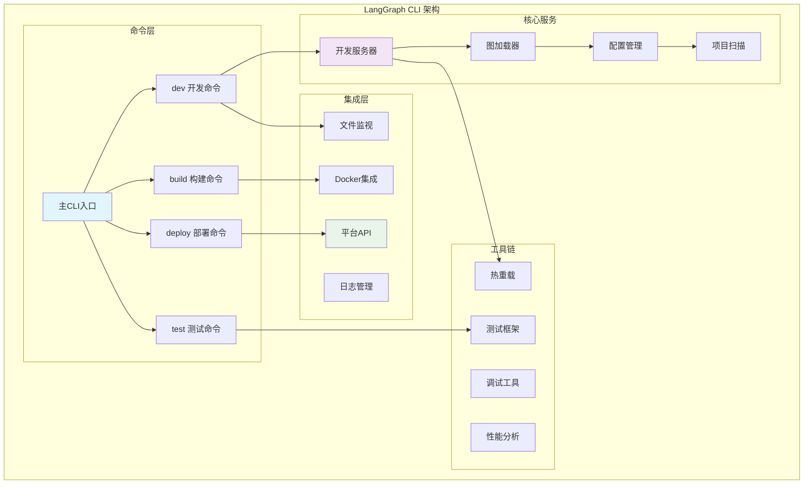
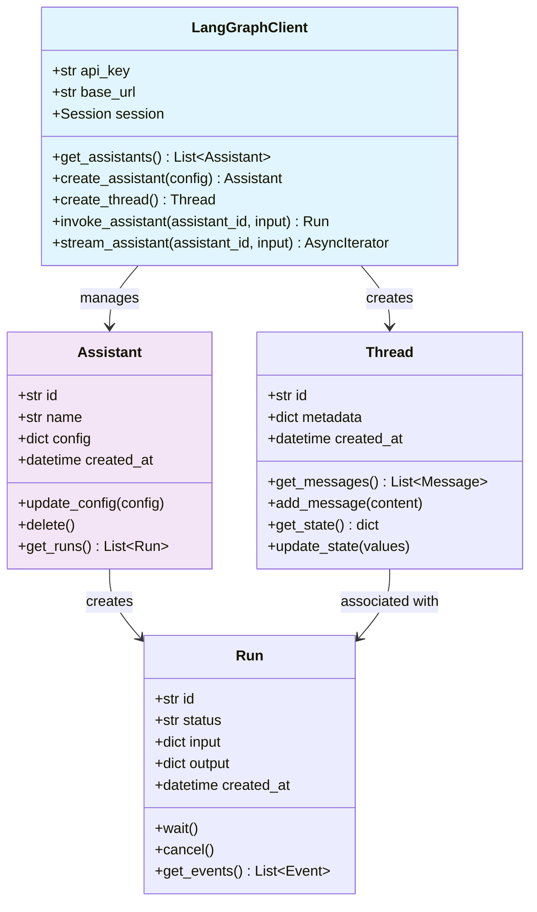

## 概述

LangGraph CLI和SDK模块为开发者提供了完整的工具链支持，从本地开发调试到生产环境部署，再到多语言平台集成。这些开发工具的架构设计和实现原理。

<!--more-->

## 1. LangGraph CLI：命令行开发工具

### 1.1 CLI架构图



### 1.2 核心CLI命令实现

```python
import click
import asyncio
import uvicorn
from pathlib import Path
from typing import Optional, Dict, Any

@click.group()
@click.version_option()
@click.pass_context
def cli(ctx: click.Context):
    """LangGraph CLI - 智能体应用开发工具链
    
    提供本地开发、测试、构建和部署的完整工具支持
    """
    ctx.ensure_object(dict)

@cli.command()
@click.option("--host", default="localhost", help="开发服务器主机")
@click.option("--port", default=8123, help="开发服务器端口")
@click.option("--reload", is_flag=True, help="启用热重载")
@click.option("--debug", is_flag=True, help="启用调试模式")
@click.argument("app_path", required=False)
@click.pass_context
def dev(
    ctx: click.Context,
    host: str,
    port: int,
    reload: bool,
    debug: bool,
    app_path: Optional[str],
):
    """启动开发服务器
    
    启动本地开发服务器，支持热重载和交互式调试
    
    Examples:
        langgraph dev
        langgraph dev --port 8000 --reload
        langgraph dev ./my_agent.py --debug
    """
    # 查找应用配置
    config = _find_app_config(app_path or ".")
    
    if not config:
        click.echo("❌ 未找到有效的LangGraph应用配置", err=True)
        click.echo("请确保存在 langgraph.json 或 pyproject.toml 配置文件")
        return 1
    
    # 启动开发服务器
    click.echo(f"🚀 启动LangGraph开发服务器...")
    click.echo(f"📡 服务地址: http://{host}:{port}")
    click.echo(f"🔥 热重载: {'启用' if reload else '禁用'}")
    
    server_config = {
        "app": "langgraph.cli.server:create_app",
        "host": host,
        "port": port,
        "reload": reload,
        "log_level": "debug" if debug else "info",
        "factory": True,
        "app_dir": str(Path(config["root"]).absolute()),
    }
    
    # 设置环境变量
    os.environ["LANGGRAPH_CONFIG"] = json.dumps(config)
    
    try:
        uvicorn.run(**server_config)
    except KeyboardInterrupt:
        click.echo("\n👋 开发服务器已停止")

@cli.command()
@click.option("--output", "-o", help="输出目录")
@click.option("--platform", default="docker", help="目标平台")
@click.option("--tag", help="构建标签")
@click.argument("app_path", required=False)
def build(output: Optional[str], platform: str, tag: Optional[str], app_path: Optional[str]):
    """构建应用部署包
    
    将LangGraph应用构建为可部署的容器或包
    
    Examples:
        langgraph build
        langgraph build --platform docker --tag my-agent:latest
        langgraph build --output ./dist
    """
    config = _find_app_config(app_path or ".")
    if not config:
        click.echo("❌ 未找到应用配置", err=True)
        return 1
    
    builder = AppBuilder(config)
    
    click.echo("🔨 开始构建应用...")
    
    try:
        if platform == "docker":
            result = builder.build_docker(tag=tag, output_dir=output)
            click.echo(f"✅ Docker镜像构建成功: {result['image_tag']}")
        elif platform == "python":
            result = builder.build_python_package(output_dir=output)
            click.echo(f"✅ Python包构建成功: {result['package_path']}")
        else:
            click.echo(f"❌ 不支持的平台: {platform}", err=True)
            return 1
            
    except Exception as e:
        click.echo(f"❌ 构建失败: {e}", err=True)
        return 1

@cli.command()
@click.option("--env", default="production", help="部署环境")
@click.option("--config", help="部署配置文件")
@click.option("--dry-run", is_flag=True, help="模拟部署（不实际执行）")
@click.argument("app_path", required=False)
def deploy(env: str, config: Optional[str], dry_run: bool, app_path: Optional[str]):
    """部署应用到云平台
    
    将构建好的应用部署到LangGraph Cloud或其他平台
    
    Examples:
        langgraph deploy
        langgraph deploy --env staging --dry-run
        langgraph deploy --config ./deploy.yaml
    """
    app_config = _find_app_config(app_path or ".")
    if not app_config:
        click.echo("❌ 未找到应用配置", err=True)
        return 1
    
    # 加载部署配置
    deploy_config = _load_deploy_config(config, env)
    
    deployer = AppDeployer(app_config, deploy_config)
    
    if dry_run:
        click.echo("🔍 模拟部署模式...")
        result = deployer.plan_deployment()
        click.echo("📋 部署计划:")
        for step in result["steps"]:
            click.echo(f"  • {step}")
        return 0
    
    click.echo(f"🚀 开始部署到 {env} 环境...")
    
    try:
        result = deployer.deploy()
        click.echo(f"✅ 部署成功!")
        click.echo(f"🌐 应用URL: {result['url']}")
        click.echo(f"📊 监控面板: {result['dashboard_url']}")
        
    except Exception as e:
        click.echo(f"❌ 部署失败: {e}", err=True)
        return 1

@cli.command()
@click.option("--watch", is_flag=True, help="监视文件变化并自动重新运行")
@click.option("--coverage", is_flag=True, help="生成代码覆盖率报告")
@click.option("--verbose", "-v", is_flag=True, help="详细输出")
@click.argument("test_path", required=False)
def test(watch: bool, coverage: bool, verbose: bool, test_path: Optional[str]):
    """运行测试套件
    
    执行应用的单元测试和集成测试
    
    Examples:
        langgraph test
        langgraph test --watch --coverage
        langgraph test ./tests/test_agent.py
    """
    config = _find_app_config(".")
    
    test_runner = TestRunner(config)
    test_runner.setup_environment()
    
    if watch:
        click.echo("👀 文件监视模式已启用")
        test_runner.run_with_watch(test_path, coverage=coverage, verbose=verbose)
    else:
        click.echo("🧪 运行测试...")
        results = test_runner.run_tests(test_path, coverage=coverage, verbose=verbose)
        
        if results["passed"]:
            click.echo(f"✅ 测试通过: {results['passed']}/{results['total']}")
        else:
            click.echo(f"❌ 测试失败: {results['failed']}/{results['total']}", err=True)
            return 1

# 辅助函数实现
def _find_app_config(path: str) -> Optional[Dict[str, Any]]:
    """查找应用配置文件"""
    search_path = Path(path)
    
    # 查找 langgraph.json
    for parent in [search_path] + list(search_path.parents):
        config_file = parent / "langgraph.json"
        if config_file.exists():
            with open(config_file) as f:
                config = json.load(f)
                config["root"] = str(parent)
                return config
    
    # 查找 pyproject.toml 中的配置
    for parent in [search_path] + list(search_path.parents):
        toml_file = parent / "pyproject.toml"
        if toml_file.exists():
            try:
                import tomli
                with open(toml_file, "rb") as f:
                    data = tomli.load(f)
                
                if "tool" in data and "langgraph" in data["tool"]:
                    config = data["tool"]["langgraph"]
                    config["root"] = str(parent)
                    return config
            except ImportError:
                continue
    
    return None

class AppBuilder:
    """应用构建器"""
    
    def __init__(self, config: Dict[str, Any]):
        self.config = config
        self.root_path = Path(config["root"])
    
    def build_docker(self, tag: Optional[str] = None, output_dir: Optional[str] = None) -> Dict[str, Any]:
        """构建Docker镜像"""
        import docker
        
        client = docker.from_env()
        
        # 生成Dockerfile
        dockerfile_content = self._generate_dockerfile()
        dockerfile_path = self.root_path / "Dockerfile.langgraph"
        
        with open(dockerfile_path, "w") as f:
            f.write(dockerfile_content)
        
        # 构建镜像
        image_tag = tag or f"langgraph-app:{int(time.time())}"
        
        try:
            image, build_logs = client.images.build(
                path=str(self.root_path),
                dockerfile="Dockerfile.langgraph",
                tag=image_tag,
                rm=True,
            )
            
            return {
                "image_tag": image_tag,
                "image_id": image.id,
                "size": image.attrs["Size"],
            }
        finally:
            # 清理临时文件
            dockerfile_path.unlink(missing_ok=True)
    
    def _generate_dockerfile(self) -> str:
        """生成Dockerfile内容"""
        python_version = self.config.get("python_version", "3.11")
        
        return f"""
FROM python:{python_version}-slim

WORKDIR /app

# 安装系统依赖
RUN apt-get update && apt-get install -y \\
    gcc \\
    && rm -rf /var/lib/apt/lists/*

# 复制依赖文件
COPY requirements.txt* pyproject.toml* ./

# 安装Python依赖
RUN pip install --no-cache-dir -r requirements.txt || \\
    pip install --no-cache-dir .

# 复制应用代码
COPY . .

# 设置环境变量
ENV PYTHONPATH=/app
ENV LANGGRAPH_ENV=production

# 暴露端口
EXPOSE 8000

# 启动命令
CMD ["python", "-m", "langgraph", "serve", "--host", "0.0.0.0", "--port", "8000"]
"""

class AppDeployer:
    """应用部署器"""
    
    def __init__(self, app_config: Dict[str, Any], deploy_config: Dict[str, Any]):
        self.app_config = app_config
        self.deploy_config = deploy_config
    
    def plan_deployment(self) -> Dict[str, Any]:
        """规划部署步骤"""
        steps = [
            "验证应用配置",
            "构建部署镜像",
            "推送到容器注册表", 
            "更新云平台配置",
            "执行滚动部署",
            "验证部署状态",
            "配置监控和告警",
        ]
        
        return {"steps": steps}
    
    def deploy(self) -> Dict[str, Any]:
        """执行部署"""
        # 这里是部署逻辑的简化实现
        platform = self.deploy_config.get("platform", "langgraph-cloud")
        
        if platform == "langgraph-cloud":
            return self._deploy_to_langgraph_cloud()
        elif platform == "kubernetes":
            return self._deploy_to_kubernetes()
        else:
            raise ValueError(f"不支持的部署平台: {platform}")
    
    def _deploy_to_langgraph_cloud(self) -> Dict[str, Any]:
        """部署到LangGraph Cloud"""
        # 模拟云平台部署
        app_name = self.app_config.get("name", "unnamed-app")
        
        return {
            "url": f"https://{app_name}.langgraph.cloud",
            "dashboard_url": f"https://console.langgraph.cloud/apps/{app_name}",
            "status": "deployed",
        }

class TestRunner:
    """测试运行器"""
    
    def __init__(self, config: Dict[str, Any]):
        self.config = config
        self.root_path = Path(config["root"])
    
    def setup_environment(self):
        """设置测试环境"""
        # 设置测试环境变量
        os.environ["LANGGRAPH_ENV"] = "test"
        os.environ["PYTHONPATH"] = str(self.root_path)
    
    def run_tests(
        self, 
        test_path: Optional[str] = None,
        coverage: bool = False,
        verbose: bool = False
    ) -> Dict[str, Any]:
        """运行测试"""
        import pytest
        
        args = []
        
        if test_path:
            args.append(test_path)
        else:
            # 默认测试目录
            test_dirs = ["tests", "test"]
            for test_dir in test_dirs:
                if (self.root_path / test_dir).exists():
                    args.append(str(self.root_path / test_dir))
                    break
        
        if verbose:
            args.append("-v")
        
        if coverage:
            args.extend(["--cov", ".", "--cov-report", "term-missing"])
        
        # 运行pytest
        result = pytest.main(args)
        
        return {
            "total": 0,  # 实际实现中需要解析pytest结果
            "passed": 0,
            "failed": 0,
            "exit_code": result,
        }

if __name__ == "__main__":
    cli()
```

### 1.3 开发服务器实现

```python
from fastapi import FastAPI, WebSocket
from fastapi.staticfiles import StaticFiles
from fastapi.responses import HTMLResponse
import asyncio
import json
from pathlib import Path
from typing import Dict, Any, List
from watchfiles import awatch

class LangGraphDevServer:
    """LangGraph开发服务器
    
    提供热重载、调试接口、图可视化等开发功能
    """
    
    def __init__(self, config: Dict[str, Any]):
        self.config = config
        self.app = FastAPI(title="LangGraph Dev Server")
        self.active_connections: List[WebSocket] = []
        self.graph_cache: Dict[str, Any] = {}
        
        self._setup_routes()
        self._setup_websocket()
    
    def _setup_routes(self):
        """设置API路由"""
        
        @self.app.get("/")
        async def home():
            return HTMLResponse(self._get_dashboard_html())
        
        @self.app.get("/api/graphs")
        async def list_graphs():
            """列出所有可用的图"""
            return {"graphs": list(self.graph_cache.keys())}
        
        @self.app.get("/api/graphs/{graph_id}")
        async def get_graph(graph_id: str):
            """获取指定图的详细信息"""
            if graph_id in self.graph_cache:
                return self.graph_cache[graph_id]
            return {"error": "Graph not found"}
        
        @self.app.post("/api/graphs/{graph_id}/invoke")
        async def invoke_graph(graph_id: str, payload: dict):
            """调用指定图"""
            try:
                graph = self._load_graph(graph_id)
                result = await graph.ainvoke(
                    payload.get("input", {}),
                    config=payload.get("config", {})
                )
                return {"result": result}
            except Exception as e:
                return {"error": str(e)}
        
        @self.app.get("/api/debug/state/{thread_id}")
        async def get_debug_state(thread_id: str):
            """获取调试状态"""
            # 从检查点保存器获取状态
            checkpointer = self._get_checkpointer()
            if checkpointer:
                config = {"configurable": {"thread_id": thread_id}}
                state = checkpointer.get(config)
                return {"state": state}
            return {"error": "No checkpointer configured"}
    
    def _setup_websocket(self):
        """设置WebSocket连接"""
        
        @self.app.websocket("/ws")
        async def websocket_endpoint(websocket: WebSocket):
            await websocket.accept()
            self.active_connections.append(websocket)
            
            try:
                while True:
                    data = await websocket.receive_text()
                    message = json.loads(data)
                    await self._handle_websocket_message(websocket, message)
            except Exception as e:
                print(f"WebSocket错误: {e}")
            finally:
                self.active_connections.remove(websocket)
    
    async def _handle_websocket_message(self, websocket: WebSocket, message: dict):
        """处理WebSocket消息"""
        msg_type = message.get("type")
        
        if msg_type == "ping":
            await websocket.send_json({"type": "pong"})
        elif msg_type == "subscribe_logs":
            # 订阅日志
            pass
        elif msg_type == "hot_reload":
            # 触发热重载
            await self._trigger_hot_reload()
    
    async def start_file_watcher(self):
        """启动文件监视器"""
        watch_paths = [
            Path(self.config["root"]),
        ]
        
        async for changes in awatch(*watch_paths):
            await self._handle_file_changes(changes)
    
    async def _handle_file_changes(self, changes):
        """处理文件变化"""
        python_files_changed = any(
            str(path).endswith('.py') for _, path in changes
        )
        
        if python_files_changed:
            print("📁 检测到Python文件变化，重新加载...")
            await self._reload_graphs()
            await self._notify_clients("reload", {"reason": "file_change"})
    
    async def _reload_graphs(self):
        """重新加载图定义"""
        try:
            # 清除模块缓存
            import sys
            modules_to_remove = [
                name for name in sys.modules 
                if name.startswith(self.config.get("module_prefix", ""))
            ]
            for module in modules_to_remove:
                del sys.modules[module]
            
            # 重新扫描图
            self.graph_cache.clear()
            await self._scan_graphs()
            
        except Exception as e:
            print(f"重新加载失败: {e}")
    
    async def _notify_clients(self, event_type: str, data: dict):
        """通知所有连接的客户端"""
        message = {"type": event_type, "data": data}
        disconnected = []
        
        for connection in self.active_connections:
            try:
                await connection.send_json(message)
            except:
                disconnected.append(connection)
        
        # 移除断开的连接
        for conn in disconnected:
            self.active_connections.remove(conn)
    
    def _get_dashboard_html(self) -> str:
        """生成开发面板HTML"""
        return """
<!DOCTYPE html>
<html>
<head>
    <title>LangGraph 开发面板</title>
    <style>
        body { font-family: Arial, sans-serif; margin: 20px; }
        .header { border-bottom: 1px solid #ccc; padding-bottom: 10px; }
        .graph-list { margin-top: 20px; }
        .graph-item { 
            border: 1px solid #ddd; 
            margin: 10px 0; 
            padding: 15px; 
            border-radius: 5px; 
        }
        .status { 
            display: inline-block; 
            padding: 3px 8px; 
            border-radius: 3px; 
            color: white; 
            font-size: 12px; 
        }
        .status.active { background-color: #4CAF50; }
        .status.error { background-color: #f44336; }
    </style>
</head>
<body>
    <div class="header">
        <h1>🔧 LangGraph 开发面板</h1>
        <p>实时监控和调试您的LangGraph应用</p>
    </div>
    
    <div id="graphs" class="graph-list">
        <p>正在加载图列表...</p>
    </div>
    
    <script>
        const ws = new WebSocket(`ws://${window.location.host}/ws`);
        
        ws.onmessage = function(event) {
            const message = JSON.parse(event.data);
            if (message.type === 'reload') {
                location.reload();
            }
        };
        
        // 加载图列表
        fetch('/api/graphs')
            .then(response => response.json())
            .then(data => {
                const container = document.getElementById('graphs');
                container.innerHTML = data.graphs.map(graph => `
                    <div class="graph-item">
                        <h3>${graph}</h3>
                        <span class="status active">活跃</span>
                        <p>图节点数量: --</p>
                        <button onclick="testGraph('${graph}')">测试运行</button>
                    </div>
                `).join('');
            })
            .catch(error => {
                document.getElementById('graphs').innerHTML = 
                    '<p>❌ 加载图列表失败: ' + error + '</p>';
            });
        
        function testGraph(graphId) {
            const payload = {
                input: {"messages": [{"role": "user", "content": "Hello"}]},
                config: {}
            };
            
            fetch(`/api/graphs/${graphId}/invoke`, {
                method: 'POST',
                headers: {'Content-Type': 'application/json'},
                body: JSON.stringify(payload)
            })
            .then(response => response.json())
            .then(result => {
                alert('测试结果: ' + JSON.stringify(result, null, 2));
            })
            .catch(error => {
                alert('测试失败: ' + error);
            });
        }
    </script>
</body>
</html>
        """

def create_app() -> FastAPI:
    """创建开发服务器应用"""
    config_str = os.environ.get("LANGGRAPH_CONFIG")
    if not config_str:
        raise ValueError("未找到LANGGRAPH_CONFIG环境变量")
    
    config = json.loads(config_str)
    server = LangGraphDevServer(config)
    
    # 启动文件监视器
    asyncio.create_task(server.start_file_watcher())
    
    return server.app
```

## 2. Python SDK：平台API客户端

### 2.1 SDK架构设计



### 2.2 Python SDK核心实现

```python
import asyncio
import json
import httpx
from typing import Optional, Dict, Any, List, AsyncIterator, Union
from dataclasses import dataclass
from datetime import datetime

@dataclass
class Assistant:
    """智能体助手"""
    id: str
    name: str
    config: Dict[str, Any]
    created_at: datetime
    client: 'LangGraphClient'
    
    async def update_config(self, config: Dict[str, Any]) -> 'Assistant':
        """更新助手配置"""
        return await self.client.update_assistant(self.id, config)
    
    async def delete(self) -> None:
        """删除助手"""
        await self.client.delete_assistant(self.id)
    
    async def invoke(
        self, 
        input: Dict[str, Any],
        *,
        thread_id: Optional[str] = None,
        config: Optional[Dict[str, Any]] = None,
    ) -> Dict[str, Any]:
        """调用助手"""
        return await self.client.invoke_assistant(
            self.id, input, thread_id=thread_id, config=config
        )
    
    async def stream(
        self,
        input: Dict[str, Any], 
        *,
        thread_id: Optional[str] = None,
        config: Optional[Dict[str, Any]] = None,
    ) -> AsyncIterator[Dict[str, Any]]:
        """流式调用助手"""
        async for event in self.client.stream_assistant(
            self.id, input, thread_id=thread_id, config=config
        ):
            yield event

@dataclass  
class Thread:
    """对话线程"""
    id: str
    metadata: Dict[str, Any]
    created_at: datetime
    client: 'LangGraphClient'
    
    async def get_messages(self) -> List[Dict[str, Any]]:
        """获取消息历史"""
        return await self.client.get_thread_messages(self.id)
    
    async def add_message(self, content: str, role: str = "user") -> Dict[str, Any]:
        """添加消息"""
        return await self.client.add_thread_message(self.id, content, role)
    
    async def get_state(self) -> Dict[str, Any]:
        """获取线程状态"""
        return await self.client.get_thread_state(self.id)
    
    async def update_state(self, values: Dict[str, Any]) -> Dict[str, Any]:
        """更新线程状态"""
        return await self.client.update_thread_state(self.id, values)

class LangGraphClient:
    """LangGraph平台API客户端"""
    
    def __init__(
        self,
        api_key: Optional[str] = None,
        base_url: str = "https://api.langgraph.com",
        timeout: float = 60.0,
    ):
        self.api_key = api_key or self._get_api_key()
        self.base_url = base_url.rstrip("/")
        self.timeout = timeout
        
        self._client = httpx.AsyncClient(
            timeout=timeout,
            headers={
                "Authorization": f"Bearer {self.api_key}",
                "User-Agent": "langgraph-sdk-python/0.1.0",
            }
        )
    
    def _get_api_key(self) -> str:
        """获取API密钥"""
        import os
        api_key = os.environ.get("LANGGRAPH_API_KEY")
        if not api_key:
            raise ValueError("未设置LANGGRAPH_API_KEY环境变量")
        return api_key
    
    async def __aenter__(self):
        return self
    
    async def __aexit__(self, exc_type, exc_val, exc_tb):
        await self._client.aclose()
    
    # 助手管理
    async def get_assistants(self) -> List[Assistant]:
        """获取助手列表"""
        response = await self._client.get(f"{self.base_url}/assistants")
        response.raise_for_status()
        
        data = response.json()
        return [
            Assistant(
                id=item["id"],
                name=item["name"], 
                config=item["config"],
                created_at=datetime.fromisoformat(item["created_at"]),
                client=self,
            )
            for item in data["assistants"]
        ]
    
    async def create_assistant(
        self,
        name: str,
        config: Dict[str, Any],
        metadata: Optional[Dict[str, Any]] = None,
    ) -> Assistant:
        """创建新助手"""
        payload = {
            "name": name,
            "config": config,
            "metadata": metadata or {},
        }
        
        response = await self._client.post(
            f"{self.base_url}/assistants",
            json=payload,
        )
        response.raise_for_status()
        
        data = response.json()
        return Assistant(
            id=data["id"],
            name=data["name"],
            config=data["config"],
            created_at=datetime.fromisoformat(data["created_at"]),
            client=self,
        )
    
    async def get_assistant(self, assistant_id: str) -> Assistant:
        """获取指定助手"""
        response = await self._client.get(f"{self.base_url}/assistants/{assistant_id}")
        response.raise_for_status()
        
        data = response.json()
        return Assistant(
            id=data["id"],
            name=data["name"],
            config=data["config"],
            created_at=datetime.fromisoformat(data["created_at"]),
            client=self,
        )
    
    async def update_assistant(
        self, 
        assistant_id: str, 
        config: Dict[str, Any]
    ) -> Assistant:
        """更新助手配置"""
        response = await self._client.patch(
            f"{self.base_url}/assistants/{assistant_id}",
            json={"config": config},
        )
        response.raise_for_status()
        
        data = response.json()
        return Assistant(
            id=data["id"],
            name=data["name"],
            config=data["config"], 
            created_at=datetime.fromisoformat(data["created_at"]),
            client=self,
        )
    
    async def delete_assistant(self, assistant_id: str) -> None:
        """删除助手"""
        response = await self._client.delete(f"{self.base_url}/assistants/{assistant_id}")
        response.raise_for_status()
    
    # 线程管理
    async def create_thread(
        self, 
        metadata: Optional[Dict[str, Any]] = None
    ) -> Thread:
        """创建新线程"""
        payload = {"metadata": metadata or {}}
        
        response = await self._client.post(f"{self.base_url}/threads", json=payload)
        response.raise_for_status()
        
        data = response.json()
        return Thread(
            id=data["id"],
            metadata=data["metadata"],
            created_at=datetime.fromisoformat(data["created_at"]),
            client=self,
        )
    
    async def get_thread(self, thread_id: str) -> Thread:
        """获取指定线程"""
        response = await self._client.get(f"{self.base_url}/threads/{thread_id}")
        response.raise_for_status()
        
        data = response.json()
        return Thread(
            id=data["id"],
            metadata=data["metadata"],
            created_at=datetime.fromisoformat(data["created_at"]),
            client=self,
        )
    
    # 执行管理
    async def invoke_assistant(
        self,
        assistant_id: str,
        input: Dict[str, Any],
        *,
        thread_id: Optional[str] = None,
        config: Optional[Dict[str, Any]] = None,
    ) -> Dict[str, Any]:
        """同步调用助手"""
        payload = {
            "input": input,
            "config": config or {},
        }
        
        if thread_id:
            payload["thread_id"] = thread_id
        
        response = await self._client.post(
            f"{self.base_url}/assistants/{assistant_id}/invoke",
            json=payload,
        )
        response.raise_for_status()
        
        return response.json()
    
    async def stream_assistant(
        self,
        assistant_id: str,
        input: Dict[str, Any],
        *,
        thread_id: Optional[str] = None,
        config: Optional[Dict[str, Any]] = None,
    ) -> AsyncIterator[Dict[str, Any]]:
        """流式调用助手"""
        payload = {
            "input": input,
            "config": config or {},
        }
        
        if thread_id:
            payload["thread_id"] = thread_id
        
        async with self._client.stream(
            "POST",
            f"{self.base_url}/assistants/{assistant_id}/stream",
            json=payload,
        ) as response:
            response.raise_for_status()
            
            async for line in response.aiter_lines():
                if line.startswith("data: "):
                    try:
                        data = json.loads(line[6:])
                        yield data
                    except json.JSONDecodeError:
                        continue
    
    # 状态管理
    async def get_thread_state(self, thread_id: str) -> Dict[str, Any]:
        """获取线程状态"""
        response = await self._client.get(f"{self.base_url}/threads/{thread_id}/state")
        response.raise_for_status()
        return response.json()
    
    async def update_thread_state(
        self, 
        thread_id: str, 
        values: Dict[str, Any]
    ) -> Dict[str, Any]:
        """更新线程状态"""
        response = await self._client.patch(
            f"{self.base_url}/threads/{thread_id}/state",
            json={"values": values},
        )
        response.raise_for_status()
        return response.json()

# 使用示例
async def main():
    """SDK使用示例"""
    async with LangGraphClient() as client:
        # 创建助手
        assistant = await client.create_assistant(
            name="我的助手",
            config={
                "model": "gpt-4",
                "tools": ["web_search", "calculator"],
                "prompt": "你是一个有用的助手",
            }
        )
        
        print(f"创建助手: {assistant.name} ({assistant.id})")
        
        # 创建对话线程
        thread = await client.create_thread(
            metadata={"user_id": "user123"}
        )
        
        print(f"创建线程: {thread.id}")
        
        # 调用助手
        result = await assistant.invoke(
            {"messages": [{"role": "user", "content": "你好！"}]},
            thread_id=thread.id,
        )
        
        print(f"助手回复: {result}")
        
        # 流式调用
        print("流式回复:")
        async for event in assistant.stream(
            {"messages": [{"role": "user", "content": "今天天气怎么样？"}]},
            thread_id=thread.id,
        ):
            if event.get("type") == "message":
                print(event["content"], end="", flush=True)
        
        print("\n")

if __name__ == "__main__":
    asyncio.run(main())
```

## 3. JavaScript SDK：前端集成

### 3.1 TypeScript SDK实现

```typescript
// types.ts
export interface AssistantConfig {
  model: string;
  tools?: string[];
  prompt?: string;
  [key: string]: any;
}

export interface Assistant {
  id: string;
  name: string;
  config: AssistantConfig;
  created_at: string;
}

export interface Thread {
  id: string;
  metadata: Record<string, any>;
  created_at: string;
}

export interface Message {
  role: 'user' | 'assistant' | 'system';
  content: string;
  timestamp?: string;
}

export interface StreamEvent {
  type: string;
  data: any;
}

// client.ts
export class LangGraphClient {
  private apiKey: string;
  private baseUrl: string;
  private timeout: number;

  constructor(options: {
    apiKey?: string;
    baseUrl?: string;
    timeout?: number;
  } = {}) {
    this.apiKey = options.apiKey || this.getApiKey();
    this.baseUrl = options.baseUrl || 'https://api.langgraph.com';
    this.timeout = options.timeout || 60000;
  }

  private getApiKey(): string {
    if (typeof process !== 'undefined' && process.env) {
      return process.env.LANGGRAPH_API_KEY || '';
    }
    return '';
  }

  private async request<T>(
    endpoint: string,
    options: RequestInit = {}
  ): Promise<T> {
    const url = `${this.baseUrl}${endpoint}`;
    
    const response = await fetch(url, {
      ...options,
      headers: {
        'Authorization': `Bearer ${this.apiKey}`,
        'Content-Type': 'application/json',
        'User-Agent': 'langgraph-sdk-js/0.1.0',
        ...options.headers,
      },
      signal: AbortSignal.timeout(this.timeout),
    });

    if (!response.ok) {
      const errorBody = await response.text();
      throw new Error(`API request failed: ${response.status} ${errorBody}`);
    }

    return response.json();
  }

  // 助手管理
  async getAssistants(): Promise<Assistant[]> {
    const data = await this.request<{ assistants: Assistant[] }>('/assistants');
    return data.assistants;
  }

  async createAssistant(
    name: string,
    config: AssistantConfig,
    metadata?: Record<string, any>
  ): Promise<Assistant> {
    return this.request<Assistant>('/assistants', {
      method: 'POST',
      body: JSON.stringify({
        name,
        config,
        metadata: metadata || {},
      }),
    });
  }

  async getAssistant(assistantId: string): Promise<Assistant> {
    return this.request<Assistant>(`/assistants/${assistantId}`);
  }

  async updateAssistant(
    assistantId: string,
    config: AssistantConfig
  ): Promise<Assistant> {
    return this.request<Assistant>(`/assistants/${assistantId}`, {
      method: 'PATCH',
      body: JSON.stringify({ config }),
    });
  }

  async deleteAssistant(assistantId: string): Promise<void> {
    await this.request(`/assistants/${assistantId}`, {
      method: 'DELETE',
    });
  }

  // 线程管理
  async createThread(metadata?: Record<string, any>): Promise<Thread> {
    return this.request<Thread>('/threads', {
      method: 'POST',
      body: JSON.stringify({
        metadata: metadata || {},
      }),
    });
  }

  async getThread(threadId: string): Promise<Thread> {
    return this.request<Thread>(`/threads/${threadId}`);
  }

  // 执行管理
  async invokeAssistant(
    assistantId: string,
    input: Record<string, any>,
    options?: {
      threadId?: string;
      config?: Record<string, any>;
    }
  ): Promise<any> {
    const payload: any = {
      input,
      config: options?.config || {},
    };

    if (options?.threadId) {
      payload.thread_id = options.threadId;
    }

    return this.request(`/assistants/${assistantId}/invoke`, {
      method: 'POST',
      body: JSON.stringify(payload),
    });
  }

  async *streamAssistant(
    assistantId: string,
    input: Record<string, any>,
    options?: {
      threadId?: string;
      config?: Record<string, any>;
    }
  ): AsyncGenerator<StreamEvent, void, unknown> {
    const payload: any = {
      input,
      config: options?.config || {},
    };

    if (options?.threadId) {
      payload.thread_id = options.threadId;
    }

    const response = await fetch(
      `${this.baseUrl}/assistants/${assistantId}/stream`,
      {
        method: 'POST',
        headers: {
          'Authorization': `Bearer ${this.apiKey}`,
          'Content-Type': 'application/json',
          'Accept': 'text/event-stream',
        },
        body: JSON.stringify(payload),
      }
    );

    if (!response.ok) {
      throw new Error(`Stream request failed: ${response.status}`);
    }

    const reader = response.body?.getReader();
    if (!reader) {
      throw new Error('Response body is not readable');
    }

    const decoder = new TextDecoder();
    let buffer = '';

    try {
      while (true) {
        const { done, value } = await reader.read();
        if (done) break;

        buffer += decoder.decode(value, { stream: true });
        const lines = buffer.split('\n');
        buffer = lines.pop() || '';

        for (const line of lines) {
          if (line.startsWith('data: ')) {
            try {
              const data = JSON.parse(line.slice(6));
              yield data;
            } catch (e) {
              // 忽略JSON解析错误
            }
          }
        }
      }
    } finally {
      reader.releaseLock();
    }
  }

  // 状态管理
  async getThreadState(threadId: string): Promise<Record<string, any>> {
    return this.request(`/threads/${threadId}/state`);
  }

  async updateThreadState(
    threadId: string,
    values: Record<string, any>
  ): Promise<Record<string, any>> {
    return this.request(`/threads/${threadId}/state`, {
      method: 'PATCH',
      body: JSON.stringify({ values }),
    });
  }
}

// React Hook示例
import { useState, useEffect, useCallback } from 'react';

export function useLangGraph(apiKey?: string) {
  const [client, setClient] = useState<LangGraphClient | null>(null);
  
  useEffect(() => {
    setClient(new LangGraphClient({ apiKey }));
  }, [apiKey]);

  const createAssistant = useCallback(async (
    name: string,
    config: AssistantConfig
  ) => {
    if (!client) throw new Error('Client not initialized');
    return client.createAssistant(name, config);
  }, [client]);

  const invokeAssistant = useCallback(async (
    assistantId: string,
    input: Record<string, any>,
    threadId?: string
  ) => {
    if (!client) throw new Error('Client not initialized');
    return client.invokeAssistant(assistantId, input, { threadId });
  }, [client]);

  return {
    client,
    createAssistant,
    invokeAssistant,
  };
}

// React组件示例
import React, { useState } from 'react';

interface ChatComponentProps {
  assistantId: string;
  apiKey?: string;
}

export const ChatComponent: React.FC<ChatComponentProps> = ({
  assistantId,
  apiKey,
}) => {
  const [messages, setMessages] = useState<Message[]>([]);
  const [input, setInput] = useState('');
  const [loading, setLoading] = useState(false);
  const { client } = useLangGraph(apiKey);

  const sendMessage = async () => {
    if (!client || !input.trim()) return;

    const userMessage: Message = {
      role: 'user',
      content: input.trim(),
    };

    setMessages(prev => [...prev, userMessage]);
    setInput('');
    setLoading(true);

    try {
      let assistantMessage: Message = {
        role: 'assistant',
        content: '',
      };

      setMessages(prev => [...prev, assistantMessage]);

      // 流式接收回复
      for await (const event of client.streamAssistant(assistantId, {
        messages: [...messages, userMessage],
      })) {
        if (event.type === 'message') {
          assistantMessage.content += event.data.content;
          setMessages(prev => [
            ...prev.slice(0, -1),
            { ...assistantMessage }
          ]);
        }
      }
    } catch (error) {
      console.error('发送消息失败:', error);
    } finally {
      setLoading(false);
    }
  };

  return (
    <div className="chat-component">
      <div className="messages">
        {messages.map((message, index) => (
          <div key={index} className={`message ${message.role}`}>
            <strong>{message.role}:</strong> {message.content}
          </div>
        ))}
      </div>
      
      <div className="input-area">
        <input
          type="text"
          value={input}
          onChange={(e) => setInput(e.target.value)}
          onKeyPress={(e) => e.key === 'Enter' && sendMessage()}
          disabled={loading}
          placeholder="输入消息..."
        />
        <button onClick={sendMessage} disabled={loading || !input.trim()}>
          {loading ? '发送中...' : '发送'}
        </button>
      </div>
    </div>
  );
};
```

## 4. 企业级集成与最佳实践

### 4.1 微服务架构集成

展示LangGraph在企业级微服务架构中的集成方案：

```yaml
# docker-compose.enterprise.yml
version: '3.8'
services:
  langgraph-api:
    image: langgraph-app:latest
    ports:
      - "8000:8000"
    environment:
      - LANGGRAPH_ENV=production
      - DATABASE_URL=${DATABASE_URL}
      - REDIS_URL=${REDIS_URL}
    depends_on:
      - postgres
      - redis
    deploy:
      replicas: 3
      resources:
        limits:
          memory: 2G
          cpus: '1.0'
    healthcheck:
      test: ["CMD", "curl", "-f", "http://localhost:8000/health"]
      interval: 30s
      timeout: 10s
      retries: 3

  postgres:
    image: postgres:15
    environment:
      POSTGRES_DB: langgraph
      POSTGRES_USER: ${DB_USER}
      POSTGRES_PASSWORD: ${DB_PASSWORD}
    volumes:
      - postgres_data:/var/lib/postgresql/data
    ports:
      - "5432:5432"

  redis:
    image: redis:7-alpine
    ports:
      - "6379:6379"
    volumes:
      - redis_data:/data

  prometheus:
    image: prom/prometheus:latest
    ports:
      - "9090:9090"
    volumes:
      - ./monitoring/prometheus.yml:/etc/prometheus/prometheus.yml
      - prometheus_data:/prometheus

  grafana:
    image: grafana/grafana:latest
    ports:
      - "3000:3000"
    environment:
      - GF_SECURITY_ADMIN_PASSWORD=${GRAFANA_PASSWORD}
    volumes:
      - grafana_data:/var/lib/grafana

volumes:
  postgres_data:
  redis_data:
  prometheus_data:
  grafana_data:
```

### 4.2 完整开发工作流

```bash
# 1. 项目初始化
langgraph init my-agent --template react-agent

# 2. 本地开发
cd my-agent
langgraph dev --reload --debug

# 3. 编写测试
langgraph test --watch --coverage

# 4. 构建应用
langgraph build --platform docker --tag my-agent:v1.0.0

# 5. 部署到云端
langgraph deploy --env production
```

### 4.2 配置文件示例

```json
// langgraph.json
{
  "name": "my-intelligent-agent",
  "version": "1.0.0",
  "description": "智能客服助手",
  "main": "app/agent.py",
  "python_version": "3.11",
  "dependencies": [
    "langgraph>=0.1.0",
    "langchain-openai>=0.1.0",
    "langchain-community>=0.1.0"
  ],
  "environment": {
    "OPENAI_API_KEY": "${OPENAI_API_KEY}",
    "LANGGRAPH_ENV": "development"
  },
  "graphs": {
    "customer_service": {
      "path": "app.customer_service:create_agent",
      "description": "客服助手图"
    },
    "sales_assistant": {
      "path": "app.sales:create_agent", 
      "description": "销售助手图"
    }
  },
  "deployment": {
    "platform": "langgraph-cloud",
    "region": "us-west-2",
    "scaling": {
      "min_instances": 1,
      "max_instances": 10
    }
  }
}
```

### 4.3 流式处理增强

基于LangGraph 0.2.69版本的流式处理增强，展示实时交互的最佳实践：

```python
class StreamingEnhancementManager:
    """流式处理增强管理器"""
    
    def __init__(self, client: LangGraphClient):
        self.client = client
        self.stream_buffer = asyncio.Queue(maxsize=1000)
        self.connection_pool = {}
        
    async def enhanced_streaming(
        self,
        assistant_id: str,
        input_data: Dict[str, Any],
        *,
        stream_mode: str = "updates",
        buffer_size: int = 10,
        compression: bool = True,
    ) -> AsyncIterator[Dict[str, Any]]:
        """增强的流式处理：支持缓冲、压缩、错误恢复"""
        
        buffer = []
        retry_count = 0
        max_retries = 3
        
        while retry_count < max_retries:
            try:
                async for event in self.client.stream_assistant(
                    assistant_id, 
                    input_data,
                    config={"stream_mode": stream_mode}
                ):
                    # 缓冲机制
                    buffer.append(event)
                    
                    if len(buffer) >= buffer_size:
                        # 批量处理和压缩
                        processed_batch = await self._process_event_batch(
                            buffer, compression
                        )
                        
                        for processed_event in processed_batch:
                            yield processed_event
                        
                        buffer.clear()
                
                # 处理剩余缓冲
                if buffer:
                    processed_batch = await self._process_event_batch(buffer, compression)
                    for processed_event in processed_batch:
                        yield processed_event
                
                break  # 成功完成，跳出重试循环
                
            except Exception as e:
                retry_count += 1
                if retry_count >= max_retries:
                    raise
                
                # 指数退避重试
                await asyncio.sleep(2 ** retry_count)
                continue
    
    async def _process_event_batch(
        self, 
        events: List[Dict[str, Any]], 
        compression: bool
    ) -> List[Dict[str, Any]]:
        """处理事件批次"""
        processed_events = []
        
        for event in events:
            # 事件增强
            enhanced_event = {
                **event,
                "timestamp": time.time(),
                "processed_at": datetime.now(timezone.utc).isoformat(),
                "batch_id": str(uuid.uuid4()),
            }
            
            # 内容压缩（如果启用）
            if compression and "content" in enhanced_event:
                compressed_content = await self._compress_content(
                    enhanced_event["content"]
                )
                if len(compressed_content) < len(enhanced_event["content"]) * 0.8:
                    enhanced_event["content"] = compressed_content
                    enhanced_event["compressed"] = True
            
            processed_events.append(enhanced_event)
        
        return processed_events

# WebSocket实时通信
class WebSocketManager:
    """WebSocket管理器：支持实时双向通信"""
    
    def __init__(self):
        self.connections: Dict[str, WebSocket] = {}
        self.subscriptions: Dict[str, Set[str]] = defaultdict(set)
        
    async def handle_websocket_connection(self, websocket: WebSocket, client_id: str):
        """处理WebSocket连接"""
        await websocket.accept()
        self.connections[client_id] = websocket
        
        try:
            while True:
                # 接收客户端消息
                message = await websocket.receive_json()
                await self._handle_client_message(client_id, message)
                
        except WebSocketDisconnect:
            self._cleanup_connection(client_id)
        except Exception as e:
            logger.error(f"WebSocket error for client {client_id}: {e}")
            await websocket.close()
            self._cleanup_connection(client_id)
    
    async def _handle_client_message(self, client_id: str, message: Dict[str, Any]):
        """处理客户端消息"""
        message_type = message.get("type")
        
        if message_type == "subscribe":
            # 订阅特定事件类型
            event_types = message.get("events", [])
            for event_type in event_types:
                self.subscriptions[event_type].add(client_id)
                
        elif message_type == "invoke":
            # 直接调用智能体
            result = await self._invoke_assistant_streaming(
                client_id, message.get("data", {})
            )
            
        elif message_type == "ping":
            # 心跳检测
            websocket = self.connections[client_id]
            await websocket.send_json({"type": "pong", "timestamp": time.time()})
    
    async def broadcast_event(self, event_type: str, data: Dict[str, Any]):
        """广播事件到订阅的客户端"""
        if event_type not in self.subscriptions:
            return
        
        disconnected_clients = []
        
        for client_id in self.subscriptions[event_type]:
            if client_id in self.connections:
                try:
                    websocket = self.connections[client_id]
                    await websocket.send_json({
                        "type": "event",
                        "event_type": event_type,
                        "data": data,
                        "timestamp": time.time(),
                    })
                except:
                    disconnected_clients.append(client_id)
        
        # 清理断开的连接
        for client_id in disconnected_clients:
            self._cleanup_connection(client_id)
```

**流式处理特点**：
- **缓冲机制**：智能缓冲减少网络往返次数
- **压缩传输**：自动内容压缩节省带宽
- **错误恢复**：自动重试和故障恢复机制
- **实时通信**：WebSocket支持真正的实时双向通信

### 4.5 流模式对比（invoke vs stream vs updates）

| 维度 | invoke | stream | updates |
|---|---|---|---|
| 返回方式 | 一次性返回最终结果 | SSE按token/事件流式返回 | SSE按节点/超步增量返回 |
| 交互体验 | 简单、阻塞 | 实时Token级体验 | 结构化阶段性事件（节点完成/检查点） |
| 最佳场景 | 批处理、后端内部调用 | 前端实时对话渲染 | 需要可视化执行阶段与中间产物 |
| 容错/恢复 | 依赖检查点恢复 | 支持断线重连，需客户端缓存 | 天然契合检查点与阶段重放 |

选择建议：前端聊天 UI 使用 `stream` 提供细粒度Token体验；调试/教学/可视化使用 `updates`；后台任务用 `invoke` 简化消费。

### 4.6 错误码与重试策略

常见错误分类与建议重试：

- 429 RateLimited：指数退避重试（初始250ms，上限5s），并降低并发或切换低成本模型。
- 408/504 Timeout：指数退避 + 缩小payload/禁用大附件/缩短上下文。
- 5xx ServerError：短退避重试3次，超过阈值触发熔断与降级（切备用区域/模型）。
- 400/422 参数错误：不重试，记录审计日志并回传可读错误信息。

SDK侧统一重试封装（示例）：

```python
async def _with_retry(req_fn, *, max_retries: int = 3, base_delay: float = 0.25):
    attempt = 0
    while True:
        try:
            return await req_fn()
        except httpx.HTTPStatusError as e:
            status = e.response.status_code
            if status in (429, 500, 502, 503, 504) and attempt < max_retries:
                await asyncio.sleep(min(base_delay * (2 ** attempt), 5.0))
                attempt += 1
                continue
            raise
```

同时在CLI `dev`/`deploy`命令输出统一错误提示与排障建议，便于快速定位（网络、鉴权、配额、依赖版本等）。

### 4.4 最佳实践总结

1. **开发工作流**：
   - 使用CLI工具进行快速原型开发
   - 通过热重载实现快速迭代
   - 集成测试确保代码质量
   - 容器化构建保证环境一致性

2. **SDK集成**：
   - Python SDK适合后端服务集成
   - JavaScript SDK适合前端应用开发
   - 使用流式API提供实时体验
   - 合理管理线程和状态

3. **生产部署**：
   - 使用检查点保存器确保状态持久化
   - 配置监控和告警机制
   - 实施滚动部署策略
   - 建立日志和调试体系

4. **企业级特性**：
   - 多租户隔离和权限管理
   - 性能监控和自动扩缩容
   - 安全认证和数据加密
   - 故障恢复和熔断机制

## 5. 总结

LangGraph CLI和SDK工具链为开发者提供了从开发到部署的完整解决方案：

### 5.1 核心价值

- **开发效率**：CLI工具简化了常见开发任务
- **平台集成**：SDK提供多语言平台接入能力
- **生产就绪**：内置最佳实践和生产环境支持
- **开发体验**：热重载、调试、测试等现代开发特性

### 5.2 技术特色

1. **统一工具链**：从本地开发到云端部署的一致体验
2. **多语言支持**：Python和JavaScript SDK满足不同技术栈需求
3. **实时特性**：WebSocket和流式API支持实时交互
4. **云原生**：容器化和微服务架构支持

### 5.3 应用场景

- **企业应用集成**：通过SDK将LangGraph能力集成到现有系统
- **快速原型开发**：使用CLI工具快速验证想法和概念
- **生产环境部署**：完整的构建和部署流水线支持
- **团队协作开发**：标准化的项目结构和工作流

通过合理使用这些工具，开发团队能够高效地构建、测试和部署复杂的智能体应用，同时保持良好的代码质量和用户体验。

