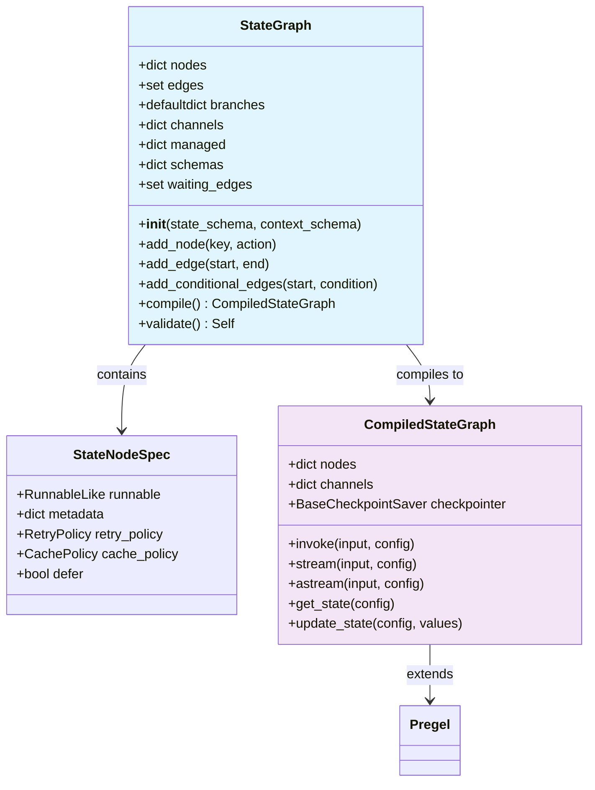
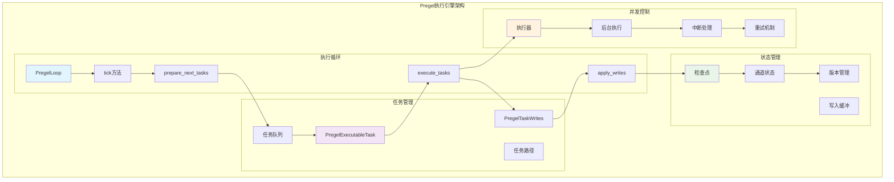

## 概述

LangGraph核心模块是整个框架的心脏，包含了StateGraph图构建API和Pregel执行引擎。这两个核心组件的源码实现，揭示其设计思想和技术细节。

<!--more-->

## 1. StateGraph：状态图构建器

### 1.1 类结构图



### 1.2 StateGraph核心实现

```python
class StateGraph(Generic[StateT, ContextT, InputT, OutputT]):
    """状态图：基于共享状态的图计算模型
    
    每个节点的签名为 State -> Partial<State>
    状态键可以使用reducer函数进行聚合，签名为 (Value, Value) -> Value
    
    Args:
        state_schema: 状态模式类定义
        context_schema: 运行时上下文模式类定义
        input_schema: 输入模式类定义  
        output_schema: 输出模式类定义
    """
    
    # 核心数据结构
    edges: set[tuple[str, str]]                                    # 边集合
    nodes: dict[str, StateNodeSpec[Any, ContextT]]                 # 节点映射
    branches: defaultdict[str, dict[str, BranchSpec]]              # 分支映射
    channels: dict[str, BaseChannel]                               # 通道映射
    managed: dict[str, ManagedValueSpec]                           # 托管值映射
    schemas: dict[type[Any], dict[str, BaseChannel | ManagedValueSpec]]  # 模式映射
    waiting_edges: set[tuple[tuple[str, ...], str]]               # 等待边集合
    
    def __init__(
        self,
        state_schema: type[StateT],                                 # 状态模式
        context_schema: type[ContextT] | None = None,              # 上下文模式
        *,
        input_schema: type[InputT] | None = None,                  # 输入模式
        output_schema: type[OutputT] | None = None,                # 输出模式
        **kwargs: Unpack[DeprecatedKwargs],
    ) -> None:
        # 初始化核心数据结构
        self.nodes = {}                    # 节点字典：节点名 -> 节点规格
        self.edges = set()                 # 边集合：(起始节点, 结束节点)
        self.branches = defaultdict(dict)  # 分支字典：起始节点 -> {分支名: 分支规格}
        self.schemas = {}                  # 模式字典：类型 -> {键名: 通道/托管值}
        self.channels = {}                 # 通道字典：通道名 -> 通道实例
        self.managed = {}                  # 托管值字典：键名 -> 托管值规格
        self.compiled = False              # 编译状态标志
        self.waiting_edges = set()         # 等待边集合
        
        # 设置模式
        self.state_schema = state_schema
        self.input_schema = cast(type[InputT], input_schema or state_schema)
        self.output_schema = cast(type[OutputT], output_schema or state_schema)
        self.context_schema = context_schema
        
        # 解析并添加模式
        self._add_schema(self.state_schema)                        # 添加状态模式
        self._add_schema(self.input_schema, allow_managed=False)   # 添加输入模式
        self._add_schema(self.output_schema, allow_managed=False)  # 添加输出模式
```

**StateGraph初始化过程**：

1. **数据结构初始化**：创建nodes、edges、branches等核心容器
2. **模式设置**：保存状态、输入、输出、上下文模式类型
3. **模式解析**：通过`_add_schema`方法解析TypedDict和Annotated类型

### 1.3 添加节点的实现

```python
@overload
def add_node(
    self, 
    key: str, 
    action: StateNode[StateT, ContextT]
) -> Self: ...

@overload
def add_node(
    self, 
    action: StateNode[StateT, ContextT]
) -> Self: ...

def add_node(
    self,
    key: str | StateNode[StateT, ContextT],
    action: StateNode[StateT, ContextT] | None = None,
    *,
    metadata: dict[str, Any] | None = None,
    input: type[Any] | None = None,
    retry: RetryPolicy | None = None,
    cache: CachePolicy | None = None,
    defer: bool = False,
) -> Self:
    """添加节点到图中
    
    Args:
        key: 节点标识符或节点函数
        action: 节点函数（当key是字符串时）
        metadata: 节点元数据
        input: 输入类型限制
        retry: 重试策略  
        cache: 缓存策略
        defer: 是否延迟执行
        
    Returns:
        Self: 返回图实例以支持链式调用
    """
    if self.compiled:
        logger.warning("Cannot add node to a graph that has been compiled.")
        return self
    
    # 处理参数重载
    if not isinstance(key, str):
        action = key
        if hasattr(action, "__name__"):
            key = action.__name__
        else:
            key = _get_node_name(action)
    
    if key in self.nodes:
        raise ValueError(f"Node '{key}' already exists")
    
    # 创建节点规格
    spec = StateNodeSpec(
        runnable=coerce_to_runnable(action),  # 将函数转换为Runnable
        metadata=metadata or {},
        input_keys=self._get_input_keys(input) if input else None,
        retry_policy=retry,
        cache_policy=cache, 
        defer=defer,
    )
    
    # 添加到节点字典
    self.nodes[key] = spec
    return self

def _get_input_keys(self, input_type: type[Any]) -> set[str]:
    """从输入类型提取键名集合"""
    if is_typeddict(input_type):
        return set(get_type_hints(input_type).keys())
    elif hasattr(input_type, "__annotations__"):
        return set(input_type.__annotations__.keys())
    else:
        return set()
```

**添加节点的核心步骤**：

1. **参数标准化**：处理函数重载，确定节点名称
2. **冲突检查**：验证节点名称唯一性
3. **Runnable转换**：将普通函数转换为LangChain Runnable接口
4. **规格创建**：封装节点配置为StateNodeSpec对象
5. **注册存储**：将节点添加到图的节点字典中

### 1.4 添加边的实现

```python
def add_edge(self, start: str | Sequence[str], end: str | str) -> Self:
    """添加边到图中
    
    Args:
        start: 起始节点（单个或多个）
        end: 结束节点
        
    Returns:
        Self: 返回图实例以支持链式调用
    """
    if self.compiled:
        logger.warning("Cannot add edge to a graph that has been compiled.")
        return self
    
    # 处理多起始节点的情况（JOIN操作）
    if isinstance(start, (list, tuple, set)):
        if len(start) == 0:
            raise ValueError("Start nodes cannot be empty")
        
        # 验证所有起始节点存在
        for s in start:
            if s not in self.nodes and s != START:
                raise ValueError(f"Start node '{s}' does not exist")
        
        # 验证结束节点存在
        if end not in self.nodes and end != END:
            raise ValueError(f"End node '{end}' does not exist")
        
        # 添加到等待边集合（用于JOIN语义）
        self.waiting_edges.add((tuple(start), end))
        
    else:
        # 处理单起始节点的情况
        if start not in self.nodes and start != START:
            raise ValueError(f"Start node '{start}' does not exist")
        
        if end not in self.nodes and end != END:
            raise ValueError(f"End node '{end}' does not exist")
        
        # 添加到边集合
        self.edges.add((start, end))
    
    return self

def add_conditional_edges(
    self,
    source: str,                                    # 源节点
    condition: Callable[..., str | Sequence[str]], # 条件函数
    conditional_edge_mapping: dict[str, str] | None = None,  # 条件映射
    then: str | None = None,                       # 默认目标
) -> Self:
    """添加条件边到图中
    
    条件边根据条件函数的返回值决定下一个执行的节点
    
    Args:
        source: 源节点名称
        condition: 条件函数，返回下一个节点名称
        conditional_edge_mapping: 条件值到节点的映射
        then: 默认目标节点
        
    Returns:
        Self: 返回图实例以支持链式调用
    """
    if self.compiled:
        logger.warning("Cannot add conditional edges to a graph that has been compiled.")
        return self
    
    # 验证源节点存在
    if source not in self.nodes:
        raise ValueError(f"Source node '{source}' does not exist")
    
    # 创建分支规格
    branch_spec = BranchSpec(
        condition=condition,
        mapping=conditional_edge_mapping or {},
        then=then,
    )
    
    # 生成分支名称（基于条件函数）
    branch_name = getattr(condition, "__name__", f"branch_{len(self.branches[source])}")
    
    # 添加到分支字典
    self.branches[source][branch_name] = branch_spec
    
    return self
```

**边类型说明**：

- **普通边**：固定的单向连接，存储在`edges`集合中
- **等待边**：多个节点合并到一个节点，存储在`waiting_edges`集合中
- **条件边**：基于条件函数动态选择目标，存储在`branches`字典中

### 1.5 模式解析机制

```python
def _add_schema(self, schema: type[Any], /, allow_managed: bool = True) -> None:
    """解析并添加模式到图中
    
    Args:
        schema: 要解析的模式类型
        allow_managed: 是否允许托管值
    """
    if schema in self.schemas:
        return  # 避免重复解析
    
    schema_dict = {}
    
    # 解析TypedDict类型
    if is_typeddict(schema):
        type_hints = get_type_hints(schema, include_extras=True)
        for key, typ in type_hints.items():
            channel_or_managed = self._create_channel_or_managed(
                key, typ, allow_managed
            )
            schema_dict[key] = channel_or_managed
    
    # 解析Pydantic模型
    elif issubclass(schema, BaseModel):
        for field_name, field_info in schema.model_fields.items():
            channel_or_managed = self._create_channel_or_managed(
                field_name, field_info.annotation, allow_managed
            )
            schema_dict[field_name] = channel_or_managed
    
    # 处理单一类型（创建__root__通道）
    else:
        channel_or_managed = self._create_channel_or_managed(
            "__root__", schema, allow_managed
        )
        schema_dict["__root__"] = channel_or_managed
    
    # 存储解析结果
    self.schemas[schema] = schema_dict
    
    # 分别添加到通道和托管值字典
    for key, value in schema_dict.items():
        if is_managed_value(value):
            if allow_managed:
                self.managed[key] = value
        else:
            self.channels[key] = value

def _create_channel_or_managed(
    self, 
    key: str, 
    typ: type[Any], 
    allow_managed: bool
) -> BaseChannel | ManagedValueSpec:
    """为给定类型创建通道或托管值
    
    Args:
        key: 键名
        typ: 类型注解
        allow_managed: 是否允许托管值
        
    Returns:
        BaseChannel | ManagedValueSpec: 通道或托管值规格
    """
    # 检查是否是Annotated类型
    origin = get_origin(typ)
    args = get_args(typ)
    
    if origin is Union:
        # 处理Union类型（如Optional）
        non_none_types = [arg for arg in args if arg is not type(None)]
        if len(non_none_types) == 1:
            return self._create_channel_or_managed(key, non_none_types[0], allow_managed)
    
    # 处理Annotated类型 
    if origin is Annotated or (hasattr(typing, '_AnnotatedAlias') and isinstance(typ, typing._AnnotatedAlias)):
        base_type = args[0]
        annotations = args[1:]
        
        # 查找reducer函数
        reducer = None
        for annotation in annotations:
            if callable(annotation):
                reducer = annotation
                break
        
        if reducer:
            # 创建BinaryOperatorAggregate通道
            return BinaryOperatorAggregate(base_type, operator=reducer)
        else:
            # 创建普通LastValue通道
            return LastValue(base_type)
    
    # 检查是否是托管值
    if allow_managed and hasattr(typ, '__managed_value__'):
        return typ.__managed_value__
    
    # 默认创建LastValue通道
    return LastValue(typ)
```

**模式解析特性**：

1. **TypedDict支持**：解析字段类型和注解
2. **Pydantic模型支持**：解析model_fields
3. **Annotated类型支持**：提取reducer函数和元数据
4. **托管值识别**：自动识别和创建托管值
5. **通道类型推断**：根据类型注解选择合适的通道类型

## 2. CompiledStateGraph：编译后的状态图

### 2.1 编译过程

```python
def compile(
    self,
    checkpointer: Checkpointer = None,              # 检查点保存器
    *,
    cache: BaseCache | None = None,                 # 缓存实例
    store: BaseStore | None = None,                 # 存储实例
    interrupt_before: All | list[str] | None = None, # 前置中断节点
    interrupt_after: All | list[str] | None = None,  # 后置中断节点
    debug: bool = False,                            # 调试模式
    name: str | None = None,                        # 图名称
) -> CompiledStateGraph[StateT, ContextT, InputT, OutputT]:
    """编译状态图为可执行的Pregel实例
    
    编译过程包括：
    1. 验证图结构完整性
    2. 准备输入输出通道
    3. 创建CompiledStateGraph实例
    4. 附加节点、边和分支
    
    Returns:
        CompiledStateGraph: 编译后的可执行图
    """
    # 标记为已编译
    self.compiled = True
    
    # 验证图结构
    self.validate(interrupt_before if isinstance(interrupt_before, list) else None)
    
    # 准备中断配置
    interrupt_before_nodes = (
        list(self.nodes.keys()) if interrupt_before == All else interrupt_before or []
    )
    interrupt_after_nodes = (
        list(self.nodes.keys()) if interrupt_after == All else interrupt_after or []
    )
    
    # 准备输出通道配置
    output_channels = (
        "__root__"  # 单一根通道
        if len(self.schemas[self.output_schema]) == 1
        and "__root__" in self.schemas[self.output_schema]
        else [  # 多个命名通道
            key
            for key, val in self.schemas[self.output_schema].items()
            if not is_managed_value(val)  # 排除托管值
        ]
    )
    
    # 准备流通道配置
    stream_channels = (
        "__root__"
        if len(self.channels) == 1 and "__root__" in self.channels
        else [
            key for key, val in self.channels.items() 
            if not is_managed_value(val)
        ]
    )
    
    # 创建编译后的图实例
    compiled = CompiledStateGraph[StateT, ContextT, InputT, OutputT](
        builder=self,                              # 原始构建器引用
        schema_to_mapper={},                       # 模式映射器
        context_schema=self.context_schema,        # 上下文模式
        nodes={},                                  # 节点字典（待填充）
        channels={                                 # 通道字典
            **self.channels,                       # 状态通道
            **self.managed,                        # 托管值通道
            START: EphemeralValue(self.input_schema), # 特殊START通道
        },
        input_channels=START,                      # 输入通道
        stream_mode="updates",                     # 流模式
        output_channels=output_channels,           # 输出通道
        stream_channels=stream_channels,           # 流通道
        checkpointer=checkpointer,                 # 检查点保存器
        interrupt_before_nodes=interrupt_before_nodes, # 前置中断
        interrupt_after_nodes=interrupt_after_nodes,   # 后置中断
        auto_validate=False,                       # 禁用自动验证
        debug=debug,                               # 调试模式
        store=store,                               # 存储实例
        cache=cache,                               # 缓存实例
        name=name or "LangGraph",                  # 图名称
    )
    
    # 附加START节点
    compiled.attach_node(START, None)
    
    # 附加所有节点
    for key, node in self.nodes.items():
        compiled.attach_node(key, node)
    
    # 附加所有边
    for start, end in self.edges:
        compiled.attach_edge(start, end)
    
    # 附加等待边
    for starts, end in self.waiting_edges:
        compiled.attach_edge(starts, end)
    
    # 附加分支
    for start, branches in self.branches.items():
        for name, branch in branches.items():
            compiled.attach_branch(start, name, branch)
    
    return compiled.validate()  # 最终验证并返回
```

### 2.2 节点附加机制

```python
def attach_node(self, key: str, node: StateNodeSpec[Any, ContextT] | None) -> None:
    """将StateNodeSpec附加为PregelNode
    
    Args:
        key: 节点键名
        node: 状态节点规格（None表示START节点）
    """
    if key == START:
        # START节点特殊处理
        self.nodes[key] = PregelNode(
            triggers=[START],                      # 由START通道触发
            channels="__root__",                   # 读取根通道
            mapper=None,                           # 无需映射
            writers=[],                            # 无写入器
            bound=None,                            # 无绑定函数
        )
        return
    
    if node is None:
        raise RuntimeError(f"Node '{key}' cannot be None")
    
    # 确定输入通道
    input_channels = (
        node.input_keys 
        if node.input_keys 
        else list(self.builder.channels.keys())
    )
    
    # 判断是否为单一输入
    is_single_input = (
        len(input_channels) == 1 
        and input_channels[0] == "__root__"
    )
    
    # 创建状态映射器
    mapper = self._create_state_mapper(
        input_channels, 
        is_single_input,
        node
    )
    
    # 创建写入条目
    write_entries = self._create_write_entries(key)
    
    # 创建分支通道（用于条件边）
    branch_channel_name = _CHANNEL_BRANCH_TO.format(key)
    if key in self.builder.branches:
        self.channels[branch_channel_name] = (
            LastValueAfterFinish(str) if node.defer
            else EphemeralValue(Any, guard=False)
        )
    
    # 创建PregelNode
    self.nodes[key] = PregelNode(
        triggers=[branch_channel_name],            # 触发通道
        channels=("__root__" if is_single_input else input_channels), # 输入通道
        mapper=mapper,                             # 状态映射器
        writers=[ChannelWrite(write_entries)],     # 写入器
        metadata=node.metadata,                    # 元数据
        retry_policy=node.retry_policy,            # 重试策略
        cache_policy=node.cache_policy,            # 缓存策略
        bound=node.runnable,                       # 绑定的可运行对象
    )

def _create_state_mapper(
    self, 
    input_channels: list[str], 
    is_single_input: bool,
    node: StateNodeSpec
) -> Callable | None:
    """创建状态映射器，用于将通道数据转换为节点输入格式"""
    if is_single_input:
        return None  # 单一输入无需映射
    
    def mapper(values: dict[str, Any]) -> dict[str, Any]:
        """状态映射函数"""
        # 过滤输入通道
        filtered = {
            k: v for k, v in values.items() 
            if k in input_channels
        }
        
        # 添加运行时上下文
        if self.context_schema:
            from langgraph.runtime import Runtime
            runtime = Runtime(context=values.get("__context__", {}))
            filtered["runtime"] = runtime
        
        return filtered
    
    return mapper

def _create_write_entries(self, key: str) -> tuple[ChannelWriteEntry, ...]:
    """创建节点的写入条目"""
    entries = []
    
    # 为每个状态通道创建写入条目
    for channel_key in self.builder.channels.keys():
        if channel_key != "__root__":
            entries.append(ChannelWriteEntry(channel_key, key))
    
    # 为托管值创建写入条目  
    for managed_key in self.builder.managed.keys():
        entries.append(ChannelWriteEntry(managed_key, key))
    
    return tuple(entries)
```

### 2.3 边附加机制

```python
def attach_edge(self, starts: str | Sequence[str], end: str) -> None:
    """附加边到编译后的图
    
    Args:
        starts: 起始节点（单个或多个）
        end: 结束节点
    """
    if isinstance(starts, str):
        # 单一起始节点的简单边
        if end != END:
            # 添加写入器到起始节点，写入到分支通道
            self.nodes[starts].writers.append(
                ChannelWrite(
                    (ChannelWriteEntry(_CHANNEL_BRANCH_TO.format(end), None),)
                )
            )
    
    elif end != END:
        # 多起始节点的JOIN边
        channel_name = f"join:{'+'.join(starts)}:{end}"
        
        # 创建命名屏障通道
        if self.builder.nodes[end].defer:
            self.channels[channel_name] = NamedBarrierValueAfterFinish(
                str, set(starts)
            )
        else:
            self.channels[channel_name] = NamedBarrierValue(str, set(starts))
        
        # 结束节点订阅JOIN通道
        self.nodes[end].triggers.append(channel_name)
        
        # 所有起始节点写入JOIN通道
        for start in starts:
            self.nodes[start].writers.append(
                ChannelWrite((ChannelWriteEntry(channel_name, start),))
            )

def attach_branch(
    self, 
    start: str, 
    name: str, 
    branch: BranchSpec, 
    *, 
    with_reader: bool = True
) -> None:
    """附加分支到编译后的图
    
    Args:
        start: 起始节点
        name: 分支名称
        branch: 分支规格
        with_reader: 是否添加读取器
    """
    # 创建分支函数通道
    branch_func_channel = f"branch:{start}:{name}"
    self.channels[branch_func_channel] = EphemeralValue(Any)
    
    # 起始节点写入分支函数通道
    self.nodes[start].writers.append(
        ChannelWrite((
            ChannelWriteEntry(
                branch_func_channel, 
                branch.condition,  # 条件函数作为值
                require_at_least_one_of=branch.require_at_least_one_of,
            ),
        ))
    )
    
    # 为每个分支目标创建通道和节点
    for condition_value, target_node in branch.mapping.items():
        if target_node != END:
            # 创建条件通道
            condition_channel = f"branch:{start}:{name}:{condition_value}"
            self.channels[condition_channel] = EphemeralValue(Any)
            
            # 目标节点订阅条件通道
            self.nodes[target_node].triggers.append(condition_channel)
    
    # 如果有默认分支
    if branch.then and branch.then != END:
        default_channel = f"branch:{start}:{name}:default"
        self.channels[default_channel] = EphemeralValue(Any)
        self.nodes[branch.then].triggers.append(default_channel)
```

## 3. Pregel执行引擎

### 3.1 Pregel架构图



### 3.2 执行循环核心

```python
class PregelLoop:
    """Pregel执行循环
    
    实现Bulk Synchronous Parallel (BSP) 执行模型：
    1. 计划阶段：确定活跃任务
    2. 执行阶段：并行执行所有任务
    3. 更新阶段：应用写入到检查点
    """
    
    def __init__(
        self,
        nodes: dict[str, PregelNode],              # 节点字典
        channels: dict[str, BaseChannel],          # 通道字典
        managed: ManagedValueMapping,              # 托管值映射
        config: RunnableConfig,                    # 运行配置
        checkpointer: BaseCheckpointSaver | None,  # 检查点保存器
        # ... 其他参数
    ):
        self.nodes = nodes
        self.channels = channels
        self.managed = managed
        self.config = config
        self.checkpointer = checkpointer
        
        # 执行状态
        self.step = 0                              # 当前步数
        self.stop = stop or 100                    # 最大步数
        self.status = "pending"                    # 执行状态
        self.tasks: dict[str, PregelExecutableTask] = {} # 当前任务
        self.updated_channels: set[str] = set()    # 更新通道集合
        
        # 检查点相关
        self.checkpoint: Checkpoint = checkpoint or empty_checkpoint() # 当前检查点
        self.checkpoint_config: RunnableConfig = config  # 检查点配置
        self.checkpoint_metadata: CheckpointMetadata = {}  # 检查点元数据
        self.checkpoint_pending_writes: list[tuple[str, str, Any]] = []  # 待写入列表

    def tick(self) -> bool:
        """执行单次迭代
        
        Returns:
            bool: 是否需要继续执行
        """
        # 检查是否超过步数限制
        if self.step > self.stop:
            self.status = "out_of_steps"
            return False
        
        # 1. 计划阶段：准备下一批任务
        self.tasks = prepare_next_tasks(
            self.checkpoint,                       # 当前检查点
            self.checkpoint_pending_writes,        # 待写入
            self.nodes,                           # 节点字典
            self.channels,                        # 通道字典
            self.managed,                         # 托管值
            self.config,                          # 配置
            self.step,                            # 当前步数
            self.stop,                            # 停止步数
            for_execution=True,                   # 用于执行
            manager=self.manager,                 # 管理器
            store=self.store,                     # 存储
            checkpointer=self.checkpointer,       # 检查点保存器
            trigger_to_nodes=self.trigger_to_nodes, # 触发到节点映射
            updated_channels=self.updated_channels, # 更新通道
            retry_policy=self.retry_policy,       # 重试策略
            cache_policy=self.cache_policy,       # 缓存策略
        )
        
        # 如果没有任务，执行完成
        if not self.tasks:
            self.status = "done"
            return False
        
        # 处理之前循环的待写入
        if self.skip_done_tasks and self.checkpoint_pending_writes:
            self._match_writes(self.tasks)
        
        # 2. 执行前检查中断
        if self._should_interrupt_before():
            return self._handle_interrupt("before")
        
        # 3. 执行阶段：并行执行任务
        self._execute_tasks()
        
        # 4. 执行后检查中断  
        if self._should_interrupt_after():
            return self._handle_interrupt("after")
        
        # 5. 更新阶段：应用写入
        self._apply_writes()
        
        # 递增步数
        self.step += 1
        
        return True  # 继续下一轮

    def _execute_tasks(self) -> None:
        """并行执行当前所有任务"""
        # 创建执行器
        executor = self._create_executor()
        
        try:
            # 提交所有任务到执行器
            futures = {}
            for task_id, task in self.tasks.items():
                future = executor.submit(
                    self._execute_single_task,
                    task,
                    self.config,
                )
                futures[task_id] = future
            
            # 等待所有任务完成
            for task_id, future in futures.items():
                try:
                    result = future.result(timeout=self.task_timeout)
                    self.tasks[task_id] = result
                except Exception as e:
                    self._handle_task_error(task_id, e)
                    
        finally:
            executor.shutdown(wait=True)
    
    def _execute_single_task(
        self, 
        task: PregelExecutableTask, 
        config: RunnableConfig
    ) -> PregelExecutableTask:
        """执行单个任务
        
        Args:
            task: 要执行的任务
            config: 运行配置
            
        Returns:
            PregelExecutableTask: 执行后的任务（包含结果）
        """
        try:
            # 获取任务的可运行对象
            runnable = get_runnable_for_task(task, config)
            
            # 准备输入数据
            input_data = self._prepare_task_input(task)
            
            # 执行任务
            if asyncio.iscoroutinefunction(runnable.invoke):
                # 异步执行
                import asyncio
                result = asyncio.run(runnable.ainvoke(input_data, config))
            else:
                # 同步执行
                result = runnable.invoke(input_data, config)
            
            # 处理执行结果
            writes = self._process_task_result(task, result)
            
            # 更新任务状态
            task.writes = writes
            task.error = None
            
            return task
            
        except Exception as e:
            # 错误处理
            task.error = e
            task.writes = [(ERROR, e)]
            return task
    
    def _apply_writes(self) -> None:
        """应用所有任务的写入到检查点"""
        all_writes = []
        
        # 收集所有写入
        for task in self.tasks.values():
            if task.writes:
                all_writes.extend(task.writes)
        
        # 应用写入到通道
        apply_writes(
            self.checkpoint,                       # 检查点
            self.channels,                         # 通道字典
            all_writes,                           # 写入列表
            self.checkpointer.get_next_version if self.checkpointer else None,  # 版本函数
            self.trigger_to_nodes,                # 触发映射
        )
        
        # 创建新检查点
        self.checkpoint = create_checkpoint(
            self.checkpoint, 
            self.channels, 
            self.step + 1
        )
        
        # 保存检查点（如果有检查点保存器）
        if self.checkpointer:
            self.checkpoint_config = self.checkpointer.put(
                self.checkpoint_config,
                self.checkpoint,
                {
                    "source": "loop",
                    "step": self.step,
                    "parents": {},
                },
                get_new_channel_versions(
                    self.checkpoint_previous_versions,
                    self.checkpoint["channel_versions"]
                ),
            )
```

### 3.3 通道系统深度解析

通道系统是实现节点间高效通信的核心机制：

```python
class ChannelCommunicationManager:
    """通道通信管理器：优化节点间的数据传递"""
    
    def __init__(self, channels: dict[str, BaseChannel]):
        self.channels = channels
        self.message_buffer = defaultdict(deque)
        self.subscription_map = defaultdict(set)
        self.publish_queue = asyncio.Queue()
    
    async def efficient_message_passing(self, source_node: str, target_nodes: list[str], data: Any):
        """高效消息传递：实现批量和异步消息分发"""
        # 批量消息准备
        messages = []
        for target in target_nodes:
            if target in self.subscription_map:
                message = {
                    "source": source_node,
                    "target": target,
                    "data": data,
                    "timestamp": time.time(),
                    "id": str(uuid.uuid4()),
                }
                messages.append(message)
        
        # 异步批量发送
        await self._batch_send_messages(messages)
    
    def _optimize_channel_access(self, access_pattern: dict[str, int]):
        """根据访问模式优化通道性能"""
        # 热通道使用内存缓存
        hot_channels = {
            name: count for name, count in access_pattern.items()
            if count > 100  # 访问次数阈值
        }
        
        for channel_name in hot_channels:
            if channel_name in self.channels:
                self.channels[channel_name] = self._wrap_with_cache(
                    self.channels[channel_name]
                )

class OptimizedLastValue(LastValue):
    """优化的LastValue通道：支持差量更新和压缩"""
    
    def __init__(self, typ: type, compression: bool = False):
        super().__init__(typ)
        self.compression = compression
        self.delta_history = []
        self.checksum_cache = {}
    
    def update_with_delta(self, old_value: Any, new_value: Any) -> None:
        """差量更新：只传输变化部分"""
        if self.compression:
            delta = self._compute_delta(old_value, new_value)
            if len(delta) < len(str(new_value)) * 0.7:  # 压缩阈值
                self.delta_history.append(delta)
                self.value = self._apply_delta(old_value, delta)
                return
        
        # 回退到全量更新
        self.value = new_value
    
    def _compute_delta(self, old: Any, new: Any) -> dict:
        """计算数据差量"""
        if isinstance(old, dict) and isinstance(new, dict):
            delta = {"type": "dict_update", "changes": {}}
            
            # 检查修改和新增
            for key, value in new.items():
                if key not in old or old[key] != value:
                    delta["changes"][key] = value
            
            # 检查删除
            for key in old:
                if key not in new:
                    delta["changes"][key] = "__DELETED__"
            
            return delta
        else:
            # 非字典类型的差量计算
            return {"type": "full_replace", "value": new}
```

**通道优化策略**：
- **差量传输**：只传输状态变化部分，减少网络开销
- **压缩算法**：对大型状态对象进行压缩存储
- **缓存机制**：热点通道使用内存缓存提升访问速度
- **批量操作**：合并多个小的更新操作为批量操作

### 3.4 任务准备算法

```python
def prepare_next_tasks(
    checkpoint: Checkpoint,                        # 当前检查点
    checkpoint_pending_writes: list[tuple[str, str, Any]],  # 待写入
    nodes: Mapping[str, PregelNode],              # 节点映射
    channels: Mapping[str, BaseChannel],          # 通道映射
    managed: ManagedValueMapping,                 # 托管值映射
    config: RunnableConfig,                       # 运行配置
    step: int,                                    # 当前步数
    stop: int,                                    # 停止步数  
    for_execution: bool,                          # 是否用于执行
    **kwargs,
) -> dict[str, PregelExecutableTask]:
    """准备下一批要执行的任务
    
    该函数实现Pregel算法的核心逻辑：
    1. 确定哪些节点应该在此步骤中激活
    2. 为激活的节点创建可执行任务
    3. 处理任务依赖和触发条件
    
    Returns:
        dict[str, PregelExecutableTask]: 任务ID到任务的映射
    """
    tasks = {}
    
    # 获取更新的通道集合
    updated_channels = set(
        channel for channel, version in checkpoint["channel_versions"].items()
        if version > checkpoint.get("previous_channel_versions", {}).get(channel, 0)
    )
    
    # 处理待写入以确定额外的触发器
    if checkpoint_pending_writes:
        for channel, value, task_id in checkpoint_pending_writes:
            updated_channels.add(channel)
    
    # 遍历所有节点，检查是否应该激活
    for node_id, node in nodes.items():
        should_activate = False
        trigger_channels = []
        
        # 检查节点的触发条件
        for trigger in node.triggers:
            if trigger in updated_channels:
                should_activate = True
                trigger_channels.append(trigger)
        
        # 如果节点应该激活，创建任务
        if should_activate:
            task = _create_executable_task(
                node_id,
                node,
                checkpoint,
                channels,
                managed,
                config,
                step,
                trigger_channels,
                for_execution,
                **kwargs,
            )
            
            if task:
                tasks[task.id] = task
    
    return tasks

def _create_executable_task(
    node_id: str,
    node: PregelNode,
    checkpoint: Checkpoint,
    channels: Mapping[str, BaseChannel],
    managed: ManagedValueMapping,
    config: RunnableConfig,
    step: int,
    trigger_channels: list[str],
    for_execution: bool,
    **kwargs,
) -> PregelExecutableTask | None:
    """为单个节点创建可执行任务
    
    Args:
        node_id: 节点ID
        node: 节点对象
        checkpoint: 当前检查点
        channels: 通道映射
        managed: 托管值映射
        config: 运行配置
        step: 当前步数
        trigger_channels: 触发通道列表
        for_execution: 是否用于执行
        
    Returns:
        PregelExecutableTask | None: 创建的任务或None
    """
    # 生成任务ID
    task_id = f"{node_id}:{step}"
    
    # 读取节点输入数据
    input_data = read_channels(
        channels=channels,
        select=node.channels,
        skip_empty=False,
        fresh=for_execution,
    )
    
    # 应用状态映射器
    if node.mapper:
        input_data = node.mapper(input_data)
    
    # 创建任务路径
    task_path = (node_id, step)
    
    # 创建可执行任务
    task = PregelExecutableTask(
        id=task_id,
        name=node_id,
        input=input_data,
        proc=node.bound,                          # 绑定的可运行对象
        writes=[],                                # 写入列表（待填充）
        config=patch_config(config, {             # 补丁配置
            CONFIG_KEY_TASK_ID: task_id,
            CONFIG_KEY_RUNTIME: get_runtime_context(managed, config),
        }),
        triggers=trigger_channels,                # 触发通道
        retry_policy=node.retry_policy,           # 重试策略
        cache_policy=node.cache_policy,           # 缓存策略
        path=task_path,                           # 任务路径
    )
    
    return task
```

### 3.4 写入应用机制

```python
def apply_writes(
    checkpoint: Checkpoint,                        # 检查点
    channels: Mapping[str, BaseChannel],          # 通道映射
    tasks_or_writes: Sequence[PregelExecutableTask | tuple[str, Any]], # 任务或写入
    get_next_version: GetNextVersion | None,      # 版本函数
    trigger_to_nodes: dict[str, list[str]],       # 触发到节点映射
) -> dict[str, Any]:
    """将任务写入应用到通道和检查点
    
    这是Pregel算法更新阶段的核心实现：
    1. 收集所有写入操作
    2. 按通道分组写入
    3. 更新通道状态
    4. 更新检查点版本
    
    Args:
        checkpoint: 要更新的检查点
        channels: 通道映射
        tasks_or_writes: 任务列表或写入列表
        get_next_version: 获取下一版本的函数
        trigger_to_nodes: 触发器到节点的映射
        
    Returns:
        dict[str, Any]: 更新后的通道值
    """
    # 按通道分组写入
    writes_by_channel = defaultdict(list)
    
    for item in tasks_or_writes:
        if isinstance(item, PregelExecutableTask):
            # 从任务提取写入
            for channel, value in item.writes:
                if channel != ERROR:  # 跳过错误写入
                    writes_by_channel[channel].append(value)
        else:
            # 直接的写入元组
            channel, value = item
            writes_by_channel[channel].append(value)
    
    # 应用写入到各通道
    updated_channels = {}
    for channel_name, values in writes_by_channel.items():
        if channel_name in channels:
            channel = channels[channel_name]
            
            try:
                # 更新通道值
                channel.update(values)
                updated_channels[channel_name] = channel.get()
                
                # 更新检查点中的通道版本
                if get_next_version:
                    current_version = checkpoint["channel_versions"].get(channel_name, 0)
                    checkpoint["channel_versions"][channel_name] = get_next_version(
                        current_version, None
                    )
                else:
                    checkpoint["channel_versions"][channel_name] += 1
                    
            except Exception as e:
                logger.error(f"Error updating channel {channel_name}: {e}")
                # 错误时不更新版本
                continue
    
    # 更新检查点的通道数据
    checkpoint_data = {}
    for channel_name, channel in channels.items():
        try:
            checkpoint_data[channel_name] = channel.checkpoint()
        except EmptyChannelError:
            # 空通道不包含在检查点中
            pass
        except Exception as e:
            logger.warning(f"Failed to checkpoint channel {channel_name}: {e}")
    
    checkpoint["channel_data"] = checkpoint_data
    
    return updated_channels

def create_checkpoint(
    checkpoint: Checkpoint,
    channels: Mapping[str, BaseChannel], 
    step: int
) -> Checkpoint:
    """创建新的检查点
    
    Args:
        checkpoint: 基础检查点
        channels: 通道映射
        step: 步数
        
    Returns:
        Checkpoint: 新检查点
    """
    import uuid
    from datetime import datetime, timezone
    
    # 复制通道版本
    channel_versions = checkpoint["channel_versions"].copy()
    
    # 保存通道数据
    channel_data = {}
    for name, channel in channels.items():
        try:
            channel_data[name] = channel.checkpoint()
        except EmptyChannelError:
            continue
        except Exception as e:
            logger.warning(f"Failed to checkpoint channel {name}: {e}")
            continue
    
    # 创建新检查点
    new_checkpoint = Checkpoint(
        id=str(uuid.uuid4()),                     # 新的UUID
        channel_versions=channel_versions,        # 通道版本
        channel_data=channel_data,                # 通道数据
        versions_seen={},                         # 已见版本
        pending_sends=[],                         # 待发送消息
        created_at=datetime.now(timezone.utc),    # 创建时间
    )
    
    return new_checkpoint
```

## 4. Command机制：高级状态路由

### 4.1 Command对象详解

LangGraph的Command机制提供了强大的状态路由和控制流管理能力：

```python
from langgraph.types import Command, Send

class AdvancedStateRouter:
    """高级状态路由器：支持复杂的条件路由和批量分发"""
    
    def __init__(self, routing_rules: Dict[str, Callable]):
        self.routing_rules = routing_rules
        self.routing_stats = defaultdict(int)
        
    def intelligent_router(self, state: StateT) -> Command[str]:
        """智能路由：根据状态内容和历史模式进行路由决策"""
        
        # 1. 分析状态特征
        state_features = self._extract_state_features(state)
        
        # 2. 应用路由规则
        target_node = None
        for rule_name, rule_func in self.routing_rules.items():
            if rule_func(state_features):
                target_node = rule_name
                break
        
        if not target_node:
            target_node = self._default_routing_logic(state_features)
        
        # 3. 更新路由统计
        self.routing_stats[target_node] += 1
        
        # 4. 准备状态更新
        state_updates = self._prepare_state_updates(state, target_node)
        
        return Command(
            goto=target_node,
            update=state_updates
        )
    
    def parallel_task_dispatcher(self, state: StateT) -> List[Send]:
        """并行任务分发器：将复杂任务分解为并行子任务"""
        
        # 分析任务复杂度和并行性
        task_breakdown = self._analyze_task_parallelism(state)
        
        send_commands = []
        for subtask in task_breakdown:
            # 为每个子任务创建Send命令
            send_commands.append(Send(
                node=subtask["target_node"],
                arg={
                    **subtask["data"],
                    "task_id": subtask["id"],
                    "parent_task": state.get("current_task", "root"),
                    "subtask_index": subtask["index"],
                }
            ))
        
        return send_commands
    
    def _extract_state_features(self, state: StateT) -> Dict[str, Any]:
        """提取状态特征用于路由决策"""
        features = {
            "message_count": len(state.get("messages", [])),
            "has_tool_calls": self._check_tool_calls(state),
            "task_complexity": self._assess_complexity(state),
            "user_intent": self._classify_intent(state),
            "execution_history": state.get("execution_history", []),
        }
        
        # 添加动态特征
        if "messages" in state and state["messages"]:
            last_message = state["messages"][-1]
            features.update({
                "last_message_type": type(last_message).__name__,
                "contains_code": "```" in str(last_message),
                "language_detected": self._detect_language(last_message),
            })
        
        return features

# 实际应用示例：智能研究系统的路由器
def create_research_workflow_router():
    """创建研究工作流路由器"""
    
    def route_research_task(state: ResearchState) -> Command[str]:
        """研究任务路由函数"""
        messages = state.get("messages", [])
        current_stage = state.get("research_stage", "initial")
        
        if current_stage == "initial":
            # 初始阶段：生成查询
            return Command(
                goto="query_generation",
                update={
                    "research_stage": "query_generation",
                    "start_time": time.time(),
                }
            )
        
        elif current_stage == "query_generation":
            # 查询生成完成，启动并行搜索
            return Command(
                goto="parallel_search_dispatcher",
                update={
                    "research_stage": "information_gathering",
                    "query_generated_at": time.time(),
                }
            )
        
        elif current_stage == "information_gathering":
            # 信息收集完成，进行反思分析
            gathered_info = state.get("web_research_result", [])
            if len(gathered_info) >= state.get("min_sources", 5):
                return Command(
                    goto="reflection_analysis",
                    update={
                        "research_stage": "reflection",
                        "sources_count": len(gathered_info),
                    }
                )
            else:
                # 信息不足，继续收集
                return Command(
                    goto="additional_search",
                    update={"additional_search_needed": True}
                )
        
        elif current_stage == "reflection":
            # 反思分析完成，检查是否需要更多信息
            reflection_result = state.get("reflection_result", {})
            if reflection_result.get("is_sufficient", False):
                return Command(
                    goto="answer_synthesis",
                    update={
                        "research_stage": "synthesis",
                        "reflection_completed_at": time.time(),
                    }
                )
            else:
                # 需要更多信息，生成后续查询
                return Command(
                    goto="follow_up_query_generation", 
                    update={
                        "knowledge_gaps": reflection_result.get("knowledge_gap", []),
                        "follow_up_queries": reflection_result.get("follow_up_queries", []),
                    }
                )
        
        else:
            # 默认结束
            return Command(goto=END)
    
    return route_research_task

# Send机制的高级应用
def parallel_search_dispatcher(state: ResearchState) -> List[Send]:
    """并行搜索分发器：实现智能负载均衡的并行搜索"""
    
    search_queries = state.get("query_list", [])
    available_searchers = state.get("available_searchers", ["web_research"])
    
    # 智能负载均衡
    search_tasks = []
    for idx, query in enumerate(search_queries):
        # 选择最适合的搜索器
        searcher = _select_optimal_searcher(query, available_searchers)
        
        # 计算任务优先级
        priority = _calculate_search_priority(query, state)
        
        search_tasks.append(Send(
            node=searcher,
            arg={
                "search_query": query,
                "task_id": f"search_{idx}",
                "priority": priority,
                "timeout": 30 + priority * 10,  # 高优先级任务给更多时间
                "retry_config": {
                    "max_retries": 3,
                    "backoff_factor": 2,
                },
                "search_context": {
                    "research_topic": state.get("research_topic"),
                    "previous_results": state.get("web_research_result", [])[:3],
                }
            }
        ))
    
    return search_tasks

def _select_optimal_searcher(query: str, available_searchers: List[str]) -> str:
    """选择最适合查询的搜索器"""
    query_features = {
        "contains_code": "code" in query.lower() or "```" in query,
        "is_academic": any(term in query.lower() for term in ["paper", "research", "study"]),
        "is_recent": any(term in query.lower() for term in ["latest", "recent", "2024", "2025"]),
        "is_technical": any(term in query.lower() for term in ["API", "documentation", "tutorial"]),
    }
    
    # 基于查询特征选择搜索器
    if query_features["contains_code"]:
        return "code_search_agent"
    elif query_features["is_academic"]:
        return "academic_search_agent" 
    elif query_features["is_recent"]:
        return "news_search_agent"
    else:
        return "web_research"  # 默认通用搜索

def _calculate_search_priority(query: str, state: StateT) -> int:
    """计算搜索任务优先级"""
    base_priority = 1
    
    # 基于查询长度调整优先级
    if len(query) > 100:
        base_priority += 1
    
    # 基于已有结果数量调整优先级
    existing_results = len(state.get("web_research_result", []))
    if existing_results < 3:
        base_priority += 2  # 优先获取基础信息
    
    # 基于查询复杂度调整优先级
    complexity_indicators = ["analyze", "compare", "evaluate", "summarize"]
    if any(indicator in query.lower() for indicator in complexity_indicators):
        base_priority += 1
    
    return min(base_priority, 5)  # 最高优先级为5
```

**Command机制优势**：
- **灵活路由**：支持基于复杂条件的动态路由决策
- **状态更新**：在路由的同时可以更新状态信息
- **批量分发**：Send机制支持一对多的并行任务分发
- **负载均衡**：智能选择最适合的执行节点

### 1.4 整体架构图

```mermaid
graph TB
    subgraph "LangGraph 多层架构"
        subgraph "配置层"
            Config[langgraph.json]
            EnvConfig[环境配置]
            DeployConfig[部署配置]
        end
        
        subgraph "用户接口层"
            API[Graph API]
            Func[Functional API]
            CLI[CLI工具]
        end

    Note over User,CP: 图构建阶段
    User->>SG: 创建StateGraph
    User->>SG: add_node()
    User->>SG: add_edge()
    User->>SG: compile()
    SG->>CSG: 创建CompiledStateGraph
    CSG->>CSG: attach_node/edge/branch
    
    Note over User,CP: 执行阶段
    User->>CSG: invoke(input)
    CSG->>Loop: 创建PregelLoop
    CSG->>CP: 加载检查点
    
    loop 执行循环
        Loop->>Loop: tick()
        Note over Loop: 1. 计划阶段
        Loop->>Loop: prepare_next_tasks()
        Loop->>Channel: 检查更新通道
        Loop->>Loop: 创建PregelExecutableTask
        
        Note over Loop: 2. 执行阶段
        par 并行执行节点
            Loop->>Node: 执行节点A
            Node->>Channel: 读取状态
            Node->>Node: 运行业务逻辑
            Node-->>Loop: 返回写入
        and
            Loop->>Node: 执行节点B
            Node->>Channel: 读取状态
            Node->>Node: 运行业务逻辑
            Node-->>Loop: 返回写入
        end
        
        Note over Loop: 3. 更新阶段
        Loop->>Loop: apply_writes()
        Loop->>Channel: 更新通道状态
        Loop->>CP: 创建新检查点
        Loop->>CP: 保存检查点
        
        alt 有更多任务
            Loop->>Loop: 继续下一轮
        else 无任务或达到限制
            Loop->>CSG: 执行完成
        end
    end
    
    CSG->>User: 返回最终结果
```

## 5. 性能优化与最佳实践

### 5.1 并发执行优化

```python
class OptimizedPregelLoop(PregelLoop):
    """优化的Pregel执行循环"""
    
    def __init__(self, *args, **kwargs):
        super().__init__(*args, **kwargs)
        self.thread_pool = ThreadPoolExecutor(max_workers=4)
        self.async_pool = None
        self.task_cache = {}
    
    async def _execute_tasks_optimized(self) -> None:
        """优化的任务执行"""
        # 分离同步和异步任务
        sync_tasks = []
        async_tasks = []
        
        for task in self.tasks.values():
            if asyncio.iscoroutinefunction(task.proc.invoke):
                async_tasks.append(task)
            else:
                sync_tasks.append(task)
        
        # 并行执行
        results = await asyncio.gather(
            self._execute_sync_tasks(sync_tasks),
            self._execute_async_tasks(async_tasks),
            return_exceptions=True
        )
        
        # 处理结果
        for result in results:
            if isinstance(result, Exception):
                logger.error(f"Task execution error: {result}")
    
    async def _execute_async_tasks(self, tasks: list[PregelExecutableTask]) -> None:
        """异步执行任务组"""
        semaphore = asyncio.Semaphore(10)  # 限制并发数
        
        async def execute_with_semaphore(task):
            async with semaphore:
                return await self._execute_single_task_async(task)
        
        results = await asyncio.gather(
            *[execute_with_semaphore(task) for task in tasks],
            return_exceptions=True
        )
        
        for task, result in zip(tasks, results):
            if isinstance(result, Exception):
                task.error = result
            else:
                task.writes = result
    
    def _execute_sync_tasks(self, tasks: list[PregelExecutableTask]) -> None:
        """同步执行任务组"""
        futures = []
        
        for task in tasks:
            future = self.thread_pool.submit(
                self._execute_single_task_sync, task
            )
            futures.append((task, future))
        
        for task, future in futures:
            try:
                task.writes = future.result(timeout=30)
                task.error = None
            except Exception as e:
                task.error = e
                task.writes = [(ERROR, e)]
```

### 5.2 内存管理优化

```python
class MemoryOptimizedChannels:
    """内存优化的通道管理"""
    
    def __init__(self, channels: dict[str, BaseChannel]):
        self.channels = channels
        self.checkpoint_cache = {}
        self.max_cache_size = 1000
    
    def checkpoint_with_cache(self) -> dict[str, Any]:
        """带缓存的检查点创建"""
        checkpoint_data = {}
        
        for name, channel in self.channels.items():
            # 计算通道内容哈希
            content_hash = self._compute_channel_hash(channel)
            
            if content_hash in self.checkpoint_cache:
                # 使用缓存数据
                checkpoint_data[name] = self.checkpoint_cache[content_hash]
            else:
                # 创建新检查点数据
                try:
                    data = channel.checkpoint()
                    checkpoint_data[name] = data
                    
                    # 缓存结果
                    if len(self.checkpoint_cache) < self.max_cache_size:
                        self.checkpoint_cache[content_hash] = data
                except EmptyChannelError:
                    continue
        
        return checkpoint_data
    
    def _compute_channel_hash(self, channel: BaseChannel) -> str:
        """计算通道内容哈希"""
        import hashlib
        import json
        
        try:
            content = channel.get()
            content_str = json.dumps(content, sort_keys=True, default=str)
            return hashlib.sha256(content_str.encode()).hexdigest()
        except:
            # 无法哈希时返回随机值
            import uuid
            return str(uuid.uuid4())
    
    def cleanup_cache(self) -> None:
        """清理缓存"""
        if len(self.checkpoint_cache) > self.max_cache_size * 1.5:
            # 保留最新的一半
            items = list(self.checkpoint_cache.items())
            self.checkpoint_cache = dict(items[-self.max_cache_size//2:])
```

### 5.3 错误处理和重试

```python
class RobustTaskExecutor:
    """健壮的任务执行器"""
    
    def __init__(self, default_retry_policy: RetryPolicy):
        self.default_retry_policy = default_retry_policy
        self.error_stats = defaultdict(int)
    
    async def execute_with_retry(
        self, 
        task: PregelExecutableTask
    ) -> PregelExecutableTask:
        """带重试的任务执行"""
        retry_policy = task.retry_policy or self.default_retry_policy
        last_error = None
        
        for attempt in range(retry_policy.max_attempts):
            try:
                # 执行任务
                result = await self._execute_task_attempt(task, attempt)
                
                # 重置错误计数
                if task.name in self.error_stats:
                    del self.error_stats[task.name]
                
                return result
                
            except Exception as e:
                last_error = e
                self.error_stats[task.name] += 1
                
                # 检查是否为可重试错误
                if not self._is_retryable_error(e):
                    break
                
                # 检查是否是最后一次尝试
                if attempt == retry_policy.max_attempts - 1:
                    break
                
                # 计算退避时间
                backoff_time = self._calculate_backoff(
                    attempt, retry_policy
                )
                
                logger.warning(
                    f"Task {task.name} failed (attempt {attempt + 1}), "
                    f"retrying in {backoff_time}s: {e}"
                )
                
                await asyncio.sleep(backoff_time)
        
        # 所有重试都失败
        task.error = last_error
        task.writes = [(ERROR, last_error)]
        return task
    
    def _is_retryable_error(self, error: Exception) -> bool:
        """判断错误是否可重试"""
        # 网络错误、超时等可重试
        retryable_types = (
            asyncio.TimeoutError,
            ConnectionError,
            OSError,
        )
        
        # 检查错误类型
        if isinstance(error, retryable_types):
            return True
        
        # 检查错误消息中的关键词
        error_message = str(error).lower()
        retryable_keywords = [
            "timeout", "connection", "network", 
            "temporary", "unavailable"
        ]
        
        return any(keyword in error_message for keyword in retryable_keywords)
    
    def _calculate_backoff(self, attempt: int, retry_policy: RetryPolicy) -> float:
        """计算退避时间"""
        if retry_policy.backoff_type == "exponential":
            return min(
                retry_policy.initial_delay * (2 ** attempt),
                retry_policy.max_delay
            )
        elif retry_policy.backoff_type == "linear":
            return min(
                retry_policy.initial_delay * (attempt + 1),
                retry_policy.max_delay
            )
        else:
            return retry_policy.initial_delay
```

## 6. 总结

LangGraph核心模块通过StateGraph和Pregel的精妙设计，实现了高效的状态图构建和执行：

### 6.1 核心优势

- **类型安全**：基于TypedDict和Pydantic的强类型状态管理
- **灵活编程**：支持复杂的条件逻辑和动态图结构
- **高性能执行**：Pregel算法保证并行执行和状态一致性
- **企业特性**：内置错误处理、重试、缓存等生产环境特性

### 6.2 设计亮点

1. **编译时优化**：图结构在编译期确定，运行时性能更佳
2. **通道抽象**：统一的通信机制支持多种数据传递模式
3. **检查点机制**：细粒度的状态持久化确保可靠性
4. **可扩展架构**：清晰的抽象层次支持功能扩展

### 6.3 适用场景

- **复杂工作流**：需要状态管理和条件控制的业务流程
- **并行计算**：可并行化的图计算任务
- **容错系统**：需要检查点和恢复的关键应用
- **实时处理**：流式数据处理和增量计算

通过深入理解这些核心机制，开发者能够更好地利用LangGraph构建高质量的多智能体应用。

