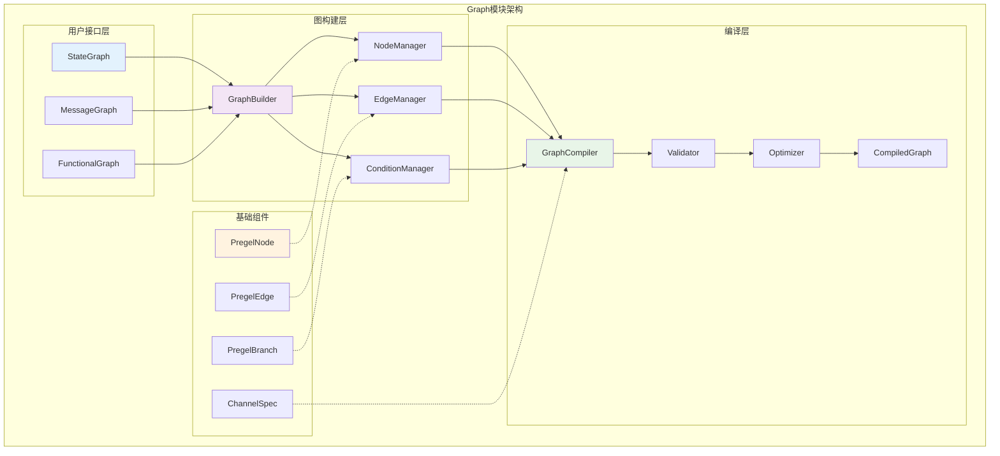
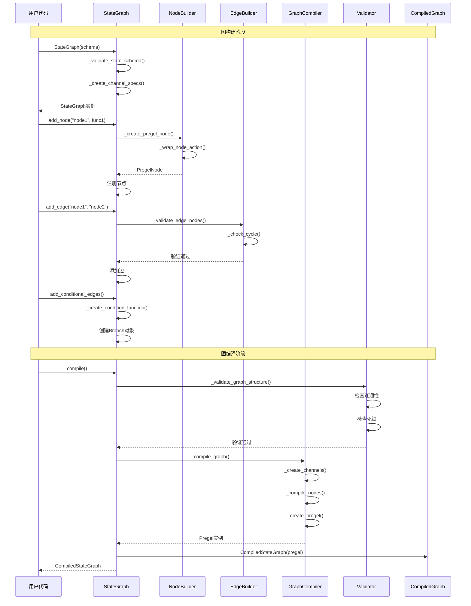
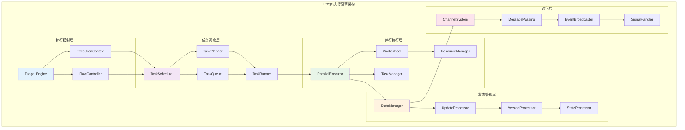
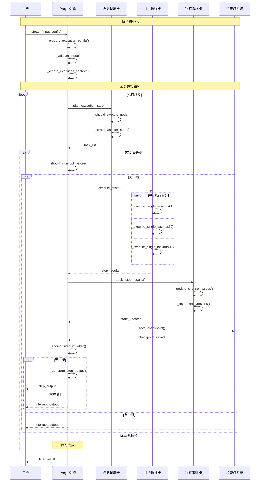
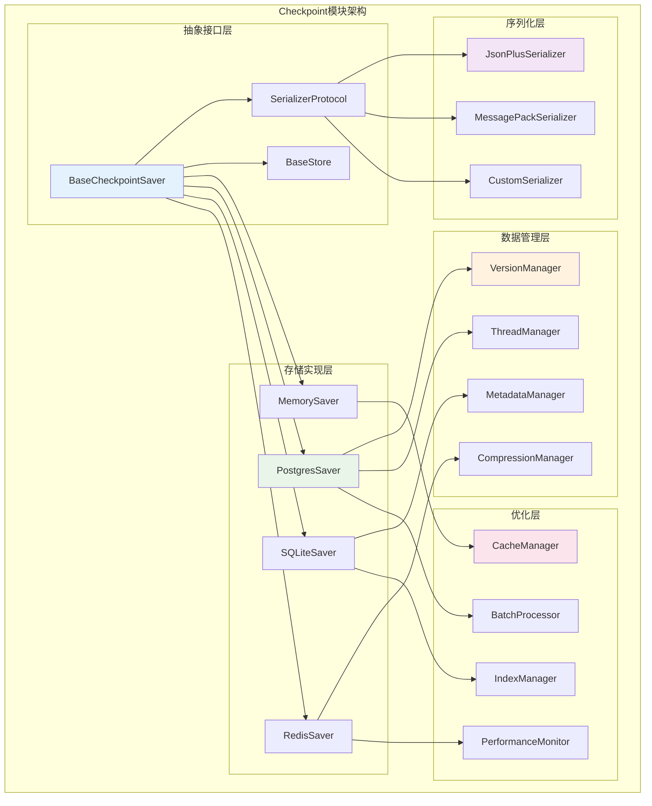
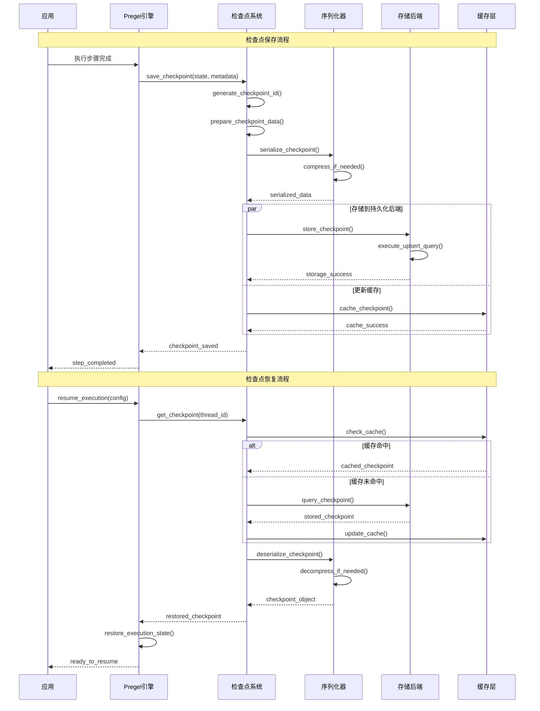

## 概述

本文按模块深入分析LangGraph框架的各个核心组件，包括每个模块的架构设计、时序图、API接口和关键函数实现。通过模块化的分析方式，帮助开发者全面理解LangGraph的内部结构和工作机制。

<!--more-->

## 1. Graph模块 (langgraph.graph)

### 1.1 模块架构图



### 1.2 StateGraph核心实现

#### StateGraph类定义

```python
# 文件：langgraph/graph/state.py
from typing import TypeVar, Generic, Type, Dict, Any, Optional, Union, Sequence, Callable
from typing_extensions import TypedDict

N = TypeVar("N")  # 状态类型变量
C = TypeVar("C")  # 配置类型变量

class StateGraph(Generic[N]):
    """状态图构建器
    
    StateGraph是LangGraph的核心图构建API，提供声明式的图定义接口。
    它支持复杂的状态管理、条件路由和并行执行。
    
    核心特性：
    - 类型安全的状态定义
    - 灵活的节点和边管理
    - 条件路由支持
    - 编译时优化
    - 运行时验证
    """
    
    def __init__(
        self,
        state_schema: Type[N],
        config_schema: Optional[Type[C]] = None,
    ) -> None:
        """初始化状态图
        
        Args:
            state_schema: 状态模式，必须是TypedDict或Pydantic模型
            config_schema: 可选的配置模式
            
        实现细节：
        1. 验证状态模式的有效性
        2. 初始化内部数据结构
        3. 设置默认配置
        4. 创建通道规格
        """
        # 验证状态模式
        self._validate_state_schema(state_schema)
        
        # 存储模式信息
        self.state_schema = state_schema
        self.config_schema = config_schema
        
        # 初始化图结构
        self.nodes: Dict[str, PregelNode] = {}
        self.edges: Set[Tuple[str, str]] = set()
        self.branches: Dict[str, Branch[N]] = {}
        
        # 图配置
        self.entry_point: Optional[str] = None
        self.finish_point: Optional[str] = None
        self.interrupt_before_nodes: List[str] = []
        self.interrupt_after_nodes: List[str] = []
        
        # 内部状态
        self._compiled = False
        self._channel_specs = self._create_channel_specs()
        
        # 构建器辅助对象
        self._node_builder = NodeBuilder(self)
        self._edge_builder = EdgeBuilder(self)
        self._condition_builder = ConditionBuilder(self)
    
    def _validate_state_schema(self, schema: Type) -> None:
        """验证状态模式
        
        Args:
            schema: 要验证的状态模式
            
        Raises:
            ValueError: 状态模式无效时
            
        验证规则：
        1. 必须是TypedDict、Pydantic模型或dataclass
        2. 必须有明确的字段定义
        3. 字段类型必须可序列化
        """
        if not self._is_valid_schema_type(schema):
            raise ValueError(f"Invalid state schema type: {schema}")
        
        # 检查字段定义
        if not hasattr(schema, '__annotations__') or not schema.__annotations__:
            raise ValueError("State schema must have field annotations")
        
        # 验证字段类型
        for field_name, field_type in schema.__annotations__.items():
            if not self._is_serializable_type(field_type):
                raise ValueError(f"Field '{field_name}' has non-serializable type: {field_type}")
    
    def _is_valid_schema_type(self, schema: Type) -> bool:
        """检查是否为有效的模式类型"""
        # TypedDict检查
        if hasattr(schema, '__annotations__') and hasattr(schema, '__total__'):
            return True
        
        # Pydantic模型检查
        try:
            from pydantic import BaseModel
            if issubclass(schema, BaseModel):
                return True
        except (ImportError, TypeError):
            pass
        
        # dataclass检查
        import dataclasses
        if dataclasses.is_dataclass(schema):
            return True
        
        return False
    
    def _create_channel_specs(self) -> Dict[str, ChannelSpec]:
        """创建通道规格
        
        Returns:
            Dict[str, ChannelSpec]: 通道规格映射
            
        根据状态模式分析每个字段的特性：
        - 是否有reducer函数
        - 默认值
        - 类型信息
        - 序列化需求
        """
        specs = {}
        
        if hasattr(self.state_schema, '__annotations__'):
            for field_name, field_type in self.state_schema.__annotations__.items():
                spec = self._analyze_field_spec(field_name, field_type)
                specs[field_name] = spec
        
        return specs
    
    def _analyze_field_spec(self, field_name: str, field_type: Any) -> ChannelSpec:
        """分析字段规格
        
        Args:
            field_name: 字段名称
            field_type: 字段类型
            
        Returns:
            ChannelSpec: 字段规格
        """
        # 检查是否为Annotated类型
        reducer = None
        default_value = None
        
        if hasattr(field_type, '__origin__') and hasattr(field_type, '__metadata__'):
            # 提取元数据
            for metadata in field_type.__metadata__:
                if callable(metadata):
                    reducer = metadata
                elif isinstance(metadata, DefaultValue):
                    default_value = metadata.value
        
        # 获取实际类型
        actual_type = getattr(field_type, '__origin__', field_type)
        if hasattr(field_type, '__args__'):
            actual_type = field_type.__args__[0] if field_type.__args__ else actual_type
        
        return ChannelSpec(
            name=field_name,
            type=actual_type,
            reducer=reducer,
            default=default_value,
            serializable=self._is_serializable_type(actual_type)
        )
```

#### 节点管理实现

```python
def add_node(
    self,
    node: Union[str, RunnableLike],
    action: Optional[RunnableLike] = None,
    *,
    metadata: Optional[Dict[str, Any]] = None,
    input: Optional[Type[Any]] = None,
    retry: Optional[RetryPolicy] = None,
) -> "StateGraph[N]":
    """添加节点到状态图
    
    Args:
        node: 节点名称或可运行对象
        action: 节点执行动作
        metadata: 节点元数据
        input: 输入类型约束
        retry: 重试策略
        
    Returns:
        StateGraph[N]: 支持链式调用
        
    实现流程：
    1. 参数规范化和验证
    2. 创建PregelNode实例
    3. 注册到节点映射
    4. 更新图结构
    """
    if self._compiled:
        raise ValueError("Cannot modify compiled graph")
    
    # 参数规范化
    node_name, node_action = self._normalize_node_params(node, action)
    
    # 验证节点唯一性
    if node_name in self.nodes:
        raise ValueError(f"Node '{node_name}' already exists")
    
    # 创建节点
    pregel_node = self._create_pregel_node(
        name=node_name,
        action=node_action,
        metadata=metadata or {},
        input_type=input,
        retry_policy=retry
    )
    
    # 注册节点
    self.nodes[node_name] = pregel_node
    
    # 更新图结构
    self._update_graph_structure_for_node(node_name)
    
    return self

def _normalize_node_params(
    self, 
    node: Union[str, RunnableLike], 
    action: Optional[RunnableLike]
) -> Tuple[str, RunnableLike]:
    """规范化节点参数
    
    Args:
        node: 节点名称或可运行对象
        action: 节点动作
        
    Returns:
        Tuple[str, RunnableLike]: (节点名称, 节点动作)
    """
    if isinstance(node, str):
        if action is None:
            raise ValueError("Action is required when node is a string")
        return node, action
    else:
        # node是可运行对象
        node_name = getattr(node, 'name', None) or f"node_{id(node)}"
        return node_name, node

def _create_pregel_node(
    self,
    name: str,
    action: RunnableLike,
    metadata: Dict[str, Any],
    input_type: Optional[Type[Any]],
    retry_policy: Optional[RetryPolicy]
) -> PregelNode:
    """创建Pregel节点
    
    Args:
        name: 节点名称
        action: 执行动作
        metadata: 元数据
        input_type: 输入类型
        retry_policy: 重试策略
        
    Returns:
        PregelNode: 创建的节点实例
    """
    # 包装动作为可运行对象
    wrapped_action = self._wrap_node_action(action, input_type, retry_policy)
    
    # 确定输入输出通道
    input_channels = self._get_node_input_channels(name)
    output_channels = self._get_node_output_channels(name)
    
    # 创建节点实例
    return PregelNode(
        name=name,
        action=wrapped_action,
        metadata=metadata,
        input_channels=input_channels,
        output_channels=output_channels,
        triggers=self._get_initial_triggers(name),
        retry_policy=retry_policy,
    )

def _wrap_node_action(
    self,
    action: RunnableLike,
    input_type: Optional[Type[Any]],
    retry_policy: Optional[RetryPolicy]
) -> Runnable:
    """包装节点动作
    
    Args:
        action: 原始动作
        input_type: 输入类型约束
        retry_policy: 重试策略
        
    Returns:
        Runnable: 包装后的可运行动作
    """
    # 转换为Runnable
    if not isinstance(action, Runnable):
        action = RunnableLambda(action)
    
    # 应用输入类型验证
    if input_type:
        action = action.with_types(input_schema=input_type)
    
    # 应用重试策略
    if retry_policy:
        action = action.with_retry(
            stop=retry_policy.stop,
            wait=retry_policy.wait,
            retry=retry_policy.retry,
            before_sleep=retry_policy.before_sleep,
        )
    
    # 添加状态处理包装器
    return StateActionWrapper(action, self.state_schema)
```

#### 边管理实现

```python
def add_edge(
    self,
    start_key: Union[str, List[str]],
    end_key: str,
) -> "StateGraph[N]":
    """添加无条件边
    
    Args:
        start_key: 起始节点名称或节点列表
        end_key: 结束节点名称或END常量
        
    Returns:
        StateGraph[N]: 支持链式调用
        
    实现流程：
    1. 验证节点存在性
    2. 检查循环依赖
    3. 添加边到图结构
    4. 更新节点触发器
    """
    if self._compiled:
        raise ValueError("Cannot modify compiled graph")
    
    # 规范化起始节点
    start_nodes = self._normalize_start_nodes(start_key)
    
    # 验证节点存在
    self._validate_edge_nodes(start_nodes, end_key)
    
    # 检查循环依赖
    for start_node in start_nodes:
        if self._would_create_cycle(start_node, end_key):
            raise ValueError(f"Edge {start_node} -> {end_key} would create cycle")
    
    # 添加边
    for start_node in start_nodes:
        edge = PregelEdge(start_node, end_key)
        self.edges.add(edge)
        
        # 更新目标节点触发器
        if end_key in self.nodes:
            self.nodes[end_key].add_trigger(start_node)
    
    return self

def add_conditional_edges(
    self,
    start_key: str,
    condition: Union[Callable, str],
    condition_map: Optional[Dict[Hashable, str]] = None,
    then: Optional[str] = None,
) -> "StateGraph[N]":
    """添加条件边
    
    Args:
        start_key: 起始节点名称
        condition: 条件函数或表达式
        condition_map: 条件值到目标节点的映射
        then: 默认目标节点
        
    Returns:
        StateGraph[N]: 支持链式调用
        
    实现流程：
    1. 验证参数有效性
    2. 创建条件函数
    3. 构建分支对象
    4. 注册到分支映射
    """
    if self._compiled:
        raise ValueError("Cannot modify compiled graph")
    
    # 验证起始节点
    if start_key not in self.nodes:
        raise ValueError(f"Start node '{start_key}' not found")
    
    # 处理条件函数
    condition_func = self._create_condition_function(condition)
    
    # 验证条件映射
    self._validate_condition_mapping(condition_map, then)
    
    # 创建分支
    branch = Branch(
        path=condition_func,
        path_map=condition_map or {},
        then=then,
        metadata={"source": start_key}
    )
    
    # 注册分支
    self.branches[start_key] = branch
    
    # 更新目标节点触发器
    self._update_branch_triggers(start_key, branch)
    
    return self

def _create_condition_function(self, condition: Union[Callable, str]) -> Callable:
    """创建条件函数
    
    Args:
        condition: 条件函数或表达式字符串
        
    Returns:
        Callable: 标准化的条件函数
    """
    if isinstance(condition, str):
        # 字符串表达式转换为函数
        return self._compile_condition_expression(condition)
    elif callable(condition):
        # 包装现有函数
        return self._wrap_condition_function(condition)
    else:
        raise ValueError(f"Invalid condition type: {type(condition)}")

def _compile_condition_expression(self, expression: str) -> Callable:
    """编译条件表达式
    
    Args:
        expression: 条件表达式字符串
        
    Returns:
        Callable: 编译后的条件函数
    """
    # 安全的表达式编译
    try:
        compiled_expr = compile(expression, '<condition>', 'eval')
    except SyntaxError as e:
        raise ValueError(f"Invalid condition expression: {e}")
    
    def condition_func(state: Dict[str, Any]) -> str:
        """编译后的条件函数"""
        try:
            # 在受限环境中执行表达式
            result = eval(compiled_expr, {"__builtins__": {}}, state)
            return str(result)
        except Exception as e:
            raise ConditionEvaluationError(f"Condition evaluation failed: {e}")
    
    return condition_func

def _wrap_condition_function(self, condition: Callable) -> Callable:
    """包装条件函数
    
    Args:
        condition: 原始条件函数
        
    Returns:
        Callable: 包装后的条件函数
    """
    def wrapped_condition(state: Dict[str, Any]) -> str:
        """包装的条件函数"""
        try:
            result = condition(state)
            
            # 确保返回字符串
            if not isinstance(result, str):
                result = str(result)
            
            return result
            
        except Exception as e:
            # 记录错误并返回默认值
            logger.error(f"Condition function error: {e}")
            return "__error__"
    
    return wrapped_condition
```

### 1.3 Graph模块时序图



## 2. Pregel模块 (langgraph.pregel)

### 2.1 Pregel模块架构图



### 2.2 Pregel核心实现

#### Pregel引擎主类

```python
# 文件：langgraph/pregel/__init__.py
from typing import (
    Any, Dict, List, Optional, Union, Iterator, AsyncIterator,
    Mapping, Sequence, Set, Tuple, Callable
)
import asyncio
import concurrent.futures
import time
from collections import defaultdict

class Pregel(Runnable[Union[dict, Any], Union[dict, Any]]):
    """Pregel执行引擎
    
    基于Google Pregel模型的图计算引擎，实现了BSP（Bulk Synchronous Parallel）
    执行模型，支持：
    - 超步执行（Superstep Execution）
    - 并行节点处理
    - 消息传递机制
    - 状态一致性保证
    - 检查点和恢复
    - 中断和人工介入
    """
    
    def __init__(
        self,
        nodes: Mapping[str, PregelNode],
        channels: Mapping[str, BaseChannel],
        input_channels: Union[str, Sequence[str]],
        output_channels: Union[str, Sequence[str]],
        stream_channels: Optional[Union[str, Sequence[str]]] = None,
        checkpointer: Optional[BaseCheckpointSaver] = None,
        store: Optional[BaseStore] = None,
        interrupt_before: Optional[Union[All, Sequence[str]]] = None,
        interrupt_after: Optional[Union[All, Sequence[str]]] = None,
        debug: bool = False,
        step_timeout: Optional[float] = None,
        retry_policy: Optional[RetryPolicy] = None,
    ) -> None:
        """初始化Pregel执行引擎
        
        Args:
            nodes: 节点映射 {节点名: PregelNode}
            channels: 通道映射 {通道名: BaseChannel}
            input_channels: 输入通道列表
            output_channels: 输出通道列表
            stream_channels: 流式输出通道列表
            checkpointer: 检查点保存器
            store: 存储接口
            interrupt_before: 执行前中断节点
            interrupt_after: 执行后中断节点
            debug: 调试模式
            step_timeout: 步骤超时时间
            retry_policy: 重试策略
        """
        # 验证初始化参数
        self._validate_initialization(nodes, channels, input_channels, output_channels)
        
        # 存储核心组件
        self.nodes = dict(nodes)
        self.channels = dict(channels)
        
        # 规范化通道配置
        self.input_channels = self._normalize_channels(input_channels)
        self.output_channels = self._normalize_channels(output_channels)
        self.stream_channels = self._normalize_channels(stream_channels or output_channels)
        
        # 持久化和存储
        self.checkpointer = checkpointer
        self.store = store
        
        # 中断配置
        self.interrupt_before = self._normalize_interrupt_config(interrupt_before)
        self.interrupt_after = self._normalize_interrupt_config(interrupt_after)
        
        # 执行配置
        self.debug = debug
        self.step_timeout = step_timeout
        self.retry_policy = retry_policy
        
        # 内部组件
        self._task_scheduler = TaskScheduler(self)
        self._parallel_executor = ParallelExecutor(self)
        self._state_manager = StateManager(self)
        self._flow_controller = FlowController(self)
        
        # 性能统计
        self._stats = ExecutionStats() if debug else None
        
        # 构建执行模式
        self._schema = self._build_execution_schema()
    
    def _validate_initialization(
        self,
        nodes: Mapping[str, PregelNode],
        channels: Mapping[str, BaseChannel],
        input_channels: Union[str, Sequence[str]],
        output_channels: Union[str, Sequence[str]]
    ) -> None:
        """验证初始化参数
        
        Args:
            nodes: 节点映射
            channels: 通道映射
            input_channels: 输入通道
            output_channels: 输出通道
            
        Raises:
            ValueError: 参数无效时
        """
        if not nodes:
            raise ValueError("At least one node is required")
        
        if not channels:
            raise ValueError("At least one channel is required")
        
        # 验证节点通道引用
        for node_name, node in nodes.items():
            for channel_name in node.input_channels:
                if channel_name not in channels:
                    raise ValueError(
                        f"Node '{node_name}' references unknown input channel '{channel_name}'"
                    )
            
            for channel_name in node.output_channels:
                if channel_name not in channels:
                    raise ValueError(
                        f"Node '{node_name}' references unknown output channel '{channel_name}'"
                    )
        
        # 验证输入输出通道
        for channel_name in self._normalize_channels(input_channels):
            if channel_name not in channels:
                raise ValueError(f"Input channel '{channel_name}' not found")
        
        for channel_name in self._normalize_channels(output_channels):
            if channel_name not in channels:
                raise ValueError(f"Output channel '{channel_name}' not found")
```

#### 流式执行核心方法

```python
def stream(
    self,
    input: Union[dict, Any],
    config: Optional[RunnableConfig] = None,
    *,
    stream_mode: StreamMode = "values",
    output_keys: Optional[Union[str, Sequence[str]]] = None,
    interrupt_before: Optional[Union[All, Sequence[str]]] = None,
    interrupt_after: Optional[Union[All, Sequence[str]]] = None,
    debug: Optional[bool] = None,
    **kwargs: Any,
) -> Iterator[Union[dict, Any]]:
    """流式执行图
    
    Args:
        input: 输入数据
        config: 运行配置
        stream_mode: 流模式 ("values", "updates", "debug")
        output_keys: 输出键过滤
        interrupt_before: 执行前中断
        interrupt_after: 执行后中断
        debug: 调试模式
        **kwargs: 额外参数
        
    Yields:
        Union[dict, Any]: 流式输出
        
    核心执行流程：
    1. 准备执行环境
    2. 初始化状态和检查点
    3. 执行超步循环
    4. 流式输出结果
    """
    # 准备执行配置
    execution_config = self._prepare_execution_config(
        config, debug, interrupt_before, interrupt_after
    )
    
    # 验证和规范化输入
    validated_input = self._validate_and_normalize_input(input)
    
    # 创建执行上下文
    execution_context = self._create_execution_context(validated_input, execution_config)
    
    # 执行主循环
    yield from self._execute_main_loop(
        execution_context, 
        stream_mode, 
        output_keys
    )

def _execute_main_loop(
    self,
    context: ExecutionContext,
    stream_mode: StreamMode,
    output_keys: Optional[Union[str, Sequence[str]]]
) -> Iterator[Union[dict, Any]]:
    """执行主循环
    
    Args:
        context: 执行上下文
        stream_mode: 流模式
        output_keys: 输出键
        
    Yields:
        Union[dict, Any]: 执行结果
        
    BSP执行模型实现：
    1. 计划阶段：确定活跃任务
    2. 执行阶段：并行执行任务
    3. 同步阶段：更新状态和检查点
    4. 输出阶段：生成流式输出
    """
    try:
        # 输出初始状态
        if stream_mode == "values":
            initial_output = self._extract_output_values(context.checkpoint, output_keys)
            if initial_output:
                yield initial_output
        
        # 主执行循环
        while True:
            # === 计划阶段 ===
            tasks = self._task_scheduler.plan_execution_step(context)
            
            if not tasks:
                # 没有更多任务，执行完成
                context.stop_reason = StopReason.COMPLETED
                break
            
            # === 中断检查（执行前）===
            if self._should_interrupt_before(tasks, context):
                context.stop_reason = StopReason.INTERRUPT_BEFORE
                interrupt_output = self._create_interrupt_output(context, tasks, "before")
                yield interrupt_output
                break
            
            # === 执行阶段 ===
            step_start_time = time.time()
            step_results = self._parallel_executor.execute_tasks(tasks, context)
            step_duration = time.time() - step_start_time
            
            # 记录执行统计
            if self._stats:
                self._stats.record_step(len(tasks), step_duration, step_results)
            
            # === 同步阶段 ===
            self._state_manager.apply_step_results(step_results, context)
            
            # 保存检查点
            if self.checkpointer:
                self._save_checkpoint(context, step_results)
            
            # === 中断检查（执行后）===
            if self._should_interrupt_after(tasks, context):
                context.stop_reason = StopReason.INTERRUPT_AFTER
                interrupt_output = self._create_interrupt_output(context, tasks, "after")
                yield interrupt_output
                break
            
            # === 输出阶段 ===
            step_output = self._generate_step_output(
                context, step_results, stream_mode, output_keys
            )
            if step_output:
                yield step_output
            
            # 更新步骤计数
            context.step += 1
            
            # 检查执行限制
            if self._should_stop_execution(context):
                context.stop_reason = StopReason.LIMIT_REACHED
                break
    
    except Exception as e:
        context.exception = e
        context.stop_reason = StopReason.ERROR
        
        if context.debug:
            error_output = self._create_error_output(context, e)
            yield error_output
        
        raise
    
    finally:
        # 清理执行上下文
        self._cleanup_execution_context(context)

def _generate_step_output(
    self,
    context: ExecutionContext,
    step_results: Dict[str, Any],
    stream_mode: StreamMode,
    output_keys: Optional[Union[str, Sequence[str]]]
) -> Optional[Dict[str, Any]]:
    """生成步骤输出
    
    Args:
        context: 执行上下文
        step_results: 步骤执行结果
        stream_mode: 流模式
        output_keys: 输出键
        
    Returns:
        Optional[Dict[str, Any]]: 步骤输出或None
    """
    if stream_mode == "values":
        # 输出当前状态值
        return self._extract_output_values(context.checkpoint, output_keys)
    
    elif stream_mode == "updates":
        # 输出状态更新
        return self._extract_step_updates(step_results, output_keys)
    
    elif stream_mode == "debug":
        # 输出调试信息
        return self._create_debug_output(context, step_results)
    
    else:
        raise ValueError(f"Unknown stream mode: {stream_mode}")
```

#### 任务调度器实现

```python
class TaskScheduler:
    """任务调度器
    
    负责分析图状态，确定下一步需要执行的任务。
    实现了BSP模型的计划阶段逻辑。
    """
    
    def __init__(self, pregel: Pregel):
        self.pregel = pregel
        self.nodes = pregel.nodes
        self.channels = pregel.channels
    
    def plan_execution_step(self, context: ExecutionContext) -> List[PregelTask]:
        """计划执行步骤
        
        Args:
            context: 执行上下文
            
        Returns:
            List[PregelTask]: 待执行任务列表
            
        计划逻辑：
        1. 检查每个节点的触发条件
        2. 分析通道版本变化
        3. 处理分支条件
        4. 生成任务列表
        """
        tasks = []
        checkpoint = context.checkpoint
        
        # 检查每个节点是否应该执行
        for node_name, node in self.nodes.items():
            if self._should_execute_node(node, checkpoint, context):
                task = self._create_task_for_node(node, checkpoint, context)
                tasks.append(task)
        
        # 处理分支节点
        branch_tasks = self._process_branch_nodes(checkpoint, context)
        tasks.extend(branch_tasks)
        
        # 任务优先级排序
        tasks.sort(key=lambda t: t.priority, reverse=True)
        
        return tasks
    
    def _should_execute_node(
        self,
        node: PregelNode,
        checkpoint: Checkpoint,
        context: ExecutionContext
    ) -> bool:
        """判断节点是否应该执行
        
        Args:
            node: 节点对象
            checkpoint: 当前检查点
            context: 执行上下文
            
        Returns:
            bool: 是否应该执行
            
        判断条件：
        1. 检查触发器条件
        2. 检查通道版本变化
        3. 检查节点状态
        4. 检查执行历史
        """
        # 检查触发器
        if self._check_triggers(node, checkpoint, context):
            return True
        
        # 检查通道更新
        if self._check_channel_updates(node, checkpoint):
            return True
        
        # 检查分支条件
        if self._check_branch_conditions(node, checkpoint):
            return True
        
        return False
    
    def _check_triggers(
        self,
        node: PregelNode,
        checkpoint: Checkpoint,
        context: ExecutionContext
    ) -> bool:
        """检查触发器条件
        
        Args:
            node: 节点对象
            checkpoint: 当前检查点
            context: 执行上下文
            
        Returns:
            bool: 触发器是否满足
        """
        for trigger in node.triggers:
            if trigger == START:
                # 起始触发器
                if context.step == 0:
                    return True
            elif trigger == RESUME:
                # 恢复触发器
                if context.resumed:
                    return True
            elif trigger in self.nodes:
                # 节点触发器
                if self._is_node_completed(trigger, checkpoint):
                    return True
            elif callable(trigger):
                # 自定义触发器
                try:
                    if trigger(checkpoint, context):
                        return True
                except Exception as e:
                    logger.error(f"Trigger function error: {e}")
        
        return False
    
    def _check_channel_updates(
        self,
        node: PregelNode,
        checkpoint: Checkpoint
    ) -> bool:
        """检查通道更新
        
        Args:
            node: 节点对象
            checkpoint: 当前检查点
            
        Returns:
            bool: 是否有通道更新
        """
        node_versions = checkpoint.get("versions_seen", {}).get(node.name, {})
        current_versions = checkpoint.get("channel_versions", {})
        
        for channel_name in node.input_channels:
            current_version = current_versions.get(channel_name)
            seen_version = node_versions.get(channel_name)
            
            if current_version and current_version != seen_version:
                return True
        
        return False
    
    def _create_task_for_node(
        self,
        node: PregelNode,
        checkpoint: Checkpoint,
        context: ExecutionContext
    ) -> PregelTask:
        """为节点创建任务
        
        Args:
            node: 节点对象
            checkpoint: 当前检查点
            context: 执行上下文
            
        Returns:
            PregelTask: 创建的任务
        """
        # 准备节点输入
        node_input = self._prepare_node_input(node, checkpoint)
        
        # 计算任务优先级
        priority = self._calculate_task_priority(node, checkpoint, context)
        
        # 创建任务
        task = PregelTask(
            id=f"{context.step}:{node.name}",
            name=node.name,
            node=node,
            input=node_input,
            config=context.config,
            priority=priority,
            retry_count=0,
            max_retries=getattr(node, 'max_retries', 3),
            timeout=getattr(node, 'timeout', context.step_timeout),
        )
        
        return task
    
    def _prepare_node_input(
        self,
        node: PregelNode,
        checkpoint: Checkpoint
    ) -> Dict[str, Any]:
        """准备节点输入
        
        Args:
            node: 节点对象
            checkpoint: 当前检查点
            
        Returns:
            Dict[str, Any]: 节点输入数据
        """
        node_input = {}
        channel_values = checkpoint.get("channel_values", {})
        
        for channel_name in node.input_channels:
            if channel_name in channel_values:
                node_input[channel_name] = channel_values[channel_name]
            else:
                # 使用通道默认值
                channel = self.channels.get(channel_name)
                if channel and hasattr(channel, 'default'):
                    node_input[channel_name] = channel.default
        
        return node_input
```

### 2.3 Pregel模块时序图



## 3. Checkpoint模块 (langgraph.checkpoint)

### 3.1 Checkpoint模块架构图



### 3.2 BaseCheckpointSaver核心实现

#### 抽象基类定义

```python
# 文件：langgraph/checkpoint/base.py
from abc import ABC, abstractmethod
from typing import (
    Any, Dict, List, Optional, Iterator, AsyncIterator, 
    Sequence, Tuple, Generic, TypeVar
)
import threading
import time
from dataclasses import dataclass

V = TypeVar("V")  # 版本类型变量

class BaseCheckpointSaver(Generic[V], ABC):
    """检查点保存器基类
    
    定义了检查点系统的核心接口，提供：
    - 状态持久化和恢复
    - 版本管理和历史追踪
    - 多线程和多租户隔离
    - 增量更新和优化
    - 异步操作支持
    
    设计原则：
    - 接口统一：同步和异步接口保持一致
    - 类型安全：使用泛型确保版本类型安全
    - 扩展性：支持自定义序列化和存储后端
    - 性能优化：支持批量操作和缓存
    """
    
    serde: SerializerProtocol = JsonPlusSerializer()
    
    def __init__(
        self,
        *,
        serde: Optional[SerializerProtocol] = None,
    ) -> None:
        """初始化检查点保存器
        
        Args:
            serde: 序列化器实例
        """
        if serde is not None:
            self.serde = serde
        
        # 添加类型化方法支持
        self.serde = maybe_add_typed_methods(self.serde)
        
        # 初始化内部状态
        self._lock = threading.RLock()
        self._stats = CheckpointStats()
        self._cache = CheckpointCache() if self._should_enable_cache() else None
    
    @property
    def config_specs(self) -> List[ConfigurableFieldSpec]:
        """定义检查点保存器的配置选项
        
        Returns:
            List[ConfigurableFieldSpec]: 配置字段规格列表
        """
        return [
            ConfigurableFieldSpec(
                id="thread_id",
                annotation=str,
                name="Thread ID",
                description="线程唯一标识符",
                default=None,
                is_shared=False,
            ),
            ConfigurableFieldSpec(
                id="checkpoint_id",
                annotation=Optional[str],
                name="Checkpoint ID", 
                description="检查点唯一标识符",
                default=None,
                is_shared=False,
            ),
            ConfigurableFieldSpec(
                id="checkpoint_ns",
                annotation=str,
                name="Checkpoint Namespace",
                description="检查点命名空间",
                default="",
                is_shared=False,
            ),
        ]
    
    # === 核心接口方法 ===
    
    @abstractmethod
    def get_tuple(self, config: RunnableConfig) -> Optional[CheckpointTuple]:
        """获取检查点元组（核心接口方法）
        
        Args:
            config: 运行配置，包含thread_id和checkpoint_id
            
        Returns:
            Optional[CheckpointTuple]: 检查点元组或None
            
        实现要求：
        1. 根据config解析查询参数
        2. 从存储后端查询检查点数据
        3. 反序列化检查点和元数据
        4. 构建完整的CheckpointTuple
        5. 处理不存在的情况
        """
        raise NotImplementedError("Subclasses must implement get_tuple")
    
    @abstractmethod
    def list(
        self,
        config: Optional[RunnableConfig],
        *,
        filter: Optional[Dict[str, Any]] = None,
        before: Optional[RunnableConfig] = None,
        limit: Optional[int] = None,
    ) -> Iterator[CheckpointTuple]:
        """列出检查点（核心接口方法）
        
        Args:
            config: 基础配置，包含thread_id
            filter: 过滤条件字典
            before: 获取此配置之前的检查点
            limit: 限制返回数量
            
        Yields:
            CheckpointTuple: 匹配的检查点元组
            
        实现要求：
        1. 构建查询条件
        2. 应用过滤器
        3. 执行分页查询
        4. 按时间倒序返回
        5. 流式处理大量数据
        """
        raise NotImplementedError("Subclasses must implement list")
    
    @abstractmethod
    def put(
        self,
        config: RunnableConfig,
        checkpoint: Checkpoint,
        metadata: CheckpointMetadata,
        new_versions: ChannelVersions,
    ) -> RunnableConfig:
        """保存检查点（核心接口方法）
        
        Args:
            config: 运行配置
            checkpoint: 检查点数据
            metadata: 检查点元数据
            new_versions: 新的通道版本
            
        Returns:
            RunnableConfig: 更新后的配置
            
        实现要求：
        1. 生成或使用检查点ID
        2. 序列化检查点和元数据
        3. 原子性存储操作
        4. 更新版本信息
        5. 处理并发冲突
        """
        raise NotImplementedError("Subclasses must implement put")
    
    @abstractmethod
    def put_writes(
        self,
        config: RunnableConfig,
        writes: Sequence[Tuple[str, Any]],
        task_id: str,
    ) -> None:
        """保存写入操作（核心接口方法）
        
        Args:
            config: 运行配置
            writes: 写入操作序列 [(channel, value), ...]
            task_id: 任务ID
            
        实现要求：
        1. 验证写入数据
        2. 序列化写入值
        3. 关联到检查点
        4. 支持批量插入
        5. 处理重复写入
        """
        raise NotImplementedError("Subclasses must implement put_writes")
    
    # === 便利方法 ===
    
    def get(self, config: RunnableConfig) -> Optional[Checkpoint]:
        """获取检查点数据
        
        Args:
            config: 运行配置
            
        Returns:
            Optional[Checkpoint]: 检查点数据或None
        """
        if value := self.get_tuple(config):
            return value.checkpoint
        return None
    
    def get_metadata(self, config: RunnableConfig) -> Optional[CheckpointMetadata]:
        """获取检查点元数据
        
        Args:
            config: 运行配置
            
        Returns:
            Optional[CheckpointMetadata]: 元数据或None
        """
        if value := self.get_tuple(config):
            return value.metadata
        return None
    
    def get_history(
        self,
        config: RunnableConfig,
        *,
        filter: Optional[Dict[str, Any]] = None,
        before: Optional[RunnableConfig] = None,
        limit: Optional[int] = None,
    ) -> Iterator[CheckpointTuple]:
        """获取检查点历史
        
        Args:
            config: 运行配置
            filter: 过滤条件
            before: 获取此配置之前的检查点
            limit: 限制数量
            
        Yields:
            CheckpointTuple: 历史检查点元组
        """
        yield from self.list(config, filter=filter, before=before, limit=limit)
    
    # === 异步接口方法 ===
    
    async def aget_tuple(self, config: RunnableConfig) -> Optional[CheckpointTuple]:
        """get_tuple的异步版本
        
        默认实现：在线程池中执行同步方法
        子类可以重写以提供真正的异步实现
        """
        import asyncio
        loop = asyncio.get_event_loop()
        return await loop.run_in_executor(None, self.get_tuple, config)
    
    async def alist(
        self,
        config: Optional[RunnableConfig],
        *,
        filter: Optional[Dict[str, Any]] = None,
        before: Optional[RunnableConfig] = None,
        limit: Optional[int] = None,
    ) -> AsyncIterator[CheckpointTuple]:
        """list的异步版本"""
        import asyncio
        
        def _list_sync():
            return list(self.list(config, filter=filter, before=before, limit=limit))
        
        loop = asyncio.get_event_loop()
        results = await loop.run_in_executor(None, _list_sync)
        
        for result in results:
            yield result
    
    async def aput(
        self,
        config: RunnableConfig,
        checkpoint: Checkpoint,
        metadata: CheckpointMetadata,
        new_versions: ChannelVersions,
    ) -> RunnableConfig:
        """put的异步版本"""
        import asyncio
        loop = asyncio.get_event_loop()
        return await loop.run_in_executor(
            None, self.put, config, checkpoint, metadata, new_versions
        )
    
    async def aput_writes(
        self,
        config: RunnableConfig,
        writes: Sequence[Tuple[str, Any]],
        task_id: str,
    ) -> None:
        """put_writes的异步版本"""
        import asyncio
        loop = asyncio.get_event_loop()
        return await loop.run_in_executor(None, self.put_writes, config, writes, task_id)
    
    # === 辅助方法 ===
    
    def _should_enable_cache(self) -> bool:
        """判断是否应该启用缓存"""
        return True  # 默认启用缓存
    
    def _record_operation(self, operation: str, duration: float, success: bool):
        """记录操作统计"""
        if self._stats:
            self._stats.record_operation(operation, duration, success)
```

#### 版本管理实现

```python
@dataclass
class VersionManager:
    """版本管理器
    
    负责管理检查点和通道的版本信息：
    - 版本号生成和递增
    - 版本比较和排序
    - 版本冲突检测
    - 版本历史追踪
    """
    
    def __init__(self):
        self._version_locks: Dict[str, threading.Lock] = {}
        self._version_counters: Dict[str, int] = {}
    
    def get_next_version(
        self, 
        key: str, 
        current_version: Optional[V] = None
    ) -> V:
        """获取下一个版本号
        
        Args:
            key: 版本键（通常是通道名）
            current_version: 当前版本号
            
        Returns:
            V: 下一个版本号
            
        版本策略：
        - 整数版本：递增
        - 字符串版本：尝试解析为整数递增，否则生成UUID
        - 时间戳版本：使用当前时间
        """
        # 获取或创建锁
        if key not in self._version_locks:
            self._version_locks[key] = threading.Lock()
        
        with self._version_locks[key]:
            if current_version is None:
                return self._initial_version()
            elif isinstance(current_version, int):
                return current_version + 1
            elif isinstance(current_version, str):
                try:
                    # 尝试解析为整数
                    int_version = int(current_version)
                    return str(int_version + 1)
                except ValueError:
                    # 生成时间有序UUID
                    from langgraph.checkpoint.base.id import uuid6
                    return str(uuid6())
            elif isinstance(current_version, float):
                return current_version + 1.0
            else:
                raise ValueError(f"Unsupported version type: {type(current_version)}")
    
    def compare_versions(self, v1: V, v2: V) -> int:
        """比较两个版本号
        
        Args:
            v1: 版本1
            v2: 版本2
            
        Returns:
            int: -1 if v1 < v2, 0 if v1 == v2, 1 if v1 > v2
        """
        if type(v1) != type(v2):
            raise ValueError(f"Cannot compare versions of different types: {type(v1)}, {type(v2)}")
        
        if isinstance(v1, (int, float)):
            return (v1 > v2) - (v1 < v2)
        elif isinstance(v1, str):
            # 尝试数值比较
            try:
                num1, num2 = int(v1), int(v2)
                return (num1 > num2) - (num1 < num2)
            except ValueError:
                # 字符串比较（假设是时间有序的UUID）
                return (v1 > v2) - (v1 < v2)
        else:
            raise ValueError(f"Cannot compare versions of type: {type(v1)}")
    
    def is_newer_version(self, v1: V, v2: V) -> bool:
        """判断v1是否比v2更新
        
        Args:
            v1: 版本1
            v2: 版本2
            
        Returns:
            bool: v1是否更新
        """
        return self.compare_versions(v1, v2) > 0
    
    def _initial_version(self) -> V:
        """获取初始版本号"""
        return 1  # 默认从1开始
```

### 3.3 PostgresCheckpointSaver实现

#### 核心实现

```python
# 文件：langgraph/checkpoint/postgres/base.py
import threading
import time
from contextlib import contextmanager
from typing import Iterator, Optional, Dict, Any, Sequence, Tuple

class PostgresCheckpointSaver(BaseCheckpointSaver[str]):
    """PostgreSQL检查点保存器
    
    提供生产级的检查点持久化能力：
    - ACID事务保证
    - 高并发支持
    - 数据压缩和优化
    - 自动迁移和版本管理
    - 连接池支持
    - 批量操作优化
    """
    
    # 数据库迁移脚本
    MIGRATIONS = [
        # 版本0: 初始化迁移表
        """
        CREATE TABLE IF NOT EXISTS checkpoint_migrations (
            v INTEGER PRIMARY KEY
        );
        """,
        
        # 版本1: 创建检查点表
        """
        CREATE TABLE IF NOT EXISTS checkpoints (
            thread_id TEXT NOT NULL,
            checkpoint_ns TEXT NOT NULL DEFAULT '',
            checkpoint_id TEXT NOT NULL,
            parent_checkpoint_id TEXT,
            type TEXT,
            checkpoint JSONB NOT NULL,
            metadata JSONB NOT NULL DEFAULT '{}',
            created_at TIMESTAMP WITH TIME ZONE DEFAULT CURRENT_TIMESTAMP,
            updated_at TIMESTAMP WITH TIME ZONE DEFAULT CURRENT_TIMESTAMP,
            PRIMARY KEY (thread_id, checkpoint_ns, checkpoint_id)
        );
        """,
        
        # 版本2: 创建写入表
        """
        CREATE TABLE IF NOT EXISTS checkpoint_writes (
            thread_id TEXT NOT NULL,
            checkpoint_ns TEXT NOT NULL DEFAULT '',
            checkpoint_id TEXT NOT NULL,
            task_id TEXT NOT NULL,
            idx INTEGER NOT NULL,
            channel TEXT NOT NULL,
            type TEXT,
            value JSONB,
            created_at TIMESTAMP WITH TIME ZONE DEFAULT CURRENT_TIMESTAMP,
            PRIMARY KEY (thread_id, checkpoint_ns, checkpoint_id, task_id, idx)
        );
        """,
        
        # 版本3: 添加索引
        """
        CREATE INDEX IF NOT EXISTS idx_checkpoints_thread_created 
        ON checkpoints (thread_id, checkpoint_ns, created_at DESC);
        
        CREATE INDEX IF NOT EXISTS idx_checkpoints_parent 
        ON checkpoints (parent_checkpoint_id);
        
        CREATE INDEX IF NOT EXISTS idx_checkpoint_writes_lookup 
        ON checkpoint_writes (thread_id, checkpoint_ns, checkpoint_id);
        
        CREATE INDEX IF NOT EXISTS idx_checkpoints_metadata_gin 
        ON checkpoints USING GIN (metadata);
        """,
        
        # 版本4: 添加分区支持（可选）
        """
        -- 为大规模部署创建分区表
        -- 这个迁移是可选的，只在需要时执行
        """,
    ]
    
    def __init__(
        self,
        conn: Union[Connection, ConnectionPool],
        pipe: Optional[Pipeline] = None,
        serde: Optional[SerializerProtocol] = None,
    ) -> None:
        """初始化PostgreSQL检查点保存器
        
        Args:
            conn: 数据库连接或连接池
            pipe: 可选的Pipeline用于批量操作
            serde: 序列化器
        """
        super().__init__(serde=serde)
        
        # 验证连接配置
        if isinstance(conn, ConnectionPool) and pipe is not None:
            raise ValueError("Pipeline should be used only with Connection, not ConnectionPool")
        
        self.conn = conn
        self.pipe = pipe
        self.lock = threading.Lock()
        
        # 功能检测
        self.supports_pipeline = self._detect_pipeline_support()
        
        # 性能配置
        self.batch_size = 1000
        self.connection_timeout = 30
        self.query_timeout = 60
        
        # 统计信息
        self._operation_stats = defaultdict(int)
    
    def setup(self) -> None:
        """设置检查点数据库
        
        创建必要的表结构并运行数据库迁移。
        用户第一次使用检查点保存器时必须调用此方法。
        """
        with self.lock:
            with self._cursor() as cur:
                # 执行初始迁移
                cur.execute(self.MIGRATIONS[0])
                
                # 检查当前版本
                cur.execute("SELECT v FROM checkpoint_migrations ORDER BY v DESC LIMIT 1")
                row = cur.fetchone()
                current_version = row["v"] if row else -1
                
                # 执行未完成的迁移
                for version in range(current_version + 1, len(self.MIGRATIONS)):
                    migration_sql = self.MIGRATIONS[version]
                    if migration_sql.strip():  # 跳过空迁移
                        try:
                            cur.execute(migration_sql)
                            cur.execute("INSERT INTO checkpoint_migrations (v) VALUES (%s)", (version,))
                            logger.info(f"Applied migration version {version}")
                        except Exception as e:
                            logger.error(f"Migration {version} failed: {e}")
                            raise
                
                # 同步Pipeline
                if self.pipe:
                    self.pipe.sync()
    
    def get_tuple(self, config: RunnableConfig) -> Optional[CheckpointTuple]:
        """获取检查点元组的PostgreSQL实现"""
        start_time = time.time()
        
        try:
            # 解析配置参数
            thread_id = config["configurable"]["thread_id"]
            checkpoint_ns = config["configurable"].get("checkpoint_ns", "")
            checkpoint_id = config["configurable"].get("checkpoint_id")
            
            with self._cursor() as cur:
                if checkpoint_id is not None:
                    # 获取特定检查点
                    cur.execute(
                        """
                        SELECT checkpoint, metadata, parent_checkpoint_id, checkpoint_id, created_at
                        FROM checkpoints 
                        WHERE thread_id = %s AND checkpoint_ns = %s AND checkpoint_id = %s
                        """,
                        (thread_id, checkpoint_ns, checkpoint_id),
                    )
                else:
                    # 获取最新检查点
                    cur.execute(
                        """
                        SELECT checkpoint, metadata, parent_checkpoint_id, checkpoint_id, created_at
                        FROM checkpoints 
                        WHERE thread_id = %s AND checkpoint_ns = %s
                        ORDER BY created_at DESC 
                        LIMIT 1
                        """,
                        (thread_id, checkpoint_ns),
                    )
                
                row = cur.fetchone()
                if row is None:
                    return None
                
                # 反序列化检查点数据
                try:
                    checkpoint = self.serde.loads(row["checkpoint"])
                    metadata = self.serde.loads(row["metadata"])
                except Exception as e:
                    raise CheckpointDeserializationError(f"Failed to deserialize checkpoint: {e}")
                
                # 获取待写入操作
                pending_writes = self._get_pending_writes(cur, config)
                
                # 构建当前配置
                current_config = {
                    **config,
                    "configurable": {
                        **config["configurable"],
                        "checkpoint_id": row["checkpoint_id"],
                        "checkpoint_ts": row["created_at"].isoformat(),
                    }
                }
                
                # 构建父配置
                parent_config = None
                if row["parent_checkpoint_id"]:
                    parent_config = {
                        **config,
                        "configurable": {
                            **config["configurable"],
                            "checkpoint_id": row["parent_checkpoint_id"],
                        }
                    }
                
                result = CheckpointTuple(
                    config=current_config,
                    checkpoint=checkpoint,
                    metadata=metadata,
                    parent_config=parent_config,
                    pending_writes=pending_writes,
                )
                
                # 记录统计
                self._operation_stats["get_success"] += 1
                return result
                
        except Exception as e:
            self._operation_stats["get_error"] += 1
            logger.error(f"Failed to get checkpoint: {e}")
            raise
        finally:
            duration = time.time() - start_time
            self._record_operation("get", duration, True)
```

### 3.4 Checkpoint模块时序图



## 4. 总结

通过模块化的深入分析，我们可以看到LangGraph各个模块的精心设计：

### 4.1 模块设计特点

1. **职责清晰**：每个模块都有明确的职责边界
2. **接口统一**：模块间通过统一的接口进行交互
3. **扩展性强**：支持自定义实现和第三方扩展
4. **性能优化**：各模块都有针对性的性能优化

### 4.2 关键技术亮点

1. **Graph模块**：声明式图构建和编译时优化
2. **Pregel模块**：BSP执行模型和并行处理
3. **Checkpoint模块**：完整的状态持久化和版本管理

### 4.3 架构优势

1. **模块化设计**：便于维护和扩展
2. **类型安全**：广泛使用类型注解
3. **异步支持**：完整的同步和异步接口
4. **生产就绪**：企业级的可靠性和性能

这些模块共同构成了LangGraph强大而灵活的多智能体应用开发平台。

---

---

tommie blog
