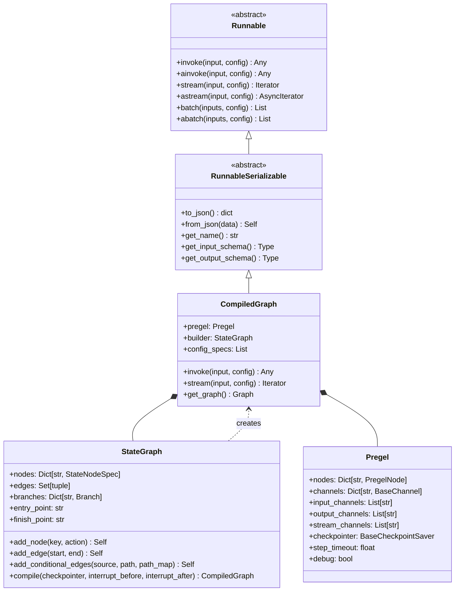
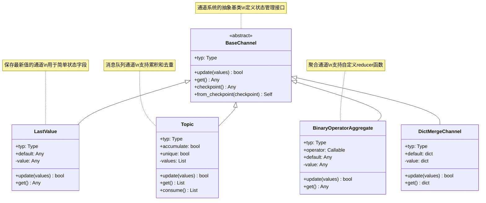
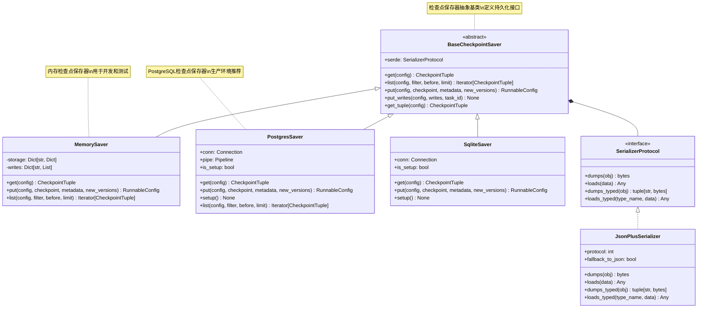
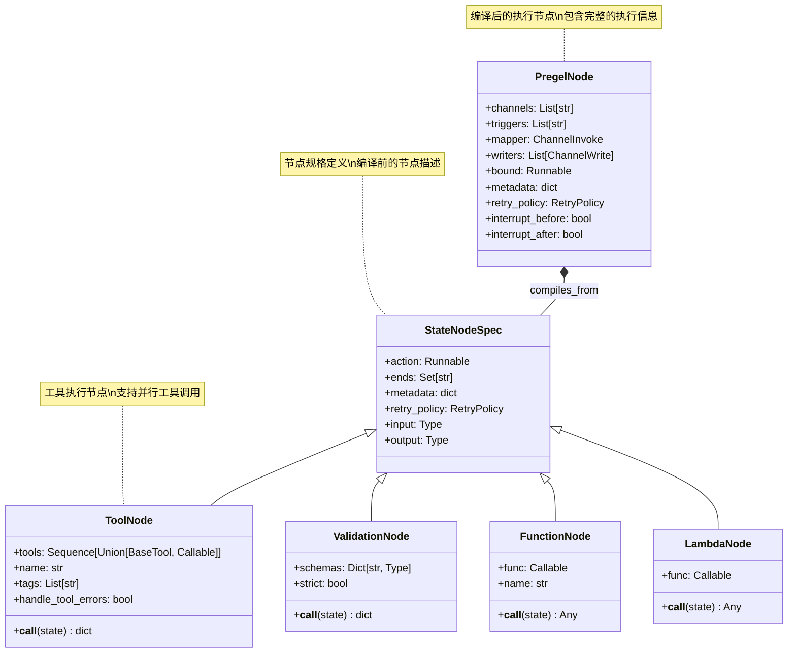
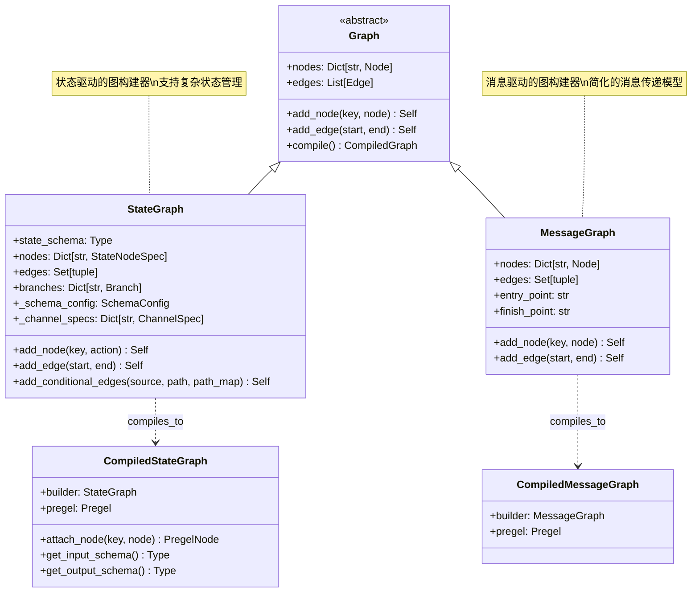
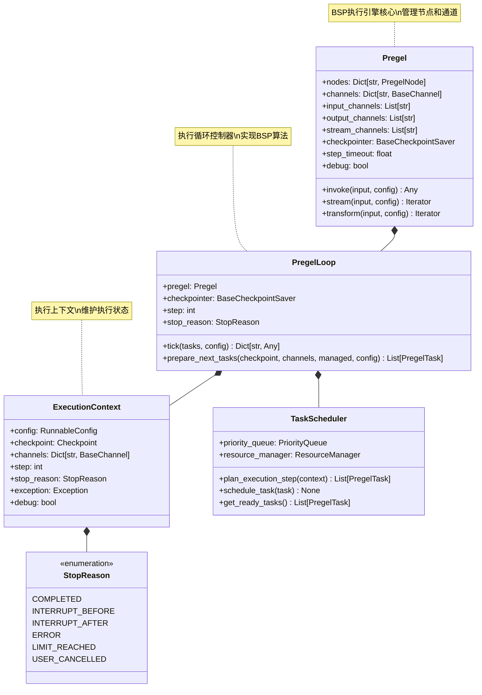
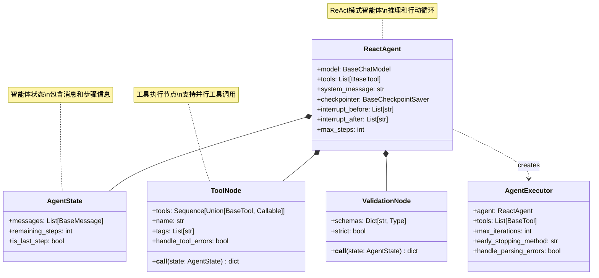
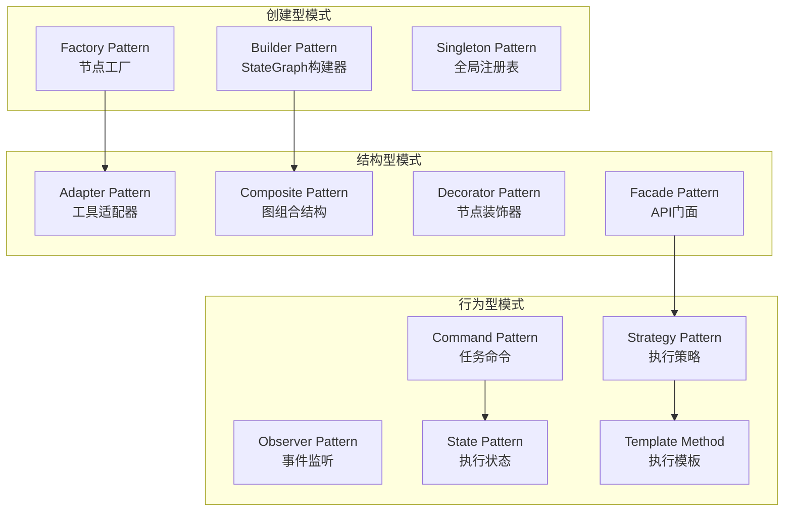

## 概述

本文深入分析LangGraph框架的核心结构和继承关系，从类型系统到设计模式，全面解析框架的架构设计思想。通过UML图和代码分析，帮助开发者理解LangGraph的内部组织结构和扩展机制。

<!--more-->

## 1. 核心类型系统架构

### 1.1 基础类型层次结构



### 1.2 状态管理类型系统



### 1.3 检查点系统类型层次



## 2. 节点系统结构分析

### 2.1 节点类型层次结构



### 2.2 节点执行流程结构

```python
# 文件：langgraph/pregel/types.py
from typing import TypedDict, Optional, Any, Dict, List, Union, Callable
from dataclasses import dataclass
from enum import Enum

class TaskStatus(Enum):
    """任务状态枚举"""
    PENDING = "pending"
    RUNNING = "running"
    COMPLETED = "completed"
    FAILED = "failed"
    CANCELLED = "cancelled"

@dataclass
class PregelTask:
    """Pregel任务定义
    
    这是执行引擎中任务的核心数据结构，包含：
    1. 任务标识信息
    2. 执行配置
    3. 状态管理
    4. 错误处理
    5. 性能监控
    
    设计原则：
    - 不可变性：任务创建后核心属性不可变
    - 类型安全：使用强类型确保数据一致性
    - 可序列化：支持检查点保存和恢复
    - 可监控：包含丰富的元数据用于监控
    """
    
    # === 核心标识 ===
    id: str                          # 任务唯一标识符
    name: str                        # 任务名称（通常是节点名）
    path: tuple[str, ...]           # 任务路径（支持子图）
    
    # === 执行配置 ===
    node: "PregelNode"              # 关联的Pregel节点
    config: "RunnableConfig"        # 运行时配置
    triggers: List[str]             # 触发通道列表
    
    # === 状态管理 ===
    status: TaskStatus = TaskStatus.PENDING    # 任务状态
    retry_count: int = 0                       # 重试次数
    priority: int = 0                          # 任务优先级
    
    # === 时间信息 ===
    created_at: float = 0.0         # 创建时间戳
    started_at: Optional[float] = None        # 开始执行时间
    completed_at: Optional[float] = None      # 完成时间
    
    # === 错误处理 ===
    error: Optional[Exception] = None         # 执行错误
    error_message: Optional[str] = None       # 错误消息
    
    # === 性能监控 ===
    execution_time: float = 0.0     # 执行耗时
    memory_usage: int = 0           # 内存使用量（字节）
    
    # === 元数据 ===
    metadata: Dict[str, Any] = None # 自定义元数据
    
    def __post_init__(self):
        """初始化后处理"""
        if self.metadata is None:
            self.metadata = {}
        if self.created_at == 0.0:
            import time
            self.created_at = time.time()
    
    @property
    def is_completed(self) -> bool:
        """任务是否已完成"""
        return self.status in (TaskStatus.COMPLETED, TaskStatus.FAILED, TaskStatus.CANCELLED)
    
    @property
    def duration(self) -> Optional[float]:
        """任务执行时长"""
        if self.started_at and self.completed_at:
            return self.completed_at - self.started_at
        return None
    
    def mark_started(self) -> None:
        """标记任务开始执行"""
        import time
        self.started_at = time.time()
        self.status = TaskStatus.RUNNING
    
    def mark_completed(self, execution_time: float = 0.0) -> None:
        """标记任务完成"""
        import time
        self.completed_at = time.time()
        self.status = TaskStatus.COMPLETED
        self.execution_time = execution_time
    
    def mark_failed(self, error: Exception) -> None:
        """标记任务失败"""
        import time
        self.completed_at = time.time()
        self.status = TaskStatus.FAILED
        self.error = error
        self.error_message = str(error)

class PregelTaskError(Exception):
    """Pregel任务执行错误
    
    包含丰富的错误上下文信息，用于：
    1. 错误诊断和调试
    2. 错误恢复和重试
    3. 错误统计和监控
    4. 用户友好的错误报告
    """
    
    def __init__(
        self,
        task_name: str,
        error: Exception,
        retry_count: int = 0,
        task_id: Optional[str] = None,
        context: Optional[Dict[str, Any]] = None
    ):
        self.task_name = task_name
        self.original_error = error
        self.retry_count = retry_count
        self.task_id = task_id
        self.context = context or {}
        
        # 构建错误消息
        message = f"Task '{task_name}' failed"
        if retry_count > 0:
            message += f" after {retry_count} retries"
        message += f": {error}"
        
        super().__init__(message)
    
    @property
    def is_retryable(self) -> bool:
        """错误是否可重试"""
        # 某些错误类型不应该重试
        non_retryable_types = (
            ValueError,      # 参数错误
            TypeError,       # 类型错误
            AttributeError,  # 属性错误
            KeyError,        # 键错误（通常是配置问题）
        )
        
        return not isinstance(self.original_error, non_retryable_types)
    
    def to_dict(self) -> Dict[str, Any]:
        """转换为字典格式"""
        return {
            "task_name": self.task_name,
            "task_id": self.task_id,
            "error_type": type(self.original_error).__name__,
            "error_message": str(self.original_error),
            "retry_count": self.retry_count,
            "is_retryable": self.is_retryable,
            "context": self.context,
        }
```

## 3. 图结构与编译系统

### 3.1 图构建器类型系统



### 3.2 分支和条件系统

```python
# 文件：langgraph/graph/state.py
from typing import TypedDict, Callable, Dict, Any, Union, Optional, Mapping
from dataclasses import dataclass

@dataclass
class Branch:
    """条件分支定义
    
    这是LangGraph条件路由的核心数据结构，支持：
    1. 动态路径选择
    2. 复杂条件逻辑
    3. 默认路径处理
    4. 路径映射管理
    
    设计特点：
    - 函数式设计：条件函数是纯函数
    - 类型安全：强类型的路径映射
    - 可扩展性：支持自定义条件逻辑
    - 性能优化：条件函数结果可缓存
    """
    
    # === 核心组件 ===
    condition: Callable[..., Union[str, List[str]]]  # 条件函数
    path_map: Dict[str, str]                         # 路径映射
    then: Optional[str] = None                       # 默认后续节点
    
    # === 配置选项 ===
    cache_condition_result: bool = False             # 是否缓存条件结果
    condition_timeout: Optional[float] = None        # 条件函数超时
    
    def __post_init__(self):
        """初始化后验证"""
        if not callable(self.condition):
            raise TypeError("condition must be callable")
        
        if not isinstance(self.path_map, dict):
            raise TypeError("path_map must be a dictionary")
        
        # 验证路径映射的值
        for key, value in self.path_map.items():
            if not isinstance(key, str) or not isinstance(value, str):
                raise TypeError("path_map keys and values must be strings")
    
    def evaluate_condition(
        self, 
        state: Any, 
        config: Optional[Dict[str, Any]] = None
    ) -> Union[str, List[str]]:
        """评估条件函数
        
        Args:
            state: 当前状态
            config: 运行时配置
            
        Returns:
            Union[str, List[str]]: 条件结果
            
        Raises:
            ConditionEvaluationError: 条件评估失败时
        """
        try:
            # 应用超时控制
            if self.condition_timeout:
                import signal
                
                def timeout_handler(signum, frame):
                    raise TimeoutError("Condition evaluation timeout")
                
                signal.signal(signal.SIGALRM, timeout_handler)
                signal.alarm(int(self.condition_timeout))
            
            try:
                # 执行条件函数
                if config:
                    # 尝试传递config参数
                    import inspect
                    sig = inspect.signature(self.condition)
                    if 'config' in sig.parameters:
                        result = self.condition(state, config=config)
                    else:
                        result = self.condition(state)
                else:
                    result = self.condition(state)
                
                return result
            
            finally:
                if self.condition_timeout:
                    signal.alarm(0)  # 取消超时
        
        except Exception as e:
            raise ConditionEvaluationError(
                f"Failed to evaluate condition: {e}"
            ) from e
    
    def resolve_next_nodes(
        self, 
        condition_result: Union[str, List[str]]
    ) -> List[str]:
        """解析下一个节点
        
        Args:
            condition_result: 条件函数结果
            
        Returns:
            List[str]: 下一个节点列表
        """
        if isinstance(condition_result, str):
            # 单个结果
            if condition_result in self.path_map:
                return [self.path_map[condition_result]]
            elif self.then:
                return [self.then]
            else:
                raise ValueError(f"No path found for condition result: {condition_result}")
        
        elif isinstance(condition_result, list):
            # 多个结果（并行执行）
            next_nodes = []
            for result in condition_result:
                if result in self.path_map:
                    next_nodes.append(self.path_map[result])
                elif self.then:
                    next_nodes.append(self.then)
                else:
                    raise ValueError(f"No path found for condition result: {result}")
            
            return list(set(next_nodes))  # 去重
        
        else:
            raise TypeError(f"Invalid condition result type: {type(condition_result)}")

class ConditionEvaluationError(Exception):
    """条件评估错误"""
    pass

@dataclass
class ChannelSpec:
    """通道规格定义
    
    定义状态字段如何映射到通道的规格，包括：
    1. 类型信息
    2. 默认值
    3. Reducer函数
    4. 验证规则
    """
    
    type: type                                       # 字段类型
    default: Any = None                             # 默认值
    reducer: Optional[Callable[[Any, Any], Any]] = None  # Reducer函数
    validator: Optional[Callable[[Any], bool]] = None    # 验证函数
    
    def __post_init__(self):
        """初始化后验证"""
        if self.reducer and not callable(self.reducer):
            raise TypeError("reducer must be callable")
        
        if self.validator and not callable(self.validator):
            raise TypeError("validator must be callable")

@dataclass 
class SchemaConfig:
    """模式配置
    
    控制状态模式的解析和处理行为：
    1. 类型推断策略
    2. 默认值处理
    3. Reducer自动选择
    4. 验证规则应用
    """
    
    # === 类型推断 ===
    auto_infer_reducers: bool = True            # 自动推断reducer
    strict_typing: bool = False                 # 严格类型检查
    
    # === 默认值处理 ===
    use_field_defaults: bool = True             # 使用字段默认值
    allow_none_values: bool = True              # 允许None值
    
    # === Reducer选择 ===
    default_list_reducer: str = "extend"        # 列表默认reducer
    default_dict_reducer: str = "update"        # 字典默认reducer
    default_set_reducer: str = "union"          # 集合默认reducer
    
    # === 验证配置 ===
    validate_on_update: bool = False            # 更新时验证
    validate_on_access: bool = False            # 访问时验证
```

## 4. 执行引擎结构分析

### 4.1 Pregel执行引擎类型系统



### 4.2 任务调度系统结构

```python
# 文件：langgraph/pregel/executor.py
from typing import List, Dict, Any, Optional, Set, Callable
from dataclasses import dataclass, field
from enum import Enum
import heapq
import threading
import time
from concurrent.futures import ThreadPoolExecutor, Future

class TaskPriority(Enum):
    """任务优先级枚举"""
    CRITICAL = 0    # 关键任务（系统任务）
    HIGH = 1        # 高优先级
    NORMAL = 2      # 普通优先级
    LOW = 3         # 低优先级
    BACKGROUND = 4  # 后台任务

@dataclass
class ResourceRequirement:
    """资源需求定义
    
    定义任务执行所需的资源，用于：
    1. 资源分配和调度
    2. 并发控制
    3. 性能优化
    4. 资源监控
    """
    
    # === CPU资源 ===
    cpu_cores: float = 1.0              # 需要的CPU核心数
    cpu_intensive: bool = False         # 是否CPU密集型
    
    # === 内存资源 ===
    memory_mb: int = 100               # 需要的内存（MB）
    memory_intensive: bool = False      # 是否内存密集型
    
    # === IO资源 ===
    io_intensive: bool = False         # 是否IO密集型
    network_access: bool = False       # 是否需要网络访问
    
    # === 特殊资源 ===
    gpu_required: bool = False         # 是否需要GPU
    exclusive_access: bool = False     # 是否需要独占访问
    
    # === 时间限制 ===
    max_execution_time: Optional[float] = None  # 最大执行时间
    
    def is_compatible_with(self, available: "AvailableResources") -> bool:
        """检查是否与可用资源兼容"""
        return (
            self.cpu_cores <= available.cpu_cores and
            self.memory_mb <= available.memory_mb and
            (not self.gpu_required or available.gpu_available) and
            (not self.network_access or available.network_available)
        )

@dataclass
class AvailableResources:
    """可用资源定义"""
    
    cpu_cores: float = 4.0             # 可用CPU核心数
    memory_mb: int = 4096              # 可用内存（MB）
    gpu_available: bool = False        # GPU是否可用
    network_available: bool = True     # 网络是否可用
    
    # === 动态资源 ===
    current_cpu_usage: float = 0.0     # 当前CPU使用率
    current_memory_usage: int = 0      # 当前内存使用量
    
    def allocate(self, requirement: ResourceRequirement) -> bool:
        """分配资源"""
        if not requirement.is_compatible_with(self):
            return False
        
        self.cpu_cores -= requirement.cpu_cores
        self.memory_mb -= requirement.memory_mb
        self.current_cpu_usage += requirement.cpu_cores
        self.current_memory_usage += requirement.memory_mb
        
        return True
    
    def release(self, requirement: ResourceRequirement) -> None:
        """释放资源"""
        self.cpu_cores += requirement.cpu_cores
        self.memory_mb += requirement.memory_mb
        self.current_cpu_usage -= requirement.cpu_cores
        self.current_memory_usage -= requirement.memory_mb

class TaskScheduler:
    """任务调度器
    
    负责任务的调度和执行管理，实现：
    1. 优先级调度
    2. 资源感知调度
    3. 负载均衡
    4. 死锁避免
    5. 性能优化
    
    调度算法：
    - 基于优先级的抢占式调度
    - 资源感知的智能分配
    - 工作窃取的负载均衡
    - 反压机制的流控
    """
    
    def __init__(
        self,
        max_workers: int = 4,
        resource_manager: Optional["ResourceManager"] = None,
        enable_work_stealing: bool = True
    ):
        self.max_workers = max_workers
        self.resource_manager = resource_manager or ResourceManager()
        self.enable_work_stealing = enable_work_stealing
        
        # === 调度队列 ===
        self._priority_queue: List[tuple] = []  # (priority, timestamp, task)
        self._ready_queue: List[PregelTask] = []
        self._running_tasks: Dict[str, PregelTask] = {}
        self._completed_tasks: Dict[str, Any] = {}
        
        # === 线程同步 ===
        self._queue_lock = threading.RLock()
        self._stats_lock = threading.Lock()
        
        # === 执行器 ===
        self._executor = ThreadPoolExecutor(
            max_workers=max_workers,
            thread_name_prefix="langgraph-task"
        )
        
        # === 统计信息 ===
        self._stats = SchedulerStats()
        
        # === 控制标志 ===
        self._shutdown = False
        self._paused = False
    
    def plan_execution_step(
        self, 
        context: "ExecutionContext"
    ) -> List[PregelTask]:
        """规划执行步骤
        
        这是调度器的核心方法，负责：
        1. 分析当前状态
        2. 确定可执行任务
        3. 应用调度策略
        4. 返回任务列表
        
        Args:
            context: 执行上下文
            
        Returns:
            List[PregelTask]: 计划执行的任务列表
        """
        planning_start = time.time()
        
        try:
            # === 第一阶段：任务发现 ===
            candidate_tasks = self._discover_candidate_tasks(context)
            
            if not candidate_tasks:
                return []
            
            # === 第二阶段：依赖分析 ===
            ready_tasks = self._analyze_task_dependencies(candidate_tasks, context)
            
            # === 第三阶段：资源检查 ===
            schedulable_tasks = self._check_resource_availability(ready_tasks)
            
            # === 第四阶段：优先级排序 ===
            prioritized_tasks = self._apply_priority_scheduling(schedulable_tasks)
            
            # === 第五阶段：并发控制 ===
            final_tasks = self._apply_concurrency_limits(prioritized_tasks, context)
            
            # === 统计记录 ===
            planning_duration = time.time() - planning_start
            
            with self._stats_lock:
                self._stats.record_planning_operation(
                    candidates_count=len(candidate_tasks),
                    ready_count=len(ready_tasks),
                    scheduled_count=len(final_tasks),
                    duration=planning_duration
                )
            
            return final_tasks
        
        except Exception as e:
            logger.error(f"Task planning failed: {e}")
            return []
    
    def _discover_candidate_tasks(
        self, 
        context: "ExecutionContext"
    ) -> List[PregelTask]:
        """发现候选任务
        
        Args:
            context: 执行上下文
            
        Returns:
            List[PregelTask]: 候选任务列表
        """
        candidate_tasks = []
        
        # 遍历所有节点，检查触发条件
        for node_name, node in context.pregel.nodes.items():
            if self._is_node_triggered(node, context):
                task = self._create_task_for_node(node_name, node, context)
                candidate_tasks.append(task)
        
        return candidate_tasks
    
    def _is_node_triggered(
        self, 
        node: "PregelNode", 
        context: "ExecutionContext"
    ) -> bool:
        """检查节点是否被触发
        
        Args:
            node: Pregel节点
            context: 执行上下文
            
        Returns:
            bool: 是否被触发
        """
        # 检查所有触发通道
        for trigger_channel in node.triggers:
            channel = context.channels.get(trigger_channel)
            if channel and channel.has_updates():
                return True
        
        return False
    
    def _create_task_for_node(
        self,
        node_name: str,
        node: "PregelNode",
        context: "ExecutionContext"
    ) -> PregelTask:
        """为节点创建任务
        
        Args:
            node_name: 节点名称
            node: Pregel节点
            context: 执行上下文
            
        Returns:
            PregelTask: 创建的任务
        """
        # 分析资源需求
        resource_req = self._analyze_resource_requirement(node)
        
        # 确定任务优先级
        priority = self._determine_task_priority(node, context)
        
        # 创建任务
        task = PregelTask(
            id=f"{node_name}_{context.step}_{int(time.time() * 1000)}",
            name=node_name,
            path=(node_name,),
            node=node,
            config=context.config,
            triggers=node.triggers,
            priority=priority.value,
            metadata={
                "resource_requirement": resource_req,
                "step": context.step,
                "created_by": "scheduler"
            }
        )
        
        return task
    
    def _analyze_resource_requirement(
        self, 
        node: "PregelNode"
    ) -> ResourceRequirement:
        """分析节点的资源需求
        
        Args:
            node: Pregel节点
            
        Returns:
            ResourceRequirement: 资源需求
        """
        # 从节点元数据获取资源需求
        metadata = node.metadata or {}
        
        return ResourceRequirement(
            cpu_cores=metadata.get("cpu_cores", 1.0),
            memory_mb=metadata.get("memory_mb", 100),
            cpu_intensive=metadata.get("cpu_intensive", False),
            memory_intensive=metadata.get("memory_intensive", False),
            io_intensive=metadata.get("io_intensive", False),
            network_access=metadata.get("network_access", False),
            gpu_required=metadata.get("gpu_required", False),
            max_execution_time=metadata.get("max_execution_time")
        )
    
    def _determine_task_priority(
        self,
        node: "PregelNode",
        context: "ExecutionContext"
    ) -> TaskPriority:
        """确定任务优先级
        
        Args:
            node: Pregel节点
            context: 执行上下文
            
        Returns:
            TaskPriority: 任务优先级
        """
        # 检查节点元数据中的优先级设置
        metadata = node.metadata or {}
        
        if "priority" in metadata:
            priority_str = metadata["priority"].upper()
            try:
                return TaskPriority[priority_str]
            except KeyError:
                pass
        
        # 根据节点类型推断优先级
        if node.interrupt_before or node.interrupt_after:
            return TaskPriority.HIGH
        
        # 默认普通优先级
        return TaskPriority.NORMAL

@dataclass
class SchedulerStats:
    """调度器统计信息"""
    
    # === 计数统计 ===
    total_tasks_scheduled: int = 0
    total_tasks_completed: int = 0
    total_tasks_failed: int = 0
    
    # === 时间统计 ===
    total_planning_time: float = 0.0
    total_execution_time: float = 0.0
    average_task_duration: float = 0.0
    
    # === 资源统计 ===
    peak_memory_usage: int = 0
    peak_cpu_usage: float = 0.0
    
    def record_planning_operation(
        self,
        candidates_count: int,
        ready_count: int,
        scheduled_count: int,
        duration: float
    ) -> None:
        """记录规划操作统计"""
        self.total_planning_time += duration
        self.total_tasks_scheduled += scheduled_count
    
    def record_task_completion(
        self,
        task_duration: float,
        success: bool
    ) -> None:
        """记录任务完成统计"""
        if success:
            self.total_tasks_completed += 1
        else:
            self.total_tasks_failed += 1
        
        self.total_execution_time += task_duration
        
        # 更新平均任务时长
        total_completed = self.total_tasks_completed + self.total_tasks_failed
        if total_completed > 0:
            self.average_task_duration = self.total_execution_time / total_completed
```

## 5. 预构建组件结构分析

### 5.1 ReAct Agent系统结构



### 5.2 工具系统类型层次

```python
# 文件：langgraph/prebuilt/tool_node.py
from typing import Any, Callable, Dict, List, Optional, Sequence, Union, Type
from abc import ABC, abstractmethod
from dataclasses import dataclass
import asyncio
import inspect
from concurrent.futures import ThreadPoolExecutor, as_completed

class ToolInterface(ABC):
    """工具接口抽象基类
    
    定义所有工具必须实现的基本接口，确保：
    1. 统一的调用方式
    2. 一致的错误处理
    3. 标准的元数据格式
    4. 可扩展的功能
    """
    
    @property
    @abstractmethod
    def name(self) -> str:
        """工具名称"""
        pass
    
    @property
    @abstractmethod
    def description(self) -> str:
        """工具描述"""
        pass
    
    @abstractmethod
    def invoke(self, input: Any, config: Optional[Dict[str, Any]] = None) -> Any:
        """同步调用工具"""
        pass
    
    @abstractmethod
    async def ainvoke(self, input: Any, config: Optional[Dict[str, Any]] = None) -> Any:
        """异步调用工具"""
        pass
    
    @property
    def input_schema(self) -> Optional[Type]:
        """输入模式"""
        return None
    
    @property
    def output_schema(self) -> Optional[Type]:
        """输出模式"""
        return None

@dataclass
class ToolCall:
    """工具调用定义
    
    表示一个具体的工具调用请求，包含：
    1. 工具标识信息
    2. 调用参数
    3. 执行配置
    4. 结果处理
    """
    
    # === 核心信息 ===
    id: str                              # 调用ID
    name: str                           # 工具名称
    args: Dict[str, Any]                # 调用参数
    
    # === 执行配置 ===
    timeout: Optional[float] = None     # 超时时间
    retry_count: int = 0               # 重试次数
    async_execution: bool = False       # 是否异步执行
    
    # === 结果信息 ===
    result: Any = None                 # 执行结果
    error: Optional[Exception] = None   # 执行错误
    execution_time: float = 0.0        # 执行耗时
    
    # === 元数据 ===
    metadata: Dict[str, Any] = None    # 自定义元数据
    
    def __post_init__(self):
        if self.metadata is None:
            self.metadata = {}
    
    @property
    def is_completed(self) -> bool:
        """是否已完成"""
        return self.result is not None or self.error is not None
    
    @property
    def is_successful(self) -> bool:
        """是否成功"""
        return self.result is not None and self.error is None

class ToolRegistry:
    """工具注册表
    
    管理所有可用工具的注册表，提供：
    1. 工具注册和发现
    2. 工具验证和检查
    3. 工具元数据管理
    4. 工具生命周期管理
    """
    
    def __init__(self):
        self._tools: Dict[str, ToolInterface] = {}
        self._tool_metadata: Dict[str, Dict[str, Any]] = {}
        self._tool_groups: Dict[str, List[str]] = {}
    
    def register_tool(
        self,
        tool: ToolInterface,
        group: Optional[str] = None,
        metadata: Optional[Dict[str, Any]] = None
    ) -> None:
        """注册工具
        
        Args:
            tool: 工具实例
            group: 工具组名
            metadata: 工具元数据
        """
        if not isinstance(tool, ToolInterface):
            raise TypeError("Tool must implement ToolInterface")
        
        tool_name = tool.name
        
        if tool_name in self._tools:
            raise ValueError(f"Tool '{tool_name}' already registered")
        
        # 注册工具
        self._tools[tool_name] = tool
        self._tool_metadata[tool_name] = metadata or {}
        
        # 添加到组
        if group:
            if group not in self._tool_groups:
                self._tool_groups[group] = []
            self._tool_groups[group].append(tool_name)
    
    def get_tool(self, name: str) -> Optional[ToolInterface]:
        """获取工具"""
        return self._tools.get(name)
    
    def list_tools(self, group: Optional[str] = None) -> List[str]:
        """列出工具"""
        if group:
            return self._tool_groups.get(group, [])
        return list(self._tools.keys())
    
    def get_tools_by_group(self, group: str) -> List[ToolInterface]:
        """按组获取工具"""
        tool_names = self._tool_groups.get(group, [])
        return [self._tools[name] for name in tool_names]

class ToolExecutor:
    """工具执行器
    
    负责工具的实际执行，提供：
    1. 同步和异步执行
    2. 并发控制
    3. 错误处理和重试
    4. 性能监控
    5. 资源管理
    """
    
    def __init__(
        self,
        registry: ToolRegistry,
        max_workers: int = 4,
        default_timeout: float = 30.0,
        enable_parallel_execution: bool = True
    ):
        self.registry = registry
        self.max_workers = max_workers
        self.default_timeout = default_timeout
        self.enable_parallel_execution = enable_parallel_execution
        
        # 执行器
        self._thread_executor = ThreadPoolExecutor(max_workers=max_workers)
        
        # 统计信息
        self._execution_stats = ExecutionStats()
    
    def execute_tool_calls(
        self,
        tool_calls: List[ToolCall],
        config: Optional[Dict[str, Any]] = None
    ) -> List[ToolCall]:
        """执行工具调用列表
        
        Args:
            tool_calls: 工具调用列表
            config: 执行配置
            
        Returns:
            List[ToolCall]: 执行结果
        """
        if not tool_calls:
            return []
        
        if len(tool_calls) == 1:
            # 单个工具调用
            return [self._execute_single_tool_call(tool_calls[0], config)]
        
        elif self.enable_parallel_execution:
            # 并行执行
            return self._execute_parallel_tool_calls(tool_calls, config)
        
        else:
            # 串行执行
            return [self._execute_single_tool_call(call, config) for call in tool_calls]
    
    def _execute_single_tool_call(
        self,
        tool_call: ToolCall,
        config: Optional[Dict[str, Any]] = None
    ) -> ToolCall:
        """执行单个工具调用
        
        Args:
            tool_call: 工具调用
            config: 执行配置
            
        Returns:
            ToolCall: 更新后的工具调用
        """
        start_time = time.time()
        
        try:
            # 获取工具
            tool = self.registry.get_tool(tool_call.name)
            if not tool:
                raise ValueError(f"Tool '{tool_call.name}' not found")
            
            # 准备参数
            invoke_args = self._prepare_invoke_args(tool, tool_call.args, config)
            
            # 执行工具
            timeout = tool_call.timeout or self.default_timeout
            
            if timeout:
                # 带超时执行
                future = self._thread_executor.submit(tool.invoke, invoke_args, config)
                result = future.result(timeout=timeout)
            else:
                # 普通执行
                result = tool.invoke(invoke_args, config)
            
            # 更新结果
            tool_call.result = result
            tool_call.execution_time = time.time() - start_time
            
            # 记录统计
            self._execution_stats.record_success(
                tool_call.name, tool_call.execution_time
            )
            
        except Exception as e:
            # 错误处理
            tool_call.error = e
            tool_call.execution_time = time.time() - start_time
            
            # 记录统计
            self._execution_stats.record_error(
                tool_call.name, tool_call.execution_time, str(e)
            )
        
        return tool_call
    
    def _execute_parallel_tool_calls(
        self,
        tool_calls: List[ToolCall],
        config: Optional[Dict[str, Any]] = None
    ) -> List[ToolCall]:
        """并行执行工具调用
        
        Args:
            tool_calls: 工具调用列表
            config: 执行配置
            
        Returns:
            List[ToolCall]: 执行结果列表
        """
        # 提交所有任务
        future_to_call = {
            self._thread_executor.submit(
                self._execute_single_tool_call, call, config
            ): call
            for call in tool_calls
        }
        
        # 收集结果
        results = []
        for future in as_completed(future_to_call):
            try:
                result_call = future.result()
                results.append(result_call)
            except Exception as e:
                # 这种情况不应该发生，因为异常已在单个执行中处理
                original_call = future_to_call[future]
                original_call.error = e
                results.append(original_call)
        
        # 按原始顺序排序
        call_id_to_result = {call.id: call for call in results}
        ordered_results = [call_id_to_result[call.id] for call in tool_calls]
        
        return ordered_results
    
    def _prepare_invoke_args(
        self,
        tool: ToolInterface,
        args: Dict[str, Any],
        config: Optional[Dict[str, Any]] = None
    ) -> Any:
        """准备调用参数
        
        Args:
            tool: 工具实例
            args: 原始参数
            config: 执行配置
            
        Returns:
            Any: 准备好的参数
        """
        # 检查工具的输入模式
        if tool.input_schema:
            try:
                # 使用Pydantic验证参数
                validated_args = tool.input_schema(**args)
                return validated_args
            except Exception as e:
                raise ValueError(f"Invalid arguments for tool '{tool.name}': {e}")
        
        # 检查函数签名
        if hasattr(tool, 'invoke'):
            sig = inspect.signature(tool.invoke)
            params = list(sig.parameters.keys())
            
            if len(params) == 1:
                # 单参数，直接传递args
                return args
            elif len(params) == 2 and 'config' in params:
                # 两参数，包含config
                return args
            else:
                # 多参数，展开args
                return args
        
        return args

@dataclass
class ExecutionStats:
    """执行统计信息"""
    
    # === 计数统计 ===
    total_executions: int = 0
    successful_executions: int = 0
    failed_executions: int = 0
    
    # === 时间统计 ===
    total_execution_time: float = 0.0
    average_execution_time: float = 0.0
    min_execution_time: float = float('inf')
    max_execution_time: float = 0.0
    
    # === 工具统计 ===
    tool_usage_count: Dict[str, int] = None
    tool_error_count: Dict[str, int] = None
    
    def __post_init__(self):
        if self.tool_usage_count is None:
            self.tool_usage_count = {}
        if self.tool_error_count is None:
            self.tool_error_count = {}
    
    def record_success(self, tool_name: str, execution_time: float) -> None:
        """记录成功执行"""
        self.total_executions += 1
        self.successful_executions += 1
        self.total_execution_time += execution_time
        
        # 更新时间统计
        self.average_execution_time = self.total_execution_time / self.total_executions
        self.min_execution_time = min(self.min_execution_time, execution_time)
        self.max_execution_time = max(self.max_execution_time, execution_time)
        
        # 更新工具统计
        self.tool_usage_count[tool_name] = self.tool_usage_count.get(tool_name, 0) + 1
    
    def record_error(self, tool_name: str, execution_time: float, error: str) -> None:
        """记录执行错误"""
        self.total_executions += 1
        self.failed_executions += 1
        self.total_execution_time += execution_time
        
        # 更新时间统计
        self.average_execution_time = self.total_execution_time / self.total_executions
        
        # 更新错误统计
        self.tool_error_count[tool_name] = self.tool_error_count.get(tool_name, 0) + 1
```

## 6. 设计模式分析

### 6.1 核心设计模式



### 6.2 架构模式应用

1. **BSP (Bulk Synchronous Parallel) 模式**
   - 超步执行模型
   - 状态同步机制
   - 并行任务协调

2. **Pipeline 模式**
   - 数据流处理
   - 阶段化执行
   - 错误传播

3. **Event Sourcing 模式**
   - 检查点系统
   - 状态重建
   - 事件日志

4. **CQRS (Command Query Responsibility Segregation) 模式**
   - 读写分离
   - 状态查询优化
   - 命令处理隔离

## 7. 扩展机制分析

### 7.1 插件系统结构

```python
# 文件：langgraph/extensions/plugin.py
from typing import Any, Dict, List, Optional, Type, Protocol
from abc import ABC, abstractmethod
import importlib
import inspect

class PluginInterface(Protocol):
    """插件接口协议
    
    定义插件必须实现的接口，确保：
    1. 统一的生命周期管理
    2. 标准的配置机制
    3. 一致的错误处理
    4. 可扩展的功能集成
    """
    
    name: str
    version: str
    description: str
    
    def initialize(self, config: Dict[str, Any]) -> None:
        """初始化插件"""
        ...
    
    def activate(self) -> None:
        """激活插件"""
        ...
    
    def deactivate(self) -> None:
        """停用插件"""
        ...
    
    def get_capabilities(self) -> List[str]:
        """获取插件能力"""
        ...

class BasePlugin(ABC):
    """插件基类
    
    提供插件的基础实现，包括：
    1. 生命周期管理
    2. 配置处理
    3. 日志记录
    4. 错误处理
    """
    
    def __init__(self, name: str, version: str, description: str = ""):
        self.name = name
        self.version = version
        self.description = description
        self._initialized = False
        self._active = False
        self._config: Dict[str, Any] = {}
    
    @abstractmethod
    def initialize(self, config: Dict[str, Any]) -> None:
        """初始化插件（子类必须实现）"""
        pass
    
    @abstractmethod
    def get_capabilities(self) -> List[str]:
        """获取插件能力（子类必须实现）"""
        pass
    
    def activate(self) -> None:
        """激活插件"""
        if not self._initialized:
            raise RuntimeError(f"Plugin '{self.name}' not initialized")
        
        self._active = True
        self._on_activate()
    
    def deactivate(self) -> None:
        """停用插件"""
        self._active = False
        self._on_deactivate()
    
    def _on_activate(self) -> None:
        """激活时的钩子方法"""
        pass
    
    def _on_deactivate(self) -> None:
        """停用时的钩子方法"""
        pass
    
    @property
    def is_active(self) -> bool:
        """是否处于激活状态"""
        return self._active
    
    @property
    def config(self) -> Dict[str, Any]:
        """插件配置"""
        return self._config.copy()

class PluginManager:
    """插件管理器
    
    负责插件的生命周期管理，提供：
    1. 插件发现和加载
    2. 依赖关系管理
    3. 配置管理
    4. 运行时控制
    """
    
    def __init__(self):
        self._plugins: Dict[str, BasePlugin] = {}
        self._plugin_configs: Dict[str, Dict[str, Any]] = {}
        self._dependency_graph: Dict[str, List[str]] = {}
        self._load_order: List[str] = []
    
    def register_plugin(
        self,
        plugin: BasePlugin,
        config: Optional[Dict[str, Any]] = None,
        dependencies: Optional[List[str]] = None
    ) -> None:
        """注册插件
        
        Args:
            plugin: 插件实例
            config: 插件配置
            dependencies: 依赖的插件列表
        """
        if plugin.name in self._plugins:
            raise ValueError(f"Plugin '{plugin.name}' already registered")
        
        # 注册插件
        self._plugins[plugin.name] = plugin
        self._plugin_configs[plugin.name] = config or {}
        self._dependency_graph[plugin.name] = dependencies or []
        
        # 重新计算加载顺序
        self._compute_load_order()
    
    def load_plugin_from_module(
        self,
        module_path: str,
        plugin_class_name: str,
        config: Optional[Dict[str, Any]] = None
    ) -> None:
        """从模块加载插件
        
        Args:
            module_path: 模块路径
            plugin_class_name: 插件类名
            config: 插件配置
        """
        try:
            # 导入模块
            module = importlib.import_module(module_path)
            
            # 获取插件类
            plugin_class = getattr(module, plugin_class_name)
            
            # 验证插件类
            if not issubclass(plugin_class, BasePlugin):
                raise TypeError(f"Plugin class must inherit from BasePlugin")
            
            # 创建插件实例
            plugin = plugin_class()
            
            # 注册插件
            self.register_plugin(plugin, config)
            
        except Exception as e:
            raise PluginLoadError(f"Failed to load plugin from {module_path}: {e}")
    
    def initialize_all_plugins(self) -> None:
        """初始化所有插件"""
        for plugin_name in self._load_order:
            plugin = self._plugins[plugin_name]
            config = self._plugin_configs[plugin_name]
            
            try:
                plugin.initialize(config)
                plugin._initialized = True
            except Exception as e:
                raise PluginInitializationError(
                    f"Failed to initialize plugin '{plugin_name}': {e}"
                )
    
    def activate_all_plugins(self) -> None:
        """激活所有插件"""
        for plugin_name in self._load_order:
            plugin = self._plugins[plugin_name]
            
            try:
                plugin.activate()
            except Exception as e:
                logger.error(f"Failed to activate plugin '{plugin_name}': {e}")
    
    def deactivate_all_plugins(self) -> None:
        """停用所有插件"""
        # 按相反顺序停用
        for plugin_name in reversed(self._load_order):
            plugin = self._plugins[plugin_name]
            
            try:
                plugin.deactivate()
            except Exception as e:
                logger.error(f"Failed to deactivate plugin '{plugin_name}': {e}")
    
    def get_plugin(self, name: str) -> Optional[BasePlugin]:
        """获取插件"""
        return self._plugins.get(name)
    
    def list_plugins(self, active_only: bool = False) -> List[str]:
        """列出插件"""
        if active_only:
            return [name for name, plugin in self._plugins.items() if plugin.is_active]
        return list(self._plugins.keys())
    
    def _compute_load_order(self) -> None:
        """计算插件加载顺序（拓扑排序）"""
        # 使用Kahn算法进行拓扑排序
        in_degree = {name: 0 for name in self._plugins}
        
        # 计算入度
        for plugin_name, dependencies in self._dependency_graph.items():
            for dep in dependencies:
                if dep in in_degree:
                    in_degree[plugin_name] += 1
        
        # 拓扑排序
        queue = [name for name, degree in in_degree.items() if degree == 0]
        result = []
        
        while queue:
            current = queue.pop(0)
            result.append(current)
            
            # 更新依赖此插件的其他插件的入度
            for plugin_name, dependencies in self._dependency_graph.items():
                if current in dependencies:
                    in_degree[plugin_name] -= 1
                    if in_degree[plugin_name] == 0:
                        queue.append(plugin_name)
        
        # 检查循环依赖
        if len(result) != len(self._plugins):
            raise CircularDependencyError("Circular dependency detected in plugins")
        
        self._load_order = result

class PluginLoadError(Exception):
    """插件加载错误"""
    pass

class PluginInitializationError(Exception):
    """插件初始化错误"""
    pass

class CircularDependencyError(Exception):
    """循环依赖错误"""
    pass
```

## 8. 总结

### 8.1 架构设计精髓

LangGraph的结构和继承关系体现了以下设计精髓：

1. **层次化设计**：清晰的抽象层次，从接口到实现
2. **组合优于继承**：大量使用组合模式而非深度继承
3. **接口隔离**：每个接口职责单一，易于实现和测试
4. **依赖注入**：通过构造函数和配置注入依赖
5. **开闭原则**：对扩展开放，对修改封闭

### 8.2 关键继承关系

1. **Runnable体系**：统一的执行接口
2. **Channel体系**：灵活的状态管理
3. **CheckpointSaver体系**：可插拔的持久化
4. **Plugin体系**：可扩展的功能模块

### 8.3 设计模式应用

1. **创建型模式**：Builder、Factory、Singleton
2. **结构型模式**：Adapter、Composite、Decorator
3. **行为型模式**：Strategy、Observer、Command

### 8.4 扩展机制

1. **插件系统**：动态加载和管理
2. **接口抽象**：标准化的扩展点
3. **配置驱动**：灵活的行为定制
4. **事件机制**：松耦合的组件通信

这种精心设计的结构和继承关系，为LangGraph提供了强大的可扩展性和可维护性，使其能够适应各种复杂的应用场景。

---

---

tommie blog
