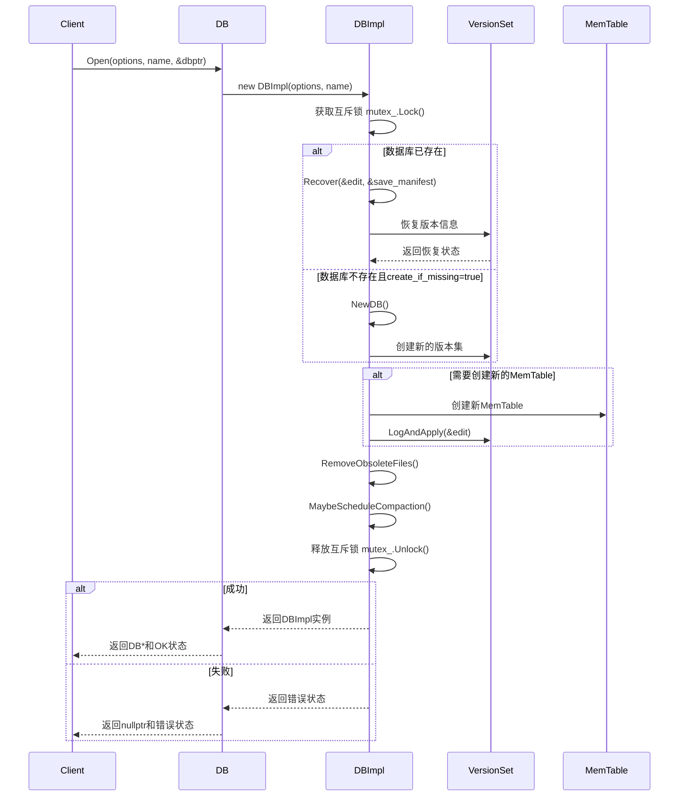
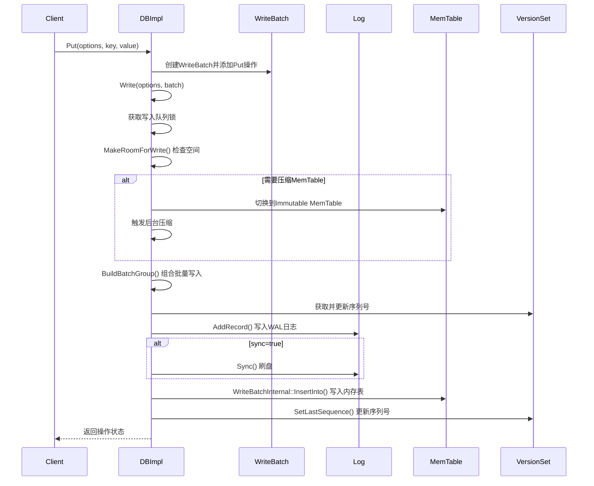
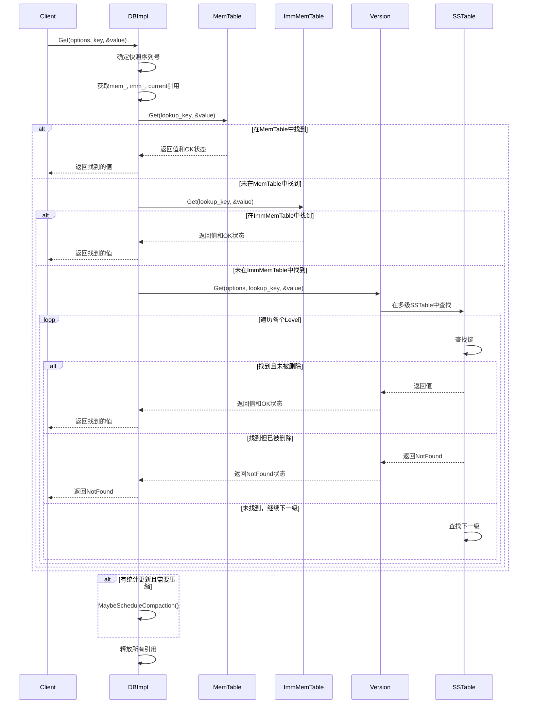

## 1. 核心API概览

LevelDB提供的主要API接口都定义在 `include/leveldb/db.h` 中，以抽象类 `DB` 的形式对外暴露，具体实现在 `db/db_impl.h` 和 `db/db_impl.cc` 中的 `DBImpl` 类。

### API接口层次结构
```
leveldb::DB (抽象接口)
    ├── Open()          - 静态工厂方法
    ├── Put()           - 写入键值对
    ├── Get()           - 读取值
    ├── Delete()        - 删除键
    ├── Write()         - 批量写入
    ├── NewIterator()   - 创建迭代器
    ├── GetSnapshot()   - 获取快照
    ├── ReleaseSnapshot() - 释放快照
    ├── GetProperty()   - 查询属性
    ├── GetApproximateSizes() - 获取大小估算
    └── CompactRange()  - 手动压缩

leveldb::DBImpl (具体实现)
    └── 实现所有抽象方法
```

## 2. 主要API详细分析

### 2.1 DB::Open() - 数据库打开

#### 接口定义
```cpp
// 文件: include/leveldb/db.h (第53-54行)
static Status Open(const Options& options, const std::string& name, DB** dbptr);
```

#### 功能说明
- **作用**: 打开或创建一个LevelDB数据库实例
- **参数**: 
  - `options`: 数据库配置选项
  - `name`: 数据库路径
  - `dbptr`: 输出参数，成功时指向新创建的DB实例
- **返回值**: Status对象，表示操作结果

#### 实现入口函数
```cpp
// 文件: db/db_impl.cc (大约第200行左右)
Status DB::Open(const Options& options, const std::string& dbname, DB** dbptr) {
  *dbptr = nullptr;
  DBImpl* impl = new DBImpl(options, dbname);
  impl->mutex_.Lock();
  VersionEdit edit;
  
  // 恢复数据库状态或创建新数据库
  bool save_manifest = false;
  Status s = impl->Recover(&edit, &save_manifest);
  
  if (s.ok() && impl->mem_ == nullptr) {
    // 创建新的MemTable
    edit.SetLogNumber(impl->logfile_number_);
    s = impl->versions_->LogAndApply(&edit, &impl->mutex_);
  }
  
  if (s.ok()) {
    impl->RemoveObsoleteFiles();
    impl->MaybeScheduleCompaction();
  }
  
  impl->mutex_.Unlock();
  
  if (s.ok()) {
    assert(impl->mem_ != nullptr);
    *dbptr = impl;
  } else {
    delete impl;
  }
  return s;
}
```

#### 调用链路分析



### 2.2 DB::Put() - 写入操作

#### 接口定义
```cpp
// 文件: include/leveldb/db.h (第66-67行)
virtual Status Put(const WriteOptions& options, const Slice& key, const Slice& value) = 0;
```

#### DBImpl中的实现
```cpp
// 文件: db/db_impl.cc (大约第150行)
Status DBImpl::Put(const WriteOptions& o, const Slice& key, const Slice& val) {
  return DB::Put(o, key, val);  // 调用DB基类的Put方法
}

// 文件: db/db_impl.cc (基类实现)
Status DB::Put(const WriteOptions& opt, const Slice& key, const Slice& value) {
  WriteBatch batch;
  batch.Put(key, value);
  return Write(opt, &batch);
}
```

#### 真正的Write实现
```cpp
// 文件: db/db_impl.cc (大约第1100行)
Status DBImpl::Write(const WriteOptions& options, WriteBatch* updates) {
  Writer w(&mutex_);
  w.batch = updates;
  w.sync = options.sync;
  w.done = false;

  MutexLock l(&mutex_);
  writers_.push_back(&w);
  
  // 等待轮到自己执行
  while (!w.done && &w != writers_.front()) {
    w.cv.Wait();
  }
  
  if (w.done) {
    return w.status;
  }

  // 可能需要为写入腾出空间
  Status status = MakeRoomForWrite(false);
  uint64_t last_sequence = versions_->LastSequence();
  Writer* last_writer = &w;
  
  if (status.ok() && updates != nullptr) {
    // 构建批量写入组
    WriteBatch* write_batch = BuildBatchGroup(&last_writer);
    WriteBatchInternal::SetSequence(write_batch, last_sequence + 1);
    last_sequence += WriteBatchInternal::Count(write_batch);

    // 添加到日志
    {
      mutex_.Unlock();
      status = log_->AddRecord(WriteBatchInternal::Contents(write_batch));
      bool sync_error = false;
      if (status.ok() && options.sync) {
        status = logfile_->Sync();
        if (!status.ok()) {
          sync_error = true;
        }
      }
      if (status.ok()) {
        // 应用到MemTable
        status = WriteBatchInternal::InsertInto(write_batch, mem_);
      }
      mutex_.Lock();
      if (sync_error) {
        RecordBackgroundError(status);
      }
    }
    
    if (write_batch == tmp_batch_) tmp_batch_->Clear();
    versions_->SetLastSequence(last_sequence);
  }

  // 唤醒等待的写入者
  while (true) {
    Writer* ready = writers_.front();
    writers_.pop_front();
    if (ready != &w) {
      ready->status = status;
      ready->done = true;
      ready->cv.Signal();
    }
    if (ready == last_writer) break;
  }

  if (!writers_.empty()) {
    writers_.front()->cv.Signal();
  }

  return status;
}
```

#### 调用链路分析



### 2.3 DB::Get() - 读取操作

#### 接口定义
```cpp
// 文件: include/leveldb/db.h (第87-88行) 
virtual Status Get(const ReadOptions& options, const Slice& key, std::string* value) = 0;
```

#### DBImpl中的实现
```cpp
// 文件: db/db_impl.cc (大约第300行)
Status DBImpl::Get(const ReadOptions& options, const Slice& key, std::string* value) {
  Status s;
  MutexLock l(&mutex_);
  SequenceNumber snapshot;
  
  // 确定读取快照
  if (options.snapshot != nullptr) {
    snapshot = static_cast<const SnapshotImpl*>(options.snapshot)->sequence_number();
  } else {
    snapshot = versions_->LastSequence();
  }

  MemTable* mem = mem_;
  MemTable* imm = imm_;
  Version* current = versions_->current();
  mem->Ref();
  if (imm != nullptr) imm->Ref();
  current->Ref();

  bool have_stat_update = false;
  Version::GetStats stats;

  // 首先在当前MemTable中查找
  {
    mutex_.Unlock();
    LookupKey lkey(key, snapshot);
    if (mem->Get(lkey, value, &s)) {
      // 在MemTable中找到
    } else if (imm != nullptr && imm->Get(lkey, value, &s)) {
      // 在Immutable MemTable中找到  
    } else {
      // 在SST文件中查找
      s = current->Get(options, lkey, value, &stats);
      have_stat_update = true;
    }
    mutex_.Lock();
  }

  // 更新统计信息，可能触发压缩
  if (have_stat_update && current->UpdateStats(stats)) {
    MaybeScheduleCompaction();
  }
  
  // 释放引用
  mem->Unref();
  if (imm != nullptr) imm->Unref();
  current->Unref();
  
  return s;
}
```

#### 调用链路分析



### 2.4 DB::Delete() - 删除操作

#### 接口定义
```cpp
// 文件: include/leveldb/db.h (第73行)
virtual Status Delete(const WriteOptions& options, const Slice& key) = 0;
```

#### 实现分析
删除操作实际上是一个特殊的写入操作，在LevelDB中通过写入一个删除标记（tombstone）实现：

```cpp
// 文件: db/db_impl.cc
Status DBImpl::Delete(const WriteOptions& options, const Slice& key) {
  return DB::Delete(options, key);
}

// 基类实现
Status DB::Delete(const WriteOptions& opt, const Slice& key) {
  WriteBatch batch;
  batch.Delete(key);  // 添加删除操作到批次中
  return Write(opt, &batch);  // 调用Write方法执行
}
```

### 2.5 DB::NewIterator() - 迭代器创建

#### 接口定义
```cpp
// 文件: include/leveldb/db.h (第96行)
virtual Iterator* NewIterator(const ReadOptions& options) = 0;
```

#### 实现分析
```cpp
// 文件: db/db_impl.cc (大约第400行)
Iterator* DBImpl::NewIterator(const ReadOptions& options) {
  SequenceNumber latest_snapshot;
  uint32_t seed;
  Iterator* iter = NewInternalIterator(options, &latest_snapshot, &seed);
  return NewDBIterator(this, user_comparator(), iter, 
                      (options.snapshot != nullptr
                       ? static_cast<const SnapshotImpl*>(options.snapshot)->sequence_number()
                       : latest_snapshot),
                      seed);
}

Iterator* DBImpl::NewInternalIterator(const ReadOptions& options,
                                     SequenceNumber* latest_snapshot,
                                     uint32_t* seed) {
  *latest_snapshot = versions_->LastSequence();
  *seed = ++seed_;

  // 收集所有迭代器
  std::vector<Iterator*> list;
  list.push_back(mem_->NewIterator());
  mem_->Ref();
  if (imm_ != nullptr) {
    list.push_back(imm_->NewIterator());
    imm_->Ref();
  }
  versions_->current()->AddIterators(options, &list);
  
  Iterator* internal_iter = NewMergingIterator(&internal_comparator_, &list[0], list.size());
  versions_->current()->Ref();

  return NewCleanupIterator(internal_iter, mem_, imm_, versions_->current());
}
```

### 2.6 关键数据结构详解

#### 2.6.1 Status类 - 状态管理

```cpp
// 文件: include/leveldb/status.h
class Status {
 public:
  Status() noexcept : state_(nullptr) {}  // OK状态
  ~Status() { delete[] state_; }
  
  // 创建不同类型的错误状态
  static Status NotFound(const Slice& msg, const Slice& msg2 = Slice());
  static Status Corruption(const Slice& msg, const Slice& msg2 = Slice());
  static Status NotSupported(const Slice& msg, const Slice& msg2 = Slice());
  static Status InvalidArgument(const Slice& msg, const Slice& msg2 = Slice());
  static Status IOError(const Slice& msg, const Slice& msg2 = Slice());
  
  // 状态检查方法
  bool ok() const { return (state_ == nullptr); }
  bool IsNotFound() const { return code() == kNotFound; }
  bool IsCorruption() const { return code() == kCorruption; }
  bool IsIOError() const { return code() == kIOError; }
  
 private:
  enum Code { kOk = 0, kNotFound = 1, kCorruption = 2, kNotSupported = 3, 
              kInvalidArgument = 4, kIOError = 5 };
  
  const char* state_;  // 错误信息存储
};
```

**功能说明**:
- 使用空指针表示成功状态，节省内存
- 错误状态通过动态分配的字符数组存储错误码和消息
- 提供类型安全的错误检查方法

#### 2.6.2 Slice类 - 字符串视图

```cpp
// 文件: include/leveldb/slice.h  
class Slice {
 public:
  Slice() : data_(""), size_(0) {}
  Slice(const char* d, size_t n) : data_(d), size_(n) {}
  Slice(const std::string& s) : data_(s.data()), size_(s.size()) {}
  Slice(const char* s) : data_(s), size_(strlen(s)) {}
  
  const char* data() const { return data_; }
  size_t size() const { return size_; }
  bool empty() const { return size_ == 0; }
  
  char operator[](size_t n) const { return data_[n]; }
  void clear() { data_ = ""; size_ = 0; }
  void remove_prefix(size_t n) { data_ += n; size_ -= n; }
  
  std::string ToString() const { return std::string(data_, size_); }
  int compare(const Slice& b) const;
  bool starts_with(const Slice& x) const;
  
 private:
  const char* data_;  // 不拥有数据，仅引用
  size_t size_;
};
```

**功能说明**:
- 零拷贝的字符串视图，避免不必要的内存分配
- 支持从各种字符串类型构造
- 提供高效的比较和操作方法

#### 2.6.3 WriteBatch类 - 批量写入

```cpp
// 文件: include/leveldb/write_batch.h
class WriteBatch {
 public:
  WriteBatch();
  ~WriteBatch();
  
  // 添加操作到批次中
  void Put(const Slice& key, const Slice& value);
  void Delete(const Slice& key);
  void Clear();
  
  // 获取批次大小估算
  size_t ApproximateSize() const;
  
  // 合并其他批次
  void Append(const WriteBatch& source);
  
  // 迭代批次中的操作
  Status Iterate(Handler* handler) const;
  
 private:
  std::string rep_;  // 内部表示格式
};
```

**内部格式** (在write_batch.cc中定义):
```
WriteBatch格式:
   sequence(8字节) count(4字节) data
   
data中每个记录的格式:
   kTypeValue varstring(key) varstring(value) |
   kTypeDeletion varstring(key)
```

## 3. API性能特性分析

### 3.1 写入性能特性
- **顺序写入**: 所有写入先到WAL日志，然后到MemTable，保证顺序性
- **批量优化**: WriteBatch合并多个操作，减少系统调用
- **异步压缩**: 后台线程负责MemTable到SSTable的转换

### 3.2 读取性能特性  
- **内存优先**: 优先从MemTable读取，命中率高
- **布隆过滤器**: 减少不必要的磁盘访问
- **缓存机制**: Block cache提升随机读性能

### 3.3 空间性能特性
- **压缩存储**: 支持Snappy压缩算法
- **增量压缩**: 只压缩重叠的文件
- **定期清理**: 自动删除过期的文件

## 4. 错误处理机制

### 4.1 错误分类
- **NotFound**: 键不存在（正常情况）
- **Corruption**: 数据文件损坏
- **IOError**: 磁盘IO错误  
- **NotSupported**: 不支持的操作
- **InvalidArgument**: 参数错误

### 4.2 错误传播
- 所有API都返回Status对象
- 错误信息包含详细的错误描述
- 支持错误链，保留完整的错误上下文

这套API设计体现了LevelDB在性能、可靠性和易用性之间的良好平衡，为上层应用提供了强大而简洁的键值存储接口。
