# LevelDB 整体架构分析

## 1. 架构概述

LevelDB采用LSM-Tree（Log-Structured Merge-Tree）架构，将随机写入转换为顺序写入，通过多级存储结构实现高性能的键值存储。整个系统设计遵循"写入优化"的原则，牺牲一定的读取性能来换取卓越的写入性能。

## 2. 核心架构组件

### 2.1 分层架构视图

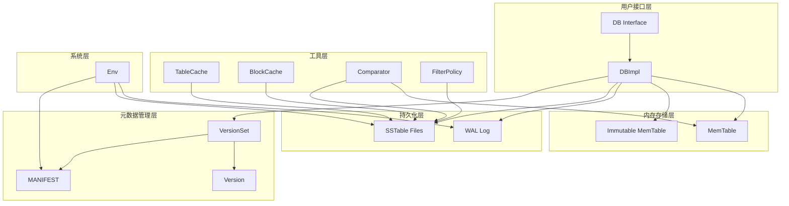

### 2.2 数据流向图

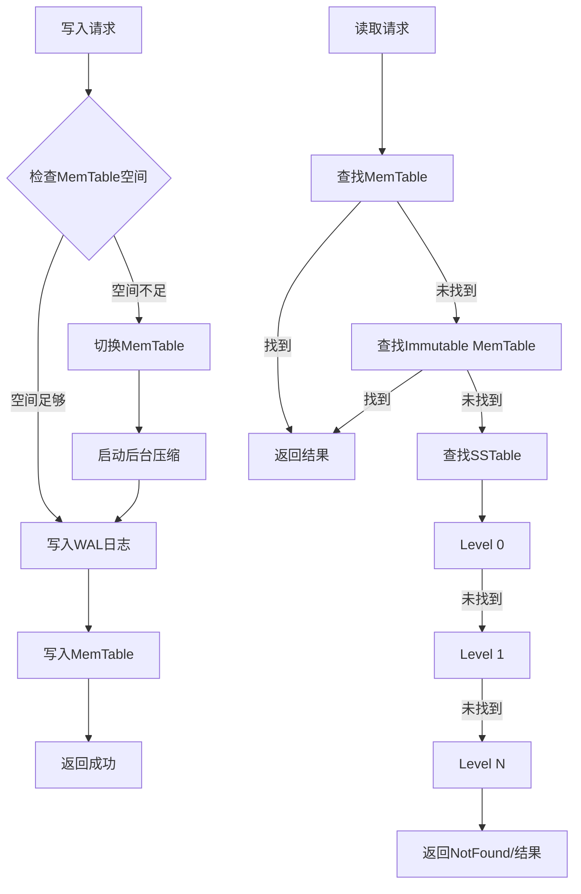

## 3. 核心模块详解

### 3.1 内存存储模块

#### MemTable架构
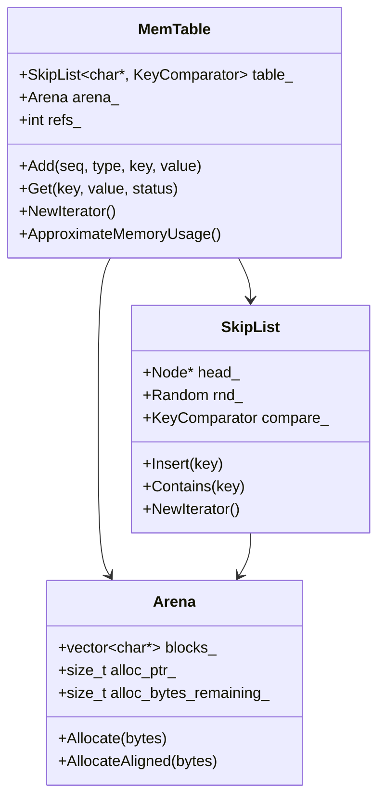

**MemTable特性分析**:
- **数据结构**: 使用跳表（SkipList）实现，支持高效的有序插入和查找
- **内存管理**: Arena内存池避免频繁的malloc/free操作
- **并发控制**: 支持单写多读，通过引用计数管理生命周期
- **内存限制**: 默认4MB大小，超过后切换为Immutable状态

### 3.2 持久化存储模块

#### SSTable文件结构
```mermaid
graph TD
    subgraph "SSTable文件格式"
        A[Data Block 1] --> B[Data Block 2]
        B --> C[Data Block N]
        C --> D[MetaIndex Block]
        D --> E[Index Block]
        E --> F[Footer]
    end
    
    subgraph "Block内部结构"
        G[Record 1] --> H[Record 2]
        H --> I[Record N]
        I --> J[Restart Points]
        J --> K[Restart Count]
        K --> L[CRC32]
    end
    
    subgraph "记录格式"
        M[Shared Key Len] --> N[Unshared Key Len]
        N --> O[Value Len]
        O --> P[Unshared Key]
        P --> Q[Value]
    end
```

#### 多级存储结构
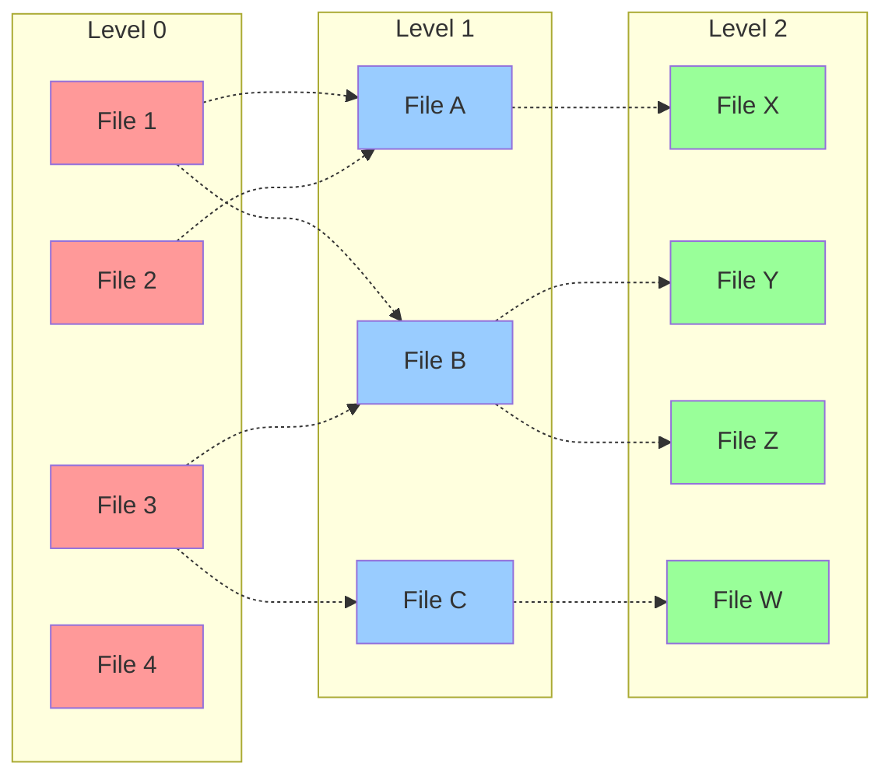

**存储特性分析**:
- **Level 0**: 文件可能重叠，直接从MemTable压缩得到
- **Level 1+**: 文件不重叠，有序排列，便于查找
- **容量递增**: 每层容量是上一层的10倍（默认配置）
- **压缩策略**: 自动触发多级压缩，保持系统性能

### 3.3 版本管理模块

#### Version和VersionSet关系
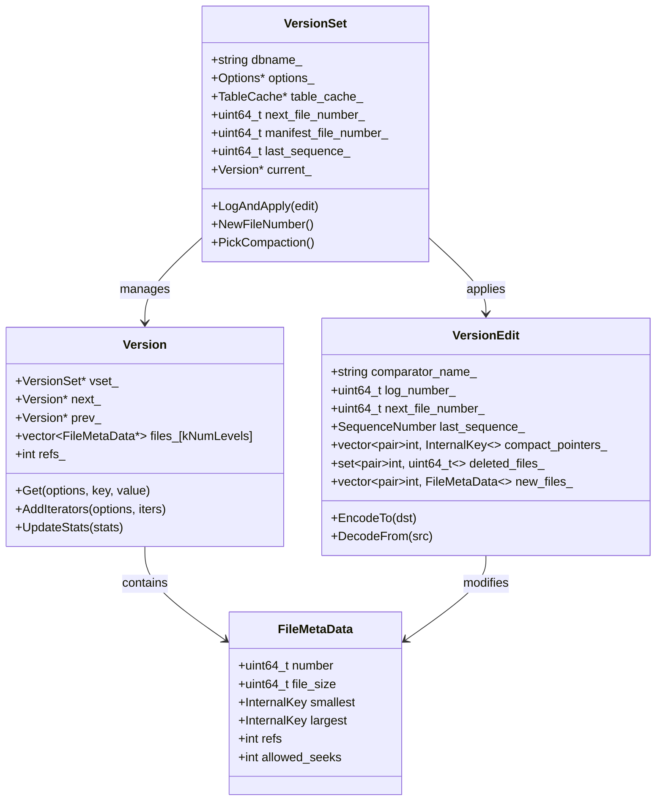

### 3.4 压缩管理模块

#### 压缩触发机制
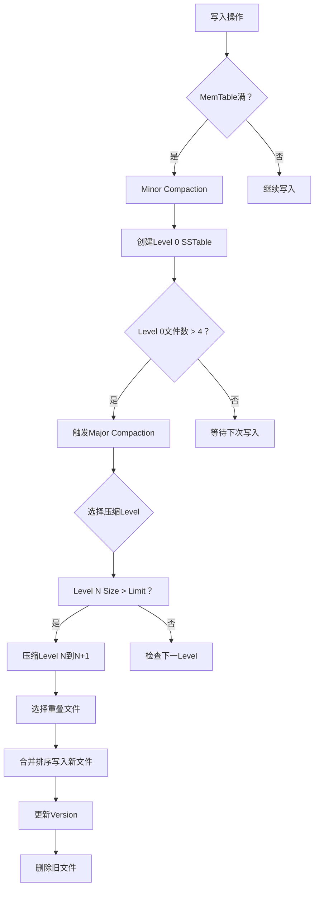

#### 压缩算法流程
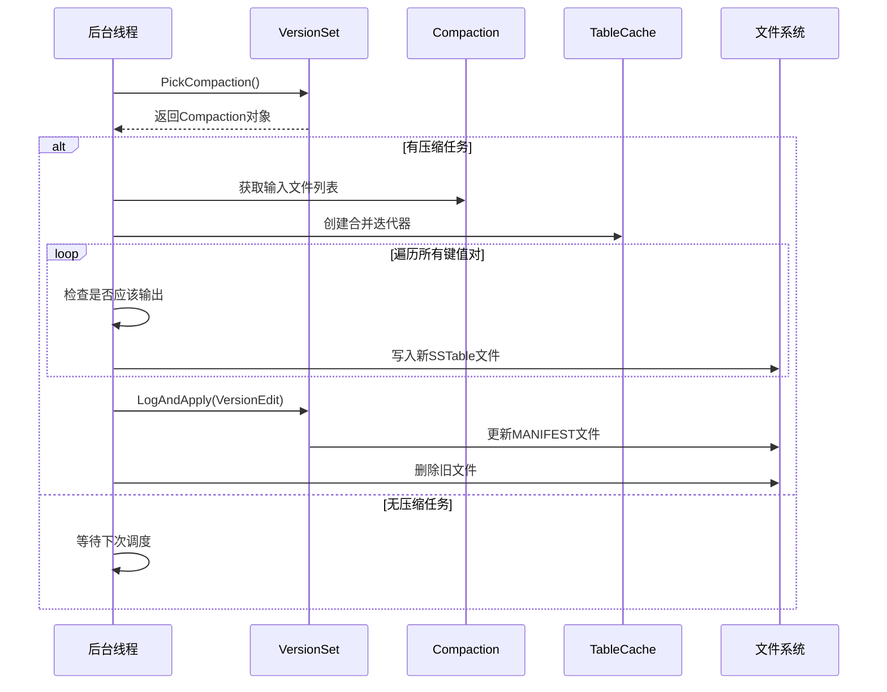

## 4. 关键算法分析

### 4.1 跳表算法
跳表是MemTable的核心数据结构，提供O(log n)的查找性能：

```cpp
// 文件: db/skiplist.h
template<typename Key, class Comparator>
class SkipList {
private:
    struct Node {
        Key const key;
        
        Node* Next(int n) {
            return reinterpret_cast<Node*>(next_[n].load(std::memory_order_acquire));
        }
        
        void SetNext(int n, Node* x) {
            next_[n].store(x, std::memory_order_release);
        }
        
        std::atomic<Node*> next_[1];  // 实际大小由层数决定
    };
    
    Node* head_;
    std::atomic<int> max_height_;
    Random rnd_;
    
public:
    void Insert(const Key& key) {
        Node* prev[kMaxHeight];
        Node* x = FindGreaterOrEqual(key, prev);
        
        int height = RandomHeight();
        if (height > GetMaxHeight()) {
            for (int i = GetMaxHeight(); i < height; i++) {
                prev[i] = head_;
            }
            max_height_.store(height, std::memory_order_relaxed);
        }
        
        x = NewNode(key, height);
        for (int i = 0; i < height; i++) {
            x->SetNext(i, prev[i]->Next(i));
            prev[i]->SetNext(i, x);
        }
    }
};
```

### 4.2 LSM压缩算法
LevelDB的压缩算法确保各Level的大小控制在合理范围：

```cpp
// 文件: db/version_set.cc
Compaction* VersionSet::PickCompaction() {
    Compaction* c;
    int level;
    
    // 基于大小的压缩
    const bool size_compaction = (current_->compaction_score_ >= 1);
    // 基于查找的压缩  
    const bool seek_compaction = (current_->file_to_compact_ != nullptr);
    
    if (size_compaction) {
        level = current_->compaction_level_;
        c = new Compaction(&options_, level);
        
        // 选择要压缩的文件
        for (size_t i = 0; i < current_->files_[level].size(); i++) {
            FileMetaData* f = current_->files_[level][i];
            if (compact_pointer_[level].empty() ||
                icmp_.Compare(f->largest.Encode(), compact_pointer_[level]) > 0) {
                c->inputs_[0].push_back(f);
                break;
            }
        }
    } else if (seek_compaction) {
        level = current_->file_to_compact_level_;
        c = new Compaction(&options_, level);
        c->inputs_[0].push_back(current_->file_to_compact_);
    } else {
        return nullptr;
    }
    
    SetupOtherInputs(c);
    return c;
}
```

## 5. 性能优化设计

### 5.1 写入路径优化


### 5.2 读取路径优化  
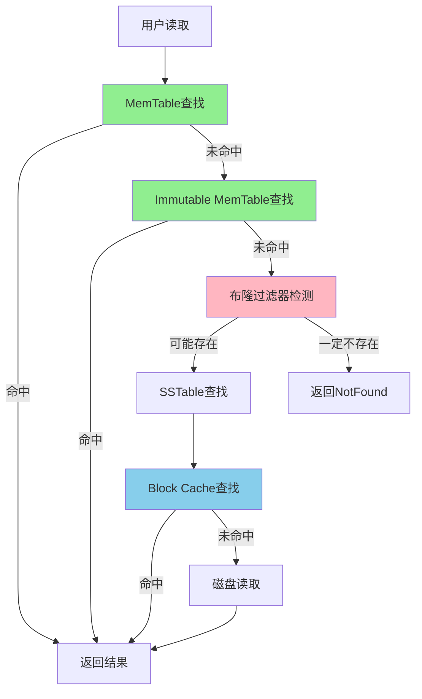

## 6. 并发控制机制

### 6.1 读写并发
- **写入串行化**: 所有写入操作通过单一队列串行化执行
- **读写并行**: 读操作不阻塞写操作，通过MVCC机制实现
- **快照隔离**: 使用序列号实现快照隔离级别

### 6.2 后台压缩并发
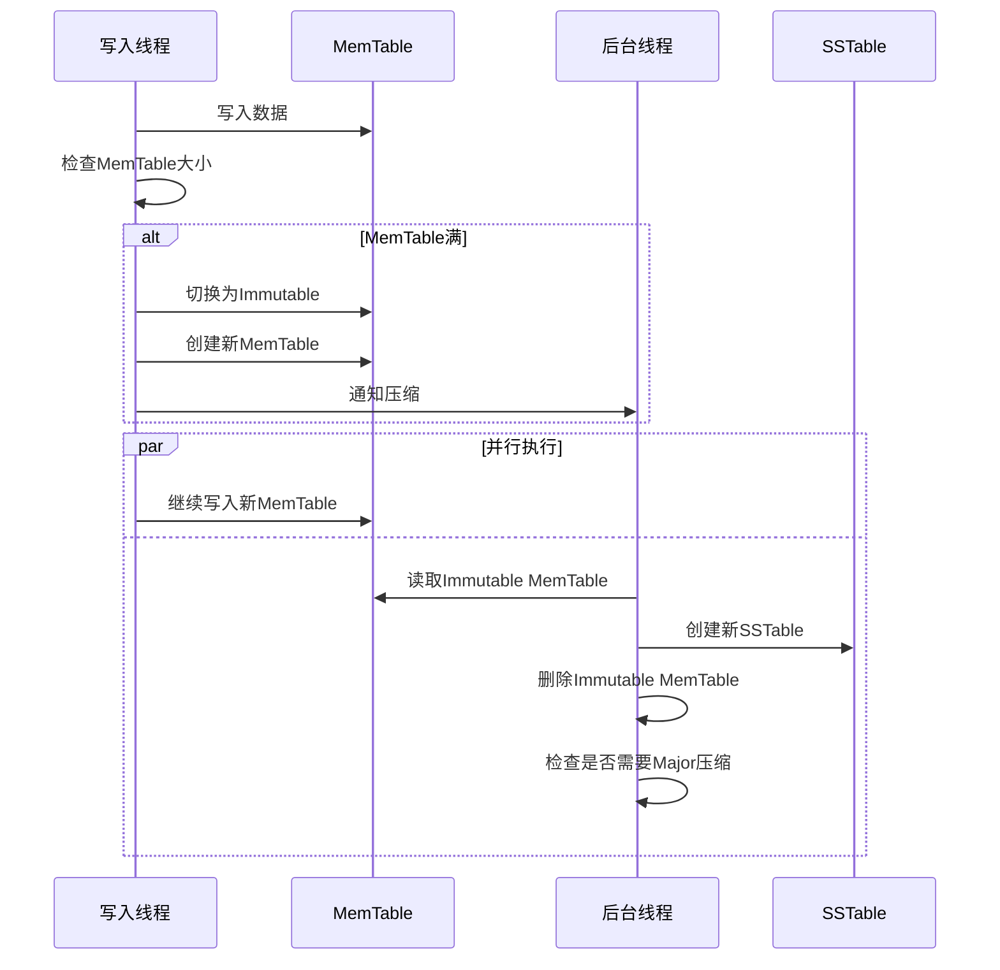

## 7. 容错和恢复机制

### 7.1 WAL日志恢复
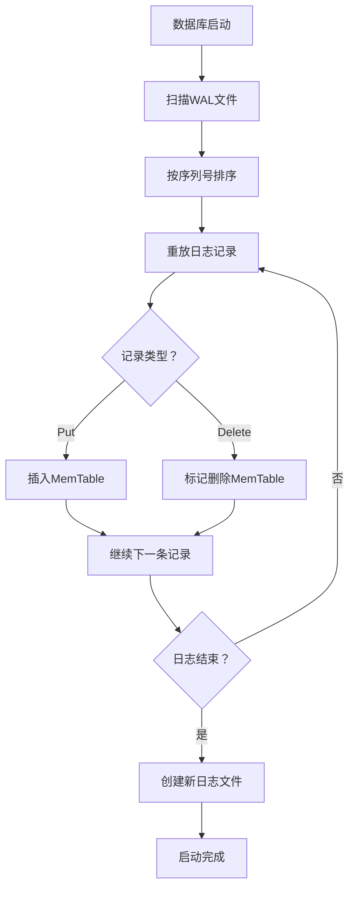

### 7.2 MANIFEST恢复
- **版本历史**: MANIFEST记录所有版本变更
- **检查点**: 定期写入完整版本信息
- **增量恢复**: 从最近检查点开始应用增量变更

## 8. 架构优势分析

### 8.1 写入优势
- **顺序写入**: WAL和SSTable都是顺序写入，充分利用磁盘性能
- **批量写入**: WriteBatch减少系统调用开销
- **异步压缩**: 压缩在后台执行，不阻塞前台写入

### 8.2 存储优势
- **分层存储**: 热数据在上层，冷数据在下层
- **增量压缩**: 只压缩重叠的文件，减少IO
- **空间回收**: 自动清理过期数据和文件

### 8.3 查询优势
- **内存优先**: 新数据在MemTable中，查询效率高
- **索引优化**: 每个SSTable都有索引，支持快速定位
- **缓存机制**: 多级缓存提升随机读性能

这种架构设计使得LevelDB在保持简单性的同时，实现了出色的写入性能和合理的读取性能，特别适合写多读少的应用场景。
