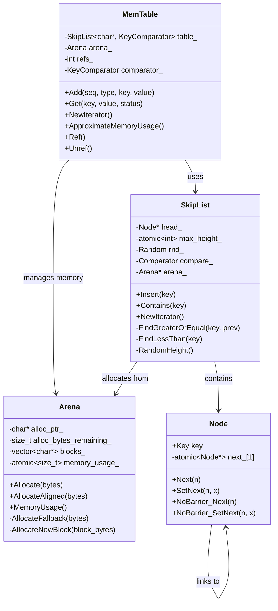
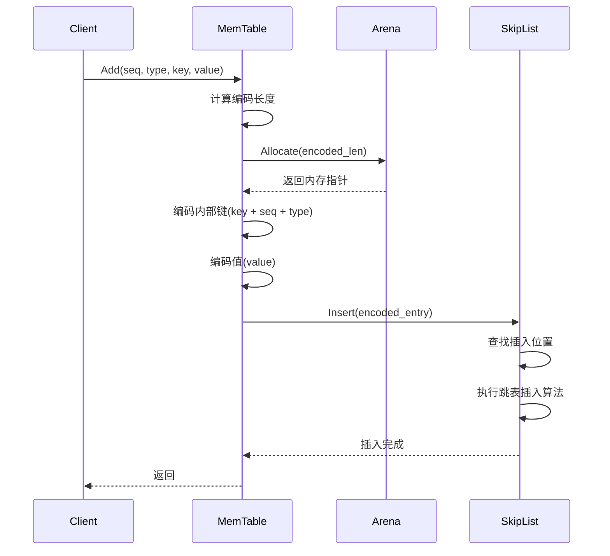
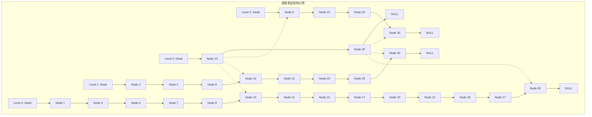
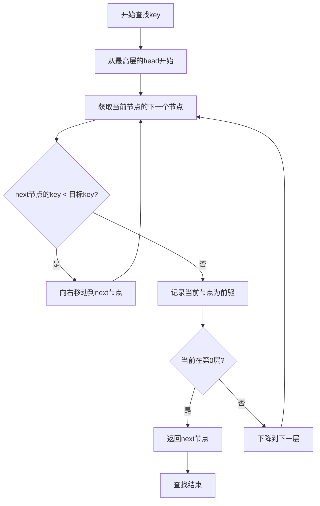
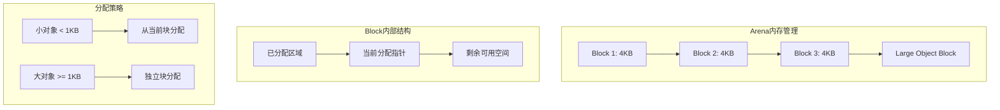
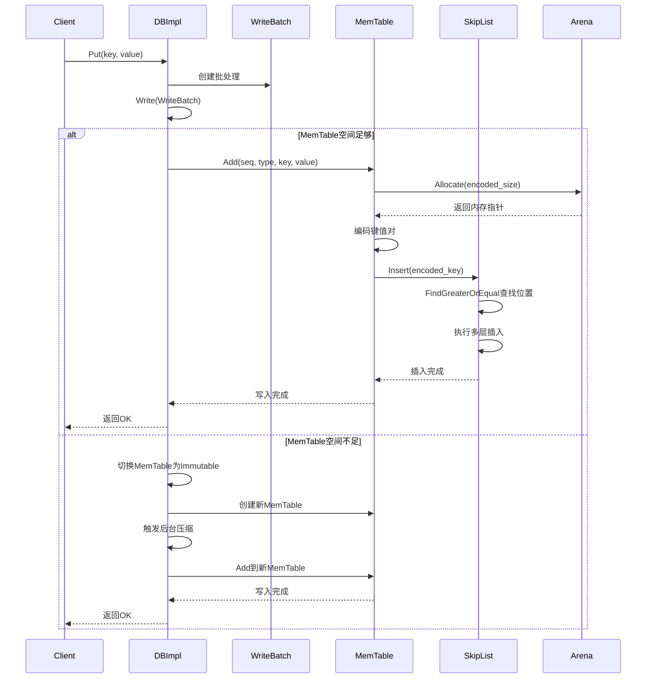
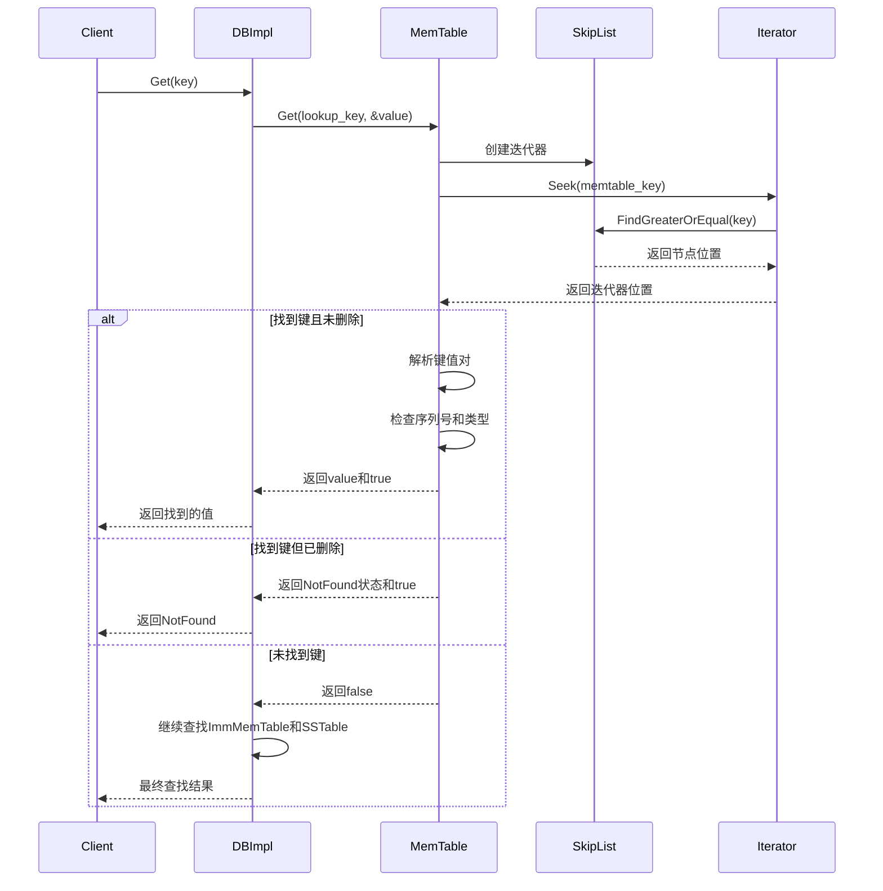

## 1. 模块概述

MemTable是LevelDB内存存储的核心组件，负责缓存最新写入的数据。它使用跳表（SkipList）作为底层数据结构，提供高效的有序存储和快速查找能力。MemTable是LSM-Tree架构中的最上层，所有写入操作首先进入MemTable，然后通过压缩过程逐步下沉到磁盘存储。

## 2. 模块架构图



## 3. 核心数据结构详解

### 3.1 MemTable类

#### 类定义和成员变量
```cpp
// 文件: db/memtable.h (第20-83行)
class MemTable {
 public:
  // MemTable引用计数管理
  explicit MemTable(const InternalKeyComparator& comparator);
  void Ref() { ++refs_; }
  void Unref() {
    --refs_;
    assert(refs_ >= 0);
    if (refs_ <= 0) {
      delete this;
    }
  }

  // 核心操作接口
  void Add(SequenceNumber seq, ValueType type, const Slice& key, const Slice& value);
  bool Get(const LookupKey& key, std::string* value, Status* s);
  Iterator* NewIterator();
  size_t ApproximateMemoryUsage();

 private:
  struct KeyComparator {
    const InternalKeyComparator comparator;
    explicit KeyComparator(const InternalKeyComparator& c) : comparator(c) {}
    int operator()(const char* a, const char* b) const;
  };

  typedef SkipList<const char*, KeyComparator> Table;

  KeyComparator comparator_;  // 键比较器
  int refs_;                  // 引用计数
  Arena arena_;               // 内存分配器
  Table table_;               // 跳表存储
};
```

**成员变量说明**:
- `table_`: 跳表实例，存储实际的键值数据
- `arena_`: 内存分配器，统一管理MemTable的内存分配
- `refs_`: 引用计数，用于多线程安全的生命周期管理
- `comparator_`: 键比较器，处理内部键的比较逻辑

#### 核心方法实现分析

##### Add方法 - 数据写入
```cpp
// 文件: db/memtable.cc (大约第80行)
void MemTable::Add(SequenceNumber s, ValueType type,
                   const Slice& key,
                   const Slice& value) {
  // 计算编码后键的长度
  // 格式: 内部键长度 + 内部键 + 值长度 + 值
  size_t key_size = key.size();
  size_t val_size = value.size();
  size_t internal_key_size = key_size + 8;  // +8 for sequence number and type
  
  const size_t encoded_len =
      VarintLength(internal_key_size) + internal_key_size +
      VarintLength(val_size) + val_size;
      
  // 从Arena分配内存
  char* buf = arena_.Allocate(encoded_len);
  char* p = EncodeVarint32(buf, internal_key_size);
  
  // 编码内部键（用户键 + 序列号 + 操作类型）
  std::memcpy(p, key.data(), key_size);
  p += key_size;
  EncodeFixed64(p, (s << 8) | type);
  p += 8;
  
  // 编码值
  p = EncodeVarint32(p, val_size);
  std::memcpy(p, value.data(), val_size);
  
  // 插入到跳表中
  table_.Insert(buf);
}
```

**Add方法执行流程**:


##### Get方法 - 数据查找
```cpp
// 文件: db/memtable.cc (大约第110行)
bool MemTable::Get(const LookupKey& key, std::string* value, Status* s) {
  Slice memkey = key.memtable_key();  // 获取MemTable键格式
  Table::Iterator iter(&table_);
  iter.Seek(memkey.data());
  
  if (iter.Valid()) {
    // 解析找到的条目
    const char* entry = iter.key();
    uint32_t key_length;
    const char* key_ptr = GetVarint32Ptr(entry, entry + 5, &key_length);
    
    // 比较用户键部分
    if (comparator_.comparator.user_comparator()->Compare(
            Slice(key_ptr, key_length - 8),
            key.user_key()) == 0) {
      // 检查序列号和类型
      const uint64_t tag = DecodeFixed64(key_ptr + key_length - 8);
      switch (static_cast<ValueType>(tag & 0xff)) {
        case kTypeValue: {
          // 解析值
          Slice v = GetLengthPrefixedSlice(key_ptr + key_length);
          value->assign(v.data(), v.size());
          return true;
        }
        case kTypeDeletion:
          *s = Status::NotFound(Slice());
          return true;
      }
    }
  }
  return false;
}
```

### 3.2 SkipList跳表实现

#### 跳表结构特点
跳表是一种概率性数据结构，通过多层链表实现快速查找：



#### Node结构实现
```cpp
// 文件: db/skiplist.h (第146-179行)
template <typename Key, class Comparator>
struct SkipList<Key, Comparator>::Node {
  explicit Node(const Key& k) : key(k) {}

  Key const key;  // 节点存储的键（不可变）

  // 线程安全的链接操作
  Node* Next(int n) {
    assert(n >= 0);
    // 使用acquire语义确保看到完全初始化的节点
    return next_[n].load(std::memory_order_acquire);
  }
  
  void SetNext(int n, Node* x) {
    assert(n >= 0);
    // 使用release语义确保其他线程看到完全初始化的节点
    next_[n].store(x, std::memory_order_release);
  }

  // 无屏障版本，用于某些安全的场景
  Node* NoBarrier_Next(int n) {
    return next_[n].load(std::memory_order_relaxed);
  }
  
  void NoBarrier_SetNext(int n, Node* x) {
    next_[n].store(x, std::memory_order_relaxed);
  }

private:
  // 可变长度数组，存储各层的next指针
  std::atomic<Node*> next_[1];
};
```

#### 核心算法实现

##### 随机高度生成
```cpp
// 文件: db/skiplist.h (第242-252行)
template <typename Key, class Comparator>
int SkipList<Key, Comparator>::RandomHeight() {
  // 每层向上的概率是1/4
  static const unsigned int kBranching = 4;
  int height = 1;
  
  // 随机决定节点高度，最大为kMaxHeight(12)
  while (height < kMaxHeight && ((rnd_.Next() % kBranching) == 0)) {
    height++;
  }
  assert(height > 0);
  assert(height <= kMaxHeight);
  return height;
}
```

**随机高度分布特性**:
- Level 0: 100%的节点
- Level 1: 25%的节点  
- Level 2: 6.25%的节点
- Level 3: 1.56%的节点
- 依此类推，形成金字塔结构

##### 查找算法
```cpp
// 文件: db/skiplist.h (第262-281行)
template <typename Key, class Comparator>
typename SkipList<Key, Comparator>::Node*
SkipList<Key, Comparator>::FindGreaterOrEqual(const Key& key, Node** prev) const {
  Node* x = head_;
  int level = GetMaxHeight() - 1;  // 从最高层开始
  
  while (true) {
    Node* next = x->Next(level);
    if (KeyIsAfterNode(key, next)) {
      // 继续在当前层向右搜索
      x = next;
    } else {
      // 记录前驱节点（用于插入）
      if (prev != nullptr) prev[level] = x;
      if (level == 0) {
        return next;  // 找到目标或第一个大于key的节点
      } else {
        // 下降到下一层
        level--;
      }
    }
  }
}
```

**查找算法流程图**:


##### 插入算法
```cpp
// 文件: db/skiplist.h (第337-368行)
template <typename Key, class Comparator>
void SkipList<Key, Comparator>::Insert(const Key& key) {
  Node* prev[kMaxHeight];
  Node* x = FindGreaterOrEqual(key, prev);  // 查找插入位置

  // 确保不插入重复键
  assert(x == nullptr || !Equal(key, x->key));

  int height = RandomHeight();  // 随机确定新节点高度
  
  // 如果新节点高度超过当前最大高度
  if (height > GetMaxHeight()) {
    for (int i = GetMaxHeight(); i < height; i++) {
      prev[i] = head_;  // 新层的前驱是head
    }
    max_height_.store(height, std::memory_order_relaxed);
  }

  x = NewNode(key, height);
  // 在每一层插入新节点
  for (int i = 0; i < height; i++) {
    x->NoBarrier_SetNext(i, prev[i]->NoBarrier_Next(i));
    prev[i]->SetNext(i, x);  // 使用release语义确保其他线程看到完整初始化
  }
}
```

### 3.3 Arena内存管理器

#### Arena设计目标
- **批量分配**: 减少malloc/free系统调用次数
- **内存对齐**: 确保分配的内存满足对齐要求
- **简单回收**: 整体释放，无需单独释放每个对象
- **线程安全**: 支持并发访问内存使用统计

#### 核心实现
```cpp
// 文件: util/arena.h (第55-67行)
inline char* Arena::Allocate(size_t bytes) {
  // 不允许0字节分配
  assert(bytes > 0);
  
  // 如果当前块有足够空间
  if (bytes <= alloc_bytes_remaining_) {
    char* result = alloc_ptr_;
    alloc_ptr_ += bytes;
    alloc_bytes_remaining_ -= bytes;
    return result;
  }
  
  // 空间不足，需要分配新块
  return AllocateFallback(bytes);
}
```

```cpp
// 文件: util/arena.cc (大约第30行)  
char* Arena::AllocateFallback(size_t bytes) {
  if (bytes > kBlockSize / 4) {
    // 大对象直接分配独立块
    char* result = AllocateNewBlock(bytes);
    return result;
  }

  // 分配新的标准块
  alloc_ptr_ = AllocateNewBlock(kBlockSize);
  alloc_bytes_remaining_ = kBlockSize;

  char* result = alloc_ptr_;
  alloc_ptr_ += bytes;
  alloc_bytes_remaining_ -= bytes;
  return result;
}
```

#### Arena内存布局


## 4. 模块时序图

### 4.1 写入操作时序


### 4.2 读取操作时序


## 5. 性能特性分析

### 5.1 时间复杂度
| 操作 | 平均时间复杂度 | 最坏时间复杂度 | 说明 |
|------|---------------|---------------|------|
| Insert | O(log n) | O(log n) | 跳表插入操作 |
| Search | O(log n) | O(log n) | 跳表查找操作 |
| Delete | O(log n) | O(log n) | 标记删除，实际是插入删除标记 |
| Iterator | O(1) | O(1) | 迭代器移动操作 |

### 5.2 空间复杂度
- **跳表节点**: 每个节点平均1.33个指针（几何级数求和）
- **内存开销**: 约为标准链表的33%额外开销
- **Arena管理**: 4KB块大小，减少内存碎片

### 5.3 并发性能
```cpp
// 线程安全设计原则
// 1. 写入需要外部同步（通过DBImpl的mutex_保证）
// 2. 读取无需同步，通过原子操作和内存屏障保证一致性
// 3. 引用计数管理MemTable生命周期

// 内存屏障使用示例
void SetNext(int n, Node* x) {
    // release语义：确保x的初始化对其他线程可见
    next_[n].store(x, std::memory_order_release);
}

Node* Next(int n) {
    // acquire语义：确保看到完全初始化的节点
    return next_[n].load(std::memory_order_acquire);
}
```

## 6. 优化技巧和最佳实践

### 6.1 内存优化
1. **Arena池化**: 统一内存管理，减少碎片
2. **对齐分配**: 提升缓存性能
3. **批量释放**: 整个MemTable释放时一次性回收所有内存

### 6.2 并发优化
1. **无锁读取**: 利用跳表的天然线程安全特性
2. **内存屏障**: 精确控制内存可见性
3. **引用计数**: 安全的生命周期管理

### 6.3 查找优化
1. **概率平衡**: 随机高度保证期望性能
2. **前向迭代友好**: Level 0链表保证顺序访问效率
3. **缓存友好**: 相邻节点在内存中紧密排列

## 7. 常见问题和解决方案

### 7.1 内存泄漏问题
```cpp
// 问题：MemTable未正确释放
// 解决方案：使用引用计数
MemTable* mem = new MemTable(comparator);
mem->Ref();  // 增加引用
// ... 使用MemTable
mem->Unref();  // 减少引用，可能触发析构
```

### 7.2 并发访问问题
```cpp
// 问题：读写并发可能看到不一致状态
// 解决方案：使用适当的内存序
std::atomic<Node*> next_[1];

// 写入时使用release语义
next_[level].store(new_node, std::memory_order_release);

// 读取时使用acquire语义  
Node* node = next_[level].load(std::memory_order_acquire);
```

### 7.3 性能调优
```cpp
// 1. 调整跳表分支因子（默认4，可调整为2-8）
static const unsigned int kBranching = 4;

// 2. 调整Arena块大小（默认4KB）
static const int kBlockSize = 4096;

// 3. 调整MemTable大小阈值（默认4MB）
options.write_buffer_size = 4 * 1024 * 1024;
```

MemTable模块是LevelDB高性能的关键组件，通过跳表和Arena的精妙结合，实现了高效的内存存储和管理机制。
