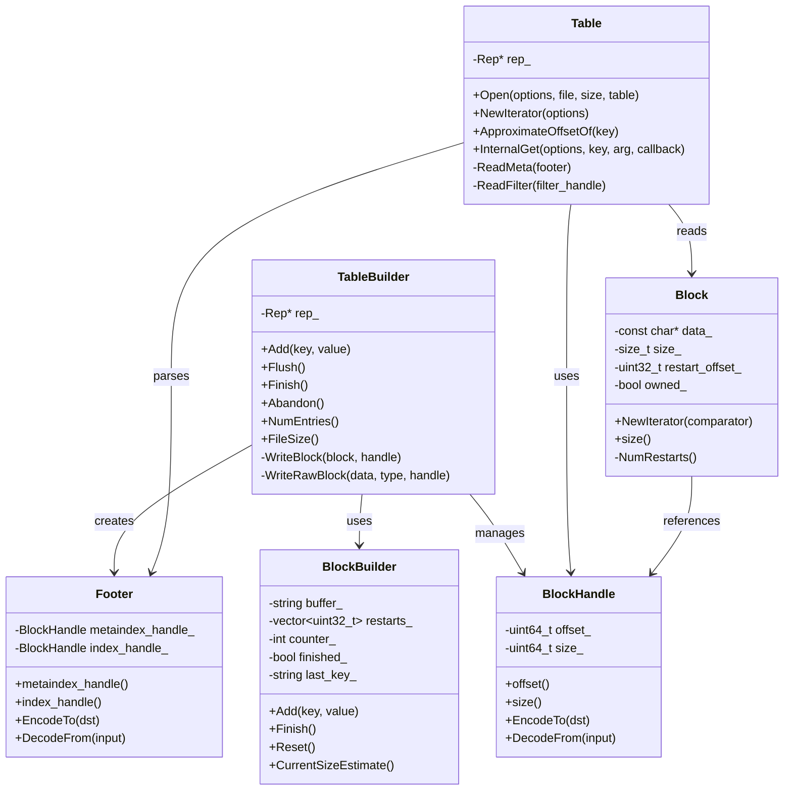
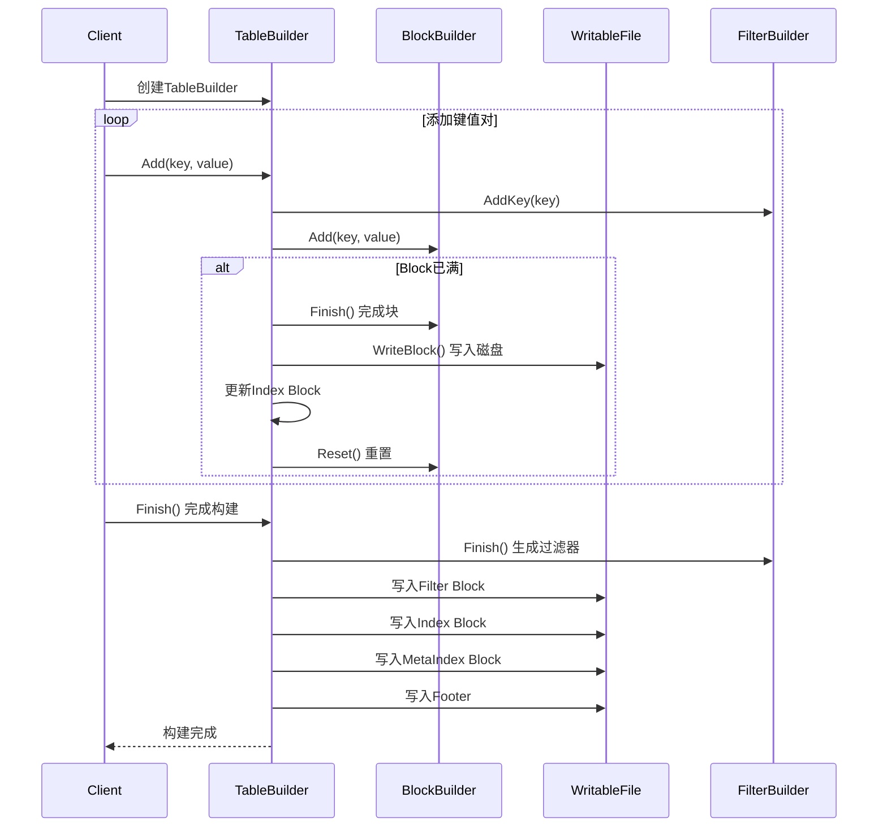
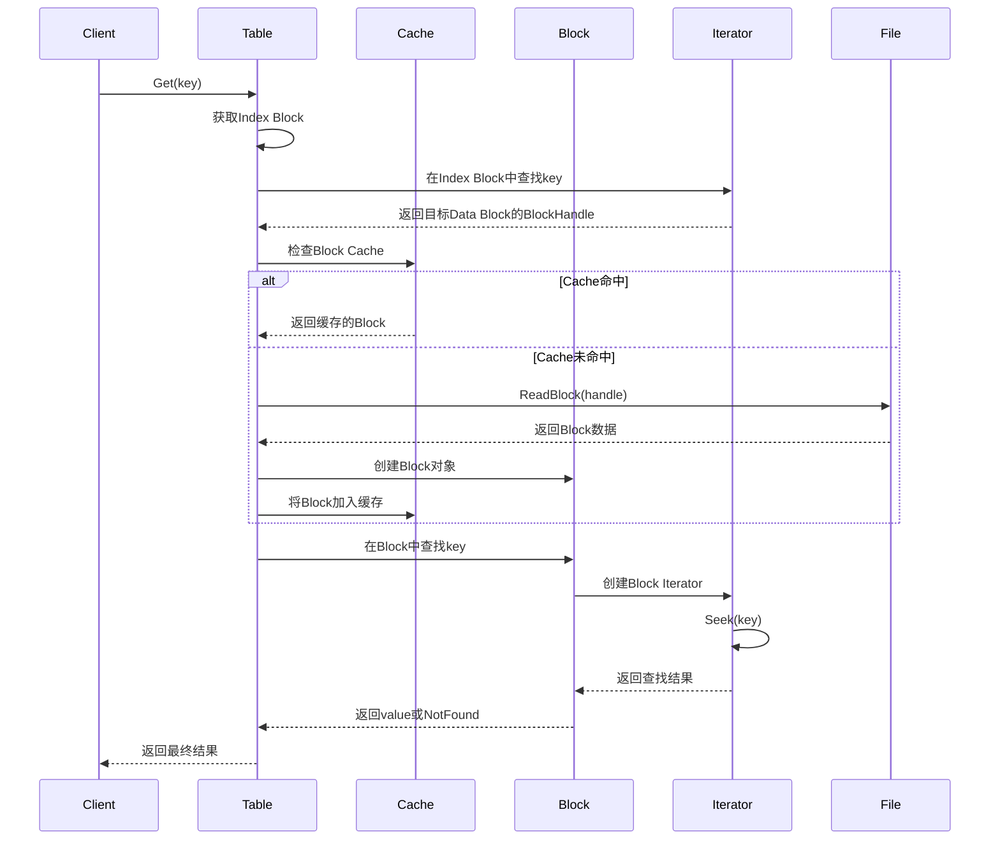
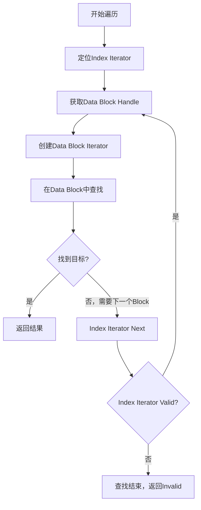
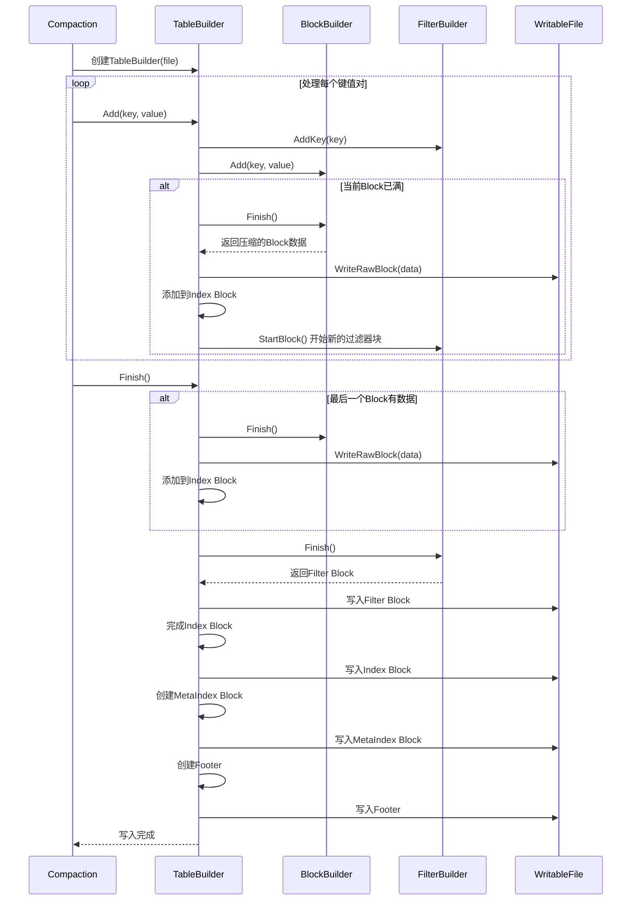
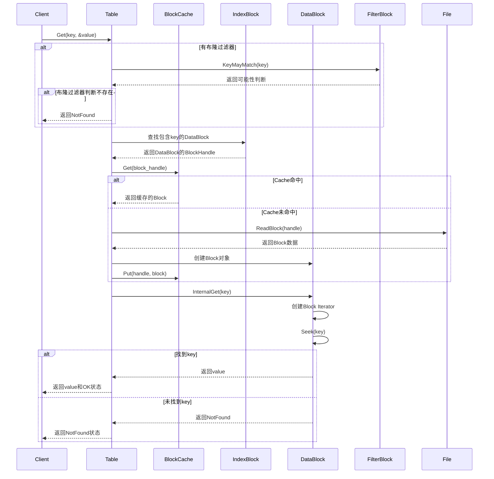

## 1. 模块概述

SSTable（Sorted String Table）是LevelDB的核心持久化存储格式。它是一个不可变的、有序的键值对文件格式，提供了高效的随机访问和顺序扫描能力。SSTable采用分块存储、索引加速、压缩优化等技术，实现了存储空间和访问性能的良好平衡。

## 2. 模块架构图



## 3. SSTable文件格式详解

### 3.1 整体文件结构

```mermaid
graph TD
    subgraph "SSTable文件布局"
        A[Data Block 1] --> B[Data Block 2]
        B --> C[Data Block N]
        C --> D[Filter Block]
        D --> E[MetaIndex Block]
        E --> F[Index Block]
        F --> G[Footer - 48字节]
    end
    
    subgraph "Footer结构"
        H[MetaIndex BlockHandle - 20字节] --> I[Index BlockHandle - 20字节]
        I --> J[Padding - 0字节]
        J --> K[Magic Number - 8字节]
    end
    
    subgraph "BlockHandle结构"
        L[Offset - 变长编码] --> M[Size - 变长编码]
    end
```



### 3.2 Data Block格式

```mermaid
graph TD
    subgraph "Data Block内部结构"
        A[Record 1] --> B[Record 2]
        B --> C[Record N]
        C --> D[Restart Point 1 - 4字节]
        D --> E[Restart Point 2 - 4字节]
        E --> F[Restart Point N - 4字节]
        F --> G[Restart Count - 4字节]
        G --> H[Block Trailer - 5字节]
    end
    
    subgraph "Record格式（前缀压缩）"
        I[Shared Key Length - 变长] --> J[Unshared Key Length - 变长]
        J --> K[Value Length - 变长]
        K --> L[Unshared Key Data]
        L --> M[Value Data]
    end
    
    subgraph "Block Trailer格式"
        N[Compression Type - 1字节] --> O[CRC32 - 4字节]
    end
```



#### Record编码实现

```cpp
// 文件: table/block_builder.cc (大约第30行)
void BlockBuilder::Add(const Slice& key, const Slice& value) {
  Slice last_key_piece(last_key_);
  assert(!finished_);
  assert(counter_ <= options_->block_restart_interval);
  assert(buffer_.empty() || options_->comparator->Compare(key, last_key_piece) > 0);
  
  size_t shared = 0;
  if (counter_ < options_->block_restart_interval) {
    // 计算与前一个键的共同前缀长度
    const size_t min_length = std::min(last_key_piece.size(), key.size());
    while ((shared < min_length) && (last_key_piece[shared] == key[shared])) {
      shared++;
    }
  } else {
    // 达到重启间隔，记录重启点
    restarts_.push_back(buffer_.size());
    counter_ = 0;
  }

  const size_t non_shared = key.size() - shared;

  // 编码：shared_len, non_shared_len, value_len, non_shared_key, value
  PutVarint32(&buffer_, shared);
  PutVarint32(&buffer_, non_shared);
  PutVarint32(&buffer_, value.size());

  buffer_.append(key.data() + shared, non_shared);
  buffer_.append(value.data(), value.size());

  last_key_.resize(shared);
  last_key_.append(key.data() + shared, non_shared);
  assert(Slice(last_key_) == key);
  counter_++;
}
```

**前缀压缩效果示例**:

```
原始键序列:
  user001
  user002  
  user003
  
编码后记录:
  Record 1: shared=0, unshared=7, "user001"
  Record 2: shared=4, unshared=3, "002"      // 压缩了"user"前缀
  Record 3: shared=4, unshared=3, "003"      // 压缩了"user"前缀
```

### 3.3 Index Block格式

Index Block为Data Block提供索引，加速查找过程：

```cpp
// 文件: table/table_builder.cc (大约第150行)
void TableBuilder::WriteBlock(BlockBuilder* block, BlockHandle* handle) {
  // 写入数据块
  Rep* r = rep_;
  Slice raw = block->Finish();
  
  Slice block_contents;
  CompressionType type = r->options.compression;
  
  // 根据配置进行压缩
  switch (type) {
    case kNoCompression:
      block_contents = raw;
      break;
    case kSnappyCompression: {
      std::string* compressed = &r->compressed_output;
      if (port::Snappy_Compress(raw.data(), raw.size(), compressed) &&
          compressed->size() < raw.size() - (raw.size() / 8u)) {
        block_contents = *compressed;
      } else {
        // 压缩效果不好，使用未压缩版本
        block_contents = raw;
        type = kNoCompression;
      }
      break;
    }
  }
  
  WriteRawBlock(block_contents, type, handle);
  r->compressed_output.clear();
  block->Reset();
}
```

Index Block记录格式：

```
Key: 大于等于对应Data Block中最大键的最小键
Value: Data Block的BlockHandle（offset + size）
```

### 3.4 Filter Block（布隆过滤器）

Filter Block提供快速的"不存在"判断，减少无效的磁盘访问：

```cpp
// 文件: table/filter_block.h (大约第30行)  
class FilterBlockBuilder {
 public:
  explicit FilterBlockBuilder(const FilterPolicy*);
  
  void StartBlock(uint64_t block_offset);
  void AddKey(const Slice& key);
  Slice Finish();

 private:
  void GenerateFilter();

  const FilterPolicy* policy_;        // 过滤器策略（如布隆过滤器）
  std::string keys_;                 // 扁平化的键数据
  std::vector<size_t> start_;        // 每个键在keys_中的起始位置
  std::string result_;               // 生成的过滤器数据
  std::vector<Slice> tmp_keys_;      // 临时键列表
  std::vector<uint32_t> filter_offsets_;  // 每个过滤器的偏移量
};
```

## 4. 核心算法实现

### 4.1 SSTable构建流程



### 4.2 SSTable读取流程



### 4.3 两级迭代器实现

SSTable使用两级迭代器来高效遍历：

```cpp
// 文件: table/two_level_iterator.cc (大约第20行)
class TwoLevelIterator : public Iterator {
 public:
  TwoLevelIterator(
      Iterator* index_iter,
      BlockFunction block_function,
      void* arg,
      const ReadOptions& options);

  ~TwoLevelIterator() override;

  void Seek(const Slice& target) override;
  void SeekToFirst() override;
  void SeekToLast() override;
  void Next() override;
  void Prev() override;

  bool Valid() const override {
    return data_iter_.Valid();
  }
  
  Slice key() const override {
    assert(Valid());
    return data_iter_.key();
  }
  
  Slice value() const override {
    assert(Valid());
    return data_iter_.value();
  }

 private:
  void SaveError(const Status& s) {
    if (status_.ok() && !s.ok()) status_ = s;
  }
  
  void SkipEmptyDataBlocksForward();
  void SkipEmptyDataBlocksBackward();
  void SetDataIterator(Iterator* data_iter);
  void InitDataBlock();

  BlockFunction block_function_;  // 根据index值创建data iterator的函数
  void* arg_;                     // 传递给block_function_的参数
  const ReadOptions options_;
  Status status_;
  IteratorWrapper index_iter_;    // Index Block迭代器
  IteratorWrapper data_iter_;     // 当前Data Block迭代器
  std::string data_block_handle_; // 当前data block的handle
};
```

**两级迭代器执行逻辑**:



## 5. 性能优化技术

### 5.1 前缀压缩

前缀压缩通过存储键的共同前缀来减少存储空间：

```cpp
// 前缀压缩示例
原始数据:
  "userdata001" -> "value1"  
  "userdata002" -> "value2"
  "userdata003" -> "value3"

压缩后存储:
  Record 1: shared=0, unshared=11, "userdata001", "value1"
  Record 2: shared=8, unshared=3, "002", "value2"           // 节省8字节
  Record 3: shared=8, unshared=3, "003", "value3"           // 节省8字节

压缩率计算:
  原始大小: 11*3 = 33字节（键部分）
  压缩大小: 11 + 3 + 3 = 17字节（键部分）  
  压缩率: 48%
```

### 5.2 重启点机制

重启点（Restart Points）平衡压缩率和随机访问性能：

```cpp
// 文件: table/block_builder.cc
// 重启间隔配置（默认16）
const int kDefaultBlockRestartInterval = 16;

// 重启点的作用：
// 1. 每16个记录设置一个重启点
// 2. 重启点处的键不使用前缀压缩
// 3. 支持在Block内进行二分查找
```

**重启点效果示意**:

```
Record 0: [restart] "apple" -> "value0"
Record 1: shared=4, "e1" -> "value1"      // 前缀："apple" -> "apple1"
...
Record 15: shared=4, "e15" -> "value15"
Record 16: [restart] "banana" -> "value16"  // 新重启点，完整键
Record 17: shared=6, "a2" -> "value17"    // 前缀："banana" -> "banana2"
```

### 5.3 布隆过滤器优化

```cpp
// 文件: util/bloom.cc (大约第40行)
class BloomFilterPolicy : public FilterPolicy {
 public:
  explicit BloomFilterPolicy(int bits_per_key) : bits_per_key_(bits_per_key) {
    // 计算最优哈希函数个数: k = ln(2) * bits_per_key
    k_ = static_cast<size_t>(bits_per_key * 0.69);
    if (k_ < 1) k_ = 1;
    if (k_ > 30) k_ = 30;
  }

  void CreateFilter(const Slice* keys, int n, std::string* dst) const override {
    // 计算布隆过滤器位数组大小
    size_t bits = n * bits_per_key_;
    if (bits < 64) bits = 64;
    
    size_t bytes = (bits + 7) / 8;
    bits = bytes * 8;  // 向上对齐到字节边界

    const size_t init_size = dst->size();
    dst->resize(init_size + bytes, 0);
    dst->push_back(static_cast<char>(k_));  // 记录哈希函数个数
    
    char* array = &(*dst)[init_size];
    for (int i = 0; i < n; i++) {
      uint32_t h = BloomHash(keys[i]);
      const uint32_t delta = (h >> 17) | (h << 15);  // 旋转哈希
      for (size_t j = 0; j < k_; j++) {
        const uint32_t bitpos = h % bits;
        array[bitpos/8] |= (1 << (bitpos % 8));  // 设置对应位
        h += delta;
      }
    }
  }

  bool KeyMayMatch(const Slice& key, const Slice& bloom_filter) const override {
    const size_t len = bloom_filter.size();
    if (len < 2) return false;

    const char* array = bloom_filter.data();
    const size_t bits = (len - 1) * 8;
    const size_t k = array[len-1];  // 读取哈希函数个数
    
    if (k > 30) return true;  // 错误格式，保守返回可能存在

    uint32_t h = BloomHash(key);
    const uint32_t delta = (h >> 17) | (h << 15);
    for (size_t j = 0; j < k; j++) {
      const uint32_t bitpos = h % bits;
      if ((array[bitpos/8] & (1 << (bitpos % 8))) == 0) return false;
      h += delta;
    }
    return true;  // 可能存在
  }

 private:
  size_t bits_per_key_;  // 每个键分配的位数
  size_t k_;             // 哈希函数个数
};
```

## 6. 模块时序图

### 6.1 SSTable写入时序



### 6.2 SSTable读取时序



## 7. 性能特性分析

### 7.1 读取性能
| 操作 | 时间复杂度 | 说明 |
|------|------------|------|
| 随机读 | O(log B) | B为Block数量，通过Index Block定位 |
| 顺序读 | O(1) | 迭代器顺序遍历，摊销成本 |
| 范围查询 | O(log B + N) | N为结果数量 |

### 7.2 空间效率
- **前缀压缩**: 平均节省30-50%键存储空间
- **布隆过滤器**: 每个键约10-12位额外开销，95%以上准确率
- **块压缩**: Snappy压缩，平均压缩比60-80%

### 7.3 写入性能
- **顺序写入**: 所有数据按顺序写入，IO效率最优
- **批量构建**: 一次性构建整个SSTable文件
- **压缩异步**: 在后台进程中执行，不阻塞前台操作

## 8. 优化建议和最佳实践

### 8.1 配置优化

```cpp
// Block大小调优（默认4KB）
options.block_size = 64 * 1024;  // 64KB，适合大值场景

// 重启间隔调优（默认16）  
options.block_restart_interval = 32;  // 增大间隔，提高压缩率

// 布隆过滤器配置
options.filter_policy = leveldb::NewBloomFilterPolicy(10);  // 每键10位
```

### 8.2 使用模式优化
1. **顺序读取优化**: 使用迭代器而非随机Get
2. **缓存预热**: 预先加载热点Block到缓存
3. **过滤器调优**: 根据假阳性率要求调整布隆过滤器位数

### 8.3 监控指标

```cpp
// 关键性能指标
std::string stats;
db->GetProperty("leveldb.stats", &stats);

// 监控项目：
// - Block cache命中率
// - 布隆过滤器节省的IO次数  
// - 平均压缩比
// - 各Level的文件数量和大小
```

SSTable模块是LevelDB存储引擎的核心，通过精心设计的文件格式和多项优化技术，实现了高效的持久化存储和快速的数据访问能力。
